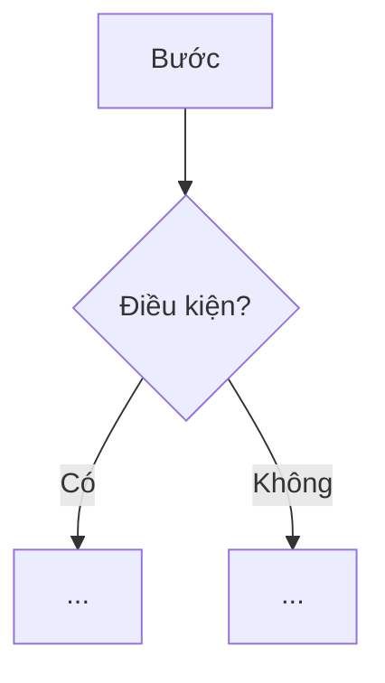
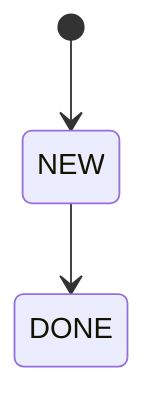
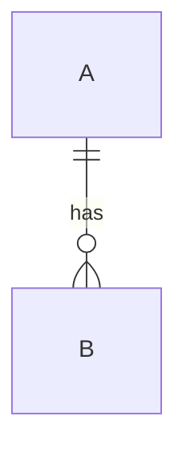

# SRS — <Tên hệ thống / tính năng>

**<Một câu: hệ thống làm gì, cho ai, để đạt điều gì>**

| | |
|---|---|
| Phiên bản | 0.1 |
| Trạng thái | Draft · In review · Approved (G1) |
| Owner (PO) | |
| Reviewer | |
| Nguồn | <yêu cầu thô / biên bản / ticket — có link> |
| Last update | <YYYY-MM-DD> · PO |

> **TL;DR** — <3–5 dòng: vấn đề · giải pháp ở mức nghiệp vụ · phạm vi MVP · chỉ số thành công chính>

<!-- Cách viết: mỗi mục trả lời đúng 1 câu hỏi. Ưu tiên bảng. Mỗi dòng 1 ý. Không mô tả kỹ thuật (bảng DB,
framework, endpoint) — đó là Tech Spec. Mục không áp dụng: ghi "N/A — <lý do>", không xoá. -->

---

## 1. Giới thiệu
<!-- Tài liệu này để làm gì, ai đọc, phạm vi tới đâu. -->

**Mục đích & người đọc:** <cơ sở cho thiết kế/phát triển/kiểm thử/nghiệm thu> · Người đọc: <...>

| Trong phạm vi | Ngoài phạm vi (giai đoạn này) |
|---|---|
| | |

**Thuật ngữ**

| Thuật ngữ | Nghĩa |
|---|---|

**Tham chiếu:** <tài liệu, API đối tác, quy định>

## 2. Bối cảnh & bài toán
<!-- Vì sao phải làm. Người đọc phải hiểu nỗi đau trước khi thấy giải pháp. -->

**Hiện tại (AS-IS):**
1. <bước hiện tại>

| # | Vấn đề | Hệ quả |
|---|---|---|
| P1 | | |

| Mục tiêu | Chỉ số | Hiện tại | Mục tiêu |
|---|---|---|---|
| | | | |

## 3. Stakeholder & tác nhân

| Stakeholder | Quan tâm chính |
|---|---|

| Tác nhân | Loại (người / hệ thống ngoài / thiết bị / job) | Vai trò |
|---|---|---|

## 4. Quy trình nghiệp vụ (TO-BE)
<!-- Mỗi quy trình: các bước B1..Bn + sơ đồ + bảng ngoại lệ. Có yêu cầu thô thì map bước thô → bước TO-BE. -->

### 4.1 <Tên quy trình>
- **B1.** <ai làm gì → hệ thống phản hồi gì>

| Mã | Ngoại lệ | Xử lý |
|---|---|---|
| EX-1 | | |

## 5. Yêu cầu chức năng
<!-- Nhóm theo module M01..Mnn. "Hệ thống phải…", đo/kiểm được. Ưu tiên MoSCoW: M (MVP) / S / C.
Cột Nguồn: vấn đề P# hoặc bước quy trình mà FR giải quyết. -->

### 5.1 M01 — <Tên module>

| ID | Yêu cầu | Ưu tiên | Nguồn |
|---|---|:---:|---|
| FR-01.01 | | M | P1 |

### 5.n Ma trận phân quyền

| Chức năng | <Role 1> | <Role 2> | <Role 3> |
|---|:---:|:---:|:---:|
| | ✔ | | Chỉ của mình |

## 6. Use case
<!-- Liệt kê tất cả, chỉ viết chi tiết use case chính / phức tạp. -->

| ID | Tên | Tác nhân chính | FR |
|---|---|---|---|
| UC-01 | | | |

### UC-01 — <Tên>

| | |
|---|---|
| Tác nhân | |
| Tiền điều kiện | |
| Kích hoạt | |
| Kết quả thành công | |

**Luồng chính:** 1. … 2. …
**Ngoại lệ:** <EX-… hoặc liệt kê>

## 7. Trạng thái & quy tắc nghiệp vụ

| ID | Quy tắc | Ví dụ |
|---|---|---|
| BR-01 | | |

## 8. Yêu cầu phi chức năng
<!-- Chỉ ghi yêu cầu có thật, luôn có con số và cách kiểm. -->

| ID | Loại | Yêu cầu (đo được) | Cách kiểm |
|---|---|---|---|
| NFR-01 | Hiệu năng | | |
| NFR-02 | Bảo mật | | |
| NFR-03 | Độ tin cậy | | |

## 9. Dữ liệu nghiệp vụ
<!-- Thực thể & thông tin cần lưu ở mức nghiệp vụ. Kiểu dữ liệu, index, bảng vật lý → Tech Spec. -->

| Thực thể | Thông tin chính | Ghi chú (bí mật / thời hạn lưu / nguồn) |
|---|---|---|

## 10. Giao diện chính
<!-- Danh sách màn theo kênh + nội dung chính. Màn quan trọng: phác thảo ASCII hoặc link thiết kế. -->

| Kênh | Màn | Nội dung chính | Vai trò | FR |
|---|---|---|---|---|

## 11. Tích hợp ngoài

| Hệ thống | Mục đích | Dữ liệu vào/ra | Ràng buộc (quota, xác thực, SLA) |
|---|---|---|---|

## 12. Giả định · ràng buộc · rủi ro · câu hỏi mở

| ID | Giả định | Nếu sai thì |
|---|---|---|
| AS-01 | | |

| ID | Ràng buộc (ngân sách, thời gian, pháp lý, kỹ thuật) |
|---|---|
| CN-01 | |

| ID | Rủi ro | Mức | Giảm thiểu |
|---|---|:---:|---|
| RK-01 | | | |

| # | Câu hỏi mở | Hỏi ai | Ảnh hưởng tới | Chặn G1? |
|---|---|---|---|:---:|
| Q1 | | | | |

## 13. Nghiệm thu & lộ trình

| ID | Tiêu chí nghiệm thu | Cách kiểm | FR |
|---|---|---|---|
| AC-01 | | | |

| Giai đoạn | Nội dung (module / FR) | Điều kiện chuyển giai đoạn |
|---|---|---|
| MVP | | Đạt AC-.. |

---

## Phụ lục A — Truy vết
| Vấn đề | FR | UC | AC |
|---|---|---|---|

## Phụ lục B — Decisions
| DEC | Bối cảnh | Lựa chọn | Lý do | Người chốt | Ngày |
|---|---|---|---|---|---|

## Chốt G1
- [ ] Mọi vấn đề P# có FR giải quyết; mọi FR M có ≥ 1 AC
- [ ] Phạm vi trong/ngoài rõ; ma trận quyền đủ
- [ ] Quy trình chính có ngoại lệ; BR có ví dụ
- [ ] NFR có con số; không còn từ mơ hồ ("nhanh", "dễ dùng")
- [ ] Câu hỏi chặn G1 = 0
