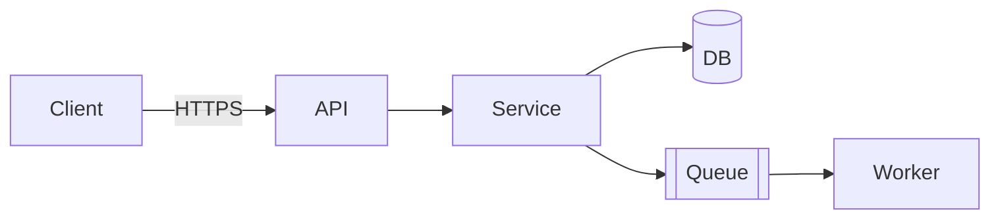
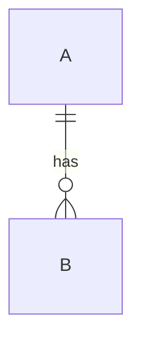
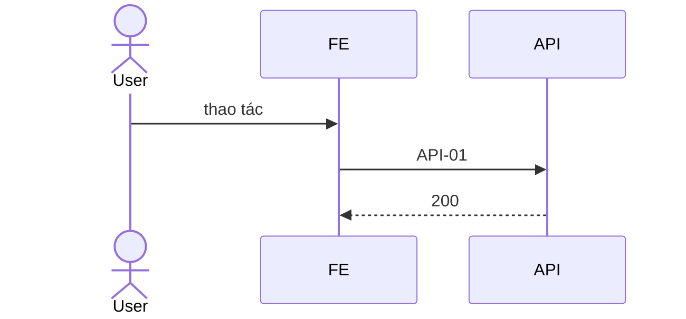

# Tech Spec (tổng quan & contract) — <Tên tính năng / hệ thống>

| | |
|---|---|
| Tác giả (Architect) | |
| Reviewer | BE lead · FE lead |
| Trạng thái | Draft · In review · Approved (G2) · Implemented |
| SRS | <link 01-srs.md> · FR phủ: <FR-01.01–01.05, …> |
| Spec con | BE: <link 02a-be-spec.md> · FE: <link 02b-fe-spec-<client>.md> |
| Last update | <YYYY-MM-DD> · Architect |

> **TL;DR** — <3–5 dòng: xây gì, chạm thành phần nào, quyết định kỹ thuật chính, rủi ro lớn nhất>

<!-- File này là HỢP ĐỒNG chung giữa BE, FE, QA: kiến trúc, data model, API contract, quyết định xuyên suốt.
Chi tiết implement nằm ở spec con (02a BE, 02b FE). Contract ở đây Approved thì BE và FE làm song song được.
Không chép SRS — link ID. Mục không áp dụng: "N/A — <lý do>". -->

---

## 1. Bối cảnh
<!-- 2–4 câu: vấn đề (link P#/FR) + hiện trạng kỹ thuật liên quan. -->

## 2. Goals / Non-goals

| Goals | Non-goals |
|---|---|
| | |

## 3. Hiện trạng & tác động (reuse-first)

| Thành phần | Component | Hiện có (file:line) | REUSE / EXTEND / NEW | Thay đổi |
|---|---|---|:---:|---|

## 4. Kiến trúc



| Thành phần | Trách nhiệm | Spec chi tiết |
|---|---|---|
| | | 02a / 02b |

## 5. Data model (chung)
<!-- Thực thể, quan hệ, field chính. Kiểu chi tiết, index, migration → 02a. -->



## 6. API contract
<!-- Nguồn sự thật cho FE và QA. Dự án có OpenAPI/proto/GraphQL schema → cập nhật file đó và link tới. -->

| ID | Method + path / event | Mục đích | Quyền | FR | Client dùng |
|---|---|---|---|---|---|
| API-01 | `GET /v1/...` | | | | web |

<details><summary><b>API-01</b> — request / response / lỗi</summary>

```json
// request
{}
// 200
{}
```

| HTTP | Mã lỗi | Khi nào | FE xử lý |
|---|---|---|---|
| 400 | VALIDATION_ERROR | | hiện lỗi theo field |
| 403 | FORBIDDEN | | ẩn hành động / màn không quyền |
| 409 | CONFLICT | | |
</details>

**Quy ước chung:** <auth header · phân trang · format lỗi · thời gian (UTC/ISO-8601) · version API>

## 7. Luồng chính (end-to-end)



## 8. Quyết định xuyên suốt
| Chủ đề | Quyết định |
|---|---|
| AuthN / AuthZ | |
| Bảo mật & dữ liệu nhạy cảm | |
| NFR (link NFR-xx) | |
| Observability | |
| Feature flag | |

## 9. Phương án đã cân nhắc
| Phương án | Ưu | Nhược | Chọn |
|---|---|---|:---:|

## 10. Rollout & rollback
1. <thứ tự giữa các component: migration → BE → FE → bật flag → dọn dẹp>

**Rollback:** <điều kiện · các bước · dữ liệu có mất không>

## 11. Rủi ro & câu hỏi mở
| Rủi ro / câu hỏi | Mức | Hướng xử lý / hỏi ai |
|---|:---:|---|

---

## Phụ lục — FR coverage
| FR | API / mục spec | BE (02a) | FE (02b) |
|---|---|:---:|:---:|

## Phụ lục — Decisions
| DEC | Bối cảnh | Lựa chọn | Lý do | Người chốt | Ngày |
|---|---|---|---|---|---|

## Chốt G2 (áp cho bộ 02 + 02a + 02b)
- [ ] Mọi FR/BR/NFR trong phạm vi có chỗ trong spec (bảng FR coverage)
- [ ] API contract đủ request/response/lỗi/quyền — FE, BE, QA làm song song được
- [ ] Spec con BE và FE đã Approved, không mâu thuẫn contract
- [ ] Mọi thứ NEW có lý do (đã kiểm không có sẵn)
- [ ] Migration + rollback rõ; bảo mật & observability đã tính
