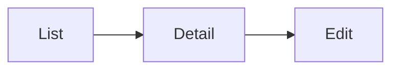

# FE Spec — <Tên tính năng> · <client: web / mobile / desktop>

| | |
|---|---|
| Tác giả | |
| Reviewer | |
| Trạng thái | Draft · In review · Approved · Implemented |
| Tổng quan & contract | <link 02-tech-spec.md> · Màn trong SRS §10 / thiết kế: <link Figma> |
| Last update | <YYYY-MM-DD> · <role> |

> **TL;DR** — <màn nào, route nào, component mới, state/data fetching ra sao, điểm khó nhất>

<!-- Đối tượng đọc: dev FE và reviewer FE. Một file cho mỗi client (02b-fe-spec-web.md, 02b-fe-spec-mobile.md).
Không viết lại API — trỏ API-xx trong 02. Mục không áp dụng: "N/A — <lý do>". -->

---

## 1. Phạm vi
| Màn / luồng | Route / deep link | FR / UC | REUSE / EXTEND / NEW |
|---|---|---|:---:|

## 2. Điều hướng
<!-- Vào màn từ đâu, đi đâu tiếp; menu/nav thay đổi; guard theo quyền. -->

## 3. Cây component
| Component | Mới / reuse (path) | Props / input chính | Ghi chú |
|---|---|---|---|

## 4. State & data fetching
| Dữ liệu | Nguồn (API-xx) | Nơi giữ state (server cache / store / local) | Cache & làm mới | Optimistic? |
|---|---|---|---|:---:|

## 5. Form & validate
| Form | Field | Rule client | Lỗi server map vào field |
|---|---|---|---|

## 6. Trạng thái UI
| Màn | Loading | Empty | Error | Forbidden | Success |
|---|---|---|---|---|---|

## 7. Phân quyền trên UI
<!-- UI chỉ ẩn/disable cho trải nghiệm; server vẫn là nơi chặn thật. -->
| Hành động / màn | Role thấy | Cách xử lý khi không quyền |
|---|---|---|

## 8. Xử lý lỗi API
| Mã lỗi (từ 02) | Hiển thị | Hành động (retry / về trang / đăng nhập lại) |
|---|---|---|

## 9. Nội dung chữ · i18n · a11y · responsive
<!-- Chuỗi text mới (key i18n), hỗ trợ bàn phím/screen reader, breakpoint / kích thước màn mobile. -->

## 10. Riêng nền tảng
<!-- Web: SEO, browser hỗ trợ, bundle size. Mobile: quyền thiết bị, offline, push, phiên bản OS tối thiểu, store. -->

## 11. Analytics & theo dõi lỗi
| Event | Khi nào | Thuộc tính |
|---|---|---|

## 12. Mock khi BE chưa xong
<!-- Mock theo đúng contract 02 §6, đi qua lớp gọi API sẵn có; cách bật/tắt. -->

## 13. Test FE
| Mức | Phạm vi | Case chính (TC-xx) |
|---|---|---|
| Unit / component | | |
| Integration (mock API) | | |
| E2E | luồng UC chính | |

## 14. Task
| # | Việc | Màn / FR | Phụ thuộc (API-xx) | Ước lượng |
|---|---|---|---|---|

## Decisions
| DEC | Bối cảnh | Lựa chọn | Lý do | Người chốt |
|---|---|---|---|---|
