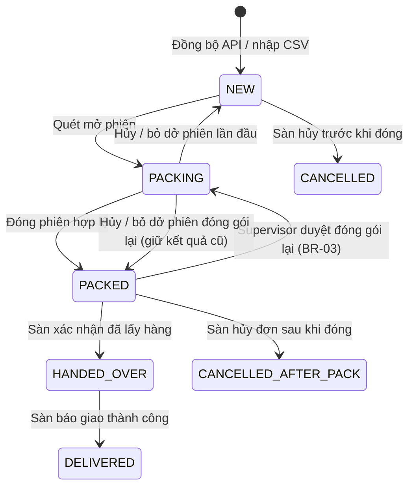
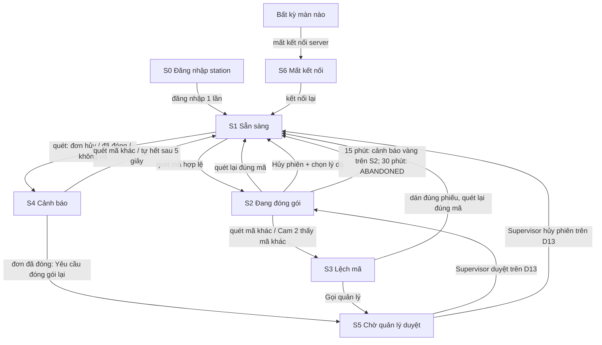
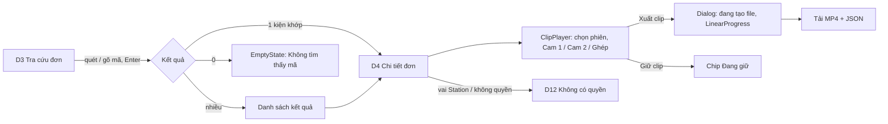

# SRS — 01 MVP đóng gói (Phase 1)

**Mọi kiện giao đi từ kho đều có video Cam 1 + Cam 2 gắn đúng mã vận đơn, dán nhầm phiếu bị chặn ngay tại bàn, và CSKH xuất được bằng chứng trong ≤ 30 giây.**

| | |
|---|---|
| Phiên bản | 0.4 |
| Trạng thái | Approved (G1 2026-10-04) |
| Owner (PO) | khanhtt (nghiệp vụ do chủ shop xác nhận) |
| Reviewer | khanhtt (solo) |
| Nguồn | [SRS hệ thống](../../system/SRS.md) §13.2 Phase 1 · trả lời của user 2026-10-04 (DEC-1..4) |
| Last update | 2026-10-05 · PO (v0.4: change request nhỏ DEC-60 — BR-16 không tính thời gian chờ duyệt) |

> **TL;DR** — Shop đóng gói thủ công, không có video, thua khiếu nại "thiếu / sai / hộp rỗng" (P1) và có thể dán nhầm phiếu (P5).
> MVP: quét mã mở phiên → đóng gói dưới Cam 1 → Cam 2 đối chiếu phiếu trên khay → quét lại mã đóng phiên → hệ thống cắt clip có hash, trạng thái kho `PACKED`.
> Đơn lấy từ Shopee API, có nhập CSV dự phòng. Mỗi station một tài khoản chung (DEC-1).
> Thành công khi: ≥ 99% kiện có clip hợp lệ, dán nhầm bị phát hiện 100%, xuất clip ≤ 30 giây.

SRS item này **chỉ ghi phần thay đổi / chi tiết hóa cho Phase 1**. ID giữ nguyên theo SRS hệ thống. Mục ghi "Không đổi" thì đọc ở SRS hệ thống.

---

## 1. Giới thiệu

**Mục đích & người đọc:** cơ sở cho tech spec, BE/FE spec, test và nghiệm thu Phase 1 · Người đọc: khanhtt (mọi vai), chủ shop.

| Trong phạm vi | Ngoài phạm vi (giai đoạn này) |
|---|---|
| M01 Quản lý station và camera (FR-01.01..05) | M04 Phiên mở hàng hoàn → item Phase 2 |
| M02 Ghi hình, cắt clip, hash, retention (FR-02.01..07) | M06 Đối soát trạng thái, M08 Khiếu nại → Phase 2 |
| M03 Phiên đóng gói đầy đủ (FR-03.01..11) | FR-05.05 Đồng bộ return request → Phase 2 |
| M05 Shopee: kết nối, đồng bộ đơn + trạng thái, tra tức thời, adapter, nhập CSV (FR-05.01..04, 05.06..09) | TikTok Shop, Lazada adapter (FR-05.07 phần sàn thứ 2) → Phase 3 |
| M07 Tra cứu, chi tiết đơn, phát clip, xuất MP4 (FR-07.01..04) | FR-02.08 sao lưu cloud, FR-07.05 link chia sẻ, FR-07.06 xem video thô → Phase 3 |
| M09 Dashboard ngày, phần đóng gói (FR-09.01) — DEC-4 | FR-09.02..04 báo cáo năng suất / hoàn / khiếu nại → Phase 3 |
| M10 Tài khoản, vai trò, audit log (FR-10.01..03) | Thông báo Zalo / Telegram (FR-06.04) → Phase 3 |

**Thuật ngữ:** Không đổi — xem SRS hệ thống §1.3. Bổ sung:

| Thuật ngữ | Nghĩa |
|---|---|
| Tài khoản station | Tài khoản dùng chung của một station, do Admin cấp, đăng nhập sẵn trên máy trạm (DEC-1) |
| Đơn chưa xác minh | Kiện được đóng gói khi mã chưa có trong hệ thống và tra sàn thất bại (EX-P3) |

**Tham chiếu:** [SRS hệ thống](../../system/SRS.md) · [architecture.md](../../system/architecture.md) (chỉ để tham khảo, không ràng buộc SRS) · Shopee Open Platform.

## 2. Bối cảnh & bài toán

**AS-IS:** Không đổi — xem SRS hệ thống §2.1 (đóng gói giao hàng).

| # | Vấn đề | Hệ quả | Item này giải quyết |
|---|---|---|:---:|
| P1 | Không có video quá trình đóng gói | Thua khiếu nại thiếu / sai / hộp rỗng | ✔ |
| P2 | Không có video mở hàng hoàn | | Phase 2 |
| P3 | Trạng thái sàn khác thực tế kho | | Một phần: lưu song song trạng thái sàn và kho cho kiện đi |
| P4 | Kiểm tra hàng hoàn bằng tay | | Phase 2 |
| P5 | Có thể dán nhầm phiếu sang kiện khác | Giao sai, đánh giá xấu, mất tiền | ✔ |

| Mục tiêu | Chỉ số | Hiện tại | Mục tiêu MVP |
|---|---|---|---|
| Mọi kiện giao đi có video | % kiện `PACKED` có clip Cam 1 + Cam 2 không cờ `video_incomplete` | 0% | ≥ 99% |
| Không dán nhầm phiếu | Số kiện giao sai do nhầm phiếu / tháng | chưa đo | 0 |
| Tìm bằng chứng nhanh | Thời gian nhập mã → có file MP4 | không có | ≤ 30 giây |
| Không làm chậm đóng gói | Thời gian thao tác thêm / kiện (2 lần quét + chờ phản hồi) | 0 | ≤ 3 giây |

## 3. Stakeholder & tác nhân

Stakeholder: Không đổi — xem SRS hệ thống §3.1.

| Tác nhân | Loại | Vai trò trong MVP |
|---|---|---|
| Admin | người | Cấu hình station, camera, kết nối Shopee, tài khoản, retention |
| Supervisor | người | Theo dõi station, duyệt đóng gói lại, xử lý mismatch, nhập CSV |
| Tài khoản station (người đứng bàn) | người, dùng tài khoản chung | Thực hiện phiên đóng gói (thay vai Packer — DEC-1) |
| CSKH | người | Tra cứu, xem, xuất clip |
| Shopee Open Platform | hệ thống ngoài | Đơn, mã vận đơn, trạng thái |
| Cam 1, Cam 2, máy quét | thiết bị | Video, đọc mã |
| Job đồng bộ / cắt clip / retention | job | Chạy nền |

## 4. Quy trình nghiệp vụ (TO-BE)

### 4.1 Đóng gói giao hàng

Không đổi — xem SRS hệ thống §4.1 (B1..B7, sơ đồ, map bước thô → TO-BE). Chi tiết hóa cho MVP:

- **B2–B3:** phiên gắn **station** (không gắn cá nhân — DEC-1). Clip overlay ghi tên station thay cho mã nhân viên.
- **B3:** nếu Cam 2 chưa thấy mã trên khay sau 2 giây, phiên vẫn mở, màn hình hiện "Cam 2 chưa thấy phiếu" (vàng), không chặn.
- **B7:** đóng phiên hợp lệ khi mã quét lần 2 = mã mở phiên. Đối chiếu Cam 2 là kiểm tra bổ sung: thấy mã khác → `MISMATCH`; không đọc được → đóng phiên kèm cờ `cam2_unverified`.

Ngoại lệ: Không đổi — EX-P1..EX-P8 theo SRS hệ thống §4.1. Bổ sung:

| Mã | Ngoại lệ | Xử lý |
|---|---|---|
| EX-P9 | Quét mã khi station chưa đăng nhập | Không mở phiên, màn hình yêu cầu đăng nhập |
| EX-P10 | Mã được nhập qua CSV nhưng sau đó Shopee trả về đơn đã hủy | Lần đồng bộ kế tiếp cập nhật trạng thái sàn; nếu kho đã `PACKED` thì đơn hiện trong danh sách "Đơn hủy sau khi đóng" trên dashboard (FR-09.01) |
| EX-P11 | File CSV sai định dạng / thiếu cột bắt buộc | Từ chối cả file, báo dòng và cột lỗi, không nhập một phần |

### 4.2 Nhập đơn từ CSV (dự phòng)

- **B1.** Supervisor xuất danh sách đơn từ Seller Center ra file.
- **B2.** Supervisor tải file lên dashboard → hệ thống kiểm tra định dạng, hiện xem trước: số dòng mới, số dòng cập nhật, số dòng lỗi.
- **B3.** Supervisor xác nhận → hệ thống tạo / cập nhật đơn, kiện, sản phẩm; đánh dấu nguồn `CSV`.
- **B4.** Khi Shopee API hoạt động, đơn CSV trùng mã được API cập nhật đè, giữ lịch sử.

## 5. Yêu cầu chức năng

Không đổi — giữ nguyên văn FR theo SRS hệ thống §5 cho các ID trong phạm vi (§1). Dưới đây chỉ ghi FR **thay đổi, nâng ưu tiên hoặc mới**.

| ID | Yêu cầu | Ưu tiên | Nguồn | Thay đổi |
|---|---|:---:|---|---|
| FR-03.01 | Hệ thống phải yêu cầu station đăng nhập bằng **tài khoản station** do Admin cấp; mọi phiên gắn với station đó. Phiên làm việc của station tồn tại tới khi đăng xuất hoặc Admin thu hồi | M | B2, DEC-1 | Sửa: bỏ đăng nhập theo nhân viên |
| FR-02.03 | Overlay trên clip xuất phải có: mã vận đơn, mã đơn sàn, thời gian thực đến giây, tên station | M | P1, DEC-1 | Sửa: bỏ mã nhân viên |
| FR-02.06 | Retention mặc định: video thô 30 ngày, clip phiên 90 ngày; Admin đổi được; clip đang được giữ thủ công (cờ "giữ") không bị xóa tự động | M | DEC-3 | Chi tiết hóa số ngày; thay "hồ sơ khiếu nại" (Phase 2) bằng cờ giữ thủ công |
| FR-02.09 | Hệ thống phải cho Supervisor/CSKH đánh dấu "giữ" một clip để không bị xóa tự động, và bỏ đánh dấu | M | P1 | Mới (thay tạm M08 trong MVP) |
| FR-05.09 | Hệ thống phải cho Supervisor nhập đơn từ file CSV/Excel theo mẫu cố định (mã đơn, mã vận đơn, sản phẩm, phân loại, số lượng, ghi chú), xem trước trước khi nhập, từ chối cả file nếu có dòng lỗi | M | RK-01, DEC-2 | Nâng S → M |
| FR-05.10 | Hệ thống phải lưu nguồn của mỗi đơn (`API` / `CSV`) và cho API cập nhật đè đơn CSV cùng mã, giữ lịch sử | M | DEC-2 | Mới |
| FR-01.06 | Hệ thống phải kiểm tra độ lệch giờ của camera so với server mỗi 10 phút và cảnh báo khi lệch > 1 giây | M | BR-15 | Mới (hiện thực BR-15) |
| FR-09.01 | Dashboard ngày (MVP): số kiện đóng gói, số phiên từng bị lệch mã trong ngày, số phiên bỏ dở / hủy, số kiện `PACKED` chưa bàn giao, số đơn hủy sau khi đóng, trạng thái camera | M | P1, P3, P5 | Thu hẹp: chưa có số liệu hàng hoàn / đối soát |
| FR-10.01 | Vai trò MVP: Admin, Supervisor, Station, CSKH | M | DEC-1 | Sửa: Packer → Station; Return Inspector → Phase 2 |
| FR-03.12 | Hệ thống phải cho station gửi yêu cầu duyệt (Lệch mã, Đóng gói lại, Gọi quản lý khi đang đóng gói — DEC-25) lên dashboard; Supervisor/Admin duyệt hoặc từ chối trên dashboard trong khi station hiển thị trạng thái chờ; mỗi lần xử lý ghi audit log tên người duyệt | M | B7, DEC-5 | Mới |
| FR-03.10 | Đóng gói lại một đơn đã `PACKED` chỉ khi Supervisor/Admin duyệt qua FR-03.12; giữ lịch sử mọi phiên | M | BR-03, DEC-5 | Sửa: duyệt từ dashboard; nâng S → M |
| FR-02.08 | Sao lưu clip lên lưu trữ thứ hai | — | | Dời Phase 3 |

### 5.1 Ma trận phân quyền (MVP)

| Chức năng | Admin | Supervisor | Station | CSKH |
|---|:---:|:---:|:---:|:---:|
| Cấu hình station, camera, Shopee, retention | ✔ | | | |
| Quản lý tài khoản (kể cả tài khoản station) | ✔ | | | |
| Thực hiện phiên đóng gói | | | ✔ | |
| Gửi yêu cầu duyệt (Lệch mã, Gọi quản lý, Đóng gói lại) | | | ✔ | |
| Duyệt / từ chối yêu cầu từ dashboard (D13) | ✔ | ✔ | | |
| Nhập đơn CSV | ✔ | ✔ | | |
| Xem clip | ✔ | ✔ | Chỉ phiên của station mình trong ngày (để xem lại ngay) | ✔ |
| Xuất clip, đánh dấu giữ | ✔ | ✔ | | ✔ |
| Xóa clip thủ công | N/A — MVP không có (chỉ retention tự động, DEC-27) | | | |
| Dashboard ngày | ✔ | ✔ | | ✔ |
| Xem audit log | ✔ | | | |

## 6. Use case

| ID | Tên | Tác nhân chính | FR | Trong MVP |
|---|---|---|---|:---:|
| UC-01 | Đóng gói một kiện hàng | Station | FR-03.*, FR-02.01..04 | ✔ (Không đổi, trừ "Packer" → "Station") |
| UC-03 | Tra cứu và xuất video bằng chứng | CSKH, Supervisor | FR-07.01..04, FR-02.09 | ✔ (Không đổi + bước đánh dấu giữ) |
| UC-05 | Đồng bộ đơn từ sàn | Job | FR-05.02..04, 05.06 | ✔ |
| UC-07 | Cấu hình station và camera | Admin | FR-01.* | ✔ |
| UC-08 | Xử lý phiên MISMATCH | Supervisor, Station | FR-03.05, 03.07, 03.12 | ✔ Sửa bước 3: Supervisor duyệt trên dashboard (D13), không xác nhận tại station (DEC-5) |
| UC-09 | Nhập đơn từ CSV | Supervisor | FR-05.09, 05.10 | ✔ Mới |
| UC-10 | Kết nối shop Shopee | Admin | FR-05.01 | ✔ Mới |
| UC-02, UC-04, UC-06 | Hàng hoàn, khiếu nại, đối soát | | | Phase 2 |

### UC-09 — Nhập đơn từ CSV

| | |
|---|---|
| Tác nhân | Supervisor |
| Tiền điều kiện | Đăng nhập dashboard, có file theo mẫu |
| Kích hoạt | Bấm "Nhập đơn từ file" |
| Kết quả thành công | Đơn / kiện / sản phẩm được tạo hoặc cập nhật, nguồn `CSV`, có audit log |

**Luồng chính:** 1. Tải file. 2. Hệ thống kiểm tra, hiện xem trước (mới / cập nhật / lỗi). 3. Supervisor xác nhận. 4. Hệ thống nhập, báo kết quả.
**Ngoại lệ:** EX-P11; mã vận đơn trùng với kiện đã `PACKED` → giữ trạng thái kho, chỉ cập nhật thông tin đơn.

### UC-10 — Kết nối shop Shopee

| | |
|---|---|
| Tác nhân | Admin |
| Tiền điều kiện | Có tài khoản Shopee Open Platform đã duyệt (Q11) |
| Kích hoạt | Bấm "Kết nối Shopee" |
| Kết quả thành công | Shop ở trạng thái "Đã kết nối", lần đồng bộ đầu tiên chạy trong ≤ 5 phút |

**Luồng chính:** 1. Hệ thống chuyển Admin sang trang ủy quyền của Shopee. 2. Admin đăng nhập shop, đồng ý. 3. Shopee chuyển về hệ thống. 4. Hệ thống lưu thông tin ủy quyền, hiển thị "Đã kết nối".
**Ngoại lệ:** Admin từ chối ủy quyền → giữ "Chưa kết nối"; ủy quyền hết hạn không làm mới được → cảnh báo Admin kết nối lại.

## 7. Trạng thái & quy tắc nghiệp vụ

Trạng thái kho của kiện trong MVP (tập con SRS hệ thống §7.1):



Lệch mã (`MISMATCH`) và chờ duyệt (`WAITING_APPROVAL`) là **trạng thái của phiên**, không phải của kiện; kiện giữ `PACKING` trong suốt phiên (DEC-24).

Trạng thái phiên: `OPEN` → `COMPLETED` | `CANCELLED` | `ABANDONED`; `OPEN` ⇄ `MISMATCH`; `OPEN`/`MISMATCH` → `WAITING_APPROVAL` → về trạng thái trước hoặc kết thúc theo quyết định; `COMPLETED` → `SUPERSEDED` khi phiên đóng gói lại của cùng kiện hoàn tất.

Các trạng thái hoàn (`RETURN_*`) thuộc Phase 2: trong MVP, kiện có trạng thái sàn liên quan hoàn chỉ hiển thị trạng thái sàn, trạng thái kho giữ nguyên.

| ID | Quy tắc | Ví dụ |
|---|---|---|
| BR-01 | Không đổi | Đơn `CANCELLED` trên Shopee, quét mã → màn hình vàng "ĐƠN ĐÃ HỦY", không có phiên |
| BR-02 | Không đổi | Station 01 đang có phiên SPX…789 mở, không thể có phiên thứ hai trên Station 01 |
| BR-03 | Đóng gói lại chỉ khi kiện đang `PACKED` (chưa bàn giao) và Supervisor duyệt; phiên cũ chỉ chuyển `SUPERSEDED` khi phiên mới `COMPLETED`; phiên mới bị hủy / bỏ dở thì kiện về `PACKED`, phiên cũ giữ hiệu lực (DEC-24) | SPX…789 `PACKED` 09:15; 10:00 duyệt đóng gói lại; 10:03 hoàn tất → phiên 09:15 `SUPERSEDED`. Nếu 10:03 hủy → kiện vẫn `PACKED`, phiên 09:15 vẫn hiệu lực. Kiện `HANDED_OVER` → không cho đóng gói lại |
| BR-04 | Tra sàn tối đa 2 giây trước khi mở phiên "chưa xác minh" | Mã SPX…000 chưa có, Shopee không trả lời sau 2s → mở phiên, cờ "chưa xác minh" |
| BR-05 | Không đổi | Mở SPX…789, quét đóng SPX…788 → `MISMATCH` |
| BR-06 | Cam 2 thấy mã khác mã phiên → phiên `MISMATCH`; khi Cam 2 còn thấy mã khác thì **không** đóng được phiên dù quét đúng mã | Phiên SPX…789, khay có SPX…790 → `MISMATCH` ≤ 2 giây; quét 789 → vẫn `MISMATCH` cho tới khi bỏ phiếu 790 khỏi khay |
| BR-18 | Đóng phiên khi Cam 2 chưa từng khớp mã trong phiên, hoặc Cam 2 không hoạt động → cờ "Cam 2 không xác minh"; khi đóng mà Cam 2 vẫn thấy chính mã phiên trên khay → cờ "Phiếu còn trên khay" (có thể in trùng phiếu), không chặn (DEC-26) | Vision dừng cả phiên → clip có cờ "Cam 2 không xác minh" |
| BR-09 | Clip có cờ "giữ" không bị xóa bởi retention (thay "hồ sơ khiếu nại" trong MVP) | Clip ngày 01/01 có cờ giữ → vẫn còn sau 90 ngày |
| BR-15 | Không đổi | Camera lệch 1,5 giây → cảnh báo trên dashboard |
| BR-16 | Phiên mở quá 15 phút (cấu hình được) → cảnh báo; quá 30 phút → `ABANDONED`. Thời gian chờ quản lý duyệt không tính vào quá giờ; đồng hồ tính lại từ lúc yêu cầu kết thúc (duyệt xong hoặc station rút) — v0.4, DEC-60 | Mở 08:00, 08:15 cảnh báo, 08:30 tự đóng `ABANDONED`, clip 08:00–08:30 được giữ. Gửi duyệt 08:05, quản lý cho tiếp tục 08:45 → cảnh báo 09:00, bỏ dở 09:15 |
| BR-17 | Đơn nguồn `API` không bị nhập CSV ghi đè; đơn nguồn `CSV` bị API ghi đè | CSV có SPX…789 đã có từ API → bỏ qua dòng đó, báo "đã có từ Shopee" |

BR-10..14 (đối soát) → Phase 2.

## 8. Yêu cầu phi chức năng

Không đổi — NFR-01..30 theo SRS hệ thống §8, áp dụng cho phần trong phạm vi. Chi tiết hóa con số cho MVP:

| ID | Loại | Yêu cầu (đo được) | Cách kiểm |
|---|---|---|---|
| NFR-05 | Quy mô | Hệ thống chạy 2 station (4 camera) đồng thời, 500 đơn/ngày, đỉnh 120 kiện/giờ toàn kho, không vi phạm NFR-01..04 (DEC-4). Thiết kế mở rộng tới 4 station | Test tải 120 lần quét / giờ / station trong 1 giờ |
| NFR-31 | Dung lượng | Đủ chỗ cho 30 ngày video thô + 90 ngày clip của 2 station (ước tính ≈ 1,1 TB + ≈ 1,6 TB, cần đo lại ở spike) | Tính từ bitrate đo thực tế × thời gian |
| NFR-01 | Hiệu năng | Quét → phản hồi ≤ 1 giây (p95) với đơn đã có; ≤ 3 giây khi phải tra Shopee | Đo 100 lần quét |
| NFR-03 | Hiệu năng | Clip sẵn sàng ≤ 60 giây sau khi đóng phiên (p95) | Đo 50 phiên |
| NFR-09 | Tin cậy | Mất Internet 30 phút: quét, phiên, ghi hình chạy bình thường; đồng bộ lại ≤ 10 phút sau khi có mạng | Rút mạng WAN khi test |

## 9. Dữ liệu nghiệp vụ

Không đổi — xem SRS hệ thống §10. MVP dùng: SHOP, ORDER, ORDER_ITEM, PACKAGE, STATION, CAMERA, USER, SESSION, SESSION_EVENT, CLIP, STATUS_HISTORY, AUDIT_LOG. Thay đổi:

| Thực thể | Thay đổi | Ghi chú |
|---|---|---|
| USER | Thêm loại tài khoản `STATION` gắn với một station | DEC-1 |
| SESSION | Gắn station + tài khoản station; không có người đóng gói cá nhân; thêm trạng thái `WAITING_APPROVAL` | DEC-1, DEC-5 |
| ORDER (lịch sử) | Khi API ghi đè đơn nguồn CSV, lưu bản CSV trước đó vào nhật ký | FR-05.10 |
| ORDER | Thêm nguồn `API` / `CSV` | FR-05.10 |
| CLIP | Thêm cờ giữ, người đánh dấu, thời điểm | FR-02.09 |
| CSV_IMPORT | Mới: lần nhập, người nhập, số dòng mới / cập nhật / lỗi, file gốc | Giữ file gốc 90 ngày |

## 10. Giao diện chính

Thiết kế bởi `ai-ux-design-screens` 2026-10-04. Phong cách, token, component, giọng văn: [design system](../../../design-system/README.md) (mục **Station kiosk** cho màn station). Chưa có Figma; phác thảo ASCII.

### 10.1 Kiểm kê và phân loại

Chưa có UI nào trong `ai-cam-fe` (repo trống, 2026-10-04). Mọi màn là **NEW**. Component lấy từ design system (**REUSE** API trong `components/index.d.ts`); thành phần chưa có trong design system là **NEW**.

| Thành phần | Phân loại | Dùng ở |
|---|:---:|---|
| Button, IconButton, TextField, SelectField, StatusChip, Alert, Tabs, SegmentedButtons, LinearProgress, PageHeader, EmptyState, Dialog, Pagination | REUSE | Mọi màn dashboard; station dùng Button, StatusChip, Dialog |
| Khung app dashboard (top app bar 64px + drawer 256px) | REUSE (mẫu trong design system) | D2..D12 |
| `StationStatusBar` (thanh 56px: station, chip camera, mạng, đồng hồ) | NEW | S1..S6 |
| `StationStatePanel` (vùng nội dung đổi nền theo trạng thái) | NEW | S1..S6 |
| `ScanListener` (nhận mã từ máy quét HID) | NEW | S1..S6, ô tìm kiếm D3 |
| `ClipPlayer` (video + Tabs Cam 1 / Cam 2 / Ghép + thông tin phiên) | NEW | D4, S1 (xem lại) |
| `CameraTile` (ô live view 16:9 + chip REC / Mất tín hiệu) | NEW | D11, D6 |
| `RoiEditor` (vẽ khung chữ nhật trên ảnh Cam 2) | NEW | D6 |
| `StatusTimeline` (dòng thời gian trạng thái sàn + kho) | NEW | D4 |

### 10.2 User journey

**UC-01 / UC-08 — Đóng gói tại station**



**UC-03 — Tra cứu và xuất bằng chứng**



**UC-09 — Nhập đơn từ file:** D5 tải file → kiểm tra → bảng xem trước (mới / cập nhật / lỗi) → có lỗi: Alert lỗi + danh sách dòng lỗi, nút Nhập bị khóa → không lỗi: "Nhập 500 đơn" → kết quả + dòng trong Lịch sử nhập.

**UC-10 — Kết nối Shopee:** D7 "Kết nối Shopee" → trang ủy quyền Shopee → quay về D7 với Alert thành công hoặc Alert lỗi "Shopee từ chối ủy quyền. Bấm Kết nối lại để thử lần nữa."

**UC-07 — Cấu hình station:** D6 danh sách → "Thêm station" → form (tên, Cam 1, Cam 2, tài khoản station) → "Kiểm tra kết nối" → vẽ ROI Cam 2 → Lưu.

### 10.3 Danh sách màn

| Mã | Kênh | Màn | Vai trò thấy | FR |
|---|---|---|---|---|
| S0 | Station | Đăng nhập station | Mọi người tại bàn (chưa đăng nhập) | FR-03.01 |
| S1 | Station | Sẵn sàng (+ 5 phiên gần nhất, xem lại clip) | Station | FR-03.02, 03.11, FR-01.02 |
| S2 | Station | Đang đóng gói | Station | FR-03.03, 03.06, 03.08, BR-16 |
| S3 | Station | Lệch mã | Station | FR-03.05, 03.07 |
| S4 | Station | Cảnh báo (đơn hủy, đã đóng, chưa xác minh, camera mất tín hiệu) | Station | FR-03.02, BR-01, BR-03, BR-04, FR-01.03 |
| S5 | Station | Chờ quản lý duyệt | Station | FR-03.10, FR-03.12 |
| S6 | Station | Mất kết nối server | Station | NFR-09 |
| D1 | Dashboard | Đăng nhập | Mọi tài khoản không phải Station | FR-10.01 |
| D2 | Dashboard | Tổng quan ngày | Admin, Supervisor, CSKH | FR-09.01, FR-01.06 |
| D3 | Dashboard | Tra cứu đơn | Admin, Supervisor, CSKH | FR-07.01, 07.03 |
| D4 | Dashboard | Chi tiết đơn + trình phát clip | Admin, Supervisor, CSKH | FR-07.02, 07.04, FR-02.07, 02.09 |
| D5 | Dashboard | Nhập đơn từ file | Admin, Supervisor | FR-05.09, 05.10 |
| D6 | Dashboard | Station và camera (danh sách, sửa, ROI) | Admin | FR-01.01, 01.02, 01.04 |
| D7 | Dashboard | Kết nối Shopee | Admin | FR-05.01 |
| D8 | Dashboard | Lưu trữ video | Admin | FR-02.06 |
| D9 | Dashboard | Người dùng | Admin | FR-10.01, FR-03.01 |
| D10 | Dashboard | Nhật ký thao tác | Admin | FR-10.03 |
| D11 | Dashboard | Live view | Admin, Supervisor | FR-01.05 |
| D12 | Dashboard | Không có quyền / Không tìm thấy trang | Mọi vai | FR-10.02 |
| D13 | Dashboard | Yêu cầu duyệt | Admin, Supervisor | FR-03.10, FR-03.12 |

Drawer dashboard theo vai: Tổng quan · Tra cứu đơn · Yêu cầu duyệt (badge số chờ) · Nhập đơn · Live view · Cài đặt (Station, Shopee, Lưu trữ, Người dùng, Nhật ký). Mục không có quyền bị ẩn.

### 10.4 Đặc tả màn station

Chung cho S1..S6: thanh trạng thái 56px (`Station 01` · chip Cam 1 · chip Cam 2 · chip Mạng · giờ `HH:mm:ss`). Chip camera: `success` "Cam 1" + `check_circle` khi online, `error` "Cam 1 mất tín hiệu" + `videocam_off` khi offline. Âm thanh theo design system: S1 sau khi đóng phiên = bíp thành công, S2 khi mở = bíp thành công, S4 = 2 bíp, S3 / S6 = âm lỗi lặp.

**S0 — Đăng nhập station**

| Mục | Nội dung |
|---|---|
| Mục đích | Gắn máy trạm với một tài khoản station (làm một lần, Admin hoặc Supervisor thực hiện) |
| Hiển thị | Logo, tiêu đề "Đăng nhập station", ô "Tài khoản station", ô "Mật khẩu", nút filled "Đăng nhập" |
| Validate | Bỏ trống → "Nhập tài khoản station." Sai → "Sai tài khoản hoặc mật khẩu. Kiểm tra lại hoặc hỏi Admin." Tài khoản không phải loại Station → "Tài khoản này không dùng cho station. Đăng nhập dashboard tại /admin." |
| Trạng thái | loading: nút xoay, khóa ô · error: Alert lỗi dưới form · success: chuyển S1, giữ đăng nhập tới khi đăng xuất / bị thu hồi |
| Quét mã khi ở S0 | Bỏ qua, hiện Alert "Station chưa đăng nhập. Đăng nhập rồi quét lại." (EX-P9) |

**S1 — Sẵn sàng** (nền `success-container`)

| Mục | Nội dung |
|---|---|
| Hiển thị | Icon `qr_code_scanner` 64px, tiêu đề "SẴN SÀNG", dòng "Quét mã vận đơn để bắt đầu". Bên dưới: "Hôm nay: 128 kiện". Cột phải: "Phiên gần đây" (5 dòng: giờ, mã vận đơn mono, chip trạng thái, nút "Xem" mở Dialog ClipPlayer) |
| Hành động | Quét mã (chính) · "Xem" clip phiên gần đây (chỉ phiên của station trong ngày) · menu ẩn góc phải "Đăng xuất station" (giữ 3 giây để mở, tránh bấm nhầm) |
| Trạng thái | empty phiên gần đây: "Chưa có phiên nào hôm nay." · clip đang cắt: chip `warning` "Đang cắt clip" thay nút Xem · camera offline: vẫn ở S1 nhưng chip đỏ trên thanh trạng thái + Alert lỗi "Cam 2 mất tín hiệu. Vẫn đóng gói được, video sẽ thiếu. Báo quản lý." |

**S2 — Đang đóng gói** (nền `primary-container`)

```
┌───────────────────────────────────────────────────────────────────────────┐
│ Station 01      [● Cam 1] [● Cam 2] [● Mạng]                   14:27:05   │
├───────────────────────────────────────────────────────────────────────────┤
│  ĐANG ĐÓNG GÓI                                         Thời gian  02:14   │
│                                                                           │
│  SPXVN0123456789                                       [Shopee] 2410ABCD  │
│  [✔ Cam 2 khớp mã trên khay]                                              │
│ ───────────────────────────────────────────────────────────────────────── │
│  [ảnh] Áo thun basic                Đen / L                         × 2   │
│  [ảnh] Tất cổ ngắn                  Trắng                           × 1   │
│  Ghi chú của khách: "Gói kỹ giúp em"                                      │
│ ───────────────────────────────────────────────────────────────────────── │
│  Dán phiếu lên kiện rồi QUÉT LẠI MÃ để hoàn tất                           │
│                                                                           │
│  [ Hủy phiên ]                                          [ Gọi quản lý ]   │
└───────────────────────────────────────────────────────────────────────────┘
```

| Mục | Nội dung |
|---|---|
| Hiển thị | "ĐANG ĐÓNG GÓI", mã vận đơn `display-md` mono, sàn + mã đơn sàn, chip Cam 2, danh sách sản phẩm (ảnh, tên, phân loại, số lượng `title-lg` tabular), ghi chú khách, hướng dẫn, đồng hồ phiên |
| Chip Cam 2 | `success` "Cam 2 khớp mã trên khay" + `verified` · `warning` "Cam 2 chưa thấy phiếu" (sau 2 giây không đọc được) · khi Cam 2 thấy mã khác → chuyển S3 |
| Cờ phụ | Chip `warning` "Chưa xác minh với Shopee" khi mở theo BR-04 · chip `warning` "Đóng gói lại" khi đã được duyệt |
| Hành động | Quét lại đúng mã → đóng phiên, bíp, về S1 · "Hủy phiên" → Dialog chọn lý do (Hết hàng / Quét nhầm / Khác) + nút "Hủy phiên", nút trái "Đóng" · "Gọi quản lý" → S5 |
| Quá giờ | 15 phút: Alert cảnh báo "Phiên đã mở 15 phút. Quét lại mã để hoàn tất hoặc Hủy phiên." · 30 phút: phiên tự đóng, về S1 với Alert "Phiên SPX…789 đã tự đóng do quá 30 phút." |
| Đơn không có sản phẩm (nguồn thiếu) | Dòng "Chưa có danh sách sản phẩm cho đơn này." |

**S3 — Lệch mã** (nền `error-container`, âm lỗi lặp)

```
┌───────────────────────────────────────────────────────────────────────────┐
│ Station 01      [● Cam 1] [● Cam 2] [● Mạng]                   14:29:40   │
├───────────────────────────────────────────────────────────────────────────┤
│  (!) LỆCH MÃ — KHÔNG DÁN PHIẾU NÀY                                        │
│                                                                           │
│  Đang đóng gói      SPXVN0123456789                                       │
│  Vừa quét           SPXVN0123456788          (hoặc: Cam 2 thấy trên khay) │
│                                                                           │
│  Gỡ phiếu sai, dán đúng phiếu SPX…789 rồi quét lại mã.                    │
│                                                                           │
│  [ Gọi quản lý ]                                                          │
└───────────────────────────────────────────────────────────────────────────┘
```

| Mục | Nội dung |
|---|---|
| Hiển thị | Icon `error`, tiêu đề, hai dòng so sánh mã (mono, phần khác nhau in đậm), nguồn lệch ("Vừa quét" / "Cam 2 thấy trên khay"), hướng dẫn |
| Hành động | Quét đúng mã phiên → đóng phiên bình thường, về S1 · quét mã khác lần nữa → ở lại S3, cập nhật dòng "Vừa quét" · "Gọi quản lý" → S5 |
| Chặn | Không mở phiên mới cho tới khi xử lý (FR-03.05) |

**S4 — Cảnh báo** (nền `warning-container`, 2 bíp, tự về S1 sau 5 giây trừ khi có nút)

| Tình huống | Tiêu đề | Dòng phụ | Hành động |
|---|---|---|---|
| Đơn đã hủy (BR-01) | ĐƠN ĐÃ HỦY | "SPX…789 đã bị hủy trên Shopee. Không đóng gói." | Tự về S1 |
| Đơn đã đóng, chưa bàn giao (BR-03) | ĐƠN ĐÃ ĐÓNG GÓI | "SPX…789 đã đóng gói lúc 09:15 tại Station 02." | "Yêu cầu đóng gói lại" → S5 · tự về S1 nếu không bấm |
| Đơn đã bàn giao / đã giao | ĐƠN ĐÃ BÀN GIAO | "SPX…789 đã bàn giao cho đơn vị vận chuyển. Không đóng gói lại." | Tự về S1 |
| Mã không có, tra Shopee thất bại (BR-04) | Không cảnh báo riêng: mở S2 với chip "Chưa xác minh với Shopee" | | |
| Mã sai định dạng | MÃ KHÔNG HỢP LỆ | "Mã vừa quét không phải mã vận đơn. Quét lại mã trên phiếu." | Tự về S1 |

**S5 — Chờ quản lý duyệt** (nền `warning-container`)

| Mục | Nội dung |
|---|---|
| Hiển thị | Icon `schedule`, "ĐANG CHỜ QUẢN LÝ DUYỆT", lý do ("Lệch mã" / "Đóng gói lại" / "Gọi quản lý"), mã vận đơn, thời gian chờ `mm:ss`, dòng "Quản lý duyệt trên dashboard, mục Yêu cầu duyệt." |
| Hành động | "Rút yêu cầu" → về màn trước (S3 hoặc S1) · quét mã: bỏ qua, nhắc "Đang chờ duyệt." |
| Kết thúc | Supervisor duyệt → S2 (tiếp tục / đóng gói lại) hoặc đóng phiên có ghi chú → S1 · Supervisor hủy phiên → S1 với Alert "Quản lý đã hủy phiên." |

**S6 — Mất kết nối server** (nền `error-container`): "MẤT KẾT NỐI MÁY CHỦ", "Không quét được lúc này. Kiểm tra dây mạng của máy trạm. Hệ thống tự kết nối lại." Hiện số giây đã mất kết nối. Không nhận quét. Tự về màn trước khi kết nối lại.

### 10.5 Đặc tả màn dashboard

Chung: khung app design system; mọi danh sách có loading (skeleton dòng), empty (EmptyState + một hành động), error (Alert lỗi + "Thử lại"), forbidden (chuyển D12). Thời gian hiển thị `dd/MM/yyyy HH:mm:ss` giờ Việt Nam.

**D2 — Tổng quan ngày**

```
┌ Tổng quan ─────────────────────────────── Hôm nay 04/10/2026 [▼ đổi ngày] ┐
│ [Đã đóng gói 312] [Từng lệch mã 3] [Bỏ dở 1] [Hủy phiên 4] [Chưa bàn giao 27]  │
│ [Hủy sau khi đóng 2 ⚠]                                                    │
├ Station ───────────────────────────┬ Cần xử lý ───────────────────────────┤
│ Station 01  ● Cam1 ● Cam2  Rảnh    │ ⚠ 2 đơn bị hủy sau khi đóng  [Xem]   │
│ Station 02  ● Cam1 ✖ Cam2  Đang…   │ ⚠ Cam 2 Station 02 mất tín hiệu      │
│                                    │ ⚠ Camera lệch giờ 1,4 giây           │
│                                    │ ⏱ 1 yêu cầu duyệt đang chờ   [Duyệt] │
└────────────────────────────────────┴──────────────────────────────────────┘
```

| Mục | Nội dung |
|---|---|
| Thẻ số | Theo FR-09.01; bấm thẻ → D3 lọc sẵn theo trạng thái và ngày |
| Station | Tên, chip camera, trạng thái hiện tại (Rảnh / Đang đóng gói SPX… / Lệch mã / Chờ duyệt), lần quét gần nhất |
| Cần xử lý | Đơn hủy sau khi đóng (EX-P10), camera offline, camera lệch giờ (FR-01.06), yêu cầu duyệt, lỗi đồng bộ Shopee, ổ đầy > 80% |
| Cập nhật | Tự làm mới (realtime), không cần tải lại trang |
| empty | Ngày chưa có phiên: thẻ số = 0, "Chưa có phiên đóng gói nào trong ngày." |

**D3 — Tra cứu đơn**

| Mục | Nội dung |
|---|---|
| Thanh lọc | Ô tìm "Mã vận đơn hoặc mã đơn" (nhận máy quét, Enter là tìm, tự focus khi mở trang) · Ngày (từ–đến) · Station · Trạng thái kho · Nguồn (Shopee / File) |
| Kết quả | Bảng: mã vận đơn (mono + Copy), mã đơn, trạng thái kho (chip), trạng thái sàn, station, giờ đóng gói, có clip (icon). Mobile: card |
| Hành vi | Tìm chính xác 1 kiện → mở thẳng D4 |
| empty | "Không tìm thấy mã SPX…789." + nút "Xóa bộ lọc" |

**D4 — Chi tiết đơn**

```
┌ SPXVN0123456789 [Copy]  [Đã đóng gói] [Shopee: Đang giao]      [Giữ clip] ┐
│ Mã đơn 2410ABCDEF · Nguồn Shopee · Ghi chú: "Gói kỹ giúp em"              │
├ Clip ──────────────────────────────────────────┬ Phiên ───────────────────┤
│ ┌────────────────────────────────────────────┐ │ ● 04/10 14:25 Station 01 │
│ │                 video 16:9                 │ │   Đã đóng gói   02:14    │
│ └────────────────────────────────────────────┘ │ ○ 04/10 09:15 Station 02 │
│ [Cam 1] [Cam 2] [Ghép]                         │   Bị thay thế            │
│ Station 01 · 14:25:01 → 14:27:15 · 02:14       │                          │
│ SHA-256 9f2c…e1a0 [Copy] · Cam 2: khớp mã      │                          │
│                                  [Xuất clip]   │                          │
├ Sản phẩm ──────────────────────────────────────┴──────────────────────────┤
│ Áo thun basic · Đen / L · × 2      Tất cổ ngắn · Trắng · × 1             │
├ Dòng thời gian ───────────────────────────────────────────────────────────┤
│ 14:27 Kho: Đã đóng gói · 14:25 Kho: Đang đóng gói · 08:02 Shopee: Chờ lấy │
└───────────────────────────────────────────────────────────────────────────┘
```

| Mục | Nội dung |
|---|---|
| Hành động | Chọn phiên · Tabs Cam 1 / Cam 2 / Ghép · "Xuất clip" (filled, duy nhất) → Dialog: chọn Cam 1 / Cam 2 / Ghép → LinearProgress → "Tải file MP4" + "Tải thông tin (JSON)" · "Giữ clip" / "Bỏ giữ" (tonal) |
| Cờ | Chip `warning` "Thiếu video" (`video_incomplete`) · "Cam 2 không xác minh" · "Chưa xác minh với Shopee" · "Đang giữ" |
| Trạng thái clip | Đang cắt: player thay bằng EmptyState "Clip đang được cắt, sẵn sàng trong khoảng 1 phút." · Đã xóa theo lưu trữ: "Clip đã bị xóa ngày 03/01/2027 theo chính sách lưu trữ 90 ngày." · Lỗi tạo clip: Alert lỗi + "Thử lại" |
| Lỗi xuất | "Không tạo được file xuất. Bấm Thử lại; nếu vẫn lỗi, báo Admin kèm mã đơn." |

**D5 — Nhập đơn từ file**

| Mục | Nội dung |
|---|---|
| Hiển thị | PageHeader "Nhập đơn từ file", link "Tải file mẫu", vùng chọn file (.csv, .xlsx, ≤ 5 MB), bảng Lịch sử nhập (thời gian, người nhập, mới / cập nhật / bỏ qua / lỗi, tải file gốc) |
| Xem trước | Bộ đếm: "Mới 420 · Cập nhật 75 · Bỏ qua 5 (đã có từ Shopee) · Lỗi 0", bảng 20 dòng đầu, nút filled "Nhập 495 đơn" |
| Có lỗi | Alert lỗi "File có 3 dòng lỗi. Sửa file rồi tải lại; chưa có đơn nào được nhập." + bảng lỗi (dòng, cột, lý do); nút Nhập bị khóa (EX-P11) |
| Sai định dạng | "File thiếu cột bắt buộc: Mã vận đơn. Dùng file mẫu." |
| success | Alert thành công "Đã nhập 495 đơn." + dòng mới trong Lịch sử |

**D6 — Station và camera:** bảng station (tên, tài khoản station, Cam 1 / Cam 2 chip, trạng thái) · form sửa: tên, chọn tài khoản station, địa chỉ Cam 1, Cam 2, nút "Kiểm tra kết nối" (hiện ảnh chụp từ camera hoặc lỗi "Không kết nối được Cam 1. Kiểm tra địa chỉ và mật khẩu camera.") · bước ROI: ảnh Cam 2, kéo khung chữ nhật, "Lưu vùng đọc mã" · validate: tên trùng → "Tên station đã tồn tại."

**D7 — Kết nối Shopee:** trạng thái (Chưa kết nối / Đã kết nối + tên shop + hạn ủy quyền / Hết hạn), lần đồng bộ gần nhất, số đơn đồng bộ hôm nay, nút "Kết nối Shopee" hoặc "Kết nối lại", "Đồng bộ ngay". Lỗi đồng bộ hiện Alert kèm thời gian.

**D8 — Lưu trữ video:** số ngày giữ video thô, clip (TextField số, 1–365), dung lượng ổ (LinearProgress, cảnh báo ≥ 80%), số clip đang giữ. Validate: clip < video thô → "Số ngày giữ clip phải lớn hơn hoặc bằng video thô."

**D9 — Người dùng:** bảng (tên, tài khoản, vai trò, station gắn với — chỉ vai Station, trạng thái) · "Thêm người dùng" Dialog · "Thu hồi phiên đăng nhập" cho tài khoản station · "Khóa tài khoản".

**D10 — Nhật ký thao tác:** bảng chỉ đọc (thời gian, người, hành động, đối tượng), lọc theo người / hành động / ngày.

**D11 — Live view:** lưới CameraTile 2 cột (4 camera), chọn station để phóng to. Lỗi: tile "Mất tín hiệu".

**D12 — Không có quyền / Không tìm thấy:** EmptyState "Tài khoản của bạn không có quyền xem trang này." + "Về Tổng quan"; 404: "Không tìm thấy trang."

**D13 — Yêu cầu duyệt** (DEC-5)

| Mục | Nội dung |
|---|---|
| Hiển thị | Danh sách yêu cầu đang chờ: station, loại (Lệch mã / Gọi quản lý / Đóng gói lại), mã vận đơn, mã vừa quét / mã Cam 2 thấy, thời gian chờ; nút xem live Cam 1 + Cam 2 của station |
| Hành động | Lệch mã: "Cho tiếp tục" (về S2) · "Đóng phiên có ghi chú" (bắt buộc ghi chú; bị khóa khi Cam 2 còn thấy mã khác) · "Hủy phiên". Gọi quản lý: "Cho tiếp tục" · "Đóng phiên có ghi chú" · "Hủy phiên". Đóng gói lại: "Duyệt đóng gói lại" · "Từ chối" |
| Thông báo | Badge số trên drawer + thẻ "Cần xử lý" ở D2; yêu cầu mới phát âm báo trên dashboard |
| empty | "Không có yêu cầu nào đang chờ." |
| Xung đột | Hai Supervisor cùng xử lý: người sau thấy "Yêu cầu này đã được Nguyễn B xử lý lúc 14:31." |

### 10.6 Kiểm phủ FR → màn

| FR | Màn | | FR | Màn |
|---|---|---|---|---|
| FR-01.01 | D6 | | FR-03.08 | S2 |
| FR-01.02, 01.03 | S1..S6 thanh trạng thái, D2, D6 | | FR-03.09 / BR-16 | S2 |
| FR-01.04 | D6 (ROI) | | FR-03.10, 03.12 | S4, S5, D13 |
| FR-01.05 | D11 | | FR-03.11 | S1 → S2 → S1 không chạm chuột |
| FR-01.06 | D2 | | FR-05.01 | D7 |
| FR-02.01..05 | không có UI riêng (job); kết quả ở D4 | | FR-05.02..04, 05.06 | D7 (trạng thái đồng bộ), D4 (dòng thời gian) |
| FR-02.06 | D8 | | FR-05.09, 05.10 | D5, D3 (lọc nguồn) |
| FR-02.07 | D4 tab Ghép | | FR-07.01, 07.03 | D3 |
| FR-02.09 | D4 | | FR-07.02, 07.04 | D4 |
| FR-03.01 | S0, D9 | | FR-09.01 | D2 |
| FR-03.02 | S1, S4 | | FR-10.01 | D1, D9 |
| FR-03.03 | S2 | | FR-10.02 | drawer theo vai, D12 |
| FR-03.04 | S2 → S1 | | FR-10.03 | D10 |
| FR-03.05, 03.07 | S3 | | FR-03.06 | S2 chip Cam 2 |

Không còn FR có UI mà không có màn.

## 11. Tích hợp ngoài

| Hệ thống | Mục đích | Dữ liệu vào/ra | Ràng buộc |
|---|---|---|---|
| Shopee Open Platform | Ủy quyền shop, lấy đơn, mã vận đơn, trạng thái đơn / vận chuyển, tra đơn theo mã | Vào: đơn, kiện, sản phẩm, trạng thái. Ra: không ghi gì lên Shopee | Cần partner được duyệt; giới hạn tần suất và tên API cụ thể chờ spike S1 (Q11) |
| File CSV/Excel từ Seller Center | Dự phòng nhập đơn | Vào: đơn, kiện, sản phẩm | Mẫu cột cố định (Q12) |

## 12. Giả định · ràng buộc · rủi ro · câu hỏi mở

Không đổi — AS-01..05, CO-01..04, RK-01..08 theo SRS hệ thống §12. Bổ sung / thay đổi:

| ID | Giả định | Nếu sai thì |
|---|---|---|
| AS-06 | Mỗi station tại một thời điểm chỉ một người đứng; tài khoản station không bị dùng chung giữa các bàn | Không biết phiên đến từ bàn nào; phải tách tài khoản |
| AS-07 | Video Cam 1 đủ để nhận ra người đóng gói khi cần truy trách nhiệm | Phải quay lại đăng nhập theo nhân viên (đảo DEC-1) |

| ID | Rủi ro | Mức | Giảm thiểu |
|---|---|:---:|---|
| RK-09 | Tài khoản chung → không truy được cá nhân trên hệ thống, không có báo cáo năng suất theo người | Trung bình | Chấp nhận trong MVP (DEC-1); tra cứu theo station + thời gian, nhận diện qua video; xem lại ở Phase 3 |
| RK-10 | Mẫu file Seller Center thay đổi làm CSV lỗi | Thấp | Mẫu cột của hệ thống, Supervisor ghép cột khi xuất |

| # | Câu hỏi mở | Hỏi ai | Ảnh hưởng tới | Chặn G1? |
|---|---|---|---|:---:|
| Q11 | Shop đã có / đang đăng ký Shopee Open Platform chưa? Được cấp quyền API nào? | Chủ shop | FR-05.01..04, UC-10, spike S1 | Không (đã có CSV dự phòng) |
| Q12 | Seller Center xuất được file đơn có mã vận đơn từng kiện không? Mẫu cột thực tế? | Chủ shop | FR-05.09 | Không (dùng mẫu của hệ thống) |
| Q6 | (SRS hệ thống) Mã trên kiện hoàn | | Phase 2 | Không |
| Q8 | (SRS hệ thống) Có kiểm đếm từng sản phẩm khi đóng gói không? | Chủ shop | Ngoài MVP nếu "có" | Không |
| Q13 | Thời hạn khiếu nại thực tế dài nhất của Shopee với shop là bao lâu? | Chủ shop | Có cần clip > 90 ngày | Không (cấu hình được) |

## 13. Nghiệm thu & lộ trình

| ID | Tiêu chí nghiệm thu | Cách kiểm | FR |
|---|---|---|---|
| AC-01 | Quét mở + đóng phiên thành công cho đơn Shopee thật, phản hồi ≤ 1 giây p95 | 50 đơn liên tiếp, đo thời gian | FR-03.02..04, NFR-01 |
| AC-02 | Mỗi phiên `COMPLETED` có clip Cam 1 + Cam 2 phủ [mở − 5s, đóng + 5s]; bản xuất có overlay mã vận đơn, mã đơn, giờ, tên station | 20 clip ngẫu nhiên | FR-02.01..03 |
| AC-03 | Quét đóng bằng mã khác → `MISMATCH` 100% | 20 lần cố ý dán sai | FR-03.05, BR-05 |
| AC-04 | Phiếu sai / 2 phiếu trên khay → cảnh báo ≥ 95% trong ≤ 2 giây (ánh sáng chuẩn); khi khay còn phiếu sai, quét đúng mã **không** đóng được phiên (100%) | 40 lần thử + 10 lần quét đúng mã khi khay sai | FR-03.06..07, BR-06 |
| AC-05 | Quét mã đơn đã hủy trên Shopee → bị chặn | Đơn hủy thật hoặc đơn CSV đã được API cập nhật hủy | FR-03.02, BR-01 |
| AC-08 | Tìm theo mã vận đơn → xuất MP4 phát được trên điện thoại ≤ 30 giây | 10 đơn | FR-07.01..04 |
| AC-09 | Rút WAN 30 phút: vẫn đóng gói + ghi hình; đồng bộ lại ≤ 10 phút sau khi có mạng | Thử thực tế | NFR-09 |
| AC-10 | Rút cáp 1 camera → cảnh báo tại station và dashboard ≤ 10 giây; phiên đang mở gắn cờ `video_incomplete` | Thử thực tế | FR-01.02..03, EX-P7 |
| AC-11 | SHA-256 của clip gốc khớp giá trị đã lưu; không có API / UI nào sửa hoặc xóa clip gốc (chỉ retention tự động) | Kiểm bằng công cụ + thử xóa bằng các vai | FR-02.04..05 |
| AC-12 | Nhập CSV 500 dòng hợp lệ ≤ 30 giây; file có 1 dòng lỗi → không nhập dòng nào, báo đúng dòng / cột | Thử 2 file | FR-05.09, EX-P11 |
| AC-13 | Station chưa đăng nhập → quét không mở phiên; mọi phiên ghi đúng station | Thử 2 station | FR-03.01, EX-P9 |
| AC-14 | Đóng gói lại đơn `PACKED` chỉ khi có xác nhận Supervisor; phiên cũ `SUPERSEDED` sau khi phiên mới hoàn tất, cả hai clip còn | Thử 5 lần | FR-03.10, BR-03 |
| AC-15 | Clip có cờ "giữ" không bị xóa khi chạy retention với thời gian giả lập +91 ngày; clip không giữ bị xóa | Chạy job với đồng hồ giả lập | FR-02.06, 02.09, BR-09 |
| AC-16 | Phiên mở 30 phút không đóng → `ABANDONED`, clip được tạo | Đồng hồ giả lập | BR-16, FR-03.09 |
| AC-17 | Camera lệch giờ > 1 giây → cảnh báo trên dashboard | Chỉnh giờ camera | FR-01.06, BR-15 |
| AC-19 | Station gửi yêu cầu duyệt → hiện trên D13 ≤ 2 giây; Supervisor duyệt → station về S2 ≤ 2 giây; audit log có tên người duyệt | Thử 5 lần mỗi loại | FR-03.12 |
| AC-18 | Dashboard ngày hiển thị đúng số kiện đóng gói, số phiên từng lệch mã (kể cả đã sửa), bỏ dở, hủy, số `PACKED` chưa bàn giao | So với dữ liệu test | FR-09.01 |
| AC-20 | Tăng số ngày giữ clip 90 → 180: clip 100 ngày tuổi không bị xóa ở lần retention kế tiếp | Đồng hồ giả lập | FR-02.06 |
| AC-21 | Đóng gói lại bị hủy giữa chừng → kiện vẫn `PACKED`, phiên cũ vẫn hiệu lực; kiện `HANDED_OVER` → không cho đóng gói lại | Thử 3 lần mỗi trường hợp | BR-03 |

| Giai đoạn | Nội dung | Điều kiện chuyển |
|---|---|---|
| Spike + khung repo (task đầu của `03`) | S1–S5 (architecture.md §17), khung `ai-cam-be`, `ai-cam-fe`, compose, CI, camera giả | Cam 2 đọc mã đạt ≥ 95% ở bàn thử; có quyết định về Shopee (API hoặc chỉ CSV tạm) |
| MVP đóng gói | Toàn bộ phạm vi §1 | Đạt AC-01..05, AC-08..21 |
| Tiếp theo | Item Phase 2: hàng hoàn + đối soát | G5 của item này |

---

## Phụ lục A — Truy vết

| Vấn đề | FR | UC | AC |
|---|---|---|---|
| P1 | FR-02.01..07, 02.09, FR-03.01..04, 03.08..11, FR-07.01..04 | UC-01, UC-03 | AC-01, 02, 08, 11, 15, 16 |
| P5 | FR-03.05..07, 03.10, 03.12 | UC-01, UC-08 | AC-03, 04, 14, 19 |
| P3 (phần kiện đi) | FR-05.01..04, 05.06..10, FR-09.01 | UC-05, UC-09, UC-10 | AC-05, 12, 18 |
| Vận hành / tin cậy | FR-01.01..06, FR-10.01..03 | UC-07 | AC-09, 10, 13, 17 |

## Phụ lục B — Decisions

| DEC | Bối cảnh | Lựa chọn | Lý do | Người chốt | Ngày |
|---|---|---|---|---|---|
| DEC-1 | Cách định danh người đóng gói tại station (FR-03.01) | Một tài khoản chung cho mỗi station; phiên gắn station | User chọn: đơn giản vận hành. Phương án loại: quét thẻ + PIN theo nhân viên; tài khoản cá nhân + mật khẩu. Hệ quả: RK-09, AS-06, AS-07, đổi FR-02.03, FR-10.01, ma trận quyền | khanhtt | 2026-10-04 |
| DEC-2 | Nguồn đơn khi chưa chắc có quyền Shopee API | Shopee API + nhập CSV dự phòng (FR-05.09 lên M) | MVP không bị chặn bởi RK-01. Loại: chỉ API (rủi ro chặn); chỉ CSV (mất BR-01 realtime) | khanhtt | 2026-10-04 |
| DEC-3 | Thời hạn giữ video | Thô 30 ngày, clip 90 ngày, cấu hình được (đề xuất, cần chủ shop xác nhận — Q13) | Cân bằng dung lượng và thời hạn khiếu nại. Loại: 14/60 (rủi ro thiếu bằng chứng), 30/180 (tốn ổ) | khanhtt | 2026-10-04 |
| DEC-5 | Cách Supervisor duyệt khi station dùng tài khoản chung, không có bàn phím | Duyệt từ dashboard (màn D13), station hiện "Chờ quản lý duyệt" | Không cần thiết bị nhập tại bàn, có audit log tên người duyệt. Loại: nhập tài khoản tại station (cần bàn phím), quét thẻ duyệt (mất thẻ lộ quyền) | khanhtt | 2026-10-04 |
| DEC-6 | Thư viện UI | Tailwind + design system MD3 sao từ LiveAI (`docs/design-system/`), bỏ Ant Design | User chốt; thống nhất phong cách với dự án khác. Cập nhật architecture.md, ADR-006 | khanhtt | 2026-10-04 |
| DEC-24 | Change request sau G1 (review G2 #1, #7) | `MISMATCH` chỉ là trạng thái phiên; đóng gói lại chỉ khi `PACKED`, phiên cũ `SUPERSEDED` khi phiên mới hoàn tất | Tránh mất phiên hiệu lực và trạng thái kiện sai | khanhtt (tự quyết, ủy quyền) | 2026-10-04 |
| DEC-25 | Change request (review #4): "Gọi quản lý" từ S2 | Thêm loại yêu cầu "Gọi quản lý" (ASSIST) | Nút ở S2 phải có hành vi | khanhtt (tự quyết) | 2026-10-04 |
| DEC-26 | Change request (review #9): FR-03.06 "phiếu rời khay" | Không chặn đóng phiên; gắn cờ (BR-18) | Chặn sẽ làm kẹt khi in trùng phiếu; cờ đủ làm bằng chứng | khanhtt (tự quyết) | 2026-10-04 |
| DEC-27 | Change request (review #18): xóa clip thủ công | MVP không có UI/API xóa tay; chỉ retention | Giảm rủi ro mất bằng chứng; AC-11 chỉ kiểm "không xóa được" | khanhtt (tự quyết) | 2026-10-04 |
| DEC-4 | Quy mô đặt NFR | 2 station, ≤ 500 đơn/ngày; FR-09.01 dashboard ngày giữ trong MVP | User chọn. Dashboard là FR mức M ở SRS hệ thống, chi phí thấp | khanhtt | 2026-10-04 |
| DEC-60 | Change request nhỏ (RB-14 của 02a, phát hiện khi làm T-13): phiên chờ duyệt lâu rồi được "Cho tiếp tục" bị cảnh báo / bỏ dở ngay vì đồng hồ vẫn tính từ lúc mở phiên | BR-16: thời gian chờ quản lý duyệt không tính vào quá giờ; đồng hồ tính lại từ lúc yêu cầu kết thúc (mốc = lúc mở phiên hoặc lúc yêu cầu gần nhất được duyệt / rút, lấy mốc muộn hơn); cảnh báo 15 phút được bật lại | Người đứng bàn không có lỗi khi quản lý duyệt chậm; tránh phải quét mở lại. Không mất bằng chứng: clip vẫn tính từ lúc mở phiên. Loại: giữ nguyên tính từ lúc mở phiên (bỏ dở oan); trừ đúng tổng thời gian chờ (cần cột mới, không thêm giá trị) | khanhtt (vai PO, theo ủy quyền DEC-15) | 2026-10-05 |

## Chốt G1
- [x] Mọi vấn đề P# trong phạm vi (P1, P5, P3 phần kiện đi) có FR; mọi FR M có ≥ 1 AC (FR-01.04 ROI, FR-03.03 hiển thị đơn, FR-03.11 quét liên tục được kiểm gián tiếp qua AC-01, AC-04)
- [x] Phạm vi trong/ngoài rõ; ma trận quyền đủ cho 4 vai MVP
- [x] Quy trình chính có ngoại lệ (EX-P1..P11); BR có ví dụ
- [x] NFR có con số; không còn từ mơ hồ
- [x] Câu hỏi chặn G1 = 0 (Q11, Q12, Q13 không chặn)
- [x] §10 màn hình: 20 màn có trạng thái, chữ thật, phác thảo màn chính; mọi FR có UI đều tới được màn (§10.6)
