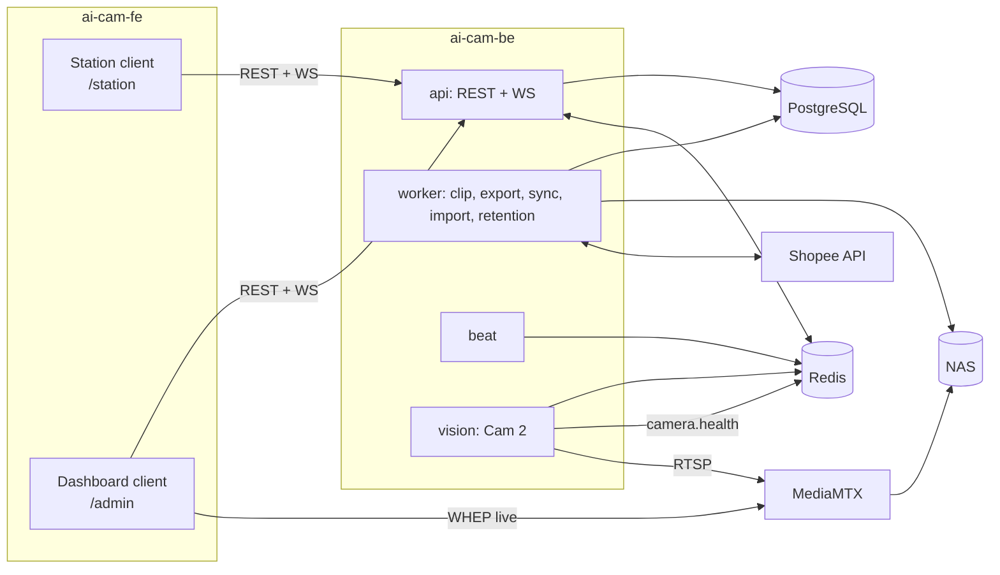
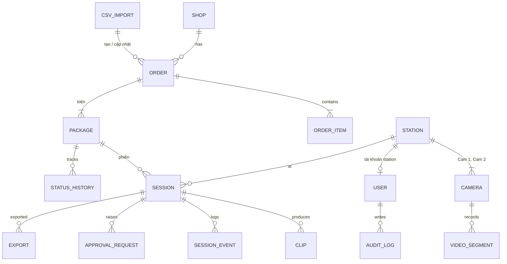
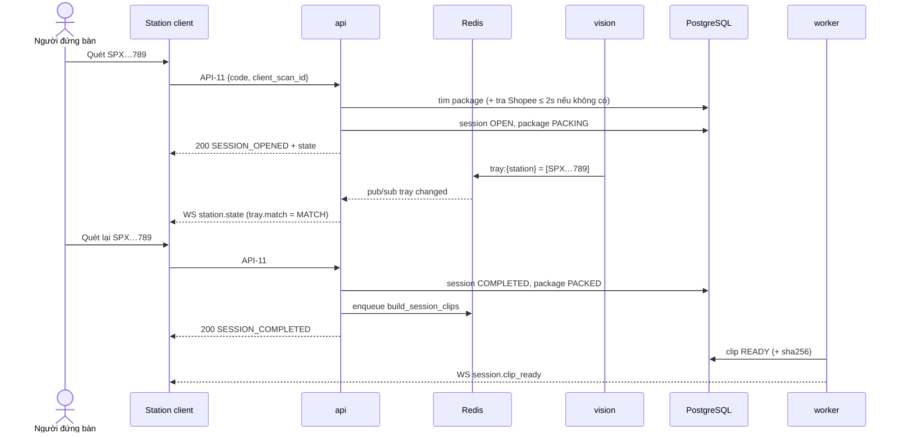
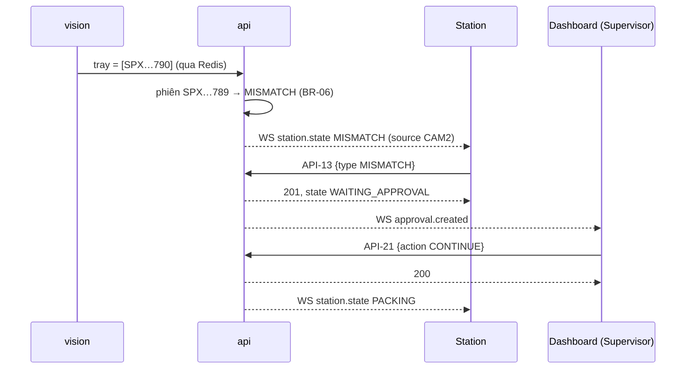

# Tech Spec (tổng quan & contract) — 01 MVP đóng gói

| | |
|---|---|
| Tác giả (Architect) | khanhtt |
| Reviewer | BE lead · FE lead (khanhtt, solo) |
| Trạng thái | Approved (G2 2026-10-04, có điều kiện DEC-33) |
| SRS | [01-srs.md](01-srs.md) v0.3 · FR phủ: FR-01.01–01.06, FR-02.01–02.07, 02.09, FR-03.01–03.12, FR-05.01–05.04, 05.06–05.10, FR-07.01–07.04, FR-09.01, FR-10.01–10.03 |
| Spec con | BE: [02a-be-spec.md](02a-be-spec.md) · FE: [02b-fe-spec-station.md](02b-fe-spec-station.md), [02b-fe-spec-admin.md](02b-fe-spec-admin.md) |
| Kiến trúc nền | [architecture.md](../../system/architecture.md) · ADR-001..008 |
| Last update | 2026-10-04 · Architect |

> **TL;DR** — Dựng mới toàn bộ: `ai-cam-be` (FastAPI + Celery + vision + MediaMTX, chạy tại kho) và `ai-cam-fe` (React, 2 client: station kiosk, dashboard).
> Quét mã đi qua một API duy nhất `POST /station/scan`. API này luôn trả `200` kèm `outcome` để station tự chọn màn và âm thanh (DEC-7). Cập nhật realtime (Cam 2, duyệt, camera) đi qua WebSocket.
> Clip gốc là stream copy và bất biến. Bản xuất được encode bất đồng bộ (job). Video phát qua URL có chữ ký, hết hạn sau 10 phút.
> Rủi ro lớn nhất: Cam 2 đọc mã không ổn định (spike S2) và quyền Shopee API (Q11). CSV là phương án dự phòng.

---

## 1. Bối cảnh

Giải quyết P1 (không có video đóng gói), P5 (dán nhầm phiếu) và một phần P3 của [01-srs.md](01-srs.md). Hiện trạng kỹ thuật: hai repo con trống (quét 2026-10-04). Kiến trúc tổng thể và stack đã chốt trong [architecture.md](../../system/architecture.md) và ADR-001..008 (proposed). UI theo [design system](../../../design-system/README.md) (DEC-6).

## 2. Goals / Non-goals

| Goals | Non-goals |
|---|---|
| Contract đủ để BE, FE station, FE dashboard, QA làm song song | Phiên mở hoàn, đối soát, khiếu nại (Phase 2) |
| Quét → phản hồi ≤ 1 giây p95 (NFR-01), clip ≤ 60 giây (NFR-03) | TikTok / Lazada adapter (chỉ chừa interface) |
| Chạy offline khi mất WAN (NFR-09) | Sao lưu cloud, link chia sẻ, xem video thô |
| Bằng chứng: hash, audit log, overlay khi xuất | Nhận diện sản phẩm bằng AI |
| Dựng khung repo, compose, CI, camera giả | Multi-tenant / nhiều kho |

## 3. Hiện trạng & tác động (reuse-first)

Cả hai repo chỉ có `.git` (`ls -la ai-cam-be ai-cam-fe`, 2026-10-04); `system-map.md` trống. Không có gì để REUSE trong code; REUSE tài liệu và design system.

| Thành phần | Component | Hiện có | REUSE / EXTEND / NEW | Thay đổi |
|---|---|---|:---:|---|
| Khung BE (FastAPI, Celery, Alembic, Docker, compose) | be | — | NEW | Theo architecture.md §4, §14 |
| Module `stations`, `orders`, `sessions`, `media`, `vision`, `platforms`, `users`, `reports` (phần ngày), `approvals`, `imports` | be | — | NEW | `approvals`, `imports` là module mới so với architecture.md §4.1 (DEC-8) |
| MediaMTX, PostgreSQL, Redis, Caddy | be (hạ tầng) | — | NEW | Image chính thức |
| Khung FE (Vite, React, Tailwind, router, API client sinh từ OpenAPI) | fe | — | NEW | |
| Token + component UI | fe | `docs/design-system/` (tokens.json, components/index.d.ts) | REUSE (spec) | Viết lại component theo API trong `index.d.ts`, sinh `tokens.css` từ `tokens.json` |
| Client station (S0–S6) | fe: station | — | NEW | 02b-fe-spec-station |
| Client dashboard (D1–D13) | fe: admin | — | NEW | 02b-fe-spec-admin |

## 4. Kiến trúc

Không đổi so với [architecture.md §3](../../system/architecture.md). Phần liên quan item này:



| Thành phần | Trách nhiệm | Spec chi tiết |
|---|---|---|
| api | Auth, mọi REST, WS, logic phiên (đồng bộ), phục vụ file video có chữ ký | 02a |
| worker / beat | Cắt clip, xuất clip, đồng bộ Shopee, nhập CSV, retention, index segment, health camera, kiểm tra lệch giờ | 02a |
| vision | Đọc mã Cam 2 → trạng thái khay trong Redis + sự kiện | 02a |
| MediaMTX | Relay RTSP, ghi segment, WHEP live view | 02a (cấu hình) |
| Station client | S0–S6, ScanListener, âm thanh, WS | 02b-station |
| Dashboard client | D1–D13, ClipPlayer, RoiEditor, live view | 02b-admin |

## 5. Data model (chung)

Kiểu chi tiết, index, migration → 02a. Tên trường dưới đây là tên dùng trong API.



| Thực thể | Field chính (tên API) | Ghi chú |
|---|---|---|
| SHOP | `id`, `platform` (`SHOPEE`), `platform_shop_id`, `name`, `auth_status` (`CONNECTED`/`EXPIRED`/`DISCONNECTED`), `auth_expires_at`, `last_synced_at` | Token lưu mã hóa, không trả ra API |
| ORDER | `id`, `shop_id`, `platform_order_sn`, `platform_status`, `buyer_note`, `source` (`API`/`CSV`), `created_at_platform` | FR-05.10, BR-17 |
| ORDER_ITEM | `id`, `order_id`, `sku`, `product_name`, `variation`, `quantity`, `image_url` | |
| PACKAGE | `id`, `order_id`, `tracking_number` (unique), `warehouse_status`, `platform_logistics_status`, `verified` (bool) | `verified=false` = chưa xác minh (BR-04) |
| STATION | `id`, `name` (unique), `is_active`, `account_user_id` | |
| CAMERA | `id`, `station_id`, `role` (`CAM1`/`CAM2`), `rtsp_url`, `status` (`ONLINE`/`OFFLINE`), `last_seen_at`, `clock_offset_ms`, `roi` (`{x,y,w,h}` tỉ lệ 0–1, chỉ CAM2) | Mật khẩu camera mã hóa, không trả ra |
| USER | `id`, `username`, `display_name`, `role` (`ADMIN`/`SUPERVISOR`/`CSKH`/`STATION`), `station_id` (chỉ STATION), `is_active` | DEC-1 |
| SESSION | `id`, `type` (`PACK`), `package_id`, `station_id`, `status`, `started_at`, `ended_at`, `open_code`, `close_code`, `cam2_code`, `flags[]`, `cancel_reason`, `note`, `supersedes_session_id`, `package_status_before` | `package_status_before`: trạng thái kiện lúc mở phiên, để trả về khi hủy phiên đóng gói lại |
| SESSION_EVENT | `id`, `session_id`, `type`, `payload`, `at` | Lịch sử thao tác trong phiên |
| CLIP | `id`, `session_id`, `camera_role`, `status` (`PENDING`/`READY`/`FAILED`/`DELETED`), `start_at`, `end_at`, `duration_s`, `size_bytes`, `sha256`, `held`, `held_by`, `held_at`, `retention_until` | FR-02.04, 02.09 |
| EXPORT | `id`, `session_id`, `layout` (`CAM1`/`CAM2`/`SIDE_BY_SIDE`), `status` (`QUEUED`/`RUNNING`/`READY`/`FAILED`), `progress` (0–100), `sha256`, `created_by`, `expires_at` | FR-07.04, FR-02.07 |
| APPROVAL_REQUEST | `id`, `station_id`, `session_id` (null với REPACK), `tracking_number`, `type` (`MISMATCH`/`ASSIST`/`REPACK`), `status` (`PENDING`/`RESOLVED`/`WITHDRAWN`), `context` (mã liên quan), `decision`, `decided_by`, `decided_at`, `note` | DEC-5, FR-03.12 |
| CSV_IMPORT | `id`, `status` (`PREVIEW`/`COMMITTED`/`REJECTED`/`EXPIRED`), `file_name`, `counts` (`new`, `updated`, `skipped`, `error`), `created_by`, `created_at` | FR-05.09 |
| STATUS_HISTORY | `id`, `package_id`, `source` (`PLATFORM`/`WAREHOUSE`/`MANUAL`), `from_status`, `to_status`, `at`, `actor_id` | |
| VIDEO_SEGMENT | `camera_id`, `start_at`, `end_at`, `path` | Nội bộ BE, không có API |
| SETTING | `retention_raw_days` (mặc định 30), `retention_clip_days` (90), `session_warn_minutes` (15), `session_abandon_minutes` (30) | |
| AUDIT_LOG | `id`, `user_id`, `action`, `object_type`, `object_id`, `at`, `ip` | Chỉ INSERT |

**Enum dùng chung (FE map sang nhãn tiếng Việt theo design system):**

| Enum | Giá trị → nhãn |
|---|---|
| `warehouse_status` | `NEW` Mới · `PACKING` Đang đóng gói · `PACKED` Đã đóng gói · `HANDED_OVER` Đã bàn giao · `DELIVERED` Đã giao · `CANCELLED` Đã hủy · `CANCELLED_AFTER_PACK` Hủy sau khi đóng |
| `session.status` | `OPEN` Đang mở · `MISMATCH` Lệch mã · `WAITING_APPROVAL` Chờ duyệt · `COMPLETED` Hoàn tất · `CANCELLED` Đã hủy · `ABANDONED` Bỏ dở · `SUPERSEDED` Bị thay thế |
| `station_state` | `READY` · `PACKING` · `MISMATCH` · `WAITING_APPROVAL` (ứng với S1, S2, S3, S5) |
| `session.flags[]` | `UNVERIFIED` Chưa xác minh với Shopee · `CAM2_UNVERIFIED` Cam 2 không xác minh · `LABEL_ON_TRAY` Phiếu còn trên khay · `VIDEO_INCOMPLETE` Thiếu video · `REPACK` Đóng gói lại · `HAD_MISMATCH` Từng lệch mã · `CLOSED_BY_SUPERVISOR` Quản lý đóng phiên |
| `session.cancel_reason` | `OUT_OF_STOCK` Hết hàng · `WRONG_SCAN` Quét nhầm · `OTHER` Khác · `SUPERVISOR` Quản lý hủy |
| `approval_request.type` | `MISMATCH` Lệch mã · `ASSIST` Gọi quản lý · `REPACK` Đóng gói lại |
| `approval_request.status` | `PENDING` · `RESOLVED` · `WITHDRAWN` |
| `clip.status` | `PENDING` Đang cắt · `READY` · `FAILED` Lỗi · `DELETED` Đã xóa |

`MISMATCH`, `WAITING_APPROVAL` là trạng thái **phiên**; kiện giữ `PACKING` trong suốt phiên (DEC-24).

## 6. API contract

**Quy ước chung**

| Chủ đề | Quy ước |
|---|---|
| Base | `https://<host>/api/v1`; WS `wss://<host>/ws/...` |
| Auth | `Authorization: Bearer <access_token>` (JWT 15 phút). Refresh token trong cookie `httpOnly; Secure; SameSite=Strict`, path `/api/v1/auth`, tên riêng theo client: `rt_station`, `rt_dashboard` (không ghi đè nhau trên cùng trình duyệt). Tài khoản STATION: refresh 30 ngày, thu hồi được (DEC-9) |
| Format | JSON, `snake_case`, UTF-8 |
| Thời gian | ISO-8601 UTC có `Z` (`2026-10-04T07:27:05Z`); FE hiển thị giờ Việt Nam |
| ID | UUID v7 dạng chuỗi |
| Phân trang | `?page=1&page_size=20` (tối đa 100) → `{ "items": [...], "page": 1, "page_size": 20, "total": 312 }` |
| Lỗi | `{ "error": { "code": "VALIDATION_ERROR", "message": "…", "details": { "fields": { "name": "…" } } } }`. `message` là tiếng Việt, hiển thị được; FE dựa vào `code` |
| Lỗi chung mọi API | `401 UNAUTHENTICATED` → FE refresh 1 lần rồi về màn đăng nhập · `403 FORBIDDEN` → D12 / ẩn hành động · `404 NOT_FOUND` → EmptyState · `422 VALIDATION_ERROR` → lỗi theo field · `429 RATE_LIMITED` → thử lại sau `Retry-After` · `500 INTERNAL` → Alert "Có lỗi hệ thống. Thử lại sau ít phút." |
| Version | Tiền tố `/v1`; đổi phá vỡ → `/v2` |
| Nguồn sự thật | File này cho tới khi BE sinh `/openapi.json`; sau đó OpenAPI là nguồn, file này cập nhật theo (DEC-10) |

### 6.1 Danh sách API

| ID | Method + path / event | Mục đích | Quyền | FR | Client |
|---|---|---|---|---|---|
| API-01 | `POST /auth/login` | Đăng nhập (station hoặc dashboard) | công khai | FR-03.01, FR-10.01 | station, admin |
| API-02 | `POST /auth/refresh` body `{ "client": "STATION" \| "DASHBOARD" }` | Lấy access token mới từ cookie `rt_station` / `rt_dashboard` tương ứng | cookie refresh | FR-10.01 | station, admin |
| API-03 | `POST /auth/logout` | Đăng xuất, thu hồi refresh | đã đăng nhập | | station, admin |
| API-04 | `GET /me` | Thông tin tài khoản + quyền | đã đăng nhập | FR-10.02 | station, admin |
| API-10 | `GET /station/state` | Trạng thái station hiện tại | STATION | FR-03.03, FR-01.02 | station |
| API-11 | `POST /station/scan` | Xử lý một lần quét | STATION | FR-03.02–03.07, 03.11, BR-01..06 | station |
| API-12 | `POST /station/sessions/{id}/cancel` | Hủy phiên kèm lý do | STATION (phiên của mình) | FR-03.08 | station |
| API-13 | `POST /station/approval-requests` | Gửi yêu cầu duyệt | STATION | FR-03.12, FR-03.10 | station |
| API-14 | `POST /station/approval-requests/{id}/withdraw` | Rút yêu cầu | STATION (của mình) | FR-03.12 | station |
| API-15 | `GET /station/sessions/recent` | 5 phiên gần nhất trong ngày | STATION | §5.1 ma trận | station |
| API-20 | `GET /approval-requests` | Danh sách yêu cầu duyệt | ADMIN, SUPERVISOR | FR-03.12 | admin |
| API-21 | `POST /approval-requests/{id}/decision` | Duyệt / từ chối | ADMIN, SUPERVISOR | FR-03.10, 03.12 | admin |
| API-30 | `GET /packages` | Tra cứu kiện | ADMIN, SUPERVISOR, CSKH | FR-07.01, 07.03 | admin |
| API-31 | `GET /packages/{id}` | Chi tiết kiện: đơn, sản phẩm, phiên, clip, dòng thời gian | ADMIN, SUPERVISOR, CSKH | FR-07.02 | admin |
| API-32 | `GET /reports/daily` | Số liệu ngày + mục cần xử lý | ADMIN, SUPERVISOR, CSKH | FR-09.01 | admin |
| API-40 | `GET /clips/{id}/play-url` | URL phát có chữ ký | ADMIN, SUPERVISOR, CSKH; STATION (phiên station mình, trong ngày) | FR-07.02 | admin, station |
| API-41 | `GET /media/clips/{id}?uid=&exp=&sig=` | Phát video (Range) | chữ ký | FR-07.02 | `<video>` |
| API-42 | `PUT /clips/{id}/hold` | Giữ / bỏ giữ clip | ADMIN, SUPERVISOR, CSKH | FR-02.09 | admin |
| API-43 | `POST /sessions/{id}/exports` | Tạo bản xuất | ADMIN, SUPERVISOR, CSKH | FR-07.04, FR-02.07 | admin |
| API-44 | `GET /exports/{id}` | Trạng thái bản xuất + link tải | người tạo, ADMIN | FR-07.04 | admin |
| API-45 | `GET /media/exports/{id}/{file}?uid=&exp=&sig=` | Tải `video.mp4` / `info.json` | chữ ký | FR-07.04 | admin |
| API-46 | `POST /sessions/{id}/clips/rebuild` | Cắt lại clip `FAILED` | ADMIN, SUPERVISOR | FR-02.02 | admin |
| API-50 | `POST /imports` (multipart) | Tải file, nhận xem trước | ADMIN, SUPERVISOR | FR-05.09 | admin |
| API-51 | `POST /imports/{id}/commit` | Xác nhận nhập | người tạo | FR-05.09, 05.10 | admin |
| API-52 | `GET /imports` | Lịch sử nhập | ADMIN, SUPERVISOR | FR-05.09 | admin |
| API-53 | `GET /imports/template` | Tải file mẫu | ADMIN, SUPERVISOR | FR-05.09 | admin |
| API-54 | `GET /imports/{id}/file` | Tải file gốc (giữ 90 ngày) | ADMIN, SUPERVISOR | FR-05.09 | admin |
| API-60 | `GET /stations` · `GET /stations/{id}` · `POST /stations` · `PATCH /stations/{id}` | Quản lý station | ADMIN (đúng ma trận 01 §5.1) | FR-01.01 | admin |
| API-61 | `PUT /stations/{id}/cameras/{role}` | Đặt camera Cam 1 / Cam 2 | ADMIN | FR-01.01 | admin |
| API-62 | `POST /cameras/test` | Thử kết nối camera, trả ảnh | ADMIN | FR-01.01 | admin |
| API-63 | `GET /cameras/{id}/snapshot` | Ảnh hiện tại (JPEG) | ADMIN, SUPERVISOR | FR-01.04 | admin |
| API-64 | `PUT /cameras/{id}/roi` | Lưu vùng đọc mã Cam 2 | ADMIN | FR-01.04 | admin |
| API-65 | `GET /live` | Danh sách station + URL WHEP từng camera | ADMIN, SUPERVISOR | FR-01.05 | admin |
| API-70 | `GET /shops` | Trạng thái kết nối sàn | ADMIN | FR-05.01 | admin |
| API-71 | `POST /shops/shopee/auth-url` | Tạo URL ủy quyền | ADMIN | FR-05.01 | admin |
| API-72 | `GET /shops/shopee/callback` | Shopee chuyển về (redirect 302 tới `/admin/settings/shopee?result=`) | công khai + `state` | FR-05.01 | trình duyệt |
| API-73 | `POST /shops/{id}/sync` | Đồng bộ ngay | ADMIN | FR-05.02 | admin |
| API-80 | `GET /settings` · `PUT /settings` | Retention, ngưỡng phiên | GET: ADMIN, SUPERVISOR; PUT: ADMIN | FR-02.06, BR-16 | admin |
| API-81 | `GET /system/health` | DB, Redis, MediaMTX, ổ đĩa, camera, đồng bộ | ADMIN, SUPERVISOR | FR-01.02, 01.06, NFR-30 | admin |
| API-90 | `GET /users` · `POST /users` · `PATCH /users/{id}` | Quản lý tài khoản | ADMIN | FR-10.01 | admin |
| API-91 | `POST /users/{id}/revoke-sessions` | Thu hồi đăng nhập | ADMIN | FR-03.01 | admin |
| API-92 | `GET /audit-logs` | Nhật ký thao tác | ADMIN | FR-10.03 | admin |
| WS-01 | `wss://…/ws/station` | Sự kiện cho station | STATION | FR-03.06, 03.07, 03.12, FR-01.03 | station |
| WS-02 | `wss://…/ws/dashboard` | Sự kiện cho dashboard | ADMIN, SUPERVISOR, CSKH | FR-09.01, 03.12 | admin |

### 6.2 Chi tiết API chính

<details><summary><b>API-01</b> — POST /auth/login</summary>

```json
// request
{ "username": "station01", "password": "••••", "client": "STATION" }   // client: STATION | DASHBOARD
// 200 (+ Set-Cookie refresh_token)
{ "access_token": "eyJ…", "expires_in": 900,
  "user": { "id": "0192…", "username": "station01", "display_name": "Station 01", "role": "STATION",
            "station": { "id": "0192…", "name": "Station 01" } } }
```

| HTTP | Mã lỗi | Khi nào | FE xử lý |
|---|---|---|---|
| 401 | INVALID_CREDENTIALS | Sai tài khoản / mật khẩu | "Sai tài khoản hoặc mật khẩu…" |
| 403 | ACCOUNT_DISABLED | Admin đã khóa tài khoản | "Tài khoản đã bị khóa. Liên hệ Admin." |
| 423 | ACCOUNT_LOCKED | Sai quá 10 lần, `details.until` | "Đăng nhập sai quá nhiều lần. Thử lại sau {giờ until}." |
| 403 | WRONG_CLIENT | `client=STATION` mà role ≠ STATION, hoặc ngược lại | S0 / D1 hiện câu hướng dẫn tương ứng (§10.4 S0) |
| 409 | STATION_INACTIVE | Station của tài khoản bị vô hiệu hóa | "Station này đang tắt. Liên hệ Admin." |
| 429 | RATE_LIMITED | > 10 lần sai / 5 phút / username | "Thử lại sau ít phút." |
</details>

<details><summary><b>API-10</b> — GET /station/state (cũng là payload của sự kiện WS <code>station.state</code>)</summary>

```json
{
  "station": { "id": "0192…", "name": "Station 01" },
  "state": "PACKING",                       // READY | PACKING | MISMATCH | WAITING_APPROVAL
  "cameras": [ { "role": "CAM1", "status": "ONLINE" }, { "role": "CAM2", "status": "OFFLINE" } ],
  "tray": { "codes": ["SPXVN0123456789"], "match": "MATCH", "updated_at": "2026-10-04T07:27:04Z" },
                                            // match: MATCH | NOT_SEEN | DIFFERENT | MULTIPLE | UNAVAILABLE
  "session": {
    "id": "0192…", "status": "OPEN", "started_at": "2026-10-04T07:25:01Z",
    "flags": ["UNVERIFIED"],
    "package": {
      "id": "0192…", "tracking_number": "SPXVN0123456789",
      "order": { "platform": "SHOPEE", "platform_order_sn": "2410ABCDEF", "buyer_note": "Gói kỹ giúp em" },
      "items": [ { "product_name": "Áo thun basic", "variation": "Đen / L", "quantity": 2, "image_url": "https://…" } ]
    },
    "mismatch": null,                       // { "source": "SCAN" | "CAM2", "expected": "SPX…789", "actual": "SPX…788" }
    "warn_at": "2026-10-04T07:40:01Z", "abandon_at": "2026-10-04T07:55:01Z"
  },
  "approval_request": null,                 // có khi state = WAITING_APPROVAL, kể cả khi session = null (REPACK):
                                            // { "id": "…", "type": "MISMATCH" | "ASSIST" | "REPACK", "tracking_number": "SPX…789", "created_at": "…" }
  "today_count": 128,
  "server_time": "2026-10-04T07:27:05Z"
}
```
`session = null` khi `state = READY`, hoặc `WAITING_APPROVAL` loại REPACK. `session.package.order = null` và `items = []` khi kiện chưa xác minh (`flags` có `UNVERIFIED`). `tray.codes` rỗng khi `match` = `NOT_SEEN` / `UNAVAILABLE`. Lỗi: chỉ lỗi chung.
</details>

<details><summary><b>API-11</b> — POST /station/scan</summary>

Luôn trả **200** cho mọi kết quả nghiệp vụ (DEC-7). 4xx chỉ cho lỗi kỹ thuật / quyền.

```json
// request
{ "code": "SPXVN0123456789", "client_scan_id": "b6f1…" }   // client_scan_id: UUID do FE sinh, chống gửi trùng khi retry
// 200
{ "outcome": "SESSION_OPENED", "alert": null, "state": { /* như API-10 */ } }
// 200 — ví dụ cảnh báo
{ "outcome": "ALERT",
  "alert": { "code": "ALREADY_PACKED", "message": "SPX…789 đã đóng gói lúc 09:15 tại Station 02.",
             "data": { "packed_at": "2026-10-04T02:15:00Z", "station_name": "Station 02", "can_request_repack": true } },
  "state": { /* READY */ } }
```

| `outcome` | Khi nào | Station (02b) |
|---|---|---|
| `SESSION_OPENED` | READY + mã hợp lệ (có thể kèm flag `UNVERIFIED`) | S2, bíp thành công |
| `SESSION_COMPLETED` | Đang mở + mã = mã phiên | S1, bíp thành công |
| `MISMATCH` | Đang mở / lệch mã + mã ≠ mã phiên | S3, âm lỗi lặp |
| `ALERT` | Không mở phiên, xem `alert.code` | S4, 2 bíp |
| `IGNORED` | Đang `WAITING_APPROVAL` | giữ màn, nhắc "Đang chờ duyệt." |

`client_scan_id` đã xử lý (FE retry) → trả **nguyên** `outcome` + `alert` của lần đầu, `state` lấy mới nhất; FE xử lý như response bình thường (DEC-29).

`SESSION_COMPLETED` chỉ khi mã = mã phiên **và** `tray.match` ≠ `DIFFERENT`/`MULTIPLE`. Quét đúng mã khi Cam 2 còn thấy mã khác → `MISMATCH` với `source = CAM2` (BR-06).

| `alert.code` | Khi nào | BR |
|---|---|---|
| `ORDER_CANCELLED` | Đơn hủy / đang hủy trên sàn, hoặc kiện `CANCELLED` / `CANCELLED_AFTER_PACK` | BR-01 |
| `ALREADY_PACKED` | Kiện `PACKED` (`data.can_request_repack = true`) | BR-03 |
| `ALREADY_HANDED_OVER` | Kiện `HANDED_OVER` / `DELIVERED` — không cho đóng gói lại | BR-03 |
| `INVALID_CODE` | Mã sai định dạng (độ dài 8–40, `[A-Z0-9-]`) | — |
| `PACKED_ELSEWHERE_IN_PROGRESS` | Kiện đang mở phiên ở station khác | BR-02 mở rộng |

| HTTP | Mã lỗi | Khi nào | FE xử lý |
|---|---|---|---|
| 403 | FORBIDDEN | Tài khoản không phải STATION | về S0 |
| 409 | STATION_INACTIVE | Station bị tắt | S6-like: "Station này đang tắt. Liên hệ Admin." |
| 422 | VALIDATION_ERROR | Thiếu `code` | bỏ qua, log |
</details>

<details><summary><b>API-12</b> — POST /station/sessions/{id}/cancel</summary>

```json
// request
{ "reason": "OUT_OF_STOCK", "note": null }   // OUT_OF_STOCK | WRONG_SCAN | OTHER (OTHER bắt buộc note, ≤ 200 ký tự). SUPERVISOR chỉ do API-21 đặt
// 200
{ "state": { /* READY */ } }
```
| HTTP | Mã lỗi | Khi nào | FE xử lý |
|---|---|---|---|
| 409 | SESSION_NOT_OPEN | Phiên đã đóng / không phải phiên hiện tại | tải lại API-10 |
| 422 | VALIDATION_ERROR | `OTHER` thiếu note | lỗi dưới ô ghi chú |
</details>

<details><summary><b>API-13 / API-14</b> — yêu cầu duyệt từ station</summary>

```json
// API-13 request
{ "type": "MISMATCH", "session_id": "0192…" }                    // khi phiên đang MISMATCH (S3)
{ "type": "ASSIST", "session_id": "0192…" }                      // khi phiên đang OPEN (S2, nút Gọi quản lý)
{ "type": "REPACK", "tracking_number": "SPXVN0123456789" }       // sau alert ALREADY_PACKED
// 201
{ "approval_request": { "id": "0192…", "type": "REPACK", "status": "PENDING", "tracking_number": "SPX…789", "created_at": "…" },
  "state": { /* WAITING_APPROVAL */ } }
// API-14: body rỗng → 200 { "state": { … } }
```
| HTTP | Mã lỗi | Khi nào | FE xử lý |
|---|---|---|---|
| 409 | APPROVAL_ALREADY_PENDING | Station đã có yêu cầu đang chờ | tải lại API-10 |
| 409 | NOT_ELIGIBLE | REPACK khi kiện không `PACKED`; MISMATCH khi phiên không ở `MISMATCH`; ASSIST khi phiên không `OPEN` | tải lại API-10 |
| 409 | ALREADY_RESOLVED | Rút khi đã được xử lý | tải lại API-10 |
</details>

<details><summary><b>API-20 / API-21</b> — duyệt trên dashboard</summary>

```json
// API-20: GET /approval-requests?status=PENDING
{ "items": [ { "id": "0192…", "type": "MISMATCH", "status": "PENDING",
  "station": { "id": "…", "name": "Station 01" }, "session_id": "…",
  "tracking_number": "SPX…789", "context": { "expected": "SPX…789", "actual": "SPX…788", "source": "SCAN", "tray_match": "DIFFERENT" },
  "created_at": "…" } ], "page": 1, "page_size": 20, "total": 1 }

// API-21 request
{ "action": "CONTINUE", "note": null }
// action: MISMATCH, ASSIST → CONTINUE | CLOSE_WITH_NOTE (note bắt buộc) | CANCEL_SESSION
//         REPACK           → APPROVE_REPACK | REJECT
// CONTINUE: phiên về OPEN rồi đánh giá lại Cam 2 ngay — còn tray DIFFERENT/MULTIPLE thì phiên về MISMATCH (S3).
//           D13 cảnh báo "Cam 2 vẫn thấy phiếu sai" khi context.tray_match = DIFFERENT/MULTIPLE (không khóa nút)
// CLOSE_WITH_NOTE: phiên COMPLETED + flag CLOSED_BY_SUPERVISOR; bị từ chối khi tray đang DIFFERENT/MULTIPLE
// CANCEL_SESSION: phiên CANCELLED reason SUPERVISOR
// 200
{ "approval_request": { "id": "…", "status": "RESOLVED", "decision": "CONTINUE",
  "decided_by": { "id": "…", "display_name": "Nguyễn B" }, "decided_at": "…" } }
```
| HTTP | Mã lỗi | Khi nào | FE xử lý |
|---|---|---|---|
| 409 | ALREADY_RESOLVED | Người khác đã xử lý / station đã rút; `details`: `status`, `decided_by` (null nếu WITHDRAWN), `decided_at` | RESOLVED: "Yêu cầu này đã được {decided_by} xử lý lúc {giờ}." · WITHDRAWN: "Station đã rút yêu cầu." |
| 409 | TRAY_STILL_DIFFERENT | CLOSE_WITH_NOTE khi Cam 2 còn thấy mã khác | "Cam 2 vẫn thấy phiếu sai trên khay. Yêu cầu bỏ phiếu sai trước." |
| 422 | INVALID_ACTION | Action không hợp với `type` | lỗi chung |
| 422 | VALIDATION_ERROR | CLOSE_WITH_NOTE thiếu note | lỗi dưới ô ghi chú |
</details>

<details><summary><b>API-30 / API-31</b> — tra cứu và chi tiết kiện</summary>

```json
// API-30: GET /packages?q=SPX…789&date_from=2026-10-01&date_to=2026-10-04&station_id=&warehouse_status=PACKED&session_status=&session_flag=&source=API&page=1&page_size=20
// session_status / session_flag: kiện có ít nhất một phiên trong khoảng ngày với status / flag đó (thẻ D2 Bỏ dở, Hủy, Từng lệch mã)
// q: khớp chính xác tracking_number hoặc platform_order_sn (không phân biệt hoa thường)
{ "items": [ { "id": "…", "tracking_number": "SPX…789", "platform_order_sn": "2410ABCDEF",
  "warehouse_status": "PACKED", "platform_status": "SHIPPED", "source": "API",
  "last_session": { "station_name": "Station 01", "ended_at": "…" }, "has_clip": true } ],
  "page": 1, "page_size": 20, "total": 1 }

// API-31: GET /packages/{id}
{ "id": "…", "tracking_number": "SPX…789", "warehouse_status": "PACKED", "platform_logistics_status": "…", "verified": true,
  "order": { "id": "…", "platform": "SHOPEE", "platform_order_sn": "2410ABCDEF", "platform_status": "SHIPPED",
             "buyer_note": "…", "source": "API", "items": [ { "product_name": "…", "variation": "…", "quantity": 2, "image_url": "…" } ] },
  "sessions": [ { "id": "…", "status": "COMPLETED", "station_name": "Station 01",
                  "started_at": "…", "ended_at": "…", "duration_s": 134, "flags": [],
                  "clips": [ { "id": "…", "camera_role": "CAM1", "status": "READY", "sha256": "9f2c…",
                               "duration_s": 144, "held": false, "retention_until": "2027-01-02T00:00:00Z" } ] } ],
  "timeline": [ { "at": "…", "source": "WAREHOUSE", "to_status": "PACKED", "actor": "Station 01" } ] }
```
Lỗi: chung (`404 NOT_FOUND`). Ngày lọc theo giờ Việt Nam, API nhận `YYYY-MM-DD`.
</details>

<details><summary><b>API-32</b> — GET /reports/daily?date=2026-10-04</summary>

```json
{ "date": "2026-10-04",
  "counts": { "packed": 312, "had_mismatch": 3, "abandoned": 1, "cancelled": 4, "packed_not_handed_over": 27, "cancelled_after_pack": 2 },
// packed: phiên COMPLETED trong ngày · had_mismatch: phiên bắt đầu trong ngày có flag HAD_MISMATCH · abandoned / cancelled: phiên kết thúc trong ngày với status đó
// packed_not_handed_over: kiện đang PACKED (mọi ngày) · cancelled_after_pack: kiện đang CANCELLED_AFTER_PACK
  "stations": [ { "id": "…", "name": "Station 01", "state": "READY", "cameras": [ { "role": "CAM1", "status": "ONLINE" } ], "last_scan_at": "…" } ],
  "attention": [ { "kind": "CANCELLED_AFTER_PACK", "count": 2 }, { "kind": "CAMERA_OFFLINE", "camera_id": "…", "station_name": "Station 02", "role": "CAM2" },
                 { "kind": "CLOCK_DRIFT", "camera_id": "…", "offset_ms": 1400 }, { "kind": "APPROVAL_PENDING", "count": 1 },
                 { "kind": "SYNC_ERROR", "shop_id": "…", "at": "…" }, { "kind": "DISK_USAGE", "percent": 83 } ] }
```
</details>

<details><summary><b>API-40 / API-41 / API-42</b> — phát và giữ clip</summary>

```json
// API-40: GET /clips/{id}/play-url
{ "url": "/api/v1/media/clips/0192…?uid=0192…&exp=1790000000&sig=ab12…", "expires_at": "…" }   // hạn 10 phút; sig = HMAC(clip:{id}:{uid}:{exp})
// API-41: video/mp4, hỗ trợ Range (206). Ghi audit VIEW_CLIP theo `uid` khi request bắt đầu từ byte 0 (FE dùng preload="none" để chỉ ghi khi bấm phát).
// API-42 request
{ "held": true }
// 200
{ "id": "…", "held": true, "held_by": { "id": "…", "display_name": "…" }, "held_at": "…", "retention_until": null }
```
| HTTP | Mã lỗi | Khi nào | FE xử lý |
|---|---|---|---|
| 409 | CLIP_NOT_READY | `status=PENDING` | EmptyState "Clip đang được cắt…" |
| 410 | CLIP_DELETED | Đã xóa theo retention | "Clip đã bị xóa ngày … theo chính sách lưu trữ …" |
| 403 | SIGNATURE_INVALID | API-41 chữ ký sai / hết hạn | lấy lại API-40 một lần |
</details>

<details><summary><b>API-43 / API-44 / API-45</b> — xuất bằng chứng</summary>

```json
// API-43 request
{ "layout": "SIDE_BY_SIDE" }   // CAM1 | CAM2 | SIDE_BY_SIDE
// 202
{ "id": "0192…", "status": "QUEUED", "progress": 0 }
// API-44 (FE poll mỗi 2 giây hoặc nghe WS export.updated)
{ "id": "…", "status": "READY", "progress": 100, "sha256": "…", "source_clip_sha256": { "CAM1": "…", "CAM2": "…" },
  "files": { "video": "/api/v1/media/exports/…/video.mp4?uid=…&exp=…&sig=…", "info": "/api/v1/media/exports/…/info.json?uid=…&exp=…&sig=…" },
  "expires_at": "…" }
```
| HTTP | Mã lỗi | Khi nào | FE xử lý |
|---|---|---|---|
| 409 | CLIP_NOT_READY | Một clip nguồn chưa READY | "Clip đang được cắt…" |
| 410 | CLIP_DELETED | Clip nguồn đã xóa | thông báo đã xóa |
| — | `status=FAILED` | Encode lỗi | "Không tạo được file xuất. Bấm Thử lại…" |
</details>

<details><summary><b>API-50 / API-51</b> — nhập CSV</summary>

```json
// API-50: multipart/form-data, field "file" (.csv UTF-8 hoặc .xlsx, ≤ 5 MB, ≤ 5.000 dòng)
// 201
{ "id": "0192…", "status": "PREVIEW", "file_name": "don-04-10.csv",
  "counts": { "new": 420, "updated": 75, "skipped": 5, "error": 0 },
  "errors": [],                                     // [{ "row": 12, "column": "tracking_number", "message": "Bỏ trống" }]
  "sample": [ { "row": 2, "tracking_number": "…", "platform_order_sn": "…", "product_name": "…", "variation": "…", "quantity": 1, "action": "NEW" } ],
  "expires_at": "…" }                               // bản xem trước hết hạn sau 30 phút
// API-51: 200 → { "id": "…", "status": "COMMITTED", "counts": { … } }
```
Cột mẫu: `platform_order_sn`, `tracking_number`, `sku`, `product_name`, `variation`, `quantity`, `buyer_note`. Một đơn nhiều dòng = nhiều sản phẩm; nhiều `tracking_number` = nhiều kiện.

| HTTP | Mã lỗi | Khi nào | FE xử lý |
|---|---|---|---|
| 422 | FILE_INVALID | Sai loại / > 5 MB / > 5.000 dòng / thiếu cột bắt buộc (`details.missing_columns`) | "File thiếu cột bắt buộc: …" |
| 409 | IMPORT_HAS_ERRORS | Commit khi `counts.error > 0` | nút Nhập đã khóa; hiện lại lỗi |
| 409 | IMPORT_EXPIRED | Commit sau 30 phút | "Bản xem trước đã hết hạn. Tải file lại." |
</details>

<details><summary><b>API-60..65</b> — station và camera</summary>

```json
// API-60 POST /stations
{ "name": "Station 01", "account_user_id": "0192…" }
// → 201 { "id": "…", "name": "Station 01", "is_active": true, "account": { "id": "…", "username": "station01" }, "cameras": [] }
// API-61 PUT /stations/{id}/cameras/CAM2
{ "rtsp_url": "rtsp://192.168.20.12:554/stream1", "username": "admin", "password": "••••" }
// → 200 { "id": "…", "role": "CAM2", "status": "OFFLINE", "roi": null }
// API-62 POST /cameras/test (cùng body API-61) → 200 { "ok": true, "snapshot": "data:image/jpeg;base64,…", "clock_offset_ms": 120 }
// API-64 PUT /cameras/{id}/roi
{ "x": 0.21, "y": 0.18, "w": 0.42, "h": 0.36 }
// API-65: xem "Schema các API còn lại"
```
| HTTP | Mã lỗi | Khi nào | FE xử lý |
|---|---|---|---|
| 409 | NAME_TAKEN | Tên station trùng | "Tên station đã tồn tại." |
| 409 | ACCOUNT_IN_USE | Tài khoản station đã gắn station khác | lỗi dưới ô tài khoản |
| 422 | CAMERA_UNREACHABLE | API-62 không kết nối được (`details.reason`: `TIMEOUT` / `AUTH` / `STREAM`) | "Không kết nối được Cam 1. Kiểm tra địa chỉ và mật khẩu camera." |
| 422 | ROI_INVALID | Ngoài [0,1] hoặc w,h < 0.05 | lỗi trên RoiEditor |
| 409 | ROI_ONLY_CAM2 | Đặt ROI cho CAM1 | không hiện công cụ ROI cho Cam 1 |
</details>

<details><summary><b>API-70..73</b> — Shopee</summary>

```json
// API-70 → { "items": [ { "id": "…", "platform": "SHOPEE", "name": "Shop ABC", "auth_status": "CONNECTED",
//              "auth_expires_at": "…", "last_synced_at": "…", "today_synced_orders": 140, "last_error": null } ] }
// API-71 → { "url": "https://partner.shopeemobile.com/…" }   // state chống CSRF, hạn 10 phút
// API-72 redirect → /admin/settings/shopee?result=connected | denied | error
// API-73 → 202 { "queued": true }
```
| HTTP | Mã lỗi | Khi nào | FE xử lý |
|---|---|---|---|
| 409 | SYNC_IN_PROGRESS | Đang đồng bộ | "Đang đồng bộ, thử lại sau." |
| 503 | PLATFORM_NOT_CONFIGURED | Chưa có partner key (Q11) | Alert "Chưa cấu hình Shopee Open Platform. Dùng Nhập đơn từ file." |
</details>

<details><summary><b>API-80 / API-81</b> — cài đặt và sức khỏe</summary>

```json
// API-80 PUT /settings
{ "retention_raw_days": 30, "retention_clip_days": 90, "session_warn_minutes": 15, "session_abandon_minutes": 30 }
// API-81
{ "db": "OK", "redis": "OK", "mediamtx": "OK",
  "disk": { "total_bytes": 8000000000000, "used_bytes": 2400000000000, "percent": 30 },
  "cameras": [ { "id": "…", "station_name": "Station 01", "role": "CAM1", "status": "ONLINE", "clock_offset_ms": 120, "last_seen_at": "…" } ],
  "sync": [ { "shop_id": "…", "last_success_at": "…", "last_error": null } ] }
```
| HTTP | Mã lỗi | Khi nào | FE xử lý |
|---|---|---|---|
| 422 | VALIDATION_ERROR | ngày 1–365; `retention_clip_days ≥ retention_raw_days`; `session_abandon_minutes > session_warn_minutes` | lỗi theo field |
</details>

<details><summary><b>API-90..92</b> — người dùng và nhật ký</summary>

```json
// API-90 POST /users
{ "username": "station01", "display_name": "Station 01", "role": "STATION", "password": "••••••••" }
// password ≥ 8 ký tự; role STATION gắn station qua API-60
// API-92 GET /audit-logs?user_id=&action=&date_from=&date_to=&page=
{ "items": [ { "at": "…", "user": { "id": "…", "display_name": "…" }, "action": "EXPORT_CLIP", "object_type": "SESSION", "object_id": "…" } ], … }
```
`action`: `LOGIN`, `VIEW_CLIP`, `EXPORT_CLIP`, `HOLD_CLIP`, `UNHOLD_CLIP`, `DELETE_CLIP`, `APPROVAL_DECISION`, `IMPORT_COMMIT`, `SETTINGS_UPDATE`, `STATION_UPDATE`, `CAMERA_UPDATE`, `USER_UPDATE`, `SESSIONS_REVOKED`, `SHOP_CONNECT`, `DOWNLOAD_EXPORT`, `ORDER_OVERWRITTEN_BY_API`, `REBUILD_CLIP`.

| HTTP | Mã lỗi | Khi nào | FE xử lý |
|---|---|---|---|
| 409 | USERNAME_TAKEN | Trùng username | lỗi dưới ô |
| 409 | LAST_ADMIN | Khóa / hạ quyền Admin cuối cùng | "Phải còn ít nhất một Admin." |
</details>

<details><summary><b>Schema các API còn lại</b> — API-03, 04, 15, 46, 52–54, 60, 63, 65, 90, 91</summary>

```json
// API-03 POST /auth/logout → 204 (xóa cookie của client hiện tại)
// API-04 GET /me
{ "id": "…", "username": "cskh01", "display_name": "Lan", "role": "CSKH",
  "station": null,                                   // { "id", "name" } khi role = STATION
  "permissions": ["packages.read", "clips.export"] } // danh sách quyền theo ma trận 01 §5.1; FE chỉ dùng để ẩn/hiện
// API-15 GET /station/sessions/recent
{ "items": [ { "id": "…", "tracking_number": "SPX…789", "status": "COMPLETED", "flags": [],
               "started_at": "…", "ended_at": "…",
               "clips": [ { "id": "…", "camera_role": "CAM1", "status": "READY" } ] } ] }   // tối đa 5, mới nhất trước
// API-46 POST /sessions/{id}/clips/rebuild → 202 { "queued": true } · 409 CLIP_NOT_FAILED khi không có clip FAILED
// API-52 GET /imports?page= → { "items": [ { "id", "status", "file_name", "counts", "created_by": { "id", "display_name" }, "created_at", "committed_at" } ], "page", "page_size", "total" }
// API-53 GET /imports/template → text/csv (header dòng 1 theo cột mẫu API-50)
// API-54 GET /imports/{id}/file → file gốc · 410 FILE_EXPIRED sau 90 ngày
// API-60 GET /stations → { "items": [ { "id", "name", "is_active", "account": { "id", "username" } | null,
//          "cameras": [ { "id", "role", "rtsp_url_masked": "rtsp://192.168.20.12:554/stream1", "status", "roi": {…} | null } ] } ] }
// API-60 GET /stations/{id} → một item như trên
// API-60 PATCH /stations/{id} { "name"?, "is_active"?, "account_user_id"? } → item
// API-63 GET /cameras/{id}/snapshot → image/jpeg · 422 CAMERA_UNREACHABLE
// API-65 GET /live → { "stations": [ { "id", "name", "cameras": [ { "id", "role", "status", "whep_url": "/live/cam-0192…/whep" } ] } ] }
// API-90 GET /users?page=&role= → { "items": [ { "id", "username", "display_name", "role", "is_active", "station": { "id", "name" } | null, "created_at" } ], … }
// API-90 PATCH /users/{id} { "display_name"?, "role"?, "is_active"?, "password"? } → item
// API-91 POST /users/{id}/revoke-sessions → 204
```
</details>

<details><summary><b>WS-01 / WS-02</b> — sự kiện realtime</summary>

Kết nối: `wss://<host>/ws/station?token=<access_token>` (tương tự `/ws/dashboard`). Server gửi `{"type": "...", "data": {...}, "at": "..."}`. Client gửi `{"type":"ping"}` mỗi 20 giây; server đóng kết nối khi token hết hạn → client refresh và nối lại. Mất kết nối > 5 giây → station hiện S6.

| Kênh | `type` | `data` | Khi nào |
|---|---|---|---|
| WS-01 | `station.state` | như API-10 | Mọi thay đổi: Cam 2 đổi `tray.match`, phiên bị `MISMATCH` do Cam 2, duyệt xong, quá giờ, `ABANDONED`, camera online/offline |
| WS-01 | `session.clip_ready` | `{ "session_id", "clip_ids": [] }` | Clip phiên gần đây sẵn sàng |
| WS-02 | `approval.created` / `approval.resolved` | như item API-20 | Chỉ gửi cho ADMIN, SUPERVISOR |
| WS-02 | `report.updated` | `{ "date" }` → client gọi lại API-32 (tối đa 1 lần / 5 giây) | Phiên đóng / đổi trạng thái |
| WS-02 | `camera.status` | `{ "camera_id", "status" }` | |
| WS-02 | `export.updated` | như API-44 (chỉ gửi cho người tạo) | |
</details>

## 7. Luồng chính (end-to-end)

**UC-01: mở phiên, Cam 2 đối chiếu, đóng phiên**



**UC-08: lệch mã do Cam 2 → duyệt từ dashboard**



**UC-03: xuất bằng chứng:** D4 → API-43 (202) → worker encode overlay → WS `export.updated` / poll API-44 → tải API-45 → audit `EXPORT_CLIP`.

## 8. Quyết định xuyên suốt

| Chủ đề | Quyết định |
|---|---|
| AuthN | JWT access 15 phút + refresh cookie xoay vòng (dashboard 7 ngày, station 30 ngày — DEC-9). Mật khẩu Argon2id. Khóa 15 phút sau 10 lần sai |
| AuthZ | RBAC theo [01 §5.1](01-srs.md); kiểm ở server cho mọi API; STATION chỉ thấy dữ liệu station của mình |
| Bảo mật video | URL ký HMAC gồm `id`, `uid` (người xin URL), `exp`; hạn 10 phút; audit `VIEW_CLIP`, `EXPORT_CLIP` theo `uid`. Clip gốc chỉ đọc trên đĩa (ADR-008). Caddy không ghi query string vào access log (token WS, chữ ký) |
| Dữ liệu nhạy cảm | Token Shopee, mật khẩu camera mã hóa (Fernet), không trả qua API. MVP không lưu SĐT / địa chỉ người mua |
| Idempotency | API-11 dùng `client_scan_id` (giữ 10 phút); job cắt clip idempotent theo `session_id` |
| Đồng thời | BR-02 bằng unique index phiên mở / station; API-21 khóa dòng yêu cầu, người sau nhận `ALREADY_RESOLVED` |
| NFR | NFR-01: API-11 chỉ ghi DB + đọc Redis, không gọi worker. NFR-03: cắt clip `-c copy`. NFR-09: mọi thứ trên LAN, Shopee chỉ ở worker / tra 2 giây |
| Observability | Log JSON có `station_id`, `session_id`, `tracking_number`; metric độ trễ API-11 (p95), độ dài queue, thời gian cắt clip, camera online, lỗi Shopee |
| Feature flag | N/A — hệ thống mới, chưa có người dùng. Shopee bật khi có partner key (`SHOPEE_ENABLED`) |
| Thời gian | Server là nguồn giờ; `server_time` trong API-10 để station hiển thị đồng hồ đúng |

## 9. Phương án đã cân nhắc

| Phương án | Ưu | Nhược | Chọn |
|---|---|---|:---:|
| **Scan trả 200 + `outcome`** | Station xử lý một nhánh, không lẫn lỗi kỹ thuật với cảnh báo nghiệp vụ | Không theo kiểu REST thuần | ✔ (DEC-7) |
| Scan trả 4xx cho cảnh báo nghiệp vụ | REST thuần | FE phải phân biệt 409 nghiệp vụ với 409 kỹ thuật; dễ nhầm retry | |
| **Realtime qua WebSocket** | Cam 2 / duyệt tới station ≤ 2 giây (AC-04, AC-19) | Thêm kênh phải quản lý kết nối | ✔ |
| Station poll API-10 mỗi giây | Đơn giản | 2 station × 86.400 request/ngày, trễ tới 1 giây | |
| **Xuất clip bất đồng bộ (202 + poll/WS)** | Không giữ request lâu, encode có thể > 30 giây | Thêm trạng thái | ✔ |
| Xuất đồng bộ | Đơn giản | Timeout với clip dài | |

## 10. Rollout & rollback

1. Hạ tầng tại kho: server, NAS, VLAN camera, NTP (chrony) — spike S2/S3 trước.
2. Compose: postgres, redis, mediamtx → Alembic migrate → api, worker, beat, vision → caddy + FE tĩnh.
3. Admin tạo tài khoản, station, camera, ROI; kết nối Shopee hoặc nhập CSV.
4. Chạy thử 1 station 1 ngày song song quy trình cũ → bật station thứ 2.

**Rollback:** hệ thống mới, không thay quy trình cũ → dừng dùng station, quay về đóng gói thủ công. Lỗi bản mới: `docker compose` về tag image trước; migration có `downgrade`; DB khôi phục từ `pg_dump` hằng ngày. Video trên NAS không bị ảnh hưởng.

## 11. Rủi ro & câu hỏi mở

| Rủi ro / câu hỏi | Mức | Hướng xử lý / hỏi ai |
|---|:---:|---|
| Cam 2 đọc mã < 95% (AC-04) | Cao | Spike S2 trước khi code vision; `tray.match = UNAVAILABLE` không chặn phiên |
| Chưa có quyền Shopee API (Q11) | Cao | `SHOPEE_ENABLED=false` + CSV; adapter mock cho dev/test |
| Tên API / trạng thái Shopee chưa xác minh | Trung bình | Spike S1; ánh xạ trạng thái trong adapter (02a) |
| Mã vận đơn Shopee ngoài `[A-Z0-9-]{8,40}` | Thấp | Kiểm với 50 phiếu thật ở spike; regex cấu hình được |
| WS qua Caddy bị ngắt khi idle | Thấp | ping 20 giây |

---

## Phụ lục — FR coverage

| FR | API / mục spec | BE (02a) | FE (02b) |
|---|---|:---:|:---:|
| FR-01.01 | API-60, 61, 62 | ✔ | admin |
| FR-01.02, 01.03 | API-10, API-81, WS-01, WS-02 `camera.status`, job health | ✔ | station, admin |
| FR-01.04 | API-63, 64; vision dùng ROI | ✔ | admin |
| FR-01.05 | API-65, MediaMTX WHEP | ✔ | admin |
| FR-01.06 | job kiểm tra lệch giờ, API-81, API-32 `CLOCK_DRIFT` | ✔ | admin |
| FR-02.01..02.05 | MediaMTX + job clip (§4), API-31 clips | ✔ | — |
| FR-02.06 | API-80, job retention | ✔ | admin |
| FR-02.07 | API-43 `SIDE_BY_SIDE` | ✔ | admin |
| FR-02.09 | API-42 | ✔ | admin |
| FR-03.01 | API-01 (`client=STATION`), API-91 | ✔ | station, admin |
| FR-03.02..03.07, 03.11 | API-11, API-10, WS-01, vision | ✔ | station |
| FR-03.08 | API-12 | ✔ | station |
| FR-03.09 / BR-16 | job quá giờ, `warn_at`/`abandon_at`, WS-01 | ✔ | station |
| FR-03.10, 03.12 | API-13 (MISMATCH, ASSIST, REPACK), 14, 20, 21, WS-01, WS-02 | ✔ | station, admin |
| FR-02.02 (cắt lại) | API-46 | ✔ | admin |
| FR-05.01 | API-70..72 | ✔ | admin |
| FR-05.02..05.04, 05.06..05.08 | job sync, tra 2 giây trong API-11, adapter | ✔ | — |
| FR-05.09, 05.10 | API-50..53 | ✔ | admin |
| FR-07.01, 07.03 | API-30 | ✔ | admin |
| FR-07.02 | API-31, 40, 41 | ✔ | admin |
| FR-07.04 | API-43..45 | ✔ | admin |
| FR-09.01 | API-32, WS-02 `report.updated` | ✔ | admin |
| FR-10.01..10.03 | API-01..04, 90..92 | ✔ | admin |
| NFR-01, 03, 05, 09 | §8 | ✔ | station |

## Phụ lục — Decisions

| DEC | Bối cảnh | Lựa chọn | Lý do | Người chốt | Ngày |
|---|---|---|---|---|---|
| DEC-7 | Cách API scan báo kết quả nghiệp vụ | 200 + `outcome` + `alert.code` | §9 | khanhtt (architect) | 2026-10-04 |
| DEC-8 | Nơi đặt logic duyệt và nhập CSV | Module mới `approvals`, `imports` trong `ai-cam-be` | Tách khỏi `sessions` / `platforms` để ranh giới rõ; architecture.md §4.1 cần bổ sung | khanhtt (architect) | 2026-10-04 |
| DEC-9 | Thời hạn đăng nhập của tài khoản station | Refresh 30 ngày, thu hồi bằng API-91 | Station đăng nhập một lần (DEC-1); thu hồi khi mất máy | khanhtt (architect) | 2026-10-04 |
| DEC-23 | Lỗi JS phía client (Phản hồi FE) | MVP không thêm API nhận lỗi client; ErrorBoundary + log trình duyệt | Ít giá trị với 2 station nội bộ; xem lại Phase 3 | khanhtt (tự quyết) | 2026-10-04 |
| DEC-28 | Review G2 #3, #4, #5, #8, #11, #14, #16, #17, #19–#21 | Sửa contract v0.2: `approval_request` ở gốc API-10; type `ASSIST`; ký URL có `uid`; đếm D2 theo phiên + filter API-30; bổ sung schema; enum đầy đủ; API-46, API-54; API-60 chỉ ADMIN; 423 ACCOUNT_LOCKED; `details.status`; cookie refresh theo client | Đóng findings review | khanhtt (tự quyết, ủy quyền) | 2026-10-04 |
| DEC-29 | Response khi `client_scan_id` trùng | Trả nguyên outcome/alert cũ, state mới | Retry an toàn, station vẫn phản hồi đúng | khanhtt (tự quyết) | 2026-10-04 |
| DEC-33 | Duyệt G2 sau 2 vòng review (subagent `ai-lead-review`) | Duyệt có điều kiện: AC-17 (camera không ONVIF) là rủi ro spike T-4/T-5; nếu camera không hỗ trợ ONVIF → đổi cách đo lệch giờ (OSD + OCR hoặc chọn camera có ONVIF) bằng change request | Mọi blocker/major đã đóng; còn rủi ro phần cứng chưa kiểm được | khanhtt (tự quyết, ủy quyền DEC-15) | 2026-10-04 |
| DEC-10 | Nguồn sự thật contract | `02` §6 cho tới khi có `/openapi.json`; sau đó OpenAPI | Repo chưa có code | khanhtt (architect) | 2026-10-04 |

## Chốt G2 (áp cho bộ 02 + 02a + 02b)
- [x] Mọi FR/BR/NFR trong phạm vi có chỗ trong spec (bảng FR coverage)
- [x] API contract đủ request/response/lỗi/quyền — FE, BE, QA làm song song được
- [x] Spec con BE và FE đã Approved, không mâu thuẫn contract (review lần 2 + sửa N1–N12)
- [x] Mọi thứ NEW có lý do (đã kiểm không có sẵn)
- [x] Migration + rollback rõ; bảo mật & observability đã tính
