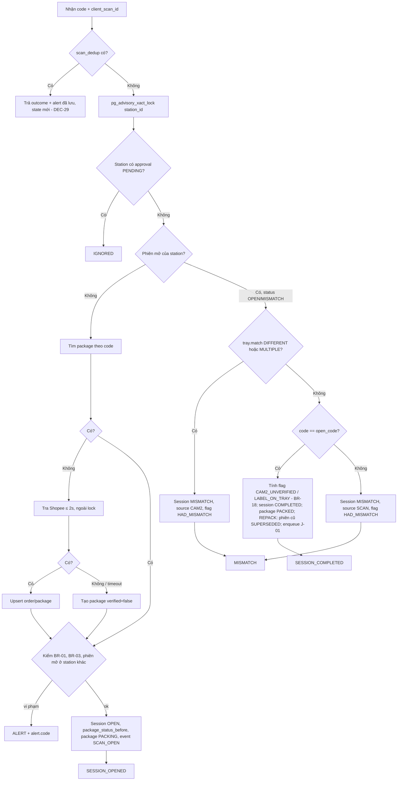

# BE Spec — 01 MVP đóng gói · ai-cam-be (api, worker, beat, vision, MediaMTX)

| | |
|---|---|
| Tác giả | khanhtt (BE) |
| Reviewer | khanhtt (tech lead, review qua subagent ở bước 5) |
| Trạng thái | Approved (G2 2026-10-04, có điều kiện DEC-33) |
| Tổng quan & contract | [02-tech-spec.md](02-tech-spec.md) · SRS [01-srs.md](01-srs.md) |
| Last update | 2026-10-05 · BE (M4: T-17, T-16, T-22 — DEC-121..124; chuẩn hoá template 2026-10-05) |

> **TL;DR** — Dựng mới `ai-cam-be` theo [architecture.md §4](../../system/architecture.md): 12 module, 19 bảng (1 migration đầu), 42 API + 2 kênh WS, 12 job.
> Điểm khó nhất: (1) `POST /station/scan` (API-11): state machine phiên, khóa theo station, idempotency, phải ≤ 1 giây p95. (2) Đồng bộ Cam 2 qua Redis → WS. (3) Cắt clip từ segment MediaMTX đúng mốc thời gian.
> Bắt đầu bằng khung repo + camera giả + spike S1–S3 (T-1..T-5) trước khi code nghiệp vụ.

Không viết lại contract: mọi request / response / mã lỗi theo [02 §6](02-tech-spec.md#6-api-contract).

---

## 1. Phạm vi

| Goals (lát/spec này làm) | Non-goals (cố ý không làm — để đâu) |
|---|---|
| Implement đủ API-01..92 + WS-01/02 theo [02 §6](02-tech-spec.md#6-api-contract), 12 job J-01..J-12, tiến trình `vision` | Phiên mở hàng hoàn (M04), đối soát (M06), khiếu nại (M08), FR-05.05 return request → Phase 2 ([01 §1](01-srs.md)) |
| API-11 ≤ 1 giây p95 (NFR-01; server ≤ 150 ms, ≤ 4 query) | Adapter TikTok Shop / Lazada → Phase 3 (chỉ chừa interface `PlatformAdapter`) |
| Clip ≤ 60 giây p95 sau khi đóng phiên (NFR-03), stream copy, SHA-256, chỉ đọc (ADR-008) | Sao lưu cloud (FR-02.08), link chia sẻ (FR-07.05), xem video thô (FR-07.06) → Phase 3 |
| Chạy offline trong LAN (NFR-09): Shopee chỉ ở worker + tra ≤ 2 giây trong scan | Nhận diện sản phẩm bằng AI → giai đoạn sau (ADR-005) |
| Bằng chứng: audit log không sửa được (trigger), URL media ký HMAC hạn 10 phút | Nhiều shop / nhiều kho: `platform_order_sn` UNIQUE toàn cục (DEC-12) → Phase 3 |
| Khung repo, compose, CI, camera giả, spike S1–S3 (T-1..T-5) | API nhận lỗi JS client (DEC-23), thông báo Zalo / Telegram (FR-06.04), báo cáo FR-09.02..04 → Phase 3 |

| API / job / lệnh | FR | Ghi chú |
|---|---|---|
| API-01..04 | FR-03.01, FR-10.01, 10.02 | Auth, `/me` |
| API-10..15 | FR-03.01..03.12, FR-01.02 | Station |
| API-20, 21 | FR-03.10, 03.12 | Duyệt |
| API-30..32 | FR-07.01..03, FR-09.01 | Tra cứu, báo cáo ngày |
| API-40..46 | FR-02.02, 02.07, 02.09, FR-07.02, 07.04 | Clip, xuất, cắt lại |
| API-50..54 | FR-05.09, 05.10 | Nhập CSV |
| API-60..65 | FR-01.01, 01.04, 01.05 | Station, camera |
| API-70..73 | FR-05.01, 05.02 | Shopee |
| API-80, 81 | FR-02.06, FR-01.02, 01.06 | Cài đặt, sức khỏe |
| API-90..92 | FR-10.01, 10.03, FR-03.01 | Người dùng, audit |
| WS-01, WS-02 | FR-03.06, 03.07, 03.12, FR-09.01 | Realtime |
| Job J-01..J-12 (§7) | FR-02.01..06, FR-03.09, FR-05.02..04, 05.06, FR-01.02, 01.06 | worker / beat |
| Tiến trình `vision` | FR-03.06, 03.07, FR-01.04 | Cam 2 |
| Lệnh CLI `aicam create-admin`, `aicam seed-demo` | — | Khởi tạo Admin đầu tiên; dữ liệu demo cho dev |

## 2. Cấu trúc code

Bố cục module: `models.py` · `schemas.py` (Pydantic) · `service.py` · `router.py` · `tasks.py` · `errors.py`. Module chỉ gọi nhau qua `service` (architecture.md §4.1). Mọi file là **Mới**.

| Layer / module | File | Trách nhiệm |
|---|---|---|
| Gốc | `pyproject.toml`, `uv.lock`, `alembic.ini`, `.env.example`, `README.md` | Phụ thuộc, ruff, mypy, pytest, import-linter |
| Docker | `docker/Dockerfile`, `docker/compose.yml`, `docker/compose.dev.yml`, `docker/mediamtx.yml`, `docker/Caddyfile`, `docker/fake-cams/` | Một image (Python 3.12 + FFmpeg); stack kho; camera giả phát file mẫu có barcode |
| Entrypoint | `src/aicam/entrypoints/{api,worker,beat,vision,cli}.py` | 4 tiến trình + CLI |
| core | `settings.py`, `db.py` (async engine, session, `unit_of_work`), `redis.py`, `clock.py` (now() giả lập được), `security.py` (JWT, Argon2id, Fernet, HMAC URL), `errors.py` (AppError → format lỗi 02 §6), `pagination.py`, `logging.py`, `audit.py` (`audit.record()`), `deps.py` (`current_user`, `require_roles(...)`, `current_station`) | Hạ tầng dùng chung |
| users | `modules/users/*` | USER, auth (API-01..04, 90..92), refresh token, khóa đăng nhập |
| stations | `modules/stations/*` | STATION, CAMERA, ROI, test camera, live URL (API-60..65), J-09; subscriber `camera.health` (J-08 đo trong `vision`, worker ghi DB) |
| orders | `modules/orders/*` | SHOP*, ORDER, ORDER_ITEM, PACKAGE, STATUS_HISTORY; chuyển `warehouse_status` (một hàm `transition()` duy nhất); API-30, 31 |
| sessions | `modules/sessions/*` | SESSION, SESSION_EVENT; `scan_service.py` (API-11), state machine phiên `state_machine.py`; API-10, 12, 15; job quá giờ (J-07) |
| approvals | `modules/approvals/*` | APPROVAL_REQUEST; API-13, 14, 20, 21 |
| media | `modules/media/*` | VIDEO_SEGMENT, CLIP, EXPORT; `ffmpeg.py` (lệnh cắt / encode), `signing.py`; API-40..45; J-01..J-03, J-10 |
| vision | `modules/vision/*` | `reader.py` (OpenCV + zxing-cpp), `tray.py` (khử nhiễu, ghi Redis) |
| platforms | `modules/platforms/{base.py, shopee/, mock/}` | `PlatformAdapter` (architecture.md §10.1), adapter Shopee, adapter mock; API-70..73; J-04..J-06 |
| imports | `modules/imports/*` | CSV_IMPORT; parse CSV / xlsx (`openpyxl`); API-50..53 |
| reports | `modules/reports/*` | API-32 |
| settings | `modules/settings/*` | SETTING (1 dòng), API-80, API-81 |
| realtime | `realtime/hub.py`, `realtime/router.py` | WS-01, WS-02; nghe Redis pub/sub, gửi theo kênh |
| workers | `workers/celery_app.py`, `workers/schedule.py` | Celery app, queue `default`, `video`, `export`, `sync`; lịch beat |
| tests | `tests/{unit,integration,contract}/`, `tests/fixtures/{segments,csv,shopee}/` | §11 |

## 3. Data

Một migration đầu `0001_initial`. Khóa chính `uuid` (UUID v7 sinh ở app). Thời gian `timestamptz` UTC. Enum lưu `text` + `CHECK` (dễ thêm giá trị bằng migration).

| Bảng | Field | Kiểu | Null | Default | Index / ràng buộc |
|---|---|---|:---:|---|---|
| `shop` | id, platform, platform_shop_id, name, auth_status, access_token_enc, refresh_token_enc, auth_expires_at, last_synced_at, last_sync_cursor, last_error, created_at | uuid, text, text, text, text, bytea, bytea, timestamptz, timestamptz, timestamptz, jsonb, timestamptz | name, token, *_at, cursor, error null | auth_status `DISCONNECTED` | UNIQUE (platform, platform_shop_id) |
| `order` | id, shop_id, platform_order_sn, platform_status, buyer_note, source, csv_import_id, created_at_platform, raw_payload, updated_at | uuid, uuid FK null, text, text, text, text, uuid FK null, timestamptz, jsonb, timestamptz | shop_id null khi CSV chưa gắn shop | source `API` | UNIQUE (platform_order_sn) — MVP một shop (AS: 1 shop Shopee); CHECK source IN (`API`,`CSV`) |
| `order_item` | id, order_id, sku, product_name, variation, quantity, image_url | uuid, uuid FK, text, text, text, int, text | sku, variation, image null | | INDEX (order_id); CHECK quantity > 0 |
| `package` | id, order_id, tracking_number, warehouse_status, platform_logistics_status, verified, updated_at | uuid, uuid FK null, text, text, text, bool, timestamptz | order_id null khi kiện chưa xác minh (BR-04) | `NEW`, verified true | UNIQUE (upper(tracking_number)); INDEX (warehouse_status, updated_at) |
| `station` | id, name, is_active, account_user_id, created_at | uuid, text, bool, uuid FK null | account null | true | UNIQUE (lower(name)); UNIQUE (account_user_id) |
| `camera` | id, station_id, role, rtsp_url, username, password_enc, mediamtx_path, status, last_seen_at, clock_offset_ms, roi | uuid, uuid FK, text, text, text, bytea, text, text, timestamptz, int, jsonb | username, password, last_seen, offset, roi null | status `OFFLINE` | UNIQUE (station_id, role); CHECK role IN (`CAM1`,`CAM2`) |
| `user` | id, username, display_name, role, password_hash, is_active, failed_logins, locked_until, created_at | uuid, text, text, text, text, bool, int, timestamptz | locked_until null | true, 0 | UNIQUE (lower(username)) |
| `refresh_token` | id, user_id, token_hash, client, expires_at, revoked_at, replaced_by | uuid, uuid FK, text, text, timestamptz, timestamptz, uuid | revoked, replaced null | | INDEX (user_id); UNIQUE (token_hash) |
| `session` | id, type, package_id, station_id, status, started_at, ended_at, open_code, close_code, cam2_code, flags, cancel_reason, note, supersedes_session_id, package_status_before, status_before_approval, mismatch (jsonb, DEC-39), cam2_seen_match, warn_notified | uuid, text, uuid FK, uuid FK, text, timestamptz, timestamptz, text, text, text, text[], text, text, uuid FK null, text, text, bool, bool | ended, close, cam2, reason, note, supersedes, status_before_approval null | type `PACK`, flags `{}`, false, false | **UNIQUE (station_id) WHERE status IN (`OPEN`,`MISMATCH`,`WAITING_APPROVAL`)** (BR-02); **UNIQUE (package_id) WHERE status IN (`OPEN`,`MISMATCH`,`WAITING_APPROVAL`)**; INDEX (package_id), (started_at), (station_id, started_at) |
| `session_event` | id, session_id, type, payload, at | uuid, uuid FK, text, jsonb, timestamptz | | | INDEX (session_id, at) |
| `scan_dedup` | client_scan_id, station_id, response, created_at | uuid PK, uuid, jsonb, timestamptz | | | Xóa > 10 phút (J-11) |
| `approval_request` | id, station_id, session_id, tracking_number, type, status, context, decision, decided_by, decided_at, note, created_at | uuid, uuid FK, uuid FK null, text, text, text, jsonb, text, uuid FK, timestamptz, text, timestamptz | session_id (REPACK), decision, decided_*, note null | `PENDING` | UNIQUE (station_id) WHERE status = `PENDING` |
| `video_segment` | id, camera_id, start_at, end_at, path, size_bytes | uuid, uuid FK, timestamptz, timestamptz, text, bigint | | | UNIQUE (camera_id, start_at); INDEX (camera_id, end_at) |
| `clip` | id, session_id, camera_role, status, start_at, end_at, duration_s, size_bytes, path, sha256, flags, held, held_by, held_at, error, created_at | uuid, uuid FK, text, text, timestamptz, timestamptz, numeric(8,2), bigint, text, text, text[], bool, uuid, timestamptz, text | path, sha, held_*, error null | `PENDING`, false | UNIQUE (session_id, camera_role); INDEX (end_at) WHERE held = false AND status = 'READY'. `retention_until` **không lưu**: tính khi đọc = `end_at + setting.retention_clip_days` (review #6, DEC-30) |
| `export` | id, session_id, layout, status, progress, path_video, path_info, sha256, error, created_by, created_at, expires_at | uuid, uuid FK, text, text, int, text, text, text, text, uuid FK, timestamptz, timestamptz | path, sha, error null | `QUEUED`, 0 | INDEX (created_by, created_at) |
| `csv_import` | id, status, file_name, file_path, counts, errors, preview_rows, created_by, created_at, committed_at, expires_at (file gốc xóa sau 90 ngày bởi J-11) | uuid, text, text, text, jsonb, jsonb, jsonb, uuid FK, timestamptz, timestamptz, timestamptz | committed null | `PREVIEW` | INDEX (created_at) |
| `status_history` | id, package_id, source, from_status, to_status, at, actor_user_id, actor_label | uuid, uuid FK, text, text, text, timestamptz, uuid, text | from, actor null | | INDEX (package_id, at) |
| `setting` | id (=1), retention_raw_days, retention_clip_days, session_warn_minutes, session_abandon_minutes, updated_at | int, int, int, int, int, timestamptz | | 1, 30, 90, 15, 30 | CHECK id = 1; CHECK các ràng buộc API-80 |
| `audit_log` | id, user_id, action, object_type, object_id, ip, at, data | bigserial, uuid, text, text, text, inet, timestamptz, jsonb | user, object, ip, data null | | INDEX (at), (object_type, object_id), (user_id, at) |

**Migration:** `0001_initial` tạo toàn bộ + seed `setting(id=1)`. Hệ thống mới nên không có backfill / tương thích ngược. `downgrade()` drop toàn bộ theo thứ tự FK. Từ migration thứ 2 trở đi: chỉ thêm cột nullable / bảng mới, không đổi tên trong cùng release.
**Bảo vệ `audit_log`:** trigger `audit_log_readonly` chặn `UPDATE`, `DELETE`, `TRUNCATE` với mọi user DB, kể cả owner (DEC-40, thay cho REVOKE theo user).
**Dữ liệu nhạy cảm:** `access_token_enc`, `refresh_token_enc`, `password_enc` mã hóa Fernet (`FERNET_KEY`); `password_hash` Argon2id; `refresh_token.token_hash` = SHA-256. Logger lọc các khóa `password`, `token`, `rtsp_url` (che phần user:pass trong URL).

## 4. Implement API

Chung: router dùng `require_roles(...)`; lỗi nghiệp vụ ném `AppError(code, http, message, details)`; handler chuyển thành format 02 §6. Mọi API ghi `audit.record()` theo bảng action ở 02 API-92.

| API | Validate input | AuthZ | Logic chính | Transaction / lock | Lỗi |
|---|---|---|---|---|---|
| API-01 login | username 1–64, password 1–128, `client` enum | công khai; rate limit Redis 10 sai / 5 phút / username | Kiểm `locked_until` → 423 ACCOUNT_LOCKED (`details.until`); verify Argon2; kiểm role khớp `client`; role STATION → station `is_active`; tạo refresh (TTL 30 ngày STATION, 7 ngày khác), cookie `rt_station` / `rt_dashboard` theo `client` | 1 tx | INVALID_CREDENTIALS, ACCOUNT_DISABLED, ACCOUNT_LOCKED, WRONG_CLIENT, STATION_INACTIVE, RATE_LIMITED |
| API-02 refresh | cookie + body `client` | token_hash hợp lệ, chưa revoke, `client` khớp | Đọc cookie theo `client`; xoay vòng: revoke cũ, tạo mới; dùng lại token đã xoay → revoke cả chuỗi (phát hiện đánh cắp) | `SELECT … FOR UPDATE` trên refresh_token | 401 UNAUTHENTICATED |
| API-03, 04 | — | đã đăng nhập | revoke refresh hiện tại; `/me` trả user + station + danh sách quyền | | |
| API-10 state | — | STATION | `station_state_service.build(station_id)`: phiên mở (nếu có) + package + items + tray từ Redis + cameras + today_count | đọc | |
| API-11 scan | `code` strip + upper, regex `SCAN_CODE_REGEX`; `client_scan_id` uuid | STATION | Xem §4.1 | Xem §4.1 | 403, 409 STATION_INACTIVE, 422 |
| API-12 cancel | reason `OUT_OF_STOCK`/`WRONG_SCAN`/`OTHER`; OTHER cần note ≤ 200 | STATION, phiên thuộc station | session → `CANCELLED`, package → `package_status_before` (`NEW`, hoặc `PACKED` nếu REPACK), enqueue J-01 (clip vẫn cắt cho phiên hủy) | advisory lock station | SESSION_NOT_OPEN |
| API-13 request | type; MISMATCH cần `session_id` ở `MISMATCH`; ASSIST cần `session_id` ở `OPEN`; REPACK cần tracking ở `PACKED` | STATION | Tạo approval PENDING (lưu `tracking_number`, `context` gồm `tray_match`); MISMATCH/ASSIST → lưu `status_before_approval`, session `WAITING_APPROVAL`; REPACK → không có phiên, station_state `WAITING_APPROVAL` dựa trên approval PENDING; publish WS-02 `approval.created` (chỉ ADMIN, SUPERVISOR) | advisory lock station + unique index PENDING / station | APPROVAL_ALREADY_PENDING, NOT_ELIGIBLE |
| API-14 withdraw | — | STATION, của mình | PENDING → WITHDRAWN; session `WAITING_APPROVAL` → `status_before_approval` | lock approval | ALREADY_RESOLVED |
| API-15 recent | — | STATION | 5 phiên gần nhất của station, `started_at` ≥ 00:00 giờ VN hôm nay, kèm clips (id, role, status) | | |
| API-20 list | status enum, phân trang | ADMIN, SUPERVISOR | sắp `created_at` tăng dần | | |
| API-21 decision | action hợp `type`; CLOSE_WITH_NOTE note 1–500 | ADMIN, SUPERVISOR | MISMATCH / ASSIST: CONTINUE → session `OPEN` (rồi `on_tray_changed` đánh giá lại tray); CLOSE_WITH_NOTE → từ chối `TRAY_STILL_DIFFERENT` nếu tray `DIFFERENT`/`MULTIPLE`, ngược lại như đóng phiên hợp lệ (BR-18, REPACK superseding) + note + flag `CLOSED_BY_SUPERVISOR`; CANCEL_SESSION → như API-12, reason `SUPERVISOR`. REPACK: kiểm kiện vẫn `PACKED` → mở phiên mới flag `REPACK`, `package_status_before = PACKED`, `supersedes_session_id` = phiên COMPLETED hiệu lực, kiện `PACKED → PACKING`; phiên cũ **chưa** đổi; REJECT → station về READY. Publish WS-01 + WS-02 | advisory lock station + `SELECT … FOR UPDATE` approval | ALREADY_RESOLVED (`details`: status, decided_by, decided_at), INVALID_ACTION, TRAY_STILL_DIFFERENT, NOT_ELIGIBLE (kiện đã rời `PACKED`) |
| API-30 search | q ≤ 64; ngày `YYYY-MM-DD`, from ≤ to, khoảng ≤ 92 ngày; enum; `session_status`, `session_flag` (EXISTS trên session trong khoảng ngày) | ADMIN, SUPERVISOR, CSKH | q → so khớp `upper(tracking_number)` hoặc `platform_order_sn`; ngày lọc theo `last_session.ended_at` giờ VN | đọc | |
| API-31 detail | — | như trên | package + order + items + sessions (mới nhất trước) + clips + status_history | đọc | NOT_FOUND |
| API-32 daily | date ≤ hôm nay | ADMIN, SUPERVISOR, CSKH | Đếm theo định nghĩa 02 API-32 (phiên, giờ VN); attention từ camera, approval, shop, disk (cache 5 giây Redis) | đọc | |
| API-40 play-url | — | ADMIN, SUPERVISOR, CSKH; STATION khi clip thuộc station + phiên trong ngày | Clip READY → URL `uid` = user hiện tại, `exp` = now+600, `sig` = HMAC-SHA256(`MEDIA_SIGNING_KEY`, `clip:{id}:{uid}:{exp}`) | | CLIP_NOT_READY, CLIP_DELETED, FORBIDDEN |
| API-41 media | `uid`, `exp`, `sig` | chữ ký | Kiểm sig (so sánh hằng thời gian) + exp; `FileResponse` hỗ trợ Range; request bắt đầu byte 0 → audit VIEW_CLIP với `user_id = uid` | | SIGNATURE_INVALID |
| API-46 rebuild | — | ADMIN, SUPERVISOR | Clip `FAILED` → `PENDING`, enqueue J-01 | lock clip | CLIP_NOT_FAILED |
| API-42 hold | bool | ADMIN, SUPERVISOR, CSKH | Đặt `held`, `held_by`, `held_at`; response `retention_until` = null khi held, ngược lại tính từ setting | lock clip | CLIP_DELETED |
| API-43 export | layout enum | ADMIN, SUPERVISOR, CSKH | Kiểm clip nguồn READY; tạo EXPORT QUEUED; enqueue J-03 | | CLIP_NOT_READY, CLIP_DELETED |
| API-44, 45 | — | người tạo / ADMIN; 45 chữ ký (`export:{id}:{file}:{uid}:{exp}`) | Trả trạng thái + URL ký (hạn 10 phút); 45 ghi audit `DOWNLOAD_EXPORT`; file ≤ 24 giờ (J-10 dọn) | | NOT_FOUND, SIGNATURE_INVALID |
| API-50 upload | ≤ 5 MB, `.csv` UTF-8 (BOM ok) / `.xlsx`, ≤ 5.000 dòng, cột bắt buộc `platform_order_sn`, `tracking_number`, `product_name`, `quantity` | ADMIN, SUPERVISOR | Parse đồng bộ (≤ 5.000 dòng, mục tiêu ≤ 5 giây); phân loại dòng NEW / UPDATE / SKIP (đơn nguồn API — BR-17) / ERROR; lưu file + preview, hạn 30 phút | | FILE_INVALID |
| API-51 commit | — | người tạo | Kiểm `PREVIEW`, chưa hết hạn, `error = 0`; upsert theo `platform_order_sn` / `tracking_number`; package đã có giữ `warehouse_status`; status_history | 1 tx, lock csv_import | IMPORT_HAS_ERRORS, IMPORT_EXPIRED |
| API-52, 53, 54 | phân trang | ADMIN, SUPERVISOR | template CSV tĩnh trong `imports/template.csv`; 54 trả file gốc | | FILE_EXPIRED (54) |
| API-60 stations | name 1–40; account role STATION | ADMIN | | | NAME_TAKEN, ACCOUNT_IN_USE |
| API-61 camera | rtsp_url `rtsp://`, ≤ 255 | ADMIN | Lưu (mã hóa pass); gọi MediaMTX API thêm / sửa path `cam-{camera_id}` (source = rtsp_url, record on) | | CAMERA_UNREACHABLE không chặn lưu |
| API-62 test | như API-61 | ADMIN | `ffmpeg -rtsp_transport tcp -i … -frames:v 1` timeout 8 giây → JPEG base64; đọc giờ camera qua ONVIF `GetSystemDateAndTime` nếu có | | CAMERA_UNREACHABLE (TIMEOUT/AUTH/STREAM) |
| API-63 snapshot | — | ADMIN, SUPERVISOR | 1 khung từ MediaMTX path | | CAMERA_UNREACHABLE |
| API-64 roi | 0 ≤ x,y; x+w ≤ 1; y+h ≤ 1; w,h ≥ 0.05 | ADMIN | Lưu; publish `vision.config` để vision nạp lại | | ROI_INVALID, ROI_ONLY_CAM2 |
| API-65 live | — | ADMIN, SUPERVISOR | Danh sách station + camera, `whep_url` = `/live/cam-{id}/whep` (Caddy proxy tới MediaMTX :8889, kiểm JWT + quyền qua `forward_auth` tới `/api/v1/live` — DEC-136) | | |
| API-70..73 | — | ADMIN | auth-url: `state` ngẫu nhiên lưu Redis 10 phút; callback: kiểm state, đổi code → token, lưu shop, J-04 ngay; sync: lock Redis `sync:{shop}` | | SYNC_IN_PROGRESS, PLATFORM_NOT_CONFIGURED |
| API-80 | ràng buộc 02 | GET: ADMIN, SUPERVISOR; PUT: ADMIN | PUT đổi retention áp ngay cho mọi clip (J-02 tính từ setting lúc chạy) | | VALIDATION_ERROR |
| API-81 | — | ADMIN, SUPERVISOR | `SELECT 1`, `PING`, MediaMTX `/v3/paths/list`, `shutil.disk_usage(VIDEO_ROOT)` | | |
| API-90..92 | username `[a-z0-9._-]{3,32}`, password ≥ 8 | ADMIN | PATCH role/is_active; LAST_ADMIN kiểm trong tx; revoke-sessions → revoke mọi refresh + đóng WS của user | lock khi đổi admin | USERNAME_TAKEN, LAST_ADMIN |
| WS-01, 02 | token query | STATION / ADMIN, SUPERVISOR, CSKH | `hub` đăng ký kênh Redis `ws:station:{id}`, `ws:dashboard` (mọi vai), `ws:approvals` (chỉ ADMIN, SUPERVISOR), `ws:user:{id}`; service publish sau commit | | đóng 4401 khi token hết hạn |

### 4.1 API-11 `POST /station/scan` — chi tiết

- Tra Shopee nằm **ngoài** advisory lock (nhả lock, tra, lấy lại lock và kiểm lại trạng thái) để không giữ lock 2 giây.
- **Thứ tự cứng (BR-06):** `tray.match` `DIFFERENT`/`MULTIPLE` luôn xét **trước** so mã; khi đó không bao giờ `COMPLETED`, nguồn lệch giữ `CAM2` (review #2). Unit test bắt buộc: khay 790, phiên 789, quét 789 hai lần → cả hai lần `MISMATCH`.
- `on_tray_changed()` (cùng advisory lock): phiên `OPEN` + tray `DIFFERENT`/`MULTIPLE` → `MISMATCH` (source CAM2, flag `HAD_MISMATCH`); phiên `MISMATCH` source CAM2 + tray về `MATCH`/`NOT_SEEN` → `OPEN`; phiên `WAITING_APPROVAL` → chỉ cập nhật `tray` trong state, không đổi trạng thái. Ghi `session.cam2_seen_match = true` khi lần đầu `MATCH` trong phiên.
- BR-18 khi đóng: `cam2_seen_match = false` hoặc tray `UNAVAILABLE` → flag `CAM2_UNVERIFIED`; tray `MATCH` (vẫn thấy chính mã phiên) → flag `LABEL_ON_TRAY`.
- Đóng phiên `REPACK`: trong cùng tx đặt phiên `supersedes_session_id` → `SUPERSEDED`. Hủy / bỏ dở phiên `REPACK` → kiện về `package_status_before` (`PACKED`), phiên cũ giữ nguyên (BR-03, review #1).
- Response lưu `scan_dedup` trong cùng transaction.
- Publish `ws:station:{id}` + `ws:dashboard` (`report.updated`) **sau commit** (`after_commit` hook).
- Ngân sách thời gian (không tra sàn): ≤ 4 query, mục tiêu p95 ≤ 150 ms phía server.

## 5. Quy tắc nghiệp vụ → nơi thực thi

| BR | Thực thi ở | Test |
|---|---|---|
| BR-01 | `scan_service` kiểm `order.platform_status IN (CANCELLED, IN_CANCEL)` hoặc `warehouse_status IN (CANCELLED, CANCELLED_AFTER_PACK)` → `ORDER_CANCELLED` (xét trước BR-03) | unit + integration API-11 |
| BR-02 | Partial unique index `session(station_id)` + advisory lock | integration: 2 request song song |
| BR-03 | `scan_service` (ALERT `ALREADY_PACKED` khi `PACKED`, `ALREADY_HANDED_OVER` khi đã rời kho); API-21 APPROVE_REPACK kiểm `PACKED`; đóng phiên REPACK đặt `SUPERSEDED` cho phiên cũ trong cùng tx; hủy/bỏ dở REPACK trả kiện về `PACKED` | integration: duyệt → hủy → kiện PACKED, phiên cũ COMPLETED; duyệt → hoàn tất → phiên cũ SUPERSEDED |
| BR-04 | `scan_service` tra adapter với `asyncio.timeout(2)`; package `verified=false`, flag `UNVERIFIED`; J-05 xác minh lại | unit với adapter mock chậm 3 giây |
| BR-05 | `scan_service` so `code == open_code` (đã upper) | unit |
| BR-06 | `on_tray_changed()` + nhánh T trong §4.1 (tray xét trước mã) + API-21 `TRAY_STILL_DIFFERENT` | unit: khay 790, quét 789 × 2 → MISMATCH × 2; integration với Redis giả lập tray |
| BR-18 | Đóng phiên trong `scan_service` / API-21 | unit: vision dừng → CAM2_UNVERIFIED; tray MATCH lúc đóng → LABEL_ON_TRAY |
| BR-09 | J-02 chọn `held = false AND end_at + retention_clip_days (setting hiện tại) < now()` | unit với clock giả; đổi setting 90 → 180 thì clip 100 ngày không bị xóa (AC-20) |
| BR-15 | J-09 so giờ ONVIF với server; `clock_offset_ms` > 1000 → attention `CLOCK_DRIFT` | unit |
| BR-16 | J-07 mỗi 30 giây: `started_at + warn` → WS cảnh báo (1 lần, `warn_notified`); `+ abandon` → `ABANDONED`, package → `package_status_before`, J-01; phiên `WAITING_APPROVAL` không bị bỏ dở | unit với clock giả |
| BR-17 | `imports.service.classify_row()` SKIP khi order.source = API; adapter sync ghi đè đơn CSV, đổi source → API, ghi audit `ORDER_OVERWRITTEN_BY_API` với `data` = bản CSV trước đó (FR-05.10 lịch sử) | unit |
| Chuyển `warehouse_status` | `orders.service.transition(package, to, source, actor)` kiểm bảng chuyển hợp lệ (01 §7 v0.3, gồm `PACKED → PACKING` khi repack và `PACKING → PACKED` khi hủy repack), ghi status_history; gọi từ mọi nơi | unit: mọi cặp hợp lệ / không hợp lệ |

## 6. Concurrency & toàn vẹn

| Tình huống | Cách xử lý |
|---|---|
| Quét 2 lần rất nhanh / FE retry | `client_scan_id` + `scan_dedup` (PK) → trả lại response cũ |
| Hai request scan cùng station | `pg_advisory_xact_lock(hash(station_id))` |
| Cùng kiện quét ở 2 station | Partial unique `session(package_id)` → ALERT `PACKED_ELSEWHERE_IN_PROGRESS` |
| Cam 2 đổi trạng thái giữa lúc scan | `on_tray_changed()` cũng lấy cùng advisory lock |
| Hai Supervisor duyệt cùng lúc | `SELECT … FOR UPDATE` approval; người sau → ALREADY_RESOLVED |
| Job cắt clip chạy 2 lần | UNIQUE `clip(session_id, camera_role)`; job bỏ qua nếu `READY` |
| Đồng bộ Shopee chạy chồng | Redis lock `sync:{shop_id}` TTL 10 phút |
| Ghi WS trước commit | Publish trong `after_commit` |
| Celery mất job | `acks_late=True`, `task_reject_on_worker_lost=True`; J-01 còn được J-11 quét lại phiên đóng > 5 phút chưa có clip READY |

## 7. Job nền · queue · tích hợp ngoài

| Tên | Trigger / lịch | Input | Làm gì | Retry / timeout | Lỗi cuối thì |
|---|---|---|---|---|---|
| J-01 `media.build_session_clips` (queue `video`) | Sau đóng / hủy / bỏ dở phiên | session_id | Chờ tới khi segment phủ `ended_at + 5s` đã đóng (≤ 70 giây, `countdown`); với mỗi camera: chọn segment giao `[start−5s, end+5s]`, `ffmpeg -f concat -ss … -to … -c copy`, `chmod 0444`, SHA-256, thiếu đoạn → flag `VIDEO_INCOMPLETE`; WS `session.clip_ready` | 3 lần, cách 30 giây; timeout 120 giây | clip `FAILED` + `error`; attention trên dashboard |
| J-02 `media.enforce_retention` | 02:00 hằng ngày | — | Xóa segment `end_at < now − raw_days`; xóa file clip `end_at + retention_clip_days < now AND held = false` (setting đọc lúc chạy) → `DELETED`; audit `DELETE_CLIP` (actor hệ thống) | 1 lần | log + metric |
| J-03 `media.render_export` (queue `export`, worker riêng concurrency 1) | API-43 | export_id | `ffmpeg -preset veryfast -crf 26`, mỗi camera scale 1280×720, H.264 + `drawtext` (mã vận đơn, mã đơn, giờ thực từ `start_at`, tên station; font Be Vietnam Pro trong image) + `hstack` cho SIDE_BY_SIDE; cập nhật `progress` theo `-progress`; ghi `info.json` (hash nguồn, hash bản xuất, người xuất, thời điểm); WS `export.updated` | 1 lần; timeout 10 phút | `FAILED` + error |
| J-04 `platforms.sync_orders` (queue `sync`) | 5 phút / shop có `CONNECTED`; sau callback | shop_id | Gọi `ensure_fresh_token()` trước (J-12); `list_updated_orders(since=cursor − 10 phút)`; upsert order / item / package; cập nhật `platform_status`; đơn hủy khi kho `PACKED` → `CANCELLED_AFTER_PACK` | tenacity 5 lần backoff mũ; timeout 4 phút | `shop.last_error`, attention SYNC_ERROR |
| J-05 `platforms.verify_unverified` | 10 phút | — | Package `verified=false` → `find_by_tracking`; có → gắn order, `verified=true` | như J-04 | giữ unverified |
| J-06 `platforms.sync_shipping_status` | 15 phút | — | Kiện `PACKED`/`HANDED_OVER` → `get_shipping_status` → `HANDED_OVER` / `DELIVERED` | như J-04 | log |
| J-07 `sessions.check_timeouts` | 30 giây | — | BR-16 | — | — |
| J-08 `stations.check_camera_health` (vòng lặp 2 giây trong tiến trình `vision`, không ghi DB) | 2 giây | — | MediaMTX `/v3/paths/list`: `bytesReceived` không tăng trong 6 giây hoặc `ready=false` → OFFLINE (phát hiện ≤ 8 giây, AC-10); tăng lại → ONLINE. Khi đổi trạng thái: publish Redis `camera.health`; subscriber trong `api` ghi `camera.status` + flag phiên + gửi WS; đổi trạng thái → WS + phiên đang mở trên camera đó flag `VIDEO_INCOMPLETE` | — | — |
| J-09 `stations.check_clock_drift` | 10 phút | — | ONVIF `GetSystemDateAndTime` → `clock_offset_ms` | timeout 5 giây | bỏ qua camera không hỗ trợ ONVIF (ghi `null`) |
| J-10 `media.index_segments` + dọn export | 1 phút | — | Quét thư mục ghi của MediaMTX, thêm `video_segment` cho file đã đóng (dựa vào tên file có thời điểm bắt đầu + `ffprobe` duration); xóa export > 24 giờ | — | log |
| J-11 `maintenance.housekeeping` | 5 phút | — | Xóa `scan_dedup` > 10 phút, csv_import PREVIEW quá hạn → EXPIRED, file CSV gốc > 90 ngày → xóa file, phiên đóng > 5 phút chưa có clip → enqueue J-01 | — | — |
| J-12 `platforms.refresh_tokens` | 30 phút + gọi trước J-04 | shop_id | Access token còn < 1 giờ → `adapter.refresh()`; lưu token mới | 3 lần backoff | `auth_status = EXPIRED`, attention `SYNC_ERROR` (D7 hiện "Hết hạn") |

**Vision** (`entrypoints/vision.py`, không phải Celery): mỗi CAM2 một thread; đọc RTSP từ MediaMTX (`rtsp://mediamtx:8554/cam-{id}`), lấy 4 khung / giây, cắt ROI, `zxingcpp.read_barcodes` (định dạng Code128, QR); kết quả = tập mã thấy trong khung; khử nhiễu: đổi trạng thái khi cùng tập mã ≥ 2 khung liên tiếp; `NOT_SEEN` khi 0 mã ≥ 4 khung. Ghi `tray:{station_id}` (TTL 5 giây, làm mới mỗi khung) + publish `tray:{station_id}` khi đổi. Mất stream > 3 giây → `UNAVAILABLE`. Nạp lại ROI khi nhận `vision.config`.

**Shopee adapter:** theo interface architecture.md §10.1; ký HMAC-SHA256 theo tài liệu Shopee Open Platform v2; tên endpoint, mapping trạng thái → chốt sau spike S1 (T-3). Adapter `mock` (fixtures JSON) dùng cho dev, test và khi `SHOPEE_ENABLED=false` ở môi trường dev. **Đã code (T-16, T-22) theo tài liệu công khai — xem mục "Shopee adapter (T-16, T-22)"; chưa test với Shopee thật — thiếu tài khoản partner.**

## 8. Cache & hiệu năng

| Chỗ | Chiến lược | Invalidate | Mục tiêu (NFR) |
|---|---|---|---|
| API-11 | Không cache; ≤ 4 query có index; tray từ Redis | — | NFR-01 ≤ 1 giây p95 (server ≤ 150 ms) |
| API-32 | Redis 5 giây theo `date` | hết hạn | ≤ 300 ms |
| `setting` | Bộ nhớ tiến trình 30 giây | PUT API-80 publish `settings.changed` | — |
| API-30 | Index `upper(tracking_number)`, `platform_order_sn`, `(station_id, started_at)` | — | NFR-04 ≤ 2 giây với 1 triệu kiện |
| Clip | Stream copy | — | NFR-03 ≤ 60 giây p95 |
| Export | Queue `export` riêng, `veryfast` 720p mỗi camera | — | AC-08: encode ≤ 20 giây p95 với clip ≤ 3 phút (đo ở spike S3) |

## 9. Config · secret · flag

| Key | Mặc định | Môi trường | Ý nghĩa |
|---|---|---|---|
| `DATABASE_URL` | — | mọi | Postgres |
| `REDIS_URL` | `redis://redis:6379/0` | mọi | |
| `JWT_SECRET`, `FERNET_KEY`, `MEDIA_SIGNING_KEY` | — (bắt buộc, secret) | mọi | Ký JWT, mã hóa token / mật khẩu camera, ký URL media |
| `VIDEO_ROOT` | `/data/video` | mọi | Gốc NAS |
| `MEDIAMTX_API_URL`, `MEDIAMTX_RTSP_URL` | `http://mediamtx:9997`, `rtsp://mediamtx:8554` | mọi | |
| `TZ_DISPLAY` | `Asia/Ho_Chi_Minh` | mọi | Ranh giới ngày cho báo cáo |
| `SCAN_CODE_REGEX` | `^[A-Z0-9-]{8,40}$` | mọi | Có thể chỉnh sau spike |
| `PLATFORM_LOOKUP_TIMEOUT_S` | `2` | mọi | BR-04 |
| `SHOPEE_ENABLED` | `false` | prod bật khi có key | Flag tích hợp |
| `SHOPEE_PARTNER_ID`, `SHOPEE_PARTNER_KEY`, `SHOPEE_REDIRECT_URL`, `SHOPEE_BASE_URL` | — | prod / staging | Secret |
| `PLATFORM_ADAPTER` | `shopee` (prod), `mock` (dev/test) | | |
| `SHOPEE_TIMEOUT_S`, `SHOPEE_MAX_ATTEMPTS`, `SHOPEE_BACKOFF_S` | `10`, `5`, `0.5` | mọi | Mỗi request Shopee; thử lại giãn cách mũ 0,5 / 1 / 2 / 4 giây hoặc theo `Retry-After` (FR-05.08, DEC-122) |
| `SHOPEE_LOOKUP_LOOKBACK_MIN` | `60` | mọi | Tra mã khi quét / J-05: dò đơn cập nhật trong 60 phút (DEC-123) |
| `SHOPEE_INITIAL_SYNC_DAYS` | `3` | mọi | J-04 lần đầu sau khi kết nối |
| `IMPORT_ROOT` | `/data/imports` | mọi | File CSV / xlsx gốc (volume `imports`), đường dẫn tương đối trong DB (DEC-105, DEC-121) |
| `CLIP_PADDING_S` | `5` | mọi | FR-02.02 |
| `CLIP_SETTLE_S`, `CLIP_GAP_TOLERANCE_S`, `CLIP_CUT_TIMEOUT_S`, `SEGMENT_CLOSED_AFTER_S` | `3`, `1.5`, `90`, `15` | mọi | J-01 / J-10 (Spike S3, DEC-101) |
| `MEDIA_URL_TTL_S` | `600` | mọi | Hạn URL ký API-40/44 |
| `EXPORT_PRESET`, `EXPORT_SIDE_SCALE`, `EXPORT_TTL_HOURS`, `EXPORT_TIMEOUT_S`, `EXPORT_FONT_FILE` | `veryfast`, `1280:720`, `24`, `600`, Be Vietnam Pro SemiBold | mọi | J-03 (DEC-101); hạ preset / kích thước khi server chậm |
| `FFMPEG_BIN`, `FFPROBE_BIN` | `ffmpeg`, `ffprobe` | mọi | |
| `LOGIN_MAX_FAILS`, `LOGIN_LOCK_MINUTES` | `10`, `15` | mọi | |
| `CORS_ORIGINS` | rỗng (cùng origin qua Caddy) | dev: `http://localhost:5173` | |

## 10. Observability

| Loại | Tên / nội dung | Ngưỡng cảnh báo |
|---|---|---|
| Log | JSON (structlog): `request_id`, `user_id`, `station_id`, `session_id`, `tracking_number`, `outcome`, `duration_ms` | — |
| Metric | `aicam_scan_duration_seconds` (histogram, label outcome) | p95 > 1 giây trong 5 phút |
| Metric | `aicam_clip_build_seconds`, `aicam_clip_failed_total` | p95 > 60 giây; failed > 0 |
| Metric | `aicam_export_render_seconds` | p95 > 20 giây với clip ≤ 3 phút (ngân sách AC-08: 20 giây encode + 10 giây thao tác) |
| Metric | `aicam_camera_online{station,role}` | = 0 quá 30 giây |
| Metric | `aicam_queue_length{queue}` | `video` > 50; `export` > 5 |
| Metric | `aicam_platform_sync_errors_total{shop}` | > 3 liên tiếp |
| Metric | `aicam_disk_used_ratio` | > 0.8 |
| Metric | `aicam_vision_frames_total{station}`, `aicam_vision_decode_ratio` | decode ratio < 0.5 khi có phiên mở |
| Health | `/api/v1/system/health` (API-81), `/healthz` (liveness, không auth) | |

## 11. Test BE

| Mức | Phạm vi | Case chính |
|---|---|---|
| Unit | `state_machine`, `orders.transition`, `scan_service` (với repo giả), BR-01..06, 09, 15..17, `imports.classify_row`, `signing`, `ffmpeg` build command, vision khử nhiễu | Mọi nhánh flowchart §4.1; mọi cặp chuyển trạng thái |
| Integration | API + Postgres + Redis (Postgres của compose dev local, service container trên CI — DEC-39), adapter mock, `clock` giả | API-11 song song 2 request; idempotency; MISMATCH do Cam 2; duyệt đồng thời; CSV 5.000 dòng; retention +91 ngày; quá giờ 30 phút |
| Media | FFmpeg với `tests/fixtures/segments` (3 segment 60 giây có OSD giờ) | Clip phủ đúng khoảng ±1 keyframe; thiếu segment → VIDEO_INCOMPLETE; SHA-256 ổn định; export SIDE_BY_SIDE phát được |
| Contract | So `/openapi.json` sinh ra với 02 §6 (schemathesis hoặc snapshot) | Mọi API-xx có path, field, mã lỗi đúng tên — đã làm T-19: `tests/contract/`, snapshot `openapi.json` (DEC-131) |
| Hiệu năng | locust: 2 station × 120 lần quét / giờ + 1 CSKH tra cứu | NFR-01, NFR-05 — đã làm T-19: `tests/load/locustfile.py`, số đo ở mục "Contract test, test tải, staging local (T-19)" |
| Vision | Ảnh mẫu từ spike S2 (phiếu thật, góc, ánh sáng) | Đọc ≥ 95%; 2 phiếu → MULTIPLE |

## 12. Task

Ước lượng theo ngày công một dev. `T-1..T-5` là nền móng và spike (01 §13 "Spike + khung repo").

| # | Việc | FR / API | Phụ thuộc | Ước lượng |
|---|---|---|---|---|
| T-1 | Khung repo `ai-cam-be`: uv, ruff, mypy, pytest, import-linter, Dockerfile (Python + FFmpeg + font), compose.dev, CI GitHub Actions | — | — | 1 |
| T-2 | MediaMTX + camera giả (`fake-cams`: phát file mẫu có barcode qua RTSP), cấu hình record fMP4 60 giây | FR-02.01 | T-1 | 1 |
| T-3 | Spike S1 Shopee: endpoint, ký, trạng thái, rate limit → cập nhật mapping trong 02a §7 | FR-05.* | — | 2 (+ chờ duyệt) |
| T-4 | Spike S2 vision với camera thật: đặt camera, ROI, tỉ lệ đọc, CPU | FR-03.06 | T-2 | 2 |
| T-5 | Spike S3 cắt clip: độ trễ, độ chính xác mốc, camera rớt | FR-02.02 | T-2 | 1 |
| T-6 | core: settings, db, redis, clock, errors, pagination, logging, audit, security; migration `0001_initial`; CLI `create-admin` | — | T-1 | 2 |
| T-7 | users + auth: API-01..04, 90..92, refresh xoay vòng, khóa đăng nhập | FR-10.*, FR-03.01 | T-6 | 2 |
| T-8 | stations + camera: API-60..65, đồng bộ path MediaMTX, J-08, J-09 | FR-01.01..06 | T-6, T-2 | 2 |
| T-9 | orders + `transition()` + adapter interface + mock adapter | FR-05.07 | T-6 | 1 |
| T-10 | sessions: state machine, API-10, 11, 12, 15, scan_dedup, J-07 | FR-03.01..09, 03.11 | T-7, T-8, T-9 | 3 |
| T-11 | realtime hub: WS-01, WS-02, after_commit publish | FR-03.06, 09.01 | T-10 | 1 |
| T-12 | vision process + `on_tray_changed` (BR-06) | FR-03.06, 03.07, 01.04 | T-4, T-11 | 2 |
| T-13 | approvals: API-13, 14, 20, 21 | FR-03.10, 03.12 | T-11 | 1,5 |
| T-14 | media: J-10 index segment, J-01 cắt clip, API-40, 41, 42, 46, J-02 retention | FR-02.01..06, 02.09, 07.02 | T-5, T-10 | 3 |
| T-15 | export: API-43..45, J-03 (overlay, side-by-side) | FR-07.04, 02.07 | T-14 | 2 |
| T-16 | Shopee adapter + API-70..73, J-04..J-06, J-12, tra 2 giây trong scan | FR-05.01..04, 05.06, 05.08 | T-3, T-9, T-10 | 3 |
| T-17 | imports: API-50..54, BR-17 | FR-05.09, 05.10 | T-9 | 1,5 |
| T-18 | reports API-32, settings API-80, health API-81, J-11 | FR-09.01, 02.06 | T-14 | 1 |
| T-19 | Contract test + locust + compose.yml production + Caddyfile + README vận hành | NFR-01, 05, 09 | T-10..T-18 | 2 |

Tổng ≈ 34 ngày công (chưa tính chờ duyệt Shopee).

## Spike S3 — cắt clip & encode bản xuất (T-5, đo 2026-10-05)

Máy đo: MacBook Apple M4 Pro, Docker trong colima VM **4 vCPU / 6 GB**, image `aicam-dev` (FFmpeg 5.1.9 Debian 12). Nguồn: camera giả (`fake-cams`, H.264 1280×720 15 fps, GOP 2 giây, nội dung `testsrc2` — khó nén hơn cảnh thật), ghi qua MediaMTX v1 (`fmp4`, segment 60 giây, part 1 giây). Script: `ai-cam-be/scripts/spike_s3.py`, `scripts/spike_s3_encode.sh`. **Chưa đo trên server kho và camera thật** (thiếu tài nguyên) — số dưới đây là máy dev.

| Hạng mục | Kết quả đo | Kết luận |
|---|---|---|
| Ranh giới segment MediaMTX | Khe giữa 2 segment liên tiếp: −0,087 … 0,000 giây (8 lần đo, 2 camera) | Liền mạch; ngưỡng `CLIP_GAP_TOLERANCE_S` = 1,5 giây cho VIDEO_INCOMPLETE |
| Cắt stream copy (concat demuxer, `-ss/-to` đầu vào) — đoạn đã ghi xong | 30 giây: 0,14 giây · 120 giây (3 segment): 0,30 giây · 170 giây: 0,27 giây · ngang ranh giới 40 giây: 0,19 giây · 180 giây: 0,41 / 0,14 giây | Thời gian cắt không đáng kể so với NFR-03 |
| Độ chính xác mốc | Clip dài hơn yêu cầu 0,07–0,14 giây (lùi về keyframe trước `-ss`); cuối clip đúng `-to` | Luôn phủ đủ `[mở − 5s, đóng + 5s]` với GOP 2 giây; camera thật GOP dài hơn → đầu clip dài thêm tối đa 1 GOP |
| Cắt từ **segment đang ghi** (fMP4 part 1 giây) | Đọc được, không lỗi. Chờ `đóng + 5 giây + settle` rồi cắt: settle 1 / 2 / 3 giây → clip có sau **6,7 / 7,7 / 8,8 giây**; clip đủ 70,0 giây yêu cầu (dư 0,01–0,04 giây) | Không cần chờ segment đóng (≤ 65 giây) hay J-10. Chọn settle 3 giây (dư cho part 1 giây + trễ ghi đĩa) |
| End-to-end trên stack dev (API thật, T-14) | Phiên 40 giây → 2 clip READY sau **9,2 giây**; phiên có camera rớt 20 giây → 10,1 giây, CAM1 `VIDEO_INCOMPLETE`, khe 04:34:32 → 04:34:59 (27 giây: 20 giây tắt + MediaMTX nối lại ≈ 7 giây). OSD khung đầu / cuối 04:33:01 / 04:33:51 khớp `start_at` / `end_at` đã lưu (04:33:01,8 / 04:33:51,9) | NFR-03 (≤ 60 giây) đạt trên máy dev |
| Encode bản xuất 1 camera, clip 180 giây 720p15 (`veryfast`, CRF 26, 2 drawtext) | 5 lần: min 10,3 · median 14,0 · max/p95 16,4 giây | Đạt AC-08 (≤ 20 giây) |
| Encode SIDE_BY_SIDE 2×1280×720 `veryfast` | Lần 1 (máy bận — đang ghi + test chạy song song): min 15,4 · median 18,8 · max 28,4 giây. Lần 2 (máy rảnh, 3 lần): 17,8 / 19,3 / 17,9 giây; 28,6 MB | Sát ngưỡng 20 giây; vượt khi CPU bị chia |
| SIDE_BY_SIDE 2×960×540 `veryfast` | 16,0 / 17,0 / 15,4 giây; 11,7 MB | Dự phòng: nhanh hơn ≈ 12 %, file nhỏ hơn |
| SIDE_BY_SIDE 2×1280×720 `superfast` | 14,6 / 14,7 / 14,4 giây; 60,4 MB | Dự phòng: nhanh hơn ≈ 20 %, file gấp đôi |
| Nguồn tổng hợp 1080p25 H.265 (gần camera thật hơn), 180 giây | 1 camera: 53,2 / 59,9 / 77,7 giây; SIDE_BY_SIDE: 105,8 / 116,0 / 167,4 giây | **Không đạt AC-08** trên VM 4 vCPU nếu camera thật 1080p H.265 nội dung khó nén — rủi ro RB-7 còn mở, phải đo lại trên server kho + camera thật (giải mã H.265 1080p là phần tốn nhất) |

Quyết định: DEC-101.

## Vision Cam 2 (T-12) — kiểm trên camera giả (2026-10-05)

Máy dev (colima 4 vCPU), `fake-cam2` 1280×720 15 fps qua MediaMTX, tiến trình `vision` (OpenCV 5.0 + zxing-cpp 3.1, Code128 + QR, giải mã 4 khung / giây). Test: `tests/unit/test_vision.py`, `tests/integration/test_vision_tray.py`, `tests/qa/test_m3_live.py`.

| Hạng mục | Kết quả | Ghi chú |
|---|---|---|
| Đọc mã trên khung camera giả | Mọi khung lấy mẫu đều đọc đúng; giải mã ≈ 3,5 ms / khung 720p (cả khung) | Phiếu tổng hợp, nét, không nghiêng — **không** đại diện phiếu thật |
| Bám vòng 60 giây của fake-cam2 | Thấy đủ …001 → trống → …002 → …002 + …003 → trống; mã mới nhận sau ≈ 0,5 giây (2 khung), khay trống sau ≈ 1 giây (4 khung) | QA live `test_tray_follows_fake_cam2` |
| Khay đổi → phiên `MISMATCH` CAM2 | Cùng một sự kiện WS `station.state` với lúc khay đổi; khoảng WS "trống" → "MISMATCH" 3–5,5 giây khớp lịch 5 giây của video | NFR-02 / AC-04 ≤ 2 giây trên camera giả đạt theo thiết kế (≤ 1 giây); số thật cần T-4 |
| CPU | ≈ 5 % một nhân (1 luồng Cam 2 720p15 + J-08), RAM ≈ 120 MB | Camera thật 4MP / H.265 sẽ tốn hơn — đo ở T-4 |
| Vision dừng | `tray.match` = `UNAVAILABLE` ≤ 5 giây (TTL), đóng phiên vẫn được, cờ `CAM2_UNVERIFIED` | TC-03.25 |

**T-4 (camera thật): chưa test — thiếu camera thật.** Chưa có số tỉ lệ đọc ≥ 95% (AC-04, TC-03.21: 40 lần), độ trễ thật ≤ 2 giây, CPU với 4MP, vị trí lắp / ánh sáng / ROI, phiếu nhăn / in trùng. Không suy ra các số này từ camera giả (RB-1 còn mở).

## Shopee adapter (T-16, T-22) — trạng thái kiểm thử (2026-10-05)

**Chưa test với Shopee thật — thiếu tài khoản partner (T-3 chờ duyệt).** Code theo tài liệu công khai Shopee Open Platform v2; test bằng HTTP giả (`respx`) tái hiện định dạng response / lỗi (`tests/unit/test_shopee_adapter.py`, `tests/integration/test_shops_api.py`, `tests/integration/test_platform_jobs.py`); QA live (`tests/qa/test_m4_live.py`) chạy luồng kết nối + J-04 trên worker thật bằng adapter mock (`SHOPEE_ENABLED=true`).

| Hạng mục | Cách làm | Đã kiểm | Cần xác nhận ở T-3 |
|---|---|---|---|
| Ký request | HMAC-SHA256(partner_key) hex; public: `partner_id + path + timestamp`; cấp shop: `+ access_token + shop_id` | Unit: so chữ ký từng request | Có — đối chiếu với request thật / sandbox |
| Ủy quyền | `GET /api/v2/shop/auth_partner?redirect=` (redirect kèm `state`); callback nhận `code`, `shop_id`; `POST /api/v2/auth/token/get`; tên shop `GET /api/v2/shop/get_shop_info` | INT (mock) + unit (respx) | Shopee có giữ query `state` trong `redirect` không; từ chối ủy quyền trả gì (đang coi "không có `code`" = `denied`) |
| Làm mới token | `POST /api/v2/auth/access_token/get` (access 4 giờ theo `expire_in`) | Unit + INT J-12 | Hạn refresh token (tài liệu: 30 ngày) |
| Đơn | `get_order_list` (`update_time`, ≤ 15 ngày / lần, `page_size` 100, `cursor`) → `get_order_detail` (≤ 50 / lần, `item_list,package_list,…`) → `logistics/get_tracking_number` từng kiện (`package_number`) | Unit (phân trang, cửa sổ 15 ngày, map item / ghi chú `message_to_seller`) | Tên trường thật, giới hạn page / batch |
| Tra khi quét | Không có API tìm đơn theo mã vận đơn → dò đơn cập nhật 60 phút + nhớ cặp mã vận đơn → mã đơn (≤ 5.000) | INT: TC-03.12 / 03.13 với adapter Shopee + respx (cắt 2 giây) | Có API tra theo tracking không; độ trễ thật |
| Vận chuyển | `get_order_detail` → `package_list[].logistics_status` + `order_status` → `HANDED_OVER` / `DELIVERED`; đơn nhiều kiện ghép qua `get_tracking_number(package_number)` | Unit mapping + INT J-06 (mock) | Bảng trạng thái thật (`shopee/mapping.py`) |
| Lỗi / rate limit | Thử lại 5 lần với lỗi mạng / 5xx / 429 / `error_server`, `error_busy`, `error_too_many_request`, `error_rate_limit`; lỗi token (`error_auth`, `invalid_access_token`, `invalid_acceess_token`, HTTP 401/403) → không thử lại, refresh 1 lần | Unit: 503×2 rồi OK (TC-05.08), 503 liên tục (TC-05.09), 429 + `Retry-After`, lỗi tham số không thử lại | Mã lỗi rate limit thật, hạn mức / phút; token bucket Redis (ADR-007) chưa làm |
| Log | Mỗi lần gọi: `shopee_call` path, attempt, HTTP, `error`, `request_id`, `duration_ms` — không ghi token / sign / query | Unit | — |

## Contract test, test tải, staging local (T-19, 2026-10-05)

**Contract test** (`ai-cam-be/tests/contract/`, DEC-131): 119 test, xanh.
- `spec.py`: 52 mục API-01..92 rút từ 02 §6 v0.4 (method, path, mã thành công, trường response / request bắt buộc, giá trị enum).
- `test_openapi_contract.py` (không cần DB): mọi API-xx có trong `/api/v1/openapi.json` với đúng method + status; đủ trường (đi sâu `$ref`, `anyOf`, mảng); enum chứa giá trị 02 nêu; **không có route `/api/v1` ngoài 02 §6**; trường `*_at` là `date-time`; snapshot `ai-cam-be/openapi.json` khớp code (lệch → `uv run python scripts/export_openapi.py`) — FE dùng file này để sinh client (architecture §14.3).
- `test_runtime_contract.py` (Postgres + Redis dev): luồng mở → ASSIST → CONTINUE → đóng → ALREADY_PACKED → API-15, 30, 31, 32, 80, 90, 92: mọi mốc giờ có `Z` (≥ 15 mốc); `context` API-20 đủ 4 khóa; `attention[].kind`; lỗi 401 / 403 / 404 / 422 / `INVALID_CREDENTIALS` cùng dạng `{error: {code, message, details}}`.
- `test_ws_contract.py`: khung WS `{type, data, at}`, `at` dạng `Z`.
- Ngoài contract (yêu cầu thêm): `tests/integration/test_import_concurrency.py` — API-51 song song thật (DEC-133).

**Test tải** (`tests/load/locustfile.py`, DEC-134). Đo trên **máy dev** (MacBook, Docker qua Colima, stack `compose.dev.yml`, 1 tiến trình uvicorn, adapter sàn `mock`, locust chạy cùng máy) — **không phải server kho**; số trên server kho cần đo lại ở staging thật / G5.

| Kịch bản | Thời lượng | Tải | API-11 mở (p50 / p95 / max) | API-11 đóng (p50 / p95 / max) | Khác (p95) | Lỗi |
|---|---|---|---|---|---|---|
| NFR-05 nhịp thật: 2 station × 120 lần quét / giờ + 1 CSKH | 10 phút (không phải 1 giờ) | 40 lần quét, 130 request tra cứu | 35 / 80 / 80 ms | 33 / 50 / 50 ms | API-30 26 ms, API-31 12 ms, API-32 46 ms | 0 / 182 |
| Stress: 4 station quét liên tục (đóng gói 1–2 giây) + 1 CSKH | 5 phút | 1.121 lần quét ≈ 13.400 lần / giờ (≈ 28 lần NFR-05 với 4 station) | 18 / 26 / 76 ms | 15 / 26 / 149 ms | API-10 12 ms, API-30 19 ms, API-32 24 ms | 0 / 1.316 |

Kết luận trên máy dev: NFR-01 (≤ 1 giây p95) dư khoảng 10 lần; mục tiêu server ≤ 150 ms (§8) đạt. Không đo: tra Shopee thật trong lúc quét (NFR-01 ≤ 3 giây — chưa có tài khoản), tải khi camera thật ghi + cắt clip + xuất cùng lúc trên server kho.

**Staging local** (máy dev, `docker compose -p aicam-staging --env-file <tạm> -f docker/compose.yml`, cổng 8088 / 8443 / ICE 8190, secret sinh ngẫu nhiên, `APP_ENV=production`, `PLATFORM_ADAPTER=mock`, không camera; đã `down -v` + xóa image, volume `aicam-dev_*` không đụng):

| # | Bước | Kết quả |
|---|---|---|
| 1 | `config -q`; thiếu secret | Hợp lệ; thiếu `JWT_SECRET` … → compose dừng, báo tên biến |
| 2 | `up -d --build` | `migrate` Exited (0) trước `api`; api healthy; mọi service chạy |
| 3 | `https://localhost:8443/healthz` qua Caddy; `http://…:8088` | 200 `{"status":"ok"}`; 308 → HTTPS |
| 4 | `aicam create-admin`; `aicam seed-demo` | Tạo Admin; seed-demo bị chặn (exit 2) |
| 5 | Đăng nhập Admin qua Caddy | 200; cookie `rt_dashboard` `HttpOnly; Secure; SameSite=strict; Path=/api/v1/auth` |
| 6 | Tạo tài khoản STATION + station; quét mở / đóng qua HTTP | `SESSION_OPENED` (UNVERIFIED) 58 ms, `SESSION_COMPLETED` 138 ms; API-30 thấy kiện `PACKED` |
| 7 | WS `wss://…/ws/station` qua Caddy | `pong`, `station.state` PACKING → READY khi quét; token sai → đóng 4401; `at` dạng `Z` |
| 8 | FE qua Caddy | `/`, `/admin/packages`, `/station` 200 (SPA fallback); asset 200 `immutable`; **`*.js.map` 404** |
| 9 | Header | nosniff, `X-Frame-Options DENY`, `Referrer-Policy no-referrer`, Permissions-Policy, COOP; không `Server` |
| 10 | `/live/cam-…/whep` | Không token 401; token STATION 403; Admin → tới MediaMTX (404 vì path không có camera); WHIP / `/live/` khác 404 |
| 11 | `FORWARDED_ALLOW_IPS` | = IP Caddy `172.30.20.10`; log api ghi IP client (gateway Docker) chứ không phải IP Caddy → `X-Forwarded-For` được tin |
| 12 | Cổng | Chỉ Caddy 80/443 + ICE UDP/TCP; api, Postgres, Redis, API MediaMTX không publish. MediaMTX: `webrtcAdditionalHosts` = `LAN_IP`, ICE `:8190`, quyền chỉ read / playback / api / metrics, `recordDeleteAfter` 0 |
| 13 | `pg-backup.sh once` | `aicam-….dump` + `imports-….tgz`, log `backup_ok` |
| 14 | Secret dạng `dev-only-` khi `APP_ENV=production` | Settings báo lỗi, api không khởi động |
| 15 | Access log Caddy | `/ws/station?token=REDACTED` |

**Chưa test** (cần server / mạng kho): live view WHEP có hình qua Caddy + ICE UDP trên LAN; cài chứng chỉ gốc Caddy trên máy station Windows; `pg_restore` theo docs/ops.md §6 (mới chạy sao lưu, chưa khôi phục); lịch sao lưu theo giờ (chỉ chạy `once`); `compose.override.yml` gắn video vào NAS; nâng cấp / rollback `alembic downgrade -1` trên dữ liệu thật; test tải 1 giờ đủ NFR-05 và với camera thật.

## Phương án đã cân nhắc

Chỉ lựa chọn riêng phía BE. Lựa chọn xuyên suốt (scan trả 200 + `outcome`, WebSocket thay poll, xuất clip bất đồng bộ) ở [02 §9](02-tech-spec.md#9-phương-án-đã-cân-nhắc); chọn stack (Python, Celery, MediaMTX, zxing-cpp) ở [architecture.md §2.2](../../system/architecture.md) và ADR-002..005.

| Phương án | Ưu | Nhược | Chọn? (lý do) |
|---|---|---|---|
| **`pg_advisory_xact_lock(hashtext('station:{id}'))` + partial unique index phiên mở** | Khóa nằm trong tx DB, tự nhả khi commit / rollback; không đụng dòng `station`; `on_tray_changed` dùng chung khóa | Khóa theo chuỗi hash, không thấy trong bảng; phải nhớ lấy ở mọi đường ghi phiên | ✔ DEC-11 (`sessions/service.py`) |
| `SELECT … FOR UPDATE` trên dòng `station` | Quen thuộc, nhìn thấy khóa trong `pg_locks` theo dòng | Chặn cả sửa station (API-60) và ghi có FK tới station trong lúc giữ khóa; luồng vision phải đọc dòng station chỉ để khóa | ✗ |
| Lock phân tán Redis (`SET NX` + TTL) | Không tải DB | Nằm ngoài tx DB: TTL hết giữa chừng hoặc Redis mất → hai request cùng ghi; thêm điểm lỗi | ✗ (DEC-11: DB là nguồn sự thật) |
| **Dedup bằng bảng `scan_dedup` (PK `client_scan_id`), ghi trong cùng tx với phiên** | Response lưu và trạng thái phiên commit cùng lúc → retry luôn nhận đúng outcome (DEC-29) | +1 ghi mỗi lần quét; cần J-11 dọn > 10 phút | ✔ |
| Dedup bằng Redis `SETNX` theo `client_scan_id` (TTL 10 phút) | TTL tự hết, không cần job dọn | Không cùng tx với DB: crash giữa commit và ghi Redis → retry chạy lại nghiệp vụ | ✗ |
| Tra Shopee **ngoài** advisory lock (nhả, tra ≤ 2 giây, lấy lại, kiểm lại) | Không giữ khóa station tới 2 giây; quét khác của station không chờ | Phải kiểm lại trạng thái sau khi lấy lại khóa | ✔ (§4.1) |
| Tra Shopee trong lock | Code tuyến tính | Giữ khóa ≤ 2 giây mỗi mã lạ | ✗ |
| **Celery + Redis broker** (queue `default`, `video`, `export`, `sync` + beat) | Có Beat cho 12 job định kỳ, `acks_late`, retry sẵn, nhiều queue | Nặng, không có type cho mypy (`ignore_missing_imports`) | ✔ ([architecture.md §2.2](../../system/architecture.md), ADR-004) |
| arq / Dramatiq / RQ | Nhẹ hơn | Hệ sinh thái nhỏ hơn; lịch định kỳ phải thêm thư viện riêng | ✗ |
| **Phát hiện camera mất tín hiệu: vòng lặp 2 giây trong `vision`** | Phát hiện ≤ 8 giây (AC-10 ≤ 10 giây) | Logic health nằm ngoài worker | ✔ DEC-31 |
| Celery beat cho J-08 | Cùng chỗ với job khác | Beat không hợp chu kỳ 2 giây | ✗ |
| **Không lưu `retention_until`, tính từ setting lúc chạy** | Đổi cấu hình có hiệu lực ngay, không cần backfill (AC-20) | Mỗi lần đọc phải tính | ✔ DEC-30 |
| Lưu `retention_until` theo clip | Truy vấn đơn giản | Đổi setting phải cập nhật hàng loạt; dễ xóa nhầm bằng chứng | ✗ |
| **Chặn sửa `audit_log` bằng trigger** | Áp mọi user DB, kể cả owner | Trigger ẩn với người đọc code | ✔ DEC-40 |
| `REVOKE UPDATE, DELETE` theo user DB | Chuẩn quyền Postgres | Dev / prod dùng chung user owner → không có tác dụng | ✗ |
| **Queue `export` riêng, concurrency 1, `veryfast` 720p** | Encode không chặn cắt clip; đạt AC-08 | Thêm một worker | ✔ DEC-32 |
| **Vision đọc RTSP relay của MediaMTX** | Camera chỉ một kết nối (ADR-003) | Phụ thuộc MediaMTX sống | ✔ DEC-14 |
| Vision kết nối camera trực tiếp | Bớt một chặng | Camera rẻ giới hạn số kết nối | ✗ |
| **Integration test với Postgres của compose dev / service container CI** | Ổn định trên colima | Cần chạy compose trước khi test | ✔ DEC-39 |
| testcontainers | Tự dựng DB cho mỗi lần chạy | Không ổn định với colima | ✗ |

## Rủi ro & câu hỏi mở

Nguồn: [02 §11](02-tech-spec.md#11-rủi-ro--câu-hỏi-mở), [03 §5](03-plan.md#5-rủi-ro-tiến-độ), [01 câu hỏi mở Q11–Q13](01-srs.md), review code M1 (2026-10-05). Ai trả lời: khanhtt nếu không ghi khác.

| ID | Rủi ro / câu hỏi | Ảnh hưởng | Giảm thiểu / ai trả lời | Hạn |
|---|---|---|---|---|
| RB-1 | Cam 2 đọc mã < 95% (AC-04) | Cao — BR-06 không bắt được phiếu sai | Spike S2 trước T-12; `tray.match = UNAVAILABLE` không chặn phiên (BR-18 gắn `CAM2_UNVERIFIED`); không đạt → change request (camera / ánh sáng / vị trí) | T-4 (M3) |
| RB-2 | Chưa có quyền Shopee Open Platform (Q11) | Cao — API-70..73, J-04..J-06, J-12 không chạy thật | `SHOPEE_ENABLED=false` + nhập CSV (T-17) + adapter mock; chủ shop trả lời Q11 | T-3 (M4) |
| RB-3 | Tên endpoint, mapping trạng thái, rate limit Shopee chưa xác minh | Trung bình — sửa adapter, §7 | Adapter đã code theo tài liệu công khai (T-16, T-22), test bằng HTTP giả; điểm chưa chắc ghi ở DEC-123 + mục "Shopee adapter (T-16, T-22)" — kiểm lại với tài khoản partner | T-3 |
| RB-4 | Mã vận đơn ngoài `SCAN_CODE_REGEX` `^[A-Z0-9-]{8,40}$` | Thấp — quét hợp lệ bị `INVALID_CODE` | Kiểm 50 phiếu thật; regex là config | T-4 |
| RB-5 | Camera không hỗ trợ ONVIF (AC-17, DEC-33) → J-09 không đo được lệch giờ | Trung bình — mất cảnh báo `CLOCK_DRIFT` (BR-15) | Change request: OSD + OCR, hoặc chọn camera có ONVIF | T-4, T-5 |
| RB-6 | Cắt clip theo keyframe lệch 1–2 giây; độ trễ clip chưa đo (NFR-03 ≤ 60 giây) | Trung bình — clip thiếu đầu / cuối phiên | Đã đo (Spike S3): đầu clip lùi ≤ 1 GOP nên luôn phủ đủ; clip có sau ≈ 9 giây trên máy dev. Còn đo lại với camera thật (GOP thực tế) ở T-4 | T-4 |
| RB-7 | Encode export (AC-08 ≤ 20 giây p95 với clip ≤ 3 phút) | **Cao** — Spike S3: 720p15 H.264 đạt (1 camera ≤ 16,4 giây; ghép 17,8–19,3 giây khi máy rảnh, 28,4 giây khi bận); nguồn 1080p25 H.265 tổng hợp 60–167 giây | `EXPORT_PRESET` / `EXPORT_SIDE_SCALE` cấu hình được (DEC-101); đo lại trên server kho + camera thật; nếu vượt: camera ghi thêm sub-stream 720p cho xuất, hoặc server mạnh hơn / có tăng tốc phần cứng | T-4, trước G4 |
| RB-8 | WS qua Caddy bị ngắt khi idle | Thấp | Đóng (T-19): Caddy `reverse_proxy` không đặt timeout idle cho WS; client ping 20 giây. Staging local: WS qua Caddy nhận `pong` + `station.state` (mục "Contract test, test tải, staging local (T-19)"). Chưa thử phiên dài nhiều giờ | — |
| RB-9 | Thu hồi đăng nhập station (API-91 revoke-sessions): access JWT còn dùng được tới ≤ 15 phút, WS đang mở chưa bị đóng ngay (review code M1, chốt làm sau) | Trung bình — máy station bị thu hồi vẫn quét được ≤ 15 phút | Đóng — user chấp nhận trễ ≤ 15 phút, không đóng WS ngay (DEC-55) | — |
| RB-10 | Cờ `VIDEO_INCOMPLETE` khi camera OFFLINE giữa phiên (J-08 subscriber) chưa gắn ở M1 (review code M1) | Trung bình — clip thiếu đoạn không được đánh dấu | Đóng (T-14): subscriber `camera.health` gắn cờ phiên đang mở; J-01 gắn cờ clip + phiên khi khe hở > 1,5 giây hoặc không có video (DEC-102) | — |
| RB-11 | Định dạng giờ trong response API chưa thống nhất hậu tố `Z` (UTC) (review code M1) | Thấp | Đóng (T-19, DEC-132): response Pydantic đã `Z`; JSON tự ghép (WS `at`, `alert.data.packed_at`, `details.decided_at` / `until`, `shop.last_error.at`) dùng `clock.iso_z`; contract test runtime kiểm mọi mốc giờ API chính | — |
| RB-12 | J-09 giữ transaction DB trong lúc gọi ONVIF (timeout 5 giây / camera) (review code M1) | Thấp — giữ kết nối DB lâu khi nhiều camera chậm | Gọi ONVIF ngoài tx, chỉ mở tx khi ghi `clock_offset_ms` | Khi làm T-4 (ONVIF thật) |
| RB-13 | Thời hạn khiếu nại Shopee thực tế > 90 ngày? (Q13) | Thấp — clip bị xóa trước khi cần | `retention_clip_days` cấu hình được (API-80); chủ shop trả lời | Trước G5 |
| RB-14 | Phiên chờ duyệt lâu rồi được "Cho tiếp tục": J-07 vẫn tính quá giờ từ `started_at` (BR-16) → có thể cảnh báo / bỏ dở ngay sau khi duyệt (T-13) | Thấp–Trung bình — người đứng bàn phải quét mở lại; clip vẫn cắt, không mất bằng chứng | Đóng — DEC-60: đồng hồ quá giờ tính lại từ lúc yêu cầu duyệt kết thúc (timer_base = max(started_at, decided_at gần nhất)), commit 97abd2e | — |

## Decisions

| DEC | Bối cảnh | Lựa chọn | Lý do | Người chốt |
|---|---|---|---|---|
| DEC-11 | Khóa tuần tự cho scan | `pg_advisory_xact_lock` theo station + partial unique index | Không cần lock phân tán Redis; DB là nguồn sự thật | khanhtt (BE) |
| DEC-12 | Ràng buộc mã đơn | UNIQUE `order.platform_order_sn` toàn cục (MVP một shop) | Đơn giản; nhiều shop → đổi thành (shop_id, sn) ở Phase 3 | khanhtt (BE) |
| DEC-13 | Lưu bằng chứng xem clip | Audit `VIEW_CLIP` khi request byte 0 qua API-41 | Range request gọi nhiều lần; chỉ ghi một lần mỗi lần phát | khanhtt (BE) |
| DEC-39 | Lệch spec khi code T-6 | (1) Thêm cột `session.mismatch jsonb` (API-10 cần `mismatch.source/expected/actual`, 02a §3 thiếu). (2) Integration test dùng Postgres compose dev / service container CI thay testcontainers (không ổn định với colima). (3) `seed-demo` dời sang T-10 (cần service đơn hàng + station) | Phát hiện khi implement | khanhtt (tự quyết) |
| DEC-40 | Chặn sửa audit_log | Trigger DB thay REVOKE | Dev/prod có thể dùng chung một user owner; trigger áp mọi user | khanhtt (tự quyết) |
| DEC-45 | Chống dò mật khẩu (T-7) | Khóa tài khoản sau 10 lần sai lưu ở DB (`423 ACCOUNT_LOCKED`, 15 phút); `429 RATE_LIMITED` theo IP (30 lần sai / 5 phút, Redis) thay vì theo username | Hai cơ chế không chồng mã lỗi cho cùng một tình huống; IP chặn dò nhiều tài khoản | khanhtt (tự quyết) |
| DEC-46 | Hạ tầng Celery chưa có task riêng trong 03 (T-8) | Dựng `workers/celery_app.py` + `tasks.py`, entrypoint worker/beat, compose `vision` / `worker` / `beat` ngay ở T-8 (J-09 là job đầu tiên). Bus Redis trong api (`realtime/bus.py`) nhận `camera.health`. `users/queries.py` cho module khác đọc user mà không vòng import | Job đầu tiên cần hạ tầng; tránh đọc chéo bảng | khanhtt (tự quyết) |
| DEC-47 | Lệch spec khi code T-10 | (1) Đọc khay ngay lúc mở phiên để đặt `cam2_seen_match` (phiếu đã khớp trước khi quét thì vision không phát sự kiện mới → tránh cờ CAM2_UNVERIFIED sai). (2) `tray.match` khi không có phiên: NOT_SEEN / MULTIPLE / DIFFERENT theo số mã (S1 không dùng). (3) Mọi entrypoint nạp `aicam.db_models` — lỗi thật: khóa ngoại `order.csv_import_id` không phân giải ở tiến trình api/CLI; test chạy tiến trình mới cho từng entrypoint | Phát hiện khi implement / đối chứng | khanhtt (tự quyết) |
| DEC-48 | Lệch spec khi code T-20 | (1) Publish realtime qua `realtime/publish.py` (kênh Redis `ws:*`) có trước hub WS (T-11). (2) J-07 gửi `alert` (`SESSION_WARN`, `SESSION_ABANDONED`) xuống station. (3) Tắt kiểm `iat`/`nbf` của PyJWT, kiểm mọi mốc thời gian bằng `core.clock` (lỗi thật khi tua giờ trong test: token 'phát hành ở tương lai'). (4) `media/queries.py` để sessions đọc clip không chéo bảng | Phát hiện khi implement | khanhtt (tự quyết) |
| DEC-49 | WebSocket (T-11) | Hub `realtime/hub.py`: accept trước rồi mới đóng 4401/4403 (đóng trước accept thành HTTP 403 → trình duyệt chỉ thấy 1006, FE không biết refresh); log lỗi task; test bằng uvicorn thật + client `websockets` (TestClient hủy task app lúc đóng). Scan / hủy phiên đẩy `station.state` + `report.updated`; camera đổi trạng thái đẩy `camera.status` + `station.state` | Phát hiện khi test với server thật | khanhtt (tự quyết) |
| DEC-30 | Retention khi đổi cấu hình (review #6) | Không lưu `retention_until`; tính từ setting lúc chạy | Đổi cấu hình có hiệu lực ngay, không mất bằng chứng | khanhtt (tự quyết) |
| DEC-31 | Phát hiện camera mất tín hiệu (review #10) | Vòng lặp 2 giây trong `vision`, ngưỡng 6 giây không có byte mới | Đạt AC-10 ≤ 10 giây; Celery beat không hợp chu kỳ 2 giây | khanhtt (tự quyết) |
| DEC-32 | Export (review #13) | Queue `export` riêng, preset `veryfast` 720p | Không chặn cắt clip; đạt AC-08 | khanhtt (tự quyết) |
| DEC-14 | Vision đọc từ đâu | RTSP relay của MediaMTX (không kết nối camera lần 2) | Camera chỉ một kết nối; theo ADR-003 | khanhtt (BE) |
| DEC-101 | Kết quả Spike S3 (T-5) | (1) J-01 cắt thẳng từ file trên đĩa **gồm segment đang ghi**, chờ `ended_at + CLIP_PADDING_S + CLIP_SETTLE_S` (3 giây) thay vì chờ segment đóng / J-10. (2) Cắt `-f concat -ss -to -i … -c copy` (`-ss/-to` là tùy chọn đầu vào). (3) Giữ export `veryfast` CRF 26, mỗi camera 1280×720 (DEC-32) nhưng thêm cấu hình `EXPORT_PRESET`, `EXPORT_SIDE_SCALE` để hạ khi server kho chậm. (4) Khe hở > 1,5 giây = thiếu video | Clip có sau ≈ 9 giây (NFR-03 dư); ghép 720p sát 20 giây và 1080p H.265 vượt AC-08 → giữ chất lượng mặc định, chừa nút vặn cấu hình, đo lại với phần cứng thật (RB-7) | khanhtt (tự quyết, ủy quyền) |
| DEC-102 | Lệch spec khi code T-14 | (1) Migration `0002`: thêm `clip.deleted_at`, `clip.timeline` (jsonb: giây trong clip → giờ thực từng đoạn) — overlay giờ bản xuất đúng cả khi clip có khe hở (concat gộp khe hở). (2) `clip.start_at/end_at` lưu giờ thực clip phủ (đã lùi keyframe), không phải khoảng yêu cầu. (3) Clip `FAILED` ở API-40/41 trả `409 CLIP_NOT_READY` kèm `details.status = FAILED` (02 không có mã riêng); `410 CLIP_DELETED` kèm `details.deleted_at`, `retention_clip_days`. (4) `session.clip_ready` gửi cả WS-02 (FE DEC-71 cần). (5) API-30/31 làm trong T-14 (03 chưa gán task nào; FR-07.01..03 trỏ T-14); API-31 `clips[]` thêm `deleted_at`, `flags`; clip DELETED có `retention_until` = ngày bị xóa (FE DEC-76); phiên thêm `cancel_reason`, `note`; timeline thêm `from_status`. (6) J-10 thêm đối soát path MediaMTX: thêm lại path camera bị mất (MediaMTX khởi động lại → ngừng ghi), xóa path `cam-<uuid>` không còn trong DB (nguyên nhân ổ dev đầy 64 GB); bỏ dòng `video_segment` khi file biến mất. (7) `VIDEO_INCOMPLETE`: camera OFFLINE giữa phiên (subscriber `camera.health`) + khe hở > 1,5 giây / không có video khi cắt. (8) Compose dev: service `video-init` chown volume video cho uid 10001, MediaMTX chạy uid 10001 (worker ghi clip, J-02 xóa video thô). (9) J-01 thử lại 3 lần: chưa đủ video → 10 giây, lỗi FFmpeg → 30 giây; lần cuối → FAILED. (10) Không có metric Prometheus (chưa có hạ tầng) — log `clip_built` có `build_s`, `after_close_s` | Phát hiện khi implement / đo live | khanhtt (tự quyết, ủy quyền) |
| DEC-103 | Lệch spec khi code T-21 | (1) J-02 xóa video thô theo **đĩa** (giờ trong tên file < mốc − 2 phút) rồi xóa dòng `video_segment` `end_at` < mốc — dọn cả video của camera đã xóa khỏi DB. (2) Clip: khóa dòng → kiểm lại `held = false`, `READY`, quá hạn → xóa file → `DELETED`, `deleted_at`, audit `DELETE_CLIP` (`user_id` null, `data`: sha256, số ngày, lý do `RETENTION`), commit từng clip; API-42 khóa cùng dòng nên giữ clip đúng lúc J-02 chạy vẫn an toàn. Clip `FAILED` (không có file) không bị retention đổi. (3) Lịch `crontab(19:00 UTC)` = 02:00 giờ VN. (4) API-42 không đổi gì khi gửi lại cùng giá trị (không ghi audit trùng); clip PENDING / FAILED vẫn giữ được. (5) API-46 audit `REBUILD_CLIP` theo phiên, 404 khi phiên không tồn tại | Phát hiện khi implement | khanhtt (tự quyết, ủy quyền) |
| DEC-104 | Lệch spec khi code T-15 | (1) File xuất ở `exports/{id}/` (`video.mp4`, `info.json`), giữ `EXPORT_TTL_HOURS` = 24 giờ theo 02a API-44/45 rồi J-10 xóa file **và dòng** `export` (API-44 → 404). Lệch: architecture §8.2 / ADR-008 ghi "bản xuất giữ 30 ngày" — theo 02a (bản xuất tạo lại được từ clip gốc), cần architect thống nhất. (2) API-44 người không phải người tạo / ADMIN → 404 (không lộ); response thêm `session_id`, `layout` (thêm trường, không phá contract). (3) Audit `EXPORT_CLIP` khi tạo (API-43), `DOWNLOAD_EXPORT` khi tải từ byte 0 (API-45, cả 2 file). (4) Overlay: dòng 1 `<mã vận đơn> · Đơn <mã đơn sàn> · <station>`, dòng 2 giờ VN `dd/MM/yyyy HH:mm:ss` theo `clip.timeline` (đúng cả sau khe hở); không có mã nhân viên (DEC-1). Ghép: bỏ phần đầu camera bắt đầu sớm hơn để 2 hình cùng giờ; clip có khe hở thì không dịch, giờ theo Cam 1. (5) Compose: service `worker-export` (`-Q export -c 1`), `worker` bỏ queue `export` (DEC-32). (6) `info.json`: export_id, session_id, layout, tracking_number, platform_order_sn, station_name, giờ phiên, giờ video, `sha256` (bản xuất), `source_clip_sha256`, `exported_by`, `exported_at`, `generator`. (7) Tiến độ: ghi DB + WS `export.updated` (kênh `ws:user:{người tạo}`) mỗi khi tăng ≥ 5 %. J-03 chạy 1 lần (không retry), timeout 600 giây; lỗi → FAILED, xóa file dở. (8) Live (stack dev): ghép 2×720p clip 50 giây READY sau 4,2 giây; 1 camera 28,7 giây sau 2,0 giây; giờ overlay khớp OSD camera | Phát hiện khi implement / đo live | khanhtt (tự quyết, ủy quyền) |
| DEC-105 | Lệch spec khi code T-18 | (1) API-32: `packed` chỉ đếm phiên `COMPLETED` kết thúc trong ngày (phiên bị thay thế `SUPERSEDED` không đếm — tránh đếm kiện 2 lần); `stations[]` chỉ station đang bật, `state` = `WAITING_APPROVAL` khi có yêu cầu PENDING, `last_scan_at` = mốc mở / đóng phiên mới nhất. Thêm trường tùy chọn theo FE DEC-72: `stations[].tracking_number` (kiện đang đóng gói), `CLOCK_DRIFT.station_name/role`, `CAMERA_OFFLINE.role`. Thêm `attention` kind **`CLIP_FAILED`** `{count}` (clip FAILED tạo trong 7 ngày — 02a J-01 "lỗi cuối → attention", 02 chưa có kind này). `DISK_USAGE` khi ≥ 80 %. Cache Redis 5 giây theo ngày (số liệu có thể trễ ≤ 5 giây sau `report.updated`). (2) API-80 PUT bắt buộc đủ 4 trường; phút 1–1440 (02 chỉ nêu ngày 1–365); audit `SETTINGS_UPDATE` có before/after; chưa có cache setting trong tiến trình nên không cần publish `settings.changed`. (3) API-81: mỗi thành phần timeout 3 giây, lỗi → `ERROR` (luôn 200); `sync[].last_error` trả nguyên jsonb `shop.last_error`. (4) J-11: file CSV gốc đường dẫn tương đối tính từ `IMPORT_ROOT` (`/data/imports`) — T-17 lưu theo quy ước này; phiên kết thúc 5 phút – 24 giờ chưa có clip hoặc còn clip PENDING → đẩy lại J-01. (5) J-01: station không có camera vai đó → FAILED ngay, không thử lại | Phát hiện khi implement | khanhtt (tự quyết, ủy quyền) |
| DEC-111 | Lệch spec khi code T-12 (vision + `on_tray_changed`) | (1) Vision báo khay đổi qua **một** kênh Redis `tray.changed` `{station_id}` (02a §7 ghi kênh `tray:{station_id}`) — Bus của api đăng ký tên kênh cố định. Khóa `tray:{station_id}` giữ định dạng `{"codes", "updated_at"}` mà `sessions/tray.py` đọc; ghi lại mỗi khung (TTL 5 giây); mất stream > 3 giây / camera bị gỡ / station tắt → **xóa khóa** (= `UNAVAILABLE`), không thêm trường. (2) **Quét mở phiên khi khay đang có phiếu khác** (`DIFFERENT` / `MULTIPLE`): phiên vẫn được mở (kiện `PACKING`) nhưng chuyển ngay `MISMATCH` nguồn `CAM2`, cờ `HAD_MISMATCH`, trong cùng transaction, `outcome = MISMATCH` — vision không phát sự kiện mới vì khay không đổi, nếu không xét ở đây phiên sẽ `OPEN` với phiếu sai trên khay (BR-06). Lệch nhỏ bảng `outcome` 02 §6 API-11 (`MISMATCH` vốn ghi "đang mở + mã ≠ mã phiên"); FE chọn panel theo `state` nên hiện S3 + âm lỗi (không phát bíp "ok" như `SESSION_OPENED`) — cần architect ghi nhận vào 02. (3) `on_tray_changed`: chỉ `OPEN` ↔ `MISMATCH` nguồn `CAM2`; `MISMATCH` nguồn `SCAN` không tự hết khi khay đổi (chỉ quét đúng mã mới đóng); `MISMATCH` CAM2 mà phiếu sai đổi → cập nhật `mismatch.actual`; event `MISMATCH_CLEARED`; đổi trạng thái → `station.state` + `report.updated`, chỉ khay đổi → `station.state`. (4) Vision chỉ nhận mã khớp `SCAN_CODE_REGEX` (bỏ QR / mã khác trên hộp để không MISMATCH giả); đọc liên tục (xả buffer), giải mã mỗi 0,25 giây; OpenCV timeout mở 5 giây / đọc 3 giây + watchdog 1 giây; nạp lại camera khi `vision.config` (API-64) và mỗi 10 giây; tiến trình thoát khi một vòng chết để Docker khởi động lại. (5) Subscriber `camera.health` giữ như T-8 / T-14 (ghi trạng thái camera, `VIDEO_INCOMPLETE`, WS); Cam 2 rớt → vision tự `UNAVAILABLE` ≤ 4 giây. (6) Chưa có metric `aicam_vision_*` (chưa có hạ tầng Prometheus, như DEC-102 (10)). (7) T-4 không làm được (thiếu camera thật) — xem mục "Vision Cam 2 (T-12)" | Phát hiện khi implement / chạy với fake-cam2 | khanhtt (tự quyết, ủy quyền) |
| DEC-112 | Lệch spec khi code T-13 (API-13, 14, 20, 21) | (1) API-20: `status` mặc định `PENDING` (khớp MSW FE), `page_size` ≤ 100, cũ nhất trước; item thêm `decision`, `decided_by` `{id, display_name}`, `decided_at`, `note` (thêm trường). (2) `context` mọi loại = `{expected, actual, source, tray_match}` (REPACK: `expected` = mã, `actual` / `source` null). Khay đổi trong lúc chờ MISMATCH / ASSIST → cập nhật `context.tray_match` + WS-02 **`approval.updated`** (sự kiện mới, chỉ ADMIN / SUPERVISOR; FE đã invalidate mọi `approval.*`) để D13 khóa / mở "Đóng phiên có ghi chú" theo khay hiện tại — **lệch contract 02 WS-02** (thêm `type`), architect ghi nhận. (3) API-14: `approval.resolved` với `status = WITHDRAWN` (D13 bỏ dòng); rút yêu cầu cũng ghi `decided_at` (DEC-60), `decided_by` null; yêu cầu của station khác → 404; phiên về `status_before_approval` rồi đánh giá lại khay (khay có thể đổi trong lúc chờ). (4) API-21: khóa station (advisory) trước rồi `FOR UPDATE` yêu cầu — cùng thứ tự API-13/14/quét; `CANCEL_SESSION` gửi thêm WS-01 `alert` `{code: SESSION_CANCELLED_BY_SUPERVISOR}` (FE station đã dùng, 02 chưa ghi); `CLOSE_WITH_NOTE` dùng chung đường đóng phiên (cờ Cam 2 BR-18, REPACK → phiên cũ `SUPERSEDED`, J-01), `close_code` null, ghi chú vào `session.note`; `APPROVE_REPACK` mở phiên `REPACK` (+ `UNVERIFIED` nếu kiện chưa xác minh), `supersedes_session_id` = phiên `COMPLETED` mới nhất, gắn `approval_request.session_id` = phiên mới, đánh giá khay ngay (DEC-111); kiện đã rời `PACKED` → `NOT_ELIGIBLE`, yêu cầu vẫn `PENDING` (Từ chối được); phiên không còn `WAITING_APPROVAL` → `NOT_ELIGIBLE`. (5) API-13: REPACK khi station đang có phiên → `NOT_ELIGIBLE`; mã chuẩn hóa strip + upper; thiếu `session_id` / `tracking_number` → 422 `VALIDATION_ERROR` `details.fields`; không ghi audit (02 API-92 chỉ có `APPROVAL_DECISION`); event phiên `APPROVAL_REQUESTED` / `APPROVAL_WITHDRAWN` / `APPROVAL_DECIDED` / `REPACK_OPEN`. (6) Mọi thay đổi gửi sau commit: `station.state` (WS-01) + `report.updated` + `approval.created` / `approval.resolved`. (7) QA live M1/M2 đặt ROI Cam 2 vào góc khay trống: từ T-12 fake-cam2 được đọc thật nên BR-06 chặn đóng phiên của các test ngoài phạm vi Cam 2. (8) Đồng hồ quá giờ sau khi chờ duyệt (RB-14): đóng bằng DEC-60 | Phát hiện khi implement / đối chiếu MSW FE (T-37, T-55) | khanhtt (tự quyết, ủy quyền) |
| DEC-121 | Lệch spec khi code T-17 (API-50..54) | (1) `counts.new/updated/skipped` đếm theo **đơn** (mã đơn khác nhau), `counts.error` đếm **dòng** lỗi — khớp D5 "Nhập 495 đơn" / "File có 3 dòng lỗi". (2) Lỗi dòng thêm ngoài "Bỏ trống": mã vận đơn không khớp `SCAN_CODE_REGEX` (không quét được), số lượng không phải số nguyên 1–10.000, quá độ dài, một mã vận đơn cho 2 đơn trong file, mã vận đơn đã thuộc đơn khác trong hệ thống. Tên cột không phân biệt hoa thường; CSV phân cách `,` / `;` / tab, UTF-8 có / không BOM; xlsx đọc sheet đầu (ô số → chuỗi không `.0`). (3) File có dòng lỗi vẫn tạo bản xem trước (201, lưu file) nhưng commit 409 `IMPORT_HAS_ERRORS`; lưu / trả tối đa 1.000 lỗi đầu. `preview_rows` chỉ lưu 20 dòng mẫu; commit **đọc lại file gốc và phân loại lại** trong transaction (đơn vừa được Shopee tạo trong 30 phút → SKIP, BR-17). (4) Commit lần 2 khi đã `COMMITTED` → 200 trả kết quả cũ; người không phải người tạo → 403; bản `EXPIRED` / file mất → 409 `IMPORT_EXPIRED`; đụng ghi đồng thời (IntegrityError) → **409 `IMPORT_CONFLICT`** (mã mới, lệch contract 02 — FE hiện message). (5) Kiện mới từ file ghi `status_history` `NEW` nguồn `MANUAL`, actor người nhập, nhãn "Nhập đơn từ file"; kiện đã có giữ `warehouse_status`; kiện chưa xác minh (BR-04) được gắn đơn + `verified = true`. Đơn CSV `shop_id` = null. Audit `IMPORT_COMMIT` (object `CSV_IMPORT`, counts). (6) File gốc `IMPORT_ROOT/{yyyy}/{mm}/{id}.{ext}`, DB lưu đường dẫn tương đối (DEC-105); compose dev thêm volume `imports` (api, worker; `video-init` chown); API-54 trả tên file gốc, 410 `FILE_EXPIRED` khi > 90 ngày hoặc file đã bị J-11 xóa. (7) API-53: CSV UTF-8 có BOM, chỉ dòng tiêu đề. (8) Thêm phụ thuộc `python-multipart`, `openpyxl`; fixtures `tests/qa/fixtures/csv/` (`ok_500`, `one_error`, `missing_column`, `overlap_api`). AC-12 live: tải + nhập 500 đơn 1,1 giây | Phát hiện khi implement | khanhtt (tự quyết, ủy quyền) |
| DEC-122 | Lệch spec khi code T-16 (adapter Shopee, API-70..73, tra khi quét) | (1) `PlatformAdapter` thêm `build_auth_url`, `exchange_code(code, shop_id)`, `refresh`, `shop_name`; `get_shipping_status(tracking)` → **`get_shipping_statuses(creds, [ShipmentRef(order_sn, tracking)])`** theo lô (Shopee cần mã đơn, 1 lời gọi / 50 đơn); `ShippingStatus.order_status` để J-06 bắt đơn hủy; `PlatformAuthError` (con của `PlatformError`). (2) Thử lại nằm trong adapter (5 lần, giãn cách mũ, theo `Retry-After`), **không dùng tenacity** (thêm phụ thuộc không cần); token bucket Redis theo shop (ADR-007) **chưa làm** — chờ hạn mức thật ở T-3. (3) `get_adapter`: `PLATFORM_ADAPTER=mock` → mock; `shopee` mà chưa bật / thiếu partner id, key, redirect → adapter rỗng (quét vẫn chạy, kiện chưa xác minh — không 503 ở API-11). API-71 / 73 503 `PLATFORM_NOT_CONFIGURED` khi `SHOPEE_ENABLED=false` (kể cả adapter mock). (4) Tra khi quét: đọc token shop `CONNECTED` **trước** khi bấm giờ 2 giây (timeout chỉ cắt lời gọi sàn, không cắt giữa câu SQL); vẫn ngoài lock station + savepoint (review M1 #5); đơn tra được gắn `shop_id`; chưa kết nối shop → không gọi Shopee. (5) API-72: `state` một lần (Redis `GETDEL`, 10 phút) gắn user tạo URL; redirect **tương đối** `/admin/settings/shopee?result=connected|denied|error`; không `code` → `denied`; state sai / đổi code lỗi → `error`. Kết nối shop khác → shop cũ `DISCONNECTED`, xóa token (MVP một shop, DEC-12). Audit `SHOP_CONNECT`; J-04 ngay sau commit. (6) API-70 `today_synced_orders` = số đơn nguồn API của shop có `updated_at` từ 00:00 giờ VN hôm nay. (7) API-73: shop không `CONNECTED` → **409 `SHOP_NOT_CONNECTED`** (mã mới, lệch contract 02); lock `sync:{shop}` do API đặt (NX, 600 giây) rồi job nhả. (8) Contract 02 **không có API ngắt kết nối** shop (D7 cũng không có nút) → không làm; cần thì architect thêm vào 02. (9) Compose dev: `SHOPEE_ENABLED` (mặc định `false`), `PLATFORM_ADAPTER` đọc từ biến môi trường để QA bật luồng mock. Thêm phụ thuộc dev `respx`, `types-openpyxl` | Phát hiện khi implement | khanhtt (tự quyết, ủy quyền) |
| DEC-123 | Điểm Shopee chưa chắc (thiếu tài khoản partner, T-3 chờ duyệt) — **cần xác nhận ở T-3** | Làm theo tài liệu công khai và đánh dấu trong code: (1) `state` truyền trong query của `redirect` (Shopee giữ nguyên, nối `code`, `shop_id`). (2) Từ chối ủy quyền = callback không có `code`. (3) Tra đơn theo mã vận đơn: không có API công khai → dò đơn cập nhật `SHOPEE_LOOKUP_LOOKBACK_MIN` phút + `get_tracking_number` từng đơn (song song 5), nhớ cặp mã → đơn. (4) Mã lỗi token / rate limit / lỗi tạm (danh sách trong `shopee/client.py`). (5) Ánh xạ `order_status` / `logistics_status` → kho (`shopee/mapping.py`): `SHIPPED`, `TO_RETURN`, `LOGISTICS_PICKUP_DONE`, `LOGISTICS_DELIVERY_FAILED`, `LOGISTICS_LOST` → `HANDED_OVER`; `TO_CONFIRM_RECEIVE`, `COMPLETED`, `LOGISTICS_DELIVERY_DONE` → `DELIVERED`. (6) Không gọi `get_tracking_number` cho đơn `UNPAID` / `CANCELLED` / `IN_CANCEL`; lỗi nghiệp vụ khi hỏi mã vận đơn = đơn chưa có mã | Không có tài khoản để thử; giữ đúng tài liệu, không bịa endpoint | khanhtt (tự quyết, ủy quyền) |
| DEC-124 | Lệch spec khi code T-22 (J-04, J-05, J-06, J-12) | (1) Mọi job không làm gì khi `SHOPEE_ENABLED=false`; queue `sync` (`platforms.*`); lịch beat 5 / 10 / 15 / 30 phút. (2) J-04: `since` = cursor − 10 phút, lần đầu lùi `SHOPEE_INITIAL_SYNC_DAYS`; mỗi đơn upsert trong savepoint (IntegrityError do quét tra cùng lúc → thử lại 1 lần); commit mỗi 50 đơn; thành công → `last_sync_cursor` = mốc bắt đầu, `last_synced_at`, xóa `last_error`; lỗi cuối → `last_error {code: SYNC_FAILED, message, at}` (giữ `CONNECTED`, cursor giữ nguyên); lỗi token giữa chừng → refresh 1 lần rồi chạy lại, vẫn hỏng → `EXPIRED` + `AUTH_EXPIRED`. Có kiện đổi trạng thái / lỗi → WS-02 `report.updated`. (3) `upsert_platform_order`: đơn hủy áp cho **mọi kiện đã gắn đơn** (dữ liệu sàn của đơn hủy thường không còn mã vận đơn) — NEW → CANCELLED, PACKED → CANCELLED_AFTER_PACK. (4) J-05: tối đa 50 kiện chưa xác minh, chưa gắn đơn, cập nhật trong 7 ngày; sàn lỗi → dừng lượt. (5) J-06: tối đa 1.000 kiện `PACKED` / `HANDED_OVER`, lô 50; lưu `platform_logistics_status`, cập nhật `order.platform_status`; `PACKED` + giao xong → đi 2 bước `HANDED_OVER` → `DELIVERED` (giữ bảng chuyển 01 §7); đơn hủy → `CANCELLED_AFTER_PACK`. (6) J-12: shop `CONNECTED` còn < 1 giờ → refresh; bị từ chối → `EXPIRED` + `AUTH_EXPIRED`; lỗi tạm → `last_error REFRESH_FAILED`, giữ `CONNECTED` để lượt sau thử lại (02a ghi "lỗi cuối → EXPIRED" — chỉ áp cho từ chối token, tránh bắt Admin kết nối lại vì mạng chập chờn). (7) Không có metric Prometheus (như DEC-102 (10)): log `platform_sync`, `platform_token_*`, `shopee_call`. (8) QA live M1: trả ROI Cam 2 về góc trống sau `test_tc_01_05_06_roi` (chạy cả bộ `tests/qa` bị MISMATCH chập chờn); M3: kỳ vọng `decided_at` khi rút yêu cầu theo DEC-60 | Phát hiện khi implement / chạy QA live | khanhtt (tự quyết, ủy quyền) |
| DEC-131 | Contract test (T-19, 02a §11) | Bảng hợp đồng viết tay rút từ 02 §6 (`tests/contract/spec.py`) so với OpenAPI sinh từ FastAPI (path, method, status, trường, enum, request) + kiểm route thừa + snapshot `openapi.json` ở gốc repo BE cho FE; test runtime trên DB thật cho phần OpenAPI không diễn tả được: mốc giờ `Z`, khung lỗi, `context` API-20 và `attention[]` API-32 (dict tự do — không đổi sang model để không chạm code đã qua QA). Không dùng schemathesis (thêm phụ thuộc; sinh dữ liệu ngẫu nhiên đụng ràng buộc nghiệp vụ, khó ổn định) | Bắt được lệch contract khi đổi code (route mới không có trong 02 → đỏ); FE có `openapi.json` ổn định | khanhtt (tự quyết, ủy quyền) |
| DEC-132 | RB-11 giờ `Z` (T-19) | `core.clock.iso_z()`; áp cho WS `at` (publish + pong), `alert.data.packed_at` (API-11), `details.decided_at` (409 ALREADY_RESOLVED), `details.until` (423 ACCOUNT_LOCKED), `shop.last_error.at` (→ API-32 SYNC_ERROR, API-70, API-81). Bản ghi `last_error` cũ trong DB giữ `+00:00` tới lần lỗi sau | 02 §6 "ISO-8601 UTC có `Z`"; FE parse được cả hai nên không phá client | khanhtt (tự quyết, ủy quyền) |
| DEC-133 | API-51 xác nhận nhập song song (yêu cầu thêm ở T-19) | Test `test_import_concurrency.py` (engine commit thật, barrier sau bước phân loại): **2 bản xem trước** của cùng file xác nhận đồng thời → 200 + `409 IMPORT_CONFLICT`, 3 đơn / 3 kiện (không trùng), bản bị 409 vẫn `PREVIEW`. **Cùng một bản xem trước** bấm 2 lần đồng thời → khóa `FOR UPDATE` tuần tự hóa, cả hai 200 cùng kết quả (không phải 409 — khác giả định ban đầu "hai lần xác nhận cùng bản xem trước → 409"). 04 M05 chưa có TC → đề xuất **TC-05.22** cho QA. Test cũ `test_ok_500_…` lọc audit theo `object_id` (audit_log không xóa được, test commit thật để lại dòng) | Mã lỗi phải có test chứng minh; hành vi idempotent (DEC-121 (4)) giữ nguyên | khanhtt (tự quyết, ủy quyền) |
| DEC-134 | Test tải (T-19) | Locust chạy bằng `uvx --from locust` (không thêm phụ thuộc dev); tự tạo tài khoản + station `LOAD Station 0n` (không camera → `tray UNAVAILABLE`), mã ngẫu nhiên → phiên chưa xác minh (đường API-11 đầy đủ trừ gọi Shopee thật); profile `nfr05` (1 kiện / 60 giây / station) và `stress`. Sau đo: 4 station LOAD trên stack dev đã **tắt** (không xóa); `scripts/qa-reset.sh` dọn hẳn | Đo được trên stack dev không phụ thuộc camera; không tạo dữ liệu trên production | khanhtt (tự quyết, ủy quyền) |
| DEC-135 | Compose production (T-19) | (1) HTTPS bằng `tls internal` của Caddy theo `SITE_ADDRESS` — cookie refresh `Secure` nên HTTP LAN không dùng được; máy station cài `root.crt`. (2) Mạng compose subnet cố định (`AICAM_SUBNET`), Caddy IP tĩnh (`CADDY_IP`) = `FORWARDED_ALLOW_IPS` của api (DEC-53). (3) Chỉ publish 80, 443, ICE 8189 UDP + TCP. (4) Service `migrate` (`alembic upgrade head`) chạy xong mới tới `api`. (5) `restart: unless-stopped` thay `always` (architecture §12): vẫn tự lên sau crash / khởi động lại máy, nhưng `docker compose stop` khi bảo trì có hiệu lực. (6) Redis AOF (job chờ không mất). (7) Log json-file 20 MB × 5. (8) Volume đặt tên; video lớn → Docker data-root trên ổ dữ liệu hoặc `compose.override.yml` bind NAS (docs/ops.md). (9) Service `backup`: `pg_dump -Fc` + nén file nhập CSV lúc 01:00 giờ VN, giữ 14 ngày, `BACKUP_DIR`. (10) Image BE build tại chỗ (`AICAM_IMAGE`, chưa có CI đẩy GHCR); FE mount `ai-cam-fe/dist` (chưa đóng image). (11) Secret bắt buộc bằng `${VAR:?}` + validator settings | Đủ checklist DEC-53; vận hành đơn giản một server | khanhtt (tự quyết, ủy quyền) |
| DEC-136 | `/live` qua Caddy (T-19; 02a API-65, 02b-admin DEC-22/DEC-83) | `forward_auth` tới **`/api/v1/live`** (API-65) thay `/api/v1/me` như 02a ghi: `/me` cho mọi vai trò đã đăng nhập (cả STATION, CSKH) còn live view chỉ ADMIN / SUPERVISOR. Chỉ cho path WHEP `^/live/cam-…/whep(/<id>)?$`, còn lại `/live/*` 404 (chặn WHIP / trang của MediaMTX). MediaMTX prod (`mediamtx.prod.yml`): không quyền publish (camera kéo bằng `source`), read / playback / api / metrics chỉ dải 172.16.0.0/12 và cổng không publish; `recordDeleteAfter: 0s` (J-02 lo retention); `LAN_IP`, cổng ICE qua biến `MTX_*` | Quyền live view đúng ma trận; MediaMTX không lộ API ra LAN | khanhtt (tự quyết, ủy quyền) |
| DEC-137 | Header + log Caddy (T-19) | nosniff, `X-Frame-Options DENY`, `Referrer-Policy no-referrer` (URL ký / token trong query), Permissions-Policy, COOP, bỏ `Server`; asset `/assets/*` cache 1 năm immutable, còn lại `no-cache`; access log che query `sig`, `token`; `*.map` 404 (DEC-53). **Chưa** đặt CSP / HSTS: CA nội bộ (HSTS khóa trình duyệt nếu đổi chứng chỉ), CSP cần kiểm với FE (WebRTC, audio, blob) — đề xuất làm cùng FE sau MVP | Bảo vệ cơ bản không làm vỡ FE đã qua E2E | khanhtt (tự quyết, ủy quyền) |
