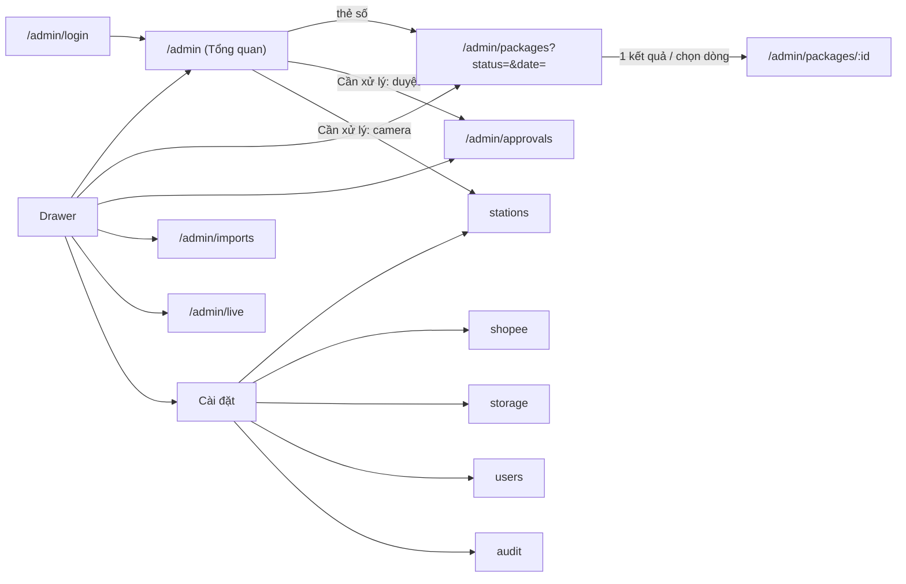

# FE Spec — 01 MVP đóng gói · client: dashboard (web `/admin`)

| | |
|---|---|
| Tác giả | khanhtt (FE) |
| Reviewer | khanhtt (tech lead, review qua subagent ở bước 5) |
| Trạng thái | Approved (G2 2026-10-04, có điều kiện DEC-33) |
| Tổng quan & contract | [02-tech-spec.md](02-tech-spec.md) · Màn: [01-srs.md §10.5](01-srs.md) (D1–D13) · [Design system](../../../design-system/README.md) |
| Last update | 2026-10-05 · FE (chuẩn hoá template 2026-10-05: Goals/Non-goals, Phương án, Rủi ro) |

> **TL;DR** — Route `/admin/*` trong `ai-cam-fe`: 13 màn D1–D13 trên khung app design system (app bar + drawer theo vai).
> Dữ liệu qua TanStack Query; realtime qua WS-02 chỉ để **invalidate** query (không giữ state song song).
> Component mới chính: `ClipPlayer` (dùng chung station), `RoiEditor`, `CameraTile` (WHEP), `StatusTimeline`, `ImportPreview`.
> Nền (khung repo, `shared/ui`, API client, auth) ở [02b-fe-spec-station §14 T-30..T-33](02b-fe-spec-station.md) — DEC-16.
> Điểm khó: luồng xuất clip bất đồng bộ, live view WebRTC, vẽ ROI.

Không viết lại API — trỏ API-xx trong [02 §6](02-tech-spec.md#6-api-contract).

---

## 1. Phạm vi

| Goals (lát/spec này làm) | Non-goals (cố ý không làm — để đâu) |
|---|---|
| 13 màn D1–D13 dưới `/admin/*`, guard theo 4 vai (ADMIN, SUPERVISOR, CSKH; STATION → `/station`) | Khung repo, `shared/ui`, API client, auth — ở [02b-station](02b-fe-spec-station.md) T-30..T-33 (DEC-16) |
| Dữ liệu qua TanStack Query; WS-02 chỉ invalidate, không giữ state song song (DEC-20) | UI xóa clip (DEC-27) |
| Tra cứu → xem clip → giữ / xuất MP4 có overlay (UC-03, FR-07.*) | Link chia sẻ clip (FR-07.05), xem video thô (FR-07.06), báo cáo FR-09.02..04 → Phase 3 |
| Supervisor nhận và duyệt yêu cầu từ station trên D13; quyết định về station ≤ 2 giây (AC-19, WS-01 / WS-02) | Màn đối soát, khiếu nại, mở hàng hoàn → Phase 2 |
| Dùng được từ 360px; Chromium ≥ 120, Safari ≥ 17, Firefox ≥ 120; D2 ≤ 300 KB gzip | Analytics sản phẩm, gửi lỗi JS về BE (DEC-23), SEO |

| Màn / luồng | Route | FR / UC | REUSE / EXTEND / NEW |
|---|---|---|:---:|
| D1 Đăng nhập | `/admin/login` | FR-10.01 | NEW (`AuthCard`) |
| D2 Tổng quan ngày | `/admin` | FR-09.01, FR-01.06 | NEW |
| D3 Tra cứu đơn | `/admin/packages` | FR-07.01, 07.03, UC-03 | NEW |
| D4 Chi tiết đơn + ClipPlayer | `/admin/packages/:id` | FR-07.02, 07.04, FR-02.07, 02.09 | NEW (`ClipPlayer` dùng chung station) |
| D5 Nhập đơn từ file | `/admin/imports` | FR-05.09, 05.10, UC-09 | NEW |
| D6 Station và camera | `/admin/settings/stations`, `/admin/settings/stations/:id` | FR-01.01, 01.02, 01.04, UC-07 | NEW |
| D7 Kết nối Shopee | `/admin/settings/shopee` | FR-05.01, UC-10 | NEW |
| D8 Lưu trữ video | `/admin/settings/storage` | FR-02.06 | NEW |
| D9 Người dùng | `/admin/settings/users` | FR-10.01, FR-03.01 | NEW |
| D10 Nhật ký thao tác | `/admin/settings/audit` | FR-10.03 | NEW |
| D11 Live view | `/admin/live` | FR-01.05 | NEW |
| D12 Không có quyền / 404 | `/admin/forbidden`, `*` | FR-10.02 | NEW (`EmptyState`) |
| D13 Yêu cầu duyệt | `/admin/approvals` | FR-03.10, 03.12, UC-08 | NEW |

## 2. Điều hướng

Guard theo role (API-04), khai báo trong `routes.tsx` (`roles: [...]`): không đủ quyền → `/admin/forbidden`; chưa đăng nhập → `/admin/login?next=`; role STATION → `/station`.

| Route | Role |
|---|---|
| `/admin`, `/admin/packages*` | ADMIN, SUPERVISOR, CSKH |
| `/admin/approvals`, `/admin/live`, `/admin/imports` | ADMIN, SUPERVISOR |
| `/admin/settings/*` | ADMIN |

Drawer: Tổng quan · Tra cứu đơn · Yêu cầu duyệt (badge PENDING) · Nhập đơn · Live view · Cài đặt (nhóm). Mục không quyền bị ẩn.

## 3. Cây component

| Component | Mới / reuse (path) | Props / input chính | Ghi chú |
|---|---|---|---|
| `shared/ui/*`, `TrackingNumber`, `useScanListener` | REUSE (T-32, T-35) | | |
| `AppShell` | NEW `features/shell/AppShell.tsx` | `user` | App bar 64px (logo, nút theme, menu tài khoản), drawer 256px / modal < `lg` |
| `ApprovalBadge` | NEW | count từ query API-20 | |
| `KpiCard` | NEW `features/reports/KpiCard.tsx` | `label`, `value`, `to`, `tone` | `display-sm` tabular-nums. Link: Đã đóng gói → `session_status=COMPLETED` + ngày; Từng lệch mã → `session_flag=HAD_MISMATCH`; Bỏ dở → `session_status=ABANDONED`; Hủy phiên → `session_status=CANCELLED`; Chưa bàn giao → `warehouse_status=PACKED` (không lọc ngày); Hủy sau khi đóng → `warehouse_status=CANCELLED_AFTER_PACK` |
| `StationStatusList`, `AttentionList` | NEW | `stations`, `attention` (API-32) | Nhãn từ `shared/labels.ts` |
| `PackageFilters`, `PackageTable` | NEW `features/orders/` | filter state ↔ URL search params | Mobile: card |
| `PackageHeader`, `ItemList`, `SessionList`, `StatusTimeline` | NEW | dữ liệu API-31 | |
| `ClipPlayer` | NEW `shared/media/ClipPlayer.tsx` (dùng chung) | `session`, `layout` | Tabs Cam 1 / Cam 2 / Ghép; "Ghép" = 2 `<video>` đặt cạnh, đồng bộ `currentTime` |
| `ExportDialog` | NEW | `sessionId` | Chọn layout → API-43 → tiến độ → 2 nút tải |
| `HoldToggle` | NEW | `clip` | API-42 |
| `ImportDropzone`, `ImportPreview`, `ImportHistoryTable` | NEW `features/imports/` | | |
| `StationForm`, `CameraForm`, `CameraTestResult`, `RoiEditor` | NEW `features/stations/` | | `RoiEditor`: ảnh API-63, kéo khung (pointer events), xuất tỉ lệ 0–1 |
| `ShopeeConnectionCard` | NEW `features/platforms/` | API-70 | Đọc `?result=` sau callback |
| `StorageSettingsForm`, `DiskUsage` | NEW `features/settings/` | API-80, 81 | |
| `UserTable`, `UserDialog` | NEW `features/users/` | | |
| `AuditTable` | NEW | | |
| `CameraTile`, `LiveGrid` | NEW `features/liveview/` | `whepUrl` | WHEP: `RTCPeerConnection` + POST SDP kèm `Authorization: Bearer <access_token>` (Caddy `forward_auth`), không thêm thư viện |
| `ApprovalList`, `ApprovalCard` | NEW `features/approvals/` | API-20 item | Nút theo `type` (MISMATCH, ASSIST: Cho tiếp tục / Đóng phiên có ghi chú / Hủy phiên; REPACK: Duyệt / Từ chối); khi `context.tray_match` = DIFFERENT/MULTIPLE: "Đóng phiên có ghi chú" disabled và Alert "Cam 2 vẫn thấy phiếu sai, Cho tiếp tục sẽ đưa station về Lệch mã." |

## 4. State & data fetching

| Dữ liệu | Nguồn | Nơi giữ state | Cache & làm mới | Optimistic? |
|---|---|---|---|:---:|
| Auth, `/me` | API-01..04 (API-02 `client: DASHBOARD`) | `authStore` (chung) | như station | ✗ |
| Báo cáo ngày | API-32 | Query `['daily', date]` | WS `report.updated` → invalidate (throttle 5 giây); `refetchInterval` 60 giây dự phòng | ✗ |
| Yêu cầu duyệt | API-20 | Query `['approvals','PENDING']` | WS `approval.created/resolved` → invalidate; phát âm báo khi `created` | ✗ |
| Quyết định duyệt | API-21 | mutation | Thành công → invalidate approvals + daily | ✗ (cần biết ALREADY_RESOLVED) |
| Tra cứu kiện | API-30 | Query `['packages', filters]`; filters ở URL | `keepPreviousData` | ✗ |
| Chi tiết kiện | API-31 | Query `['package', id]` | WS `session.clip_ready` / sau hold, export → invalidate | ✗ |
| URL clip | API-40 | Query `['clip-url', id]` staleTime 8 phút | `SIGNATURE_INVALID` → refetch 1 lần | ✗ |
| Giữ clip | API-42 | mutation | | ✔ (đảo nút ngay, rollback khi lỗi) |
| Xuất clip | API-43, 44 | mutation + Query `['export', id]` | Poll 2 giây tới READY/FAILED, dừng khi có WS `export.updated` | ✗ |
| Nhập CSV | API-50, 51, 52 | mutation; preview giữ trong state trang | Commit thành công → invalidate history | ✗ |
| Station, camera, ROI | API-60..65 | Query `['stations']`, `['station', id]` | WS `camera.status` → invalidate | ✗ |
| Shopee | API-70..73 | Query `['shops']` | sau sync: refetch 5 giây × 6 lần | ✗ |
| Cài đặt, sức khỏe | API-80, 81 | Query | health: 30 giây | ✗ |
| Người dùng, audit | API-90..92 | Query phân trang | | ✗ |
| Theme | local | `localStorage` `aicam-theme` | | — |

## 5. Form & validate

| Form | Field | Rule client | Lỗi server map vào field |
|---|---|---|---|
| D1 Đăng nhập | username, password | bắt buộc | `INVALID_CREDENTIALS`, `WRONG_CLIENT`, `ACCOUNT_DISABLED`, `ACCOUNT_LOCKED` (giờ mở khóa từ `details.until`), `RATE_LIMITED` → Alert |
| D3 Bộ lọc | q ≤ 64; from ≤ to; khoảng ≤ 92 ngày | chặn submit, lỗi dưới ô ngày | `VALIDATION_ERROR.fields.*` |
| D4 Xuất clip | layout | bắt buộc (mặc định SIDE_BY_SIDE) | `CLIP_NOT_READY`, `CLIP_DELETED` → Alert trong dialog |
| D5 File | .csv/.xlsx, ≤ 5 MB | kiểm trước khi gửi | `FILE_INVALID` (`details.missing_columns`) → Alert |
| D6 Station | name 1–40 | bắt buộc | `NAME_TAKEN` → name; `ACCOUNT_IN_USE` → account |
| D6 Camera | rtsp_url bắt đầu `rtsp://`, ≤ 255; username, password tùy chọn | | `CAMERA_UNREACHABLE` → khối kết quả kiểm tra |
| D6 ROI | w,h ≥ 5% | khóa nút Lưu khi nhỏ hơn | `ROI_INVALID` → Alert trên ảnh |
| D8 Lưu trữ | raw 1–365, clip 1–365, clip ≥ raw; warn < abandon | lỗi dưới ô | `VALIDATION_ERROR.fields.*` |
| D9 Người dùng | username `[a-z0-9._-]{3,32}`; password ≥ 8; role | | `USERNAME_TAKEN` → username; `LAST_ADMIN` → Alert |
| D13 Đóng phiên có ghi chú | note 1–500 | bắt buộc | `VALIDATION_ERROR.fields.note` |

## 6. Trạng thái UI

| Màn | Loading | Empty | Error | Forbidden | Success |
|---|---|---|---|---|---|
| D2 | Skeleton thẻ + danh sách | Thẻ = 0, "Chưa có phiên đóng gói nào trong ngày." | Alert + "Thử lại" | D12 | Dữ liệu, tự cập nhật |
| D3 | Skeleton 10 dòng | "Không tìm thấy mã …" + "Xóa bộ lọc" | Alert + "Thử lại" | D12 | Bảng / mở thẳng D4 khi 1 kết quả từ ô tìm |
| D4 | Skeleton header + khung 16:9 | Chưa có phiên: EmptyState "Kiện này chưa được đóng gói." | 404 → EmptyState "Không tìm thấy kiện." | D12 | Player; clip PENDING / DELETED / FAILED theo 01 §10.5 |
| Export dialog | LinearProgress `progress` | — | FAILED → Alert + "Thử lại" | ẩn nút | 2 nút tải |
| D5 | Đang đọc file: LinearProgress không giá trị | Lịch sử rỗng: "Chưa nhập file nào." | Alert theo mã | D12 | Alert "Đã nhập N đơn." |
| D6 | Skeleton | "Chưa có station nào." + "Thêm station" | Alert | D12 | Toast "Đã lưu." |
| D7 | Skeleton thẻ | Chưa kết nối: nút "Kết nối Shopee" | `PLATFORM_NOT_CONFIGURED` → Alert hướng dẫn dùng D5; `?result=denied` → Alert lỗi "Shopee từ chối ủy quyền. Bấm Kết nối lại để thử lần nữa."; `?result=error` → Alert lỗi "Kết nối Shopee thất bại. Thử lại sau ít phút."; `auth_status=EXPIRED` → chip `warning` "Hết hạn" + nút "Kết nối lại" | D12 | `?result=connected` → Alert thành công |
| D8–D10 | Skeleton | D10: "Chưa có thao tác nào." | Alert | D12 | Toast |
| D11 | Ô đen + spinner | "Chưa có camera nào." | Ô "Mất tín hiệu" + "Thử lại" | D12 | Video |
| D13 | Skeleton | "Không có yêu cầu nào đang chờ." | Alert | D12 | Thẻ biến mất + toast |

## 7. Phân quyền trên UI

| Hành động / màn | Role thấy | Cách xử lý khi không quyền |
|---|---|---|
| Route theo bảng §2 | | `/admin/forbidden` |
| Xuất clip, Giữ clip (D4) | ADMIN, SUPERVISOR, CSKH | — |
| Nhập đơn, Yêu cầu duyệt, Live view | ADMIN, SUPERVISOR | ẩn mục drawer |
| Station, camera, ROI, Shopee, lưu trữ, người dùng, audit | ADMIN | ẩn mục (đúng 01 §5.1) |
| Xóa clip | N/A — không có UI xóa clip trong MVP (DEC-27) | — |
| Cắt lại clip lỗi (API-46) | ADMIN, SUPERVISOR | ẩn nút "Thử lại" với CSKH |

## 8. Xử lý lỗi API

| Mã lỗi (từ 02) | Hiển thị | Hành động |
|---|---|---|
| 401 | — | Refresh 1 lần → `/admin/login?next=` |
| 403 FORBIDDEN | — | `/admin/forbidden` (trang) hoặc ẩn hành động (mutation) + toast "Tài khoản không có quyền thực hiện thao tác này." |
| 404 NOT_FOUND | EmptyState theo màn | — |
| 422 VALIDATION_ERROR | Lỗi dưới field (`details.fields`) | — |
| 409 ALREADY_RESOLVED | `details.status` RESOLVED: "Yêu cầu này đã được {decided_by} xử lý lúc {giờ}." · WITHDRAWN: "Station đã rút yêu cầu." | Invalidate approvals |
| 409 TRAY_STILL_DIFFERENT | Alert "Cam 2 vẫn thấy phiếu sai trên khay. Yêu cầu bỏ phiếu sai trước." | Invalidate approvals |
| 409 CLIP_NOT_FAILED | Toast "Clip không ở trạng thái lỗi." | Invalidate package |
| 410 FILE_EXPIRED | Toast "File gốc đã quá 90 ngày, không còn lưu." | — |
| 409 / 410 CLIP_NOT_READY, CLIP_DELETED | Theo 01 §10.5 D4 | — |
| 403 SIGNATURE_INVALID | — | Refetch API-40 một lần, rồi Alert |
| 409 IMPORT_HAS_ERRORS / IMPORT_EXPIRED, 422 FILE_INVALID | Alert theo 02 | Quay về bước chọn file |
| 409 NAME_TAKEN, ACCOUNT_IN_USE, USERNAME_TAKEN, LAST_ADMIN | Lỗi field / Alert | — |
| 422 CAMERA_UNREACHABLE (`details.reason`) | "Không kết nối được camera (hết thời gian / sai mật khẩu / không có luồng video)…" | Cho lưu vẫn được |
| 409 SYNC_IN_PROGRESS, 503 PLATFORM_NOT_CONFIGURED | Alert | — |
| 429 | Toast "Thao tác quá nhanh, thử lại sau." | Tôn trọng `Retry-After` |
| 5xx / mạng | Alert "Có lỗi hệ thống. Thử lại sau ít phút." + "Thử lại" | Query retry 2 lần (GET), mutation không tự retry |

## 9. Nội dung chữ · i18n · a11y · responsive

- Chữ theo [01 §10.5](01-srs.md) và giọng văn design system; gom ở `features/*/copy.ts`; nhãn enum ở `shared/labels.ts` (DEC-17).
- Định dạng: `Intl.DateTimeFormat('vi-VN', {timeZone:'Asia/Ho_Chi_Minh'})` → `04/10/2026 14:27:05`; số `Intl.NumberFormat('vi-VN')`; thời lượng `mm:ss`.
- Responsive theo design system: dùng được từ 360px; bảng D3, D9, D10 thành card dưới `md`; D4 hai cột từ `lg`; D11 1 cột dưới `md`.
- a11y: focus-visible 3px; drawer modal bẫy focus; `Dialog` đóng bằng Esc; `<video>` có `controls`; ảnh ROI có hướng dẫn chữ; badge duyệt có `aria-label="3 yêu cầu đang chờ"`.
- Theme light/dark theo design system (nút mặt trăng), `localStorage` `aicam-theme`.

## 10. Riêng nền tảng

- Trình duyệt: Chromium ≥ 120, Safari ≥ 17 (CSKH dùng điện thoại), Firefox ≥ 120.
- Bundle: mỗi khu vực lazy load theo route; trang D2 ≤ 300 KB gzip lần đầu.
- Video: `<video preload="none">` (chỉ tải khi bấm phát để audit VIEW_CLIP đúng nghĩa); Range do BE hỗ trợ. Xuất file tải qua `<a download>` với URL ký.
- WebRTC (D11): WHEP qua Caddy cùng origin; không hỗ trợ → thông báo "Trình duyệt không hỗ trợ xem trực tiếp."
- Không cần SEO (`noindex`).

## 11. Analytics & theo dõi lỗi

| Event | Khi nào | Thuộc tính |
|---|---|---|
| N/A analytics sản phẩm | MVP nội bộ; số liệu nghiệp vụ đã có ở BE (audit, metric) | |
| Lỗi JS | ErrorBoundary theo route | Hiện "Có lỗi giao diện. Tải lại trang."; không gửi về BE (DEC-23) |

## 12. Mock khi BE chưa xong

MSW chung (DEC-19), handler `src/mocks/handlers/{auth,packages,clips,exports,imports,stations,shops,settings,users,approvals,reports}.ts` theo 02 §6. Dữ liệu seed: 2 station, 4 camera, 300 kiện trong 7 ngày, 1 yêu cầu duyệt, 1 clip PENDING, 1 clip DELETED. Video mẫu `public/mock/clip-cam1.mp4`, `clip-cam2.mp4` (≤ 1 MB). Live view mock: `<video>` lặp thay cho WHEP. Bật `VITE_MOCK=1`.

## 13. Test FE

| Mức | Phạm vi | Case chính |
|---|---|---|
| Unit | `labels`, định dạng ngày/số, `RoiEditor` (toạ độ → tỉ lệ), filter ↔ URL | |
| Component | `ClipPlayer` (tab, trạng thái clip), `ExportDialog` (QUEUED → READY / FAILED), `ApprovalCard` (action theo type), `ImportPreview` (khóa nút khi có lỗi) | |
| Integration (MSW) | D3 → D4 → xuất → tải; D5 file lỗi / file tốt; D13 duyệt + ALREADY_RESOLVED; guard theo 4 role | |
| E2E (Playwright, MSW) | UC-03, UC-09, UC-08 (phần dashboard), UC-07 | |

## 14. Task

| # | Việc | Màn / FR | Phụ thuộc (API-xx) | Ước lượng |
|---|---|---|---|---|
| T-50 | AppShell, drawer theo role, theme, D1, D12, guard route | D1, D12, FR-10.02 | T-30..T-34; API-01..04 | 1,5 |
| T-51 | D2 Tổng quan + WS-02 client invalidate | D2, FR-09.01 | API-32, WS-02 | 1,5 |
| T-52 | D3 Tra cứu (filter URL, quét mã vào ô tìm) | D3, FR-07.01, 07.03 | API-30 | 1,5 |
| T-53 | D4 Chi tiết + `ClipPlayer` + Giữ clip + cắt lại clip lỗi | D4, FR-07.02, 02.09 | API-31, 40, 42, 46 | 2 |
| T-54 | ExportDialog | D4, FR-07.04, 02.07 | API-43..45 | 1 |
| T-55 | D13 Yêu cầu duyệt + badge + âm báo | D13, FR-03.12 | API-20, 21, WS-02 | 1,5 |
| T-56 | D5 Nhập đơn (+ tải file gốc) | D5, FR-05.09 | API-50..54 | 1,5 |
| T-57 | D6 Station, camera, kiểm tra kết nối, `RoiEditor` | D6, FR-01.01, 01.04 | API-60..64 | 2,5 |
| T-58 | D7 Shopee, D8 Lưu trữ + sức khỏe | D7, D8, FR-05.01, 02.06 | API-70..73, 80, 81 | 1,5 |
| T-59 | D9 Người dùng, D10 Nhật ký | D9, D10, FR-10.01, 10.03 | API-90..92 | 1,5 |
| T-60 | D11 Live view (WHEP) | D11, FR-01.05 | API-65 (`GET /live`) | 1,5 |
| T-61 | Test integration + E2E admin; chạy thử với BE thật | UC-03, 07, 08, 09 | toàn bộ | 2 |

Tổng ≈ 19,5 ngày công.

## Phương án đã cân nhắc

Chỉ lựa chọn riêng phía dashboard. Xuất clip bất đồng bộ và WebSocket thay poll ở [02 §9](02-tech-spec.md#9-phương-án-đã-cân-nhắc); MSW, API client, font, i18n dùng chung ở [02b-station — Phương án](02b-fe-spec-station.md#phương-án-đã-cân-nhắc).

| Phương án | Ưu | Nhược | Chọn? (lý do) |
|---|---|---|---|
| **WS-02 chỉ invalidate TanStack Query (throttle 5 giây cho `report.updated`)** | Một nguồn state; không lệch giữa cache và store | Mỗi sự kiện thêm một lần gọi API | ✔ DEC-20 |
| Đẩy dữ liệu WS thẳng vào store / cache | Không gọi lại API | Hai nguồn sự thật, dễ lệch khi lỡ sự kiện | ✗ |
| **Tab "Ghép" = 2 `<video>` cạnh nhau đồng bộ `currentTime`** | Xem ngay, không encode | Có thể lệch vài khung khi tua | ✔ DEC-21 (file ghép thật chỉ khi xuất, J-03) |
| Encode file ghép cho mỗi lần xem | Hình ghép chính xác | Chờ encode, tốn CPU | ✗ |
| **WHEP tự viết (~60 dòng `RTCPeerConnection`)** | Không thêm phụ thuộc; gửi `Authorization` cho Caddy `forward_auth` | Tự xử lý lỗi ICE / thử lại | ✔ DEC-22 |
| Thư viện client WHEP | Có sẵn | Thêm phụ thuộc cho phần nhỏ | ✗ |
| **Bộ lọc D3 lưu ở URL search params** | Back / reload giữ bộ lọc; link từ thẻ D2 sang D3 | Phải đồng bộ form ↔ URL | ✔ (§3 `PackageFilters`) |
| Bộ lọc trong store | Code gọn | Mất khi reload; không link từ D2 được | ✗ |
| **Tiến độ xuất: poll API-44 mỗi 2 giây, dừng khi có WS `export.updated`** | Không phụ thuộc WS duy nhất | Thêm request khi WS chậm | ✔ (§4) |
| **Giữ clip (API-42) optimistic, rollback khi lỗi** | Nút phản hồi ngay | Phải hoàn tác khi lỗi | ✔ (§4); các mutation khác chờ server (cần biết `ALREADY_RESOLVED`) |
| **Drawer chỉ có mục đã có màn thật** | Không lộ route tạm cho người dùng | Menu tăng dần theo task | ✔ DEC-51 |

## Rủi ro & câu hỏi mở

Nguồn: [02 §11](02-tech-spec.md#11-rủi-ro--câu-hỏi-mở), [03 §5](03-plan.md#5-rủi-ro-tiến-độ), review code M1 (2026-10-05). Ai trả lời: khanhtt nếu không ghi khác.

| ID | Rủi ro / câu hỏi | Ảnh hưởng | Giảm thiểu / ai trả lời | Hạn |
|---|---|---|---|---|
| RA-1 | D13 duyệt cần API-20 / API-21 (T-13) chưa có ở BE | Trung bình — AC-19 chưa demo với BE thật | Làm trên MSW; nối BE thật khi T-13 xong | T-13, T-55 |
| RA-2 | Live view WHEP qua Caddy `forward_auth` chưa thử thật; trình duyệt không hỗ trợ WebRTC | Thấp — D11 không xem được | Thông báo "Trình duyệt không hỗ trợ…"; D11 nằm đầu danh sách cắt phạm vi (03 §5) | T-60 |
| RA-3 | Thu hồi phiên (D9 → API-91): station bị thu hồi vẫn chạy ≤ 15 phút (access JWT), WS chưa đóng ngay (review code M1) | Trung bình — Admin tưởng đã chặn ngay | BE đóng WS ngay (RB-9 trong 02a); chấp nhận trễ ≤ 15 phút của access token (02 §8) | T-59 |
| RA-4 | Định dạng giờ API chưa thống nhất hậu tố `Z` (RB-11 trong 02a) | Thấp — giờ hiển thị lệch 7 giờ nếu parse sai | `Intl.DateTimeFormat` với `timeZone: Asia/Ho_Chi_Minh` trên chuỗi ISO có múi; chờ BE chuẩn hoá | T-19 |
| RA-5 | CSKH dùng Safari ≥ 17 trên điện thoại: phát `<video>` Range, tải file xuất qua URL ký | Thấp | Kiểm trên Safari thật ở E2E | T-61 |
| RA-6 | Trễ tiến độ (1 dev, 70 ngày công) | Trung bình | Cắt theo thứ tự D11 live view, D10, export SIDE_BY_SIDE (03 §5) — PM quyết | Sau M2 |

## Decisions

| DEC | Bối cảnh | Lựa chọn | Lý do | Người chốt |
|---|---|---|---|---|
| DEC-51 | Menu dashboard khi màn chưa xây (T-50) | Drawer chỉ có mục đã có màn thật (`features/shell/nav.ts`); `/admin` chuyển tới mục đầu tiên của vai, vai chưa có mục nào thấy EmptyState. Mỗi task màn mới thêm mục của nó | Không đưa route tạm vào menu thật (skill ai-fe-implement) | khanhtt (tự quyết) |
| DEC-20 | Realtime trên dashboard | WS-02 chỉ invalidate TanStack Query | Một nguồn state; tránh lệch dữ liệu | khanhtt (tự quyết) |
| DEC-21 | Tab "Ghép" trong ClipPlayer | 2 `<video>` cạnh nhau đồng bộ `currentTime` (không cần encode); file ghép thật chỉ khi xuất | Xem ngay không chờ encode | khanhtt (tự quyết) |
| DEC-22 | Thư viện WHEP | Tự viết ~60 dòng `RTCPeerConnection` | Tránh phụ thuộc; WHEP đơn giản | khanhtt (tự quyết) |
| DEC-71 | T-51/T-53: WS-02 trong 02 §6 không có sự kiện phiên / clip cho dashboard (chỉ WS-01 có `session.clip_ready`), nhưng §4 dựa vào nó để D4 tự hiện clip (TC-02.11) | `useDashboardSocket` nhận `session.*` / `clip.*` (nếu BE gửi) → invalidate `['package']`, `['packages']`; D4 tự poll API-31 mỗi 10 giây khi có clip `PENDING`. `approval.*` → invalidate approvals + daily; `camera.status` thêm daily. Phản hồi architect: đề nghị thêm `session.clip_ready` vào WS-02 | Không đổi contract; poll đảm bảo đúng kể cả khi BE không gửi | khanhtt (tự quyết, ủy quyền) |
| DEC-72 | T-51: API-32 `stations[]` không có mã vận đơn đang đóng gói ("Đang đóng gói SPX…" trong 01 §10.5); `attention` `CLOCK_DRIFT` chỉ có `camera_id` | D2 hiện trạng thái station không kèm mã; `CLOCK_DRIFT` hiện "Cam n Station … lệch giờ x giây" nếu BE gửi thêm `station_name`, `role` (tùy chọn), không thì "Camera lệch giờ x giây". Phản hồi architect: đề nghị thêm `stations[].tracking_number`, `CLOCK_DRIFT.station_name/role` | Không đổi contract; FE đọc trường tùy chọn | khanhtt (tự quyết, ủy quyền) |
| DEC-73 | T-51: TC-09.04 kỳ vọng "6 thẻ = 0" ở ngày trống, nhưng 02 §6 API-32 định nghĩa `packed_not_handed_over`, `cancelled_after_pack` là số kiện hiện tại (mọi ngày) | Theo contract: 4 thẻ theo ngày = 0, 2 thẻ trạng thái kiện giữ số hiện tại; câu trống hiện khi 4 thẻ theo ngày = 0. Phản hồi QA sửa TC-09.04 | Contract là nguồn sự thật (DEC-10) | khanhtt (tự quyết, ủy quyền) |
| DEC-74 | T-51: D2 khi mở `/admin` (thay `AdminHome` của DEC-51) | `/admin` = D2 cho cả 3 vai; mục "Tổng quan" đầu drawer; D12 nút "Về Tổng quan" (TC-P.10). Mục "Cần xử lý" chỉ có link khi màn đích có trong menu của vai (vd. "Duyệt" xuất hiện khi có D13 — T-55) | DEC-51: không link tới màn chưa xây / không có quyền | khanhtt (tự quyết, ủy quyền) |
| DEC-75 | T-52: bộ lọc Station ở D3 cần danh sách station, nhưng API-60 chỉ ADMIN (02 §6) | Lấy `stations[]` của API-32 (cả 3 vai đọc được, dùng chung cache `['daily', hôm nay]` với D2). Khoảng ngày: `date_to − date_from ≤ 92` (như TC-07.04: 01/07 → 02/10 = 93 bị chặn). Tìm đúng 1 kiện chỉ mở D4 khi tìm từ ô tìm / máy quét (không khi Back hay đổi bộ lọc) | Không đổi contract | khanhtt (tự quyết, ủy quyền) |
| DEC-76 | T-53: API-31 không có số ngày lưu trữ cho câu "Clip đã bị xóa ngày … theo chính sách lưu trữ N ngày" (CSKH không đọc được API-80); "Giữ clip" ở header D4 áp cho clip nào; "Cam 2: khớp mã" không có trường riêng | Ngày xóa = `clips[].retention_until`; N = ngày(`retention_until`) − ngày(`ended_at`) của phiên (thiếu thì bỏ "N ngày"). "Giữ clip" / "Bỏ giữ" áp cho mọi clip READY của phiên đang chọn (gọi API-42 từng clip, optimistic). "Cam 2: khớp mã" = phiên `COMPLETED` không có cờ `CAM2_UNVERIFIED` (BR-18). Lỗi phát video → lấy lại API-40 một lần rồi Alert "Không phát được clip…". `ClipPlayer` thêm tab "Ghép" (prop `sideBySide`), trạng thái DELETED / FAILED (prop `failedAction`); station giữ cách gọi cũ | Không đổi contract; đúng chữ 01 §10.5 | khanhtt (tự quyết, ủy quyền) |
| DEC-77 | T-54: ExportDialog — layout nào được chọn; khi nào dừng poll; lỗi API-44 | Chỉ hiện layout có clip READY (Ghép cần cả hai, mặc định Ghép); nút "Xuất clip" ẩn khi phiên chưa có clip READY. Poll API-44 mỗi 2 giây tới READY / FAILED (WS `export.updated` chỉ invalidate thêm); FAILED → Alert + "Thử lại" tạo bản xuất mới cùng layout; API-43 `CLIP_NOT_READY` / `CLIP_DELETED` → Alert trong dialog, `FORBIDDEN` → toast + đóng. Tải bằng `<a download>` URL ký từ `files.video` / `files.info`; hiện SHA-256 bản xuất và giờ hết hạn link | Theo 01 §10.5 + 02 §6 API-43..45, không đổi contract | khanhtt (tự quyết, ủy quyền) |
