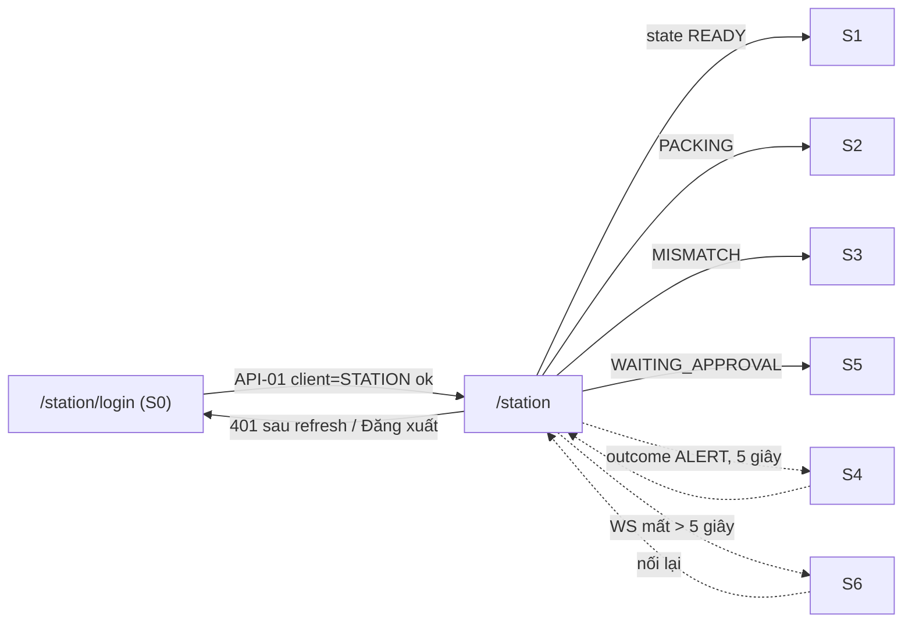

# FE Spec — 01 MVP đóng gói · client: station (kiosk web)

| | |
|---|---|
| Tác giả | khanhtt (FE) |
| Reviewer | khanhtt (tech lead, review qua subagent ở bước 5) |
| Trạng thái | Approved (G2 2026-10-04, có điều kiện DEC-33) |
| Tổng quan & contract | [02-tech-spec.md](02-tech-spec.md) · Màn: [01-srs.md §10.4](01-srs.md) (S0–S6) · [Design system](../../../design-system/README.md) mục Station kiosk |
| Last update | 2026-10-04 · FE |

> **TL;DR** — Route `/station` trong app `ai-cam-fe`: 7 màn S0–S6 render từ **một** state server (`station.state`, API-10 / WS-01). FE không tự suy luận phiên.
> Mọi thao tác bằng máy quét: `ScanListener` gom phím HID → API-11 (kèm `client_scan_id`) → `outcome` quyết định màn + âm thanh.
> File này cũng chứa **nền FE dùng chung** cho cả hai client (khung repo, token, `shared/ui`, API client, auth) — DEC-16.
> Điểm khó: phân biệt quét với gõ tay, giữ phản hồi ≤ 1 giây, xử lý mất WS (S6) không mất lần quét.

Không viết lại API — trỏ API-xx trong [02 §6](02-tech-spec.md#6-api-contract).

---

## 1. Phạm vi

| Màn / luồng | Route | FR / UC | REUSE / EXTEND / NEW |
|---|---|---|:---:|
| S0 Đăng nhập station | `/station/login` | FR-03.01 | NEW (dùng `AuthCard`, `TextField`, `Button`) |
| S1 Sẵn sàng (+ phiên gần đây, xem clip) | `/station` (state `READY`) | FR-03.02, 03.11, FR-01.02 | NEW |
| S2 Đang đóng gói | `/station` (`PACKING`) | FR-03.03, 03.06, 03.08, BR-16 | NEW |
| S3 Lệch mã | `/station` (`MISMATCH`) | FR-03.05, 03.07 | NEW |
| S4 Cảnh báo | `/station` (overlay sau `outcome=ALERT`) | BR-01, 03, 04, FR-01.03 | NEW |
| S5 Chờ quản lý duyệt | `/station` (`WAITING_APPROVAL`) | FR-03.10, 03.12 | NEW |
| S6 Mất kết nối server | overlay toàn màn | NFR-09 | NEW |
| Nền dùng chung (cả admin dùng) | — | — | NEW: khung Vite, Tailwind + tokens, `shared/ui` theo design system, API client sinh từ OpenAPI, auth, WS client |

Không có REUSE từ code (repo trống, 2026-10-04). Component UI REUSE theo API `docs/design-system/components/index.d.ts`.

## 2. Điều hướng

Guard: `/station/*` yêu cầu `role = STATION` (từ API-04). Tài khoản khác vào `/station` → chuyển `/admin`. Chưa đăng nhập → `/station/login`. Màn S1..S5 **không phải route riêng**: một trang `StationPage` chọn panel theo `state` (tránh lệch giữa URL và trạng thái server).

## 3. Cây component

| Component | Mới / reuse (path) | Props / input chính | Ghi chú |
|---|---|---|---|
| `Button`, `IconButton`, `TextField`, `StatusChip`, `Alert`, `Dialog`, `AuthCard`, `Icon`, `EmptyState`, `Tabs` | NEW theo design system → `src/shared/ui/*` | như `index.d.ts` | Dùng chung với admin |
| `StationPage` | NEW `src/features/station/StationPage.tsx` | — | Mount `ScanListener`, `useStationSocket`; chọn panel |
| `StationStatusBar` | NEW `features/station/StationStatusBar.tsx` | `station`, `cameras`, `wsStatus`, `serverTime` | Đồng hồ chạy theo `server_time` + offset |
| `StationStatePanel` | NEW `features/station/StationStatePanel.tsx` | `tone` (`success`/`primary`/`warning`/`error`), `icon`, `title`, children | Nền `-container` theo tone, chữ `on-…-container` |
| `ReadyPanel` (S1) | NEW | `todayCount`, `recent` | Bảng phiên gần đây + nút Xem |
| `PackingPanel` (S2) | NEW | `session`, `tray` | `TrackingNumber`, `ItemList`, `TrayChip`, `SessionTimer` |
| `MismatchPanel` (S3) | NEW | `session.mismatch` | `CodeDiff` in đậm ký tự khác |
| `AlertOverlay` (S4) | NEW | `alert` (02 API-11) | Tự đóng 5 giây; `ALREADY_PACKED` có nút "Yêu cầu đóng gói lại" |
| `WaitingApprovalPanel` (S5) | NEW | `state.approval_request` (cấp gốc API-10, có cả khi `session = null`) | Đồng hồ chờ, lý do theo `type` (MISMATCH / ASSIST / REPACK), nút "Rút yêu cầu" → API-14 |
| `DisconnectedOverlay` (S6) | NEW | `since` | |
| `CancelSessionDialog` | NEW | `onConfirm(reason, note)` | Lý do: Hết hàng / Quét nhầm / Khác |
| `ClipPreviewDialog` | NEW `shared/media/ClipPlayer.tsx` (dùng chung admin) | `clipIds` | `Tabs` Cam 1 / Cam 2 + `<video preload="none">` |
| `ScanListener` | NEW `shared/scan/useScanListener.ts` | `onScan(code)`, `enabled` | Dùng chung ô tìm kiếm D3 |
| `SoundPlayer` | NEW `features/station/sound.ts` | `play('ok' \| 'warn' \| 'error', {loop})` | Web Audio, preload 3 file |
| `TrackingNumber` | NEW `shared/ui/TrackingNumber.tsx` | `value`, `size`, `copy?` | Mono; station không có nút Copy |

## 4. State & data fetching

| Dữ liệu | Nguồn | Nơi giữ state | Cache & làm mới | Optimistic? |
|---|---|---|---|:---:|
| Phiên đăng nhập | API-01, 02 (`client: STATION`), 04 | `authStore` (Zustand): access token trong bộ nhớ; refresh cookie | Refresh khi 401 (một lần, khóa đơn luồng); khởi động gọi API-02 | ✗ |
| Trạng thái station | API-10, WS-01 `station.state`, response API-11/12/13/14 | `stationStore` (Zustand) — **một nguồn duy nhất**: thay toàn bộ object mỗi khi nhận | Gọi API-10 khi mount, khi WS nối lại, khi nhận 409 | ✗ (chờ server, ≤ 1 giây) |
| Cảnh báo S4 | `alert` trong response API-11 | `stationStore.alert` + timer 5 giây | Xóa khi hết giờ / lần quét kế | ✗ |
| Phiên gần đây | API-15 | TanStack Query `['station','recent']` | Invalidate khi `SESSION_COMPLETED`, `session.clip_ready` | ✗ |
| URL clip | API-40 | Query `['clip-url', id]` `staleTime` 8 phút | Lỗi `SIGNATURE_INVALID` → refetch 1 lần | ✗ |
| Đồng hồ | `server_time` | `clockOffset` trong store | Cập nhật mỗi lần nhận state | — |
| Trạng thái WS | WebSocket | `wsStatus`: `connecting`/`open`/`lost` | Backoff 1, 2, 4, 8 giây (tối đa 8) | — |

**Hàng đợi quét:** khi một API-11 đang chờ, lần quét tiếp theo được xếp hàng (tối đa 1) và gửi sau khi có response — giữ đúng thứ tự mở → đóng. Lỗi mạng: retry 2 lần với **cùng** `client_scan_id` (BE dedup), sau đó S6.

## 5. Form & validate

| Form | Field | Rule client | Lỗi server map vào field |
|---|---|---|---|
| S0 đăng nhập | `username` | bắt buộc, trim | `INVALID_CREDENTIALS` → Alert form; `WRONG_CLIENT` → Alert câu hướng dẫn; `ACCOUNT_DISABLED`, `ACCOUNT_LOCKED` (giờ mở khóa từ `details.until`), `STATION_INACTIVE`, `RATE_LIMITED` → Alert |
| | `password` | bắt buộc | |
| Hủy phiên (Dialog) | `reason` | bắt buộc | `VALIDATION_ERROR.details.fields.note` → lỗi dưới ô ghi chú |
| | `note` | bắt buộc khi `OTHER`, ≤ 200 | |
| Quét | `code` | trim, upper; bỏ qua < 4 ký tự (nhiễu); không kiểm regex (server làm — `INVALID_CODE`) | — |

## 6. Trạng thái UI

| Màn | Loading | Empty | Error | Forbidden | Success |
|---|---|---|---|---|---|
| S0 | Nút xoay, khóa ô | — | Alert lỗi dưới form | — | Vào `/station` |
| `/station` khởi động | Toàn màn `surface`, icon `qr_code_scanner` mờ, "Đang tải trạng thái station…" | — | API-10 lỗi → S6 | role ≠ STATION → `/admin` | Panel theo state |
| S1 phiên gần đây | 5 dòng skeleton | "Chưa có phiên nào hôm nay." | Ẩn khối, giữ S1 | — | Bảng |
| S1/S2 khi chờ API-11 | Thanh mảnh `LinearProgress` không giá trị trên đỉnh panel (không đổi nền) | — | Retry → S6 | 403 → S0 | Đổi panel + âm |
| ClipPreviewDialog | Spinner trong khung 16:9 | — | `CLIP_NOT_READY` → "Clip đang được cắt…"; `CLIP_DELETED` → thông báo đã xóa | — | Phát video |
| Camera offline | Chip đỏ + Alert trong S1 / chip đỏ trên S2 (không chặn); phát âm `warn` một lần khi `cameras[].status` đổi sang OFFLINE (FR-01.03) | | | | |

## 7. Phân quyền trên UI

| Hành động / màn | Role thấy | Cách xử lý khi không quyền |
|---|---|---|
| `/station/*` | STATION | Chuyển `/admin` (server vẫn trả 403 cho API station) |
| Xem clip phiên gần đây | STATION, chỉ phiên station mình trong ngày | Danh sách đã lọc ở API-15; API-40 403 → ẩn nút |
| Đăng xuất station | STATION (giữ nút 3 giây) | — |
| Duyệt | Không có ở station (DEC-5) | — |

## 8. Xử lý lỗi API

| Mã lỗi (từ 02) | Hiển thị | Hành động |
|---|---|---|
| `outcome = ALERT` + `ORDER_CANCELLED`, `ALREADY_PACKED`, `ALREADY_HANDED_OVER`, `INVALID_CODE`, `PACKED_ELSEWHERE_IN_PROGRESS` | S4 với tiêu đề + `alert.message` | 2 bíp; tự về sau 5 giây; `ALREADY_PACKED` + `can_request_repack` → nút "Yêu cầu đóng gói lại" (API-13 REPACK) |
| `outcome = IGNORED` | Toast "Đang chờ duyệt." (S5) | — |
| Retry cùng `client_scan_id` | BE trả nguyên outcome lần đầu (DEC-29) → xử lý như response thường | — |
| 401 UNAUTHENTICATED | — | Refresh 1 lần → thất bại → S0 |
| 403 FORBIDDEN | — | S0 |
| 409 STATION_INACTIVE | S6 với chữ "Station này đang tắt. Liên hệ Admin." | Không retry |
| 409 SESSION_NOT_OPEN, APPROVAL_ALREADY_PENDING, NOT_ELIGIBLE, ALREADY_RESOLVED | Không hiện lỗi | Gọi lại API-10 |
| 422 VALIDATION_ERROR | Lỗi dưới field | — |
| Mạng / 5xx trên API-11 | — | Retry 2 lần cùng `client_scan_id` → S6 |
| WS đóng 4401 | — | Refresh token → nối lại |

## 9. Nội dung chữ · i18n · a11y · responsive

- Chữ tiếng Việt cố định trong `src/features/station/copy.ts` (không dùng thư viện i18n — MVP một ngôn ngữ, DEC-17). Toàn bộ chữ lấy từ [01 §10.4](01-srs.md).
- Nhãn trạng thái từ enum (02 §5) đặt ở `src/shared/labels.ts`, dùng chung với admin.
- Cỡ chữ theo design system mục Station kiosk: mã vận đơn `display-md` mono, tiêu đề `headline-lg`, sản phẩm `title-lg`, tối thiểu `body-lg`.
- Màn thiết kế cho 1920×1080 và 1366×768 (không hỗ trợ mobile). Panel co theo `vh`; danh sách sản phẩm > 6 dòng → cuộn trong panel.
- a11y: panel có `role="status" aria-live="assertive"` để đọc trạng thái mới; màu luôn kèm icon + chữ; nút ≥ 56px.
- Không dùng animation khi đổi panel.

## 10. Riêng nền tảng

- Chạy Chromium kiosk (`--kiosk --autoplay-policy=no-user-gesture-required` để âm thanh phát không cần chạm). Hỗ trợ Chromium ≥ 120; không cần Safari / Firefox.
- Máy quét: USB HID, hậu tố Enter. `useScanListener`: gom ký tự khi khoảng cách giữa 2 phím ≤ 50 ms; kết thúc bằng Enter; chuỗi ≥ 4 ký tự → scan. Phím gõ tay (> 50 ms) bị bỏ qua khi không có ô nhập đang focus. Bố cục bàn phím máy quét: US.
- Màn không được ngủ: dùng Screen Wake Lock API khi có, kèm hướng dẫn tắt sleep trong README triển khai.
- Bundle: route `/station` tách chunk riêng (lazy) không kéo theo trang admin; mục tiêu ≤ 250 KB gzip.
- Âm thanh: `public/sounds/{ok,warn,error}.mp3` ≤ 30 KB mỗi file.

## 11. Analytics & theo dõi lỗi

| Event | Khi nào | Thuộc tính |
|---|---|---|
| Log client `scan_roundtrip_ms` (gửi kèm header `X-Client-Timing` lần quét kế) | Mỗi response API-11 | outcome, ms |
| Lỗi JS | `window.onerror`, React ErrorBoundary | MVP: `console.error` + ErrorBoundary hiện S6 với "Lỗi giao diện. Tải lại trang." Không gửi về BE (DEC-23 trong 02) |

## 12. Mock khi BE chưa xong

- MSW (Mock Service Worker) chặn `fetch` ở lớp API client; handler theo đúng 02 §6 trong `src/mocks/handlers/station.ts`.
- Mock WS: `src/mocks/ws.ts` giả lập `station.state` (có nút dev "Giả lập Cam 2 thấy mã khác", "Giả lập duyệt").
- Bật bằng `VITE_MOCK=1` (`pnpm dev:mock`); build production không chứa MSW.
- Kịch bản mock: đơn thường, đơn hủy, đơn đã đóng (REPACK → duyệt / từ chối), đơn đã bàn giao (`ALREADY_HANDED_OVER`), mã lạ (UNVERIFIED), lệch mã do quét, lệch mã do Cam 2, Gọi quản lý (ASSIST), camera offline.

## 13. Test FE

| Mức | Phạm vi | Case chính |
|---|---|---|
| Unit | `useScanListener` (nhịp phím, Enter, gõ tay), `stationStore` (thay state, hàng đợi quét), `CodeDiff`, `SessionTimer` | Quét 15 ký tự ở 10 ms/phím → 1 scan; gõ tay 200 ms/phím → 0 scan |
| Component | Mỗi panel S1..S6 với state mẫu; `AlertOverlay` tự đóng 5 giây | Render đúng chữ, tone, icon |
| Integration (MSW) | `StationPage` + mock API | Mở → đóng; ALERT; MISMATCH → gửi duyệt → WS duyệt → PACKING; mất mạng → S6 → nối lại |
| E2E (Playwright, MSW) | UC-01, UC-08 | Bàn phím giả lập máy quét (`keyboard.type` delay 5 ms + Enter) |

## 14. Task

| # | Việc | Màn / FR | Phụ thuộc (API-xx) | Ước lượng |
|---|---|---|---|---|
| T-30 | Khung `ai-cam-fe`: Vite + React + TS, pnpm, ESLint, Prettier, Vitest, Playwright, CI GitHub Actions | — | — | 1 |
| T-31 | Design tokens: sinh `tokens.css` từ `docs/design-system/tokens.json` (script), Tailwind config theo vai trò màu, font, `system.css` | — | — | 1 |
| T-32 | `shared/ui`: Icon, Button, IconButton, TextField, SelectField, TextAreaField, Alert, StatusChip, LinearProgress (**EXTEND**: thêm chế độ không giá trị), PageHeader, EmptyState, Tabs, SegmentedButtons, AuthCard, Dialog, Pagination, TrackingNumber; **NEW** ngoài design system: `Toast` (snackbar `inverse-surface`, 4 giây), `Skeleton` (`surface-container-high`, không animation khi `prefers-reduced-motion`) | — | — | 3,5 |
| T-33 | API client: sinh từ OpenAPI bằng orval (tạm thời viết tay theo 02 §6), interceptor auth + refresh, map lỗi; MSW nền; WS client có backoff | — | API-01..04 | 2 |
| T-34 | Auth + router + guard theo role; S0 | S0, FR-03.01 | API-01, 02, 04 | 1 |
| T-35 | `useScanListener` + `stationStore` + hàng đợi quét + âm thanh | FR-03.11 | API-11 | 1,5 |
| T-36 | StationPage, StatusBar, S1 (+ phiên gần đây, ClipPreviewDialog), S2, S3 | S1–S3, FR-03.02..07 | API-10, 11, 15, 40, WS-01 | 3 |
| T-37 | S4, S5 (yêu cầu MISMATCH / ASSIST / REPACK, rút), S6, CancelSessionDialog, nút "Gọi quản lý" ở S2/S3 | S4–S6, FR-03.08, 03.10, 03.12 | API-12, 13, 14 | 2 |
| T-38 | Test integration + E2E station với MSW; chạy thử với BE thật | UC-01, UC-08 | toàn bộ API station | 1,5 |

Tổng ≈ 16 ngày công (T-30..T-33 là nền dùng chung cho admin).

## Decisions

| DEC | Bối cảnh | Lựa chọn | Lý do | Người chốt |
|---|---|---|---|---|
| DEC-16 | Làm client nào trước; nền FE dùng chung đặt ở đâu | Station trước; nền dùng chung (T-30..T-33) trong spec này, admin tham chiếu | Station nằm trên đường găng UC-01; tránh lặp task | khanhtt (tự quyết, ủy quyền DEC-15) |
| DEC-17 | i18n | Không dùng thư viện i18n trong MVP; chữ gom ở `copy.ts` / `labels.ts` | Một ngôn ngữ; dễ chuyển sang i18n sau | khanhtt (tự quyết) |
| DEC-18 | Panel S1–S5 theo route hay theo state | Một trang, chọn panel theo `state` server | Tránh URL lệch trạng thái thật; reload luôn đúng | khanhtt (tự quyết) |
| DEC-41 | Sinh API client (T-30, sửa ở T-33) | Type sinh bằng `openapi-typescript` (`pnpm gen:api`) thay `orval`; client fetch tự viết mỏng `src/lib/api/client.ts` (không dùng `openapi-fetch`). Tới khi BE có OpenAPI đầy đủ, type viết tay theo 02 §6 | Cần refresh 401 một lần cho nhiều request và retry quét với cùng `client_scan_id` — khó gắn vào openapi-fetch | khanhtt (tự quyết) |
| DEC-42 | Font khi mất Internet (T-30) | Đóng gói font qua `@fontsource/*` + `material-symbols`, bỏ Google Fonts | Station phải chạy offline (NFR-09); icon font tải hỏng sẽ hiện chữ thay icon. Material Symbols đủ bộ 5,4 MB — chấp nhận trong LAN (cache); subset nếu cần | khanhtt (tự quyết) |
| DEC-43 | Nguồn token (T-31) | Sinh `tokens.css` từ seed bằng script của livesstream-ai-fe (`pnpm tokens`, material-color-utilities); test `src/design/tokens.test.ts` kiểm khớp `docs/design-system/tokens.json` (49 vai trò × light/dark) | Cùng engine sinh ra tài liệu; tránh viết parser riêng | khanhtt (tự quyết) |
| DEC-44 | UI kit (T-32, T-39) | Sao `ui.tsx`, `Dialog`, `Pagination` từ livesstream-ai-fe vào `src/shared/ui/`; NEW: `Toast` (store zustand, 4 giây), `Skeleton`, `TrackingNumber`; EXTEND: `LinearProgress` không giá trị. Trang `/_ui` chỉ có khi `pnpm dev` để xem UI kit (không vào build production) | Reuse design system gốc; trang xem nhanh thay Storybook | khanhtt (tự quyết) |
| DEC-19 | Mock | MSW ở lớp fetch | Mock đúng contract, không đổi code gọi API | khanhtt (tự quyết) |
