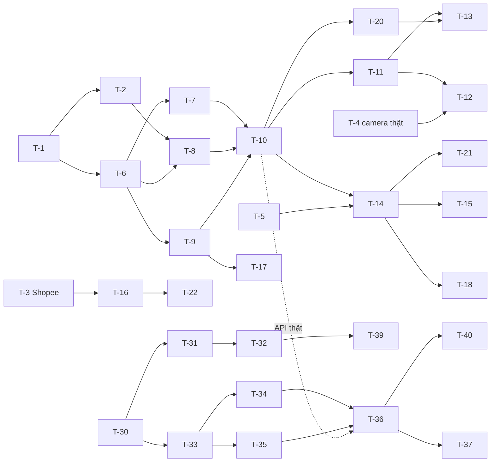

# 01-packing-mvp — Plan

| | |
|---|---|
| Owner (PM) | khanhtt |
| Reviewer | PO · Tech lead (khanhtt) |
| Trạng thái | Approved (Plan 2026-10-04, tự quyết DEC-15) |
| Spec | [02-tech-spec.md](02-tech-spec.md) · [02a §12](02a-be-spec.md#12-task) · [02b-station §14](02b-fe-spec-station.md#14-task) · [02b-admin §14](02b-fe-spec-admin.md#14-task) |
| Last update | 2026-10-05 · PM (chuẩn hoá template 2026-10-05) |

> **TL;DR** — 46 task (22 BE, 24 FE), ≈ 70 ngày công cho một dev, 6 milestone M0–M5; mỗi milestone demo được end-to-end.
> Đường găng BE: T-1 → T-6 → T-7 → T-10 → T-14 → T-15 (≈ 11 ngày); nhánh Cam 2 T-10 → T-11 → T-12 chờ thêm camera thật (T-4).
> Xong dự kiến 2027-01-14 (M5), tính từ 2026-10-05, 1 dev, 5 ngày/tuần (DEC-34).
> Rủi ro tiến độ lớn nhất: Shopee duyệt partner chậm (T-3, Q11) và chưa có camera thật (T-4) — khởi động cả hai ngày đầu.

<!-- Đối tượng đọc: cả đội và người duyệt Plan. Task lấy từ 02a §12 / 02b §14; không tự đặt thêm phạm vi. -->

---

## 1. Chiến lược chia

**Vertical slice theo milestone.** Mỗi milestone gồm cả BE và FE của một nhóm UC, demo được trên camera giả (`fake-cams`) + MSW, sau đó trên BE thật. Lý do: một dev làm cả hai đầu, cần thấy luồng chạy sớm để phát hiện lệch contract; spike phần cứng / Shopee chạy song song vì có thời gian chờ bên ngoài.

Task > 2 ngày trong spec được tách (cột Nguồn ghi "tách từ"). ID cũ giữ nguyên, phần tách ra mang ID mới.

## 2. Task

Owner tất cả: khanhtt (profile §7). Ticket: chưa tạo (§7). Trạng thái: ⬜ chưa · ▶ đang làm · ✅ xong.

| T | Tên | Comp | Phủ (FR / API / màn) | Nguồn | Phụ thuộc | Ước lượng | Ticket | Trạng thái |
|---|---|---|---|---|---|---|---|---|
| T-1 | Khung repo BE: uv, ruff, mypy, pytest, import-linter, Dockerfile (Python + FFmpeg + font), compose.dev, CI | be | — | 02a §12 | — | 1 | | ✅ |
| T-2 | MediaMTX + `fake-cams` (RTSP từ file mẫu có barcode), record fMP4 60 giây | be | FR-02.01 | 02a §12 | T-1 | 1 | | ✅ |
| T-3 | Spike S1 Shopee (đăng ký partner, endpoint, ký, trạng thái, rate limit) | be | FR-05.* | 02a §12 | — (bắt đầu ngày 1) | 2 + chờ duyệt | | ⬜ |
| T-4 | Spike S2 vision với camera thật (vị trí, ROI, tỉ lệ đọc, CPU, ONVIF — DEC-33) | be | FR-03.06, AC-04, AC-17 | 02a §12 | T-2, có camera | 2 | | ⬜ |
| T-5 | Spike S3 cắt clip + đo encode export (AC-08) | be | FR-02.02, AC-08 | 02a §12 | T-2 | 1 | | ⬜ |
| T-6 | core + migration `0001_initial` + CLI `create-admin` (`seed-demo` dời T-10, DEC-39) | be | — | 02a §12 | T-1 | 2 | | ✅ |
| T-7 | users + auth: API-01..04, 90..92 | be | FR-10.*, FR-03.01 | 02a §12 | T-6 | 2 | | ✅ |
| T-8 | stations + camera: API-60..65, path MediaMTX, J-08 (trong vision), J-09 | be | FR-01.01..06 | 02a §12 | T-6, T-2 | 2 | | ✅ |
| T-9 | orders + `transition()` + adapter interface + mock adapter | be | FR-05.07 | 02a §12 | T-6 | 1 | | ✅ |
| T-10 | sessions: state machine, API-10, API-11 (mở / đóng / MISMATCH / ALERT, nhánh tray) + CLI `seed-demo` | be | FR-03.02..07, 03.11, BR-01..06, 18 | 02a §12 (tách) | T-7, T-8, T-9 | 2 | | ✅ |
| T-20 | sessions: API-12, 15, `scan_dedup`, J-07 quá giờ, REPACK superseding | be | FR-03.08, 03.09, BR-03, 16 | tách từ T-10 | T-10 | 1 | | ✅ |
| T-11 | realtime hub: WS-01, WS-02, `ws:approvals`, after_commit | be | FR-03.06, 09.01 | 02a §12 | T-10 | 1 | | ✅ |
| T-12 | vision process + `on_tray_changed` + `camera.health` subscriber | be | FR-03.06, 03.07, 01.04, BR-06, 18 | 02a §12 | T-4, T-11 | 2 | | ⬜ |
| T-13 | approvals: API-13, 14, 20, 21. Kèm từ review M1 (DEC-53): thu hồi đăng nhập station đóng WS ngay | be | FR-03.10, 03.12 | 02a §12 | T-11, T-20 | 1,5 | | ⬜ |
| T-14 | media: J-10 index segment, J-01 cắt clip, API-40, 41 | be | FR-02.01..05, 07.02 | 02a §12 (tách) | T-5, T-10 | 2 | | ⬜ |
| T-21 | media: API-42 giữ clip, API-46 cắt lại, J-02 retention | be | FR-02.06, 02.09, BR-09, AC-15, AC-20 | tách từ T-14 | T-14 | 1 | | ⬜ |
| T-15 | export: API-43..45, J-03 (overlay, side-by-side, queue `export`) | be | FR-07.04, 02.07 | 02a §12 | T-14 | 2 | | ⬜ |
| T-16 | Shopee adapter + API-70..73 + tra 2 giây trong scan | be | FR-05.01, 05.06, 05.08, BR-04 | 02a §12 (tách) | T-3, T-9, T-10 | 2 | | ⬜ |
| T-22 | Shopee jobs J-04, J-05, J-06, J-12 | be | FR-05.02..04 | tách từ T-16 | T-16 | 1 | | ⬜ |
| T-17 | imports: API-50..54, BR-17 | be | FR-05.09, 05.10 | 02a §12 | T-9 | 1,5 | | ⬜ |
| T-18 | reports API-32, settings API-80, health API-81, J-11 | be | FR-09.01, 02.06 | 02a §12 | T-14 | 1 | | ⬜ |
| T-19 | Contract test, locust, compose.yml prod, Caddyfile, README vận hành. Checklist từ review M1 (DEC-53): đặt `FORWARDED_ALLOW_IPS` = IP Caddy; không phục vụ `*.map`; secret thật cho staging/prod | be | NFR-01, 05, 09 | 02a §12 | T-10..T-22 | 2 | | ⬜ |
| T-30 | Khung repo FE: Vite, React, TS, pnpm, ESLint, Prettier, Vitest, Playwright, CI | fe | — | 02b-st §14 | — | 1 | | ✅ |
| T-31 | Design tokens → `tokens.css`, Tailwind theo vai trò màu, font, `system.css` | fe | — | 02b-st §14 | T-30 | 1 | | ✅ |
| T-32 | `shared/ui` phần 1: Icon, Button, IconButton, TextField, SelectField, TextAreaField, Alert, StatusChip, AuthCard, TrackingNumber | fe | — | 02b-st §14 (tách) | T-31 | 2 | | ✅ |
| T-39 | `shared/ui` phần 2: LinearProgress (EXTEND), PageHeader, EmptyState, Tabs, SegmentedButtons, Dialog, Pagination, Toast, Skeleton | fe | — | tách từ T-32 | T-32 | 1,5 | | ✅ |
| T-33 | API client (tạm viết tay theo 02 §6), interceptor auth/refresh, map lỗi, MSW nền, WS client | fe | API-01..04 | 02b-st §14 | T-30 | 2 | | ✅ |
| T-34 | Auth + router + guard; S0 | fe | S0, FR-03.01 | 02b-st §14 | T-32, T-33 | 1 | | ✅ |
| T-35 | `useScanListener`, `stationStore`, hàng đợi quét, âm thanh | fe | FR-03.11 | 02b-st §14 | T-33 | 1,5 | | ✅ |
| T-36 | StationPage, StatusBar, S2, S3 | fe | S2, S3, FR-03.03..07 | 02b-st §14 (tách) | T-34, T-35; API-10, 11, WS-01 | 2 | | ✅ |
| T-40 | S1 + phiên gần đây + ClipPreviewDialog (`ClipPlayer` dùng chung) | fe | S1, FR-03.02 | tách từ T-36 | T-36, T-39; API-15, 40 | 1 | | ✅ |
| T-37 | S4, S5 (MISMATCH / ASSIST / REPACK), S6, CancelSessionDialog | fe | S4–S6, FR-03.08, 03.10, 03.12 | 02b-st §14 | T-36; API-12..14 | 2 | | ✅ (FE; API-13/14 thật ở T-13) |
| T-38 | Test integration + E2E station; chạy với BE thật | fe | UC-01, UC-08 | 02b-st §14 | T-37, T-13 | 1,5 | | ⬜ |
| T-50 | AppShell, drawer theo role, theme, D1, D12, guard | fe | D1, D12, FR-10.02 | 02b-ad §14 | T-34, T-39 | 1,5 | | ✅ |
| T-51 | D2 Tổng quan + WS-02 invalidate | fe | D2, FR-09.01 | 02b-ad §14 | T-50; API-32 | 1,5 | | ⬜ |
| T-52 | D3 Tra cứu | fe | D3, FR-07.01, 07.03 | 02b-ad §14 | T-50; API-30 | 1,5 | | ⬜ |
| T-53 | D4 Chi tiết + ClipPlayer + Giữ clip + cắt lại | fe | D4, FR-07.02, 02.09 | 02b-ad §14 | T-52, T-40; API-31, 40, 42, 46 | 2 | | ⬜ |
| T-54 | ExportDialog | fe | D4, FR-07.04, 02.07 | 02b-ad §14 | T-53; API-43..45 | 1 | | ⬜ |
| T-55 | D13 Yêu cầu duyệt + badge + âm báo | fe | D13, FR-03.12 | 02b-ad §14 | T-50; API-20, 21 | 1,5 | | ⬜ |
| T-56 | D5 Nhập đơn | fe | D5, FR-05.09 | 02b-ad §14 | T-50; API-50..54 | 1,5 | | ⬜ |
| T-57 | D6 Station, camera, kiểm tra kết nối | fe | D6, FR-01.01 | 02b-ad §14 (tách) | T-50; API-60..63 | 1,5 | | ✅ |
| T-62 | `RoiEditor` + lưu ROI | fe | D6, FR-01.04 | tách từ T-57 | T-57; API-63, 64 | 1 | | ⬜ |
| T-58 | D7 Shopee, D8 Lưu trữ + sức khỏe | fe | D7, D8, FR-05.01, 02.06 | 02b-ad §14 | T-50; API-70..73, 80, 81 | 1,5 | | ⬜ |
| T-59 | D9 Người dùng, D10 Nhật ký | fe | D9, D10, FR-10.01, 10.03 | 02b-ad §14 | T-50; API-90..92 | 1,5 | | ⬜ |
| T-60 | D11 Live view (WHEP) | fe | D11, FR-01.05 | 02b-ad §14 | T-50; API-65 | 1,5 | | ⬜ |
| T-61 | Test integration + E2E admin; chạy với BE thật | fe | UC-03, 07, 08, 09 | 02b-ad §14 | T-51..T-60 | 2 | | ⬜ |

Task nền theo spec đã có: migration (T-6), mock contract cho FE (T-33 MSW), flag `SHOPEE_ENABLED` (T-16), seed dữ liệu test (T-6 `seed-demo`), tài liệu vận hành (T-19). Done của mọi task: theo profile §8 (build / lint / test không thêm lỗi, test hành vi mới, system-map cập nhật).

## 3. Thứ tự & song song

- **Đường găng (BE):** T-1 → T-6 → T-7 → T-10 → T-14 → T-15 ≈ 11 ngày; nhánh Cam 2 T-10 → T-11 → T-12 phụ thuộc thêm T-4 (camera thật).
- **Song song cho một dev:** FE station (T-30..T-37) chạy trên MSW trong lúc chờ BE; spike T-3, T-4 chạy nền (chờ bên ngoài).
- **Ngày đầu:** gửi đăng ký Shopee Open Platform (T-3), đặt mua 1 bộ camera + máy quét (T-4) — thời gian chờ không nằm trên đường găng nếu làm ngay.

## 4. Milestone

Ngày mục tiêu tính từ thứ Hai 2026-10-05, 1 dev, 5 ngày/tuần, chưa trừ nghỉ lễ (DEC-34).

| Milestone | Gồm task | Công | Ngày mục tiêu | Demo được gì |
|---|---|---|---|---|
| M0 Nền móng | T-1, T-2, T-6, T-30, T-31, T-32, T-39, T-33 | 11,5 | 2026-10-20 | Hai repo chạy `compose.dev` + `pnpm dev`, CI xanh, camera giả phát RTSP, UI kit xem được |
| M1 Quét đóng gói | T-7, T-8, T-9, T-10, T-20, T-11, T-34, T-35, T-36, T-50, T-57 | 17 | 2026-11-11 | Đăng nhập station, quét mở / đóng phiên với đơn seed, lệch mã do quét, Admin tạo station + camera (AC-01, 03, 13) |
| M2 Video bằng chứng | T-5, T-14, T-21, T-15, T-18, T-40, T-51, T-52, T-53, T-54 | 14 | 2026-12-01 | Clip Cam 1 + Cam 2 sau khi đóng, tra cứu, xem, giữ, xuất MP4 có overlay, dashboard ngày (AC-02, 08, 11, 15, 16, 18, 20) |
| M3 Cam 2 + duyệt | T-4, T-12, T-13, T-37, T-55, T-62, T-60 | 13 | 2026-12-18 | Phiếu sai trên khay bị bắt, gửi duyệt → Supervisor duyệt trên dashboard, đóng gói lại, live view (AC-04, 10, 14, 17, 19, 21) |
| M4 Nguồn đơn | T-3, T-16, T-22, T-17, T-56, T-58, T-59 | 11 | 2027-01-06 | Kết nối Shopee (hoặc CSV khi chưa có quyền), đơn hủy bị chặn, người dùng + nhật ký (AC-05, 12) |
| M5 Hoàn thiện | T-19, T-38, T-61 | 5,5 | 2027-01-14 | Contract test, test tải, E2E, compose production; sẵn sàng G3 (AC-09, NFR-01, 05) |

## 5. Rủi ro tiến độ

| Rủi ro | Giảm thiểu |
|---|---|
| Shopee duyệt partner chậm / từ chối (Q11) | Gửi đăng ký ngày 1; M4 làm CSV (T-17, T-56) trước; `SHOPEE_ENABLED=false`; T-16/T-22 có thể dời sang item sau mà MVP vẫn dùng được |
| Chưa có camera thật khi tới M3 | Đặt mua ngày 1; T-12 phát triển trên `fake-cams` (file có barcode), chỉ T-4 cần phần cứng |
| Cam 2 đọc < 95% (AC-04) | T-4 trước T-12; nếu không đạt → change request (đổi camera / ánh sáng / vị trí) trước khi làm tiếp M3 |
| Một dev, 70 ngày công, ước lượng chưa có dữ liệu | Theo dõi sau M0, M1; cắt phạm vi theo thứ tự: D11 live view, D10, SIDE_BY_SIDE export (đều không phải AC chặn) |
| Contract lệch khi code | T-33 MSW theo 02 §6; T-19 contract test so `/openapi.json` với 02 |

## 6. Bảng phủ FR → task

| FR | Task BE | Task FE |
|---|---|---|
| FR-01.01 | T-8 | T-57 |
| FR-01.02, 01.03 | T-8, T-12 | T-36, T-51 |
| FR-01.04 | T-8, T-12 | T-62 |
| FR-01.05 | T-8 | T-60 |
| FR-01.06 | T-8, T-18 | T-51 |
| FR-02.01..05 | T-2, T-14 | T-53 |
| FR-02.06 | T-21, T-18 | T-58 |
| FR-02.07 | T-15 | T-54 |
| FR-02.09 | T-21 | T-53 |
| FR-03.01 | T-7 | T-34, T-59 |
| FR-03.02..07, 03.11 | T-10, T-12 | T-35, T-36, T-40 |
| FR-03.08, 03.09 | T-20 | T-37 |
| FR-03.10, 03.12 | T-13, T-20 | T-37, T-55 |
| FR-05.01 | T-16 | T-58 |
| FR-05.02..04, 05.06, 05.08 | T-16, T-22 | — (không có UI riêng) |
| FR-05.07 | T-9 | — |
| FR-05.09, 05.10 | T-17 | T-56 |
| FR-07.01, 07.03 | T-10 (dữ liệu), T-14 | T-52 |
| FR-07.02 | T-14 | T-53 |
| FR-07.04 | T-15 | T-54 |
| FR-09.01 | T-18, T-11 | T-51 |
| FR-10.01..10.03 | T-7 | T-50, T-59 |

Mọi FR mức M trong phạm vi 01 có ít nhất một task. Không có task ngoài FR trừ task nền (T-1, T-6, T-30..T-33, T-39, T-19) — kỹ thuật cần thiết.

## 7. Tracker

Profile: GitHub Issues (`khanhego/ai-cam-be`, `khanhego/ai-cam-fe`). **Chưa tạo ticket** — tạo issue là thao tác ra bên ngoài, chờ user cho phép (DEC-35). Khi được phép: một issue / task, tiêu đề `[T-n] <Tên>`, nhãn `be`/`fe` + `M0`..`M5`, mô tả trỏ FR / API / màn và file spec; key ghi ngược cột Ticket.

## Decisions

| DEC | Bối cảnh | Lựa chọn | Lý do | Người chốt |
|---|---|---|---|---|
| DEC-34 | Ngày mục tiêu | Tính từ 2026-10-05, 1 dev, 5 ngày/tuần, không trừ lễ | Chưa có lịch thực; cập nhật sau M0 | khanhtt (tự quyết) |
| DEC-35 | Tạo ticket GitHub | Hoãn, chờ user cho phép | Thao tác ra bên ngoài (memory: vẫn hỏi trước) | khanhtt (tự quyết) |
| DEC-36 | Tách task > 2 ngày | T-10→T-20, T-14→T-21, T-16→T-22, T-32→T-39, T-36→T-40, T-57→T-62 | Quy ước ≤ 2 ngày / task | khanhtt (tự quyết) |
| DEC-37 | Duyệt Plan | Duyệt (ủy quyền DEC-15) | Phủ đủ FR, phụ thuộc rõ | khanhtt (tự quyết) |
| DEC-53 | Review code M1 (subagent): Đạt có điều kiện, 3 major + 20 minor/nit | Sửa ngay 3 major và #4–#12, #14, #16–#18, #20–#22, một phần #13 (token station đã gỡ → 403 ngay), mỗi sửa có test. Để sau: #13 thu hồi + đóng WS ngay → T-13/T-59; #15 `VIDEO_INCOMPLETE` → T-14; #19 định dạng giờ `Z`; #23 J-09 giữ transaction. Checklist deploy (`FORWARDED_ALLOW_IPS`, không phục vụ `*.map`, secret staging) → T-19 | Major chặn G3; phần để sau phụ thuộc task chưa làm | khanhtt (tự quyết, ủy quyền DEC-15) |
| DEC-54 | QA M1: tài khoản dashboard mở `/station` bằng tải trang mới | Chấp nhận hành vi thực tế: về `/station/login` (cookie refresh tách `rt_station` / `rt_dashboard`), thay vì `/admin` như ma trận 04 §3. Điều hướng trong app vẫn theo guard | An toàn hơn, không lộ phiên chéo client; đổi lại cần sửa ô ma trận trong 04 | khanhtt (tự quyết) |
