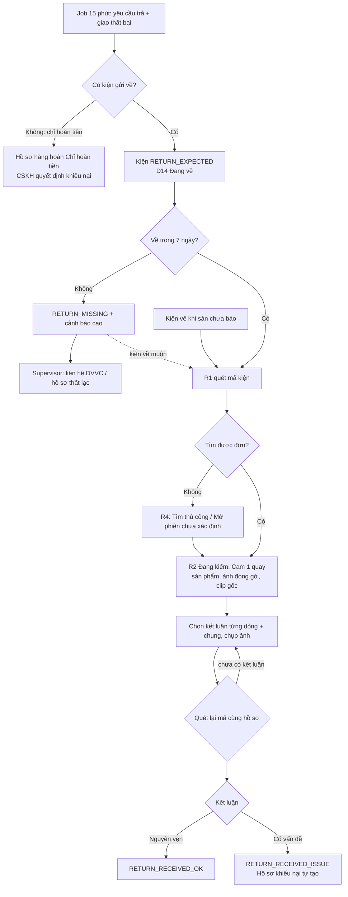
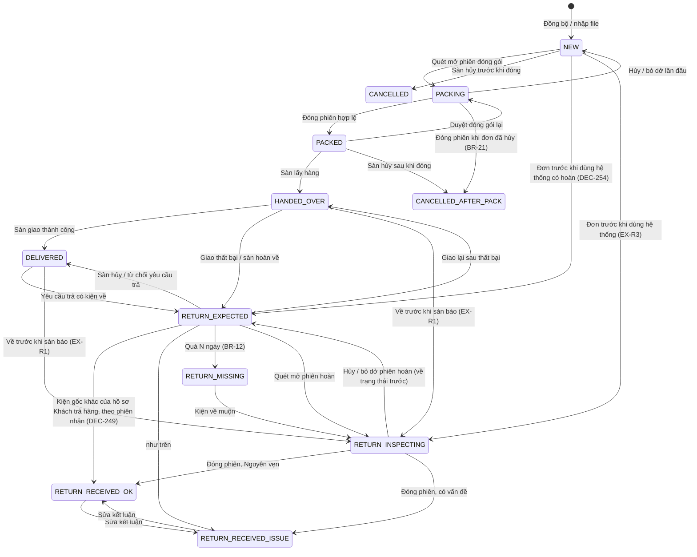
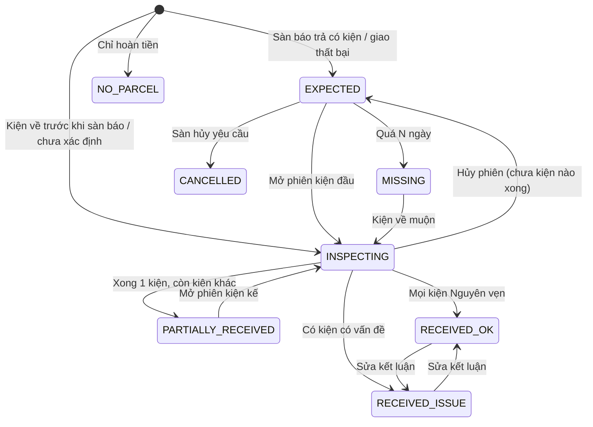
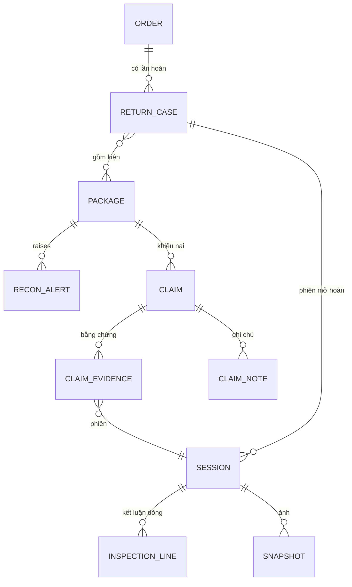
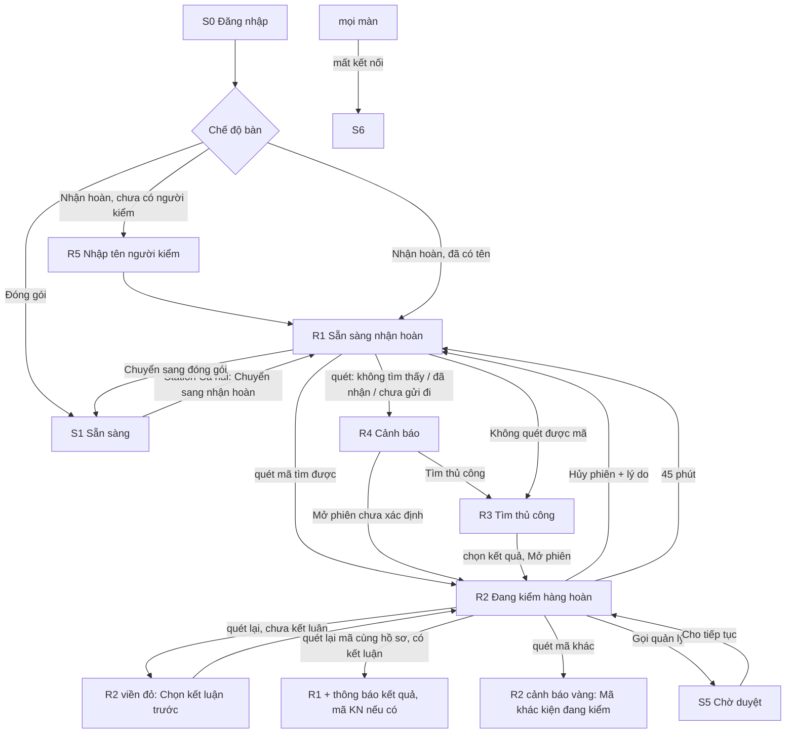
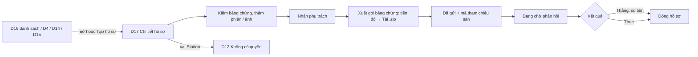

# SRS — 02 Hàng hoàn và đối soát (Phase 2)

**Mọi kiện hoàn về kho được mở dưới camera và có kết luận, mọi lệch trạng thái sàn / kho được báo cho quản lý, và CSKH có hồ sơ khiếu nại đủ bằng chứng (clip đóng gói + clip mở hoàn) để gửi sàn.**

| | |
|---|---|
| Phiên bản | 0.6 |
| Trạng thái | Approved (G1 2026-10-05, tự duyệt theo ủy quyền user — DEC-217) · v0.3 change request sau review G2 lượt 1 (DEC-244) · v0.4 sau review G2 lượt 2 (DEC-264) · v0.5 sau lượt 3 (DEC-275) · v0.6 change request sau xác minh G3 (DEC-360) |
| Owner (PO) | khanhtt (nghiệp vụ do chủ shop xác nhận) |
| Reviewer | khanhtt (solo) |
| Nguồn | [SRS hệ thống](../../system/SRS.md) §4.2, §5.4–5.8, §6.3–6.5, §7, §13.2 Phase 2 · Q&A sau Phase 1 [06-business-qa](../01-packing-mvp/06-business-qa.md) (L2–L9, §4) · hệ thống Phase 1 đang chạy ([system-map](../../system/system-map.md), item [01](../01-packing-mvp/01-srs.md)) |
| Last update | 2026-10-05 · PO + UX (v0.1 SRS; v0.2 §10 màn hình; v0.3 sửa theo review G2 R-1..R-30 — DEC-244..262; v0.4 sửa R2-1..R2-11 — DEC-264..273; v0.6 2026-10-06 BR-10, 11, 12, 14, 19, 20 theo G3 — DEC-360) |

> **TL;DR** — Kiện hoàn hiện về kho không ai quay, không ai đối chiếu (P2, P4); sàn báo "đã hoàn" mà kho không biết hàng đã về chưa (P3).
> Phase 2: job đồng bộ yêu cầu trả + giao thất bại từ Shopee → danh sách "Hàng hoàn đang về"; bàn nhận hoàn (station Phase 1, tài khoản chung + tên người kiểm) quét mã → mở phiên dưới Cam 1 → chọn kết luận → quét lại đóng phiên; kết luận có vấn đề tự tạo hồ sơ khiếu nại có clip đóng gói + clip mở hoàn; đối soát 30 phút một lần sinh cảnh báo lệch.
> Kèm "Phase 1 hardening": sàn tối thiểu retention, chữ S3, cờ Cam 2 lên dashboard, `info.json`, hồ sơ thay cờ giữ, ảnh lúc đóng gói, báo đơn hủy khi đang đóng.
> Thành công khi: ≥ 99% kiện hoàn có clip mở hoàn; 100% kiện hoàn quá 7 ngày chưa về có cảnh báo; tạo hồ sơ ≤ 5 phút sau khi kiểm xong. Chặn go-live: Q13 (hạn khiếu nại thật), T-3 Shopee, T-4 camera thật.

SRS item này **chỉ ghi phần thay đổi / chi tiết hóa cho Phase 2**. ID giữ theo SRS hệ thống và item 01. Mục ghi "Không đổi" thì đọc ở SRS hệ thống / item 01. ID mới của item này: DEC-201+, FR/BR/AC/EX nối tiếp số đã có.

---

## 1. Giới thiệu

**Mục đích & người đọc:** cơ sở cho tech spec, BE/FE spec, test và nghiệm thu Phase 2 · Người đọc: khanhtt (mọi vai), chủ shop, người đứng bàn nhận hoàn, CSKH.

| Trong phạm vi | Ngoài phạm vi (giai đoạn này) |
|---|---|
| M04 Phiên mở hàng hoàn đầy đủ (FR-04.01..07) + nhiều kiện, trả một phần, người kiểm ca, kiện chưa xác định (FR-04.08..13) | Báo cáo hàng hoàn / khiếu nại chi tiết FR-09.02..04 → Phase 3 |
| M05 Shopee returns: đồng bộ yêu cầu trả (FR-05.05), giao thất bại (FR-05.11), chỉ hoàn tiền (FR-05.12), adapter `list_returns` (FR-05.07) | Gửi khiếu nại / tranh chấp lên Shopee qua API (`returns.dispute`) — CSKH vẫn gửi trên Seller Center |
| M06 Đối soát: trạng thái sàn + kho song song, BR-10..14 + BR-19, 20, bảng Lệch trạng thái, điều chỉnh tay, tự đóng cảnh báo (FR-06.01..03, 05, 06) | Thông báo Zalo / Telegram / email (FR-06.04) → Phase 3 |
| M08 Hồ sơ khiếu nại cơ bản: tạo tự động / thủ công, trạng thái, bằng chứng, hạn, gói bằng chứng zip (FR-08.01..06) | Link chia sẻ có hạn (FR-07.05), sao lưu cloud (FR-02.08) → Phase 3 |
| M09 Dashboard ngày thêm số liệu hoàn / lệch / hồ sơ (FR-09.01 mở rộng) | TikTok Shop / Lazada adapter → Phase 3 |
| Phase 1 hardening (06-business-qa L2–L9): FR-02.06, 02.09–02.12, FR-03.13–03.15 | Vai trò Return Inspector riêng, đăng nhập cá nhân (giữ DEC-1 — DEC-204) |
| M01: loại station nhận hoàn / cả hai (FR-01.01 phần loại, FR-01.07) | Nhận diện sản phẩm bằng AI khi mở hoàn (giai đoạn 4) |
| | Quản lý nhập lại tồn kho sau hoàn (ngoài phạm vi hệ thống — SRS §1.2) |
| | Tra theo SĐT người mua (EX-R2 gốc): MVP không lưu SĐT (item 01 §8, NFR-20) |

**Thuật ngữ:** Không đổi — xem SRS hệ thống §1.3 và item 01 §1. Bổ sung:

| Thuật ngữ | Nghĩa |
|---|---|
| Kiện hoàn | Kiện hàng sàn / đơn vị vận chuyển (ĐVVC) trả về kho |
| Mã vận đơn chiều về | Mã do sàn cấp cho kiện khách gửi trả (Shopee: `tracking_number` của yêu cầu trả). Khác mã vận đơn gốc |
| Hồ sơ hàng hoàn | Một lần hàng của một đơn quay về kho, từ một yêu cầu trả của sàn hoặc một lần giao thất bại. Gồm một hoặc nhiều kiện. Có loại (§9) và trạng thái (§7.2) |
| Phiên mở hoàn | Không đổi (SRS §1.3). Trong hệ thống: phiên loại `RETURN` trên station ở chế độ nhận hoàn |
| Kết luận | Tình trạng kiện hoàn do người kiểm chọn: Nguyên vẹn · Hư hỏng · Thiếu hàng · Sai hàng / bị tráo · Hộp rỗng · Khác |
| Người kiểm | Tên người đứng bàn nhận hoàn trong ca, nhập trên station (DEC-204) |
| Cảnh báo lệch | Một vi phạm quy tắc đối soát BR-10..14, 19, 20 cho một kiện |
| Hồ sơ khiếu nại | Bộ bằng chứng + trạng thái theo dõi một lần khiếu nại với sàn hoặc ĐVVC |
| Gói bằng chứng | File zip xuất từ hồ sơ khiếu nại: clip gốc, MP4 có chữ, ảnh, file thông tin |
| Bàn hoàn | Station có loại "Nhận hoàn" hoặc "Cả hai" đang ở chế độ nhận hoàn |

**Tham chiếu:** [SRS hệ thống](../../system/SRS.md) · [item 01](../01-packing-mvp/01-srs.md) · [06-business-qa](../01-packing-mvp/06-business-qa.md) · [architecture.md](../../system/architecture.md) §4.1, §7.2, §7.3, §10.1 · Shopee Open Platform v2 nhóm `returns` (chưa thử với tài khoản thật — T-3).

## 2. Bối cảnh & bài toán

**AS-IS:** Không đổi — SRS hệ thống §2.1 "Nhận hàng hoàn". Sau Phase 1: kiện đi có clip; kiện hoàn vẫn mở tay, không quay; trạng thái hoàn của sàn chỉ hiện chữ ở D4, trạng thái kho đứng ở `HANDED_OVER` / `DELIVERED` (item 01 §7); cờ "giữ clip" do từng người bật / tắt.

| # | Vấn đề | Hệ quả | Item này giải quyết |
|---|---|---|:---:|
| P1 | Không có video đóng gói | — | Phase 1 xong; item này dùng clip đóng gói làm bằng chứng trong hồ sơ + vá L2, L5, L7, L8 |
| P2 | Không có video mở hàng hoàn | Không chứng minh được khách trả hàng hỏng / giả / thiếu | ✔ |
| P3 | Trạng thái sàn khác thực tế kho | Hàng hoàn thất lạc không ai biết, quá hạn khiếu nại | ✔ (phần hoàn + đối soát toàn bộ) |
| P4 | Kiểm tra hàng hoàn bằng tay | Tốn công, sót, không có lịch sử | ✔ |
| P5 | Dán nhầm phiếu | — | Phase 1 xong; item này vá L3, L4 để đo được chỉ số "giao sai = 0" |
| P6 | (mới, 06-business-qa L2, L7) Bằng chứng có thể mất vì hạ số ngày lưu hoặc bỏ giữ clip | Mất clip đúng lúc khiếu nại | ✔ |

| Mục tiêu | Chỉ số | Hiện tại | Mục tiêu Phase 2 |
|---|---|---|---|
| Mọi kiện hoàn có video mở | % phiên mở hoàn `COMPLETED` có clip Cam 1 không cờ `VIDEO_INCOMPLETE` | 0% | ≥ 99% |
| Phát hiện hàng hoàn chưa về | % kiện `RETURN_EXPECTED` quá N ngày có cảnh báo | 0% | 100% |
| Lập hồ sơ khiếu nại nhanh | Thời gian từ đóng phiên hoàn có vấn đề → hồ sơ có đủ clip | không có | ≤ 5 phút (clip ≤ 60 giây, hồ sơ tạo ngay khi đóng) |
| Xuất bằng chứng khiếu nại | Thời gian tạo gói bằng chứng 2 phiên ≤ 3 phút mỗi phiên | thủ công | ≤ 3 phút |
| Không làm chậm bàn hoàn | Thời gian thao tác thêm / kiện (2 lần quét + chọn kết luận) | — | ≤ 10 giây |
| Không mất bằng chứng | Số clip gắn hồ sơ chưa đóng bị xóa | chưa đo | 0 |

## 3. Stakeholder & tác nhân

Stakeholder: Không đổi — SRS hệ thống §3.1.

| Tác nhân | Loại | Vai trò trong Phase 2 |
|---|---|---|
| Admin | người | Cấu hình loại station, ngưỡng đối soát, hạn khiếu nại, retention |
| Supervisor | người | Xử lý cảnh báo lệch, điều chỉnh trạng thái kho, gắn đơn cho kiện hoàn chưa xác định, sửa kết luận, duyệt "Gọi quản lý" ở bàn hoàn |
| Tài khoản station (người đứng bàn hoàn) | người, tài khoản chung + tên người kiểm | Thực hiện phiên mở hoàn (thay vai Return Inspector — DEC-204) |
| CSKH | người | Theo dõi hàng hoàn, quản lý hồ sơ khiếu nại, xuất gói bằng chứng |
| Shopee Open Platform | hệ thống ngoài | Yêu cầu trả hàng, trạng thái vận chuyển (giao thất bại) |
| Cam 1, Cam 2, máy quét | thiết bị | Cam 1 quay mở kiện; Cam 2 quay nhãn / khay (DEC-203) |
| Job đồng bộ hoàn / đối soát / hạn hồ sơ | job | Chạy nền |

## 4. Quy trình nghiệp vụ (TO-BE)

### 4.1 Đóng gói giao hàng

Không đổi — SRS hệ thống §4.1, item 01 §4.1. Thay đổi Phase 1 hardening:

- **B7 (FR-03.14):** đóng phiên có cờ "Phiếu còn trên khay" hoặc "Cam 2 không xác minh" → station hiện thông báo vàng trên S1 ngay, dashboard đếm.
- **B7 (FR-02.11):** đóng phiên hợp lệ → hệ thống lưu một ảnh tĩnh Cam 1 lúc đóng (để so khi hàng hoàn về).
- **S3 (FR-03.13):** chữ hướng dẫn lệch mã tách hai tình huống (quét nhầm phiếu kiện kế tiếp / dán nhầm phiếu).
- **B4–B6 (FR-03.15):** đơn bị hủy trên sàn khi đang đóng → station báo đỏ "Đơn vừa bị hủy", không gửi kiện.

Ngoại lệ bổ sung:

| Mã | Ngoại lệ | Xử lý |
|---|---|---|
| EX-P12 | Đơn bị hủy trên sàn khi kiện đang `PACKING` | Station hiện cảnh báo trong ≤ 5 giây sau khi job đồng bộ thấy hủy; người đứng bàn "Hủy phiên" (lý do Khác) hoặc vẫn quét đóng → kiện `CANCELLED_AFTER_PACK` + cảnh báo BR-11 |
| EX-P13 | Kiện bỏ dở (`ABANDONED` → `NEW`) nhưng thực tế đã giao ĐVVC (L6) | Sàn báo đã lấy hàng → cảnh báo BR-10 "Giao đi không có clip đóng gói"; Supervisor điều chỉnh tay `NEW → HANDED_OVER` kèm lý do (FR-06.05) |

### 4.2 Nhận và xử lý hàng hoàn

Không đổi bước R1..R8 của SRS hệ thống §4.2 (giữ sơ đồ). Chi tiết hóa:

| Bước SRS | Chi tiết Phase 2 |
|---|---|
| R1 | Job đồng bộ (15 phút) lấy (a) yêu cầu trả có kiện gửi về, (b) đơn giao thất bại (sàn `TO_RETURN` / vận chuyển giao thất bại). Gắn vào hồ sơ hàng hoàn **đang mở của đơn** nếu có (kể cả hồ sơ "Về trước khi sàn báo"), không thì tạo mới — mỗi đơn tối đa một hồ sơ có kiện đang về (DEC-248). Kiện → `RETURN_EXPECTED` (kể cả kiện `NEW` của đơn trước khi dùng hệ thống — DEC-254). Ngay khi hồ sơ mở, clip + ảnh của phiên đóng gói hiệu lực được giữ (BR-09). Yêu cầu **chỉ hoàn tiền** (không có kiện về) → hồ sơ loại "Chỉ hoàn tiền", kiện giữ trạng thái (FR-05.12) |
| R2 | Người đứng bàn hoàn (đã nhập tên người kiểm đầu ca — BR-28) đặt kiện dưới Cam 1, đặt nhãn kiện trong vùng Cam 2, quét mã trên kiện: **mã vận đơn chiều về, mã vận đơn gốc, hoặc mã đơn sàn** (Q6 → DEC-202). Không quét được → tìm thủ công (FR-04.07) |
| R3 | Hệ thống tìm hồ sơ hàng hoàn / đơn gốc → mở phiên mở hoàn. Màn hình hiện: loại hoàn, lý do khách, sản phẩm đã gửi + số lượng yêu cầu trả, ảnh lúc đóng gói, nút xem clip đóng gói gốc |
| R4–R5 | Mở kiện dưới Cam 1. Với mỗi dòng sản phẩm: số lượng nhận + tình trạng; chọn kết luận chung (BR-22); chụp ảnh từ Cam 1 (tối đa 20); ghi chú |
| R6 | Quét lại mã thuộc cùng hồ sơ (BR-23) → đóng phiên, cắt clip. Chưa có kết luận → không đóng (BR-07) |
| R7 | Kết luận ≠ Nguyên vẹn → tạo hồ sơ khiếu nại (BR-08) gồm phiên đóng gói hiệu lực + phiên mở hoàn + ảnh (FR-08.06) |
| R8 | Job đối soát 30 phút: `RETURN_EXPECTED` quá 7 ngày → `RETURN_MISSING` + cảnh báo (BR-12); sàn báo đã hoàn tất mà kho chưa nhận → cảnh báo (BR-19) |

Ngoại lệ: Không đổi EX-R1..EX-R5 (SRS §4.2), chi tiết hóa + bổ sung:

| Mã | Ngoại lệ | Xử lý |
|---|---|---|
| EX-R1 | Kiện hoàn về nhưng sàn chưa báo | Vẫn mở phiên; hồ sơ hàng hoàn loại "Về trước khi sàn báo"; cảnh báo thấp BR-13; tự đóng khi sàn cập nhật |
| EX-R2 | Mã trên kiện rách / không đọc được | R3 Tìm thủ công: nhập mã vận đơn gốc / chiều về / mã đơn sàn (không có tra SĐT — §1) |
| EX-R3 | Đơn gốc không có clip đóng gói | Vẫn mở phiên; hồ sơ khiếu nại ghi "Không có clip đóng gói" |
| EX-R4 | Một đơn hoàn về nhiều kiện | Giao thất bại: các kiện gốc quay về riêng → mỗi kiện một phiên, chỉ kết luận chung (hệ thống không biết sản phẩm nằm ở kiện nào); hồ sơ "Đã nhận" khi đủ kiện. Khách trả hàng: khách gửi **một** kiện chiều về → **một** phiên nhận cho cả hồ sơ; kiện gốc chuyển "Đã nhận hoàn" theo BR-24 (chỉ mọi kiện khi yêu cầu trả bao trọn đơn — DEC-271). Về trước khi sàn báo / chưa xác định của đơn > 1 kiện → như giao thất bại: mỗi kiện một phiên (DEC-265) |
| EX-R5 | Khách trả một phần | Kết luận theo từng dòng; so với số lượng yêu cầu trả trên sàn |
| EX-R6 | Quét mã của kiện chưa rời kho theo hệ thống (`NEW` chưa giao, `PACKING`, `PACKED`, `CANCELLED*`) | Cảnh báo "Kiện chưa gửi đi", không mở phiên, kèm câu "Nếu kiện thực sự đã gửi đi, báo quản lý điều chỉnh trạng thái." (Supervisor chỉnh `CANCELLED_AFTER_PACK → HANDED_OVER` / `NEW → HANDED_OVER` rồi quét lại). Trừ `NEW` có đơn sàn đã giao / đang hoàn (đơn trước khi dùng hệ thống, EX-R3) → mở phiên |
| EX-R7 | Sàn hủy / từ chối yêu cầu trả khi kiện chưa về | Hồ sơ hàng hoàn "Đã hủy", kiện về trạng thái trước (`DELIVERED`); kiện vẫn về sau đó → như EX-R1 |
| EX-R8 | Quét đóng khi chưa chọn kết luận | Không đóng; âm lỗi + chữ "Chọn kết luận trước khi quét đóng" |
| EX-R9 | Quét mã khác hồ sơ khi đang kiểm | Cảnh báo, giữ phiên (không có trạng thái lệch mã ở bàn hoàn — DEC-203) |
| EX-R10 | Yêu cầu chỉ hoàn tiền (không có kiện về), vd khách báo thiếu hàng | Hồ sơ hàng hoàn "Chỉ hoàn tiền" trong D14; CSKH tạo hồ sơ khiếu nại với clip đóng gói |
| EX-R11 | Quét lại kiện hoàn đã nhận | Cảnh báo "Kiện hoàn đã nhận lúc …", không mở phiên mới. Lối thoát: người kiểm bấm "Đây là kiện khác — vẫn ghi hình" → mở phiên chưa xác định (ghi chú bắt buộc), Supervisor gắn đơn sau (DEC-265) |
| EX-R12 | Không tìm thấy đơn (mã lạ, sàn không trả lời trong 2 giây) | Cho "Mở phiên chưa xác định"; Supervisor gắn đơn sau (FR-04.13) |
| EX-R13 | Cam 1 mất tín hiệu khi đang kiểm | Như EX-P7: phiên chạy tiếp, cờ "Thiếu video", hồ sơ khiếu nại hiện cờ này |
| EX-R14 | Khách từ chối nhận (boom COD) hoặc đơn bị hủy sau khi ĐVVC đã lấy hàng (kiện `HANDED_OVER`) | Coi như giao thất bại: hồ sơ "Giao thất bại", kiện `RETURN_EXPECTED` (DEC-258, xác minh tín hiệu sàn ở T-3) |
| EX-R15 | Phiên mở hoàn quá 45 phút | Đã lưu kết luận → hệ thống tự hoàn tất phiên (cờ "Tự đóng"), tạo hồ sơ khiếu nại nếu có vấn đề; chưa có kết luận → bỏ dở, kiện về trạng thái trước, D2 "Cần xử lý" báo phiên hoàn bỏ dở (DEC-253) |
| EX-R16 | Quét kiện hoàn ở bàn đóng gói | Cảnh báo S4 "ĐƠN ĐÃ BÀN GIAO" kèm câu "Đây là kiện hàng hoàn — nhận ở bàn nhận hoàn.", không mở phiên (DEC-247) |



### 4.3 Đối soát trạng thái

- **C1.** Job đối soát chạy 30 phút một lần (và sau mỗi lần đồng bộ) trên mọi kiện chưa ở trạng thái cuối.
- **C2.** Mỗi kiện vi phạm quy tắc → một cảnh báo mở (không trùng — BR-26). Điều kiện hết → cảnh báo tự đóng "Tự hết".
- **C3.** Supervisor mở D15, xem trạng thái sàn / kho / lịch sử, chọn: đánh dấu đã xử lý (ghi chú bắt buộc) · điều chỉnh trạng thái kho (lý do bắt buộc, chỉ các chuyển cho phép §7.1) · tạo hồ sơ khiếu nại (thất lạc → ĐVVC).
- **C4.** Mọi xử lý ghi audit log.

| Quy tắc | Khi nào | Mức | Hành động gợi ý |
|---|---|:---:|---|
| BR-10 | Sàn đã lấy hàng / đang giao mà kho chưa `PACKED` (`NEW`, `PACKING`) | Cao | Kiểm clip, video thô; điều chỉnh `NEW → HANDED_OVER` nếu đã gửi thật (L6) |
| BR-11 | Sàn hủy mà kho `PACKED` / `CANCELLED_AFTER_PACK` | Trung bình | Tháo kiện, đánh dấu đã xử lý |
| BR-12 | `RETURN_EXPECTED` quá 7 ngày | Cao | Liên hệ ĐVVC; tạo hồ sơ thất lạc |
| BR-13 | Kho nhận hoàn mà 24 giờ sau sàn vẫn chưa có yêu cầu trả / giao thất bại | Thấp | Kiểm lại với sàn |
| BR-14 | `PACKED` quá 24 giờ mà sàn chưa lấy hàng | Trung bình | Kiểm kiện trên kệ bàn giao |
| BR-19 | Sàn báo yêu cầu trả đã hoàn tất (đã hoàn tiền / đóng) mà kho chưa nhận | Cao | Tìm kiện; khiếu nại sàn / ĐVVC |
| BR-20 | Kiện chưa xác minh với sàn quá 24 giờ (L9) | Thấp | Nhập CSV / kiểm mã |

## 5. Yêu cầu chức năng

Không đổi — FR của SRS hệ thống §5 và item 01 §5 cho các ID không liệt kê dưới đây. Bảng dưới là FR **trong phạm vi Phase 2** (nguyên văn khi "Gốc", chi tiết hóa khi "Sửa", mới khi "Mới").

### 5.1 M01 — Station

| ID | Yêu cầu | Ưu tiên | Nguồn | Thay đổi |
|---|---|:---:|---|---|
| FR-01.01 | Admin đặt **loại station**: Đóng gói / Nhận hoàn / Cả hai. Station Đóng gói không mở được phiên hoàn và ngược lại | M | P4, DEC-205 | Sửa: hiện thực phần "loại station" của FR gốc |
| FR-01.07 | Station loại "Cả hai" chuyển chế độ Đóng gói ↔ Nhận hoàn ngay tại bàn khi không có phiên đang mở; chế độ hiện rõ trên thanh trạng thái | M | DEC-205 | Mới |

### 5.2 M02 — Ghi hình, lưu trữ (Phase 1 hardening)

| ID | Yêu cầu | Ưu tiên | Nguồn | Thay đổi |
|---|---|:---:|---|---|
| FR-02.06 | Retention: video thô X ngày, clip phiên Y ngày (mặc định 30 / 90); không bị xóa tự động: (a) clip và ảnh gắn **hồ sơ khiếu nại chưa đóng**; (b) clip + ảnh của phiên đóng gói hiệu lực và phiên mở hoàn của kiện thuộc **hồ sơ hàng hoàn chưa kết thúc** ("Chỉ hoàn tiền": tối đa 30 ngày từ lúc sàn báo); hồ sơ khiếu nại đóng → retention tính tiếp từ ngày đóng (BR-09) | M | P6, L7, review R-1 | Sửa: về FR gốc + giữ theo hồ sơ hàng hoàn (DEC-245) |
| FR-02.09 | Cờ "giữ" thủ công ngừng dùng trên giao diện. Mọi clip đang giữ được chuyển thành hồ sơ khiếu nại "Chuyển từ cờ giữ" khi nâng cấp; chỉ Admin còn giữ / bỏ giữ được qua API (khẩn cấp, có audit) | M | L7, DEC-209 | Sửa |
| FR-02.10 | Số ngày giữ clip không được nhỏ hơn sàn tối thiểu (mặc định 60 ngày, chỉ đổi bằng cấu hình máy chủ). Hạ số ngày giữ clip hoặc video thô → hiện số clip / giờ video sẽ bị xóa ở lần dọn kế tiếp và bắt Admin xác nhận; ghi audit | M | L2, DEC-210 | Mới |
| FR-02.11 | Khi phiên đóng gói hoàn tất, hệ thống lưu một ảnh tĩnh Cam 1 tại thời điểm đóng phiên, gắn vào phiên, cùng retention với clip | S | L8 | Mới |
| FR-02.12 | File thông tin của bản xuất (`info.json`) có thêm: trạng thái phiên, danh sách cờ phiên, độ lệch giờ từng camera lúc xuất | M | L5 | Mới |

### 5.3 M03 — Phiên đóng gói (Phase 1 hardening)

| ID | Yêu cầu | Ưu tiên | Nguồn | Thay đổi |
|---|---|:---:|---|---|
| FR-03.13 | Màn Lệch mã (S3) do quét mã khác phải hướng dẫn hai tình huống: (a) kiện đang đóng đã xong nhưng quên quét → quét mã trên kiện đó; (b) dán nhầm phiếu → gỡ phiếu sai. Không có câu nào khiến người đứng bàn dán phiếu của kiện này lên kiện khác | M | L3 | Mới |
| FR-03.14 | Phiên đóng có cờ "Phiếu còn trên khay" hoặc "Cam 2 không xác minh" → station hiện thông báo vàng trên S1 ≤ 1 giây sau khi đóng; dashboard D2 có số đếm theo ngày cho hai cờ, bấm mở D3 lọc sẵn | M | L4, P5 | Mới |
| FR-03.15 | Đơn bị hủy trên sàn khi kiện đang đóng gói → station hiện cảnh báo đỏ trong phiên ≤ 5 giây sau khi hệ thống biết; đóng phiên vẫn được nhưng kiện chuyển `CANCELLED_AFTER_PACK` | M | L9, BR-21 | Mới |

### 5.4 M04 — Phiên mở hàng hoàn

| ID | Yêu cầu | Ưu tiên | Nguồn | Thay đổi |
|---|---|:---:|---|---|
| FR-04.01 | Quét mã kiện hoàn thì tìm hồ sơ hàng hoàn / đơn gốc theo mã vận đơn chiều về, mã vận đơn gốc, hoặc mã đơn sàn; mã chưa có → tra sàn ≤ 2 giây | M | R2, DEC-202 | Sửa: thêm thứ tự tra + tra sàn |
| FR-04.02 | Mở phiên mở hoàn, hiển thị: loại hoàn, sản phẩm đã gửi, số lượng yêu cầu trả, lý do trả của khách, ảnh lúc đóng gói (nếu có), nút xem clip đóng gói gốc | M | R3 | Gốc + ảnh (FR-04.12) |
| FR-04.03 | Người kiểm chọn kết luận cho cả kiện và cho từng dòng sản phẩm (số lượng nhận, tình trạng); kết luận chung theo BR-22 | M | R5 | Sửa: dòng sản phẩm bắt buộc khi có danh sách |
| FR-04.04 | Chụp ảnh tĩnh từ Cam 1 bằng nút / phím F2 trong phiên, tối đa 20 ảnh, ảnh do máy chủ lấy từ camera (không tải từ máy trạm), có SHA-256 | S | R5, DEC-220 | Sửa: chi tiết hóa |
| FR-04.05 | Quét lại mã thuộc cùng hồ sơ hàng hoàn để đóng phiên; bắt buộc đã có kết luận | M | R6, BR-07, BR-23 | Sửa: "mã cùng hồ sơ" |
| FR-04.06 | Kết luận khác "Nguyên vẹn" thì tự tạo hồ sơ khiếu nại (M08) | M | R7, BR-08 | Gốc |
| FR-04.07 | Tìm đơn thủ công khi không quét được mã: nhập mã vận đơn (gốc / chiều về) hoặc mã đơn sàn, chọn kết quả → mở phiên | M | EX-R2 | Gốc |
| FR-04.08 | Hồ sơ hàng hoàn nhiều kiện: "Khách trả hàng" nhận bằng **một** phiên cho cả hồ sơ; "Giao thất bại", "Về trước khi sàn báo", "Chưa xác định" của đơn > 1 kiện: mỗi kiện gốc một phiên, chỉ kết luận chung; hồ sơ "Đã nhận" theo BR-24 | M | EX-R4, BR-24 | Mới (sửa v0.3 DEC-249, v0.4 DEC-265) |
| FR-04.09 | Trả một phần: mỗi dòng hiện số lượng đã gửi và số lượng khách yêu cầu trả; kết luận so với số yêu cầu trả | M | EX-R5 | Mới |
| FR-04.10 | Bàn hoàn phải có tên người kiểm trong ca trước khi mở phiên; tên ghi vào phiên, hiện ở D4, hồ sơ khiếu nại và chữ trên bản xuất | M | DEC-204, BR-28 | Mới |
| FR-04.11 | Supervisor / Admin sửa kết luận của phiên hoàn đã đóng trong 7 ngày, bắt buộc lý do; trạng thái kiện và hồ sơ khiếu nại cập nhật theo; ghi audit | S | Vận hành | Mới |
| FR-04.12 | Bàn hoàn hiện ảnh lúc đóng gói (FR-02.11) cạnh khu vực kiểm để so hàng | S | L8 | Mới |
| FR-04.13 | Không tìm được đơn → "Mở phiên chưa xác định" (vẫn quay, vẫn kết luận); Supervisor gắn đơn cho hồ sơ hàng hoàn sau trên dashboard | M | EX-R12 | Mới |

### 5.5 M05 — Tích hợp sàn (returns)

| ID | Yêu cầu | Ưu tiên | Nguồn | Thay đổi |
|---|---|:---:|---|---|
| FR-05.05 | Đồng bộ yêu cầu trả hàng / hoàn tiền và trạng thái của chúng mỗi 15 phút: mã yêu cầu, đơn, lý do, sản phẩm + số lượng trả, mã vận đơn chiều về, hạn phản hồi của người bán, trạng thái | M | R1, P3 | Gốc, chi tiết hóa |
| FR-05.07 | Adapter sàn có thêm hàm lấy yêu cầu trả theo thời gian cập nhật và chi tiết một yêu cầu; lõi chỉ dùng model chung | M (thiết kế) | NFR-28 | Mở rộng |
| FR-05.11 | Đơn giao thất bại / khách từ chối nhận (boom COD) / hủy sau khi ĐVVC lấy hàng / sàn chuyển hoàn về người bán → gắn vào hồ sơ mở của đơn hoặc tạo hồ sơ "Giao thất bại" (chỉ khi đơn không có yêu cầu trả), kiện `HANDED_OVER → RETURN_EXPECTED` | M | R1, P3, EX-R14 | Mới (sửa v0.3, DEC-248, 258) |
| FR-05.12 | Yêu cầu chỉ hoàn tiền (không có kiện gửi về) → hồ sơ hàng hoàn "Chỉ hoàn tiền", không đổi trạng thái kho, hiện trong D14 để CSKH tạo hồ sơ khiếu nại bằng clip đóng gói | M | P1, DEC-211 | Mới |

### 5.6 M06 — Đối soát trạng thái

| ID | Yêu cầu | Ưu tiên | Nguồn | Thay đổi |
|---|---|:---:|---|---|
| FR-06.01 | Lưu song song trạng thái sàn và trạng thái kho cho mỗi kiện, kèm lịch sử thay đổi (nguồn sàn / kho / tay) | M | P3 | Gốc (Phase 1 đã có phần kiện đi) |
| FR-06.02 | Chạy quy tắc đối soát BR-10..14, BR-19, BR-20 mỗi 30 phút và sau mỗi lần đồng bộ, sinh cảnh báo lệch | M | C1, P3 | Sửa: thêm BR-19, 20 |
| FR-06.03 | Bảng "Lệch trạng thái" lọc theo quy tắc, mức, trạng thái, ngày; Supervisor đánh dấu đã xử lý kèm ghi chú | M | C3 | Gốc |
| FR-06.05 | Supervisor / Admin điều chỉnh trạng thái kho thủ công trong tập chuyển cho phép (§7.1), bắt buộc lý do, ghi lịch sử nguồn "Tay" + audit | M | UC-06, L6 | Mới (tách từ UC-06 bước 3) |
| FR-06.06 | Mỗi (kiện, quy tắc) chỉ một cảnh báo mở; cảnh báo tự đóng khi điều kiện hết | M | BR-26 | Mới |

### 5.7 M07 — Tra cứu

| ID | Yêu cầu | Ưu tiên | Nguồn | Thay đổi |
|---|---|:---:|---|---|
| FR-07.01 | Tìm kiếm thêm: theo mã vận đơn chiều về; lọc trạng thái kho hoàn, loại phiên (đóng gói / mở hoàn), cờ phiên | M | R2 | Mở rộng |
| FR-07.02 | Chi tiết đơn (D4) thêm: hồ sơ hàng hoàn, phiên mở hoàn (kết luận theo dòng, người kiểm, ảnh), ảnh lúc đóng gói, cảnh báo lệch, hồ sơ khiếu nại liên quan | M | UC-03 | Mở rộng |

### 5.8 M08 — Hồ sơ khiếu nại

| ID | Yêu cầu | Ưu tiên | Nguồn | Thay đổi |
|---|---|:---:|---|---|
| FR-08.01 | Tạo hồ sơ tự động (phiên mở hoàn có vấn đề) hoặc thủ công (từ chi tiết đơn, từ cảnh báo lệch, từ hồ sơ hàng hoàn "Chỉ hoàn tiền") | M | R7, UC-04 | Gốc + nguồn |
| FR-08.02 | Hồ sơ gồm: mã hồ sơ (KN-000123), đơn, kiện, loại khiếu nại, bên nhận (sàn / ĐVVC), bằng chứng (phiên + ảnh), ghi chú theo dòng thời gian, người phụ trách, hạn khiếu nại, mã tham chiếu bên sàn, kết quả, số tiền thu hồi | M | UC-04 | Gốc, chi tiết hóa |
| FR-08.03 | Trạng thái hồ sơ: Mới → Đã gửi → Đang chờ phản hồi → Thắng / Thua → Đóng; Mới → Đóng (không gửi, bắt buộc lý do) | M | UC-04 | Gốc |
| FR-08.04 | Cảnh báo hồ sơ chưa gửi sắp hết hạn (≤ 48 giờ) trên D2 và D16 | S | UC-04 | Gốc |
| FR-08.05 | Xuất gói bằng chứng zip: clip gốc (đúng SHA-256), MP4 có chữ (ghép Cam 1 + Cam 2) cho phiên chính, ảnh, file thông tin từng phiên, file tóm tắt hồ sơ | M | AC-06 | Nâng S → M |
| FR-08.06 | Bằng chứng tự chọn khi tạo: phiên đóng gói hiệu lực mới nhất (`COMPLETED`, không bị thay thế) + phiên mở hoàn + ảnh; phiên khác của kiện (bị thay thế, hủy, bỏ dở) hiện để thêm tay; thiếu clip đóng gói → ghi rõ | M | 06-business-qa §4.4 | Mới |

### 5.9 M09, M10

| ID | Yêu cầu | Ưu tiên | Nguồn | Thay đổi |
|---|---|:---:|---|---|
| FR-09.01 | Dashboard ngày thêm: số kiện hoàn đã nhận (OK / có vấn đề), số kiện đang về, số quá hạn chưa về, số cảnh báo lệch đang mở (theo mức), số hồ sơ đang mở / sắp hết hạn, số phiên có cờ "Phiếu còn trên khay" / "Cam 2 không xác minh" | M | P2, P3, L4 | Mở rộng |
| FR-10.02 | Phân quyền theo ma trận §5.10 | M | — | Mở rộng |
| FR-10.03 | Audit log thêm: điều chỉnh trạng thái kho, xử lý cảnh báo, tạo / đổi trạng thái / xuất hồ sơ, sửa kết luận, gắn đơn, đổi chế độ / người kiểm station, xác nhận hạ retention | M | NFR-15 | Mở rộng |

**Tổng:** 43 FR trong phạm vi (M: 38, S: 5 — FR-02.11, 04.04, 04.11, 04.12, 08.04).

### 5.10 Ma trận phân quyền (Phase 2 — chỉ dòng mới / đổi; còn lại không đổi item 01 §5.1)

| Chức năng | Admin | Supervisor | Station | CSKH |
|---|:---:|:---:|:---:|:---:|
| Đặt loại station | ✔ | | | |
| Đổi chế độ bàn (station "Cả hai"), nhập tên người kiểm | | | ✔ (station mình) | |
| Thực hiện phiên mở hoàn, chụp ảnh, kết luận | | | ✔ (station chế độ nhận hoàn) | |
| Xem clip đóng gói gốc của kiện đang kiểm | ✔ | ✔ | ✔ (chỉ khi phiên hoàn của kiện đó đang hoạt động: đang kiểm hoặc chờ duyệt) | ✔ |
| Xem danh sách / chi tiết hàng hoàn (D14, D4) | ✔ | ✔ | | ✔ |
| Gắn đơn cho hồ sơ hàng hoàn chưa xác định | ✔ | ✔ | | |
| Sửa kết luận phiên hoàn (≤ 7 ngày) | ✔ | ✔ | | |
| Xem bảng Lệch trạng thái (D15) | ✔ | ✔ | | ✔ (chỉ xem) |
| Xử lý cảnh báo, điều chỉnh trạng thái kho | ✔ | ✔ | | |
| Tạo / sửa / đổi trạng thái hồ sơ khiếu nại, xuất gói bằng chứng | ✔ | ✔ | | ✔ |
| Giữ / bỏ giữ clip (API, khẩn cấp) | ✔ | | | |
| Cài đặt đối soát, hạn khiếu nại, retention (xác nhận hạ) | ✔ | | | |

## 6. Use case

| ID | Tên | Tác nhân chính | FR | Trong Phase 2 |
|---|---|---|---|:---:|
| UC-02 | Nhận và kiểm tra kiện hoàn | Station (bàn hoàn) | FR-04.*, FR-01.07 | ✔ chi tiết dưới |
| UC-04 | Tạo và theo dõi hồ sơ khiếu nại | CSKH | FR-08.* | ✔ chi tiết dưới |
| UC-05 | Đồng bộ đơn và yêu cầu trả từ sàn | Job | FR-05.05, 05.11, 05.12 | ✔ mở rộng |
| UC-06 | Xử lý cảnh báo lệch trạng thái | Supervisor | FR-06.* | ✔ chi tiết dưới |
| UC-11 | Đối soát định kỳ | Job | FR-06.02, 06.06, BR-10..14, 19, 20 | ✔ mới |
| UC-12 | Xuất gói bằng chứng | CSKH | FR-08.05 | ✔ mới |
| UC-13 | Gắn đơn cho kiện hoàn chưa xác định | Supervisor | FR-04.13 | ✔ mới |
| UC-14 | Bắt đầu ca bàn hoàn / đổi chế độ bàn | Station | FR-01.07, FR-04.10 | ✔ mới |
| UC-01, 03, 08 | Đóng gói, tra cứu, lệch mã | | FR-03.13..15, FR-07.* | Không đổi luồng; đổi chữ / thông báo (§4.1) |

### UC-02 — Nhận và kiểm tra kiện hoàn

| | |
|---|---|
| Tác nhân | Tài khoản station ở chế độ nhận hoàn, có tên người kiểm |
| Tiền điều kiện | Station đã đăng nhập, loại Nhận hoàn / Cả hai (đang ở chế độ nhận hoàn), Cam 1 online, không có phiên mở |
| Kích hoạt | Quét mã trên kiện hoàn |
| Kết quả thành công | Phiên hoàn `COMPLETED` có kết luận + clip Cam 1, Cam 2; kiện `RETURN_RECEIVED_OK` / `_ISSUE`; có vấn đề → hồ sơ khiếu nại |

**Luồng chính:** 1. Đặt kiện dưới Cam 1, nhãn trong vùng Cam 2, quét mã. 2. Hệ thống tìm (FR-04.01), mở phiên, hiện R2 + bíp. 3. Mở kiện, kiểm từng dòng, nhập số lượng nhận + tình trạng. 4. Chọn kết luận chung, chụp ảnh nếu cần, ghi chú. 5. Quét lại mã. 6. Hệ thống đóng phiên, cập nhật kiện / hồ sơ hàng hoàn, tạo hồ sơ khiếu nại nếu có vấn đề, về R1 với thông báo kết quả.
**Ngoại lệ:** EX-R1..R13.

### UC-04 — Tạo và theo dõi hồ sơ khiếu nại

| | |
|---|---|
| Tác nhân | CSKH (Supervisor, Admin cũng được) |
| Tiền điều kiện | Có hồ sơ tự tạo (BR-08) hoặc kiện cần khiếu nại |
| Kích hoạt | Mở D16, hoặc bấm "Tạo hồ sơ khiếu nại" ở D4 / D14 / D15 |
| Kết quả thành công | Hồ sơ có người phụ trách, bằng chứng, đã gửi sàn, có kết quả, đóng |

**Luồng chính:** 1. Mở hồ sơ (D17), kiểm bằng chứng tự chọn, thêm phiên / ảnh nếu cần. 2. Nhận phụ trách. 3. "Xuất gói bằng chứng" → tải zip (UC-12). 4. Gửi trên Seller Center, nhập mã tham chiếu, chuyển "Đã gửi". 5. Sàn phản hồi → "Đang chờ phản hồi" → "Thắng" (nhập số tiền thu hồi) / "Thua". 6. "Đóng hồ sơ" → bằng chứng hết được giữ vô hạn, retention tính tiếp từ ngày đóng.
**Ngoại lệ:** hồ sơ trùng (cùng kiện + loại đang mở) → mở hồ sơ cũ (BR-27); thiếu clip đóng gói → hồ sơ ghi "Không có clip đóng gói" (EX-R3); clip đã bị xóa trước khi tạo hồ sơ → bằng chứng hiện "Đã xóa ngày …", không chặn tạo.

### UC-06 — Xử lý cảnh báo lệch trạng thái

Không đổi SRS §6.5, chi tiết hóa: bước 3 chọn một trong ba hành động (đánh dấu đã xử lý — ghi chú 1–500 ký tự; điều chỉnh trạng thái kho — chọn trạng thái đích trong tập cho phép + lý do; tạo hồ sơ khiếu nại loại "Thất lạc" bên ĐVVC — cảnh báo đóng khi hồ sơ tạo). Cảnh báo đã tự hết khi đang mở → "Cảnh báo này đã tự hết lúc 14:30."

### UC-11 — Đối soát định kỳ (job)

1. Mỗi 30 phút (và ngay sau J đồng bộ đơn / vận chuyển / hoàn) chạy quy tắc trên kiện chưa ở trạng thái cuối. 2. Áp BR-12: `RETURN_EXPECTED` quá N ngày → `RETURN_MISSING`. 3. Tạo cảnh báo mới (BR-26), tự đóng cảnh báo hết điều kiện. 4. Cập nhật số đếm D2 / D15 realtime.

### UC-12 — Xuất gói bằng chứng

1. D17 bấm "Xuất gói bằng chứng". 2. Hệ thống dựng zip nền, hiện tiến độ. 3. Xong → "Tải gói bằng chứng (.zip)"; link hết hạn 10 phút, file giữ 24 giờ. 4. Audit `EXPORT_CLAIM_PACK`. Lỗi một clip (đã xóa / chưa cắt) → zip vẫn tạo, `ho-so.json` ghi rõ phần thiếu.

### UC-13 — Gắn đơn cho kiện hoàn chưa xác định

1. D14 tab "Chưa xác định" → mở hồ sơ. 2. Xem clip mở hoàn, ảnh nhãn (Cam 2). 3. Nhập mã đơn sàn hoặc mã vận đơn gốc → hệ thống tìm (tra sàn ≤ 2 giây). 4. Xác nhận → hồ sơ hàng hoàn gắn đơn, kiện gốc chuyển `RETURN_RECEIVED_*` theo kết luận đã có, hồ sơ khiếu nại (nếu có) thêm phiên đóng gói gốc.

### UC-14 — Bắt đầu ca bàn hoàn / đổi chế độ

1. Station chế độ nhận hoàn chưa có người kiểm → R5 "Nhập tên người kiểm" (bắt buộc). 2. Đổi người: nút "Đổi người kiểm" trên R1. 3. Station "Cả hai": nút "Chuyển sang đóng gói" / "Chuyển sang nhận hoàn" trên S1 / R1 (khi rảnh). 4. Ghi audit.

## 7. Trạng thái & quy tắc nghiệp vụ

### 7.1 Trạng thái kho của kiện (Phase 2 — đầy đủ)



"Hủy / bỏ dở phiên hoàn" trả kiện về **trạng thái trước khi mở phiên** (`RETURN_EXPECTED`, `RETURN_MISSING`, `HANDED_OVER`, `DELIVERED` hoặc `NEW`) — sơ đồ chỉ vẽ nhánh phổ biến.

**Điều chỉnh tay (FR-06.05)** chỉ cho các chuyển: `NEW → HANDED_OVER` (đã gửi thật, L6) · `PACKED → HANDED_OVER` · `CANCELLED_AFTER_PACK → HANDED_OVER` (kiện đã giao ĐVVC trước khi đơn hủy, R-14) · `HANDED_OVER → DELIVERED` · `RETURN_MISSING → RETURN_EXPECTED` (ĐVVC xác nhận đang trả) · `RETURN_EXPECTED → DELIVERED`, `RETURN_MISSING → DELIVERED` (khách không trả / sàn hủy). Không chỉnh tay sang `RETURN_RECEIVED_*` (phải có phiên hoàn).

### 7.2 Trạng thái hồ sơ hàng hoàn



Hồ sơ có kiện đã nhận và kiện khác quá hạn → giữ `PARTIALLY_RECEIVED` (kiện quá hạn vẫn `RETURN_MISSING` + cảnh báo BR-12 riêng; hồ sơ chỉ `MISSING` khi chưa kiện nào về). Mỗi đơn tối đa một hồ sơ ở `EXPECTED` / `INSPECTING` / `PARTIALLY_RECEIVED` / `MISSING` (DEC-248).

Loại hồ sơ hàng hoàn: `FAILED_DELIVERY` Giao thất bại · `BUYER_RETURN` Khách trả hàng · `REFUND_ONLY` Chỉ hoàn tiền · `UNANNOUNCED` Về trước khi sàn báo · `UNIDENTIFIED` Chưa xác định.

### 7.3 Phiên mở hoàn và hồ sơ khiếu nại

Phiên mở hoàn: `OPEN` → `COMPLETED` | `CANCELLED` | `ABANDONED`; `OPEN` ⇄ `WAITING_APPROVAL` (Gọi quản lý). Không có `MISMATCH` (DEC-203). Quá giờ: cảnh báo 20 phút, 45 phút → đã có kết luận: `COMPLETED` cờ "Tự đóng"; chưa có: `ABANDONED` (cấu hình riêng — DEC-214, DEC-253). Thời gian chờ quản lý duyệt không tính (như BR-16 / DEC-60).

Hồ sơ khiếu nại: `NEW` Mới → `SUBMITTED` Đã gửi → `WAITING` Đang chờ phản hồi → `WON` Thắng | `LOST` Thua → `CLOSED` Đóng; `NEW` / `SUBMITTED` / `WAITING` → `CLOSED` (ghi lý do). Đã `CLOSED` không mở lại (tạo hồ sơ mới).

### 7.4 Quy tắc

| ID | Quy tắc | Ví dụ |
|---|---|---|
| BR-07 | Không đổi — phiên mở hoàn bắt buộc có kết luận trước khi đóng | Quét đóng SPX…789 khi chưa chọn → R2 đỏ "Chọn kết luận trước khi quét đóng", phiên vẫn mở |
| BR-08 | Kết luận ≠ Nguyên vẹn → tạo hồ sơ khiếu nại tự động, loại theo kết luận; bên nhận: Sàn (Khách trả hàng / Về trước khi sàn báo), **ĐVVC** (Giao thất bại — hàng hỏng / thiếu trên đường về) | Kết luận "Hộp rỗng" → KN-000124 loại "Hộp rỗng", có clip đóng gói 02/10 + clip mở hoàn 09/10 |
| BR-09 | **Về gốc (DEC-209) + mở rộng (DEC-245, DEC-268):** không bị retention xóa: (a) clip và ảnh của phiên gắn hồ sơ khiếu nại chưa Đóng; (b) clip + ảnh của phiên đóng gói hiệu lực và mọi phiên mở hoàn của kiện thuộc hồ sơ hàng hoàn `EXPECTED` / `INSPECTING` / `PARTIALLY_RECEIVED` / `MISSING`, và **thêm 7 ngày sau khi hồ sơ "Đã nhận"** (khớp hạn sửa kết luận FR-04.11); (c) như (b) cho hồ sơ "Chỉ hoàn tiền" trong 30 ngày từ lúc sàn báo. Hồ sơ khiếu nại Đóng → hết hạn = max(ngày tạo clip, ngày đóng hồ sơ) + số ngày giữ clip | Clip 01/01, hồ sơ đóng 15/05, giữ 90 ngày → xóa sau 13/08. Giữ 60 ngày, kiện quá hạn về sau 62 ngày → clip đóng gói vẫn còn |
| BR-10 | Không đổi; áp cho kiện `NEW`, `PACKING` của đơn tạo trên sàn sau ngày nâng cấp (DEC-254). Một đợt vi phạm = trạng thái sàn "đã giao đi" (`context_key = SHIPPED`): sàn đi tiếp SHIPPED → chờ nhận → hoàn tất không tạo lại cảnh báo đã xử lý tay (v0.6, DEC-360) | Sàn SHIPPED, kho NEW (phiên bỏ dở) → cảnh báo cao "Giao đi không có clip đóng gói" |
| BR-11 | Không đổi; áp cho `PACKED`, `CANCELLED_AFTER_PACK` chưa xử lý. Một đợt = "đơn hủy" (`context_key = CANCELLED`): kiện đi tiếp `PACKED → CANCELLED_AFTER_PACK` không tạo lại cảnh báo đã xử lý tay (v0.6, DEC-360) | Đơn hủy 10:00, kho PACKED → cảnh báo; Supervisor "Đã tháo kiện" → đóng |
| BR-12 | N = 7 ngày (cấu hình, đề xuất — cần xác nhận) tính từ lúc kiện **vào** `RETURN_EXPECTED` (lần gần nhất — điều chỉnh tay `RETURN_MISSING → RETURN_EXPECTED` bắt đầu lại N ngày, DEC-255) → `RETURN_MISSING` + cảnh báo cao. **v0.6 (DEC-360):** đồng hồ chỉ chạy khi sàn đã chấp nhận — Khách trả hàng còn "Yêu cầu" / "Đang xét" / "Người bán tranh chấp" (REQUESTED / JUDGING / SELLER_DISPUTE), chưa có mã chiều về, không tính; mốc bắt đầu = `return_case.expected_since` (đặt lúc sàn chấp nhận hoặc có mã chiều về); cần đủ N ngày theo cả hai mốc. Kiện vẫn "Hoàn đang về" trong lúc chờ (bàn hoàn vẫn nhận được). Hồ sơ có từ trước nâng cấp không chuyển quá hạn | Vào 01/10 08:00 → 08/10 08:00 chuyển MISSING. Yêu cầu 01/10, sàn chấp nhận 03/10 → MISSING sau 10/10 |
| BR-13 | Kho mở phiên hoàn cho kiện không có yêu cầu trả / giao thất bại → hồ sơ `UNANNOUNCED`; 24 giờ sau sàn vẫn chưa báo → cảnh báo thấp; sàn báo → gắn yêu cầu vào hồ sơ, cảnh báo tự đóng | Nhận 05/10 09:00, sàn báo 05/10 15:00 → không cảnh báo |
| BR-14 | X = 24 giờ (cấu hình). v0.6 (DEC-360): xét cả kiện không có đơn trên sàn; loại đơn sàn đã giao đi (J-06 lo chuyển trạng thái) hoặc đã hủy (BR-11 lo) | PACKED 04/10 14:00, 05/10 14:00 sàn chưa lấy → cảnh báo |
| BR-19 | Sàn báo **đã hoàn tiền** cho yêu cầu trả mà kiện vẫn `RETURN_EXPECTED` / `RETURN_MISSING` → cảnh báo cao "Sàn báo đã hoàn, kho chưa nhận" (yêu cầu "đóng" không hoàn tiền không cảnh báo — DEC-262). **v0.6 (DEC-360):** không xét hồ sơ "Chỉ hoàn tiền" (không cần kiện về) và hồ sơ tạo trước ngày nâng cấp (`recon_start_at`); lượt đồng bộ đầu bỏ qua yêu cầu đã hoàn tiền có từ trước nâng cấp (không kéo kiện về "Hoàn đang về") | Shopee REFUND_PAID 06/10, kho chưa quét → cảnh báo |
| BR-20 | Kiện chưa xác minh với sàn quá 24 giờ → cảnh báo thấp (L9). v0.6 (DEC-360): loại kiện ở trạng thái cuối (`CANCELLED`, đã nhận hoàn) | Kiện UNVERIFIED 04/10 10:00 → 05/10 10:00 cảnh báo |
| BR-21 | Đơn hủy khi kiện `PACKING` → báo station; đóng phiên → kiện `CANCELLED_AFTER_PACK` (không qua `PACKED`) | J-04 thấy hủy 14:03, phiên mở từ 14:01 → S2 đỏ 14:03; quét đóng → CANCELLED_AFTER_PACK + BR-11 |
| BR-22 | Kết luận chung "Nguyên vẹn" chỉ được chọn khi mọi dòng có tình trạng Nguyên vẹn và số nhận = số yêu cầu trả; có dòng khác → kết luận phải là một vấn đề. Đơn không có danh sách sản phẩm, hoặc giao thất bại của đơn > 1 kiện (DEC-249) → chỉ kết luận chung, dòng chỉ để tham khảo | Yêu cầu trả 2 áo, nhận 1 → dòng "Thiếu", kết luận chung bị khóa "Nguyên vẹn" |
| BR-23 | Phiên hoàn đóng khi mã quét lại thuộc cùng hồ sơ hàng hoàn (mã chiều về / mã gốc / mã đơn); mã khác → cảnh báo, phiên giữ nguyên | Mở bằng mã chiều về SPXRT…01, đóng bằng mã gốc SPX…789 cùng đơn → đóng được |
| BR-24 | **Hồ sơ một phiên** chỉ khi loại Khách trả hàng, hoặc đơn chỉ có 1 kiện: một phiên `COMPLETED` → hồ sơ `RECEIVED_*`; kiện chuyển `RETURN_RECEIVED_*`: **mọi** kiện của đơn khi yêu cầu trả bao trọn đơn, ngược lại **chỉ kiện được quét** (kiện khác rời hồ sơ, về trạng thái trước — "Đã giao" / "Đã bàn giao" — DEC-271, DEC-275). **Còn lại** (Giao thất bại, Về trước khi sàn báo, Chưa xác định của đơn > 1 kiện): mỗi kiện một phiên, chỉ kết luận chung; hồ sơ `RECEIVED_*` khi mọi kiện có phiên `COMPLETED`, trong lúc đó `PARTIALLY_RECEIVED`; tổng kết `RECEIVED_ISSUE` nếu ≥ 1 kiện có vấn đề (DEC-249, DEC-265) | Giao thất bại 2 kiện, nhận 1 → PARTIALLY_RECEIVED. Đơn 2 kiện về trước khi sàn báo → 2 phiên. Khách trả trọn đơn 2 kiện bằng 1 kiện chiều về → 1 phiên → cả 2 kiện nhận. Khách trả 1 áo của đơn 2 kiện → chỉ kiện quét được nhận |
| BR-25 | Số ngày giữ clip ≥ sàn tối thiểu (mặc định 60); hạ số ngày giữ clip / video thô phải xác nhận kèm số lượng bị ảnh hưởng | Đổi 90 → 70 → hộp thoại "312 clip sẽ bị xóa ở lần dọn 02:00 tới"; đổi 90 → 45 → lỗi "Không được thấp hơn 60 ngày" |
| BR-26 | Mỗi (kiện, quy tắc) tối đa một cảnh báo mở; điều kiện hết → tự đóng "Tự hết"; đóng tay cần ghi chú; cùng điều kiện tái phát sau khi đóng → cảnh báo mới | BR-14 cho SPX…789 mở, sàn lấy hàng → tự đóng |
| BR-27 | Mỗi kiện tối đa một hồ sơ khiếu nại chưa Đóng cho mỗi loại (trừ hồ sơ "Chuyển từ cờ giữ" — không tính, hạn nhắc 30 ngày sau nâng cấp, DEC-262). Hạn khiếu nại = hạn phản hồi của người bán do sàn trả về; không có → ngày tạo + `claim_deadline_days` (mặc định 7, đề xuất — chờ Q13) | Tạo lần 2 "Hộp rỗng" cho cùng kiện → mở hồ sơ cũ |
| BR-28 | Bàn hoàn phải có tên người kiểm trước khi mở phiên hoàn; tên giữ tới khi đổi; đăng xuất station hoặc Admin thu hồi phiên đăng nhập → xóa tên | Chưa nhập tên, quét kiện → R5 "Nhập tên người kiểm trước khi nhận hàng hoàn" |

BR-06 (Cam 2 thấy mã khác → lệch mã) **không áp dụng** cho phiên mở hoàn (DEC-203).

## 8. Yêu cầu phi chức năng

Không đổi — NFR-01..31 (SRS hệ thống §8, item 01 §8) áp cho phần Phase 2. Chi tiết hóa / bổ sung:

| ID | Loại | Yêu cầu (đo được) | Cách kiểm |
|---|---|---|---|
| NFR-01 | Hiệu năng | Quét mở / đóng phiên hoàn ≤ 1 giây p95 khi đơn đã có; ≤ 3 giây khi phải tra sàn | Đo 100 lần quét ở bàn hoàn |
| NFR-03 | Hiệu năng | Clip phiên hoàn sẵn sàng ≤ 60 giây p95 sau đóng | 30 phiên |
| NFR-09 | Tin cậy | Mất WAN 30 phút: bàn hoàn vẫn mở / đóng phiên, chụp ảnh, ghi hình; kiện chưa có trong hệ thống → "phiên chưa xác định" | Rút WAN khi test |
| NFR-32 | Hiệu năng | Chụp ảnh Cam 1 → ảnh hiện trên R2 ≤ 2 giây p95 | 30 lần |
| NFR-33 | Hiệu năng | Job đối soát chạy xong ≤ 60 giây với 100.000 kiện chưa ở trạng thái cuối | Dữ liệu sinh + đo |
| NFR-34 | Hiệu năng | Gói bằng chứng hồ sơ có 2 phiên ≤ 3 phút / phiên → zip sẵn sàng ≤ 3 phút trên máy kho (đo được trên máy dev trước) | 5 lần |
| NFR-35 | Độ trễ đồng bộ | Yêu cầu trả mới trên sàn → kiện `RETURN_EXPECTED` ≤ 15 phút (khi có mạng) | Adapter mock + đồng hồ |
| NFR-36 | Bảo mật | Ảnh và gói bằng chứng phát qua URL ký hạn 10 phút; mọi xem / xuất ghi audit | Thử URL hết hạn, kiểm audit |

## 9. Dữ liệu nghiệp vụ



| Thực thể | Thông tin chính | Ghi chú |
|---|---|---|
| RETURN_CASE (hồ sơ hàng hoàn) | Mã yêu cầu trả sàn (nếu có), đơn, loại, trạng thái, lý do khách, mã vận đơn chiều về, sản phẩm + số lượng yêu cầu trả, hạn phản hồi người bán, trạng thái sàn, thời điểm sàn báo / kiện vào "đang về" | Lưu payload gốc của sàn (SRS §9.5) |
| SESSION (thêm) | Loại `RETURN`, hồ sơ hàng hoàn, tên người kiểm, kết luận chung, ghi chú kiểm | Phase 1 chỉ `PACK` |
| INSPECTION_LINE | Dòng sản phẩm, số lượng gửi, số lượng yêu cầu trả, số lượng nhận, tình trạng, ghi chú | SRS INSPECTION_RESULT |
| SNAPSHOT | Phiên, camera, thời điểm, SHA-256, loại (chụp tay / lúc đóng gói) | Retention như clip của phiên |
| RECON_ALERT | Kiện, quy tắc, mức, trạng thái (mở / đã xử lý / tự hết), người xử lý, ghi chú, thời điểm | |
| CLAIM | Mã KN-xxxxxx, đơn, kiện, hồ sơ hàng hoàn, loại, bên nhận, trạng thái, người phụ trách, hạn, mã tham chiếu sàn, kết quả, số tiền thu hồi (VND), nguồn (tự động / tay / chuyển từ cờ giữ) | |
| CLAIM_EVIDENCE, CLAIM_NOTE | Phiên / ảnh gắn hồ sơ; ghi chú có người + giờ | |
| STATION (thêm) | Loại (Đóng gói / Nhận hoàn / Cả hai), chế độ hiện tại, tên người kiểm hiện tại | |
| SETTING (thêm) | N ngày hoàn (7), X giờ bàn giao (24), hạn khiếu nại (7 ngày), báo sắp hết hạn (48 giờ), phút cảnh báo / bỏ dở phiên hoàn (20 / 45) | |

## 10. Giao diện chính

Thiết kế bởi `ai-ux-design-screens` 2026-10-05. Phong cách, token, giọng văn: [design system](../../../design-system/README.md) (mục Station kiosk). Chưa có Figma; phác thảo ASCII.

### 10.1 Kiểm kê và phân loại

UI Phase 1 đang chạy ([system-map](../../system/system-map.md) "Màn hình"): station S0–S6, dashboard D1–D13, UI kit `shared/ui`, `ClipPlayer`, `ScanBuffer`, `StatusTimeline` (trong D4), `AttentionList`, `KpiCard`.

| Màn / thành phần | Phân loại | Dựa trên (path) |
|---|:---:|---|
| S0 Đăng nhập, S5 Chờ duyệt, S6 Mất kết nối | REUSE | `features/station/StationLoginPage.tsx`, `WaitingApprovalPanel.tsx`, `DisconnectedOverlay.tsx` |
| S1 Sẵn sàng (+ nút đổi chế độ, thông báo cờ sau đóng) | EXTEND | `ReadyPanel.tsx` |
| S2 Đang đóng gói (+ cảnh báo đơn hủy) | EXTEND | `PackingPanel.tsx` |
| S3 Lệch mã (chữ mới) | EXTEND | `MismatchPanel.tsx`, `copy.ts` |
| R1 Sẵn sàng nhận hoàn, R2 Đang kiểm hàng hoàn, R3 Tìm thủ công, R4 Cảnh báo hàng hoàn, R5 Người kiểm | NEW | dùng `StationStatusBar`, `StationStatePanel`, `AlertOverlay`, `Dialog`, `ClipPlayer` |
| D2 Tổng quan (+ thẻ hoàn / lệch / hồ sơ / cờ Cam 2) | EXTEND | `features/reports/DailyPage.tsx` |
| D3 Tra cứu (+ lọc hoàn, loại phiên, cờ) | EXTEND | `features/orders/PackagesPage.tsx`, `filters.ts` |
| D4 Chi tiết đơn (+ khối Hàng hoàn, phiên hoàn, ảnh, cảnh báo, hồ sơ; bỏ "Giữ clip") | EXTEND | `PackageDetailPage.tsx`, `SessionPanel.tsx`, `HoldToggle.tsx` (bỏ) |
| D6 Station (+ loại station) | EXTEND | `features/admin/StationEditPage.tsx` |
| D8 Lưu trữ (+ sàn tối thiểu, xác nhận hạ, ngưỡng đối soát / khiếu nại / phiên hoàn) | EXTEND | `features/settings/StoragePage.tsx` |
| D13 Yêu cầu duyệt (+ "Gọi quản lý" từ phiên hoàn) | EXTEND | `features/approvals/ApprovalCard.tsx` |
| D14 Hàng hoàn, D15 Lệch trạng thái, D16 Hồ sơ khiếu nại, D17 Chi tiết hồ sơ | NEW | khung `AppShell`, `PageHeader`, bảng `md-table`, `Tabs`, `ClipPlayer` |
| `InspectionLineEditor` (dòng sản phẩm: số nhận ± , tình trạng) | NEW | R2, D4 (sửa kết luận) |
| `ConclusionPicker` (6 nút kết luận lớn) | NEW | R2 |
| `SnapshotStrip` (dải ảnh + phóng to) | NEW | R2, D4, D17 |
| `ClaimStatusStepper` | NEW | D17 |

Quyết định UX: màn chi tiết hàng hoàn **không** tách màn riêng — mở rộng D4 (DEC-216). R1/R2 nằm trong cùng `/station`, chọn panel theo `work_mode` + `state` (DEC-215).

### 10.2 User journey

**UC-02 / UC-14 — Bàn hoàn**



**UC-04 / UC-12 — Hồ sơ khiếu nại**



**UC-06 — Lệch trạng thái:** D2 thẻ "Lệch trạng thái" / drawer → D15 (lọc mức Cao) → chọn dòng → Dialog "Xử lý cảnh báo" (3 hành động) → dòng chuyển "Đã xử lý". Cảnh báo tự hết trong lúc mở Dialog → Alert "Cảnh báo này đã tự hết lúc …", nút xử lý khóa.

**UC-13 — Gắn đơn:** D14 tab "Chưa xác định" → D4 của kiện → khối Hàng hoàn "Gắn đơn" → Dialog nhập mã → xem trước đơn tìm được → "Gắn đơn này".

### 10.3 Danh sách màn

| Mã | Kênh | Màn | Vai trò thấy | FR |
|---|---|---|---|---|
| S1 (EXTEND) | Station | Sẵn sàng + đổi chế độ + thông báo cờ sau đóng | Station | FR-01.07, FR-03.14 |
| S2 (EXTEND) | Station | Đang đóng gói + cảnh báo đơn vừa hủy | Station | FR-03.15 |
| S3 (EXTEND) | Station | Lệch mã — chữ hai tình huống | Station | FR-03.13 |
| R1 | Station | Sẵn sàng nhận hoàn | Station (chế độ nhận hoàn) | FR-04.01, FR-04.10, FR-01.07 |
| R2 | Station | Đang kiểm hàng hoàn | Station | FR-04.02..06, 04.08, 04.09, 04.12, FR-02.11 |
| R3 | Station | Tìm thủ công (Dialog) | Station | FR-04.07 |
| R4 | Station | Cảnh báo hàng hoàn (overlay) | Station | FR-04.01, 04.13, EX-R6, R11, R12 |
| R5 | Station | Nhập / đổi tên người kiểm (Dialog) | Station | FR-04.10, BR-28 |
| D2 (EXTEND) | Dashboard | Tổng quan + hàng hoàn, lệch, hồ sơ, cờ Cam 2 | Admin, Supervisor, CSKH | FR-09.01, FR-03.14, FR-08.04 |
| D3 (EXTEND) | Dashboard | Tra cứu + lọc hoàn / loại phiên / cờ | Admin, Supervisor, CSKH | FR-07.01 |
| D4 (EXTEND) | Dashboard | Chi tiết đơn + Hàng hoàn, phiên hoàn, ảnh, cảnh báo, hồ sơ, điều chỉnh trạng thái | Admin, Supervisor, CSKH | FR-07.02, FR-04.11, 04.13, FR-06.05, FR-08.01, FR-02.09 |
| D6 (EXTEND) | Dashboard | Station + loại station | Admin | FR-01.01 |
| D8 (EXTEND) | Dashboard | Lưu trữ + sàn tối thiểu + xác nhận hạ + ngưỡng mới | Admin (Supervisor xem) | FR-02.10, BR-12, 14, 27, DEC-214 |
| D13 (EXTEND) | Dashboard | Yêu cầu duyệt + "Gọi quản lý" từ phiên hoàn | Admin, Supervisor | FR-03.12 |
| D14 | Dashboard | Hàng hoàn | Admin, Supervisor, CSKH | FR-05.05, 05.11, 05.12, FR-04.13 |
| D15 | Dashboard | Lệch trạng thái | Admin, Supervisor (xử lý); CSKH (xem) | FR-06.01..03, 05, 06 |
| D16 | Dashboard | Hồ sơ khiếu nại | Admin, Supervisor, CSKH | FR-08.01..04 |
| D17 | Dashboard | Chi tiết hồ sơ khiếu nại | Admin, Supervisor, CSKH | FR-08.02..06 |

Drawer dashboard (thêm, theo vai): Tổng quan · Tra cứu đơn · **Hàng hoàn** · **Lệch trạng thái** (badge số cảnh báo Cao đang mở) · **Hồ sơ khiếu nại** (badge số sắp hết hạn) · Yêu cầu duyệt · Nhập đơn · Live view · Cài đặt.

### 10.4 Đặc tả màn station

Chung R1..R5: thanh trạng thái 56px như S1..S6, thêm chip chế độ `secondary` "Nhận hàng hoàn" (icon `assignment_return`) và tên người kiểm "Người kiểm: Lan". Âm: mở / đóng phiên = bíp thành công; R4 = 2 bíp; R2 lỗi chưa kết luận = âm lỗi 1 lần (không lặp — không chặn tay). Bàn hoàn có chuột / màn cảm ứng + bàn phím (AS-08): nút ở R2 là nút thật, cao ≥ 56px.

**S1 — Sẵn sàng (EXTEND)**

| Mục | Nội dung |
|---|---|
| Đổi chế độ | Chỉ station "Cả hai": nút outlined "Chuyển sang nhận hàng hoàn" (icon `assignment_return`) góc dưới phải. Đang có phiên → không hiện |
| Thông báo cờ sau đóng (FR-03.14) | Alert `warning` trên đầu cột trái, tự ẩn sau 10 giây hoặc khi quét tiếp: "Phiếu SPX…789 vẫn còn trên khay. Kiểm tra kiện vừa đóng đã dán phiếu chưa." (LABEL_ON_TRAY) · "Cam 2 không xác minh được phiếu của SPX…789. Kiểm tra phiếu trên kiện trước khi giao." (CAM2_UNVERIFIED) |

**S2 — Đang đóng gói (EXTEND):** đơn vừa hủy (FR-03.15) → banner `error` trên danh sách sản phẩm, âm lỗi 1 lần: "ĐƠN VỪA BỊ HỦY TRÊN SHOPEE — không gửi kiện này. Bấm Hủy phiên, để hàng lại kệ." Nút "Hủy phiên" được nhấn mạnh (tonal). Vẫn quét đóng được (kiện thành "Hủy sau khi đóng").

**S3 — Lệch mã (EXTEND, FR-03.13)** — nguồn "Vừa quét":

```
┌───────────────────────────────────────────────────────────────────────────┐
│  (!) LỆCH MÃ — DỪNG LẠI, CHƯA DÁN PHIẾU                                   │
│  Đang đóng gói      SPXVN0123456789                                       │
│  Vừa quét           SPXVN0123456790                                       │
│                                                                           │
│  1. Kiện SPX…789 đã đóng xong mà quên quét?                               │
│     → Quét mã trên chính kiện SPX…789 để hoàn tất.                        │
│     Phiếu SPX…790 là của kiện sau: để riêng, chưa dán.                     │
│  2. Vừa dán nhầm phiếu SPX…790 lên kiện này?                              │
│     → Gỡ phiếu SPX…790, dán phiếu SPX…789, quét lại mã.                   │
│  [ Gọi quản lý ]                                                          │
└───────────────────────────────────────────────────────────────────────────┘
```

Nguồn "Cam 2 thấy trên khay": giữ chữ cũ "Bỏ phiếu SPX…790 khỏi khay. Phiếu này không thuộc kiện đang đóng." (không có câu "dán đúng phiếu").

**R1 — Sẵn sàng nhận hoàn** (nền `success-container`)

```
┌───────────────────────────────────────────────────────────────────────────┐
│ Station 03  [Nhận hàng hoàn] Người kiểm: Lan [Đổi]  [●Cam 1][●Cam 2][●Mạng] 09:12:40 │
├───────────────────────────────────────────────────────────────────────────┤
│        [assignment_return 64px]                                           │
│        SẴN SÀNG NHẬN HÀNG HOÀN                       │ Phiên gần đây       │
│        Quét mã trên kiện hoàn để bắt đầu             │ 09:05 SPXRT…001 ✔   │
│        (mã vận đơn chiều về, mã gốc hoặc mã đơn)     │   Nguyên vẹn  [Xem] │
│                                                      │ 08:51 SPX…455  ⚠    │
│        Hôm nay: 12 kiện hoàn · 2 có vấn đề           │   Hộp rỗng KN-000124│
│                                                      │                     │
│  [ Không quét được mã? Tìm thủ công ]      [ Chuyển sang đóng gói ]       │
└───────────────────────────────────────────────────────────────────────────┘
```

| Mục | Nội dung |
|---|---|
| Hiển thị | Tiêu đề, hướng dẫn, số hôm nay (kiện hoàn đã nhận / có vấn đề), "Phiên gần đây" 5 dòng (giờ, mã, chip kết luận, mã hồ sơ khiếu nại nếu có, "Xem" clip) |
| Hành động | Quét mã (chính) · "Không quét được mã? Tìm thủ công" → R3 · "Đổi" người kiểm → R5 · "Chuyển sang đóng gói" (chỉ station Cả hai) |
| Thông báo sau đóng | Alert `success` "Đã nhận SPXRT…001 — Nguyên vẹn." · Alert `warning` "Đã nhận SPX…455 — Hộp rỗng. Đã tạo hồ sơ khiếu nại KN-000124." (10 giây) · phiên tự đóng 45 phút: "Phiên SPX…455 đã tự đóng do quá 45 phút, chưa có kết luận." |
| empty | "Chưa có kiện hoàn nào hôm nay." |
| Không có người kiểm | Không hiện R1; mở R5 |
| Camera offline | Như S1: chip đỏ + Alert "Cam 1 mất tín hiệu. Vẫn nhận hoàn được, video sẽ thiếu. Báo quản lý." |

**R2 — Đang kiểm hàng hoàn** (nền `secondary-container`)

```
┌───────────────────────────────────────────────────────────────────────────┐
│ Station 03  [Nhận hàng hoàn] Người kiểm: Lan   [●Cam 1][●Cam 2][●Mạng] 09:14:02 │
├───────────────────────────────────────────────────────────────────────────┤
│  ĐANG KIỂM HÀNG HOÀN                                    Thời gian  01:22  │
│  SPXRT0099887766      [Khách trả hàng] Đơn 2410ABCDEF  Mã gốc SPX…789     │
│  Lý do của khách: "Sản phẩm bị lỗi" · "Áo bị rách ở tay"                  │
├──────────────────────────────────────────────┬────────────────────────────┤
│  Sản phẩm          Gửi  Yêu cầu trả  Nhận  Tình trạng      │ Lúc đóng gói 02/10 14:27 │
│  [ảnh] Áo thun Đen/L  2      2      [− 2 +] [Nguyên vẹn ▼] │ [ảnh Cam 1 lúc đóng]      │
│  [ảnh] Tất Trắng      1      0        —     (không trả)    │ [ Xem clip đóng gói ]     │
├──────────────────────────────────────────────┴────────────────────────────┤
│  Kết luận:  [Nguyên vẹn] [Hư hỏng] [Thiếu hàng] [Sai hàng] [Hộp rỗng] [Khác] │
│  Ghi chú: [______________________________]   Ảnh: [▣][▣][+ Chụp ảnh (F2)]  │
│  Chọn kết luận rồi QUÉT LẠI MÃ để hoàn tất                                 │
│  [ Hủy phiên ]                                         [ Gọi quản lý ]     │
└───────────────────────────────────────────────────────────────────────────┘
```

| Mục | Nội dung |
|---|---|
| Hiển thị | "ĐANG KIỂM HÀNG HOÀN", mã đã quét `display-md` mono, chip loại hoàn (Giao thất bại / Khách trả hàng / Về trước khi sàn báo / Chưa xác định), mã đơn, mã gốc, lý do khách (lý do + mô tả), bảng dòng sản phẩm (ảnh, tên, phân loại, số gửi, số yêu cầu trả, số nhận, tình trạng), cột phải "Lúc đóng gói" (ảnh FR-02.11 + "Xem clip đóng gói"), kết luận, ghi chú (≤ 500 ký tự), dải ảnh, hướng dẫn, đồng hồ |
| Dòng sản phẩm | Giao thất bại của đơn > 1 kiện: bảng chỉ xem (chữ "Đơn có 2 kiện — chỉ chọn kết luận chung cho kiện này."). Còn lại: số nhận mặc định = số yêu cầu trả (giao thất bại: = số gửi); tình trạng mặc định "Nguyên vẹn"; dòng yêu cầu trả 0 hiện xám "(không trả)" nhưng vẫn sửa được (khách gửi thừa) |
| Kết luận | 6 nút lớn `SegmentedButtons`. "Nguyên vẹn" khóa khi có dòng khác Nguyên vẹn hoặc số nhận ≠ yêu cầu (BR-22), tooltip "Có dòng thiếu / hỏng — chọn vấn đề". "Khác" bắt buộc ghi chú. Lưu tự động sau 1 giây (API), chip "Đã lưu" |
| Xem clip đóng gói | Dialog `ClipPlayer` Cam 1 / Cam 2 / Ghép của phiên đóng gói hiệu lực; không có → nút khóa + chữ "Không có clip đóng gói (đơn trước khi dùng hệ thống)." |
| Chụp ảnh | Nút hoặc F2 → ảnh xuất hiện ở dải ≤ 2 giây; lỗi → toast "Không chụp được ảnh từ Cam 1. Thử lại." · đủ 20 ảnh → nút khóa "Đã đủ 20 ảnh" |
| Quét lại | Mã cùng hồ sơ + đã có kết luận → đóng, bíp, về R1 · chưa kết luận → viền đỏ khối Kết luận + chữ "Chọn kết luận trước khi quét đóng." + âm lỗi · mã khác hồ sơ → Alert vàng "Mã SPX…790 không thuộc kiện đang kiểm. Quét lại mã trên kiện này để hoàn tất." |
| Đơn không có sản phẩm / chưa xác định | Bảng thay bằng "Chưa có danh sách sản phẩm. Chọn kết luận chung." |
| Hủy phiên | Dialog lý do: Quét nhầm · Kiện không phải hàng hoàn · Khác (ghi chú) → về R1, kiện về trạng thái trước |
| Quá giờ | 20 phút: Alert "Phiên đã mở 20 phút. Chọn kết luận rồi quét lại mã." · 45 phút: có kết luận → tự hoàn tất, về R1 với "Phiên SPX…455 đã tự hoàn tất do quá 45 phút (kết luận: Hộp rỗng)."; chưa có → bỏ dở, về R1 (DEC-253). Thời gian chờ quản lý duyệt không tính |
| loading | Bảng dòng sản phẩm skeleton tối đa 1 giây (dữ liệu có sẵn trong state) |

**R3 — Tìm thủ công** (Dialog)

| Mục | Nội dung |
|---|---|
| Hiển thị | Tiêu đề "Tìm kiện hoàn", ô "Mã vận đơn hoặc mã đơn" (tự focus), nút "Tìm"; danh sách kết quả: mã, mã đơn, loại hoàn, trạng thái, ngày gửi; nút "Mở phiên" mỗi dòng |
| Validate | < 4 ký tự → "Nhập ít nhất 4 ký tự." |
| Trạng thái | loading: LinearProgress · empty: "Không tìm thấy. Kiểm tra lại mã hoặc Mở phiên chưa xác định." + nút "Mở phiên chưa xác định" · error: "Không tìm được lúc này. Thử lại." · success: mở R2 |

**R4 — Cảnh báo hàng hoàn** (overlay `warning-container`, 2 bíp, tự đóng 8 giây trừ khi có nút)

| Tình huống | Tiêu đề | Dòng phụ | Hành động |
|---|---|---|---|
| Không tìm thấy (EX-R12) | KHÔNG TÌM THẤY ĐƠN | "Không có đơn nào khớp mã SPX…000, sàn không trả lời." | "Tìm thủ công" · "Mở phiên chưa xác định" |
| Đã nhận (EX-R11) | KIỆN HOÀN ĐÃ NHẬN | "SPX…789 đã nhận lúc 09:05 tại Station 03 — Nguyên vẹn." | "Đây là kiện khác — vẫn ghi hình" → Dialog ghi chú (bắt buộc, 5–200) → mở phiên chưa xác định (chỉ Supervisor gắn đơn được; D2 "Cần xử lý" báo); không bấm → tự đóng 8 giây |
| Chưa gửi đi (EX-R6) | KIỆN CHƯA GỬI ĐI | "SPX…789 đang ở trạng thái Đã đóng gói trong kho. Đây không phải hàng hoàn." | Tự đóng |
| Quét mã đơn có nhiều kiện | ĐƠN CÓ NHIỀU KIỆN | "Đơn 2410ABCDEF có 2 kiện. Chọn đúng kiện đang cầm." | Mở R3 với mã đơn điền sẵn |
| Đang kiểm ở bàn khác | ĐANG KIỂM Ở STATION KHÁC | "SPX…789 đang được kiểm tại Station 04." | Tự đóng |
| Chưa có người kiểm | CHƯA CÓ NGƯỜI KIỂM | "Nhập tên người kiểm trước khi nhận hàng hoàn." | Mở R5 |
| Sai chế độ | — | Station chế độ đóng gói quét kiện hoàn → giữ S4 Phase 1 "ĐƠN ĐÃ BÀN GIAO" (không đổi) | — |

**R5 — Người kiểm** (Dialog, không đóng được bằng Esc khi chưa có tên)

Tiêu đề "Người kiểm hàng hoàn", ô "Tên người kiểm" (2–40 ký tự), nút "Bắt đầu ca". Lỗi: rỗng → "Nhập tên người kiểm." · Tên hiện trên thanh trạng thái, overlay clip, hồ sơ khiếu nại. Đổi tên khi có phiên mở → nút khóa "Đóng phiên trước khi đổi người kiểm."

### 10.5 Đặc tả màn dashboard

Chung: như item 01 §10.5 (loading skeleton, empty + một hành động, error Alert + "Thử lại", forbidden → D12, giờ Việt Nam).

**D2 — Tổng quan (EXTEND)**

```
┌ Tổng quan ──────────────────────────────────────── Hôm nay 05/10/2026 ┐
│ [Đã đóng gói 312] [Từng lệch mã 3] [Bỏ dở 1] [Hủy phiên 4] [Chưa bàn giao 27] [Hủy sau khi đóng 2] │
│ [Phiếu còn trên khay 2] [Cam 2 không xác minh 5]                                                   │
│ [Hoàn đã nhận 14 · 3 có vấn đề] [Hoàn đang về 41] [Quá hạn chưa về 2 ⚠] [Lệch: 1 Cao · 6 khác] [Hồ sơ mở 9 · 2 sắp hạn] │
├ Station ──────────────────────────┬ Cần xử lý ──────────────────────────┤
│ Station 03 [Nhận hoàn] Lan  Đang kiểm SPXRT…001 │ ⚠ 2 kiện hoàn quá 7 ngày chưa về [Xem] │
│                                  │ ⚠ 1 lệch mức Cao [Xem] · ⏱ 2 hồ sơ sắp hết hạn [Xem] │
│                                  │ ⚠ 1 kiện hoàn chưa xác định [Gắn đơn]      │
└──────────────────────────────────┴──────────────────────────────────────┘
```

Thẻ mới bấm được: "Phiếu còn trên khay", "Cam 2 không xác minh" → D3 lọc cờ + ngày; "Hoàn đã nhận" → D14 tab Đã nhận; "Hoàn đang về" → D14 Đang về; "Quá hạn chưa về" → D14 Quá hạn; "Lệch" → D15; "Hồ sơ mở" → D16. Station hiện chế độ + người kiểm + "Đang kiểm SPX…". Cần xử lý thêm: `RETURN_MISSING`, `RECON_HIGH`, `CLAIM_DUE_SOON`, `RETURN_UNIDENTIFIED`.

**D3 — Tra cứu (EXTEND):** ô tìm nhận cả mã vận đơn chiều về. Lọc thêm: Trạng thái kho gồm 5 trạng thái hoàn (Đang về, Đang kiểm hoàn, Đã nhận hoàn – nguyên vẹn, Đã nhận hoàn – có vấn đề, Hoàn quá hạn), Loại phiên (Đóng gói / Mở hoàn), Cờ phiên (Phiếu còn trên khay, Cam 2 không xác minh, Thiếu video, …). Cột thêm chip "Hoàn".

**D4 — Chi tiết đơn (EXTEND)**

```
┌ SPXVN0123456789 [Copy] [Đã nhận hoàn – có vấn đề] [Shopee: Đã hoàn tiền]  [Tạo hồ sơ khiếu nại] [⋮ Điều chỉnh trạng thái] ┐
├ Hàng hoàn ────────────────────────────────────────────────────────────────┤
│ Khách trả hàng · Yêu cầu 2410RT123 · Mã chiều về SPXRT0099887766 [Copy]   │
│ Lý do: Sản phẩm bị lỗi — "Áo bị rách ở tay" · Sàn báo 03/10 10:02 · Hạn phản hồi 08/10 │
│ Kết quả kiểm 05/10 09:14 · Station 03 · Người kiểm Lan · Hộp rỗng [Sửa kết luận]│
│ Áo thun Đen/L  yêu cầu 2 · nhận 0 · Thiếu                                 │
│ Ảnh: [▣][▣][▣]   Hồ sơ khiếu nại: KN-000124 Mới [Mở]                      │
├ Cảnh báo lệch ─ BR-19 Sàn báo đã hoàn, kho chưa nhận · Tự hết 05/10 09:14 ┤
├ Clip ─ (như Phase 1; danh sách phiên có chip "Mở hoàn" / "Đóng gói") ─────┤
│ Phiên đóng gói 02/10 14:25: ảnh lúc đóng gói [▣]                          │
└───────────────────────────────────────────────────────────────────────────┘
```

| Mục | Nội dung |
|---|---|
| Khối Hàng hoàn | Hiện khi kiện có hồ sơ hàng hoàn: loại, mã yêu cầu, mã chiều về, lý do, mốc sàn báo, hạn phản hồi, kết quả kiểm theo dòng, người kiểm, ảnh, hồ sơ khiếu nại liên quan |
| Gắn đơn (UC-13) | Chỉ hồ sơ "Chưa xác định": nút "Gắn đơn" → Dialog ô "Mã đơn sàn hoặc mã vận đơn gốc" → xem trước đơn; đơn nhiều kiện → chọn kiện (radio) → "Gắn đơn này". Đơn đã có hồ sơ hàng hoàn đang mở → gộp vào hồ sơ đó (chữ "Sẽ gộp vào HH-000045"). Lỗi: "Không tìm thấy đơn." · "Đơn này đã có kiện hoàn được nhận." |
| Sửa kết luận (FR-04.11) | Supervisor / Admin, ≤ 7 ngày: Dialog `InspectionLineEditor` + kết luận + "Lý do sửa" (bắt buộc). Quá 7 ngày → nút ẩn, chữ "Đã quá 7 ngày, không sửa được." |
| Điều chỉnh trạng thái (FR-06.05) | Menu ⋮ → Dialog: trạng thái hiện tại → chọn trạng thái đích (chỉ hiện các chuyển cho phép) + "Lý do" (bắt buộc, 5–500 ký tự). Không có chuyển nào → mục menu ẩn |
| Tạo hồ sơ khiếu nại | Dialog: loại (mặc định theo kết luận / "Khách báo thiếu hàng"), bên nhận (Sàn / ĐVVC), ghi chú → mở D17. Trùng (BR-27) → "Kiện này đã có hồ sơ Hộp rỗng đang mở: KN-000124." + "Mở hồ sơ" |
| Bỏ "Giữ clip" | Thay bằng chip "Đang được giữ: hồ sơ khiếu nại KN-000124" hoặc "Đang được giữ: hàng hoàn HH-000045" (FR-02.06, 02.09); gợi ý "Muốn giữ clip? Tạo hồ sơ khiếu nại." |
| Cảnh báo lệch | Danh sách cảnh báo của kiện (mở / đã xử lý / tự hết) + link D15 |

**D6 — Station (EXTEND):** thêm `SegmentedButtons` "Loại station": Đóng gói · Nhận hoàn · Cả hai. Đổi loại khi station có phiên mở → lỗi "Station đang có phiên mở. Thử lại khi station rảnh." Bảng station thêm cột Loại.

**D8 — Lưu trữ và ngưỡng (EXTEND)**

| Mục | Nội dung |
|---|---|
| Retention | Như Phase 1 + chữ "Tối thiểu 60 ngày (cấu hình máy chủ)". Nhập < sàn → "Số ngày giữ clip không được thấp hơn 60." |
| Xác nhận hạ (BR-25) | Bấm Lưu khi giảm → Dialog "Giảm thời gian lưu?" "Lần dọn tự động lúc 02:00 sẽ xóa 312 clip (≈ 48 GB) và 1.240 giờ video thô. Clip gắn hồ sơ khiếu nại đang mở không bị xóa." Nút "Giảm và lưu" (error) / "Hủy". Đang tính → LinearProgress |
| Ngưỡng mới | "Hàng hoàn chưa về sau (ngày)" 1–60 (7) · "Kiện đóng xong chưa bàn giao sau (giờ)" 1–168 (24) · "Hạn khiếu nại mặc định (ngày)" 1–90 (7) · "Báo sắp hết hạn trước (giờ)" 1–168 (48) · "Phiên hoàn: cảnh báo sau (phút)" (20) / "tự đóng sau (phút)" (45) |
| Supervisor | Xem, không sửa (như Phase 1) |

**D13 — Yêu cầu duyệt (EXTEND):** thẻ "Gọi quản lý" từ phiên hoàn hiện chip "Mở hoàn", mã kiện, người kiểm; hành động "Cho tiếp tục" · "Hủy phiên" (không có "Đóng phiên có ghi chú" — phiên hoàn cần kết luận, đóng bằng quét).

**D14 — Hàng hoàn** (NEW)

```
┌ Hàng hoàn ─────────────────────────────────────────────────────────────────┐
│ [Đang về 41] [Quá hạn 2] [Đã nhận] [Chỉ hoàn tiền 3] [Chưa xác định 1] [Tất cả] │
│ Tìm: [mã vận đơn / mã đơn____] Loại [▼] Từ [__] đến [__]                   │
├────────────────────────────────────────────────────────────────────────────┤
│ Mã đơn      Mã kiện / chiều về   Loại           Lý do        Sàn báo  Chờ   Trạng thái │
│ 2410ABCDEF  SPXRT…766 (1 kiện)   Khách trả hàng Sản phẩm lỗi 03/10   2 ngày Đang về    │
│ 2409XYZ12   SPX…455 (2 kiện)     Giao thất bại  —            27/09   8 ngày Quá hạn ⚠  │
└────────────────────────────────────────────────────────────────────────────┘
```

| Mục | Nội dung |
|---|---|
| Tab | Đang về (`EXPECTED`, `INSPECTING`, `PARTIALLY_RECEIVED`) · Quá hạn (`MISSING`) · Đã nhận (`RECEIVED_*`) · Chỉ hoàn tiền (`NO_PARCEL`) · Chưa xác định (`UNIDENTIFIED` chưa gắn đơn) · Tất cả. Tab ghi vào URL |
| Cột | Mã đơn, mã kiện / mã chiều về (+ số kiện), loại, lý do khách, sàn báo lúc, số ngày chờ (Đang về / Quá hạn), trạng thái (chip), kết luận (Đã nhận), hồ sơ khiếu nại |
| Hành động | Bấm dòng → D4 kiện đầu · tab Chỉ hoàn tiền: nút "Tạo hồ sơ khiếu nại" mỗi dòng · tab Chưa xác định: "Gắn đơn" |
| empty | Đang về: "Không có kiện hoàn nào đang về." · Quá hạn: "Không có kiện hoàn quá hạn." |
| Realtime | WS `return.updated` → làm mới (tối đa 1 lần / 2 giây) |
| Mobile | Dòng thành card: mã đơn, loại, trạng thái, số ngày chờ |

**D15 — Lệch trạng thái** (NEW)

```
┌ Lệch trạng thái ─────────────────────────────── [Đang mở 7] [Đã xử lý] [Tất cả] ┐
│ Mức [Cao ▼]  Quy tắc [▼]  Từ [__] đến [__]                                     │
├────────────────────────────────────────────────────────────────────────────────┤
│ Mức  Quy tắc                              Mã kiện     Kho          Sàn       Từ lúc │
│ Cao  Hàng hoàn quá 7 ngày chưa về         SPX…455     Hoàn quá hạn Đang hoàn 03/10  [Xử lý] │
│ Cao  Giao đi không có clip đóng gói       SPX…120     Mới          Đã giao ĐVVC 04/10 [Xử lý] │
│ TB   Đóng xong 24 giờ chưa bàn giao       SPX…988     Đã đóng gói  Chờ lấy   04/10 [Xử lý] │
└────────────────────────────────────────────────────────────────────────────────┘
```

| Mục | Nội dung |
|---|---|
| Tên quy tắc (chữ trên UI) | BR-10 "Giao đi không có clip đóng gói" · BR-11 "Đơn hủy sau khi đóng — cần tháo kiện" · BR-12 "Hàng hoàn quá {N} ngày chưa về" · BR-13 "Nhận hoàn khi sàn chưa báo" · BR-14 "Đóng xong {X} giờ chưa bàn giao" · BR-19 "Sàn báo đã hoàn, kho chưa nhận" · BR-20 "Kiện chưa xác minh với sàn quá 24 giờ" |
| Dialog "Xử lý cảnh báo" | Thông tin: kiện, trạng thái kho / sàn, lịch sử 5 dòng gần nhất, link D4. Ba hành động (`SegmentedButtons`): "Đánh dấu đã xử lý" (ghi chú bắt buộc) · "Điều chỉnh trạng thái kho" (trạng thái đích + lý do) · "Tạo hồ sơ khiếu nại" (BR-12 / BR-19: loại "Thất lạc", bên nhận ĐVVC). Nút "Xác nhận" |
| Xung đột | Cảnh báo tự hết / người khác xử lý → "Cảnh báo này đã được Nguyễn B xử lý lúc 14:31." / "Cảnh báo này đã tự hết lúc 14:30." |
| CSKH | Thấy bảng, không có nút "Xử lý" |
| empty | "Không có lệch trạng thái nào đang mở." |
| Realtime | WS `recon.updated` → làm mới + badge drawer |

**D16 — Hồ sơ khiếu nại** (NEW): tab trạng thái (Mới · Đã gửi · Đang chờ · Thắng · Thua · Đóng · Tất cả), lọc loại, bên nhận, người phụ trách ("Của tôi"), hạn (sắp hết hạn). Cột: mã hồ sơ, mã kiện, loại, bên nhận, trạng thái, người phụ trách, hạn (đỏ khi ≤ 48 giờ, "Quá hạn" khi qua), tạo lúc, nguồn (Tự động / Tay / Chuyển từ cờ giữ). Nút "Tạo hồ sơ" → Dialog nhập mã kiện. empty: "Chưa có hồ sơ khiếu nại." Mobile: card.

**D17 — Chi tiết hồ sơ khiếu nại** (NEW)

```
┌ KN-000124 · Hộp rỗng · gửi Sàn       [Mới]→[Đã gửi]→[Đang chờ]→[Thắng/Thua]→[Đóng] ┐
│ Đơn 2410ABCDEF · Kiện SPX…789 · Hàng hoàn: Khách trả hàng (SPXRT…766)           │
│ Phụ trách: (chưa có) [Nhận phụ trách] · Hạn: 08/10/2026 17:00 (còn 2 ngày)        │
│ Mã tham chiếu sàn: [__________]   [Đổi trạng thái ▼]   [Xuất gói bằng chứng]      │
├ Bằng chứng ─────────────────────────────────────────────────────────────────────┤
│ ✔ Phiên đóng gói 02/10 14:25 · Station 01 · 02:14 · Cam 2 khớp mã   [▶] [Bỏ]     │
│ ✔ Phiên mở hoàn 05/10 09:14 · Station 03 · Lan · Hộp rỗng           [▶] [Bỏ]     │
│ ✔ Ảnh (3) [▣][▣][▣]   ✔ Ảnh lúc đóng gói [▣]                                     │
│ Phiên khác của kiện: ○ 02/10 09:10 Bị thay thế [Thêm]                             │
│ [ ClipPlayer: Cam 1 | Cam 2 | Ghép ]                                              │
├ Ghi chú ────────────────────────────────────────────────────────────────────────┤
│ 05/10 09:14 Hệ thống: Tạo tự động từ phiên mở hoàn (Hộp rỗng)                    │
│ [Thêm ghi chú __________________] [Gửi]                                          │
└──────────────────────────────────────────────────────────────────────────────────┘
```

| Mục | Nội dung |
|---|---|
| Đổi trạng thái | Menu chỉ hiện bước hợp lệ (§7.3). "Đã gửi" yêu cầu mã tham chiếu sàn (hoặc ghi chú "Gửi qua chat sàn"). "Thắng" có ô "Số tiền thu hồi (đ)" ≥ 0. "Đóng" từ Mới / Đã gửi / Đang chờ bắt buộc lý do. Đóng → Dialog xác nhận "Sau khi đóng, clip và ảnh trong hồ sơ được xóa theo thời hạn lưu thông thường tính từ hôm nay." |
| Bằng chứng | Mặc định tự chọn (FR-08.06); "Bỏ" (bằng chứng tự chọn: bắt buộc ghi lý do) / "Thêm" phiên khác; phiên không có clip → "Không có clip đóng gói"; clip đã xóa → "Clip đã bị xóa ngày …"; cờ phiên hiện chip (Thiếu video, Cam 2 không xác minh, …) |
| Xuất gói bằng chứng | Dialog: "Gói gồm: clip gốc, video ghép có chữ cho 2 phiên chính, 4 ảnh, file thông tin." → LinearProgress % → "Tải gói bằng chứng (.zip)" (link 10 phút, file giữ 24 giờ). Lỗi: "Không tạo được gói bằng chứng. Bấm Thử lại; nếu vẫn lỗi, báo Admin kèm mã hồ sơ." |
| Ghi chú | Dòng thời gian (người, giờ, nội dung, mọi đổi trạng thái tự ghi) |
| loading / error / forbidden | Skeleton / Alert + Thử lại / D12 |
| Hồ sơ đã Đóng | Chỉ xem; mọi nút khóa trừ "Xuất gói bằng chứng" |
| Xung đột | Người khác vừa đổi trạng thái → "Hồ sơ vừa được Nguyễn B cập nhật. Đã tải lại." |

### 10.6 Kiểm phủ FR → màn

| FR | Màn | | FR | Màn |
|---|---|---|---|---|
| FR-01.01 | D6 | | FR-04.13 | R4, R3, D14, D4 (Gắn đơn) |
| FR-01.07 | S1, R1 | | FR-05.05, 05.11 | D14 (job), D4 khối Hàng hoàn |
| FR-02.06, 02.09 | D4 chip bảo vệ, D17 | | FR-05.12 | D14 tab Chỉ hoàn tiền |
| FR-02.10 | D8 | | FR-05.07 | không có UI (adapter) |
| FR-02.11 | D4, R2 | | FR-06.01 | D4 dòng thời gian, D15 |
| FR-02.12 | D4 xuất (file JSON) | | FR-06.02, 06.06 | D15 (job), D2 |
| FR-03.13 | S3 | | FR-06.03, 06.05 | D15, D4 |
| FR-03.14 | S1, D2, D3 | | FR-07.01 | D3 |
| FR-03.15 | S2 | | FR-07.02 | D4 |
| FR-04.01, 04.05 | R1 → R2 → R1 | | FR-08.01 | R1 (thông báo), D4, D14, D15, D16 |
| FR-04.02, 04.03, 04.09, 04.12 | R2 | | FR-08.02, 08.03, 08.06 | D17 |
| FR-04.04 | R2 | | FR-08.04 | D2, D16 |
| FR-04.06 | R2 → R1 thông báo KN | | FR-08.05 | D17 |
| FR-04.07 | R3 | | FR-09.01 | D2 |
| FR-04.08 | R2, D14 | | FR-10.02 | drawer, D12 |
| FR-04.10 | R5, R1 | | FR-10.03 | D10 (bộ lọc hành động mới) |
| FR-04.11 | D4 | | | |

Không còn FR có UI mà không có màn.

## 11. Tích hợp ngoài

| Hệ thống | Mục đích | Dữ liệu vào/ra | Ràng buộc |
|---|---|---|---|
| Shopee Open Platform — nhóm `returns` (tên hàm cần xác minh ở T-3: danh sách yêu cầu trả theo thời gian cập nhật, chi tiết một yêu cầu) | Yêu cầu trả hàng / hoàn tiền | Vào: mã yêu cầu, mã đơn, trạng thái, lý do + mô tả, sản phẩm + số lượng, mã vận đơn chiều về, có cần gửi hàng về hay không, hạn phản hồi người bán. Ra: không | Chưa test — thiếu tài khoản partner (T-3); dùng adapter mock |
| Shopee — trạng thái đơn / vận chuyển (Phase 1) | Giao thất bại / hoàn về người bán | Vào: `TO_RETURN`, vận chuyển giao thất bại | Như Phase 1 |

## 12. Giả định · ràng buộc · rủi ro · câu hỏi mở

Không đổi — AS-01..07, CO-01..04, RK-01..10. Bổ sung:

| ID | Giả định | Nếu sai thì |
|---|---|---|
| AS-08 | Bàn hoàn có chuột hoặc màn cảm ứng + bàn phím để chọn kết luận, nhập ghi chú, tên người kiểm | Phải làm kết luận bằng quét mã lệnh in sẵn (thêm việc) |
| AS-09 | Kiện giao thất bại quay về với nhãn mã vận đơn gốc; kiện khách trả có nhãn mã vận đơn chiều về do sàn cấp, trả về trong chi tiết yêu cầu trả (DEC-202, đề xuất, cần xác nhận — Q6) | Tăng tỉ lệ tìm thủ công; cần thêm nguồn mã (ĐVVC) |
| AS-10 | Bàn hoàn dùng station 2 camera như Phase 1 (DEC-203) | Bàn chỉ 1 camera → Cam 2 offline vĩnh viễn, phiên vẫn chạy, mất góc nhãn |
| AS-11 | Mỗi đơn có tối đa một yêu cầu trả đang mở tại một thời điểm | Hồ sơ hàng hoàn tách theo yêu cầu; vẫn đúng nhưng D14 có nhiều dòng cho một đơn |

| ID | Rủi ro | Mức | Giảm thiểu |
|---|---|:---:|---|
| RK-11 | Tên / trạng thái API returns Shopee khác giả định | Cao | Adapter + mapping riêng; mock trước; T-3 xác minh; lưu payload gốc |
| RK-12 | Tên người kiểm nhập sai / dùng chung → truy trách nhiệm yếu | Trung bình | Chấp nhận (DEC-204); video Cam 1; audit đổi tên |
| RK-13 | Hạ retention / đóng hồ sơ làm mất bằng chứng | Trung bình | BR-09, BR-25 sàn + xác nhận; zip tải về trước khi đóng |
| RK-14 | Cảnh báo lệch quá nhiều → quản lý bỏ qua | Trung bình | Dedupe + tự đóng (BR-26); ngưỡng cấu hình; chỉ badge mức Cao |
| RK-15 | Gói bằng chứng encode chậm trên server kho (RB-7 item 01) | Trung bình | Chạy nền queue `export`; zip vẫn có clip gốc dù MP4 lỗi |

| # | Câu hỏi mở | Hỏi ai | Ảnh hưởng tới | Chặn G1? |
|---|---|---|---|:---:|
| Q6 | Mã trên kiện hoàn là mã gốc hay mã chiều về? → **Tự quyết DEC-202** (đề xuất, cần xác nhận với 20 kiện hoàn thật) | Chủ shop | FR-04.01, AS-09 | Không |
| Q13 | Thời hạn khiếu nại thật của Shopee (clip 90 ngày, hạn hồ sơ mặc định 7 ngày, sàn retention 60 ngày đủ chưa?) | Chủ shop | FR-02.10, BR-27 | Không — **chặn go-live** (06-business-qa L1) |
| Q14 | Bàn hoàn riêng hay dùng chung bàn đóng gói (Q1 hệ thống)? | Chủ shop | Loại station (đã hỗ trợ cả hai — DEC-205) | Không |
| Q15 | N = 7 ngày, X = 24 giờ có hợp với tuyến giao thực tế? | Chủ shop | BR-12, BR-14 | Không (cấu hình được) |
| Q16 | Shopee có trả trạng thái "chỉ hoàn tiền" phân biệt với "trả hàng hoàn tiền" và mã vận đơn chiều về trong API không? | T-3 Shopee partner | FR-05.12, DEC-202 | Không (mock) |
| Q17 | Kiện hoàn được nhập lại kho ở đâu (phần mềm bán hàng khác)? | Chủ shop | Ngoài phạm vi; có thể cần xuất danh sách | Không |

## 13. Nghiệm thu & lộ trình

| ID | Tiêu chí nghiệm thu | Cách kiểm | FR |
|---|---|---|---|
| AC-06 | Không đổi — phiên mở hoàn bắt buộc kết luận; kết luận có vấn đề tạo hồ sơ khiếu nại có đủ clip đóng gói + clip mở hoàn | 10 kiện hoàn (5 có vấn đề) | FR-04.03, 04.05, 04.06, FR-08.01, 08.06, BR-07, 08 |
| AC-07 | Không đổi — đơn sàn báo hoàn quá N ngày chưa nhận xuất hiện trong bảng cảnh báo; kiện chuyển "Hoàn quá hạn" | Dữ liệu giả lập + đồng hồ +8 ngày | FR-06.02, BR-12 |
| AC-22 | Quét mã chiều về, mã gốc, mã đơn sàn đều mở đúng phiên hoàn; phản hồi ≤ 1 giây p95; mã lạ → R4 có "Tìm thủ công" / "Mở phiên chưa xác định" | 3 loại mã × 5 lần + 3 mã lạ | FR-04.01, 04.07, 04.13, NFR-01 |
| AC-23 | Adapter mock: yêu cầu trả có kiện về → kiện `RETURN_EXPECTED` + D14 ≤ 15 phút; giao thất bại → hồ sơ "Giao thất bại"; chỉ hoàn tiền → tab "Chỉ hoàn tiền", trạng thái kho không đổi; sàn hủy yêu cầu → hồ sơ Đã hủy, kiện về `DELIVERED` | Fixture mock 4 loại + chạy job | FR-05.05, 05.11, 05.12, EX-R7 |
| AC-24 | Kiện về trước khi sàn báo → phiên mở, hồ sơ "Về trước khi sàn báo"; 24 giờ không báo → cảnh báo BR-13; sàn báo sau (kể cả khi hồ sơ đã "Đã nhận") → gắn yêu cầu vào chính hồ sơ đó, không tạo hồ sơ mới, cảnh báo tự đóng; `TO_RETURN` kéo dài nhiều lần đồng bộ → không tạo thêm hồ sơ (DEC-267) | Đồng hồ giả lập | EX-R1, BR-13, FR-06.06 |
| AC-25 | Gói bằng chứng: zip có clip gốc (SHA-256 khớp DB), MP4 ghép có chữ (mã vận đơn, giờ, station, người kiểm) cho phiên đóng gói + phiên hoàn, ảnh, `info.json` từng phiên, `ho-so.json`; ≤ 3 phút trên máy dev; audit | 3 hồ sơ | FR-08.05, NFR-34 |
| AC-26 | Clip / ảnh gắn hồ sơ chưa đóng không bị xóa khi chạy retention đồng hồ +200 ngày; đóng hồ sơ → bị xóa sau đúng số ngày giữ tính từ ngày đóng. Retention 60 ngày, kiện `RETURN_MISSING` về sau 62 ngày → clip + ảnh đóng gói còn, hồ sơ khiếu nại có clip; nhận "Nguyên vẹn" rồi ngày thứ 5 sửa thành "Hộp rỗng" → hồ sơ khiếu nại vẫn có clip đóng gói. Nâng cấp: mọi clip đang "giữ" trước ∈ tập clip được bảo vệ sau; downgrade trả lại cờ giữ | Đồng hồ giả lập + migration up/down trên dữ liệu thử | FR-02.06, 02.09, BR-09 |
| AC-27 | Mỗi quy tắc BR-10, 11, 12, 13, 14, 19, 20 sinh đúng 1 cảnh báo / kiện (chạy job 2 lần), tự đóng khi hết điều kiện; Supervisor xử lý có ghi chú + audit; CSKH không xử lý được (403) | Dữ liệu 7 kịch bản | FR-06.02, 06.03, 06.06, BR-26 |
| AC-28 | Đặt giữ clip < 60 ngày → bị chặn; giảm 90 → 70 → hiện số clip sẽ xóa đúng với lần dọn kế tiếp, phải xác nhận; audit `RETENTION_REDUCED` | Thử trên D8 + đếm đối chiếu J-02 | FR-02.10, BR-25 |
| AC-29 | S3 hiện chữ hai tình huống; đóng phiên có cờ "Phiếu còn trên khay" / "Cam 2 không xác minh" → S1 thông báo ≤ 1 giây; D2 đếm đúng, bấm mở D3 lọc đúng | 5 lần mỗi cờ | FR-03.13, 03.14 |
| AC-30 | `info.json` bản xuất có `session_status`, `flags`, `clock_offset_ms` từng camera | 3 bản xuất | FR-02.12 |
| AC-31 | Phiên đóng gói hoàn tất → ảnh lúc đóng gói có ≤ 90 giây; hiện ở R2 và D4 | 10 phiên | FR-02.11, 04.12 |
| AC-32 | Đơn hủy (mock) khi đang đóng → S2 cảnh báo ≤ 5 giây sau lần đồng bộ; quét đóng → `CANCELLED_AFTER_PACK` + cảnh báo BR-11 | 3 lần | FR-03.15, BR-21 |
| AC-33 | Chụp ảnh Cam 1 trong phiên hoàn → ảnh hiện ≤ 2 giây p95, có SHA-256, tối đa 20 ảnh; ảnh nằm trong D4 và gói bằng chứng | 30 lần | FR-04.04, NFR-32 |
| AC-34 | Giao thất bại 2 kiện: nhận kiện 1 (chỉ kết luận chung) → hồ sơ "Đã nhận một phần"; nhận kiện 2 → "Đã nhận"; kiện 2 quá 7 ngày → kiện "Hoàn quá hạn" + cảnh báo, hồ sơ vẫn "Đã nhận một phần". Đơn 2 kiện boom về trước khi sàn báo → 2 phiên, cả 2 có video. Khách trả trọn đơn 2 kiện bằng 1 kiện chiều về → 1 phiên → cả 2 kiện "Đã nhận hoàn"; trả 1 phần → chỉ kiện quét được nhận, kiện kia giữ "Đã giao". Quét lại kiện đã nhận → "Đây là kiện khác — vẫn ghi hình" mở được phiên. Trả một phần: yêu cầu 2 nhận 1 → "Nguyên vẹn" bị khóa | 7 kịch bản | FR-04.08, 04.09, BR-22, 24 |
| AC-35 | Ma trận §5.10: mỗi dòng thử với 4 vai (đúng ✔ / bị 403); station đóng gói không mở phiên hoàn và ngược lại; station chỉ xem clip đóng gói gốc khi đang kiểm kiện đó | Bộ test quyền | FR-10.02, FR-01.01 |
| AC-36 | Đóng phiên hoàn: chưa kết luận → không đóng; mã khác hồ sơ → không đóng; mã gốc khi mở bằng mã chiều về → đóng | 3 kịch bản | BR-07, BR-23 |
| AC-37 | Hồ sơ khiếu nại đi đủ trạng thái Mới → Đã gửi → Đang chờ → Thắng (số tiền) → Đóng; tạo trùng loại cho cùng kiện → mở hồ sơ cũ; hạn ≤ 48 giờ → D2 "sắp hết hạn" | 3 hồ sơ | FR-08.02, 08.03, 08.04, BR-27 |
| AC-39 | Phiên hoàn quá 45 phút: có kết luận → tự hoàn tất + hồ sơ khiếu nại khi có vấn đề; không có → bỏ dở, D2 báo. Quét kiện hoàn ở bàn đóng gói → S4, không lỗi 500. Cam 2 thấy mã khác khi đang kiểm hoàn → phiên không đổi trạng thái | Đồng hồ giả lập + camera giả | EX-R15, EX-R16, DEC-203 |
| AC-38 | Rút WAN 30 phút: bàn hoàn vẫn mở / đóng phiên, chụp ảnh, ghi hình; mã chưa có → phiên chưa xác định | Thử thực tế | NFR-09 |

| Giai đoạn | Nội dung | Điều kiện chuyển |
|---|---|---|
| Phase 2 (item này) | Toàn bộ §1 trong phạm vi | Đạt AC-06, AC-07, AC-22..AC-38 (AC-38 + phần Shopee thật cần T-3 / T-4 / server kho — "chưa test" nếu thiếu tài nguyên) |
| Go-live tại kho | Phase 1 + Phase 2 | Q13 trả lời; T-3 Shopee; T-4 camera thật; 06-business-qa L10 SOP |
| Phase 3 | TikTok / Lazada, báo cáo M09, sao lưu cloud, link chia sẻ, thông báo | G5 item này |

---

## Phụ lục A — Truy vết

| Vấn đề | FR | UC | AC |
|---|---|---|---|
| P2 | FR-04.01..13, FR-02.11 | UC-02, UC-14 | AC-06, 22, 31, 33, 34, 36, 38, 39 |
| P3 | FR-05.05, 05.07, 05.11, 05.12, FR-06.01..03, 05, 06, FR-09.01 | UC-05, UC-06, UC-11, UC-13 | AC-07, 23, 24, 27, 32 |
| P4 | FR-04.*, FR-08.01..06, FR-07.01, 07.02 | UC-02, UC-04, UC-12 | AC-06, 25, 37 |
| P6 | FR-02.06, 02.09, 02.10, 02.12 | UC-04 | AC-26, 28, 30 |
| P1 / P5 hardening | FR-03.13, 03.14, 03.15, FR-01.01, 01.07 | UC-01, UC-08, UC-14 | AC-29, 32, 35 |

## Phụ lục B — Decisions

| DEC | Bối cảnh | Lựa chọn | Lý do | Người chốt | Ngày |
|---|---|---|---|---|---|
| DEC-202 | Q6: mã nào có trên kiện hoàn (06-business-qa §4.1 yêu cầu chốt trước spec) | Tra theo thứ tự: mã vận đơn chiều về (từ yêu cầu trả của sàn) → mã vận đơn gốc → mã đơn sàn → tra sàn 2 giây; dự phòng tìm thủ công và "phiên chưa xác định". Giả định: giao thất bại mang mã gốc; khách trả mang mã chiều về do sàn cấp, lấy qua API returns (**đề xuất, cần xác nhận** với 20 kiện thật) | Phủ cả hai loại hoàn mà không phải biết trước; không chặn khi mã lạ. Loại: chỉ mã gốc (khách trả có nhãn mới → không tìm được); chỉ nhập tay (chậm, sai) | khanhtt (PO, tự quyết theo ủy quyền user) | 2026-10-05 |
| DEC-203 | Bàn nhận hoàn có dùng 2 camera không | Tái dùng station Phase 1: Cam 1 quay mở kiện (bằng chứng chính), Cam 2 quay nhãn kiện / khay (bằng chứng phụ, ghi mã đọc được vào phiên). Phiên hoàn **không** có lệch mã do Cam 2 (BR-06 không áp) (**đề xuất, cần xác nhận**) | Không thêm phần cứng / cấu hình; Cam 2 cho góc nhãn rõ để chứng minh đúng kiện. Lệch mã không có nghĩa ở bàn hoàn (không dán phiếu). Loại: bàn hoàn 1 camera (thiếu góc nhãn, phải sửa model station); Cam 2 chặn như đóng gói (kẹt vô cớ khi nhãn không nằm trên khay) | khanhtt (tự quyết) | 2026-10-05 |
| DEC-204 | Tài khoản bàn hoàn (06-business-qa §4.7, DEC-1 item 01) | Giữ tài khoản chung station; **bắt buộc nhập tên người kiểm** đầu ca, ghi vào phiên, overlay, hồ sơ; không thêm vai Return Inspector | Kết luận ở bàn hoàn là đánh giá của người, cần tên trên bằng chứng; nhập tên rẻ, chạy offline, không cần quản lý mật khẩu. Loại: tài khoản cá nhân + PIN (thêm quản lý tài khoản, đăng nhập mỗi ca, trái DEC-1); vai Return Inspector riêng (đổi ma trận quyền Phase 1, không thêm giá trị so với tên). Hệ quả: RK-12 | khanhtt (tự quyết) | 2026-10-05 |
| DEC-205 | Loại station (FR-01.01 gốc), Q1/Q14 chưa trả lời | `Đóng gói` / `Nhận hoàn` / `Cả hai`; "Cả hai" đổi chế độ tại bàn khi rảnh | Phủ cả bàn riêng và bàn chung mà không chờ Q14. Loại: tự đoán theo trạng thái kiện (mơ hồ với kiện `HANDED_OVER`, dễ mở nhầm loại phiên) | khanhtt (tự quyết) | 2026-10-05 |
| DEC-206 | Mô hình hàng hoàn khi một đơn có nhiều kiện / một kiện chiều về | **Hồ sơ hàng hoàn** mức đơn (một yêu cầu trả / một lần giao thất bại) gồm 1..n kiện gốc; trạng thái kho vẫn theo kiện (SRS §7.1); kiện chiều về của khách trả áp cho mọi kiện gốc trong hồ sơ | Giữ máy trạng thái kiện của SRS; xử lý được EX-R4, EX-R5. Loại: tạo "kiện" mới cho mã chiều về (lệch SRS, D3/D4 sinh kiện ảo); trạng thái hoàn chỉ ở mức đơn (mất đối soát theo kiện) | khanhtt (tự quyết) | 2026-10-05 |
| DEC-207 | Quy trình đối soát (bàn giao ĐVVC, lệch sàn / kho, hoàn chưa về N ngày) | Job 30 phút + sau mỗi đồng bộ; 7 quy tắc (BR-10..14, 19, 20); mỗi (kiện, quy tắc) một cảnh báo, tự đóng; xử lý trên D15 bằng 3 hành động; N = 7 ngày, X = 24 giờ (**đề xuất, cần xác nhận** — Q15). Bàn giao ĐVVC dựa trạng thái sàn (không thêm phiên quét bàn giao) | Dùng dữ liệu đã có, không thêm thao tác ở kho. Loại: quét bàn giao từng kiện cho ĐVVC (thêm bước, ngoài phạm vi Phase 2 — xem lại Phase 3); cảnh báo không tự đóng (quá tải — RK-14) | khanhtt (tự quyết) | 2026-10-05 |
| DEC-208 | M08 "cơ bản" gồm gì | Tạo tự động / tay; 6 trạng thái; bằng chứng tự chọn; người phụ trách; ghi chú; hạn; gói zip (FR-08.05 nâng M); không gửi khiếu nại qua API sàn | AC-06 cần hồ sơ đủ clip; gói zip là thứ CSKH gửi đi được. Loại: gửi dispute qua API Shopee (chưa có quyền, rủi ro sai quy trình sàn) | khanhtt (tự quyết) | 2026-10-05 |
| DEC-209 | L7: cờ giữ clip theo từng phiên, CSKH bỏ giữ được | Bảo vệ bằng chứng theo hồ sơ khiếu nại chưa đóng (BR-09 gốc); nâng cấp chuyển mọi clip đang giữ thành hồ sơ "Chuyển từ cờ giữ" (một hồ sơ / kiện); UI bỏ "Giữ clip"; API giữ chỉ còn cho Admin (khẩn cấp) | Một đối tượng có chủ, hạn, trạng thái quyết định việc giữ; không ai "bỏ giữ" lén. Loại: giữ cả hai cơ chế ngang nhau (hai nguồn sự thật); xóa hẳn API giữ (mất đường khẩn cấp, phá client cũ) | khanhtt (tự quyết) | 2026-10-05 |
| DEC-210 | L2: hạ retention không sàn, không xác nhận | Sàn tối thiểu giữ clip 60 ngày (biến môi trường, không đổi trên UI) + Dialog xác nhận kèm số clip / giờ video bị ảnh hưởng | 60 ngày > thời hạn khiếu nại thường gặp mà vẫn cho tiết kiệm ổ; số liệu cụ thể giúp Admin hiểu hệ quả. Loại: chỉ xác nhận (vẫn hạ được về 1 ngày); sàn 90 (khóa cứng đúng mặc định, không còn chỗ chỉnh). Chờ Q13 để chỉnh sàn | khanhtt (tự quyết) | 2026-10-05 |
| DEC-211 | Yêu cầu chỉ hoàn tiền không có kiện về | Hồ sơ hàng hoàn loại "Chỉ hoàn tiền", không đổi trạng thái kho, hiện tab riêng D14 để tạo hồ sơ khiếu nại bằng clip đóng gói | Đây là kiểu khiếu nại "thiếu hàng" phổ biến — clip Phase 1 dùng đúng chỗ. Loại: bỏ qua (mất ca khiếu nại có lợi nhất) | khanhtt (tự quyết) | 2026-10-05 |
| DEC-212 | Shopee returns API chưa thử | Adapter `list_returns` / `get_return`, mock trước; ghi "chưa test — thiếu partner T-3" | Không chặn Phase 2 bởi RK-01 | khanhtt (tự quyết) | 2026-10-05 |
| DEC-213 | Đóng phiên hoàn bằng mã nào | Mã bất kỳ thuộc cùng hồ sơ hàng hoàn (chiều về / gốc / mã đơn) — BR-23 | Kiện hoàn có thể mang hai nhãn; không bắt quét đúng nhãn đã dùng khi mở. Loại: bắt trùng mã mở phiên (kẹt khi nhãn bị che sau khi mở kiện) | khanhtt (tự quyết) | 2026-10-05 |
| DEC-214 | Ngưỡng quá giờ cho phiên hoàn | Riêng: cảnh báo 20 phút, bỏ dở 45 phút (cấu hình) | Kiểm nhiều sản phẩm + chụp ảnh lâu hơn đóng gói; không làm đổi BR-16 Phase 1. Loại: dùng chung 15 / 30 (bỏ dở oan) | khanhtt (tự quyết) | 2026-10-05 |
| DEC-215 | (UX) Màn bàn hoàn | Cùng route `/station`, chọn panel theo chế độ + trạng thái (giữ DEC-18 item 01); R2 nền `secondary-container` (SRS §11.1 "nền tím") | Một nguồn state; màu là vai trò token có sẵn, khác rõ với xanh dương đóng gói. Loại: route riêng `/station/returns` (lệch URL với state server); `tertiary-container` (nâu cam, dễ nhầm cảnh báo) | khanhtt (UX, tự quyết) | 2026-10-05 |
| DEC-216 | (UX) Chi tiết hàng hoàn | Mở rộng D4 bằng khối "Hàng hoàn"; D14 dẫn tới D4 | Một nơi xem mọi bằng chứng của kiện; ít màn mới. Loại: màn D chi tiết hàng hoàn riêng (lặp ClipPlayer / phiên / dòng thời gian) | khanhtt (UX, tự quyết) | 2026-10-05 |
| DEC-217 | Duyệt G1 | Duyệt, tự quyết theo ủy quyền user; checklist đủ; câu hỏi chặn G1 = 0 (Q13 chặn go-live, không chặn G1) | | khanhtt (tự quyết theo ủy quyền user) | 2026-10-05 |
| DEC-244 | Change request v0.3 sau review G2 lượt 1 (6 blocker, 11 major, 13 minor — [00-status](00-status.md) Phản hồi) | Sửa FR-02.06, 04.08, 05.11; BR-08, 09, 10, 12, 19, 22, 24, 27, 28; §7; EX-R14..R16; AC-26, 34, AC-39 mới; §10 D4, D14, D17, R4. Báo Architect / BE / FE / QA qua *Phản hồi* | Sửa trước G2 nên không làm lại bước sau ngoài 02 / 02a / 02b (cùng lượt) | khanhtt (PO, tự quyết theo ủy quyền user) | 2026-10-05 |
| DEC-245 | R-1 (CRITICAL): clip đóng gói chỉ được giữ khi đã có hồ sơ khiếu nại → kiện quá hạn về muộn mất clip | Hồ sơ hàng hoàn chưa kết thúc cũng giữ clip + ảnh của phiên đóng gói hiệu lực và phiên mở hoàn (BR-09 b); "Chỉ hoàn tiền" giữ 30 ngày từ lúc sàn báo (c) | Bằng chứng cần đúng lúc hàng về, trước khi biết có khiếu nại. Loại: J-13 tự tạo hồ sơ khiếu nại cho mọi yêu cầu trả (sinh hàng loạt hồ sơ rác, CSKH phải đóng tay) | khanhtt (tự quyết) | 2026-10-05 |
| DEC-247 | R-3: quét kiện hoàn ở bàn đóng gói gây lỗi 500 | Cảnh báo `ALREADY_HANDED_OVER` (S4 có sẵn) + câu chỉ sang bàn hoàn | Không thêm mã, FE Phase 1 đã xử lý | khanhtt (tự quyết) | 2026-10-05 |
| DEC-248 | R-4: hồ sơ hàng hoàn trùng cho một đơn (yêu cầu trả + `TO_RETURN`, về trước khi sàn báo, chưa xác định) | Mỗi đơn tối đa một hồ sơ có kiện đang về; mọi tín hiệu gắn vào hồ sơ mở đó; ưu tiên loại: Khách trả hàng > Giao thất bại > Về trước khi sàn báo; `TO_RETURN` chỉ là giao thất bại khi đơn không có yêu cầu trả (xác minh T-3) | Một hồ sơ = một lần hàng quay về; tránh cảnh báo MISSING / HIGH giả | khanhtt (tự quyết) | 2026-10-05 |
| DEC-249 | R-5: nhiều kiện — khách gửi 1 kiện chiều về nhưng hệ thống chờ mỗi kiện gốc 1 phiên; Phase 1 không biết sản phẩm ở kiện nào | Khách trả hàng: một phiên nhận cả hồ sơ, dòng = toàn bộ yêu cầu trả. Giao thất bại đơn > 1 kiện: mỗi kiện một phiên, chỉ kết luận chung (dòng tham khảo) | Khớp thực tế vật lý; không khóa "Nguyên vẹn" sai, không tạo hồ sơ khiếu nại giả. Loại: ghi sản phẩm theo kiện khi đóng gói (Q8, ngoài phạm vi) | khanhtt (tự quyết) | 2026-10-05 |
| DEC-253 | R-9: phiên hoàn quá 45 phút đã có kết luận bị bỏ dở → mất hồ sơ | Có kết luận → tự hoàn tất (cờ "Tự đóng") + các bước đóng; không có → bỏ dở + D2 báo; clip phiên vẫn giữ theo BR-09 b | Người kiểm đã làm xong phần chính, chỉ quên quét | khanhtt (tự quyết) | 2026-10-05 |
| DEC-254 | R-10: đơn trước khi dùng hệ thống có hoàn không vào "đang về"; BR-10 bắn hàng loạt cho kiện mới đồng bộ của đơn cũ | Cho `NEW → RETURN_EXPECTED` từ sàn; BR-10 chỉ xét đơn tạo trên sàn sau ngày nâng cấp | AC-07 phủ cả đơn cũ; tránh RK-14 | khanhtt (tự quyết) | 2026-10-05 |
| DEC-255 | R-11: chỉnh tay MISSING → EXPECTED vẫn bị quá hạn lại ngay | N ngày tính từ lần vào `RETURN_EXPECTED` gần nhất | Supervisor gia hạn có nghĩa | khanhtt (tự quyết) | 2026-10-05 |
| DEC-258 | R-14: boom COD / hủy sau khi ĐVVC lấy hàng không tạo hồ sơ hoàn; kiện `CANCELLED_AFTER_PACK` đã gửi không có lối ra | Coi là giao thất bại; thêm chuyển tay `CANCELLED_AFTER_PACK → HANDED_OVER` (xác minh tín hiệu sàn ở T-3) | Đây là loại hoàn thường gặp nhất với COD | khanhtt (tự quyết) | 2026-10-05 |
| DEC-262 | R-18..R-30 (minor / nit) | BR-19 chỉ "đã hoàn tiền"; hồ sơ "Chuyển từ cờ giữ" có hạn nhắc 30 ngày, ngoài BR-27; xóa tên người kiểm khi đăng xuất / thu hồi; tab "Đang về" gồm "Đang kiểm"; bỏ bằng chứng tự chọn phải ghi lý do; BR-08 bên nhận ĐVVC cho giao thất bại; trạng thái hồ sơ nhiều kiện hỗn hợp; các điểm kỹ thuật ở 02 / 02a / 02b | Đóng findings review | khanhtt (tự quyết) | 2026-10-05 |
| DEC-264 | Change request v0.4 sau review G2 lượt 2 (1 CRITICAL, 6 major, chữ cũ) | Sửa EX-R4, EX-R11, BR-09, BR-24, R4, AC-24, AC-26, AC-34; báo Architect / BE / FE qua *Phản hồi* | Trước G2 | khanhtt (PO, tự quyết theo ủy quyền user) | 2026-10-05 |
| DEC-265 | R2-3 (CRITICAL): hồ sơ "Về trước khi sàn báo" của đơn nhiều kiện bị xử lý một phiên → kiện thứ hai bị chặn, mở không có video | "Một phiên cho cả hồ sơ" chỉ khi Khách trả hàng hoặc đơn 1 kiện; còn lại mỗi kiện một phiên. Luôn có lối thoát: kiện bị báo "đã nhận" → "Đây là kiện khác — vẫn ghi hình" mở phiên chưa xác định (kiện tạm mã riêng) | Không bao giờ có kiện hoàn được mở ngoài camera. Loại: chỉ thêm lối thoát (vẫn sai trạng thái kiện 2) | khanhtt (tự quyết) | 2026-10-05 |
| DEC-267 | R2-2: sàn báo sau khi hồ sơ "về trước" đã nhận → hồ sơ ma; `TO_RETURN` lặp tạo hồ sơ mới | Gắn tín hiệu sàn vào hồ sơ gần nhất của đơn chưa có mã yêu cầu sàn trong 30 ngày, kể cả đã nhận (chỉ cập nhật thông tin sàn, không đổi kiện); mỗi tín hiệu xử lý một lần; mọi kiện đã nhận → bỏ qua tín hiệu giao thất bại | AC-24 đúng; không giữ clip vô hạn | khanhtt (tự quyết) | 2026-10-05 |
| DEC-268 | R2-4: clip đóng gói hết được giữ ngay khi nhận "Nguyên vẹn", trong khi kết luận còn sửa được 7 ngày | Giữ thêm 7 ngày sau khi hồ sơ hàng hoàn "Đã nhận" (BR-09 b) | Sửa OK → có vấn đề vẫn có clip | khanhtt (tự quyết) | 2026-10-05 |
| DEC-271 | R2-7: khách trả một phần của đơn nhiều kiện — chuyển cả kiện không trả sang "đã nhận" | Chỉ mọi kiện khi yêu cầu trả bao trọn mọi dòng × số lượng của đơn; còn lại chỉ kiện được quét, kiện khác rời hồ sơ và giữ trạng thái | Trạng thái kho đúng thực tế hơn; không đối soát sai kiện chưa về. Loại: chuyển tất cả + ghi rủi ro (trạng thái sai bằng chứng) | khanhtt (tự quyết) | 2026-10-05 |
| DEC-275 | Change request v0.5 sau review G2 lượt 3 (điều kiện G2 C1–C6) | BR-24: kiện không được trả của đơn trả một phần về "Đã giao" / "Đã bàn giao"; R4 "kiện khác" chỉ khi kiện đã nhận, chỉ Supervisor gắn đơn, D2 báo | Khớp 02 §6.5 | khanhtt (PO, tự quyết theo ủy quyền user) | 2026-10-05 |
| DEC-360 | Change request v0.6 sau xác minh G3 (findings C1–C4, R8; C3 = Q15 quyết định PO): BR-19 báo cao cho hồ sơ chỉ hoàn tiền và cho yêu cầu đã hoàn tiền từ trước nâng cấp; đồng hồ BR-12 chạy cả khi người mua còn yêu cầu / tranh chấp; cảnh báo đã xử lý tay bị bắn lại khi sàn đi tiếp; BR-14 / BR-20 báo kiện đã xong | BR-12 đồng hồ chỉ chạy khi sàn chấp nhận, mốc `return_case.expected_since`; BR-19 bỏ "Chỉ hoàn tiền" và hồ sơ trước `recon_start_at`, J-13 bỏ yêu cầu DONE có từ trước; `context_key` BR-10 = `SHIPPED`, BR-11 = `CANCELLED`; BR-14 xét kiện không đơn, loại đơn đã giao / hủy; BR-20 loại trạng thái cuối. Code đã làm (02a DEC-341, DEC-345) | Không có loạt cảnh báo cao sai ngày go-live và khi tranh chấp; state machine §7.1 không đổi. Loại: không chuyển kiện sang "Hoàn đang về" tới khi sàn chấp nhận (bàn hoàn không nhận được kiện gửi sớm) | khanhtt (PO, tự quyết theo ủy quyền user) | 2026-10-06 |

## Chốt G1
- [x] Mọi vấn đề P# trong phạm vi (P2, P3, P4, P6 + hardening P1/P5) có FR; mọi FR M có ≥ 1 AC (FR-05.07 kiểm gián tiếp qua AC-23; FR-07.01, 07.02 qua AC-22, AC-31)
- [x] Phạm vi trong/ngoài rõ; ma trận quyền đủ 4 vai cho chức năng mới
- [x] Quy trình hàng hoàn + đối soát có ngoại lệ (EX-R1..R13, EX-P12, P13); BR có ví dụ số
- [x] NFR có con số (NFR-32..36); không còn từ mơ hồ
- [x] Câu hỏi chặn G1 = 0 (Q6 đã tự quyết DEC-202; Q13 chặn go-live; Q14..Q17 không chặn)
- [x] v0.3: findings review G2 lượt 1 phần SRS đã sửa (DEC-244..262); v0.4: lượt 2 (DEC-264..271); G1 giữ ✅ (change request trước G2)
- [x] v0.6: change request sau xác minh G3 (DEC-360) — chỉ BR đối soát; G1 giữ ✅
- [x] §10: 5 màn station mới + 3 mở rộng, 4 màn dashboard mới + 6 mở rộng; có phác thảo, chữ thật, đủ trạng thái; mọi FR có UI tới được màn (§10.6)
