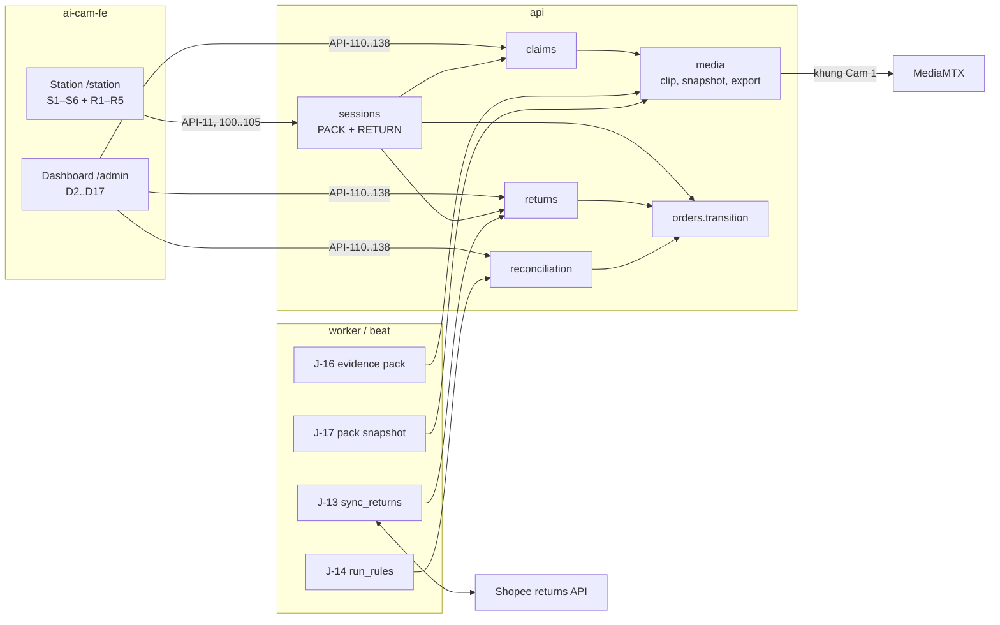
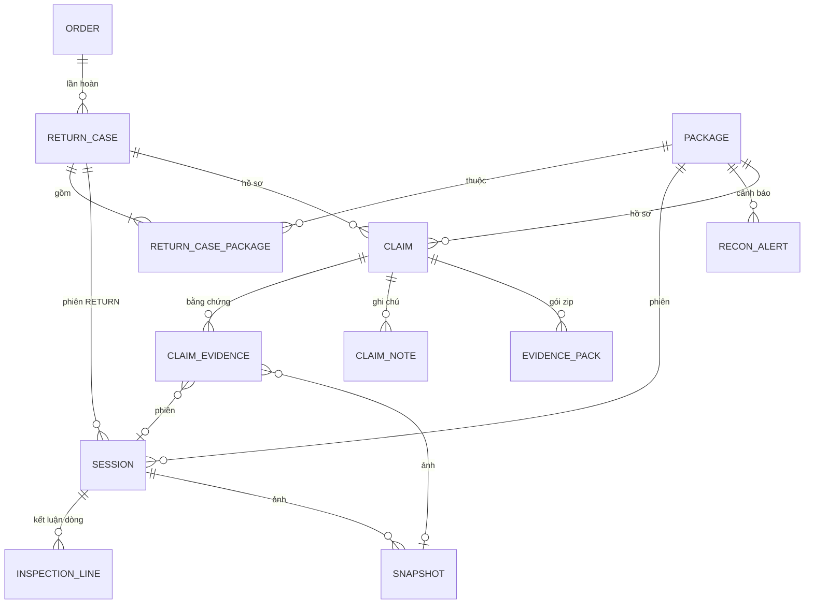

# Tech Spec (tổng quan & contract) — 02 Hàng hoàn và đối soát

| | |
|---|---|
| Tác giả (Architect) | khanhtt |
| Reviewer | BE lead · FE lead (khanhtt, solo — review subagent ở bước 5) |
| Trạng thái | In review · **v0.2** (sửa review G2 lượt 1: R-1..R-30 — DEC-244..262; chi tiết thay đổi contract ở §6.3) |
| SRS | [01-srs.md](01-srs.md) v0.2 · FR phủ: FR-01.01, 01.07, FR-02.06, 02.09–02.12, FR-03.13–03.15, FR-04.01–04.13, FR-05.05, 05.07, 05.11, 05.12, FR-06.01–06.03, 06.05, 06.06, FR-07.01, 07.02, FR-08.01–08.06, FR-09.01, FR-10.02, 10.03 |
| Spec con | BE: [02a-be-spec.md](02a-be-spec.md) · FE: [02b-fe-spec-station.md](02b-fe-spec-station.md), [02b-fe-spec-admin.md](02b-fe-spec-admin.md) |
| Nền | Contract Phase 1: [item 01 02 v0.7](../01-packing-mvp/02-tech-spec.md) (quy ước §6 giữ nguyên) · [architecture.md](../../system/architecture.md) · ADR-001..008, [ADR-009](../../system/decisions/ADR-009-claim-based-evidence-retention.md) (mới) |
| Last update | 2026-10-05 · Architect (v0.2) |

> **TL;DR** — Mở rộng hệ thống Phase 1, không dựng mới: 3 module BE mới (`returns`, `reconciliation`, `claims`), phiên `RETURN` trong `sessions`, ảnh chụp trong `media`; 2 migration (0003 schema, 0004 chuyển cờ giữ → hồ sơ).
> Quét ở bàn hoàn vẫn đi qua **API-11** (giữ DEC-7), station chọn hành vi theo `work_mode`. Thêm 25 API (API-82, API-100..106, 110..113, 120..123, 130..138) + mở rộng 18 API cũ, chỉ thêm trường / mã — client Phase 1 không vỡ, vẫn `/v1`.
> Bằng chứng được giữ theo **hồ sơ khiếu nại chưa đóng** và **hồ sơ hàng hoàn chưa kết thúc** (ADR-009) thay cờ giữ. Đối soát = job 30 phút ghi `recon_alert` không trùng, tự đóng.
> Rủi ro lớn nhất: API returns Shopee chưa thử (T-3) → adapter mock + lưu payload gốc; gói bằng chứng encode chậm trên server kho (RB-7).

---

## 1. Bối cảnh

Giải quyết P2, P3, P4, P6 + hardening L2–L9 của [01-srs](01-srs.md). Hiện trạng: Phase 1 chạy đủ M01/M02/M03/M05 (đơn + vận chuyển)/M07/M10 ([system-map](../../system/system-map.md)); trạng thái kho chỉ tới `DELIVERED` (`orders/service.py:15` `ALLOWED_TRANSITIONS`); phiên chỉ loại `PACK` (`sessions/models.py:11`); bảo vệ clip bằng `clip.held` (`media/service.py:641` `retention_clip_candidates`); `TO_RETURN` của Shopee đang ánh xạ thành `HANDED_OVER` (`platforms/shopee/mapping.py` `_ORDER_HINT`). [architecture.md §4.1, §7.2, §7.3](../../system/architecture.md) đã dự kiến module `reconciliation`, `claims`, phiên mở hoàn, job `sync_returns`.

## 2. Goals / Non-goals

| Goals | Non-goals |
|---|---|
| Contract đủ để BE, FE station, FE dashboard, QA làm song song | Gửi tranh chấp lên Shopee qua API (`returns.dispute`) |
| Quét ở bàn hoàn ≤ 1 giây p95 (NFR-01), ảnh ≤ 2 giây (NFR-32) | Thông báo Zalo / Telegram (FR-06.04) |
| Bàn hoàn chạy offline (NFR-09) — tra sàn chỉ 2 giây, mã lạ vẫn mở phiên | TikTok / Lazada adapter (chỉ interface) |
| Không mất bằng chứng: hồ sơ chưa đóng chặn retention; nâng cấp chuyển đủ clip đang giữ | Báo cáo FR-09.02..04, sao lưu cloud, link chia sẻ |
| Tương thích ngược `/v1`: chỉ thêm trường / mã / API; API-42 thu quyền về ADMIN (ghi rõ) | Đổi cách đăng nhập station (giữ DEC-1, DEC-204) |
| Migration có downgrade; station mặc định `PACK` → bật dần từng bàn | Đa shop / đa kho |

## 3. Hiện trạng & tác động (reuse-first)

| Thành phần | Component | Hiện có (file:line) | REUSE / EXTEND / NEW | Thay đổi |
|---|---|---|:---:|---|
| `orders.transition()` | be | `ai-cam-be/src/aicam/modules/orders/service.py:15,40` | EXTEND | Thêm 5 trạng thái `RETURN_*`, chuyển §5.3; bảng chuyển tay `MANUAL_TRANSITIONS` |
| `apply_platform_cancel` | be | `orders/service.py:106` | EXTEND | Kiện `PACKING` → cờ phiên `ORDER_CANCELLED` + WS (BR-21) |
| Cam 2 → phiên | be | `sessions/service.py:459` `apply_tray()`, `:486` `on_tray_changed()` | EXTEND | Bỏ qua phiên `RETURN` (chỉ ghi `cam2_code` + sự kiện) — DEC-246 |
| Mở phiên PACK | be | `sessions/service.py:274` `_open_session_unsafe()` | EXTEND | Kiện `RETURN_*` → ALERT `ALREADY_HANDED_OVER` (DEC-247) |
| Ánh xạ / áp trạng thái vận chuyển | be | `platforms/shopee/mapping.py:26` `_RANK`, `platforms/sync.py:337` `_apply_shipping`, `:342` | EXTEND | Hint `RETURN_EXPECTED` có rank, bước `PACKED → HANDED_OVER → RETURN_EXPECTED`, hủy khi `HANDED_OVER` / `LOGISTICS_COD_REJECTED` → giao thất bại (DEC-258, 259) |
| Phiên (`session`, API-10/11/12/15, J-07) | be | `sessions/models.py:11-40`, `sessions/service.py:393` `scan()` | EXTEND | `type = RETURN`, `return_case_id`, `operator_name`; nhánh quét theo `work_mode`; ngưỡng quá giờ riêng |
| Duyệt (API-13/20/21) | be | `approvals/service.py:124,318` | EXTEND | ASSIST cho phiên hoàn; action hợp lệ CONTINUE / CANCEL_SESSION |
| Station (`station`, API-60) | be | `stations/models.py:15` | EXTEND | `kind`, `work_mode`, `operator_name` |
| Ảnh camera | be | `stations/service.py:242` `snapshot()`, `stations/probe.py:33` `grab_frame()` | REUSE | Lấy khung Cam 1 cho ảnh phiên hoàn |
| Clip, retention, URL ký | be | `media/service.py:514` `set_hold`, `:641`, `:664` `enforce_retention`, `media/signing.py` | EXTEND | Bảo vệ theo hồ sơ (ADR-009); bảng `snapshot`; ký URL ảnh / zip |
| Bản xuất + `info.json` | be | `media/exports.py:284,405` | EXTEND | `info.json` thêm `session_status`, `flags`, `clock_offset_ms` (L5), `operator_name`; hàm render dùng lại cho gói bằng chứng |
| Adapter sàn | be | `platforms/base.py` `PlatformAdapter`, `shopee/adapter.py`, `mock/adapter.py` | EXTEND | `list_returns`, `get_return`, model `PlatformReturn`; `ShippingStatus.warehouse_hint` thêm `RETURN_EXPECTED` |
| Job đồng bộ | be | `platforms/sync.py:191,357`, `workers/celery_app.py:28` | EXTEND + NEW | J-06 bắt giao thất bại; J-13 `sync_returns` mới |
| Báo cáo ngày API-32 | be | `reports/service.py:76,154` | EXTEND | Số đếm + attention mới |
| Cài đặt API-80/81 | be | `settings/schemas.py:13`, `settings/service.py:43` | EXTEND | Ngưỡng mới, sàn retention, xác nhận hạ; API-82 mới |
| Tra cứu API-30/31 | be | `orders/packages.py:122,225` | EXTEND | Tìm mã chiều về, lọc mới, khối hàng hoàn / cảnh báo / hồ sơ |
| Hồ sơ hàng hoàn | be | — (chưa có; architecture §9.2 dự kiến `/returns/*`) | NEW | Module `returns` |
| Đối soát | be | — (architecture §4.1 `reconciliation/`) | NEW | Module `reconciliation`, bảng `recon_alert`, J-14 |
| Khiếu nại | be | — (architecture §4.1 `claims/`) | NEW | Module `claims`, gói bằng chứng J-16 |
| Station client S1–S6 | fe: station | `ai-cam-fe/src/features/station/*` (`StationPage.tsx`, `stationStore.ts`, `copy.ts`) | EXTEND | R1–R5 trong cùng `StationPage`; S1/S2/S3 đổi chữ + thông báo |
| Dashboard D2/D3/D4/D6/D8/D13 | fe: admin | `features/reports/DailyPage.tsx`, `features/orders/*`, `features/admin/StationEditPage.tsx`, `features/settings/StoragePage.tsx`, `features/approvals/*` | EXTEND | Theo 01 §10.5 |
| D14–D17 | fe: admin | — | NEW | `features/returns/`, `reconciliation/`, `claims/` (architecture §5.1 đã dự kiến) |
| `ClipPlayer`, `ScanBuffer`, UI kit, API client, WS client | fe | `src/shared/media/`, `src/shared/scan/`, `src/shared/ui/`, `src/lib/api/client.ts`, `src/lib/ws.ts` | REUSE | |

## 4. Kiến trúc

Không đổi [architecture.md §3](../../system/architecture.md). Phần mới:



| Thành phần | Trách nhiệm | Spec chi tiết |
|---|---|---|
| `sessions` | Quét theo `work_mode`; phiên `RETURN` (mở / kết luận / đóng / hủy / quá giờ); ASSIST | 02a |
| `returns` (mới) | Hồ sơ hàng hoàn: upsert từ sàn, tra mã (BR-23), tạo `UNANNOUNCED` / `UNIDENTIFIED`, gắn đơn, tổng hợp trạng thái (BR-24) | 02a |
| `reconciliation` (mới) | 7 quy tắc, `recon_alert` không trùng, tự đóng, xử lý, điều chỉnh trạng thái tay | 02a |
| `claims` (mới) | Hồ sơ khiếu nại, bằng chứng tự chọn, ghi chú, hạn, gói bằng chứng | 02a |
| `media` | Ảnh chụp (server lấy khung), ảnh lúc đóng gói (J-17), retention theo hồ sơ (ADR-009), `info.json` L5 | 02a |
| `platforms` | `list_returns` / `get_return`; giao thất bại trong J-06 | 02a |
| Station client | R1–R5, chỉnh S1/S2/S3 | 02b-station |
| Dashboard client | D14–D17, mở rộng D2/D3/D4/D6/D8/D13 | 02b-admin |

Phụ thuộc module (thêm vào architecture §4.2): `sessions → returns, claims`; `returns → orders`; `reconciliation → orders, returns, claims`; `claims → media, orders, returns`; `platforms → returns` (qua service). Module vẫn chỉ gọi nhau qua `service`.

## 5. Data model (chung)

Kiểu chi tiết, index, migration → 02a. Tên trường là tên dùng trong API.



### 5.1 Thực thể mới / đổi

| Thực thể | Field chính (tên API) | Ghi chú |
|---|---|---|
| STATION (đổi) | + `kind` (`PACK`/`RETURN`/`BOTH`, mặc định `PACK`), `work_mode` (`PACK`/`RETURN`), `operator_name` (null) | `work_mode` = `kind` khi `kind` ≠ `BOTH` |
| PACKAGE (đổi) | `warehouse_status` thêm 5 giá trị `RETURN_*` (§5.2) | |
| SESSION (đổi) | + `type` (`PACK`/`RETURN`), `return_case_id`, `operator_name`, `inspection` (chỉ RETURN), `snapshots[]` | `flags` thêm §5.2 |
| RETURN_CASE (mới) | `id`, `code` (`HH-000045`), `order` (brief, null khi `UNIDENTIFIED`), `kind`, `status`, `platform_return_sn` (null), `platform_status` (chữ sàn), `needs_parcel` (bool), `return_tracking_number` (null), `reason`, `reason_text`, `requested_items[]` `{order_item_id, product_name, variation, quantity}`, `seller_due_at`, `reported_at` (sàn báo), `expected_since`, `received_at`, `conclusion` (tổng), `package_ids[]`, `source` (`PLATFORM`/`WAREHOUSE`) | Lưu `raw_payload` của sàn (không trả API) |
| INSPECTION | `conclusion` (null khi chưa chọn), `note`, `lines[]`, `saved_at`, `corrected` `{by, at, reason}` \| null | Của phiên RETURN |
| INSPECTION_LINE | `order_item_id`, `product_name`, `variation`, `image_url`, `quantity_sent`, `quantity_requested`, `quantity_received`, `condition` (null khi chưa kiểm), `note` | |
| SNAPSHOT (mới) | `id`, `session_id`, `kind` (`MANUAL`/`PACK_CLOSE`), `camera_role` (`CAM1`), `taken_at`, `sha256`, `status` (`READY`/`DELETED`), `url` (ký, 10 phút), `protected_by_claim` | File `/data/video/snapshots/YYYY/MM/DD/{session_id}_{n}.jpg` (architecture §8.2) |
| RECON_ALERT (mới) | `id`, `package` (brief), `rule` (§5.2), `br` (`BR-12`), `severity` (`HIGH`/`MEDIUM`/`LOW`), `status` (`OPEN`/`RESOLVED`/`AUTO_RESOLVED`), `detected_at`, `closed_at`, `context` `{warehouse_status, platform_status, since, …}`, `resolution` `{action, note, by, at, to_status, claim_id}` \| null | Unique mở theo (package, rule) |
| CLAIM (mới) | `id`, `code` (`KN-000124`), `package` (brief), `order` (brief), `return_case_id`, `type`, `counterparty`, `status`, `source`, `owner` `{id, display_name}` \| null, `deadline_at`, `platform_claim_ref`, `recovered_amount` (VND, int ≥ 0), `close_reason`, `created_at`, `closed_at`, `version` (int, khóa lạc quan) | |
| CLAIM_EVIDENCE | `id`, `kind` (`SESSION`/`SNAPSHOT`), `session` (brief + clips) \| `snapshot`, `auto` (bool), `added_by`, `added_at` | |
| CLAIM_NOTE | `id`, `kind` (`NOTE`/`STATUS_CHANGE`/`SYSTEM`), `text`, `author` `{id, display_name}` \| null (hệ thống), `at` | Chỉ thêm, không sửa |
| EVIDENCE_PACK (mới) | `id`, `claim_id`, `status` (`QUEUED`/`RUNNING`/`READY`/`FAILED`), `progress`, `sha256`, `size_bytes`, `missing[]`, `created_by`, `expires_at`, `files.zip` (ký) | Giữ 24 giờ như EXPORT (DEC-58 item 01) |
| SETTING (đổi) | + `return_missing_days` (7), `handover_warn_hours` (24), `claim_deadline_days` (7), `claim_due_soon_hours` (48), `return_warn_minutes` (20), `return_abandon_minutes` (45); đọc thêm `retention_clip_min_days` (60, chỉ đọc, từ biến môi trường) | |

### 5.2 Enum mới (FE map nhãn tiếng Việt theo 01 §10)

| Enum | Giá trị → nhãn |
|---|---|
| `warehouse_status` (thêm) | `RETURN_EXPECTED` Hoàn đang về · `RETURN_INSPECTING` Đang kiểm hoàn · `RETURN_RECEIVED_OK` Đã nhận hoàn – nguyên vẹn · `RETURN_RECEIVED_ISSUE` Đã nhận hoàn – có vấn đề · `RETURN_MISSING` Hoàn quá hạn |
| `station.kind` / `work_mode` | `PACK` Đóng gói · `RETURN` Nhận hoàn · `BOTH` Cả hai (chỉ `kind`) |
| `station_state` (thêm) | `INSPECTING` (R2). `READY` + `work_mode = RETURN` → R1 |
| `session.type` | `PACK` Đóng gói · `RETURN` Mở hoàn |
| `session.flags` (thêm) | `AUTO_CLOSED` Tự đóng (v0.2) · `ORDER_CANCELLED` Đơn bị hủy khi đang đóng · `NO_PACK_CLIP` Không có clip đóng gói · `UNANNOUNCED` Về trước khi sàn báo · `UNIDENTIFIED` Chưa xác định đơn · `INSPECTION_CORRECTED` Đã sửa kết luận |
| `session.cancel_reason` (thêm, RETURN) | `WRONG_SCAN` Quét nhầm · `NOT_A_RETURN` Không phải hàng hoàn · `OTHER` Khác · `SUPERVISOR` Quản lý hủy |
| `inspection.conclusion` / `line.condition` | `OK` Nguyên vẹn · `DAMAGED` Hư hỏng · `MISSING_ITEM` Thiếu hàng · `WRONG_ITEM` Sai hàng / bị tráo · `EMPTY_BOX` Hộp rỗng · `OTHER` Khác |
| `return_case.kind` | `FAILED_DELIVERY` Giao thất bại · `BUYER_RETURN` Khách trả hàng · `REFUND_ONLY` Chỉ hoàn tiền · `UNANNOUNCED` Về trước khi sàn báo · `UNIDENTIFIED` Chưa xác định |
| `return_case.status` | `EXPECTED` Đang về · `INSPECTING` Đang kiểm · `PARTIALLY_RECEIVED` Đã nhận một phần · `RECEIVED_OK` Đã nhận – nguyên vẹn · `RECEIVED_ISSUE` Đã nhận – có vấn đề · `MISSING` Quá hạn chưa về · `CANCELLED` Đã hủy · `NO_PARCEL` Không có kiện về |
| `recon_alert.rule` | `SHIPPED_NOT_PACKED` (BR-10, HIGH) · `CANCELLED_AFTER_PACK` (BR-11, MEDIUM) · `RETURN_OVERDUE` (BR-12, HIGH) · `RETURN_UNANNOUNCED` (BR-13, LOW) · `PACKED_NOT_HANDED_OVER` (BR-14, MEDIUM) · `RETURN_DONE_NOT_RECEIVED` (BR-19, HIGH) · `UNVERIFIED_STALE` (BR-20, LOW) |
| `claim.type` | `DAMAGED`, `MISSING_ITEM`, `WRONG_ITEM`, `EMPTY_BOX`, `OTHER` (như kết luận) · `BUYER_CLAIM` Khách báo thiếu / sai (chiều đi) · `LOST_IN_TRANSIT` Thất lạc |
| `claim.counterparty` | `PLATFORM` Sàn · `CARRIER` Đơn vị vận chuyển |
| `claim.status` | `NEW` Mới · `SUBMITTED` Đã gửi · `WAITING` Đang chờ phản hồi · `WON` Thắng · `LOST` Thua · `CLOSED` Đóng |
| `claim.source` | `AUTO_RETURN` Tự động từ phiên hoàn · `MANUAL` Tạo tay · `RECON` Từ cảnh báo lệch · `LEGACY_HOLD` Chuyển từ cờ giữ |

### 5.3 Chuyển trạng thái kiện (bổ sung `ALLOWED_TRANSITIONS`)

| Từ → tới | Nguồn | Ai gây ra |
|---|---|---|
| `HANDED_OVER → RETURN_EXPECTED`, `DELIVERED → RETURN_EXPECTED`, `NEW → RETURN_EXPECTED` (đơn trước khi dùng hệ thống, DEC-254) | PLATFORM | J-04 / J-06 / J-13 qua `returns.attach_or_create` |
| `PACKED → HANDED_OVER → RETURN_EXPECTED` (2 bước trong một lần áp) | PLATFORM | J-06 (DEC-259) |
| `RETURN_EXPECTED → DELIVERED`, `RETURN_EXPECTED → HANDED_OVER` | PLATFORM | J-13 (hủy yêu cầu) / J-06 (giao lại) |
| `RETURN_EXPECTED → RETURN_MISSING` | WAREHOUSE (hệ thống) | J-14 BR-12 |
| `RETURN_EXPECTED`, `RETURN_MISSING`, `HANDED_OVER`, `DELIVERED`, `NEW` `→ RETURN_INSPECTING` | WAREHOUSE | API-11 / API-105 |
| `RETURN_INSPECTING → RETURN_RECEIVED_OK`, `→ RETURN_RECEIVED_ISSUE` | WAREHOUSE | API-11 đóng phiên, J-07 tự hoàn tất (DEC-253) |
| `RETURN_EXPECTED`, `RETURN_MISSING`, `HANDED_OVER`, `DELIVERED` `→ RETURN_RECEIVED_*` (kiện gốc **khác** của hồ sơ một-phiên — BUYER_RETURN / UNANNOUNCED) | WAREHOUSE | API-11 / J-07 đóng phiên (DEC-249) |
| `RETURN_INSPECTING → <package_status_before>` | WAREHOUSE | API-12 / API-21 / J-07 |
| `RETURN_RECEIVED_OK ⇄ RETURN_RECEIVED_ISSUE` | MANUAL | API-113 |
| `PACKING → CANCELLED_AFTER_PACK` | WAREHOUSE | API-11 đóng phiên khi cờ `ORDER_CANCELLED` (BR-21) |
| Điều chỉnh tay: `NEW → HANDED_OVER`, `PACKED → HANDED_OVER`, `CANCELLED_AFTER_PACK → HANDED_OVER` (DEC-258), `HANDED_OVER → DELIVERED`, `RETURN_MISSING → RETURN_EXPECTED`, `RETURN_EXPECTED → DELIVERED`, `RETURN_MISSING → DELIVERED` | MANUAL | API-122 |

## 6. API contract

**Quy ước chung:** Không đổi — [item 01 02 §6](../01-packing-mvp/02-tech-spec.md#6-api-contract) (base `/api/v1`, Bearer + refresh cookie, `snake_case`, giờ UTC `Z` ở mọi response / khung WS, UUID v7, phân trang `page`/`page_size` ≤ 100, khung lỗi `{error: {code, message, details}}`, lỗi chung 401/403/404/413/422/429/500, giới hạn body 1 MB). Thêm:

| Chủ đề | Quy ước |
|---|---|
| Tương thích | Chỉ thêm trường / giá trị enum / mã lỗi / API. Client bỏ qua trường lạ và hiện `message` server cho mã lạ (đã làm ở Phase 1). Ngoại lệ có chủ đích: API-42 chỉ còn ADMIN (DEC-209) |
| Khóa lạc quan | Tài nguyên sửa bởi nhiều người (CLAIM) có `version`; PATCH gửi `version`, lệch → `409 VERSION_CONFLICT` kèm bản mới trong `details.current` |
| URL media ký | Ảnh, zip theo cùng cơ chế API-40/44 (`uid`, `exp` 10 phút, `sig` = HMAC(`<loại>:{id}:{uid}:{exp}`)); trả sẵn trong response, hết hạn → gọi lại API nguồn |
| Mã hiển thị | `RETURN_CASE.code` `HH-` + 6 số, `CLAIM.code` `KN-` + 6 số, tăng dần, không tái sử dụng |
| Ngày lọc | `YYYY-MM-DD` giờ Việt Nam, khoảng ≤ 92 ngày (như API-30) |

### 6.1 Danh sách API

**Mới**

| ID | Method + path / event | Mục đích | Quyền | FR | Client |
|---|---|---|---|---|---|
| API-82 | `GET /settings/retention-impact` | Số clip / giờ video thô bị xóa ở lần dọn kế tiếp nếu đổi retention | ADMIN | FR-02.10 | admin |
| API-100 | `PUT /station/work-mode` | Đổi chế độ bàn (station `BOTH`) | STATION | FR-01.07 | station |
| API-101 | `PUT /station/operator` | Đặt / đổi tên người kiểm | STATION | FR-04.10 | station |
| API-102 | `PUT /station/sessions/{id}/inspection` | Lưu kết luận + dòng + ghi chú (lưu nháp, ghi đè) | STATION (phiên của mình, `OPEN`) | FR-04.03, 04.09 | station |
| API-103 | `POST /station/sessions/{id}/snapshots` | Chụp ảnh Cam 1 (server lấy khung) | STATION (phiên RETURN của mình, `OPEN`) | FR-04.04 | station |
| API-104 | `GET /station/return-lookup?q=` | Tìm thủ công kiện hoàn | STATION (`work_mode = RETURN`) | FR-04.07 | station |
| API-105 | `POST /station/return-sessions` | Mở phiên hoàn từ kết quả tìm / mở phiên chưa xác định | STATION (`work_mode = RETURN`) | FR-04.07, 04.13 | station |
| API-106 | `GET /media/snapshots/{id}?uid=&exp=&sig=` | Tải ảnh JPEG | chữ ký | FR-04.04, 02.11 | `` |
| API-110 | `GET /returns` | Danh sách hồ sơ hàng hoàn (D14) | ADMIN, SUPERVISOR, CSKH | FR-05.05, 05.11, 05.12 | admin |
| API-111 | `GET /returns/{id}` | Chi tiết hồ sơ hàng hoàn | ADMIN, SUPERVISOR, CSKH | FR-07.02 | admin |
| API-112 | `POST /returns/{id}/link-order` | Gắn đơn cho hồ sơ `UNIDENTIFIED` | ADMIN, SUPERVISOR | FR-04.13 | admin |
| API-113 | `PUT /sessions/{id}/inspection` | Sửa kết luận phiên hoàn đã đóng (≤ 7 ngày) | ADMIN, SUPERVISOR | FR-04.11 | admin |
| API-120 | `GET /recon-alerts` | Danh sách cảnh báo lệch + tổng theo mức | ADMIN, SUPERVISOR, CSKH | FR-06.03 | admin |
| API-121 | `POST /recon-alerts/{id}/resolve` | Đánh dấu đã xử lý | ADMIN, SUPERVISOR | FR-06.03 | admin |
| API-122 | `POST /packages/{id}/warehouse-status` | Điều chỉnh trạng thái kho thủ công | ADMIN, SUPERVISOR | FR-06.05 | admin |
| API-123 | `POST /recon/run` | Chạy đối soát ngay | ADMIN, SUPERVISOR | FR-06.02 | admin |
| API-130 | `GET /claims` | Danh sách hồ sơ khiếu nại | ADMIN, SUPERVISOR, CSKH | FR-08.03, 08.04 | admin |
| API-131 | `POST /claims` | Tạo hồ sơ thủ công | ADMIN, SUPERVISOR, CSKH | FR-08.01 | admin |
| API-132 | `GET /claims/{id}` | Chi tiết hồ sơ | ADMIN, SUPERVISOR, CSKH | FR-08.02, 08.06 | admin |
| API-133 | `PATCH /claims/{id}` | Đổi trạng thái / phụ trách / mã sàn / kết quả / hạn | ADMIN, SUPERVISOR, CSKH | FR-08.02, 08.03 | admin |
| API-134 | `PUT /claims/{id}/evidence` | Đặt danh sách bằng chứng | ADMIN, SUPERVISOR, CSKH | FR-08.06 | admin |
| API-135 | `POST /claims/{id}/notes` | Thêm ghi chú | ADMIN, SUPERVISOR, CSKH | FR-08.02 | admin |
| API-136 | `POST /claims/{id}/evidence-packs` | Tạo gói bằng chứng (nền) | ADMIN, SUPERVISOR, CSKH | FR-08.05 | admin |
| API-137 | `GET /evidence-packs/{id}` | Trạng thái gói + link tải | người tạo, ADMIN | FR-08.05 | admin |
| API-138 | `GET /media/evidence-packs/{id}/pack.zip?uid=&exp=&sig=` | Tải zip | chữ ký | FR-08.05 | trình duyệt |

**Mở rộng (chỉ thêm, trừ API-42)**

| ID | Thay đổi | FR |
|---|---|---|
| API-04 `/me` | `permissions` thêm `returns.read`, `returns.link`, `inspection.correct`, `recon.read`, `recon.resolve`, `warehouse_status.adjust`, `claims.manage`; `station` thêm `kind`, `work_mode` | FR-10.02 |
| API-10 / WS `station.state` | `station.kind`, `station.work_mode`, `station.operator_name`; `state` thêm `INSPECTING`; `session.type`, `session.return_case`, `session.inspection`, `session.snapshots`, `session.pack_reference`; `today_return_count`, `today_return_issue_count` | FR-04.02, 01.07, 04.10 |
| API-11 | Nhánh `work_mode = RETURN`; `alert.code` mới; `closed_session` trong response | FR-04.01, 04.05, 04.06, FR-03.14, 03.15 |
| API-12 | Phiên RETURN: lý do `WRONG_SCAN`/`NOT_A_RETURN`/`OTHER`; kiện về trạng thái trước | FR-04.* |
| API-13 / API-21 / API-20 / WS `approval.*` | ASSIST cho phiên RETURN `OPEN`; item thêm `session_type`; action hợp lệ cho RETURN: `CONTINUE`, `CANCEL_SESSION` | FR-03.12 |
| API-15 | Item thêm `type`, `conclusion`, `claim_code` | FR-04.* |
| API-30 | `q` khớp thêm `return_tracking_number`, mã hồ sơ `HH-`; lọc `session_type`, `warehouse_status` nhận giá trị mới, `session_flag` nhận cờ mới; item thêm `return_case` brief | FR-07.01, FR-03.14 |
| API-31 | Thêm `return_cases[]`, `recon_alerts[]`, `claims[]` (brief); `sessions[]` thêm `type`, `operator_name`, `inspection`, `snapshots[]`, `pack_snapshot`, `protected_by_claims[]`; `clips[].protected_by_claim` | FR-07.02, FR-02.09, 02.11 |
| API-32 | `counts` + `attention` mới | FR-09.01, FR-03.14, FR-08.04 |
| API-40 | STATION được xem clip phiên PACK của kiện đang có phiên RETURN **hoạt động** (`OPEN` / `WAITING_APPROVAL`) ở station mình | 01 §5.10 |
| API-42 | **Chỉ ADMIN** (trước: ADMIN, SUPERVISOR, CSKH) — deprecated, gỡ ở Phase 3 | FR-02.09 |
| API-45 `info.json` | Thêm `session_type`, `session_status`, `flags`, `operator_name`, `cameras[] {camera_role, clock_offset_ms, clock_checked_at}` | FR-02.12 |
| API-60 | `kind` trong GET / POST / PATCH; `409 STATION_BUSY` | FR-01.01 |
| API-80 | 6 trường ngưỡng mới (tùy chọn khi PUT), `retention_clip_min_days` (chỉ đọc), `confirm_reduction`; mã `RETENTION_BELOW_MINIMUM`, `RETENTION_REDUCTION_UNCONFIRMED` | FR-02.10 |
| API-81 | `sync[]` thêm `last_returns_success_at` (tùy chọn) | NFR-29 |
| API-92 | `action` mới (§6.2 API-92) | FR-10.03 |
| WS-01 | `alert.code` thêm `ORDER_CANCELLED_DURING_SESSION` | FR-03.15 |
| WS-02 | Sự kiện mới `return.updated`, `recon.updated`, `claim.updated`, `evidence_pack.updated` | FR-06.03, 08.* |

### 6.2 Chi tiết API

<details><summary><b>API-10 mở rộng</b> — station state (cũng là WS <code>station.state</code>)</summary>

```json
{
  "station": { "id": "0192…", "name": "Station 03", "kind": "BOTH", "work_mode": "RETURN", "operator_name": "Lan" },
  "state": "INSPECTING",                     // READY | PACKING | MISMATCH | WAITING_APPROVAL | INSPECTING
  "cameras": [ { "role": "CAM1", "status": "ONLINE" }, { "role": "CAM2", "status": "ONLINE" } ],
  "tray": { "codes": ["SPXRT0099887766"], "match": "NOT_SEEN", "updated_at": "…Z" },  // phiên RETURN: chỉ thông tin, FE không dùng
  "session": {
    "id": "0192…", "type": "RETURN", "status": "OPEN", "started_at": "2026-10-05T02:12:40Z",
    "flags": [], "operator_name": "Lan",
    "warn_at": "2026-10-05T02:32:40Z", "abandon_at": "2026-10-05T02:57:40Z",
    "package": { "id": "…", "tracking_number": "SPXVN0123456789",
                 "order": { "platform": "SHOPEE", "platform_order_sn": "2410ABCDEF", "buyer_note": null },
                 "items": [ { "order_item_id": "…", "product_name": "Áo thun basic", "variation": "Đen / L", "quantity": 2, "image_url": "…" } ] },
    "return_case": { "id": "…", "code": "HH-000045", "kind": "BUYER_RETURN", "status": "INSPECTING",
                     "platform_return_sn": "2410RT123", "return_tracking_number": "SPXRT0099887766",
                     "reason": "DEFECTIVE", "reason_text": "Áo bị rách ở tay", "reason_label": "Sản phẩm bị lỗi",
                     "package_count": 1, "received_count": 0 },
    "inspection": {
      "conclusion": null, "note": "", "saved_at": null,
      "lines_mode": "FULL",              // FULL: dòng kiểm theo BR-22 · REFERENCE: chỉ tham khảo, chỉ kết luận chung (giao thất bại đơn > 1 kiện — DEC-249)
      "lines": [ { "order_item_id": "…", "product_name": "Áo thun basic", "variation": "Đen / L", "image_url": "…",
                   "quantity_sent": 2, "quantity_requested": 2, "quantity_received": 2, "condition": "OK", "note": null } ] },
    "snapshots": [ { "id": "…", "kind": "MANUAL", "taken_at": "…Z", "url": "/api/v1/media/snapshots/…?uid=…&exp=…&sig=…" } ],
    "pack_reference": { "session_id": "…", "ended_at": "2026-10-02T07:27:15Z", "station_name": "Station 01",
                        "clips": [ { "id": "…", "camera_role": "CAM1", "status": "READY" } ],
                        "snapshot": { "id": "…", "url": "…" } },          // null nếu không có phiên PACK hiệu lực (cờ NO_PACK_CLIP)
    "mismatch": null
  },
  "approval_request": null,
  "today_count": 0, "today_return_count": 12, "today_return_issue_count": 2,
  "server_time": "…Z"
}
```

- `inspection.lines` khởi tạo khi mở phiên: `quantity_requested` = số yêu cầu trả của dòng (0 nếu không trả); giao thất bại / `UNANNOUNCED` / không có yêu cầu dòng → = `quantity_sent`; `quantity_received` = `quantity_requested`; `condition = "OK"`. Không có đơn (`UNIDENTIFIED`) → `lines = []`.
- Phiên `PACK`: `type = "PACK"`, `return_case`, `inspection`, `snapshots`, `pack_reference` = null. Cờ `ORDER_CANCELLED` có trong `flags` khi đơn bị hủy lúc đang đóng (FR-03.15).
- `state = READY` + `work_mode = RETURN` → R1; `state = INSPECTING` → R2; `WAITING_APPROVAL` → S5 (cả hai loại).
- `operator_name = null` + `work_mode = RETURN` → FE mở R5 (BR-28).
</details>

<details><summary><b>API-11 mở rộng</b> — POST /station/scan</summary>

Request không đổi `{code, client_scan_id}`. Luôn 200 cho kết quả nghiệp vụ (DEC-7).

**`work_mode = PACK`:** không đổi, trừ:
- Response thêm `closed_session` khi `outcome = SESSION_COMPLETED`:
  `{ "id", "type": "PACK", "tracking_number", "flags": ["LABEL_ON_TRAY"], "conclusion": null, "claim_code": null, "package_status": "PACKED" }` — FE hiện thông báo FR-03.14 khi `flags` có `LABEL_ON_TRAY` / `CAM2_UNVERIFIED`.
- Phiên có cờ `ORDER_CANCELLED` đóng hợp lệ → kiện `CANCELLED_AFTER_PACK`, `closed_session.package_status = "CANCELLED_AFTER_PACK"` (BR-21).

**`work_mode = RETURN`:**

| `outcome` | Khi nào | Station |
|---|---|---|
| `SESSION_OPENED` | READY + có người kiểm + mã tìm được (§7 thứ tự tra) + kiện ở trạng thái mở được (§5.3) | R2, bíp |
| `SESSION_COMPLETED` | INSPECTING + mã thuộc cùng hồ sơ (BR-23) + `inspection.conclusion` ≠ null | R1 + thông báo `closed_session`, bíp |
| `ALERT` | Xem `alert.code` | R4 (overlay) hoặc chữ tại chỗ R2 (`INSPECTION_REQUIRED`, `RETURN_CODE_DIFFERENT`) |
| `IGNORED` | `WAITING_APPROVAL` | giữ S5 |

`MISMATCH` không bao giờ trả ở chế độ RETURN.

| `alert.code` (mới) | Khi nào | `alert.data` |
|---|---|---|
| `OPERATOR_REQUIRED` | Chưa có `operator_name` (BR-28) | `{}` |
| `RETURN_NOT_FOUND` | Không tìm thấy mã, tra sàn ≤ 2 giây thất bại / hết giờ | `{ "code", "can_open_unidentified": true }` |
| `RETURN_ALREADY_RECEIVED` | Kiện `RETURN_RECEIVED_*` | `{ "received_at", "station_name", "conclusion" }` |
| `RETURN_MULTIPLE_PACKAGES` | Quét mã đơn sàn, đơn có > 1 kiện đủ điều kiện và chưa có hồ sơ hàng hoàn chỉ ra kiện nào | `{ "platform_order_sn" }` → FE mở R3 với `q` = mã đơn |
| `NOT_SHIPPED` | Kiện `PACKING`, `PACKED`, `CANCELLED`, `CANCELLED_AFTER_PACK`, hoặc `NEW` mà đơn chưa giao (EX-R6) | `{ "warehouse_status" }` |
| `RETURN_IN_PROGRESS_ELSEWHERE` | Kiện đang có phiên mở ở station khác | `{ "station_name" }` |
| `INSPECTION_REQUIRED` | Quét đóng khi `conclusion = null` (BR-07) | `{}` |
| `RETURN_CODE_DIFFERENT` | Đang kiểm, mã không thuộc hồ sơ (BR-23) | `{ "code", "expected_codes": ["SPXRT…", "SPX…789", "2410ABCDEF"] }` |
| `INVALID_CODE` | Như Phase 1 — mã sai định dạng; mã đơn sàn chấp nhận thêm `^[A-Z0-9]{10,20}$` | |

`closed_session` cho phiên RETURN: `{ "id", "type": "RETURN", "tracking_number", "flags", "conclusion": "EMPTY_BOX", "claim_code": "KN-000124", "package_status": "RETURN_RECEIVED_ISSUE", "return_case_status": "RECEIVED_ISSUE" }`.

Lỗi HTTP: như Phase 1 (403, 409 `STATION_INACTIVE`, 422).

**PACK gặp kiện hoàn (v0.2, DEC-247):** kiện `RETURN_*` → `ALERT` `ALREADY_HANDED_OVER`, `alert.data.is_return = true`, `message` "SPX…789 là kiện hàng hoàn — nhận ở bàn nhận hoàn." `work_mode` đọc lại dưới advisory lock (đổi chế độ giữa lúc quét → xử lý theo chế độ mới).
</details>

<details><summary><b>API-100 / API-101</b> — chế độ bàn, người kiểm</summary>

```json
// API-100 PUT /station/work-mode
{ "work_mode": "RETURN" }                 // PACK | RETURN
// 200
{ "state": { /* API-10 */ } }
// API-101 PUT /station/operator
{ "name": "Lan" }                          // strip, 2–40 ký tự; null không được
// 200
{ "state": { /* API-10 */ } }
```

| HTTP | Mã lỗi | Khi nào | FE xử lý |
|---|---|---|---|
| 409 | MODE_NOT_ALLOWED | API-100 khi `station.kind` ≠ `BOTH` | ẩn nút; nếu gặp → tải lại API-10 |
| 409 | SESSION_ACTIVE | Station có phiên đang hoạt động / yêu cầu duyệt chờ | "Đóng phiên trước khi đổi." |
| 422 | VALIDATION_ERROR | Tên rỗng / > 40 | lỗi dưới ô |

Audit: `STATION_WORK_MODE`, `STATION_OPERATOR` (data: cũ → mới).
</details>

<details><summary><b>API-102</b> — PUT /station/sessions/{id}/inspection</summary>

```json
// request — ghi đè toàn bộ; FE gửi sau 1 giây không thao tác và ngay trước khi người dùng quét đóng
{ "conclusion": "EMPTY_BOX",                // null = chưa chọn
  "note": "Hộp còn nguyên băng keo, bên trong trống",   // ≤ 500
  "lines": [ { "order_item_id": "…", "quantity_received": 0, "condition": "MISSING_ITEM", "note": null } ] }
// 200
{ "inspection": { "conclusion": "EMPTY_BOX", "note": "…", "saved_at": "…Z", "lines": [ /* đủ trường như API-10 */ ] } }
```

| HTTP | Mã lỗi | Khi nào | FE xử lý |
|---|---|---|---|
| 409 | SESSION_NOT_OPEN | Phiên không còn `OPEN` của station | tải lại API-10 |
| 409 | NOT_RETURN_SESSION | Phiên loại PACK | log, tải lại |
| 422 | VALIDATION_ERROR | `order_item_id` không thuộc đơn; `quantity_received` < 0 hoặc > 999; thiếu dòng; `OTHER` thiếu `note` (`details.fields`) | lỗi tại dòng / ô |
| 422 | CONCLUSION_INCONSISTENT | `conclusion = OK` khi có dòng `condition` ≠ OK hoặc `quantity_received` ≠ `quantity_requested` (BR-22) | khóa nút Nguyên vẹn (FE đã chặn trước) |
</details>

<details><summary><b>API-103 / API-106</b> — ảnh chụp</summary>

```json
// API-103 POST /station/sessions/{id}/snapshots   (body rỗng)
// 201
{ "snapshot": { "id": "…", "kind": "MANUAL", "camera_role": "CAM1", "taken_at": "…Z", "sha256": "ab12…",
                "url": "/api/v1/media/snapshots/…?uid=…&exp=…&sig=…" } }
// API-106 → image/jpeg; sig = HMAC("snapshot:{id}:{uid}:{exp}"); audit VIEW_SNAPSHOT khi uid không phải STATION
```

| HTTP | Mã lỗi | Khi nào | FE xử lý |
|---|---|---|---|
| 409 | SESSION_NOT_OPEN | Phiên đã đóng | tải lại |
| 409 | SNAPSHOT_LIMIT | Đã 20 ảnh (`details.max = 20`) | khóa nút "Đã đủ 20 ảnh" |
| 422 | CAMERA_UNREACHABLE | Không lấy được khung Cam 1 trong 3 giây | toast "Không chụp được ảnh từ Cam 1. Thử lại." |
| 403 | SIGNATURE_INVALID | API-106 sai / hết hạn | lấy lại state / chi tiết một lần |
| 410 | SNAPSHOT_DELETED | Ảnh đã bị retention xóa | ô ảnh "Ảnh đã bị xóa" |
</details>

<details><summary><b>API-104 / API-105</b> — tìm thủ công, mở phiên từ kết quả</summary>

```json
// API-104 GET /station/return-lookup?q=2410ABC        (q: strip+upper, 4–40 ký tự; khớp chính xác hoặc tiền tố ≥ 6 ký tự)
{ "items": [ { "package_id": "…", "tracking_number": "SPX…789", "platform_order_sn": "2410ABCDEF",
               "warehouse_status": "RETURN_EXPECTED",
               "return_case": { "id": "…", "code": "HH-000045", "kind": "BUYER_RETURN", "status": "EXPECTED", "return_tracking_number": "SPXRT…766" },
               "can_open": true, "blocked_reason": null } ],      // blocked_reason = mã alert khi can_open=false (NOT_SHIPPED, RETURN_ALREADY_RECEIVED, …)
  "platform_checked": false }                                     // true khi không có kết quả nội bộ và đã tra sàn (≤ 2 giây)
// tối đa 10 kết quả, mới nhất trước

// API-105 POST /station/return-sessions
{ "package_id": "…", "client_scan_id": "…" }                       // mở từ kết quả tìm
{ "unidentified_code": "SPXVN0000000000", "client_scan_id": "…" }  // EX-R12, cần mã hợp lệ định dạng
// 200 — cùng dạng API-11: { "outcome", "alert", "state" }
```

| HTTP | Mã lỗi | Khi nào | FE xử lý |
|---|---|---|---|
| 409 | WRONG_WORK_MODE | Station không ở chế độ RETURN | tải lại API-10 |
| 422 | VALIDATION_ERROR | `q` < 4 ký tự; thiếu cả `package_id` và `unidentified_code` | "Nhập ít nhất 4 ký tự." |
| 404 | NOT_FOUND | `package_id` không tồn tại | đóng R3, toast |
</details>

<details><summary><b>API-12 / API-13 / API-21 mở rộng cho phiên RETURN</b></summary>

- API-12: `reason` ∈ `WRONG_SCAN` | `NOT_A_RETURN` | `OTHER` (note bắt buộc). Kiện về `package_status_before`; hồ sơ hàng hoàn về trạng thái tính lại (BR-24); hồ sơ `UNIDENTIFIED` / `UNANNOUNCED` vừa tạo bởi phiên này và chưa có phiên nào khác → `CANCELLED`. Clip vẫn cắt.
- API-13 `{ "type": "ASSIST", "session_id" }` cho phiên RETURN `OPEN`. `MISMATCH`, `REPACK` với phiên RETURN → `409 NOT_ELIGIBLE`.
- API-20 item thêm `"session_type": "RETURN"`, `"operator_name": "Lan"`.
- API-21 với yêu cầu từ phiên RETURN: `CONTINUE` | `CANCEL_SESSION`; `CLOSE_WITH_NOTE` → `422 INVALID_ACTION` (phiên hoàn đóng bằng quét + kết luận).
</details>

<details><summary><b>API-110 / API-111 / API-112</b> — hồ sơ hàng hoàn</summary>

```json
// API-110 GET /returns?tab=EXPECTED&kind=&q=&date_from=&date_to=&page=1&page_size=20
// tab: EXPECTED (EXPECTED + PARTIALLY_RECEIVED + INSPECTING) | MISSING | RECEIVED (RECEIVED_OK + RECEIVED_ISSUE) | NO_PARCEL | UNIDENTIFIED | ALL
// q: khớp chính xác mã đơn, mã vận đơn gốc, mã chiều về, mã yêu cầu sàn, mã HH-
// ngày lọc theo reported_at (UNANNOUNCED/UNIDENTIFIED: lúc tạo)
{ "items": [ { "id": "…", "code": "HH-000045", "kind": "BUYER_RETURN", "status": "EXPECTED",
               "order": { "id": "…", "platform_order_sn": "2410ABCDEF" },
               "packages": [ { "id": "…", "tracking_number": "SPX…789", "warehouse_status": "RETURN_EXPECTED" } ],
               "return_tracking_number": "SPXRT…766", "reason_label": "Sản phẩm bị lỗi",
               "reported_at": "…Z", "expected_since": "…Z", "waiting_days": 2, "received_at": null,
               "conclusion": null, "claims": [ { "id": "…", "code": "KN-000124", "status": "NEW" } ] } ],
  "page": 1, "page_size": 20, "total": 41,
  "tab_counts": { "EXPECTED": 41, "MISSING": 2, "RECEIVED": 120, "NO_PARCEL": 3, "UNIDENTIFIED": 1 } }

// API-111 GET /returns/{id}
{ /* như item API-110 */
  "platform_return_sn": "2410RT123", "platform_status": "ACCEPTED", "needs_parcel": true,
  "reason": "DEFECTIVE", "reason_text": "Áo bị rách ở tay", "seller_due_at": "2026-10-08T10:00:00Z", "source": "PLATFORM",
  "requested_items": [ { "order_item_id": "…", "product_name": "Áo thun basic", "variation": "Đen / L", "quantity": 2 } ],
  "sessions": [ { "id": "…", "package_id": "…", "status": "COMPLETED", "station_name": "Station 03", "operator_name": "Lan",
                  "started_at": "…Z", "ended_at": "…Z", "conclusion": "EMPTY_BOX" } ] }

// API-112 POST /returns/{id}/link-order
{ "package_id": "…" }        // kiện gốc tìm bằng API-30 (FE xem trước; đơn nhiều kiện → người dùng chọn kiện)
// 200 → như API-111 của hồ sơ đích + "merged_into": { "id", "code" } | null, "merged_claims": [ { "from", "into" } ]
```
`reason_label`: BE map mã lý do sàn → chữ tiếng Việt (bảng trong adapter; mã lạ → chữ gốc của sàn).

| HTTP | Mã lỗi | Khi nào | FE xử lý |
|---|---|---|---|
| 409 | NOT_UNIDENTIFIED | API-112 khi hồ sơ không phải `UNIDENTIFIED` | tải lại |
| 409 | PACKAGE_ALREADY_RETURNED | Kiện đích đã có phiên hoàn `COMPLETED` khác | "Đơn này đã có kiện hoàn được nhận." |
| 409 | NOT_ELIGIBLE | Kiện đích chưa rời kho (EX-R6) | message server |

API-112 trong một transaction (v0.2, DEC-248, 260): phiên chuyển từ kiện tạm (`is_placeholder = true`) sang kiện đích, kiện tạm xóa nếu không còn phiên. **Đơn đã có hồ sơ hàng hoàn mở** → hồ sơ chưa xác định gộp vào hồ sơ đó (hồ sơ cũ `CANCELLED`, `merged_into_id`), kiện đích + hồ sơ đích tính lại theo BR-24; **không có** → hồ sơ gắn `order`, `kind = UNANNOUNCED`. Hồ sơ khiếu nại của phiên chuyển `package_id` sang kiện đích; trùng BR-27 với hồ sơ đang mở của kiện đích → bằng chứng + ghi chú gộp vào hồ sơ đó, hồ sơ chuyển sang `CLOSED` lý do "Gộp vào KN-…" (`merged_claims`); thêm phiên PACK hiệu lực (auto). Audit `RETURN_LINK_ORDER`.
</details>

<details><summary><b>API-113</b> — PUT /sessions/{id}/inspection (sửa kết luận)</summary>

```json
{ "conclusion": "OK", "note": "…", "lines": [ … ], "reason": "Người kiểm chọn nhầm" }   // reason 5–500
// 200 → session như API-31 sessions[]
```
Kiện `RETURN_RECEIVED_OK ⇄ _ISSUE` (nguồn MANUAL); hồ sơ hàng hoàn tính lại (BR-24); OK → ISSUE: tạo hồ sơ khiếu nại tự động (BR-08) nếu chưa có cùng loại; ISSUE → OK: hồ sơ `AUTO_RETURN` đang `NEW` → `CLOSED` lý do "Kết luận đã sửa thành Nguyên vẹn" (hồ sơ đã gửi giữ nguyên, ghi chú hệ thống). Cờ `INSPECTION_CORRECTED`. `inspection.corrections[]` lưu lịch sử mọi lần sửa `{at, by, reason, before: {conclusion, note, lines}}` (v0.2, DEC-261; thay `corrected`). Audit `INSPECTION_CORRECT` (data: trước / sau).

| HTTP | Mã lỗi | Khi nào | FE xử lý |
|---|---|---|---|
| 409 | CORRECTION_WINDOW_EXPIRED | `ended_at` quá 7 ngày | ẩn nút; message |
| 409 | NOT_RETURN_SESSION | Phiên không phải RETURN `COMPLETED` | — |
| 422 | VALIDATION_ERROR / CONCLUSION_INCONSISTENT | như API-102; thiếu `reason` | lỗi theo field |
</details>

<details><summary><b>API-120 / API-121 / API-122 / API-123</b> — đối soát</summary>

```json
// API-120 GET /recon-alerts?status=OPEN&severity=HIGH&rule=&package_id=&date_from=&date_to=&page=
{ "items": [ { "id": "…", "rule": "RETURN_OVERDUE", "br": "BR-12", "severity": "HIGH", "status": "OPEN",
               "package": { "id": "…", "tracking_number": "SPX…455", "warehouse_status": "RETURN_MISSING", "platform_status": "TO_RETURN" },
               "context": { "since": "2026-09-27T03:00:00Z", "days": 8 },
               "detected_at": "…Z", "closed_at": null, "resolution": null,
               "allowed_status_targets": ["RETURN_EXPECTED", "DELIVERED"] } ],     // cho Dialog "Điều chỉnh trạng thái kho"
  "page": 1, "page_size": 20, "total": 7,
  "summary": { "open": { "HIGH": 1, "MEDIUM": 4, "LOW": 2 } } }
// sắp xếp: mức (HIGH trước) rồi detected_at cũ trước

// API-121 POST /recon-alerts/{id}/resolve
{ "note": "Đã tháo kiện, hàng về kệ" }       // 1–500
// 200 → item; resolution = { "action": "RESOLVE", "note", "by": {id, display_name}, "at" }

// API-122 POST /packages/{id}/warehouse-status
{ "to_status": "HANDED_OVER", "reason": "Kiện đã giao ĐVVC 04/10, phiên bỏ dở", "recon_alert_id": "…" }  // alert tùy chọn
// 200 → { "package": { "id", "tracking_number", "warehouse_status" }, "recon_alert": { … } | null }
// recon_alert_id có → cảnh báo RESOLVED action ADJUST_STATUS; không có → cảnh báo tự đóng ở lần chạy kế nếu hết điều kiện

// API-123 POST /recon/run → 202 { "queued": true }   (chỉ enqueue; khóa `recon:run` do J-14 giữ khi chạy — đang giữ → 409 RECON_IN_PROGRESS, DEC-262)
```

| HTTP | Mã lỗi | Khi nào | FE xử lý |
|---|---|---|---|
| 409 | ALREADY_RESOLVED | Cảnh báo không còn `OPEN`; `details`: `status`, `closed_at`, `resolved_by` (null khi AUTO_RESOLVED) | "Cảnh báo này đã được {người} xử lý lúc {giờ}." / "…đã tự hết lúc {giờ}." |
| 409 | TRANSITION_NOT_ALLOWED | `to_status` không thuộc tập chuyển tay (§5.3) từ trạng thái hiện tại; `details.allowed` | tải lại, hiện danh sách mới |
| 409 | SESSION_ACTIVE | Kiện đang có phiên mở | "Kiện đang có phiên mở ở station." |
| 409 | RECON_IN_PROGRESS | API-123 khi job đang chạy | "Đối soát đang chạy." |
| 422 | VALIDATION_ERROR | thiếu `note` / `reason` (5–500) | lỗi dưới ô |
</details>

<details><summary><b>API-130..135</b> — hồ sơ khiếu nại</summary>

```json
// API-130 GET /claims?status=NEW&type=&counterparty=&owner=me|<uuid>&due=soon|overdue&q=&page=
{ "items": [ { "id": "…", "code": "KN-000124", "type": "EMPTY_BOX", "counterparty": "PLATFORM", "status": "NEW",
               "source": "AUTO_RETURN", "package": { "id": "…", "tracking_number": "SPX…789" },
               "order": { "platform_order_sn": "2410ABCDEF" }, "owner": null,
               "deadline_at": "2026-10-08T10:00:00Z", "due_soon": true, "overdue": false, "created_at": "…Z" } ],
  "page": 1, "page_size": 20, "total": 9,
  "status_counts": { "NEW": 4, "SUBMITTED": 2, "WAITING": 3, "WON": 10, "LOST": 2, "CLOSED": 30 } }

// API-131 POST /claims
{ "package_id": "…", "type": "BUYER_CLAIM", "counterparty": "PLATFORM", "note": "Khách báo thiếu 1 tất",
  "return_case_id": null, "recon_alert_id": null }
// 201 → như API-132. Bằng chứng tự chọn (FR-08.06). recon_alert_id → cảnh báo RESOLVED action OPEN_CLAIM

// API-132 GET /claims/{id}
{ "id": "…", "code": "KN-000124", "type": "EMPTY_BOX", "counterparty": "PLATFORM", "status": "NEW", "source": "AUTO_RETURN",
  "version": 3,
  "package": { "id": "…", "tracking_number": "SPX…789", "warehouse_status": "RETURN_RECEIVED_ISSUE" },
  "order": { "id": "…", "platform_order_sn": "2410ABCDEF" },
  "return_case": { "id": "…", "code": "HH-000045", "kind": "BUYER_RETURN", "return_tracking_number": "SPXRT…766" },
  "owner": null, "deadline_at": "…Z", "deadline_source": "PLATFORM",         // PLATFORM (seller_due_at) | DEFAULT (claim_deadline_days) | MANUAL
  "platform_claim_ref": null, "recovered_amount": null, "close_reason": null,
  "created_at": "…Z", "closed_at": null,
  "evidence": [
    { "id": "…", "kind": "SESSION", "auto": true,
      "session": { "id": "…", "type": "PACK", "status": "COMPLETED", "station_name": "Station 01", "operator_name": null,
                   "started_at": "…Z", "ended_at": "…Z", "flags": [],
                   "clips": [ { "id": "…", "camera_role": "CAM1", "status": "READY", "sha256": "…", "deleted_at": null } ] } },
    { "id": "…", "kind": "SNAPSHOT", "auto": true, "snapshot": { "id": "…", "kind": "MANUAL", "taken_at": "…Z", "url": "…" } } ],
  "other_sessions": [ { "id": "…", "type": "PACK", "status": "SUPERSEDED", "started_at": "…Z" } ],   // phiên của kiện chưa gắn
  "missing": ["NO_PACK_CLIP"],                                                                       // NO_PACK_CLIP | PACK_CLIP_DELETED | RETURN_CLIP_PENDING
  "notes": [ { "id": "…", "kind": "SYSTEM", "text": "Tạo tự động từ phiên mở hoàn (Hộp rỗng)", "author": null, "at": "…Z" } ],
  "allowed_transitions": ["SUBMITTED", "CLOSED"] }

// API-133 PATCH /claims/{id}
{ "version": 3, "status": "SUBMITTED", "platform_claim_ref": "SPE-998877", "owner_user_id": "…",
  "deadline_at": null, "recovered_amount": null, "reason": null }
// status=WON → recovered_amount (≥ 0) bắt buộc; status=CLOSED từ NEW/SUBMITTED/WAITING → reason bắt buộc (5–500)
// status=SUBMITTED → platform_claim_ref (1–64) hoặc reason bắt buộc
// mọi đổi trạng thái / phụ trách / hạn tự ghi CLAIM_NOTE kind STATUS_CHANGE; audit CLAIM_UPDATE
// 200 → như API-132 (version + 1)

// API-134 PUT /claims/{id}/evidence
{ "version": 4, "session_ids": ["…", "…"], "snapshot_ids": ["…"] }      // phiên / ảnh phải thuộc kiện hoặc hồ sơ hàng hoàn của hồ sơ
// 200 → như API-132

// API-135 POST /claims/{id}/notes
{ "text": "Đã chat với Shopee, chờ 3 ngày" }   // 1–1000
// 201 → note
```

| HTTP | Mã lỗi | Khi nào | FE xử lý |
|---|---|---|---|
| 409 | CLAIM_EXISTS | API-131: kiện đã có hồ sơ cùng `type` chưa `CLOSED` (BR-27); `details`: `claim_id`, `code` | "Kiện này đã có hồ sơ … đang mở: KN-…" + "Mở hồ sơ" |
| 409 | VERSION_CONFLICT | `version` cũ; `details.current` = bản mới | tải lại, toast "Hồ sơ vừa được … cập nhật." |
| 409 | INVALID_TRANSITION | Trạng thái đích không thuộc `allowed_transitions`; `details.allowed` | tải lại |
| 409 | CLAIM_CLOSED | Sửa / thêm bằng chứng hồ sơ đã `CLOSED` (ghi chú vẫn thêm được) | khóa form |
| 422 | VALIDATION_ERROR | thiếu `recovered_amount` / `reason` / `platform_claim_ref`; phiên / ảnh không thuộc kiện; `owner_user_id` không phải ADMIN/SUPERVISOR/CSKH đang hoạt động | lỗi theo field |
| 404 | NOT_FOUND | Kiện / hồ sơ không có | EmptyState |
</details>

<details><summary><b>API-136 / API-137 / API-138</b> — gói bằng chứng</summary>

```json
// API-136 POST /claims/{id}/evidence-packs   (body rỗng)
// 202
{ "id": "…", "status": "QUEUED", "progress": 0 }
// API-137 GET /evidence-packs/{id}   (FE poll 2 giây hoặc WS evidence_pack.updated); người tạo + ADMIN, khác → 404
{ "id": "…", "claim_id": "…", "status": "READY", "progress": 100, "sha256": "…", "size_bytes": 58200000,
  "missing": [ { "session_id": "…", "camera_role": "CAM2", "reason": "CLIP_DELETED" } ],
  "files": { "zip": "/api/v1/media/evidence-packs/…/pack.zip?uid=…&exp=…&sig=…" }, "expires_at": "…Z" }
// API-138 → application/zip, Content-Disposition: attachment; filename="KN-000124.zip"; audit DOWNLOAD_CLAIM_PACK
```

Nội dung zip:

```
KN-000124/
├── ho-so.json                       # mã hồ sơ, loại, bên nhận, trạng thái, đơn, kiện, hồ sơ hàng hoàn, danh sách tệp + SHA-256, missing, người xuất, giờ xuất (UTC Z)
├── README.txt                       # tiếng Việt: cách kiểm SHA-256, ý nghĩa thư mục
├── 01-dong-goi-<yyyymmdd-hhmm>/     # phiên PACK chính
│   ├── video-ghep-co-chu.mp4        # SIDE_BY_SIDE có overlay (cùng pipeline J-03)
│   ├── goc-CAM1.mp4, goc-CAM2.mp4   # clip gốc, SHA-256 = DB
│   ├── anh-luc-dong-goi.jpg
│   └── info.json                    # như API-45 (L5)
├── 02-mo-hoan-<yyyymmdd-hhmm>/      # phiên RETURN: như trên + anh-01.jpg … + ket-luan.json (kết luận, dòng, người kiểm)
└── 03-phien-khac-…/                 # phiên thêm tay: chỉ clip gốc + info.json (không encode)
```

| HTTP / trạng thái | Mã | Khi nào | FE xử lý |
|---|---|---|---|
| 409 | PACK_IN_PROGRESS | Hồ sơ đang có gói `QUEUED`/`RUNNING`; `details.pack_id` | theo dõi gói đó |
| 409 | NO_EVIDENCE | Hồ sơ không có phiên / ảnh nào | "Hồ sơ chưa có bằng chứng." |
| 404 | NOT_FOUND | API-137 không phải người tạo / ADMIN, hoặc quá 24 giờ | cho tạo lại |
| — | `status = FAILED` | Encode / ghi zip lỗi | "Không tạo được gói bằng chứng…" + Thử lại |

Clip đã xóa / chưa cắt → zip vẫn tạo, ghi vào `missing` (không lỗi).
</details>

<details><summary><b>API-30 / API-31 / API-32 mở rộng</b></summary>

```json
// API-30 thêm query: session_type=PACK|RETURN; warehouse_status nhận RETURN_*; session_flag nhận cờ mới
// item thêm:
"return_case": { "id": "…", "code": "HH-000045", "kind": "BUYER_RETURN", "status": "RECEIVED_ISSUE" }   // null nếu không có

// API-31 thêm:
"return_cases": [ { /* như item API-110 */ } ],
"recon_alerts": [ { "id": "…", "rule": "RETURN_DONE_NOT_RECEIVED", "br": "BR-19", "severity": "HIGH", "status": "AUTO_RESOLVED", "detected_at": "…Z", "closed_at": "…Z" } ],
"claims": [ { "id": "…", "code": "KN-000124", "type": "EMPTY_BOX", "status": "NEW" } ],
"allowed_status_targets": ["RETURN_EXPECTED"],                       // cho menu Điều chỉnh trạng thái (rỗng → ẩn)
"sessions": [ { /* Phase 1 */ "type": "RETURN", "operator_name": "Lan", "return_case_id": "…",
                "inspection": { /* như API-10 */ , "corrected": null }, "can_correct": true,
                "snapshots": [ { "id", "kind", "taken_at", "url", "status" } ],
                "pack_snapshot": null,                                // phiên PACK: { id, url, status }
                "protected_by_claims": [ { "id": "…", "code": "KN-000124" } ],
                "clips": [ { /* Phase 1 */ "protected_by_claim": true,
                               "protection": { "reasons": ["CLAIM", "RETURN_CASE"], "claims": ["KN-000124"], "return_cases": ["HH-000045"], "until": null } } ] } ]
// v0.2 (DEC-245): protection.reasons ⊂ { CLAIM, RETURN_CASE, HELD }; until = hạn giữ khi lý do có hạn (NO_PARCEL 30 ngày), null khi vô hạn
// clips[].held vẫn trả (tương thích); retention_until = null khi đang được giữ; clip của hồ sơ khiếu nại đã đóng: max(end_at, closed_at) + retention_clip_days
// snapshots[] có cùng "protection"; ảnh PACK_CLOSE theo phiên PACK
// item API-30 thêm "is_placeholder": bool (kiện tạm của hàng hoàn chưa xác định — FE hiện chip)

// API-32 counts thêm (theo ngày giờ VN trừ khi ghi "hiện tại"):
"returns_received": 14, "returns_received_issue": 3,
"returns_expected": 41,                 // hiện tại: hồ sơ EXPECTED + PARTIALLY_RECEIVED
"returns_missing": 2,                   // hiện tại
"recon_open": { "HIGH": 1, "MEDIUM": 4, "LOW": 2 },   // hiện tại
"claims_open": 9, "claims_due_soon": 2, // hiện tại (chưa CLOSED; due_soon: NEW/SUBMITTED/WAITING, deadline ≤ claim_due_soon_hours)
"label_on_tray": 2, "cam2_unverified": 5   // phiên PACK COMPLETED kết thúc trong ngày có cờ
// stations[] thêm: "work_mode", "operator_name"; state có thể INSPECTING
// attention thêm kind: RETURN_MISSING {count} · RECON_HIGH {count} · CLAIM_DUE_SOON {count} · RETURN_UNIDENTIFIED {count}
```
</details>

<details><summary><b>API-80 / API-82</b> — cài đặt, retention</summary>

```json
// API-80 GET thêm
{ "retention_raw_days": 30, "retention_clip_days": 90, "session_warn_minutes": 15, "session_abandon_minutes": 30,
  "return_warn_minutes": 20, "return_abandon_minutes": 45,
  "return_missing_days": 7, "handover_warn_hours": 24, "claim_deadline_days": 7, "claim_due_soon_hours": 48,
  "retention_clip_min_days": 60, "updated_at": "…Z" }
// API-80 PUT: 4 trường Phase 1 bắt buộc như cũ; 6 trường mới tùy chọn (thiếu = giữ giá trị cũ); "confirm_reduction": bool (mặc định false)
// ràng buộc: return_abandon_minutes > return_warn_minutes (1–1440); return_missing_days 1–60; handover_warn_hours 1–168;
//            claim_deadline_days 1–90; claim_due_soon_hours 1–168; retention_clip_days ≥ retention_clip_min_days
// giảm retention_clip_days hoặc retention_raw_days mà confirm_reduction=false → 409

// API-82 GET /settings/retention-impact?retention_raw_days=20&retention_clip_days=70
{ "clips": 312, "clip_bytes": 51539607552, "raw_hours": 1240, "raw_bytes": 1116691496960,
  "protected_clips": 18, "next_run_at": "2026-10-05T19:00:00Z" }
```

| HTTP | Mã lỗi | Khi nào | FE xử lý |
|---|---|---|---|
| 422 | RETENTION_BELOW_MINIMUM | `retention_clip_days` < `retention_clip_min_days`; `details.min` | "Số ngày giữ clip không được thấp hơn {min}." |
| 409 | RETENTION_REDUCTION_UNCONFIRMED | Giảm mà chưa `confirm_reduction`; `details.impact` = như API-82 | mở Dialog xác nhận với số liệu |
| 422 | VALIDATION_ERROR | ràng buộc khác | lỗi theo field |

Audit: `SETTINGS_UPDATE` như cũ + `RETENTION_REDUCED` (data: cũ, mới, impact) khi giảm.
</details>

<details><summary><b>API-60, API-42, API-45, API-92 mở rộng</b></summary>

```json
// API-60 POST/PATCH /stations: "kind": "PACK" | "RETURN" | "BOTH"   (POST mặc định PACK)
// GET item thêm "kind", "work_mode", "operator_name"
// đổi kind khi station có phiên / yêu cầu chờ → 409 STATION_BUSY; đổi sang PACK/RETURN → work_mode = kind; sang BOTH giữ work_mode

// API-42 PUT /clips/{id}/hold: chỉ ADMIN (SUPERVISOR, CSKH → 403). Deprecated, gỡ ở Phase 3 (DEC-209)

// API-45 info.json thêm
"session_type": "PACK", "session_status": "COMPLETED", "flags": ["CAM2_UNVERIFIED"], "operator_name": null,
// cameras[].clock_offset_ms: giá trị chụp vào phiên lúc đóng (session.camera_clock), không đọc lúc xuất (v0.2, DEC-261); phiên trước nâng cấp → null
"cameras": [ { "camera_role": "CAM1", "clock_offset_ms": 120, "clock_checked_at": "…Z" },
             { "camera_role": "CAM2", "clock_offset_ms": null, "clock_checked_at": null } ]   // null: camera không hỗ trợ ONVIF
// overlay bản xuất phiên RETURN thêm dòng "Người kiểm: Lan"
```

API-92 `action` thêm: `STATION_WORK_MODE`, `STATION_OPERATOR`, `INSPECTION_CORRECT`, `RETURN_LINK_ORDER`, `RECON_RESOLVE`, `WAREHOUSE_STATUS_ADJUST`, `CLAIM_CREATE`, `CLAIM_UPDATE`, `CLAIM_EVIDENCE_UPDATE`, `EXPORT_CLAIM_PACK`, `DOWNLOAD_CLAIM_PACK`, `VIEW_SNAPSHOT`, `RETENTION_REDUCED`, `CLIP_PROTECTION_MIGRATED`.
</details>

<details><summary><b>WS-01 / WS-02 mở rộng</b></summary>

| Kênh | `type` | `data` | Khi nào |
|---|---|---|---|
| WS-01 | `station.state` | như API-10 mở rộng | Thêm các lúc: đổi chế độ / người kiểm (API-100/101), lưu kết luận (API-102), chụp ảnh (API-103), cờ `ORDER_CANCELLED` được gắn |
| WS-01 | `alert` | `{ "code": "ORDER_CANCELLED_DURING_SESSION", "session_id", "tracking_number" }` | J-04 / J-06 thấy đơn hủy khi kiện `PACKING` (BR-21) — FE phát âm lỗi 1 lần, S2 banner theo `flags` |
| WS-01 | `alert` | `SESSION_ABANDONED` (đã có) cho cả phiên RETURN | J-07 |
| WS-02 | `return.updated` | `{ "return_case_id", "status" }` | Hồ sơ hàng hoàn tạo / đổi trạng thái → D14, D4, D2 |
| WS-02 | `recon.updated` | `{ "summary": { "open": { "HIGH", "MEDIUM", "LOW" } } }` | Sau mỗi lần J-14 có thay đổi, sau API-121 / 122 → D15, badge, D2 |
| WS-02 | `claim.updated` | `{ "claim_id", "status", "version" }` | Tạo / đổi hồ sơ → D16, D17 (tải lại khi `version` khác), D2 |
| WS-02 | `evidence_pack.updated` | như API-137 (chỉ người tạo, `ws:user:{id}`) | Tiến độ +5 %, READY, FAILED |
| WS-02 | `report.updated` | như cũ | Thêm khi đóng phiên RETURN, hồ sơ / cảnh báo đổi |
</details>

### 6.3 Thay đổi contract v0.2 (review G2 lượt 1 — DEC-244..262)

Mọi điểm dưới đây ghi đè chỗ khác trong §5–§6 nếu lệch.

| # | Chỗ | Thay đổi | Finding |
|---|---|---|---|
| 1 | §5.1 SESSION | + `camera_clock[] {camera_role, clock_offset_ms, checked_at}` chụp lúc đóng phiên (PACK và RETURN), dùng cho `info.json`; + cờ `AUTO_CLOSED` (Tự đóng — J-07 hoàn tất phiên RETURN đã có kết luận) | R-17, R-9 |
| 2 | §5.1 PACKAGE | + `is_placeholder` (bool): kiện tạm tạo bởi "phiên chưa xác định"; không vào BR-20, D3 hiện chip "Kiện tạm"; xóa khi gắn đơn | R-16 a |
| 3 | §5.1 RETURN_CASE | + `merged_into` `{id, code}` \| null; mỗi đơn tối đa một hồ sơ ở `EXPECTED`/`INSPECTING`/`PARTIALLY_RECEIVED`/`MISSING` (partial unique); `NO_PARCEL` không tính. Hồ sơ nhiều kiện có kiện đã nhận + kiện quá hạn → giữ `PARTIALLY_RECEIVED` (J-14 chỉ đổi trạng thái **kiện**, không đè hồ sơ `PARTIALLY_RECEIVED`) | R-4, R-18 |
| 4 | §5.1 INSPECTION | `corrected` → `corrections[]` (lịch sử); + `lines_mode` `FULL` \| `REFERENCE` | R-17, R-5 |
| 5 | §5.2 `claim.source` LEGACY_HOLD | `deadline_at` = lúc nâng cấp + 30 ngày (`DEFAULT`), không tính vào unique BR-27 | R-25 |
| 6 | Gắn tín hiệu hoàn | Một hàm `returns.attach_or_create(order, signal)` cho J-04, J-06, J-13, API-11, API-105, API-112: hồ sơ mở của đơn (kể cả `UNANNOUNCED`) → gắn; `UNIDENTIFIED` có `open_code` = mã chiều về của yêu cầu mới → gộp. Ưu tiên `kind`: BUYER_RETURN > FAILED_DELIVERY > UNANNOUNCED. `TO_RETURN` / giao thất bại / boom COD / hủy khi `HANDED_OVER` chỉ tạo FAILED_DELIVERY khi đơn không có yêu cầu trả mở (xác minh T-3) | R-4, R-14 |
| 7 | API-11 RETURN — hồ sơ một phiên | `BUYER_RETURN` / `UNANNOUNCED` / `UNIDENTIFIED`: phiên mở trên kiện quét được, dòng = toàn bộ `requested_items` (hoặc mọi dòng đơn); đóng phiên → **mọi** kiện của hồ sơ `RETURN_RECEIVED_*`, hồ sơ `RECEIVED_*`. `FAILED_DELIVERY` của đơn > 1 kiện: mỗi kiện một phiên, `lines_mode = REFERENCE` (`quantity_requested` = phần chưa nhận của hồ sơ, chỉ tham khảo) | R-5 |
| 8 | API-102 / API-113 | `lines_mode = REFERENCE` → không kiểm số lượng / BR-22, chỉ kiểm `conclusion` (+ note khi OTHER); `CONCLUSION_INCONSISTENT` chỉ ở `FULL` | R-5 |
| 9 | API-105 | Station có phiên hoạt động → `409 SESSION_ACTIVE`. `unidentified_code` khớp kiện / hồ sơ đã có → xử lý như quét mã đó (không tạo kiện tạm). Kiện bị chặn → `200` `outcome = ALERT` với mã như API-11 | R-27 |
| 10 | API-134 | Bỏ bằng chứng `auto = true` → bắt buộc `note` (5–500), ghi vào CLAIM_NOTE; thiếu → `422 VALIDATION_ERROR` `fields.note` | R-19 |
| 11 | API-138 zip | `ket-luan.json` = kết luận hiện tại + `corrections[]` (bản gốc, người sửa, lý do, giờ) | R-17 |
| 12 | API-110 | Tab `EXPECTED` = `EXPECTED` + `INSPECTING` + `PARTIALLY_RECEIVED` (khớp 01 D14) | R-30 |
| 13 | API-32 attention | + `RETURN_SESSION_ABANDONED {count}` (phiên hoàn bỏ dở trong 7 ngày, chưa có phiên hoàn tất sau đó) | R-9 |
| 14 | API-80 | Migration 0003 nâng `retention_clip_days` lên `RETENTION_CLIP_MIN_DAYS` nếu thấp hơn (audit `RETENTION_RAISED_TO_MINIMUM`); J-02 luôn dùng max(setting, sàn) | R-13 |
| 15 | BR-08 bên nhận | Hồ sơ tự tạo từ hồ sơ hàng hoàn `FAILED_DELIVERY` → `counterparty = CARRIER`; còn lại `PLATFORM` | R-30 |
| 16 | BR-19 / mapping | Nhóm sàn `DONE` chỉ `REFUND_PAID`; `CLOSED` → nhóm `CLOSED` (không cảnh báo, hồ sơ vẫn chờ kiện tới N ngày) | R-22 |
| 17 | BR-28 | API-03 (station) và API-91 xóa `station.operator_name` | R-24 |
| 18 | Quá giờ phiên RETURN | J-07 dùng `timer_base` (DEC-60) — thời gian chờ duyệt không tính; 45 phút: có kết luận → `COMPLETED` + `AUTO_CLOSED` + mọi bước đóng (hồ sơ khiếu nại, BR-24); không có → `ABANDONED` | R-9, R-24 |
| 19 | API-92 action | + `RETENTION_RAISED_TO_MINIMUM`, `RETURN_CASE_MERGED` | R-13, R-4 |

## 7. Luồng chính (end-to-end)

**UC-02: nhận kiện hoàn khách trả, có vấn đề**

```mermaid
sequenceDiagram
    actor U as Người kiểm (Lan)
    participant ST as Station (R1/R2)
    participant API as api
    participant DB as PostgreSQL
    participant MTX as MediaMTX
    participant W as worker
    participant AD as Dashboard
    U->>ST: Quét SPXRT…766
    ST->>API: API-11 {code, client_scan_id}
    API->>DB: returns.resolve_code → hồ sơ HH-45 (BUYER_RETURN), kiện SPX…789
    API->>DB: session RETURN OPEN, inspection lines, kiện RETURN_EXPECTED→RETURN_INSPECTING, hồ sơ INSPECTING
    API-->>ST: 200 SESSION_OPENED + state (pack_reference, ảnh lúc đóng gói)
    U->>ST: Số nhận 0, Thiếu; kết luận Hộp rỗng
    ST->>API: API-102 (debounce 1 giây)
    U->>ST: F2 chụp ảnh
    ST->>API: API-103
    API->>MTX: lấy 1 khung Cam 1
    API-->>ST: 201 snapshot (url ký)
    U->>ST: Quét lại SPX…789 (mã gốc)
    ST->>API: API-102 (flush) rồi API-11
    API->>DB: BR-23 cùng hồ sơ, BR-07 có kết luận → COMPLETED, kiện RETURN_RECEIVED_ISSUE, hồ sơ RECEIVED_ISSUE
    API->>DB: claims.create_from_return → KN-124 (phiên PACK hiệu lực + phiên RETURN + ảnh)
    API->>W: J-01 cắt clip phiên RETURN
    API-->>ST: 200 SESSION_COMPLETED + closed_session {claim_code KN-000124}
    API-->>AD: WS return.updated, claim.updated, report.updated
```

**UC-05 / UC-11: yêu cầu trả từ sàn → quá hạn → cảnh báo**

```mermaid
sequenceDiagram
    participant B as beat
    participant W as worker
    participant SP as Shopee (adapter)
    participant DB as PostgreSQL
    participant AD as Dashboard
    B->>W: J-13 sync_returns (15 phút)
    W->>SP: list_returns(since = cursor − 10 phút)
    SP-->>W: PlatformReturn[] (return_sn, order_sn, status, needs_parcel, tracking chiều về, items, due)
    W->>DB: upsert return_case; needs_parcel → kiện DELIVERED→RETURN_EXPECTED; không → NO_PARCEL
    W-->>AD: WS return.updated
    Note over B,W: 7 ngày sau, kiện chưa về
    B->>W: J-14 run_rules (30 phút)
    W->>DB: BR-12: RETURN_EXPECTED→RETURN_MISSING, hồ sơ MISSING, recon_alert RETURN_OVERDUE (unique mở)
    W-->>AD: WS recon.updated, return.updated, report.updated
```

**UC-04 / UC-12:** D17 → API-133 (nhận phụ trách) → API-136 (202) → J-16 dựng zip (render SIDE_BY_SIDE 2 phiên chính bằng hàm J-03, chép clip gốc, ảnh, `info.json`, `ho-so.json`) → WS `evidence_pack.updated` / poll API-137 → API-138 tải → audit.

**Nâng cấp (migration 0004):** mọi clip `held = true` → nhóm theo kiện → 1 CLAIM `source = LEGACY_HOLD`, `type = OTHER`, `status = NEW`, `deadline_at` = lúc nâng cấp + 30 ngày (nhắc xem lại, `deadline_source = DEFAULT`; không tính BR-27), ghi chú hệ thống "Chuyển từ cờ giữ của {người} lúc {giờ}"; CLAIM_EVIDENCE cho phiên của clip; `clip.held = false`; audit `CLIP_PROTECTION_MIGRATED` mỗi hồ sơ.

## 8. Quyết định xuyên suốt

| Chủ đề | Quyết định |
|---|---|
| AuthN | Không đổi (DEC-1, DEC-9 item 01). Bàn hoàn dùng tài khoản station + `operator_name` (DEC-204) — **không** phải định danh xác thực, chỉ ghi nhận |
| AuthZ | RBAC theo 01 §5.10; kiểm ở server mọi API. STATION: chỉ dữ liệu station mình; API-100..105 kiểm thêm `work_mode`; API-40 cho STATION xem clip PACK chỉ khi kiện đang có phiên RETURN `OPEN` ở station đó |
| Bằng chứng | ADR-009 (v0.2): J-02 không xóa clip / ảnh của (a) phiên gắn CLAIM chưa `CLOSED`, (b) phiên PACK hiệu lực + phiên RETURN của kiện thuộc RETURN_CASE `EXPECTED`/`INSPECTING`/`PARTIALLY_RECEIVED`/`MISSING`, (c) như (b) cho `NO_PARCEL` trong 30 ngày từ `reported_at`, (d) clip `held`; kiểm lại dưới khóa dòng clip (DEC-251); `CLOSED` → hạn = max(`end_at`, `closed_at`) + `retention_clip_days`. Ảnh do server lấy từ MediaMTX (không nhận upload — DEC-220), SHA-256, file 0444. Gói zip giữ 24 giờ |
| Sàn retention | `RETENTION_CLIP_MIN_DAYS` (env, mặc định 60) — không đổi qua API (DEC-210) |
| Dữ liệu nhạy cảm | Lý do trả của khách lưu nguyên văn (có thể chứa thông tin cá nhân) — chỉ hiện cho vai được xem đơn + station đang kiểm; không lưu SĐT / địa chỉ (NFR-20). `raw_payload` không trả API |
| Idempotency | API-11, API-105 dùng `client_scan_id` (như cũ). API-102 ghi đè (idempotent). J-13 upsert theo `platform_return_sn`; J-14 unique mở (package, rule); J-16 một gói chạy / hồ sơ |
| Đồng thời | Thứ tự khóa (v0.2, DEC-256): advisory lock station → `return_case` (`FOR UPDATE`) → `package` theo id tăng dần (`FOR UPDATE`, kiểm lại trạng thái) → `clip`. Mọi đường đổi trạng thái kiện (API-11, 12, 105, 112, 113, 122, J-04, 06, 07, 13, 14) khóa kiện; J-14 dùng `SKIP LOCKED`. Một hồ sơ hàng hoàn mở / đơn: partial unique `return_case(order_id)`. Phiên RETURN dùng cùng advisory lock station + partial unique `session(package_id)` đang hoạt động (BR-02 mở rộng). CLAIM khóa lạc quan `version`. Hồ sơ hàng hoàn: khóa dòng khi tính lại trạng thái (BR-24). Cảnh báo: `SELECT … FOR UPDATE` khi resolve |
| NFR | NFR-01: tra mã ở bàn hoàn ≤ 5 query có index (mã chiều về, mã gốc, mã đơn); tra sàn ngoài lock như Phase 1. NFR-32: lấy khung từ relay MediaMTX (đã mở) timeout 3 giây. NFR-33: J-14 truy vấn theo tập (set-based) mỗi quy tắc. NFR-09: mọi thứ trong LAN |
| Observability | Log thêm `return_case_id`, `claim_id`; metric `aicam_return_scan_duration_seconds`, `aicam_snapshot_seconds`, `aicam_recon_alerts_open{severity}`, `aicam_recon_run_seconds`, `aicam_evidence_pack_seconds`, `aicam_returns_sync_errors_total` (02a §10) |
| Feature flag | Không cần flag toàn cục: station mặc định `PACK` → hành vi Phase 1 giữ nguyên tới khi Admin đặt loại. `RECON_ENABLED` (mặc định `true`) để tắt J-14 khi sự cố. J-13 theo `SHOPEE_ENABLED` như J-04 |
| Adapter sàn | `PlatformAdapter` thêm `list_returns(creds, since) -> AsyncIterator[PlatformReturn]`, `get_return(creds, return_sn) -> PlatformReturn \| None`; `ShippingStatus.warehouse_hint` thêm `RETURN_EXPECTED`. Mapping trạng thái Shopee returns + lý do trong adapter (02a §7) — **chưa test với Shopee thật (T-3)** |
| Thời gian | Không đổi — giờ `Z`; ngày theo giờ Việt Nam (`TZ_DISPLAY`) |

## 9. Phương án đã cân nhắc

| Phương án | Ưu | Nhược | Chọn |
|---|---|---|:---:|
| **Quét bàn hoàn qua API-11 theo `work_mode`** | Một đường quét, giữ `client_scan_id`, ScanBuffer, retry, âm thanh Phase 1 | `scan()` phải tách nhánh | ✔ (DEC-219) |
| Endpoint quét riêng `/station/return-scan` | Tách code sạch | FE hai đường quét, dễ lệch khi đổi chế độ | |
| **Hồ sơ hàng hoàn mức đơn + trạng thái kho mức kiện** | Giữ SRS §7.1; phủ nhiều kiện, trả một phần | Thêm bảng nối | ✔ (DEC-206) |
| Tạo `package` mới cho mã chiều về | Quét mã chiều về tìm như mã thường | Sinh kiện ảo trong D3 / báo cáo, lệch SRS | |
| **Bảo vệ clip theo hồ sơ khiếu nại (ADR-009)** | Một nguồn sự thật, có chủ, có hạn | Migration dữ liệu | ✔ |
| Giữ `clip.held` song song | Không migration | Hai cơ chế, CSKH vẫn bỏ giữ được (L7) | |
| **Đối soát job 30 phút, bảng `recon_alert` unique mở** | Đơn giản, chạy offline, không trùng | Trễ tới 30 phút (đủ cho N ngày / X giờ) | ✔ (DEC-207) |
| Đối soát theo sự kiện (mỗi lần đổi trạng thái) | Tức thì | Quy tắc theo thời gian (BR-12, 14) vẫn cần job; hai đường | |
| **Ảnh do server lấy khung từ MediaMTX** | Không giả mạo được từ máy trạm, có hash | Phụ thuộc relay | ✔ (DEC-220) |
| Máy trạm chụp `<video>` rồi tải lên | Không tải server | Ảnh có thể bị sửa, máy trạm không có stream Cam 1 | |
| **Gói bằng chứng: job queue `export`, zip giữ 24 giờ** | Dùng lại J-03, không giữ request | Thêm trạng thái | ✔ (DEC-221) |
| Zip đồng bộ trong request | Đơn giản | Encode 2 phiên > 30 giây → timeout | |

## 10. Rollout & rollback

1. **Migration 0003** (schema, chỉ thêm: bảng mới, cột nullable / có default, mở rộng CHECK) — chạy được khi code Phase 1 còn chạy.
2. **Migration 0004** (dữ liệu: clip đang giữ → hồ sơ `LEGACY_HOLD`) — chạy cùng release BE mới (code cũ vẫn đọc được, chỉ thấy `held = false`).
3. BE: api, worker, beat (J-13, J-14, J-15 vào lịch; J-16, J-17 chạy theo sự kiện), vision không đổi.
4. FE: build mới (station + dashboard cùng app).
5. Admin đặt 1 station `RETURN` (hoặc `BOTH`), chạy thử 1 ngày; xem D15 vài chu kỳ trước khi dùng số đếm.
6. Shopee returns bật cùng `SHOPEE_ENABLED` khi có partner (T-3); trước đó D14 chỉ có hồ sơ `UNANNOUNCED` / `UNIDENTIFIED` và đối soát phần kiện đi.

**Rollback (v0.2, DEC-252):** (a) Lỗi FE → về image FE trước (BE tương thích). (b) Lỗi BE → **ưu tiên sửa tiến (forward-fix)**. Phải lùi: dừng `api`, `worker`, `beat` → chạy `alembic downgrade 0002` **bằng image mới** → mới đổi sang image cũ. Image cũ không tự chạy được trên DB 0003 / 0004: bước `migrate` của nó gặp revision lạ và dừng nên `api` không lên (chặn J-02 cũ xóa clip đang giữ). Downgrade 0004 đặt `held = true` cho **mọi** clip đang được bảo vệ (hồ sơ khiếu nại chưa đóng + hồ sơ hàng hoàn chưa kết thúc) để J-02 cũ giữ chúng, rồi xóa hồ sơ `LEGACY_HOLD`. Downgrade 0003 **không xóa dữ liệu Phase 2**: chuyển bảng mới + phiên RETURN + clip / ảnh của chúng sang schema `phase2_archive`, kiện `RETURN_*` về trạng thái cuối không phải hoàn trong `status_history`; file video / ảnh giữ nguyên trên đĩa; nâng cấp lại (0003) tự khôi phục từ `phase2_archive`. (c) `pg_dump` chỉ là phương án cuối (mất dữ liệu phát sinh sau lúc chụp — kể cả phiên đóng gói).

## 11. Rủi ro & câu hỏi mở

| Rủi ro / câu hỏi | Mức | Hướng xử lý / hỏi ai |
|---|:---:|---|
| Tên hàm, trạng thái, trường (mã chiều về, `needs_parcel`, hạn người bán) của Shopee returns khác giả định (RK-11, Q16) | Cao | Adapter + mapping riêng; mock fixture 4 loại; lưu `raw_payload`; xác minh ở T-3 |
| Encode gói bằng chứng chậm trên server kho (RB-7 item 01) | Trung bình | Queue `export` concurrency 1; zip vẫn có clip gốc khi MP4 lỗi; đo ở server kho |
| Lấy khung Cam 1 khi relay chập chờn → chụp lỗi | Thấp | Timeout 3 giây, `CAMERA_UNREACHABLE`, thử lại tay |
| Cảnh báo lệch nhiều lúc đầu (dữ liệu Phase 1 cũ: kiện `NEW` đã giao trước khi có hệ thống) | Trung bình | BR-10 chỉ xét đơn có `order.created_at_platform ≥ recon_start_at` (null → `package.created_at`); BR-14, BR-20 theo `package.created_at ≥ recon_start_at`; `recon_start_at` = lúc migrate (02a DEC-228, DEC-254); D15 lọc mức |
| Migration 0004 trên dữ liệu thật nhiều clip giữ | Thấp | Theo lô 500; đếm trước / sau trong log; AC-26 |
| Q13 hạn khiếu nại thật | — | Chặn go-live (không chặn spec) |

---

## Phụ lục — FR coverage

| FR | API / mục spec | BE (02a) | FE (02b) |
|---|---|:---:|:---:|
| FR-01.01 | API-60 `kind` | ✔ | admin |
| FR-01.07 | API-100, API-10 | ✔ | station |
| FR-02.06, 02.09 | ADR-009, J-02, API-42, API-31 `protected_by_claim`, migration 0004 | ✔ | admin |
| FR-02.10 | API-80, API-82 | ✔ | admin |
| FR-02.11 | J-17, API-31 `pack_snapshot`, API-10 `pack_reference.snapshot`, API-106 | ✔ | station, admin |
| FR-02.12 | API-45 `info.json` | ✔ | — |
| FR-03.13 | — (chữ FE) | — | station |
| FR-03.14 | API-11 `closed_session`, API-32 counts, API-30 `session_flag` | ✔ | station, admin |
| FR-03.15 | J-04 / J-06, WS-01 `alert`, cờ `ORDER_CANCELLED`, API-11 đóng | ✔ | station |
| FR-04.01, 04.05, 04.06 | API-11 RETURN, `returns.resolve_code`, `claims.create_from_return` | ✔ | station |
| FR-04.02, 04.12 | API-10 mở rộng, API-40 (STATION), API-106 | ✔ | station |
| FR-04.03, 04.09 | API-102, BR-22 | ✔ | station |
| FR-04.04 | API-103, API-106 | ✔ | station |
| FR-04.07 | API-104, API-105 | ✔ | station |
| FR-04.08 | BR-24 trong `returns` | ✔ | station, admin |
| FR-04.10 | API-101, API-10 | ✔ | station |
| FR-04.11 | API-113 | ✔ | admin |
| FR-04.13 | API-105 `unidentified_code`, API-112 | ✔ | station, admin |
| FR-05.05, 05.12 | J-13, adapter `list_returns` / `get_return`, API-110/111 | ✔ | admin |
| FR-05.07 | `PlatformAdapter` mở rộng | ✔ | — |
| FR-05.11 | J-06 mở rộng | ✔ | admin |
| FR-06.01 | `status_history` (đã có), API-31 timeline | ✔ | admin |
| FR-06.02, 06.06 | J-14, `recon_alert`, API-123 | ✔ | admin |
| FR-06.03 | API-120, 121, WS `recon.updated` | ✔ | admin |
| FR-06.05 | API-122, §5.3 | ✔ | admin |
| FR-07.01 | API-30 mở rộng | ✔ | admin |
| FR-07.02 | API-31, API-111 | ✔ | admin |
| FR-08.01 | API-131, `create_from_return`, API-121 (OPEN_CLAIM qua API-131) | ✔ | admin |
| FR-08.02, 08.03 | API-132, 133, 135 | ✔ | admin |
| FR-08.04 | J-15, API-130 `due`, API-32 `claims_due_soon` | ✔ | admin |
| FR-08.05 | API-136..138, J-16 | ✔ | admin |
| FR-08.06 | `claims.auto_evidence`, API-134 | ✔ | admin |
| FR-09.01 | API-32 | ✔ | admin |
| FR-10.02 | API-04 `permissions`, kiểm quyền mọi API | ✔ | station, admin |
| FR-10.03 | API-92 action mới | ✔ | admin |
| NFR-01, 09, 32..36 | §8 | ✔ | station, admin |

## Phụ lục — Decisions

| DEC | Bối cảnh | Lựa chọn | Lý do | Người chốt | Ngày |
|---|---|---|---|---|---|
| DEC-218 | Đặt logic hàng hoàn / đối soát / khiếu nại | Module mới `returns`, `reconciliation`, `claims`; phiên RETURN trong `sessions` (architecture §4.1, §7.2); ảnh trong `media`. Bổ sung `returns/` vào architecture §4.1 | Ranh giới rõ như DEC-8 item 01; `reconciliation`, `claims` đã có trong thiết kế tổng thể. Loại: gộp hồ sơ hàng hoàn vào `orders` (phình module, `orders.transition` vẫn là điểm đổi trạng thái duy nhất) | khanhtt (architect, tự quyết theo ủy quyền user) | 2026-10-05 |
| DEC-219 | Đường quét ở bàn hoàn | API-11 nhánh theo `work_mode` (§9) | Giữ DEC-7, DEC-29 và toàn bộ cơ chế station Phase 1 | khanhtt (tự quyết) | 2026-10-05 |
| DEC-220 | Nguồn ảnh chụp phiên hoàn | Server lấy khung Cam 1 từ relay MediaMTX (dùng `grab_frame`), không nhận ảnh tải lên | Bằng chứng không bị sửa ở máy trạm; máy trạm không có stream Cam 1 | khanhtt (tự quyết) | 2026-10-05 |
| DEC-221 | Cách tạo gói bằng chứng | Job J-16 queue `export`, zip giữ 24 giờ, MP4 chỉ cho 2 phiên chính, phiên thêm tay chỉ clip gốc | Thời gian ≤ 3 phút (NFR-34); clip gốc là bằng chứng chính, MP4 là bản dễ xem | khanhtt (tự quyết) | 2026-10-05 |
| DEC-222 | Migration và rollback (**v0.2: phần downgrade 0003 / pg_dump thay bằng DEC-252**) | 0003 schema (chỉ thêm) + 0004 dữ liệu (giữ → hồ sơ); downgrade 0004 trả cờ giữ; downgrade 0003 từ chối khi đã có dữ liệu Phase 2 → khôi phục `pg_dump` | Tách được rollback dữ liệu khỏi schema; không xóa âm thầm bằng chứng / phiên hoàn. Loại: downgrade xóa phiên RETURN (mất bằng chứng); một migration gộp (không lùi riêng phần dữ liệu được) | khanhtt (tự quyết) | 2026-10-05 |
| DEC-223 | Quyết định bảo vệ bằng chứng khó đảo ngược | Ghi [ADR-009](../../system/decisions/ADR-009-claim-based-evidence-retention.md); API-42 chỉ ADMIN, deprecated | ADR-008 nói clip gốc bất biến, chưa nói ai quyết giữ bao lâu | khanhtt (tự quyết) | 2026-10-05 |
| DEC-224 | Version API | Giữ `/v1`: mọi thay đổi chỉ thêm, trừ API-42 thu hẹp quyền (FE cùng release bỏ nút "Giữ clip") | Client duy nhất là FE cùng repo, triển khai cùng lúc; contract test Phase 1 chạy lại phát hiện vỡ | khanhtt (tự quyết) | 2026-10-05 |
| DEC-245 | R-1 (CRITICAL) | Bảo vệ thêm theo hồ sơ hàng hoàn chưa kết thúc (§8, ADR-009 v0.2); API-31 `protection` | 01 DEC-245 | khanhtt (architect, tự quyết theo ủy quyền user) | 2026-10-05 |
| DEC-246 | R-2: `apply_tray` / `on_tray_changed` đẩy phiên RETURN sang MISMATCH | Bỏ qua phiên `type = RETURN`: chỉ ghi `cam2_code` + `session_event CAM2_DETECT`; API-21 CONTINUE không đánh giá khay cho RETURN | DEC-203; station không có panel lệch mã ở bàn hoàn | khanhtt (tự quyết) | 2026-10-05 |
| DEC-248 | R-4 | `returns.attach_or_create` + partial unique một hồ sơ mở / đơn (§6.3 #6) | 01 DEC-248 | khanhtt (tự quyết) | 2026-10-05 |
| DEC-249 | R-5 | Hồ sơ một phiên cho BUYER_RETURN / UNANNOUNCED / UNIDENTIFIED; `lines_mode = REFERENCE` cho giao thất bại đơn nhiều kiện (§6.3 #7, #8) | 01 DEC-249 | khanhtt (tự quyết) | 2026-10-05 |
| DEC-252 | R-8: rollback mất dữ liệu / image cũ xóa clip đang giữ | Forward-fix trước; downgrade bằng image mới trước khi đổi image; 0004 down đặt `held` cho mọi clip đang bảo vệ; 0003 down chuyển dữ liệu Phase 2 sang schema `phase2_archive` (không xóa), up khôi phục; `pg_dump` là phương án cuối (§10) | Không mất bằng chứng / phiên đóng gói phát sinh sau nâng cấp. Loại: từ chối downgrade + restore pg_dump (mất dữ liệu sau lúc chụp) | khanhtt (tự quyết) | 2026-10-05 |
| DEC-256 | R-12: đổi trạng thái kiện song song | Thứ tự khóa station → case → package (id tăng) → clip; mọi đường đổi trạng thái kiện khóa kiện; J-14 `SKIP LOCKED` (§8) | Tránh ghi đè / InvalidTransition giữa API và job | khanhtt (tự quyết) | 2026-10-05 |
| DEC-259 | R-15: thiếu rank `RETURN_EXPECTED`, thiếu bước từ `PACKED` | `_RANK`: None 0 · HANDED_OVER 1 · DELIVERED 2 · RETURN_EXPECTED 3 (chỉ khi tín hiệu hoàn: `TO_RETURN`, `LOGISTICS_DELIVERY_FAILED`, `LOGISTICS_COD_REJECTED`); bước `(PACKED, RETURN_EXPECTED)`: HANDED_OVER → RETURN_EXPECTED; `(NEW, RETURN_EXPECTED)`: trực tiếp (DEC-254) | Không kẹt `PACKED` khi giao thất bại nhanh | khanhtt (tự quyết) | 2026-10-05 |
| DEC-262 | R-18..R-30 | Gom ở §6.3 | Đóng findings | khanhtt (tự quyết) | 2026-10-05 |
| DEC-263 | ADR-009 sau review | ADR-009 v0.2 thêm bảo vệ theo hồ sơ hàng hoàn, chuyển **Accepted** | Findings R-1, R-6, R-7, R-8, R-13, R-23, R-25 đã đưa vào | khanhtt (tự quyết) | 2026-10-05 |

## Chốt G2 (áp cho bộ 02 + 02a + 02b)
- [ ] Mọi FR/BR/NFR trong phạm vi có chỗ trong spec (bảng FR coverage)
- [ ] API contract đủ request/response/lỗi/quyền — FE, BE, QA làm song song được
- [ ] Spec con BE và FE đã Approved, không mâu thuẫn contract
- [ ] Mọi thứ NEW có lý do (đã kiểm không có sẵn)
- [ ] Migration + rollback rõ; bảo mật & observability đã tính
