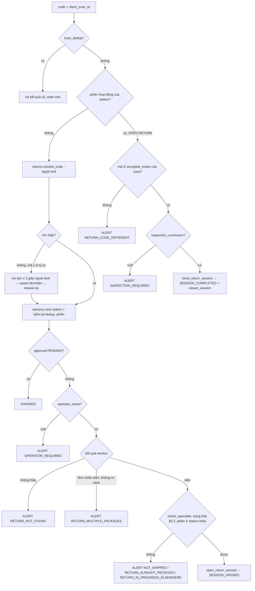

# BE Spec — 02 Hàng hoàn và đối soát · ai-cam-be (api, worker, beat)

| | |
|---|---|
| Tác giả | khanhtt (BE) |
| Reviewer | khanhtt (tech lead, review subagent ở bước 5) |
| Trạng thái | In review · **v0.2** (sửa review G2 lượt 1 — DEC-244..262) |
| Tổng quan & contract | [02-tech-spec.md](02-tech-spec.md) · SRS [01-srs.md](01-srs.md) · nền Phase 1 [item 01 02a](../01-packing-mvp/02a-be-spec.md) |
| Last update | 2026-10-05 · BE |

> **TL;DR** — Mở rộng `ai-cam-be` Phase 1: 3 module mới (`returns`, `reconciliation`, `claims`), nhánh RETURN trong `sessions.scan()`, bảng `snapshot` trong `media`; 9 bảng mới + cột mới qua migration **0003** (schema, chỉ thêm) và **0004** (clip đang giữ → hồ sơ); 25 API mới + 18 API mở rộng; job mới J-13..J-17, mở rộng J-02, J-04, J-06, J-07, J-10.
> Điểm khó nhất: (1) tra mã kiện hoàn 3 nguồn + mở / đóng phiên RETURN trong ngân sách ≤ 1 giây p95; (2) đối soát set-based không sinh cảnh báo trùng, tự đóng; (3) retention theo hồ sơ (ADR-009) + migration có downgrade.
> 20 task T-101..T-120 (≈ 32 ngày công), mỗi task ≤ 2 ngày. v0.2: bảo vệ clip theo hồ sơ hàng hoàn, `attach_or_create`, hồ sơ một phiên, khóa kiện, downgrade sang `phase2_archive`.

Không viết lại contract: request / response / mã lỗi theo [02 §6](02-tech-spec.md#6-api-contract).

---

## 1. Phạm vi

| Goals (lát/spec này làm) | Non-goals (cố ý không làm — để đâu) |
|---|---|
| API-82, API-100..106, 110..113, 120..123, 130..138 + mở rộng API-04, 10..13, 15, 20, 21, 30..32, 40, 42, 45, 60, 80, 92, WS-01/02 | Gửi tranh chấp qua API Shopee (02 Non-goals) |
| J-13 `sync_returns`, J-14 `run_rules`, J-15 `check_deadlines`, J-16 `build_evidence_pack`, J-17 `capture_pack_snapshot`; mở rộng J-02, 04, 06, 07, 10 | Token bucket rate limit Shopee (ADR-007) — vẫn chờ T-3 |
| Migration 0003 + 0004 có downgrade; `alembic check` khớp model | Thay đổi tiến trình `vision` (phiên RETURN chỉ đọc khay — không đổi code vision) |
| API-11 ở chế độ RETURN ≤ 1 giây p95 (server ≤ 200 ms, ≤ 6 query); API-103 ≤ 2 giây p95 | Báo cáo FR-09.02..04, thông báo FR-06.04 → Phase 3 |
| Contract test mở rộng (mọi API-xx mới), QA live returns, test đồng thời | Shopee returns thật — "chưa test, thiếu partner T-3" |

| API / job / lệnh | FR | Ghi chú |
|---|---|---|
| API-100, 101, 60 (`kind`) | FR-01.01, 01.07, 04.10 | `stations` |
| API-10, 11, 12, 13, 15, 20, 21 (mở rộng), 102, 104, 105 | FR-04.01..10, 04.13, FR-03.14, 03.15 | `sessions` (+ `returns`, `approvals`) |
| API-103, 106, J-17, API-40, API-45 | FR-04.04, 02.11, 02.12, 04.12 | `media` |
| API-110..113, J-13 | FR-05.05, 05.11, 05.12, 04.11, 04.13 | `returns`, `platforms` |
| API-120..123, J-14, API-122 | FR-06.01..03, 05, 06 | `reconciliation`, `orders` |
| API-130..138, J-15, J-16 | FR-08.01..06 | `claims` |
| API-42, J-02, migration 0004 | FR-02.06, 02.09, ADR-009 | `media`, `claims` |
| API-80, 82 | FR-02.10 | `settings` |
| API-30, 31, 32, 04, 92 | FR-07.01, 07.02, 09.01, 10.02, 10.03 | `orders`, `reports`, `users` |
| CLI `aicam seed-demo` | — | Thêm 4 hồ sơ hàng hoàn mẫu (mỗi loại) |

## 2. Cấu trúc code

Theo bố cục module hiện có (`models.py` · `schemas.py` · `service.py` · `router.py`; module gọi nhau qua `service` — architecture §4.1; import-linter giữ 2 contract hiện có, thêm 3 module vào lớp `modules`).

| Layer / module | File | Mới / sửa | Trách nhiệm |
|---|---|:---:|---|
| alembic | `alembic/versions/0003_returns_recon_claims.py` | Mới | Schema §3 + backfill `package.created_at`, `status_changed_at`; `setting.recon_start_at = now()`; downgrade có guard |
| alembic | `alembic/versions/0004_hold_to_claims.py` | Mới | Clip `held` → hồ sơ `LEGACY_HOLD`; downgrade trả cờ |
| core | `core/audit.py` (`ACTIONS`) | Sửa | 14 action mới (02 API-92) |
| core | `core/settings.py` | Sửa | Biến §9 |
| users | `modules/users/service.py` (permissions `/me`) | Sửa | Quyền mới theo 01 §5.10 |
| orders | `modules/orders/models.py`, `service.py` | Sửa | `WAREHOUSE_STATUSES` + 5; `ALLOWED_TRANSITIONS` + §5.3 của 02; `MANUAL_TRANSITIONS`; `package.created_at`, `status_changed_at` (cập nhật trong `transition()`); `adjust_status()` (API-122); `apply_platform_cancel` xử lý `PACKING` |
| orders | `modules/orders/packages.py`, `router.py` | Sửa | API-30, 31 mở rộng; API-122 route |
| stations | `modules/stations/models.py`, `schemas.py`, `service.py`, `router.py` | Sửa | `kind`, `work_mode`, `operator_name`; API-60, 100, 101 |
| sessions | `modules/sessions/models.py` | Sửa | `type` RETURN, `return_case_id`, `operator_name`, `inspection_*`; model `InspectionLine` |
| sessions | `modules/sessions/return_scan.py` | Mới | Nhánh RETURN của `scan()`: mở / đóng / cảnh báo; `open_return_session()` dùng chung cho API-105 |
| sessions | `modules/sessions/inspection.py` | Mới | Khởi tạo dòng, API-102 (BR-22), API-113 |
| sessions | `modules/sessions/service.py`, `schemas.py`, `router.py` | Sửa | `scan()` rẽ nhánh theo `work_mode`; `build_state()` thêm khối RETURN; `closed_session`; `cancel()`, `check_timeouts()` theo loại phiên; BR-21 khi đóng |
| approvals | `modules/approvals/service.py` | Sửa | ASSIST cho phiên RETURN; action hợp lệ theo `session_type` |
| returns | `modules/returns/{models,schemas,service,router,lookup}.py` | Mới | `ReturnCase`, `ReturnCasePackage`; `upsert_from_platform()`, `apply_shipping_hint()`, `resolve_code()` (BR-23), `create_unannounced()`, `create_unidentified()`, `recompute()` (BR-24), `link_order()`; API-104 (`lookup.py`), 110, 111, 112 |
| reconciliation | `modules/reconciliation/{models,schemas,rules,service,router}.py` | Mới | `ReconAlert`; `rules.py` 7 truy vấn set-based; `run_rules()` (J-14) diff + tự đóng; API-120, 121, 123 |
| claims | `modules/claims/{models,schemas,service,router,evidence,pack}.py` | Mới | `Claim`, `ClaimEvidence`, `ClaimNote`, `EvidencePack`; `create_from_return()`, `create_manual()`, `auto_evidence()` (FR-08.06), `transition()`; `pack.py` J-16; API-130..138; J-15 |
| media | `modules/media/models.py`, `snapshots.py` (mới), `service.py`, `exports.py`, `signing.py`, `router.py` | Sửa / mới | Bảng `snapshot`; API-103 (qua `sessions`), 106; J-17; J-02 bảo vệ theo hồ sơ (`retention_clip_candidates`, snapshot); `info.json` L5; overlay `operator_name`; `render_side_by_side_to(path)` tách khỏi `_render` để J-16 dùng lại; ký `snapshot:` / `pack:`; API-40 luật STATION mới; API-42 chỉ ADMIN |
| platforms | `modules/platforms/base.py` | Sửa | `PlatformReturn`, `ReturnItem`, `list_returns`, `get_return`; `warehouse_hint` thêm `RETURN_EXPECTED` |
| platforms | `modules/platforms/shopee/{adapter,mapping,returns_mapping}.py`, `mock/adapter.py` + `mock/fixtures/returns/*.json` | Sửa / mới | Gọi nhóm `returns` (chưa test), map trạng thái + lý do; mock 4 loại |
| platforms | `modules/platforms/sync.py` | Sửa | J-13 `sync_returns`; J-06 thêm giao thất bại + kiện `RETURN_EXPECTED` loại giao thất bại; J-04 đơn hủy khi `PACKING` |
| settings | `modules/settings/{schemas,service,router}.py` | Sửa | API-80 mở rộng, API-82 |
| reports | `modules/reports/service.py` | Sửa | API-32 counts + attention |
| realtime | `realtime/publish.py` | Sửa | Sự kiện WS mới (02 §6.2 WS) |
| workers | `workers/tasks.py`, `celery_app.py` | Sửa | Task J-13..J-17; route `claims.build_evidence_pack` → `export`, `media.capture_pack_snapshot` → `video`, `platforms.sync_returns` → `sync`; beat |
| entrypoints | `entrypoints/cli.py` | Sửa | `seed-demo` thêm hàng hoàn |
| tests | `tests/unit/test_{returns,recon_rules,claims,inspection,transition_returns}.py`, `tests/integration/test_{return_scan,return_api,recon_api,claims_api,evidence_pack,retention_claims,migration_0004}.py`, `tests/contract/spec.py`, `tests/qa/test_m6_live.py`, `tests/load/locustfile.py` | Mới / sửa | §11 |

## 3. Data

Enum lưu `text` + CHECK (đổi CHECK = drop + create trong migration). Khóa `uuid` v7; thời gian `timestamptz` UTC.

**Bảng sửa**

| Bảng | Field | Kiểu | Null | Default | Index / ràng buộc |
|---|---|---|:---:|---|---|
| `station` | `kind`, `work_mode`, `operator_name` | text, text, text | –, –, ✔ | `PACK`, `PACK` | CHECK kind ∈ (`PACK`,`RETURN`,`BOTH`); CHECK work_mode ∈ (`PACK`,`RETURN`); CHECK `kind = 'BOTH' OR work_mode = kind`; CHECK `char_length(operator_name) BETWEEN 2 AND 40` |
| `package` | `warehouse_status` (CHECK mới), `created_at`, `status_changed_at`, `is_placeholder` | text, timestamptz, timestamptz, bool | –, –, –, – | –, `now()`, `now()`, false | CHECK + 5 giá trị `RETURN_*`; backfill `created_at = updated_at`, `status_changed_at = max(status_history.at)` hoặc `updated_at`; INDEX (`warehouse_status`, `status_changed_at`) |
| `session` | `type` (CHECK + `RETURN`), `cancel_reason` (CHECK + `NOT_A_RETURN`), `return_case_id`, `operator_name`, `inspection_conclusion`, `inspection_note`, `inspection_saved_at`, `inspection_lines_mode` (`FULL`/`REFERENCE`), `inspection_corrections` (jsonb mảng lịch sử), `camera_clock` (jsonb, chụp lúc đóng) | –, –, uuid FK `return_case` SET NULL, text, text, text, timestamptz, text, jsonb, jsonb | ✔ (các cột mới) | | CHECK `inspection_conclusion` ∈ 6 giá trị; INDEX (`return_case_id`); CHECK `type = 'RETURN' OR return_case_id IS NULL`. Partial unique Phase 1 (station / package đang hoạt động) giữ nguyên — áp cả phiên RETURN |
| `shop` | `last_return_cursor` | timestamptz | ✔ | | |
| `setting` | `return_warn_minutes`, `return_abandon_minutes`, `return_missing_days`, `handover_warn_hours`, `claim_deadline_days`, `claim_due_soon_hours`, `recon_start_at` | int ×6, timestamptz | – | 20, 45, 7, 24, 7, 48, `now()` lúc migrate | CHECK như 02 API-80 |

**Bảng mới**

| Bảng | Field | Kiểu | Null | Default | Index / ràng buộc |
|---|---|---|:---:|---|---|
| `return_case` | id, code, order_id, kind, status, source, platform_return_sn, platform_status, needs_parcel, return_tracking_number, reason, reason_text, requested_items, seller_due_at, reported_at, expected_since, received_at, conclusion, raw_payload, created_at, updated_at | uuid, text, uuid FK `order` SET NULL, text, text, text, text, text, bool, text, text, text, jsonb, timestamptz ×4, text, jsonb, timestamptz ×2 | order_id, platform_*, needs_parcel, return_tracking_number, reason*, seller_due_at, reported_at, expected_since, received_at, conclusion, raw_payload ✔ | code từ `nextval('return_case_code_seq')` → `HH-` + 6 số; requested_items `[]` | UNIQUE (code); UNIQUE (platform_return_sn) WHERE NOT NULL; **UNIQUE (order_id) WHERE status IN (`EXPECTED`,`INSPECTING`,`PARTIALLY_RECEIVED`,`MISSING`)** (DEC-248); cột thêm `merged_into_id` uuid FK `return_case` null; INDEX (upper(return_tracking_number)); INDEX (status, expected_since); INDEX (order_id); CHECK kind / status / source |
| `return_case_package` | return_case_id, package_id | uuid FK CASCADE, uuid FK RESTRICT | – | | PK (return_case_id, package_id); INDEX (package_id) |
| `inspection_line` | id, session_id, order_item_id, position, product_name, variation, image_url, quantity_sent, quantity_requested, quantity_received, condition, note | uuid, uuid FK CASCADE, uuid FK SET NULL, int, text, text, text, int, int, int, text, text | order_item_id, variation, image_url, condition, note ✔ | | UNIQUE (session_id, order_item_id); CHECK quantity_* BETWEEN 0 AND 999; CHECK condition |
| `snapshot` | id, session_id, kind, camera_role, taken_at, path, sha256, size_bytes, status, deleted_at, created_at | uuid, uuid FK RESTRICT, text, text, timestamptz, text, text, int, text, timestamptz, timestamptz | path, sha256, size_bytes, deleted_at ✔ (DELETED) | status `READY` | INDEX (session_id); UNIQUE (session_id) WHERE kind = `PACK_CLOSE`; INDEX (taken_at) WHERE status = `READY` (retention) |
| `recon_alert` | id, package_id, rule, severity, status, context, context_key, detected_at, last_seen_at, closed_at, resolution_action, resolution_note, resolved_by, to_status, claim_id | uuid, uuid FK CASCADE, text, text, text, jsonb, text, timestamptz ×3, text, text, uuid FK user, text, uuid FK claim SET NULL | closed_at, resolution_*, resolved_by, to_status, claim_id ✔ | status `OPEN` | **UNIQUE (package_id, rule) WHERE status = `OPEN`** (BR-26); INDEX (status, severity, detected_at); INDEX (package_id, rule, context_key) |
| `claim` | id, code, package_id, order_id, return_case_id, type, counterparty, status, source, owner_user_id, deadline_at, deadline_source, platform_claim_ref, recovered_amount, close_reason, due_soon_notified_at, created_by, created_at, updated_at, closed_at, version | uuid, text, uuid FK RESTRICT, uuid FK SET NULL, uuid FK SET NULL, text ×4, uuid FK user, timestamptz, text, text, bigint, text, timestamptz, uuid FK user, timestamptz ×3, int | order_id, return_case_id, owner, deadline_*, platform_claim_ref, recovered_amount, close_reason, due_soon_notified_at, created_by (hệ thống), closed_at ✔ | code `KN-` + `nextval('claim_code_seq')`; status `NEW`; version 1 | UNIQUE (code); **UNIQUE (package_id, type) WHERE status <> `CLOSED` AND source <> `LEGACY_HOLD`** (BR-27, R-25); INDEX (status, deadline_at); INDEX (owner_user_id, status); CHECK recovered_amount ≥ 0; CHECK enum |
| `claim_evidence` | id, claim_id, kind, session_id, snapshot_id, auto, added_by, added_at | uuid, uuid FK CASCADE, text, uuid FK RESTRICT, uuid FK RESTRICT, bool, uuid, timestamptz | session_id / snapshot_id (đúng một), added_by ✔ | auto false | CHECK `(kind='SESSION') = (session_id IS NOT NULL)` và ngược lại cho snapshot; UNIQUE (claim_id, session_id); UNIQUE (claim_id, snapshot_id); INDEX (session_id); INDEX (snapshot_id) |
| `claim_note` | id, claim_id, kind, text, author_user_id, at | uuid, uuid FK CASCADE, text, text, uuid, timestamptz | author ✔ | | INDEX (claim_id, at); chỉ INSERT (service không có update / delete) |
| `evidence_pack` | id, claim_id, status, progress, path, sha256, size_bytes, missing, error, created_by, created_at, expires_at | uuid, uuid FK CASCADE, text, int, text, text, bigint, jsonb, text, uuid FK user, timestamptz ×2 | path, sha256, size, error, expires_at ✔ | `QUEUED`, 0, `[]` | UNIQUE (claim_id) WHERE status IN (`QUEUED`,`RUNNING`); INDEX (created_by, created_at) |

Sequence: `return_case_code_seq`, `claim_code_seq` (bắt đầu 1, không cycle).

**Migration 0003 `returns_recon_claims`** (Revises 0002):
1. Tạo sequence, 9 bảng mới, cột mới (nullable hoặc có default — code Phase 1 vẫn chạy). Mở rộng CHECK bằng `ADD CONSTRAINT … NOT VALID` + `VALIDATE CONSTRAINT` (RB-23).
2. Drop + tạo lại CHECK `package.warehouse_status_enum`, `session.type_enum`, `session.cancel_reason_enum` với tập lớn hơn (tập cũ ⊂ tập mới → không lỗi dữ liệu).
3. Backfill `package.created_at`, `status_changed_at` theo lô 5.000 dòng (`UPDATE … FROM (SELECT package_id, max(at) …)`).
4. `setting.recon_start_at = now()` (DEC-228). `retention_clip_days < RETENTION_CLIP_MIN_DAYS` (đọc env, mặc định 60) → nâng lên sàn + `audit_log` `RETENTION_RAISED_TO_MINIMUM` (data cũ / mới) (DEC-257).
5. Có schema `phase2_archive` (từ lần downgrade trước) → khôi phục dữ liệu vào bảng mới, phiên RETURN, clip / ảnh, trạng thái kiện, rồi drop schema (DEC-252).
6. **downgrade (DEC-252):** không xóa dữ liệu Phase 2. Tạo schema `phase2_archive`; `CREATE TABLE phase2_archive.<bảng> AS SELECT …` cho 9 bảng mới, phiên `type = RETURN` (+ `session_event`, `inspection_line`), `clip` / `snapshot` của phiên RETURN và ảnh `PACK_CLOSE`, `recon_alert`, dòng `status_history` có trạng thái `RETURN_*`, bảng ánh xạ (`package_id`, `warehouse_status` hiện tại); kiện `RETURN_*` → trạng thái cuối **không phải hoàn** trong `status_history` (không có → `DELIVERED`); xóa dữ liệu đã chép khỏi bảng chính; drop bảng mới, cột, sequence; CHECK về tập cũ. File video / ảnh **giữ nguyên** trên đĩa (J-02 cũ chỉ duyệt bảng `clip`, không xóa file không có dòng). Log số dòng mỗi bảng đã chép.

**Migration 0004 `hold_to_claims`** (Revises 0003, DEC-222, DEC-250):
1. Cả migration **một transaction** (Alembic mặc định); INSERT gom theo lô 500 dòng mỗi câu lệnh (chỉ là kích thước câu lệnh, không commit giữa chừng).
2. `held_before` = tập `clip.id WHERE held` (kèm `session_id`, `package_id`, `held_by`, `held_at`) → nhóm theo `package_id`.
3. Mỗi kiện: INSERT `claim` (`source = LEGACY_HOLD`, `type = OTHER`, `counterparty = PLATFORM`, `status = NEW`, `deadline_at = now() + 30 ngày`, `deadline_source = DEFAULT`, `created_by` = người giữ đầu tiên); INSERT `claim_evidence` (`SESSION`, `auto = false`) cho từng phiên; INSERT `claim_note` (`SYSTEM`, "Chuyển từ cờ giữ của {display_name} lúc {held_at}"); INSERT `audit_log` `CLIP_PROTECTION_MIGRATED`.
4. `UPDATE clip SET held = false WHERE held` (giữ `held_by`, `held_at` cho downgrade).
5. Kiểm **tập con**: `protected_after` = clip READY của mọi phiên trong `claim_evidence` của hồ sơ `LEGACY_HOLD`; `held_before ⊆ protected_after` (tập sau thường lớn hơn: Phase 1 giữ từng clip, nay giữ theo phiên — cả Cam 1 + Cam 2). Log `held_before`, `protected_after`, chênh lệch; không phải tập con → raise (cả transaction lùi).
6. **downgrade (DEC-252):** `UPDATE clip SET held = true` cho **mọi** clip đang được bảo vệ theo ADR-009 (phiên gắn hồ sơ chưa `CLOSED` + phiên PACK hiệu lực / RETURN của kiện thuộc hồ sơ hàng hoàn chưa kết thúc) — để J-02 của image cũ không xóa; xóa hồ sơ `LEGACY_HOLD` (CASCADE bằng chứng / ghi chú). Hồ sơ khác giữ (0003 downgrade chuyển sang `phase2_archive`).

**Chặn image cũ chạy trên DB mới:** bước `migrate` của compose (image cũ, head 0002) gặp revision 0003 / 0004 không biết → lỗi → `api`, `worker`, `beat` (phụ thuộc `migrate` thành công) không khởi động. `docs/ops.md` ghi thứ tự lùi: dừng dịch vụ → `alembic downgrade 0002` bằng image mới → đổi image (T-120).

**Dữ liệu nhạy cảm:** `return_case.reason_text`, `raw_payload` có thể chứa thông tin người mua → không log nội dung (logger lọc khóa `reason_text`, `raw_payload`), không trả `raw_payload` qua API. `operator_name` là tên người, không bí mật.

## 4. Implement API

Chung như Phase 1: `require_roles(...)`; `AppError(code, http, message, details)`; audit theo 02 API-92; publish WS trong `after_commit`.

| API | Validate input | AuthZ | Logic chính | Transaction / lock | Lỗi |
|---|---|---|---|---|---|
| API-100 work-mode | `work_mode` enum | STATION (station của token) | `kind = BOTH` mới cho; không có phiên hoạt động / approval PENDING; đổi `work_mode`; audit; publish `station.state` | advisory lock station | MODE_NOT_ALLOWED, SESSION_ACTIVE |
| API-101 operator | strip, 2–40 | STATION | Không có phiên hoạt động; đặt `operator_name`; audit (cũ → mới) | lock station | SESSION_ACTIVE, VALIDATION_ERROR |
| API-11 (RETURN) | như Phase 1 + chấp nhận mã đơn `^[A-Z0-9]{10,20}$` khi RETURN | STATION, `work_mode = RETURN` | §4.1 | §4.1 | §4.1 |
| API-102 inspection | `lines` đủ mọi dòng của phiên, `order_item_id` thuộc phiên, số 0–999, `OTHER` cần note, note ≤ 500 | STATION, phiên của station, `OPEN`, `type = RETURN` | Ghi đè dòng + kết luận + note; BR-22 (`inspection.validate()`); `saved_at = now`; publish `station.state` | lock station + `SELECT … FOR UPDATE` session | SESSION_NOT_OPEN, NOT_RETURN_SESSION, VALIDATION_ERROR, CONCLUSION_INCONSISTENT |
| API-103 snapshot | — | STATION, phiên RETURN `OPEN` của station | Đếm ảnh MANUAL < 20; **ngoài transaction** gọi `grab_frame(rtsp relay Cam 1, timeout=3)`; ghi file `snapshots/YYYY/MM/DD/{session_id}_{n:02d}.jpg` (0444), SHA-256; transaction ngắn INSERT `snapshot`; publish state | lock station chỉ lúc INSERT (kiểm lại phiên `OPEN`, đếm lại) | SESSION_NOT_OPEN, SNAPSHOT_LIMIT, CAMERA_UNREACHABLE |
| API-104 lookup | `q` strip + upper, 4–40 | STATION, `work_mode = RETURN` | Khớp chính xác: `upper(tracking_number)`, `upper(return_tracking_number)`, `platform_order_sn`, `platform_return_sn`; tiền tố khi ≥ 6 ký tự (`LIKE q%` trên index `text_pattern_ops`); ≤ 10; mỗi dòng tính `can_open` / `blocked_reason` bằng cùng hàm kiểm của §4.1; 0 kết quả + ≥ 8 ký tự → tra sàn ≤ 2 giây (`platform_checked = true`) | đọc | WRONG_WORK_MODE, VALIDATION_ERROR |
| API-105 return-sessions | đúng một trong `package_id` / `unidentified_code` (regex mã); `client_scan_id` | STATION, RETURN | `scan_dedup` như API-11; station có phiên hoạt động → 409; `package_id` → `check_openable` (bị chặn → 200 `ALERT`) → `open_return_session`; `unidentified_code` → `resolve_code` trước: khớp kiện / case có sẵn → xử lý như quét mã đó; không khớp → `create_unidentified(code)` (kiện tạm `is_placeholder`, `verified=false`) rồi mở | như API-11 | WRONG_WORK_MODE, SESSION_ACTIVE, NOT_FOUND, VALIDATION_ERROR |
| API-12 (RETURN) | lý do mới | STATION | session `CANCELLED`; kiện → `package_status_before`; `returns.on_session_cancelled()` (case tạo bởi phiên này + không có phiên khác → `CANCELLED`, ngược lại `recompute`); J-01 | lock station | SESSION_NOT_OPEN |
| API-13 / 21 (RETURN) | ASSIST cần phiên RETURN `OPEN` | như Phase 1 | `approvals.service` kiểm `session.type`; action RETURN ∈ {CONTINUE, CANCEL_SESSION}; CANCEL_SESSION gọi cùng đường hủy RETURN | như Phase 1 | NOT_ELIGIBLE, INVALID_ACTION |
| API-106 snapshot media | `uid`, `exp`, `sig` | chữ ký (`snapshot:{id}:{uid}:{exp}`) | `FileResponse` JPEG; ảnh `DELETED` → 410; audit `VIEW_SNAPSHOT` khi `uid` không phải tài khoản STATION | | SIGNATURE_INVALID, SNAPSHOT_DELETED |
| API-110 list | `tab` enum, `kind` enum, `q` ≤ 64, ngày ≤ 92 | ADMIN, SUPERVISOR, CSKH | Lọc theo tab (02); `tab_counts` một truy vấn `GROUP BY` theo nhóm tab; `waiting_days` = ngày (giờ VN) từ `expected_since` | đọc | |
| API-111 detail | — | như trên | case + packages + sessions RETURN + claims brief | đọc | NOT_FOUND |
| API-112 link-order | `package_id` | ADMIN, SUPERVISOR | `returns.link_order()` (v0.2 — 02 §6.2 API-112): đơn có case mở → gộp vào case đó (`merged_into_id`), không thì gắn đơn + `kind = UNANNOUNCED`; hồ sơ khiếu nại trùng BR-27 → gộp bằng chứng + đóng hồ sơ cũ "Gộp vào KN-…"; còn lại như sau: case `UNIDENTIFIED` → gắn đơn, chuyển phiên sang kiện đích (UPDATE `session.package_id`, `snapshot` theo phiên — không đổi file), xóa kiện tạm nếu không còn phiên; kiện đích `transition(→ RETURN_INSPECTING → RECEIVED_*)` theo kết luận (2 bước, nguồn MANUAL); `kind = UNANNOUNCED`; hồ sơ khiếu nại của phiên đổi `package_id` + thêm phiên PACK hiệu lực (auto); audit | 1 tx; lock case + 2 kiện (`FOR UPDATE`, theo thứ tự id) | NOT_UNIDENTIFIED, PACKAGE_ALREADY_RETURNED, NOT_ELIGIBLE |
| API-113 correct | như API-102 + `reason` 5–500 | ADMIN, SUPERVISOR | Phiên RETURN `COMPLETED`, `ended_at ≥ now − 7 ngày`; ghi đè dòng + kết luận; nối `{by, at, reason, before}` vào `inspection_corrections[]`; case một phiên → đổi mọi kiện của case; cờ `INSPECTION_CORRECTED`; kiện OK ⇄ ISSUE (MANUAL); `returns.recompute`; claims: OK→ISSUE `create_from_return`; ISSUE→OK hồ sơ `AUTO_RETURN` `NEW` của phiên → `CLOSED` (lý do hệ thống) | 1 tx; lock session + kiện | CORRECTION_WINDOW_EXPIRED, NOT_RETURN_SESSION, VALIDATION_ERROR, CONCLUSION_INCONSISTENT |
| API-120 list | enum, ngày | ADMIN, SUPERVISOR, CSKH | Lọc; sắp `CASE severity` rồi `detected_at`; `summary` 1 truy vấn; `allowed_status_targets` = `MANUAL_TRANSITIONS[from]` | đọc | |
| API-121 resolve | note 1–500 | ADMIN, SUPERVISOR | `OPEN` → `RESOLVED`, action `RESOLVE`; audit `RECON_RESOLVE`; publish `recon.updated` | `SELECT … FOR UPDATE` alert | ALREADY_RESOLVED |
| API-122 adjust | `to_status` enum, reason 5–500, `recon_alert_id` tùy chọn | ADMIN, SUPERVISOR | `orders.adjust_status()`: kiểm `MANUAL_TRANSITIONS`, không có phiên hoạt động; `transition(source=MANUAL, actor)`; alert (nếu có, cùng kiện) → `RESOLVED` action `ADJUST_STATUS`; `RETURN_* → DELIVERED`: case mở → `CANCELLED`; audit `WAREHOUSE_STATUS_ADJUST` | 1 tx; lock kiện + alert | TRANSITION_NOT_ALLOWED, SESSION_ACTIVE, VALIDATION_ERROR |
| API-123 run | — | ADMIN, SUPERVISOR | Khóa `recon:run` đang có (J-14 giữ) → 409; không → enqueue J-14 (không tự lấy khóa — R-20) | | RECON_IN_PROGRESS |
| API-130 list | enum, `owner=me` → user hiện tại, `due=soon` (deadline ≤ now + `claim_due_soon_hours`, status ∈ NEW/SUBMITTED/WAITING), `due=overdue` | ADMIN, SUPERVISOR, CSKH | Lọc; `status_counts` một truy vấn | đọc | |
| API-131 create | `type`, `counterparty` enum, `package_id` bắt buộc, note ≤ 1000 | như trên | `claims.create_manual()`: kiểm BR-27 (unique partial → bắt `IntegrityError` → `CLAIM_EXISTS` kèm id); `deadline_at` (§5 BR-27); `auto_evidence()`; ghi chú đầu; `recon_alert_id` → alert `RESOLVED` action `OPEN_CLAIM`, `claim_id`; audit `CLAIM_CREATE`; WS | 1 tx | CLAIM_EXISTS, VALIDATION_ERROR, NOT_FOUND |
| API-132 detail | — | như trên | claim + evidence (phiên + clip + ảnh của phiên, URL ký) + `other_sessions` + `missing` + notes + `allowed_transitions` | đọc | NOT_FOUND |
| API-133 patch | `version` bắt buộc; trường như 02 | như trên | `UPDATE … WHERE id = ? AND version = ?` (0 dòng → VERSION_CONFLICT); `claims.transition()` theo bảng §5 BR; ghi `claim_note` STATUS_CHANGE; `closed_at` khi CLOSED; audit `CLAIM_UPDATE`; WS `claim.updated`, `report.updated` | 1 tx, khóa lạc quan | VERSION_CONFLICT, INVALID_TRANSITION, CLAIM_CLOSED, VALIDATION_ERROR |
| API-134 evidence | `version`; id phải thuộc kiện / hồ sơ hàng hoàn của hồ sơ; bỏ evidence `auto = true` → `note` 5–500 bắt buộc | như trên | Khóa clip phiên thêm (DEC-251); thay tập: xóa evidence không còn, thêm mới (`auto = false`); ghi chú (lý do bỏ / hệ thống); audit `CLAIM_EVIDENCE_UPDATE` | 1 tx, khóa lạc quan | VERSION_CONFLICT, CLAIM_CLOSED, VALIDATION_ERROR |
| API-135 note | 1–1000 | như trên | INSERT `claim_note` NOTE (hồ sơ CLOSED vẫn cho) | | |
| API-136 pack | — | như trên | Có bằng chứng; không có gói `QUEUED`/`RUNNING` (unique partial); INSERT `evidence_pack`; enqueue J-16; audit `EXPORT_CLAIM_PACK` | 1 tx | PACK_IN_PROGRESS, NO_EVIDENCE |
| API-137 pack status | — | người tạo, ADMIN (khác → 404) | URL ký `pack:{id}:pack.zip:{uid}:{exp}` | | NOT_FOUND |
| API-138 zip | chữ ký | | `FileResponse`, `Content-Disposition`; audit `DOWNLOAD_CLAIM_PACK` | | SIGNATURE_INVALID |
| API-80 PUT (mở rộng) | 4 trường cũ bắt buộc, 6 mới tùy chọn, `confirm_reduction` | ADMIN | `retention_clip_days < RETENTION_CLIP_MIN_DAYS` → 422; giảm (clip hoặc raw) + chưa xác nhận → tính `impact` (như API-82) → 409; xác nhận → lưu + audit `RETENTION_REDUCED` | lock dòng setting | RETENTION_BELOW_MINIMUM, RETENTION_REDUCTION_UNCONFIRMED, VALIDATION_ERROR |
| API-82 impact | 2 query số 1–365 | ADMIN | `retention_clip_candidates(cutoff_mới)` đếm + tổng `size_bytes` (đã trừ bảo vệ hồ sơ / held); raw = tổng thời lượng `video_segment` có `end_at < now − raw_mới` (trừ đoạn được bảo vệ); `next_run_at` từ crontab J-02 | đọc (timeout truy vấn 5 giây) | VALIDATION_ERROR |
| API-60 (mở rộng) | `kind` enum | ADMIN | Đổi `kind` khi có phiên hoạt động / approval PENDING → 409; đặt `work_mode` theo 02 | lock station | STATION_BUSY |
| API-42 (thu hẹp) | — | **ADMIN** | Như Phase 1 | | FORBIDDEN cho vai khác |
| API-40 (mở rộng) | — | STATION | Thêm điều kiện: clip thuộc phiên `PACK` của kiện (hoặc kiện cùng case) đang có phiên RETURN `OPEN` / `WAITING_APPROVAL` tại station của token | | FORBIDDEN |
| API-30/31/32 | như 02 | như Phase 1 | Truy vấn thêm (§8); API-31 tính `protected_by_claim` bằng 1 truy vấn `claim_evidence ⋈ claim` cho mọi phiên của kiện | đọc | |

### 4.1 API-11 ở chế độ RETURN — chi tiết

- **`returns.resolve_code(code)`** (≤ 3 truy vấn có index, thứ tự cứng — DEC-202, DEC-229):
  1. `return_case` theo `upper(return_tracking_number)` (ưu tiên case chưa kết thúc) → kiện = kiện đầu tiên của case chưa có phiên RETURN `COMPLETED`.
  2. `package` theo `upper(tracking_number)` → case mở chứa kiện (status ∈ EXPECTED / MISSING / INSPECTING / PARTIALLY_RECEIVED), có thể không có.
  3. `order` theo `platform_order_sn` (+ `return_case.platform_return_sn`) → case mở của đơn → kiện chưa nhận đầu tiên; không có case: đúng 1 kiện đủ điều kiện → kiện đó; > 1 → `MULTIPLE`.
- **`check_openable(package, case)`**: case một phiên đang `INSPECTING` (phiên ở kiện khác của case) → `RETURN_IN_PROGRESS_ELSEWHERE`; `is_placeholder` → chỉ mở qua API-105 `unidentified_code`; trạng thái ∈ {`RETURN_EXPECTED`, `RETURN_MISSING`, `HANDED_OVER`, `DELIVERED`} → được; `NEW` → được khi `order.platform_status` ∈ {`SHIPPED`, `TO_CONFIRM_RECEIVE`, `COMPLETED`, `TO_RETURN`} hoặc có case mở (EX-R3); `RETURN_RECEIVED_*` → `RETURN_ALREADY_RECEIVED`; `RETURN_INSPECTING` hoặc partial unique `session(package_id)` → `RETURN_IN_PROGRESS_ELSEWHERE`; còn lại → `NOT_SHIPPED`.
- **`open_return_session(station, package, case|None, code)`** (trong lock station → khóa case → khóa kiện, kiểm lại): case null → `returns.attach_or_create(order, signal=WAREHOUSE_SCAN)` (gắn vào case mở của đơn nếu có, không thì `UNANNOUNCED`); `lines_mode = REFERENCE` khi case `FAILED_DELIVERY` và đơn > 1 kiện (`quantity_requested` = phần chưa nhận của case), còn lại `FULL` với dòng = `requested_items` (BUYER_RETURN) hoặc mọi dòng đơn; trước đây: case null → `create_unannounced(package)` (`kind = UNANNOUNCED`, `source = WAREHOUSE`, flag phiên `UNANNOUNCED`); INSERT session (`type = RETURN`, `package_status_before`, `operator_name` từ station, `open_code`); `inspection.init_lines()` (02 API-10 quy tắc khởi tạo; `requested_items` theo `order_item_id`); `effective_pack_session(package)` null → flag `NO_PACK_CLIP`; `transition(package → RETURN_INSPECTING)`; `returns.recompute(case)` → `INSPECTING`; event `SCAN_OPEN`.
- **`close_return_session(session, code | None)`** (API-11, J-07 tự hoàn tất với `code = None`, cờ `AUTO_CLOSED`): `accepted_codes(case)` = mã gốc mọi kiện của case + `return_tracking_number` + `platform_order_sn` + `open_code` (UNIDENTIFIED: chỉ `open_code`); khóa case → khóa mọi kiện của case (id tăng); `camera_clock` chụp từ `camera.clock_offset_ms`; session `COMPLETED`, `close_code`; kiện → `RETURN_RECEIVED_OK` (kết luận OK) / `_ISSUE` — case một phiên: **mọi** kiện của case (BR-24); `returns.recompute(case)` (BR-24, `received_at`, `conclusion` tổng); kết luận ≠ OK → `claims.create_from_return(session)` (BR-08, BR-27: đã có hồ sơ cùng loại mở → thêm bằng chứng + ghi chú); enqueue J-01; publish `report.updated`, `return.updated`, `claim.updated`.
- **PACK:** kiện `RETURN_*` khi mở → ALERT `ALREADY_HANDED_OVER` `is_return` (DEC-247); `scan()` đọc lại `station.work_mode` dưới advisory lock trước khi rẽ nhánh. **(L4, BR-21):** `complete_session()` thêm trả `closed_session` + ghi `camera_clock`; phiên có flag `ORDER_CANCELLED` → `transition(PACKING → CANCELLED_AFTER_PACK)` thay `PACKED`.
- Ngân sách: mở ≤ 6 truy vấn (resolve 1–3, lock, kiểm, INSERT gộp `executemany` dòng), đóng ≤ 6; `build_state()` RETURN thêm 3 truy vấn (case, dòng, ảnh + pack reference) — mục tiêu p95 server ≤ 200 ms.

## 5. Quy tắc nghiệp vụ → nơi thực thi

`context_key` (DEC-226, R-21) — "đợt" của một vi phạm; có alert `RESOLVED` cùng (kiện, quy tắc, key) thì không tạo lại.

| BR | Thực thi ở | `context_key` | Test |
|---|---|---|---|
| BR-06 (không áp RETURN) | `apply_tray()`, `on_tray_changed()`: phiên `type = RETURN` → chỉ cập nhật `cam2_code` + `session_event CAM2_DETECT`, không đổi trạng thái; API-21 CONTINUE không gọi đánh giá khay cho RETURN (DEC-246) | — | unit: khay mã khác khi phiên RETURN `OPEN` → vẫn `OPEN` |
| BR-07 | `return_scan.close` kiểm `inspection_conclusion` | — | unit: `INSPECTION_REQUIRED`, phiên vẫn `OPEN` |
| BR-08 | `claims.create_from_return` trong tx đóng phiên / J-07 / API-113; `counterparty = CARRIER` khi case `FAILED_DELIVERY`, còn lại `PLATFORM` | — | integration: 6 kết luận × 2 loại case |
| BR-09 (ADR-009) | `media.protected_sessions_sql()` dùng chung cho `retention_clip_candidates`, `snapshot_candidates`, API-31 `protection`, API-82: (a) `claim_evidence ⋈ claim` `status <> 'CLOSED' OR closed_at >= cutoff`; (b) phiên PACK hiệu lực + phiên RETURN của kiện ∈ `return_case_package` có case `EXPECTED`/`INSPECTING`/`PARTIALLY_RECEIVED`/`MISSING`; (c) như (b) với `NO_PARCEL` và `reported_at > now − 30 ngày`; (d) `held`. Cutoff = now − max(setting, `RETENTION_CLIP_MIN_DAYS`) | — | integration đồng hồ +200 ngày (hồ sơ mở / đóng); retention 60, kiện `MISSING` về sau 62 ngày → clip đóng gói còn (AC-26) |
| BR-10 | `rules.shipped_not_packed`: kiện `NEW`/`PACKING`, `order.platform_status` ∈ {SHIPPED, TO_CONFIRM_RECEIVE, COMPLETED}, `coalesce(order.created_at_platform, package.created_at) ≥ recon_start_at`, `is_placeholder = false` (DEC-254) | `order.platform_status` | unit; kiện NEW của đơn cũ mới đồng bộ → không cảnh báo |
| BR-11 | `rules.cancelled_after_pack`: `PACKED` + đơn hủy, hoặc `CANCELLED_AFTER_PACK` | `order.platform_status` | resolve tay → không tạo lại cùng key |
| BR-12 | `run_rules` bước 1: kiện `RETURN_EXPECTED` có `status_changed_at < now − return_missing_days` → `RETURN_MISSING` (WAREHOUSE, "Đối soát"); case → `MISSING` **chỉ khi** chưa kiện nào nhận (không đè `PARTIALLY_RECEIVED`); `rules.return_overdue` cho kiện `RETURN_MISSING` (DEC-255) | `package.status_changed_at` lúc vào `RETURN_EXPECTED` | +8 ngày (AC-07); API-122 MISSING → EXPECTED rồi chạy lại → không MISSING ngay |
| BR-13 | `rules.return_unannounced`: case `UNANNOUNCED`, `platform_return_sn IS NULL`, không có tín hiệu giao thất bại, `created_at < now − 24h` | `return_case.id` | AC-24 |
| BR-14 | `rules.packed_not_handed_over`: `PACKED`, `status_changed_at < now − handover_warn_hours`, `created_at ≥ recon_start_at` | `package.status_changed_at` | unit |
| BR-19 | `rules.return_done_not_received`: case nhóm sàn `DONE` (= `REFUND_PAID`, DEC-262) + kiện còn `RETURN_EXPECTED`/`MISSING` | `return_case.platform_status` | unit; `CLOSED` không cảnh báo |
| BR-20 | `rules.unverified_stale`: `verified = false`, `is_placeholder = false`, `created_at < now − 24h`, `created_at ≥ recon_start_at` | `package.created_at` (một lần / kiện) | unit; kiện tạm không vào |
| BR-21 | `orders.apply_platform_cancel`: kiện `PACKING` → `sessions.flag_order_cancelled()` + WS-01 `alert`; đóng → `CANCELLED_AFTER_PACK`. Kiện `HANDED_OVER` bị hủy → `returns.attach_or_create(signal=FAILED_DELIVERY)` (DEC-258) | — | AC-32; hủy sau lấy hàng → case |
| BR-22 | `inspection.validate()` (API-102, 113, J-07): `lines_mode = FULL` → luật đủ; `REFERENCE` → chỉ kết luận (+ note khi OTHER) | — | unit 10 trường hợp |
| BR-23 | `returns.accepted_codes(case)` | — | mở mã chiều về, đóng mã gốc |
| BR-24 | `returns.recompute(case)` sau mọi đổi phiên RETURN / kiện của case: `BUYER_RETURN`/`UNANNOUNCED`/`UNIDENTIFIED` → `close_return_session` chuyển **mọi** kiện của case sang `RETURN_RECEIVED_*` (từ `RETURN_EXPECTED`/`MISSING`/`HANDED_OVER`/`DELIVERED`) và case `RECEIVED_*`; `FAILED_DELIVERY` → `RECEIVED_*` khi mọi kiện có phiên `COMPLETED`, ngược lại `PARTIALLY_RECEIVED` (DEC-249) | — | AC-34 4 kịch bản |
| BR-25 | `settings.update` + `RETENTION_CLIP_MIN_DAYS`; J-02 dùng max | — | API-80; DB có 45 → migrate nâng 60 |
| BR-26 | partial unique `recon_alert(package_id, rule) WHERE OPEN`; `context_key` | — | chạy 2 lần; resolve tay rồi chạy lại |
| BR-27 | partial unique `claim(package_id, type) WHERE status <> 'CLOSED' AND source <> 'LEGACY_HOLD'`; hạn theo `seller_due_at` / mặc định | — | 2 POST song song → 1 `CLAIM_EXISTS` |
| BR-28 | `return_scan` kiểm `station.operator_name`; API-03 (client STATION) và API-91 đặt `operator_name = NULL` | — | unit; đăng xuất → quét → `OPERATOR_REQUIRED` |
| Một hồ sơ mở / đơn | `returns.attach_or_create(order, signal)` (DEC-248): khóa `order` advisory (`order:{sn}`, như `lock_orders`) → tìm case mở của đơn → gắn (nâng `kind` theo ưu tiên BUYER_RETURN > FAILED_DELIVERY > UNANNOUNCED; gắn kiện mới vào `return_case_package`) → không có thì tạo; J-13: case `UNIDENTIFIED` có `open_code` = mã chiều về → gộp (`merged_into_id`, audit `RETURN_CASE_MERGED`); partial unique `return_case(order_id) WHERE status IN (EXPECTED, INSPECTING, PARTIALLY_RECEIVED, MISSING)` là lưới an toàn | — | integration: yêu cầu trả + `TO_RETURN` cùng đơn → 1 case BUYER_RETURN |
| Kiện hoàn ở bàn đóng gói | `_open_session_unsafe()`: kiện `RETURN_*` → ALERT `ALREADY_HANDED_OVER` `data.is_return = true` (DEC-247) | — | integration: không 500 |
| Chuyển trạng thái hồ sơ khiếu nại | `claims.transition()`: NEW→SUBMITTED/CLOSED; SUBMITTED→WAITING/WON/LOST/CLOSED; WAITING→WON/LOST/CLOSED; WON/LOST→CLOSED | — | unit mọi cặp |
| Chuyển trạng thái kiện | `orders.transition()` bảng 02 §5.3 v0.2; `MANUAL_TRANSITIONS` (gồm `CANCELLED_AFTER_PACK → HANDED_OVER`) | — | unit mọi cặp |

## 6. Concurrency & toàn vẹn

**Thứ tự khóa (DEC-256):** advisory lock station → advisory `order:{sn}` (khi tạo / gắn case) → `return_case` `FOR UPDATE` → `package` theo id tăng dần `FOR UPDATE` (dùng `orders.find_package(for_update=True)` / `SELECT … FOR UPDATE`, **kiểm lại trạng thái sau khi khóa**) → `clip` theo id tăng dần. Job nền (J-04, J-06, J-13, J-14, J-07) lấy cùng thứ tự; J-14 dùng `FOR UPDATE SKIP LOCKED` trên kiện khi chuyển `RETURN_MISSING` (kiện đang bị API giữ → lần chạy sau).

| Tình huống | Cách xử lý |
|---|---|
| Hai bàn hoàn quét cùng kiện | Partial unique `session(package_id)` đang hoạt động → `RETURN_IN_PROGRESS_ELSEWHERE` |
| Hai bàn quét 2 kiện của cùng case FAILED_DELIVERY | Mỗi kiện một phiên; `recompute(case)` khóa case → tuần tự. Case một phiên (BUYER_RETURN): kiện thứ hai của case bị coi "đang kiểm" (partial unique trên kiện đầu + kiểm case `INSPECTING`) → `RETURN_IN_PROGRESS_ELSEWHERE` |
| J-13 / J-06 / API-122 đổi kiện đang được mở phiên ở bàn hoàn | Cùng khóa kiện; bên đến sau kiểm lại trạng thái: kiện `RETURN_INSPECTING` → job chỉ cập nhật trường sàn của case, không đổi trạng thái kiện; API-122 → `SESSION_ACTIVE` |
| Quét đóng trong lúc API-102 đang lưu | Cùng advisory lock station; FE flush API-102 trước (02b-station DEC-235) |
| API-103 chụp chậm 3 giây | Lấy khung ngoài lock; INSERT trong lock kiểm lại phiên + đếm; phiên đã đóng → xóa file, 409 |
| Tạo hồ sơ / thêm bằng chứng vs J-02 xóa clip (R-7, DEC-251) | Trong tx tạo hồ sơ / API-134 / `create_from_return` / `attach_or_create`: `SELECT clip … WHERE session_id IN (…) ORDER BY id FOR UPDATE` → clip `DELETED` thì ghi vào `missing`; J-02 cũng khóa từng clip `FOR UPDATE` (như `set_hold`, `media/service.py:514`) rồi **chạy lại** điều kiện bảo vệ dưới khóa. Ai khóa trước thắng; không còn trường hợp hồ sơ tạo xong mà clip bị xóa sau |
| J-13 chạy chồng | Redis lock `sync_returns:{shop}` 600 giây |
| J-14 chạy chồng | J-14 **sở hữu** khóa `recon:run` (SET NX 600 giây, giữ suốt lần chạy, trả khi xong); API-123 chỉ kiểm khóa (đang giữ → 409) rồi enqueue; J-14 không lấy được khóa → bỏ lượt (R-20) |
| Hai người sửa một hồ sơ | `version` → `VERSION_CONFLICT` |
| Hai POST tạo hồ sơ cùng loại | Partial unique BR-27 → `CLAIM_EXISTS` |
| Đổi `work_mode` giữa lúc quét | `scan()` đọc lại `station` dưới advisory lock trước khi rẽ nhánh (R-24) |
| J-16 trong lúc J-02 xóa clip | Clip của hồ sơ chưa đóng không bị xóa (BR-09 a); hồ sơ đã đóng → file mất ghi `missing` |
| Migration 0004 | Chạy ở bước `migrate` trước `api` / `worker` |

## 7. Job nền · queue · tích hợp ngoài

| Tên | Trigger / lịch | Input | Làm gì | Retry / timeout | Lỗi cuối thì |
|---|---|---|---|---|---|
| J-13 `platforms.sync_returns` (queue `sync`) | 15 phút / shop `CONNECTED`; sau callback | shop_id | `ensure_fresh_token`; `list_returns(since = last_return_cursor − 10 phút)` (lần đầu: `SHOPEE_INITIAL_SYNC_DAYS`); mỗi `PlatformReturn` → `returns.upsert_from_platform()` → `attach_or_create(order, signal=PLATFORM_RETURN)` (DEC-248): đơn chưa có → `get_order` + upsert; case mở của đơn (kể cả `UNANNOUNCED`, `FAILED_DELIVERY` do `TO_RETURN`) → gắn yêu cầu, `kind = BUYER_RETURN`; case `UNIDENTIFIED` có `open_code` = mã chiều về → gộp; `needs_parcel = false` → case riêng `REFUND_ONLY` / `NO_PARCEL`; nhóm OPEN → case `EXPECTED`, kiện `DELIVERED`/`HANDED_OVER`/`NEW` → `RETURN_EXPECTED` (khóa kiện, kiểm lại; kiện `RETURN_INSPECTING` → chỉ cập nhật trường sàn); `CANCELLED` trước khi kiện về → case `CANCELLED`, kiện → `DELIVERED`; `DONE` (REFUND_PAID) / `CLOSED` → lưu `platform_status` (BR-19 xét DONE); cập nhật cursor; WS `return.updated` | Adapter 5 lần giãn cách; timeout 4 phút | `shop.last_error` `SYNC_FAILED` |
| J-06 mở rộng | 15 phút | — | Thêm kiện `RETURN_EXPECTED` thuộc case `FAILED_DELIVERY`; `_RANK` mới (DEC-259); hint `RETURN_EXPECTED` (`TO_RETURN`, `LOGISTICS_DELIVERY_FAILED`, `LOGISTICS_COD_REJECTED`) → `attach_or_create(signal=FAILED_DELIVERY)` (chỉ tạo case FAILED_DELIVERY khi đơn không có case mở), bước áp: `(PACKED, RETURN_EXPECTED)` → HANDED_OVER → RETURN_EXPECTED; `(HANDED_OVER, RETURN_EXPECTED)`; `(NEW, RETURN_EXPECTED)` (DEC-254); kiện case `FAILED_DELIVERY` có hint `DELIVERED` → `RETURN_EXPECTED → DELIVERED`, case `CANCELLED` (giao lại thành công). Mỗi kiện khóa `FOR UPDATE` + kiểm lại | như cũ | log |
| J-04 mở rộng | 5 phút | — | `apply_platform_cancel`: kiện `PACKING` → BR-21; kiện `HANDED_OVER` bị hủy (hủy sau khi ĐVVC lấy, boom) → `attach_or_create(signal=FAILED_DELIVERY)` (DEC-258; sửa `sync.py:342` không `return` sớm); đơn `TO_RETURN` → như J-06. Xác minh tín hiệu thật ở T-3 | như cũ | |
| J-14 `reconciliation.run_rules` (queue `default`) | 30 phút; sau J-04 / J-06 / J-13 có thay đổi (`apply_async(countdown=30)`, gộp bằng lock); API-123 | — | Lấy khóa `recon:run` (không được → bỏ lượt). Bước 1: BR-12 chuyển kiện `RETURN_EXPECTED → RETURN_MISSING` theo `status_changed_at` (`FOR UPDATE SKIP LOCKED`); case → `MISSING` chỉ khi chưa kiện nào nhận (không đè `PARTIALLY_RECEIVED`). Bước 2: mỗi quy tắc một truy vấn → tập (package_id, context, context_key). Bước 3: INSERT alert mới (bỏ qua nếu có `RESOLVED` cùng key) ON CONFLICT DO NOTHING; UPDATE `last_seen_at`; alert `OPEN` không còn trong tập → `AUTO_RESOLVED`, `closed_at`. Bước 4: có thay đổi → WS `recon.updated`, `report.updated` | 1 lần; soft limit 120 giây | log + metric `aicam_recon_run_failed_total` |
| J-15 `claims.check_deadlines` | 60 phút | — | Hồ sơ NEW/SUBMITTED/WAITING có `deadline_at ≤ now + claim_due_soon_hours` và `due_soon_notified_at IS NULL` → đặt mốc, ghi chú hệ thống "Sắp hết hạn khiếu nại", WS `claim.updated`, `report.updated` | — | — |
| J-16 `claims.build_evidence_pack` (queue `export`, worker concurrency 1) | API-136 | pack_id | Thư mục tạm `exports/pack-{id}/`; phiên chính (PACK hiệu lực, RETURN): `media.exports.render_side_by_side_to()` (overlay như J-03 + "Người kiểm") + chép clip gốc + ảnh + `info.json`; phiên thêm tay: chép clip gốc + `info.json`; `ho-so.json` (mỗi tệp SHA-256), `README.txt`; zip `ZIP_STORED` (video đã nén) → `exports/pack-{id}/KN-xxxxxx.zip`, SHA-256; tiến độ theo phần; WS `evidence_pack.updated` | 1 lần; timeout 15 phút | `FAILED` + `error` |
| J-17 `media.capture_pack_snapshot` (queue `video`) | Sau J-01 READY của phiên PACK `COMPLETED` (gọi cuối `build_session_clips`) | session_id | `ffmpeg -sseof`… lấy khung Cam 1 tại `ended_at − 0,5 giây` từ clip gốc → JPEG 0444, SHA-256, INSERT `snapshot` `PACK_CLOSE` (unique) | 3 lần / 30 giây | log; thiếu ảnh không chặn gì |
| J-02 mở rộng | 02:00 | — | Cutoff = now − max(`retention_clip_days`, `RETENTION_CLIP_MIN_DAYS`); clip + snapshot: loại theo `protected_sessions_sql` (BR-09 a–d); mỗi ứng viên khóa `FOR UPDATE` rồi kiểm lại bảo vệ dưới khóa (DEC-251); snapshot hết hạn → xóa file, `DELETED` | như cũ | như cũ |
| J-07 mở rộng | 30 giây | — | Phiên RETURN: `timer_base` (DEC-60 — trừ thời gian chờ duyệt), `return_warn_minutes` / `return_abandon_minutes`; quá hạn bỏ dở: có `inspection_conclusion` → `close_return_session(code=None)` + cờ `AUTO_CLOSED` (hồ sơ khiếu nại, BR-24 như đóng thường); không có → `ABANDONED`, kiện về trạng thái trước, `recompute`, WS `alert SESSION_ABANDONED`, attention `RETURN_SESSION_ABANDONED` (DEC-253) | — | — |
| J-10 mở rộng | 1 phút | — | Dọn `evidence_pack` quá 24 giờ (file + dòng), cùng chỗ dọn bản xuất | — | log |

**Shopee returns (chưa test — thiếu partner T-3, DEC-212):**

| Hạng mục | Giả định code theo tài liệu công khai Shopee v2 | Cần xác nhận ở T-3 |
|---|---|---|
| Danh sách | `GET /api/v2/returns/get_return_list` (`page_no`, `page_size` ≤ 100, `update_time_from/to` ≤ 15 ngày / lần) | Tên, giới hạn khoảng thời gian, phân trang |
| Chi tiết | `GET /api/v2/returns/get_return_detail` (`return_sn`) | Trường mã vận đơn chiều về (`tracking_number`), `needs_logistics` / loại "chỉ hoàn tiền", `return_seller_due_date`, `item[]` (`item_id`, `model_id`, `amount`) |
| Trạng thái → nhóm | `REQUESTED`, `PROCESSING`, `ACCEPTED`, `JUDGING`, `SELLER_DISPUTE` → OPEN · `CANCELLED` → CANCELLED · `REFUND_PAID`, `CLOSED` → DONE | Giá trị thật, trạng thái hoàn tiền không cần trả hàng |
| Lý do → nhãn | `NON_RECEIPT` Không nhận được hàng · `WRONG_ITEM` Sai sản phẩm · `ITEM_DAMAGED` Hàng bị hư · `DIFFERENT_DESCRIPTION` Khác mô tả · `MUTUAL_AGREE` Thỏa thuận · `OTHER` Khác · `ITEM_MISSING` Thiếu hàng · `CHANGE_MIND` Đổi ý | Danh sách mã thật |
| Ghép dòng | `item_id` + `model_id` → `order_item` theo `sku` / tên + phân loại (không khớp → dòng "Không ghép được", số yêu cầu 0) | Có trường `order_item` chung không |

Mock adapter: `mock/fixtures/returns/` 4 tệp — `buyer_return.json` (có mã chiều về), `refund_only.json`, `cancelled.json`, `failed_delivery_order.json` (đơn `TO_RETURN`); điều khiển bằng mã đơn tiền tố `SPXTST-RT…`.

## 8. Cache & hiệu năng

| Chỗ | Chiến lược | Invalidate | Mục tiêu (NFR) |
|---|---|---|---|
| API-11 RETURN | Không cache; index `upper(return_tracking_number)`, `upper(tracking_number)`, `platform_order_sn`, `platform_return_sn` | — | NFR-01 ≤ 1 giây p95 (server ≤ 200 ms) |
| API-103 | `grab_frame` từ relay `rtsp://mediamtx:8554/cam-{id}` (`-rtsp_transport tcp -fflags nobuffer -frames:v 1`), timeout 3 giây | — | NFR-32 ≤ 2 giây p95 (phụ thuộc GOP camera — RB-21) |
| API-32 | Cache Redis 5 giây như cũ; counts mới cùng lần tính | xóa trước `report.updated` | ≤ 300 ms |
| API-110 `tab_counts`, API-120 `summary`, API-130 `status_counts` | Một truy vấn `GROUP BY` mỗi lần, không cache | — | ≤ 300 ms với 100.000 case / alert |
| J-14 | Set-based, mỗi quy tắc 1 truy vấn dùng index (`warehouse_status, status_changed_at`), (`status, expected_since`) | — | NFR-33 ≤ 60 giây / 100.000 kiện |
| J-16 | Encode 2 phiên SIDE_BY_SIDE `veryfast` 720p (như J-03); zip không nén lại | — | NFR-34 ≤ 3 phút (máy dev) |
| API-82 | Truy vấn đếm có `statement_timeout` 5 giây | — | ≤ 5 giây |

## 9. Config · secret · flag

| Key | Mặc định | Môi trường | Ý nghĩa |
|---|---|---|---|
| `RETENTION_CLIP_MIN_DAYS` | `60` | mọi | Sàn tối thiểu giữ clip (BR-25, DEC-210); chỉ đổi qua env |
| `RECON_ENABLED` | `true` | mọi | Tắt J-14 khi sự cố |
| `RECON_RUN_SOFT_LIMIT_S` | `120` | mọi | J-14 |
| `SNAPSHOT_TIMEOUT_S`, `SNAPSHOT_MAX_PER_SESSION` | `3`, `20` | mọi | API-103 |
| `SNAPSHOT_JPEG_QUALITY` | `85` | mọi | ffmpeg `-q:v` tương ứng |
| `EVIDENCE_PACK_TTL_HOURS`, `EVIDENCE_PACK_TIMEOUT_S` | `24`, `900` | mọi | J-16, dọn J-10 |
| `RETURN_LOOKUP_PREFIX_MIN` | `6` | mọi | API-104 tìm tiền tố |
| `ORDER_SN_REGEX` | `^[A-Z0-9]{10,20}$` | mọi | Mã đơn sàn chấp nhận khi quét ở bàn hoàn |
| `SHOPEE_RETURNS_PAGE_SIZE`, `SHOPEE_RETURNS_WINDOW_DAYS` | `50`, `15` | mọi | J-13 (chờ T-3) |
| Setting DB | `return_warn_minutes` 20, `return_abandon_minutes` 45, `return_missing_days` 7, `handover_warn_hours` 24, `claim_deadline_days` 7, `claim_due_soon_hours` 48 | — | API-80 |

## 10. Observability

| Loại | Tên / nội dung | Ngưỡng cảnh báo |
|---|---|---|
| Log | Thêm khóa `return_case_id`, `claim_id`, `recon_rule`, `work_mode`; không log `reason_text`, `raw_payload` | — |
| Metric | `aicam_scan_duration_seconds{outcome, work_mode}` (mở rộng label) | p95 RETURN > 1 giây trong 5 phút |
| Metric | `aicam_snapshot_seconds`, `aicam_snapshot_failed_total` | p95 > 2 giây; failed > 3 / giờ |
| Metric | `aicam_recon_run_seconds`, `aicam_recon_alerts_open{severity}`, `aicam_recon_run_failed_total` | run > 60 giây; HIGH > 0 quá 24 giờ |
| Metric | `aicam_returns_sync_errors_total{shop}`, `aicam_returns_synced_total{kind}` | > 3 liên tiếp |
| Metric | `aicam_evidence_pack_seconds`, `aicam_evidence_pack_failed_total` | p95 > 180 giây; failed > 0 |
| Metric | `aicam_claims_overdue` | > 0 |
| Health | API-81 `sync[]` thêm `last_returns_success_at` (trường tùy chọn, không đổi contract bắt buộc) | |

## 11. Test BE

| Mức | Phạm vi | Case chính |
|---|---|---|
| Unit | `returns.resolve_code` (3 nguồn + MULTIPLE), `check_openable` (mọi trạng thái), `inspection.validate` (BR-22), `accepted_codes` (BR-23), `recompute` (BR-24), `claims.transition`, `claims.auto_evidence` (phiên hiệu lực / SUPERSEDED / không có PACK), `rules.*` (7 quy tắc + `context_key`), `orders.transition` (cặp mới + `MANUAL_TRANSITIONS`), mapping Shopee returns + lý do | Mọi nhánh flowchart §4.1 |
| Integration | API + Postgres + Redis, adapter mock, `clock` giả | API-11 RETURN: mở bằng 3 loại mã, đóng bằng mã khác loại, chưa kết luận, mã khác hồ sơ; 2 bàn cùng kiện song song; API-102/103 (grab_frame giả); API-105 chưa xác định → API-112 gắn đơn; J-13 4 fixture; J-06 giao thất bại; J-14 chạy 2 lần + resolve tay + tự đóng; BR-21 hủy khi đóng; API-131 song song BR-27; API-133 `VERSION_CONFLICT`; API-80 sàn + xác nhận; J-02 đồng hồ +200 ngày với hồ sơ mở / đóng |
| Migration | `alembic upgrade head` → `downgrade 0002` trên DB có dữ liệu Phase 1 + 3 clip giữ; 0004 đếm clip; downgrade 0003 bị chặn khi có phiên RETURN | AC-26 |
| Media | J-17 ảnh từ fixture segment; J-16 zip từ 2 phiên fixture: SHA-256 clip gốc = DB, `ho-so.json` đúng schema, clip thiếu → `missing` | AC-25, AC-31 |
| Contract | `tests/contract/spec.py` thêm 25 API mới + trường / mã mở rộng; snapshot `openapi.json`; WS khung sự kiện mới; API-42 403 cho SUPERVISOR / CSKH | 02 §6 |
| QA live | `tests/qa/test_m6_live.py` trên stack dev: bàn hoàn với camera giả (chụp ảnh thật từ fake-cam1), J-13 mock, J-14, hồ sơ + gói zip | AC-06, 07, 22..37 |
| Hiệu năng | locust `LOAD_PROFILE=returns`: 1 bàn hoàn 60 kiện / giờ + 2 bàn đóng gói 120 / giờ; J-14 trên 100.000 kiện sinh | NFR-01, 32, 33 |

## 12. Task

Ước lượng ngày công một dev, mỗi task ≤ 2 ngày. Thứ tự gợi ý: T-101 → T-102 → (T-103 ∥ T-106) → T-104 → T-107 → T-108 → T-117 → T-109 → T-110 → T-111 → T-119 → T-112 → T-105 → T-113 → T-114 → T-115 → T-120 → T-116 → T-118.

| # | Việc | FR / API | Phụ thuộc | Ước lượng |
|---|---|---|---|---|
| T-101 | Migration 0003 phần **upgrade** + model mọi bảng / cột mới (gồm `is_placeholder`, `merged_into_id`, `camera_clock`, `inspection_corrections`, `inspection_lines_mode`), CHECK `NOT VALID` + validate, sequence, backfill, `recon_start_at`, nâng retention lên sàn; `alembic check` | §3 | — | 1,5 |
| T-102 | `orders.transition` mở rộng (02 §5.3 v0.2) + `status_changed_at` + `MANUAL_TRANSITIONS` + `adjust_status` (API-122, khóa kiện); audit `ACTIONS`; `/me` permissions | FR-06.05, 10.02, 10.03; API-122, 04, 92 | T-101 | 1 |
| T-103 | Adapter: `PlatformReturn`, `list_returns`, `get_return`, mock + 4 fixture, Shopee `returns` + mapping trạng thái (nhóm OPEN / CANCELLED / DONE = REFUND_PAID / CLOSED) / lý do (chưa test thật); `_RANK` + hint `RETURN_EXPECTED` (`TO_RETURN`, `LOGISTICS_DELIVERY_FAILED`, `LOGISTICS_COD_REJECTED`) | FR-05.05, 05.07, 05.11, 05.12 | T-101 | 2 |
| T-104 | Module `returns` lõi: model, `attach_or_create` (khóa đơn, ưu tiên `kind`, gộp UNIDENTIFIED), `resolve_code`, `create_unannounced` / `unidentified` (kiện tạm), `recompute` (BR-24); API-110, 111; WS `return.updated` | FR-04.08, 05.05, 05.11, 05.12; API-110, 111 | T-102, T-103 | 2 |
| T-105 | J-13 `sync_returns`; J-06 (bước `PACKED → HANDED_OVER → RETURN_EXPECTED`, giao lại, `NEW → RETURN_EXPECTED`); J-04 hủy khi `PACKING` (BR-21) + hủy khi `HANDED_OVER` → giao thất bại; beat + route queue | FR-05.05, 05.11, 05.12, 03.15 | T-104, T-117 | 1,5 |
| T-106 | Station: `kind` / `work_mode` / `operator_name` (API-60, 100, 101); xóa `operator_name` ở API-03 / API-91; `build_state()` khối station | FR-01.01, 01.07, 04.10 | T-101 | 1 |
| T-107 | Phiên RETURN mở: nhánh API-11 (đọc lại station dưới lock, `resolve_code`, `check_openable`, `open_return_session`, `lines_mode`, mọi alert mở), API-104, `inspection.init_lines`, `build_state()` RETURN (trừ ảnh) | FR-04.01, 04.02, 04.09; API-10, 11, 104 | T-104, T-106 | 2 |
| T-108 | Phiên RETURN đóng / hủy: API-102 (BR-22 theo `lines_mode`), đóng API-11 (BR-07, 23, 24 — chuyển mọi kiện của case một phiên), API-12 RETURN, `camera_clock` lúc đóng (PACK + RETURN), API-15 | FR-04.03, 04.05, 04.08; API-11, 12, 15, 102 | T-107 | 2 |
| T-117 | Phiên RETURN phần còn lại + chặn chéo: J-07 RETURN (`timer_base`, tự hoàn tất khi có kết luận / `ABANDONED`), API-13 / 21 ASSIST, bỏ qua khay cho RETURN (`apply_tray` / `on_tray_changed`, DEC-246), PACK chặn kiện `RETURN_*` (DEC-247), `closed_session` cho PACK (FR-03.14) + BR-21 khi đóng PACK | FR-03.14, 03.15, EX-R15, R16; API-11, 13, 21 | T-108 | 1,5 |
| T-109 | Ảnh: bảng `snapshot`, API-103, API-106, J-17, `pack_reference`, API-40 luật STATION (`OPEN` / `WAITING_APPROVAL`), ký `snapshot:` | FR-04.04, 04.12, 02.11; API-40, 103, 106 | T-108 | 1,5 |
| T-110 | Module `claims`: model, `create_from_return` (BR-08 bên nhận, BR-27), `create_manual`, `auto_evidence` (khóa clip — DEC-251), `transition`, `version`; API-130..135 (API-134 bắt ghi chú khi bỏ bằng chứng tự chọn); J-15; WS | FR-08.01..04, 08.06, 04.06; API-130..135 | T-108, T-109 | 2 |
| T-111 | ADR-009: `protected_sessions_sql` (a–d), J-02 khóa + kiểm lại dưới khóa, max(sàn), API-42 chỉ ADMIN, API-31 `protection` + `retention_until`; migration 0004 + downgrade + test tập con (AC-26) | FR-02.06, 02.09; API-42, 31 | T-110 | 2 |
| T-119 | Gắn đơn: API-112 (gộp vào case mở, chuyển phiên khỏi kiện tạm, gộp hồ sơ khiếu nại trùng BR-27), API-105 (đủ luật 02 §6.3 #9), `is_placeholder` trong API-30 / BR-20 | FR-04.07, 04.13; API-105, 112, 30 | T-111 | 1,5 |
| T-112 | Gói bằng chứng: `render_side_by_side_to`, overlay người kiểm, `info.json` L5 (`camera_clock`), `ket-luan.json` có `corrections[]`, J-16, API-136..138, dọn J-10 | FR-08.05, 02.12; API-45, 136..138 | T-110 | 2 |
| T-113 | Module `reconciliation`: 7 quy tắc set-based + `context_key`, J-14 (sở hữu khóa, `SKIP LOCKED`, không đè `PARTIALLY_RECEIVED`), tự đóng, API-120, 121, 123, WS; nối API-122 / 131 | FR-06.02, 06.03, 06.06; API-120..123 | T-104, T-110 | 2 |
| T-114 | Settings: API-80 (ngưỡng, sàn, `confirm_reduction`), API-82 dùng `protected_sessions_sql`, audit | FR-02.10; API-80, 82 | T-111 | 1 |
| T-115 | Tra cứu + báo cáo: API-30, 31 mở rộng, API-32 counts + attention (`RETURN_SESSION_ABANDONED`), API-113 (`corrections[]`, `lines_mode`) | FR-07.01, 07.02, 09.01, 04.11; API-30..32, 113 | T-113 | 1,5 |
| T-120 | Migration 0003 **downgrade** → `phase2_archive` + upgrade khôi phục từ archive; test up → dữ liệu Phase 2 → down → up (đếm dòng, file còn); `docs/ops.md` thứ tự lùi | §3, DEC-252 | T-101..T-119 | 1,5 |
| T-116 | Contract test (25 API mới + mở rộng v0.2) + snapshot `openapi.json` + `seed-demo` hàng hoàn + `docs/ops.md` (sàn retention, 0003 / 0004) | 02 §6 | T-101..T-115 | 1,5 |
| T-118 | QA live `test_m6_live.py` + locust `returns` + đo J-14 trên 100.000 kiện | NFR-01, 32..35 | T-116 | 1,5 |

Tổng ≈ 32 ngày công (v0.1 ghi 26,5 là cộng sai; v0.2 thêm T-117, T-119, T-120, T-118 tách từ T-108 / T-116 và việc mới từ review).

## Phương án đã cân nhắc

| Phương án | Ưu | Nhược | Chọn? (lý do) |
|---|---|---|---|
| Lưu kết luận phiên hoàn ở cột `session` + bảng `inspection_line` | Đọc state 1 truy vấn thêm; unique dòng | Thêm cột vào `session` | ✔ — dòng cần ràng buộc / truy vấn; kết luận chung là thuộc tính phiên |
| Một bảng `inspection_result` gồm cả dòng chung (`order_item_id NULL`) như SRS §10 | Ít cột | Kết luận chung lẫn với dòng, unique khó | ✗ |
| `context_key` trong `recon_alert` để không tạo lại cảnh báo đã xử lý tay cùng "đợt" | Không làm phiền Supervisor sau khi xử lý | Thêm cột + logic | ✔ (DEC-226) |
| Bảng "suppress" riêng cho cảnh báo đã xử lý | Tách bạch | Thêm bảng, thêm join | ✗ |
| Ảnh lúc đóng gói lấy từ clip gốc (J-17) | Đúng khung trong bằng chứng, không gọi camera lúc quét (giữ NFR-01) | Có sau clip (≤ 90 giây) | ✔ (DEC-227) |
| Ảnh lúc đóng gói chụp live lúc quét đóng | Có ngay | Thêm 1–3 giây vào API-11 hoặc thêm job chạy đua với camera | ✗ |
| Mã hồ sơ từ `SEQUENCE` Postgres | Tăng dần, không đụng nhau khi song song | Có thể nhảy số khi rollback | ✔ (DEC-231) — nhảy số chấp nhận được |
| `recon_start_at` lúc migrate giới hạn BR-10 / 14 / 20 | Không sinh hàng loạt cảnh báo cho dữ liệu cũ | Kiện cũ thật sự lệch bị bỏ qua | ✔ (DEC-228) — kiện cũ xem bằng D3 |

## Rủi ro & câu hỏi mở

| ID | Rủi ro / câu hỏi | Ảnh hưởng | Giảm thiểu / ai trả lời | Hạn |
|---|---|---|---|---|
| RB-21 | `grab_frame` qua RTSP phải chờ keyframe → API-103 > 2 giây với camera GOP dài | NFR-32 | Đặt GOP camera ≤ 1 giây (SOP lắp đặt); đo ở T-4; dự phòng: giữ một decoder Cam 1 ấm khi station có phiên RETURN mở (thêm vào `vision`, Phase 2.1) | T-4 |
| RB-22 | Trường Shopee returns khác giả định (mã chiều về, chỉ hoàn tiền, ghép dòng sản phẩm) | FR-05.05, 05.12, AS-09 | Mapping tách file; lưu `raw_payload`; ghép dòng thất bại không chặn (số yêu cầu 0, người kiểm sửa) | T-3 |
| RB-23 | Migration 0003 đổi CHECK trên bảng `package` lớn khóa bảng | Thời gian dừng | `ADD CONSTRAINT … NOT VALID` rồi `VALIDATE CONSTRAINT` (khóa nhẹ); đo trên bản sao 1 triệu kiện (TC-N.05 Phase 1) | T-101 |
| RB-24 | J-16 encode 2 phiên trên server kho > 3 phút (RB-7 item 01) | NFR-34 | Queue riêng; dùng `EXPORT_SIDE_SCALE` 960:540 khi chậm; zip vẫn có clip gốc | server kho |
| RB-25 | Kiện `NEW` từ CSV không có `platform_status` → bàn hoàn báo `NOT_SHIPPED` dù là hàng hoàn thật | EX-R3 | Supervisor điều chỉnh `NEW → HANDED_OVER` (API-122) rồi quét lại; hoặc "Mở phiên chưa xác định" | vận hành |

## Decisions

| DEC | Bối cảnh | Lựa chọn | Lý do | Người chốt |
|---|---|---|---|---|
| DEC-225 | BR-14, BR-20 cần mốc "vào trạng thái" và "tạo kiện" mà bảng `package` không có | Thêm `package.created_at`, `status_changed_at` (cập nhật trong `transition()`), backfill từ `status_history` / `updated_at` | `updated_at` đổi cả khi sửa thông tin khác; truy vấn `status_history` cho mọi kiện quá chậm cho NFR-33. Loại: tính từ `status_history` mỗi lần (join lớn) | khanhtt (BE, tự quyết theo ủy quyền user) |
| DEC-226 | BR-26: cảnh báo đã xử lý tay mà điều kiện còn (vd BR-11 đã tháo kiện) sẽ bị tạo lại mỗi 30 phút | `context_key` theo "đợt" (BR-11: trạng thái sàn; BR-12: `expected_since`; BR-14: `status_changed_at`; …); có alert `RESOLVED` cùng (kiện, quy tắc, key) → không tạo lại | Đúng nghĩa "tái phát" ở BR-26 | khanhtt (tự quyết) |
| DEC-227 | Nguồn ảnh lúc đóng gói (L8) | Trích khung từ clip gốc Cam 1 (J-17) | Không thêm thời gian vào quét (NFR-01); khung nằm trong bằng chứng có hash | khanhtt (tự quyết) |
| DEC-228 | Lần chạy đối soát đầu sau nâng cấp có thể sinh hàng trăm cảnh báo cho kiện cũ | `setting.recon_start_at` = lúc migrate; BR-10, 14, 20 chỉ xét kiện tạo sau mốc; BR-11, 12, 13, 19 xét mọi kiện (dữ liệu hoàn chỉ có từ Phase 2) | Tránh quá tải (RK-14) | khanhtt (tự quyết) |
| DEC-229 | Thứ tự tra mã ở bàn hoàn và đơn nhiều kiện quét bằng mã đơn | Thứ tự §4.1; đơn > 1 kiện, chưa có case → ALERT `RETURN_MULTIPLE_PACKAGES` (đã thêm vào 02 §6 API-11 trước G2) → FE mở R3 | Không đoán kiện; người kiểm chọn đúng kiện đang cầm | khanhtt (BE + architect, tự quyết) |
| DEC-230 | Lấy khung cho API-103 | `stations.probe.grab_frame` trên relay MediaMTX, timeout 3 giây, ngoài lock | Tái dùng code Phase 1; relay đã mở, không thêm kết nối vào camera | khanhtt (tự quyết) |
| DEC-231 | Mã hồ sơ `HH-` / `KN-` | `SEQUENCE` Postgres, định dạng 6 số | An toàn song song, đơn giản | khanhtt (tự quyết) |
| DEC-250 | R-6: kiểm "giữ trước = bảo vệ sau" luôn sai (Phase 1 giữ theo clip, nay theo phiên) | Kiểm tập con `held_before ⊆ protected_after`, log chênh; cả 0004 một transaction, "lô 500" chỉ là kích thước câu INSERT | Đúng ngữ nghĩa "không mất clip đang giữ" | khanhtt (BE, tự quyết theo ủy quyền user) |
| DEC-251 | R-7: race tạo hồ sơ vs J-02 | Tạo hồ sơ / thêm bằng chứng / gắn case khóa clip của phiên `ORDER BY id FOR UPDATE` rồi kiểm `status`; J-02 khóa từng clip và kiểm lại bảo vệ dưới khóa | Hai phía cùng khóa một dòng → tuần tự, không có cửa sổ mất clip | khanhtt (tự quyết) |
| DEC-254 | R-10 phía BE | `NEW → RETURN_EXPECTED` (PLATFORM); BR-10 lọc `coalesce(order.created_at_platform, package.created_at) ≥ recon_start_at` — thay tiêu chí `updated_at` ở 02 v0.1 §11 | Thống nhất 02 / 02a | khanhtt (tự quyết) |
| DEC-255 | R-11 | BR-12 tính từ `package.status_changed_at` (lần vào `RETURN_EXPECTED` gần nhất), không từ `return_case.expected_since` | API-122 gia hạn có tác dụng | khanhtt (tự quyết) |
| DEC-256 | R-12 | Thứ tự khóa §6; mọi đường đổi trạng thái kiện khóa + kiểm lại; J-14 `SKIP LOCKED` | Không `InvalidTransition` 500 / ghi đè khi API và job chạm cùng kiện | khanhtt (tự quyết) |
| DEC-257 | R-13: DB đang có `retention_clip_days` < sàn | Migration 0003 nâng lên sàn + audit; J-02 luôn dùng max | Không xóa theo giá trị cũ; PUT API-80 không bị 422 vĩnh viễn | khanhtt (tự quyết) |
| DEC-259 | R-15 | `_RANK` + bước áp (02 DEC-259) | Không kẹt `PACKED` | khanhtt (tự quyết) |
| DEC-260 | R-16 | Kiện tạm `is_placeholder` (ngoài BR-20, BR-10; chip D3); API-112 gộp hồ sơ khiếu nại trùng BR-27 vào hồ sơ sẵn có; FE chọn kiện khi đơn nhiều kiện | Không vỡ unique, không mất bằng chứng khi gắn đơn | khanhtt (tự quyết) |
| DEC-261 | R-17 | `inspection_corrections[]` (lịch sử) vào `ket-luan.json`; `camera_clock` chụp lúc đóng phiên cho `info.json` | Bằng chứng ghi đúng độ lệch giờ lúc quay và mọi lần sửa kết luận | khanhtt (tự quyết) |
