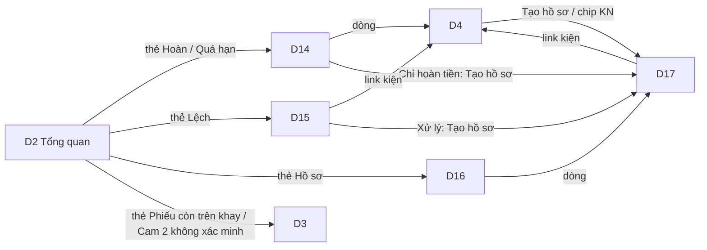

# FE Spec — 02 Hàng hoàn và đối soát · client: dashboard (web `/admin`)

| | |
|---|---|
| Tác giả | khanhtt (FE) |
| Reviewer | khanhtt (tech lead, review subagent ở bước 5) |
| Trạng thái | **Approved (G2 2026-10-05 có điều kiện, DEC-274)** · **v0.4** (lượt 3: R3-1, R3-9) · v0.2 (sửa review G2 lượt 1 — R-1, R-5, R-9, R-16, R-17, R-19, R-28, R-30; DEC-282) · **v0.3** (review G2 lượt 2: R2-4, R2-11 — DEC-264..273) |
| Tổng quan & contract | [02-tech-spec.md](02-tech-spec.md) · Màn: [01-srs.md §10.5](01-srs.md) (D14–D17 mới; D2, D3, D4, D6, D8, D13 mở rộng) · nền Phase 1 [item 01 02b-admin](../01-packing-mvp/02b-fe-spec-admin.md) · [Design system](../../../design-system/README.md) |
| Last update | 2026-10-06 · FE (T-151, T-152: DEC-341..) |

> **TL;DR** — 4 màn mới dưới `/admin`: D14 Hàng hoàn (`/admin/returns`), D15 Lệch trạng thái (`/admin/recon`), D16 / D17 Hồ sơ khiếu nại (`/admin/claims`, `/admin/claims/:id`); mở rộng D2, D3, D4 (khối Hàng hoàn, sửa kết luận, gắn đơn, điều chỉnh trạng thái, tạo hồ sơ, bỏ "Giữ clip"), D6 (loại station), D8 (sàn retention + xác nhận hạ + ngưỡng), D13 (Gọi quản lý từ phiên hoàn).
> Dữ liệu qua TanStack Query; WS-02 (`return.updated`, `recon.updated`, `claim.updated`, `evidence_pack.updated`) chỉ invalidate (DEC-20 item 01). Hồ sơ khiếu nại sửa bằng `version` (khóa lạc quan).
> Điểm khó: D17 (bằng chứng + trạng thái + gói zip bất đồng bộ + xung đột hai người sửa) và Dialog xác nhận hạ retention dùng số liệu server.
> 12 task T-151..T-162 (≈ 17,5 ngày công).

Không viết lại API — trỏ API-xx trong [02 §6](02-tech-spec.md#6-api-contract).

---

## 1. Phạm vi

| Goals (lát/spec này làm) | Non-goals (cố ý không làm — để đâu) |
|---|---|
| D14–D17 + mở rộng 6 màn theo 01 §10.5, guard theo ma trận 01 §5.10 | Gửi khiếu nại lên Shopee từ dashboard (02 Non-goals) |
| Không còn nút "Giữ clip" (FR-02.09); hiện "Đang được bảo vệ bởi KN-…" | Màn chi tiết hàng hoàn riêng — gộp vào D4 (DEC-216) |
| CSKH xem D15 chỉ đọc; xử lý chỉ ADMIN, SUPERVISOR | Báo cáo hàng hoàn / khiếu nại FR-09.02..04 → Phase 3 |
| Mọi danh sách có loading / empty / error / forbidden; dùng được từ 360px (bảng → card) | Thông báo ngoài dashboard (FR-06.04) |
| Badge drawer: Lệch (số HIGH đang mở), Hồ sơ (số sắp hết hạn) | Sửa kết luận phiên hoàn tại station (chỉ D4) |

| Màn / luồng | Route | FR / UC | REUSE / EXTEND / NEW |
|---|---|---|:---:|
| D14 Hàng hoàn | `/admin/returns?tab=&kind=&q=&from=&to=&page=` | FR-05.05, 05.11, 05.12, 04.13 / UC-05, UC-13 | NEW (`features/returns/ReturnsPage.tsx`) |
| D15 Lệch trạng thái | `/admin/recon?status=&severity=&rule=&from=&to=&page=` | FR-06.01..03, 05, 06 / UC-06 | NEW (`features/reconciliation/ReconPage.tsx`) |
| D16 Hồ sơ khiếu nại | `/admin/claims?status=&type=&counterparty=&owner=&due=&q=&page=` | FR-08.01, 08.03, 08.04 / UC-04 | NEW (`features/claims/ClaimsPage.tsx`) |
| D17 Chi tiết hồ sơ | `/admin/claims/:id` | FR-08.02..06 / UC-04, UC-12 | NEW (`features/claims/ClaimDetailPage.tsx`) |
| D2 Tổng quan | `/admin` | FR-09.01, 03.14, 08.04 | EXTEND `features/reports/DailyPage.tsx`, `KpiCard`, `AttentionList`, `StationStatusList` |
| D3 Tra cứu | `/admin/packages` | FR-07.01, 03.14 | EXTEND `PackagesPage.tsx`, `PackageFilters.tsx`, `filters.ts`, `PackageTable.tsx` |
| D4 Chi tiết đơn | `/admin/packages/:id` | FR-07.02, 04.11, 04.13, 06.05, 08.01, 02.09, 02.11 | EXTEND `PackageDetailPage.tsx`, `SessionPanel.tsx`; bỏ `HoldToggle.tsx` |
| D6 Station | `/admin/settings/stations/:id` | FR-01.01 | EXTEND `StationEditPage.tsx`, `StationsListPage.tsx` |
| D8 Lưu trữ và ngưỡng | `/admin/settings/storage` | FR-02.10, BR-12, 14, 27, DEC-214 | EXTEND `StoragePage.tsx`, `rules.ts` |
| D13 Yêu cầu duyệt | `/admin/approvals` | FR-03.12 | EXTEND `ApprovalCard.tsx`, `decision.ts` |

## 2. Điều hướng

Drawer (`features/shell/nav.ts`) thêm sau "Tra cứu đơn": "Hàng hoàn" (`assignment_return`, ADMIN/SUPERVISOR/CSKH), "Lệch trạng thái" (`rule`, ADMIN/SUPERVISOR/CSKH, `badge: "recon"`), "Hồ sơ khiếu nại" (`gavel`, ADMIN/SUPERVISOR/CSKH, `badge: "claims"`). Guard `RequireRole` như Phase 1; vai khác → D12.

## 3. Cây component

| Component | Mới / reuse (path) | Props / input chính | Ghi chú |
|---|---|---|---|
| `ReturnsPage` (D14) | NEW `features/returns/ReturnsPage.tsx` | URL params | `Tabs` có số (`tab_counts`), `ReturnFilters`, `ReturnTable` / card |
| `ReturnTable` | NEW | `items` | Cột 01 §10.5 D14; tab Chỉ hoàn tiền: nút "Tạo hồ sơ khiếu nại"; tab Chưa xác định: "Gắn đơn" (mở D4 + Dialog) |
| `ReturnCaseSection` | NEW `features/returns/ReturnCaseSection.tsx` | `returnCase`, `sessions`, `canLink`, `canCorrect` | Khối "Hàng hoàn" ở D4 |
| `InspectionView` | NEW `features/returns/InspectionView.tsx` | `inspection` | Bảng dòng chỉ đọc (`REFERENCE` → nhãn "Chỉ tham khảo") + kết luận + người kiểm + cờ "Tự đóng" + "Đã sửa {n} lần" mở lịch sử `corrections[]` (người, giờ, lý do, kết luận trước) |
| `CorrectInspectionDialog` | NEW `features/returns/CorrectInspectionDialog.tsx` | `session` | Dùng `src/shared/returns/inspection.ts` (BR-22 theo `lines_mode`) + `reason`; case một phiên: chữ "Áp cho cả {n} kiện của hồ sơ HH-…" |
| `LinkOrderDialog` | NEW `features/returns/LinkOrderDialog.tsx` | `returnCase` | Ô mã → API-30 xem trước (đơn > 1 kiện: chọn kiện bằng radio; đơn đã có hồ sơ hàng hoàn mở: chữ "Sẽ gộp vào HH-…") → API-112; `merged_claims` → toast "Đã gộp KN-… vào KN-…" |
| `ReconPage` (D15) | NEW `features/reconciliation/ReconPage.tsx` | URL params | `Tabs` trạng thái, lọc mức / quy tắc / ngày, bảng |
| `ResolveAlertDialog` | NEW `features/reconciliation/ResolveAlertDialog.tsx` | `alert` | `SegmentedButtons` 3 hành động; dùng `AdjustStatusForm`, `CreateClaimForm` |
| `AdjustStatusForm` | NEW `features/reconciliation/AdjustStatusForm.tsx` (dùng ở D4) | `packageId`, `allowedTargets`, `alertId?` | API-122 |
| `ClaimsPage` (D16) | NEW `features/claims/ClaimsPage.tsx` | URL params | Tab trạng thái (`status_counts`), lọc, bảng / card; "Tạo hồ sơ" |
| `CreateClaimDialog` | NEW `features/claims/CreateClaimDialog.tsx` | `packageId?`, `returnCaseId?`, `reconAlertId?`, `defaultType?` | API-131; `CLAIM_EXISTS` → nút "Mở hồ sơ" |
| `ClaimDetailPage` (D17) | NEW `features/claims/ClaimDetailPage.tsx` | `:id` | Header + `ClaimStatusStepper` + `ClaimInfoForm` + `EvidenceList` + `ClaimNotes` |
| `ClaimStatusStepper` | NEW | `status`, `allowedTransitions`, `onTransition` | Menu "Đổi trạng thái" + Dialog theo trạng thái đích (mã sàn / số tiền / lý do) |
| `EvidenceList` | NEW `features/claims/EvidenceList.tsx` | `evidence`, `otherSessions`, `missing`, `editable` | Bỏ / Thêm → API-134 (bỏ bằng chứng tự chọn → Dialog "Lý do bỏ" 5–500 bắt buộc — R-19); chọn phiên → `ClipPlayer` (REUSE `shared/media/ClipPlayer.tsx`) |
| `EvidencePackDialog` | NEW `features/claims/EvidencePackDialog.tsx` | `claimId` | API-136 → theo dõi API-137 / WS → tải API-138 (mẫu `ExportDialog` Phase 1) |
| `ClaimNotes` | NEW | `notes` | Dòng thời gian + ô thêm (API-135) |
| `SnapshotStrip` | REUSE `shared/media/SnapshotStrip.tsx` (từ 02b-station T-134) | `snapshots` | D4, D17 |
| `ProtectedChip` | NEW `features/orders/ProtectedChip.tsx` | `protection` (API-31) | Thay `HoldToggle` (xóa file). "Đang được giữ: hồ sơ khiếu nại KN-…" / "…: hàng hoàn HH-…" (link) / "…tới {until}" khi có hạn (hồ sơ "Chỉ hoàn tiền" 30 ngày; hồ sơ hàng hoàn đã nhận: 7 ngày sau khi nhận — DEC-268); không giữ → gợi ý "Muốn giữ clip? Tạo hồ sơ khiếu nại." (R-1) |
| `RetentionConfirmDialog` | NEW `features/settings/RetentionConfirmDialog.tsx` | `impact` (API-82 / `details.impact`) | 01 §10.5 D8 chữ |
| `KpiCard`, `AttentionList` | EXTEND | kind mới (gồm `RETURN_SESSION_ABANDONED`, `RETURN_FORCE_NEW` → D14 tab Chưa xác định) | D2; thẻ "Hoàn đã nhận" không đếm kiện tạm, thêm số `returns_unidentified` (v0.4) |
| `PackageTable` | EXTEND | `is_placeholder` | Chip "Kiện tạm" cho kiện của hàng hoàn chưa xác định |
| `NavBadge` | EXTEND `ApprovalBadge` → `NavBadge` | `kind: approvals \| recon \| claims` | Số từ API-32 (`recon_open.HIGH`, `claims_due_soon`) |

## 4. State & data fetching

| Dữ liệu | Nguồn (API-xx) | Nơi giữ state | Cache & làm mới | Optimistic? |
|---|---|---|---|:---:|
| Danh sách hàng hoàn | API-110 | Query `['returns', params]` | `keepPreviousData`; WS `return.updated` → invalidate `['returns']` (≤ 1 lần / 2 giây) | ✗ |
| Chi tiết kiện (gồm hàng hoàn, cảnh báo, hồ sơ) | API-31 | Query `['package', id]` (Phase 1) | WS `return.updated`, `recon.updated`, `claim.updated` → invalidate khi liên quan; sau API-112/113/122/131 | ✗ |
| Cảnh báo lệch | API-120 | Query `['recon', params]` | WS `recon.updated` → invalidate; poll 60 giây dự phòng (như approvals Phase 1) | ✗ |
| Danh sách hồ sơ | API-130 | Query `['claims', params]` | WS `claim.updated` → invalidate | ✗ |
| Chi tiết hồ sơ | API-132 | Query `['claim', id]` | WS `claim.updated` cùng id + `version` khác → invalidate + toast "Hồ sơ vừa được cập nhật." (nếu không phải do chính mình) | ✗ — PATCH chờ server (cần `version`) |
| Gói bằng chứng | API-136 → API-137 | `useEvidencePack(packId)` (Query poll 2 giây khi `QUEUED`/`RUNNING`) | WS `evidence_pack.updated` → `setQueryData` | — |
| Badge drawer | API-32 (`counts.recon_open.HIGH`, `claims_due_soon`) | Query `['daily', today]` (Phase 1) | WS `report.updated` (đã có, throttle 2 giây) | — |
| Cài đặt + tác động hạ | API-80, API-82 | Query `['settings']`; mutation PUT; API-82 gọi khi mở Dialog (không cache) | — | ✗ |
| Ảnh | URL ký trong API-31 / 132 | trong dữ liệu query | `` (403) → invalidate query nguồn một lần | — |

`useDashboardSocket` (Phase 1, `features/shell/`) thêm 4 loại sự kiện; lần `open` thứ 2 trở đi invalidate thêm `['returns']`, `['recon']`, `['claims']` (như DEC-174 item 01).

## 5. Form & validate

| Form | Field | Rule client | Lỗi server map vào field |
|---|---|---|---|
| D4 Gắn đơn | `code` | trim, upper, ≥ 6; xem trước bằng API-30 (`q`) — 0 kết quả → "Không tìm thấy đơn." | `PACKAGE_ALREADY_RETURNED`, `NOT_ELIGIBLE`, `NOT_UNIDENTIFIED` → Alert `message` |
| D4 Sửa kết luận | dòng, `conclusion`, `note`, `reason` | BR-22 (`canBeOk`); `reason` 5–500 bắt buộc | `VALIDATION_ERROR.fields.*`, `CONCLUSION_INCONSISTENT`, `CORRECTION_WINDOW_EXPIRED` |
| D4 / D15 Điều chỉnh trạng thái | `to_status` (chỉ `allowed_status_targets`), `reason` 5–500 | bắt buộc | `TRANSITION_NOT_ALLOWED` → tải lại, cập nhật danh sách; `SESSION_ACTIVE` → Alert |
| D15 Đánh dấu đã xử lý | `note` 1–500 | bắt buộc | `ALREADY_RESOLVED` → Alert theo `details` |
| Tạo hồ sơ | `type`, `counterparty`, `note` ≤ 1000 | type mặc định theo ngữ cảnh (kết luận / "Khách báo thiếu / sai" ở D4 / "Thất lạc" + ĐVVC ở D15 BR-12, 19) | `CLAIM_EXISTS` → Alert + "Mở hồ sơ" |
| D17 Đổi trạng thái | `platform_claim_ref` 1–64 (SUBMITTED, hoặc `reason`), `recovered_amount` số nguyên ≥ 0 đ (WON), `reason` 5–500 (CLOSED sớm) | theo trạng thái đích | `VALIDATION_ERROR.fields`, `INVALID_TRANSITION`, `VERSION_CONFLICT` |
| D17 Phụ trách / hạn | `owner_user_id` (danh sách từ API-90 lọc vai, chỉ ADMIN đọc được → CSKH / SUPERVISOR chỉ "Nhận phụ trách" = chính mình), `deadline_at` (ngày giờ VN → `Z`) | — | như trên |
| D17 Ghi chú | `text` 1–1000 | bắt buộc | `fields.text` |
| D8 Ngưỡng | 6 trường số theo 02 API-80; `retention_clip_days ≥ retention_clip_min_days` | khoảng 1–60 / 1–168 / 1–90 / 1–168 / 1–1440; `return_abandon > return_warn` | `RETENTION_BELOW_MINIMUM` → lỗi dưới ô; `RETENTION_REDUCTION_UNCONFIRMED` → mở `RetentionConfirmDialog` với `details.impact` → "Giảm và lưu" gửi lại `confirm_reduction: true` |
| D6 Loại station | `kind` | bắt buộc | `STATION_BUSY` → "Station đang có phiên mở. Thử lại khi station rảnh." |

## 6. Trạng thái UI

| Màn | Loading | Empty | Error | Forbidden | Success |
|---|---|---|---|---|---|
| D14 | Skeleton 8 dòng; tab giữ số cũ | Theo tab (01 §10.5 D14) + "Xóa bộ lọc" khi đang lọc | Alert + "Thử lại" | D12 (STATION) | Bảng / card |
| D15 | Skeleton | "Không có lệch trạng thái nào đang mở." | Alert + "Thử lại" | D12 | Bảng; CSKH không có nút Xử lý |
| D15 Dialog | Nút xoay | — | Alert trong Dialog (`ALREADY_RESOLVED` khóa nút) | — | Toast "Đã xử lý cảnh báo." + dòng chuyển tab |
| D16 | Skeleton | "Chưa có hồ sơ khiếu nại." + "Tạo hồ sơ" | Alert + "Thử lại" | D12 | Bảng; hạn đỏ ≤ 48 giờ, "Quá hạn" |
| D17 | Skeleton header + 3 khối | Bằng chứng rỗng: "Hồ sơ chưa có bằng chứng." + "Thêm phiên" | 404 → EmptyState "Không tìm thấy hồ sơ." + về D16; lỗi khác Alert | D12 | Hồ sơ `CLOSED` → chỉ xem (trừ ghi chú, xuất gói) |
| D17 gói zip | `LinearProgress` % | — | `FAILED` → Alert + "Thử lại"; `PACK_IN_PROGRESS` → theo dõi gói đang chạy | — | "Tải gói bằng chứng (.zip)" + hạn 24 giờ |
| D4 khối Hàng hoàn | Trong skeleton D4 | Không có hồ sơ hàng hoàn → không hiện khối | — | — | Khối + nút theo quyền |
| D8 Dialog xác nhận | LinearProgress khi gọi API-82 | — | API-82 lỗi → "Không tính được số clip bị ảnh hưởng. Thử lại." (khóa "Giảm và lưu") | — | Toast "Đã lưu cài đặt." |
| D2 thẻ mới | Như Phase 1 | 0 | Như Phase 1 | — | Bấm → màn lọc sẵn |

## 7. Phân quyền trên UI

| Hành động / màn | Role thấy | Cách xử lý khi không quyền |
|---|---|---|
| D14, D16, D17, D4 khối Hàng hoàn | ADMIN, SUPERVISOR, CSKH | Ẩn drawer; route → D12 |
| D15 xem | ADMIN, SUPERVISOR, CSKH | — |
| D15 "Xử lý", D4 "Điều chỉnh trạng thái", "Gắn đơn", "Sửa kết luận" | ADMIN, SUPERVISOR (`permissions`: `recon.resolve`, `warehouse_status.adjust`, `returns.link`, `inspection.correct`) | Ẩn nút; server 403 → toast "Tài khoản không có quyền…" |
| Tạo / sửa hồ sơ, xuất gói | ADMIN, SUPERVISOR, CSKH (`claims.manage`) | — |
| Chọn người phụ trách khác | ADMIN (đọc được API-90) | SUPERVISOR / CSKH chỉ "Nhận phụ trách" |
| D8 sửa | ADMIN | SUPERVISOR xem, form khóa (như Phase 1) |
| "Giữ clip" | Không còn trên UI (API-42 chỉ ADMIN, dùng khẩn cấp qua API) | — |

## 8. Xử lý lỗi API

| Mã lỗi (từ 02) | Hiển thị | Hành động (retry / về trang / đăng nhập lại) |
|---|---|---|
| `CLAIM_EXISTS` | Alert "Kiện này đã có hồ sơ … đang mở: KN-…" | Nút "Mở hồ sơ" → D17 `details.claim_id` |
| `VERSION_CONFLICT` | Toast "Hồ sơ vừa được {người} cập nhật. Đã tải lại." | `setQueryData(details.current)`; giữ form mở với giá trị người dùng nhập |
| `INVALID_TRANSITION`, `CLAIM_CLOSED` | Alert `message` | Invalidate `['claim', id]` |
| `PACK_IN_PROGRESS` | — | Theo dõi `details.pack_id` |
| `NO_EVIDENCE` | Alert "Hồ sơ chưa có bằng chứng." | — |
| `ALREADY_RESOLVED` | "Cảnh báo này đã được {resolved_by} xử lý lúc {giờ}." / "…đã tự hết lúc {giờ}." | Invalidate `['recon']` |
| `TRANSITION_NOT_ALLOWED` | Alert + danh sách mới từ `details.allowed` | Invalidate `['package', id]` |
| `RECON_IN_PROGRESS` | Toast "Đối soát đang chạy." | — |
| `NOT_UNIDENTIFIED`, `PACKAGE_ALREADY_RETURNED`, `NOT_ELIGIBLE` | Alert `message` | Invalidate |
| `CORRECTION_WINDOW_EXPIRED` | "Đã quá 7 ngày, không sửa được." | Ẩn nút |
| `RETENTION_BELOW_MINIMUM` | Lỗi dưới ô "Số ngày giữ clip không được thấp hơn {min}." | — |
| `RETENTION_REDUCTION_UNCONFIRMED` | `RetentionConfirmDialog` | Gửi lại có `confirm_reduction` |
| `STATION_BUSY` | Alert dưới form D6 | — |
| `SNAPSHOT_DELETED` (410 ở ``) | Ô "Ảnh đã bị xóa" | — |
| 403 FORBIDDEN (API-42 với SUPERVISOR/CSKH nếu client cũ còn gọi) | Toast | Bỏ nút (đã gỡ) |
| Lỗi chung | Như Phase 1 | Như Phase 1 |

## 9. Nội dung chữ · i18n · a11y · responsive

- Chữ trong `copy.ts` từng feature (`returns/copy.ts`, `reconciliation/copy.ts`, `claims/copy.ts`) — nguyên văn 01 §10.5; nhãn enum (loại hoàn, trạng thái hồ sơ hàng hoàn, kết luận, quy tắc, mức, loại / trạng thái / bên nhận hồ sơ, `warehouse_status` mới) trong `src/shared/returns/labels.ts` + `src/lib/labels.ts` (Phase 1). Quy tắc hiện chữ có số cấu hình ("quá {N} ngày") lấy N từ API-80.
- Tiền VND: `Intl.NumberFormat('vi-VN')` + "đ"; giờ: `dd/MM/yyyy HH:mm` giờ Việt Nam; hạn "còn 2 ngày" / "Quá hạn 5 giờ".
- a11y: `ClaimStatusStepper` dùng `ol` có `aria-current="step"`; Dialog bẫy focus (component Phase 1); badge drawer như DEC-174 item 01 (`sr-only`); bảng có `caption` ẩn.
- Responsive: < 840px bảng D14 / D15 / D16 thành card; D17 bố cục 1 cột (bằng chứng trước, ghi chú sau); không cuộn ngang ở 360px.

## 10. Riêng nền tảng

Web: Chromium ≥ 120, Safari ≥ 17, Firefox ≥ 120 (như Phase 1). Tải zip bằng link ký (`<a download>`), không qua `api.blob` (file có thể > 100 MB). Mỗi feature mới lazy-load theo route; D2 bundle vẫn ≤ 300 KB gzip.

## 11. Analytics & theo dõi lỗi

N/A — như Phase 1 (DEC-23 item 01).

## 12. Mock khi BE chưa xong

- Handler MSW mới: `src/mocks/handlers/{returns,recon,claims}.ts`; mở rộng `packages.ts` (API-30/31 mở rộng, API-122), `reports.ts` (API-32 counts / attention), `settings.ts` (API-80 409 / 422, API-82), `stations.ts` (`kind`, `STATION_BUSY`), `approvals.ts` (`session_type`), `clips.ts` (API-42 403 khi không phải ADMIN).
- Dữ liệu: `src/mocks/returnsDb.ts` (dùng chung station) — 6 hồ sơ hàng hoàn mỗi loại / trạng thái, 7 cảnh báo (mỗi quy tắc), 5 hồ sơ khiếu nại (đủ trạng thái, 1 `LEGACY_HOLD`, 1 sắp hết hạn); gói zip mock chạy tiến độ 0 → 100 trong 4 giây rồi trả file nhỏ `public/mock/KN-000124.zip`. WS mock (`src/mocks/ws.ts`) phát 4 sự kiện mới.

## 13. Test FE

| Mức | Phạm vi | Case chính (TC-xx) |
|---|---|---|
| Unit | `filters` URL D14 / D15 / D16 (parse / serialize), `labels`, tính hạn ("còn / quá"), `allowedTransitions` hiển thị, BR-22 dùng chung | AC-27, AC-37 |
| Component | `ResolveAlertDialog` (3 hành động, xung đột), `ClaimStatusStepper` (Dialog theo đích, bắt buộc trường), `EvidenceList` (bỏ / thêm, phiên thiếu clip), `RetentionConfirmDialog`, `ProtectedChip`, `CorrectInspectionDialog` | AC-26, AC-28 |
| Integration (MSW) | D14 tab + lọc → D4 khối hàng hoàn → Gắn đơn; D15 xử lý + `ALREADY_RESOLVED`; D17 đi đủ trạng thái + `VERSION_CONFLICT` + gói zip; D8 hạ retention → 409 → xác nhận; quyền 3 vai (CSKH không thấy nút Xử lý) | AC-25, 27, 28, 35, 37 |
| E2E mock | `e2e/mock/claims.spec.ts`, `recon.spec.ts`, `returns.spec.ts` | UC-04, UC-06, UC-13 |
| E2E BE thật | `e2e/real/claims.spec.ts`: sau E2E station UC-02 → D16 có hồ sơ → D17 xuất gói → tải zip, kiểm có `ho-so.json`; `recon.spec.ts` với `POST /recon/run` + dữ liệu `seed-demo` | AC-06, 07, 25, 27 |

## 14. Task

| # | Việc | Màn / FR | Phụ thuộc (API-xx) | Ước lượng |
|---|---|---|---|---|
| T-151 | API client `lib/api/{returns,recon,claims}.ts` + mở rộng `packages.ts`, `reports.ts`, `settings.ts`, `stations.ts`, `approvals.ts`, `clips.ts`; `src/shared/returns/labels.ts`; MSW handlers + `returnsDb.ts` | nền | 02 §6 (mock) | 2 |
| T-152 | Route + drawer + `NavBadge` (recon, claims) + `useDashboardSocket` 4 sự kiện mới | nav / FR-10.02 | API-32, WS-02 | 1 |
| T-153 | D14 Hàng hoàn: tab (số), lọc URL, bảng / card, hành động theo tab | D14 / FR-05.05, 05.11, 05.12 | API-110 | 1,5 |
| T-154 | D4 mở rộng hiển thị: `ReturnCaseSection`, `InspectionView` (lịch sử sửa), ảnh + ảnh lúc đóng gói (`SnapshotStrip`), cảnh báo của kiện, chip hồ sơ, `ProtectedChip` (`protection`) thay `HoldToggle`, phiên có chip "Mở hoàn"; `CreateClaimDialog` | D4 / FR-07.02, 02.06, 02.09, 02.11, 08.01 | API-31, 131; **T-134** (`SnapshotStrip` của 02b-station) | 2 |
| T-155 | D4 hành động: `LinkOrderDialog` (API-30 xem trước + API-112), `CorrectInspectionDialog` (API-113), `AdjustStatusForm` (API-122) | D4 / FR-04.11, 04.13, 06.05 | API-30, 112, 113, 122 | 1,5 |
| T-156 | D15 Lệch trạng thái + `ResolveAlertDialog` (resolve / điều chỉnh / tạo hồ sơ) | D15 / FR-06.01..03, 05 | API-120, 121, 122, 131 | 1,5 |
| T-157 | D16 danh sách hồ sơ (tab số, lọc, "Của tôi", sắp hết hạn) + "Tạo hồ sơ" | D16 / FR-08.01, 08.03, 08.04 | API-130, 131 | 1 |
| T-158 | D17 chi tiết: header, `ClaimStatusStepper` + Dialog, phụ trách / hạn / mã sàn, `EvidenceList` (API-134, `ClipPlayer`), `ClaimNotes`, `VERSION_CONFLICT` | D17 / FR-08.02, 08.03, 08.06 | API-132..135 | 2 |
| T-159 | `EvidencePackDialog`: tạo, tiến độ (poll + WS), tải, lỗi | D17 / FR-08.05 | API-136..138 | 1 |
| T-160 | D2 thẻ + attention mới; D3 lọc hoàn / loại phiên / cờ + chip; D6 loại station; D13 thẻ phiên hoàn (action CONTINUE / CANCEL_SESSION) | D2, D3, D6, D13 / FR-09.01, 07.01, 01.01, 03.14 | API-32, 30, 60, 20, 21 | 1,5 |
| T-161 | D8: 6 ngưỡng, chữ sàn tối thiểu, `RetentionConfirmDialog` (API-82 + 409) | D8 / FR-02.10 | API-80, 82 | 1 |
| T-162 | Test component / integration, E2E mock 3 bộ, E2E BE thật hồ sơ + đối soát | — | BE T-110..T-115 cho E2E thật | 1,5 |

Tổng ≈ 17,5 ngày công.

## Phương án đã cân nhắc

| Phương án | Ưu | Nhược | Chọn? (lý do) |
|---|---|---|---|
| Feature mới `features/returns/`, `reconciliation/`, `claims/` (architecture §5.1) | Đúng bố cục đã chốt; lazy-load riêng | Thêm thư mục | ✔ (DEC-240) |
| Gộp vào `features/orders/` | Ít thư mục | `orders` phình, khó lazy-load | ✗ |
| PATCH hồ sơ chờ server (không optimistic) + `version` | Không hiện trạng thái sai khi hai người sửa | Chậm hơn ~200 ms | ✔ (DEC-241) |
| Optimistic update hồ sơ | Nhanh | Rollback phức tạp với `VERSION_CONFLICT` | ✗ |
| Badge drawer lấy từ API-32 đã có | Không thêm request; realtime qua `report.updated` | Badge chỉ cập nhật theo nhịp D2 (≤ 2 giây) | ✔ (DEC-243) |
| Query riêng API-120 / 130 cho badge | Số chính xác tức thì | Thêm 2 request mỗi trang | ✗ |
| Xóa `HoldToggle`, thay `ProtectedChip` | Đúng FR-02.09, ADR-009 | CSKH mất nút quen thuộc → hướng dẫn "Tạo hồ sơ khiếu nại" | ✔ (DEC-242) |

## Rủi ro & câu hỏi mở

| ID | Rủi ro / câu hỏi | Ảnh hưởng | Giảm thiểu / ai trả lời | Hạn |
|---|---|---|---|---|
| RF-21 | D17 nhiều khối, dễ rối với CSKH | Dùng sai trạng thái | Chỉ hiện bước hợp lệ (`allowed_transitions`); chữ hướng dẫn trong Dialog | T-158 |
| RF-22 | Zip lớn (2 phiên × 3 phút × 2 camera + MP4 ghép ≈ 150 MB) tải chậm qua LAN yếu | Tải lâu | Hiện dung lượng trước khi tải; link 10 phút gọi lại API-137 khi hết hạn | T-159 |
| RF-23 | CSKH quen nút "Giữ clip" | Không biết cách bảo vệ clip | D4 chữ gợi ý cạnh danh sách phiên: "Muốn giữ clip? Tạo hồ sơ khiếu nại."; tài liệu nghiệp vụ lát | T-154 |

## Decisions

| DEC | Bối cảnh | Lựa chọn | Lý do | Người chốt |
|---|---|---|---|---|
| DEC-240 | Vị trí code màn mới | `features/returns/`, `features/reconciliation/`, `features/claims/`; logic dùng chung `src/shared/returns/` | Theo architecture §5.1; lazy-load theo route | khanhtt (FE, tự quyết theo ủy quyền user) |
| DEC-241 | Cập nhật hồ sơ khiếu nại | Chờ server + `version`; `VERSION_CONFLICT` → thay dữ liệu, giữ giá trị đang nhập | Hai CSKH có thể cùng mở hồ sơ | khanhtt (tự quyết) |
| DEC-242 | Nút "Giữ clip" ở D4 | Gỡ; thay `ProtectedChip` + gợi ý "Tạo hồ sơ khiếu nại" | FR-02.09, ADR-009; API-42 chỉ ADMIN | khanhtt (tự quyết) |
| DEC-282 | Review G2 lượt 1 phần dashboard (đổi số từ DEC-244 — trùng 01, R2-11) | `ProtectedChip` theo `protection` (hồ sơ khiếu nại + hàng hoàn), chọn kiện + gộp khi gắn đơn, lý do khi bỏ bằng chứng tự chọn, lịch sử sửa kết luận, `lines_mode`, chip kiện tạm, attention phiên hoàn bỏ dở; T-154 phụ thuộc T-134 | Theo 02 §6.3 | khanhtt (FE, tự quyết theo ủy quyền user) |
| DEC-243 | Nguồn số cho badge drawer | API-32 (`recon_open.HIGH`, `claims_due_soon`) qua query `['daily', today]` sẵn có | Không thêm request; đã realtime | khanhtt (tự quyết) |
| DEC-341 | T-151 API client + MSW (§12) | Client `lib/api/{returns,recon,claims}.ts` + mở rộng `packages` (API-30/31, API-122), `reports` (`ReturnCounts`, `ReturnAttentionItem`), `settings` (`SettingsPutBody`, API-82), `stations` (`kind`), `approvals` (`session_type`, `actionsFor`), `auth` (`hasPermission`), `session` (`/me` station `kind`/`work_mode`). Trường item 02 trong kiểu Phase 1 để **tùy chọn** (BE chưa có tới T-115) — kiểu mới hoàn toàn thì bắt buộc. Mock: `returnsDb.ts` thêm 7 hồ sơ khiếu nại (đủ 6 trạng thái, 1 `LEGACY_HOLD`, 1 sắp hạn, 1 quá hạn), 9 cảnh báo (7 quy tắc mở + 1 đã xử lý + 1 tự hết), gói zip chạy 0 → 100 trong 4 giây (`public/mock/KN-000124.zip`, bị xóa khỏi `dist`); handler mới trả JSON qua `json()` (tránh kiểu generic MSW làm `tsc` chậm). Mục "Cần xử lý" mới chưa vào `ATTENTION_KINDS` (D2 bỏ qua tới T-160). Đối chiếu BE M6 thật (ai-cam-be T-102, T-106): API-122 `details {from, allowed}`, API-100 `MODE_NOT_ALLOWED details.kind`, API-101 gộp khoảng trắng, `/me` station `kind`/`work_mode` — mock đã khớp; API-10 chưa có `today_return_count` (BE T-107). Test Phase 1 "Giữ clip" chuyển sang ADMIN (API-42 chỉ ADMIN — DEC-209) tới khi T-154 gỡ nút | Một nguồn dữ liệu mock chung station + dashboard; khớp contract đã chạy ở BE | khanhtt (FE, tự quyết theo ủy quyền user) |
| DEC-342 | T-152 drawer / route khi D14–D17 chưa có màn | Mục "Hàng hoàn", "Lệch trạng thái" (`badge: recon`), "Hồ sơ khiếu nại" (`badge: claims`) khai báo trong `nav.ts` đúng thứ tự + vai (ADMIN, SUPERVISOR, CSKH) nhưng gắn `screen` D14/D15/D16 và chỉ hiện khi màn có trong `READY_SCREENS` (rỗng ở M6); route `/admin/returns`, `/admin/recon`, `/admin/claims(/:id)` đăng ký cùng trang ở T-153 / T-156 / T-157 / T-158 (bật `READY_SCREENS` cùng lúc). `ApprovalBadge` → `features/shell/NavBadge.tsx` (`approvals` \| `recon` \| `claims`, số Lệch / Hồ sơ từ query `['daily', today]`). `useDashboardSocket` thêm 4 sự kiện (`return.updated` throttle 2 giây; `evidence_pack.updated` → `setQueryData(['evidence-pack', id])`); nối lại WS làm mới thêm D14–D16 | Brief điều phối + DEC-51: không đưa route tạm / mục không có màn vào menu; M6 demo "drawer mới" vì vậy chưa thấy mục mới — có ở M8 / M9 | khanhtt (FE, tự quyết theo ủy quyền user) |
| DEC-343 | T-154 D4 hiển thị item 02 khi BE M8 chưa có phần API-31 mở rộng (T-115 ở M9) | (a) `ProtectedChip` đọc `clips[].protection` của phiên đang chọn (gộp mọi clip chưa xóa: lý do hợp, `until` = null nếu có lý do vô hạn, ngược lại hạn muộn nhất) + `sessions[].protected_by_claims` để có id link D17; lý do `HELD` (API-42 ADMIN khẩn cấp) → chip "Đang được giữ: Admin giữ clip"; không có lý do mà còn clip → gợi ý "Muốn giữ clip? Tạo hồ sơ khiếu nại." ngay dưới chip phiên (RF-23). Xóa `HoldToggle.tsx` + chữ / test "Giữ clip"; E2E mock UC-03 kiểm TC-02.36, E2E thật `admin-uc03` thêm bước TC-02.36 (spec này không giữ clip — không có bước CSKH giữ clip để đổi). (b) Khối Hàng hoàn lấy phần như API-110 từ `return_cases[]` + gọi API-111 (`['returns','detail',id]`, `return.updated` invalidate qua tiền tố `['returns']`) cho mã yêu cầu, lý do của khách, hạn phản hồi; phiên của khối = `sessions[]` có `return_case_id` của hồ sơ (thiếu → mọi phiên RETURN). Phiên RETURN `COMPLETED` hiện "Đã kiểm xong" thay "Đã đóng gói"; danh sách phiên có chip loại "Mở hoàn" / "Đóng gói". (c) Link sang màn chưa có (D15, D17) chỉ hiện khi màn trong `READY_SCREENS` (`screenReady`, thêm `D17`) — DEC-51; `CreateClaimDialog` tạo xong toast "Đã tạo hồ sơ KN-…" + mở D17 khi D17 có (T-158). (d) Tên quy tắc ở "Cảnh báo lệch" lấy ngưỡng API-80 khi vai đọc được cài đặt (ADMIN, SUPERVISOR), CSKH dùng mặc định 7 ngày / 24 giờ. (e) Ảnh lúc đóng gói / ảnh phiên hoàn lỗi tải (URL ký hết hạn) → tải lại API-31 một lần. (f) `SnapshotStrip` nhận `url: null` (ảnh đã xóa, API-132 `EvidenceSnapshot`) → ô "Ảnh đã bị xóa". (g) Mock khớp BE M8 thật (`ai-cam-be` T-110..T-112, openapi + code): chuyển `SUBMITTED → WAITING / WON / LOST / CLOSED`; API-133 không đổi → không tăng `version`, ghi chú `STATUS_CHANGE` chữ như BE ("Mới → Đã gửi.", "Mã khiếu nại bên sàn: …"), `SUBMITTED` / `WON` nhận mã / số tiền đã có, `reason` < 5 → 422; `VERSION_CONFLICT.details` chỉ `current`; API-135 không tăng `version`; API-134 ghi chú "Cập nhật bằng chứng: thêm n, bỏ m. Lý do: …"; API-131 `return_case_id` không chứa kiện → 422; API-137 quá 24 giờ → 404; API-112 kiện tạm / chưa gắn đơn → `409 NOT_ELIGIBLE`; ảnh bằng chứng đã xóa `url = null`; `deadline_source` nullable, `missing[].snapshot_id`. Còn mock (BE chưa có): API-31 `return_cases` / `recon_alerts` / `claims` / `allowed_status_targets` / `sessions[].type, inspection, snapshots, pack_snapshot, can_correct` (T-115, M9), API-113 (T-115) | Hiện đủ D4 theo 01 §10.5 ngay khi BE trả trường; trường thiếu thì khối ẩn, không vỡ | khanhtt (FE, tự quyết theo ủy quyền user) |
| DEC-344 | T-155 D4 hành động | (a) "Điều chỉnh trạng thái" là nút viền (icon `tune`) cạnh "Tạo hồ sơ khiếu nại" thay menu ⋮ (D4 chỉ có một mục phụ — menu một mục thừa một lần bấm); ẩn khi không có quyền `warehouse_status.adjust` hoặc `allowed_status_targets` rỗng (01 §10.5). `AdjustStatusForm` (`features/reconciliation/`, dùng lại ở D15) là form trong `Dialog`: trạng thái hiện tại → radio đích → "Lý do" 5–500 → "Xác nhận"; `TRANSITION_NOT_ALLOWED` thay danh sách bằng `details.allowed` + tải lại kiện, `SESSION_ACTIVE` / lỗi khác → Alert `message`. (b) `LinkOrderDialog`: mã trim + upper, < 6 ký tự → "Nhập ít nhất 6 ký tự." (02b §5); xem trước bằng API-30 `q` (bỏ kiện tạm); 1 kiện → khung "Đơn tìm được", > 1 → radio; kiện có `return_case` đang mở khác hồ sơ này → chip "Sẽ gộp vào HH-…" (cần API-30 `return_case` — BE T-115, M9; tới lúc đó BE thật không hiện chip gộp nhưng API-112 vẫn gộp đúng). Xong → toast "Đã gắn đơn {mã đơn}." + mỗi `merged_claims` một toast "Đã gộp KN-… vào KN-…", mở D4 kiện đích (kiện tạm đã xóa). `PACKAGE_ALREADY_RETURNED` → "Đơn này đã có kiện hoàn được nhận."; `NOT_UNIDENTIFIED` / `NOT_ELIGIBLE` → Alert `message` + invalidate. (c) `CorrectInspectionDialog` gọn cho dashboard (ô số + select tình trạng, radio kết luận) thay vì dùng `InspectionTable` / `ConclusionPicker` cỡ kiosk của station; luật dùng chung `canBeOk` / `INSPECTION_LIMITS` (DEC-236); `REFERENCE` gửi `lines: []`; hồ sơ > 1 kiện → "Áp cho cả {n} kiện của hồ sơ HH-…". Nút "Sửa kết luận" theo `sessions[].can_correct` + quyền `inspection.correct`; phiên `COMPLETED` không sửa được → chữ "Đã quá 7 ngày, không sửa được.". API-113 chạy trên mock tới BE T-115 (M9) | Đúng 01 §10.5 D4 / 02b §5, §8; tránh kéo component kiosk 56px vào Dialog dashboard | khanhtt (FE, tự quyết theo ủy quyền user) |
| DEC-345 | T-157 D16 | (a) Tab mặc định "Mới" (tab đầu, như D14 mở "Đang về"); tab ghi số `status_counts` ("Mới 4"), "Tất cả" không số; tab / lọc / trang ở URL (`status` bỏ khi là mặc định). (b) Lọc: ô mã (Enter / "Tìm" / máy quét — `useScanListener` như D3), select Loại / Bên nhận / Hạn (Sắp hết hạn → `due=soon`, Quá hạn → `due=overdue`), ô chọn "Của tôi" → `owner=me` (lọc người khác chỉ ADMIN cần — để sau, API-90 chỉ ADMIN); đổi select áp ngay. (c) Hạn: "08/10 17:00 · còn 2 ngày", đỏ khi `due_soon` / quá hạn (cờ server, ngưỡng `claim_due_soon_hours`), hồ sơ Thắng / Thua / Đóng chỉ hiện ngày (`Deadline`, dùng lại ở D17). (d) "Tạo hồ sơ" mở `CreateClaimDialog` không có kiện → ô "Mã vận đơn hoặc mã đơn" (API-30) → radio chọn kiện. (e) Bật `READY_SCREENS` D16 + route `/admin/claims` (drawer hiện "Hồ sơ khiếu nại" kèm badge — DEC-342); mã hồ sơ thành link D17 khi D17 có (T-158). Mock + BE thật API-130 cùng dạng (openapi `ClaimPage`), không phải sửa | Theo 01 §10.5 D16, 02b §1, §4, §6 | khanhtt (FE, tự quyết theo ủy quyền user) |
| DEC-346 | T-158 D17 | (a) Bố cục: header (mã · loại · "gửi Sàn / ĐVVC" + chip trạng thái) + `ClaimSteps` (`ol`, `aria-current="step"`, bước 4 hiện "Thắng" / "Thua" khi đã có kết quả) + "Đổi trạng thái" (menu `role=menu` chỉ `allowed_transitions`); khối thông tin (đơn, kiện link D4, hàng hoàn, phụ trách, hạn, mã tham chiếu sàn, số tiền, lý do đóng); lưới 2 cột ≥ lg (Bằng chứng 3/5, Ghi chú 2/5), 1 cột dưới lg (bằng chứng trước — 02b §9). (b) Dialog theo đích: Đã gửi = mã tham chiếu (≤ 64) hoặc "Ghi chú (khi không có mã)"; Thắng = "Số tiền thu hồi (đ)" số nguyên ≥ 0; Đóng = cảnh báo xóa theo thời hạn lưu + "Lý do" bắt buộc khi từ Mới / Đã gửi / Đang chờ; Đang chờ / Thua: ghi chú tùy chọn (gửi `reason`, BE ghi vào ghi chú). Mã tham chiếu sàn sửa riêng ("Lưu mã"), hạn sửa bằng `datetime-local` giờ Việt Nam → `Z` ("Lưu hạn"). (c) Phụ trách: mọi vai có "Nhận phụ trách" (chính mình); ADMIN thêm select người phụ trách (API-90 `usersApi.all`, lọc ADMIN / SUPERVISOR / CSKH đang hoạt động) + "Giao". (d) `useClaimMutation`: chờ server, thành công ghi thẳng `['claim', id]` + toast "Đã cập nhật hồ sơ." + làm mới D16 / D4 / D2; `VERSION_CONFLICT` → `setQueryData(details.current)` + toast "Hồ sơ vừa được {người} cập nhật. Đã tải lại." — người = tác giả ghi chú gần nhất của bản mới (BE chỉ trả `details.current`, không có người sửa); Dialog / form giữ giá trị đang nhập, gửi lại dùng `version` mới. `INVALID_TRANSITION` / `CLAIM_CLOSED` → Alert `message` + tải lại. (e) `version` do chính mình ghi lưu trong `ownClaimVersions` → WS `claim.updated` tải lại bản của người khác mới toast "Hồ sơ vừa được cập nhật.". (f) `EvidenceList`: dòng phiên (loại + giờ, station, người kiểm, thời lượng, "Cam 2 khớp mã", cờ, "Tự chọn", clip đã xóa ngày …) + ▶ (IconButton `aria-pressed`) chọn phiên cho `ClipPlayer` + "Bỏ" (tự chọn → Dialog "Lý do bỏ" 5–500); phiên khác của kiện + "Thêm"; `missing` thành chip cảnh báo; ảnh bằng chứng là `SnapshotStrip` (bỏ / thêm ảnh lẻ chưa làm — API-134 hỗ trợ `snapshot_ids`, UI giữ nguyên tập ảnh khi sửa phiên). (g) Hồ sơ Đóng: Alert "Hồ sơ đã đóng — chỉ xem…", ẩn mọi nút sửa, vẫn ghi chú (+ xuất gói ở T-159). Bật `READY_SCREENS` D17 + route `/admin/claims/:id` → link D17 ở D4 / D16 / chip bảo vệ, `CreateClaimDialog` mở D17 sau khi tạo | Theo 01 §10.5 D17, 02b §4–§9, DEC-241 | khanhtt (FE, tự quyết theo ủy quyền user) |
| DEC-347 | T-159 `EvidencePackDialog` + E2E M8 | (a) Nút "Xuất gói bằng chứng" luôn có ở header D17 (cả hồ sơ Đóng — 01 §10.5); Dialog "Gói gồm: clip gốc, video ghép có chữ cho {n} phiên chính, {m} ảnh, file thông tin." với n = số phiên bằng chứng, m = số ảnh bằng chứng của hồ sơ → "Tạo gói" (API-136) → `LinearProgress` % (poll API-137 2 giây khi `QUEUED`/`RUNNING` — `packPoll.ms`; WS `evidence_pack.updated` ghi thẳng `['evidence-pack', id]`) → sẵn sàng: dung lượng, SHA-256 rút gọn, "File giữ tới …", phần thiếu (`missing[]` theo camera + giờ phiên + lý do tiếng Việt) và "Tải gói bằng chứng (.zip)". (b) Tải: gọi lại API-137 ngay khi bấm để có link ký mới (hạn 10 phút — RF-22) rồi `shared/download.ts` `downloadUrl` (`<a download>`, không qua blob — file có thể > 100 MB, 02b §10); tên file `KN-….zip`. (c) `packId` giữ ở D17 theo hồ sơ → đóng / mở lại Dialog tiếp tục theo dõi, không tạo gói mới. (d) Lỗi: `FAILED` → "Không tạo được gói bằng chứng. Bấm Thử lại; nếu vẫn lỗi, báo Admin kèm mã hồ sơ." + "Thử lại" (tạo gói mới); `PACK_IN_PROGRESS` có `details.pack_id` → theo dõi gói đó, `pack_id` null (gói của người khác — API-137 chỉ người tạo / ADMIN) → "Hồ sơ đang có gói bằng chứng do người khác tạo. Thử lại sau ít phút."; `NO_EVIDENCE` / hồ sơ không có bằng chứng → "Hồ sơ chưa có bằng chứng." (nút khóa); API-137 `404` → "Gói không còn (quá 24 giờ hoặc do tài khoản khác tạo). Bấm Tạo gói để tạo lại.". (e) E2E BE thật `e2e/real/m8-claims.spec.ts` (bật bằng `E2E_M8_BE=1`): đóng gói `SPXTST0000012` → bàn giao tay → R2 "Hộp rỗng" → R1 báo KN tự tạo → D4 chip bảo vệ → D16 → D17 nhận phụ trách + Đã gửi → gói encode thật → tải zip, SHA-256 file khớp Dialog, zip có `ho-so.json` + `ket-luan.json` (như `ai-cam-be/tests/qa/test_m8_live.py`; dữ liệu hàng hoàn `seed-demo` là T-116) — chưa chạy ở máy dev (brief: không tự chạy `e2e:real`) | Theo 01 §10.5 D17, UC-12, 02b §4, §6, §8, §10, RF-22 | khanhtt (FE, tự quyết theo ủy quyền user) |
