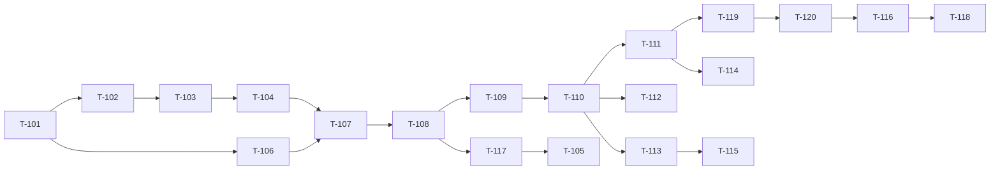

# 02-returns-reconciliation — Plan

| | |
|---|---|
| Owner (PM) | khanhtt |
| Reviewer | PO · Tech lead (khanhtt) |
| Trạng thái | Approved (Plan 2026-10-05, tự quyết theo ủy quyền user — DEC-276) |
| Spec | [02-tech-spec.md](02-tech-spec.md) v0.4 · [02a §12](02a-be-spec.md#12-task) v0.4 · [02b-station §14](02b-fe-spec-station.md#14-task) · [02b-admin §14](02b-fe-spec-admin.md#14-task) |
| Last update | 2026-10-05 · PM |

> **TL;DR** — 39 task (20 BE, 7 FE station, 12 FE admin), ≈ 60 ngày công một dev, 5 milestone **M6–M10** (nối tiếp M0–M5 của item 01); mỗi milestone demo được end-to-end trên camera giả + adapter mock.
> Đường găng BE: T-101 → T-102 → T-103 → T-104 → T-107 → T-108 → T-109 → T-110 → T-111 → T-119 → T-120 → T-116 → T-118 (≈ 22,5 ngày).
> Xong dự kiến **2026-12-29** (M10), tính từ 2026-10-06, 1 dev, 5 ngày / tuần.
> Rủi ro tiến độ lớn nhất: Shopee returns chưa thử (T-3 item 01) và camera thật (T-4) — phần đó ghi "chưa test", không chặn milestone; downgrade `phase2_archive` (T-120) phức tạp.

<!-- Đối tượng đọc: cả đội và người duyệt Plan. Task lấy từ 02a §12 / 02b §14; không tự đặt thêm phạm vi. -->

---

## 1. Chiến lược chia

**Vertical slice theo milestone, theo thứ tự phụ thuộc.** Mỗi milestone gồm BE + FE của một nhóm UC, demo được trên stack dev (`fake-cams`, adapter mock) rồi E2E BE thật. FE chạy trước với MSW theo contract 02 §6 (T-131, T-151) để không chờ BE.

Lệch so với gợi ý của điều phối (hardening gom cả vào M6 — DEC-276): "hồ sơ khiếu nại thay cờ giữ" (L7, T-111) cần module `claims` (T-110), mà `claims` cần phiên mở hoàn (T-108, T-109). Vì vậy hardening Phase 1 rải theo phụ thuộc: L3, L4, L9 (S3, S1, S2 + `closed_session`, BR-21) ở **M7**; L8 (ảnh lúc đóng gói, J-17) ở **M7**; L5, L7 (`info.json`, ADR-009, migration 0004) ở **M8**; L2 (sàn retention) ở **M9**; L6 (điều chỉnh tay `NEW → HANDED_OVER`) có API ở M6 (T-102), UI ở M9.

Không tách thêm task: mọi task trong spec đã ≤ 2 ngày. Không thêm việc ngoài spec.

## 2. Task

Owner tất cả: khanhtt (profile §7). Ticket: chưa tạo (tracker `none` cho item này — §7). Trạng thái: ⬜ chưa · ▶ đang làm · ✅ xong.

| T | Tên | Comp | Phủ (FR / API / màn) | Nguồn | Phụ thuộc | Ước lượng | Milestone | Ticket | Trạng thái |
|---|---|---|---|---|---|---|---|---|---|
| T-101 | Migration 0003 upgrade + model, CHECK `NOT VALID`, sequence (gồm `placeholder_code_seq`), backfill, `recon_start_at`, nâng retention lên sàn | be | §3 02a | 02a §12 | — | 1,5 | M6 | | ✅ `be 101477c` |
| T-102 | `orders.transition` mở rộng + `status_changed_at` + `MANUAL_TRANSITIONS` + API-122; audit actions; `/me` permissions | be | FR-06.05, 10.02, 10.03; API-122, 04, 92 | 02a §12 | T-101 | 1 | M6 | | ✅ `be 9abc83c` |
| T-103 | Adapter returns (`PlatformReturn`, mock 4 fixture, Shopee chưa test), `_RANK`, hint `RETURN_EXPECTED` | be | FR-05.05, 05.07, 05.11, 05.12 | 02a §12 | T-101 | 2 | M6 | | ✅ `be a0f4fa1` |
| T-106 | Station `kind` / `work_mode` / `operator_name` (API-60, 100, 101), xóa tên ở API-03 / 91 | be | FR-01.01, 01.07, 04.10 | 02a §12 | T-101 | 1 | M6 | | ✅ `be 1746cee` |
| T-131 | API client station mở rộng, `shared/returns/inspection.ts`, copy, MSW `StationSim` RETURN + `returnsDb.ts` | fe | nền R1–R5 | 02b-st §14 | 02 §6 (mock) | 1,5 | M6 | | ✅ `fe 580bcde` |
| T-151 | API client admin (`returns`, `recon`, `claims`, mở rộng), `shared/returns/labels.ts`, MSW handlers | fe | nền D14–D17 | 02b-ad §14 | 02 §6 (mock) | 2 | M6 | | ✅ `fe 3c8c7e0` |
| T-152 | Route + drawer + `NavBadge` + `useDashboardSocket` 4 sự kiện | fe | FR-10.02 | 02b-ad §14 | T-151 | 1 | M6 | | ✅ `fe dbb6497` |
| T-104 | Module `returns` lõi: `attach_or_create`, `resolve_code`, `merge_unidentified_by_code`, `recompute`, API-110, 111 | be | FR-04.08, 05.05, 05.11, 05.12; API-110, 111 | 02a §12 | T-102, T-103 | 2 | M7 | | ✅ `be d4dca36` |
| T-107 | Phiên RETURN mở: API-11 nhánh RETURN, API-104, `init_lines`, `build_state()` | be | FR-04.01, 04.02, 04.09; API-10, 11, 104 | 02a §12 | T-104, T-106 | 2 | M7 | | ✅ `be 8ca367b` |
| T-108 | Phiên RETURN đóng / hủy: API-102, đóng API-11 (BR-07, 23, 24), API-12, `camera_clock`, API-15 | be | FR-04.03, 04.05, 04.08; API-11, 12, 15, 102 | 02a §12 | T-107 | 2 | M7 | | ✅ `be 1397352` |
| T-117 | J-07 RETURN (tự hoàn tất / bỏ dở, WS `SESSION_AUTO_CLOSED`), ASSIST, bỏ qua khay cho RETURN, PACK chặn kiện `RETURN_*`, `closed_session` PACK, BR-21 + `flag_order_cancelled` | be | FR-03.14, 03.15, EX-R15, R16 (L4, L9) | 02a §12 | T-108 | 1,5 | M7 | | ✅ `be bd0d371` |
| T-109 | Ảnh: `snapshot`, API-103, 106, J-17 ảnh lúc đóng gói (L8), `pack_reference`, API-40 luật STATION | be | FR-04.04, 04.12, 02.11 | 02a §12 | T-108 | 1,5 | M7 | | ✅ `be 6850d73` |
| T-132 | `selectPanel`, thanh trạng thái, R1, R5, đổi chế độ S1 / R1 | fe | R1, R5, S1 / FR-01.07, 04.10 | 02b-st §14 | T-131 (BE thật: T-106) | 1 | M7 | | ✅ `fe c88fb6d` |
| T-133 | R2 `InspectingPanel` (bảng dòng, kết luận, nháp + flush, hủy, quá giờ, `SESSION_AUTO_CLOSED`) | fe | R2 / FR-04.02, 04.03, 04.05, 04.09 | 02b-st §14 | T-131 (BE thật: T-108, T-117) | 2 | M7 | | ✅ `fe ca19eaf` |
| T-134 | R2 ảnh F2 + `SnapshotStrip` (shared) + `PackReferenceCard` | fe | R2 / FR-04.04, 04.12 | 02b-st §14 | T-133 (BE thật: T-109) | 1,5 | M7 | | ✅ `fe 524881c` |
| T-135 | R3 tìm thủ công, R4 mã RETURN, `force_new`, `captureInInputs` | fe | R3, R4 / FR-04.07, 04.13 | 02b-st §14 | T-133 (BE thật: T-107, T-119) | 1,5 | M7 | | ✅ `fe 0a6ffb0` |
| T-136 | Hardening station: S3 chữ (L3), `ClosedNotice` (L4), banner đơn hủy (L9) | fe | S1, S2, S3 / FR-03.13..15 | 02b-st §14 | T-131 (BE thật: T-117) | 1 | M7 | | ✅ `fe d9d408e` |
| T-137 | Test FE station + E2E mock + E2E BE thật UC-02 | fe | — | 02b-st §14 | T-132..T-136, BE T-101..T-110 | 1,5 | M7 | | ✅ `fe 6ffcf9d` |
| T-110 | Module `claims` (auto từ phiên hoàn, tay, bằng chứng tự chọn, version, J-15), API-130..135 | be | FR-08.01..04, 08.06, 04.06 | 02a §12 | T-108, T-109 | 2 | M8 | | ⬜ |
| T-111 | ADR-009: `protected_sessions_sql`, J-02, API-42 chỉ ADMIN, API-31 `protection`; migration 0004 + downgrade (L7) | be | FR-02.06, 02.09 | 02a §12 | T-110 | 2 | M8 | | ⬜ |
| T-119 | API-112 gộp, API-105 (`force_new`, kiện tạm `TAM-`), `is_placeholder` | be | FR-04.07, 04.13 | 02a §12 | T-111 | 1,5 | M8 | | ⬜ |
| T-112 | Gói bằng chứng J-16, API-136..138, `info.json` L5, `ket-luan.json` | be | FR-08.05, 02.12 | 02a §12 | T-110 | 2 | M8 | | ⬜ |
| T-154 | D4 hiển thị: khối Hàng hoàn, phiên RETURN, ảnh, cảnh báo, chip hồ sơ, `ProtectedChip`, `CreateClaimDialog` | fe | D4 / FR-07.02, 02.06, 02.09, 02.11, 08.01 | 02b-ad §14 | T-151, T-134 (BE thật: T-110, T-111) | 2 | M8 | | ⬜ |
| T-155 | D4 hành động: gắn đơn, sửa kết luận, điều chỉnh trạng thái | fe | D4 / FR-04.11, 04.13, 06.05 | 02b-ad §14 | T-154 (BE thật: T-119, T-115, T-102) | 1,5 | M8 | | ⬜ |
| T-157 | D16 danh sách hồ sơ | fe | D16 / FR-08.01, 08.03, 08.04 | 02b-ad §14 | T-151 (BE thật: T-110) | 1 | M8 | | ⬜ |
| T-158 | D17 chi tiết hồ sơ | fe | D17 / FR-08.02, 08.03, 08.06 | 02b-ad §14 | T-157 (BE thật: T-110) | 2 | M8 | | ⬜ |
| T-159 | `EvidencePackDialog` | fe | D17 / FR-08.05 | 02b-ad §14 | T-158 (BE thật: T-112) | 1 | M8 | | ⬜ |
| T-105 | J-13 `sync_returns`, J-06 / J-04 mở rộng (giao thất bại, boom COD, `NEW → RETURN_EXPECTED`) | be | FR-05.05, 05.11, 05.12, 03.15 | 02a §12 | T-104, T-117 | 1,5 | M9 | | ⬜ |
| T-113 | Module `reconciliation`: 7 quy tắc, J-14, API-120, 121, 123 | be | FR-06.02, 06.03, 06.06 | 02a §12 | T-104, T-110 | 2 | M9 | | ⬜ |
| T-114 | Settings: API-80 mở rộng, API-82 (L2) | be | FR-02.10 | 02a §12 | T-111 | 1 | M9 | | ⬜ |
| T-115 | API-30, 31, 32 mở rộng, API-113 | be | FR-07.01, 07.02, 09.01, 04.11 | 02a §12 | T-113 | 1,5 | M9 | | ⬜ |
| T-153 | D14 Hàng hoàn | fe | D14 / FR-05.05, 05.11, 05.12 | 02b-ad §14 | T-151 (BE thật: T-104, T-105) | 1,5 | M9 | | ⬜ |
| T-156 | D15 Lệch trạng thái + Dialog xử lý | fe | D15 / FR-06.01..03, 05 | 02b-ad §14 | T-151 (BE thật: T-113) | 1,5 | M9 | | ⬜ |
| T-160 | D2, D3, D6, D13 mở rộng | fe | FR-09.01, 07.01, 01.01, 03.14 | 02b-ad §14 | T-152 (BE thật: T-115, T-106) | 1,5 | M9 | | ⬜ |
| T-161 | D8 ngưỡng + sàn retention + xác nhận hạ | fe | D8 / FR-02.10 | 02b-ad §14 | T-151 (BE thật: T-114) | 1 | M9 | | ⬜ |
| T-120 | Downgrade 0003 → `phase2_archive`, upgrade khôi phục, test up → down → up | be | §3, DEC-252, 270 | 02a §12 | T-101..T-119 | 2 | M10 | | ⬜ |
| T-116 | Contract test, `openapi.json`, `seed-demo` hàng hoàn, `docs/ops.md` | be | 02 §6 | 02a §12 | T-101..T-115 | 1,5 | M10 | | ⬜ |
| T-118 | QA live `test_m6_live.py`, locust `returns`, đo J-14 100.000 kiện | be | NFR-01, 32..35 | 02a §12 | T-116 | 1,5 | M10 | | ⬜ |
| T-162 | Test FE admin, E2E mock 3 bộ, E2E BE thật hồ sơ + đối soát | fe | — | 02b-ad §14 | T-153..T-161, BE M9 | 1,5 | M10 | | ⬜ |

Tổng: BE 32,5 · FE station 10 · FE admin 17,5 = **60 ngày công**.

**Done mỗi task:** checklist bám spec (skill implement), build / lint / test không thêm lỗi so với baseline (profile §8), test mới cho hành vi mới, `system-map.md` cập nhật khi đổi data / API / màn, contract OpenAPI cập nhật khi đổi API. Lát nào xong → tài liệu nghiệp vụ `docs/nghiep-vu/02-returns-reconciliation/` (bước 8c).

## 3. Thứ tự & song song

- **Đường găng (BE):** 13 task ≈ 22,5 ngày (sơ đồ hàng trên). Nhánh T-110 → T-113 → T-115 (3,5 ngày) dài bằng T-111 → T-119 (3,5 ngày) — trễ một bên là trễ T-120.
- **Song song được (khi có người thứ hai):** FE T-131, T-151, T-152 ngay ngày 1 (MSW); FE station M7 chạy song song BE M7; FE admin M8 / M9 chạy song song BE cùng milestone. Một dev: làm BE trước FE trong mỗi milestone, FE mock chèn lúc chờ review.
- **Việc ngoài:** T-3 (Shopee partner) và T-4 (camera thật) của item 01 vẫn mở — không chặn milestone; TC phụ thuộc ghi "chưa test — thiếu tài nguyên".

## 4. Milestone

Ngày mục tiêu tính tuần tự 1 dev, 5 ngày / tuần, bắt đầu 2026-10-06.

| Milestone | Gồm task | Công | Ngày mục tiêu | Demo được gì |
|---|---|---|---|---|
| **M6** Nền tảng (xong 2026-10-06; E2E BE thật 43/43) | T-101, 102, 103, 106, 131, 151, 152 | 10 | 2026-10-19 | `alembic upgrade head` trên dữ liệu Phase 1 (retention nâng lên sàn); Admin đặt loại station (API); adapter mock trả 4 loại yêu cầu trả; FE `pnpm dev:mock` hiện R1–R5 và drawer mới; API-122 điều chỉnh tay (L6) |
| **M7** Nhận hàng hoàn tại station + hardening station (xong 2026-10-06; E2E BE thật 44/44) | T-104, 107, 108, 117, 109, 132..137 | 17,5 | 2026-11-11 | UC-02 trên camera giả: quét mã chiều về → R2 → kết luận + ảnh F2 → quét mã gốc đóng; tự hoàn tất quá giờ; S3 chữ mới (L3), S1 thông báo cờ (L4), S2 đơn hủy (L9), ảnh lúc đóng gói (L8); E2E BE thật UC-02 |
| **M8** Hồ sơ khiếu nại + bảo vệ bằng chứng | T-110, 111, 119, 112, 154, 155, 157, 158, 159 | 15 | 2026-12-02 | Phiên hoàn "Hộp rỗng" → KN tự tạo có 2 phiên → D17 đổi trạng thái → gói zip (SHA-256 khớp); migration 0004 chuyển clip giữ → hồ sơ (L7); D4 chip "Đang được giữ"; gắn đơn kiện chưa xác định; `info.json` L5 |
| **M9** Đồng bộ hoàn + đối soát | T-105, 113, 114, 115, 153, 156, 160, 161 | 11,5 | 2026-12-17 | J-13 mock → D14 "Đang về"; J-14 → kiện quá 7 ngày → D15 + D2; xử lý cảnh báo; D8 sàn 60 ngày + xác nhận hạ (L2); D2 / D3 số mới |
| **M10** Hoàn thiện | T-120, 116, 118, 162 | 6,5 | 2026-12-29 | Up → down → up không mất dữ liệu; contract test xanh; QA live + locust; E2E BE thật hồ sơ + đối soát → sẵn sàng G3 |

## 5. Rủi ro tiến độ

| Rủi ro | Giảm thiểu |
|---|---|
| Shopee returns API khác giả định (RK-11, RB-22) | Code theo adapter + mock; phần thật ghi "chưa test — thiếu partner T-3"; không chặn M9 |
| Camera thật chưa có (T-4) → NFR-32 (ảnh ≤ 2 giây), RB-21 | Đo trên `fake-cam1`; ghi điều kiện go-live |
| T-120 downgrade `phase2_archive` phức tạp, dễ vượt 2 ngày | Làm cuối khi schema đã ổn; nếu vượt → tách T-120a (archive) / T-120b (khôi phục) bằng DEC, không cắt test up → down → up |
| `attach_or_create` + khóa (DEC-266) có lỗi đồng thời khó tái hiện | Test đồng thời Postgres thật ở T-104 / T-105 (02a §11 "Đồng thời") ngay khi code, không dồn M10 |
| Một dev, 60 ngày → trễ Tết | M8 là điểm cắt: nếu trễ > 5 ngày ở M8, chuyển T-161 (D8 UI) và API-123 sang sau G4 bằng DEC (FR-02.10 vẫn có API) |
| Đụng code Phase 1 (scan, retention, export) gây hồi quy | Chạy lại toàn bộ test Phase 1 mỗi task; TC hồi quy §2 R của 04 |

## 6. Bảng phủ FR → task

| FR | Task BE | Task FE |
|---|---|---|
| FR-01.01 | T-106 | T-160 |
| FR-01.07 | T-106 | T-132 |
| FR-02.06, 02.09 | T-111 | T-154 |
| FR-02.10 | T-101, T-114 | T-161 |
| FR-02.11 | T-109 | T-134, T-154 |
| FR-02.12 | T-112 | — |
| FR-03.13 | — | T-136 |
| FR-03.14 | T-117, T-115 | T-136, T-160 |
| FR-03.15 | T-117, T-105 | T-136 |
| FR-04.01, 04.02 | T-104, T-107 | T-132, T-133 |
| FR-04.03, 04.09 | T-107, T-108 | T-133 |
| FR-04.04, 04.12 | T-109 | T-134 |
| FR-04.05, 04.06 | T-108, T-110 | T-133 |
| FR-04.07 | T-107, T-119 | T-135 |
| FR-04.08 | T-104, T-108 | T-133, T-153 |
| FR-04.10 | T-106 | T-132 |
| FR-04.11 | T-115 | T-155 |
| FR-04.13 | T-119 | T-135, T-155 |
| FR-05.05, 05.12 | T-103, T-104, T-105 | T-153 |
| FR-05.07 | T-103 | — |
| FR-05.11 | T-103, T-105 | T-153 |
| FR-06.01 | T-102 (đã có `status_history`) | T-154 |
| FR-06.02, 06.06 | T-113 | T-156 |
| FR-06.03 | T-113 | T-156 |
| FR-06.05 | T-102 | T-155, T-156 |
| FR-07.01 | T-115 | T-160 |
| FR-07.02 | T-115 | T-154 |
| FR-08.01..04, 08.06 | T-110 | T-154, T-157, T-158 |
| FR-08.05 | T-112 | T-159 |
| FR-09.01 | T-115 | T-160 |
| FR-10.02, 10.03 | T-102 | T-152 |

Mọi FR mức M có ≥ 1 task. Task không phủ FR trực tiếp: T-116, T-118, T-120 (contract test, NFR, rollback — bắt buộc theo 02 §10, NFR-01/32..35).

## 7. Tracker

Profile §5: GitHub issue khi user cho phép từng lần. Item này **chưa tạo ticket** (coi tracker `none`, 03 là backlog — theo yêu cầu điều phối). Danh sách sẵn để tạo: 39 dòng §2 (tiêu đề = cột Tên, nhãn `be` / `fe`, mô tả trỏ 02a §12 / 02b §14 + FR).

## Decisions

| DEC | Bối cảnh | Lựa chọn | Lý do | Người chốt | Ngày |
|---|---|---|---|---|---|
| DEC-276 | Duyệt Plan; chia milestone | 5 milestone M6–M10 theo phụ thuộc; hardening Phase 1 rải theo phụ thuộc (L3, L4, L8, L9 ở M7; L5, L7 ở M8; L2 ở M9; L6 API ở M6) thay vì gom M6; ticket chưa tạo. Plan ✅ | Claims (L7) cần phiên mở hoàn trước; mỗi milestone vẫn demo được. Loại: gom hardening vào M6 (phải code claims trước phiên hoàn — ngược phụ thuộc) | khanhtt (PM, tự quyết theo ủy quyền user) | 2026-10-05 |
