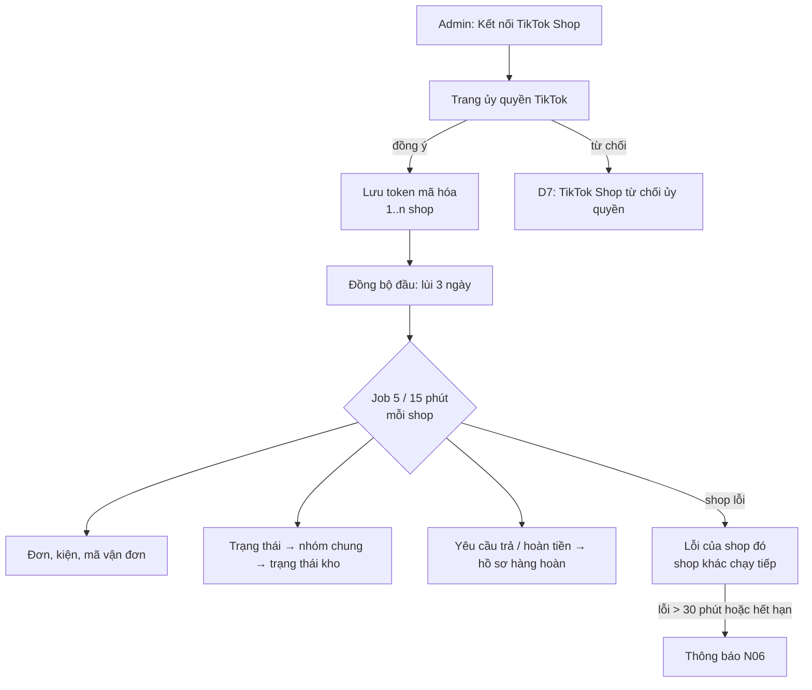
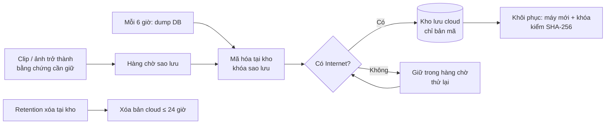
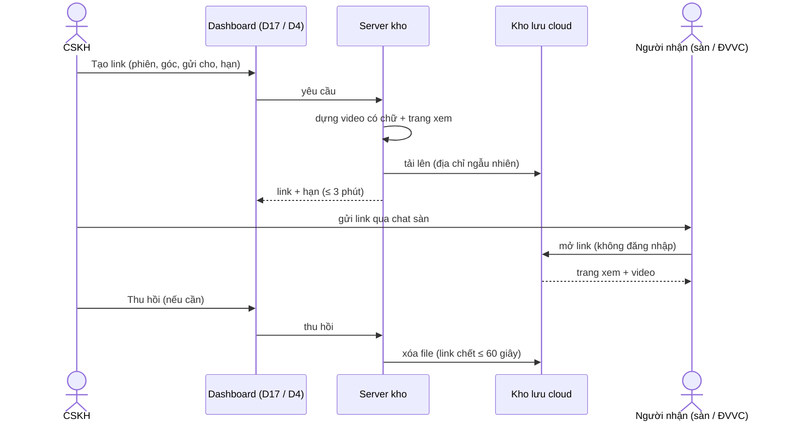
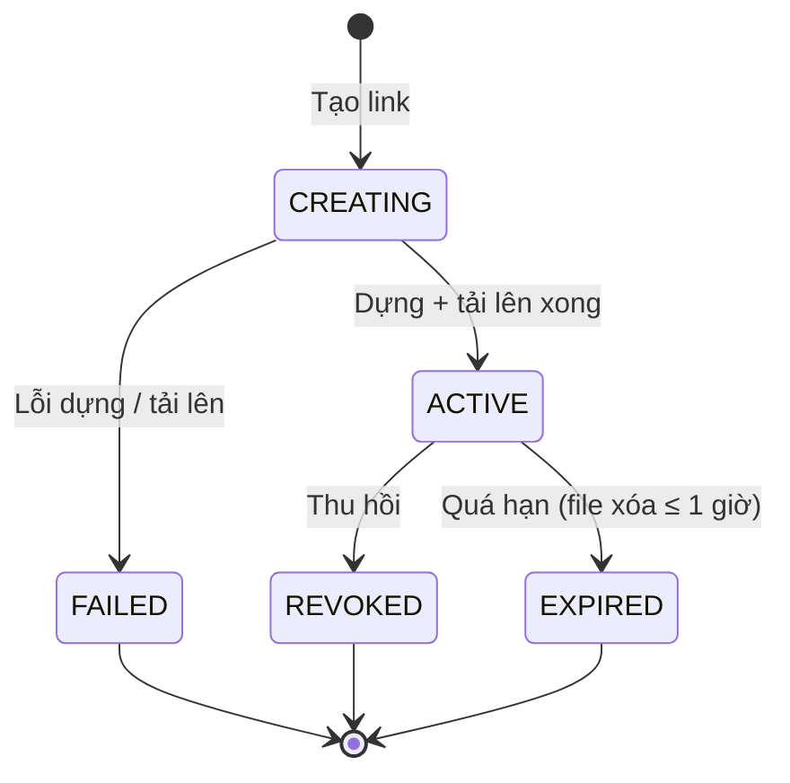
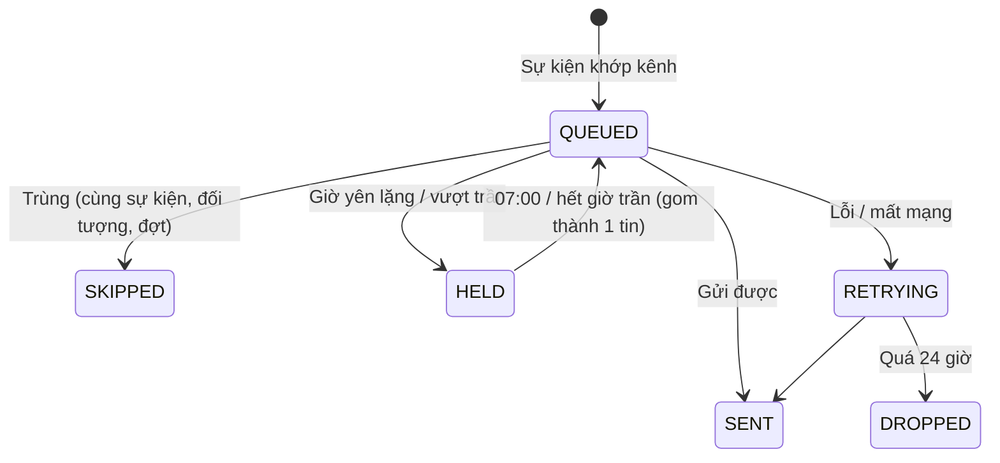
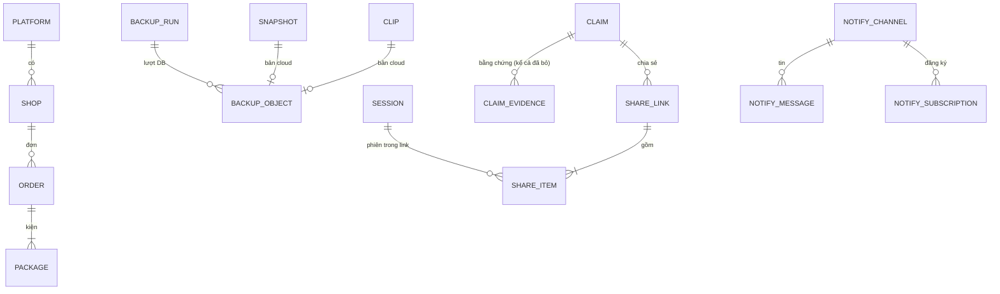
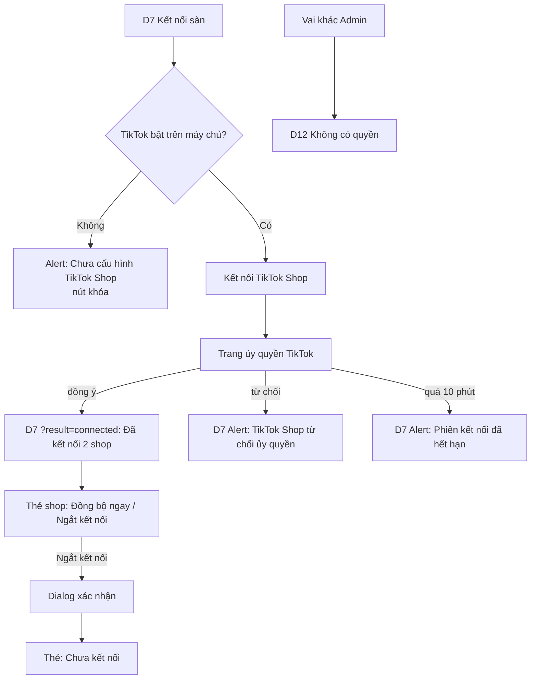
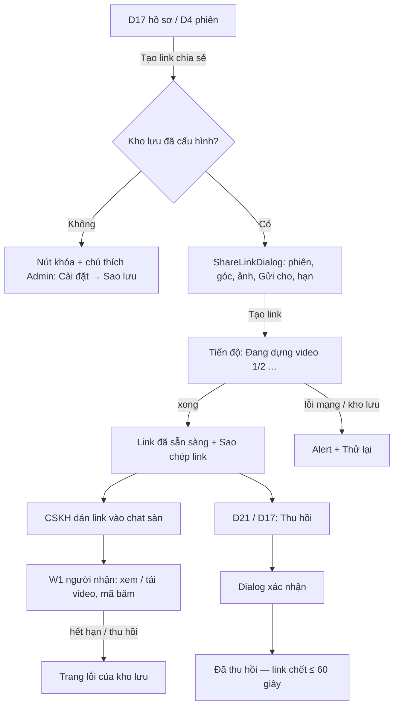
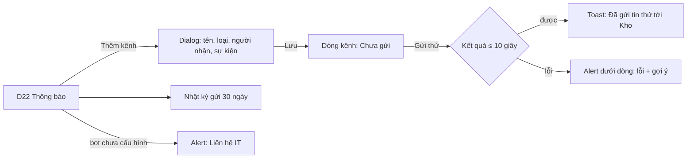
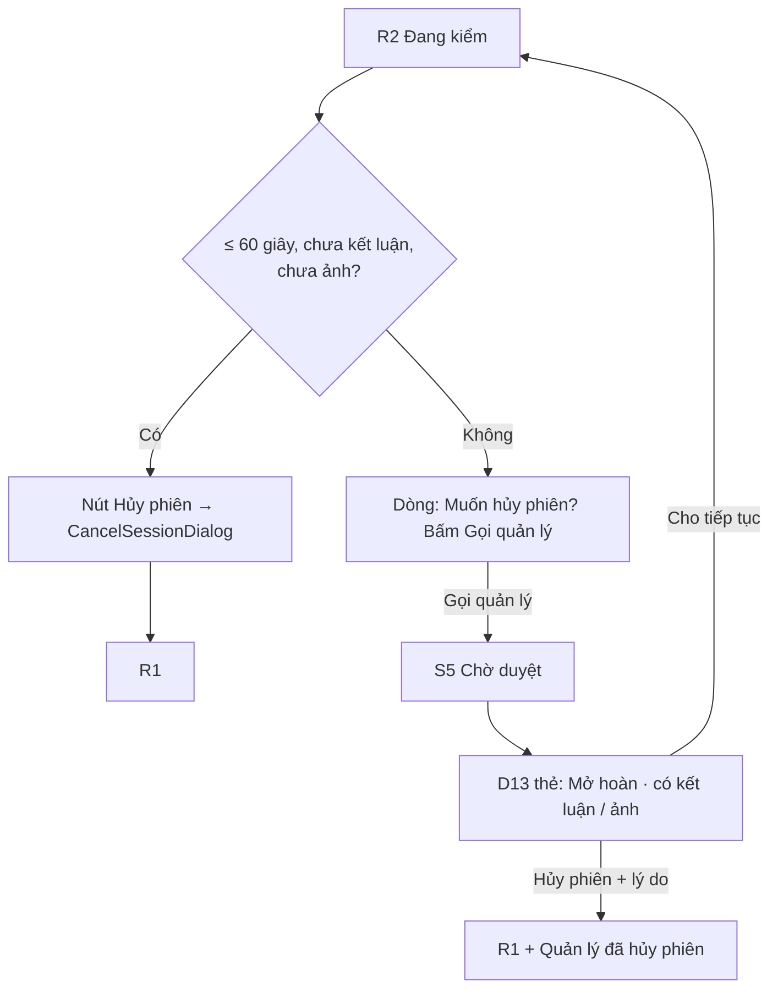

# SRS — 03 Mở rộng: TikTok Shop, báo cáo, sao lưu cloud, link chia sẻ, thông báo (Phase 3)

**Shop bán cả Shopee lẫn TikTok Shop (nhiều shop) dùng một hệ thống: đơn và hàng hoàn của cả hai sàn tự đồng bộ, bằng chứng có bản sao ngoài kho, gửi cho sàn / ĐVVC bằng link có hạn, cảnh báo quan trọng tới điện thoại, và chủ shop có số liệu năng suất / hàng hoàn / khiếu nại.**

| | |
|---|---|
| Phiên bản | 0.2 |
| Trạng thái | Approved — G1 ✅ 2026-10-06 (DEC-427) |
| Owner (PO) | khanhtt (nghiệp vụ do chủ shop xác nhận) |
| Reviewer | khanhtt (solo) |
| Nguồn | [SRS hệ thống](../../system/SRS.md) §13.2 giai đoạn 3, FR-02.08, FR-06.04, FR-07.05, FR-09.02..04 · quyết định user 2026-10-05 (chỉ TikTok Shop, không Lazada) · [06-business-qa Phase 2](../02-returns-reconciliation/06-business-qa.md) L11, L13, L14, L15 · hệ thống đang chạy sau Phase 2 ([system-map](../../system/system-map.md), [01 item 02](../02-returns-reconciliation/01-srs.md), [ADR-007](../../system/decisions/ADR-007-platform-adapter-polling.md), [ADR-009](../../system/decisions/ADR-009-claim-based-evidence-retention.md)) |
| Last update | 2026-10-06 · PO + UX (v0.1 SRS §1–§9, §11–§13; v0.2 §10 màn hình) |

> **TL;DR** — Sau Phase 2, kiện TikTok vẫn là "chưa xác minh", hệ thống chỉ nhận **một** shop Shopee, bằng chứng chỉ nằm trên một máy ở kho, cảnh báo chỉ thấy khi mở dashboard, và còn 4 kẽ hở làm mất tiền khiếu nại (L11, L13, L14, L15).
> Phase 3: adapter TikTok Shop (đơn, mã vận đơn, hủy, trả hàng / hoàn tiền) chạy song song nhiều shop nhiều sàn; báo cáo năng suất / hàng hoàn / khiếu nại; sao lưu **mã hóa** DB + **chỉ bằng chứng cần giữ** lên kho lưu S3-compatible; link chia sẻ ≤ 7 ngày, thu hồi ≤ 60 giây; thông báo Telegram / Zalo có chống spam; vá L11, L13, L15 + phần rẻ của L14.
> Thành công khi: 100% bằng chứng cần giữ có bản ngoài kho ≤ 1 giờ; cảnh báo mức Cao tới điện thoại ≤ 3 phút; tạo link ≤ 3 phút; báo cáo kỳ 92 ngày ≤ 3 giây; 3 Major L11/L13/L15 → 0.
> Chặn go-live (không chặn G1): tài khoản đối tác TikTok Shop (Q18, Q19), nhà cung cấp cloud + nơi đặt dữ liệu theo NĐ 13 (Q20), kênh chat dùng được tại kho (Q21), Q13 + L14 (hạn khiếu nại thật).

SRS item này **chỉ ghi phần thay đổi / chi tiết hóa cho Phase 3**. ID giữ theo SRS hệ thống, item 01, item 02. Mục ghi "Không đổi" thì đọc ở đó. ID mới: P7+, FR nối tiếp theo module, UC-15+, BR-29+, NFR-37+, AC-40+, EX-P14, EX-R17+, EX-T / B / K / S / N (mới), Q18+, RK-16+, AS-12+, DEC-402+, màn D20+, W1.

---

## 1. Giới thiệu

**Mục đích & người đọc:** cơ sở cho tech spec, BE / FE spec, test và nghiệm thu Phase 3 · Người đọc: khanhtt (mọi vai), chủ shop, CSKH, quản lý kho, IT / ops.

| Trong phạm vi | Ngoài phạm vi (giai đoạn này) |
|---|---|
| M05 TikTok Shop adapter: kết nối (nhiều shop), đơn, mã vận đơn từng kiện, trạng thái, hủy, yêu cầu trả hàng / hoàn tiền (FR-05.13..22) | **Lazada** (quyết định user 2026-10-05) |
| Nhiều shop, nhiều sàn cùng lúc — bỏ giới hạn "một shop" của Phase 1 (DEC-12 item 01) cho cả Shopee | Gửi khiếu nại / tranh chấp lên sàn qua API (CSKH vẫn gửi trên Seller Center — giữ DEC-208) |
| M09 báo cáo năng suất, hàng hoàn, khiếu nại (FR-09.02..07) | Nhận diện sản phẩm bằng AI, app di động (giai đoạn 4) |
| M02 sao lưu cloud S3-compatible: DB + bằng chứng cần giữ, mã hóa, khôi phục (FR-02.08, 02.13..18) | Sao lưu video thô; sao lưu mọi clip phiên (chỉ là tùy chọn C — FR-02.18) |
| M07 link chia sẻ bằng chứng có hạn, thu hồi, audit (FR-07.05, 07.07..09) | Đếm lượt xem link (giới hạn của cách lưu — DEC-410) |
| M06 thông báo Telegram / Zalo OA, chống spam (FR-06.04, 06.07..11) | Thông báo email, SMS, ZNS tính phí (FR-06.04 gốc có email — DEC-412) |
| Hardening Phase 2: L11 (FR-04.14, 08.07, 09.01), L13 (FR-08.08), L15 (FR-08.09), phần rẻ L14 (FR-08.10) | L12 trả một phần đơn nhiều kiện, L16..L23 (backlog — DEC-420); phần L14 "nghĩa trường hạn của sàn" (chờ T-3 / Q19) |
| Tên người đứng bàn đóng gói (tùy chọn) cho báo cáo theo người (FR-03.16) | Tài khoản cá nhân / PIN cho người đóng gói (giữ DEC-1 item 01) |
| | Webhook sàn (giữ polling — ADR-007) · đổi khóa mã hóa sao lưu (backlog) |

**Thuật ngữ:** Không đổi — SRS hệ thống §1.3, item 01 §1, item 02 §1. Bổ sung:

| Thuật ngữ | Nghĩa |
|---|---|
| Shop | Một gian hàng trên một sàn đã ủy quyền cho hệ thống (vd "Áo Đẹp" trên Shopee, "Áo Đẹp Official" trên TikTok Shop). Một sàn có thể có nhiều shop |
| Nhóm trạng thái sàn | Trạng thái chung mà mọi sàn được quy về (Chờ giao, Đã giao ĐVVC, Đã giao, Đang yêu cầu hủy, Đã hủy, Hoàn về người bán…) — lõi chỉ dùng nhóm này (BR-30) |
| Yêu cầu hủy (TikTok) | Người mua xin hủy đơn, chờ người bán đồng ý — tương đương `IN_CANCEL` của Shopee |
| Bằng chứng cần giữ | Clip + ảnh đang được bảo vệ khỏi retention (BR-09 / ADR-009) hoặc là bằng chứng của hồ sơ khiếu nại đã đóng còn hạn giữ (BR-33) |
| Kho lưu cloud | Dịch vụ lưu trữ đối tượng tương thích giao thức S3 (S3-compatible) ở ngoài kho |
| Khóa sao lưu | Khóa mã hóa / giải mã bản sao lưu, giữ ở máy chủ kho và một bản do chủ shop cất ngoài máy |
| Link chia sẻ | Địa chỉ web có hạn cho người ngoài hệ thống xem / tải video bằng chứng đã chọn |
| Người nhận link | Người ngoài hệ thống: CSKH sàn, nhân viên ĐVVC, người mua — không có tài khoản |
| Kênh nhận | Một nơi nhận thông báo: một nhóm / người trên Telegram, hoặc một người quan tâm Zalo OA của shop |
| Giờ yên lặng | Khung giờ chỉ gửi thông báo mức Cao (mặc định 22:00–07:00) |
| Người đứng bàn | Tên người đang làm ở station (bàn hoàn: "người kiểm" — item 02; bàn đóng gói: "người đóng gói" — FR-03.16) |

**Tham chiếu:** [SRS hệ thống](../../system/SRS.md) · [item 01](../01-packing-mvp/01-srs.md) · [item 02](../02-returns-reconciliation/01-srs.md) · [06-business-qa item 02](../02-returns-reconciliation/06-business-qa.md) · [architecture.md](../../system/architecture.md) §1 P7, §3.3, §10 · TikTok Shop Partner API (Authorization, Order, Fulfillment, Return & Refund, Cancellation — **chưa xác minh với tài khoản thật**) · Telegram Bot API · Zalo Official Account API · Nghị định 13/2023/NĐ-CP (chuyển dữ liệu cá nhân ra nước ngoài).

## 2. Bối cảnh & bài toán

**AS-IS sau Phase 2** (code nhánh `main` sau PR #2, 2026-10-06):
1. Đơn Shopee đồng bộ qua adapter (chưa thử Shopee thật — T-3). Đơn TikTok chỉ vào bằng **Nhập đơn từ file** hoặc thành kiện "chưa xác minh" khi quét. Hệ thống chỉ có **một** sàn và **một** shop: `PLATFORMS = ("SHOPEE",)` (`ai-cam-be/src/aicam/modules/orders/models.py:11`), kết nối shop mới thì ngắt shop cũ (`platforms/service.py:341-351`, DEC-12), mã đơn duy nhất toàn hệ thống (`orders/models.py:61-62`).
2. Lõi đối soát dùng chữ trạng thái của Shopee (`reconciliation/rules.py:32` `SHIPPED_PLATFORM_STATUSES`, `platforms/base.py:9`, `platforms/sync.py:204` `TO_RETURN`) — thêm sàn khác phải sửa lõi (trái NFR-28).
3. Số liệu chỉ có dashboard ngày D2 (`reports/router.py` API-32). Không có năng suất theo station / người, tỷ lệ hoàn, tỷ lệ thắng khiếu nại.
4. Sao lưu: `pg_dump` mỗi ngày 01:00 vào thư mục trên **chính máy kho**, giữ 14 ngày (`docker/backup/pg-backup.sh`); clip / ảnh không có bản thứ hai.
5. Gửi bằng chứng: tải MP4 (API-43..45, file giữ 24 giờ) hoặc zip hồ sơ (J-16) về máy rồi tự gửi file qua chat / email.
6. Cảnh báo (camera rớt, lệch Cao, hồ sơ sắp hạn) chỉ hiện trong dashboard / station.
7. Q&A Phase 2: 5 Major, trong đó L11, L13, L15 đề xuất sửa đầu Phase 3, L14 chặn go-live.

| # | Vấn đề | Hệ quả |
|---|---|---|
| P7 | Đơn TikTok Shop không tự vào hệ thống; chỉ một shop Shopee | Kiện TikTok "chưa xác minh", không chặn đơn hủy, không có hàng hoàn TikTok tự động, không đối soát; shop nhiều gian hàng không dùng được |
| P8 | Không có số liệu tổng hợp | Không biết bàn / người nào chậm, sản phẩm nào hay bị trả, khiếu nại có đáng công không |
| P9 | Bằng chứng và DB chỉ có một bản tại kho | Cháy, hỏng ổ, mất máy → mất bằng chứng đang tranh chấp và toàn bộ hồ sơ |
| P10 | Gửi bằng chứng ra ngoài bằng file | File lớn, gửi qua kênh tùy tiện, không hạn, không thu hồi, không biết đã gửi gì cho ai |
| P11 | Cảnh báo chỉ thấy khi mở dashboard | Camera rớt cả buổi, hồ sơ quá hạn, "Chỉ hoàn tiền" bị sàn tự hoàn tiền vì không ai phản đối kịp |
| P12 | Kẽ hở bằng chứng Phase 2 (L11, L13, L14, L15) | Gửi sàn video hộp đã bị rạch; mất ca "Chỉ hoàn tiền"; hồ sơ sinh ra đã quá hạn; clip bị xóa ngay đêm bỏ khỏi hồ sơ |

| Mục tiêu | Chỉ số | Hiện tại | Mục tiêu Phase 3 |
|---|---|---|---|
| Kiện TikTok được xác minh | % kiện TikTok có đơn sàn khớp ≤ 10 phút sau khi đơn có mã vận đơn | 0% (chỉ CSV) | ≥ 99% (khi có tài khoản đối tác) |
| Có số liệu điều hành | Thời gian lấy báo cáo hàng hoàn / khiếu nại một tháng | Làm tay (Excel) | ≤ 10 giây |
| Bằng chứng an toàn ngoài kho | % bằng chứng cần giữ có bản trên cloud ≤ 1 giờ (khi có mạng) | 0% | 100% |
| Mất dữ liệu tối đa | Khoảng mất dữ liệu DB khi mất máy kho (RPO) | toàn bộ (bản sao cùng máy) | ≤ 6 giờ |
| Gửi bằng chứng nhanh, kiểm soát được | Bấm "Tạo link" → có link (2 phiên × 2 phút) | tải file + gửi tay | ≤ 3 phút; thu hồi ≤ 60 giây |
| Cảnh báo tới người phụ trách | Sự kiện mức Cao → tin nhắn điện thoại | khi có người mở dashboard | ≤ 3 phút p95 |
| Chi phí cloud | Tiền kho lưu / tháng năm đầu (ước tính §8.2) | 0 | ≤ 300.000 đ |
| Vá kẽ hở Phase 2 | Số Major L11, L13, L15 còn mở | 3 | 0 |

## 3. Stakeholder & tác nhân

Stakeholder: Không đổi — SRS hệ thống §3.1. Thêm: **người nhận link** (CSKH sàn, ĐVVC) và **IT / ops** (giữ khóa sao lưu, cấu hình máy chủ).

| Tác nhân | Loại | Vai trò trong Phase 3 |
|---|---|---|
| Admin | người | Kết nối / ngắt shop Shopee, TikTok; cấu hình kênh thông báo; xác nhận đã cất khóa sao lưu; xem báo cáo |
| Supervisor | người | Xem báo cáo (cả năng suất); tạo / thu hồi link; duyệt hủy phiên hoàn (L11); nhận thông báo kho |
| CSKH | người | Báo cáo hàng hoàn / khiếu nại; tạo / thu hồi link; xử lý "Chỉ hoàn tiền"; nhận thông báo CSKH |
| Tài khoản station | người, tài khoản chung + tên người đứng bàn | Đóng gói, nhận hoàn; nhập tên người đóng gói (tùy chọn) |
| Người nhận link | người ngoài hệ thống | Xem / tải video, ảnh, mã băm qua link — không đăng nhập |
| IT / ops | người, dòng lệnh trên máy chủ | Điền bí mật (khóa ứng dụng TikTok, kho lưu, bot), giữ khóa sao lưu, chạy khôi phục |
| TikTok Shop Partner API | hệ thống ngoài | Ủy quyền shop, đơn, kiện, vận chuyển, hủy, yêu cầu trả / hoàn tiền |
| Shopee Open Platform | hệ thống ngoài | Không đổi (giờ nhiều shop) |
| Kho lưu cloud S3-compatible | hệ thống ngoài | Giữ bản sao mã hóa; phục vụ file của link chia sẻ |
| Telegram Bot API, Zalo OA API | hệ thống ngoài | Chuyển tin nhắn thông báo |
| Job đồng bộ TikTok / sao lưu / dọn link / gửi thông báo | job | Chạy nền |

## 4. Quy trình nghiệp vụ (TO-BE)

Đóng gói (SRS §4.1), nhận hoàn (item 02 §4.2), đối soát (item 02 §4.3): Không đổi luồng, trừ điểm ghi ở 4.1 và 4.6.

### 4.1 Đồng bộ nhiều sàn, nhiều shop (TikTok Shop)

- **T1.** Admin mở "Kết nối sàn" (D7) → "Kết nối TikTok Shop" → trang ủy quyền của TikTok Shop → đồng ý → hệ thống nhận danh sách shop được ủy quyền (có thể > 1), lưu token mã hóa, chạy đồng bộ đầu (lùi 3 ngày như Shopee).
- **T2.** Mỗi 5 phút, mỗi shop `Đã kết nối` của mỗi sàn đang bật: lấy đơn mới / đổi (cursor theo thời gian cập nhật) → tạo / cập nhật đơn, sản phẩm, kiện theo mã vận đơn từng kiện. Shop lỗi → ghi lỗi của shop đó, shop khác chạy tiếp.
- **T3.** Mỗi 15 phút: trạng thái đơn + vận chuyển → nhóm trạng thái chung (BR-30) → chuyển trạng thái kho như Shopee (HANDED_OVER, DELIVERED, RETURN_EXPECTED, CANCELLED*).
- **T4.** Mỗi 15 phút: yêu cầu trả / hoàn tiền TikTok → hồ sơ hàng hoàn (BR-31) theo đúng luật item 02 (gắn hồ sơ mở của đơn, Chỉ hoàn tiền, đồng hồ BR-12 chỉ chạy khi sàn đã chấp nhận).
- **T5.** Station quét mã chưa có → tra **song song mọi shop đang kết nối**, tổng ≤ 2 giây (BR-32) → tìm thấy ở đúng một shop → mở phiên bình thường, S2 hiện "TikTok · Áo Đẹp Official".
- **T6.** Mỗi 30 phút: làm mới token sắp hết hạn của mọi shop; không làm mới được → shop "Hết hạn", D7 + D2 + thông báo N06.



| Mã | Ngoại lệ | Xử lý |
|---|---|---|
| EX-T1 | TikTok tắt trong cấu hình máy chủ / chưa có khóa ứng dụng | D7 hiện "Chưa cấu hình TikTok Shop", nút kết nối khóa; job TikTok không chạy; quét không tra TikTok; Shopee chạy bình thường |
| EX-T2 | Một mã vận đơn đã thuộc kiện của shop khác | Không ghi đè; lỗi đồng bộ của shop "Mã vận đơn SPX… đã thuộc đơn của shop Áo Đẹp (Shopee)"; kiện giữ nguyên |
| EX-T3 | Một kiện TikTok chứa nhiều đơn (cùng mã vận đơn) | S2 hiện đủ sản phẩm của mọi đơn + cảnh báo vàng "Kiện gộp 2 đơn: 5761…01, 5761…02 — kiểm đủ hàng của cả hai" (FR-05.22, cần xác minh TikTok VN có gộp kiện — Q19) |
| EX-T4 | Đơn có yêu cầu hủy đang chờ người bán | Như `IN_CANCEL`: chặn mở phiên "ĐƠN ĐANG YÊU CẦU HỦY"; đang đóng → cảnh báo đỏ S2 (BR-21) |
| EX-T5 | Đơn do kho TikTok xử lý (không phải shop tự đóng gói) | Không đồng bộ vào danh sách đóng gói (AS-13) |
| EX-T6 | Cùng mã đơn sàn ở hai shop khác nhau | Hai đơn khác nhau (BR-29); tìm thủ công theo mã đơn ở bàn hoàn trả cả hai để chọn |
| EX-T7 | Shop bị ngắt kết nối | Ngừng đồng bộ shop đó; đơn / kiện / hồ sơ cũ giữ nguyên, vẫn đóng gói / nhận hoàn được, kiện mới của shop đó thành "chưa xác minh" |
| EX-P14 | Quét mã chưa có, tra thấy ở ≥ 2 shop | Mở phiên "chưa xác minh", ghi chú "Mã có ở 2 shop: …"; Supervisor kiểm (rất hiếm — mã vận đơn do ĐVVC cấp) |

### 4.2 Xem báo cáo

- **B1.** Admin / Supervisor / CSKH mở "Báo cáo" (D20), chọn tab Hàng hoàn · Khiếu nại · Năng suất (Năng suất chỉ Admin, Supervisor).
- **B2.** Chọn kỳ (mặc định 30 ngày gần nhất, tối đa 366 ngày), sàn, shop, station → số liệu ≤ 3 giây (kỳ ≤ 92 ngày).
- **B3.** Bấm một dòng → mở danh sách chi tiết đã lọc (D3 / D14 / D16). Bấm "Xuất CSV" → file của bảng đang xem (audit).

| Mã | Ngoại lệ | Xử lý |
|---|---|---|
| EX-B1 | Kỳ > 366 ngày / ngày đến trước ngày từ | Không chạy; lỗi dưới ô ngày "Chọn tối đa 366 ngày." / "Ngày đến phải sau ngày từ." |
| EX-B2 | Không có dữ liệu trong kỳ | Bảng trống "Không có dữ liệu trong kỳ này."; tỷ lệ hiện "—" (không chia cho 0) |

### 4.3 Sao lưu cloud

- **K1.** IT điền thông tin kho lưu + khóa sao lưu trong cấu hình máy chủ (ops). Admin mở "Sao lưu" (D23) → "Kiểm tra kết nối" → xác nhận đã cất khóa (thấy dấu vân tay) → sao lưu bật.
- **K2.** Mỗi 6 giờ (01:00, 07:00, 13:00, 19:00 giờ VN): dump DB + file nhập đơn gốc → mã hóa tại kho → tải lên → kiểm đọc lại được → ghi lịch sử.
- **K3.** Khi một clip / ảnh trở thành bằng chứng cần giữ (BR-33: hồ sơ hàng hoàn mở, hồ sơ khiếu nại tạo / thêm bằng chứng, Chỉ hoàn tiền…), nó vào hàng chờ; job tải lên trong ≤ 1 giờ (mã hóa, kèm SHA-256 gốc).
- **K4.** Sau mỗi lần dọn retention (02:00): bản cloud của clip / ảnh vừa bị xóa tại kho bị xóa trên cloud; bản DB cũ hơn chính sách (FR-02.14) bị xóa.
- **K5.** Lỗi kéo dài (DB > 26 giờ không thành công, bằng chứng chờ > 24 giờ) → D2 "Cần xử lý" + thông báo N08.
- **K6.** Mất máy kho: IT cài máy mới, chạy lệnh khôi phục với khóa sao lưu → DB + bằng chứng về lại, công cụ kiểm SHA-256 từng clip.



| Mã | Ngoại lệ | Xử lý |
|---|---|---|
| EX-K1 | Chưa cấu hình kho lưu / khóa | D23 "Chưa cấu hình kho lưu cloud" + hướng dẫn cho IT; job sao lưu không chạy; link chia sẻ khóa (EX-S1); D8 sức khỏe "Sao lưu: chưa cấu hình" |
| EX-K2 | Admin chưa xác nhận cất khóa | Sao lưu không chạy; D23 banner vàng "Sao lưu chưa bật: xác nhận đã cất khóa giải mã." |
| EX-K3 | Mất Internet | Hàng chờ giữ nguyên; tự tải khi có mạng lại; quét / đóng gói không bị ảnh hưởng (NFR-09, NFR-44) |
| EX-K4 | Kho lưu từ chối (sai khóa truy cập, đầy, hết tiền) | Ghi lỗi; D23 hiện lỗi gần nhất; quá ngưỡng K5 → N08 |
| EX-K5 | Khôi phục mà sai / mất khóa sao lưu | Không mở được bản sao — **không có đường cứu**; vì vậy K1 bắt xác nhận cất khóa (RK-19) |
| EX-K6 | Clip bị sửa / hỏng tại kho trước khi tải (SHA-256 lệch giá trị đã lưu) | Không tải bản hỏng; đánh dấu "Lệch mã băm", D23 + nhật ký; D2 "Cần xử lý" |

### 4.4 Chia sẻ link bằng chứng

- **LK1.** CSKH / Supervisor / Admin ở D17 (hồ sơ khiếu nại) hoặc D4 (một phiên) bấm "Tạo link chia sẻ".
- **LK2.** Chọn phiên (≤ 4, mặc định = bằng chứng chính của hồ sơ), góc quay (Ghép Cam 1 + Cam 2 / chỉ Cam 1), có kèm ảnh không, **gửi cho ai** (bắt buộc), hạn 1 / 3 / 7 ngày (mặc định 7).
- **LK3.** Hệ thống dựng video có chữ (như bản xuất Phase 1) cho từng phiên, dựng trang xem, tải lên kho lưu cloud dưới một địa chỉ ngẫu nhiên → trả link ≤ 3 phút. Audit `SHARE_CREATE`.
- **LK4.** Người tạo sao chép link, dán vào chat / form của sàn / ĐVVC.
- **LK5.** Người nhận mở link (điện thoại / máy tính, không đăng nhập) → xem / tải video, ảnh, mã băm. Không thấy gì khác.
- **LK6.** Hết hạn → hệ thống xóa file ≤ 1 giờ sau hạn (audit `SHARE_EXPIRE`). Thu hồi sớm → xóa file, link chết ≤ 60 giây (audit `SHARE_REVOKE`).



| Mã | Ngoại lệ | Xử lý |
|---|---|---|
| EX-S1 | Chưa cấu hình kho lưu cloud | Nút "Tạo link chia sẻ" khóa, chú thích "Chưa cấu hình kho lưu cloud. Admin: Cài đặt → Sao lưu." |
| EX-S2 | Mất Internet / kho lưu lỗi khi tạo | "Không tải được lên kho lưu cloud. Kiểm tra Internet rồi bấm Thử lại." Không tạo link dở dang |
| EX-S3 | Phiên chưa có clip (đang cắt / lỗi / đã xóa) | Không chọn được phiên đó, chú thích "Chưa có clip" / "Clip lỗi" / "Clip đã bị xóa ngày …" |
| EX-S4 | Người nhận mở link đã hết hạn / bị thu hồi | Kho lưu trả trang lỗi của nhà cung cấp (không tùy biến được — DEC-409); người nhận xin link mới |
| EX-S5 | Hồ sơ khiếu nại đóng khi link còn hạn | Link giữ tới hạn (sàn có thể đang xem); D17 vẫn hiện link, vẫn thu hồi được |
| EX-S6 | Retention xóa clip gốc khi link còn hạn | Link vẫn chạy (là bản riêng đã dựng), hết hạn theo BR-34 |

### 4.5 Thông báo Zalo / Telegram

- **N1.** IT điền bot Telegram / ứng dụng Zalo OA trong cấu hình máy chủ. Admin mở "Thông báo" (D22) → thêm kênh (tên, loại, người / nhóm nhận) → chọn sự kiện (§7.5) → "Gửi thử".
- **N2.** Sự kiện xảy ra (camera rớt, lệch Cao, Chỉ hoàn tiền mới…) → vào hàng đợi theo kênh đã đăng ký.
- **N3.** Bộ chống spam (BR-36): bỏ trùng, gom cùng loại 2 phút, trần 30 tin / giờ / kênh, giờ yên lặng.
- **N4.** Gửi; lỗi / mất mạng → thử lại giãn cách tới 24 giờ. Ghi nhật ký gửi (D22).
- **N5.** Người nhận bấm link trong tin → mở màn dashboard tương ứng (chỉ được trong mạng kho / VPN — AS-16).

| Mã | Ngoại lệ | Xử lý |
|---|---|---|
| EX-N1 | Chưa cấu hình bot / OA trên máy chủ | D22 hiện Alert cho từng loại "Chưa cấu hình bot Telegram trên máy chủ. Liên hệ IT."; không thêm được kênh loại đó |
| EX-N2 | Telegram bị chặn ở mạng kho / Zalo từ chối (người nhận chưa quan tâm OA, hết hạn tương tác) | Nhật ký "Lỗi"; kênh hiện "Lỗi gửi lúc 09:30: …"; sau 24 giờ thử lại → bỏ tin, đếm "Tin bị bỏ" |
| EX-N3 | Bão sự kiện (vd mất điện, 8 camera rớt cùng lúc) | Gom thành một tin "8 camera mất tín hiệu: …" (BR-36) |
| EX-N4 | Sự kiện đã hết trước khi tin được gửi (vd camera có lại trong cửa sổ gom) | Vẫn gửi (đã xảy ra), dòng ghi "(đã có lại 10:03)" nếu biết; không gửi tin "hết" riêng |

### 4.6 Hàng hoàn và khiếu nại — hardening (L11, L13, L14, L15)

Không đổi bước R1..R8 (item 02 §4.2) và UC-04. Thay đổi:

| Bước | Thay đổi Phase 3 |
|---|---|
| R2–R5 (L11) | Người đứng bàn tự "Hủy phiên" hoàn chỉ trong 60 giây đầu **và** khi chưa lưu kết luận / chưa chụp ảnh (BR-37). Sau đó nút "Hủy phiên" đổi thành "Muốn hủy phiên? Bấm Gọi quản lý" → Supervisor quyết trên D13 (lý do bắt buộc) |
| R7 (L11) | Hồ sơ khiếu nại (tự / tay) tự thêm mọi phiên mở hoàn **trước đó** của kiện / hồ sơ hàng hoàn đã bị hủy / bỏ dở mà có clip; phiên có video sớm nhất là phiên chính (BR-39) |
| D2 (L11) | Đếm phiên mở hoàn bị hủy / bỏ dở trong 7 ngày — không tự hết khi kiện có phiên sau hoàn tất |
| R1 Chỉ hoàn tiền (L13) | Hồ sơ "Chỉ hoàn tiền" chưa có hồ sơ khiếu nại → D2 "Cần xử lý", D14 cột hạn phản hồi (đỏ ≤ 48 giờ), thông báo N04 khi mới và khi còn ≤ 12 giờ (BR-40) |
| UC-04 bước 1 (L15) | Bỏ **mọi** bằng chứng khỏi hồ sơ cần lý do 5–500 ký tự + hộp xác nhận nêu ngày xóa; bằng chứng bị bỏ được giữ tiếp như khi đóng hồ sơ (BR-38) |
| R7 hạn (L14, phần rẻ) | Hạn sàn đã qua lúc tạo hồ sơ → dùng hạn mặc định + ghi chú; D2 đếm hồ sơ quá hạn chưa gửi (BR-42) |

| Mã | Ngoại lệ | Xử lý |
|---|---|---|
| EX-R17 | Người đứng bàn muốn hủy phiên hoàn sau 60 giây / sau khi đã kết luận hoặc chụp ảnh | Chỉ qua "Gọi quản lý"; Supervisor "Hủy phiên" (lý do ≥ 5 ký tự). Clip vẫn được giữ (BR-09 b) và vào hồ sơ khiếu nại sau này (BR-39) |
| EX-R18 | Phiên hoàn đầu bị bỏ dở (mất điện, J-07 45 phút), phiên sau kết luận "Hộp rỗng" | Hồ sơ KN gồm phiên đóng gói + phiên đầu (chính) + phiên sau; D17 Alert "Kiện có 1 phiên mở hoàn trước (bỏ dở 05/10 08:51) — đã đưa vào bằng chứng." |
| EX-R19 | Chỉ hoàn tiền tới hạn mà chưa ai xử lý | D2 mục đỏ "Quá hạn phản hồi"; sàn có thể đã tự hoàn tiền — CSKH vẫn tạo hồ sơ khiếu nại được |

## 5. Yêu cầu chức năng

Không đổi — FR của SRS hệ thống §5, item 01 §5, item 02 §5 cho ID không liệt kê. Bảng dưới là FR **trong phạm vi Phase 3** ("Gốc" = nguyên văn SRS, "Sửa" = chi tiết hóa / đổi ưu tiên, "Mới"). Ưu tiên tính **trong Phase 3**: FR gốc S / C mà user đưa vào phạm vi Phase 3 được nâng M (DEC-421).

### 5.1 M02 — Sao lưu cloud

| ID | Yêu cầu | Ưu tiên | Nguồn | Thay đổi |
|---|---|:---:|---|---|
| FR-02.08 | Hệ thống phải sao lưu ra kho lưu cloud S3-compatible: (a) DB + file nhập đơn gốc mỗi 6 giờ; (b) clip + ảnh thuộc "bằng chứng cần giữ" (BR-33) trong ≤ 1 giờ kể từ khi chúng thành bằng chứng cần giữ, khi có Internet. Video thô và clip không thuộc BR-33 **không** được tải lên | M | P9, K2, K3 | Sửa: S → M; chỉ bằng chứng cần giữ, không mọi clip (DEC-406) |
| FR-02.13 | Hệ thống phải mã hóa mọi bản sao lưu tại kho trước khi tải lên; kho lưu cloud chỉ giữ bản mã; khóa sao lưu không nằm trong DB và không bao giờ được tải lên cloud | M | P9 | Mới (DEC-407) |
| FR-02.14 | Hệ thống phải giữ trên cloud bản DB của 30 ngày gần nhất + bản 01:00 ngày 1 mỗi tháng trong 12 tháng; bản cloud của clip / ảnh bị xóa ≤ 24 giờ sau khi bản tại kho bị retention xóa | M | P9, K4, NFR-21 | Mới |
| FR-02.15 | Admin xem trên D23: bật / tắt, lần sao lưu DB thành công gần nhất + kích thước, số tệp bằng chứng đã sao lưu / đang chờ, dung lượng trên cloud, lỗi gần nhất, lịch sử 14 ngày; sức khỏe hệ thống (D8, API-81) có dòng "Sao lưu cloud". DB không thành công > 26 giờ hoặc bằng chứng chờ > 24 giờ → D2 "Cần xử lý" + thông báo N08 | M | P9, K5 | Mới |
| FR-02.16 | Ops khôi phục DB và bằng chứng từ cloud sang máy mới bằng một lệnh có trong tài liệu vận hành; công cụ kiểm SHA-256 từng clip / ảnh khôi phục và in số khớp / lệch / thiếu; khôi phục bằng chứng của hồ sơ khiếu nại chưa đóng trước | M | P9, K6 | Mới |
| FR-02.17 | Admin bấm "Kiểm tra kết nối" (ghi / đọc / xóa một tệp nhỏ, kết quả ≤ 10 giây); sao lưu chỉ chạy sau khi Admin xác nhận "Đã cất bản sao khóa giải mã" (D23 hiện dấu vân tay khóa, không hiện khóa); khóa trên máy chủ đổi → dấu vân tay đổi → phải xác nhận lại | M | P9, EX-K2, RK-19 | Mới |
| FR-02.18 | Tùy chọn (mặc định tắt) sao lưu thêm mọi clip phiên đóng gói; bật → D23 hiện ước tính dung lượng tăng thêm / tháng | C | P9 | Mới |

### 5.2 M03 — Station

| ID | Yêu cầu | Ưu tiên | Nguồn | Thay đổi |
|---|---|:---:|---|---|
| FR-03.03 | Màn đang đóng gói (S2) và đang kiểm hàng hoàn (R2) hiện chip sàn + tên shop ("Shopee · Áo Đẹp", "TikTok · Áo Đẹp Official"); kiện chưa xác minh hiện "Chưa rõ sàn" | S | P7 | Mở rộng |
| FR-03.16 | Station ở chế độ đóng gói nhập được tên người đóng gói (như người kiểm — FR-04.10, BR-28); mặc định không bắt buộc; Admin bật "Bắt buộc tên người đóng gói" ở D6 / D8; tên ghi vào phiên, hiện ở D4 và báo cáo năng suất | S | P8, FR-09.02 | Mới (DEC-414) |

### 5.3 M04 — Phiên mở hàng hoàn (L11)

| ID | Yêu cầu | Ưu tiên | Nguồn | Thay đổi |
|---|---|:---:|---|---|
| FR-04.14 | Station tự hủy phiên mở hoàn chỉ khi phiên mở ≤ 60 giây **và** chưa lưu kết luận **và** chưa chụp ảnh (BR-37); ngoài ra station chỉ "Gọi quản lý"; Supervisor / Admin quyết "Hủy phiên" trên D13 với lý do bắt buộc 5–500 ký tự | M | P12, L11 | Mới (DEC-416) |

### 5.4 M05 — Tích hợp sàn: TikTok Shop, nhiều shop

| ID | Yêu cầu | Ưu tiên | Nguồn | Thay đổi |
|---|---|:---:|---|---|
| FR-05.07 | Adapter TikTok Shop cài cùng interface adapter sàn đang có (đơn, kiện, vận chuyển, trả hàng, ủy quyền); lõi nghiệp vụ không chứa tên / trạng thái riêng của TikTok | M | NFR-28, P7 | Gốc: adapter thứ hai |
| FR-05.08 | Ghi log mọi lần gọi TikTok, xử lý giới hạn tần suất, thử lại giãn cách — như Shopee | M | RK-16 | Gốc, áp cho TikTok |
| FR-05.13 | Admin kết nối shop TikTok Shop qua trang ủy quyền của TikTok Shop; một lần ủy quyền thêm được mọi shop mà tài khoản cho phép; hệ thống lưu token đã mã hóa, tự làm mới trước khi hết hạn; Admin **ngắt kết nối** từng shop (Shopee hoặc TikTok) — dữ liệu đã có giữ nguyên | M | P7, T1, T6, EX-T7 | Mới |
| FR-05.14 | Hệ thống chạy đồng thời nhiều shop của nhiều sàn: mỗi shop đồng bộ độc lập, lỗi / hết hạn của một shop không dừng shop khác; mọi đơn, kiện, hồ sơ hàng hoàn, hồ sơ khiếu nại mang sàn + shop. Bỏ giới hạn một shop (DEC-12 item 01) cho cả Shopee | M | P7, T2 | Mới (DEC-402) |
| FR-05.15 | TikTok: đồng bộ đơn mới / đổi mỗi 5 phút: mã đơn, trạng thái, sản phẩm (tên, phân loại, SKU, số lượng, ảnh), ghi chú người mua, mã vận đơn của từng kiện | M | P7, T2 | Mới |
| FR-05.16 | TikTok: đồng bộ trạng thái đơn + vận chuyển mỗi 15 phút và chuyển trạng thái kho theo bảng §7.2 (đã giao ĐVVC → `HANDED_OVER`, giao thành công → `DELIVERED`, giao thất bại / trả về người bán → `RETURN_EXPECTED` + hồ sơ "Giao thất bại") | M | P7, T3 | Mới |
| FR-05.17 | TikTok: đơn đã hủy hoặc có yêu cầu hủy đang chờ → chặn mở phiên (BR-01, EX-T4); đơn bị hủy khi kiện đang đóng → cảnh báo station (BR-21); hủy sau khi đóng → `CANCELLED_AFTER_PACK` + BR-11 | M | P7, T3 | Mới |
| FR-05.18 | TikTok: đồng bộ yêu cầu trả hàng / hoàn tiền mỗi 15 phút (mã yêu cầu, đơn, loại, trạng thái, lý do, sản phẩm + số lượng, mã vận đơn chiều về, hạn người bán) và tạo / cập nhật hồ sơ hàng hoàn theo đúng luật Shopee (FR-05.05, 05.11, 05.12, DEC-248, BR-12 v0.6) với ánh xạ BR-31 | M | P7, T4 | Mới |
| FR-05.19 | Quét mã chưa có trong hệ thống → tra song song mọi shop đang kết nối của mọi sàn đang bật, tổng ≤ 2 giây (BR-32); không shop nào trả lời kịp → kiện chưa xác minh như Phase 1 | M | EX-P3, T5 | Sửa FR-05.06: nhiều shop |
| FR-05.20 | Cờ bật / tắt TikTok trong cấu hình máy chủ, riêng cho đơn và cho trả hàng (như `SHOPEE_ENABLED`, `SHOPEE_RETURNS_ENABLED`); tắt → D7 "Chưa cấu hình TikTok Shop", job TikTok không chạy, quét không tra TikTok; Shopee không bị ảnh hưởng | M | EX-T1 | Mới |
| FR-05.21 | Hệ thống lưu trạng thái sàn nguyên văn **và** nhóm trạng thái chung (BR-30); chặn đơn hủy (BR-01), đối soát (BR-10, 11, 14, 19), báo cáo chỉ dùng nhóm chung | M | NFR-28, P7 | Mới (DEC-403) |
| FR-05.22 | Kiện TikTok có mã vận đơn dùng cho ≥ 2 đơn → S2 hiện đủ sản phẩm của các đơn + cảnh báo vàng "Kiện gộp N đơn" (EX-T3) | S | EX-T3 | Mới — chờ xác minh Q19 |

### 5.5 M06 — Thông báo

| ID | Yêu cầu | Ưu tiên | Nguồn | Thay đổi |
|---|---|:---:|---|---|
| FR-06.04 | Hệ thống gửi thông báo qua Telegram và Zalo OA tới các **kênh nhận** do Admin cấu hình (tên kênh, loại, nhóm / người nhận, danh sách sự kiện, bật / tắt); dashboard vẫn là nơi đầy đủ | M | P11, N1 | Sửa: S → M; Telegram + Zalo, bỏ email (DEC-412) |
| FR-06.07 | Danh mục sự kiện N01..N10, mức và kênh gợi ý theo §7.5; mỗi kênh chọn sự kiện riêng | M | P11, P12 | Mới (DEC-413) |
| FR-06.08 | Chống spam theo BR-36: bỏ trùng theo (sự kiện, đối tượng, đợt); gom cùng sự kiện trong 2 phút; trần 30 tin / giờ / kênh; giờ yên lặng (mặc định 22:00–07:00) chỉ gửi mức Cao | M | P11, RK-21 | Mới |
| FR-06.09 | Tin gồm: mức, tên sự kiện, mã kiện / mã hồ sơ, sàn + shop, thời điểm, link tới màn dashboard; **không** chứa tên / SĐT / địa chỉ người mua, ghi chú người mua, lý do khách viết tay, số tiền | M | NFR-20, NFR-21 | Mới |
| FR-06.10 | Admin "Gửi thử" từng kênh (kết quả ≤ 10 giây); nhật ký gửi giữ 30 ngày (thời điểm, kênh, sự kiện, số mục gom, kết quả, lỗi); lỗi / mất mạng → thử lại giãn cách tới 24 giờ rồi bỏ, ghi "Bị bỏ" | M | EX-N2, NFR-43 | Mới |
| FR-06.11 | Tóm tắt ngày lúc 18:00 (đã đóng gói, từng lệch mã, hoàn nhận / có vấn đề, hồ sơ mở / sắp hạn / quá hạn, Chỉ hoàn tiền chưa xử lý) cho kênh chọn sự kiện N10 | S | P8, P11 | Mới |

### 5.6 M07 — Tra cứu, link chia sẻ

| ID | Yêu cầu | Ưu tiên | Nguồn | Thay đổi |
|---|---|:---:|---|---|
| FR-07.01 | Tra cứu (D3), Hàng hoàn (D14), Lệch trạng thái (D15), Hồ sơ khiếu nại (D16) lọc thêm theo sàn và shop; cột / chip sàn | M | P7 | Mở rộng |
| FR-07.05 | Admin / Supervisor / CSKH tạo link chia sẻ từ hồ sơ khiếu nại (D17) hoặc một phiên (D4): chọn ≤ 4 phiên có clip, góc (Ghép Cam 1 + Cam 2 / chỉ Cam 1), kèm ảnh hay không, **gửi cho ai** (3–100 ký tự, bắt buộc), hạn 1 / 3 / 7 ngày (mặc định 7); hệ thống dựng video có chữ, tải lên kho lưu cloud, trả link ≤ 3 phút | M | P10, LK1–LK3 | Sửa: S → M (DEC-409) |
| FR-07.07 | Trang người nhận (W1) không cần đăng nhập, xem được trên điện thoại; chỉ hiện: video + nút tải từng phiên, ảnh đã chọn, mã vận đơn, mã đơn sàn, sàn, loại phiên, thời gian, station, tên người kiểm (phiên hoàn), kết luận (phiên hoàn), SHA-256 của clip gốc và của video chia sẻ, hạn link; **không** hiện ghi chú nội bộ, người phụ trách, số tiền, dữ liệu của kiện / đơn khác | M | P10, NFR-42 | Mới (DEC-411) |
| FR-07.08 | Người tạo, Supervisor, Admin thu hồi link bất kỳ lúc nào → link không mở được ≤ 60 giây; hết hạn → hệ thống xóa file ≤ 1 giờ sau hạn | M | P10, LK6 | Mới |
| FR-07.09 | Danh sách link (D21): tạo lúc, người tạo, gửi cho, kiện / hồ sơ, số phiên, hạn, trạng thái, sao chép, thu hồi; D4 / D17 hiện link đang hoạt động của kiện / hồ sơ; audit `SHARE_CREATE`, `SHARE_REVOKE`, `SHARE_EXPIRE` | M | P10 | Mới |

### 5.7 M08 — Hồ sơ khiếu nại (L11, L13, L14, L15)

| ID | Yêu cầu | Ưu tiên | Nguồn | Thay đổi |
|---|---|:---:|---|---|
| FR-08.07 | (L11) Tạo hồ sơ khiếu nại (tự / tay) thì bằng chứng tự chọn có thêm mọi phiên mở hoàn trước đó của kiện / hồ sơ hàng hoàn đã hủy / bỏ dở có ≥ 1 clip, nhãn "Phiên mở hoàn trước"; phiên mở hoàn có video sớm nhất là phiên chính trong gói bằng chứng và link chia sẻ; D17 hiện Alert khi có phiên trước (BR-39) | M | P12, L11 | Mới (DEC-416) |
| FR-08.08 | (L13) Hồ sơ hàng hoàn "Chỉ hoàn tiền" chưa có hồ sơ khiếu nại và sàn còn mở: D14 tab "Chỉ hoàn tiền" có cột "Hạn phản hồi" (đếm ngược, đỏ khi ≤ 48 giờ, "Quá hạn"), sắp theo hạn tăng dần; D2 "Cần xử lý" hiện số + hạn gần nhất; thông báo N04 khi mới và khi còn ≤ 12 giờ (BR-40) | M | P12, L13 | Mới (DEC-417) |
| FR-08.09 | (L15) Bỏ **mọi** bằng chứng (tự chọn, thêm tay, "Chuyển từ cờ giữ") khỏi hồ sơ cần lý do 5–500 ký tự và hộp xác nhận nêu ngày clip sẽ bị xóa; bằng chứng bị bỏ được giữ tới max(lúc kết thúc clip, lúc bỏ) + số ngày giữ clip (BR-38) | M | P12, L15 | Mới (DEC-418) |
| FR-08.10 | (L14 phần rẻ) Hồ sơ tạo khi hạn sàn đã qua → hạn = lúc tạo + hạn mặc định, ghi chú hệ thống nêu hạn sàn đã qua; D2 đếm "Hồ sơ quá hạn chưa gửi" (trạng thái Mới, hạn < bây giờ) + "Cần xử lý"; thông báo N05 (BR-42) | M | P12, L14 | Mới (DEC-419) |

### 5.8 M09 — Báo cáo

| ID | Yêu cầu | Ưu tiên | Nguồn | Thay đổi |
|---|---|:---:|---|---|
| FR-09.01 | D2 thêm: phiên mở hoàn hủy / bỏ dở trong 7 ngày (L11, không tự hết khi có phiên sau); "Cần xử lý" thêm: Chỉ hoàn tiền chưa xử lý (L13), hồ sơ quá hạn chưa gửi (L14), sao lưu trễ / lỗi (FR-02.15), shop hết hạn / đồng bộ lỗi (FR-05.14) | M | P11, P12 | Mở rộng |
| FR-09.02 | Năng suất theo nhân viên / station: số kiện, thời gian trung bình mỗi kiện (SRS gốc) — chi tiết: theo station và theo người đứng bàn; đóng gói: số kiện, thời gian TB / kiện, số lần lệch mã, bỏ dở, hủy, đóng gói lại; bàn hoàn: số kiện kiểm, thời gian TB, tỷ lệ có vấn đề (BR-41) | M | P8 | Gốc + chi tiết hóa; S → M |
| FR-09.03 | Báo cáo hàng hoàn: tỷ lệ hoàn, tỷ lệ hoàn có vấn đề, theo sản phẩm, theo lý do (SRS gốc) — chi tiết: theo loại hồ sơ, theo sàn / shop, bảng lý do khách × kết luận kho, top 20 sản phẩm bị trả (BR-41) | M | P8 | Gốc + chi tiết hóa; S → M |
| FR-09.04 | Báo cáo khiếu nại: số hồ sơ, tỷ lệ thắng, giá trị thu hồi (SRS gốc) — chi tiết: theo trạng thái, loại, bên nhận, sàn; tỷ lệ gửi trước hạn; số quá hạn chưa gửi (BR-41) | M | P8 | Gốc + chi tiết hóa; C → M |
| FR-09.05 | Bộ lọc báo cáo: kỳ (Hôm nay, 7 ngày, 30 ngày, Tháng này, Tháng trước, Tùy chọn ≤ 366 ngày; giờ VN), sàn, shop, station; bấm một số / dòng → danh sách chi tiết đã lọc (D3 / D14 / D16) | M | P8, B2, B3 | Mới |
| FR-09.06 | Xuất CSV bảng đang xem (UTF-8 có BOM, mở được bằng Excel); audit `REPORT_EXPORT` | S | P8 | Mới |
| FR-09.07 | Biểu đồ cột theo ngày / tuần / tháng cho số kiện đóng gói, số hồ sơ hàng hoàn, số hồ sơ khiếu nại trong kỳ | C | P8 | Mới |

### 5.9 M10 — Quyền, nhật ký

| ID | Yêu cầu | Ưu tiên | Nguồn | Thay đổi |
|---|---|:---:|---|---|
| FR-10.02 | Phân quyền theo ma trận §5.10 | M | — | Mở rộng |
| FR-10.03 | Audit thêm: kết nối / ngắt shop (mọi sàn, có sàn), tạo / thu hồi / hết hạn link, đổi cấu hình thông báo, gửi thử, xác nhận cất khóa sao lưu, kiểm tra kết nối kho lưu, xuất CSV báo cáo, bỏ bằng chứng (kèm lý do), quyết định hủy phiên hoàn | M | NFR-15 | Mở rộng |

**Tổng:** 46 FR trong phạm vi (M: 39 · S: 5 — FR-03.03, 03.16, 05.22, 06.11, 09.06 · C: 2 — FR-02.18, 09.07).

### 5.10 Ma trận phân quyền (Phase 3 — chỉ dòng mới / đổi; còn lại không đổi item 01 §5.1, item 02 §5.10)

| Chức năng | Admin | Supervisor | Station | CSKH |
|---|:---:|:---:|:---:|:---:|
| Kết nối / ngắt shop Shopee, TikTok; đồng bộ ngay (D7) | ✔ | | | |
| Xem báo cáo Hàng hoàn, Khiếu nại (D20) + xuất CSV | ✔ | ✔ | | ✔ |
| Xem báo cáo Năng suất (D20) + xuất CSV | ✔ | ✔ | | |
| Tạo link chia sẻ (D4, D17) | ✔ | ✔ | | ✔ |
| Xem danh sách link (D21) | ✔ | ✔ | | ✔ |
| Thu hồi link | ✔ | ✔ | | ✔ (chỉ link mình tạo) |
| Cấu hình kênh thông báo, gửi thử, nhật ký gửi (D22) | ✔ | | | |
| Xem / cấu hình sao lưu, kiểm tra kết nối, xác nhận cất khóa (D23) | ✔ | | | |
| Dòng "Sao lưu cloud" trong sức khỏe hệ thống (D8) | ✔ | ✔ (xem) | | |
| Khôi phục từ cloud | Ops trên máy chủ (dòng lệnh, không qua giao diện) | | | |
| Hủy phiên mở hoàn ≤ 60 giây, chưa kết luận / ảnh | | | ✔ | |
| Quyết định hủy phiên mở hoàn qua D13 | ✔ | ✔ | | |
| Bỏ bằng chứng khỏi hồ sơ (lý do + xác nhận) | ✔ | ✔ | | ✔ |
| Nhập / đổi tên người đóng gói | | | ✔ (station mình) | |
| Bật "Bắt buộc tên người đóng gói" | ✔ | | | |
| Xem nội dung một link chia sẻ | Người nhận link — bất kỳ ai có link còn hạn, chỉ nội dung của link đó | | | |

## 6. Use case

| ID | Tên | Tác nhân chính | FR | Trong Phase 3 |
|---|---|---|---|:---:|
| UC-05 | Đồng bộ đơn và yêu cầu trả từ sàn | Job | FR-05.14..18, 05.21 | ✔ mở rộng: TikTok, nhiều shop |
| UC-10 | Kết nối shop (Shopee, TikTok Shop — nhiều shop) | Admin | FR-05.13, 05.14, 05.20 | ✔ chi tiết dưới |
| UC-01 | Đóng gói một kiện | Station | FR-03.03, 03.16, 05.17, 05.19, 05.22 | Không đổi luồng; chip sàn, tên người đóng gói, tra nhiều shop |
| UC-02 | Nhận và kiểm tra kiện hoàn | Station | FR-04.14 | Đổi bước hủy (UC-22) |
| UC-04 | Tạo và theo dõi hồ sơ khiếu nại | CSKH | FR-08.07..10 | ✔ mở rộng (L11, L14, L15) |
| UC-15 | Xem báo cáo | Admin, Supervisor, CSKH | FR-09.02..07 | ✔ mới |
| UC-16 | Tạo và thu hồi link chia sẻ | CSKH | FR-07.05, 07.08, 07.09 | ✔ mới |
| UC-17 | Xem bằng chứng qua link | Người nhận link | FR-07.07 | ✔ mới |
| UC-18 | Cấu hình kênh thông báo | Admin | FR-06.04, 06.07, 06.10 | ✔ mới |
| UC-19 | Gửi thông báo | Job | FR-06.07..09, 06.11 | ✔ mới |
| UC-20 | Sao lưu cloud | Job (Admin bật) | FR-02.08, 02.13..15, 02.17 | ✔ mới |
| UC-21 | Khôi phục từ cloud | Ops | FR-02.16 | ✔ mới |
| UC-22 | Hủy phiên mở hoàn sau khi đã mở hộp | Station, Supervisor | FR-04.14, FR-08.07 | ✔ mới |
| UC-23 | Xử lý yêu cầu "Chỉ hoàn tiền" trước hạn | CSKH | FR-08.08 | ✔ mới |

### UC-10 — Kết nối shop (Shopee, TikTok Shop)

| | |
|---|---|
| Tác nhân | Admin |
| Tiền điều kiện | Sàn đã bật trong cấu hình máy chủ (FR-05.20); Admin đăng nhập dashboard |
| Kích hoạt | D7 bấm "Kết nối TikTok Shop" (hoặc "Kết nối Shopee") |
| Kết quả thành công | Mỗi shop được ủy quyền có trạng thái "Đã kết nối", đồng bộ đầu chạy; shop đã kết nối trước đó **không** bị ngắt |

**Luồng chính:** 1. Bấm "Kết nối TikTok Shop" → chuyển sang trang ủy quyền TikTok Shop. 2. Đăng nhập tài khoản người bán, đồng ý. 3. Quay về D7 với thông báo "Đã kết nối 2 shop TikTok Shop. Lần đồng bộ đầu chạy trong vài phút." 4. Thẻ mỗi shop hiện trạng thái, hạn ủy quyền, lần đồng bộ, số đơn hôm nay. 5. Audit `SHOP_CONNECT` mỗi shop.
**Ngoại lệ:** từ chối ủy quyền → "TikTok Shop từ chối ủy quyền. Bấm Kết nối lại để thử lần nữa."; quá 10 phút mới quay về → "Phiên kết nối đã hết hạn. Bấm Kết nối TikTok Shop để làm lại."; shop đã có → cập nhật token, không tạo trùng; ngắt kết nối → Dialog xác nhận (§10.5 D7) → EX-T7.

### UC-15 — Xem báo cáo

| | |
|---|---|
| Tác nhân | Admin, Supervisor, CSKH (Năng suất: Admin, Supervisor) |
| Tiền điều kiện | Đăng nhập dashboard |
| Kích hoạt | Drawer "Báo cáo" hoặc bấm thẻ D2 |
| Kết quả thành công | Thấy số liệu đúng công thức BR-41 cho kỳ / bộ lọc đã chọn; mở được danh sách chi tiết; tải CSV |

**Luồng chính:** 1. Mở D20 (tab nhớ theo URL, mặc định "Hàng hoàn"). 2. Chọn kỳ, sàn, shop. 3. Đọc thẻ số + bảng. 4. Bấm số "Có vấn đề 6" → D14 tab Đã nhận lọc kết luận có vấn đề + kỳ. 5. "Xuất CSV".
**Ngoại lệ:** EX-B1, EX-B2; CSKH mở URL tab Năng suất → về tab Hàng hoàn + Alert "Bạn không có quyền xem báo cáo năng suất."

### UC-16 — Tạo và thu hồi link chia sẻ

| | |
|---|---|
| Tác nhân | CSKH (Supervisor, Admin cũng được) |
| Tiền điều kiện | Kho lưu cloud đã cấu hình (EX-S1); kiện / hồ sơ có ≥ 1 phiên có clip; có Internet |
| Kích hoạt | D17 / D4 bấm "Tạo link chia sẻ" |
| Kết quả thành công | Có link còn hạn, sao chép được; D21 có dòng "Đang hoạt động"; audit |

**Luồng chính:** LK1–LK4 (§4.4). Thu hồi: D21 / D17 / D4 bấm "Thu hồi" → Dialog xác nhận → trạng thái "Đã thu hồi", link chết ≤ 60 giây.
**Ngoại lệ:** EX-S1..S3, EX-S5, EX-S6.

### UC-17 — Xem bằng chứng qua link

| | |
|---|---|
| Tác nhân | Người nhận link (CSKH sàn, ĐVVC) |
| Tiền điều kiện | Link còn hạn, chưa thu hồi |
| Kích hoạt | Mở link |
| Kết quả thành công | Xem / tải video từng phiên, xem ảnh, đọc mã băm và thông tin phiên |

**Luồng chính:** 1. Mở link trên điện thoại / máy tính. 2. Trang W1 tải ≤ 3 giây (4G), video phát được trên trình duyệt di động. 3. Bấm "Tải video" → MP4 H.264.
**Ngoại lệ:** EX-S4.

### UC-18 / UC-19 — Cấu hình kênh và gửi thông báo

| | |
|---|---|
| Tác nhân | Admin (cấu hình); job (gửi) |
| Tiền điều kiện | Bot Telegram / ứng dụng Zalo OA đã điền trên máy chủ (EX-N1) |
| Kích hoạt | D22 "Thêm kênh"; sự kiện N01..N10 xảy ra |
| Kết quả thành công | Kênh "Gửi được"; tin tới đúng kênh đã đăng ký sự kiện ≤ 3 phút (ngoài giờ yên lặng) |

**Luồng chính:** 1. "Thêm kênh": tên "Kho", loại Telegram, Chat ID nhóm, chọn N01, N02, N03, N09. 2. "Gửi thử" → nhóm nhận "Tin thử từ Hệ thống X — kênh Kho. Bạn sẽ nhận: Camera mất tín hiệu, Lệch trạng thái mức Cao, …". 3. Sự kiện → N2–N4 (§4.5).
**Ngoại lệ:** EX-N1..N4.

### UC-20 / UC-21 — Sao lưu cloud và khôi phục

| | |
|---|---|
| Tác nhân | Job (sao lưu), Admin (bật), Ops (khôi phục) |
| Tiền điều kiện | Kho lưu + khóa đã cấu hình; Admin đã xác nhận cất khóa |
| Kích hoạt | Lịch 6 giờ; bằng chứng mới cần giữ; Ops chạy lệnh khôi phục |
| Kết quả thành công | Cloud có bản DB ≤ 6 giờ tuổi và mọi bằng chứng cần giữ; khôi phục ra DB + bằng chứng khớp SHA-256 |

**Luồng chính:** K1–K6 (§4.3).
**Ngoại lệ:** EX-K1..K6.

### UC-22 — Hủy phiên mở hoàn sau khi đã mở hộp (L11)

| | |
|---|---|
| Tác nhân | Station (bàn hoàn), Supervisor |
| Tiền điều kiện | Phiên hoàn đang kiểm > 60 giây, hoặc đã lưu kết luận / chụp ảnh |
| Kích hoạt | Người kiểm muốn dừng phiên (quét nhầm, không phải kiện hoàn, kiện khác…) |
| Kết quả thành công | Phiên `CANCELLED` có lý do của Supervisor; clip giữ theo BR-09 b; nếu kiện được kiểm lại và có vấn đề → phiên này vào hồ sơ khiếu nại (BR-39) |

**Luồng chính:** 1. R2 không còn nút "Hủy phiên"; có dòng "Muốn hủy phiên? Bấm Gọi quản lý". 2. Bấm "Gọi quản lý" → S5 Chờ duyệt. 3. D13 thẻ "Gọi quản lý · Mở hoàn · Đã có kết luận: Hộp rỗng · 3 ảnh". 4. Supervisor "Hủy phiên" + lý do → station về R1, thông báo "Quản lý đã hủy phiên."
**Ngoại lệ:** Supervisor "Cho tiếp tục" → R2; phiên ≤ 60 giây chưa kết luận / ảnh → hủy tại bàn như Phase 2.

### UC-23 — Xử lý "Chỉ hoàn tiền" trước hạn (L13)

1. Tin N04 "[CAO] Yêu cầu Chỉ hoàn tiền mới — 2410ABCDEF · Shopee · Áo Đẹp · hạn phản hồi 08/10 17:00" hoặc D2 "Cần xử lý". 2. CSKH mở D14 tab "Chỉ hoàn tiền" (sắp theo hạn). 3. Xem clip đóng gói ở D4. 4. "Tạo hồ sơ khiếu nại" → D17 → "Tạo link chia sẻ" hoặc "Xuất gói bằng chứng" → gửi sàn trước hạn. 5. Dòng rời mục "Cần xử lý" khi có hồ sơ.

## 7. Trạng thái & quy tắc nghiệp vụ

Trạng thái kho (item 02 §7.1), hồ sơ hàng hoàn (§7.2), phiên hoàn / hồ sơ khiếu nại (§7.3): **không đổi**. Kết nối shop: `Đã kết nối` · `Hết hạn` · `Chưa kết nối` (ngắt) — như Phase 1, nay áp từng shop.

### 7.1 Link chia sẻ



### 7.2 Nhóm trạng thái sàn và ánh xạ TikTok Shop (BR-30 — **chưa xác minh với tài khoản thật, Q19**)

| Nhóm chung | Shopee (đang chạy) | TikTok Shop (giả định theo tài liệu công khai) | Trạng thái kho kỳ vọng |
|---|---|---|---|
| Chờ thanh toán / tạm giữ | UNPAID | UNPAID, ON_HOLD | Không đồng bộ vào đóng gói |
| Chờ giao | READY_TO_SHIP, PROCESSED, RETRY_SHIP | AWAITING_SHIPMENT, PARTIALLY_SHIPPING, AWAITING_COLLECTION | `NEW` / `PACKED` |
| Đã giao ĐVVC | SHIPPED | IN_TRANSIT | `HANDED_OVER` (kho chưa `PACKED` → BR-10) |
| Đã giao | TO_CONFIRM_RECEIVE, COMPLETED | DELIVERED, COMPLETED | `DELIVERED` |
| Đang yêu cầu hủy | IN_CANCEL | Đơn có yêu cầu hủy chờ người bán (nhóm Cancellation) | Chặn mở phiên (BR-01) |
| Đã hủy | CANCELLED | CANCELLED | `CANCELLED` / `CANCELLED_AFTER_PACK` (BR-11) |
| Hoàn về người bán | TO_RETURN; vận chuyển giao thất bại / COD từ chối | Vận chuyển giao thất bại / trả về người bán | `RETURN_EXPECTED` + hồ sơ "Giao thất bại" |

### 7.3 Phiên mở hoàn — hủy (L11)

Không đổi trạng thái phiên (item 02 §7.3). Đổi điều kiện của chuyển `OPEN → CANCELLED` do station: chỉ khi BR-37; còn lại qua `WAITING_APPROVAL` → Supervisor `CANCEL_SESSION`.

### 7.4 Thông báo



### 7.5 Danh mục sự kiện thông báo (FR-06.07, DEC-413)

| Mã | Sự kiện | Mức | Kênh gợi ý |
|---|---|:---:|---|
| N01 | Camera mất tín hiệu > 60 giây trong giờ làm việc | Cao | Kho |
| N02 | Cảnh báo lệch mức Cao mới (BR-10, BR-12, BR-19) | Cao | Kho |
| N03 | Phiên mở hoàn bị hủy / bỏ dở; kiện hoàn chưa xác định mới | Trung bình | Kho |
| N04 | Yêu cầu "Chỉ hoàn tiền" mới; nhắc khi còn ≤ 12 giờ tới hạn mà chưa có hồ sơ | Cao | CSKH |
| N05 | Hồ sơ khiếu nại sắp hết hạn (≤ 48 giờ, chưa gửi) / đã quá hạn chưa gửi | Cao | CSKH |
| N06 | Shop hết hạn ủy quyền / đồng bộ lỗi liên tục > 30 phút | Cao | Quản trị |
| N07 | Ổ lưu video ≥ 80% (Trung bình), ≥ 90% (Cao) | TB / Cao | Quản trị |
| N08 | Sao lưu: DB không thành công > 26 giờ / bằng chứng chờ > 24 giờ / lệch mã băm | Cao | Quản trị |
| N09 | Yêu cầu duyệt (Gọi quản lý) chờ > 3 phút | Trung bình | Kho |
| N10 | Tóm tắt ngày 18:00 (FR-06.11) | Thông tin | Chủ shop |

### 7.6 Quy tắc

| ID | Quy tắc | Ví dụ |
|---|---|---|
| BR-01 | Không đổi; áp theo **nhóm** "Đang yêu cầu hủy" / "Đã hủy" cho mọi sàn | Đơn TikTok có yêu cầu hủy chờ người bán → quét → S4 "ĐƠN ĐANG YÊU CẦU HỦY", không mở phiên |
| BR-29 | Mã đơn sàn duy nhất **trong một shop** (hai shop có thể trùng mã). Mã vận đơn duy nhất toàn hệ thống: mã đã thuộc kiện của shop khác → không ghi đè, ghi lỗi đồng bộ (EX-T2). Đơn từ file (không shop) được gắn vào shop đầu tiên đồng bộ thấy cùng mã đơn (BR-17) | Shop Shopee A và TikTok B cùng có đơn "2410ABCDEF" → 2 đơn; J&T "812345678901" đã của đơn shop A, shop B trả cùng mã → lỗi của shop B |
| BR-30 | Mỗi đơn lưu trạng thái sàn nguyên văn + nhóm chung (§7.2). Chặn hủy, đối soát, báo cáo chỉ đọc nhóm. Trạng thái lạ chưa có trong bảng → nhóm "Không rõ", không đổi trạng thái kho, log cảnh báo | TikTok `IN_TRANSIT` → "Đã giao ĐVVC" → kiện `PACKED` thành `HANDED_OVER`; trạng thái mới `XYZ` → "Không rõ", kiện giữ nguyên |
| BR-31 | Yêu cầu trả TikTok: chỉ hoàn tiền → hồ sơ "Chỉ hoàn tiền"; trả hàng + hoàn tiền → "Khách trả hàng"; đổi hàng → "Khách trả hàng" (lý do ghi "Đổi hàng"; đơn giao hàng thay thế đồng bộ như đơn mới — AS-14). Nhóm trạng thái yêu cầu: chờ người bán duyệt = mở nhưng **chưa chấp nhận** (đồng hồ BR-12 chưa chạy); đã chấp nhận / chờ khách gửi / khách đã gửi = mở, đã chấp nhận; từ chối / người mua hủy = Đã hủy; hoàn tiền xong = Đã hoàn tiền (BR-19) | Yêu cầu 01/10 chờ duyệt, người bán đồng ý 03/10 → kiện "Hoàn quá hạn" sau 10/10 (N = 7) |
| BR-32 | Quét mã chưa có → tra mọi shop `Đã kết nối` của sàn đang bật cùng lúc; mỗi lời gọi bị cắt ở 2 giây; tổng chờ ≤ 2 giây. Đúng 1 shop thấy → gắn shop đó; 0 → kiện chưa xác minh; ≥ 2 → chưa xác minh + ghi chú (EX-P14) | 3 shop: shop TikTok trả 0,8 giây có đơn, Shopee A trả 1,1 giây không có, Shopee B quá 2 giây → mở phiên lúc ~2 giây gắn shop TikTok |
| BR-33 | Bằng chứng cần giữ (sao lưu) = clip + ảnh đang được bảo vệ theo BR-09 (a, b, c) hoặc cờ giữ khẩn cấp, **cộng** bằng chứng của hồ sơ khiếu nại đã đóng còn trong hạn giữ. Một tệp tải lên một lần (kiểm SHA-256 trước khi tải); bị retention xóa tại kho → xóa trên cloud ≤ 24 giờ | Kiện đóng gói 28/09; 03/10 10:00 có hồ sơ hàng hoàn → 2 clip đóng gói + ảnh lúc đóng lên cloud trước 11:00. Hồ sơ đóng 15/11, giữ 90 ngày → bản cloud xóa ≤ 24 giờ sau khi kho xóa (≈ 13/02) |
| BR-34 | Link hạn 1, 3 hoặc 7 ngày (tối đa 7 — giới hạn ký link của kho lưu); thu hồi → link chết ≤ 60 giây; hết hạn → file xóa ≤ 1 giờ sau hạn. Hồ sơ đóng không tự thu hồi link | Tạo 06/10 10:00, hạn 3 ngày → không mở được từ 09/10 10:00, file mất trước 11:00 |
| BR-35 | Một link chứa 1–4 phiên đã có clip; tổng thời lượng ≤ 30 phút; ảnh ≤ 20. Mỗi link là bản dựng riêng (không trỏ tới clip gốc ở kho) | Chọn 5 phiên → nút "Tạo link" khóa, chữ "Chọn tối đa 4 phiên." |
| BR-36 | Thông báo: (1) bỏ trùng theo (sự kiện, đối tượng, đợt) — cảnh báo lệch mở 1 lần chỉ báo 1 lần; (2) cùng sự kiện, cùng kênh trong 2 phút → 1 tin, tối đa 10 dòng + "và N mục khác"; (3) trần 30 tin / giờ / kênh, vượt → giữ, gửi 1 tin tóm tắt ở cuối giờ; (4) giờ yên lặng (mặc định 22:00–07:00): chỉ mức Cao gửi ngay, còn lại gom 1 tin lúc 07:00 | 8 camera rớt 14:00:05–14:00:40 → 1 tin "8 camera mất tín hiệu". 23:10 N03 (TB) → gửi trong tin tóm tắt 07:00 |
| BR-37 | (L11) Station tự hủy phiên mở hoàn chỉ khi: đã mở ≤ 60 giây **và** chưa lưu kết luận **và** chưa có ảnh chụp tay. Ngược lại phải Gọi quản lý; Supervisor hủy phải ghi lý do 5–500 ký tự | Mở 09:00:00, 09:00:45 hủy được; 09:01:10 nút hủy ẩn; 09:00:30 đã chụp 1 ảnh → nút hủy ẩn |
| BR-38 | (L15) Bỏ một bằng chứng khỏi hồ sơ (mọi loại) cần lý do 5–500 ký tự + xác nhận. Clip / ảnh bị bỏ được giữ tới max(lúc kết thúc clip, lúc bỏ) + số ngày giữ clip (không thấp hơn sàn 60), trừ khi còn được bảo vệ vì lý do khác | Clip 01/05, giữ 90 ngày, bỏ 06/10 → giữ tới 04/01/2027; Dialog "Clip này được giữ tới 04/01/2027 rồi tự xóa (trừ khi thuộc hồ sơ khác)." |
| BR-39 | (L11) Khi tạo hồ sơ khiếu nại (tự / tay), bằng chứng tự chọn = phiên đóng gói hiệu lực + **mọi** phiên mở hoàn của kiện / hồ sơ hàng hoàn (kể cả `CANCELLED`, `ABANDONED` có ≥ 1 clip) + ảnh. Phiên mở hoàn có clip sớm nhất là phiên chính (video ghép có chữ trong gói zip và link) | 08:51 phiên A bỏ dở (mất điện), 10:15 phiên B "Hộp rỗng" → KN gồm đóng gói + A (chính) + B |
| BR-40 | (L13) "Chỉ hoàn tiền chưa xử lý" = hồ sơ "Chỉ hoàn tiền", yêu cầu sàn còn mở, đơn chưa có hồ sơ khiếu nại chưa đóng. Hạn phản hồi = hạn người bán của sàn; không có → lúc sàn báo + 48 giờ (cấu hình, đề xuất — Q13). Đỏ khi ≤ 48 giờ; N04 khi mới và một lần khi còn ≤ 12 giờ | Sàn báo 06/10 09:00, hạn 08/10 09:00 → N04 lúc 09:00 06/10 và 21:00 07/10; CSKH tạo KN 07/10 → rời D2 |
| BR-41 | Công thức báo cáo (giờ VN, theo kỳ): **Đóng gói** — số kiện = phiên đóng gói hoàn tất có giờ đóng trong kỳ (đóng gói lại tính riêng); thời gian TB = trung bình (đóng − mở − thời gian chờ duyệt). **Bàn hoàn** — số kiện kiểm = phiên hoàn hoàn tất; tỷ lệ có vấn đề = kết luận ≠ Nguyên vẹn / số kiện kiểm. **Tỷ lệ hoàn** = hồ sơ hàng hoàn có kiện về (Khách trả hàng + Giao thất bại + Về trước khi sàn báo) tạo trong kỳ / kiện chuyển "Đã bàn giao" trong kỳ; Chỉ hoàn tiền hiện riêng. **Tỷ lệ hoàn có vấn đề** = hồ sơ "Đã nhận – có vấn đề" / hồ sơ đã nhận, theo giờ nhận. **Tỷ lệ thắng** = Thắng / (Thắng + Thua), theo giờ có kết quả. **Giá trị thu hồi** = tổng số tiền thu hồi của hồ sơ Thắng. **Gửi trước hạn** = hồ sơ chuyển "Đã gửi" trước hạn / hồ sơ đã gửi. Người đứng bàn gộp theo tên (bỏ khoảng trắng thừa, không phân biệt hoa thường); không có tên → "(Không ghi tên)". Mẫu số 0 → "—" | 3 phiên 60, 90, 150 giây (phiên 150 có 30 giây chờ duyệt) → TB 90 giây. 1.000 kiện bàn giao, 25 Khách trả + 15 Giao thất bại → 4,0%. 12 Thắng, 4 Thua → 75%, thu hồi 2.350.000 đ |
| BR-42 | (L14 phần rẻ) Tạo hồ sơ khi hạn sàn < lúc tạo → hạn = lúc tạo + hạn mặc định (7 ngày), ghi chú hệ thống "Hạn sàn (05/10 17:00) đã qua khi tạo hồ sơ — dùng hạn mặc định. Kiểm hạn thật trên sàn." "Quá hạn chưa gửi" = trạng thái Mới và hạn < bây giờ | Hồ sơ tạo 06/10 09:00, hạn sàn 05/10 → hạn 13/10 09:00 + ghi chú; 13/10 09:01 còn Mới → D2 "1 hồ sơ quá hạn chưa gửi" + N05 |

## 8. Yêu cầu phi chức năng

Không đổi — NFR-01..36 áp cho phần Phase 3. Chi tiết hóa / bổ sung:

### 8.1 Bảng NFR

| ID | Loại | Yêu cầu (đo được) | Cách kiểm |
|---|---|---|---|
| NFR-01 | Hiệu năng | Không đổi: quét ≤ 1 giây p95 khi đơn đã có; ≤ 3 giây p95 khi phải tra sàn — kể cả khi tra song song 4 shop | 100 lần quét mã lạ với 4 shop adapter mock (1 shop chậm 5 giây) |
| NFR-28 | Mở rộng | Thêm TikTok không sửa lõi: thư mục lõi (ngoài `platforms/tiktok`) không chứa tên trạng thái / trường riêng của TikTok | Lệnh tìm chuỗi trạng thái TikTok trong mã nguồn ngoài adapter = 0 kết quả |
| NFR-37 | Hiệu năng | Báo cáo kỳ ≤ 92 ngày trả ≤ 3 giây p95; kỳ 366 ngày ≤ 10 giây, với 500 đơn / ngày × 12 tháng (≈ 180.000 kiện, 9.000 hồ sơ hàng hoàn) | Dữ liệu sinh + đo 20 lần mỗi tab |
| NFR-38 | Độ trễ đồng bộ | Đơn TikTok mới có mã vận đơn → có trong hệ thống ≤ 5 phút; yêu cầu trả mới → hồ sơ hàng hoàn ≤ 15 phút (khi có mạng, không tính trễ của sàn) | Adapter mock + đồng hồ |
| NFR-39 | Cô lập lỗi | Một shop lỗi / chậm (timeout mọi lời gọi) không làm chu kỳ đồng bộ của shop khác trễ quá 1 chu kỳ | 3 shop mock, 1 shop luôn lỗi, đo 1 giờ |
| NFR-40 | Sao lưu | RPO: DB ≤ 6 giờ; bằng chứng cần giữ ≤ 1 giờ (khi có mạng). RTO: khôi phục DB từ cloud ≤ 60 phút trên máy mới đã cài sẵn hệ thống; bằng chứng của hồ sơ khiếu nại chưa đóng về trước, phần còn lại theo băng thông | Diễn tập khôi phục trên máy trống với kho lưu tương thích S3 chạy local (MinIO) |
| NFR-41 | Bảo mật sao lưu | Mã hóa tại kho bằng thuật toán đối xứng chuẩn ≥ 256 bit có xác thực; tải một tệp bất kỳ từ cloud về không mở / phát được khi không có khóa; khóa không có trong DB, log, bản sao lưu | Tải 5 tệp từ bucket, thử mở; tìm khóa trong dump DB + log |
| NFR-42 | Bảo mật link | Phần ngẫu nhiên của link ≥ 128 bit; chỉ HTTPS; không liệt kê được thư mục; đổi 1 ký tự → không mở được; link chỉ trỏ tới file của lần chia sẻ đó; thu hồi có hiệu lực ≤ 60 giây | Thử đổi ký tự, thử liệt kê bucket, đo thời gian sau thu hồi |
| NFR-43 | Thông báo | Sự kiện → tin tới kênh ≤ 3 phút p95 (ngoài giờ yên lặng, có mạng, gồm cửa sổ gom 2 phút); mất mạng ≤ 24 giờ không mất tin | Server Telegram giả + đồng hồ; rút mạng 2 giờ |
| NFR-44 | Băng thông | Tải lên cloud giới hạn tốc độ (mặc định 10 Mbit/s, cấu hình); trong lúc sao lưu, NFR-01 và live view vẫn đạt | Đo quét p95 khi đang tải 5 GB |
| NFR-45 | Riêng tư | Tin thông báo, trang link không chứa tên / SĐT / địa chỉ người mua dạng chữ; nội dung trong hình (nhãn vận đơn trên Cam 2) được cảnh báo trước khi tạo link | Test nội dung 10 mẫu tin + trang W1; kiểm chữ cảnh báo ở Dialog |
| NFR-46 | Khả dụng trang link | Trang W1 tải phần chữ ≤ 3 giây trên 4G; video H.264 phát được trên Chrome Android, Safari iOS bản 2 năm gần nhất | Thử 2 điện thoại thật (chưa test nếu thiếu thiết bị) |

### 8.2 Dung lượng và chi phí cloud (ước tính, đo lại sau 1 tháng chạy)

Giả định: 500 đơn / ngày (DEC-4 item 01), 5% có kiện hoàn → 25 hồ sơ hàng hoàn / ngày; clip H.265 ≈ 2 Mbit/s / camera (SRS §8.3); phiên đóng gói 2 phút, phiên hoàn 4 phút; mỗi hồ sơ giữ 2 phiên × 2 camera + ~5 MB ảnh.

| Hạng mục | Ước tính |
|---|---|
| Một hồ sơ hàng hoàn (đóng gói 2 × 30 MB + mở hoàn 2 × 60 MB + ảnh) | ≈ 185 MB |
| Tải lên mỗi ngày (25 hồ sơ) | ≈ 4,6 GB (≈ 25 phút ở 25 Mbit/s) |
| Tồn trên cloud ở trạng thái ổn định (bằng chứng ~90 ngày + 42 bản DB × ~0,2 GB + link) | ≈ 430 GB |
| Chi phí kho lưu (giá tham khảo 6–15 USD / TB / tháng; nhà cung cấp VN cần báo giá — Q20) | ≈ 70.000–170.000 đ / tháng |
| Nếu sao lưu **mọi** clip phiên (FR-02.18): 500 × 2 × 30 MB / ngày, giữ 90 ngày | ≈ 30 GB / ngày, ≈ 2,7 TB tồn, ≈ 0,4–1 triệu đ / tháng + 2,7 giờ tải / ngày |

## 9. Dữ liệu nghiệp vụ



| Thực thể | Thông tin chính | Ghi chú (bí mật / thời hạn / nguồn) |
|---|---|---|
| SHOP (đổi) | Sàn (Shopee / TikTok), mã shop sàn, tên, trạng thái kết nối, token (mã hóa), hạn token, mã riêng của shop dùng khi gọi API (TikTok), lỗi gần nhất, cursor đồng bộ đơn / trả | Nhiều shop / sàn (bỏ DEC-12); token mã hóa (NFR-18) |
| ORDER (đổi) | + Shop bắt buộc với đơn từ API; trạng thái sàn nguyên văn + **nhóm chung**; mã đơn duy nhất trong shop | BR-29, BR-30; payload gốc giữ nguyên |
| PACKAGE (đổi) | + Danh sách đơn khác cùng kiện (kiện gộp — FR-05.22) | Chờ Q19 |
| RETURN_CASE (đổi) | + Sàn, shop; loại "Đổi hàng" ghi ở lý do | BR-31 |
| SESSION (đổi) | + Tên người đóng gói (phiên đóng gói) | FR-03.16 |
| CLAIM_EVIDENCE (đổi) | + Lúc bỏ, người bỏ, lý do bỏ, giữ tới | BR-38; không xóa dòng khi bỏ |
| SHARE_LINK | Người tạo, gửi cho, nguồn (hồ sơ / phiên), góc quay, kèm ảnh, hạn, trạng thái (§7.1), lúc thu hồi + người thu hồi, mã băm của từng video chia sẻ | Không lưu địa chỉ đầy đủ của link ở log; audit |
| SHARE_ITEM | Phiên, thứ tự, video đã dựng (kích thước, SHA-256), ảnh | Xóa file khi link hết hạn / thu hồi |
| BACKUP_RUN | Loại (DB), lúc bắt đầu / xong, kích thước, kết quả, lỗi | Lịch sử 14 ngày trên D23; giữ dòng 400 ngày |
| BACKUP_OBJECT | Clip / ảnh / bản DB, trạng thái (chờ / đã tải / lỗi / đã xóa trên cloud), lúc tải, SHA-256 gốc, số lần thử | BR-33 |
| NOTIFY_CHANNEL | Tên, loại (Telegram / Zalo OA), địa chỉ nhận (chat ID / user ID Zalo), bật / tắt, trạng thái gửi gần nhất | Bot token / khóa OA ở cấu hình máy chủ, không ở DB (DEC-408) |
| NOTIFY_SUBSCRIPTION | Kênh × sự kiện N01..N10 | |
| NOTIFY_MESSAGE | Kênh, sự kiện, đối tượng (để bỏ trùng), số mục gom, nội dung, trạng thái (§7.4), số lần thử, lỗi | Giữ 30 ngày |
| SETTING (thêm) | Giờ yên lặng (22:00–07:00), hạn mặc định Chỉ hoàn tiền (48 giờ), bắt buộc tên người đóng gói (tắt), hạn link mặc định (7 ngày), sao lưu bật + lúc / người xác nhận cất khóa + dấu vân tay đã xác nhận, giới hạn tốc độ tải lên (10 Mbit/s), sao lưu mọi clip (tắt) | Bí mật (khóa kho lưu, khóa sao lưu, bot token, khóa ứng dụng TikTok / Zalo) ở cấu hình máy chủ (DEC-408) |

## 10. Giao diện chính

Thiết kế bởi `ai-ux-design-screens` 2026-10-06. Phong cách, token, giọng văn: [design system](../../../design-system/README.md). Chưa có Figma; phác thảo ASCII. Giờ hiển thị giờ Việt Nam, ngày `dd/mm/yyyy`.

### 10.1 Kiểm kê và phân loại

UI sau Phase 2 ([system-map](../../system/system-map.md) "Màn hình", `ai-cam-fe/src/features/`): station S0–S6, R1–R5; dashboard D1–D17; UI kit `shared/ui` (Tabs, SegmentedButtons, Dialog, KpiCard, StatusChip, EmptyState, Pagination, `md-table`); `ClipPlayer`, `ExportDialog`, `EvidencePackDialog` (`features/claims/EvidencePackDialog.tsx`), `EvidenceList`, `AttentionList`, `NavBadge`; drawer `features/shell/nav.ts`.

| Màn / thành phần | Phân loại | Dựa trên (path) |
|---|:---:|---|
| D7 Kết nối Shopee → **Kết nối sàn** (nhiều shop, Shopee + TikTok, ngắt kết nối) | EXTEND | `features/platforms/ShopeePage.tsx`, `copy.ts` |
| D2 Tổng quan (+ phiên hoàn hủy / bỏ dở 7 ngày, Cần xử lý mới) | EXTEND | `features/reports/DailyPage.tsx`, `AttentionList.tsx` |
| D3, D14, D15, D16 (+ lọc / cột sàn, shop) | EXTEND | `features/orders/PackageFilters.tsx`, `returns/ReturnsPage.tsx`, `reconciliation/ReconPage.tsx`, `claims/ClaimsPage.tsx` |
| D14 tab Chỉ hoàn tiền (+ cột Hạn phản hồi, sắp theo hạn) | EXTEND | `features/returns/ReturnsPage.tsx` |
| D4 Chi tiết đơn (+ chip sàn / shop, "Tạo link chia sẻ" theo phiên, khối Link chia sẻ, tên người đóng gói) | EXTEND | `features/orders/PackageDetailPage.tsx`, `SessionPanel.tsx` |
| D17 Chi tiết hồ sơ (+ phiên mở hoàn trước, bỏ bằng chứng có hậu quả, Tạo link, khối Link) | EXTEND | `features/claims/ClaimDetailPage.tsx`, `EvidenceList.tsx` |
| D13 Yêu cầu duyệt (+ thẻ hủy phiên hoàn có kết luận / ảnh) | EXTEND | `features/approvals/ApprovalCard.tsx` |
| D8 Lưu trữ (+ dòng sức khỏe "Sao lưu cloud", "Bắt buộc tên người đóng gói") | EXTEND | `features/settings/StoragePage.tsx`, `HealthPanel.tsx` |
| D10 Nhật ký thao tác (+ hành động mới) | EXTEND | `features/audit/AuditPage.tsx` |
| S1, S2 (+ người đóng gói, chip sàn / shop, kiện gộp) | EXTEND | `features/station/ReadyPanel.tsx`, `PackingPanel.tsx` |
| R2 (+ luật hủy 60 giây, chip sàn) | EXTEND | `features/station/returns/` (InspectingPanel) |
| R5 Nhập tên người kiểm → dùng chung cho người đóng gói | REUSE (đổi tiêu đề theo chế độ) | `features/station/returns/OperatorDialog` |
| D20 Báo cáo | NEW | `KpiCard`, `Tabs`, `md-table`, `PageHeader` |
| D21 Link chia sẻ | NEW | `md-table`, `Tabs`, `Dialog` |
| D22 Thông báo | NEW | `md-table`, `Dialog`, `SegmentedButtons` |
| D23 Sao lưu cloud | NEW | `card`, `Alert`, `md-table` |
| `ShareLinkDialog` (dùng ở D4, D17) | NEW | mẫu `EvidencePackDialog` (tiến độ, poll) |
| `PlatformChip` (Shopee / TikTok · tên shop) | NEW | `StatusChip` |
| `RemoveEvidenceDialog` | EXTEND | Dialog bỏ bằng chứng hiện có trong `EvidenceList.tsx` (đang chỉ cho bằng chứng tự chọn) |
| W1 Trang người nhận link (ngoài hệ thống) | NEW | trang tĩnh độc lập, không dùng app React (không cần đăng nhập, mở từ kho lưu cloud) |

Quyết định UX: DEC-422 (màn mới D20–D23, W1; D7 đổi tên; một `ShareLinkDialog` cho D4 + D17), DEC-423 (báo cáo dùng thẻ số + bảng, biểu đồ chỉ là C), DEC-424 (L11 dùng lại "Gọi quản lý", không thêm loại yêu cầu duyệt).

Drawer (thêm, theo vai): Tổng quan · Tra cứu đơn · Hàng hoàn · Lệch trạng thái · Hồ sơ khiếu nại · **Báo cáo** (`bar_chart`; Admin, Supervisor, CSKH) · **Link chia sẻ** (`link`; Admin, Supervisor, CSKH) · Yêu cầu duyệt · Nhập đơn · Live view · Cài đặt: Station · **Kết nối sàn** (đổi tên) · Lưu trữ video · **Thông báo** (`notifications`) · **Sao lưu** (`cloud_upload`) · Người dùng · Nhật ký thao tác.

### 10.2 User journey

**UC-10 — Kết nối shop**



**UC-16 / UC-17 — Link chia sẻ**



**UC-18 — Thông báo**



**UC-15 — Báo cáo:** D2 thẻ / drawer "Báo cáo" → D20 tab (URL `?tab=returns|claims|productivity&from=&to=&platform=&shop=`) → đổi bộ lọc → bấm số → D3 / D14 / D16 lọc sẵn. CSKH mở `tab=productivity` → tab Hàng hoàn + Alert không quyền.

**UC-20 — Sao lưu:** D23 → (chưa cấu hình: hướng dẫn IT) → "Kiểm tra kết nối" → Dialog "Xác nhận đã cất khóa" → trạng thái "Đang bật". D8 dòng "Sao lưu cloud" trễ → link D23. D2 "Cần xử lý: Sao lưu cloud trễ 27 giờ".

**UC-22 — Hủy phiên hoàn (L11)**



**UC-23 — Chỉ hoàn tiền:** tin N04 / D2 "Cần xử lý" → D14 `tab=refund_only` (sắp theo hạn) → D4 xem clip đóng gói → "Tạo hồ sơ khiếu nại" → D17 → "Tạo link chia sẻ" / "Xuất gói bằng chứng".

### 10.3 Danh sách màn

| Mã | Kênh | Màn | Vai trò thấy | FR |
|---|---|---|---|---|
| S1 (EXTEND) | Station | Sẵn sàng + "Người đóng gói: …" | Station | FR-03.16 |
| S2 (EXTEND) | Station | Đang đóng gói + chip sàn / shop + kiện gộp | Station | FR-03.03, FR-05.22 |
| S4 (EXTEND) | Station | Cảnh báo "ĐƠN ĐANG YÊU CẦU HỦY" | Station | FR-05.17 |
| R2 (EXTEND) | Station | Đang kiểm hàng hoàn + luật hủy 60 giây + chip sàn | Station | FR-04.14, FR-03.03 |
| R5 (REUSE) | Station | Nhập tên người kiểm / người đóng gói | Station | FR-03.16 |
| D2 (EXTEND) | Dashboard | Tổng quan + phiên hoàn hủy / bỏ dở, Cần xử lý mới | Admin, Supervisor, CSKH | FR-09.01, FR-08.08, 08.10, FR-02.15 |
| D3, D15, D16 (EXTEND) | Dashboard | Lọc sàn / shop | như Phase 2 | FR-07.01 |
| D4 (EXTEND) | Dashboard | Chip sàn / shop, Tạo link theo phiên, khối Link chia sẻ, người đóng gói | Admin, Supervisor, CSKH | FR-07.05, 07.09, FR-03.16 |
| D7 (EXTEND) | Dashboard | Kết nối sàn | Admin | FR-05.13, 05.14, 05.20 |
| D8 (EXTEND) | Dashboard | Lưu trữ + "Sao lưu cloud" trong sức khỏe + bắt buộc tên người đóng gói | Admin (Supervisor xem) | FR-02.15, FR-03.16 |
| D10 (EXTEND) | Dashboard | Nhật ký + hành động mới | Admin | FR-10.03 |
| D13 (EXTEND) | Dashboard | Thẻ hủy phiên hoàn có kết luận / ảnh | Admin, Supervisor | FR-04.14 |
| D14 (EXTEND) | Dashboard | Hàng hoàn + sàn / shop + hạn Chỉ hoàn tiền | Admin, Supervisor, CSKH | FR-08.08, FR-07.01 |
| D17 (EXTEND) | Dashboard | Hồ sơ: phiên trước, bỏ bằng chứng, Tạo link, khối Link | Admin, Supervisor, CSKH | FR-08.07, 08.09, 08.10, FR-07.05, 07.09 |
| D20 | Dashboard | Báo cáo (Hàng hoàn · Khiếu nại · Năng suất) | Admin, Supervisor, CSKH (Năng suất: Admin, Supervisor) | FR-09.02..07 |
| D21 | Dashboard | Link chia sẻ | Admin, Supervisor, CSKH | FR-07.08, 07.09 |
| D22 | Dashboard | Thông báo | Admin | FR-06.04, 06.07..11 |
| D23 | Dashboard | Sao lưu cloud | Admin | FR-02.08, 02.13..18 |
| W1 | Web công khai | Trang người nhận link | Người nhận link | FR-07.07 |

### 10.4 Đặc tả màn station

Chung: như item 01 §10.4, item 02 §10.4 (chữ lớn, âm, màu nền).

**S1 — Sẵn sàng (EXTEND, FR-03.16):** thanh trạng thái thêm "Người đóng gói: Minh" + nút chữ "Đổi" (cạnh tên station). Chưa có tên: không bắt buộc → chữ xám "Chưa ghi tên người đóng gói · Nhập tên"; bắt buộc (Admin bật) → quét mã → overlay vàng "Nhập tên người đóng gói trước khi đóng gói." + 2 bíp, mở R5. R5 đổi tiêu đề theo chế độ: "Người đóng gói" / "Người kiểm"; ô "Tên" 2–40 ký tự; nút "Bắt đầu ca".

**S2 — Đang đóng gói (EXTEND, FR-03.03, FR-05.22)**

```
┌ STATION 01 · Minh                     Cam1 ● Cam2 ● Mạng ●   01:12 ┐
│ ĐANG ĐÓNG GÓI                                                      │
│ 581234567890            Đơn 5761234567890123  [TikTok · Áo Đẹp Official] │
│ ⚠ Kiện gộp 2 đơn: …0123, …0456 — kiểm đủ hàng của cả hai         │
│ [ảnh] Áo thun basic - Đen / L    x 2   (đơn …0123)                 │
│ [ảnh] Tất cổ ngắn - Trắng        x 1   (đơn …0456)                 │
```

Chip sàn: "Shopee · {shop}" / "TikTok · {shop}" / "Chưa rõ sàn" (kiện chưa xác minh). Kiện gộp chỉ hiện khi FR-05.22 có dữ liệu.

**S4 (EXTEND, FR-05.17):** thêm mã cảnh báo "ĐƠN ĐANG YÊU CẦU HỦY" — "Người mua đang xin hủy đơn này. Chờ xử lý trên sàn, chưa đóng gói." (nền vàng, 2 bíp, như "ĐƠN ĐÃ HỦY").

**R2 — Đang kiểm hàng hoàn (EXTEND, FR-04.14)**

| Điều kiện | Khu nút cuối màn |
|---|---|
| Mở ≤ 60 giây, chưa kết luận, chưa ảnh | [ Hủy phiên ] [ Gọi quản lý ] (như Phase 2) |
| Còn lại | Không có "Hủy phiên"; dòng chữ "Muốn hủy phiên? Bấm Gọi quản lý." + [ Gọi quản lý ] |

Nút đổi đúng lúc giây thứ 61 theo đồng hồ máy chủ, không cần tải lại. Bấm "Hủy phiên" đúng lúc hết 60 giây mà server từ chối → Toast "Phiên đã quá 60 giây. Bấm Gọi quản lý để hủy." Chip sàn / shop cạnh mã kiện.

### 10.5 Đặc tả màn dashboard

Chung: như item 01 §10.5 (loading skeleton, empty + một hành động, error Alert + "Thử lại", forbidden → D12, giờ Việt Nam). Chip sàn dùng `PlatformChip`: "Shopee · Áo Đẹp", "TikTok · Áo Đẹp Official"; một shop duy nhất → chỉ hiện tên sàn.

**D7 — Kết nối sàn (EXTEND)** · route `/admin/settings/platforms` (đường cũ `/admin/settings/shopee` chuyển hướng sang) · Admin

```
┌ Kết nối sàn ─────────────────────────────── [Kết nối Shopee] [Kết nối TikTok Shop] ┐
│ Đơn, mã vận đơn, trạng thái và hàng hoàn được đồng bộ tự động từ mọi shop đã kết nối │
├ Shopee ─────────────────────────────────────────────────────────────────────────────┤
│ Áo Đẹp  [Đã kết nối]  Hạn ủy quyền 30/12/2026 · Đồng bộ 10:05 · 132 đơn hôm nay      │
│                                                     [Đồng bộ ngay] [⋮ Ngắt kết nối] │
├ TikTok Shop ────────────────────────────────────────────────────────────────────────┤
│ Áo Đẹp Official  [Đã kết nối]  Hạn ủy quyền 13/10/2026 · Đồng bộ 10:04 · 58 đơn     │
│ Áo Đẹp Outlet    [Hết hạn]  Ủy quyền đã hết hạn và không tự làm mới được. [Kết nối lại] │
└─────────────────────────────────────────────────────────────────────────────────────┘
```

| Trạng thái / mục | Nội dung |
|---|---|
| loading | Skeleton 2 nhóm × 1 thẻ |
| empty (mọi sàn) | EmptyState "Chưa kết nối shop nào." + "Kết nối để hệ thống tự lấy đơn và mã vận đơn. Trong lúc chờ, dùng Nhập đơn từ file." + nút "Mở Nhập đơn" |
| Sàn tắt trên máy chủ | Trong nhóm sàn: Alert info "Chưa cấu hình TikTok Shop. Liên hệ IT để bật (cần tài khoản đối tác TikTok Shop)." · nút "Kết nối TikTok Shop" khóa. Shopee giữ câu cũ "Chưa cấu hình Shopee Open Platform. Dùng Nhập đơn từ file." |
| `?result=` sau ủy quyền | `connected` → Toast "Đã kết nối {n} shop TikTok Shop. Lần đồng bộ đầu tiên chạy trong vài phút." · `denied` → Alert "TikTok Shop từ chối ủy quyền. Bấm Kết nối lại để thử lần nữa." · `expired` → "Phiên kết nối đã hết hạn. Bấm Kết nối TikTok Shop để làm lại." · `error` → "Kết nối TikTok Shop thất bại. Thử lại sau ít phút." |
| Lỗi đồng bộ (theo shop) | Như Phase 1, thay "Shopee" bằng tên sàn: "Đồng bộ lỗi lúc 09:30: TikTok Shop không phản hồi sau nhiều lần thử. Bấm Đồng bộ ngay để thử lại." · EX-T2 "Mã vận đơn 8123… đã thuộc đơn của shop Áo Đẹp (Shopee)." |
| Ngắt kết nối | Menu ⋮ → Dialog "Ngắt kết nối Áo Đẹp Outlet?" · "Hệ thống ngừng đồng bộ đơn, trạng thái và hàng hoàn của shop này. Đơn, kiện, hồ sơ đã có giữ nguyên. Kết nối lại bất kỳ lúc nào." · [Ngắt kết nối] (error) [Hủy]. Xong → Toast "Đã ngắt kết nối Áo Đẹp Outlet." |
| "Đồng bộ ngay" đang chạy | Nút khóa + "Đang đồng bộ, thử lại sau." |
| Shop đã ngắt | Mục thu gọn "Shop đã ngắt (2)" ở cuối nhóm, mỗi dòng có "Kết nối lại" |
| error tải trang | Alert "Không tải được trạng thái kết nối." + "Thử lại" |

**D20 — Báo cáo (NEW)** · `/admin/reports` · Admin, Supervisor, CSKH

```
┌ Báo cáo ─────────────────────────────────────────────────────────── [Xuất CSV] ┐
│ [Hàng hoàn] [Khiếu nại] [Năng suất]                                              │
│ Kỳ [30 ngày ▼] 06/09/2026 – 05/10/2026   Sàn [Tất cả ▼]  Shop [Tất cả ▼]          │
├──────────────────────────────────────────────────────────────────────────────────┤
│ [Tỷ lệ hoàn 4,0%   ] [Có vấn đề 20,0%   ] [Chỉ hoàn tiền 6   ] [Đang về 41 ]      │
│  40 / 1.000 kiện      6 / 30 đã nhận       0,6% số kiện                           │
├ Theo loại ──────────────────────┬ Lý do khách × kết luận kho ─────────────────────┤
│ Khách trả hàng   25   62,5%      │            Nguyên vẹn  Hư hỏng  Thiếu  Sai  Rỗng │
│ Giao thất bại    15   37,5%      │ Sản phẩm lỗi     4       3       0     0    0   │
│ Về trước sàn báo  2              │ Không như mô tả  5       0       0     1    0   │
├ Top sản phẩm bị trả ─────────────┴─────────────────────────────────────────────────┤
│ Sản phẩm               Phân loại  Đã gửi  Yêu cầu trả  Tỷ lệ  Có vấn đề            │
│ Áo thun basic          Đen / L    320     14           4,4%   3                    │
├ Theo sàn / shop ───────────────────────────────────────────────────────────────────┤
│ Shopee · Áo Đẹp          700 kiện  26 hồ sơ  3,7%                                  │
│ TikTok · Áo Đẹp Official 300 kiện  14 hồ sơ  4,7%                                  │
└────────────────────────────────────────────────────────────────────────────────────┘
```

| Tab | Thẻ số | Bảng |
|---|---|---|
| Hàng hoàn | Tỷ lệ hoàn (kèm "40 / 1.000 kiện"), Tỷ lệ có vấn đề, Chỉ hoàn tiền (số + % kiện), Đang về (hiện tại) | Theo loại hồ sơ; Lý do khách × kết luận kho; Top 20 sản phẩm (SKU, nếu không có → tên + phân loại); Theo sàn / shop |
| Khiếu nại | Hồ sơ tạo trong kỳ, Tỷ lệ thắng (kèm "12 / 16 có kết quả"), Giá trị thu hồi (đ), Gửi trước hạn (%), Quá hạn chưa gửi (hiện tại, đỏ nếu > 0) | Theo trạng thái; Theo loại × kết quả; Theo bên nhận (Sàn / ĐVVC); Theo sàn / shop |
| Năng suất (Admin, Supervisor) | Kiện đã đóng gói, TB / kiện (giây → "1 phút 30 giây"), Kiện hoàn đã kiểm, TB / kiện hoàn | Theo station: số kiện, TB, lệch mã, bỏ dở, hủy, đóng gói lại; Theo người đứng bàn (cùng cột; "(Không ghi tên)" cuối bảng); Bàn hoàn theo người kiểm: số kiện, TB, có vấn đề (%) |

| Trạng thái / mục | Nội dung |
|---|---|
| Bộ lọc | `SegmentedButtons` kỳ nhanh + 2 ô ngày; Sàn (Tất cả / Shopee / TikTok Shop); Shop (theo sàn đã chọn); Station (chỉ tab Năng suất). Ghi vào URL. Đổi bộ lọc → tải lại, giữ số cũ mờ + LinearProgress |
| Validate | Kỳ > 366 ngày → "Chọn tối đa 366 ngày."; đến < từ → "Ngày đến phải sau ngày từ." Nút "Xem" khóa |
| loading | Skeleton 4 thẻ + 2 bảng |
| empty | Mỗi bảng: "Không có dữ liệu trong kỳ này." Thẻ tỷ lệ hiện "—" kèm chú thích "Chưa có kiện bàn giao trong kỳ" |
| error | Alert "Không tải được báo cáo." + "Thử lại" |
| forbidden | CSKH mở tab Năng suất → tab Hàng hoàn + Alert "Bạn không có quyền xem báo cáo năng suất." Tab Năng suất không hiện với CSKH |
| Bấm số | "Có vấn đề 20,0%" → D14 tab Đã nhận lọc có vấn đề + kỳ; "Quá hạn chưa gửi 2" → D16 `due=overdue`; dòng sản phẩm → D3 tìm SKU; dòng station → D3 lọc station + kỳ |
| Xuất CSV | Xuất bảng của tab đang mở; tên file `bao-cao-hang-hoan-2026-09-06_2026-10-05.csv`; Toast "Đã tải file CSV." |
| Chú thích công thức | Icon ⓘ cạnh mỗi thẻ: câu BR-41 (vd "Tỷ lệ hoàn = hồ sơ hàng hoàn có kiện về tạo trong kỳ ÷ kiện bàn giao trong kỳ") |
| Mobile | Thẻ xếp 2 cột; bảng cuộn ngang trong khung, cột đầu cố định |

**ShareLinkDialog (NEW, D4 / D17, FR-07.05)**

```
┌ Tạo link chia sẻ bằng chứng ─────────────────────────────────┐
│ Hồ sơ KN-000124 · Kiện SPXVN0123456789 · Shopee              │
│ Phiên gửi kèm (tối đa 4)                                      │
│ ☑ Đóng gói · 02/10 14:25 · Station 01 · 02:14                │
│ ☑ Mở hoàn · 05/10 08:51 · Bỏ dở · phiên trước · 03:40        │
│ ☑ Mở hoàn · 05/10 10:15 · Station 03 · Lan · Hộp rỗng        │
│ ☐ Đóng gói · 01/10 09:10 · Bị thay thế                        │
│ Góc quay  (•) Ghép Cam 1 + Cam 2   ( ) Chỉ Cam 1              │
│ ☑ Kèm ảnh (4)                                                  │
│ Gửi cho * [CSKH Shopee – phiếu 98765                    ]    │
│ Hết hạn sau  ( ) 1 ngày  ( ) 3 ngày  (•) 7 ngày               │
│ ⓘ Video Cam 2 có thể thấy nhãn vận đơn (tên, SĐT người mua). │
│   Chỉ gửi link cho sàn / ĐVVC của đơn này.                    │
│                                       [Hủy]  [Tạo link]       │
└───────────────────────────────────────────────────────────────┘
```

| Trạng thái / mục | Nội dung |
|---|---|
| Mặc định | Từ D17: bằng chứng tự chọn của hồ sơ (≤ 4, phiên chính trước); từ D4: chỉ phiên đang xem |
| Validate | 0 phiên → "Chọn ít nhất 1 phiên."; > 4 → "Chọn tối đa 4 phiên."; tổng > 30 phút → "Tổng thời lượng tối đa 30 phút."; "Gửi cho" < 3 ký tự → "Ghi rõ gửi cho ai (3–100 ký tự)." Nút "Tạo link" khóa tới khi hợp lệ |
| Phiên không chọn được | Hàng xám + lý do: "Chưa có clip" / "Clip lỗi" / "Clip đã bị xóa ngày 03/10" |
| Đang tạo | Nội dung dialog đổi thành LinearProgress % + "Đang dựng video (1/3)…" → "Đang tải lên…"; nút "Đóng" (tiếp tục chạy nền, kết quả vào D21 + Toast khi xong) |
| Thành công | "Link đã sẵn sàng" · ô chỉ đọc chứa link + nút "Sao chép link" (Toast "Đã sao chép link.") · "Hết hạn 13/10/2026 10:00" · "Gửi cho: CSKH Shopee – phiếu 98765" |
| Lỗi | Alert "Không tải được lên kho lưu cloud. Kiểm tra Internet rồi bấm Thử lại." / "Không dựng được video. Bấm Thử lại; nếu vẫn lỗi, báo Admin kèm mã hồ sơ." + "Thử lại" |
| Chưa cấu hình | Nút mở dialog khóa, tooltip "Chưa cấu hình kho lưu cloud. Admin: Cài đặt → Sao lưu." |

**D21 — Link chia sẻ (NEW)** · `/admin/shares` · Admin, Supervisor, CSKH

```
┌ Link chia sẻ ────────────────────── [Đang hoạt động 5] [Đã thu hồi] [Hết hạn] [Tất cả] ┐
│ Tìm [mã kiện / mã hồ sơ / gửi cho____]   Người tạo [Tất cả ▼] [Của tôi]                │
├────────────────────────────────────────────────────────────────────────────────────────┤
│ Tạo lúc      Người tạo  Gửi cho                  Nguồn              Phiên Hết hạn    │
│ 06/10 10:02  Hoa        CSKH Shopee – phiếu 98765 KN-000124 · SPX…789 3   13/10 10:02 │
│                                                          [Sao chép] [Thu hồi]          │
└────────────────────────────────────────────────────────────────────────────────────────┘
```

| Trạng thái / mục | Nội dung |
|---|---|
| Cột | Tạo lúc, người tạo, gửi cho, nguồn (mã hồ sơ / mã kiện, link tới D17 / D4), số phiên, hết hạn (đỏ khi ≤ 24 giờ), trạng thái (chip: Đang tạo / Đang hoạt động / Đã thu hồi — người, lúc / Hết hạn / Lỗi) |
| Thu hồi | Dialog "Thu hồi link?" · "Người nhận sẽ không mở được link này nữa (trong vòng 1 phút). Không hoàn tác được." · [Thu hồi link] (error) [Hủy] → Toast "Đã thu hồi link." CSKH chỉ thấy nút ở link mình tạo |
| Sao chép | Chỉ khi Đang hoạt động |
| empty | "Chưa có link chia sẻ nào." + "Tạo link từ hồ sơ khiếu nại hoặc chi tiết đơn." |
| loading / error | Skeleton bảng / Alert + "Thử lại" |
| Mobile | Dòng thành card: nguồn, gửi cho, hạn, trạng thái, 2 nút |

D4 / D17 khối "Link chia sẻ ({n} đang hoạt động)": tối đa 3 dòng gần nhất (gửi cho, hạn, Sao chép, Thu hồi) + "Xem tất cả" → D21 lọc theo nguồn.

**W1 — Trang người nhận link (NEW, ngoài hệ thống)**

```
┌ Bằng chứng video — Hệ thống X ─────────────────────────────────┐
│ Mã vận đơn SPXVN0123456789 · Đơn 2410ABCDEF · Shopee            │
│ Link hết hạn 13/10/2026 10:02 (giờ Việt Nam)                    │
├─────────────────────────────────────────────────────────────────┤
│ 1. Đóng gói · 02/10/2026 14:25:03 – 14:27:17 · Station 01        │
│ [▶ video ghép Cam 1 + Cam 2]           [Tải video (MP4, 38 MB)] │
│ 2. Mở hàng hoàn · 05/10/2026 08:51 · Station 03 · Người kiểm Lan │
│    Phiên bị bỏ dở (mất kết nối)                                  │
│ [▶ video]                              [Tải video (MP4, 71 MB)] │
│ 3. Mở hàng hoàn · 05/10/2026 10:15 · Kết luận: Hộp rỗng          │
│ [▶ video]  Ảnh (4) [▣][▣][▣][▣]                                  │
├ Toàn vẹn ───────────────────────────────────────────────────────┤
│ Video ghi liên tục, không cắt ghép; chữ trên hình gắn khi xuất.  │
│ Phiên 1 · clip gốc Cam 1 SHA-256 3f9a…c21e · Cam 2 8b10…77d2      │
│          video chia sẻ SHA-256 a41c…09ef                          │
└─────────────────────────────────────────────────────────────────┘
```

| Mục | Nội dung |
|---|---|
| Hiện | Đúng FR-07.07; tiếng Việt; một cột trên điện thoại; mã băm thu gọn, bấm "Xem đầy đủ" |
| Không hiện | Ghi chú nội bộ, người phụ trách, số tiền, tên người tạo link, "gửi cho", đơn / kiện khác, link về dashboard |
| Hết hạn / thu hồi | Trang lỗi của kho lưu (DEC-409); không tùy biến |
| Không hỗ trợ video | Chữ "Trình duyệt không phát được video. Bấm Tải video để xem bằng ứng dụng khác." |

**D22 — Thông báo (NEW)** · `/admin/settings/notifications` · Admin

```
┌ Thông báo ───────────────────────────────────────────────────── [Thêm kênh] ┐
│ Kênh     Loại      Sự kiện                         Trạng thái                │
│ Kho      Telegram  Camera, Lệch Cao, Hoàn hủy, Duyệt  Gửi được 10:02 [Gửi thử] [Sửa] │
│ CSKH     Zalo OA   Chỉ hoàn tiền, Hồ sơ hạn        Lỗi 09:30: Người nhận chưa quan tâm OA │
│ Chủ shop Telegram  Tóm tắt ngày                    Tắt                       │
│ Giờ yên lặng: 22:00 – 07:00 (chỉ gửi mức Cao)                       [Sửa]    │
├ Nhật ký gửi (30 ngày) ─────────────────────────────── Kênh [▼] Kết quả [▼] ──┤
│ 06/10 10:02  Kho   Lệch trạng thái mức Cao (2 mục)          Đã gửi           │
│ 06/10 09:30  CSKH  Chỉ hoàn tiền mới (1 mục)                Lỗi · thử lại 3/… │
└──────────────────────────────────────────────────────────────────────────────┘
```

| Trạng thái / mục | Nội dung |
|---|---|
| Dialog "Thêm kênh" / "Sửa kênh" | Tên kênh* (2–40); Loại* (`SegmentedButtons` Telegram / Zalo OA); Telegram: "Chat ID*" (số nguyên, có thể âm với nhóm) + hướng dẫn "Thêm bot vào nhóm, gửi /start, rồi dán Chat ID."; Zalo OA: "Zalo user ID*" + hướng dẫn "Người nhận phải quan tâm OA của shop."; danh sách N01..N10 dạng checkbox kèm mức; công tắc "Bật"; [Lưu] [Hủy] |
| Validate | Chat ID không phải số → "Chat ID là một số (nhóm thường bắt đầu bằng -100)."; chưa chọn sự kiện → "Chọn ít nhất 1 sự kiện."; trùng tên → "Đã có kênh tên này." |
| Gửi thử | Nút xoay ≤ 10 giây → Toast "Đã gửi tin thử tới Kho." / Alert dưới dòng "Gửi thử lỗi: Telegram không nhận Chat ID này. Kiểm tra bot đã vào nhóm." / "Không kết nối được Telegram từ máy chủ (mạng chặn?)." |
| Chưa cấu hình loại | Alert info đầu trang "Chưa cấu hình bot Telegram trên máy chủ. Liên hệ IT." (tương tự Zalo OA); loại đó khóa trong dialog |
| Giờ yên lặng | Dialog 2 ô giờ; "Tắt giờ yên lặng" (checkbox) |
| empty | EmptyState "Chưa có kênh thông báo." + "Thêm kênh để nhận cảnh báo quan trọng trên điện thoại." + [Thêm kênh] |
| loading / error / forbidden | Skeleton / Alert + "Thử lại" / D12 |
| Xóa kênh | Menu ⋮ "Xóa kênh" → Dialog "Xóa kênh Kho? Tin đang chờ của kênh này bị bỏ." |

Mẫu tin (FR-06.09, BR-36):

```
[CAO] Hàng hoàn quá 7 ngày chưa về — 2 kiện
• SPXVN0123456789 · Shopee · Áo Đẹp · từ 29/09
• 581234567890 · TikTok · Áo Đẹp Official · từ 30/09
Xem: https://x.local/admin/recon?severity=HIGH
```

**D23 — Sao lưu cloud (NEW)** · `/admin/settings/backup` · Admin

```
┌ Sao lưu cloud ──────────────────────────────── [Kiểm tra kết nối] [Sao lưu DB ngay] ┐
│ [Đang bật]  Kho lưu: s3.example.vn / aicam-backup                                    │
│ Khóa giải mã: dấu vân tay 7F3A-91C2-0B5E-44D1 · Đã xác nhận cất 06/10/2026 (khanhtt) │
├────────────────────────────┬─────────────────────────┬──────────────────────────────┤
│ Cơ sở dữ liệu              │ Bằng chứng              │ Trên cloud                    │
│ 13:00 hôm nay · 182 MB     │ 1.204 tệp đã sao lưu    │ 151 GB                        │
│ Lần kế 19:00               │ 3 tệp đang chờ          │                               │
├ Lịch sử 14 ngày ─────────────────────────────────────────────────────────────────────┤
│ 06/10 13:00  Cơ sở dữ liệu  182 MB  Thành công                                         │
│ 06/10 07:00  Cơ sở dữ liệu   —      Lỗi: Không kết nối được kho lưu (đã thử lại 13:00) │
└───────────────────────────────────────────────────────────────────────────────────────┘
```

| Trạng thái / mục | Nội dung |
|---|---|
| Chưa cấu hình | EmptyState "Chưa cấu hình kho lưu cloud." + "IT điền thông tin kho lưu và khóa sao lưu trong cấu hình máy chủ (xem tài liệu vận hành, mục Sao lưu cloud)." |
| Chưa xác nhận khóa | Banner vàng "Sao lưu chưa bật: xác nhận đã cất khóa giải mã." + [Xác nhận] → Dialog "Đã cất khóa giải mã?" · "Nếu máy chủ hỏng mà không có khóa này, bản sao lưu trên cloud **không mở được**. Chép khóa trong cấu hình máy chủ ra nơi an toàn ngoài máy (két, trình quản lý mật khẩu). Dấu vân tay: 7F3A-91C2-0B5E-44D1." · checkbox "Tôi đã cất bản sao khóa ở nơi an toàn ngoài máy chủ" · [Bật sao lưu] (khóa tới khi tick) |
| Dấu vân tay đổi | Banner đỏ "Khóa sao lưu trên máy chủ đã đổi. Sao lưu tạm dừng tới khi xác nhận đã cất khóa mới." |
| Kiểm tra kết nối | ≤ 10 giây → Toast "Kết nối kho lưu tốt (ghi, đọc, xóa thử thành công)." / Alert "Kho lưu từ chối: sai khóa truy cập." / "Không kết nối được kho lưu. Kiểm tra Internet." |
| Trễ | Thẻ DB đỏ "Chưa sao lưu được 27 giờ" khi > 26 giờ; thẻ Bằng chứng đỏ "12 tệp chờ quá 24 giờ" |
| Lệch mã băm | Alert đỏ "2 clip có mã băm khác lúc tạo — không được sao lưu. Xem danh sách." → danh sách mã kiện + link D4 |
| Tùy chọn (C) | Công tắc "Sao lưu thêm mọi clip đóng gói" + chú thích "Ước tính thêm ≈ 30 GB / ngày tải lên." |
| loading / error / forbidden | Skeleton / Alert + "Thử lại" / D12 |

**D2 — Tổng quan (EXTEND)**

| Mục | Nội dung |
|---|---|
| Thẻ mới | "Phiên hoàn hủy / bỏ dở (7 ngày) 3" → D3 lọc loại phiên Mở hoàn + trạng thái Hủy / Bỏ dở + 7 ngày |
| Cần xử lý mới | `REFUND_ONLY_PENDING` "⏱ 2 yêu cầu Chỉ hoàn tiền chưa xử lý · hạn gần nhất 07/10 21:00 [Xem]" → D14 Chỉ hoàn tiền · `CLAIM_OVERDUE` "⚠ 1 hồ sơ quá hạn chưa gửi [Xem]" → D16 `due=overdue` · `RETURN_SESSION_DROPPED` "⚠ 3 phiên mở hoàn bị hủy / bỏ dở trong 7 ngày [Xem]" · `BACKUP_STALE` "⚠ Sao lưu cloud trễ 27 giờ [Xem]" → D23 (chỉ Admin thấy) · `SHOP_ERROR` "⚠ Shop Áo Đẹp Outlet (TikTok) hết hạn ủy quyền [Xem]" → D7 (chỉ Admin thấy) |

**D4 — Chi tiết đơn (EXTEND):** tiêu đề thêm `PlatformChip`; dòng phiên đóng gói thêm "Người đóng gói: Minh" (nếu có); mỗi phiên có clip thêm nút "Tạo link chia sẻ" (mở `ShareLinkDialog` với phiên đó); khối "Link chia sẻ" (như D21 rút gọn).

**D13 — Yêu cầu duyệt (EXTEND, FR-04.14):** thẻ "Gọi quản lý" từ phiên hoàn hiện thêm "Đã có kết luận: Hộp rỗng · 3 ảnh · mở 4 phút". Chọn "Hủy phiên" → ô "Lý do hủy*" (5–500) + chữ "Video phiên này vẫn được giữ và sẽ vào hồ sơ khiếu nại nếu kiện được kiểm lại." Lý do < 5 ký tự → "Nhập lý do hủy (5–500 ký tự)."

**D14 — Hàng hoàn (EXTEND, FR-08.08, FR-07.01):** lọc Sàn / Shop; cột `PlatformChip`. Tab "Chỉ hoàn tiền": cột "Hạn phản hồi" ("còn 1 ngày 4 giờ", đỏ khi ≤ 48 giờ, chip "Quá hạn" khi qua), cột "Hồ sơ khiếu nại" (mã hoặc nút "Tạo hồ sơ khiếu nại"); sắp mặc định theo hạn tăng dần; hạn mặc định (không có từ sàn) có ⓘ "Sàn không trả hạn — dùng mặc định 48 giờ từ lúc sàn báo."

**D17 — Chi tiết hồ sơ khiếu nại (EXTEND)**

| Mục | Nội dung |
|---|---|
| Phiên trước (BR-39) | Alert info đầu khối Bằng chứng: "Kiện có 1 phiên mở hoàn trước (bỏ dở 05/10 08:51) — đã đưa vào bằng chứng, là phiên chính." Dòng bằng chứng có chip "Phiên mở hoàn trước · Bỏ dở" / "· Đã hủy" |
| Bỏ bằng chứng (BR-38) | Mọi dòng "Bỏ" mở Dialog "Bỏ bằng chứng?" · ô "Lý do*" (5–500) · chữ "Clip và ảnh của phiên này được giữ tới 04/01/2027 rồi tự xóa (trừ khi thuộc hồ sơ khác)." · [Bỏ bằng chứng] (error) [Hủy]. Lý do thiếu → "Nhập lý do bỏ bằng chứng (5–500 ký tự)." |
| Hạn (BR-42) | Hạn đã qua lúc tạo → chip "Hạn sàn đã qua" cạnh hạn + ghi chú hệ thống trong dòng thời gian |
| Tạo link chia sẻ | Nút cạnh "Xuất gói bằng chứng"; hồ sơ đã Đóng vẫn tạo link được (như "Xuất gói bằng chứng" — sàn có thể mở lại vụ việc). Khối "Link chia sẻ" dưới Bằng chứng |

**D8 — Lưu trữ (EXTEND):** `HealthPanel` thêm dòng "Sao lưu cloud": OK "DB 13:00 · 3 tệp chờ" / Trễ (vàng) / Lỗi (đỏ) / "Chưa cấu hình" (xám) → link D23 (Admin). Mục "Station" thêm công tắc "Bắt buộc tên người đóng gói" (Admin).

**D3, D15, D16 (EXTEND):** bộ lọc "Sàn" + "Shop" ghi vào URL; cột / chip sàn. **D10 (EXTEND):** bộ lọc hành động thêm các mã của FR-10.03 với nhãn tiếng Việt ("Tạo link chia sẻ", "Thu hồi link", "Ngắt kết nối shop", "Bỏ bằng chứng", …).

### 10.6 Kiểm phủ FR → màn

| FR | Màn | | FR | Màn |
|---|---|---|---|---|
| FR-02.08, 02.14 | D23 (job), D8 | | FR-06.04, 06.07, 06.08, 06.10 | D22 |
| FR-02.13, 02.17 | D23 | | FR-06.09 | Tin nhắn (mẫu §10.5 D22) |
| FR-02.15 | D23, D8, D2 | | FR-06.11 | D22 (N10), tin tóm tắt |
| FR-02.16 | Không có UI (dòng lệnh ops — AC-50) | | FR-07.01 | D3, D14, D15, D16 |
| FR-02.18 | D23 | | FR-07.05 | ShareLinkDialog (D4, D17) |
| FR-03.03 | S2, R2 | | FR-07.07 | W1 |
| FR-03.16 | S1, R5, D4, D8, D20 | | FR-07.08, 07.09 | D21, D4, D17 |
| FR-04.14 | R2, S5, D13 | | FR-08.07 | D17, gói zip, W1 |
| FR-05.07, 05.08, 05.15, 05.16, 05.18, 05.21 | Không có UI riêng (job); kết quả ở D3, D4, D14, D15 | | FR-08.08 | D14, D2 |
| FR-05.13, 05.14, 05.20 | D7 | | FR-08.09 | D17 |
| FR-05.17 | S4, S2 | | FR-08.10 | D17, D2, D16 |
| FR-05.19 | S2 / R2 (chip sàn sau khi tra) | | FR-09.01 | D2 |
| FR-05.22 | S2 | | FR-09.02..07 | D20 |
| | | | FR-10.02 | drawer, D12; FR-10.03 → D10 |

Không còn FR có UI mà không có màn.

## 11. Tích hợp ngoài

| Hệ thống | Mục đích | Dữ liệu vào/ra | Ràng buộc |
|---|---|---|---|
| TikTok Shop Partner API (nhóm Authorization, Order, Fulfillment / Logistics, Return & Refund, Cancellation — tên hàm xác minh ở Q19) | Kết nối shop, đơn, kiện, vận chuyển, hủy, trả hàng | Vào: danh sách shop ủy quyền + mã riêng của shop, đơn (mã, trạng thái, sản phẩm, ghi chú, thời gian), kiện + mã vận đơn, trạng thái vận chuyển, yêu cầu hủy, yêu cầu trả (loại, trạng thái, lý do, sản phẩm, mã chiều về, hạn người bán). Ra: không ghi gì lên sàn | Cần ứng dụng đối tác được duyệt quyền (Q18); ký request theo quy định TikTok; token có hạn, làm mới định kỳ; giới hạn tần suất chưa biết (RK-16). **Chưa test — thiếu tài khoản đối tác**, dùng adapter mock |
| Shopee Open Platform | Không đổi; nay nhiều shop | Như item 01, 02 | Như cũ (T-3) |
| Kho lưu cloud S3-compatible (nhà cung cấp chốt ở Q20; dev / test dùng MinIO local) | Sao lưu mã hóa; file của link chia sẻ | Ra: bản mã DB, clip, ảnh; video + trang của link. Vào: kiểm tra, khôi phục | Chỉ gọi ra ngoài (không mở cổng vào kho — ADR-001); ký link tối đa 7 ngày; xóa đối tượng để thu hồi; giới hạn tốc độ tải lên (NFR-44); nơi đặt dữ liệu theo NĐ 13 (Q20) |
| Telegram Bot API | Gửi thông báo | Ra: tin văn bản tới chat ID | Bot token ở cấu hình máy chủ; giới hạn của Telegram (khoảng 20 tin / phút / nhóm) cao hơn trần BR-36; **có thể bị chặn ở mạng VN** (RK-22, Q21) |
| Zalo Official Account API | Gửi thông báo | Ra: tin tư vấn tới user ID đã quan tâm OA | Cần OA đã xác thực + ứng dụng; token OA có hạn, làm mới; chính sách / phí tin ngoài khung tương tác cần xác minh (Q21). **Chưa test** |

## 12. Giả định · ràng buộc · rủi ro · câu hỏi mở

Không đổi — AS-01..11, CO-01..04, RK-01..15. Bổ sung:

| ID | Giả định | Nếu sai thì |
|---|---|---|
| AS-12 | TikTok Shop cho mã vận đơn theo từng kiện và tra được đơn theo mã vận đơn / theo thời gian cập nhật | Tra khi quét chỉ dựa vào dữ liệu đã đồng bộ (không tra tức thời TikTok) — kiện mới hơn 5 phút thành "chưa xác minh" |
| AS-13 | Shop tự đóng gói mọi đơn TikTok được đồng bộ; đơn do kho TikTok xử lý nhận biết được để bỏ qua | Đơn không đóng gói tại kho vào danh sách → BR-10 cảnh báo sai; cần lọc thêm |
| AS-14 | Yêu cầu "đổi hàng" của TikTok có kiện về như trả hàng; hàng thay thế đi bằng đơn / kiện mới đồng bộ được | Thiếu kiện đi của hàng thay thế → đóng gói thành "chưa xác minh" |
| AS-15 | Kho lưu S3-compatible hỗ trợ link ký có hạn ≤ 7 ngày, xóa đối tượng, mã hóa phía máy chủ tùy chọn | Đổi nhà cung cấp hoặc cách phục vụ link (DEC-409) |
| AS-16 | Dashboard chỉ mở được trong mạng kho / VPN (ADR-001); link trong tin nhắn chỉ dùng được khi người nhận ở đó | Người nhận ngoài kho bấm link không mở được — tin vẫn đủ thông tin chính |
| AS-17 | Kho có Internet tải lên ≥ 20 Mbit/s trong giờ làm việc | Sao lưu bằng chứng chậm hơn 1 giờ (NFR-40); cần giảm phạm vi hoặc chạy đêm |
| AS-18 | Mỗi shop có ≤ 2.000 đơn / ngày; tổng ≤ 6 shop | Chu kỳ 5 phút không đủ; cần tăng song song / chia trang |

| ID | Ràng buộc |
|---|---|
| CO-05 | Không mở cổng vào máy chủ kho (ADR-001): link chia sẻ và sao lưu chỉ qua kho lưu cloud gọi ra ngoài |
| CO-06 | Chuyển dữ liệu cá nhân (video có nhãn người mua, mặt nhân viên) ra nước ngoài phải có hồ sơ đánh giá tác động theo NĐ 13/2023 — ưu tiên kho lưu đặt tại Việt Nam (DEC-425, Q20) |
| CO-07 | Chưa có tài khoản đối tác TikTok Shop, bucket thật, bot thật tại thời điểm viết: mọi phần này làm bằng mock và ghi "chưa test — thiếu tài nguyên" |

| ID | Rủi ro | Mức | Giảm thiểu |
|---|---|:---:|---|
| RK-16 | Tên hàm / trạng thái / giới hạn tần suất TikTok khác giả định §7.2, BR-31 | Cao | Adapter + bảng ánh xạ riêng; trạng thái lạ → "Không rõ" (BR-30); lưu payload gốc; xác minh Q19 trước go-live |
| RK-17 | Ứng dụng đối tác TikTok Shop duyệt chậm / không duyệt quyền trả hàng | Cao | Cờ tách đơn / trả hàng (FR-05.20); dự phòng Nhập đơn từ file; TikTok trả hàng nhận tay như "Về trước khi sàn báo" |
| RK-18 | Bỏ giới hạn một shop làm lộ lỗi ngầm (mã đơn trùng, lock theo shop, tra khi quét) | Trung bình | BR-29, BR-32; test 3 shop / 2 sàn (AC-40, AC-43); migration kiểm trùng trước |
| RK-19 | Mất khóa sao lưu → bản cloud vô dụng | Cao | Bắt xác nhận cất khóa (FR-02.17); dấu vân tay; runbook; diễn tập khôi phục (AC-50) |
| RK-20 | Link bị chuyển tiếp cho người không liên quan; video thấy nhãn người mua | Trung bình | Hạn ≤ 7 ngày, thu hồi, cảnh báo trong Dialog, "gửi cho" bắt buộc + audit; mặc định không kèm thông tin ngoài hình |
| RK-21 | Thông báo quá nhiều → người nhận tắt nhóm | Trung bình | BR-36; kênh chọn sự kiện; giờ yên lặng; theo dõi số tin / ngày trong nhật ký |
| RK-22 | Telegram bị chặn tại mạng kho / Zalo OA tốn phí hoặc chặn tin ngoài khung tương tác | Cao | Hai kênh qua lớp chung, shop chọn kênh chạy được (Q21); "Gửi thử" phát hiện sớm; dashboard vẫn là nguồn đầy đủ |
| RK-23 | Sao lưu chiếm băng thông làm chậm quét / live view | Trung bình | Giới hạn tốc độ (NFR-44); chỉ bằng chứng cần giữ (DEC-406) |
| RK-24 | Báo cáo theo người sai vì station dùng tài khoản chung, tên nhập tay | Thấp | Ghi rõ "(Không ghi tên)"; bật bắt buộc tên; báo cáo theo station luôn đúng |
| RK-25 | Chi phí / pháp lý kho lưu nước ngoài (NĐ 13) | Trung bình | DEC-425: ưu tiên nhà cung cấp VN; Q20 chặn go-live sao lưu + link |

| # | Câu hỏi mở | Hỏi ai | Ảnh hưởng tới | Chặn G1? |
|---|---|---|---|:---:|
| Q13 | Không đổi (hạn khiếu nại thật) — mở rộng cho TikTok Shop: hạn từng loại (hàng hoàn hỏng, Chỉ hoàn tiền, thất lạc), gộp L14 | Chủ shop | BR-27, BR-40, BR-42, retention | Không — **chặn go-live** |
| Q18 | Shop đã có / sẽ đăng ký ứng dụng đối tác TikTok Shop (Partner Center) với quyền Order, Fulfillment, Return & Refund, Cancellation chưa? Ai giữ app key / secret? | Chủ shop, IT | FR-05.13..18 | Không — **chặn go-live TikTok** |
| Q19 | Xác minh với TikTok thật: tên trạng thái đơn / vận chuyển / yêu cầu hủy; loại + trạng thái yêu cầu trả; trường hạn người bán; mã vận đơn chiều về; TikTok VN có gộp nhiều đơn vào một kiện không; nhận biết đơn kho TikTok xử lý | T-3 TikTok (sau Q18) | §7.2, BR-31, FR-05.22, AS-12..14, L14 | Không — **chặn go-live TikTok** |
| Q20 | Nhà cung cấp kho lưu S3-compatible nào (đề xuất đặt tại VN — DEC-425), ngân sách / tháng, ai trả tiền; có cần hồ sơ đánh giá chuyển dữ liệu ra nước ngoài không | Chủ shop | FR-02.08, FR-07.05, CO-06 | Không — **chặn go-live sao lưu + link** |
| Q21 | Shop dùng Telegram hay Zalo cho nhóm quản lý / CSKH? Telegram có vào được từ mạng kho không? Có Zalo OA đã xác thực không, chấp nhận phí tin không? | Chủ shop, IT | FR-06.04, RK-22 | Không — chặn go-live thông báo (ít nhất một kênh chạy được) |
| Q22 | Danh sách kênh và người nhận mặc định (Kho / CSKH / Quản trị / Chủ shop, §7.5) có đúng tổ chức của shop? Giờ yên lặng 22:00–07:00? | Chủ shop | FR-06.07, BR-36 | Không (cấu hình được) |
| Q23 | Có muốn báo cáo năng suất theo người đóng gói (phải nhập tên mỗi ca) không? Có vấn đề với nhân viên / quy định nội bộ không? | Chủ shop | FR-03.16, FR-09.02 | Không (mặc định tắt bắt buộc) |
| Q24 | Hạn link mặc định 7 ngày có đủ cho quy trình khiếu nại của Shopee / TikTok / ĐVVC? Họ có nhận link hay bắt tải file lên? | Chủ shop, CSKH | BR-34 | Không |
| Q25 | Số shop thực tế mỗi sàn, đơn / ngày mỗi shop; băng thông tải lên ở kho | Chủ shop, IT | AS-17, AS-18, NFR-38 | Không |

## 13. Nghiệm thu & lộ trình

| ID | Tiêu chí nghiệm thu | Cách kiểm | FR |
|---|---|---|---|
| AC-40 | Adapter mock: kết nối 2 shop TikTok + 2 shop Shopee cùng lúc; mỗi shop đồng bộ đơn, kiện, mã vận đơn; kết nối shop thứ hai **không** ngắt shop đầu; ngắt 1 shop → shop khác vẫn chạy, dữ liệu shop bị ngắt giữ nguyên; mọi đơn / kiện / hồ sơ có sàn + shop đúng | Fixture mock 4 shop + chạy job | FR-05.13, 05.14, 05.15, EX-T7 |
| AC-41 | Mỗi trạng thái TikTok trong §7.2 (fixture) → đúng nhóm + đúng trạng thái kho; trạng thái lạ → "Không rõ", kiện không đổi; đơn có yêu cầu hủy / đã hủy → quét bị chặn ("ĐƠN ĐANG YÊU CẦU HỦY" / "ĐƠN ĐÃ HỦY"); hủy khi đang đóng → S2 đỏ ≤ 5 giây sau đồng bộ; BR-10 / BR-11 bắn cho kiện TikTok như Shopee | Fixture 9 trạng thái + 3 kịch bản đối soát | FR-05.16, 05.17, 05.21, BR-01, BR-30 |
| AC-42 | Yêu cầu trả TikTok (mock): chỉ hoàn tiền → tab Chỉ hoàn tiền, kho không đổi; trả hàng + hoàn tiền / đổi hàng → kiện "Hoàn đang về", bàn hoàn quét mã chiều về mở đúng phiên; chờ người bán duyệt 3 ngày → không "Hoàn quá hạn" khi tính từ lúc yêu cầu; người mua hủy → hồ sơ Đã hủy; hoàn tiền xong mà kho chưa nhận → BR-19 | Fixture 6 kịch bản + đồng hồ giả | FR-05.18, BR-31 |
| AC-43 | Quét mã lạ với 3 shop (1 shop chậm 5 giây, 1 shop có đơn) → mở phiên gắn đúng shop ≤ 3 giây p95; mã có ở 2 shop → phiên chưa xác minh + ghi chú; adapter trả lỗi tạm (quá tần suất) → thử lại giãn cách, mỗi lần gọi có log; 1 shop lỗi suốt 1 giờ → chu kỳ shop khác không trễ quá 1 chu kỳ | 100 lần quét + đo 1 giờ | FR-05.19, FR-05.08, BR-32, NFR-01, NFR-39 |
| AC-44 | Tắt cờ TikTok: D7 hiện "Chưa cấu hình TikTok Shop", nút khóa, job TikTok không gọi adapter, quét không tra TikTok, Shopee chạy bình thường; tắt riêng cờ trả hàng → đơn vẫn đồng bộ, yêu cầu trả không; tìm chuỗi trạng thái TikTok ngoài adapter = 0 | Đổi cấu hình + log adapter + lệnh tìm | FR-05.20, FR-05.07, NFR-28 |
| AC-45 | Báo cáo Năng suất với bộ dữ liệu mẫu cho đúng số của ví dụ BR-41 (TB 90 giây; lệch mã, bỏ dở, hủy, đóng gói lại theo station; "(Không ghi tên)"); CSKH không thấy tab, gọi trực tiếp → 403 | Dữ liệu mẫu cố định + test quyền | FR-09.02, FR-03.16, BR-41 |
| AC-46 | Báo cáo Hàng hoàn: 1.000 kiện bàn giao, 25 Khách trả, 15 Giao thất bại, 6 Chỉ hoàn tiền, 30 đã nhận (6 có vấn đề) → tỷ lệ hoàn 4,0%, Chỉ hoàn tiền 0,6%, có vấn đề 20,0%; bảng lý do × kết luận và top sản phẩm khớp dữ liệu; lọc sàn / shop đúng; kỳ không có kiện → "—" | Dữ liệu mẫu cố định | FR-09.03, 09.05, BR-41, EX-B2 |
| AC-47 | Báo cáo Khiếu nại: 12 Thắng (tổng 2.350.000 đ), 4 Thua, 5 đang chờ → 75%, 2.350.000 đ; gửi trước hạn và quá hạn chưa gửi đúng; bấm số mở D16 lọc đúng; CSV mở bằng Excel đúng tiếng Việt, số khớp màn; audit `REPORT_EXPORT` | Dữ liệu mẫu + mở CSV | FR-09.04, 09.05, 09.06 |
| AC-48 | Báo cáo kỳ 92 ngày ≤ 3 giây p95, 366 ngày ≤ 10 giây trên dữ liệu 180.000 kiện | Dữ liệu sinh, 20 lần mỗi tab | NFR-37 |
| AC-49 | Sao lưu với MinIO local: DB tải lên đúng lịch 6 giờ; bằng chứng mới cần giữ lên cloud ≤ 1 giờ; video thô và clip không thuộc BR-33 **không** có trên cloud; tải 5 tệp từ bucket → không mở được khi không có khóa; khóa không có trong dump / log; chưa xác nhận cất khóa → không có tệp nào được tải | MinIO + đồng hồ giả + kiểm bucket | FR-02.08, 02.13, 02.17, BR-33, NFR-41 |
| AC-50 | Diễn tập khôi phục: máy trống + khóa → DB + bằng chứng khôi phục; công cụ báo 100% SHA-256 khớp; DB sẵn sàng ≤ 60 phút; hồ sơ khiếu nại chưa đóng có clip trước phần còn lại; khóa sai → báo lỗi rõ, không ghi đè dữ liệu | Diễn tập trên máy dev / VM | FR-02.16, NFR-40 |
| AC-51 | Rút mạng 2 giờ → hàng chờ tăng, D23 "đang chờ", quét / live view bình thường; có mạng lại → tự tải hết; đồng hồ giả > 26 giờ không sao lưu DB → D2 "Cần xử lý" + N08; retention xóa clip tại kho → bản cloud mất ≤ 24 giờ; bản DB cũ hơn chính sách bị xóa | Rút mạng + đồng hồ giả | FR-02.14, 02.15, NFR-44 |
| AC-52 | Tạo link từ D17 (3 phiên, ghép, kèm ảnh, hạn 3 ngày) ≤ 3 phút; mở link trên điện thoại **ngoài mạng kho** → W1 đúng nội dung, phát / tải được video; thu hồi → không mở được ≤ 60 giây; đồng hồ giả qua hạn → không mở được, file mất ≤ 1 giờ; audit tạo / thu hồi / hết hạn; CSKH không thu hồi được link người khác | MinIO công khai qua mạng thử + điện thoại (với cloud thật: chưa test tới khi có Q20) | FR-07.05, 07.07, 07.08, 07.09, BR-34, NFR-42, NFR-46 |
| AC-53 | Link không lộ: đổi 1 ký tự → không mở; liệt kê bucket bằng địa chỉ link → bị từ chối; trang W1 không chứa ghi chú nội bộ, người phụ trách, số tiền, "gửi cho", dữ liệu kiện khác; chọn 5 phiên hoặc phiên chưa có clip → không tạo được | Thử tay + kiểm HTML | FR-07.07, BR-35, NFR-42, NFR-45 |
| AC-54 | Thông báo (server Telegram / Zalo giả): mỗi N01..N09 sinh tin đúng kênh đã đăng ký, đúng mẫu, không có dữ liệu người mua; cảnh báo lệch mở chạy lại job 3 lần → 1 tin; 8 camera rớt trong 40 giây → 1 tin; 40 sự kiện / giờ → ≤ 30 tin + 1 tin tóm tắt; 23:10 sự kiện TB → gom lúc 07:00, sự kiện Cao gửi ngay; rút mạng 2 giờ → gửi bù, không mất | Server giả + đồng hồ giả | FR-06.04, 06.07, 06.08, 06.09, BR-36, NFR-43, NFR-45 |
| AC-55 | Gửi thử Telegram / Zalo trả kết quả ≤ 10 giây; nhật ký 30 ngày có thành công / lỗi / bị bỏ; lỗi 24 giờ → "Bị bỏ"; tóm tắt ngày 18:00 đúng số D2 | Server giả + đồng hồ giả (bot thật: chưa test tới khi có Q21) | FR-06.10, 06.11 |
| AC-56 | (L11) Phiên hoàn A bỏ dở có clip, phiên B cùng kiện "Hộp rỗng" → hồ sơ KN có đóng gói + A + B, A là phiên chính trong zip và link; D17 có Alert phiên trước; station không hủy được sau 60 giây / sau khi có kết luận / ảnh (nút ẩn, API từ chối); Supervisor hủy có lý do; D2 đếm phiên hủy / bỏ dở 7 ngày kể cả khi kiện đã có phiên sau hoàn tất | Đồng hồ giả + camera giả, 4 kịch bản | FR-04.14, FR-08.07, FR-09.01, BR-37, BR-39 |
| AC-57 | (L13) Chỉ hoàn tiền hạn 36 giờ → D2 "Cần xử lý" + D14 hạn đỏ, sắp đầu bảng + N04 khi mới; còn 12 giờ → N04 nhắc 1 lần; tạo hồ sơ khiếu nại → rời D2; sàn không trả hạn → hạn = lúc báo + 48 giờ có ⓘ | Đồng hồ giả, 3 kịch bản | FR-08.08, BR-40 |
| AC-58 | (L15) Bỏ bằng chứng thêm tay / "Chuyển từ cờ giữ" không lý do → bị chặn; có lý do → Dialog nêu đúng ngày xóa; clip đã quá hạn giữ bị bỏ khỏi hồ sơ **không** bị xóa ở lần dọn 02:00 kế tiếp; bị xóa đúng sau max(kết thúc, lúc bỏ) + số ngày giữ; audit có lý do | Đồng hồ giả + chạy retention | FR-08.09, BR-38 |
| AC-59 | (L14) Hồ sơ tạo khi hạn sàn đã qua → hạn mặc định + ghi chú hệ thống + chip "Hạn sàn đã qua"; hồ sơ Mới quá hạn → D2 "quá hạn chưa gửi" + N05; gửi đi → hết đếm | Đồng hồ giả | FR-08.10, BR-42 |
| AC-60 | Ma trận §5.10: mỗi dòng thử với 4 vai (✔ / 403 / ẩn trên UI); người không đăng nhập chỉ xem được nội dung link | Bộ test quyền | FR-10.02 |
| AC-61 | Mỗi hành động FR-10.03 sinh một dòng audit đúng người, đối tượng, dữ liệu; D10 lọc được bằng nhãn tiếng Việt | Thực hiện mỗi hành động 1 lần | FR-10.03 |
| AC-62 | Tên người đóng gói: không bắt buộc → quét bình thường, phiên không tên; bật bắt buộc → quét bị chặn tới khi nhập; tên hiện ở D4, báo cáo; S2 / R2 hiện chip sàn / shop đúng; D3, D14, D15, D16 lọc sàn / shop đúng | 5 kịch bản | FR-03.03, 03.16, FR-07.01 |

| Giai đoạn | Nội dung | Điều kiện chuyển |
|---|---|---|
| Phase 3 — lát 1 (hardening) | L11, L13, L15, L14 phần rẻ: FR-04.14, 08.07..10, 09.01 | AC-56..59 |
| Phase 3 — lát 2 (nhiều shop + TikTok) | FR-05.07, 05.08, 05.13..22, FR-03.03, FR-07.01 | AC-40..44, AC-62 (mock) |
| Phase 3 — lát 3 (báo cáo) | FR-09.02..07, FR-03.16 | AC-45..48 |
| Phase 3 — lát 4 (sao lưu cloud) | FR-02.08, 02.13..18 | AC-49..51 |
| Phase 3 — lát 5 (link chia sẻ — cần kho lưu của lát 4) | FR-07.05, 07.07..09 | AC-52, AC-53 |
| Phase 3 — lát 6 (thông báo) | FR-06.04, 06.07..11 | AC-54, AC-55 |
| Toàn item | FR-10.02, 10.03 | AC-60, AC-61; mọi AC trên đạt với mock — phần cần tài nguyên ngoài ghi "chưa test" |
| Go-live Phase 3 tại kho | Phase 1 + 2 + 3 | Điều kiện go-live Phase 2 (Q13 + L14, T-3 Shopee, T-4 camera, SOP) + Q18 / Q19 (TikTok), Q20 (kho lưu + NĐ 13), Q21 (≥ 1 kênh chạy được), diễn tập khôi phục AC-50 trên máy kho |
| Phase 4 | AI nhận diện sản phẩm, app di động | Theo SRS §13.2 |

---

## Phụ lục A — Truy vết

| Vấn đề | FR | UC | AC |
|---|---|---|---|
| P7 | FR-05.07, 05.08, 05.13..22, FR-03.03, FR-07.01 | UC-05, UC-10, UC-01 | AC-40..44, AC-62 |
| P8 | FR-09.02..07, FR-03.16 | UC-15 | AC-45..48, AC-62 |
| P9 | FR-02.08, 02.13..18 | UC-20, UC-21 | AC-49..51 |
| P10 | FR-07.05, 07.07..09 | UC-16, UC-17 | AC-52, AC-53 |
| P11 | FR-06.04, 06.07..11, FR-09.01 | UC-18, UC-19 | AC-54, AC-55 |
| P12 | FR-04.14, FR-08.07..10, FR-09.01 | UC-04, UC-22, UC-23 | AC-56..59 |
| Chung | FR-10.02, 10.03 | — | AC-60, AC-61 |

## Phụ lục B — Decisions

Mọi DEC dưới đây: **tự quyết theo ủy quyền user** (user 2026-10-05: tự chọn phương án tốt nhất, không hỏi; ghi DEC).

| DEC | Bối cảnh | Lựa chọn | Lý do | Người chốt | Ngày |
|---|---|---|---|---|---|
| DEC-402 | Quét hiện trạng: đã có `PlatformAdapter` + Shopee + mock; hệ thống giả định một sàn / một shop (`PLATFORMS = ("SHOPEE",)`, DEC-12, `platform_order_sn` duy nhất toàn cục, `get_adapter()` một adapter) | **Mở rộng** cái cũ: TikTok là adapter thứ hai cùng interface; bỏ giới hạn một shop cho mọi sàn; adapter chọn theo sàn của shop | Đúng ADR-007 / NFR-28; không làm song song. Loại: module tích hợp TikTok riêng (lặp đồng bộ, đối soát); giữ một shop / sàn (shop thật thường có nhiều gian hàng, kết nối shop thứ hai đang ngắt shop đầu) | khanhtt (PO, tự quyết theo ủy quyền user) | 2026-10-06 |
| DEC-403 | Lõi đối soát / chặn hủy dùng chữ trạng thái Shopee (`rules.py:32`, `base.py:9`, `sync.py:204`) | Lưu trạng thái nguyên văn + **nhóm trạng thái chung** (§7.2); lõi chỉ đọc nhóm | Thêm sàn không sửa lõi (NFR-28); báo cáo theo sàn nhất quán. Loại: ánh xạ TikTok sang chữ Shopee (dễ sai nghĩa, khóa lõi vào Shopee); danh sách chữ từng sàn trong lõi (vi phạm NFR-28) | khanhtt (tự quyết theo ủy quyền user) | 2026-10-06 |
| DEC-404 | Quét mã lạ khi có nhiều shop | Tra song song mọi shop, cắt mỗi lời gọi 2 giây, tổng ≤ 2 giây (BR-32) | Giữ NFR-01 (≤ 3 giây). Loại: tra lần lượt (4 shop × 2 giây = 8 giây); chỉ tra shop "mặc định" (sai shop với đơn TikTok) | khanhtt (tự quyết theo ủy quyền user) | 2026-10-06 |
| DEC-405 | Loại yêu cầu trả TikTok (chỉ hoàn tiền / trả hàng + hoàn tiền / đổi hàng) | Chỉ hoàn tiền → "Chỉ hoàn tiền"; còn lại → "Khách trả hàng" (đổi hàng ghi ở lý do); chờ người bán duyệt = chưa chấp nhận (BR-31) — **đề xuất, cần xác minh Q19** | Dùng lại nguyên máy trạng thái hồ sơ hàng hoàn Phase 2. Loại: loại hồ sơ mới "Đổi hàng" (thêm trạng thái, màn, mà luồng kho giống hệt trả hàng) | khanhtt (tự quyết theo ủy quyền user) | 2026-10-06 |
| DEC-406 | Sao lưu cloud gồm gì (architecture §7 dự kiến mọi clip phiên) | DB mỗi 6 giờ + **chỉ bằng chứng cần giữ** (BR-33); mọi clip đóng gói là tùy chọn C; không video thô | ≈ 4,6 GB / ngày, ≈ 70–170 nghìn đ / tháng thay vì ≈ 30 GB / ngày, 0,4–1 triệu đ / tháng + 2,7 giờ tải / ngày (§8.2); đúng thứ đang tranh chấp. Loại: mọi clip (đắt, nghẽn uplink — RK-23); chỉ DB (mất đúng bằng chứng cần nhất — P9). Hệ quả: clip đóng gói chưa thuộc hồ sơ nào chỉ có một bản (RAID tại kho) — chấp nhận; cần architect cập nhật architecture §7 | khanhtt (tự quyết theo ủy quyền user) | 2026-10-06 |
| DEC-407 | Bảo mật bản sao lưu (video có nhãn người mua, DB có token) | Mã hóa tại kho trước khi tải; khóa riêng (không phải khóa token sàn), ở cấu hình máy chủ; Admin xác nhận cất khóa theo dấu vân tay | Nhà cung cấp cloud không đọc được; mất bucket không lộ dữ liệu. Loại: chỉ mã hóa phía máy chủ của nhà cung cấp (nhà cung cấp đọc được); dùng chung khóa token sàn (đổi một khóa phá hai thứ) | khanhtt (tự quyết theo ủy quyền user) | 2026-10-06 |
| DEC-408 | Bí mật mới (khóa ứng dụng TikTok, khóa kho lưu, khóa sao lưu, bot Telegram, Zalo OA) để ở đâu | Cấu hình máy chủ (như `SHOPEE_*`, `FERNET_KEY`); giao diện chỉ chỉnh lựa chọn không bí mật (kênh, sự kiện, giờ yên lặng, hạn link, xác nhận khóa) | Nhất quán ops hiện có; khóa kho lưu không nằm trong DB mà nó sao lưu. Loại: nhập bí mật trên giao diện (lưu trong DB, lọt vào bản sao, cần thêm mã hóa và quyền) | khanhtt (tự quyết theo ủy quyền user) | 2026-10-06 |
| DEC-409 | Link chia sẻ cho người ngoài khi server kho chỉ có trong LAN | Dựng bản video + trang xem, tải lên **kho lưu cloud** dưới địa chỉ ngẫu nhiên, trả link ký có hạn ≤ 7 ngày; thu hồi = xóa file | Không mở cổng vào kho (ADR-001, CO-05); dùng chung kho lưu với sao lưu. Loại: Cloudflare Tunnel + trang trên server kho (mở đường vào máy giữ toàn bộ dữ liệu; đếm được lượt xem nhưng rủi ro lớn hơn lợi); gửi file zip qua chat (không hạn, không thu hồi — P10); dịch vụ trung gian riêng trên cloud (thêm hạ tầng phải vận hành). Hệ quả: hạn tối đa 7 ngày, trang lỗi khi hết hạn là của nhà cung cấp | khanhtt (tự quyết theo ủy quyền user) | 2026-10-06 |
| DEC-410 | "Audit" cho link | Audit tạo / thu hồi / hết hạn + "gửi cho" bắt buộc; **không** đếm lượt xem | Hệ quả của DEC-409; trách nhiệm nằm ở người gửi. Loại: bật nhật ký truy cập của bucket (khác nhau giữa nhà cung cấp — để backlog sau Q20) | khanhtt (tự quyết theo ủy quyền user) | 2026-10-06 |
| DEC-411 | Nội dung người nhận link được thấy | Video có chữ + ảnh + thông tin phiên + SHA-256; không ghi chú nội bộ, người phụ trách, tiền, "gửi cho"; có cảnh báo nhãn người mua trong hình trước khi tạo; mặc định góc ghép | Đủ để sàn / ĐVVC đánh giá và kiểm toàn vẹn; tối thiểu dữ liệu (NĐ 13). Loại: gửi cả zip clip gốc (nặng, người nhận khó xem trên điện thoại — vẫn có "Xuất gói bằng chứng"); làm mờ nhãn trên Cam 2 (mất giá trị chứng minh đúng kiện) | khanhtt (tự quyết theo ủy quyền user) | 2026-10-06 |
| DEC-412 | Kênh thông báo (FR-06.04 gốc: Zalo / Telegram / email) | Telegram + Zalo OA qua một lớp "kênh" chung; email ngoài phạm vi | Shop VN dùng chat là chính; hai kênh phòng khi một bị chặn / tốn phí (RK-22). Loại: chỉ Telegram (có thể bị chặn ở VN); chỉ Zalo (cần OA xác thực, phí — chưa biết shop có); email (ít người đọc kịp, thêm cấu hình SMTP) | khanhtt (tự quyết theo ủy quyền user) | 2026-10-06 |
| DEC-413 | Sự kiện nào, ai nhận, chống spam | 10 sự kiện §7.5 với mức + kênh gợi ý (Kho / CSKH / Quản trị / Chủ shop); BR-36: bỏ trùng, gom 2 phút, trần 30 tin / giờ, giờ yên lặng 22:00–07:00 (**đề xuất, cần xác nhận Q22**) | Chỉ báo việc cần người xử lý trong ngày; tin ít mà đủ. Loại: báo mọi sự kiện D2 (nhiễu, RK-21); gửi theo từng người dùng hệ thống (station dùng tài khoản chung, người nhận thật là nhóm chat) | khanhtt (tự quyết theo ủy quyền user) | 2026-10-06 |
| DEC-414 | FR-09.02 "theo nhân viên" trong khi station dùng tài khoản chung (DEC-1) | Báo cáo theo station (luôn đúng) + theo **tên người đứng bàn**: bàn hoàn đã có (DEC-204), bàn đóng gói thêm tên tùy chọn (FR-03.16, mặc định không bắt buộc); tab Năng suất chỉ Admin / Supervisor | Không thêm tài khoản / PIN; dữ liệu đánh giá nhân viên chỉ người quản lý xem. Loại: tài khoản cá nhân (trái DEC-1); bỏ phần "nhân viên" (mất một nửa FR gốc) | khanhtt (tự quyết theo ủy quyền user) | 2026-10-06 |
| DEC-415 | Định nghĩa số liệu báo cáo | Công thức BR-41 (tỷ lệ hoàn theo kỳ: hồ sơ tạo trong kỳ ÷ kiện bàn giao trong kỳ; tỷ lệ thắng trên hồ sơ có kết quả) | Đơn giản, kiểm được bằng dữ liệu đang có; không cần giá sản phẩm (hệ thống không lưu giá). Loại: theo nhóm kiện (cohort — chính xác hơn nhưng số tháng gần nhất luôn thấp và khó giải thích); giá trị hàng hoàn bằng tiền (không có giá) | khanhtt (tự quyết theo ủy quyền user) | 2026-10-06 |
| DEC-416 | L11: video mở hộp lần đầu nằm ở phiên hủy / bỏ dở | (1) Mọi phiên mở hoàn trước có clip vào bằng chứng tự chọn, phiên sớm nhất là phiên chính (BR-39); (2) station chỉ tự hủy ≤ 60 giây và chưa kết luận / ảnh (BR-37), còn lại qua "Gọi quản lý" có sẵn; (3) D2 đếm 7 ngày không tự hết | Hộp đã rạch không quay lại được — video đầu là bằng chứng mạnh nhất. Loại: chỉ cảnh báo trên D17 (phụ thuộc CSKH nhớ thêm tay); cấm hủy phiên hoàn hoàn toàn (kẹt khi quét nhầm) | khanhtt (tự quyết theo ủy quyền user) | 2026-10-06 |
| DEC-417 | L13: Chỉ hoàn tiền không ai nhắc | D2 "Cần xử lý" + D14 cột hạn sắp theo hạn + N04 khi mới và còn ≤ 12 giờ; không có hạn sàn → lúc báo + 48 giờ (**đề xuất, cần xác nhận Q13**) | Loại ca dễ mất tiền nhất nếu không phản đối kịp. Loại: tự tạo hồ sơ khiếu nại cho mọi Chỉ hoàn tiền (hồ sơ rác — đã loại ở DEC-245) | khanhtt (tự quyết theo ủy quyền user) | 2026-10-06 |
| DEC-418 | L15: bỏ bằng chứng → J-02 xóa ngay đêm đó | Mọi lần bỏ cần lý do + xác nhận nêu ngày xóa; bằng chứng bị bỏ giữ tới max(kết thúc, lúc bỏ) + số ngày giữ — cùng luật với đóng hồ sơ (ADR-009) | Một luật cho "rời bảo vệ"; không xóa bất ngờ. Loại: chỉ hộp xác nhận (vẫn xóa đêm đó); ân hạn cố định 7 ngày (luật thứ hai phải nhớ). Cần architect cập nhật ADR-009 | khanhtt (tự quyết theo ủy quyền user) | 2026-10-06 |
| DEC-419 | L14 (chặn go-live cùng Q13) có làm ở Phase 3 không | Làm phần không cần sàn thật: hạn đã qua lúc tạo → hạn mặc định + ghi chú; D2 đếm quá hạn chưa gửi; N05. Nghĩa trường hạn của sàn chờ T-3 / Q19 | Rẻ, giảm rủi ro ngay. Loại: chờ T-3 làm cả (hồ sơ quá hạn vẫn vô hình tới lúc đó) | khanhtt (tự quyết theo ủy quyền user) | 2026-10-06 |
| DEC-420 | L12, L16..L23 | Ngoài phạm vi item này (backlog); L12 làm khi chủ shop xác nhận có nhiều đơn nhiều kiện | Giữ item ở quy mô M; L12 cần dữ liệu thật về đơn nhiều kiện. Lazada ngoài phạm vi theo user | khanhtt (tự quyết theo ủy quyền user) | 2026-10-06 |
| DEC-421 | Ưu tiên FR gốc S / C (FR-02.08, 06.04, 07.05, 09.02, 09.03 = S; 09.04 = C) | Nâng M trong Phase 3; giữ S / C cho phần phụ (CSV, biểu đồ, tóm tắt ngày, sao lưu mọi clip, kiện gộp, chip sàn ở station, tên người đóng gói) | User đưa cả 5 hạng mục vào phạm vi Phase 3 → phải xong để đóng item | khanhtt (tự quyết theo ủy quyền user) | 2026-10-06 |
| DEC-422 | (UX) Nơi đặt màn mới | D20 Báo cáo, D21 Link chia sẻ, D22 Thông báo, D23 Sao lưu (mới); D7 đổi thành "Kết nối sàn" (đường cũ chuyển hướng); một `ShareLinkDialog` cho D4 + D17; W1 là trang tĩnh ngoài app | Mỗi màn một việc; drawer theo vai. Loại: gộp Sao lưu vào D8 (D8 đã dài, khác người dùng); báo cáo thành nhiều trang (khó so sánh, nhiều mục drawer) | khanhtt (UX, tự quyết theo ủy quyền user) | 2026-10-06 |
| DEC-423 | (UX) Hình thức báo cáo | Thẻ số + bảng, chú thích công thức ⓘ; biểu đồ là C (FR-09.07) | Chủ shop cần con số và danh sách để hành động; bảng xuất CSV được. Loại: dashboard biểu đồ trước (đẹp, khó kiểm số) | khanhtt (UX, tự quyết theo ủy quyền user) | 2026-10-06 |
| DEC-424 | (UX) L11 hủy phiên hoàn cần quản lý | Dùng lại "Gọi quản lý" + quyết định "Hủy phiên" (D13) có sẵn, thêm thông tin kết luận / ảnh trên thẻ | Không thêm loại yêu cầu duyệt, station không học thao tác mới. Loại: loại yêu cầu "Xin hủy" riêng (thêm API, thêm nhánh UI) | khanhtt (UX, tự quyết theo ủy quyền user) | 2026-10-06 |
| DEC-425 | Nơi đặt kho lưu cloud (NĐ 13/2023 về chuyển dữ liệu cá nhân ra nước ngoài) | Ưu tiên nhà cung cấp S3-compatible đặt tại Việt Nam; dùng nước ngoài chỉ khi chủ shop chấp nhận lập hồ sơ đánh giá (**đề xuất, cần xác nhận Q20**) | Tránh nghĩa vụ pháp lý thêm; độ trễ thấp. Loại: chọn sẵn nhà cung cấp quốc tế rẻ nhất (rủi ro pháp lý — RK-25) | khanhtt (tự quyết theo ủy quyền user) | 2026-10-06 |
| DEC-426 | Đơn từ file (CSV) khi có nhiều shop | Giữ nguyên: đơn file không gắn shop; shop đầu tiên đồng bộ thấy cùng mã đơn nhận đơn đó (BR-29, BR-17) | Không đổi mẫu file đang dùng. Loại: thêm cột "Sàn / Shop" bắt buộc (đổi mẫu, phá file cũ) | khanhtt (tự quyết theo ủy quyền user) | 2026-10-06 |

## Chốt G1
- [x] Mọi vấn đề P7..P12 có FR giải quyết; mọi FR mức M có ≥ 1 AC (FR-05.07, 05.08 kiểm qua AC-40, AC-44; FR-02.14 qua AC-51; FR-02.16 qua AC-50)
- [x] Phạm vi trong / ngoài rõ (Lazada, AI, email, đếm lượt xem, L12, L16..L23 ngoài); ma trận quyền đủ 4 vai + người nhận link cho chức năng mới
- [x] Quy trình chính có ngoại lệ (EX-T1..T7, EX-P14, EX-B1..B2, EX-K1..K6, EX-S1..S6, EX-N1..N4, EX-R17..R19); BR-29..42 có ví dụ số
- [x] NFR có con số + cách kiểm (NFR-37..46, NFR-01, NFR-28 chi tiết hóa); không còn từ mơ hồ
- [x] Câu hỏi chặn G1 = 0 (Q13, Q18..Q21 chặn go-live, không chặn G1; Q22..Q25 không chặn)
- [x] §10: 4 màn dashboard mới (D20–D23) + W1 + 2 thành phần mới, 13 màn mở rộng; có phác thảo, chữ thật, đủ trạng thái; mọi FR có UI tới được màn (§10.6)
- [x] TL;DR khớp nội dung; ID không trùng item 01, 02 (đã dò `docs/ai/`: BR ≤ 28, AC ≤ 39, NFR ≤ 36, UC ≤ 14, Q ≤ 17, RK ≤ 15, AS ≤ 11, D ≤ 17)
