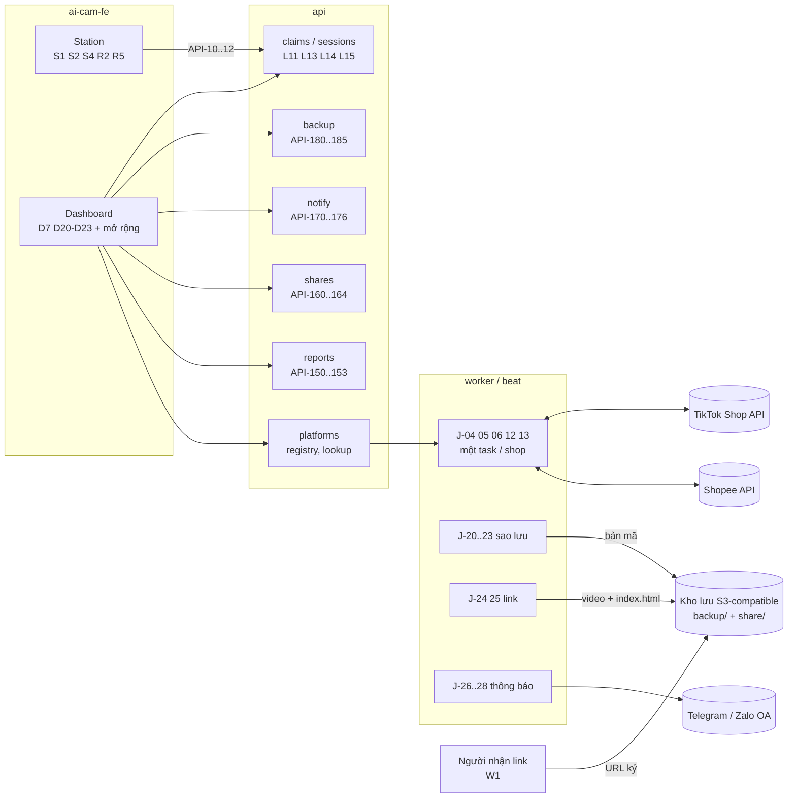
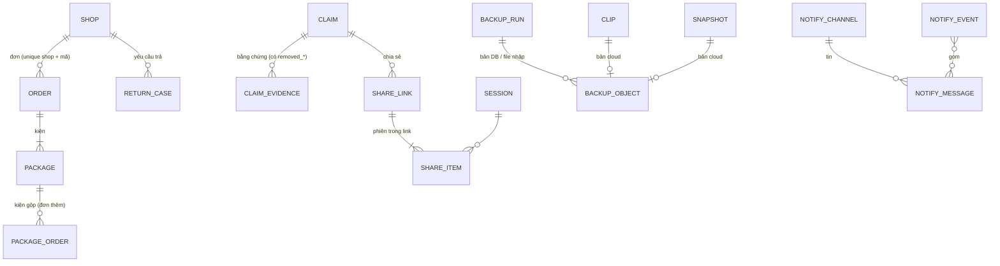
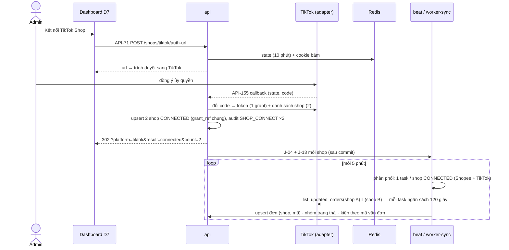
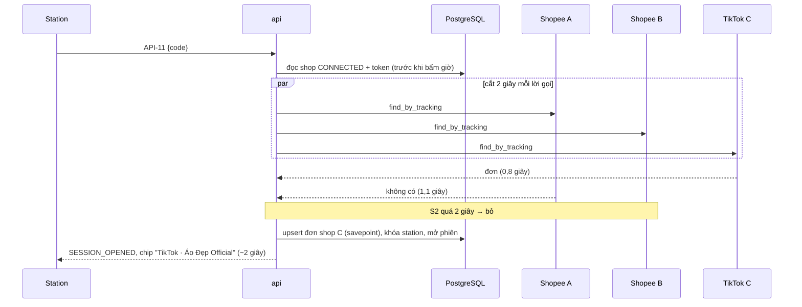
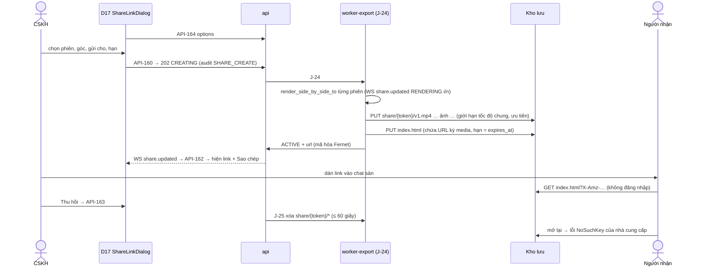
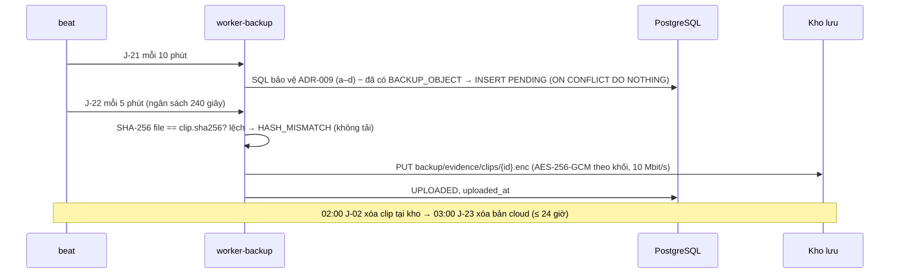
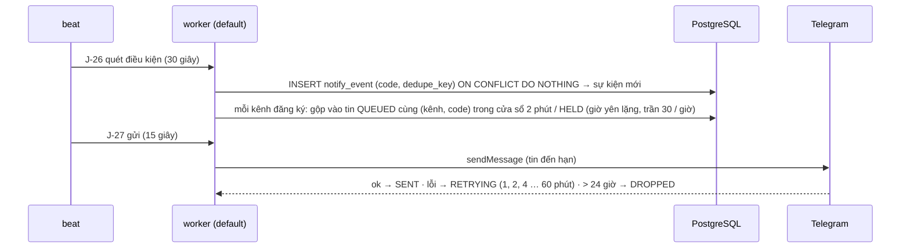

# Tech Spec (tổng quan & contract) — 03 Mở rộng: TikTok Shop, báo cáo, sao lưu cloud, link chia sẻ, thông báo

| | |
|---|---|
| Tác giả (Architect) | khanhtt (agent soạn, tự quyết theo ủy quyền user) |
| Reviewer | BE lead · FE lead (khanhtt, solo — review ở bước 5) |
| Trạng thái | **In review** · v0.1 |
| SRS | [01-srs.md](01-srs.md) v0.2 (G1 ✅ DEC-427) · FR phủ: FR-02.08, 02.13–02.18, FR-03.03, 03.16, FR-04.14, FR-05.07, 05.08, 05.13–05.22, FR-06.04, 06.07–06.11, FR-07.01, 07.05, 07.07–07.09, FR-08.07–08.10, FR-09.01–09.07, FR-10.02, 10.03 (46 FR) |
| Spec con | BE: [02a-be-spec.md](02a-be-spec.md) · FE: [02b-fe-spec-admin.md](02b-fe-spec-admin.md), [02b-fe-spec-station.md](02b-fe-spec-station.md) · W1 (trang người nhận link) do BE dựng — không có 02b riêng (DEC-428) |
| Nền | Contract Phase 1 [item 01 02 v0.7](../01-packing-mvp/02-tech-spec.md) §6 (quy ước giữ nguyên) · Phase 2 [item 02 02 v0.5](../02-returns-reconciliation/02-tech-spec.md) · [architecture.md](../../system/architecture.md) · ADR-001..009 · **ADR mới:** [ADR-010](../../system/decisions/ADR-010-shared-cloud-object-store.md) (kho lưu cloud dùng chung), [ADR-011](../../system/decisions/ADR-011-multi-platform-shops-status-groups.md) (nhiều sàn / shop, nhóm trạng thái) · ADR-009 **bổ sung** (bỏ bằng chứng — L15) |
| Last update | 2026-10-06 · Architect |

> **TL;DR** — Mở rộng hệ thống Phase 2, không dựng mới: `platforms` thành **đa sàn đa shop** (adapter TikTok thứ hai + mock; nhóm trạng thái chung; mã đơn duy nhất trong shop; job một task / shop) — ADR-011. Bốn module BE mới: `cloud` (S3-compatible + mã hóa), `backup`, `shares`, `notify`; `reports` thêm 3 báo cáo + CSV. Hardening L11 / L13 / L14 / L15 trong `sessions`, `claims`, `reports`, `media.protection`.
> Kho lưu cloud **một** bucket riêng tư, chỉ gọi ra ngoài: sao lưu mã hóa AES-256-GCM tại kho; link chia sẻ = URL ký ≤ 7 ngày của trang HTML tĩnh, thu hồi = xóa đối tượng (ADR-010). Thông báo = bộ quét điều kiện 30 giây + hàng đợi chống spam → Telegram / Zalo OA (mock sink ở dev).
> 26 API mới (API-150..156, 160..164, 170..176, 180..186 — gồm 1 CLI) + mở rộng 25 API cũ, chỉ thêm trường / mã — client cũ không vỡ, vẫn `/v1`. 2 migration (0006 thêm, 0007 unique theo shop), downgrade sang `phase3_archive`.
> Rủi ro lớn nhất: API TikTok chưa xác minh (Q18, Q19) → adapter + bảng ánh xạ riêng, mock; nhà cung cấp kho lưu (Q20) phải phục vụ được `text/html` qua URL ký.

---

## 1. Bối cảnh

Giải quyết P7–P12 của [01](01-srs.md) §2. Hiện trạng (nhánh `main` sau PR #2): một sàn / một shop (`orders/models.py:11` `PLATFORMS = ("SHOPEE",)`, `orders/models.py:61-62` mã đơn unique toàn cục, `platforms/service.py:341-351` kết nối shop mới ngắt shop cũ); một adapter cho mọi job (`platforms/service.py:146` `get_adapter()`, J-05 / J-06 dùng token một shop `service.py:210` `lookup_target`); lõi đọc chữ trạng thái Shopee (`base.py:9`, `reconciliation/rules.py:32`, `returns/service.py:52,83`, `sync.py:204`, `sessions/service.py:156`); báo cáo chỉ có ngày (`reports/service.py`); sao lưu `pg_dump` cùng máy (`docker/backup/pg-backup.sh`); xuất bằng chứng qua file (API-43..45, J-16); cảnh báo chỉ trên dashboard. [architecture.md §7.3](../../system/architecture.md) dự kiến `media.backup_pending` đẩy **mọi** clip — đổi theo DEC-406 (chỉ bằng chứng cần giữ).

## 2. Goals / Non-goals

| Goals | Non-goals |
|---|---|
| Contract đủ để BE, FE station, FE dashboard, QA làm song song | Lazada; gửi khiếu nại / tranh chấp lên sàn qua API (DEC-208) |
| TikTok + nhiều shop Shopee chạy cùng lúc, một shop lỗi không trễ shop khác > 1 chu kỳ (NFR-39); lõi không chứa chữ trạng thái TikTok (NFR-28) | Webhook sàn (giữ polling — ADR-007); token bucket theo shop (backlog ADR-007) |
| Quét mã lạ ≤ 3 giây p95 khi tra song song 4 shop (NFR-01, BR-32) | Đếm lượt xem link (DEC-410); trang lỗi tùy biến khi link hết hạn (EX-S4) |
| Bằng chứng cần giữ có bản cloud ≤ 1 giờ, DB ≤ 6 giờ, nhà cung cấp chỉ thấy bản mã (NFR-40, 41) | Sao lưu video thô; đổi khóa sao lưu (backlog) |
| Link ≤ 3 phút, thu hồi ≤ 60 giây khi kho có Internet (NFR-42) | Email / SMS / ZNS (DEC-412) |
| Tin Cao ≤ 3 phút p95, không mất tin khi mất mạng ≤ 24 giờ (NFR-43) | Tài khoản cá nhân cho người đóng gói (DEC-1) |
| Báo cáo kỳ 92 ngày ≤ 3 giây p95 (NFR-37) | Biểu đồ đẹp (FR-09.07 là C — trả dữ liệu `series`, FE làm nếu còn thời gian) |
| Tương thích ngược `/v1`: chỉ thêm trường / giá trị enum / mã / API | L12, L16..L23 (DEC-420) |
| Mọi tích hợp ngoài có cờ bật / tắt + adapter mock: TikTok (mock), S3 (MinIO ở compose dev), Telegram / Zalo (mock sink) | Kiểm với TikTok / bucket / bot thật — "chưa test, thiếu tài nguyên" (CO-07) |

## 3. Hiện trạng & tác động (reuse-first)

| Thành phần | Component | Hiện có (file:line) | REUSE / EXTEND / NEW | Thay đổi |
|---|---|---|:---:|---|
| `PlatformAdapter` + model chung | be | `platforms/base.py:114` (Protocol), `:22` `PlatformOrder`, `:54` `PlatformReturn`, `:9` `CANCELLED_STATUSES` | EXTEND | `code` = sàn; `exchange_code` trả **danh sách** shop; `PlatformOrder.status_group`, `fulfilled_by_platform`, `merged_order_sns`; `PlatformReturn.status_group` 5 nhóm + `is_exchange`; bỏ `CANCELLED_STATUSES` khỏi lõi |
| Chọn adapter, kết nối shop | be | `platforms/service.py:146` `get_adapter`, `:194` `connected_shop`, `:210` `lookup_target`, `:290` `handle_callback` (`:341-351` ngắt shop khác) | EXTEND | `registry.adapter_for(platform)`; bỏ ngắt shop khác; API-71 theo sàn; API-154 ngắt; API-155 callback TikTok |
| Adapter Shopee + mock | be | `platforms/shopee/{adapter,client,mapping,returns_mapping}.py`, `platforms/mock/adapter.py` | EXTEND | `mapping.py` trả nhóm chung (đơn + yêu cầu trả); mock nhiều shop |
| Adapter TikTok | be | — (architecture §10.1 dự kiến `code = "TIKTOK"`) | NEW | `platforms/tiktok/{client,adapter,mapping,returns_mapping}.py` + `platforms/mock/tiktok.py` + fixture — **chưa test thật (Q18, Q19)** |
| Job đồng bộ J-04/05/06/12/13 | be | `platforms/sync.py:329` `sync_orders` (lặp shop, không cô lập lỗi), `:372` J-05, `:475` J-06 (một token), `:713` J-13 (đã cô lập — DEC-361) | EXTEND | Một task / shop (fan-out), ngân sách thời gian, J-05 / J-06 theo shop của kiện; khóa grant khi làm mới token |
| Tra sàn khi quét | be | `sessions/service.py:272` `_lookup_platform`, `sessions/return_scan.py:67` `platform_find` | EXTEND | Một hàm `platforms.lookup.find_everywhere()` song song mọi shop (BR-32) |
| Đơn / kiện | be | `orders/models.py:56` `Order` (`:62` unique), `orders/service.py:228` `upsert_platform_order` (`:271` gắn kiện của đơn khác), `:394` `is_cancelled` | EXTEND | Unique (shop, mã đơn); nhận đơn file; EX-T2; nhóm trạng thái; bảng `package_order` (kiện gộp) |
| Lõi đọc chữ Shopee | be | `reconciliation/rules.py:32,33`, `returns/service.py:52,83-108`, `sessions/return_scan.py:245`, `sessions/service.py:156`, `orders/packages.py:562`, `platforms/sync.py:204` | EXTEND | Đọc `platform_status_group` / `shop.platform` (NFR-28) |
| Hủy phiên RETURN, duyệt | be | `sessions/service.py:761` `cancel`, `approvals/service.py:317` CANCEL_SESSION | EXTEND | BR-37 (≤ 60 giây, chưa kết luận / ảnh), lý do bắt buộc khi Supervisor hủy |
| Bằng chứng tự chọn, bỏ bằng chứng | be | `claims/service.py:258` `auto_evidence`, `:682` `set_evidence` (xóa dòng), `:276` `_deadline` | EXTEND | BR-39 phiên trước; bỏ mềm (BR-38); hạn đã qua (BR-42) |
| Bảo vệ bằng chứng (ADR-009) | be | `media/protection.py:80` `claim_session_ids`, `:92` `claim_snapshot_ids` | EXTEND | Tính `removed_at`; dùng lại cho tập "bằng chứng cần giữ" (BR-33) |
| Dựng video có chữ | be | `media/exports.py:328` `render_side_by_side_to` | REUSE | Link chia sẻ dùng lại |
| Gói bằng chứng J-16 | be | `claims/pack.py:325` `_session_rows` | EXTEND | Phiên chính = phiên mở hoàn có clip sớm nhất |
| Báo cáo | be | `reports/service.py` (API-32), `_return_attention` `:283` | EXTEND + NEW | Attention mới; API-150..153 |
| Cài đặt / sức khỏe | be | `settings/models.py`, `settings/schemas.py:88` `HealthOut` | EXTEND | Trường mới; `backup` trong API-81 |
| Sao lưu | be | `docker/backup/pg-backup.sh` (local 14 ngày), `docs/ops.md` §6 | REUSE + NEW | Giữ bản local; thêm module `backup` (cloud) + lệnh khôi phục |
| Kho lưu cloud | be | — | NEW | Module `cloud` (ADR-010); MinIO trong `compose.dev.yml` |
| Link chia sẻ, W1 | be | — | NEW | Module `shares`; template HTML W1 |
| Thông báo | be | — | NEW | Module `notify` |
| Audit, quyền | be | `core/audit.py:15` `ACTIONS`, `users/permissions.py` | EXTEND | Action + quyền mới |
| Schema guard | be | `core/schema_guard.py:24` `SCHEMA_HEAD = "0005"` | EXTEND | `0007` |
| Station S1/S2/S4/R2/R5 | fe: station | `features/station/{ReadyPanel,PackingPanel,AlertOverlay}.tsx`, `returns/{InspectingPanel,OperatorDialog}.tsx`, `useServerClock.ts` | EXTEND | Chip sàn, người đóng gói, kiện gộp, luật hủy 60 giây |
| D7 Kết nối Shopee | fe: admin | `features/platforms/ShopeePage.tsx`, route `settings/shopee` (`app/routes.tsx`) | EXTEND | "Kết nối sàn" `/admin/settings/platforms`, đường cũ chuyển hướng |
| D2, D3, D4, D8, D10, D13, D14, D15, D16, D17 | fe: admin | `features/{reports,orders,settings,audit,approvals,returns,reconciliation,claims}/*` | EXTEND | Theo 01 §10.5 |
| D20–D23, `ShareLinkDialog`, `PlatformChip` | fe: admin | — (mẫu `EvidencePackDialog`, `KpiCard`, `StatusChip`) | NEW | `features/{reports,shares,notify,backup}/` |

## 4. Kiến trúc

Không đổi [architecture.md §3](../../system/architecture.md) (on-premise, modular monolith). Phần mới:



| Thành phần | Trách nhiệm | Spec chi tiết |
|---|---|---|
| `platforms` | Registry adapter theo sàn; kết nối / ngắt nhiều shop; tra song song (BR-32); fan-out job; nhóm trạng thái | 02a |
| `platforms/tiktok` (mới) | Ký request, OAuth + danh sách shop, đơn, kiện, vận chuyển, yêu cầu hủy, yêu cầu trả; ánh xạ §5.3 | 02a |
| `orders`, `returns`, `reconciliation`, `sessions` | Unique theo shop, EX-T2, kiện gộp; đọc nhóm; BR-37 | 02a |
| `claims`, `media.protection` | BR-38, 39, 42; bảo vệ theo `removed_at` | 02a |
| `reports` | API-32 mở rộng, API-150..153 | 02a |
| `cloud` (mới) | Client S3, mã hóa `AICAMENC1`, giới hạn tốc độ chung | 02a |
| `backup` (mới) | J-20..23, API-180..185, lệnh khôi phục / kiểm | 02a |
| `shares` (mới) | API-160..164, J-24 / J-25, trang W1 | 02a (W1 nội dung §6.3) |
| `notify` (mới) | Kênh, quét điều kiện N01..N10, chống spam, gửi | 02a |
| Station client | Chip sàn, người đóng gói, kiện gộp, S4 yêu cầu hủy, luật hủy 60 giây | 02b-station |
| Dashboard client | D7, D20–D23, ShareLinkDialog, PlatformChip, mở rộng 10 màn | 02b-admin |

Phụ thuộc module (thêm vào architecture §4.2): `shares → claims, media, cloud`; `backup → cloud, media (protection)`; `notify → reports (đọc), approvals, stations, platforms, claims, returns, reconciliation, backup` (chỉ đọc qua `queries`/SQL); `reports → orders, sessions, returns, claims`. Module vẫn chỉ gọi nhau qua `service` / `queries`; `cloud` không biết nghiệp vụ.

## 5. Data model (chung)

Kiểu chi tiết, index, migration → 02a §3. Tên trường là tên dùng trong API.



### 5.1 Thực thể mới / đổi

| Thực thể | Field chính (tên API) | Ghi chú |
|---|---|---|
| SHOP (đổi) | `platform` (`SHOPEE`/`TIKTOK`), `name`, `region` (null), `auth_status`, `auth_expires_at`, `last_synced_at`, `last_error`, + `sync_warnings[]` `{code, message, at, tracking_number?}` (≤ 20, mới nhất trước), `disconnected_at`, `disconnected_by` | Nhiều shop `CONNECTED` cùng lúc (bỏ DEC-12). Token mã hóa Fernet như cũ; `grant_ref`, `shop_cipher` không trả API |
| ORDER (đổi) | + `shop` `{id, name, platform}` \| null (đơn file chưa gắn shop), `platform_status` (chữ sàn), `platform_status_group` (§5.2), `merged_orders[]` (kiện gộp) | Unique (shop, `platform_order_sn`) — BR-29 |
| PACKAGE_ORDER (mới) | (kiện, đơn) — đơn **thêm** cùng mã vận đơn | FR-05.22 (S, chờ Q19) |
| RETURN_CASE (đổi) | + `platform`, `shop` `{id, name}`, `platform_status_group` (§5.2), `response_due_at`, `response_due_source` (`PLATFORM`/`DEFAULT`) (chỉ đọc, tính lúc đọc — DEC-451), `claim` `{id, code}` \| null | Unique (shop, `platform_return_sn`) |
| SESSION (đổi) | `operator_name` nay có cả ở phiên PACK (người đóng gói — FR-03.16); `self_cancel_until` (phiên RETURN `OPEN`, chỉ đọc); flag mới `AMBIGUOUS_SHOP` | |
| CLAIM (đổi) | + `submitted_at`, `result_at` (chỉ đọc); `deadline_source` thêm `DEFAULT_PLATFORM_PASSED` | BR-41, BR-42 |
| CLAIM_EVIDENCE (đổi) | + `removed` `{at, by {id, display_name}, reason, keep_until}` \| null; `prior_return` (bool), `primary` (bool), `removal_keep_until` (chỉ đọc) | BR-38, BR-39; dòng không bị xóa |
| SHARE_LINK (mới) | `id`, `status` (§5.2), `source` `{type: CLAIM\|SESSION, claim_id, claim_code, package_id, tracking_number, platform, shop_name}`, `recipient` (3–100), `layout` (`SIDE_BY_SIDE`/`CAM1`), `include_snapshots`, `session_count`, `expires_at`, `created_by`, `created_at`, `revoked_at`, `revoked_by`, `revoke_pending`, `url` (chỉ khi `ACTIVE`), `progress`, `step`, `error` | Thư mục cloud `share/{token}/` (token 256 bit, không trả API) |
| SHARE_ITEM (mới) | `session_id`, `order` (1..4), `video_sha256`, `size_bytes`, `source_sha256` `{CAM1, CAM2}`, `snapshot_count` | |
| BACKUP_RUN (mới) | `id`, `kind` (`DB`), `started_at`, `finished_at`, `status` (`RUNNING`/`SUCCESS`/`FAILED`), `size_bytes`, `error` | Giữ 400 ngày; D23 hiện 14 ngày |
| BACKUP_OBJECT (mới) | `kind` (`DB_DUMP`/`IMPORTS`/`CLIP`/`SNAPSHOT`), `clip_id` \| `snapshot_id` \| `run_id`, `status` (§5.2), `sha256` (bản gốc), `size_bytes`, `attempts`, `uploaded_at`, `cloud_deleted_at`, `last_error` | BR-33; không trả danh sách đầy đủ qua API (chỉ số đếm + API-185 lỗi) |
| NOTIFY_CHANNEL (mới) | `id`, `name` (2–40, unique), `type` (`TELEGRAM`/`ZALO_OA`), `target` (chat ID / Zalo user ID), `events[]` (N01..N10, ≥ 1), `enabled`, `last_status` (`OK`/`ERROR`/`NEVER`), `last_sent_at`, `last_error` | Bot token / khóa OA ở cấu hình máy chủ (DEC-408); token Zalo xoay vòng lưu DB mã hóa (DEC-445) |
| NOTIFY_EVENT (mới, nội bộ) | `code`, `severity`, `dedupe_key`, `occurred_at`, `data` (không chứa dữ liệu người mua) | Bỏ trùng theo (`code`, `dedupe_key`) — BR-36 (1) |
| NOTIFY_MESSAGE (mới) | `id`, `channel`, `event_code`, `item_count`, `text`, `status` (§5.2), `attempts`, `last_error`, `created_at`, `send_after`, `sent_at`, `next_attempt_at` | Giữ 30 ngày |
| SETTING (đổi) | + `packer_name_required` (false), `refund_only_default_hours` (48), quiet hours `{enabled: true, start: "22:00", end: "07:00"}` (qua API-176), sao lưu `{enabled, confirmed_fingerprint, confirmed_at, confirmed_by, upload_mbps: 10, all_pack_clips: false}` (qua API-180..182) | Bí mật mới chỉ ở biến môi trường (§8) |

### 5.2 Enum mới (FE map nhãn tiếng Việt theo 01 §10)

| Enum | Giá trị → nhãn |
|---|---|
| `platform` | `SHOPEE` Shopee · `TIKTOK` TikTok Shop |
| `platform_status_group` (đơn — BR-30) | `UNPAID` Chờ thanh toán · `AWAITING_SHIPMENT` Chờ giao · `SHIPPED` Đã giao ĐVVC · `DELIVERED` Đã giao · `CANCEL_REQUESTED` Đang yêu cầu hủy · `CANCELLED` Đã hủy · `RETURNING` Hoàn về người bán · `UNKNOWN` Không rõ |
| `return_case.platform_status_group` (BR-31) | `REQUESTED` Chờ người bán duyệt · `ACCEPTED` Đã chấp nhận · `CANCELLED` Đã hủy · `DONE` Đã hoàn tiền · `CLOSED` Đã đóng |
| `session.flags` (thêm) | `AMBIGUOUS_SHOP` Mã có ở nhiều shop |
| `claim.deadline_source` (thêm) | `DEFAULT_PLATFORM_PASSED` Hạn sàn đã qua — dùng mặc định |
| `alert.code` (WS-01 / API-11, thêm) | `ORDER_CANCEL_REQUESTED` Đơn đang yêu cầu hủy |
| `share.status` | `CREATING` Đang tạo · `ACTIVE` Đang hoạt động · `FAILED` Lỗi · `REVOKED` Đã thu hồi · `EXPIRED` Hết hạn |
| `share.layout` | `SIDE_BY_SIDE` Ghép Cam 1 + Cam 2 · `CAM1` Chỉ Cam 1 |
| `backup.state` | `ON` Đang bật · `NOT_CONFIGURED` Chưa cấu hình · `KEY_UNCONFIRMED` Chưa xác nhận khóa · `KEY_CHANGED` Khóa đã đổi · `DISABLED` Đã tắt |
| `backup_object.status` | `PENDING` Đang chờ · `UPLOADING` Đang tải · `UPLOADED` Đã sao lưu · `FAILED` Lỗi (đang thử lại) · `HASH_MISMATCH` Lệch mã băm · `CLOUD_DELETED` Đã xóa trên cloud |
| `notify_channel.type` | `TELEGRAM` Telegram · `ZALO_OA` Zalo OA |
| `notify.event_code` (§7.5 01) | `N01`..`N10` (nhãn + mức trả trong API-170 `events[]`) |
| `notify_message.status` (01 §7.4) | `QUEUED` Đang chờ · `HELD` Tạm giữ (giờ yên lặng / vượt trần) · `SENT` Đã gửi · `RETRYING` Lỗi · đang thử lại · `DROPPED` Bị bỏ · `SKIPPED` Trùng, bỏ qua |
| `attention.kind` (API-32, thêm) | `REFUND_ONLY_PENDING`, `CLAIM_OVERDUE`, `RETURN_SESSION_DROPPED`, `BACKUP_STALE` (§6.2 API-32) |

### 5.3 Nhóm trạng thái theo sàn (ADR-011)

Bảng ánh xạ nằm trong `platforms/<sàn>/mapping.py`; lõi chỉ thấy cột "Nhóm". TikTok là **giả định theo tài liệu công khai — chưa xác minh (Q19)**.

| Nhóm | Shopee (đang chạy) | TikTok Shop (giả định) | Lõi làm gì |
|---|---|---|---|
| `UNPAID` | UNPAID | UNPAID, ON_HOLD | Không đồng bộ vào danh sách đóng gói |
| `AWAITING_SHIPMENT` | READY_TO_SHIP, PROCESSED, RETRY_SHIP | AWAITING_SHIPMENT, PARTIALLY_SHIPPING, AWAITING_COLLECTION | Mở phiên được |
| `SHIPPED` | SHIPPED | IN_TRANSIT | J-06 → `HANDED_OVER`; BR-10 |
| `DELIVERED` | TO_CONFIRM_RECEIVE, COMPLETED | DELIVERED, COMPLETED | → `DELIVERED` |
| `CANCEL_REQUESTED` | IN_CANCEL | đơn có yêu cầu hủy `PENDING` (nhóm Cancellation) | Chặn mở phiên (BR-01, alert `ORDER_CANCEL_REQUESTED`); đang đóng → cờ BR-21 |
| `CANCELLED` | CANCELLED | CANCELLED | `CANCELLED` / `CANCELLED_AFTER_PACK` (BR-11) |
| `RETURNING` | TO_RETURN (+ vận chuyển giao thất bại / COD từ chối qua `warehouse_hint`) | vận chuyển giao thất bại / trả về người bán | `RETURN_EXPECTED` + hồ sơ "Giao thất bại" |
| `UNKNOWN` | chữ lạ | chữ lạ | Không đổi trạng thái kho, log `platform_status_unknown` |

| Nhóm yêu cầu trả | Shopee (đang chạy) | TikTok (giả định) |
|---|---|---|
| `REQUESTED` | REQUESTED, JUDGING, SELLER_DISPUTE | RETURN_OR_REFUND_REQUEST_PENDING |
| `ACCEPTED` | PROCESSING, ACCEPTED | AWAITING_BUYER_SHIP, BUYER_SHIPPED_ITEM, RECEIVE_REJECTED (đang tranh chấp nhận hàng) |
| `CANCELLED` | CANCELLED | REQUEST_REJECTED, RETURN_OR_REFUND_REQUEST_CANCEL |
| `DONE` | REFUND_PAID | RETURN_OR_REFUND_REQUEST_COMPLETE (đã hoàn tiền) |
| `CLOSED` | CLOSED | (đóng không hoàn tiền) |

Loại yêu cầu TikTok (BR-31): `REFUND_ONLY` → `needs_parcel = false` → hồ sơ "Chỉ hoàn tiền"; `RETURN_AND_REFUND` → "Khách trả hàng"; `REPLACEMENT` → "Khách trả hàng", `is_exchange = true` (lý do hiện "Đổi hàng").

## 6. API contract

**Quy ước chung:** Không đổi — [item 01 02 §6](../01-packing-mvp/02-tech-spec.md#6-api-contract) (base `/api/v1`, Bearer + refresh cookie, `snake_case`, giờ UTC `Z`, UUID v7, phân trang `page`/`page_size` ≤ 100, khung lỗi `{error: {code, message, details}}`, lỗi chung 401/403/404/413/422/429/500, body ≤ 1 MB) + [item 02 02 §6](../02-returns-reconciliation/02-tech-spec.md#6-api-contract) (khóa lạc quan `version`, URL media ký, mã hiển thị). Thêm:

| Chủ đề | Quy ước |
|---|---|
| Tương thích | Chỉ thêm trường / giá trị enum / mã lỗi / API. Ngoại lệ có chủ đích (ghi rõ ở API): API-12 phiên RETURN có thể trả `409 CANCEL_REQUIRES_SUPERVISOR`; API-21 `CANCEL_SESSION` phiên RETURN bắt `note`; API-134 bỏ **mọi** bằng chứng bắt `note`; API-32 `SYNC_ERROR` chỉ trả cho ADMIN |
| Lọc sàn / shop | Mọi danh sách có lọc sàn dùng `platform` (`SHOPEE`/`TIKTOK`) + `shop_id` (uuid); `shop_id` không thuộc `platform` → danh sách rỗng (không lỗi) |
| Kỳ báo cáo | `from`, `to` = `YYYY-MM-DD` giờ Việt Nam, gồm cả hai đầu; `to − from + 1 ≤ 366`; `to ≤ hôm nay` |
| Lỗi tích hợp ngoài | `503 *_NOT_CONFIGURED` = chưa cấu hình / cờ tắt (FE khóa nút + chữ hướng dẫn); `502 CLOUD_AUTH_FAILED` / `CLOUD_ERROR` / `NOTIFY_SEND_FAILED` = bên ngoài trả lỗi; `504 CLOUD_UNREACHABLE` / `NOTIFY_TIMEOUT` = không kết nối được trong thời hạn |
| Bí mật | Không API nào trả token sàn, khóa kho lưu, khóa sao lưu, bot token, `shop_cipher`, token thư mục link; chỉ dấu vân tay khóa sao lưu (API-180) |

### 6.1 Danh sách API

**Mới**

| ID | Method + path / event | Mục đích | Quyền | FR | Client |
|---|---|---|---|---|---|
| API-150 | `GET /reports/returns` | Báo cáo hàng hoàn | ADMIN, SUPERVISOR, CSKH | FR-09.03, 09.05, 09.07 | admin D20 |
| API-151 | `GET /reports/claims` | Báo cáo khiếu nại | ADMIN, SUPERVISOR, CSKH | FR-09.04, 09.05, 09.07 | admin D20 |
| API-152 | `GET /reports/productivity` | Báo cáo năng suất | ADMIN, SUPERVISOR | FR-09.02, 09.05, FR-03.16 | admin D20 |
| API-153 | `GET /reports/{report}/export` | Xuất CSV tab đang xem | như API-150..152 theo `report` | FR-09.06 | admin D20 |
| API-154 | `POST /shops/{id}/disconnect` | Ngắt kết nối một shop | ADMIN | FR-05.13, EX-T7 | admin D7 |
| API-155 | `GET /shops/tiktok/callback` | Callback ủy quyền TikTok (công khai + `state`) | công khai | FR-05.13 | trình duyệt |
| API-156 | `GET /shops/brief` | Danh sách shop rút gọn cho bộ lọc sàn / shop | ADMIN, SUPERVISOR, CSKH | FR-07.01, 09.05 | admin D3, D14, D15, D16, D20 |
| API-160 | `POST /shares` | Tạo link chia sẻ (nền) | ADMIN, SUPERVISOR, CSKH | FR-07.05 | admin ShareLinkDialog |
| API-161 | `GET /shares` | Danh sách link + số theo trạng thái | ADMIN, SUPERVISOR, CSKH | FR-07.09 | admin D21, D4, D17 |
| API-162 | `GET /shares/{id}` | Trạng thái / chi tiết một link | ADMIN, SUPERVISOR, CSKH | FR-07.05, 07.09 | admin |
| API-163 | `POST /shares/{id}/revoke` | Thu hồi | ADMIN, SUPERVISOR; CSKH chỉ link mình tạo | FR-07.08 | admin |
| API-164 | `GET /shares/options` | Phiên / ảnh chọn được cho dialog | ADMIN, SUPERVISOR, CSKH | FR-07.05, BR-35, EX-S3 | admin ShareLinkDialog |
| API-170 | `GET /notify/channels` | Kênh + trạng thái nhà cung cấp + giờ yên lặng + danh mục sự kiện | ADMIN | FR-06.04, 06.07 | admin D22 |
| API-171 | `POST /notify/channels` | Thêm kênh | ADMIN | FR-06.04 | admin D22 |
| API-172 | `PATCH /notify/channels/{id}` | Sửa kênh | ADMIN | FR-06.04, 06.07 | admin D22 |
| API-173 | `DELETE /notify/channels/{id}` | Xóa kênh (tin chờ → bỏ) | ADMIN | FR-06.04 | admin D22 |
| API-174 | `POST /notify/channels/{id}/test` | Gửi thử (≤ 10 giây) | ADMIN | FR-06.10 | admin D22 |
| API-175 | `GET /notify/messages` | Nhật ký gửi 30 ngày | ADMIN | FR-06.10 | admin D22 |
| API-176 | `PUT /notify/quiet-hours` | Giờ yên lặng | ADMIN | FR-06.08 | admin D22 |
| API-180 | `GET /backup` | Trạng thái sao lưu + lịch sử 14 ngày | ADMIN | FR-02.15, 02.17, 02.18 | admin D23 |
| API-181 | `PUT /backup/settings` | Bật / tắt, tốc độ tải, sao lưu mọi clip đóng gói | ADMIN | FR-02.15, 02.18, NFR-44 | admin D23 |
| API-182 | `POST /backup/confirm-key` | Xác nhận đã cất khóa (theo dấu vân tay) | ADMIN | FR-02.17 | admin D23 |
| API-183 | `POST /backup/test` | Kiểm tra kết nối kho lưu (≤ 10 giây) | ADMIN | FR-02.17 | admin D23 |
| API-184 | `POST /backup/run-db` | Sao lưu DB ngay | ADMIN | FR-02.15 | admin D23 |
| API-185 | `GET /backup/issues` | Danh sách lệch mã băm / lỗi tải | ADMIN | EX-K6 | admin D23 |
| API-186 | CLI `aicam backup-restore`, `aicam backup-verify`, `aicam backup-keygen` | Khôi phục, kiểm SHA-256, tạo khóa | ops (dòng lệnh) | FR-02.16 | — |
| W1 | `GET <kho lưu>/share/{token}/index.html?X-Amz-…` | Trang người nhận link | ai có link còn hạn | FR-07.07 | trình duyệt người nhận |
| WS-02 | `share.updated`, `backup.updated`, `shop.updated` | Làm mới D21 / dialog, D23, D7 | ADMIN, SUPERVISOR, CSKH (`backup.updated`, `shop.updated` chỉ ADMIN) | FR-07.05, 02.15, 05.13 | admin |

**Mở rộng (chỉ thêm, trừ ngoại lệ đã ghi)**

| ID | Thay đổi | FR |
|---|---|---|
| API-04 `/me` | `permissions` thêm `reports.returns`, `reports.claims`, `reports.productivity`, `shares.create`, `shares.read`, `shares.revoke_any`, `notify.manage`, `backup.manage`, `backup.read` (§8 AuthZ) | FR-10.02 |
| API-10 / WS `station.state` | `station.operator_required`; `session.package.order.{platform, shop_name, merged_orders[]}`; `items[].platform_order_sn` (kiện gộp); `session.self_cancel_until` (RETURN) | FR-03.03, 03.16, 05.22, 04.14 |
| API-11 | `alert.code` thêm `ORDER_CANCEL_REQUESTED`; `OPERATOR_REQUIRED` nay cả chế độ PACK khi bật `packer_name_required`; cờ phiên `AMBIGUOUS_SHOP`; `ORDER_CANCELLED` câu chữ không còn "Shopee" | FR-05.17, 05.19, 03.16 |
| API-12 | Phiên RETURN ngoài BR-37 → `409 CANCEL_REQUIRES_SUPERVISOR` (**mới, có chủ đích**) | FR-04.14 |
| API-20 | Item phiên RETURN thêm `return_summary {conclusion, snapshot_count, opened_at}` | FR-04.14 |
| API-21 | `CANCEL_SESSION` cho phiên RETURN bắt `note` 5–500 (**mới, có chủ đích**) | FR-04.14 |
| API-30 | Lọc `platform`, `shop_id`; `session_status` nhận nhiều giá trị cách dấu phẩy (D2 → D3 phiên hủy / bỏ dở); item thêm `platform`, `shop {id, name}` | FR-07.01, 09.01 |
| API-31 | `order.{platform, shop, platform_status_group, merged_orders[]}`; `shares[]` (≤ 3 đang hoạt động gần nhất) + `shares_active_count`; `sessions[]` PACK có `operator_name` | FR-07.01, 07.09, 03.16 |
| API-32 | `counts` + `attention` mới; `SYNC_ERROR` thêm trường, chỉ ADMIN; `RETURN_SESSION_ABANDONED` chỉ còn phiên `AUTO_CLOSE_BLOCKED` | FR-09.01, 08.08, 08.10, 02.15, 05.14 |
| API-70 | `platforms[]` (cấu hình từng sàn); item thêm `region`, `sync_warnings[]`, `disconnected_at`, `sync_in_progress`; trả cả shop đã ngắt | FR-05.13, 05.14, 05.20 |
| API-71 | Path tổng quát `POST /shops/{platform}/auth-url` (`shopee` \| `tiktok`) — đường cũ `/shops/shopee/auth-url` giữ nguyên nghĩa | FR-05.13 |
| API-72 | Không ngắt shop khác; redirect `/admin/settings/platforms?result=…&platform=shopee&count=1`; `state` hết hạn → `result=expired` | FR-05.14 |
| API-73 | Shop của mọi sàn; sàn tắt → 503 `PLATFORM_NOT_CONFIGURED` | FR-05.13 |
| API-80 | `packer_name_required`, `refund_only_default_hours` (1–168) | FR-03.16, 08.08 |
| API-81 | `backup {state, last_db_success_at, pending, late}`; `sync[]` thêm `platform`, `shop_name` | FR-02.15 |
| API-110 | Lọc `platform`, `shop_id`, `pending_only`, `sort`; item thêm `platform`, `shop`, `platform_status_group`, `response_due_at`, `response_due_source`, `claim` | FR-08.08, 07.01 |
| API-120, API-130 | Lọc `platform`, `shop_id`; item thêm `platform`, `shop` | FR-07.01 |
| API-131 | Hạn sàn đã qua → BR-42; bằng chứng tự chọn gồm phiên mở hoàn trước (BR-39) | FR-08.07, 08.10 |
| API-132 | `evidence[]` thêm `prior_return`, `primary`, `removal_keep_until`; `removed_evidence[]`; `prior_return_sessions[]`; `shares[]` + `shares_active_count`; `deadline_source` giá trị mới | FR-08.07, 08.09, 07.09 |
| API-134 | Bỏ **mọi** bằng chứng cần `note` 5–500 (**mới, có chủ đích**); bỏ mềm (BR-38); thêm lại bằng chứng đã bỏ = khôi phục | FR-08.09 |
| API-136..138 / zip | Phiên chính = phiên mở hoàn có clip sớm nhất; thư mục `…-phien-truoc-…` | FR-08.07 |
| API-92 | `action` mới (§6.2 API-92) | FR-10.03 |

### 6.2 Chi tiết API

<details><summary><b>API-70 mở rộng</b> — GET /shops</summary>

```json
{
  "platforms": [
    { "platform": "SHOPEE", "enabled": true,  "returns_enabled": false, "configured": true },
    { "platform": "TIKTOK", "enabled": false, "returns_enabled": false, "configured": false }
  ],
  "items": [
    { "id": "0192…", "platform": "TIKTOK", "name": "Áo Đẹp Official", "region": "VN",
      "auth_status": "CONNECTED", "auth_expires_at": "2026-10-13T03:00:00Z",
      "last_synced_at": "2026-10-06T03:04:00Z", "today_synced_orders": 58,
      "last_error": null,
      "sync_warnings": [ { "code": "TRACKING_OWNED_BY_OTHER_SHOP", "tracking_number": "812345678901",
                           "message": "Mã vận đơn 812345678901 đã thuộc đơn của shop Áo Đẹp (Shopee).", "at": "…Z" } ],
      "disconnected_at": null, "sync_in_progress": false }
  ]
}
```

- `configured` = cờ sàn bật **và** đủ khóa ứng dụng (hoặc adapter mock). `enabled = false` hoặc `configured = false` → D7 hiện "Chưa cấu hình …", nút kết nối khóa (EX-T1).
- `items` gồm cả `DISCONNECTED` (D7 "Shop đã ngắt"). Sắp theo `platform`, rồi `created_at`.
- `last_error.code` thêm (ngoài Phase 1–2): `AUTH_EXPIRED`, `REFRESH_FAILED`, `SYNC_FAILED`, `CREDENTIALS_UNREADABLE`, `SHOP_NOT_AUTHORIZED` (TikTok bỏ shop khỏi ủy quyền).
- `sync_warnings[].code`: `TRACKING_OWNED_BY_OTHER_SHOP` (EX-T2), `ORDER_SKIPPED_PLATFORM_FULFILLED` (EX-T5, chỉ log đếm — không hiện).
</details>

<details><summary><b>API-71 / API-72 / API-155 / API-154</b> — kết nối, callback, ngắt</summary>

`POST /shops/{platform}/auth-url` (`platform` = `shopee` | `tiktok`) → `200 {"url": "https://…"}` + cookie `state` như Phase 1 (G3-N7). Callback:

| Callback | Redirect `302` |
|---|---|
| API-72 `GET /shops/shopee/callback?state&code&shop_id` | `/admin/settings/platforms?platform=shopee&result=connected&count=1` |
| API-155 `GET /shops/tiktok/callback?state&code` (TikTok gửi thêm tham số khác — bỏ qua) | `/admin/settings/platforms?platform=tiktok&result=connected&count=2` |

`result`: `connected` (`count` = số shop đã thêm / cập nhật) · `denied` (không có `code`) · `expired` (`state` không còn trong Redis — quá 10 phút) · `error` (cookie lệch, đổi code lỗi, sàn tắt). Mỗi shop: tạo mới hoặc cập nhật token (không trùng); **shop khác không bị ngắt**; audit `SHOP_CONNECT` mỗi shop; J-04 + J-13 cho từng shop ngay sau commit; WS-02 `shop.updated`.

`GET /shops/brief` (API-156) → `200 {"items": [{"id", "platform", "name", "auth_status"}]}` — mọi shop (kể cả đã ngắt), sắp theo sàn rồi tên; không có lỗi riêng ngoài 401 / 403.

`POST /shops/{id}/disconnect` → `200` item shop (`auth_status = "DISCONNECTED"`, `disconnected_at`). Xóa token đã mã hóa; job đang chạy của shop dừng ở lần kiểm tiếp theo (đọc lại trạng thái dưới khóa); đơn / kiện / hồ sơ giữ nguyên (EX-T7). Đã ngắt → `200` (idempotent, không audit lại). Audit `SHOP_DISCONNECT`.

| HTTP | Mã lỗi | Khi nào | FE xử lý |
|---|---|---|---|
| 404 | NOT_FOUND | `platform` lạ (API-71) / shop không có (API-154, 73) | Toast `message` |
| 503 | PLATFORM_NOT_CONFIGURED | Sàn tắt / thiếu khóa ứng dụng; `message` theo sàn ("Chưa cấu hình TikTok Shop. Liên hệ IT để bật (cần tài khoản đối tác TikTok Shop).") | Alert trong nhóm sàn, khóa nút |
| 409 | SHOP_NOT_CONNECTED | API-73 shop chưa kết nối / hết hạn | Toast; nút "Kết nối lại" |
| 409 | SYNC_IN_PROGRESS | API-73 đang chạy | Nút khóa + "Đang đồng bộ, thử lại sau." |
| 403 | FORBIDDEN | Không phải ADMIN | D12 |
</details>

<details><summary><b>API-10 / API-11 / API-12 mở rộng</b> — station</summary>

API-10 (thêm, các trường khác không đổi):

```json
{
  "station": { "id": "…", "name": "Station 01", "kind": "PACK", "work_mode": "PACK",
               "operator_name": "Minh", "operator_required": false },
  "state": "PACKING",
  "session": {
    "id": "…", "type": "PACK", "operator_name": "Minh", "flags": [],
    "self_cancel_until": null,
    "package": { "id": "…", "tracking_number": "581234567890",
      "order": { "platform": "TIKTOK", "shop_name": "Áo Đẹp Official", "platform_order_sn": "5761234567890123",
                 "buyer_note": null, "merged_orders": [ { "platform_order_sn": "5761234567890456" } ] },
      "items": [ { "order_item_id": "…", "product_name": "Áo thun basic", "variation": "Đen / L", "quantity": 2,
                   "image_url": "…", "platform_order_sn": "5761234567890123" },
                 { "order_item_id": "…", "product_name": "Tất cổ ngắn", "variation": "Trắng", "quantity": 1,
                   "image_url": "…", "platform_order_sn": "5761234567890456" } ] }
  }
}
```

- `operator_required = true` (Admin bật `packer_name_required`) + `work_mode = PACK` + `operator_name = null` → quét trả ALERT `OPERATOR_REQUIRED` (cùng mã Phase 2 của bàn hoàn) → FE mở R5 tiêu đề "Người đóng gói".
- `order = null` → kiện chưa xác minh → chip "Chưa rõ sàn". `merged_orders` rỗng khi không gộp; `items[].platform_order_sn` luôn có khi `order` có.
- `self_cancel_until` (chỉ phiên RETURN `OPEN`): `started_at + 60 giây` nếu **chưa** lưu kết luận và **chưa** có ảnh `MANUAL`; ngược lại `null` (không còn tự hủy). FE so với giờ server (`server_time`) để đổi nút đúng giây 61 (BR-37).
- Phiên PACK mới chép `station.operator_name` vào `session.operator_name`.

API-11 alert mới / đổi:

| `alert.code` | Khi nào | `alert.data` | Station |
|---|---|---|---|
| `ORDER_CANCEL_REQUESTED` | Mở phiên PACK, đơn nhóm `CANCEL_REQUESTED` | `{ "platform": "TIKTOK" }` | S4 vàng "ĐƠN ĐANG YÊU CẦU HỦY", 2 bíp |
| `ORDER_CANCELLED` | Đơn nhóm `CANCELLED` (chữ: "… đã bị hủy trên sàn. Không đóng gói.") | `{ "platform" }` | S4 như cũ |
| `OPERATOR_REQUIRED` | Như Phase 2, nay cả PACK khi `operator_required` | `{ "mode": "PACK" \| "RETURN" }` | Overlay vàng "Nhập tên người đóng gói trước khi đóng gói." + mở R5 |

Tra sàn khi quét mã lạ (BR-32): mọi shop `CONNECTED` của sàn đang bật, song song, cắt 2 giây. Đúng 1 shop thấy → kiện gắn đơn của shop đó. ≥ 2 shop thấy → kiện chưa xác minh + cờ `AMBIGUOUS_SHOP`, sự kiện phiên ghi danh sách shop (D4 hiện "Mã có ở 2 shop: …"). 0 / quá hạn → chưa xác minh (như Phase 1).

API-12 (phiên RETURN):

| HTTP | Mã lỗi | Khi nào | FE xử lý |
|---|---|---|---|
| 409 | CANCEL_REQUIRES_SUPERVISOR | Đã mở > 60 giây, hoặc đã lưu kết luận, hoặc đã có ảnh chụp tay (BR-37) — kiểm dưới khóa station theo giờ server | Đóng dialog, Toast "Phiên đã quá 60 giây. Bấm Gọi quản lý để hủy." (`message` server), tải lại API-10 |
| 409 | SESSION_NOT_OPEN | Như cũ | như cũ |
</details>

<details><summary><b>API-20 / API-21 mở rộng</b> — yêu cầu duyệt từ phiên hoàn (L11)</summary>

API-20 item (`session_type = "RETURN"`) thêm: `"return_summary": {"conclusion": "EMPTY_BOX" | null, "snapshot_count": 3, "opened_at": "…Z"}`. D13 hiện "Đã có kết luận: Hộp rỗng · 3 ảnh · mở 4 phút".

API-21 `{"action": "CANCEL_SESSION", "note": "Quét nhầm kiện của đơn khác"}` với phiên RETURN:

| HTTP | Mã lỗi | Khi nào | FE xử lý |
|---|---|---|---|
| 422 | VALIDATION_ERROR | `note` thiếu / < 5 / > 500 ký tự sau trim — `details.fields.note = "Nhập lý do hủy (5–500 ký tự)."` | Lỗi dưới ô "Lý do hủy" |

Phiên RETURN bị hủy giữ clip theo BR-09 b và vào bằng chứng tự chọn của hồ sơ khiếu nại sau này (BR-39). Phiên PACK: không đổi.
</details>

<details><summary><b>API-30 / API-110 / API-120 / API-130 mở rộng</b> — lọc sàn / shop, Chỉ hoàn tiền</summary>

Query thêm (cả 4): `platform` (`SHOPEE`/`TIKTOK`), `shop_id`. Item thêm `"platform": "TIKTOK" | null`, `"shop": {"id", "name"} | null` (null = kiện / đơn chưa gắn shop).

API-110 thêm:

| Query | Ý nghĩa |
|---|---|
| `pending_only=true` | Chỉ hồ sơ `REFUND_ONLY` chưa có hồ sơ khiếu nại chưa đóng của đơn, nhóm sàn `REQUESTED` / `ACCEPTED` (BR-40) |
| `sort` | `due_asc` (mặc định khi `tab=NO_PARCEL`) · `created_desc` (mặc định tab khác) |

Item thêm:

```json
{ "platform_status_group": "REQUESTED",
  "response_due_at": "2026-10-08T02:00:00Z", "response_due_source": "PLATFORM",
  "claim": { "id": "…", "code": "KN-000131" } }
```

- `response_due_at` = `seller_due_at`; không có → `reported_at` + `refund_only_default_hours` (`response_due_source = "DEFAULT"`) — chỉ khi `kind = REFUND_ONLY`, còn lại `null`.
- `claim` = hồ sơ khiếu nại chưa đóng mới nhất của đơn, hoặc `null`.
</details>

<details><summary><b>API-31 mở rộng</b> — chi tiết kiện</summary>

`order` thêm `platform`, `shop {id, name}`, `platform_status_group`, `merged_orders[] {platform_order_sn}`. `sessions[]` (PACK) có `operator_name`. Thêm:

```json
"shares_active_count": 1,
"shares": [ { "id": "…", "status": "ACTIVE", "recipient": "CSKH Shopee – phiếu 98765",
              "expires_at": "…Z", "session_count": 1, "url": "https://…", "can_revoke": true } ]
```

`shares` = ≤ 3 link mới nhất (mọi trạng thái trừ `FAILED`) có phiên của kiện; `url` chỉ khi `ACTIVE`. Sự kiện phiên có `AMBIGUOUS_SHOP` thêm `{shops: [{platform, name}]}` trong dòng thời gian.
</details>

<details><summary><b>API-32 mở rộng</b> — Tổng quan D2</summary>

`counts` thêm (hiện tại, không theo ngày): `returns_dropped_7d` (phiên RETURN `CANCELLED` / `ABANDONED` có `ended_at` trong 7 ngày, **không** trừ khi kiện có phiên sau hoàn tất — L11), `refund_only_pending` (BR-40), `claims_overdue_unsent` (claim `NEW`, `deadline_at < now` — BR-42).

`attention[]` thêm:

| `kind` | Trường | Ai thấy | FE |
|---|---|---|---|
| `REFUND_ONLY_PENDING` | `count`, `nearest_due_at` | ADMIN, SUPERVISOR, CSKH | "⏱ {count} yêu cầu Chỉ hoàn tiền chưa xử lý · hạn gần nhất {dd/mm HH:mm}" → D14 `tab=NO_PARCEL&pending_only=true` |
| `CLAIM_OVERDUE` | `count` | 3 vai | "⚠ {count} hồ sơ quá hạn chưa gửi" → D16 `due=overdue&status=NEW` |
| `RETURN_SESSION_DROPPED` | `count` | 3 vai | "⚠ {count} phiên mở hoàn bị hủy / bỏ dở trong 7 ngày" → D3 `session_type=RETURN&session_status=CANCELLED,ABANDONED&date_from=…` (7 ngày) |
| `BACKUP_STALE` | `reason` (`DB_LATE` / `EVIDENCE_LATE` / `HASH_MISMATCH` / `ERROR`), `hours` (DB_LATE), `count` | **chỉ ADMIN** | "⚠ Sao lưu cloud trễ {hours} giờ" / "{count} tệp chờ quá 24 giờ" / "{count} tệp lệch mã băm" → D23 |
| `SYNC_ERROR` (đổi) | thêm `shop_name`, `platform`, `code` | **chỉ ADMIN** (trước: 3 vai) | "⚠ Shop {shop_name} ({TikTok}) hết hạn ủy quyền" (`code = AUTH_EXPIRED`) / "đồng bộ lỗi" → D7 |
| `RETURN_SESSION_ABANDONED` (đổi nghĩa) | `count` = phiên RETURN mở có cờ `AUTO_CLOSE_BLOCKED` | 3 vai | như cũ |

Cache 5 giây theo ngày giữ nguyên; lọc theo vai làm **sau** cache.
</details>

<details><summary><b>API-80 / API-81 mở rộng</b> — cài đặt, sức khỏe</summary>

API-80 thêm (GET luôn có; PUT tùy chọn, thiếu = giữ): `"packer_name_required": false`, `"refund_only_default_hours": 48` (1–168, ngoài khoảng → 422 `fields.refund_only_default_hours`). Đổi → audit `SETTINGS_UPDATE` như cũ; `packer_name_required` đổi → WS `station.state` cho mọi station.

API-81 thêm:

```json
"backup": { "state": "ON", "last_db_success_at": "…Z", "pending": 3, "late": false,
            "last_error": null },
"sync": [ { "shop_id": "…", "platform": "TIKTOK", "shop_name": "Áo Đẹp Official", "last_success_at": "…Z", "last_error": null } ]
```

`late = true` khi DB không thành công > 26 giờ **hoặc** có tệp chờ > 24 giờ **hoặc** có `HASH_MISMATCH` chưa xử lý. `state` như API-180. SUPERVISOR đọc được API-81 (D8 xem).
</details>

<details><summary><b>API-131 / API-132 / API-134 mở rộng</b> — hồ sơ khiếu nại (L11, L14, L15)</summary>

**Tạo hồ sơ (API-131, và hồ sơ tự tạo khi đóng phiên RETURN):** bằng chứng tự chọn = phiên PACK hiệu lực + **mọi** phiên RETURN của kiện / hồ sơ hàng hoàn (gồm `CANCELLED`, `ABANDONED`) có ≥ 1 clip không `DELETED` + ảnh (BR-39). Hạn: `seller_due_at` của sàn; nếu `seller_due_at < now` → `deadline_at = now + claim_deadline_days`, `deadline_source = "DEFAULT_PLATFORM_PASSED"`, ghi chú hệ thống "Hạn sàn ({dd/mm HH:mm}) đã qua khi tạo hồ sơ — dùng hạn mặc định. Kiểm hạn thật trên sàn." (BR-42).

**API-132** thêm:

```json
{
  "deadline_source": "DEFAULT_PLATFORM_PASSED",
  "prior_return_sessions": [ { "session_id": "…", "status": "ABANDONED", "started_at": "…Z" } ],
  "evidence": [
    { "id": "…", "kind": "SESSION", "auto": true, "prior_return": true, "primary": true,
      "removal_keep_until": "2027-01-04T19:00:00Z", "session": { "…": "như Phase 2" } }
  ],
  "removed_evidence": [
    { "id": "…", "kind": "SESSION", "auto": false, "session": { "…" : "…" },
      "removed": { "at": "…Z", "by": { "id": "…", "display_name": "Hoa" }, "reason": "Nhầm kiện",
                   "keep_until": "2027-01-04T19:00:00Z" } }
  ],
  "shares_active_count": 1,
  "shares": [ { "…": "như API-31 shares[]" } ]
}
```

- `prior_return` = phiên RETURN `CANCELLED` / `ABANDONED` bắt đầu trước phiên RETURN hoàn tất mới nhất của kiện (hoặc hồ sơ chưa có phiên hoàn tất). `primary` = đúng một phiên RETURN có clip sớm nhất (theo `started_at`) trong `evidence`; không có phiên RETURN → phiên PACK hiệu lực.
- `removal_keep_until` = max(`clip.end_at` muộn nhất của phiên / `taken_at` của ảnh, lúc hiện tại) + max(`retention_clip_days`, sàn) — ngày Dialog bỏ bằng chứng hiển thị (FR-08.09). `keep_until` của dòng đã bỏ = tính theo `removed.at`. Clip / ảnh còn được bảo vệ vì lý do khác thì vẫn giữ lâu hơn (Dialog ghi "trừ khi thuộc hồ sơ khác").
- `evidence[]` chỉ gồm bằng chứng đang dùng; zip / link chỉ dùng `evidence[]`.

**API-134** (thay tập bằng chứng — request không đổi `{version, session_ids, snapshot_ids, note}`):

| HTTP | Mã lỗi | Khi nào | FE xử lý |
|---|---|---|---|
| 422 | VALIDATION_ERROR | Có ≥ 1 bằng chứng bị bỏ (tự chọn **hoặc** thêm tay **hoặc** `LEGACY_HOLD`) mà `note` < 5 / > 500 ký tự — `details.fields.note = "Nhập lý do bỏ bằng chứng (5–500 ký tự)."` | Lỗi dưới ô lý do trong `RemoveEvidenceDialog` |
| 409 | VERSION_CONFLICT | Như Phase 2 | Như Phase 2 |

Bỏ = ghi `removed_*` (không xóa dòng); thêm lại phiên / ảnh đã bỏ = xóa `removed_*`. Audit `CLAIM_EVIDENCE_REMOVE` mỗi bằng chứng bị bỏ (`{evidence_id, session_id | snapshot_id, reason, keep_until}`) + `CLAIM_EVIDENCE_UPDATE` như cũ.
</details>

<details><summary><b>API-150</b> — GET /reports/returns?from&to&platform&shop_id</summary>

```json
{
  "period": { "from": "2026-09-06", "to": "2026-10-05" },
  "filters": { "platform": null, "shop_id": null },
  "generated_at": "2026-10-06T03:00:00Z",
  "cards": {
    "return_rate":   { "numerator": 40, "denominator": 1000, "value": 0.04 },
    "issue_rate":    { "numerator": 6,  "denominator": 30,   "value": 0.2 },
    "refund_only":   { "count": 6, "rate_of_handed_over": 0.006 },
    "expected_now":  41
  },
  "by_kind": [ { "kind": "BUYER_RETURN", "count": 25, "share": 0.625 },
               { "kind": "FAILED_DELIVERY", "count": 15, "share": 0.375 },
               { "kind": "UNANNOUNCED", "count": 2, "share": null } ],
  "reason_by_conclusion": {
    "conclusions": ["OK", "DAMAGED", "MISSING_ITEM", "WRONG_ITEM", "EMPTY_BOX", "OTHER"],
    "rows": [ { "reason": "ITEM_DAMAGED", "reason_label": "Hàng bị hư",
                "counts": { "OK": 4, "DAMAGED": 3, "MISSING_ITEM": 0, "WRONG_ITEM": 0, "EMPTY_BOX": 0, "OTHER": 0 }, "total": 7 } ]
  },
  "top_products": [ { "sku": "AT-DEN-L", "product_name": "Áo thun basic", "variation": "Đen / L",
                      "shipped": 320, "return_requests": 14, "rate": 0.044, "issue": 3 } ],
  "by_shop": [ { "platform": "SHOPEE", "shop_id": "…", "shop_name": "Áo Đẹp",
                 "handed_over": 700, "return_cases": 26, "rate": 0.037 } ],
  "series": [ { "bucket": "2026-09-06", "packed": 32, "return_cases": 1, "claims": 0 } ],
  "series_granularity": "day"
}
```

Công thức theo BR-41 (giờ VN): `return_rate` = hồ sơ `BUYER_RETURN` + `FAILED_DELIVERY` + `UNANNOUNCED` có `created_at` trong kỳ ÷ kiện có chuyển → `HANDED_OVER` (`status_history`) trong kỳ; `refund_only` riêng. `issue_rate` = hồ sơ `RECEIVED_ISSUE` ÷ hồ sơ `RECEIVED_*` theo `received_at` trong kỳ. `share` của `by_kind` chỉ tính 2 loại có tín hiệu sàn (`UNANNOUNCED`, `UNIDENTIFIED` → `null`). `top_products` ≤ 20, sắp theo `return_requests` giảm dần; không có SKU → gộp theo tên + phân loại. Mẫu số 0 → `value = null` (FE hiện "—"). `series_granularity`: kỳ ≤ 31 ngày `day`, ≤ 180 `week`, còn lại `month` (FR-09.07, C).

| HTTP | Mã lỗi | Khi nào | FE xử lý |
|---|---|---|---|
| 422 | VALIDATION_ERROR | `to < from` → `fields.to = "Ngày đến phải sau ngày từ."`; quá 366 ngày → `fields.from = "Chọn tối đa 366 ngày."`; `to` sau hôm nay → `fields.to = "Không chọn ngày trong tương lai."` | Lỗi dưới ô ngày, khóa "Xem" |
| 503 | REPORT_TIMEOUT | Truy vấn quá 15 giây | Alert "Không tải được báo cáo." + "Thử lại" |
| 403 | FORBIDDEN | Vai không được xem | D12 |
</details>

<details><summary><b>API-151</b> — GET /reports/claims?from&to&platform&shop_id</summary>

```json
{
  "period": { "from": "2026-09-06", "to": "2026-10-05" }, "filters": { "…": "…" }, "generated_at": "…Z",
  "cards": {
    "created": 21,
    "win_rate": { "numerator": 12, "denominator": 16, "value": 0.75 },
    "recovered_amount": 2350000,
    "submitted_before_deadline": { "numerator": 14, "denominator": 16, "value": 0.875 },
    "overdue_unsent_now": 2
  },
  "by_status": [ { "status": "NEW", "count": 3 } ],
  "by_type_result": [ { "type": "EMPTY_BOX", "won": 3, "lost": 1, "pending": 2 } ],
  "by_counterparty": [ { "counterparty": "PLATFORM", "count": 15, "won": 10, "lost": 3, "recovered_amount": 2000000 } ],
  "by_shop": [ { "platform": "SHOPEE", "shop_id": "…", "shop_name": "Áo Đẹp", "count": 15, "won": 9, "lost": 3, "recovered_amount": 1900000 } ],
  "series": [ { "bucket": "2026-09-06", "packed": 32, "return_cases": 1, "claims": 0 } ],
  "series_granularity": "day"
}
```

`created`, `by_status`, `by_type_result`, `by_counterparty`, `by_shop` theo `created_at` trong kỳ (trạng thái hiện tại). `win_rate` = `WON` ÷ (`WON` + `LOST`) theo `result_at` trong kỳ; `recovered_amount` = tổng `recovered_amount` hồ sơ `WON` theo `result_at`. `submitted_before_deadline` = hồ sơ có `submitted_at` trong kỳ và `submitted_at ≤ deadline_at` ÷ hồ sơ có `submitted_at` trong kỳ. `overdue_unsent_now` = hiện tại (BR-42). Hồ sơ `LEGACY_HOLD` không tính. Lỗi như API-150.
</details>

<details><summary><b>API-152</b> — GET /reports/productivity?from&to&platform&shop_id&station_id</summary>

```json
{
  "period": { "…": "…" }, "filters": { "platform": null, "shop_id": null, "station_id": null }, "generated_at": "…Z",
  "cards": { "packed": 1234, "pack_avg_seconds": 90, "returns_inspected": 45, "return_avg_seconds": 210 },
  "by_station": [ { "station_id": "…", "station_name": "Station 01", "packed": 640, "avg_seconds": 88,
                    "mismatch": 12, "abandoned": 1, "cancelled": 3, "repacked": 2 } ],
  "by_operator": [ { "operator_name": "Minh", "packed": 400, "avg_seconds": 85, "mismatch": 5, "abandoned": 0, "cancelled": 1, "repacked": 1 },
                   { "operator_name": null, "packed": 240, "avg_seconds": 95, "mismatch": 7, "abandoned": 1, "cancelled": 2, "repacked": 1 } ],
  "return_by_operator": [ { "operator_name": "Lan", "inspected": 30, "avg_seconds": 200,
                            "issue_rate": { "numerator": 6, "denominator": 30, "value": 0.2 } } ]
}
```

BR-41: `packed` = phiên PACK `COMPLETED` có `ended_at` trong kỳ (phiên đóng gói lại tính riêng ở `repacked`, vẫn cộng `packed`); `avg_seconds` = trung bình (`ended_at − started_at − tổng thời gian chờ duyệt của phiên`), làm tròn giây. `mismatch` = phiên từng có `MISMATCH`; `abandoned`, `cancelled` theo `ended_at` trong kỳ. Tên gộp theo `lower(trim(operator_name))`, hiển thị tên đầu tiên gặp; `null` = "(Không ghi tên)" (FE đặt cuối bảng). `platform` / `shop_id` lọc theo đơn của kiện (kiện chưa xác minh chỉ có khi không lọc sàn). Lỗi như API-150; CSKH → 403.
</details>

<details><summary><b>API-153</b> — GET /reports/{report}/export?from&to&platform&shop_id&station_id</summary>

`report` = `returns` | `claims` | `productivity`. `200 text/csv; charset=utf-8`, có BOM, `Content-Disposition: attachment; filename="bao-cao-hang-hoan-2026-09-06_2026-10-05.csv"` (`bao-cao-khieu-nai-…`, `bao-cao-nang-suat-…`). Nội dung: mọi bảng của tab, mỗi bảng bắt đầu bằng một dòng tiêu đề tiếng Việt, cách nhau một dòng trống; tỷ lệ ghi `4,0%`, số tiền nguyên. Audit `REPORT_EXPORT` `{report, from, to, platform, shop_id, station_id}`. Lỗi như API-150; `report` lạ → 404; quyền theo API tương ứng (CSKH + `productivity` → 403).
</details>

<details><summary><b>API-164</b> — GET /shares/options?claim_id= | session_id=</summary>

Đúng một trong `claim_id`, `session_id`.

```json
{
  "storage_configured": true,
  "source": { "type": "CLAIM", "claim_id": "…", "claim_code": "KN-000124", "package_id": "…",
              "tracking_number": "SPXVN0123456789", "platform": "SHOPEE", "shop_name": "Áo Đẹp" },
  "sessions": [
    { "id": "…", "type": "RETURN", "status": "ABANDONED", "started_at": "…Z", "ended_at": "…Z",
      "station_name": "Station 03", "operator_name": "Lan", "conclusion": null, "duration_s": 220,
      "prior_return": true, "primary": true, "default_selected": true,
      "selectable": true, "unavailable_reason": null, "unavailable_at": null, "cameras": ["CAM1", "CAM2"] }
  ],
  "snapshot_count": 4,
  "limits": { "max_sessions": 4, "max_total_seconds": 1800, "max_snapshots": 20 },
  "default_expires_days": 7
}
```

- `CLAIM`: `sessions` = `evidence[]` của hồ sơ (phiên chính trước, rồi theo `started_at`); `default_selected` = 4 phiên đầu `selectable`. `SESSION`: đúng phiên đó, chọn sẵn.
- `unavailable_reason`: `CLIP_PENDING` ("Chưa có clip") · `CLIP_FAILED` ("Clip lỗi") · `CLIP_DELETED` (+ `unavailable_at` — "Clip đã bị xóa ngày dd/mm"). Phiên có ít nhất Cam 1 `READY` là `selectable`; `cameras` = các camera `READY` (thiếu Cam 2 → bản ghép chỉ Cam 1).
- `storage_configured = false` → FE khóa nút, tooltip "Chưa cấu hình kho lưu cloud. Admin: Cài đặt → Sao lưu." (EX-S1).

| HTTP | Mã lỗi | Khi nào | FE xử lý |
|---|---|---|---|
| 422 | VALIDATION_ERROR | Thiếu / thừa tham số nguồn | Lỗi lập trình — Toast `message` |
| 404 | NOT_FOUND | Hồ sơ / phiên không có | Toast, đóng dialog |
</details>

<details><summary><b>API-160</b> — POST /shares</summary>

```json
// request
{ "source_type": "CLAIM", "claim_id": "…", "session_id": null,
  "session_ids": ["…", "…", "…"], "layout": "SIDE_BY_SIDE", "include_snapshots": true,
  "recipient": "CSKH Shopee – phiếu 98765", "expires_days": 7 }
// 202
{ "id": "0192…", "status": "CREATING" }
```

- `session_ids` ⊆ phiên của nguồn (`CLAIM`: `evidence[]`; `SESSION`: đúng phiên). Ảnh khi `include_snapshots`: ảnh trong `evidence[]` (`CLAIM`) / ảnh của phiên (`SESSION`), tối đa 20 (phiên chính trước).
- Server dựng nền (J-24), tiến độ qua WS-02 `share.updated` + API-162. Hết thời gian dựng 10 phút → `FAILED`.

| HTTP | Mã lỗi | Khi nào | FE xử lý |
|---|---|---|---|
| 422 | VALIDATION_ERROR | `fields.session_ids`: "Chọn ít nhất 1 phiên." / "Chọn tối đa 4 phiên." / "Tổng thời lượng tối đa 30 phút." / "Phiên không thuộc hồ sơ này."; `fields.recipient`: "Ghi rõ gửi cho ai (3–100 ký tự)."; `fields.expires_days`: chỉ 1, 3, 7 | Lỗi dưới ô; giữ dialog |
| 409 | SESSION_CLIP_UNAVAILABLE | Phiên vừa mất clip / chưa có Cam 1 `READY` — `details {session_id, reason}` | Tải lại API-164, đánh dấu hàng xám |
| 503 | CLOUD_NOT_CONFIGURED | Chưa cấu hình kho lưu (EX-S1) | Alert, khóa nút |
| 404 | NOT_FOUND | Nguồn không có | Toast, đóng |
| 403 | FORBIDDEN | Vai không được | Ẩn nút |
</details>

<details><summary><b>API-161 / API-162 / API-163</b> — danh sách, chi tiết, thu hồi</summary>

API-161 query: `status` (`ACTIVE` — gồm `CREATING` · `REVOKED` · `EXPIRED` · `ALL` — gồm `FAILED`; mặc định `ACTIVE`), `q` (mã kiện / mã hồ sơ / gửi cho, ≤ 64), `created_by` (uuid) hoặc `mine=true`, `claim_id`, `package_id`, `page`, `page_size`. Response `{items, page, page_size, total, counts: {ACTIVE, REVOKED, EXPIRED, ALL}}`, sắp `created_at` giảm dần.

Item (= API-162):

```json
{
  "id": "…", "status": "ACTIVE", "progress": 100, "step": null, "step_index": null, "step_total": null,
  "url": "https://s3.example.vn/aicam/share/…/index.html?X-Amz-Algorithm=…&X-Amz-Signature=…",
  "recipient": "CSKH Shopee – phiếu 98765",
  "source": { "type": "CLAIM", "claim_id": "…", "claim_code": "KN-000124", "package_id": "…", "tracking_number": "SPXVN0123456789" },
  "session_count": 3, "layout": "SIDE_BY_SIDE", "include_snapshots": true,
  "expires_at": "2026-10-13T03:02:00Z", "created_at": "…Z", "created_by": { "id": "…", "display_name": "Hoa" },
  "revoked_at": null, "revoked_by": null, "revoke_pending": false,
  "error": null,
  "items": [ { "session_id": "…", "order": 1, "video_sha256": "a41c…09ef", "size_bytes": 38000000,
               "source_sha256": { "CAM1": "3f9a…c21e", "CAM2": "8b10…77d2" }, "snapshot_count": 0 } ],
  "can_revoke": true
}
```

- `step` khi `CREATING`: `RENDERING` (`step_index`/`step_total` = phiên đang dựng / tổng) · `UPLOADING` · `PUBLISHING`. `error` khi `FAILED`: `{code: "RENDER_FAILED" | "UPLOAD_FAILED" | "TIMEOUT", message}`.
- `url` chỉ khi `ACTIVE`, cho mọi vai được xem danh sách (D21 "Sao chép"). API-161 trả `items` không có `items[]` con.
- `can_revoke` = trạng thái `CREATING`/`ACTIVE` và (ADMIN, SUPERVISOR hoặc người tạo).

API-163 `POST /shares/{id}/revoke` (body rỗng) → `200` item: `status = "REVOKED"`, `revoke_pending = true` tới khi đã xóa hết đối tượng trên cloud (thường ≤ 60 giây; kho mất Internet → còn `true`, link vẫn mở được trên cloud tới khi xóa được hoặc hết hạn — DEC-442). Audit `SHARE_REVOKE`.

| HTTP | Mã lỗi | Khi nào | FE xử lý |
|---|---|---|---|
| 403 | FORBIDDEN | CSKH thu hồi link người khác | Ẩn nút (UI), Toast nếu vẫn gọi |
| 409 | SHARE_NOT_ACTIVE | Đã thu hồi / hết hạn / lỗi | Toast `message`, tải lại |
| 404 | NOT_FOUND | Không có | Toast |
</details>

<details><summary><b>API-170..176</b> — thông báo</summary>

API-170 `GET /notify/channels`:

```json
{
  "providers": { "TELEGRAM": { "configured": true }, "ZALO_OA": { "configured": false } },
  "quiet_hours": { "enabled": true, "start": "22:00", "end": "07:00" },
  "events": [ { "code": "N01", "label": "Camera mất tín hiệu", "severity": "HIGH", "suggested_channel": "Kho" } ],
  "items": [
    { "id": "…", "name": "Kho", "type": "TELEGRAM", "target": "-1001234567890",
      "events": ["N01", "N02", "N03", "N09"], "enabled": true,
      "last_status": "OK", "last_sent_at": "…Z", "last_error": null, "created_at": "…Z" }
  ]
}
```

`severity`: `HIGH` / `MEDIUM` / `INFO` (N07: `MEDIUM` ở 80 %, `HIGH` ở 90 % — gửi theo mức thực của sự kiện).

API-171 `POST /notify/channels` `{name, type, target, events, enabled}` → `201` item. API-172 `PATCH /notify/channels/{id}` (trường tùy chọn như POST) → `200` item. API-173 `DELETE` → `204` (tin `QUEUED` / `HELD` / `RETRYING` của kênh → `DROPPED`). API-174 `POST /notify/channels/{id}/test` → `200 {"ok": true, "sent_at": "…Z"}` (tin "Tin thử từ Hệ thống X — kênh {tên}. Bạn sẽ nhận: {danh sách sự kiện}."). API-175 `GET /notify/messages?channel_id&status&page&page_size` → `{items: [{id, channel: {id, name}, event_code, event_label, item_count, text, status, attempts, last_error, created_at, sent_at, next_attempt_at}], page, page_size, total}` (30 ngày, mới nhất trước). API-176 `PUT /notify/quiet-hours` `{enabled, start: "HH:MM", end: "HH:MM"}` → `200 quiet_hours`.

| HTTP | Mã lỗi | Khi nào | FE xử lý |
|---|---|---|---|
| 422 | VALIDATION_ERROR | `fields.name` (2–40), `fields.target` ("Chat ID là một số (nhóm thường bắt đầu bằng -100)." / Zalo user ID 1–64 chữ số), `fields.events` ("Chọn ít nhất 1 sự kiện."), `fields.start`/`end` (HH:MM, khác nhau) | Lỗi dưới ô |
| 409 | CHANNEL_NAME_EXISTS | Trùng tên (không phân biệt hoa thường) | Lỗi dưới ô tên "Đã có kênh tên này." |
| 409 | PROVIDER_NOT_CONFIGURED | Loại kênh chưa cấu hình trên máy chủ (EX-N1) | Khóa lựa chọn loại; Alert |
| 502 | NOTIFY_SEND_FAILED | API-174: nhà cung cấp từ chối — `message` tiếng Việt kèm gợi ý ("Telegram không nhận Chat ID này. Kiểm tra bot đã vào nhóm." / "Người nhận chưa quan tâm OA của shop."), `details.provider_code` | Alert dưới dòng kênh |
| 504 | NOTIFY_TIMEOUT | API-174 quá 10 giây / không kết nối được ("Không kết nối được Telegram từ máy chủ (mạng chặn?).") | Alert dưới dòng |
| 404 | NOT_FOUND | Kênh không có | Toast, tải lại |
| 403 | FORBIDDEN | Không phải ADMIN | D12 |

**Mẫu tin** (FR-06.09 — không tên / SĐT / địa chỉ / ghi chú người mua, lý do viết tay, số tiền):

```
[CAO] Hàng hoàn quá 7 ngày chưa về — 2 kiện
• SPXVN0123456789 · Shopee · Áo Đẹp · từ 29/09
• 581234567890 · TikTok · Áo Đẹp Official · từ 30/09
Xem: https://x.local/admin/recon?severity=HIGH
```

Dòng 1: `[CAO]` / `[TB]` / `[TIN]` + tên sự kiện (+ " — {n} mục" khi gom). Tối đa 10 dòng mục + "và {n} mục khác". Link = `SITE_ADDRESS` + đường dẫn màn (AS-16).
</details>

<details><summary><b>API-180..185</b> — sao lưu</summary>

API-180 `GET /backup`:

```json
{
  "configured": true,
  "storage": { "endpoint_host": "s3.example.vn", "bucket": "aicam-backup" },
  "key": { "configured": true, "fingerprint": "7F3A-91C2-0B5E-44D1",
           "confirmed_fingerprint": "7F3A-91C2-0B5E-44D1", "confirmed_at": "…Z",
           "confirmed_by": { "id": "…", "display_name": "khanhtt" } },
  "state": "ON", "enabled": true,
  "db": { "last_success_at": "…Z", "last_size_bytes": 190840832, "next_run_at": "…Z",
          "hours_since_success": 2.1, "late": false, "running": false },
  "evidence": { "uploaded": 1204, "pending": 3, "failed": 0, "oldest_pending_at": "…Z",
                "late_count": 0, "hash_mismatch": 2 },
  "cloud_bytes": 162135113728,
  "last_error": { "code": "CLOUD_UNREACHABLE", "message": "Không kết nối được kho lưu.", "at": "…Z" },
  "settings": { "upload_mbps": 10, "all_pack_clips": false, "all_pack_clips_estimate_gb_per_day": 30.4 },
  "history": [ { "id": "…", "kind": "DB", "started_at": "…Z", "finished_at": "…Z",
                 "status": "SUCCESS", "size_bytes": 190840832, "error": null } ]
}
```

- `state`: `NOT_CONFIGURED` (thiếu `S3_*` hoặc `BACKUP_ENCRYPTION_KEY`) · `KEY_UNCONFIRMED` (chưa xác nhận) · `KEY_CHANGED` (`fingerprint` ≠ `confirmed_fingerprint`) · `DISABLED` (Admin tắt) · `ON`. Chỉ `ON` thì job chạy (EX-K1, K2).
- `db.late` = > 26 giờ không thành công; `evidence.late_count` = tệp chờ > 24 giờ (K5). `history` 14 ngày, mới nhất trước. `all_pack_clips_estimate_gb_per_day` = trung bình 7 ngày (số phiên PACK × kích thước clip) — chú thích FR-02.18.
- Khi `configured = false`: `storage`, `key.fingerprint` = `null`.

API-181 `PUT /backup/settings` `{enabled?, upload_mbps? (1–1000), all_pack_clips?}` → `200` như API-180. API-182 `POST /backup/confirm-key` `{fingerprint}` → `200` như API-180 (`enabled = true`, `state = "ON"`). API-183 `POST /backup/test` → `200 {"ok": true, "elapsed_ms": 1840}` (ghi → đọc → xóa một đối tượng 1 KB dưới `backup/_probe/`). API-184 `POST /backup/run-db` → `202 {"run_id": "…"}`. API-185 `GET /backup/issues?kind=HASH_MISMATCH|UPLOAD_FAILED&page` → `{items: [{object_id, kind: "CLIP"|"SNAPSHOT", session_id, package_id, tracking_number, detected_at, detail}], page, page_size, total}`.

| HTTP | Mã lỗi | Khi nào | FE xử lý |
|---|---|---|---|
| 503 | BACKUP_NOT_CONFIGURED | API-181..184 khi `configured = false` | EmptyState hướng dẫn IT |
| 409 | BACKUP_KEY_UNCONFIRMED | API-181 `enabled: true` / API-184 khi chưa xác nhận / khóa đổi | Mở Dialog xác nhận khóa |
| 409 | BACKUP_KEY_MISMATCH | API-182 `fingerprint` khác khóa hiện tại (khóa vừa đổi) | Tải lại API-180, Alert "Khóa trên máy chủ vừa đổi — kiểm lại dấu vân tay." |
| 409 | BACKUP_RUNNING | API-184 khi đang có lượt DB chạy | Toast "Đang sao lưu, thử lại sau." |
| 502 | CLOUD_AUTH_FAILED | API-183: sai khóa truy cập / không có quyền bucket | Alert "Kho lưu từ chối: sai khóa truy cập." |
| 502 | CLOUD_ERROR | API-183: lỗi khác của nhà cung cấp (`message` rút gọn) | Alert `message` |
| 504 | CLOUD_UNREACHABLE | API-183 quá 10 giây / không kết nối | Alert "Không kết nối được kho lưu. Kiểm tra Internet." |
| 422 | VALIDATION_ERROR | `upload_mbps` ngoài 1–1000 | Lỗi dưới ô |
| 403 | FORBIDDEN | Không phải ADMIN | D12 |

Audit: `BACKUP_SETTINGS_UPDATE`, `BACKUP_KEY_CONFIRM` (`{fingerprint}`), `BACKUP_TEST` (`{ok, code}`), `BACKUP_RUN_NOW`.
</details>

<details><summary><b>API-186</b> — lệnh vận hành (không qua HTTP)</summary>

| Lệnh | Việc | Kết quả |
|---|---|---|
| `aicam backup-keygen` | Sinh khóa 256 bit (base64) + in dấu vân tay | IT chép vào `docker/.env` `BACKUP_ENCRYPTION_KEY` + cất bản ngoài máy |
| `aicam backup-restore --db latest\|<khóa đối tượng> [--evidence] [--claims-first] [--target-dir]` | Tải + giải mã DB dump, `pg_restore` vào DB trống; tải bằng chứng (hồ sơ khiếu nại chưa đóng trước) về đúng đường dẫn | Mã thoát 0; khóa sai → báo "Khóa giải mã không khớp (dấu vân tay …)" + mã 2, **không ghi** gì; DB đích không trống → từ chối trừ `--force` |
| `aicam backup-verify [--from-cloud]` | Kiểm SHA-256 từng clip / ảnh trên đĩa (hoặc bản cloud) với DB | In `khớp N / lệch N / thiếu N`; mã thoát 1 nếu lệch hoặc thiếu |

Chi tiết runbook: `ai-cam-be/docs/ops.md` mục "Sao lưu cloud" (02a T-223).
</details>

<details><summary><b>WS-02 mới</b></summary>

| Sự kiện | Data | Kênh | FE |
|---|---|---|---|
| `share.updated` | `{share_id, status, progress, step}` | `ws:dashboard` | Dialog đang mở + D21 + khối Link ở D4 / D17 invalidate |
| `backup.updated` | `{state, pending, last_db_success_at}` | `ws:admin` (chỉ ADMIN — kênh mới, như `ws:approvals`) | D23, D8 invalidate |
| `shop.updated` | `{shop_id, auth_status, last_synced_at}` | `ws:admin` | D7 invalidate |
</details>

<details><summary><b>API-92 action mới</b></summary>

`SHOP_DISCONNECT`, `SHARE_CREATE`, `SHARE_REVOKE`, `SHARE_EXPIRE` (người dùng `null` = hệ thống), `NOTIFY_CHANNEL_CREATE`, `NOTIFY_CHANNEL_UPDATE`, `NOTIFY_CHANNEL_DELETE`, `NOTIFY_TEST`, `NOTIFY_SETTINGS_UPDATE`, `BACKUP_SETTINGS_UPDATE`, `BACKUP_KEY_CONFIRM`, `BACKUP_TEST`, `BACKUP_RUN_NOW`, `REPORT_EXPORT`, `CLAIM_EVIDENCE_REMOVE`. `SHOP_CONNECT` thêm `data.platform` (đã có). Quyết định hủy phiên hoàn: `APPROVAL_DECISION` có `note` (đã có). FE D10 map nhãn tiếng Việt (02b-admin §9).
</details>

### 6.3 W1 — nội dung trang người nhận link (FR-07.07, DEC-411, DEC-428)

Trang HTML tĩnh do J-24 sinh từ template BE, một file `index.html` (CSS inline, không script ngoài, không cookie, `<meta name="robots" content="noindex">`), tiếng Việt, một cột, rộng tối thiểu 320 px. Video H.264 `+faststart` (phát ngay trên Chrome Android / Safari iOS — NFR-46).

| Có | Không có |
|---|---|
| Tiêu đề "Bằng chứng video — Hệ thống X"; mã vận đơn; mã đơn sàn; sàn (Shopee / TikTok Shop); "Link hết hạn dd/mm/yyyy HH:mm (giờ Việt Nam)" | Ghi chú nội bộ, người phụ trách, số tiền, tên người tạo link, "gửi cho", đơn / kiện khác, link về dashboard, tên shop |
| Mỗi phiên: số thứ tự, loại ("Đóng gói" / "Mở hàng hoàn"), giờ bắt đầu – kết thúc, station, người kiểm (phiên hoàn), kết luận (phiên hoàn), "Phiên bị bỏ dở / Đã hủy" khi có; `<video controls preload="metadata">`; nút "Tải video (MP4, {n} MB)" | Tên / SĐT / địa chỉ người mua dạng chữ (NFR-45) |
| Ảnh đã chọn (lưới, bấm mở ảnh gốc) | |
| Khối "Toàn vẹn": "Video ghi liên tục, không cắt ghép; chữ trên hình gắn khi xuất."; SHA-256 clip gốc Cam 1 / Cam 2 và video chia sẻ (thu gọn 4…4 ký tự, bấm "Xem đầy đủ" — `<details>`) | |
| Trình duyệt không phát được: "Trình duyệt không phát được video. Bấm Tải video để xem bằng ứng dụng khác." | |

Mọi `src` / `href` là URL ký có hạn = hạn link. Hết hạn / thu hồi → trang lỗi của nhà cung cấp (EX-S4).

## 7. Luồng chính (end-to-end)

**UC-10 + UC-05: kết nối TikTok (2 shop) → đồng bộ**



**UC-01 / T5: quét mã lạ khi có 3 shop (BR-32)**



**UC-16 / UC-17: tạo link → người nhận xem → thu hồi**



**UC-20: bằng chứng cần giữ → cloud (BR-33)**



**UC-19: sự kiện → tin (BR-36)**



**UC-22 (L11):** R2 ≤ 60 giây, chưa kết luận / ảnh → API-12 hủy (như Phase 2). Còn lại → API-13 ASSIST → D13 thẻ có `return_summary` → API-21 `CANCEL_SESSION` + `note` → phiên `CANCELLED`, kiện về trạng thái trước, clip giữ (BR-09 b) → kiện quét lại, phiên sau `COMPLETED` có vấn đề → hồ sơ tự tạo gồm phiên PACK + phiên hủy (chính) + phiên sau (BR-39).

**UC-23 (L13):** J-13 tạo hồ sơ `REFUND_ONLY` → J-26 N04 "mới" → D2 `REFUND_ONLY_PENDING` → D14 `tab=NO_PARCEL&pending_only=true` sắp `due_asc` → API-131 tạo hồ sơ → rời D2. Còn ≤ 12 giờ chưa có hồ sơ → N04 "nhắc" (một lần, `dedupe_key = {case}:12h`).

## 8. Quyết định xuyên suốt

| Chủ đề | Quyết định |
|---|---|
| AuthN | Không đổi (DEC-1, DEC-9 item 01). W1 không đăng nhập — quyền = sở hữu URL ký còn hạn (ADR-010). Callback API-155 công khai + `state` một lần + cookie băm (như G3-N7) |
| AuthZ | RBAC theo 01 §5.10, kiểm ở server mọi API. Quyền mới (API-04): ADMIN có tất cả; SUPERVISOR `reports.returns`, `reports.claims`, `reports.productivity`, `shares.create`, `shares.read`, `shares.revoke_any`, `backup.read`; CSKH `reports.returns`, `reports.claims`, `shares.create`, `shares.read` (thu hồi chỉ link mình tạo — kiểm ở service); `notify.manage`, `backup.manage` chỉ ADMIN. API-32 lọc `SYNC_ERROR`, `BACKUP_STALE` theo vai |
| Bí mật (DEC-408) | Biến môi trường mới: `TIKTOK_APP_KEY`, `TIKTOK_APP_SECRET`, `TIKTOK_SERVICE_ID`, `S3_ACCESS_KEY_ID`, `S3_SECRET_ACCESS_KEY`, `BACKUP_ENCRYPTION_KEY`, `TELEGRAM_BOT_TOKEN`, `ZALO_APP_ID`, `ZALO_APP_SECRET`, `ZALO_OA_REFRESH_TOKEN` (khởi tạo). Ngoại lệ có chủ đích: token Zalo OA xoay vòng lưu DB mã hóa Fernet (DEC-445); URL link lưu DB mã hóa Fernet (DEC-441). Validator production từ chối giá trị dev / thiếu khi cờ bật |
| Dữ liệu nhạy cảm | Tin nhắn và W1 không có dữ liệu người mua dạng chữ (NFR-45); ShareLinkDialog cảnh báo nhãn Cam 2. Bản sao lưu mã hóa (NFR-41). Log không ghi URL link, token, chữ ký (che `X-Amz-Signature`, `access_token`, `sign` — mở rộng `core/logging.py` redaction) |
| Đa sàn (ADR-011) | Nhóm trạng thái §5.3; adapter theo `shop.platform`; unique (shop, mã đơn); mã vận đơn unique toàn hệ thống; khóa `order:{sn}` không kèm shop |
| Thứ tự khóa (DEC-266 mở rộng) | Redis `grant:{platform}:{ref}` (chỉ khi làm mới token) → Redis `sync:{shop}` / `sync_returns:{shop}` → advisory `order:{sn}` → station → `return_case` → `package` (id tăng) → `clip` → `claim_evidence` / `snapshot`. Job sao lưu / link chỉ khóa dòng của bảng mới (`backup_object`, `share_link` `FOR UPDATE SKIP LOCKED`), đọc clip không khóa — J-02 xóa clip thì J-22 gặp file mất → `FAILED` có lý do, J-23 dọn |
| Idempotency | J-21 `INSERT … ON CONFLICT DO NOTHING` theo (kind, clip_id/snapshot_id) — partial unique, vị từ `WHERE` **literal** (DEC-362); J-26 theo (code, dedupe_key); API-160 không idempotent (mỗi lần một link — FE khóa nút khi đang gửi); API-163 / API-154 idempotent |
| Cô lập lỗi (V2-1) | Job theo shop / theo bản ghi: lặp theo **id**, đọc lại đối tượng sau khóa, lỗi một mục → rollback mục đó + ghi lỗi + đi tiếp; lỗi một shop không chặn shop khác |
| Ngân sách thời gian | Task J-04 / shop 120 giây, J-06 / J-13 / shop 300 giây, J-22 240 giây / lượt, J-24 600 giây / link, J-26 20 giây, J-27 10 giây / lượt; quá ngân sách → dừng sạch, lượt sau tiếp (cursor chỉ tiến khi xong) |
| NFR | NFR-01: tra song song trong api (§7), DB đọc trước timer. NFR-37: SQL theo tập + index mới (02a §8) + cache Redis 60 giây theo bộ lọc. NFR-38: J-04 5 phút, J-13 15 phút. NFR-39: một task / shop, queue `sync` concurrency 4. NFR-40/41: J-20 6 giờ, J-22 ≤ 1 giờ, AES-256-GCM. NFR-42: token 256 bit, bucket riêng tư, thu hồi = xóa. NFR-43: J-26 30 giây + gom 2 phút + J-27 15 giây ≈ ≤ 2,9 phút. NFR-44: token bucket Redis chung, mặc định 10 Mbit/s. NFR-46: H.264 `+faststart`, trang ≤ 30 KB |
| Observability | Log thêm `shop_id`, `platform`, `share_id`, `backup_object_id`, `channel_id`; metric (02a §10) `aicam_platform_sync_seconds{platform}`, `aicam_platform_lookup_seconds`, `aicam_backup_pending`, `aicam_backup_last_success_timestamp`, `aicam_share_build_seconds`, `aicam_notify_sent_total{status}`, `aicam_report_seconds{report}` |
| Feature flag / cấu hình | Mặc định **tắt / chưa cấu hình** tất cả tích hợp mới: `TIKTOK_ENABLED=false`, `TIKTOK_RETURNS_ENABLED=false`, `TIKTOK_ADAPTER=mock`; kho lưu: thiếu `S3_ENDPOINT` → sao lưu + link khóa; `NOTIFY_ENABLED=true` nhưng không có kênh / bot → không gửi; `NOTIFY_TRANSPORT=real|mock` (mock ghi Redis `notify:mock:{type}` + log). Dev compose: MinIO + `S3_*` trỏ MinIO, `TIKTOK_ENABLED=true` với mock, `NOTIFY_TRANSPORT=mock` |
| Thời gian | Không đổi — giờ `Z`; ngày / giờ yên lặng / lịch sao lưu theo giờ Việt Nam (`TZ_DISPLAY`) |
| Nâng cấp | Dừng service trước migrate (DEC-336); `SCHEMA_HEAD = "0007"`; schema guard như Phase 2 |

## 9. Phương án đã cân nhắc

| Phương án | Ưu | Nhược | Chọn |
|---|---|---|:---:|
| **Nhóm trạng thái chung, cột riêng (ADR-011)** | Lõi độc lập sàn, báo cáo theo nhóm | Backfill + sửa ~8 chỗ đọc chữ Shopee | ✔ (DEC-429) |
| Ánh xạ TikTok sang chữ Shopee | Không sửa lõi | Sai nghĩa, khóa lõi vào Shopee | |
| **Một task Celery / shop + ngân sách** | Cô lập lỗi thật (NFR-39), dùng lại khóa theo shop | Thêm task phân phối | ✔ (DEC-434) |
| Lặp shop trong một task, try/except từng shop | Ít thay đổi | Shop chậm (5 × 10 giây thử lại × nhiều trang) trễ cả chu kỳ | |
| **Kho S3 dùng chung, mã hóa phía kho (ADR-010)** | Không cổng vào, nhà cung cấp không đọc được | Tự viết định dạng mã hóa | ✔ (DEC-437, 438) |
| `restic` / `rclone crypt` chạy service riêng | Công cụ trưởng thành | Khó gắn với bảng bằng chứng, D23, lệnh khôi phục theo hồ sơ | |
| **Link = URL ký `index.html` chứa URL ký media** | Bucket riêng tư, có hạn ở nhà cung cấp | URL dài; phụ thuộc phục vụ `text/html` | ✔ (DEC-441) |
| Bucket công khai theo tiền tố ngẫu nhiên | URL ngắn | Lỗi bucket policy lộ mọi link | |
| Tunnel + trang trên server kho | Đếm lượt xem | Mở đường vào kho (ADR-001) | |
| **W1 là HTML tĩnh do BE sinh** | Không cần app / route công khai; mở được trên cloud | Không dùng design system React | ✔ (DEC-428) |
| W1 là route React công khai | Dùng UI kit | Cần server kho mở ra Internet — trái ADR-001 | |
| **Thông báo: quét điều kiện + outbox có khóa bỏ trùng** | Một nơi, không sót đường phát sinh, bỏ trùng tự nhiên | Trễ tới 30 giây | ✔ (DEC-443) |
| Hook phát sự kiện ở từng service | Tức thì | Rải ~10 module, sót đường (job, migration), khó bỏ trùng | |
| **Báo cáo tính trực tiếp + cache 60 giây** | Số luôn đúng, không job tổng hợp | Phải có index; kỳ 366 ngày ~10 giây | ✔ (DEC-446) |
| Bảng tổng hợp theo ngày (job đêm) | Nhanh | Số hôm nay lệch, thêm job + backfill | |
| **Bỏ bằng chứng mềm (`removed_at`)** | Một luật với đóng hồ sơ, giữ lịch sử | Truy vấn bảo vệ thêm điều kiện | ✔ (DEC-449) |
| Ân hạn cố định 7 ngày sau khi bỏ | Đơn giản | Luật thứ hai phải nhớ (DEC-418 đã loại) | |

## 10. Rollout & rollback

0. **Nâng cấp bắt buộc dừng service** (như Phase 2 DEC-336): `stop api vision worker worker-sync worker-export beat` → sao lưu local (`pg-backup.sh once`) → `alembic current` (0005) → `upgrade head` → `current` (0007) → `VACUUM ANALYZE "order", return_case` → `up -d`. Runbook mới `docs/ops.md` §7.2 (02a T-230).
1. **Migration 0006** (chỉ thêm): bảng `package_order`, `share_link`, `share_item`, `backup_run`, `backup_object`, `notify_channel`, `notify_event`, `notify_message`, `notify_provider_token`; cột mới `shop`, `order`, `return_case`, `claim`, `claim_evidence`, `setting`; CHECK `shop.platform` thêm `TIKTOK`; backfill nhóm trạng thái đơn / yêu cầu trả từ chữ Shopee, `return_case.shop_id` từ đơn, `claim.submitted_at` / `result_at` từ audit; index báo cáo. `lock_timeout` 5 giây.
2. **Migration 0007**: bỏ unique toàn cục `order.platform_order_sn` → 2 unique một phần (`shop_id IS NOT NULL` / `IS NULL`); `return_case` unique (`shop_id`, `platform_return_sn`). Kiểm trước: không có trùng (dữ liệu Phase 2 luôn đạt).
3. BE: api, worker (`default,video`), `worker-sync` (`-c 4`), `worker-export`, **`worker-backup` mới** (`-Q backup -c 1`, image có `postgresql-client-16`), beat (J-20..28 vào lịch), vision không đổi. `SCHEMA_HEAD = "0007"`.
4. FE: build mới (station + dashboard); `/admin/settings/shopee` chuyển hướng `/admin/settings/platforms`.
5. Bật dần: (a) Phase 3 hardening + báo cáo chạy ngay; (b) kết nối thêm shop Shopee; (c) `TIKTOK_ENABLED=true` (+ `TIKTOK_RETURNS_ENABLED`) khi có Q18 + T-3 TikTok; (d) `S3_*` + `BACKUP_ENCRYPTION_KEY` khi chốt Q20 → Admin xác nhận khóa ở D23 → link chia sẻ mở; (e) bot Telegram / Zalo khi có Q21 → Admin thêm kênh, gửi thử.

**Rollback:** (a) Lỗi FE → image FE trước (BE tương thích). (b) Lỗi BE → **ưu tiên sửa tiến**. Phải lùi: dừng service → `alembic downgrade 0005` **bằng image mới** → image Phase 2. Downgrade **0007** từ chối khi đã có mã đơn / mã yêu cầu trả trùng giữa hai shop (in danh sách) — không có đường lùi tự động, sửa tiến. Downgrade **0006**: từ chối khi còn link `CREATING` / `ACTIVE` (code cũ không thu hồi / hết hạn được — `AICAM_DOWNGRADE_ALLOW_ACTIVE_SHARES=1` để chấp nhận link sống tới hạn); chép sang `phase3_archive` rồi xóa khỏi bảng chính: shop TikTok (+ `order.shop_id` của chúng → `NULL`), shop Shopee `CONNECTED` thừa (giữ shop mới nhất — code Phase 2 dùng một shop) → `DISCONNECTED`, dòng `claim_evidence` đã bỏ còn hạn giữ → `held = true` (người dùng hệ thống như DEC-338), bảng mới, cột mới. Nâng cấp lại khôi phục từ `phase3_archive`. File trên cloud (sao lưu, link) giữ nguyên. (c) `pg_dump` là phương án cuối.

## 11. Rủi ro & câu hỏi mở

| Rủi ro / câu hỏi | Mức | Hướng xử lý / hỏi ai |
|---|:---:|---|
| RK-16 / Q19: tên hàm, trạng thái, loại trả, hạn người bán, gộp kiện TikTok khác giả định §5.3 | Cao | Bảng trong `platforms/tiktok/mapping.py`; lưu payload gốc; trạng thái lạ → `UNKNOWN`; xác minh T-3 TikTok trước go-live |
| RK-26 (mới): TikTok yêu cầu `redirect_uri` công khai HTTPS (không nhận `https://x.local/…`) | Cao | Hỏi khi đăng ký app (Q18). Dự phòng: redirect tới trang tĩnh trên kho lưu cloud chỉ chuyển tiếp `code` + `state` về `x.local` bằng JS phía trình duyệt Admin (không mở cổng vào) — ADR mới nếu cần |
| RK-27 (mới): nhà cung cấp S3 VN không phục vụ `text/html` inline / không hỗ trợ presign 7 ngày | Trung bình | Kiểm khi chốt Q20 (ADR-010 "Câu hỏi mở"); dự phòng bucket riêng cho `share/` |
| RK-19: mất khóa sao lưu | Cao | Xác nhận theo dấu vân tay; `backup-keygen` in hướng dẫn cất; diễn tập AC-50 |
| RK-23: tải lên chiếm băng thông | Trung bình | Token bucket chung 10 Mbit/s; đo NFR-44 khi có mạng kho thật |
| Thu hồi khi kho mất Internet không có hiệu lực ngay | Trung bình | `revoke_pending` hiện ở D21; thử xóa lại mỗi phút; *Phản hồi* PO thêm EX-S7 |
| Báo cáo 366 ngày chạm 10 giây trên máy kho yếu | Trung bình | Index + `statement_timeout` 15 giây + cache; đo AC-48 trên dữ liệu sinh (máy dev ≠ máy kho — ghi rõ) |
| Zalo OA: token xoay vòng, phí tin ngoài khung tương tác (Q21) | Trung bình | Token lưu DB mã hóa; "Gửi thử" phát hiện sớm; Telegram là kênh thứ hai |
| Q13 + L14: hạn khiếu nại thật | — | Chặn go-live (không chặn spec) |

---

## Phụ lục — FR coverage

| FR | API / mục spec | BE (02a) | FE (02b) |
|---|---|:---:|:---:|
| FR-02.08 | J-20, J-21, J-22; §7 UC-20; BR-33 | ✔ | — |
| FR-02.13 | ADR-010; `AICAMENC1` (02a §7) | ✔ | — |
| FR-02.14 | J-23 (DB 30 ngày + ngày 1 / tháng 12 tháng; cloud ≤ 24 giờ sau J-02) | ✔ | — |
| FR-02.15 | API-180, API-81 `backup`, API-32 `BACKUP_STALE`, N08 | ✔ | ✔ admin D23, D8, D2 |
| FR-02.16 | API-186 CLI + ops runbook | ✔ | — |
| FR-02.17 | API-182, API-183; `state` | ✔ | ✔ admin D23 |
| FR-02.18 | API-181 `all_pack_clips`; J-21 | ✔ | ✔ admin D23 |
| FR-03.03 | API-10 `order.platform/shop_name` | ✔ | ✔ station S2, R2 |
| FR-03.16 | API-80 `packer_name_required`, API-10 `operator_required`, API-11 `OPERATOR_REQUIRED`, API-101 (PACK), API-152 | ✔ | ✔ station S1, R5; admin D8, D4, D20 |
| FR-04.14 | API-10 `self_cancel_until`, API-12 409, API-20 `return_summary`, API-21 `note` | ✔ | ✔ station R2; admin D13 |
| FR-05.07 | `platforms/tiktok` adapter (§5.3) | ✔ | — |
| FR-05.08 | TikTok client (log, thử lại, `Retry-After`) | ✔ | — |
| FR-05.13 | API-70, 71, 155, 154, 73; J-12 grant lock | ✔ | ✔ admin D7 |
| FR-05.14 | Fan-out J-04/05/06/12/13; unique theo shop; API-70 | ✔ | ✔ admin D7 |
| FR-05.15 | J-04 TikTok | ✔ | — |
| FR-05.16 | J-06 TikTok + nhóm §5.3 | ✔ | — |
| FR-05.17 | Nhóm `CANCEL_REQUESTED` / `CANCELLED`; API-11 `ORDER_CANCEL_REQUESTED`; BR-21 | ✔ | ✔ station S4, S2 |
| FR-05.18 | J-13 TikTok + BR-31 | ✔ | — |
| FR-05.19 | `platforms.lookup` song song (BR-32), `AMBIGUOUS_SHOP` | ✔ | ✔ station chip; admin D4 dòng thời gian |
| FR-05.20 | Cờ `TIKTOK_*`; API-70 `platforms[]` | ✔ | ✔ admin D7 |
| FR-05.21 | `platform_status_group` (§5.2, 5.3); NFR-28 test | ✔ | — |
| FR-05.22 | `package_order`; API-10 `merged_orders` | ✔ | ✔ station S2 |
| FR-06.04 | API-170..173; module `notify` | ✔ | ✔ admin D22 |
| FR-06.07 | API-170 `events[]`; J-26 N01..N09 | ✔ | ✔ admin D22 |
| FR-06.08 | J-26 / J-27 (BR-36); API-176 | ✔ | ✔ admin D22 |
| FR-06.09 | Mẫu tin §6.2 | ✔ | — |
| FR-06.10 | API-174, API-175; J-27 thử lại / bỏ | ✔ | ✔ admin D22 |
| FR-06.11 | J-28 tóm tắt 18:00 (N10) | ✔ | ✔ admin D22 (chọn N10) |
| FR-07.01 | API-30, 110, 120, 130 `platform`, `shop_id`; API-156 | ✔ | ✔ admin D3, D14, D15, D16 |
| FR-07.05 | API-160, 164, J-24 | ✔ | ✔ admin ShareLinkDialog (D4, D17) |
| FR-07.07 | W1 §6.3 | ✔ | — (BE sinh, DEC-428) |
| FR-07.08 | API-163, J-25 | ✔ | ✔ admin D21, D4, D17 |
| FR-07.09 | API-161, 162, API-31/132 `shares[]`; audit | ✔ | ✔ admin D21, D4, D17 |
| FR-08.07 | API-131 / tự tạo BR-39; API-132 `prior_return`, `primary`; J-16 | ✔ | ✔ admin D17 |
| FR-08.08 | API-110 `pending_only`, `response_due_at`; API-32 `REFUND_ONLY_PENDING`; N04 | ✔ | ✔ admin D14, D2 |
| FR-08.09 | API-134 bỏ mềm + `note`; API-132 `removal_keep_until`; ADR-009 bổ sung | ✔ | ✔ admin D17 |
| FR-08.10 | BR-42 `DEFAULT_PLATFORM_PASSED`; API-32 `CLAIM_OVERDUE`; N05 | ✔ | ✔ admin D17, D2, D16 |
| FR-09.01 | API-32 counts + attention | ✔ | ✔ admin D2 |
| FR-09.02 | API-152 | ✔ | ✔ admin D20 |
| FR-09.03 | API-150 | ✔ | ✔ admin D20 |
| FR-09.04 | API-151; `claim.submitted_at`, `result_at` | ✔ | ✔ admin D20 |
| FR-09.05 | Query kỳ / sàn / shop / station API-150..152 | ✔ | ✔ admin D20 |
| FR-09.06 | API-153 | ✔ | ✔ admin D20 |
| FR-09.07 (C) | `series` trong API-150, 151 | ✔ | ✔ admin D20 (C) |
| FR-10.02 | API-04 quyền mới; §8 AuthZ | ✔ | ✔ admin drawer, D12; station |
| FR-10.03 | API-92 action mới | ✔ | ✔ admin D10 |

## Phụ lục — Decisions

Mọi DEC dưới đây: **tự quyết theo ủy quyền user** (user 2026-10-05: tự chọn phương án tốt nhất, không hỏi; ghi DEC).

| DEC | Bối cảnh | Lựa chọn | Lý do | Người chốt | Ngày |
|---|---|---|---|---|---|
| DEC-428 | W1 có cần client FE riêng (`02b-fe-spec-public`)? | Không: W1 là HTML tĩnh do BE (J-24) sinh từ template, nội dung chốt ở §6.3; FE chỉ có admin + station | Trang phải mở được khi server kho không ra Internet (ADR-001) → phải nằm trên kho lưu; route React công khai cần mở cổng. Loại: app React build tĩnh riêng (thêm build, gọi API không được) | khanhtt (Architect, tự quyết theo ủy quyền user) | 2026-10-06 |
| DEC-429 | Lõi đọc chữ Shopee (DEC-403) | Cột `order.platform_status_group` 8 nhóm (§5.2), adapter ánh xạ, lõi chỉ đọc nhóm — ADR-011 | NFR-28; báo cáo theo sàn. Loại: ánh xạ sang chữ Shopee; danh sách chữ từng sàn trong lõi | khanhtt (tự quyết theo ủy quyền user) | 2026-10-06 |
| DEC-430 | Yêu cầu trả: Phase 2 dùng nhóm `OPEN` + `AWAITING_ACCEPT_STATUSES` chữ Shopee trong `returns` | 5 nhóm (tách `REQUESTED` / `ACCEPTED`), cột `return_case.platform_status_group`, `return_case.shop_id`, unique (shop, mã yêu cầu) | BR-31 đồng hồ BR-12; mã yêu cầu hai sàn có thể trùng. Loại: giữ `OPEN` + danh sách chờ duyệt theo sàn trong lõi | khanhtt (tự quyết theo ủy quyền user) | 2026-10-06 |
| DEC-431 | BR-29 mã đơn trùng giữa shop; khóa advisory hiện là `order:{sn}` | Unique (shop, mã) + unique mã trong nhóm đơn file (shop null); shop đầu tiên thấy mã nhận đơn file; **giữ** khóa `order:{sn}` không kèm shop | Giữ thứ tự khóa DEC-266, không sửa mọi chỗ khóa; tranh chấp giữa shop cùng mã rất hiếm. Loại: khóa `order:{shop}:{sn}` (đơn file chưa có shop, phải khóa hai khóa) | khanhtt (tự quyết theo ủy quyền user) | 2026-10-06 |
| DEC-432 | EX-T2 mã vận đơn đã thuộc đơn shop khác: báo ở đâu | `shop.sync_warnings` (≤ 20 mục mới nhất), D7 hiện; không đặt `last_error` | `last_error` nghĩa là shop đang lỗi (D2 `SYNC_ERROR`, N06) — một kiện lạ không làm shop "lỗi". Loại: `last_error`; chỉ log | khanhtt (tự quyết theo ủy quyền user) | 2026-10-06 |
| DEC-433 | TikTok: một lần ủy quyền → nhiều shop, token theo người bán (giả định) | `shop.grant_ref` + `shop_cipher`; làm mới token dưới khóa Redis `grant:{platform}:{ref}`, đọc lại, ghi token cho mọi shop cùng grant | Refresh token dùng một lần: hai shop cùng grant làm mới song song sẽ làm hỏng nhau. Loại: bảng `platform_grant` riêng (đúng hơn nhưng thêm migration tách token khỏi shop, đụng mọi chỗ Phase 1 đọc token) | khanhtt (tự quyết theo ủy quyền user) | 2026-10-06 |
| DEC-434 | NFR-39 cô lập lỗi shop | Beat → task phân phối → 1 task Celery / shop trên queue `sync` (concurrency 4), ngân sách thời gian từng task | Shop chậm chỉ chiếm một slot ≤ ngân sách. Loại: lặp shop trong một task (shop chậm kéo trễ cả chu kỳ) | khanhtt (tự quyết theo ủy quyền user) | 2026-10-06 |
| DEC-435 | BR-32 tra song song khi quét | `asyncio.gather` trong api, mỗi lời gọi `wait_for` 2 giây, danh sách shop + token đọc trước timer; ≥ 2 shop → kiện chưa xác minh + cờ `AMBIGUOUS_SHOP` | NFR-01 ≤ 3 giây. Loại: tra lần lượt (4 × 2 giây); chỉ tra shop "mặc định" | khanhtt (tự quyết theo ủy quyền user) | 2026-10-06 |
| DEC-436 | Cờ / adapter TikTok | `TIKTOK_ENABLED`, `TIKTOK_RETURNS_ENABLED` (mặc định `false`), `TIKTOK_ADAPTER = mock \| tiktok` (mặc định `mock`); `PLATFORM_ADAPTER` giữ nghĩa cho Shopee | Tương thích cấu hình Phase 1–2; bật từng sàn riêng. Loại: một biến `PLATFORM_ADAPTER` cho mọi sàn (không bật Shopee thật + TikTok mock cùng lúc được) | khanhtt (tự quyết theo ủy quyền user) | 2026-10-06 |
| DEC-437 | Kho lưu cloud dùng chung (PO phản hồi #3) | Một bucket riêng tư, tiền tố `backup/` + `share/`, client boto3 trong worker (thread) — ADR-010 | Một cấu hình, một nhà cung cấp; boto3 hỗ trợ mọi S3-compatible. Loại: hai bucket bắt buộc (thêm cấu hình); `aiobotocore` (phụ thuộc phiên bản botocore chặt) | khanhtt (tự quyết theo ủy quyền user) | 2026-10-06 |
| DEC-438 | Mã hóa sao lưu (DEC-407, NFR-41) | AES-256-GCM theo khối 4 MiB (`cryptography`), header có dấu vân tay 64 bit; khóa `BACKUP_ENCRYPTION_KEY` (base64 32 byte) | Chuẩn có xác thực, giải mã theo luồng (file lớn), phát hiện sai khóa trước khi ghi. Loại: `age` / `gpg` CLI (thêm binary, khó kiểm trong test); Fernet (đọc cả file vào bộ nhớ) | khanhtt (tự quyết theo ủy quyền user) | 2026-10-06 |
| DEC-439 | Ai chạy sao lưu DB lên cloud | Worker queue `backup` (service `worker-backup -c 1`, image có `postgresql-client-16`); giữ `pg-backup.sh` bản local 14 ngày | Ghi `backup_run`, D23, thử lại, cùng mã hóa với bằng chứng. Loại: mở rộng script shell (khó kiểm, không có trạng thái cho D23) | khanhtt (tự quyết theo ủy quyền user) | 2026-10-06 |
| DEC-440 | Phát hiện "bằng chứng cần giữ" (BR-33) | J-21 mỗi 10 phút: SQL bảo vệ ADR-009 (`media/protection.py`) − đã có `backup_object` → PENDING | Một nguồn sự thật với retention; không sót đường tạo hồ sơ. Loại: hook ở mỗi chỗ tạo hồ sơ / thêm bằng chứng (sót đường migration, J-13) | khanhtt (tự quyết theo ủy quyền user) | 2026-10-06 |
| DEC-441 | Phục vụ link (DEC-409) | URL ký `index.html` chứa URL ký media cùng hạn; bucket riêng tư; thu hồi = xóa; URL lưu DB mã hóa Fernet | Không cần public policy; có hạn ở nhà cung cấp. Loại: bucket công khai theo tiền tố; tạo lại URL ký mỗi lần xem (index.html đã nhúng URL media cố định) | khanhtt (tự quyết theo ủy quyền user) | 2026-10-06 |
| DEC-442 | Thu hồi khi kho mất Internet (FR-07.08 ≤ 60 giây) | `REVOKED` ngay + `revoke_pending = true` tới khi xóa xong; J-25 thử xóa mỗi phút; D21 hiện "Đang thu hồi — chờ Internet" | Trung thực với giới hạn kỹ thuật; *Phản hồi* PO thêm EX-S7. Loại: chặn thu hồi khi offline (người dùng không hiểu) | khanhtt (tự quyết theo ủy quyền user) | 2026-10-06 |
| DEC-443 | Cách phát sinh thông báo | J-26 quét điều kiện 30 giây (N01..N09) ghi `notify_event` unique (code, dedupe_key) → J-27 gom / gửi | Một nơi, bỏ trùng tự nhiên (BR-36 (1)), không sót đường. Loại: hook rải ở ~10 module | khanhtt (tự quyết theo ủy quyền user) | 2026-10-06 |
| DEC-444 | N01 "trong giờ làm việc" chưa định nghĩa | Giờ làm việc = ngoài giờ yên lặng; tắt giờ yên lặng → N01 mọi lúc | Không đánh thức người khi camera tắt ban đêm; không thêm cài đặt. *Phản hồi* PO xác nhận (Q22) | khanhtt (tự quyết theo ủy quyền user) | 2026-10-06 |
| DEC-445 | Token Zalo OA hạn ~25 giờ, refresh token xoay vòng — không giữ được trong biến môi trường (DEC-408) | Khởi tạo từ `ZALO_OA_REFRESH_TOKEN`, token mới lưu bảng `notify_provider_token` mã hóa Fernet | Như token sàn (đã lưu DB mã hóa từ Phase 1). Loại: Redis (mất khi xóa volume) | khanhtt (tự quyết theo ủy quyền user) | 2026-10-06 |
| DEC-446 | Báo cáo M09 tính thế nào | SQL theo tập trên bảng hiện có + index mới + cache Redis 60 giây theo bộ lọc; CSV server sinh | Số đúng tức thì, không job tổng hợp. Loại: bảng tổng hợp ngày | khanhtt (tự quyết theo ủy quyền user) | 2026-10-06 |
| DEC-447 | BR-37 thực thi ở đâu | Server: API-12 kiểm dưới khóa station (`409 CANCEL_REQUIRES_SUPERVISOR`); API-10 `self_cancel_until` cho FE đổi nút; API-21 bắt `note` khi hủy phiên RETURN | Không tin đồng hồ máy trạm; FE chỉ ẩn nút. Loại: chỉ FE ẩn nút | khanhtt (tự quyết theo ủy quyền user) | 2026-10-06 |
| DEC-448 | BR-39 phiên chính / "phiên trước" | Suy ra lúc đọc (API-132 `primary`, `prior_return`; J-16 sắp theo cùng luật), không thêm cột | Một luật, không lệch dữ liệu khi bằng chứng đổi. Loại: cột `is_primary` (phải cập nhật mỗi lần thêm / bỏ) | khanhtt (tự quyết theo ủy quyền user) | 2026-10-06 |
| DEC-449 | BR-38 bỏ bằng chứng giữ như đóng hồ sơ (DEC-418) | Bỏ mềm: `claim_evidence.removed_at/by/reason`; SQL bảo vệ (a) thêm `removed_at ≥ cutoff`; ADR-009 bổ sung | Một luật "rời bảo vệ"; giữ lịch sử ai bỏ, vì sao. Loại: cột `keep_until` (dư thừa — suy ra được) | khanhtt (tự quyết theo ủy quyền user) | 2026-10-06 |
| DEC-450 | BR-42 hạn đã qua lúc tạo | `deadline_source = DEFAULT_PLATFORM_PASSED` + ghi chú hệ thống; D17 chip từ nguồn hạn | Không thêm cột; FE biết vì sao hạn là mặc định. Loại: cờ boolean riêng | khanhtt (tự quyết theo ủy quyền user) | 2026-10-06 |
| DEC-451 | BR-40 hạn phản hồi Chỉ hoàn tiền | Tính lúc đọc: `seller_due_at` hoặc `reported_at + refund_only_default_hours` (setting, 48) | Đổi cài đặt áp ngay, không backfill. Loại: cột tính sẵn | khanhtt (tự quyết theo ủy quyền user) | 2026-10-06 |
| DEC-452 | Mục "Cần xử lý" mới (UX dùng `SHOP_ERROR`, `RETURN_SESSION_DROPPED`) | Thêm `RETURN_SESSION_DROPPED` (L11, không tự hết); `RETURN_SESSION_ABANDONED` chỉ còn `AUTO_CLOSE_BLOCKED`; **dùng lại** `SYNC_ERROR` + trường (thay `SHOP_ERROR`); `SYNC_ERROR`, `BACKUP_STALE` chỉ ADMIN | Không nhân đôi mục cho cùng nguồn; UX "chỉ Admin thấy". Loại: kind `SHOP_ERROR` mới song song `SYNC_ERROR` | khanhtt (tự quyết theo ủy quyền user) | 2026-10-06 |
| DEC-453 | FR-03.16 tên người đóng gói | Dùng chung `station.operator_name` (API-101) + `session.operator_name`; bắt buộc → alert `OPERATOR_REQUIRED` ở PACK | Không thêm API / cột; station đã có R5. Loại: trường `packer_name` riêng | khanhtt (tự quyết theo ủy quyền user) | 2026-10-06 |
| DEC-454 | FR-05.22 kiện gộp nhiều đơn | Bảng `package_order` (đơn **thêm** cùng mã vận đơn), chỉ ghi khi adapter đánh dấu gộp | `package.order_id` giữ nghĩa cũ; S, chờ Q19. Loại: đổi `package.order_id` thành mảng (đụng mọi truy vấn) | khanhtt (tự quyết theo ủy quyền user) | 2026-10-06 |
| DEC-455 | S4 "ĐƠN ĐANG YÊU CẦU HỦY" | Alert mới `ORDER_CANCEL_REQUESTED`; `ORDER_CANCELLED` bỏ chữ "Shopee" | FE chọn tiêu đề / màu theo mã; client cũ hiện `message`. Loại: dùng `ORDER_CANCELLED` + cờ trong `data` | khanhtt (tự quyết theo ủy quyền user) | 2026-10-06 |
| DEC-456 | Migration + rollback (PO phản hồi #4) | 0006 chỉ thêm (+ backfill); 0007 đổi unique; downgrade sang `phase3_archive`, 0007 từ chối khi có trùng; nâng cấp dừng service; `SCHEMA_HEAD = "0007"` | Bài học Phase 2 (DEC-336, 338). Loại: một migration gộp (lỗi unique làm hỏng cả phần thêm) | khanhtt (tự quyết theo ủy quyền user) | 2026-10-06 |
| DEC-457 | Endpoint kết nối nhiều sàn | API-71 `/shops/{platform}/auth-url`; callback TikTok riêng API-155 (đường cố định đăng ký với TikTok); D7 route `/admin/settings/platforms`, `RESULT_PATH` đổi theo | Đường callback phải cố định từng sàn; đường cũ Shopee giữ. Loại: callback chung `/shops/callback?platform=` (TikTok giữ nguyên query khác nhau) | khanhtt (tự quyết theo ủy quyền user) | 2026-10-06 |
| DEC-458 | ADR-009 thêm luật DEC-418 (PO phản hồi #2) | Bổ sung tại chỗ (mục "Bổ sung 2026-10-06"), không viết ADR mới | Mở rộng luật, không đảo quyết định. Loại: ADR mới "Superseded" (trùng 90 % nội dung) | khanhtt (tự quyết theo ủy quyền user) | 2026-10-06 |
| DEC-459 | ADR-009 hẹn gỡ API-42 ở Phase 3 | Giữ API-42 (deprecated, ADMIN) — ngoài phạm vi item 03 | Điều kiện gỡ (3 tháng không dùng) chưa đo được trước go-live | khanhtt (tự quyết theo ủy quyền user) | 2026-10-06 |
| DEC-460 | NFR-44 nhiều tiến trình cùng tải lên | Token bucket Redis chung (`upload:bucket`); job link xin lượt trước, J-22 nhường khi có link đang tải | Tổng ≤ giới hạn; link ≤ 3 phút. Loại: giới hạn riêng từng worker (tổng vượt) | khanhtt (tự quyết theo ủy quyền user) | 2026-10-06 |
| DEC-461 | BR-41 "gửi trước hạn", "tỷ lệ thắng theo giờ có kết quả" cần mốc chuyển trạng thái | Cột `claim.submitted_at` (lần đầu → `SUBMITTED`), `result_at` (→ `WON`/`LOST`); backfill từ audit `CLAIM_UPDATE` | Truy vấn báo cáo đơn giản, có index. Loại: đọc `claim_note` / audit mỗi lần báo cáo | khanhtt (tự quyết theo ủy quyền user) | 2026-10-06 |
| DEC-462 | Năng suất theo người khi tên nhập tay | Gộp `lower(trim(operator_name))`, hiện tên đầu tiên; `null` → "(Không ghi tên)" (FE) | BR-41; RK-24. Loại: gộp phân biệt hoa thường | khanhtt (tự quyết theo ủy quyền user) | 2026-10-06 |

## Chốt G2 (áp cho bộ 02 + 02a + 02b)
- [ ] Mọi FR/BR/NFR trong phạm vi có chỗ trong spec (bảng FR coverage)
- [ ] API contract đủ request/response/lỗi/quyền — FE, BE, QA làm song song được
- [ ] Spec con BE và FE đã Approved, không mâu thuẫn contract
- [ ] Mọi thứ NEW có lý do (đã kiểm không có sẵn)
- [ ] Migration + rollback rõ; bảo mật & observability đã tính
