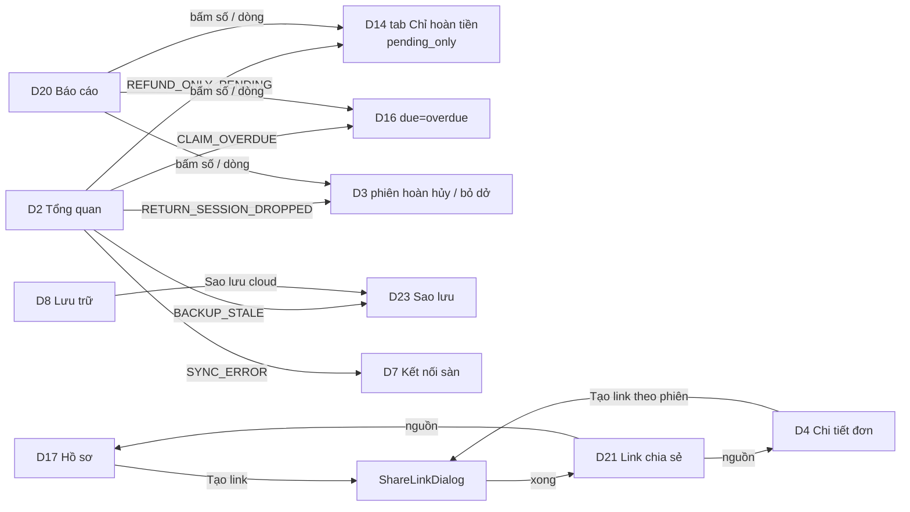

# FE Spec — 03 Mở rộng · client: dashboard (web `/admin`)

| | |
|---|---|
| Tác giả | khanhtt (FE, agent soạn, tự quyết theo ủy quyền user) |
| Reviewer | khanhtt (tech lead, review ở bước 5) |
| Trạng thái | Approved — G2 ✅ có điều kiện 2026-10-07 (DEC-533) |
| Tổng quan & contract | [02-tech-spec.md](02-tech-spec.md) v0.4 §6 · Màn: [01-srs.md §10.5](01-srs.md) v0.5 (D20–D23, `ShareLinkDialog`, `PlatformChip` mới; D2, D3, D4, D7, D8, D10, D13, D14, D15, D16, D17 mở rộng) · nền [item 02 02b-admin](../02-returns-reconciliation/02b-fe-spec-admin.md) · [Design system](../../../design-system/README.md) |
| Last update | 2026-10-07 · FE (v0.4: G2R3-2 "Là phiên hoàn thật" gỡ lý do hủy; G2R3-3 chữ "Thiếu tệp"; G2R3-4 link bị ảnh hưởng khi đánh dấu quét nhầm + Alert ShareLinkDialog — T-266; v0.3: G2R2-1 D13 mã lý do + D17 đánh dấu quét nhầm / Cần soát; G2R2-2 D23 "Không thấy tệp tại kho"; G2R2-5 hiển thị `MISSING`; G2R2-9 `BACKUP_DISABLED` — T-264, T-265; v0.2: G2-1, G2-4, G2-5, G2-8, G2-9) |

> **TL;DR** — 4 màn mới dưới `/admin`: D20 Báo cáo (`/admin/reports`, 3 tab, thẻ số + bảng + CSV), D21 Link chia sẻ (`/admin/shares`), D22 Thông báo (`/admin/settings/notifications`), D23 Sao lưu (`/admin/settings/backup`); D7 đổi thành "Kết nối sàn" (`/admin/settings/platforms`, đường cũ chuyển hướng) nhiều shop Shopee + TikTok. Thành phần mới `ShareLinkDialog` (D4 + D17, tiến độ qua WS + poll), `PlatformChip`, `RemoveEvidenceDialog` cho mọi bằng chứng (L15). Mở rộng 10 màn theo 01 §10.5 (L11, L13, L14, lọc sàn / shop).
> Dữ liệu qua TanStack Query; WS-02 mới (`share.updated`, `backup.updated`, `shop.updated`) chỉ invalidate (DEC-20 item 01). Bộ lọc báo cáo / danh sách ghi URL. W1 (trang người nhận) **không** thuộc client này — BE sinh (DEC-428).
> Điểm khó: ShareLinkDialog (chọn phiên theo giới hạn, tiến độ nền, lỗi mạng kho lưu), D23 (luồng xác nhận khóa theo dấu vân tay), D20 (3 tab, quyền theo tab, bấm số → màn chi tiết đã lọc).
> 16 task T-251..T-266 (≈ 27,5 ngày công).

Không viết lại API — trỏ API-xx trong [02 §6](02-tech-spec.md#6-api-contract).

---

## 1. Phạm vi

| Goals (spec này làm) | Non-goals (cố ý không làm — để đâu) |
|---|---|
| D20–D23 + D7 mới, mở rộng 10 màn, guard theo ma trận 01 §5.10 | W1 (BE — DEC-428) |
| Mọi màn có loading / empty / error / forbidden; dùng được từ 360 px (bảng → card) | Biểu đồ (FR-09.07, C) — làm cuối T-255 nếu còn thời gian, dữ liệu `series` đã có |
| Bộ lọc sàn / shop ở D3, D14, D15, D16, D20 | Khôi phục từ cloud qua UI (ops dòng lệnh — FR-02.16) |
| Không hiện bí mật; dấu vân tay khóa sao lưu chỉ để đối chiếu | Gửi thông báo từ dashboard ngoài "Gửi thử" |

| Màn / luồng | Route | FR / UC | REUSE / EXTEND / NEW |
|---|---|---|:---:|
| D7 Kết nối sàn | `/admin/settings/platforms?platform=&result=&count=`; `/admin/settings/shopee` → chuyển hướng giữ query | FR-05.13, 05.14, 05.20 / UC-10 | EXTEND `features/platforms/ShopeePage.tsx` → `PlatformsPage.tsx` (đổi tên file, giữ phần thẻ shop) |
| D20 Báo cáo | `/admin/reports?tab=returns\|claims\|productivity&from=&to=&platform=&shop=&station=` | FR-09.02..07 / UC-15 | NEW `features/reports/ReportsPage.tsx` |
| D21 Link chia sẻ | `/admin/shares?status=&q=&mine=&claim_id=&package_id=&page=` | FR-07.08, 07.09 / UC-16 | NEW `features/shares/SharesPage.tsx` |
| `ShareLinkDialog` | dialog (D4, D17) | FR-07.05 / UC-16 | NEW `features/shares/ShareLinkDialog.tsx` (mẫu `claims/EvidencePackDialog.tsx`) |
| D22 Thông báo | `/admin/settings/notifications?channel=&status=&page=` | FR-06.04, 06.07..06.11 / UC-18 | NEW `features/notify/NotificationsPage.tsx` |
| D23 Sao lưu | `/admin/settings/backup` | FR-02.08, 02.13..02.18 / UC-20 | NEW `features/backup/BackupPage.tsx` |
| `PlatformChip` | component | FR-03.03, 07.01 | NEW `src/shared/ui/PlatformChip.tsx` (dùng chung station — DEC-479) |
| D2 Tổng quan | `/admin` | FR-09.01, 08.08, 08.10, 02.15 | EXTEND `features/reports/DailyPage.tsx`, `AttentionList.tsx` |
| D3 Tra cứu | `/admin/packages` | FR-07.01 | EXTEND `orders/PackageFilters.tsx`, `filters.ts`, `PackageTable.tsx` |
| D4 Chi tiết đơn | `/admin/packages/:id` | FR-07.05, 07.09, 03.16, 05.19 | EXTEND `orders/PackageDetailPage.tsx`, `SessionPanel.tsx` |
| D8 Lưu trữ | `/admin/settings/storage` | FR-02.15, 03.16, 08.08 | EXTEND `settings/StoragePage.tsx`, `HealthPanel.tsx` |
| D10 Nhật ký | `/admin/settings/audit` | FR-10.03 | EXTEND `audit/AuditPage.tsx`, `audit/copy.ts` |
| D13 Yêu cầu duyệt | `/admin/approvals` | FR-04.14 | EXTEND `approvals/ApprovalCard.tsx`, `decision.ts` |
| D14 Hàng hoàn | `/admin/returns` | FR-08.08, 07.01 | EXTEND `returns/ReturnsPage.tsx`, `filters.ts` |
| D15 Lệch trạng thái | `/admin/recon` | FR-07.01 | EXTEND `reconciliation/ReconPage.tsx`, `filters.ts` |
| D16 Hồ sơ khiếu nại | `/admin/claims` | FR-07.01, 08.10 | EXTEND `claims/ClaimsPage.tsx`, `filters.ts` |
| D17 Chi tiết hồ sơ | `/admin/claims/:id` | FR-08.07, 08.09, 08.10, 07.05, 07.09 | EXTEND `claims/ClaimDetailPage.tsx`, `EvidenceList.tsx`, `Deadline.tsx` |
| Drawer | — | FR-10.02 | EXTEND `shell/nav.ts`, `app/routes.tsx` |

## 2. Điều hướng

Drawer (01 §10.1, thứ tự): Tổng quan · Tra cứu đơn · Hàng hoàn · Lệch trạng thái · Hồ sơ khiếu nại · **Báo cáo** (`bar_chart`; ADMIN, SUPERVISOR, CSKH) · **Link chia sẻ** (`link`; 3 vai) · Yêu cầu duyệt · Nhập đơn · Live view · *Cài đặt:* Station · **Kết nối sàn** (`storefront`, đổi tên + route) · Lưu trữ video · **Thông báo** (`notifications`; ADMIN) · **Sao lưu** (`cloud_upload`; ADMIN) · Người dùng · Nhật ký thao tác.

Guard: `/admin/reports`, `/admin/shares` — `RequireRole(DASHBOARD)`; tab Năng suất kiểm `role ∈ {ADMIN, SUPERVISOR}` trong trang (CSKH mở `tab=productivity` → đổi `tab=returns` + Alert "Bạn không có quyền xem báo cáo năng suất."). `/admin/settings/{platforms,notifications,backup}` nằm trong nhánh `settings` ADMIN sẵn có (`app/routes.tsx`). Route cũ `settings/shopee` → `<Navigate to={"/admin/settings/platforms" + search} replace />` (link cũ, bookmark, redirect Shopee cũ).

## 3. Cây component

| Component | Mới / reuse (path) | Props / input chính | Ghi chú |
|---|---|---|---|
| `PlatformChip` | NEW `src/shared/ui/PlatformChip.tsx` | `platform`, `shopName`, `single?`, `size?: "md"\|"lg"` | Dựa `StatusChip`; một shop duy nhất của sàn → chỉ tên sàn (01 §10.5 chung); `null` → "Chưa rõ sàn" |
| `PlatformFilter` | NEW `src/shared/filters/PlatformFilter.tsx` | `platform`, `shopId`, `onChange` | 2 `SelectField`: Sàn (Tất cả / Shopee / TikTok Shop), Shop (theo sàn, từ API-156 `["shopsBrief"]` — mọi vai dashboard, DEC-484) |
| `PlatformsPage` (D7) | EXTEND `features/platforms/` | — | `PlatformGroup` (mỗi sàn: Alert cấu hình, thẻ shop, "Shop đã ngắt (n)" thu gọn), `ShopCard` (giữ từ `ShopeePage`), `DisconnectDialog`, xử lý `?result=` theo `platform` |
| `ReportsPage` (D20) | NEW `features/reports/ReportsPage.tsx` | URL | `ReportFilters` (`SegmentedButtons` kỳ nhanh + 2 ô ngày + `PlatformFilter` + Station ở tab Năng suất), `Tabs`, `ReturnsReport`, `ClaimsReport`, `ProductivityReport`, `RateCard` (mở rộng `KpiCard`: số + "40 / 1.000 kiện" + ⓘ công thức), `ReportTable` (`md-table`, cột đầu cố định, card ở mobile), `ExportCsvButton` |
| `SharesPage` (D21) | NEW `features/shares/` | URL | `Tabs` trạng thái (số), tìm, "Của tôi", `ShareTable` / `ShareCard`, `RevokeShareDialog`, `CopyLinkButton` |
| `ShareLinkDialog` | NEW `features/shares/ShareLinkDialog.tsx` | `source: {type: "CLAIM", claimId} \| {type: "SESSION", sessionId}`, `open`, `onClose` | Bước chọn (API-164) → đang tạo (WS + poll API-162 2 giây) → xong / lỗi; đóng khi đang tạo → tiếp tục nền + Toast khi xong (hook toàn cục `useShareCompletionToast`); v0.3: `unavailable_reason = CLIP_MISSING` → hàng xám "Clip thiếu tệp" (v0.4 bỏ "(khôi phục)"); `review_needed` → chip "Cần soát", không chọn sẵn; **v0.4 (DEC-531):** `ReviewPendingAlert` khi `review_pending_count > 0`, `NoOpeningVideoAlert` khi nguồn `CLAIM`, có phiên `RETURN` `selectable` mà chưa chọn phiên `RETURN` nào (tính lại mỗi lần đổi chọn); chữ 01 §10.5 ShareLinkDialog; không khóa "Tạo link" |
| `SharesBlock` | NEW `features/shares/SharesBlock.tsx` | `shares`, `activeCount`, `sourceQuery` | D4 / D17: ≤ 3 dòng + "Xem tất cả" → D21 lọc nguồn |
| `NotificationsPage` (D22) | NEW `features/notify/` | — | `ProviderAlerts`, `ChannelTable`, `ChannelDialog` (thêm / sửa), `TestSendButton`, `DeleteChannelDialog`, `QuietHoursCard` + `QuietHoursDialog`, `MessageLog` (lọc kênh / kết quả, phân trang) |
| `BackupPage` (D23) | NEW `features/backup/` | — | `BackupStatusHeader` (chip `state`, kho lưu, dấu vân tay), `KeyBanner` (vàng chưa xác nhận / đỏ khóa đổi / vàng `RESTORE_PENDING`), `ConfirmKeyDialog`, `OldKeysAlert` + `ReuploadDialog` (API-187 — `key.old_keys[]`; khóa khi `state = DISABLED`, tooltip "Sao lưu đang tắt. Bật sao lưu trước." — v0.3), `BackupCards` (DB đỏ khi `late` **hoặc** `consecutive_failures ≥ 2` / Bằng chứng / Trên cloud), `BackupHistoryTable` (cột dấu vân tay rút gọn), `HashMismatchAlert` + `SourceMissingAlert` (v0.3, `evidence.source_missing > 0`) + `IssuesList` (lọc `kind`; `HASH_MISMATCH`: [Vẫn sao lưu] [Bỏ qua]; `SOURCE_MISSING`: [Thử lại ngay] [Bỏ qua] → `ResolveIssueDialog`, API-188), `AllPackClipsSwitch`, `AdvancedSettings` (tốc độ tải lên — DEC-486) |
| `RemoveEvidenceDialog` | EXTEND từ Dialog bỏ bằng chứng trong `claims/EvidenceList.tsx:229` | `evidence`, `onConfirm(reason)` | Mọi loại bằng chứng; chữ "Clip và ảnh của phiên này được giữ tới {removal_keep_until} rồi tự xóa (trừ khi thuộc hồ sơ khác)." |
| `PriorReturnAlert` | NEW `features/claims/PriorReturnAlert.tsx` | `prior_return_sessions`, `excluded_return_sessions`, `review_sessions` | Alert info D17 (BR-39) + Alert thứ hai "Kiện có {n} phiên mở hoàn bị loại vì quét nhầm ({dd/mm HH:mm}) — không đưa vào bằng chứng. Video vẫn được giữ; thêm tay nếu cần." + link "Thêm vào bằng chứng" (mở dialog thêm bằng chứng sẵn có, chọn sẵn phiên) khi có phần tử `in_evidence = false`; phần tử `evidence_exclusion = MARKED` có thêm "Bỏ đánh dấu" (v0.3); phần tử `evidence_exclusion ∈ {STATION_CANCEL, SUPERVISOR_CANCEL}` có [Là phiên hoàn thật] chỉ với ADMIN / SUPERVISOR → `ConfirmReturnDialog` `mode = "OVERRIDE"` (v0.4 — DEC-529); Alert vàng thứ ba khi `review_sessions` khác rỗng: chữ 01 §10.5 D17 "Cần soát" + [Là phiên hoàn thật] [Quét nhầm] (v0.3) |
| `EvidenceList` (dòng phiên) | EXTEND `claims/EvidenceList.tsx` | `evidence[].session.{cancel_reason, cancel_cause, evidence_exclusion, review_needed, wrong_scan}`, `primary` | Chip theo §9 (`evidence_exclusion` ưu tiên: "Đã đánh dấu quét nhầm" / "Hủy: quét nhầm" / "Hủy: không phải hàng hoàn"; `review_needed` → chip vàng "Cần soát: quản lý hủy, chưa rõ lý do"); nhãn "Phiên chính" chỉ theo `primary` server (FE không tự tính); menu "⋮" trên dòng phiên RETURN `CANCELLED` / `ABANDONED` chưa bị loại: "Đánh dấu quét nhầm" (v0.3); clip `MISSING` → khối xám thay player (§9) |
| `WrongScanDialog` (v0.3) | NEW `features/claims/WrongScanDialog.tsx` | `claimId`, `session`, `mode: "MARK" \| "UNMARK"`, `version` | API-189 `MARK_WRONG_SCAN` / `UNMARK_WRONG_SCAN`; chữ 01 §10.5 D17 "Đánh dấu quét nhầm"; ngày giữ lấy `removal_keep_until` của dòng; **v0.4:** response `affected_shares` khác rỗng → đóng dialog, mở `AffectedSharesDialog` thay Toast |
| `AffectedSharesDialog` (v0.4) | NEW `features/claims/AffectedSharesDialog.tsx` | `shares: affected_shares[]` | Chữ 01 §10.5 D17 v0.5 "Phiên này đang có trong {n} link chia sẻ còn hiệu lực"; mỗi dòng Gửi cho · hết hạn · [Thu hồi link] khi `can_revoke` (dùng lại `RevokeShareDialog` → API-163), không thì chữ "Nhờ Admin / Supervisor thu hồi"; thu hồi xong → Toast "Đã thu hồi link.", gạch dòng; invalidate `["shares"]`, `["claim", id]` (DEC-531) |
| `ConfirmReturnDialog` (v0.3) | NEW `features/claims/ConfirmReturnDialog.tsx` | `claimId`, `session`, `version`, `mode: "REVIEW" \| "OVERRIDE"` (v0.4) | API-189 `CONFIRM_RETURN`; `REVIEW`: "Xác nhận là phiên hoàn thật?" · "Ghi chú*" 5–500 · chữ "Phiên sẽ được tính như phiên mở hoàn thường và có thể thành phiên chính."; `OVERRIDE` (v0.4, phiên bị loại theo lý do hủy): tiêu đề "Gỡ lý do hủy, xác nhận là phiên hoàn thật?" · chữ 01 §10.5 D17 v0.5 · Toast "Đã xác nhận phiên hoàn thật."; 403 → Toast `message` |
| `MissingMediaBlock` (v0.3) | NEW `src/shared/media/MissingMediaBlock.tsx` | `kind: "clip" \| "snapshot"` | Khối xám chữ 01 §10.5 "Clip / ảnh Thiếu tệp" (v0.4: "Thiếu tệp clip trên máy chủ — không phát được." — `MISSING` còn do EX-K9); dùng ở D4 `SessionPanel`, D17 `EvidenceList`, lưới ảnh; ẩn nút Cắt lại / Xuất |
| `RemovedEvidenceList` | NEW `features/claims/RemovedEvidenceList.tsx` | `removed_evidence` | Thu gọn "Bằng chứng đã bỏ ({n})": ai, lúc, lý do, giữ tới; nút "Thêm lại" (API-134) |
| `DeadlineChip` | EXTEND `claims/Deadline.tsx` | `deadline_source` | `DEFAULT_PLATFORM_PASSED` → chip "Hạn sàn đã qua" |
| `ApprovalCard` | EXTEND `approvals/ApprovalCard.tsx` | `return_summary` | "Đã có kết luận: Hộp rỗng · 3 ảnh · mở 4 phút"; Hủy phiên RETURN → `CancelReturnDialog` (v0.3): `RadioGroup` "Lý do*" 3 lựa chọn không chọn sẵn + ô "Ghi chú*" 5–500 + chữ dưới đổi theo lựa chọn (01 §10.5 D13) → API-21 `{action, reason_code, note}` |
| `AttentionList` | EXTEND `reports/AttentionList.tsx` | — | 4 kind mới + `SYNC_ERROR` có tên shop / sàn (02 §6.2 API-32) |
| `DailyPage` | EXTEND | — | Thẻ "Phiên hoàn hủy / bỏ dở (7 ngày)" (`returns_dropped_7d`) → D3 `session_type=RETURN&return_dropped=true&date_from=…` (cùng luật loại phiên quét nhầm — BR-39) |
| `HealthPanel` | EXTEND `settings/HealthPanel.tsx` | `backup` | Dòng "Sao lưu cloud": OK / Trễ / Lỗi / Chưa cấu hình → link D23 (ADMIN) |
| `StoragePage` | EXTEND | — | Công tắc "Bắt buộc tên người đóng gói" (mục Station); ô "Hạn mặc định Chỉ hoàn tiền (giờ)" ở nhóm ngưỡng (DEC-485) |
| `SessionPanel` | EXTEND `orders/SessionPanel.tsx` | `session` | "Người đóng gói: …"; nút "Tạo link chia sẻ" (phiên có clip); sự kiện `AMBIGUOUS_SHOP` "Mã có ở 2 shop: …" trong dòng thời gian |
| `ReturnsPage` | EXTEND | — | Tab `NO_PARCEL` ("Chỉ hoàn tiền"): cột "Hạn phản hồi" (`DueCountdown`), "Hồ sơ khiếu nại" (mã / nút Tạo), chip "Chỉ chưa xử lý" (`pending_only`), sắp `due_asc` |
| `DueCountdown` | NEW `src/shared/time/DueCountdown.tsx` | `dueAt`, `source`, `warnHours = 48` | "còn 1 ngày 4 giờ"; đỏ ≤ 48 giờ; chip "Quá hạn"; ⓘ khi `DEFAULT` |
| `AuditPage` | EXTEND | — | Nhãn 15 action mới (§9) |

## 4. State & data fetching

| Dữ liệu | Nguồn (API-xx) | Nơi giữ state | Cache & làm mới | Optimistic? |
|---|---|---|---|:---:|
| Shop rút gọn (bộ lọc) | API-156 | Query `["shopsBrief"]` | `staleTime` 5 phút; WS `shop.updated` | ✗ |
| Shop + cấu hình sàn | API-70 | Query `["shops"]` | Invalidate: WS `shop.updated`, sau API-73 / 154; poll 10 giây khi có shop `sync_in_progress` | ✗ |
| Kết nối | API-71 (`platform`) | mutation → `window.location.assign(url)` | — | ✗ |
| Báo cáo | API-150 / 151 / 152 | Query `["report", tab, filters]` | `staleTime` 60 giây (khớp cache server); đổi lọc → `placeholderData: keepPreviousData` (số cũ mờ + `LinearProgress`) | ✗ |
| CSV | API-153 | `api.blob` → `saveBlob` (sẵn có `shared/download.ts`) | — | — |
| Lựa chọn link | API-164 | Query `["shareOptions", source]` | Khi mở dialog; 409 `SESSION_CLIP_UNAVAILABLE` → refetch | ✗ |
| Link | API-160, 162 | mutation; Query `["share", id]` | Poll 2 giây khi `CREATING` + WS `share.updated` | ✗ |
| Danh sách link | API-161 | Query `["shares", filters]` | Invalidate: WS `share.updated`, sau 163 | ✗ |
| Link của kiện / hồ sơ | API-31 / API-132 `shares[]` | Query sẵn có `["package", id]`, `["claim", id]` | Invalidate theo WS `share.updated` | ✗ |
| Kênh thông báo | API-170 | Query `["notify", "channels"]` | Sau 171..174, 176 | ✗ |
| Nhật ký gửi | API-175 | Query `["notify", "messages", filters]` | Poll 30 giây khi trang mở | ✗ |
| Sao lưu | API-180, 185 | Query `["backup"]`, `["backup", "issues"]` | WS `backup.updated`; poll 15 giây khi `db.running` | ✗ |
| Tải lại bằng khóa mới | API-187 | mutation → Toast "Đã xếp {queued} tệp vào hàng chờ." → invalidate `["backup"]` | — | ✗ |
| Xử lý lệch mã băm / không thấy tệp | API-188 (`UPLOAD_ANYWAY` / `IGNORE` / `RETRY`) | mutation → invalidate `["backup"]`, `["backup", "issues"]`, `["daily"]` | — | ✗ |
| Đánh dấu quét nhầm / xác nhận phiên (v0.3) | API-189 | mutation `useClaimMutation` (sẵn có, `version`) → set `["claim", id]` từ response; invalidate `["claims"]`, `["package", packageId]`, `["daily"]` (hồ sơ khác cùng kiện đổi bằng chứng) | — | ✗ |
| Sức khỏe | API-81 | Query `["health"]` (sẵn có, 30 giây) | + WS `backup.updated` | ✗ |
| Hồ sơ (bỏ / thêm lại bằng chứng) | API-134 | mutation `useClaimMutation` (sẵn có, `version`) | Như Phase 2 | ✗ (DEC-241) |
| Tổng quan | API-32 | Query `["daily"]` (sẵn có) | Như cũ | ✗ |

WS (`features/shell/useDashboardSocket.ts`): `share.updated` → invalidate `["shares"]`, `["share", id]`, `["package"]`, `["claim"]`; `backup.updated` → `["backup"]`, `["health"]`, `["daily"]`; `shop.updated` → `["shops"]`, `["daily"]`. Kết nối lại → invalidate thêm `["shares"]`, `["backup"]`, `["shops"]`.

## 5. Form & validate

| Form | Field | Rule client | Lỗi server map vào field |
|---|---|---|---|
| ShareLinkDialog | Phiên (checkbox) | 1–4; tổng `duration_s` ≤ 1.800; hàng `selectable = false` khóa + lý do | `fields.session_ids` → dưới danh sách |
| | Góc quay | `SIDE_BY_SIDE` (mặc định) / `CAM1` | `fields.layout` |
| | Kèm ảnh | checkbox "Kèm ảnh ({snapshot_count})"; ẩn khi 0 | — |
| | Gửi cho* | 3–100 sau trim: "Ghi rõ gửi cho ai (3–100 ký tự)." | `fields.recipient` |
| | Hết hạn sau | 1 / 3 / 7 (mặc định `default_expires_days`) | `fields.expires_days` |
| ChannelDialog | Tên* | 2–40 | `fields.name`; `409 CHANNEL_NAME_EXISTS` → "Đã có kênh tên này." |
| | Loại* | `SegmentedButtons`; loại chưa cấu hình khóa | `409 PROVIDER_NOT_CONFIGURED` → Alert |
| | Chat ID* / Zalo user ID* | Telegram `^-?\d{1,20}$` ("Chat ID là một số (nhóm thường bắt đầu bằng -100)."); Zalo `^\d{1,64}$` | `fields.target` |
| | Sự kiện | ≥ 1 ("Chọn ít nhất 1 sự kiện.") | `fields.events` |
| QuietHoursDialog | Từ, Đến | `HH:MM`, khác nhau; "Tắt giờ yên lặng" | `fields.start`, `fields.end` |
| ConfirmKeyDialog | Checkbox "Tôi đã cất bản sao khóa…" | Phải tick mới bật nút | `409 BACKUP_KEY_MISMATCH` → Alert + tải lại |
| D23 Nâng cao | Tốc độ tải lên (Mbit/s) | 1–1000 | `fields.upload_mbps` |
| ResolveIssueDialog (D23) | Lý do* | 5–500 ("Nhập lý do (5–500 ký tự)."); tiêu đề theo hành động: "Vẫn sao lưu bản hiện có?" (chữ "Bản trên cloud sẽ ghi chú lệch mã băm.") / "Bỏ qua tệp này?" (chữ "Tệp này sẽ không có bản sao ngoài kho.") / "Thử lại ngay?" (chữ "Dùng sau khi IT đã chép lại tệp vào máy chủ." — v0.3) | `fields.note`; `409 BACKUP_ISSUE_RESOLVED` / `BACKUP_ISSUE_ACTION_INVALID` → Toast + refetch |
| ReportFilters | Từ, Đến | `to ≥ from`; ≤ 366 ngày; `to ≤ hôm nay` (giờ VN) — khóa "Xem" | `fields.from` / `fields.to` |
| RemoveEvidenceDialog | Lý do* | 5–500 ("Nhập lý do bỏ bằng chứng (5–500 ký tự).") | `fields.note` |
| CancelReturnDialog (D13, v0.3) | Lý do* (radio) | Bắt buộc: "Chọn lý do hủy." | `fields.reason_code` |
| | Ghi chú* | 5–500 sau trim ("Nhập ghi chú (5–500 ký tự)."); [Hủy phiên] khóa tới khi hợp lệ | `fields.note` |
| WrongScanDialog (D17, v0.3) | Lý do* (radio, chỉ MARK) | "Quét nhầm kiện khác" / "Không phải kiện hàng hoàn"; thiếu → "Chọn lý do." | `fields.reason_code` |
| | Ghi chú* | 5–500 ("Nhập ghi chú (5–500 ký tự).") | `fields.note` |
| ConfirmReturnDialog (D17, v0.3) | Ghi chú* | 5–500 | `fields.note` |
| D8 | Hạn mặc định Chỉ hoàn tiền | 1–168 | `fields.refund_only_default_hours` |

## 6. Trạng thái UI

| Màn | Loading | Empty | Error | Forbidden | Success |
|---|---|---|---|---|---|
| D7 | Skeleton 2 nhóm × 1 thẻ | "Chưa kết nối shop nào." + "Mở Nhập đơn" | Alert "Không tải được trạng thái kết nối." + Thử lại | D12 | `?result=` → Toast / Alert theo 01 §10.5 D7 (chữ theo `platform`, `count`) rồi xóa query |
| D20 | Skeleton 4 thẻ + 2 bảng | Mỗi bảng "Không có dữ liệu trong kỳ này."; thẻ tỷ lệ "—" + chú thích | Alert "Không tải được báo cáo." + Thử lại (gồm `REPORT_TIMEOUT`) | Tab Năng suất với CSKH → tab Hàng hoàn + Alert | Số + bảng; CSV → Toast "Đã tải file CSV." |
| D21 | Skeleton bảng | "Chưa có link chia sẻ nào." + "Tạo link từ hồ sơ khiếu nại hoặc chi tiết đơn." | Alert + Thử lại | D12 | Chip trạng thái; "Đang thu hồi — chờ Internet" khi `revoke_pending` |
| ShareLinkDialog | Skeleton danh sách phiên | Không phiên chọn được → "Chưa có phiên nào có clip." | Alert "Không tải được lên kho lưu cloud. Kiểm tra Internet rồi bấm Thử lại." / "Không dựng được video. Bấm Thử lại; nếu vẫn lỗi, báo Admin kèm mã hồ sơ." + Thử lại | Nút mở bị ẩn | "Link đã sẵn sàng" + ô link + Sao chép + hạn + gửi cho |
| D22 | Skeleton | EmptyState "Chưa có kênh thông báo." + Thêm kênh | Alert + Thử lại | D12 | Toast "Đã gửi tin thử tới {tên}." / Alert lỗi dưới dòng |
| D23 | Skeleton | `NOT_CONFIGURED` → EmptyState hướng dẫn IT | Alert + Thử lại | D12 | Chip "Đang bật"; banner theo `state` (gồm `RESTORE_PENDING`); Alert khóa cũ + "Tải lại bằng chứng bằng khóa mới" → Toast "Đã xếp {n} tệp vào hàng chờ."; lệch mã băm → Toast "Đã ghi nhận."; Toast kiểm tra kết nối |
| D2 / D3 / D4 / D8 / D10 / D13 / D14 / D15 / D16 / D17 | Như Phase 2 | Như Phase 2 | Như Phase 2 | Như Phase 2 | Theo §3 |

## 7. Phân quyền trên UI

| Hành động / màn | Role thấy | Cách xử lý khi không quyền |
|---|---|---|
| D7, D22, D23, công tắc người đóng gói (D8) | ADMIN | Không có mục drawer; URL → D12 |
| D20 tab Hàng hoàn, Khiếu nại + CSV | ADMIN, SUPERVISOR, CSKH | — |
| D20 tab Năng suất + CSV | ADMIN, SUPERVISOR | Tab ẩn; URL → tab Hàng hoàn + Alert |
| Tạo link (D4, D17), xem D21 | ADMIN, SUPERVISOR, CSKH (`shares.create`, `shares.read`) | Ẩn nút |
| Thu hồi link | ADMIN, SUPERVISOR; CSKH khi `can_revoke` | Ẩn nút theo `can_revoke` (server trả) |
| D8 dòng "Sao lưu cloud" | ADMIN (link D23), SUPERVISOR (chỉ xem, không link) | — |
| D2 `SYNC_ERROR`, `BACKUP_STALE` | ADMIN (server lọc) | — |
| D13 hủy phiên hoàn | ADMIN, SUPERVISOR | Như Phase 2 |
| D17 "Đánh dấu quét nhầm" / "Bỏ đánh dấu" / "Là phiên hoàn thật" (v0.3, API-189) | ADMIN, SUPERVISOR, CSKH | Ẩn menu / nút; hồ sơ Đóng → ẩn |
| D17 "Là phiên hoàn thật" cho phiên bị loại theo lý do hủy (v0.4, API-189 `CONFIRM_RETURN` — DEC-529) | ADMIN, SUPERVISOR | Ẩn nút với CSKH; 403 → Toast `message` |
| `AffectedSharesDialog` [Thu hồi link] (v0.4) | Theo `can_revoke` của từng link (server) | Thay nút bằng chữ "Nhờ Admin / Supervisor thu hồi" |
| Bỏ bằng chứng (D17) | ADMIN, SUPERVISOR, CSKH | Như Phase 2 |

## 8. Xử lý lỗi API

| Mã lỗi (từ 02) | Hiển thị | Hành động |
|---|---|---|
| `PLATFORM_NOT_CONFIGURED` (503) | Alert info trong nhóm sàn: "Chưa cấu hình TikTok Shop. Liên hệ IT để bật (cần tài khoản đối tác TikTok Shop)." / Shopee giữ câu cũ | Khóa nút kết nối |
| `SHOP_NOT_CONNECTED`, `SYNC_IN_PROGRESS` (409) | Như Phase 1 | Như Phase 1 |
| `REPORT_TIMEOUT` (503) | Alert "Không tải được báo cáo." | Thử lại |
| `VALIDATION_ERROR` (422) báo cáo | Lỗi dưới ô ngày | Khóa "Xem" |
| `CLOUD_NOT_CONFIGURED` (503) | Alert trong dialog + tooltip nút | Khóa tạo link |
| `SESSION_CLIP_UNAVAILABLE` (409) | Toast `message` | Refetch API-164, hàng xám |
| `SHARE_NOT_ACTIVE` (409) | Toast `message` | Refetch danh sách |
| `CHANNEL_NAME_EXISTS` (409) | Lỗi dưới ô tên | — |
| `PROVIDER_NOT_CONFIGURED` (409) | Alert "Chưa cấu hình bot Telegram trên máy chủ. Liên hệ IT." | Khóa loại |
| `NOTIFY_SEND_FAILED` (502), `NOTIFY_TIMEOUT` (504) | Alert dưới dòng kênh: `message` server | Cho bấm lại |
| `BACKUP_NOT_CONFIGURED` (503) | EmptyState D23 | — |
| `BACKUP_KEY_UNCONFIRMED` (409) | Mở `ConfirmKeyDialog` | — |
| `BACKUP_KEY_MISMATCH` (409) | Alert "Khóa trên máy chủ vừa đổi — kiểm lại dấu vân tay." | Refetch API-180 |
| `BACKUP_RUNNING` (409) | Toast "Đang sao lưu, thử lại sau." | — |
| `BACKUP_RESTORE_UNVERIFIED` (409) | Banner D23 "Hệ thống vừa được khôi phục. Sao lưu tạm dừng tới khi IT chạy lệnh kiểm khôi phục đạt." | Khóa công tắc bật / Sao lưu ngay / Tải lại |
| `BACKUP_ISSUE_RESOLVED`, `BACKUP_ISSUE_ACTION_INVALID` (409) | Toast `message` | Refetch API-185 |
| `BACKUP_DISABLED` (409, v0.3) | Toast "Sao lưu đang tắt. Bật sao lưu rồi thử lại." | Refetch API-180 (nút khóa theo `state`) |
| `SESSION_NOT_ELIGIBLE` (409, API-189, v0.3) | Toast `message` | Refetch `["claim", id]`, đóng dialog |
| `CLAIM_CLOSED` (409, API-189) | Toast `message` | Refetch, ẩn menu |
| `FORBIDDEN` (403, API-189 `CONFIRM_RETURN` gỡ lý do hủy, v0.4) | Toast `message` "Chỉ Admin / Supervisor gỡ lý do hủy của phiên." | Đóng dialog, refetch `["claim", id]` |
| `BACKUP_ISSUE_ACTION_INVALID` (409, API-188 `IGNORE` khi tệp đã có lại, v0.4) | Toast `message` "Tệp đã có lại tại kho — bấm Thử lại ngay." | Refetch API-185 |
| `CLIP_NOT_READY` (409) `details.status = MISSING` (API-40/43, v0.3) | `MissingMediaBlock` thay player / Toast `message` khi bấm Xuất | Không thử lại |
| `CLIP_NOT_FAILED` (409) `details.status = MISSING` (API-46) | Toast `message` | Ẩn nút "Cắt lại" khi `MISSING` |
| `CLOUD_AUTH_FAILED` (502), `CLOUD_ERROR` (502), `CLOUD_UNREACHABLE` (504) | Alert dưới nút "Kiểm tra kết nối" (`message`) | — |
| `VERSION_CONFLICT` (409) API-134 | Như Phase 2 (tải lại, giữ Dialog đóng) | — |
| `FORBIDDEN` (403) | D12 / Toast cho hành động | — |
| Mã lạ | `message` server | — |

## 9. Nội dung chữ · i18n · a11y · responsive

Chữ lấy nguyên văn 01 §10.5 (D7, D20, ShareLinkDialog, D21, D22, D23, D2, D4, D13, D14, D17, D8). Thêm vào `copy.ts` từng feature; nhãn enum chung trong `src/shared/labels.ts`:

| Nhóm | Nhãn |
|---|---|
| `platform` | `SHOPEE` Shopee · `TIKTOK` TikTok Shop |
| `share.status` | Đang tạo · Đang hoạt động · Lỗi · Đã thu hồi · Hết hạn |
| `backup.state` | Đang bật · Chưa cấu hình · Chưa xác nhận khóa · Khóa đã đổi · Đã tắt · Chờ kiểm khôi phục |
| `backup_object.status` (D23 danh sách) | Đang chờ · Đang tải · Đã sao lưu · Lỗi · Lệch mã băm · Tệp đã xóa tại kho · Bỏ qua · Đã xóa trên cloud |
| `clip.status`, `snapshot.status` (thêm) | `MISSING` Thiếu tệp (v0.4 bỏ "(khôi phục)") — D4 / D17 `MissingMediaBlock` thay player / ảnh; chip xám trong danh sách (v0.3: cả ảnh) |
| `session.cancel_reason` (phiên RETURN) | `WRONG_SCAN` Hủy: quét nhầm · `NOT_A_RETURN` Hủy: không phải hàng hoàn · `SUPERVISOR` Quản lý hủy · `OTHER` Hủy: lý do khác |
| `session.cancel_cause` (v0.3, khi `SUPERVISOR`) | `WRONG_SCAN` Quản lý hủy: quét nhầm · `NOT_A_RETURN` Quản lý hủy: không phải hàng hoàn · `OTHER` Quản lý hủy: lý do khác · `null` → chip "Cần soát" nếu `review_needed` |
| `session.evidence_exclusion` (v0.3) | `MARKED` Đã đánh dấu quét nhầm · `STATION_CANCEL` / `SUPERVISOR_CANCEL` → nhãn theo lý do hiệu lực |
| `backup_object` vấn đề (D23, v0.3) | `HASH_MISMATCH` Lệch mã băm · `SOURCE_MISSING` Không thấy tệp tại kho · `UPLOAD_FAILED` Tải lên lỗi |
| API-92 action (v0.3) | `SESSION_WRONG_SCAN_MARK` Đánh dấu phiên quét nhầm · `SESSION_WRONG_SCAN_UNMARK` Bỏ đánh dấu quét nhầm · `SESSION_RETURN_CONFIRM` Xác nhận phiên hoàn thật · `MEDIA_MARK_MISSING` Đánh dấu thiếu tệp (v0.4) · `MEDIA_MISSING_RECOVERED` Tệp có lại (v0.4) · `PACKAGE_CANCEL_REVERT` Trả lại kiện sau yêu cầu hủy không thành · `BACKUP_VERIFY_ACCEPT` Chấp nhận khi kiểm khôi phục |
| `notify_message.status` | Đang chờ · Tạm giữ · Đã gửi · Lỗi · thử lại {n} · Bị bỏ · Trùng, bỏ qua |
| N01..N10 | Theo API-170 `events[].label` (server) — không chép cứng |
| API-92 action mới (D10) | `SHOP_DISCONNECT` Ngắt kết nối shop · `SHARE_CREATE` Tạo link chia sẻ · `SHARE_REVOKE` Thu hồi link · `SHARE_EXPIRE` Link hết hạn · `NOTIFY_CHANNEL_CREATE` Thêm kênh thông báo · `NOTIFY_CHANNEL_UPDATE` Sửa kênh thông báo · `NOTIFY_CHANNEL_DELETE` Xóa kênh thông báo · `NOTIFY_TEST` Gửi thử thông báo · `NOTIFY_SETTINGS_UPDATE` Đổi giờ yên lặng · `BACKUP_SETTINGS_UPDATE` Đổi cài đặt sao lưu · `BACKUP_KEY_CONFIRM` Xác nhận cất khóa sao lưu · `BACKUP_TEST` Kiểm tra kết nối kho lưu · `BACKUP_RUN_NOW` Sao lưu DB ngay · `REPORT_EXPORT` Xuất CSV báo cáo · `CLAIM_EVIDENCE_REMOVE` Bỏ bằng chứng · `BACKUP_REUPLOAD_OLD_KEY` Tải lại bằng chứng bằng khóa mới · `BACKUP_ISSUE_RESOLVE` Xử lý tệp lệch mã băm · `BACKUP_RESTORE_VERIFIED` Kiểm khôi phục đạt |
| Công thức ⓘ (D20) | Câu BR-41, vd "Tỷ lệ hoàn = hồ sơ hàng hoàn có kiện về tạo trong kỳ ÷ kiện bàn giao trong kỳ" |

Định dạng: số `1.000`, tỷ lệ `4,0%` (`Intl.NumberFormat("vi-VN")`), tiền `2.350.000 đ`, thời lượng giây → "1 phút 30 giây", giờ VN `dd/mm HH:mm`. a11y: bảng báo cáo có `<caption>` ẩn; ô số căn phải; ⓘ là `button` có `aria-describedby`; dialog bẫy focus (Dialog sẵn có); tiến độ `role="progressbar"` + `aria-valuenow`; "Sao chép link" báo `aria-live`. Responsive: D20 thẻ 2 cột ≤ 600 px, bảng cuộn ngang cột đầu cố định; D21 / D22 bảng → card ở ≤ 600 px; ShareLinkDialog toàn màn ở ≤ 600 px.

## 10. Riêng nền tảng

Web: Chrome / Edge / Safari 2 bản gần nhất (như Phase 1). Bundle: `features/{reports,shares,notify,backup}` lazy-load theo route (`app/routes.tsx`); không thêm thư viện biểu đồ ở bước này (C — nếu làm dùng SVG tự vẽ cột đơn giản, ≤ 5 KB). Sao chép link: `navigator.clipboard.writeText` (HTTPS nội bộ — đã có), fallback chọn ô `readonly`. Link chia sẻ rất dài → ô `readonly` một dòng + nút, không hiện link đầy đủ trong bảng D21 (chỉ "Sao chép").

## 11. Analytics & theo dõi lỗi

N/A — dự án chưa có analytics (Phase 1–2). Lỗi API hiện Toast / Alert; console log như Phase 2.

## 12. Mock khi BE chưa xong

Theo đúng contract 02 §6, qua lớp `lib/api/client.ts` + MSW (`src/mocks/handlers/*`), bật bằng `pnpm dev:mock` như Phase 1–2:

| Handler | Dữ liệu |
|---|---|
| `shops.ts` (mở rộng) | `platforms[]` (TikTok bật), 2 shop Shopee + 2 TikTok (1 `EXPIRED`, 1 `DISCONNECTED`), `sync_warnings`; API-71 trả URL về chính callback mock → `?platform=tiktok&result=connected&count=2`; API-154 |
| `reports.ts` (mở rộng) | API-150..152 với bộ số ví dụ BR-41 (4,0 %, 20,0 %, 75 %, 2.350.000 đ, TB 90 giây, "(Không ghi tên)"); API-153 trả CSV mẫu; 403 cho CSKH ở productivity |
| `shares.ts` (mới) + `sharesDb.ts` | API-160..164; `CREATING` → `ACTIVE` sau 3 lần poll (phát WS `share.updated` qua `mocks/ws.ts`); `?fail=upload` → `FAILED UPLOAD_FAILED` |
| `notify.ts` (mới) | API-170..176; `ZALO_OA` chưa cấu hình; "Gửi thử" Telegram lỗi khi `target` = `-1000000000000` (502) |
| `backup.ts` (mới) | API-180..188; nút giả đổi `state` (`NOT_CONFIGURED` / `KEY_UNCONFIRMED` / `KEY_CHANGED` / `RESTORE_PENDING` / `ON`) bằng query `?backupState=`; `?oldKeys=1` → `key.old_keys[]` 1 khóa cũ (812 tệp, 42 bản DB); `?dbFail=2` → `consecutive_failures = 2`; 2 tệp `HASH_MISMATCH` xử lý được; v0.3: `?srcMissing=1` → 1 tệp `SOURCE_MISSING` (Thử lại / Bỏ qua), `?backupState=DISABLED` → 409 `BACKUP_DISABLED` ở API-184 / 187 |
| `claims.ts` (v0.3) | API-189 3 action (cập nhật `claimsDb`, phiên chính tính lại theo luật mock đơn giản), hồ sơ mẫu có phiên `review_needed` + phiên `MARKED`; clip / ảnh `MISSING` ở 1 kiện mẫu |
| `claims.ts`, `packages.ts`, `returns.ts`, `recon.ts`, `reports.ts` (API-32), `approvals.ts`, `settings.ts` | Trường mở rộng §6.1 "Mở rộng" |

## 13. Test FE

| Mức | Phạm vi | Case chính (TC-xx — QA đánh số ở `04`) |
|---|---|---|
| Unit / component | `PlatformChip`, `DueCountdown` (biên 48 giờ, quá hạn), định dạng tỷ lệ "—", `ReportFilters` validate kỳ, `ShareLinkDialog` validate (0 / 5 phiên, 31 phút, gửi cho 2 ký tự), `ChannelDialog` validate, `ConfirmKeyDialog` (khóa nút tới khi tick), `RemoveEvidenceDialog` (mọi loại cần lý do), `ResolveIssueDialog` (lý do 5–500), `OldKeysAlert` (ẩn khi rỗng), `PriorReturnAlert` (Alert phiên bị loại, Cần soát), chip `cancel_reason` / `cancel_cause` / `evidence_exclusion`, `CancelReturnDialog` (khóa nút tới khi có lý do + ghi chú; chữ đổi theo lý do), `WrongScanDialog`, `ConfirmReturnDialog`, `MissingMediaBlock` (v0.3) | FR-07.05, 06.04, 02.17, 08.09, 09.05, EX-K6, EX-K7, BR-39 |
| Integration (MSW) | D7 kết nối 2 shop TikTok (`?result=`), ngắt shop; D20 3 tab + quyền CSKH + bấm số → URL đích + CSV; ShareLinkDialog đủ vòng (tạo → tiến độ → sao chép → thu hồi) + lỗi upload; D21 lọc / thu hồi / "Đang thu hồi"; D22 thêm / sửa / gửi thử lỗi / giờ yên lặng; D23 5 trạng thái + xác nhận khóa + khóa cũ → tải lại + lệch mã băm → vẫn sao lưu / bỏ qua + 2 lượt DB lỗi + kiểm tra kết nối lỗi; D17 phiên trước + phiên quét nhầm bị loại (Alert, thêm tay, không thành "Phiên chính") + bỏ / thêm lại bằng chứng + chip hạn; D2 thẻ phiên hủy → D3 `return_dropped=true`; D14 tab Chỉ hoàn tiền sắp hạn; D2 mục mới; D13 lý do hủy; v0.3: D13 chọn "Quét nhầm kiện khác" → request đúng `reason_code`; D17 đánh dấu quét nhầm phiên chính → "Phiên chính" chuyển sang phiên khác theo response, bỏ đánh dấu, xác nhận Cần soát, 409 `SESSION_NOT_ELIGIBLE`; D23 `SOURCE_MISSING` thử lại / bỏ qua, `DISABLED` khóa nút; D4 clip `MISSING` | AC-40, 45..47, 52, 55, 56..60, 62 |
| E2E mock | `e2e/mock/{platforms,reports,shares,notify,backup}.spec.ts` | UC-10, 15, 16, 18, 20 |
| E2E BE thật | `e2e/real/phase3.spec.ts` (stack dev: MinIO, mock TikTok, notify mock): kết nối TikTok mock → đơn xuất hiện D3 lọc TikTok; tạo link → mở W1 từ MinIO → thu hồi → link 404; báo cáo + CSV; thêm kênh mock + gửi thử | AC-40, 52, 55, 61 |

## 14. Task

| # | Việc | Màn / FR | Phụ thuộc (API-xx) | Ước lượng |
|---|---|---|---|---|
| T-251 | API client `lib/api/{shops,reports,shares,notify,backup}.ts` + mở rộng `packages`, `returns`, `recon`, `claims`, `approvals`, `settings`, `reports` (API-32); nhãn `shared/labels.ts`; MSW handlers + db (§12) | nền | 02 §6 (mock) | 2 |
| T-252 | Route + drawer (mục mới, đổi tên D7, chuyển hướng `/shopee`) + `PlatformChip`, `PlatformFilter` (API-156), `DueCountdown` + WS 3 sự kiện | nav / FR-10.02, 03.03, 07.01 | API-04, 156, WS-02; T-251 | 1 |
| T-253 | D7 Kết nối sàn: nhóm theo sàn, thẻ shop, kết nối theo sàn, `?result=`, ngắt kết nối, shop đã ngắt, cảnh báo đồng bộ | D7 / FR-05.13, 05.14, 05.20 | API-70..73, 154; T-252 | 2 |
| T-254 | D20 khung + `ReportFilters` (URL, validate) + tab Hàng hoàn (thẻ, 4 bảng, ⓘ, bấm số) | D20 / FR-09.03, 09.05 | API-150; T-252 | 2 |
| T-255 | D20 tab Khiếu nại + Năng suất (quyền) + CSV + (C) biểu đồ cột nếu còn thời gian | D20 / FR-09.02, 09.04, 09.06, 09.07 | API-151..153; T-254 | 2 |
| T-256 | `ShareLinkDialog` (options, validate, tạo, tiến độ WS + poll, xong / lỗi, chạy nền + Toast) | ShareLinkDialog / FR-07.05 | API-160, 162, 164; T-252 | 2 |
| T-257 | D21 Link chia sẻ + `SharesBlock` ở D4 / D17 + thu hồi + sao chép | D21, D4, D17 / FR-07.08, 07.09 | API-161..163, API-31/132 `shares[]`; T-256 | 1,5 |
| T-258 | D22 Thông báo: kênh, dialog, gửi thử, xóa, giờ yên lặng, nhật ký gửi | D22 / FR-06.04, 06.07..06.11 | API-170..176; T-252 | 2 |
| T-259 | D23 Sao lưu (trạng thái, banner khóa, xác nhận khóa, kiểm tra kết nối, sao lưu ngay, lịch sử, lệch mã băm, tùy chọn C, nâng cao) + D8 dòng sức khỏe + công tắc người đóng gói + hạn Chỉ hoàn tiền | D23, D8 / FR-02.15, 02.17, 02.18, 03.16, 08.08 | API-180..185, 81, 80; T-252 | 1,5 |
| T-260 | D17 L11 / L14 / L15 (Alert phiên trước + Alert phiên quét nhầm bị loại + chip `cancel_reason` + "Phiên chính" theo server, `RemoveEvidenceDialog` mọi loại, `RemovedEvidenceList`, chip hạn) + nút Tạo link; D13 `return_summary` + lý do hủy | D17, D13 / FR-08.07, 08.09, 08.10, 04.14; BR-39 v0.3 | API-132, 134, 20, 21; T-256 | 2 |
| T-261 | D2 thẻ + attention mới; D14 tab Chỉ hoàn tiền (hạn, hồ sơ, `pending_only`, sắp); D3 / D14 / D15 / D16 lọc sàn / shop + chip; D4 người đóng gói + `AMBIGUOUS_SHOP`; D10 nhãn action | D2, D3, D4, D10, D14, D15, D16 / FR-09.01, 08.08, 07.01, 03.16, 10.03 | API-32, 30, 31, 110, 120, 130, 92; T-252 | 2 |
| T-262 | Test component / integration + E2E mock 5 bộ + E2E BE thật Phase 3 | — | BE T-207, T-216, T-225, T-227, T-222 cho E2E thật | 2 |
| T-263 | D23 v0.2: `OldKeysAlert` + `ReuploadDialog` (API-187), `IssuesList` hành động + `ResolveIssueDialog` (API-188), banner `RESTORE_PENDING` + khóa nút, thẻ DB "2 lần sao lưu DB gần nhất không thành công", cột dấu vân tay lịch sử; nhãn `clip.status MISSING`, `backup_object.status`, action D10 mới; mock `backup.ts`; test | D23, D4, D10 / FR-02.15..02.17, EX-K6..K8 | API-180, 185, 187, 188; T-259; BE T-272..T-274 cho E2E thật | 1,5 |
| T-264 | (v0.3, G2R2-1) D13 `CancelReturnDialog` (radio lý do + ghi chú, chữ theo lý do, lỗi `fields.reason_code` / `fields.note`); D17 menu "Đánh dấu quét nhầm", `WrongScanDialog` (MARK / UNMARK), `ConfirmReturnDialog`, Alert "Cần soát" + chip, `PriorReturnAlert` "Bỏ đánh dấu", chip `cancel_cause` / `evidence_exclusion`; ShareLinkDialog chip "Cần soát" không chọn sẵn; API-189 client + mock; nhãn D10 action mới; test (v0.4: gỡ lý do hủy, `AffectedSharesDialog`, Alert ShareLinkDialog → T-266) | D13, D17, ShareLinkDialog / FR-04.14, 08.07; BR-39 v0.4, EX-R21 | API-21, 132, 164, 189; T-260, T-256; BE T-281 cho E2E thật | 1,5 |
| T-265 | (v0.3, G2R2-2, 5, 9) `MissingMediaBlock` (clip + ảnh) ở D4 / D17 / lưới ảnh, ẩn "Cắt lại" / "Xuất" khi `MISSING`, xử lý 409 `details.status = MISSING`; ShareLinkDialog `CLIP_MISSING`; D23 `SourceMissingAlert`, `IssuesList` lọc `kind`, [Thử lại ngay] + `ResolveIssueDialog` `RETRY`, 409 `BACKUP_ISSUE_ACTION_INVALID`; khóa "Tải lại bằng khóa mới" / "Sao lưu ngay" khi `DISABLED` + 409 `BACKUP_DISABLED`; D2 `BACKUP_STALE reason=SOURCE_MISSING`; mock `backup.ts`; test | D4, D17, D23, D2 / FR-02.15, 02.16; EX-K8, EX-K9 | API-40, 46, 164, 180, 184, 185, 187, 188, 32; T-263, T-261; BE T-283, T-286, T-287 cho E2E thật | 1 |
| T-266 | (v0.4, G2R3-2, 3, 4) D17: [Là phiên hoàn thật] trên phiên bị loại theo lý do hủy (ADMIN / SUPERVISOR) + `ConfirmReturnDialog` `mode = OVERRIDE` + 403, chip "Đã xác nhận phiên hoàn thật" (`session.return_confirmed`); `AffectedSharesDialog` sau `MARK_WRONG_SCAN` (thu hồi qua API-163 theo `can_revoke`); ShareLinkDialog `ReviewPendingAlert` + `NoOpeningVideoAlert`; chữ "Thiếu tệp" bỏ "(khôi phục)" (`MissingMediaBlock`, ShareLinkDialog, nhãn); D23 409 `IGNORE` khi tệp đã có lại; nhãn D10 `MEDIA_*`; mock `claims.ts` (`affected_shares`, phiên hủy `WRONG_SCAN` có video thật), `shares.ts` (`review_pending_count`); test | D17, ShareLinkDialog, D23, D10 / FR-07.05, 08.07, 02.15; BR-39 v0.5, EX-K9 | API-132, 163, 164, 188, 189; T-264, T-265, T-257; BE T-290, T-291, T-292 cho E2E thật | 1,5 |

Tổng ≈ 27,5 ngày công (23,5 + 2,5 bổ sung v0.3 + 1,5 bổ sung v0.4: T-266).

## Phương án đã cân nhắc

| Phương án | Ưu | Nhược | Chọn? (lý do) |
|---|---|---|---|
| Một trang D20, 3 tab, lọc trong URL | So sánh nhanh, chia sẻ được link báo cáo | Trang lớn — lazy-load từng tab | ✔ (DEC-483, theo DEC-422 / 423) |
| 3 trang báo cáo riêng | Đơn giản từng trang | Nhiều mục drawer, lặp bộ lọc | ✗ |
| ShareLinkDialog poll + WS (như EvidencePackDialog) | Dùng lại mẫu đã chạy; không mất kết quả khi WS rớt | Hai nguồn cập nhật | ✔ (DEC-487) |
| Chỉ WS | Ít request | Mất cập nhật khi WS mất kết nối | ✗ |
| Danh sách shop cho bộ lọc từ API-70 | Đủ tên | API-70 chỉ ADMIN | ✗ — dùng API-156 cho mọi vai (DEC-484) |
| Tốc độ tải lên ở D23 "Nâng cao" | Admin chỉnh được khi mạng kho yếu (NFR-44) | Thêm ô UX chưa vẽ | ✔ (DEC-486) — *Phản hồi* UX |

## Rủi ro & câu hỏi mở

| ID | Rủi ro / câu hỏi | Ảnh hưởng | Giảm thiểu / ai trả lời | Hạn |
|---|---|---|---|---|
| RF-41 | Shop đã ngắt vẫn hiện trong bộ lọc | Danh sách dài | API-156 trả `auth_status`; nhóm "Đã ngắt" cuối danh sách | T-252 |
| RF-42 | Link chia sẻ rất dài, CSKH dán vào form sàn có giới hạn ký tự | Không dán được | Đo độ dài thật với MinIO (~600 ký tự); nếu sàn giới hạn → Q24 | QA |
| RF-43 | Tên kênh / tên shop dài vỡ bảng D22 / D7 | Hiển thị | Cắt `…` + `title` | T-253, T-258 |

## Decisions

| DEC | Bối cảnh | Lựa chọn | Lý do | Người chốt |
|---|---|---|---|---|
| DEC-483 | Bố cục feature mới | `features/{reports (thêm ReportsPage), shares, notify, backup}`; D7 đổi `ShopeePage` → `PlatformsPage` trong `features/platforms` | Theo bố cục architecture §5.1; lazy-load theo route | khanhtt (FE, tự quyết theo ủy quyền user) |
| DEC-484 | Ô "Shop" trong bộ lọc cho vai không phải ADMIN (API-70 chỉ ADMIN) | Dùng API-156 `GET /shops/brief` (architect thêm vào 02 v0.1 trong cùng lượt, 3 vai) cho mọi vai | Một nguồn danh sách shop, không lộ lỗi / cảnh báo đồng bộ cho vai khác. Loại: gộp shop từ dữ liệu trang (thiếu shop chưa có dữ liệu) | khanhtt (FE + Architect, tự quyết theo ủy quyền user) |
| DEC-485 | Chỗ sửa `refund_only_default_hours` (API-80) — UX chưa vẽ | D8 nhóm ngưỡng (cạnh 6 ngưỡng Phase 2) | Cùng chỗ các ngưỡng thời gian khác | khanhtt (FE, tự quyết theo ủy quyền user) |
| DEC-486 | Chỉnh tốc độ tải lên (API-181 `upload_mbps`) — UX chưa vẽ | D23 mục thu gọn "Nâng cao" | NFR-44 cần chỉnh khi mạng kho yếu | khanhtt (FE, tự quyết theo ủy quyền user) |
| DEC-487 | Tiến độ ShareLinkDialog | WS `share.updated` + poll API-162 2 giây khi `CREATING`; đóng dialog → hook toàn cục giữ id, Toast khi xong | Như `EvidencePackDialog` (Phase 2) | khanhtt (FE, tự quyết theo ủy quyền user) |
| DEC-488 | URL đích khi bấm số D20 / mục D2 | Dùng tham số đã có của D3 / D14 / D16 (`session_type`, `session_status` nhiều giá trị, `tab=NO_PARCEL`, `pending_only`, `due=overdue`, `platform`, `shop`, `date_from` / `date_to`) | Không thêm màn; khớp 02 §6.2 | khanhtt (FE, tự quyết theo ủy quyền user) |
| DEC-489 | Hiện link trong D21 | Không hiện chuỗi URL trong bảng; chỉ nút "Sao chép" (và ô `readonly` trong dialog) | URL dài, chứa chữ ký — giảm lộ khi chụp màn hình | khanhtt (FE, tự quyết theo ủy quyền user) |
| DEC-525 | (v0.3) D13 mã lý do, D17 đánh dấu quét nhầm / Cần soát (G2R2-1), hiển thị `MISSING` (G2R2-5), D23 "Không thấy tệp tại kho" (G2R2-2), `BACKUP_DISABLED` | D13 `RadioGroup` không chọn sẵn + ghi chú, chữ dưới đổi theo lý do; D17 hành động nằm trên **dòng phiên** (menu ⋮) và trong Alert, dialog riêng mỗi hành động, kết quả lấy từ response API-189 (FE không tự tính phiên chính); một `MissingMediaBlock` dùng chung; `IssuesList` một danh sách lọc theo `kind`, nút theo loại vấn đề | Chọn sẵn lý do dễ bấm nhầm "Lý do khác" (đưa video kiện khác vào hồ sơ); thao tác đặt cạnh video CSKH đang xem. Loại: chọn lý do bằng `Select` (ẩn lựa chọn, dễ bỏ qua); trang "Phiên quét nhầm" riêng (thêm route cho thao tác hiếm) | khanhtt (FE, tự quyết theo ủy quyền user) |
| DEC-531 (FE) | (v0.4) Báo link bị ảnh hưởng khi đánh dấu quét nhầm; cảnh báo trong ShareLinkDialog; gỡ lý do hủy | `AffectedSharesDialog` thay Toast khi `affected_shares` khác rỗng, thu hồi từng link ngay trong dialog (dùng lại `RevokeShareDialog`); 2 Alert vàng không chặn trong ShareLinkDialog; "Là phiên hoàn thật" dùng chung `ConfirmReturnDialog` với `mode` | Người dùng thấy hậu quả ngay chỗ vừa thao tác. Loại: Toast có nút (mất khi tự ẩn, không liệt kê được nhiều link); chuyển sang D21 (rời ngữ cảnh hồ sơ) | khanhtt (FE, tự quyết theo ủy quyền user) |
| DEC-547 | (M11, T-252) Drawer + route màn mới khi màn chưa xây | Mục drawer D20 / D21 / D22 / D23 khai báo với `screen` (cơ chế `READY_SCREENS` của DEC-51 / DEC-342) — ẩn tới task làm màn (T-254, T-257, T-258, T-259 bật + thêm route); D7 có ngay route `/admin/settings/platforms` (đổi tên "Kết nối sàn") trỏ `ShopeePage` tới khi T-253 thay `PlatformsPage`; `/admin/settings/shopee` → `Navigate` giữ query; link D2 `SYNC_ERROR` + chữ D8 trỏ D7 mới | Không thêm route / trang tạm vào nav thật. Loại: trang vỏ "đang xây" cho D20–D23 (lọt menu, vi phạm DEC-51) | khanhtt (FE, tự quyết theo ủy quyền user) |
| DEC-548 | (M11, T-252) Chi tiết `PlatformChip`, `DueCountdown`, `PlatformFilter` | `PlatformChip` `size` thêm `sm` (mặc định, dashboard) cạnh `md` (≥ 20 px, R3) / `lg` (≥ 24 px, S2 / R2); chữ ngắn "Shopee" / "TikTok", `aria-label` dùng tên đầy đủ "TikTok Shop"; tone `neutral`, "Chưa rõ sàn" tone `warning`; tên shop > 28 ký tự cắt "…" + `title` (RF-31); `single` do màn truyền, tính bằng `isSingleShop` (API-156, không tính shop đã ngắt). `DueCountdown`: "còn X ngày Y giờ" / "còn X giờ Y phút" / "còn X phút" / "còn dưới 1 phút", đỏ khi ≤ `warnHours` (gồm đúng 48 giờ), tự cập nhật mỗi phút, prop `defaultHours` cho câu ⓘ (= API-80 `refund_only_default_hours`). `PlatformFilter`: hai `SelectField` "Sàn" / "Shop"; chọn shop đặt luôn sàn của shop, đổi sàn bỏ shop khác sàn; không chọn sàn → tên shop kèm "(Shopee)" | Spec chưa nói chữ khi < 1 ngày và cách đồng bộ hai ô; cách này giữ URL nhất quán | khanhtt (FE, tự quyết theo ủy quyền user) |
| DEC-549 | (M11, T-231 / T-251) Dữ liệu mock Phase 3 | `shopsDb` theo 04 §1 ("TST Shop A" giữ mọi dữ liệu Phase 1 / 2, "TST B", "TST TikTok A / B (mock)"); API-70 mock 5 shop (TikTok B `EXPIRED` + 1 shop Shopee "TST Shop cũ" `DISCONNECTED`) thay "1 `EXPIRED`, 1 `DISCONNECTED` trong 4 shop" để 4 shop có tên 04 §1 vẫn dùng được; thêm 6 kiện Phase 3 (TST B, TikTok, kiện gộp `TTTST0000000077`, `2410DUP00001` ở 2 shop) + hồ sơ Chỉ hoàn tiền TikTok `HH-000061` (số đếm ở test cũ cập nhật theo); 4 kind `attention` mới có kiểu `Phase3AttentionItem` nhưng chưa vào `AnyAttentionItem` / `ATTENTION_KINDS` tới T-261 (D2 bỏ qua như kind lạ); API-132 trường BR-38 / BR-39 tính đơn giản (phiên chính, `excluded_return_sessions` theo `cancel_reason`, `removed_evidence` rỗng) — đầy đủ ở T-260 / T-264 / T-266; kịch bản `?backupState=` … đọc một lần lúc tải trang | Mock đúng shape contract, đủ dữ liệu cho M12–M17 mà không phá test Phase 2 | khanhtt (FE, tự quyết theo ủy quyền user) |
| DEC-511 | (v0.2) D23 đổi khóa / lệch mã băm / khôi phục (G2-4, 5, 8, 9) và D17 phiên quét nhầm (G2-1) | D23: Alert khóa cũ + Dialog tải lại (số tệp, GB), hành động từng tệp lệch băm có lý do, banner `RESTORE_PENDING` khóa mọi nút ghi; D17: Alert thứ hai + link thêm tay, "Phiên chính" chỉ theo `primary` server | Một nguồn luật (server); thao tác rủi ro luôn có xác nhận + lý do. Loại: trang "Sự cố sao lưu" riêng (thêm route cho ≤ vài tệp); FE tự tính phiên chính (lệch với zip / link) | khanhtt (FE, tự quyết theo ủy quyền user) |
| DEC-602 | (M12, T-261) Chi tiết lọc sàn / D2 / D14 | URL `platform` + `shop` (API `shop_id`) cho D3 / D14 / D15 / D16; `ShopChip` (bọc `PlatformChip` + `isSingleShop` API-156) cho mọi cột "Sàn · Shop" và tiêu đề D4; D2 thẻ "Phiên hoàn hủy / bỏ dở (7 ngày)" và mục `RETURN_SESSION_DROPPED` → D3 `session_type=RETURN&return_dropped=true&date_from=` **hôm nay − 7 ngày** (giờ VN — tập bao của cửa sổ 7 × 24 giờ của server); chip lọc "Phiên hoàn hủy / bỏ dở (trừ quét nhầm)" bỏ được; `session_status` nhiều giá trị → chip "Đã hủy / Bỏ dở"; `BACKUP_STALE` chữ theo `reason` (thêm `ERROR` "Sao lưu cloud đang lỗi" — spec không có chữ), nút Xem ẩn tới khi D23 vào menu (DEC-547); D14 tab Chỉ hoàn tiền: cột "Hồ sơ khiếu nại" gộp nút "Tạo hồ sơ khiếu nại" (bỏ cột Thao tác ở tab này), chip bật/tắt "Chỉ chưa xử lý" (`aria-pressed`) chỉ ở tab này và chỉ gửi `pending_only` khi tab = `NO_PARCEL`; ⓘ hạn mặc định đọc `refund_only_default_hours` (API-80, ADMIN / SUPERVISOR; CSKH dùng 48) | Một cách ghi URL cho mọi màn; link D2 không bỏ sót phiên. Loại: `date_from` = hôm nay − 6 (thiếu phiên đầu cửa sổ) | khanhtt (FE, tự quyết theo ủy quyền user) |
| DEC-603 | (M12, T-261) Shape sự kiện `AMBIGUOUS_SHOP` ở API-31 (02 §6.2 chỉ ghi "thêm `{shops: [{platform, name}]}` trong dòng thời gian") | FE đọc `timeline[].shops?: {platform, name}[]` (tùy chọn) — có → dòng "Mã có ở {n} shop: TST B (Shopee), TST TikTok B (mock) (TikTok)" (TC-05.93) thay chữ trạng thái; cờ phiên vẫn hiện chip "Mã có ở nhiều shop". **Phản hồi architect / BE T-206:** chốt đúng trường này trong API-31 (hoặc báo tên khác để FE đổi) | Contract chưa nêu chỗ đặt trường; chọn cách không phá dòng thời gian cũ | khanhtt (FE, tự quyết theo ủy quyền user) |
