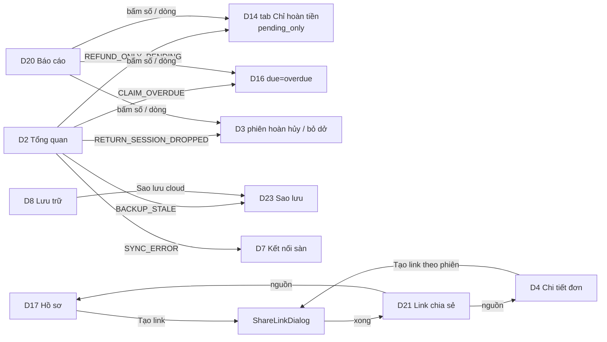

# FE Spec — 03 Mở rộng · client: dashboard (web `/admin`)

| | |
|---|---|
| Tác giả | khanhtt (FE, agent soạn, tự quyết theo ủy quyền user) |
| Reviewer | khanhtt (tech lead, review ở bước 5) |
| Trạng thái | Approved — G2 ✅ có điều kiện 2026-10-07 (DEC-533) |
| Tổng quan & contract | [02-tech-spec.md](02-tech-spec.md) v0.4 §6 · Màn: [01-srs.md §10.5](01-srs.md) v0.5 (D20–D23, `ShareLinkDialog`, `PlatformChip` mới; D2, D3, D4, D7, D8, D10, D13, D14, D15, D16, D17 mở rộng) · nền [item 02 02b-admin](../02-returns-reconciliation/02b-fe-spec-admin.md) · [Design system](../../../design-system/README.md) |
| Last update | 2026-10-07 · FE (T-262: khớp contract M16 / M17 + E2E BE thật tách theo milestone — DEC-800..804; v0.4: G2R3-2 "Là phiên hoàn thật" gỡ lý do hủy; G2R3-3 chữ "Thiếu tệp"; G2R3-4 link bị ảnh hưởng khi đánh dấu quét nhầm + Alert ShareLinkDialog — T-266; v0.3: G2R2-1 D13 mã lý do + D17 đánh dấu quét nhầm / Cần soát; G2R2-2 D23 "Không thấy tệp tại kho"; G2R2-5 hiển thị `MISSING`; G2R2-9 `BACKUP_DISABLED` — T-264, T-265; v0.2: G2-1, G2-4, G2-5, G2-8, G2-9) |

> **TL;DR** — 4 màn mới dưới `/admin`: D20 Báo cáo (`/admin/reports`, 3 tab, thẻ số + bảng + CSV), D21 Link chia sẻ (`/admin/shares`), D22 Thông báo (`/admin/settings/notifications`), D23 Sao lưu (`/admin/settings/backup`); D7 đổi thành "Kết nối sàn" (`/admin/settings/platforms`, đường cũ chuyển hướng) nhiều shop Shopee + TikTok. Thành phần mới `ShareLinkDialog` (D4 + D17, tiến độ qua WS + poll), `PlatformChip`, `RemoveEvidenceDialog` cho mọi bằng chứng (L15). Mở rộng 10 màn theo 01 §10.5 (L11, L13, L14, lọc sàn / shop).
> Dữ liệu qua TanStack Query; WS-02 mới (`share.updated`, `backup.updated`, `shop.updated`) chỉ invalidate (DEC-20 item 01). Bộ lọc báo cáo / danh sách ghi URL. W1 (trang người nhận) **không** thuộc client này — BE sinh (DEC-428).
> Điểm khó: ShareLinkDialog (chọn phiên theo giới hạn, tiến độ nền, lỗi mạng kho lưu), D23 (luồng xác nhận khóa theo dấu vân tay), D20 (3 tab, quyền theo tab, bấm số → màn chi tiết đã lọc).
> 16 task T-251..T-266 (≈ 27,5 ngày công).

Không viết lại API — trỏ API-xx trong [02 §6](02-tech-spec.md#6-api-contract).

---

## 1. Phạm vi

| Goals (spec này làm) | Non-goals (cố ý không làm — để đâu) |
|---|---|
| D20–D23 + D7 mới, mở rộng 10 màn, guard theo ma trận 01 §5.10 | W1 (BE — DEC-428) |
| Mọi màn có loading / empty / error / forbidden; dùng được từ 360 px (bảng → card) | Biểu đồ (FR-09.07, C) — làm cuối T-255 nếu còn thời gian, dữ liệu `series` đã có |
| Bộ lọc sàn / shop ở D3, D14, D15, D16, D20 | Khôi phục từ cloud qua UI (ops dòng lệnh — FR-02.16) |
| Không hiện bí mật; dấu vân tay khóa sao lưu chỉ để đối chiếu | Gửi thông báo từ dashboard ngoài "Gửi thử" |

| Màn / luồng | Route | FR / UC | REUSE / EXTEND / NEW |
|---|---|---|:---:|
| D7 Kết nối sàn | `/admin/settings/platforms?platform=&result=&count=`; `/admin/settings/shopee` → chuyển hướng giữ query | FR-05.13, 05.14, 05.20 / UC-10 | EXTEND `features/platforms/ShopeePage.tsx` → `PlatformsPage.tsx` (đổi tên file, giữ phần thẻ shop) |
| D20 Báo cáo | `/admin/reports?tab=returns\|claims\|productivity&from=&to=&platform=&shop=&station=` | FR-09.02..07 / UC-15 | NEW `features/reports/ReportsPage.tsx` |
| D21 Link chia sẻ | `/admin/shares?status=&q=&mine=&claim_id=&package_id=&page=` | FR-07.08, 07.09 / UC-16 | NEW `features/shares/SharesPage.tsx` |
| `ShareLinkDialog` | dialog (D4, D17) | FR-07.05 / UC-16 | NEW `features/shares/ShareLinkDialog.tsx` (mẫu `claims/EvidencePackDialog.tsx`) |
| D22 Thông báo | `/admin/settings/notifications?channel=&status=&page=` | FR-06.04, 06.07..06.11 / UC-18 | NEW `features/notify/NotificationsPage.tsx` |
| D23 Sao lưu | `/admin/settings/backup` | FR-02.08, 02.13..02.18 / UC-20 | NEW `features/backup/BackupPage.tsx` |
| `PlatformChip` | component | FR-03.03, 07.01 | NEW `src/shared/ui/PlatformChip.tsx` (dùng chung station — DEC-479) |
| D2 Tổng quan | `/admin` | FR-09.01, 08.08, 08.10, 02.15 | EXTEND `features/reports/DailyPage.tsx`, `AttentionList.tsx` |
| D3 Tra cứu | `/admin/packages` | FR-07.01 | EXTEND `orders/PackageFilters.tsx`, `filters.ts`, `PackageTable.tsx` |
| D4 Chi tiết đơn | `/admin/packages/:id` | FR-07.05, 07.09, 03.16, 05.19 | EXTEND `orders/PackageDetailPage.tsx`, `SessionPanel.tsx` |
| D8 Lưu trữ | `/admin/settings/storage` | FR-02.15, 03.16, 08.08 | EXTEND `settings/StoragePage.tsx`, `HealthPanel.tsx` |
| D10 Nhật ký | `/admin/settings/audit` | FR-10.03 | EXTEND `audit/AuditPage.tsx`, `audit/copy.ts` |
| D13 Yêu cầu duyệt | `/admin/approvals` | FR-04.14 | EXTEND `approvals/ApprovalCard.tsx`, `decision.ts` |
| D14 Hàng hoàn | `/admin/returns` | FR-08.08, 07.01 | EXTEND `returns/ReturnsPage.tsx`, `filters.ts` |
| D15 Lệch trạng thái | `/admin/recon` | FR-07.01 | EXTEND `reconciliation/ReconPage.tsx`, `filters.ts` |
| D16 Hồ sơ khiếu nại | `/admin/claims` | FR-07.01, 08.10 | EXTEND `claims/ClaimsPage.tsx`, `filters.ts` |
| D17 Chi tiết hồ sơ | `/admin/claims/:id` | FR-08.07, 08.09, 08.10, 07.05, 07.09 | EXTEND `claims/ClaimDetailPage.tsx`, `EvidenceList.tsx`, `Deadline.tsx` |
| Drawer | — | FR-10.02 | EXTEND `shell/nav.ts`, `app/routes.tsx` |

## 2. Điều hướng

Drawer (01 §10.1, thứ tự): Tổng quan · Tra cứu đơn · Hàng hoàn · Lệch trạng thái · Hồ sơ khiếu nại · **Báo cáo** (`bar_chart`; ADMIN, SUPERVISOR, CSKH) · **Link chia sẻ** (`link`; 3 vai) · Yêu cầu duyệt · Nhập đơn · Live view · *Cài đặt:* Station · **Kết nối sàn** (`storefront`, đổi tên + route) · Lưu trữ video · **Thông báo** (`notifications`; ADMIN) · **Sao lưu** (`cloud_upload`; ADMIN) · Người dùng · Nhật ký thao tác.

Guard: `/admin/reports`, `/admin/shares` — `RequireRole(DASHBOARD)`; tab Năng suất kiểm `role ∈ {ADMIN, SUPERVISOR}` trong trang (CSKH mở `tab=productivity` → đổi `tab=returns` + Alert "Bạn không có quyền xem báo cáo năng suất."). `/admin/settings/{platforms,notifications,backup}` nằm trong nhánh `settings` ADMIN sẵn có (`app/routes.tsx`). Route cũ `settings/shopee` → `<Navigate to={"/admin/settings/platforms" + search} replace />` (link cũ, bookmark, redirect Shopee cũ).

## 3. Cây component

| Component | Mới / reuse (path) | Props / input chính | Ghi chú |
|---|---|---|---|
| `PlatformChip` | NEW `src/shared/ui/PlatformChip.tsx` | `platform`, `shopName`, `single?`, `size?: "md"\|"lg"` | Dựa `StatusChip`; một shop duy nhất của sàn → chỉ tên sàn (01 §10.5 chung); `null` → "Chưa rõ sàn" |
| `PlatformFilter` | NEW `src/shared/filters/PlatformFilter.tsx` | `platform`, `shopId`, `onChange` | 2 `SelectField`: Sàn (Tất cả / Shopee / TikTok Shop), Shop (theo sàn, từ API-156 `["shopsBrief"]` — mọi vai dashboard, DEC-484) |
| `PlatformsPage` (D7) | EXTEND `features/platforms/` | — | `PlatformGroup` (mỗi sàn: Alert cấu hình, thẻ shop, "Shop đã ngắt (n)" thu gọn), `ShopCard` (giữ từ `ShopeePage`), `DisconnectDialog`, xử lý `?result=` theo `platform` |
| `ReportsPage` (D20) | NEW `features/reports/ReportsPage.tsx` | URL | `ReportFilters` (`SegmentedButtons` kỳ nhanh + 2 ô ngày + `PlatformFilter` + Station ở tab Năng suất), `Tabs`, `ReturnsReport`, `ClaimsReport`, `ProductivityReport`, `RateCard` (mở rộng `KpiCard`: số + "40 / 1.000 kiện" + ⓘ công thức), `ReportTable` (`md-table`, cột đầu cố định, card ở mobile), `ExportCsvButton` |
| `SharesPage` (D21) | NEW `features/shares/` | URL | `Tabs` trạng thái (số), tìm, "Của tôi", `ShareTable` / `ShareCard`, `RevokeShareDialog`, `CopyLinkButton` |
| `ShareLinkDialog` | NEW `features/shares/ShareLinkDialog.tsx` | `source: {type: "CLAIM", claimId} \| {type: "SESSION", sessionId}`, `open`, `onClose` | Bước chọn (API-164) → đang tạo (WS + poll API-162 2 giây) → xong / lỗi; đóng khi đang tạo → tiếp tục nền + Toast khi xong (hook toàn cục `useShareCompletionToast`); v0.3: `unavailable_reason = CLIP_MISSING` → hàng xám "Clip thiếu tệp" (v0.4 bỏ "(khôi phục)"); `review_needed` → chip "Cần soát", không chọn sẵn; **v0.4 (DEC-531):** `ReviewPendingAlert` khi `review_pending_count > 0`, `NoOpeningVideoAlert` khi nguồn `CLAIM`, có phiên `RETURN` `selectable` mà chưa chọn phiên `RETURN` nào (tính lại mỗi lần đổi chọn); chữ 01 §10.5 ShareLinkDialog; không khóa "Tạo link" |
| `SharesBlock` | NEW `features/shares/SharesBlock.tsx` | `shares`, `activeCount`, `sourceQuery` | D4 / D17: ≤ 3 dòng + "Xem tất cả" → D21 lọc nguồn |
| `NotificationsPage` (D22) | NEW `features/notify/` | — | `ProviderAlerts`, `ChannelTable`, `ChannelDialog` (thêm / sửa), `TestSendButton`, `DeleteChannelDialog`, `QuietHoursCard` + `QuietHoursDialog`, `MessageLog` (lọc kênh / kết quả, phân trang) |
| `BackupPage` (D23) | NEW `features/backup/` | — | `BackupStatusHeader` (chip `state`, kho lưu, dấu vân tay), `KeyBanner` (vàng chưa xác nhận / đỏ khóa đổi / vàng `RESTORE_PENDING`), `ConfirmKeyDialog`, `OldKeysAlert` + `ReuploadDialog` (API-187 — `key.old_keys[]`; khóa khi `state = DISABLED`, tooltip "Sao lưu đang tắt. Bật sao lưu trước." — v0.3), `BackupCards` (DB đỏ khi `late` **hoặc** `consecutive_failures ≥ 2` / Bằng chứng / Trên cloud), `BackupHistoryTable` (cột dấu vân tay rút gọn), `HashMismatchAlert` + `SourceMissingAlert` (v0.3, `evidence.source_missing > 0`) + `IssuesList` (lọc `kind`; `HASH_MISMATCH`: [Vẫn sao lưu] [Bỏ qua]; `SOURCE_MISSING`: [Thử lại ngay] [Bỏ qua] → `ResolveIssueDialog`, API-188), `AllPackClipsSwitch`, `AdvancedSettings` (tốc độ tải lên — DEC-486) |
| `RemoveEvidenceDialog` | EXTEND từ Dialog bỏ bằng chứng trong `claims/EvidenceList.tsx:229` | `evidence`, `onConfirm(reason)` | Mọi loại bằng chứng; chữ "Clip và ảnh của phiên này được giữ tới {removal_keep_until} rồi tự xóa (trừ khi thuộc hồ sơ khác)." |
| `PriorReturnAlert` | NEW `features/claims/PriorReturnAlert.tsx` | `prior_return_sessions`, `excluded_return_sessions`, `review_sessions` | Alert info D17 (BR-39) + Alert thứ hai "Kiện có {n} phiên mở hoàn bị loại vì quét nhầm ({dd/mm HH:mm}) — không đưa vào bằng chứng. Video vẫn được giữ; thêm tay nếu cần." + link "Thêm vào bằng chứng" (mở dialog thêm bằng chứng sẵn có, chọn sẵn phiên) khi có phần tử `in_evidence = false`; phần tử `evidence_exclusion = MARKED` có thêm "Bỏ đánh dấu" (v0.3); phần tử `evidence_exclusion ∈ {STATION_CANCEL, SUPERVISOR_CANCEL}` có [Là phiên hoàn thật] chỉ với ADMIN / SUPERVISOR → `ConfirmReturnDialog` `mode = "OVERRIDE"` (v0.4 — DEC-529); Alert vàng thứ ba khi `review_sessions` khác rỗng: chữ 01 §10.5 D17 "Cần soát" + [Là phiên hoàn thật] [Quét nhầm] (v0.3) |
| `EvidenceList` (dòng phiên) | EXTEND `claims/EvidenceList.tsx` | `evidence[].session.{cancel_reason, cancel_cause, evidence_exclusion, review_needed, wrong_scan}`, `primary` | Chip theo §9 (`evidence_exclusion` ưu tiên: "Đã đánh dấu quét nhầm" / "Hủy: quét nhầm" / "Hủy: không phải hàng hoàn"; `review_needed` → chip vàng "Cần soát: quản lý hủy, chưa rõ lý do"); nhãn "Phiên chính" chỉ theo `primary` server (FE không tự tính); menu "⋮" trên dòng phiên RETURN `CANCELLED` / `ABANDONED` chưa bị loại: "Đánh dấu quét nhầm" (v0.3); clip `MISSING` → khối xám thay player (§9) |
| `WrongScanDialog` (v0.3) | NEW `features/claims/WrongScanDialog.tsx` | `claimId`, `session`, `mode: "MARK" \| "UNMARK"`, `version` | API-189 `MARK_WRONG_SCAN` / `UNMARK_WRONG_SCAN`; chữ 01 §10.5 D17 "Đánh dấu quét nhầm"; ngày giữ lấy `removal_keep_until` của dòng; **v0.4:** response `affected_shares` khác rỗng → đóng dialog, mở `AffectedSharesDialog` thay Toast |
| `AffectedSharesDialog` (v0.4) | NEW `features/claims/AffectedSharesDialog.tsx` | `shares: affected_shares[]` | Chữ 01 §10.5 D17 v0.5 "Phiên này đang có trong {n} link chia sẻ còn hiệu lực"; mỗi dòng Gửi cho · hết hạn · [Thu hồi link] khi `can_revoke` (dùng lại `RevokeShareDialog` → API-163), không thì chữ "Nhờ Admin / Supervisor thu hồi"; thu hồi xong → Toast "Đã thu hồi link.", gạch dòng; invalidate `["shares"]`, `["claim", id]` (DEC-531) |
| `ConfirmReturnDialog` (v0.3) | NEW `features/claims/ConfirmReturnDialog.tsx` | `claimId`, `session`, `version`, `mode: "REVIEW" \| "OVERRIDE"` (v0.4) | API-189 `CONFIRM_RETURN`; `REVIEW`: "Xác nhận là phiên hoàn thật?" · "Ghi chú*" 5–500 · chữ "Phiên sẽ được tính như phiên mở hoàn thường và có thể thành phiên chính."; `OVERRIDE` (v0.4, phiên bị loại theo lý do hủy): tiêu đề "Gỡ lý do hủy, xác nhận là phiên hoàn thật?" · chữ 01 §10.5 D17 v0.5 · Toast "Đã xác nhận phiên hoàn thật."; 403 → Toast `message` |
| `MissingMediaBlock` (v0.3) | NEW `src/shared/media/MissingMediaBlock.tsx` | `kind: "clip" \| "snapshot"` | Khối xám chữ 01 §10.5 "Clip / ảnh Thiếu tệp" (v0.4: "Thiếu tệp clip trên máy chủ — không phát được." — `MISSING` còn do EX-K9); dùng ở D4 `SessionPanel`, D17 `EvidenceList`, lưới ảnh; ẩn nút Cắt lại / Xuất |
| `RemovedEvidenceList` | NEW `features/claims/RemovedEvidenceList.tsx` | `removed_evidence` | Thu gọn "Bằng chứng đã bỏ ({n})": ai, lúc, lý do, giữ tới; nút "Thêm lại" (API-134) |
| `DeadlineChip` | EXTEND `claims/Deadline.tsx` | `deadline_source` | `DEFAULT_PLATFORM_PASSED` → chip "Hạn sàn đã qua" |
| `ApprovalCard` | EXTEND `approvals/ApprovalCard.tsx` | `return_summary` | "Đã có kết luận: Hộp rỗng · 3 ảnh · mở 4 phút"; Hủy phiên RETURN → `CancelReturnDialog` (v0.3): `RadioGroup` "Lý do*" 3 lựa chọn không chọn sẵn + ô "Ghi chú*" 5–500 + chữ dưới đổi theo lựa chọn (01 §10.5 D13) → API-21 `{action, reason_code, note}` |
| `AttentionList` | EXTEND `reports/AttentionList.tsx` | — | 4 kind mới + `SYNC_ERROR` có tên shop / sàn (02 §6.2 API-32) |
| `DailyPage` | EXTEND | — | Thẻ "Phiên hoàn hủy / bỏ dở (7 ngày)" (`returns_dropped_7d`) → D3 `session_type=RETURN&return_dropped=true&date_from=…` (cùng luật loại phiên quét nhầm — BR-39) |
| `HealthPanel` | EXTEND `settings/HealthPanel.tsx` | `backup` | Dòng "Sao lưu cloud": OK / Trễ / Lỗi / Chưa cấu hình → link D23 (ADMIN) |
| `StoragePage` | EXTEND | — | Công tắc "Bắt buộc tên người đóng gói" (mục Station); ô "Hạn mặc định Chỉ hoàn tiền (giờ)" ở nhóm ngưỡng (DEC-485) |
| `SessionPanel` | EXTEND `orders/SessionPanel.tsx` | `session` | "Người đóng gói: …"; nút "Tạo link chia sẻ" (phiên có clip); sự kiện `AMBIGUOUS_SHOP` "Mã có ở 2 shop: …" trong dòng thời gian |
| `ReturnsPage` | EXTEND | — | Tab `NO_PARCEL` ("Chỉ hoàn tiền"): cột "Hạn phản hồi" (`DueCountdown`), "Hồ sơ khiếu nại" (mã / nút Tạo), chip "Chỉ chưa xử lý" (`pending_only`), sắp `due_asc` |
| `DueCountdown` | NEW `src/shared/time/DueCountdown.tsx` | `dueAt`, `source`, `warnHours = 48` | "còn 1 ngày 4 giờ"; đỏ ≤ 48 giờ; chip "Quá hạn"; ⓘ khi `DEFAULT` |
| `AuditPage` | EXTEND | — | Nhãn 15 action mới (§9) |

## 4. State & data fetching

| Dữ liệu | Nguồn (API-xx) | Nơi giữ state | Cache & làm mới | Optimistic? |
|---|---|---|---|:---:|
| Shop rút gọn (bộ lọc) | API-156 | Query `["shopsBrief"]` | `staleTime` 5 phút; WS `shop.updated` | ✗ |
| Shop + cấu hình sàn | API-70 | Query `["shops"]` | Invalidate: WS `shop.updated`, sau API-73 / 154; poll 10 giây khi có shop `sync_in_progress` | ✗ |
| Kết nối | API-71 (`platform`) | mutation → `window.location.assign(url)` | — | ✗ |
| Báo cáo | API-150 / 151 / 152 | Query `["report", tab, filters]` | `staleTime` 60 giây (khớp cache server); đổi lọc → `placeholderData: keepPreviousData` (số cũ mờ + `LinearProgress`) | ✗ |
| CSV | API-153 | `api.blob` → `saveBlob` (sẵn có `shared/download.ts`) | — | — |
| Lựa chọn link | API-164 | Query `["shareOptions", source]` | Khi mở dialog; 409 `SESSION_CLIP_UNAVAILABLE` → refetch | ✗ |
| Link | API-160, 162 | mutation; Query `["share", id]` | Poll 2 giây khi `CREATING` + WS `share.updated` | ✗ |
| Danh sách link | API-161 | Query `["shares", filters]` | Invalidate: WS `share.updated`, sau 163 | ✗ |
| Link của kiện / hồ sơ | API-31 / API-132 `shares[]` | Query sẵn có `["package", id]`, `["claim", id]` | Invalidate theo WS `share.updated` | ✗ |
| Kênh thông báo | API-170 | Query `["notify", "channels"]` | Sau 171..174, 176 | ✗ |
| Nhật ký gửi | API-175 | Query `["notify", "messages", filters]` | Poll 30 giây khi trang mở | ✗ |
| Sao lưu | API-180, 185 | Query `["backup"]`, `["backup", "issues"]` | WS `backup.updated`; poll 15 giây khi `db.running` | ✗ |
| Tải lại bằng khóa mới | API-187 | mutation → Toast "Đã xếp {queued} tệp vào hàng chờ." → invalidate `["backup"]` | — | ✗ |
| Xử lý lệch mã băm / không thấy tệp | API-188 (`UPLOAD_ANYWAY` / `IGNORE` / `RETRY`) | mutation → invalidate `["backup"]`, `["backup", "issues"]`, `["daily"]` | — | ✗ |
| Đánh dấu quét nhầm / xác nhận phiên (v0.3) | API-189 | mutation `useClaimMutation` (sẵn có, `version`) → set `["claim", id]` từ response; invalidate `["claims"]`, `["package", packageId]`, `["daily"]` (hồ sơ khác cùng kiện đổi bằng chứng) | — | ✗ |
| Sức khỏe | API-81 | Query `["health"]` (sẵn có, 30 giây) | + WS `backup.updated` | ✗ |
| Hồ sơ (bỏ / thêm lại bằng chứng) | API-134 | mutation `useClaimMutation` (sẵn có, `version`) | Như Phase 2 | ✗ (DEC-241) |
| Tổng quan | API-32 | Query `["daily"]` (sẵn có) | Như cũ | ✗ |

WS (`features/shell/useDashboardSocket.ts`): `share.updated` → invalidate `["shares"]`, `["share", id]`, `["package"]`, `["claim"]`; `backup.updated` → `["backup"]`, `["health"]`, `["daily"]`; `shop.updated` → `["shops"]`, `["daily"]`. Kết nối lại → invalidate thêm `["shares"]`, `["backup"]`, `["shops"]`.

## 5. Form & validate

| Form | Field | Rule client | Lỗi server map vào field |
|---|---|---|---|
| ShareLinkDialog | Phiên (checkbox) | 1–4; tổng `duration_s` ≤ 1.800; hàng `selectable = false` khóa + lý do | `fields.session_ids` → dưới danh sách |
| | Góc quay | `SIDE_BY_SIDE` (mặc định) / `CAM1` | `fields.layout` |
| | Kèm ảnh | checkbox "Kèm ảnh ({snapshot_count})"; ẩn khi 0 | — |
| | Gửi cho* | 3–100 sau trim: "Ghi rõ gửi cho ai (3–100 ký tự)." | `fields.recipient` |
| | Hết hạn sau | 1 / 3 / 7 (mặc định `default_expires_days`) | `fields.expires_days` |
| ChannelDialog | Tên* | 2–40 | `fields.name`; `409 CHANNEL_NAME_EXISTS` → "Đã có kênh tên này." |
| | Loại* | `SegmentedButtons`; loại chưa cấu hình khóa | `409 PROVIDER_NOT_CONFIGURED` → Alert |
| | Chat ID* / Zalo user ID* | Telegram `^-?\d{1,20}$` ("Chat ID là một số (nhóm thường bắt đầu bằng -100)."); Zalo `^\d{1,64}$` | `fields.target` |
| | Sự kiện | ≥ 1 ("Chọn ít nhất 1 sự kiện.") | `fields.events` |
| QuietHoursDialog | Từ, Đến | `HH:MM`, khác nhau; "Tắt giờ yên lặng" | `fields.start`, `fields.end` |
| ConfirmKeyDialog | Checkbox "Tôi đã cất bản sao khóa…" | Phải tick mới bật nút | `409 BACKUP_KEY_MISMATCH` → Alert + tải lại |
| D23 Nâng cao | Tốc độ tải lên (Mbit/s) | 1–1000 | `fields.upload_mbps` |
| ResolveIssueDialog (D23) | Lý do* | 5–500 ("Nhập lý do (5–500 ký tự)."); tiêu đề theo hành động: "Vẫn sao lưu bản hiện có?" (chữ "Bản trên cloud sẽ ghi chú lệch mã băm.") / "Bỏ qua tệp này?" (chữ "Tệp này sẽ không có bản sao ngoài kho.") / "Thử lại ngay?" (chữ "Dùng sau khi IT đã chép lại tệp vào máy chủ." — v0.3) | `fields.note`; `409 BACKUP_ISSUE_RESOLVED` / `BACKUP_ISSUE_ACTION_INVALID` → Toast + refetch |
| ReportFilters | Từ, Đến | `to ≥ from`; ≤ 366 ngày; `to ≤ hôm nay` (giờ VN) — khóa "Xem" | `fields.from` / `fields.to` |
| RemoveEvidenceDialog | Lý do* | 5–500 ("Nhập lý do bỏ bằng chứng (5–500 ký tự).") | `fields.note` |
| CancelReturnDialog (D13, v0.3) | Lý do* (radio) | Bắt buộc: "Chọn lý do hủy." | `fields.reason_code` |
| | Ghi chú* | 5–500 sau trim ("Nhập ghi chú (5–500 ký tự)."); [Hủy phiên] khóa tới khi hợp lệ | `fields.note` |
| WrongScanDialog (D17, v0.3) | Lý do* (radio, chỉ MARK) | "Quét nhầm kiện khác" / "Không phải kiện hàng hoàn"; thiếu → "Chọn lý do." | `fields.reason_code` |
| | Ghi chú* | 5–500 ("Nhập ghi chú (5–500 ký tự).") | `fields.note` |
| ConfirmReturnDialog (D17, v0.3) | Ghi chú* | 5–500 | `fields.note` |
| D8 | Hạn mặc định Chỉ hoàn tiền | 1–168 | `fields.refund_only_default_hours` |

## 6. Trạng thái UI

| Màn | Loading | Empty | Error | Forbidden | Success |
|---|---|---|---|---|---|
| D7 | Skeleton 2 nhóm × 1 thẻ | "Chưa kết nối shop nào." + "Mở Nhập đơn" | Alert "Không tải được trạng thái kết nối." + Thử lại | D12 | `?result=` → Toast / Alert theo 01 §10.5 D7 (chữ theo `platform`, `count`) rồi xóa query |
| D20 | Skeleton 4 thẻ + 2 bảng | Mỗi bảng "Không có dữ liệu trong kỳ này."; thẻ tỷ lệ "—" + chú thích | Alert "Không tải được báo cáo." + Thử lại (gồm `REPORT_TIMEOUT`) | Tab Năng suất với CSKH → tab Hàng hoàn + Alert | Số + bảng; CSV → Toast "Đã tải file CSV." |
| D21 | Skeleton bảng | "Chưa có link chia sẻ nào." + "Tạo link từ hồ sơ khiếu nại hoặc chi tiết đơn." | Alert + Thử lại | D12 | Chip trạng thái; "Đang thu hồi — chờ Internet" khi `revoke_pending` |
| ShareLinkDialog | Skeleton danh sách phiên | Không phiên chọn được → "Chưa có phiên nào có clip." | Alert "Không tải được lên kho lưu cloud. Kiểm tra Internet rồi bấm Thử lại." / "Không dựng được video. Bấm Thử lại; nếu vẫn lỗi, báo Admin kèm mã hồ sơ." + Thử lại | Nút mở bị ẩn | "Link đã sẵn sàng" + ô link + Sao chép + hạn + gửi cho |
| D22 | Skeleton | EmptyState "Chưa có kênh thông báo." + Thêm kênh | Alert + Thử lại | D12 | Toast "Đã gửi tin thử tới {tên}." / Alert lỗi dưới dòng |
| D23 | Skeleton | `NOT_CONFIGURED` → EmptyState hướng dẫn IT | Alert + Thử lại | D12 | Chip "Đang bật"; banner theo `state` (gồm `RESTORE_PENDING`); Alert khóa cũ + "Tải lại bằng chứng bằng khóa mới" → Toast "Đã xếp {n} tệp vào hàng chờ."; lệch mã băm → Toast "Đã ghi nhận."; Toast kiểm tra kết nối |
| D2 / D3 / D4 / D8 / D10 / D13 / D14 / D15 / D16 / D17 | Như Phase 2 | Như Phase 2 | Như Phase 2 | Như Phase 2 | Theo §3 |

## 7. Phân quyền trên UI

| Hành động / màn | Role thấy | Cách xử lý khi không quyền |
|---|---|---|
| D7, D22, D23, công tắc người đóng gói (D8) | ADMIN | Không có mục drawer; URL → D12 |
| D20 tab Hàng hoàn, Khiếu nại + CSV | ADMIN, SUPERVISOR, CSKH | — |
| D20 tab Năng suất + CSV | ADMIN, SUPERVISOR | Tab ẩn; URL → tab Hàng hoàn + Alert |
| Tạo link (D4, D17), xem D21 | ADMIN, SUPERVISOR, CSKH (`shares.create`, `shares.read`) | Ẩn nút |
| Thu hồi link | ADMIN, SUPERVISOR; CSKH khi `can_revoke` | Ẩn nút theo `can_revoke` (server trả) |
| D8 dòng "Sao lưu cloud" | ADMIN (link D23), SUPERVISOR (chỉ xem, không link) | — |
| D2 `SYNC_ERROR`, `BACKUP_STALE` | ADMIN (server lọc) | — |
| D13 hủy phiên hoàn | ADMIN, SUPERVISOR | Như Phase 2 |
| D17 "Đánh dấu quét nhầm" / "Bỏ đánh dấu" / "Là phiên hoàn thật" (v0.3, API-189) | ADMIN, SUPERVISOR, CSKH | Ẩn menu / nút; hồ sơ Đóng → ẩn |
| D17 "Là phiên hoàn thật" cho phiên bị loại theo lý do hủy (v0.4, API-189 `CONFIRM_RETURN` — DEC-529) | ADMIN, SUPERVISOR | Ẩn nút với CSKH; 403 → Toast `message` |
| `AffectedSharesDialog` [Thu hồi link] (v0.4) | Theo `can_revoke` của từng link (server) | Thay nút bằng chữ "Nhờ Admin / Supervisor thu hồi" |
| Bỏ bằng chứng (D17) | ADMIN, SUPERVISOR, CSKH | Như Phase 2 |

## 8. Xử lý lỗi API

| Mã lỗi (từ 02) | Hiển thị | Hành động |
|---|---|---|
| `PLATFORM_NOT_CONFIGURED` (503) | Alert info trong nhóm sàn: "Chưa cấu hình TikTok Shop. Liên hệ IT để bật (cần tài khoản đối tác TikTok Shop)." / Shopee giữ câu cũ | Khóa nút kết nối |
| `SHOP_NOT_CONNECTED`, `SYNC_IN_PROGRESS` (409) | Như Phase 1 | Như Phase 1 |
| `REPORT_TIMEOUT` (503) | Alert "Không tải được báo cáo." | Thử lại |
| `VALIDATION_ERROR` (422) báo cáo | Lỗi dưới ô ngày | Khóa "Xem" |
| `CLOUD_NOT_CONFIGURED` (503) | Alert trong dialog + tooltip nút | Khóa tạo link |
| `SESSION_CLIP_UNAVAILABLE` (409) | Toast `message` | Refetch API-164, hàng xám |
| `SHARE_NOT_ACTIVE` (409) | Toast `message` | Refetch danh sách |
| `CHANNEL_NAME_EXISTS` (409) | Lỗi dưới ô tên | — |
| `PROVIDER_NOT_CONFIGURED` (409) | Alert "Chưa cấu hình bot Telegram trên máy chủ. Liên hệ IT." | Khóa loại |
| `NOTIFY_SEND_FAILED` (502), `NOTIFY_TIMEOUT` (504) | Alert dưới dòng kênh: `message` server | Cho bấm lại |
| `BACKUP_NOT_CONFIGURED` (503) | EmptyState D23 | — |
| `BACKUP_KEY_UNCONFIRMED` (409) | Mở `ConfirmKeyDialog` | — |
| `BACKUP_KEY_MISMATCH` (409) | Alert "Khóa trên máy chủ vừa đổi — kiểm lại dấu vân tay." | Refetch API-180 |
| `BACKUP_RUNNING` (409) | Toast "Đang sao lưu, thử lại sau." | — |
| `BACKUP_RESTORE_UNVERIFIED` (409) | Banner D23 "Hệ thống vừa được khôi phục. Sao lưu tạm dừng tới khi IT chạy lệnh kiểm khôi phục đạt." | Khóa công tắc bật / Sao lưu ngay / Tải lại |
| `BACKUP_ISSUE_RESOLVED`, `BACKUP_ISSUE_ACTION_INVALID` (409) | Toast `message` | Refetch API-185 |
| `BACKUP_DISABLED` (409, v0.3) | Toast "Sao lưu đang tắt. Bật sao lưu rồi thử lại." | Refetch API-180 (nút khóa theo `state`) |
| `SESSION_NOT_ELIGIBLE` (409, API-189, v0.3) | Toast `message` | Refetch `["claim", id]`, đóng dialog |
| `CLAIM_CLOSED` (409, API-189) | Toast `message` | Refetch, ẩn menu |
| `FORBIDDEN` (403, API-189 `CONFIRM_RETURN` gỡ lý do hủy, v0.4) | Toast `message` "Chỉ Admin / Supervisor gỡ lý do hủy của phiên." | Đóng dialog, refetch `["claim", id]` |
| `BACKUP_ISSUE_ACTION_INVALID` (409, API-188 `IGNORE` khi tệp đã có lại, v0.4) | Toast `message` "Tệp đã có lại tại kho — bấm Thử lại ngay." | Refetch API-185 |
| `CLIP_NOT_READY` (409) `details.status = MISSING` (API-40/43, v0.3) | `MissingMediaBlock` thay player / Toast `message` khi bấm Xuất | Không thử lại |
| `CLIP_NOT_FAILED` (409) `details.status = MISSING` (API-46) | Toast `message` | Ẩn nút "Cắt lại" khi `MISSING` |
| `CLOUD_AUTH_FAILED` (502), `CLOUD_ERROR` (502), `CLOUD_UNREACHABLE` (504) | Alert dưới nút "Kiểm tra kết nối" (`message`) | — |
| `VERSION_CONFLICT` (409) API-134 | Như Phase 2 (tải lại, giữ Dialog đóng) | — |
| `FORBIDDEN` (403) | D12 / Toast cho hành động | — |
| Mã lạ | `message` server | — |

## 9. Nội dung chữ · i18n · a11y · responsive

Chữ lấy nguyên văn 01 §10.5 (D7, D20, ShareLinkDialog, D21, D22, D23, D2, D4, D13, D14, D17, D8). Thêm vào `copy.ts` từng feature; nhãn enum chung trong `src/shared/labels.ts`:

| Nhóm | Nhãn |
|---|---|
| `platform` | `SHOPEE` Shopee · `TIKTOK` TikTok Shop |
| `share.status` | Đang tạo · Đang hoạt động · Lỗi · Đã thu hồi · Hết hạn |
| `backup.state` | Đang bật · Chưa cấu hình · Chưa xác nhận khóa · Khóa đã đổi · Đã tắt · Chờ kiểm khôi phục |
| `backup_object.status` (D23 danh sách) | Đang chờ · Đang tải · Đã sao lưu · Lỗi · Lệch mã băm · Tệp đã xóa tại kho · Bỏ qua · Đã xóa trên cloud |
| `clip.status`, `snapshot.status` (thêm) | `MISSING` Thiếu tệp (v0.4 bỏ "(khôi phục)") — D4 / D17 `MissingMediaBlock` thay player / ảnh; chip xám trong danh sách (v0.3: cả ảnh) |
| `session.cancel_reason` (phiên RETURN) | `WRONG_SCAN` Hủy: quét nhầm · `NOT_A_RETURN` Hủy: không phải hàng hoàn · `SUPERVISOR` Quản lý hủy · `OTHER` Hủy: lý do khác |
| `session.cancel_cause` (v0.3, khi `SUPERVISOR`) | `WRONG_SCAN` Quản lý hủy: quét nhầm · `NOT_A_RETURN` Quản lý hủy: không phải hàng hoàn · `OTHER` Quản lý hủy: lý do khác · `null` → chip "Cần soát" nếu `review_needed` |
| `session.evidence_exclusion` (v0.3) | `MARKED` Đã đánh dấu quét nhầm · `STATION_CANCEL` / `SUPERVISOR_CANCEL` → nhãn theo lý do hiệu lực |
| `backup_object` vấn đề (D23, v0.3) | `HASH_MISMATCH` Lệch mã băm · `SOURCE_MISSING` Không thấy tệp tại kho · `UPLOAD_FAILED` Tải lên lỗi |
| API-92 action (v0.3) | `SESSION_WRONG_SCAN_MARK` Đánh dấu phiên quét nhầm · `SESSION_WRONG_SCAN_UNMARK` Bỏ đánh dấu quét nhầm · `SESSION_RETURN_CONFIRM` Xác nhận phiên hoàn thật · `MEDIA_MARK_MISSING` Đánh dấu thiếu tệp (v0.4) · `MEDIA_MISSING_RECOVERED` Tệp có lại (v0.4) · `PACKAGE_CANCEL_REVERT` Trả lại kiện sau yêu cầu hủy không thành · `BACKUP_VERIFY_ACCEPT` Chấp nhận khi kiểm khôi phục |
| `notify_message.status` | Đang chờ · Tạm giữ · Đã gửi · Lỗi · thử lại {n} · Bị bỏ · Trùng, bỏ qua |
| N01..N10 | Theo API-170 `events[].label` (server) — không chép cứng |
| API-92 action mới (D10) | `SHOP_DISCONNECT` Ngắt kết nối shop · `SHARE_CREATE` Tạo link chia sẻ · `SHARE_REVOKE` Thu hồi link · `SHARE_EXPIRE` Link hết hạn · `NOTIFY_CHANNEL_CREATE` Thêm kênh thông báo · `NOTIFY_CHANNEL_UPDATE` Sửa kênh thông báo · `NOTIFY_CHANNEL_DELETE` Xóa kênh thông báo · `NOTIFY_TEST` Gửi thử thông báo · `NOTIFY_SETTINGS_UPDATE` Đổi giờ yên lặng · `BACKUP_SETTINGS_UPDATE` Đổi cài đặt sao lưu · `BACKUP_KEY_CONFIRM` Xác nhận cất khóa sao lưu · `BACKUP_TEST` Kiểm tra kết nối kho lưu · `BACKUP_RUN_NOW` Sao lưu DB ngay · `REPORT_EXPORT` Xuất CSV báo cáo · `CLAIM_EVIDENCE_REMOVE` Bỏ bằng chứng · `BACKUP_REUPLOAD_OLD_KEY` Tải lại bằng chứng bằng khóa mới · `BACKUP_ISSUE_RESOLVE` Xử lý tệp lệch mã băm · `BACKUP_RESTORE_VERIFIED` Kiểm khôi phục đạt |
| Công thức ⓘ (D20) | Câu BR-41, vd "Tỷ lệ hoàn = hồ sơ hàng hoàn có kiện về tạo trong kỳ ÷ kiện bàn giao trong kỳ" |

Định dạng: số `1.000`, tỷ lệ `4,0%` (`Intl.NumberFormat("vi-VN")`), tiền `2.350.000 đ`, thời lượng giây → "1 phút 30 giây", giờ VN `dd/mm HH:mm`. a11y: bảng báo cáo có `<caption>` ẩn; ô số căn phải; ⓘ là `button` có `aria-describedby`; dialog bẫy focus (Dialog sẵn có); tiến độ `role="progressbar"` + `aria-valuenow`; "Sao chép link" báo `aria-live`. Responsive: D20 thẻ 2 cột ≤ 600 px, bảng cuộn ngang cột đầu cố định; D21 / D22 bảng → card ở ≤ 600 px; ShareLinkDialog toàn màn ở ≤ 600 px.

## 10. Riêng nền tảng

Web: Chrome / Edge / Safari 2 bản gần nhất (như Phase 1). Bundle: `features/{reports,shares,notify,backup}` lazy-load theo route (`app/routes.tsx`); không thêm thư viện biểu đồ ở bước này (C — nếu làm dùng SVG tự vẽ cột đơn giản, ≤ 5 KB). Sao chép link: `navigator.clipboard.writeText` (HTTPS nội bộ — đã có), fallback chọn ô `readonly`. Link chia sẻ rất dài → ô `readonly` một dòng + nút, không hiện link đầy đủ trong bảng D21 (chỉ "Sao chép").

## 11. Analytics & theo dõi lỗi

N/A — dự án chưa có analytics (Phase 1–2). Lỗi API hiện Toast / Alert; console log như Phase 2.

## 12. Mock khi BE chưa xong

Theo đúng contract 02 §6, qua lớp `lib/api/client.ts` + MSW (`src/mocks/handlers/*`), bật bằng `pnpm dev:mock` như Phase 1–2:

| Handler | Dữ liệu |
|---|---|
| `shops.ts` (mở rộng) | `platforms[]` (TikTok bật), 2 shop Shopee + 2 TikTok (1 `EXPIRED`, 1 `DISCONNECTED`), `sync_warnings`; API-71 trả URL về chính callback mock → `?platform=tiktok&result=connected&count=2`; API-154 |
| `reports.ts` (mở rộng) | API-150..152 với bộ số ví dụ BR-41 (4,0 %, 20,0 %, 75 %, 2.350.000 đ, TB 90 giây, "(Không ghi tên)"); API-153 trả CSV mẫu; 403 cho CSKH ở productivity |
| `shares.ts` (mới) + `sharesDb.ts` | API-160..164; `CREATING` → `ACTIVE` sau 3 lần poll (phát WS `share.updated` qua `mocks/ws.ts`); `?fail=upload` → `FAILED UPLOAD_FAILED`; M16: link Supervisor `share-4`, thu hồi xong sau 2 giây, `?cloudOffline=1` giữ "Đang thu hồi — chờ Internet" (DEC-703) |
| `notify.ts` (mới) | API-170..176; `ZALO_OA` chưa cấu hình; "Gửi thử" Telegram lỗi khi `target` = `-1000000000000` (502), `-1009999999999` (504); 3 kênh Kho (OK) / CSKH (Lỗi) / Chủ shop (Tắt, N10); nhãn N01..N10 theo 01 §7.5 (DEC-763) |
| `backup.ts` (mới) | API-180..188; nút giả đổi `state` (`NOT_CONFIGURED` / `KEY_UNCONFIRMED` / `KEY_CHANGED` / `RESTORE_PENDING` / `ON`) bằng query `?backupState=`; `?oldKeys=1` → `key.old_keys[]` 1 khóa cũ (812 tệp, 42 bản DB); `?dbFail=2` → `consecutive_failures = 2`; 2 tệp `HASH_MISMATCH` xử lý được; v0.3: `?srcMissing=1` → 1 tệp `SOURCE_MISSING` (Thử lại / Bỏ qua), `?backupState=DISABLED` → 409 `BACKUP_DISABLED` ở API-184 / 187 |
| `claims.ts` (v0.3) | API-189 3 action (cập nhật `claimsDb`, phiên chính tính lại theo luật mock đơn giản), hồ sơ mẫu có phiên `review_needed` + phiên `MARKED`; clip / ảnh `MISSING` ở 1 kiện mẫu (M16: `SPXTST0000062` + KN-000142 — DEC-711) |
| `claims.ts`, `packages.ts`, `returns.ts`, `recon.ts`, `reports.ts` (API-32), `approvals.ts`, `settings.ts` | Trường mở rộng §6.1 "Mở rộng" |

## 13. Test FE

| Mức | Phạm vi | Case chính (TC-xx — QA đánh số ở `04`) |
|---|---|---|
| Unit / component | `PlatformChip`, `DueCountdown` (biên 48 giờ, quá hạn), định dạng tỷ lệ "—", `ReportFilters` validate kỳ, `ShareLinkDialog` validate (0 / 5 phiên, 31 phút, gửi cho 2 ký tự), `ChannelDialog` validate, `ConfirmKeyDialog` (khóa nút tới khi tick), `RemoveEvidenceDialog` (mọi loại cần lý do), `ResolveIssueDialog` (lý do 5–500), `OldKeysAlert` (ẩn khi rỗng), `PriorReturnAlert` (Alert phiên bị loại, Cần soát), chip `cancel_reason` / `cancel_cause` / `evidence_exclusion`, `CancelReturnDialog` (khóa nút tới khi có lý do + ghi chú; chữ đổi theo lý do), `WrongScanDialog`, `ConfirmReturnDialog`, `MissingMediaBlock` (v0.3) | FR-07.05, 06.04, 02.17, 08.09, 09.05, EX-K6, EX-K7, BR-39 |
| Integration (MSW) | D7 kết nối 2 shop TikTok (`?result=`), ngắt shop; D20 3 tab + quyền CSKH + bấm số → URL đích + CSV; ShareLinkDialog đủ vòng (tạo → tiến độ → sao chép → thu hồi) + lỗi upload; D21 lọc / thu hồi / "Đang thu hồi"; D22 thêm / sửa / gửi thử lỗi / giờ yên lặng; D23 5 trạng thái + xác nhận khóa + khóa cũ → tải lại + lệch mã băm → vẫn sao lưu / bỏ qua + 2 lượt DB lỗi + kiểm tra kết nối lỗi; D17 phiên trước + phiên quét nhầm bị loại (Alert, thêm tay, không thành "Phiên chính") + bỏ / thêm lại bằng chứng + chip hạn; D2 thẻ phiên hủy → D3 `return_dropped=true`; D14 tab Chỉ hoàn tiền sắp hạn; D2 mục mới; D13 lý do hủy; v0.3: D13 chọn "Quét nhầm kiện khác" → request đúng `reason_code`; D17 đánh dấu quét nhầm phiên chính → "Phiên chính" chuyển sang phiên khác theo response, bỏ đánh dấu, xác nhận Cần soát, 409 `SESSION_NOT_ELIGIBLE`; D23 `SOURCE_MISSING` thử lại / bỏ qua, `DISABLED` khóa nút; D4 clip `MISSING` | AC-40, 45..47, 52, 55, 56..60, 62 |
| E2E mock | `e2e/mock/{platforms,reports,shares,notify,backup}.spec.ts` (+ `phase3-m12.spec.ts`) | UC-10, 15, 16, 18, 20 |
| E2E BE thật | `e2e/real/phase3-m1{2..7}-*.spec.ts` — mỗi bộ một cờ `E2E_M1x_BE` (T-262, DEC-804; stack dev: MinIO, mock TikTok, notify mock): M12 D2 / D13 / D14 / D17 hardening; M13 kết nối TikTok mock → đơn xuất hiện D3 lọc TikTok, ngắt / kết nối lại; M14 báo cáo khớp API + CSV; M15 D23 MinIO → xác nhận khóa → sao lưu DB; M16 tạo link → mở W1 từ MinIO → thu hồi → link chết ≤ 60 giây; M17 thêm kênh mock + gửi thử | AC-40, 45..47, 52, 55, 61 |

## 14. Task

| # | Việc | Màn / FR | Phụ thuộc (API-xx) | Ước lượng |
|---|---|---|---|---|
| T-251 | API client `lib/api/{shops,reports,shares,notify,backup}.ts` + mở rộng `packages`, `returns`, `recon`, `claims`, `approvals`, `settings`, `reports` (API-32); nhãn `shared/labels.ts`; MSW handlers + db (§12) | nền | 02 §6 (mock) | 2 |
| T-252 | Route + drawer (mục mới, đổi tên D7, chuyển hướng `/shopee`) + `PlatformChip`, `PlatformFilter` (API-156), `DueCountdown` + WS 3 sự kiện | nav / FR-10.02, 03.03, 07.01 | API-04, 156, WS-02; T-251 | 1 |
| T-253 | D7 Kết nối sàn: nhóm theo sàn, thẻ shop, kết nối theo sàn, `?result=`, ngắt kết nối, shop đã ngắt, cảnh báo đồng bộ | D7 / FR-05.13, 05.14, 05.20 | API-70..73, 154; T-252 | 2 |
| T-254 | D20 khung + `ReportFilters` (URL, validate) + tab Hàng hoàn (thẻ, 4 bảng, ⓘ, bấm số) | D20 / FR-09.03, 09.05 | API-150; T-252 | 2 |
| T-255 | D20 tab Khiếu nại + Năng suất (quyền) + CSV + (C) biểu đồ cột nếu còn thời gian | D20 / FR-09.02, 09.04, 09.06, 09.07 | API-151..153; T-254 | 2 |
| T-256 | `ShareLinkDialog` (options, validate, tạo, tiến độ WS + poll, xong / lỗi, chạy nền + Toast) | ShareLinkDialog / FR-07.05 | API-160, 162, 164; T-252 | 2 |
| T-257 | D21 Link chia sẻ + `SharesBlock` ở D4 / D17 + thu hồi + sao chép | D21, D4, D17 / FR-07.08, 07.09 | API-161..163, API-31/132 `shares[]`; T-256 | 1,5 |
| T-258 | D22 Thông báo: kênh, dialog, gửi thử, xóa, giờ yên lặng, nhật ký gửi | D22 / FR-06.04, 06.07..06.11 | API-170..176; T-252 | 2 |
| T-259 | D23 Sao lưu (trạng thái, banner khóa, xác nhận khóa, kiểm tra kết nối, sao lưu ngay, lịch sử, lệch mã băm, tùy chọn C, nâng cao) + D8 dòng sức khỏe + công tắc người đóng gói + hạn Chỉ hoàn tiền | D23, D8 / FR-02.15, 02.17, 02.18, 03.16, 08.08 | API-180..185, 81, 80; T-252 | 1,5 |
| T-260 | D17 L11 / L14 / L15 (Alert phiên trước + Alert phiên quét nhầm bị loại + chip `cancel_reason` + "Phiên chính" theo server, `RemoveEvidenceDialog` mọi loại, `RemovedEvidenceList`, chip hạn) + nút Tạo link; D13 `return_summary` + lý do hủy | D17, D13 / FR-08.07, 08.09, 08.10, 04.14; BR-39 v0.3 | API-132, 134, 20, 21; T-256 | 2 |
| T-261 | D2 thẻ + attention mới; D14 tab Chỉ hoàn tiền (hạn, hồ sơ, `pending_only`, sắp); D3 / D14 / D15 / D16 lọc sàn / shop + chip; D4 người đóng gói + `AMBIGUOUS_SHOP`; D10 nhãn action | D2, D3, D4, D10, D14, D15, D16 / FR-09.01, 08.08, 07.01, 03.16, 10.03 | API-32, 30, 31, 110, 120, 130, 92; T-252 | 2 |
| T-262 | Test component / integration + E2E mock 5 bộ + E2E BE thật Phase 3 | — | BE T-207, T-216, T-225, T-227, T-222 cho E2E thật | 2 |
| T-263 | D23 v0.2: `OldKeysAlert` + `ReuploadDialog` (API-187), `IssuesList` hành động + `ResolveIssueDialog` (API-188), banner `RESTORE_PENDING` + khóa nút, thẻ DB "2 lần sao lưu DB gần nhất không thành công", cột dấu vân tay lịch sử; nhãn `clip.status MISSING`, `backup_object.status`, action D10 mới; mock `backup.ts`; test | D23, D4, D10 / FR-02.15..02.17, EX-K6..K8 | API-180, 185, 187, 188; T-259; BE T-272..T-274 cho E2E thật | 1,5 |
| T-264 | (v0.3, G2R2-1) D13 `CancelReturnDialog` (radio lý do + ghi chú, chữ theo lý do, lỗi `fields.reason_code` / `fields.note`); D17 menu "Đánh dấu quét nhầm", `WrongScanDialog` (MARK / UNMARK), `ConfirmReturnDialog`, Alert "Cần soát" + chip, `PriorReturnAlert` "Bỏ đánh dấu", chip `cancel_cause` / `evidence_exclusion`; ShareLinkDialog chip "Cần soát" không chọn sẵn; API-189 client + mock; nhãn D10 action mới; test (v0.4: gỡ lý do hủy, `AffectedSharesDialog`, Alert ShareLinkDialog → T-266) | D13, D17, ShareLinkDialog / FR-04.14, 08.07; BR-39 v0.4, EX-R21 | API-21, 132, 164, 189; T-260, T-256; BE T-281 cho E2E thật | 1,5 |
| T-265 | (v0.3, G2R2-2, 5, 9) `MissingMediaBlock` (clip + ảnh) ở D4 / D17 / lưới ảnh, ẩn "Cắt lại" / "Xuất" khi `MISSING`, xử lý 409 `details.status = MISSING`; ShareLinkDialog `CLIP_MISSING`; D23 `SourceMissingAlert`, `IssuesList` lọc `kind`, [Thử lại ngay] + `ResolveIssueDialog` `RETRY`, 409 `BACKUP_ISSUE_ACTION_INVALID`; khóa "Tải lại bằng khóa mới" / "Sao lưu ngay" khi `DISABLED` + 409 `BACKUP_DISABLED`; D2 `BACKUP_STALE reason=SOURCE_MISSING`; mock `backup.ts`; test | D4, D17, D23, D2 / FR-02.15, 02.16; EX-K8, EX-K9 | API-40, 46, 164, 180, 184, 185, 187, 188, 32; T-263, T-261; BE T-283, T-286, T-287 cho E2E thật | 1 |
| T-266 | (v0.4, G2R3-2, 3, 4) D17: [Là phiên hoàn thật] trên phiên bị loại theo lý do hủy (ADMIN / SUPERVISOR) + `ConfirmReturnDialog` `mode = OVERRIDE` + 403, chip "Đã xác nhận phiên hoàn thật" (`session.return_confirmed`); `AffectedSharesDialog` sau `MARK_WRONG_SCAN` (thu hồi qua API-163 theo `can_revoke`); ShareLinkDialog `ReviewPendingAlert` + `NoOpeningVideoAlert`; chữ "Thiếu tệp" bỏ "(khôi phục)" (`MissingMediaBlock`, ShareLinkDialog, nhãn); D23 409 `IGNORE` khi tệp đã có lại; nhãn D10 `MEDIA_*`; mock `claims.ts` (`affected_shares`, phiên hủy `WRONG_SCAN` có video thật), `shares.ts` (`review_pending_count`); test | D17, ShareLinkDialog, D23, D10 / FR-07.05, 08.07, 02.15; BR-39 v0.5, EX-K9 | API-132, 163, 164, 188, 189; T-264, T-265, T-257; BE T-290, T-291, T-292 cho E2E thật | 1,5 |

Tổng ≈ 27,5 ngày công (23,5 + 2,5 bổ sung v0.3 + 1,5 bổ sung v0.4: T-266).

## Phương án đã cân nhắc

| Phương án | Ưu | Nhược | Chọn? (lý do) |
|---|---|---|---|
| Một trang D20, 3 tab, lọc trong URL | So sánh nhanh, chia sẻ được link báo cáo | Trang lớn — lazy-load từng tab | ✔ (DEC-483, theo DEC-422 / 423) |
| 3 trang báo cáo riêng | Đơn giản từng trang | Nhiều mục drawer, lặp bộ lọc | ✗ |
| ShareLinkDialog poll + WS (như EvidencePackDialog) | Dùng lại mẫu đã chạy; không mất kết quả khi WS rớt | Hai nguồn cập nhật | ✔ (DEC-487) |
| Chỉ WS | Ít request | Mất cập nhật khi WS mất kết nối | ✗ |
| Danh sách shop cho bộ lọc từ API-70 | Đủ tên | API-70 chỉ ADMIN | ✗ — dùng API-156 cho mọi vai (DEC-484) |
| Tốc độ tải lên ở D23 "Nâng cao" | Admin chỉnh được khi mạng kho yếu (NFR-44) | Thêm ô UX chưa vẽ | ✔ (DEC-486) — *Phản hồi* UX |

## Rủi ro & câu hỏi mở

| ID | Rủi ro / câu hỏi | Ảnh hưởng | Giảm thiểu / ai trả lời | Hạn |
|---|---|---|---|---|
| RF-41 | Shop đã ngắt vẫn hiện trong bộ lọc | Danh sách dài | API-156 trả `auth_status`; nhóm "Đã ngắt" cuối danh sách | T-252 |
| RF-42 | Link chia sẻ rất dài, CSKH dán vào form sàn có giới hạn ký tự | Không dán được | Đo độ dài thật với MinIO (~600 ký tự); nếu sàn giới hạn → Q24 | QA |
| RF-43 | Tên kênh / tên shop dài vỡ bảng D22 / D7 | Hiển thị | Cắt `…` + `title` | T-253, T-258 |

## Decisions

| DEC | Bối cảnh | Lựa chọn | Lý do | Người chốt |
|---|---|---|---|---|
| DEC-483 | Bố cục feature mới | `features/{reports (thêm ReportsPage), shares, notify, backup}`; D7 đổi `ShopeePage` → `PlatformsPage` trong `features/platforms` | Theo bố cục architecture §5.1; lazy-load theo route | khanhtt (FE, tự quyết theo ủy quyền user) |
| DEC-484 | Ô "Shop" trong bộ lọc cho vai không phải ADMIN (API-70 chỉ ADMIN) | Dùng API-156 `GET /shops/brief` (architect thêm vào 02 v0.1 trong cùng lượt, 3 vai) cho mọi vai | Một nguồn danh sách shop, không lộ lỗi / cảnh báo đồng bộ cho vai khác. Loại: gộp shop từ dữ liệu trang (thiếu shop chưa có dữ liệu) | khanhtt (FE + Architect, tự quyết theo ủy quyền user) |
| DEC-485 | Chỗ sửa `refund_only_default_hours` (API-80) — UX chưa vẽ | D8 nhóm ngưỡng (cạnh 6 ngưỡng Phase 2) | Cùng chỗ các ngưỡng thời gian khác | khanhtt (FE, tự quyết theo ủy quyền user) |
| DEC-486 | Chỉnh tốc độ tải lên (API-181 `upload_mbps`) — UX chưa vẽ | D23 mục thu gọn "Nâng cao" | NFR-44 cần chỉnh khi mạng kho yếu | khanhtt (FE, tự quyết theo ủy quyền user) |
| DEC-487 | Tiến độ ShareLinkDialog | WS `share.updated` + poll API-162 2 giây khi `CREATING`; đóng dialog → hook toàn cục giữ id, Toast khi xong | Như `EvidencePackDialog` (Phase 2) | khanhtt (FE, tự quyết theo ủy quyền user) |
| DEC-488 | URL đích khi bấm số D20 / mục D2 | Dùng tham số đã có của D3 / D14 / D16 (`session_type`, `session_status` nhiều giá trị, `tab=NO_PARCEL`, `pending_only`, `due=overdue`, `platform`, `shop`, `date_from` / `date_to`) | Không thêm màn; khớp 02 §6.2 | khanhtt (FE, tự quyết theo ủy quyền user) |
| DEC-489 | Hiện link trong D21 | Không hiện chuỗi URL trong bảng; chỉ nút "Sao chép" (và ô `readonly` trong dialog) | URL dài, chứa chữ ký — giảm lộ khi chụp màn hình | khanhtt (FE, tự quyết theo ủy quyền user) |
| DEC-525 | (v0.3) D13 mã lý do, D17 đánh dấu quét nhầm / Cần soát (G2R2-1), hiển thị `MISSING` (G2R2-5), D23 "Không thấy tệp tại kho" (G2R2-2), `BACKUP_DISABLED` | D13 `RadioGroup` không chọn sẵn + ghi chú, chữ dưới đổi theo lý do; D17 hành động nằm trên **dòng phiên** (menu ⋮) và trong Alert, dialog riêng mỗi hành động, kết quả lấy từ response API-189 (FE không tự tính phiên chính); một `MissingMediaBlock` dùng chung; `IssuesList` một danh sách lọc theo `kind`, nút theo loại vấn đề | Chọn sẵn lý do dễ bấm nhầm "Lý do khác" (đưa video kiện khác vào hồ sơ); thao tác đặt cạnh video CSKH đang xem. Loại: chọn lý do bằng `Select` (ẩn lựa chọn, dễ bỏ qua); trang "Phiên quét nhầm" riêng (thêm route cho thao tác hiếm) | khanhtt (FE, tự quyết theo ủy quyền user) |
| DEC-531 (FE) | (v0.4) Báo link bị ảnh hưởng khi đánh dấu quét nhầm; cảnh báo trong ShareLinkDialog; gỡ lý do hủy | `AffectedSharesDialog` thay Toast khi `affected_shares` khác rỗng, thu hồi từng link ngay trong dialog (dùng lại `RevokeShareDialog`); 2 Alert vàng không chặn trong ShareLinkDialog; "Là phiên hoàn thật" dùng chung `ConfirmReturnDialog` với `mode` | Người dùng thấy hậu quả ngay chỗ vừa thao tác. Loại: Toast có nút (mất khi tự ẩn, không liệt kê được nhiều link); chuyển sang D21 (rời ngữ cảnh hồ sơ) | khanhtt (FE, tự quyết theo ủy quyền user) |
| DEC-547 | (M11, T-252) Drawer + route màn mới khi màn chưa xây | Mục drawer D20 / D21 / D22 / D23 khai báo với `screen` (cơ chế `READY_SCREENS` của DEC-51 / DEC-342) — ẩn tới task làm màn (T-254, T-257, T-258, T-259 bật + thêm route); D7 có ngay route `/admin/settings/platforms` (đổi tên "Kết nối sàn") trỏ `ShopeePage` tới khi T-253 thay `PlatformsPage`; `/admin/settings/shopee` → `Navigate` giữ query; link D2 `SYNC_ERROR` + chữ D8 trỏ D7 mới | Không thêm route / trang tạm vào nav thật. Loại: trang vỏ "đang xây" cho D20–D23 (lọt menu, vi phạm DEC-51) | khanhtt (FE, tự quyết theo ủy quyền user) |
| DEC-548 | (M11, T-252) Chi tiết `PlatformChip`, `DueCountdown`, `PlatformFilter` | `PlatformChip` `size` thêm `sm` (mặc định, dashboard) cạnh `md` (≥ 20 px, R3) / `lg` (≥ 24 px, S2 / R2); chữ ngắn "Shopee" / "TikTok", `aria-label` dùng tên đầy đủ "TikTok Shop"; tone `neutral`, "Chưa rõ sàn" tone `warning`; tên shop > 28 ký tự cắt "…" + `title` (RF-31); `single` do màn truyền, tính bằng `isSingleShop` (API-156, không tính shop đã ngắt). `DueCountdown`: "còn X ngày Y giờ" / "còn X giờ Y phút" / "còn X phút" / "còn dưới 1 phút", đỏ khi ≤ `warnHours` (gồm đúng 48 giờ), tự cập nhật mỗi phút, prop `defaultHours` cho câu ⓘ (= API-80 `refund_only_default_hours`). `PlatformFilter`: hai `SelectField` "Sàn" / "Shop"; chọn shop đặt luôn sàn của shop, đổi sàn bỏ shop khác sàn; không chọn sàn → tên shop kèm "(Shopee)" | Spec chưa nói chữ khi < 1 ngày và cách đồng bộ hai ô; cách này giữ URL nhất quán | khanhtt (FE, tự quyết theo ủy quyền user) |
| DEC-549 | (M11, T-231 / T-251) Dữ liệu mock Phase 3 | `shopsDb` theo 04 §1 ("TST Shop A" giữ mọi dữ liệu Phase 1 / 2, "TST B", "TST TikTok A / B (mock)"); API-70 mock 5 shop (TikTok B `EXPIRED` + 1 shop Shopee "TST Shop cũ" `DISCONNECTED`) thay "1 `EXPIRED`, 1 `DISCONNECTED` trong 4 shop" để 4 shop có tên 04 §1 vẫn dùng được; thêm 6 kiện Phase 3 (TST B, TikTok, kiện gộp `TTTST0000000077`, `2410DUP00001` ở 2 shop) + hồ sơ Chỉ hoàn tiền TikTok `HH-000061` (số đếm ở test cũ cập nhật theo); 4 kind `attention` mới có kiểu `Phase3AttentionItem` nhưng chưa vào `AnyAttentionItem` / `ATTENTION_KINDS` tới T-261 (D2 bỏ qua như kind lạ); API-132 trường BR-38 / BR-39 tính đơn giản (phiên chính, `excluded_return_sessions` theo `cancel_reason`, `removed_evidence` rỗng) — đầy đủ ở T-260 / T-264 / T-266; kịch bản `?backupState=` … đọc một lần lúc tải trang | Mock đúng shape contract, đủ dữ liệu cho M12–M17 mà không phá test Phase 2 | khanhtt (FE, tự quyết theo ủy quyền user) |
| DEC-511 | (v0.2) D23 đổi khóa / lệch mã băm / khôi phục (G2-4, 5, 8, 9) và D17 phiên quét nhầm (G2-1) | D23: Alert khóa cũ + Dialog tải lại (số tệp, GB), hành động từng tệp lệch băm có lý do, banner `RESTORE_PENDING` khóa mọi nút ghi; D17: Alert thứ hai + link thêm tay, "Phiên chính" chỉ theo `primary` server | Một nguồn luật (server); thao tác rủi ro luôn có xác nhận + lý do. Loại: trang "Sự cố sao lưu" riêng (thêm route cho ≤ vài tệp); FE tự tính phiên chính (lệch với zip / link) | khanhtt (FE, tự quyết theo ủy quyền user) |
| DEC-602 | (M12, T-261) Chi tiết lọc sàn / D2 / D14 | URL `platform` + `shop` (API `shop_id`) cho D3 / D14 / D15 / D16; `ShopChip` (bọc `PlatformChip` + `isSingleShop` API-156) cho mọi cột "Sàn · Shop" và tiêu đề D4; D2 thẻ "Phiên hoàn hủy / bỏ dở (7 ngày)" và mục `RETURN_SESSION_DROPPED` → D3 `session_type=RETURN&return_dropped=true&date_from=` **hôm nay − 7 ngày** (giờ VN — tập bao của cửa sổ 7 × 24 giờ của server); chip lọc "Phiên hoàn hủy / bỏ dở (trừ quét nhầm)" bỏ được; `session_status` nhiều giá trị → chip "Đã hủy / Bỏ dở"; `BACKUP_STALE` chữ theo `reason` (thêm `ERROR` "Sao lưu cloud đang lỗi" — spec không có chữ), nút Xem ẩn tới khi D23 vào menu (DEC-547); D14 tab Chỉ hoàn tiền: cột "Hồ sơ khiếu nại" gộp nút "Tạo hồ sơ khiếu nại" (bỏ cột Thao tác ở tab này), chip bật/tắt "Chỉ chưa xử lý" (`aria-pressed`) chỉ ở tab này và chỉ gửi `pending_only` khi tab = `NO_PARCEL`; ⓘ hạn mặc định đọc `refund_only_default_hours` (API-80, ADMIN / SUPERVISOR; CSKH dùng 48) | Một cách ghi URL cho mọi màn; link D2 không bỏ sót phiên. Loại: `date_from` = hôm nay − 6 (thiếu phiên đầu cửa sổ) | khanhtt (FE, tự quyết theo ủy quyền user) |
| DEC-603 | (M12, T-261) Shape sự kiện `AMBIGUOUS_SHOP` ở API-31 (02 §6.2 chỉ ghi "thêm `{shops: [{platform, name}]}` trong dòng thời gian") | FE đọc `timeline[].shops?: {platform, name}[]` (tùy chọn) — có → dòng "Mã có ở {n} shop: TST B (Shopee), TST TikTok B (mock) (TikTok)" (TC-05.93) thay chữ trạng thái; cờ phiên vẫn hiện chip "Mã có ở nhiều shop". **Phản hồi architect / BE T-206:** chốt đúng trường này trong API-31 (hoặc báo tên khác để FE đổi) | Contract chưa nêu chỗ đặt trường; chọn cách không phá dòng thời gian cũ | khanhtt (FE, tự quyết theo ủy quyền user) |
| DEC-604 | (M12, T-260) Chi tiết D17 L11 / L14 / L15 + thứ tự task | (a) Nút "Tạo link chia sẻ" của D17 / D4 làm cùng `ShareLinkDialog` ở T-256 (thứ tự PM giao: T-260 trước T-256) — T-260 không thêm nút chết; (b) "Thêm vào bằng chứng" trong Alert phiên bị loại gọi thẳng API-134 thêm phiên (như nút "Thêm" sẵn có) — repo chưa có dialog thêm bằng chứng để "chọn sẵn"; nhiều phiên → mỗi phiên một nút "Thêm vào bằng chứng phiên dd/mm HH:mm"; (c) chip phiên làm đủ ở T-260 (`evidence_exclusion` / `review_needed` / phiên trước / lý do hủy) — T-264 chỉ thêm hành động; (d) bỏ **ảnh** bằng chứng: hàng "Ảnh dd/mm HH:mm [Bỏ]" dưới dải ảnh, chữ dialog "Ảnh này được giữ tới {dd/mm/yyyy} rồi tự xóa (trừ khi thuộc hồ sơ khác)." (01 chỉ có câu cho phiên); (e) Alert sắp phiên theo giờ bắt đầu; (f) D13 phiên chưa có kết luận → "Chưa có kết luận · n ảnh · mở m phút" | Không có route / nút chết; đủ BR-38 cho mọi loại bằng chứng | khanhtt (FE, tự quyết theo ủy quyền user) |
| DEC-605 | (M12, T-264) Chi tiết API-189 / D13 | Một `ReviewSessionDialog` 3 chế độ (MARK / UNMARK / REVIEW — `WrongScanDialog` + `ConfirmReturnDialog` của §3 gộp một file, chế độ OVERRIDE thêm ở T-266) + hook `useReviewSession` riêng (Toast đúng câu từng hành động thay Toast chung "Đã cập nhật hồ sơ." của `useClaimMutation`); menu ⋮ là `IconButton` `aria-haspopup="menu"` + 1 `menuitem` (repo chưa có Menu); nhiều phiên trong Alert → nút ghi giờ phiên; D13 `CancelReturnDialog` chỉ cho phiên RETURN (PACK giữ dialog cũ), chữ dưới `aria-live`; nút [Hủy phiên] khóa tới khi đủ lý do + ghi chú 5–500 (chữ lỗi ghi chú hiện khi rời ô); chip "Cần soát" trong ShareLinkDialog làm cùng dialog ở T-256 (thứ tự PM giao) | Ít thành phần trùng; câu Toast đúng 01 §10.5 D17 | khanhtt (FE, tự quyết theo ủy quyền user) |
| DEC-606 | (M12, T-256) Chi tiết ShareLinkDialog | (a) Nút mở ở D17 / D4 **không** khóa trước theo `storage_configured` (muốn biết phải gọi API-164 ngay khi tải trang) — Alert "Chưa cấu hình kho lưu cloud. Admin: Cài đặt → Sao lưu." trong dialog + khóa "Tạo link" (cùng chữ tooltip 01); (b) làm luôn 2 Alert v0.4 `ReviewPendingAlert` / `NoOpeningVideoAlert` + chip "Cần soát" (thuộc T-264 / T-266) vì chỉ đọc trường API-164 — T-266 còn phần D17 gỡ lý do hủy + `AffectedSharesDialog`; (c) chữ bước: `RENDERING` "Đang dựng video (i/n)…", `UPLOADING` / `PUBLISHING` "Đang tải lên…" (01 không có chữ `PUBLISHING`); (d) Toast chạy nền (01 chưa có chữ): "Link chia sẻ cho \"{gửi cho}\" đã sẵn sàng." / "Không tạo được link chia sẻ cho \"{gửi cho}\". Mở Link chia sẻ để xem lỗi."; (e) "Thử lại" khi `FAILED` gửi lại đúng body API-160 (link mới); (f) hàng phiên: loại · giờ · trạng thái (≠ Đã đóng gói) · "phiên trước" · station · người · kết luận · thời lượng, chip "Phiên chính" theo `primary`; (g) dialog `wide` (toàn màn ≤ 600 px chưa làm — Dialog sẵn có rộng `calc(100%-2rem)`) | Không gọi thêm API khi tải D17 / D4; chữ đủ cho mọi trạng thái | khanhtt (FE, tự quyết theo ủy quyền user) |
| DEC-607 | (M13, T-253) Chi tiết D7 Kết nối sàn | (a) Nút "Kết nối {sàn}" ở tiêu đề trang (theo khung 01 §10.5 D7), **khóa sẵn** khi `platforms[].enabled = false` hoặc `configured = false` (đọc API-70) thay vì bấm → 503; 503 lúc bấm vẫn xử lý: Alert trong nhóm sàn + tải lại API-70. (b) Thẻ shop `CONNECTED` chỉ [Đồng bộ ngay] + ⋮ Ngắt kết nối (bỏ "Kết nối lại" của Phase 1 cho shop đang kết nối); `EXPIRED` → [Kết nối lại] (ủy quyền lại cả sàn qua API-71); dòng "Shop đã ngắt" có "Kết nối lại" (`aria-label` kèm tên shop). (c) `?result=connected` → Toast "Đã kết nối {n} shop {sàn}. …" (không có `count` → "Đã kết nối {sàn}. …" — Shopee cũng theo mẫu {n}); `denied` / `expired` / `error` → Alert đỏ **trong nhóm sàn** của `platform` (thiếu `platform` — link cũ `/shopee` — coi là Shopee); đọc xong xóa query. (d) `last_error` thêm câu cho `SHOP_NOT_AUTHORIZED` "{Sàn} đã bỏ shop này khỏi ủy quyền… Bấm Kết nối lại để cấp quyền lại." và `CREDENTIALS_UNREADABLE` "Không đọc được ủy quyền đã lưu… Bấm Kết nối lại để cấp quyền lại." (01 chưa có chữ — *Phản hồi* PO). (e) `sync_warnings`: Alert vàng trong thẻ, tối đa 3 dòng (`message` server + giờ) + "và {n} cảnh báo khác"; `ORDER_SKIPPED_PLATFORM_FULFILLED` không hiện. (f) API-73 `409 SHOP_NOT_CONNECTED` / `404` → Toast `message` + tải lại (đúng 02 §6.2; Phase 1 dùng Alert); `409 SYNC_IN_PROGRESS` → nút khóa + "Đang đồng bộ, thử lại sau." trong thẻ tới lần tải sau. (g) EmptyState (không còn shop nào chưa ngắt) dùng link "Mở Nhập đơn"; nhóm sàn vẫn hiện (Alert cấu hình, shop đã ngắt). (h) `DisconnectDialog` viết thẳng bằng `Dialog` trong `PlatformsPage` (không tách file); `ShopCard` tách `ShopCard.tsx` | Khóa sẵn tránh một lượt bấm vô ích; Alert đặt cạnh sàn bị lỗi để không nhầm sàn; câu lỗi thân thiện cho mọi mã mới của 02 §6.2. Loại: giữ "Kết nối lại" cho shop đang kết nối (khung 01 không có, dễ bấm nhầm ủy quyền lại cả sàn) | khanhtt (FE, tự quyết theo ủy quyền user) |
| DEC-611 | (M14, T-254) Đích "bấm số" D20 tab Hàng hoàn | Tỷ lệ hoàn → D14 `tab=ALL` + kỳ; **Có vấn đề → D14 `tab=RECEIVED` + kỳ** (D14 / API-110 không có lọc "có vấn đề" — người dùng xem cột Kết luận); Chỉ hoàn tiền → `tab=NO_PARCEL` + kỳ; Đang về → `tab=EXPECTED` (số hiện tại, không kèm kỳ); dòng "Theo loại" → `tab=ALL&kind=`; dòng "Theo sàn / shop" → `platform` + `shop` của dòng; mọi link mang sàn / shop đang lọc. **Dòng sản phẩm không có link** (01: "→ D3 tìm SKU") vì API-30 `q` chỉ khớp mã kiện / mã đơn / mã hồ sơ / mã chiều về, không khớp SKU. **Phản hồi architect:** thêm lọc `conclusion_issue=true` cho API-110 và tìm SKU cho API-30 nếu muốn đủ 01 | Không đưa link tới danh sách sai / rỗng; dùng tham số sẵn có (DEC-488) | khanhtt (FE, tự quyết theo ủy quyền user) |
| DEC-612 | (M14, T-254 / T-255) Link D20 → D3 khi kỳ > 92 ngày | D3 chỉ nhận khoảng ≤ 92 ngày (02b-admin §5 D3) → link cắt `date_from` = `to − 92` ngày (92 ngày cuối kỳ); kỳ ≤ 92 giữ nguyên | Link luôn mở được D3 (không rơi vào lỗi "khoảng tối đa") | khanhtt (FE, tự quyết theo ủy quyền user) |
| DEC-613 | (M14, T-254) `ReportTable` responsive | Mọi cỡ màn: bảng trong khung `overflow-x-auto`, ô đầu (`th scope=row`) `sticky left-0` — theo 01 §10.5 D20 "bảng cuộn ngang trong khung, cột đầu cố định"; **không** chuyển card ở mobile như §3 ghi | 01 là nguồn chữ / bố cục màn; giữ một cách hiển thị so sánh được giữa các dòng | khanhtt (FE, tự quyết theo ủy quyền user) |
| DEC-614 | (M14, T-254) Hành vi `ReportFilters` | (a) Kỳ nhanh `SegmentedButtons` 7 / 30 / 90 ngày (kết thúc hôm nay, gồm hôm nay) áp ngay; sáng nút khi kỳ trùng; (b) 2 ô ngày chỉ áp khi bấm "Xem" — nút khóa khi lỗi client (thiếu, đến < từ, > 366 ngày tính 2 đầu, tương lai); (c) Sàn / Shop / Station áp ngay; (d) URL có kỳ sai → không gọi API, Alert "Kỳ báo cáo chưa hợp lệ — sửa ngày rồi bấm Xem." + lỗi dưới ô (chữ mới, 01 chưa có); ngày sai định dạng → kỳ mặc định 30 ngày; (e) 422 `fields.from` / `fields.to` hiện dưới ô ngày; (f) `REPORT_TIMEOUT` không tự thử lại (server đã chờ 15 giây), lỗi mạng / 5xx khác thử lại như mặc định; (g) dòng "Kỳ dd/mm/yyyy – dd/mm/yyyy · số liệu lúc …" (`generated_at`) trên thẻ; (h) module URL tên `reportParams.ts` (tránh trùng tên `ReportFilters.tsx` trên ổ không phân biệt hoa thường) | Đổi kỳ không gọi API mỗi lần gõ; cùng chữ với 422 server | khanhtt (FE, tự quyết theo ủy quyền user) |
| DEC-615 | (M14, T-255) Đích "bấm số" D20 tab Khiếu nại + Năng suất | Khiếu nại (D16 không có lọc ngày → link không mang kỳ): Hồ sơ tạo trong kỳ → `status=ALL`; Tỷ lệ thắng → `status=WON`; Quá hạn chưa gửi → `status=NEW&due=overdue` (cùng link D2 `CLAIM_OVERDUE`); Giá trị thu hồi, Gửi trước hạn không có link; dòng trạng thái → `status=`; loại → `status=ALL&type=`; bên nhận → `counterparty=`; shop → `platform` + `shop`. Năng suất (D3, kỳ ≤ 92 ngày — DEC-612): Kiện đã đóng gói → `session_type=PACK&session_status=COMPLETED`; Kiện hoàn đã kiểm → `session_type=RETURN&session_status=COMPLETED`; dòng station → `session_type=PACK&station_id=`; thẻ TB và bảng theo người không có link (D3 không lọc theo người đứng bàn) | Chỉ dùng tham số D3 / D16 đã có (DEC-488) | khanhtt (FE, tự quyết theo ủy quyền user) |
| DEC-616 | (M14, T-255) Quyền tab Năng suất, Station, CSV | (a) CSKH mở `tab=productivity` → `<Navigate replace>` về cùng URL bỏ `tab` + `state.reportForbidden` → Alert "Bạn không có quyền xem báo cáo năng suất." (mất khi đổi bộ lọc); không gọi API-152; server vẫn 403 → D12 như mặc định; (b) danh sách Station lấy từ API-32 (`["daily", hôm nay]`, như D3 — DEC-75) vì API-60 chỉ ADMIN; `station` chỉ ghi URL ở tab Năng suất (đổi tab bỏ); (c) "Xuất CSV" ở `PageHeader`, khóa khi kỳ sai / chưa có số; tên file FE tự đặt theo mẫu API-153 (`api.blob` không đọc `Content-Disposition`); lỗi → Toast `message` server, không có → "Không tải được file CSV." (chữ mới) | Đúng ma trận 01 §5.10; không gọi API thừa | khanhtt (FE, tự quyết theo ủy quyền user) |
| DEC-617 | (M14, T-255) Biểu đồ cột (FR-09.07, C) | `SeriesChart` dựng bằng HTML / CSS (cột `div`, không SVG / thư viện): tab Hàng hoàn vẽ `series[].return_cases`, tab Khiếu nại vẽ `series[].claims` (một chuỗi / tab → không legend, tiêu đề + "(theo ngày / tuần / tháng)" theo `series_granularity`); tab Năng suất không có biểu đồ (API-152 không có `series`); rê chuột → dòng đọc số `aria-live`, bảng ẩn `sr-only` cùng số; `series` rỗng → không vẽ. Thẻ có giá trị dài (> 8 ký tự: "1 phút 30 giây", tiền) dùng cỡ chữ `headline-sm` | Nhẹ (≤ 5 KB, 02b §10), đọc được bằng trình đọc màn hình | khanhtt (FE, tự quyết theo ủy quyền user) |
| DEC-631 | (M15, T-259) Bật / tắt sao lưu và chia việc D23 giữa T-259 / T-263 | (a) Công tắc "Bật sao lưu tự động" (chữ mới — 01 chỉ ghi FR-02.15 "bật / tắt", phác thảo không vẽ) trong khối trạng thái, chỉ hiện khi `state ∈ {ON, DISABLED, RESTORE_PENDING}` (khóa khi `RESTORE_PENDING`); `KEY_UNCONFIRMED` / `KEY_CHANGED` bật bằng banner [Xác nhận] → `ConfirmKeyDialog` (API-182 đặt `enabled = true`); (b) **tắt** cần Dialog "Tắt sao lưu cloud?" nói hệ quả (chữ mới), **bật** gửi ngay; API-181 / API-184 trả 409 `BACKUP_KEY_UNCONFIRMED` → mở `ConfirmKeyDialog`; 409 khác → Toast `message` + tải lại API-180; (c) T-259 làm luôn thẻ DB "2 lần sao lưu DB gần nhất không thành công", cột "Khóa" lịch sử (rút gọn `7F3A…44D1`, `title` đầy đủ, "(khóa cũ)" khi khác khóa hiện tại) và banner `RESTORE_PENDING` (chỉ đọc API-180) — T-263 còn `OldKeysAlert` + `ReuploadDialog`, hành động từng tệp + `ResolveIssueDialog`, `SourceMissingAlert` | Tắt sao lưu là thao tác làm mất khả năng khôi phục → luôn xác nhận; một chỗ bật khi khóa chưa xác nhận | khanhtt (FE, tự quyết theo ủy quyền user) |
| DEC-632 | (M15, T-259 / T-263) Chữ D23 / D8 mới (01 §10.5 chưa có) — chờ PO xác nhận | Đánh dấu `/** mới */` trong `features/backup/copy.ts`, `features/settings/copy.ts`: phụ đề trang; "Đang kiểm tra…"; Toast "Đã bắt đầu sao lưu DB." / "Đã bật sao lưu cloud." / "Đã tắt sao lưu cloud."; tooltip "Sao lưu đang tạm dừng." (nút ghi khi khóa chưa xác nhận / chờ kiểm khôi phục); "Chưa xác nhận cất khóa"; Dialog tắt; "Chưa có lần sao lưu thành công"; "Đang sao lưu…"; "Lỗi gần nhất ({dd/mm HH:mm}): {message}"; cột "Khóa", "(khóa cũ)", "Đang chạy", "Chưa có lượt sao lưu nào trong 14 ngày."; danh sách tệp "Phát hiện …", "Mã băm lúc tạo … · hiện tại …", "Không gắn kiện", "Ẩn danh sách", "Đang hiện n / N tệp.", "Không tải được danh sách tệp."; "Tùy chọn"; "Nhập số từ 1 đến 1000."; "Không tải được trạng thái sao lưu."; D8 "Chưa có lần sao lưu DB thành công", "Mở Sao lưu", chú thích "Bàn đóng gói phải nhập tên người đóng gói trước khi quét kiện. Tên hiện ở chi tiết đơn và báo cáo năng suất." | 01 là nguồn chữ; chữ thêm chỉ lấp chỗ 01 không nói | khanhtt (FE, tự quyết theo ủy quyền user) |
| DEC-633 | (M15, T-259) Đơn vị dung lượng D23 | Bội 1024 với nhãn MB / GB (`fmtSize`) — khớp phác thảo 01 ("182 MB" = 190 840 832 byte, "151 GB" = 162 135 113 728 byte); ≥ 100 làm tròn số nguyên; D8 ổ đĩa giữ bội 1000 | Số trên D23 khớp chữ 01 và ví dụ API-180 | khanhtt (FE, tự quyết theo ủy quyền user) |
| DEC-634 | (M15, T-259) `ConfirmKeyDialog` khi khóa đổi giữa chừng | Gửi đúng dấu vân tay đang hiện; 409 `BACKUP_KEY_MISMATCH` → Alert "Khóa trên máy chủ vừa đổi — kiểm lại dấu vân tay." trong Dialog + tải lại API-180; dấu vân tay mới hiện ra thì **bỏ tick** (Admin phải đọc và tick lại) | Không xác nhận khóa Admin chưa thấy | khanhtt (FE, tự quyết theo ủy quyền user) |
| DEC-635 | (M15, T-259) Nút D23 | "Kiểm tra kết nối" luôn bấm được khi đã cấu hình (mọi `state`); lỗi → Alert ở đầu trang tới lần kiểm sau (`CLOUD_AUTH_FAILED` / `CLOUD_UNREACHABLE` chữ 01, `CLOUD_ERROR` → `message`); "Sao lưu DB ngay" chỉ bấm được khi `state = ON` và không `db.running` — tooltip `DISABLED` "Sao lưu đang tắt. Bật sao lưu trước.", trạng thái khác "Sao lưu đang tạm dừng.", đang chạy "Đang sao lưu…"; 202 → Toast + tải lại, poll 15 giây khi `db.running`; `last_error` → Alert vàng "Lỗi gần nhất …" | Nút ghi khóa theo `state` server (G2R2-9) | khanhtt (FE, tự quyết theo ủy quyền user) |
| DEC-636 | (M15, T-259) D8 dòng "Sao lưu cloud" | Thứ tự: `NOT_CONFIGURED` → chip xám "Chưa cấu hình"; `last_error.at` sau `last_db_success_at` → đỏ "Lỗi" + `message`; `late` → vàng "Trễ"; `state` khác `ON` → nhãn `backup.state`; còn lại "Hoạt động" + "DB 13:00 · 3 tệp chờ" (ngày khác: "DB 06/10 13:00 · …"); link "Mở Sao lưu" chỉ ADMIN | API-81 không nói `last_error` hết hiệu lực khi nào — so với lần thành công gần nhất để không đỏ mãi | khanhtt (FE, tự quyết theo ủy quyền user) |
| DEC-637 | (M15, T-259) D8 công tắc người đóng gói + hạn Chỉ hoàn tiền | Mục "Station" (heading mới cuối form) công tắc "Bắt buộc tên người đóng gói" là một phần form D8 — lưu bằng nút "Lưu" chung (PUT API-80 gửi `packer_name_required`), "Hoàn tác" trả về; ô "Hạn mặc định Chỉ hoàn tiền (giờ)" 1–168 cuối nhóm ngưỡng, chú thích "Dùng khi sàn không trả hạn phản hồi. 1–168 giờ." (bỏ mã "(BR-40)" của 01 — người dùng không biết mã BR; thêm khoảng như các ô khác) | Một nút Lưu cho cả trang D8 | khanhtt (FE, tự quyết theo ủy quyền user) |
| DEC-638 | (M15, T-263) `OldKeysAlert` | (a) Chỉ hiện khi `old_keys[]` khác rỗng **và** `state ∉ {KEY_UNCONFIRMED, KEY_CHANGED}` (01: "Sau khi xác nhận khóa mới"); (b) một Alert vàng **mỗi** khóa cũ (chữ 01 với `evidence_objects`, `db_runs`, dấu vân tay khóa cũ); (c) **một** nút "Tải lại bằng chứng bằng khóa mới" (API-187 xếp mọi khóa cũ một lần) khi tổng `reuploadable > 0` — Dialog dùng tổng `reuploadable` + tổng `reuploadable_bytes` (GB bội 1024) + câu "Tệp đã bị xóa tại kho không tải lại được — vẫn cần khóa cũ để khôi phục." (chữ 01 trong ngoặc, viết thành câu); Toast lấy `queued` từ response; `reuploadable = 0` → không nút, dòng "Không còn tệp nào ở kho để tải lại — vẫn cần khóa cũ để khôi phục các bản trên." (chữ mới); (d) nút khóa theo `state` như "Sao lưu DB ngay" (tooltip `DISABLED` / "Sao lưu đang tạm dừng."); 409 (`BACKUP_DISABLED`, `BACKUP_RESTORE_UNVERIFIED`, `BACKUP_KEY_UNCONFIRMED`) → Toast `message` + tải lại | Alert còn tới khi bản cũ hết trên cloud (DEC-522) — Admin luôn biết phải giữ khóa cũ | khanhtt (FE, tự quyết theo ủy quyền user) |
| DEC-639 | (M15, T-263) Hành động từng tệp + phần D23 của T-265 làm sớm | (a) `IssuesList` một danh sách / loại (Alert riêng `HASH_MISMATCH`, `SOURCE_MISSING`), mỗi dòng: loại (Clip / Ảnh), mã kiện link D4, "Phát hiện …", mã băm rút gọn (lệch băm); nút chỉ hành động hợp lệ (`HASH_MISMATCH`: Vẫn sao lưu / Bỏ qua; `SOURCE_MISSING`: Thử lại ngay / Bỏ qua), `aria-label` kèm mã kiện; (b) `ResolveIssueDialog` tiêu đề + chữ hệ quả 02b §5, `IGNORE` một tệp không thấy tại kho thêm câu "Clip / ảnh này sẽ hiện \"Thiếu tệp\" ở mọi màn (không phát, không cắt lại, không vào link)." (chữ mới, DEC-530), nút xác nhận `danger` cho Bỏ qua; (c) nút xử lý tệp **không** khóa khi `RESTORE_PENDING` / `DISABLED` (02b §8 chỉ khóa bật / Sao lưu ngay / Tải lại); (d) `SourceMissingAlert`, `RETRY`, 409 `IGNORE` khi tệp đã có lại, khóa nút khi `DISABLED` + 409 `BACKUP_DISABLED` (thuộc T-265) làm luôn ở T-263 vì cùng component — T-265 còn `MissingMediaBlock` D4 / D17, ShareLinkDialog `CLIP_MISSING`, D2 `BACKUP_STALE reason=SOURCE_MISSING`; (e) mock `?srcMissing=1` có **2** tệp (clip SPXTST0000006 + ảnh SPXTST0000007 đã có lại tại kho → `IGNORE` 409) thay 1 tệp ở §12; API-185 không có số lần thử / lần thử cuối mà 01 D23 ghi ("lần thử, lần cuối") → chỉ hiện "Phát hiện …" — *Phản hồi* Architect: thêm `attempts`, `last_attempt_at` vào item API-185 | Một component cho mọi loại vấn đề; FE không tự đoán hành động hợp lệ | khanhtt (FE, tự quyết theo ủy quyền user) |
| DEC-640 | (M15, T-263) MSW API-187 / 188 sát contract | API-187 xếp xong → `old_keys[]` **vẫn còn** (`evidence_objects` giữ, `reuploadable = 0`, `pending + 790`), gọi lại → `queued: 0`; `KEY_UNCONFIRMED` / `KEY_CHANGED` → 409 `BACKUP_KEY_UNCONFIRMED` (contract chỉ ghi "chỉ chạy khi `state = ON`" — mock chọn mã có sẵn, chờ BE T-272 xác nhận mã); API-188 `UPLOAD_ANYWAY` / `RETRY` → `pending + 1`; `IGNORE` `SOURCE_MISSING` tệp đã có lại → 409 `BACKUP_ISSUE_ACTION_INVALID` "Tệp đã có lại tại kho — bấm Thử lại ngay." | Mock đúng DEC-522 (trạng thái việc ≠ sự thật trên cloud) | khanhtt (FE, tự quyết theo ủy quyền user) |
| DEC-700 | (M16, T-257) Chi tiết D21 + khối Link D4 / D17 | (a) "Người tạo [Tất cả ▼] [Của tôi]" → `SegmentedButtons` "Tất cả / Của tôi" (`mine=true`) — không có danh sách người dùng cho SUPERVISOR / CSKH (API-60 chỉ ADMIN), `created_by` không dùng ở UI; (b) "Xem tất cả" ở khối → `/admin/shares?status=ALL&claim_id=` / `package_id=` (khối có cả link đã thu hồi / hết hạn nên mở tab Tất cả), D21 hiện chip "Nguồn: {mã hồ sơ / mã kiện}" (lấy từ dòng đầu) + "Bỏ lọc"; (c) chip trạng thái "Đã thu hồi — {người}, {dd/mm HH:mm}", `FAILED` chip "Lỗi" + `title` = `error.message`; `revoke_pending` → chip vàng "Đang thu hồi — chờ Internet" + nút ⓘ (`aria-describedby`); (d) hạn đỏ khi còn ≤ 24 giờ (chỉ `CREATING` / `ACTIVE`); (e) khối D4 / D17: mỗi dòng gửi cho · "{n} phiên" · "Hết hạn dd/mm HH:mm" · chip khi khác Đang hoạt động · [Sao chép] [Thu hồi]; khối ẩn khi thiếu `shares.read`; D17 đặt dưới lưới Bằng chứng / Ghi chú, D4 trước khối Hồ sơ khiếu nại; (f) `RevokeShareDialog` lỗi (409 `SHARE_NOT_ACTIVE` / 403 / 404) → Toast `message` + đóng + invalidate `["shares"]`, `["share"]`, `["claim"]`, `["package"]`; (g) Sao chép: `navigator.clipboard` → fallback ô ẩn `execCommand("copy")` → lỗi thì Toast; nút có `aria-label` "Sao chép link gửi {gửi cho}" / "Thu hồi link gửi {gửi cho}" (bắt đầu bằng chữ hiển thị) | Đủ trạng thái 01 §10.5 D21 với dữ liệu API sẵn có; không thêm API danh sách người dùng | khanhtt (FE, tự quyết theo ủy quyền user) |
| DEC-701 | (M16, T-257) Chữ D21 mới (01 §10.5 chưa có) — chờ PO xác nhận | Đánh dấu `/** mới */` trong `features/shares/copy.ts`: phụ đề trang "Link bằng chứng đã gửi cho sàn / ĐVVC — sao chép lại hoặc thu hồi."; "Nguồn: {mã}"; "Đang lọc theo một hồ sơ / kiện"; "Bỏ lọc"; empty có lọc "Không có link nào khớp bộ lọc."; tab trống "Không có link nào ở mục này."; khối trống "Chưa có link chia sẻ nào."; Toast "Không sao chép được link. Mở Link chia sẻ trên trình duyệt khác rồi thử lại."; Toast "Không thu hồi được link. Thử lại." (lỗi mạng) | Mọi trạng thái có chữ; PO soát một lượt | khanhtt (FE, tự quyết theo ủy quyền user) |
| DEC-702 | (M16, T-257) `revoke_pending` ở khối D4 / D17 | 01 EX-S7 cần "Đang thu hồi — chờ Internet" ở D21 / D4 / D17 nhưng API-31 / 132 `shares[]` chỉ có `id, status, recipient, expires_at, session_count, url, can_revoke` → FE đọc `revoke_pending?` (tùy chọn; MSW trả); thiếu thì khối hiện "Đã thu hồi". **Phản hồi Architect / BE T-224:** thêm `revoke_pending` vào `shares[]` API-31 / 132 | Không gọi thêm API-161 ở D4 / D17 | khanhtt (FE, tự quyết theo ủy quyền user) |
| DEC-703 | (M16, T-257) MSW `shares` | Thêm link `share-4` ACTIVE do Supervisor tạo, còn 20 giờ (kiểm quyền thu hồi CSKH + hạn đỏ); thu hồi → `revoke_pending = true`, "xóa xong trên cloud" sau 2 giây (đọc lại / WS `share.updated`); `?cloudOffline=1` → giữ `revoke_pending` (EX-S7); bỏ cách cũ xóa `revoke_pending` khi đọc API-162 | Mock sát J-25 (thu hồi ≤ 60 giây, kho mất mạng giữ) | khanhtt (FE, tự quyết theo ủy quyền user) |
| DEC-710 | (M16, T-265) Chi tiết hiển thị "Thiếu tệp" | (a) `MissingMediaBlock` thay player **theo từng tab camera** trong `ClipPlayer` (dùng chung D4, D17, station): Cam 1 còn / Cam 2 thiếu → Cam 1 phát, tab Cam 2 khối xám, không có tab "Ghép"; "Xuất clip" chỉ cho camera `READY` (`exportLayouts` sẵn có) — cả 2 thiếu thì ẩn; "Cắt lại" chỉ hiện khi `FAILED` nên không có khi `MISSING`; (b) API-40 409 `details.status = MISSING` khi clip vừa thành Thiếu tệp sau khi tải trang → khối xám, không "Thử lại"; API-43 409 → Alert trong `ExportDialog` (`message` server — cùng chỗ các lỗi tạo bản xuất khác, thay Toast của §8 vì dialog đang mở); API-46 409 `CLIP_NOT_FAILED` `details.status = MISSING` → Toast `message`; (c) ảnh `MISSING` → ô 96 px xám "Thiếu tệp ảnh" (`role="img"`, không bấm mở) trong `SnapshotStrip` (D4 ảnh lúc đóng gói / ảnh phiên hoàn, D17 ảnh bằng chứng); (d) chip xám "Thiếu tệp" (`videocam_off`) ở danh sách phiên D4 và dòng bằng chứng D17 khi có clip `MISSING`; (e) nút "Tạo link chia sẻ" D4 không kiểm trước `MISSING` (dialog hiện hàng xám "Clip thiếu tệp" — chữ API-164 v0.4); (f) D2 `BACKUP_STALE reason = SOURCE_MISSING` đã có từ T-263 (DEC-639) — chỉ kiểm lại | Một chỗ xử lý cho mọi màn có player / dải ảnh | khanhtt (FE, tự quyết theo ủy quyền user) |
| DEC-711 | (M16, T-265) MSW "Thiếu tệp" | Kiện `SPXTST0000062` (2 phiên đóng gói: phiên hiệu lực cả 2 clip `MISSING` + ảnh lúc đóng gói `MISSING`; phiên cũ Cam 1 `READY`, Cam 2 `MISSING`) + hồ sơ KN-000142 (2 phiên trong bằng chứng) thay "1 kiện mẫu" ở §12 chung chung; API-40 / 41 / 42 / 43 → 409 `CLIP_NOT_READY` `details.status = MISSING`, API-46 → 409 `CLIP_NOT_FAILED` `details.status = MISSING` (chữ đúng 02 §6.1); clip `MISSING` giữ `sha256` (DB còn) | Đủ ca một / hai camera thiếu, ảnh thiếu, ShareLinkDialog hàng xám | khanhtt (FE, tự quyết theo ủy quyền user) |
| DEC-720 | (M16, T-266) Chi tiết gỡ lý do hủy + link bị ảnh hưởng | (a) [Là phiên hoàn thật] nằm trong Alert "phiên bị loại" cạnh "Thêm vào bằng chứng" / "Bỏ đánh dấu", mỗi phiên `evidence_exclusion ∈ {STATION_CANCEL, SUPERVISOR_CANCEL}` một nút (nhiều phiên → "Là phiên hoàn thật ({dd/mm HH:mm})"), chỉ ADMIN / SUPERVISOR (ẩn với CSKH; server 403 → Toast `message` + tải lại + đóng); `ConfirmReturnDialog` `mode = OVERRIDE` là chế độ thứ tư của `ReviewSessionDialog` (DEC-605) — cùng `CONFIRM_RETURN`, ghi chú 5–500; (b) chip "Đã xác nhận phiên hoàn thật" (success) cho mọi phiên có `session.return_confirmed` (gỡ lý do hủy **và** xác nhận "Cần soát" — cùng trường API-132), chip lý do hủy không hiện nữa khi đã xác nhận; (c) `AffectedSharesDialog` mở sau khi `WrongScanDialog` đóng, **không** Toast "Đã đánh dấu phiên quét nhầm." (01: "thay Toast"); thu hồi từng dòng qua `RevokeShareDialog` (xác nhận như D21) → dòng gạch ngang + chip "Đã thu hồi", dialog vẫn mở tới khi bấm "Đóng"; mỗi dòng thêm "Tạo bởi {người}" để biết nhờ ai; (d) ShareLinkDialog `ReviewPendingAlert` / `NoOpeningVideoAlert`, chữ "Thiếu tệp" không "(khôi phục)", D23 409 `IGNORE`, nhãn D10 `MEDIA_*` đã làm ở T-256 / T-263 / T-252 (DEC-606, 639) — T-266 chỉ kiểm lại | Người dùng thấy hậu quả ngay chỗ thao tác; một dialog cho 4 hành động API-189 | khanhtt (FE, tự quyết theo ủy quyền user) |
| DEC-721 | (M16, T-266) Chữ mới (01 §10.5 chưa có) — chờ PO | `AffectedSharesDialog`: chip "Đã thu hồi" trên dòng vừa thu hồi, "Tạo bởi {người}"; nút "Là phiên hoàn thật ({dd/mm HH:mm})" khi nhiều phiên bị loại | Đủ trạng thái | khanhtt (FE, tự quyết theo ủy quyền user) |
| DEC-722 | (M16, T-266) MSW `affected_shares` | API-189 `MARK_WRONG_SCAN` trả link `CREATING` / `ACTIVE` chứa phiên (mọi nguồn, `can_revoke` theo người xem), action khác `[]`, không tự thu hồi; thêm 2 link ACTIVE của KN-000141 chứa phiên A (bỏ dở 08:51): `share-p3-1` (Lan, 4 phiên) + `share-p3-2` (Supervisor, 1 phiên) → số D21 mock thành Đang hoạt động 4 / Tất cả 6 | Kiểm được cả 2 nhánh `can_revoke` | khanhtt (FE, tự quyết theo ủy quyền user) |
| DEC-760 | (M17, T-258) Ô token bot / OA trên D22 | **Không có** ô token / khóa trong `ChannelDialog` hay ở đâu trên D22: bot Telegram / ứng dụng Zalo OA ở cấu hình máy chủ (DEC-408, 01 §4.5 N1, 02 §5 NOTIFY_CHANNEL), contract API-171 / 172 không có trường bí mật. Giao diện chỉ nhập Chat ID / Zalo user ID (không bí mật, điền sẵn khi sửa). Yêu cầu giao việc "ô password, không hiện lại, không log" không áp — nếu sau này thêm bí mật trên giao diện phải đổi DEC-408 trước | Theo nguồn yêu cầu đã chốt; không thêm bề mặt rò bí mật. Loại: thêm ô token dạng password (trái DEC-408, BE không nhận) | khanhtt (FE, tự quyết theo ủy quyền user) |
| DEC-761 | (M17, T-258) Chữ D22 mới (01 §10.5 chưa có) — chờ PO xác nhận | Đánh dấu `/** mới */` trong `features/notify/copy.ts`: phụ đề "Gửi cảnh báo quan trọng qua Telegram / Zalo OA tới điện thoại."; "Không tải được kênh thông báo."; trạng thái "Chưa gửi"; "Đang gửi thử…"; tooltip "Loại kênh này chưa cấu hình trên máy chủ."; "Không kết nối được Zalo OA từ máy chủ (mạng chặn?)." (bản Zalo của câu 504); "Tên kênh 2–40 ký tự."; nhãn "Sự kiện *"; Toast "Đã thêm kênh {tên}." / "Đã lưu kênh {tên}." / "Đã xóa kênh {tên}." / "Đã lưu giờ yên lặng."; Dialog "Giờ yên lặng" ô "Từ" / "Đến" + chú thích "Trong giờ yên lặng chỉ gửi sự kiện mức Cao; tin khác gom gửi lúc hết giờ."; "Giờ dạng HH:MM." / "Giờ kết thúc phải khác giờ bắt đầu."; dòng tắt "Giờ yên lặng: tắt (gửi mọi lúc)"; nhật ký "Tất cả kênh" / "Tất cả", "thử lại lúc {HH:MM}", "Xem tin", "Chưa có tin nào trong 30 ngày.", "Không có tin khớp bộ lọc.", "Xóa lọc", "Không tải được nhật ký gửi."; nhãn mức "Thông tin" (01 §7.5) | Mọi trạng thái có chữ; PO soát một lượt | khanhtt (FE, tự quyết theo ủy quyền user) |
| DEC-762 | (M17, T-258) Chi tiết D22 | (a) Ô trạng thái: `enabled = false` → chip "Tắt" (ưu tiên); `ERROR` → "Lỗi {HH:MM}: {last_error.message}" (không có `at` → "Lỗi: …"); `OK` → chip "Gửi được {HH:MM}"; `NEVER` → "Chưa gửi"; giờ khác hôm nay → `dd/mm HH:mm`. (b) "Gửi thử" khóa khi loại kênh chưa cấu hình; nhiều dòng gửi song song được; Alert "Gửi thử lỗi: {message}" dưới dòng tới lần bấm sau; sau gửi thử làm mới `["notify"]` (trạng thái + nhật ký). (c) "Thêm kênh" khóa khi không loại nào cấu hình; dialog mặc định loại đã cấu hình đầu tiên, khóa loại chưa cấu hình (trừ loại hiện tại của kênh đang sửa), [Lưu] khóa khi loại đang chọn bị khóa; 409 `PROVIDER_NOT_CONFIGURED` → Alert trong dialog + tải lại API-170. (d) Sửa → PATCH chỉ trường đổi (`target` gửi kèm khi đổi loại). (e) Nhật ký: lọc Kênh / Kết quả bằng `select` (URL `?channel=&status=&page=`, `replace`), dòng nội dung `
` xem nguyên văn tin, lỗi / "thử lại lúc" dưới chip. (f) Giờ yên lặng tắt vẫn gửi `start` / `end` cũ (API-176 cần đủ), ô giờ khóa khi tick tắt. (g) `SegmentedButtons` thêm prop `disabled` (dùng chung) | Bám 01 §10.5 D22 / 02 §6; không tự chặn thay server. Loại: ẩn loại chưa cấu hình (người dùng không biết vì sao thiếu) | khanhtt (FE, tự quyết theo ủy quyền user) |
| DEC-763 | (M17, T-258) MSW `notify` + Phản hồi Architect / BE | MSW: nhãn N01..N10 ngắn theo 01 §7.5 ("Lệch trạng thái mức Cao", "Ổ lưu video sắp đầy", "Tóm tắt ngày"…; kênh gợi ý "Quản trị" / "Chủ shop"), thêm kênh "Chủ shop" Tắt, tin gắn đúng kênh đăng ký + 1 tin `DROPPED`, 504 có `message`. **Phản hồi Architect (Mở):** 02 §6 API-170 chưa ghi shape `last_error` của kênh — FE nhận `{code, message, at}` hoặc chuỗi; đề nghị chốt `{code, message, at}` (`message` tiếng Việt như API-174). BE nên trả `events[].label` một dòng ngắn (hiện trong cột "Sự kiện" nối bằng dấu phẩy) | FE chạy trước BE (T-226 / T-227 chưa có); lệch shape bắt ở E2E BE thật | khanhtt (FE, tự quyết theo ủy quyền user) |
| DEC-800 | (M18, T-262) Kiểu FE còn lệch contract M16 (02 §6.2 API-31 / 132 `shares[]`, API-164 `sessions[]`) | `ShareBrief` có `revoke_pending` (bắt buộc, bỏ `?`) + `created_at`; `ShareOptionSession` thêm `excluded`, `snapshot_count` (BE DEC-666..668); MSW `sharesFor` trả `created_at`, `shareOptions` tính `excluded` theo `evidence_exclusion` của dòng bằng chứng (không chọn sẵn) + `snapshot_count` ảnh `READY` của phiên trong bằng chứng. ShareLinkDialog **không** khóa phiên `excluded` (server chỉ bỏ chọn sẵn; người dùng thêm tay có chủ ý — BR-39) và không thêm chip (01 chưa có chữ) | Đúng contract đã chốt; giữ quyết định của người dùng như D17 "thêm tay". Loại: chip "Bị loại" (chữ chưa có ở 01 — chờ PO nếu cần) | khanhtt (FE, tự quyết theo ủy quyền user) |
| DEC-801 | (M18, T-262) "Kèm ảnh (n)" trong ShareLinkDialog | n = tổng `sessions[].snapshot_count` của phiên **đang chọn** (≤ `limits.max_snapshots`), không còn là `snapshot_count` cả hồ sơ; n = 0 → ô khóa + bỏ tick, `include_snapshots = false`; ô chỉ hiện khi hồ sơ có ảnh (`snapshot_count > 0`) | BE DEC-667: link chỉ kèm ảnh của phiên được chọn → số hiển thị phải khớp thứ người nhận thấy. Loại: giữ số cả hồ sơ (sai khi bỏ phiên có ảnh) | khanhtt (FE, tự quyết theo ủy quyền user) |
| DEC-802 | (M18, T-262) D22 `last_error` / `text` | `NotifyChannel.last_error` = `{code, message, at, provider_code} \| null` theo 02 §6.2 v0.5 (bỏ nhánh chuỗi); `at` cho phép null như BE `ChannelError`; `NotifyMessage.text` cho phép null (BE `MessageOut.text: str \| None`) → hiện rỗng. MSW kênh CSKH có `at` + `provider_code` → ô trạng thái "Lỗi dd/mm HH:mm: …" | Khớp BE T-226 (DEC-730); không giữ đường lui cho dạng chuỗi đã bị loại. *Phản hồi* Architect: 02 §6.2 API-175 chưa ghi `text` có thể null — BE trả null được | khanhtt (FE, tự quyết theo ủy quyền user) |
| DEC-803 | (M18, T-262) D7 với adapter mock **BE** (stack dev) | URL API-71 dạng `/api/...` (callback API-72 / 155 của adapter mock, tương đối) → `window.location.assign` để trình duyệt gọi server (server đổi code rồi 302 về D7 `?platform&result&count`); chỉ URL `/admin/...` (MSW) đi router; hàm `isInAppUrl` ở `features/platforms/copy.ts` | Trước đây mọi URL bắt đầu bằng `/` đi router → với BE mock, SPA mở `/api/v1/shops/tiktok/callback` như một route và **không** gọi server (kết nối không bao giờ xong) — chỉ lộ ra ở E2E BE thật. URL sàn thật (tuyệt đối) không đổi | khanhtt (FE, tự quyết theo ủy quyền user) |
| DEC-804 | (M18, T-262) E2E BE thật Phase 3 admin | Tách theo milestone thay cho một tệp `phase3.spec.ts`: `e2e/real/phase3-m12-admin` (`E2E_M12_BE`), `-m13-platforms` (`E2E_M13_BE`), `-m14-reports` (`E2E_M14_BE`), `-m15-backup` (`E2E_M15_BE`), `-m16-shares` (`E2E_M16_BE`), `-m17-notify` (`E2E_M17_BE`); số liệu so với API cùng kỳ (không chép cứng số seed); spec cũ phụ thuộc số seed (D14 số tab, `count` Shopee mock) đổi sang khớp mẫu. **Chưa chạy** — điều phối chạy sau khi dựng lại stack | Mỗi milestone cần stack / worker khác nhau (MinIO, worker-export, worker-notify) → bật từng bộ, lỗi một bộ không che bộ khác; giống `station-phase3` (`E2E_M13_BE`). Loại: một tệp chung (khó chạy chọn lọc) | khanhtt (FE, tự quyết theo ủy quyền user) |
