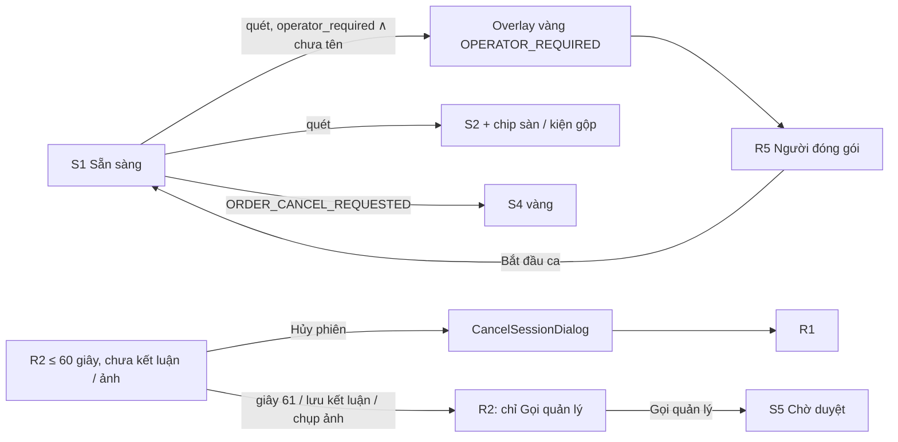

# FE Spec — 03 Mở rộng · client: station (kiosk `/station`)

| | |
|---|---|
| Tác giả | khanhtt (FE, agent soạn, tự quyết theo ủy quyền user) |
| Reviewer | khanhtt (tech lead, review ở bước 5) |
| Trạng thái | **In review** · v0.1 |
| Tổng quan & contract | [02-tech-spec.md](02-tech-spec.md) v0.1 §6 (API-10, 11, 12, 101) · Màn: [01-srs.md §10.4](01-srs.md) (S1, S2, S4, R2 mở rộng; R5 dùng lại) · nền [item 02 02b-station](../02-returns-reconciliation/02b-fe-spec-station.md) · [Design system](../../../design-system/README.md) |
| Last update | 2026-10-06 · FE |

> **TL;DR** — Không màn mới. Mở rộng 4 panel station: S1 dòng "Người đóng gói" + R5 đổi tiêu đề theo chế độ; S2 / R2 chip sàn · shop (`PlatformChip` dùng chung với dashboard) + cảnh báo "Kiện gộp N đơn"; S4 mã mới `ORDER_CANCEL_REQUESTED`; R2 luật hủy 60 giây theo **giờ server** (`self_cancel_until`), sau đó chỉ "Gọi quản lý".
> State giữ nguyên `stationStore` (Zustand) + WS `station.state`; không thêm request mới — chỉ đọc trường mới của API-10 / API-11 / API-12.
> Điểm khó: đổi nút đúng giây 61 không tải lại; xử lý 409 `CANCEL_REQUIRES_SUPERVISOR` khi bấm sát giờ.
> 5 task T-231..T-235 (≈ 5 ngày công).

Không viết lại API — trỏ API-xx trong [02 §6](02-tech-spec.md#6-api-contract).

---

## 1. Phạm vi

| Goals (spec này làm) | Non-goals (cố ý không làm — để đâu) |
|---|---|
| FR-03.03 chip sàn / shop ở S2, R2 | Chọn shop thủ công tại station (EX-P14 → Supervisor xử lý ở D4) |
| FR-03.16 tên người đóng gói ở S1 + R5 + chặn quét khi bắt buộc | Tài khoản / PIN người đóng gói (DEC-1) |
| FR-05.17 S4 "ĐƠN ĐANG YÊU CẦU HỦY" | Thông báo Zalo / Telegram trên station (không có) |
| FR-05.22 cảnh báo kiện gộp + đơn của từng sản phẩm ở S2 | |
| FR-04.14 R2 luật hủy 60 giây (BR-37) | Màn duyệt hủy — D13 (02b-admin) |

| Màn / luồng | Route | FR / UC | REUSE / EXTEND / NEW |
|---|---|---|:---:|
| S1 Sẵn sàng (đóng gói) | `/station` (`state = READY`, `work_mode = PACK`) | FR-03.16 / UC-01 | EXTEND `ReadyPanel.tsx`, `StationStatusBar.tsx` |
| R5 Nhập tên | dialog | FR-03.16 | REUSE `returns/OperatorDialog.tsx` (tiêu đề theo chế độ) |
| S2 Đang đóng gói | `state = PACKING` | FR-03.03, 05.22 / UC-01 | EXTEND `PackingPanel.tsx` |
| S4 Cảnh báo | overlay | FR-05.17 | EXTEND `AlertOverlay.tsx`, `copy.ts` |
| R2 Đang kiểm hoàn | `state = INSPECTING` | FR-04.14, 03.03 / UC-22 | EXTEND `returns/InspectingPanel.tsx` |
| `PlatformChip` | component dùng chung | FR-03.03 | NEW `src/shared/ui/PlatformChip.tsx` (02b-admin T-252 tạo; station dùng — DEC-479) |

## 2. Điều hướng

Không đổi: `StationPage` chọn panel theo `selectPanel(state)` (`features/station/selectPanel.ts`). Thay đổi:

## 3. Cây component

| Component | Mới / reuse (path) | Props / input chính | Ghi chú |
|---|---|---|---|
| `StationStatusBar` | EXTEND `features/station/StationStatusBar.tsx` | `state` | Chế độ PACK: "Người đóng gói: {tên}" + nút "Đổi"; chưa có tên → chữ xám "Chưa ghi tên người đóng gói · Nhập tên" (nút) |
| `OperatorDialog` | REUSE `returns/OperatorDialog.tsx` | + `mode: "PACK" \| "RETURN"` | Tiêu đề "Người đóng gói" / "Người kiểm"; luật 2–40 ký tự giữ; `onSwitchToPack` chỉ ở RETURN |
| `PlatformChip` | REUSE `src/shared/ui/PlatformChip.tsx` (từ T-252) | `platform: "SHOPEE"\|"TIKTOK"\|null`, `shopName`, `single?: boolean`, `size="lg"` | "Shopee · Áo Đẹp" / "TikTok · Áo Đẹp Official" / "Chưa rõ sàn" (`order = null`); chữ ≥ 24 px ở station |
| `PackingPanel` | EXTEND | `session` | Thay chữ cứng "Shopee" (`PackingPanel.tsx:90`) bằng `PlatformChip`; `MergedOrdersBanner` khi `merged_orders.length > 0`; mỗi dòng sản phẩm thêm "(đơn …{4 số cuối})" khi gộp |
| `MergedOrdersBanner` | NEW `features/station/MergedOrdersBanner.tsx` | `orders: string[]` | Vàng: "Kiện gộp {n} đơn: …0123, …0456 — kiểm đủ hàng của cả hai" (n > 2: "của tất cả") |
| `AlertOverlay` | EXTEND | `alert` | `ORDER_CANCEL_REQUESTED` nền vàng (như `ORDER_CANCELLED`), tiêu đề + chữ 01 §10.4 S4 |
| `InspectingPanel` | EXTEND `returns/InspectingPanel.tsx:195` | `session`, `serverNow` | Khu nút cuối: `canSelfCancel(session, serverNow)` → [Hủy phiên] [Gọi quản lý]; ngược lại dòng "Muốn hủy phiên? Bấm Gọi quản lý." + [Gọi quản lý]; chip sàn cạnh mã kiện |
| `canSelfCancel` | NEW `features/station/returns/cancelRule.ts` | `session`, `serverNowMs` | `self_cancel_until != null && serverNow < Date.parse(self_cancel_until)` (BR-37; server là nơi chặn) |

## 4. State & data fetching

| Dữ liệu | Nguồn (API-xx) | Nơi giữ state | Cache & làm mới | Optimistic? |
|---|---|---|---|:---:|
| Trạng thái station (sàn, shop, `merged_orders`, `operator_required`, `self_cancel_until`) | API-10 + WS `station.state` | `stationStore.state` (sẵn có) | Như Phase 2 (WS đẩy, API-10 khi kết nối lại) | ✗ |
| Giờ server | `server_time` (API-10) | `stationStore.clockOffsetMs` → `useServerNow(1000)` (`useServerClock.ts`, sẵn có) | 1 giây | — |
| Tên người đóng gói | API-101 (sẵn có, nay cả PACK) | `stationStore.setOperator` | WS trả state mới | ✗ |
| Mở R5 cho PACK | ALERT `OPERATOR_REQUIRED {mode: PACK}` (API-11) | `stationStore.operatorOpen` (sẵn có) — bỏ điều kiện `work_mode === "RETURN"` ở `StationPage.tsx:182` khi mở do alert / nút "Đổi" | — | — |
| Hủy phiên RETURN | API-12 | `CancelSessionDialog` (sẵn có) | 409 → đóng dialog + Toast + làm mới API-10 | ✗ |

## 5. Form & validate

| Form | Field | Rule client | Lỗi server map vào field |
|---|---|---|---|
| R5 (PACK + RETURN) | Tên | 2–40 ký tự sau trim (giữ Phase 2) | API-101 `422 fields.name` → dưới ô |
| CancelSessionDialog (RETURN ≤ 60 giây) | Lý do | Như Phase 2 | `409 CANCEL_REQUIRES_SUPERVISOR` → Toast (không phải lỗi field) |

## 6. Trạng thái UI

| Màn | Loading | Empty | Error | Forbidden | Success |
|---|---|---|---|---|---|
| S1 | Như Phase 2 | — | Như Phase 2 (S6 mất kết nối) | — (STATION) | "Người đóng gói: Minh" / "Chưa ghi tên người đóng gói · Nhập tên" |
| S2 | — | `items` rỗng: "Đơn chưa có sản phẩm" (sẵn có) | — | — | Chip sàn đúng; kiện gộp → banner vàng; kiện chưa xác minh → "Chưa rõ sàn" |
| S4 `ORDER_CANCEL_REQUESTED` | — | — | — | — | Nền vàng, 2 bíp, tự đóng theo `ALERT_MS` như `ORDER_CANCELLED` |
| R2 | — | — | 409 hủy → Toast "Phiên đã quá 60 giây. Bấm Gọi quản lý để hủy." | — | Nút đổi đúng giây 61 theo giờ server; sau khi lưu kết luận / chụp ảnh → nút ẩn ngay (WS state mới có `self_cancel_until = null`) |

## 7. Phân quyền trên UI

| Hành động / màn | Role thấy | Cách xử lý khi không quyền |
|---|---|---|
| Mọi màn station | STATION | Guard `RequireRole(["STATION"])` sẵn có |
| Tự hủy phiên RETURN | STATION, chỉ khi `canSelfCancel` | Ẩn nút; server chặn (409) |

## 8. Xử lý lỗi API

| Mã lỗi (từ 02) | Hiển thị | Hành động |
|---|---|---|
| API-11 `ORDER_CANCEL_REQUESTED` | S4 vàng "ĐƠN ĐANG YÊU CẦU HỦY" · "Người mua đang xin hủy đơn này. Chờ xử lý trên sàn, chưa đóng gói." | Tự đóng, về S1 |
| API-11 `OPERATOR_REQUIRED` (`mode = PACK`) | Overlay vàng "Nhập tên người đóng gói trước khi đóng gói." + 2 bíp | Mở R5 (tiêu đề "Người đóng gói") |
| API-11 `ORDER_CANCELLED` (chữ mới) | Như Phase 2, dùng `message` server | — |
| API-12 `409 CANCEL_REQUIRES_SUPERVISOR` | Toast `message` | Đóng dialog, làm mới state |
| Mã lạ | `message` server (như Phase 1) | — |

## 9. Nội dung chữ · i18n · a11y · responsive

Chuỗi mới trong `features/station/copy.ts`:

| Key | Chữ |
|---|---|
| `operator.titlePack` / `operator.titleReturn` | "Người đóng gói" / "Người kiểm" |
| `operator.statusBarPack(name)` | "Người đóng gói: {name}" |
| `operator.missingPack` | "Chưa ghi tên người đóng gói · Nhập tên" |
| `alert.ORDER_CANCEL_REQUESTED` | "ĐƠN ĐANG YÊU CẦU HỦY" (+ thân "Người mua đang xin hủy đơn này. Chờ xử lý trên sàn, chưa đóng gói.") |
| `alert.OPERATOR_REQUIRED_PACK` | "Nhập tên người đóng gói trước khi đóng gói." |
| `packing.merged(n, list)` | "Kiện gộp {n} đơn: {list} — kiểm đủ hàng của cả hai" |
| `packing.itemOrder(sn)` | "(đơn …{4 số cuối})" |
| `platform.unknown` | "Chưa rõ sàn" |
| `returns.cancelViaSupervisor` | "Muốn hủy phiên? Bấm Gọi quản lý." |
| `returns.cancelTooLate` | "Phiên đã quá 60 giây. Bấm Gọi quản lý để hủy." (dự phòng khi server không có `message`) |

a11y: chip có `aria-label` "Sàn: TikTok Shop, shop Áo Đẹp Official"; banner kiện gộp `role="alert"`; khu nút R2 đổi → `aria-live="polite"` đọc "Đã quá 60 giây — hủy phiên cần quản lý". Kiosk 1920×1080 (không responsive mới).

## 10. Riêng nền tảng

Chromium kiosk (ADR-006): không đổi. Đồng hồ máy trạm có thể lệch → mọi so sánh thời gian dùng `useServerNow` (offset từ `server_time`), không dùng `Date.now()` thô.

## 11. Analytics & theo dõi lỗi

N/A — station không có analytics; log lỗi qua console như Phase 2.

## 12. Mock khi BE chưa xong

- `src/mocks/stationSim.ts`: thêm kịch bản mã `TTTST0000000077` (TikTok, kiện gộp 2 đơn), `TTTST0000000050` (yêu cầu hủy → `ORDER_CANCEL_REQUESTED`), `SPXTST…` có `shop_name`; cờ `operator_required` (bật bằng `?packerRequired=1` ở `pnpm dev:mock`); phiên RETURN có `self_cancel_until = started_at + 60 giây`, `null` sau khi lưu kết luận / chụp ảnh; API-12 trả 409 khi quá hạn.
- `src/mocks/handlers/station.ts`: trả trường mới theo 02 §6.2 API-10 (contract).

## 13. Test FE

| Mức | Phạm vi | Case chính (TC-xx — QA đánh số ở `04`) |
|---|---|---|
| Unit / component | `cancelRule.ts` (59,9 giây được; 60,0 giây không; `null` không); `PlatformChip` 3 dạng; `MergedOrdersBanner`; `OperatorDialog` 2 tiêu đề; `AlertOverlay` `ORDER_CANCEL_REQUESTED` | FR-04.14, 03.03, 05.17, 05.22 |
| Integration (MSW) | `StationPage`: PACK bắt buộc tên → quét → overlay → R5 → nhập → quét mở S2; R2 giờ giả (offset server) tới giây 61 → nút đổi không tải lại; bấm hủy lúc 60 giây → 409 → Toast | AC-56 (phần station), AC-62 |
| E2E mock | `e2e/mock/station-phase3.spec.ts`: TikTok kiện gộp; yêu cầu hủy; luật 60 giây | UC-01, UC-22 |
| E2E BE thật | `e2e/real/station-phase3.spec.ts` (sau T-212, T-213 BE): chip sàn với mock TikTok; 409 hủy sau 60 giây (đồng hồ giả của BE test) | AC-56, AC-62 |

## 14. Task

| # | Việc | Màn / FR | Phụ thuộc (API-xx) | Ước lượng |
|---|---|---|---|---|
| T-231 | Kiểu `lib/api/station.ts` (trường mới API-10/11/12) + `stationSim` + handler MSW (§12) | nền | 02 §6 API-10..12 (mock) | 1 |
| T-232 | S1 + R5: dòng người đóng gói, `OperatorDialog` `mode`, mở R5 từ `OPERATOR_REQUIRED` ở PACK; copy | S1, R5 / FR-03.16 | API-10, 11, 101; T-231 | 1 |
| T-233 | S2 `PlatformChip` + `MergedOrdersBanner` + đơn từng dòng; R2 chip; S4 `ORDER_CANCEL_REQUESTED` | S2, R2, S4 / FR-03.03, 05.17, 05.22 | API-10, 11; T-231, **T-252** (`PlatformChip` của 02b-admin) | 1 |
| T-234 | R2 luật hủy 60 giây (`cancelRule`, khu nút, `aria-live`, 409 → Toast) | R2 / FR-04.14 | API-10, 12; T-231 | 1 |
| T-235 | Test component / integration + E2E mock; E2E BE thật khi BE T-212, T-213 xong | — | BE T-212, T-213 | 1 |

Tổng ≈ 5 ngày công.

## Phương án đã cân nhắc

| Phương án | Ưu | Nhược | Chọn? (lý do) |
|---|---|---|---|
| FE tính 60 giây từ `started_at` + kiểm kết luận / ảnh tại chỗ | Không cần trường mới | Nhân đôi luật BR-37, lệch khi server đổi luật | ✗ |
| Server trả `self_cancel_until` (null khi hết quyền) | Một nguồn luật; FE chỉ so giờ server | Thêm trường | ✔ (DEC-480) |
| `PlatformChip` riêng cho station | Tự do kích thước | Hai component cùng việc | ✗ — dùng chung, prop `size` (DEC-479) |
| R5 bắt buộc ngay khi tải S1 nếu `operator_required` (như RETURN) | Không bao giờ quét thiếu tên | Khác UX 01 §10.4 (chỉ chặn khi quét) | ✗ — theo UX: chặn lúc quét (DEC-481) |

## Rủi ro & câu hỏi mở

| ID | Rủi ro / câu hỏi | Ảnh hưởng | Giảm thiểu / ai trả lời | Hạn |
|---|---|---|---|---|
| RF-31 | Tên shop dài làm vỡ hàng tiêu đề S2 | Chữ chồng | Cắt `…` sau 28 ký tự, `title` đầy đủ | T-233 |
| RF-32 | Kiện gộp > 3 đơn (chưa biết TikTok VN có — Q19) | Banner dài | Hiện 3 mã + "và {n} đơn khác" | T-233 |

## Decisions

| DEC | Bối cảnh | Lựa chọn | Lý do | Người chốt |
|---|---|---|---|---|
| DEC-479 | Chip sàn ở station và dashboard | Một `src/shared/ui/PlatformChip.tsx` (tạo ở 02b-admin T-252), prop `size` | Một nhãn / màu cho sàn ở mọi nơi | khanhtt (FE, tự quyết theo ủy quyền user) |
| DEC-480 | Đổi nút hủy đúng giây 61 (01 §10.4 R2) | So `useServerNow()` với `self_cancel_until` mỗi giây; WS state mới (lưu kết luận / ảnh) đặt `null` → ẩn ngay | Đồng hồ server, không tải lại; server vẫn chặn | khanhtt (FE, tự quyết theo ủy quyền user) |
| DEC-481 | Bắt buộc tên người đóng gói | Không mở R5 cưỡng bức lúc tải; quét → `OPERATOR_REQUIRED` → overlay + R5 | Đúng UX 01 §10.4 S1; station không bị khóa khi chưa cần quét | khanhtt (FE, tự quyết theo ủy quyền user) |
| DEC-482 | Thứ tự task với 02b-admin | T-233 phụ thuộc T-252 (`PlatformChip`); nếu admin chậm, T-233 tạo component trước theo cùng spec và T-252 dùng lại | Không chặn đường găng station | khanhtt (FE, tự quyết theo ủy quyền user) |
