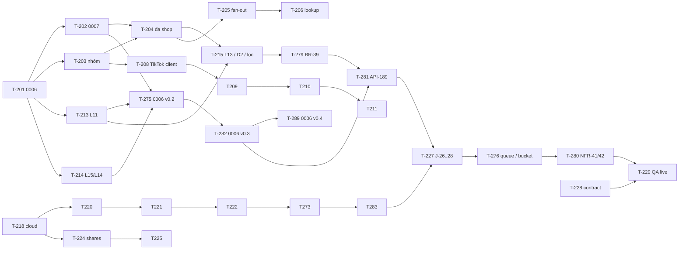

# 03-expansion-tiktok — Plan

| | |
|---|---|
| Owner (PM) | khanhtt |
| Reviewer | PO · Tech lead (khanhtt) |
| Trạng thái | Approved (Plan 2026-10-07, tự quyết theo ủy quyền user — DEC-534) |
| Spec | [02-tech-spec.md](02-tech-spec.md) v0.4 · [02a §12](02a-be-spec.md#12-task) v0.4 · [02b-station §14](02b-fe-spec-station.md#14-task) v0.3 · [02b-admin §14](02b-fe-spec-admin.md#14-task) v0.4 · SRS [01](01-srs.md) v0.5 §13 (lát 1–6) |
| Last update | 2026-10-07 · PM |

> **TL;DR** — 74 task (52 BE · 6 FE station · 16 FE admin), **117 ngày công** một dev; 8 milestone **M11–M18** (nối tiếp M6–M10 của item 02), mỗi milestone demo được end-to-end trên stack dev (adapter mock Shopee nhiều shop + TikTok 2 shop, MinIO 2 bucket, thông báo mock).
> Migration 0006 / 0007 làm trọn ở **M11** (T-201, 202, 275, 282, 289) — đầu đường găng, trước mọi lát dùng cột mới.
> Đường găng (chuỗi phụ thuộc): T-201 → T-202 → T-204 → T-215 → T-279 → T-281 → T-227 → T-276 → T-280 → T-229 = **17,5 ngày**. Một dev làm tuần tự: xong dự kiến **2027-03-19** (M18), từ 2026-10-08, 5 ngày / tuần, chưa trừ Tết.
> Rủi ro tiến độ lớn nhất: chưa có TikTok partner (Q18, Q19), kho lưu thật (Q20), bot thật (Q21) — làm bằng mock / MinIO, ghi "chưa test — thiếu tài nguyên", không chặn milestone; 0006 do 4 task cùng sửa một file; Tết 2027 rơi giữa M15.

<!-- Đối tượng đọc: cả đội và người duyệt Plan. Task lấy từ 02a §12 / 02b §14; không tự đặt thêm phạm vi. -->

---

## 1. Chiến lược chia

**Vertical slice theo lát của 01 §13, theo thứ tự phụ thuộc.** Mỗi milestone gồm BE + FE của một nhóm UC, BE trước FE dùng nó (FE chạy trước bằng MSW theo contract 02 §6 nhờ T-231, T-251 ở M11). Demo trên stack dev rồi E2E BE thật.

| Lát 01 §13 | Milestone | Lý do thứ tự |
|---|---|---|
| — (nền) | **M11** Nền schema + bằng chứng | 0006 / 0007 chặn mọi lát; 4 task BE cùng sửa `0006_phase3_schema.py` (T-201, 275, 282, 289) → làm liền nhau, một người, sớm nhất |
| Lát 1 hardening (L11, L13, L14, L15) | **M12** Đa shop + hardening | T-215 (L13, D2, lọc) và T-279 / T-281 (BR-39) phụ thuộc T-204 (đa shop) → đa shop lõi vào cùng milestone |
| Lát 2 TikTok + nhiều shop | **M13** | Sau T-204; xong station Phase 3 (T-235) |
| Lát 3 báo cáo | **M14** | Chỉ cần T-201; đặt sau M13 để số liệu theo sàn / shop có dữ liệu TikTok mock |
| Lát 4 sao lưu | **M15** | `cloud` (T-218) là nền của link (lát 5) |
| Lát 5 link chia sẻ | **M16** | Cần T-218 + `MISSING` (T-286) |
| Lát 6 thông báo | **M17** | T-227 đọc dữ liệu của mọi lát (T-215, 222, 273, 279, 281, 283) → cuối |
| Toàn item | **M18** Hoàn thiện | Contract, quyền, bảo mật, QA live, diễn tập nâng cấp / lùi, E2E admin |

Lệch so với thứ tự 01 §13 (DEC-536): lát 1 không đứng riêng được vì phụ thuộc T-204 → M12 gồm cả đa shop lõi; `ShareLinkDialog` (T-256) kéo lên M12 (chạy MSW) vì T-260 / T-264 (D17 hardening) phụ thuộc nó — BE link thật ở M16; T-265 xếp M16 vì phần `ShareLinkDialog` `CLIP_MISSING` cần T-256 + BE T-286.

Không tách thêm task: mọi task trong spec ≤ 2 ngày. Không thêm việc ngoài spec — chỉ thêm **phụ thuộc mềm** (ghi ở §3) khi nội dung task dùng module của task khác mà cột phụ thuộc của spec chưa ghi (đã gửi *Phản hồi* cho owner spec).

## 2. Task

Owner tất cả: khanhtt (profile §7). Ticket: chưa tạo (tracker `none` cho item này — §7). Trạng thái: ⬜ chưa · ▶ đang làm · ✅ xong. Nguồn: `02a` = 02a §12 · `02b-st` = 02b-station §14 · `02b-ad` = 02b-admin §14.

| T | Tên | Comp | Phủ (FR / API / màn) | Nguồn | Phụ thuộc | Ước lượng | Milestone | Ticket | Trạng thái |
|---|---|---|---|---|---|---|---|---|---|
| T-201 | Migration 0006 (bảng, cột, CHECK, backfill nhóm / shop / `submitted_at`, index báo cáo) + model + `alembic check`; đo 1 triệu đơn | be | §3; FR-05.21, 08.09, 09.04 | 02a | — | 2 | M11 | | ✅ `09993b3` |
| T-202 | Migration 0007 (unique theo shop) + downgrade 0006 / 0007 → `phase3_archive` + nâng cấp lại + `SCHEMA_HEAD` 0007 + test migration | be | §3; BR-29 | 02a | T-201 | 2 | M11 | | ✅ `ee7478e` |
| T-203 | Nhóm trạng thái (`base.py`) + `registry` + cờ sàn; Shopee mapping trả nhóm; lõi đọc nhóm; `test_no_platform_status_in_core` | be | FR-05.07, 05.21, NFR-28; BR-30 | 02a | T-201 | 2 | M11 | | ✅ `88f2c0a` |
| T-213 | L11: BR-37 (API-12 409, `self_cancel_until`), API-20 `return_summary`, API-21 `note`; BR-39 `auto_evidence` + `primary` / `prior_return` + J-16 | be | FR-04.14, 08.07 | 02a | T-201 | 2 | M11 | | ✅ `84ca7c7` |
| T-214 | L15 + L14: bỏ mềm API-134 + `protection` `removed_at` + API-132 `removed_evidence`; BR-42; audit `CLAIM_EVIDENCE_REMOVE` | be | FR-08.09, 08.10 | 02a | T-201 | 2 | M11 | | ✅ `ca667f0` |
| T-275 | 0006 v0.2: backfill 4b phiên trước + `backfilled`; downgrade bước 1b / 4–7 (đơn ngoài, `LEGACY_HOLD`, kiểm tập con, `MISSING`); nâng cấp lại xử lý trùng | be | §3; BR-38, 39 | 02a | T-202, T-213, T-214 | 2 | M11 | | ✅ `be9697e` |
| T-282 | 0006 v0.3: cột `session.cancel_cause`, `wrong_scan_*`, `review_confirmed_*`; CHECK `snapshot.status`; `cloud_present`, `cloud_key_fingerprint`; backfill `review_needed` + log; (4c) log hủy oan; downgrade / lên lại | be | §3 | 02a | T-275 | 1 | M11 | | ✅ `661c111` |
| T-289 | 0006 v0.4 (G2R3-1): bước 3b trước 4b, vị từ = `excluded_return_sql`, archive nguyên dòng đã bỏ, 4b bỏ qua cặp đã bỏ; test khứ hồi C / A / E / F | be | §3; BR-38, 39 | 02a | T-282 | 1 | M11 | | ✅ `2096d5d` |
| T-231 | Kiểu `lib/api/station.ts` (API-10 / 11 / 12 mới) + `stationSim` + MSW station | fe | nền S1, S2, S4, R2, R3 | 02b-st | 02 §6 (mock) | 1 | M11 | | ✅ `fe 9324d86` (MSW) |
| T-251 | API client admin (`shops`, `reports`, `shares`, `notify`, `backup` + mở rộng) + `shared/labels.ts` + MSW handlers + db | fe | nền D2–D23 | 02b-ad | 02 §6 (mock) | 2 | M11 | | ✅ `fe 98a9f7f` (MSW) |
| T-252 | Route + drawer (mục mới, D7 đổi tên, chuyển hướng `/shopee`) + `PlatformChip`, `PlatformFilter`, `DueCountdown` + WS 3 sự kiện | fe | FR-10.02, 03.03, 07.01 | 02b-ad | T-251 (BE thật: T-207) | 1 | M11 | | ✅ `fe df1644c` (MSW; mục D20–D23 ẩn tới task màn — DEC-547) |
| T-204 | Đa shop: `upsert_platform_order(…, shop)` (BR-29, nhận đơn file, EX-T2, `package_order`); tra (shop, mã) J-04 / 05 / 06; bỏ ngắt shop khác | be | FR-05.14, 05.22; BR-29 | 02a | T-202, T-203 | 2 | M12 | | ✅ `1b2f5ef` |
| T-212 | Station: API-10 sàn / shop / `merged_orders` / `operator_required`; API-11 `OPERATOR_REQUIRED` PACK, `ORDER_CANCEL_REQUESTED`; API-80 `packer_name_required` | be | FR-03.03, 03.16, 05.17, 05.22 | 02a | T-203, T-204 | 1,5 | M12 | | ✅ `10c9a75` |
| T-215 | L13 + D2 + lọc: API-110 (`pending_only`, `sort`, hạn, `claim`); API-80 hạn Chỉ hoàn tiền; API-32 counts / attention + lọc vai; lọc sàn / shop API-30 / 110 / 120 / 130 | be | FR-08.08, 09.01, 07.01 | 02a | T-204, T-213 | 2 | M12 | | ✅ `3ce28a6` |
| T-279 | BR-39 v0.3: `EXCLUDED_CANCEL_REASONS`, `primary_session`, `excluded_return_sessions`; `dropped_return_filter` (API-32, API-30, N03); test 7 kịch bản | be | FR-08.07, 09.01; BR-39 | 02a | T-213, T-215 | 1 | M12 | | ✅ `f466631` |
| T-281 | API-21 `reason_code` + `cancel_cause`; `excluded_return_sql` / `review_needed_sql` + bản Python; API-189 (khóa, bỏ mềm nhiều hồ sơ, audit, WS); API-164 `review_needed` | be | FR-04.14, 08.07; BR-39 v0.4 | 02a | T-279, T-282 | 2 | M12 | | ✅ `a6e02b1` |
| T-290 | API-189 `CONFIRM_RETURN` gỡ lý do hủy (ADMIN / SUPERVISOR, CSKH 403), `review_confirmed_note`, audit `overridden_cause`, `session.return_confirmed` | be | FR-08.07; BR-39 v0.5 | 02a | T-281 | 1 | M12 | | ✅ `53ab212` |
| T-278 | Helper `set_platform_status` (đơn + yêu cầu trả) thay 3 chỗ ghi; BR-21 làm rõ (cờ `ORDER_CANCEL_REQUESTED`, Shopee `IN_CANCEL`); NFR-28 test AST | be | FR-05.17, 05.21, NFR-28; BR-21 | 02a | T-203, T-212 | 1,5 | M12 | | ✅ `d29eed3` |
| T-285 | Kiện hủy oan: `revert_cancel()`, `revert_candidates()`, `aicam fix-cancel-requests [--apply]`, lưới an toàn; BR-11 / BR-10 theo nhóm; `test_cancel_revert` (a)–(h) | be | BR-21 v0.4, BR-11; AC-41 | 02a | T-278 | 1,5 | M12 | | ✅ `17fa419` |
| T-232 | S1 + R5: dòng người đóng gói, `OperatorDialog` `mode`, mở R5 từ `OPERATOR_REQUIRED` PACK | fe | S1, R5 / FR-03.16 | 02b-st | T-231 (BE thật: T-212) | 1 | M12 | ✅ `fe 3feb1af` (MSW — DEC-600) |
| T-234 | R2 luật hủy 60 giây (`cancelRule`, khu nút, `aria-live`, 409 → Toast) | fe | R2 / FR-04.14 | 02b-st | T-231 (BE thật: T-213) | 1 | M12 | ✅ `fe b454d84` (MSW — DEC-601) |
| T-256 | `ShareLinkDialog` (options, validate, tạo, tiến độ WS + poll, xong / lỗi, chạy nền + Toast) — MSW tới M16 | fe | FR-07.05 | 02b-ad | T-252 (BE thật: T-224, T-225 ở M16) | 2 | M12 | ✅ `fe 2dcbcc6` (MSW tới M16 — DEC-606) |
| T-260 | D17 L11 / L14 / L15 (Alert phiên trước / bị loại, chip, "Phiên chính" theo server, `RemoveEvidenceDialog`, `RemovedEvidenceList`, chip hạn) + nút Tạo link; D13 `return_summary` | fe | D17, D13 / FR-08.07, 08.09, 08.10, 04.14 | 02b-ad | T-256 (BE thật: T-213, T-214) | 2 | M12 | ✅ `fe b565cf2` (MSW; nút Tạo link ở T-256 — DEC-604) |
| T-264 | D13 `CancelReturnDialog`; D17 `WrongScanDialog`, `ConfirmReturnDialog`, Alert "Cần soát", chip `cancel_cause` / `evidence_exclusion`; API-189 client + mock | fe | D13, D17 / FR-04.14, 08.07; EX-R21 | 02b-ad | T-260, T-256 (BE thật: T-281) | 1,5 | M12 | ✅ `fe 0e62dc8` (MSW; chip "Cần soát" ShareLinkDialog ở T-256 — DEC-605) |
| T-261 | D2 thẻ + attention mới; D14 tab Chỉ hoàn tiền; D3 / D14 / D15 / D16 lọc sàn / shop + chip; D4 người đóng gói + `AMBIGUOUS_SHOP`; D10 nhãn | fe | FR-09.01, 08.08, 07.01, 03.16, 10.03 | 02b-ad | T-252 (BE thật: T-215, T-212) | 2 | M12 | ✅ `fe b509315` (MSW — DEC-602, 603) |
| T-205 | Fan-out `dispatch.py` J-04 / 06 / 13; J-05 theo `lookup`; `grants.ensure_fresh` + J-12 theo grant; `budget.py`; test cô lập 3 shop | be | FR-05.14; NFR-39 | 02a | T-204 | 2 | M13 | | ✅ `3e46576` — DEC-560 (queue `sync` tới T-276) |
| T-206 | `lookup.find_everywhere` (BR-32) + `AMBIGUOUS_SHOP`; nối PACK, RETURN, J-05; đo AC-43 | be | FR-05.19; API-11 | 02a | T-205 | 1,5 | M13 | | ✅ `780d912` — DEC-561 (AC-43 p95 2,59 giây mock; API-31 `timeline[].shops` chốt) |
| T-207 | API-70 / 71 / 72 / 154 / 155 / 156, `RESULT_PATH`, audit, WS `shop.updated` + kênh `ws:admin` | be | FR-05.13, 05.20 | 02a | T-204 | 1,5 | M13 | | ✅ `22976fe` — DEC-562 |
| T-208 | TikTok client (ký HMAC, thử lại, `Retry-After`, ngân sách, log, che log) + ủy quyền (token get / refresh, shop list) — respx | be | FR-05.08, 05.13 | 02a | T-203 | 2 | M13 | | ✅ `5ba3737` — DEC-563 (respx theo định dạng giả định; TikTok thật: chưa test — thiếu tài nguyên) |
| T-209 | TikTok adapter đơn / kiện / vận chuyển / yêu cầu hủy / tra khi quét + `mapping.py` + EX-T5 + kiện gộp | be | FR-05.15..05.17, 05.22 | 02a | T-208 | 2 | M13 | | ✅ `52af26d` — DEC-564 (respx định dạng giả định; TikTok thật: chưa test — thiếu tài nguyên) |
| T-210 | TikTok yêu cầu trả + `returns_mapping` (BR-31) + nhóm yêu cầu trả 5 giá trị trong `returns` | be | FR-05.18; BR-31 | 02a | T-209 | 2 | M13 | | ✅ `d03c5ce` — DEC-565 (respx; TikTok thật: chưa test — thiếu tài nguyên) |
| T-211 | Mock TikTok 2 shop + fixture (9 trạng thái, kiện gộp, kho TikTok, 6 kịch bản trả) + mock Shopee nhiều shop; `seed_phase3.py` | be | §7.2; AC-40..44 | 02a | T-209, T-210 | 1,5 | M13 | | ✅ `462c337` — DEC-566 (compose.dev cờ TikTok mock: chỉ sửa file, cần dựng lại stack) |
| T-277 | TikTok yêu cầu hủy: `cancellations/search` → luôn `orders?ids=`; nhóm từ (đơn, yêu cầu hủy mới nhất); fixture 4 kịch bản | be | FR-05.17 | 02a | T-209, T-211 | 1 | M13 | | ✅ `1a31e1b` — DEC-567 |
| T-271 | Bảng §5.1: tra theo mã ở `returns`, `imports`, J-13, `packages_by_code`, API-104 sàn / shop, ALERT `RETURN_MULTIPLE_ORDERS`; `test_code_lookup_two_shops` | be | BR-29, EX-R20; API-11, 104 | 02a | T-204, T-210 | 2 | M13 | | ✅ `54091b5` — DEC-568 (`return_case.shop_id` khi tạo hồ sơ) |
| T-288 | §5.1 #15: `resolve_code` mã chiều về mơ hồ → `MULTIPLE_ORDERS`; không tự gộp hồ sơ chưa xác định + log | be | BR-29, EX-R20 | 02a | T-271 | 0,5 | M13 | | ✅ `8d90233` — DEC-569 |
| T-253 | D7 Kết nối sàn: nhóm theo sàn, thẻ shop, kết nối theo sàn, `?result=`, ngắt, shop đã ngắt, cảnh báo đồng bộ | fe | D7 / FR-05.13, 05.14, 05.20 | 02b-ad | T-252 (BE thật: T-207) | 2 | M13 | | ✅ `fe 6ef1e51` (MSW; BE thật chờ T-207 — DEC-607) |
| T-233 | S2 `PlatformChip` + `MergedOrdersBanner` + `CancelRequestedBanner` + đơn từng dòng; R2 chip; S4 `ORDER_CANCEL_REQUESTED` | fe | S2, R2, S4 / FR-03.03, 05.17, 05.22 | 02b-st | T-231, T-252 (BE thật: T-212, T-278) | 1,5 | M13 | | ✅ `fe 71bc453` (MSW; BE thật chờ T-212, T-278 — DEC-608) |
| T-236 | Bàn hoàn mã trùng nhiều shop: `RETURN_MULTIPLE_ORDERS` → R3 với `data.code`, chip sàn · shop, mock `2410DUP00001` + `RTTST-DUP-1` | fe | R1, R3 / BR-29, EX-R20 | 02b-st | T-231, T-233 (BE thật: T-271, T-288) | 1 | M13 | | ✅ `fe 3d64b91` (MSW; BE thật chờ T-271, T-288 — DEC-609) |
| T-235 | Test component / integration + E2E mock station; E2E BE thật station Phase 3 | fe | — | 02b-st | T-232..T-234, T-236; BE T-212, T-213 | 1 | M13 | | ✅ `fe a91da13` (component / integration + E2E mock 4/4; E2E BE thật `e2e/real/station-phase3.spec.ts` viết xong — **chưa chạy, chờ build lại stack** — DEC-610) |
| T-216 | Báo cáo API-150..152 (BR-41) + cache + `statement_timeout` + test công thức | be | FR-09.02..05 | 02a | T-201 | 2 | M14 | | ✅ `be 12517a6` (unit công thức 8 + integration 8 với số ví dụ BR-41 / AC-45..47; claims API-133 ghi `submitted_at` / `result_at` — DEC-570..573) |
| T-217 | API-153 CSV + `series` (C) + `perf_reports.py` đo NFR-37 | be | FR-09.06, 09.07; NFR-37 | 02a | T-216 | 1,5 | M14 | | ✅ `be e928430` (unit + integration CSV / series / quyền; NFR-37 **máy dev** M4 Pro, 183.000 kiện: 92 ngày p95 ≤ 0,50 giây, 366 ngày p95 ≤ 1,41 giây — **máy kho chưa đo**; DEC-574) |
| T-254 | D20 khung + `ReportFilters` (URL, validate) + tab Hàng hoàn (thẻ, 4 bảng, ⓘ, bấm số) | fe | D20 / FR-09.03, 09.05 | 02b-ad | T-252 (BE thật: T-216) | 2 | M14 | | ✅ `fe d17c8b9` (MSW; BE thật chờ T-216 — DEC-611..614) |
| T-255 | D20 tab Khiếu nại + Năng suất (quyền) + CSV + (C) biểu đồ cột nếu còn thời gian | fe | D20 / FR-09.02, 09.04, 09.06, 09.07 | 02b-ad | T-254 (BE thật: T-217) | 2 | M14 | | ✅ `fe ac003ac` (MSW; biểu đồ C đã làm; BE thật chờ T-216 / T-217 — DEC-615..617) |
| T-218 | `cloud`: `ObjectStore`, `S3Store`, `MemoryStore`, `ratelimit`; MinIO + `minio-init`; API-183 | be | FR-02.17; ADR-010 | 02a | — | 1,5 | M15 | ✅ `be 3afbc37` (unit MemoryStore / phân loại lỗi / validator; integration token bucket Redis, API-183 MemoryStore 200 / 502 / 504 / 503 / 403; S3Store trên **MinIO tạm** `aicam-test-minio` — multipart, delete marker, URL ký, khóa ứng dụng không xóa phiên bản; compose dev **chỉ sửa file, chưa áp dụng**; nhà cung cấp S3 thật: chưa test — thiếu tài nguyên Q20; DEC-651..653) |
| T-219 | `cloud/crypto.py` `AICAMENC1` + `aicam backup-keygen` + test | be | FR-02.13; NFR-41 | 02a | — | 1,5 | M15 | ✅ `be 7fed9de` (unit 12: khứ hồi 0 B / 1 B / 4 MiB / 9 MiB, cắt cụt / đảo / thừa / sửa byte / sửa header → lỗi, sai khóa phát hiện trước khi ghi, chọn đúng khóa trong 2, bản mã không chứa bản rõ / khóa, `backup-keygen`; DEC-654) |
| T-220 | J-20 sao lưu DB (pg_dump, imports tgz, mã hóa, tải, kiểm đọc lại) + `backup_run`; `worker-backup` + Dockerfile | be | FR-02.08 a; NFR-40 | 02a | T-218, T-219 | 2 | M15 | ✅ `be b94400e` (integration 7: pg_dump **thật** 16 qua container tạm → giải mã ra `PGDMP`, tgz có file nhập, dấu vân tay, file tạm xóa; chưa `ON` bỏ qua; một lượt; lượt treo > 2 giờ → `STALE_RUNNING`; pg_dump lỗi; mất mạng; kiểm đọc lại hỏng → `VERIFY_FAILED`; khóa không có trong log; unit beat / route / thử lại; Dockerfile build thử ✅; compose `worker-backup` **chưa áp dụng**; DEC-655) |
| T-221 | J-21 / J-22 bằng chứng (BR-33, `HASH_MISMATCH`, thử lại) + J-23 + `all_pack_clips`; đo NFR-44 | be | FR-02.08 b, 02.14, 02.18 | 02a | T-220 | 2 | M15 | ✅ `be 1a26aaf` (integration 15 MemoryStore + tệp thật: J-21 chỉ BR-33 + idempotent + `ALL_PACK`; J-22 mã hóa + metadata, lệch băm không tải, `SOURCE_DELETED` ≠ `SOURCE_MISSING`, mất mạng → chờ → tự tải, lease, nhường link; J-23 chỉ retention / bỏ `MISSING` / bỏ `UPLOADING` / `RESTORE_PENDING` / schema lệch, giữ ≥ 3 bản DB; NFR-44 đo throttle MinIO tạm — quét p95 mạng kho **chưa test**; DEC-656) |
| T-222 | API-180..182, 184, 185 + API-81 `backup` + attention `BACKUP_STALE` + WS `backup.updated` | be | FR-02.15, 02.17 | 02a | T-221 | 1,5 | M15 | ✅ `be 37b8cf7` (integration 10: trạng thái + xác nhận khóa + 409 / 503 / 403, bật khi `RESTORE_PENDING` → 409, cài đặt + audit, chạy ngay (lượt treo → `FAILED`, `BACKUP_RUNNING`, `BACKUP_DISABLED`), API-185 3 loại, đếm D23, API-81 `backup`, API-32 `BACKUP_STALE` chỉ ADMIN (`DB_LATE`, `DB_FAILED_TWICE`, `EVIDENCE_LATE`, `HASH_MISMATCH`, `SOURCE_MISSING`), WS `backup.updated` trên `ws:admin`; contract + `openapi.json`; DEC-657) |
| T-223 | `aicam backup-restore` (DB) + `backup-verify` + ops §6.2 runbook + diễn tập DB trống (AC-50) | be | FR-02.16; NFR-40 | 02a | T-221 | 2 | M15 | ✅ `be 4224088` (integration 5: khôi phục vào DB trống + file nhập, DB không trống → mã 2, khóa sai → mã 2 không ghi + `--key-file` khóa cũ → được, không có bản → mã 2, verify khớp / lệch / lệch đã chấp nhận / thiếu đã ghi nhận + gỡ cờ; **diễn tập phase db** trên Postgres + MinIO tạm: 2.000 kiện, khôi phục 1,5 giây máy dev, đếm dòng khớp — `evidence/m15-restore-drill.txt`; RTO trên **máy kho chưa đo**; ops §6.2; DEC-658) |
| T-272 | Đổi khóa: `key_fingerprint`, API-180 `old_keys[]`, API-187 + audit, `decrypt_stream` nhiều khóa, `BACKUP_OLD_KEYS`; `test_backup_key_rotation` | be | FR-02.17, EX-K7 | 02a | T-221, T-222 | 1,5 | M15 | ✅ `be 5a945a9` (`test_backup_key_rotation` 2: `old_keys` 3 tệp + 1 bản DB, `KEY_CHANGED` chặn, API-187 xếp 3 / gọi lại 0, ngay sau API-187 vẫn đếm đủ, J-22 → khóa mới giải mã được, nguồn bị retention xóa khi `PENDING` → J-23 xóa bản cloud; `DISABLED` / `RESTORE_PENDING` → 409; unit giải mã chọn đúng khóa trong 2; ops §6.2 đổi khóa; DEC-659) |
| T-273 | Cứng hóa J-20 / 22 / 23: lease, `SOURCE_DELETED` cuối, `hash_override`; API-188 + API-185; `fail_stale_runs` + `DB_FAILED_TWICE`; J-23 chỉ retention, ≥ 3 bản DB, schema guard | be | FR-02.14, 02.15, EX-K6 | 02a | T-221, T-222 | 2 | M15 | ✅ `be 4e0ff2d` (integration 4: Vẫn sao lưu → metadata `MISMATCH_ACCEPTED`, tệp đổi tiếp → lệch mới, Bỏ qua cuối + `SOURCE_DELETED` / `IGNORED` không tính chờ, 409 / 422 / 404 / 403 + audit; lease / `STALE_RUNNING` / `DB_FAILED_TWICE` / J-23 retention / ≥ 3 bản / schema guard đã test ở T-220..T-222; metric Prometheus **chưa làm** (repo chưa có hạ tầng — log thay); DEC-660) |
| T-274 | Khôi phục: duyệt `backup/evidence/`, đối tượng ngoài DB, `MISSING`, `RESTORE_PENDING` + API-181 409 + `backup-verify` xóa cờ; runbook bí mật; diễn tập 2 khóa | be | FR-02.16, EX-K8 | 02a | T-223, T-272 | 1,5 | M15 | ✅ `be bef23ac` (integration 3: duyệt cloud + ngoài DB + `MISSING` không bao giờ `DELETED` + hồ sơ mở trước; thiếu khóa → không tệp dở → `--evidence-only` với khóa cũ → `READY`; nguồn bị retention xóa không tải lại; **diễn tập phase full** 2 khóa + xóa 1 đối tượng: đạt — `evidence/m15-restore-drill.txt`; ops §6.2; DEC-661) |
| T-283 | `SOURCE_MISSING`: J-22 phân loại nguồn, giãn cách, API-180 / 185 / 188 `RETRY` / `IGNORE`, API-32 `BACKUP_STALE` | be | FR-02.15, EX-K9 | 02a | T-273, T-282 | 1 | M15 | ✅ `be 733e435` (`test_backup_source_missing` 3: không `SOURCE_DELETED`, giãn cách 5 / 15 / 60 / 60, API-185 từ lần đầu, API-180 `source_missing`, API-32 `BACKUP_STALE SOURCE_MISSING`, `UPLOAD_ANYWAY` 409, Thử lại mà vẫn thiếu → hiện lại, `IGNORE` khi tệp có lại → 409, chép lại + Thử lại → `UPLOADED`, `IGNORE` cuối; N08 ở T-227; đặt `MISSING` ở T-291; DEC-662) |
| T-284 | `backup-restore` tệp tạm, `DECRYPT_FAILED` / `UNKNOWN_KEY`, CSV, mã 3, `--evidence-only`; `backup-verify` 5 loại + `--accept --reason` + audit; runbook lối ra | be | FR-02.16, EX-K8 | 02a | T-274, T-282 | 1,5 | M15 | ✅ `be fee112c` (integration: sửa 1 byte → `DECRYPT_FAILED` CSV + mã 3 + `MISSING` + không tệp dở; verify 5 loại + CSV, `--accept` thiếu lý do mã 2, có lý do → audit `BACKUP_VERIFY_ACCEPT` + đạt + gỡ cờ; bản lệch chấp nhận không ghi đè bản gốc cloud; `--from-cloud`; **diễn tập phase full mở rộng đạt** — `evidence/m15-restore-drill.txt`; ops §6.2 bảng lối ra; DEC-663) |
| T-287 | `cloud_present` / `cloud_key_fingerprint` (J-22, J-23, API-180, API-187); API-184 / 187 `DISABLED` → 409 `BACKUP_DISABLED` | be | FR-02.14, 02.17 | 02a | T-272, T-282 | 1 | M15 | ✅ `be 414de6a` (integration 8: CHECK `cloud_present` ↔ dấu vân tay, J-23 xóa bản cloud với 6 trạng thái, `DISABLED` → 409; phần code ở T-221 / T-222 / T-272; **full pytest 1500 passed / 129 skipped** cuối M15; DEC-664) |
| T-259 | D23 Sao lưu (trạng thái, banner khóa, xác nhận khóa, kiểm tra kết nối, sao lưu ngay, lịch sử, lệch mã băm, C, nâng cao) + D8 sức khỏe + công tắc người đóng gói + hạn Chỉ hoàn tiền | fe | D23, D8 / FR-02.15, 02.17, 02.18, 03.16, 08.08 | 02b-ad | T-252 (BE thật: T-222, T-212, T-215) | 1,5 | M15 | | ✅ `fe 41f69ec` (MSW; gồm thẻ DB 2 lượt lỗi, cột khóa, banner `RESTORE_PENDING` — DEC-631..637) |
| T-263 | D23 v0.2: `OldKeysAlert` + `ReuploadDialog`, `IssuesList` + `ResolveIssueDialog`, banner `RESTORE_PENDING`, thẻ DB 2 lần lỗi, cột dấu vân tay; nhãn `MISSING`, action D10 | fe | D23, D4, D10 / FR-02.15..02.17 | 02b-ad | T-259 (BE thật: T-272..T-274) | 1,5 | M15 | | ✅ `fe f799f5c` (MSW; E2E mock `backup.spec` 3 ca; làm luôn phần D23 của T-265: `SourceMissingAlert`, `RETRY`, khóa nút `DISABLED` + 409 — DEC-638..640) |
| T-224 | `shares`: model, API-160..164 (BR-35, quyền thu hồi), audit `SHARE_*`, API-31 / 132 `shares[]` | be | FR-07.05, 07.08, 07.09 | 02a | T-218 | 2 | M16 | ✅ `be 4931955` (`test_shares_api` 14: nguồn CLAIM chỉ phiên trong `evidence[]` đang dùng, ảnh chỉ của phiên chọn, phiên bị loại / Cần soát không chọn sẵn, Cam 1 ≠ `READY` → 409, 422 / 503 / 404, token 43 ký tự không vào API / audit, CSKH chỉ thu hồi link mình, `EXPIRED` lúc đọc; DEC-665..669) |
| T-225 | J-24 dựng + tải (bucket link) + W1 (CSP + referrer) + URL ký + Fernet; J-25 thu hồi / hết hạn / treo; WS `share.updated` | be | FR-07.05, 07.07, 07.08; NFR-42, 46 | 02a | T-224 | 2 | M16 | | ⬜ |
| T-286 | `MISSING` ở mọi điểm đọc (02a §5.2): hằng, `Literal`, J-01, API-40..46, API-164, J-16, J-24, ảnh `url = null`; `test_clip_missing_readers` | be | FR-02.16, EX-K8 | 02a | T-274, T-282 (+ mềm: T-225) | 1 | M16 | | ⬜ |
| T-291 | J-22 đặt nguồn `MISSING` sau 4 lần liền / về `READY` khi có lại; API-188 `IGNORE` → `MISSING` (409 khi đã có tệp); audit `MEDIA_*` | be | FR-02.15, EX-K9 | 02a | T-283, T-286 | 1 | M16 | | ⬜ |
| T-292 | API-189 `MARK_WRONG_SCAN` `affected_shares[]` + audit; API-164 `review_pending_count`; contract | be | FR-07.05, 08.07 | 02a | T-281, T-224 | 0,5 | M16 | | ⬜ |
| T-257 | D21 Link chia sẻ + `SharesBlock` D4 / D17 + thu hồi + sao chép | fe | D21, D4, D17 / FR-07.08, 07.09 | 02b-ad | T-256 (BE thật: T-224) | 1,5 | M16 | | ✅ `fe 8e6ba26` (MSW; E2E mock `shares.spec` 2 ca; drawer D21 bật — DEC-700..703) |
| T-265 | `MissingMediaBlock` D4 / D17 / ảnh, ẩn Cắt lại / Xuất, 409 `MISSING`; ShareLinkDialog `CLIP_MISSING`; (D23 `SourceMissingAlert`, `RETRY`, khóa nút khi `DISABLED` đã làm ở T-263 — DEC-639); D2 `SOURCE_MISSING` | fe | D4, D17, D23, D2 / FR-02.15, 02.16 | 02b-ad | T-263, T-261 (+ mềm: T-256) (BE thật: T-283, T-286, T-287) | 1 | M16 | | ⬜ |
| T-266 | D17 "Là phiên hoàn thật" (gỡ lý do hủy) + `AffectedSharesDialog`; ShareLinkDialog `ReviewPendingAlert` + `NoOpeningVideoAlert`; chữ "Thiếu tệp"; D23 409 `IGNORE`; nhãn D10 `MEDIA_*` | fe | D17, ShareLinkDialog, D23, D10 / FR-07.05, 08.07, 02.15 | 02b-ad | T-264, T-265, T-257 (BE thật: T-290, T-291, T-292) | 1,5 | M16 | | ⬜ |
| T-226 | `notify`: model, API-170..176, provider Telegram / Zalo / mock, gửi thử, `notify_provider_token` | be | FR-06.04, 06.07, 06.10 | 02a | T-201 | 2 | M17 | | ⬜ |
| T-227 | J-26 N01..N09 (N03 qua `dropped_return_filter`; N08 5 lý do) + J-27 BR-36 + J-28 N10 + dọn 30 ngày | be | FR-06.07..06.11; NFR-43 | 02a | T-226, T-215, T-222, T-273, T-279, T-281, T-283 | 2 | M17 | | ⬜ |
| T-276 | Hạ tầng queue + bucket: route `sync_fast` / `sync` / `notify`, `worker-sync-long`, `worker-notify`, prefetch 1 / `acks_late`; `S3_SHARE_BUCKET` + validator; `minio-init` versioning + policy; test 6 shop (NFR-39) | be | NFR-39, NFR-43 | 02a | T-205, T-218, T-227 | 1,5 | M17 | | ⬜ |
| T-258 | D22 Thông báo: kênh, dialog, gửi thử, xóa, giờ yên lặng, nhật ký gửi | fe | D22 / FR-06.04, 06.07..06.11 | 02b-ad | T-252 (BE thật: T-226, T-227) | 2 | M17 | | ⬜ |
| T-228 | Quyền API-04, action API-92, che log; contract test + snapshot OpenAPI mọi API Phase 3 | be | FR-10.02, 10.03 | 02a | T-207, T-215..T-227 (+ mềm: T-272, 273, 281, 283, 287, 290, 291, 292) | 1,5 | M18 | | ⬜ |
| T-280 | Test bảo mật NFR-41, NFR-42 trên MinIO; schema guard J-23; danh sách "chưa test — thiếu tài nguyên" cho `04` | be | NFR-41, NFR-42 | 02a | T-221, T-225, T-276 | 1 | M18 | | ⬜ |
| T-229 | QA live M11..M18 (stack dev: MinIO, mock TikTok, notify mock) + `seed-demo` Phase 3 | be | AC-40..62 | 02a | T-211..T-228 (+ mềm: T-276, T-280) | 2 | M18 | | ⬜ |
| T-230 | Nâng cấp / lùi thử trên bản sao DB Phase 2 (+ `fix-cancel-requests`) + ops §7.2 + `.env.production.example` + compose production + sự cố §10 | be | §3, 02 §10 | 02a | T-202, T-220, T-275, T-276, T-282, T-285 | 1,5 | M18 | | ⬜ |
| T-262 | Test component / integration admin + E2E mock 5 bộ + E2E BE thật Phase 3 | fe | — | 02b-ad | T-253..T-261, T-263..T-266; BE T-207, T-216, T-222, T-225, T-227 | 2 | M18 | | ⬜ |

Tổng: BE **83** (02a §12 ghi "≈ 82" — bảng §12 cộng ra 83 vì nhóm T-201..T-230 = 55, không phải 54; *Phản hồi* gửi BE, DEC-537) · FE station **6,5** · FE admin **27,5** = **117 ngày công**.

**Done mỗi task:** checklist bám spec (skill implement), build / lint / test không thêm lỗi so với baseline (profile §8), test mới cho hành vi mới, `system-map.md` cập nhật khi đổi data / API / màn, contract OpenAPI cập nhật khi đổi API, TC liên quan ở `04` chạy được. Lát nào xong → tài liệu nghiệp vụ `docs/nghiep-vu/03-expansion-tiktok/` (bước 8c, trước G3).

## 3. Thứ tự & song song

- **Đường găng (chuỗi phụ thuộc dài nhất, hàng trên):** T-201 (2) → T-202 (2) → T-204 (2) → T-215 (2) → T-279 (1) → T-281 (2) → T-227 (2) → T-276 (1,5) → T-280 (1) → T-229 (2) = **17,5 ngày**. T-202 và T-203 cùng 2 ngày, cùng chặn T-204 — trễ một trong hai là trễ đường găng. Nhánh cloud T-218 → 220 → 221 → 222 → 273 → 283 (10 ngày) có dư 1 ngày trước T-227.
- **Migration sớm:** cả 5 task sửa 0006 / 0007 (T-201, 202, 275, 282, 289) nằm ở M11, liền nhau, trước mọi task dùng cột mới — tránh xung đột file và lỗi backfill phát hiện muộn.
- **Phụ thuộc mềm PM thêm** (spec chưa ghi, nội dung task cần — DEC-536, *Phản hồi* đã gửi): T-286 sau T-225 (API-164 / J-24 thuộc `shares`); T-265 sau T-256 (ShareLinkDialog `CLIP_MISSING`); T-228 sau mọi task có API (T-272, 273, 281, 283, 287, 290, 291, 292); T-229 sau T-276 (MinIO 2 bucket, `worker-notify`) và T-280.
- **Song song được (khi có người thứ hai):** FE T-231, T-251, T-252 ngay ngày 1 (MSW); nhánh `cloud` (T-218, T-219 không phụ thuộc gì) chạy song song M11–M13; báo cáo T-216 / T-217 song song M12 (chỉ cần T-201); FE từng milestone song song BE cùng milestone. **Một dev:** làm BE trước FE trong mỗi milestone, FE mock chèn lúc chờ review / chạy test dài.
- **Việc ngoài (không chặn milestone):** T-3 TikTok (Q18, Q19), T-3 Shopee, kho lưu thật (Q20), bot thật (Q21), T-4 camera, server kho — TC phụ thuộc ghi "chưa test — thiếu tài nguyên" (04 §2 nhóm X3).

## 4. Milestone

Ngày mục tiêu tính tuần tự 1 dev, 5 ngày / tuần, bắt đầu 2026-10-08, **chưa trừ** Tết (≈ 04–10/02/2027, ~5 ngày làm việc) và 01/01/2027.

| Milestone | Gồm task | Công | Ngày mục tiêu | Demo được gì |
|---|---|---|---|---|
| **M11** Nền schema + bằng chứng | T-201, 202, 203, 213, 214, 275, 282, 289 · FE T-231, 251, 252 | 18 | 2026-11-02 | `alembic upgrade head` trên bản sao DB Phase 2 → 0007, backfill nhóm + phiên mở hoàn trước (log `review_needed`); lùi → lên lại không đổi bằng chứng (kịch bản C / A / E / F — G2R3-1); API: station tự hủy phiên hoàn ≤ 60 giây (409 sau đó), hồ sơ KN có phiên bỏ dở làm phiên chính, bỏ bằng chứng cần lý do; FE `pnpm dev:mock` hiện drawer + route mới, `PlatformChip` |
| **M12** Đa shop + hardening L11 / L13 / L14 / L15 | T-204, 212, 215, 279, 281, 290, 278, 285 · FE T-232, 234, 256, 260, 264, 261 | 22 | 2026-12-02 | 2 shop Shopee mock cùng chạy, mã đơn trùng → 2 đơn; người đóng gói bắt buộc (S1 → R5); R2 nút hủy đổi đúng giây 61; D13 hủy có lý do; D17 phiên trước / quét nhầm / Cần soát / gỡ lý do hủy; D14 tab Chỉ hoàn tiền đếm ngược; D2 mục mới; `fix-cancel-requests` trả lại kiện hủy oan |
| **M13** TikTok Shop + nhiều shop | T-205, 206, 207, 208, 209, 210, 211, 277, 271, 288 · FE T-253, 233, 236, 235 | 21,5 | 2027-01-01 | D7 kết nối 2 shop TikTok mock + 2 Shopee; J-04 / 06 / 12 / 13 một task / shop, 1 shop lỗi không kéo shop khác; quét mã lạ tra song song ≤ 2 giây; S2 chip sàn, kiện gộp, yêu cầu hủy (S4 vàng + banner); bàn hoàn mã trùng → R3 chọn đơn; AC-40..44 trên mock; E2E station Phase 3 |
| **M14** Báo cáo | T-216, 217 · FE T-254, 255 | 7,5 | 2027-01-12 | D20 3 tab đúng số ví dụ BR-41 (4,0 %, 20,0 %, 75 %, 2.350.000 đ, TB 90 giây); CSKH không thấy Năng suất (403); bấm số → D14 / D16 lọc; CSV mở Excel; đo NFR-37 máy dev |
| **M15** Sao lưu cloud | T-218, 219, 220, 221, 222, 223, 272, 273, 274, 283, 284, 287 · FE T-259, 263 | 22 | 2027-02-11 | MinIO: D23 kiểm tra kết nối → xác nhận khóa → J-20 DB + J-22 bằng chứng (chỉ BR-33) đã mã hóa; lệch mã băm / không thấy tệp → D23 + D2; đổi khóa → tải lại; J-23 xóa theo retention; diễn tập `backup-restore` + `backup-verify` 2 khóa (AC-50) |
| **M16** Link chia sẻ + Thiếu tệp | T-224, 225, 286, 291, 292 · FE T-257, 265, 266 | 10,5 | 2027-02-26 | D17 tạo link 3 phiên ≤ 3 phút → W1 mở từ MinIO (trình duyệt ngoài dashboard) → thu hồi → link chết ≤ 60 giây; D21; clip "Thiếu tệp" ở mọi màn; đánh dấu quét nhầm báo link bị ảnh hưởng |
| **M17** Thông báo | T-226, 227, 276 · FE T-258 | 7,5 | 2027-03-09 | D22 thêm kênh mock + gửi thử; N01..N10 qua server Telegram giả; gom 2 phút, trần 30 / giờ, giờ yên lặng, thử lại 24 giờ; 6 shop 1 shop luôn timeout (NFR-39) |
| **M18** Hoàn thiện | T-228, 280, 229, 230 · FE T-262 | 8 | 2027-03-19 | Contract test + quyền 4 vai xanh; NFR-41 / 42 trên MinIO; QA live M11..M18; diễn tập nâng cấp / lùi trên bản sao DB Phase 2; E2E BE thật admin Phase 3 → sẵn sàng G3 |

## 5. Rủi ro tiến độ

| Rủi ro | Giảm thiểu |
|---|---|
| Chưa có tài khoản đối tác TikTok Shop (Q18, Q19); API thật khác giả định 02a §7.1 (RB-31, RK-16) | Code theo adapter + fixture định dạng TikTok qua `mapping.py` thật (T-211); phần thật ghi "chưa test — thiếu tài nguyên" (04 X3.01..X3.04); không chặn M13; T-3 TikTok trước go-live |
| Kho lưu thật chưa chốt (Q20): `text/html` inline, URL ký 7 ngày, versioning / object lock (RK-27, RK-28) | Làm và đo trên MinIO 2 bucket (T-218, T-276); phần nhà cung cấp → 04 X3.05..X3.07 |
| Bot Telegram / Zalo OA thật chưa có (Q21), mạng kho có thể chặn Telegram (RK-22) | Server giả + `notify:mock`; 04 X3.08, X3.09 |
| 0006 do 5 task cùng sửa (T-201, 202, 275, 282, 289), logic lùi / lên lại phức tạp (RB-36..38) | Làm liền nhau ở M11, một người; test khứ hồi `test_migration_0006_0007` chạy mỗi task; diễn tập T-230 trên bản sao DB Phase 2 ở M18 |
| T-227 phụ thuộc 7 task từ 4 milestone → dễ trễ dây chuyền | Xếp M17 sau khi mọi nguồn điều kiện đã xong; N08 / N03 có test riêng ở task nguồn (T-273, T-279) |
| Một dev, 117 ngày, qua Tết 2027 (≈ 5 ngày làm việc ở M15) → M18 ≈ 2027-03-26 | Điểm cắt: trễ > 5 ngày ở cuối M15 → đẩy phần C (FR-09.07 biểu đồ trong T-255, FR-02.18 công tắc trong T-259) và S (FR-06.11 N10) sang sau G4 bằng DEC; FR mức M giữ nguyên |
| Đụng code Phase 1 / 2 (quét, retention J-02, đối soát, gói bằng chứng, nhập file) gây hồi quy | Chạy lại toàn bộ test Phase 1–2 mỗi task; QA live m1..m10 + E2E thật Phase 1–2 ở M18 (04 R3) |
| Spec đếm thiếu phụ thuộc (T-286, T-265, T-228, T-229) | Đã thêm phụ thuộc mềm (§3) + *Phản hồi* cho BE / FE trong `00-status` |

## 6. Bảng phủ FR → task

**FR mức M (39):**

| FR | Task BE | Task FE |
|---|---|---|
| FR-02.08 | T-220, T-221 | T-259 |
| FR-02.13 | T-219, T-220 | T-259 |
| FR-02.14 | T-221, T-273, T-287 | T-259 |
| FR-02.15 | T-222, T-273, T-283, T-291 | T-259, T-263, T-265, T-261 |
| FR-02.16 | T-223, T-274, T-284, T-286 | T-263, T-265 |
| FR-02.17 | T-218, T-222, T-272, T-287 | T-259, T-263 |
| FR-04.14 | T-213, T-281 | T-234, T-260, T-264 |
| FR-05.07 | T-203, T-209 | — (BE) |
| FR-05.08 | T-208 | — (BE) |
| FR-05.13 | T-207, T-208 | T-253 |
| FR-05.14 | T-204, T-205, T-276 | T-253, T-261 |
| FR-05.15 | T-209 | — (D3 hiển thị qua T-261) |
| FR-05.16 | T-209 | — (BE) |
| FR-05.17 | T-209, T-212, T-277, T-278, T-285 | T-233 |
| FR-05.18 | T-210 | — (D14 qua T-261) |
| FR-05.19 | T-206 | T-261 (`AMBIGUOUS_SHOP` ở D4) |
| FR-05.20 | T-203, T-207 | T-253 |
| FR-05.21 | T-201, T-203, T-278 | — (BE) |
| FR-06.04 | T-226 | T-258 |
| FR-06.07 | T-226, T-227 | T-258 |
| FR-06.08 | T-227 | T-258 |
| FR-06.09 | T-227 | — (BE) |
| FR-06.10 | T-226, T-227 | T-258 |
| FR-07.01 | T-215 | T-252, T-261 |
| FR-07.05 | T-224, T-225, T-292 | T-256, T-266 |
| FR-07.07 | T-225 (W1 do BE sinh — DEC-428) | — |
| FR-07.08 | T-224, T-225 | T-257 |
| FR-07.09 | T-224 | T-257 |
| FR-08.07 | T-213, T-279, T-281, T-290, T-292 | T-260, T-264, T-266 |
| FR-08.08 | T-215 | T-259, T-261 |
| FR-08.09 | T-201, T-214 | T-260 |
| FR-08.10 | T-214 | T-260, T-261 |
| FR-09.01 | T-215, T-279 | T-261 |
| FR-09.02 | T-216 | T-255 |
| FR-09.03 | T-216 | T-254 |
| FR-09.04 | T-201, T-216 | T-255 |
| FR-09.05 | T-216 | T-254 |
| FR-10.02 | T-207, T-228 | T-252 |
| FR-10.03 | T-228 | T-261, T-263, T-264, T-266 |

**FR mức S / C (7):** FR-03.03 (T-212 · T-233, T-236) · FR-03.16 (T-212 · T-232, T-259, T-261) · FR-05.22 (T-204, T-209, T-212 · T-233) · FR-06.11 (T-227 · T-258) · FR-09.06 (T-217 · T-255) · FR-02.18 C (T-221 · T-259) · FR-09.07 C (T-217 · T-255, nếu còn thời gian).

Mọi FR mức M có ≥ 1 task. Task không phủ FR trực tiếp: T-211 (mock / seed — AC-40..44), T-228 (contract — 02 §6), T-229 (QA live), T-230 (nâng cấp / lùi — 02 §10), T-276, T-280 (NFR-39, 41, 42, 43), T-235, T-262 (test FE) — bắt buộc theo 02a §11 / 02b §13, giữ.

## 7. Tracker

Profile §5: GitHub issue khi user cho phép từng lần. Item này **chưa tạo ticket** (tracker coi là `none`, `03` là backlog — luật user: hỏi trước khi tạo ticket). Danh sách sẵn để tạo: 74 dòng §2 (tiêu đề = cột Tên, nhãn `be` / `fe` + `M11`..`M18`, mô tả trỏ 02a §12 / 02b §14 + FR / AC; repo `khanhego/ai-cam-be` cho `be`, `khanhego/ai-cam-fe` cho `fe`).

## Decisions

| DEC | Bối cảnh | Lựa chọn | Lý do | Người chốt | Ngày |
|---|---|---|---|---|---|
| DEC-534 | Duyệt Plan item 03 | **Plan ✅**: 74 task (52 BE, 6 FE station, 16 FE admin), 117 ngày công, 8 milestone M11–M18, đường găng 17,5 ngày, xong dự kiến 2027-03-19; ticket chưa tạo; NOW = T-201 (`ai-be-implement`) | Mọi FR mức M có task (§6); thứ tự và phụ thuộc rõ (§3); mỗi milestone demo được | khanhtt (PM, tự quyết theo ủy quyền user) | 2026-10-07 |
| DEC-536 | Chia milestone và phụ thuộc mềm | 8 milestone theo lát 01 §13 nhưng: (1) M11 nền schema gom mọi task 0006 / 0007 + phần BE L11 / L15 mà 0006 cần (T-213, T-214); (2) đa shop lõi T-204 vào M12 cùng hardening vì T-215 / T-279 phụ thuộc; (3) T-256 ShareLinkDialog lên M12 chạy MSW (T-260 phụ thuộc); (4) T-265, T-286 ở M16 sau `shares`; (5) M18 hoàn thiện riêng; (6) thêm phụ thuộc mềm T-286 → T-225, T-265 → T-256, T-228 → mọi task API, T-229 → T-276 / T-280. Loại: 6 milestone đúng 6 lát (lát 1 không demo được khi chưa có T-204; thông báo trước sao lưu thì N08 không có dữ liệu); gom hardening + TikTok một milestone (> 40 ngày, không demo giữa chừng) | Mỗi milestone chạy và kiểm được end-to-end; migration xong sớm nhất | khanhtt (PM, tự quyết theo ủy quyền user) | 2026-10-07 |
| DEC-537 | Tổng công 02a §12 | Dùng **83** ngày BE (cộng lại bảng §12: T-201..T-230 = 55, T-271..T-280 = 15, v0.3 = 9,5, v0.4 = 3,5) thay "≈ 82" ghi ở 02a; *Phản hồi* PM → BE sửa khi cập nhật 02a lần sau | Kế hoạch theo số cộng thật; chênh 0,5–1 ngày không đổi milestone | khanhtt (PM, tự quyết theo ủy quyền user) | 2026-10-07 |
