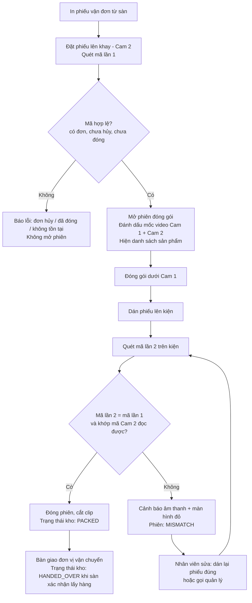
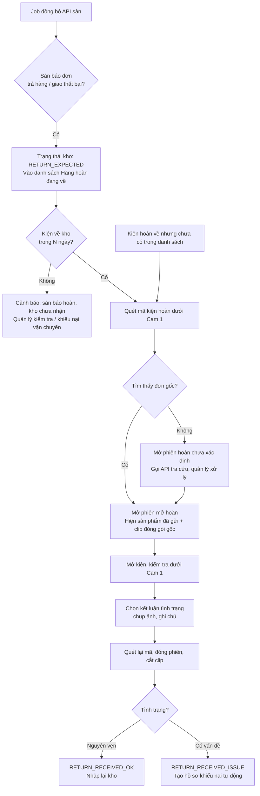
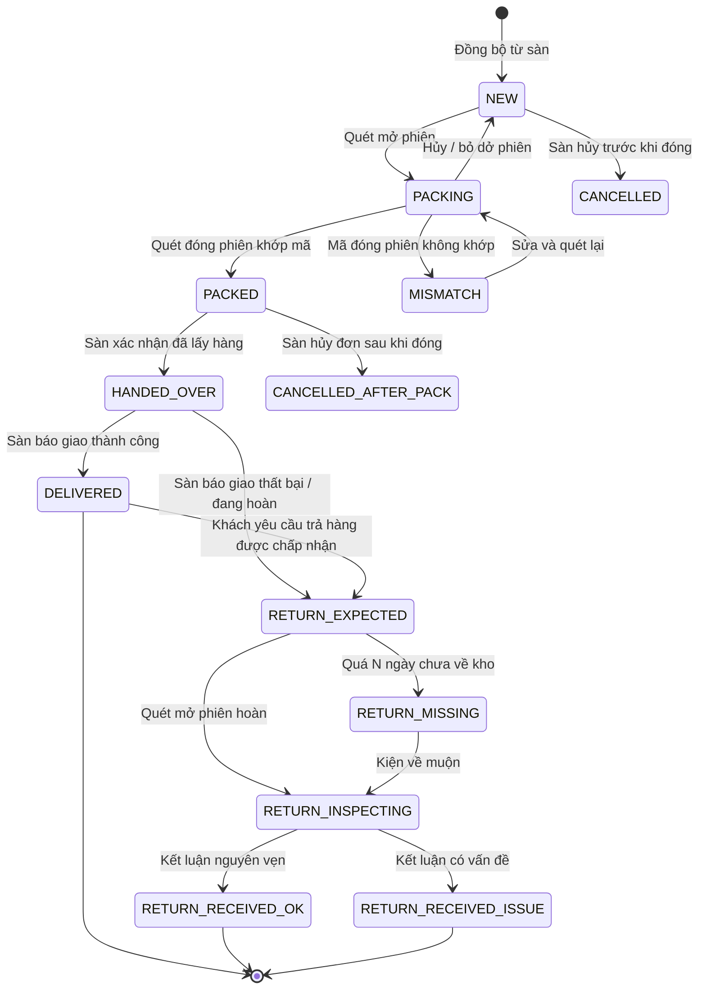
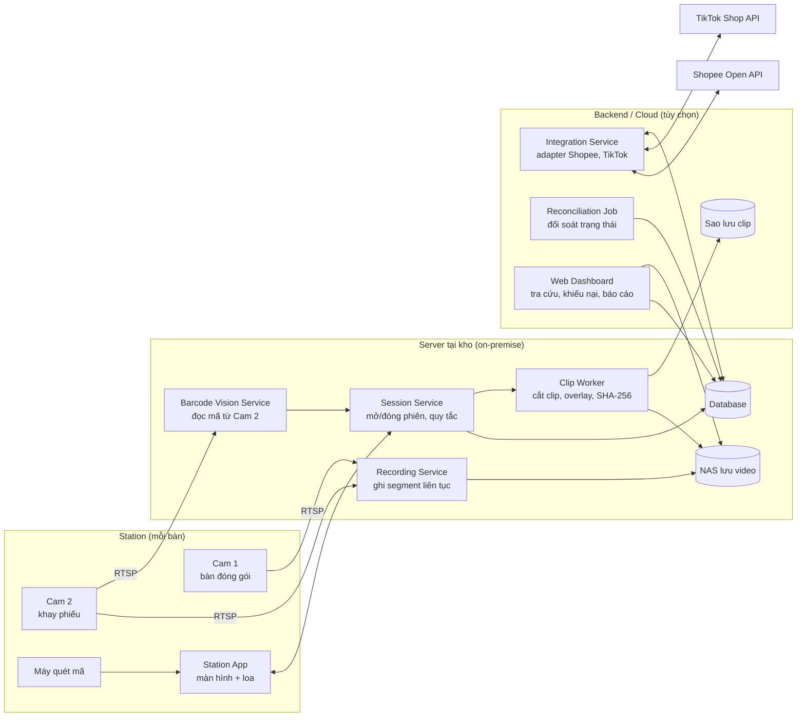
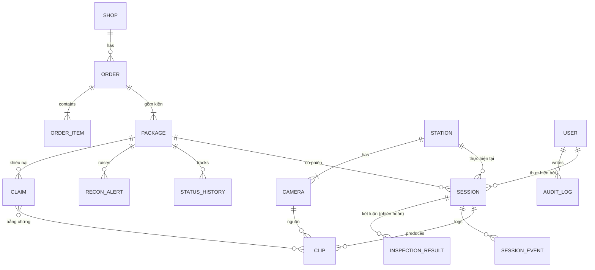

# Đặc tả Yêu cầu Phần mềm (SRS): Hệ thống X

**Ghi hình và đối soát quy trình đóng gói / nhận hàng hoàn cho shop bán trên sàn TMĐT**

| Thuộc tính | Giá trị |
| --- | --- |
| Phiên bản | 0.1 (bản nháp) |
| Ngày | 2026-10-04 |
| Trạng thái | Chờ review với chủ shop |
| Nguồn | Yêu cầu thô "Quy trình đóng hàng" |

---

## Mục lục

1. [Giới thiệu](#1-giới-thiệu)
2. [Bối cảnh và bài toán nghiệp vụ](#2-bối-cảnh-và-bài-toán-nghiệp-vụ)
3. [Stakeholder và tác nhân](#3-stakeholder-và-tác-nhân)
4. [Quy trình nghiệp vụ TO-BE](#4-quy-trình-nghiệp-vụ-to-be)
5. [Yêu cầu chức năng](#5-yêu-cầu-chức-năng)
6. [Use case chi tiết](#6-use-case-chi-tiết)
7. [Mô hình trạng thái đơn và quy tắc nghiệp vụ](#7-mô-hình-trạng-thái-đơn-và-quy-tắc-nghiệp-vụ)
8. [Yêu cầu phi chức năng](#8-yêu-cầu-phi-chức-năng)
9. [Kiến trúc đề xuất, phần cứng, tích hợp](#9-kiến-trúc-đề-xuất-phần-cứng-tích-hợp)
10. [Mô hình dữ liệu sơ bộ](#10-mô-hình-dữ-liệu-sơ-bộ)
11. [Giao diện và màn hình chính](#11-giao-diện-và-màn-hình-chính)
12. [Giả định, ràng buộc, rủi ro, câu hỏi mở](#12-giả-định-ràng-buộc-rủi-ro-câu-hỏi-mở)
13. [Tiêu chí nghiệm thu và lộ trình](#13-tiêu-chí-nghiệm-thu-và-lộ-trình)

---

## 1. Giới thiệu

Hệ thống X ghi hình toàn bộ quá trình đóng gói và mở hàng hoàn tại kho. Mỗi đoạn video được gắn với đúng một mã vận đơn. Hệ thống đồng bộ trạng thái đơn giữa sàn TMĐT và thực tế tại kho. Mục tiêu cuối cùng: có bằng chứng video tra cứu được theo mã vận đơn để khiếu nại khi khách hàng gian lận.

### 1.1 Mục đích tài liệu

Tài liệu là cơ sở cho thiết kế, phát triển, kiểm thử và nghiệm thu Hệ thống X.

Đối tượng đọc: chủ shop, quản lý kho, đội phát triển (BA, dev, QA), đơn vị cung cấp và lắp đặt camera.

### 1.2 Phạm vi

**Trong phạm vi:**

- Quét mã vận đơn để khởi tạo phiên đóng gói và phiên nhận hàng hoàn.
- Ghi hình từ 2 camera cố định, cắt và gắn video theo từng đơn.
- Đối chiếu mã vận đơn trên khay (Cam 2) với mã được quét và dán lên kiện hàng.
- Kết nối API sàn để lấy đơn và trạng thái đơn. Giai đoạn đầu: Shopee. Giai đoạn sau: TikTok Shop, Lazada.
- Quản lý trạng thái đơn theo thực tế kho, phát hiện lệch giữa trạng thái sàn và trạng thái kho.
- Tra cứu, xem lại, xuất video làm bằng chứng khiếu nại.

**Ngoài phạm vi (giai đoạn này):**

- In vận đơn (vẫn in từ Seller Center hoặc phần mềm hiện có).
- Quản lý tồn kho, kế toán, điều phối vận chuyển.
- Nhận diện sản phẩm bằng AI (xem xét ở giai đoạn sau, mục 13.2).

### 1.3 Thuật ngữ

| Thuật ngữ | Giải thích |
| --- | --- |
| Mã vận đơn (AWB / tracking number) | Mã in trên phiếu giao hàng của sàn, dạng barcode hoặc QR |
| Mã đơn sàn (Order SN) | Mã đơn trên Shopee/TikTok. Một đơn có thể có một hoặc nhiều kiện (mã vận đơn) |
| Phiên đóng gói (Packing Session) | Khoảng thời gian từ lúc quét mã khởi tạo tới lúc quét xác nhận hoàn tất một kiện |
| Phiên mở hoàn (Return Session) | Khoảng thời gian từ lúc quét mã kiện hoàn tới lúc nhân viên kết luận tình trạng hàng |
| Cam 1 | Camera cố định phía trên bàn đóng gói / mở hàng, quay thao tác của nhân viên |
| Cam 2 | Camera cố định phía trên khay đặt phiếu vận đơn, đọc mã đang được xử lý |
| Station | Một bàn làm việc gồm Cam 1, Cam 2, máy quét mã, máy tính trạm, màn hình |
| Trạng thái sàn | Trạng thái đơn trả về từ API của sàn |
| Trạng thái kho | Trạng thái đơn do Hệ thống X ghi nhận theo thao tác thực tế tại kho |
| Clip bằng chứng | Đoạn video đã cắt theo phiên, có lớp chữ (overlay) mã vận đơn, thời gian, station, nhân viên |

### 1.4 Tài liệu tham chiếu

- Yêu cầu thô của chủ shop: "Quy trình đóng hàng".
- Shopee Open Platform: nhóm API Order, Logistics, Returns (cần đăng ký tài khoản đối tác).
- TikTok Shop Partner API (giai đoạn sau).

---

## 2. Bối cảnh và bài toán nghiệp vụ

Shop đang đóng gói và nhận hàng hoàn hoàn toàn thủ công. Trạng thái trên sàn không phản ánh trạng thái thực tế tại kho. Khi khách khiếu nại (thiếu hàng, sai hàng, hộp rỗng, trả hàng đã bị đổi), shop không có bằng chứng.

### 2.1 Quy trình hiện tại (AS-IS)

**Đóng gói giao hàng:**

1. Có đơn mới từ Shopee, TikTok...
2. In phiếu vận đơn từ sàn.
3. Nhặt hàng, đóng gói, dán phiếu lên kiện.
4. Giao cho đơn vị vận chuyển.

Không có bước nào ghi nhận lại trên hệ thống, không có video.

**Nhận hàng hoàn:**

1. Khi nhận đơn từ Shopee, người bán in mã vận đơn.
2. Quét mã vận đơn lần đầu (thủ công) và lưu lại.
3. Theo dõi trạng thái đơn trên Shopee. Sàn báo "đang hoàn / đã hoàn" nhưng shop không biết hàng đã thực sự về kho chưa, và hàng còn nguyên vẹn không.
4. Nhân viên phải kiểm tra tay ở kho. Nếu hàng đã về thì quét lại để cập nhật.

### 2.2 Vấn đề

| # | Vấn đề | Hệ quả |
| --- | --- | --- |
| P1 | Không có video quá trình đóng gói | Thua khiếu nại "thiếu hàng / sai hàng / hộp rỗng" |
| P2 | Không có video quá trình mở hàng hoàn | Không chứng minh được khách trả hàng hỏng, hàng giả, thiếu phụ kiện |
| P3 | Trạng thái sàn khác thực tế kho | Hàng hoàn "thất lạc" không ai phát hiện, quá hạn khiếu nại với sàn/đơn vị vận chuyển |
| P4 | Kiểm tra hàng hoàn bằng tay | Tốn công, dễ sót, không có lịch sử |
| P5 | Có thể dán nhầm phiếu sang kiện khác | Giao sai hàng cho khách, bị đánh giá xấu, mất tiền hoàn |

### 2.3 Mục tiêu và chỉ số đo

| Mục tiêu | Chỉ số | Mức kỳ vọng (đề xuất, cần chủ shop xác nhận) |
| --- | --- | --- |
| Mọi kiện giao đi đều có video | Tỷ lệ kiện có clip đóng gói hợp lệ | ≥ 99% |
| Mọi kiện hoàn đều có video mở hàng | Tỷ lệ kiện hoàn có clip mở hoàn | ≥ 99% |
| Không dán nhầm phiếu | Số kiện bị hệ thống chặn do lệch mã / số kiện giao sai | Giao sai = 0 |
| Tìm bằng chứng nhanh | Thời gian từ lúc nhập mã tới lúc có file video | < 30 giây |
| Phát hiện hàng hoàn chưa về | Đơn sàn báo đã hoàn nhưng kho chưa nhận sau N ngày | 100% được cảnh báo |
| Không làm chậm đóng gói | Thời gian thao tác thêm trên mỗi kiện | ≤ 3 giây |

---

## 3. Stakeholder và tác nhân

### 3.1 Stakeholder

| Stakeholder | Quan tâm chính |
| --- | --- |
| Chủ shop | Giảm thất thoát, thắng khiếu nại, xem báo cáo |
| Quản lý kho | Điều phối station, xử lý ngoại lệ, đối soát hàng hoàn |
| Nhân viên đóng gói | Thao tác nhanh, không bị gián đoạn |
| Nhân viên nhận hàng hoàn | Ghi nhận tình trạng hàng rõ ràng |
| CSKH / người xử lý khiếu nại | Tìm và xuất video nhanh |
| Đội IT / vận hành | Ổn định thiết bị, lưu trữ, sao lưu |

### 3.2 Tác nhân hệ thống

| Tác nhân | Loại | Vai trò |
| --- | --- | --- |
| Admin | Người | Cấu hình hệ thống, user, kết nối shop, chính sách lưu trữ |
| Quản lý kho (Supervisor) | Người | Theo dõi station, xử lý cảnh báo, duyệt ngoại lệ |
| Nhân viên đóng gói (Packer) | Người | Thực hiện phiên đóng gói |
| Nhân viên nhận hoàn (Return Inspector) | Người | Thực hiện phiên mở hoàn, kết luận tình trạng |
| CSKH | Người | Tra cứu video, tạo hồ sơ khiếu nại |
| Sàn TMĐT (Shopee, TikTok Shop) | Hệ thống ngoài | Cung cấp đơn, trạng thái, yêu cầu trả hàng |
| Cam 1, Cam 2 | Thiết bị | Cung cấp luồng video |
| Máy quét mã | Thiết bị | Đọc mã vận đơn |

---

## 4. Quy trình nghiệp vụ TO-BE

Cả hai quy trình đều theo cùng nguyên tắc: **quét mã để mở phiên, làm việc dưới camera, quét lại mã để đóng phiên**. Hệ thống ghi hình liên tục và cắt clip theo mốc thời gian mở/đóng phiên.

### 4.1 Quy trình đóng gói giao hàng

Ánh xạ từ yêu cầu thô:

| Bước yêu cầu thô | Bước TO-BE |
| --- | --- |
| 1. In mã đơn từ Shopee | B1 |
| 2. Quét bằng hệ thống X để khởi tạo | B2 – B3 |
| 3. Dán lên sản phẩm | B4 – B5 |
| 4. Quét lại sản phẩm với mã để đồng bộ | B6 – B7 |

Các bước:

- **B1.** Nhân viên in phiếu vận đơn từ sàn (ngoài Hệ thống X).
- **B2.** Đặt phiếu lên khay trong vùng nhìn của Cam 2. Quét mã bằng máy quét.
- **B3.** Hệ thống X kiểm tra mã (đúng định dạng, có trong danh sách đơn, đơn chưa bị hủy, chưa đóng gói). Hợp lệ thì **mở phiên đóng gói**, đánh dấu mốc bắt đầu trên video Cam 1 và Cam 2, hiển thị thông tin đơn (sản phẩm, số lượng, ghi chú) trên màn hình.
- **B4.** Nhân viên nhặt hàng, đóng gói dưới Cam 1, theo danh sách sản phẩm hiển thị.
- **B5.** Lấy phiếu từ khay, dán lên kiện. Cam 2 ghi nhận phiếu đã rời khay.
- **B6.** Quét lại mã trên kiện đã dán.
- **B7.** Hệ thống so khớp: mã quét lần 2 = mã mở phiên, và mã Cam 2 đọc được trên khay = mã mở phiên. Khớp thì **đóng phiên**, cắt clip, chuyển trạng thái kho sang `PACKED`. Không khớp thì báo lỗi bằng âm thanh và màn hình đỏ, phiên chuyển `MISMATCH`, chờ xử lý.



**Ngoại lệ trong đóng gói:**

| Mã | Tình huống | Xử lý |
| --- | --- | --- |
| EX-P1 | Quét mã đơn đã bị hủy trên sàn | Chặn, báo "ĐƠN ĐÃ HỦY", không mở phiên |
| EX-P2 | Quét mã đã đóng gói rồi | Cảnh báo trùng, hỏi có muốn đóng gói lại (cần quyền Supervisor). Phiên mới được gắn là "đóng gói lại", giữ cả clip cũ |
| EX-P3 | Quét mã không có trong hệ thống (chưa đồng bộ kịp) | Gọi API sàn lấy đơn ngay. Nếu vẫn không thấy: cho phép mở phiên ở chế độ "chưa xác minh", đánh dấu để đối soát sau |
| EX-P4 | Đang có phiên mở mà quét mã khác | Hỏi: hủy phiên hiện tại hay coi là mã đóng phiên sai (MISMATCH) |
| EX-P5 | Phiên mở quá thời gian cấu hình (vd 15 phút) | Cảnh báo, sau đó tự chuyển `ABANDONED`, clip vẫn được giữ |
| EX-P6 | Cam 2 không đọc được mã trên khay (che, mờ) | Không chặn, ghi cờ "Cam 2 không xác minh được", vẫn đóng phiên nếu 2 lần quét khớp |
| EX-P7 | Mất kết nối camera trong phiên | Cảnh báo ngay trên màn hình station. Phiên vẫn chạy, ghi cờ "video không đầy đủ" |
| EX-P8 | Một đơn có nhiều kiện | Mỗi mã vận đơn là một phiên riêng, nhóm theo mã đơn sàn |

### 4.2 Quy trình nhận và xử lý hàng hoàn

Ánh xạ từ yêu cầu thô:

| Bước yêu cầu thô | Cách Hệ thống X xử lý |
| --- | --- |
| 1. Nhận đơn, in mã vận đơn | Như quy trình đóng gói |
| 2. Quét lần đầu mã vận đơn, lưu lên hệ thống X | Chính là phiên đóng gói (mục 4.1), tạo bản ghi đơn + clip đóng gói |
| 3. Kiểm tra trạng thái đơn trên Shopee qua API | Job đồng bộ tự động, đánh dấu đơn `RETURN_EXPECTED` khi sàn báo hoàn |
| 4. Nhân viên check tay ở kho, quét lại để đồng bộ | Phiên mở hoàn dưới Cam 1 + bảng đối soát tự động thay cho việc check tay |

Các bước:

- **R1.** Job đồng bộ lấy danh sách đơn có yêu cầu trả hàng / giao thất bại từ API sàn. Đơn chuyển trạng thái kho `RETURN_EXPECTED`, xuất hiện trong danh sách "Hàng hoàn đang về".
- **R2.** Kiện hoàn về kho. Nhân viên đặt kiện lên bàn (vùng Cam 1), quét mã vận đơn trên kiện (mã gốc hoặc mã vận đơn chiều về).
- **R3.** Hệ thống tìm đơn gốc. Mở **phiên mở hoàn**, đánh dấu mốc video. Màn hình hiển thị song song: danh sách sản phẩm đã gửi đi + nút xem nhanh clip đóng gói gốc.
- **R4.** Nhân viên mở kiện dưới Cam 1, kiểm tra từng sản phẩm.
- **R5.** Nhân viên chọn kết luận: `Nguyên vẹn`, `Hư hỏng`, `Thiếu hàng`, `Sai hàng / bị tráo`, `Hộp rỗng`, `Khác`. Có thể chụp ảnh thêm từ Cam 1 và ghi chú.
- **R6.** Quét lại mã để đóng phiên. Hệ thống cắt clip, chuyển trạng thái kho `RETURN_RECEIVED_OK` hoặc `RETURN_RECEIVED_ISSUE`.
- **R7.** Nếu có vấn đề: tự tạo **hồ sơ khiếu nại** gồm clip đóng gói gốc + clip mở hoàn + ảnh + ghi chú, để CSKH gửi lên sàn.
- **R8.** Đối soát định kỳ: đơn sàn báo đã hoàn nhưng kho chưa nhận sau N ngày thì cảnh báo cho quản lý (hàng có thể thất lạc, cần khiếu nại đơn vị vận chuyển).



**Ngoại lệ trong nhận hoàn:**

| Mã | Tình huống | Xử lý |
| --- | --- | --- |
| EX-R1 | Kiện hoàn về nhưng sàn chưa báo hoàn | Vẫn cho mở phiên, đánh dấu "về trước khi sàn cập nhật", đối soát lại khi sàn cập nhật |
| EX-R2 | Mã trên kiện hoàn bị rách / không đọc được | Cho nhập tay mã hoặc tìm theo mã đơn sàn / số điện thoại (che một phần) |
| EX-R3 | Đơn gốc không có clip đóng gói (đơn trước khi dùng hệ thống) | Vẫn mở phiên hoàn bình thường, hồ sơ khiếu nại ghi rõ "không có clip đóng gói" |
| EX-R4 | Một đơn hoàn về nhiều kiện | Mỗi kiện một phiên, đơn chỉ chuyển `RETURN_RECEIVED_*` khi đủ kiện |
| EX-R5 | Khách chỉ trả một phần sản phẩm | Kết luận theo từng dòng sản phẩm, đối chiếu với số lượng yêu cầu trả trên sàn |

---

## 5. Yêu cầu chức năng

Mức ưu tiên theo MoSCoW: **M** = Must (bắt buộc cho MVP), **S** = Should, **C** = Could.

### 5.1 M01 – Quản lý station và thiết bị

| ID | Yêu cầu | Ưu tiên |
| --- | --- | --- |
| FR-01.01 | Admin tạo / sửa / vô hiệu hóa station, gán Cam 1, Cam 2 (địa chỉ RTSP/ONVIF), máy quét, loại station (đóng gói / nhận hoàn / cả hai) | M |
| FR-01.02 | Hệ thống kiểm tra kết nối camera định kỳ (≤ 10 giây/lần), hiển thị trạng thái online/offline cho từng camera | M |
| FR-01.03 | Cảnh báo âm thanh + màn hình tại station và trên dashboard khi camera mất tín hiệu | M |
| FR-01.04 | Cấu hình vùng quan tâm (ROI) trên khung hình Cam 2 để giới hạn vùng đọc mã | S |
| FR-01.05 | Xem trực tiếp (live view) tất cả camera trên dashboard quản lý | S |

### 5.2 M02 – Ghi hình và lưu trữ video

| ID | Yêu cầu | Ưu tiên |
| --- | --- | --- |
| FR-02.01 | Ghi hình liên tục Cam 1 và Cam 2 trong giờ làm việc cấu hình, chia segment ngắn (vd 1 phút) | M |
| FR-02.02 | Khi đóng phiên, tạo clip theo khoảng [bắt đầu − 5 giây, kết thúc + 5 giây] từ các segment, không mã hóa lại nếu có thể | M |
| FR-02.03 | Chèn overlay lên clip: mã vận đơn, mã đơn sàn, thời gian thực (đến giây), tên station, mã nhân viên | M |
| FR-02.04 | Tính và lưu mã băm SHA-256 cho mỗi clip để chứng minh không bị chỉnh sửa | M |
| FR-02.05 | Clip đã gắn với phiên không thể bị xóa bởi nhân viên. Chỉ Admin xóa được, và mọi thao tác xóa ghi audit log | M |
| FR-02.06 | Chính sách lưu trữ: video thô liên tục giữ X ngày, clip phiên giữ Y ngày, clip gắn hồ sơ khiếu nại giữ vĩnh viễn tới khi đóng hồ sơ (X, Y cấu hình được) | M |
| FR-02.07 | Ghép Cam 1 và Cam 2 thành một clip chia đôi màn hình (side-by-side) khi xuất bằng chứng | S |
| FR-02.08 | Sao lưu clip phiên lên lưu trữ thứ hai (NAS khác hoặc cloud) | S |

### 5.3 M03 – Phiên đóng gói

| ID | Yêu cầu | Ưu tiên |
| --- | --- | --- |
| FR-03.01 | Nhân viên đăng nhập station bằng quét thẻ nhân viên hoặc mã PIN, mọi phiên gắn với nhân viên đang đăng nhập | M |
| FR-03.02 | Quét mã vận đơn khi station rảnh thì kiểm tra hợp lệ theo BR-01..BR-04 rồi mở phiên | M |
| FR-03.03 | Màn hình station hiển thị trong phiên: mã vận đơn, mã đơn sàn, danh sách sản phẩm (tên, phân loại, số lượng, ảnh), ghi chú của khách, đồng hồ đếm thời gian phiên | M |
| FR-03.04 | Quét lần 2 trùng mã thì đóng phiên, trạng thái kho `PACKED` | M |
| FR-03.05 | Quét lần 2 khác mã thì phiên `MISMATCH`, cảnh báo âm thanh + màn hình đỏ, không cho mở phiên mới tới khi xử lý | M |
| FR-03.06 | Cam 2 liên tục đọc mã barcode/QR trong ROI. Khi mở phiên, xác nhận mã trên khay = mã quét. Khi đóng phiên, xác nhận phiếu đã rời khay | M |
| FR-03.07 | Nếu Cam 2 đọc được mã khác mã đang mở phiên (có 2 phiếu trên khay, phiếu sai) thì cảnh báo ngay | M |
| FR-03.08 | Nút thao tác nhanh trên station: hủy phiên (bắt buộc chọn lý do), báo thiếu hàng, gọi quản lý | M |
| FR-03.09 | Phiên quá thời gian cấu hình thì cảnh báo, rồi tự chuyển `ABANDONED` | S |
| FR-03.10 | Đóng gói lại một đơn đã `PACKED` chỉ khi có xác nhận của Supervisor, giữ lịch sử mọi phiên | S |
| FR-03.11 | Chế độ quét liên tục: quét mã kiện mới ngay khi phiên trước đã đóng, không cần thao tác chuột | M |

### 5.4 M04 – Phiên mở hàng hoàn

| ID | Yêu cầu | Ưu tiên |
| --- | --- | --- |
| FR-04.01 | Quét mã kiện hoàn thì tìm đơn gốc theo mã vận đơn gốc, mã vận đơn chiều về, hoặc mã đơn sàn | M |
| FR-04.02 | Mở phiên mở hoàn, hiển thị danh sách sản phẩm đã gửi, số lượng yêu cầu trả, lý do trả của khách, nút xem clip đóng gói gốc | M |
| FR-04.03 | Nhân viên chọn kết luận tình trạng cho cả kiện và (tùy chọn) từng dòng sản phẩm | M |
| FR-04.04 | Chụp ảnh tĩnh từ Cam 1 bằng phím tắt / nút trong phiên, gắn vào phiên | S |
| FR-04.05 | Quét lại mã để đóng phiên. Bắt buộc đã chọn kết luận trước khi đóng | M |
| FR-04.06 | Kết luận khác "Nguyên vẹn" thì tự tạo hồ sơ khiếu nại (M08) | M |
| FR-04.07 | Cho phép tìm đơn thủ công khi không quét được mã (EX-R2) | M |

### 5.5 M05 – Tích hợp sàn TMĐT

| ID | Yêu cầu | Ưu tiên |
| --- | --- | --- |
| FR-05.01 | Admin kết nối shop Shopee qua OAuth của Shopee Open Platform, lưu và tự làm mới token | M |
| FR-05.02 | Đồng bộ đơn mới và đơn chờ giao định kỳ (đề xuất 5 phút) và nhận webhook/push nếu sàn hỗ trợ | M |
| FR-05.03 | Lấy chi tiết đơn: mã đơn, mã vận đơn (từng kiện), sản phẩm, phân loại, số lượng, ghi chú | M |
| FR-05.04 | Đồng bộ trạng thái đơn và trạng thái vận chuyển (đã lấy hàng, đang giao, giao thành công, giao thất bại, đang hoàn, đã hoàn) | M |
| FR-05.05 | Đồng bộ yêu cầu trả hàng / hoàn tiền (return request) và trạng thái của chúng | M |
| FR-05.06 | Tra cứu tức thời một đơn khi quét mã chưa có trong hệ thống (EX-P3) | M |
| FR-05.07 | Lớp tích hợp thiết kế dạng adapter để thêm TikTok Shop, Lazada mà không đổi lõi nghiệp vụ | M (thiết kế) / S (TikTok) |
| FR-05.08 | Ghi log mọi lần gọi API, xử lý giới hạn tần suất (rate limit), thử lại có giãn cách | M |
| FR-05.09 | Nhập đơn từ file Excel/CSV làm phương án dự phòng khi API không dùng được | S |

### 5.6 M06 – Đối soát trạng thái

| ID | Yêu cầu | Ưu tiên |
| --- | --- | --- |
| FR-06.01 | Lưu song song trạng thái sàn và trạng thái kho cho mỗi đơn, kèm lịch sử thay đổi | M |
| FR-06.02 | Chạy quy tắc đối soát (BR-10..BR-14) định kỳ, sinh cảnh báo lệch trạng thái | M |
| FR-06.03 | Bảng "Lệch trạng thái" lọc theo loại lệch, ngày, sàn. Supervisor đánh dấu đã xử lý kèm ghi chú | M |
| FR-06.04 | Thông báo cảnh báo mới qua dashboard; tùy chọn qua Zalo / Telegram / email | S |

### 5.7 M07 – Tra cứu và xuất bằng chứng

| ID | Yêu cầu | Ưu tiên |
| --- | --- | --- |
| FR-07.01 | Tìm theo mã vận đơn, mã đơn sàn, khoảng ngày, nhân viên, station, trạng thái | M |
| FR-07.02 | Trang chi tiết đơn: timeline mọi sự kiện (sàn + kho), danh sách phiên, phát clip Cam 1 / Cam 2 | M |
| FR-07.03 | Hỗ trợ quét mã bằng máy quét ngay tại ô tìm kiếm để mở thẳng trang chi tiết đơn | M |
| FR-07.04 | Xuất clip MP4 (H.264, tương thích điện thoại) kèm file thông tin (mã băm, thời gian, station, nhân viên) | M |
| FR-07.05 | Tạo link chia sẻ có thời hạn để gửi cho sàn / đơn vị vận chuyển | S |
| FR-07.06 | Xem lại video thô liên tục theo station + khoảng thời gian (để tìm sự việc ngoài phiên) | S |

### 5.8 M08 – Hồ sơ khiếu nại

| ID | Yêu cầu | Ưu tiên |
| --- | --- | --- |
| FR-08.01 | Tạo hồ sơ tự động (từ phiên mở hoàn có vấn đề) hoặc thủ công (từ trang chi tiết đơn) | M |
| FR-08.02 | Hồ sơ gồm: đơn, loại khiếu nại, clip đóng gói, clip mở hoàn, ảnh, ghi chú, người phụ trách, hạn khiếu nại | M |
| FR-08.03 | Trạng thái hồ sơ: Mới, Đã gửi sàn, Đang chờ phản hồi, Thắng, Thua, Đóng | M |
| FR-08.04 | Cảnh báo hồ sơ sắp hết hạn khiếu nại | S |
| FR-08.05 | Xuất gói bằng chứng (zip: clip + ảnh + file thông tin) | S |

### 5.9 M09 – Báo cáo

| ID | Yêu cầu | Ưu tiên |
| --- | --- | --- |
| FR-09.01 | Dashboard ngày: số kiện đóng gói, số phiên lỗi (mismatch, bỏ dở), số kiện hoàn nhận, số cảnh báo lệch | M |
| FR-09.02 | Năng suất theo nhân viên / station: số kiện, thời gian trung bình mỗi kiện | S |
| FR-09.03 | Báo cáo hàng hoàn: tỷ lệ hoàn, tỷ lệ hoàn có vấn đề, theo sản phẩm, theo lý do | S |
| FR-09.04 | Báo cáo khiếu nại: số hồ sơ, tỷ lệ thắng, giá trị thu hồi | C |

### 5.10 M10 – Người dùng, phân quyền, nhật ký

| ID | Yêu cầu | Ưu tiên |
| --- | --- | --- |
| FR-10.01 | Quản lý người dùng, vai trò: Admin, Supervisor, Packer, Return Inspector, CSKH | M |
| FR-10.02 | Phân quyền theo vai trò (ma trận mục 5.11) | M |
| FR-10.03 | Ghi audit log cho thao tác nhạy cảm: xem/xuất/xóa clip, đổi trạng thái thủ công, đổi cấu hình | M |

### 5.11 Ma trận phân quyền

| Chức năng | Admin | Supervisor | Packer | Return Inspector | CSKH |
| --- | --- | --- | --- | --- | --- |
| Cấu hình station, kết nối sàn | ✔ | | | | |
| Thực hiện phiên đóng gói | ✔ | ✔ | ✔ | | |
| Thực hiện phiên mở hoàn | ✔ | ✔ | | ✔ | |
| Duyệt đóng gói lại, xử lý mismatch | ✔ | ✔ | | | |
| Xem clip | ✔ | ✔ | Chỉ phiên của mình | Chỉ phiên của mình | ✔ |
| Xuất / chia sẻ clip | ✔ | ✔ | | | ✔ |
| Xóa clip | ✔ | | | | |
| Xử lý cảnh báo lệch trạng thái | ✔ | ✔ | | | |
| Quản lý hồ sơ khiếu nại | ✔ | ✔ | | | ✔ |
| Báo cáo | ✔ | ✔ | | | ✔ |

---

## 6. Use case chi tiết

### 6.1 Danh sách use case

| ID | Tên | Tác nhân chính |
| --- | --- | --- |
| UC-01 | Đóng gói một kiện hàng | Packer |
| UC-02 | Nhận và kiểm tra kiện hoàn | Return Inspector |
| UC-03 | Tra cứu và xuất video bằng chứng | CSKH, Supervisor |
| UC-04 | Tạo và theo dõi hồ sơ khiếu nại | CSKH |
| UC-05 | Đồng bộ đơn từ sàn | Hệ thống (job) |
| UC-06 | Xử lý cảnh báo lệch trạng thái | Supervisor |
| UC-07 | Cấu hình station và camera | Admin |
| UC-08 | Xử lý phiên MISMATCH | Supervisor, Packer |

### 6.2 UC-01: Đóng gói một kiện hàng

| Mục | Nội dung |
| --- | --- |
| Tác nhân | Packer |
| Tiền điều kiện | Packer đã đăng nhập station. Cam 1, Cam 2 online. Station không có phiên đang mở |
| Kích hoạt | Packer quét mã vận đơn |
| Hậu điều kiện thành công | Có phiên `COMPLETED` với clip Cam 1 + Cam 2, đơn ở trạng thái kho `PACKED` |

**Luồng chính:**

1. Packer đặt phiếu vận đơn lên khay, quét mã.
2. Hệ thống kiểm tra mã theo BR-01..BR-04.
3. Hệ thống mở phiên, ghi `started_at`, hiển thị thông tin đơn, phát âm "bíp" thành công.
4. Hệ thống xác nhận Cam 2 đọc được cùng mã trên khay (hiển thị dấu tích xanh).
5. Packer đóng gói theo danh sách sản phẩm trên màn hình.
6. Packer dán phiếu lên kiện, quét lại mã.
7. Hệ thống xác nhận mã trùng, đóng phiên, ghi `ended_at`, đẩy yêu cầu cắt clip vào hàng đợi.
8. Màn hình về trạng thái sẵn sàng. Clip có sẵn để xem trong ≤ 60 giây.

**Luồng thay thế / ngoại lệ:** EX-P1..EX-P8 (mục 4.1).

### 6.3 UC-02: Nhận và kiểm tra kiện hoàn

| Mục | Nội dung |
| --- | --- |
| Tác nhân | Return Inspector |
| Tiền điều kiện | Đã đăng nhập station loại "nhận hoàn". Camera online |
| Kích hoạt | Quét mã trên kiện hoàn |
| Hậu điều kiện thành công | Có phiên hoàn `COMPLETED` + kết luận tình trạng. Đơn ở `RETURN_RECEIVED_OK` hoặc `RETURN_RECEIVED_ISSUE`. Nếu có vấn đề: có hồ sơ khiếu nại |

**Luồng chính:**

1. Inspector đặt kiện lên bàn, quét mã.
2. Hệ thống tìm đơn gốc (FR-04.01), mở phiên hoàn, hiển thị sản phẩm đã gửi + clip đóng gói gốc.
3. Inspector mở kiện dưới Cam 1, kiểm tra từng sản phẩm.
4. Inspector chọn kết luận, chụp ảnh nếu cần, nhập ghi chú.
5. Inspector quét lại mã.
6. Hệ thống đóng phiên, cập nhật trạng thái kho, tạo hồ sơ khiếu nại nếu kết luận có vấn đề.

**Luồng thay thế / ngoại lệ:** EX-R1..EX-R5 (mục 4.2).

### 6.4 UC-03: Tra cứu và xuất video bằng chứng

1. CSKH quét hoặc nhập mã vận đơn / mã đơn sàn vào ô tìm kiếm.
2. Hệ thống mở trang chi tiết đơn: thông tin đơn, timeline trạng thái, danh sách phiên.
3. CSKH chọn phiên, xem clip Cam 1 / Cam 2 hoặc chế độ ghép.
4. CSKH bấm "Xuất bằng chứng". Hệ thống tạo file MP4 có overlay + file thông tin có mã băm.
5. Hệ thống ghi audit log (ai xuất, lúc nào, đơn nào).

### 6.5 UC-06: Xử lý cảnh báo lệch trạng thái

1. Supervisor mở bảng "Lệch trạng thái".
2. Chọn cảnh báo, xem trạng thái sàn, trạng thái kho, lịch sử.
3. Thực hiện hành động: kiểm tra thực tế kho, mở hồ sơ khiếu nại với đơn vị vận chuyển, hoặc điều chỉnh trạng thái kho thủ công (bắt buộc ghi lý do).
4. Đánh dấu "Đã xử lý". Hệ thống ghi audit log.

### 6.6 UC-08: Xử lý phiên MISMATCH

1. Station báo đỏ, hiển thị mã mở phiên và mã quét lần 2 / mã Cam 2 đọc được.
2. Packer kiểm tra: dán nhầm phiếu thì gỡ, dán đúng phiếu, quét lại; phiên trở về luồng chính bước 6.
3. Nếu không tự xử lý được, Packer bấm "Gọi quản lý". Supervisor xác nhận bằng thẻ / PIN và chọn: tiếp tục, hủy phiên, hoặc đóng phiên có ghi chú ngoại lệ.

---

## 7. Mô hình trạng thái đơn và quy tắc nghiệp vụ

### 7.1 Trạng thái kho của một kiện (mã vận đơn)



### 7.2 Ánh xạ trạng thái sàn sang trạng thái kho (Shopee, cần xác minh với tài liệu API)

| Trạng thái Shopee (order_status) | Trạng thái kho kỳ vọng | Nếu kho khác thì |
| --- | --- | --- |
| UNPAID | Không đồng bộ / NEW (ẩn) | |
| READY_TO_SHIP | NEW hoặc PACKED | |
| PROCESSED | PACKED | Kho vẫn NEW quá X giờ: cảnh báo "in vận đơn nhưng chưa đóng" |
| SHIPPED | HANDED_OVER | Kho vẫn NEW: cảnh báo "**giao đi không có clip đóng gói**" |
| TO_CONFIRM_RECEIVE / COMPLETED | DELIVERED | |
| IN_CANCEL / CANCELLED | CANCELLED hoặc CANCELLED_AFTER_PACK | Kho đã PACKED: cảnh báo "đơn hủy, kiện đã đóng cần tháo" |
| TO_RETURN / có return request | RETURN_EXPECTED | |
| Return request đã hoàn tất phía sàn | RETURN_RECEIVED_* | Kho vẫn RETURN_EXPECTED: cảnh báo "sàn báo đã hoàn, kho chưa nhận" |

### 7.3 Quy tắc nghiệp vụ

| ID | Quy tắc |
| --- | --- |
| BR-01 | Không mở phiên đóng gói cho đơn có trạng thái sàn CANCELLED / IN_CANCEL |
| BR-02 | Mỗi station tại một thời điểm chỉ có tối đa một phiên đang mở |
| BR-03 | Một mã vận đơn chỉ có một phiên đóng gói `COMPLETED` hiệu lực. Đóng gói lại cần Supervisor duyệt, phiên cũ được giữ và đánh dấu "bị thay thế" |
| BR-04 | Mã không có trong hệ thống thì tra API trước khi cho mở phiên ở chế độ "chưa xác minh" |
| BR-05 | Phiên chỉ `COMPLETED` khi mã quét lần 2 trùng mã mở phiên |
| BR-06 | Cam 2 đọc được mã khác mã đang mở phiên thì phải cảnh báo ngay, không chờ quét lần 2 |
| BR-07 | Phiên mở hoàn bắt buộc có kết luận tình trạng trước khi đóng |
| BR-08 | Kết luận hoàn khác "Nguyên vẹn" thì tự tạo hồ sơ khiếu nại |
| BR-09 | Clip gắn với hồ sơ khiếu nại chưa đóng không bị xóa bởi chính sách lưu trữ tự động |
| BR-10 | Sàn SHIPPED mà kho chưa PACKED: cảnh báo mức cao |
| BR-11 | Sàn đã hủy mà kho PACKED: cảnh báo, yêu cầu tháo kiện |
| BR-12 | Kho RETURN_EXPECTED quá N ngày (cấu hình, đề xuất 7) chưa nhận: chuyển RETURN_MISSING, cảnh báo |
| BR-13 | Kho nhận hoàn mà sàn chưa có yêu cầu trả: cảnh báo mức thấp, đối soát lại sau 24 giờ |
| BR-14 | Kho PACKED quá X giờ mà sàn chưa SHIPPED: cảnh báo "kiện đóng xong chưa bàn giao" |
| BR-15 | Thời gian trên mọi máy (server, station, camera) đồng bộ NTP, lệch tối đa 1 giây |

---

## 8. Yêu cầu phi chức năng

### 8.1 Hiệu năng

| ID | Yêu cầu |
| --- | --- |
| NFR-01 | Từ lúc quét mã tới lúc station phản hồi (mở/đóng phiên): ≤ 1 giây với đơn đã đồng bộ, ≤ 3 giây khi phải tra API |
| NFR-02 | Cam 2 nhận diện mã trên khay trong ≤ 2 giây sau khi phiếu được đặt vào ROI |
| NFR-03 | Clip phiên sẵn sàng xem ≤ 60 giây sau khi đóng phiên |
| NFR-04 | Tra cứu theo mã vận đơn trả kết quả ≤ 2 giây với 1 triệu bản ghi |
| NFR-05 | Mỗi server cục bộ phục vụ tối thiểu 4 station (8 camera) đồng thời, mở rộng được |

### 8.2 Chất lượng video

| ID | Yêu cầu |
| --- | --- |
| NFR-06 | Cam 1: tối thiểu 1080p, 15 fps, nhìn rõ sản phẩm, tay nhân viên và mặt bàn. Có hồng ngoại hoặc đủ sáng ổn định |
| NFR-07 | Cam 2: độ phân giải và tiêu cự đủ để đọc barcode trên phiếu vận đơn tại khoảng cách lắp đặt (đề xuất 4MP trở lên, nét cố định) |
| NFR-08 | Nén H.265 khi lưu, xuất H.264 khi chia sẻ để tương thích điện thoại và hệ thống sàn |

### 8.3 Dung lượng lưu trữ (ước tính, cần đo lại thực tế)

Giả định: 1080p H.265 ≈ 2 Mbps/camera, ghi 10 giờ/ngày, 2 camera/station.

| Hạng mục | Ước tính |
| --- | --- |
| Mỗi camera mỗi giờ | ≈ 0,9 GB |
| Mỗi station mỗi ngày (2 cam × 10 h) | ≈ 18 GB |
| Mỗi station mỗi tháng (30 ngày) | ≈ 540 GB |
| 2 station, giữ video thô 30 ngày | ≈ 1,1 TB |
| Clip phiên (chỉ phần có phiên) | Thường 40–70% video thô, tùy mật độ đơn |

Đề xuất: ổ NAS ≥ 8 TB RAID 1 cho 2–4 station, giữ video thô 30 ngày và clip phiên 90–180 ngày. Thời hạn giữ clip phiên phải ≥ thời hạn khiếu nại dài nhất của các sàn (cần xác nhận, mục 12.4).

### 8.4 Độ tin cậy và khả dụng

| ID | Yêu cầu |
| --- | --- |
| NFR-09 | **Offline-first:** mất Internet thì station và server cục bộ vẫn quét, mở/đóng phiên, ghi hình bình thường. Dữ liệu đồng bộ lên sàn/cloud khi có mạng lại |
| NFR-10 | Server cục bộ dùng UPS, chịu mất điện ≥ 15 phút và tắt an toàn |
| NFR-11 | Không mất video đã ghi khi một tiến trình bị crash: ghi theo segment, tiến trình ghi tự khởi động lại |
| NFR-12 | Khả dụng trong giờ làm việc ≥ 99,5% |

### 8.5 Tính toàn vẹn của bằng chứng

| ID | Yêu cầu |
| --- | --- |
| NFR-13 | Clip có overlay thời gian thực và mã vận đơn không tách rời khỏi hình |
| NFR-14 | Lưu SHA-256 của clip khi tạo, cho phép kiểm tra lại bất kỳ lúc nào |
| NFR-15 | Mọi xem/xuất/xóa clip đều có audit log không sửa được |
| NFR-16 | Video quay liền mạch trong phiên, không cắt ghép, để tăng giá trị bằng chứng khi khiếu nại |

### 8.6 Bảo mật

| ID | Yêu cầu |
| --- | --- |
| NFR-17 | Xác thực người dùng, mật khẩu băm, phiên đăng nhập web hết hạn sau thời gian không hoạt động |
| NFR-18 | Token API sàn được mã hóa khi lưu |
| NFR-19 | Camera nằm trong mạng LAN riêng (VLAN), không mở cổng ra Internet, đổi mật khẩu mặc định |
| NFR-20 | Che bớt thông tin cá nhân của người mua (SĐT, địa chỉ) trên giao diện cho vai trò không cần |
| NFR-21 | Tuân thủ quy định bảo vệ dữ liệu cá nhân hiện hành (Nghị định 13/2023/NĐ-CP), có thông báo ghi hình tại khu vực làm việc |

### 8.7 Khả năng sử dụng

| ID | Yêu cầu |
| --- | --- |
| NFR-22 | Thao tác trong phiên chỉ bằng máy quét, không bắt buộc dùng chuột/bàn phím |
| NFR-23 | Phản hồi bằng âm thanh khác nhau cho: thành công, lỗi, cảnh báo |
| NFR-24 | Màn hình station chữ lớn, đọc được từ 1,5 m, màu nền thể hiện trạng thái (xanh / vàng / đỏ) |
| NFR-25 | Nhân viên mới làm quen được trong ≤ 15 phút |
| NFR-26 | Giao diện tiếng Việt |

### 8.8 Bảo trì và mở rộng

| ID | Yêu cầu |
| --- | --- |
| NFR-27 | Hỗ trợ camera chuẩn ONVIF / RTSP của nhiều hãng, không khóa vào một hãng |
| NFR-28 | Thêm sàn mới bằng cách viết adapter, không sửa lõi |
| NFR-29 | Có log tập trung và trang giám sát sức khỏe hệ thống (camera, ổ đĩa, job đồng bộ) |
| NFR-30 | Cảnh báo khi ổ lưu trữ đầy trên 80% |

---

## 9. Kiến trúc đề xuất, phần cứng, tích hợp

### 9.1 Tổng quan kiến trúc

Kiến trúc lai: **xử lý video và phiên tại kho (on-premise)**, đồng bộ dữ liệu nghiệp vụ và tích hợp sàn qua backend. Lý do: video dung lượng lớn, cần độ trễ thấp và phải chạy được khi mất mạng.



Ghi chú: ở quy mô nhỏ (1–2 station), toàn bộ khối "Server tại kho" và "Backend" có thể chạy trên **một máy mini PC + NAS**, dashboard truy cập qua LAN hoặc qua tunnel bảo mật.

### 9.2 Quyết định thiết kế chính

| Chủ đề | Lựa chọn đề xuất | Lý do | Phương án khác |
| --- | --- | --- | --- |
| Cách ghi hình | Ghi liên tục theo segment, cắt clip theo mốc thời gian phiên | Không bao giờ lỡ đầu phiên, chịu lỗi tốt, xem lại được sự việc ngoài phiên | Bật/tắt ghi theo phiên: tốn ít ổ hơn nhưng dễ mất vài giây đầu, rủi ro khi lỗi |
| Vai trò Cam 2 | Đọc mã barcode/QR trên khay bằng thị giác máy tính, đối chiếu với mã quét | Đáp ứng yêu cầu "biết đơn nào đang được dán, đảm bảo trùng khớp" | Chỉ quay để làm bằng chứng: rẻ hơn nhưng không tự phát hiện dán nhầm |
| Kích hoạt phiên | Máy quét mã cầm tay / để bàn | Nhanh, chính xác ~100%, quen thuộc | Chỉ dùng Cam 2 tự đọc: không cần máy quét nhưng độ tin cậy thấp hơn |
| Xử lý video | FFmpeg (ghi segment, cắt không mã hóa lại, overlay khi xuất) | Mã nguồn mở, ổn định, hỗ trợ RTSP | NVR thương mại + API SDK: phụ thuộc hãng |
| Đọc mã từ Cam 2 | OpenCV + ZXing/ZBar trên khung hình trong ROI, 2–5 khung/giây | Nhẹ, chạy CPU được | Mô hình AI phát hiện phiếu: dành cho giai đoạn sau |
| Lưu trữ | NAS RAID 1 tại kho, sao lưu clip phiên lên cloud (S3-compatible) | Cân bằng chi phí và an toàn | Toàn bộ trên cloud: chi phí băng thông lớn |

### 9.3 Công nghệ gợi ý

| Lớp | Gợi ý |
| --- | --- |
| Station App | Ứng dụng web chạy kiosk (Chromium) hoặc Electron; máy quét dạng bàn phím HID |
| Backend | Node.js (NestJS) hoặc Python (FastAPI) |
| Xử lý video | FFmpeg, OpenCV, ZXing/ZBar |
| Database | PostgreSQL |
| Hàng đợi job | Redis + BullMQ / Celery |
| Dashboard | React / Next.js |
| Triển khai | Docker Compose trên server tại kho |
| Giám sát | Prometheus + Grafana hoặc tương đương nhẹ |

### 9.4 Phần cứng mỗi station (đề xuất, cần khảo sát thực tế)

| Thiết bị | Thông số tối thiểu | Ghi chú |
| --- | --- | --- |
| Cam 1 | IP camera 1080p–4MP, ONVIF/RTSP, PoE, góc rộng | Gắn trên cao nhìn thẳng xuống toàn mặt bàn |
| Cam 2 | IP camera 4MP+, ONVIF/RTSP, PoE, tiêu cự hẹp hơn | Gắn ngay trên khay phiếu, khoảng cách 30–60 cm |
| Máy quét mã | Đọc 1D + 2D (QR), USB HID, có chân đế | Đọc được cả mã trên màn hình điện thoại |
| Máy tính trạm | Mini PC hoặc tablet, màn hình ≥ 15 inch, loa | Chạy Station App |
| Chiếu sáng | Đèn LED cố định trên bàn | Ánh sáng ổn định giúp Cam 2 đọc mã chính xác |
| Mạng | Switch PoE, cáp LAN | Camera ở VLAN riêng |

**Dùng chung cho kho:** server/mini PC (CPU 8 nhân, RAM 16 GB+), NAS ≥ 8 TB RAID 1, UPS, router có VPN.

### 9.5 Tích hợp sàn

| Nhu cầu | Nhóm API Shopee (cần xác minh tên endpoint với tài liệu chính thức) |
| --- | --- |
| Xác thực shop | Auth / OAuth partner, refresh token |
| Danh sách đơn, chi tiết đơn | Order: lấy danh sách theo khoảng thời gian, chi tiết theo mã đơn |
| Mã vận đơn từng kiện | Logistics: lấy tracking number / thông tin kiện |
| Trạng thái vận chuyển | Logistics: tracking info |
| Yêu cầu trả hàng | Returns: danh sách và chi tiết return request |
| Thông báo thay đổi | Push / webhook trạng thái đơn (nếu tài khoản được cấp) |

Nguyên tắc tích hợp:

- Mỗi sàn là một adapter cài cùng một interface: `fetchOrders`, `getOrder`, `getTrackingNumbers`, `getShippingStatus`, `fetchReturns`.
- Lưu nguyên payload gốc (raw JSON) để tra cứu khi có tranh chấp.
- Tuân thủ rate limit, thử lại có giãn cách, ghi log mọi lỗi.
- Việc đăng ký Shopee Open Platform và được duyệt quyền truy cập là **điều kiện tiên quyết** (xem rủi ro RK-01).

---

## 10. Mô hình dữ liệu sơ bộ



| Thực thể | Trường chính |
| --- | --- |
| SHOP | id, platform (SHOPEE / TIKTOK / ...), platform_shop_id, name, access_token (mã hóa), refresh_token (mã hóa), token_expires_at |
| ORDER | id, shop_id, platform_order_sn, buyer_note, platform_status, created_at_platform, raw_payload, synced_at |
| ORDER_ITEM | id, order_id, sku, product_name, variation, quantity, image_url |
| PACKAGE | id, order_id, tracking_number (unique), package_no, warehouse_status, platform_logistics_status, return_tracking_number, updated_at |
| STATION | id, name, type (PACK / RETURN / BOTH), location, is_active |
| CAMERA | id, station_id, role (CAM1 / CAM2), rtsp_url, onvif_info, roi, status, last_seen_at |
| USER | id, name, employee_code, role, pin_hash, password_hash, is_active |
| SESSION | id, type (PACK / RETURN), package_id, station_id, user_id, scanned_code_open, scanned_code_close, cam2_detected_code, started_at, ended_at, status (OPEN / COMPLETED / MISMATCH / CANCELLED / ABANDONED / SUPERSEDED), flags (unverified, cam2_unverified, video_incomplete), note |
| SESSION_EVENT | id, session_id, type (SCAN, CAM2_DETECT, ALERT, SNAPSHOT, SUPERVISOR_OVERRIDE...), payload, at |
| CLIP | id, session_id, camera_id, file_path, start_at, end_at, duration_s, size_bytes, sha256, backup_status, retention_until |
| INSPECTION_RESULT | id, session_id, order_item_id (nullable), condition (OK / DAMAGED / MISSING / WRONG_ITEM / EMPTY_BOX / OTHER), quantity, note, snapshot_paths |
| STATUS_HISTORY | id, package_id, source (PLATFORM / WAREHOUSE / MANUAL), from_status, to_status, at, actor_id |
| RECON_ALERT | id, package_id, rule_code (BR-10..BR-14), severity, status (OPEN / RESOLVED), resolved_by, resolution_note, created_at |
| CLAIM | id, package_id, type, status, owner_id, deadline_at, platform_claim_ref, outcome, recovered_amount |
| AUDIT_LOG | id, user_id, action, object_type, object_id, ip, at |

---

## 11. Giao diện và màn hình chính

### 11.1 Station App (màn hình tại bàn)

| Màn hình | Nội dung chính |
| --- | --- |
| Đăng nhập station | Quét thẻ nhân viên / nhập PIN |
| Sẵn sàng (nền xanh lá) | "Quét mã vận đơn để bắt đầu", trạng thái Cam 1, Cam 2, mạng; số kiện đã làm trong ca |
| Đang đóng gói (nền xanh dương) | Mã vận đơn cỡ lớn, danh sách sản phẩm có ảnh và số lượng, ghi chú khách, dấu tích Cam 2 khớp mã, đồng hồ phiên, nút Hủy / Gọi quản lý |
| Đang mở hoàn (nền tím) | Sản phẩm đã gửi, lý do trả của khách, nút xem clip đóng gói gốc, nút chọn kết luận lớn, nút chụp ảnh |
| Lỗi / Mismatch (nền đỏ) | Mã mở phiên và mã vừa quét / Cam 2 đọc được, hướng dẫn xử lý, nút Gọi quản lý |
| Cảnh báo (nền vàng) | Đơn đã hủy, đơn đã đóng, camera mất tín hiệu, phiên quá giờ |

Phác thảo màn hình "Đang đóng gói":

```
┌──────────────────────────────────────────────────────────────┐
│ STATION 01 · Nguyễn A           Cam1 ● Cam2 ● Mạng ●  02:14  │
├──────────────────────────────────────────────────────────────┤
│  ĐANG ĐÓNG GÓI                                               │
│  SPXVN0123456789                  Đơn: 2410ABCDEF   Shopee   │
│  Cam 2: ✔ khớp mã trên khay                                  │
├──────────────────────────────────────────────────────────────┤
│  [ảnh] Áo thun basic - Đen / L              x 2              │
│  [ảnh] Tất cổ ngắn - Trắng                  x 1              │
│  Ghi chú khách: "Gói kỹ giúp em"                             │
├──────────────────────────────────────────────────────────────┤
│  Dán phiếu lên kiện rồi QUÉT LẠI MÃ để hoàn tất              │
│  [ Hủy phiên ]                         [ Gọi quản lý ]       │
└──────────────────────────────────────────────────────────────┘
```

### 11.2 Web Dashboard

| Màn hình | Nội dung chính | Vai trò |
| --- | --- | --- |
| Tổng quan | KPI trong ngày, cảnh báo mở, trạng thái station / camera | Supervisor, Admin |
| Tra cứu đơn | Ô tìm kiếm (nhận máy quét), bộ lọc, danh sách kết quả | CSKH, Supervisor |
| Chi tiết đơn | Thông tin đơn, timeline trạng thái sàn + kho, danh sách phiên, trình phát clip Cam 1 / Cam 2 / ghép, nút xuất bằng chứng, tạo khiếu nại | CSKH, Supervisor |
| Hàng hoàn đang về | Danh sách RETURN_EXPECTED, số ngày chờ, lọc theo sàn | Supervisor, Inspector |
| Lệch trạng thái | Danh sách cảnh báo theo quy tắc, xử lý, ghi chú | Supervisor |
| Hồ sơ khiếu nại | Danh sách, trạng thái, hạn, chi tiết hồ sơ | CSKH |
| Live view | Lưới camera tất cả station | Supervisor |
| Báo cáo | Năng suất, tỷ lệ lỗi, hàng hoàn, khiếu nại | Admin, Supervisor |
| Cấu hình | Station, camera, ROI, kết nối sàn, chính sách lưu trữ, tham số quy tắc (N ngày, X giờ) | Admin |
| Người dùng | Quản lý user, vai trò, audit log | Admin |

---

## 12. Giả định, ràng buộc, rủi ro, câu hỏi mở

### 12.1 Giả định

| ID | Giả định |
| --- | --- |
| AS-01 | Phiếu vận đơn của sàn có barcode/QR chứa mã vận đơn đọc được bằng máy quét thông thường |
| AS-02 | Shop đăng ký được Shopee Open Platform và được cấp quyền các API Order, Logistics, Returns |
| AS-03 | Kho có Internet ổn định trong giờ làm việc; nếu mất mạng, hệ thống chạy offline (NFR-09) |
| AS-04 | Mỗi station do một nhân viên thao tác tại một thời điểm |
| AS-05 | Mỗi kiện hàng đi kèm một phiếu vận đơn riêng |

### 12.2 Ràng buộc

| ID | Ràng buộc |
| --- | --- |
| CO-01 | Phải có đúng 2 camera cố định mỗi station theo yêu cầu: Cam 1 trên bàn đóng gói/mở hàng, Cam 2 trên khay phiếu |
| CO-02 | Toàn bộ quá trình đóng gói phải được ghi hình và lưu trên hệ thống để đối soát |
| CO-03 | Phụ thuộc chính sách, giới hạn và thay đổi API của từng sàn |
| CO-04 | Chi phí lưu trữ tăng tuyến tính theo số station và thời gian lưu |

### 12.3 Rủi ro

| ID | Rủi ro | Mức | Giảm thiểu |
| --- | --- | --- | --- |
| RK-01 | Không được duyệt hoặc chậm được duyệt Shopee Open Platform | Cao | Đăng ký sớm; dự phòng nhập đơn từ file Excel (FR-05.09); quy trình đóng gói vẫn chạy chế độ "chưa xác minh" |
| RK-02 | Cam 2 đọc mã không ổn định (ánh sáng, phiếu cong, che tay) | Trung bình | Đèn cố định, ROI hẹp, camera tiêu cự phù hợp, không chặn quy trình khi Cam 2 thất bại (EX-P6) |
| RK-03 | Đầy ổ lưu trữ, mất video | Cao | Giám sát dung lượng, cảnh báo 80%, chính sách xóa tự động, RAID + sao lưu |
| RK-04 | Lệch giờ giữa camera và server làm sai clip | Trung bình | NTP bắt buộc (BR-15), kiểm tra lệch định kỳ |
| RK-05 | Nhân viên làm tắt (không quét lần 2, đóng gói ngoài vùng camera) | Trung bình | Không cho mở phiên mới khi phiên cũ chưa đóng, báo cáo phiên bỏ dở theo nhân viên, vạch vùng làm việc trên bàn |
| RK-06 | Sàn không chấp nhận video làm bằng chứng nếu không đúng định dạng | Thấp | Clip liền mạch, overlay thời gian + mã vận đơn, xuất MP4 H.264 |
| RK-07 | Thay đổi trạng thái / endpoint API sàn | Trung bình | Lớp adapter, lưu payload gốc, giám sát lỗi đồng bộ |
| RK-08 | Vi phạm quy định dữ liệu cá nhân (video nhân viên, thông tin người mua) | Trung bình | Thông báo ghi hình, phân quyền xem, che thông tin, thời hạn lưu rõ ràng |

### 12.4 Câu hỏi mở (cần chủ shop trả lời)

| # | Câu hỏi | Ảnh hưởng tới |
| --- | --- | --- |
| Q1 | Hiện có bao nhiêu bàn đóng gói và bàn nhận hoàn? Đóng gói và nhận hoàn có dùng chung bàn không? | Số station, chi phí phần cứng |
| Q2 | Số đơn trung bình / cao điểm mỗi ngày? Số kiện hoàn mỗi ngày? | Dung lượng lưu trữ, cấu hình server |
| Q3 | Bán trên những sàn nào ngay từ đầu (chỉ Shopee, hay cả TikTok Shop, Lazada)? | Phạm vi tích hợp MVP |
| Q4 | Đã có tài khoản Shopee Open Platform chưa? Có dùng phần mềm quản lý bán hàng nào (KiotViet, Sapo, Pancake...) không? | Phương án lấy đơn; có thể lấy đơn qua phần mềm đó |
| Q5 | Muốn giữ video bao lâu? Thời hạn khiếu nại thực tế của các sàn shop đang gặp là bao lâu? | Chính sách lưu trữ, dung lượng |
| Q6 | Mã vận đơn trên kiện hoàn thường là mã gốc hay mã mới của chiều về? | Logic tìm đơn gốc (FR-04.01) |
| Q7 | Cần xem video từ xa (ngoài kho, trên điện thoại) không? | Kiến trúc cloud, chi phí băng thông |
| Q8 | Có muốn kiểm đếm sản phẩm khi đóng gói (quét mã từng sản phẩm) không? | Thêm bước, thêm chức năng |
| Q9 | Ngân sách phần cứng dự kiến? Đã có camera / NAS sẵn chưa? | Lựa chọn thiết bị |
| Q10 | Ai là người quyết định khi phiên bị mismatch: nhân viên tự sửa hay bắt buộc quản lý duyệt? | Luồng UC-08 |

---

## 13. Tiêu chí nghiệm thu và lộ trình

### 13.1 Tiêu chí nghiệm thu MVP

| ID | Tiêu chí | Cách kiểm tra |
| --- | --- | --- |
| AC-01 | Quét mở phiên và đóng phiên thành công cho đơn Shopee thật, phản hồi ≤ 1 giây | Thử 50 đơn liên tiếp |
| AC-02 | Mỗi phiên hoàn tất có clip Cam 1 và Cam 2, đủ từ trước khi mở phiên 5 giây tới sau khi đóng phiên 5 giây, có overlay mã vận đơn và thời gian | Kiểm tra ngẫu nhiên 20 clip |
| AC-03 | Dán sai phiếu (quét lần 2 mã khác) bị phát hiện 100% | Thử 20 tình huống cố ý dán sai |
| AC-04 | Đặt 2 phiếu trên khay hoặc phiếu sai trên khay thì Cam 2 cảnh báo ≥ 95% số lần trong điều kiện ánh sáng chuẩn | Thử 40 tình huống |
| AC-05 | Quét mã đơn đã hủy trên sàn bị chặn | Thử với đơn hủy thật |
| AC-06 | Phiên mở hoàn bắt buộc kết luận, kết luận có vấn đề tạo hồ sơ khiếu nại có đủ clip đóng gói + clip mở hoàn | Thử 10 kiện hoàn |
| AC-07 | Đơn sàn báo hoàn quá N ngày chưa nhận xuất hiện trong bảng cảnh báo | Giả lập dữ liệu |
| AC-08 | Tìm theo mã vận đơn và xuất được MP4 xem được trên điện thoại trong ≤ 30 giây | Thử 10 đơn |
| AC-09 | Rút mạng Internet 30 phút: vẫn đóng gói và ghi hình bình thường, dữ liệu đồng bộ lại khi có mạng | Thử thực tế |
| AC-10 | Rút cáp một camera: cảnh báo tại station và dashboard trong ≤ 10 giây | Thử thực tế |
| AC-11 | Mã băm SHA-256 của clip xuất trùng với mã đã lưu | Kiểm tra bằng công cụ |

### 13.2 Lộ trình đề xuất

| Giai đoạn | Thời lượng ước tính | Nội dung | Điều kiện chuyển giai đoạn |
| --- | --- | --- | --- |
| 0. Khảo sát và chuẩn bị | 1–2 tuần | Trả lời câu hỏi mở, khảo sát kho, chọn thiết bị, đăng ký Shopee Open Platform, lắp thử 1 station | Có quyền API, camera đọc được mã trên khay |
| 1. MVP đóng gói | 4–6 tuần | M01, M02, M03, M05 (Shopee: đơn + trạng thái), M07 cơ bản, M10 | Đạt AC-01..AC-05, AC-08..AC-11 |
| 2. Hàng hoàn và đối soát | 3–4 tuần | M04, M05 (returns), M06, M08 cơ bản | Đạt AC-06, AC-07 |
| 3. Mở rộng | 4+ tuần | TikTok Shop / Lazada adapter, báo cáo M09, sao lưu cloud, chia sẻ link, thông báo Zalo/Telegram | Theo ưu tiên của chủ shop |
| 4. Nâng cao (tùy chọn) | | Nhận diện sản phẩm bằng AI trên Cam 1 (đếm số lượng, phát hiện hộp rỗng), app di động xem video | |

Thời lượng là ước tính sơ bộ cho đội 2–3 dev, cần chốt lại sau giai đoạn 0.
