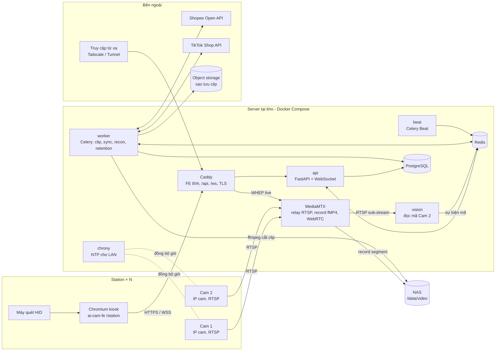
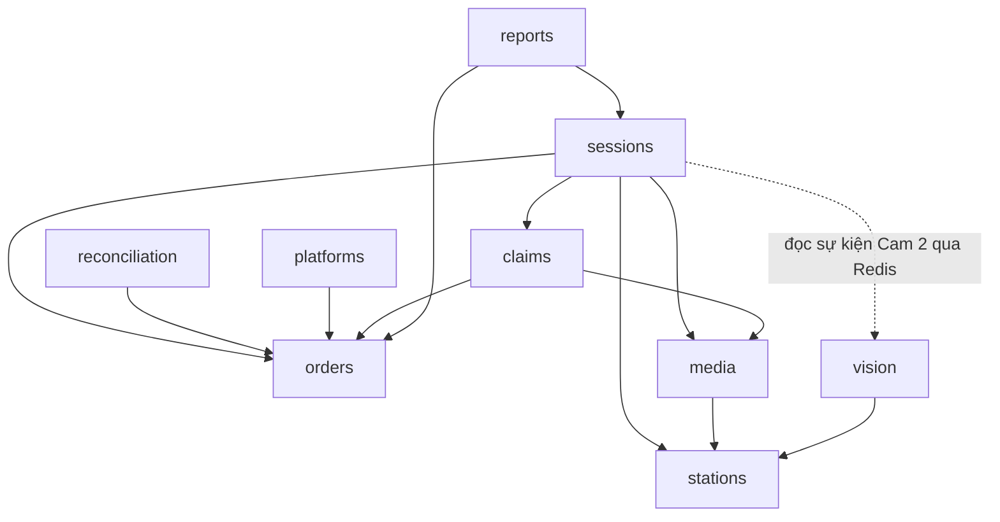
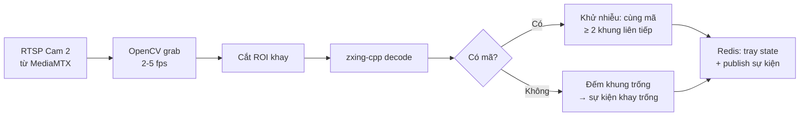
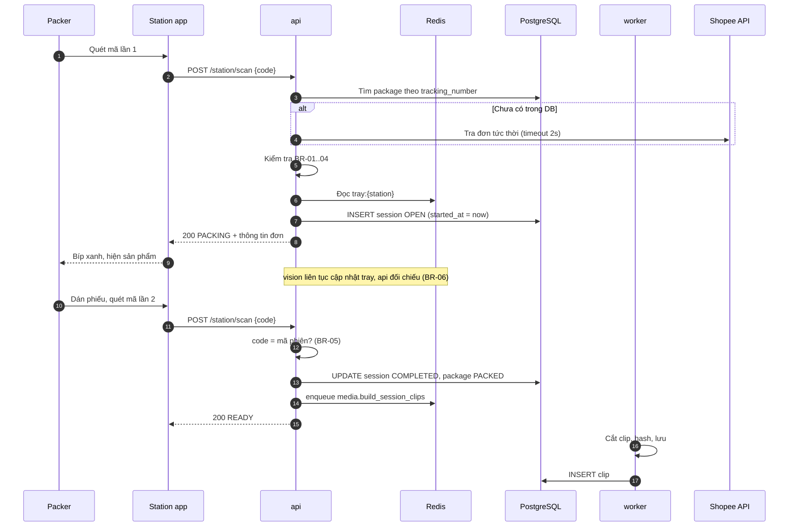

# Thiết kế tổng thể (High-level Design): Hệ thống X

| Thuộc tính | Giá trị |
| --- | --- |
| Phiên bản | 0.1 (bản nháp) |
| Ngày | 2026-10-04 |
| Owner | khanhtt (Architect) |
| Reviewer | khanhtt |
| Trạng thái | Approved — làm nền cho item 01 (G2 2026-10-04) |
| Đầu vào | [SRS.md](SRS.md) · ADR: [decisions/](decisions/) · áp dụng: [02-tech-spec item 01](../items/01-packing-mvp/02-tech-spec.md) |
| Repo | `ai-cam-be` (backend + worker), `ai-cam-fe` (station app + dashboard), repo gốc chứa tài liệu |
| Last update | 2026-10-05 (§14.2 theo compose production T-19, DEC-135 / DEC-136 item 01; §12 `unless-stopped`) |

> **TL;DR** — Modular monolith Python 3.12 / FastAPI (tiến trình `api`, `worker`, `beat`, `vision`) + MediaMTX + PostgreSQL 16 + Redis 7 + Caddy, chạy tại kho bằng Docker Compose; FE một app React cho `/station` (Chromium kiosk) và `/admin`.
> Quyết định chính (ADR-001..008): on-premise, cloud chỉ sao lưu; ghi liên tục fMP4 segment 60 giây, cắt clip `-c copy`; logic phiên trong `api` để quét ≤ 1 giây; Cam 2 đọc mã bằng zxing-cpp; sàn qua adapter + polling; clip gốc bất biến + SHA-256.
> Rủi ro: Cam 2 đọc < 95% (spike S2), quyền / endpoint Shopee (S1), lệch giờ camera làm sai clip, đầy ổ NAS.

| Goals (theo nguyên tắc §1) | Non-goals |
| --- | --- |
| Mất Internet vẫn đóng gói, ghi hình (P1, NFR-09) | Chạy nghiệp vụ trên cloud — cloud chỉ sao lưu và truy cập từ xa |
| Không phụ thuộc phiên mở đúng lúc: ghi liên tục, cắt theo mốc (P2) | Bật/tắt ghi theo phiên |
| Đồng bộ giờ mọi máy và camera, lệch > 1 giây thì cảnh báo (P3) | — |
| Clip gốc không sửa được, có hash (P4) | Encode overlay cho mọi clip |
| Quét bằng máy quét, phản hồi ≤ 1 giây (P5, NFR-01) | Bàn phím / chuột trong phiên |
| Ít thành phần: một codebase BE, một FE, một file Compose (P6) | Microservice khi chưa có lý do đo được |
| Thêm sàn = thêm adapter (P7, NFR-28) | Lõi nghiệp vụ biết chi tiết từng sàn |

Hệ thống X là một **modular monolith Python (FastAPI)** cùng các tiến trình worker, chạy **tại kho** bằng Docker Compose. Bên cạnh đó có **MediaMTX** lo ghi hình và phát live từ camera, **PostgreSQL** lưu nghiệp vụ, **Redis** làm hàng đợi và pub/sub, và một **frontend React** phục vụ cả màn hình station lẫn dashboard. Cloud chỉ dùng để sao lưu clip và truy cập từ xa, không nằm trên đường đi của nghiệp vụ.

---

## Mục lục

1. [Nguyên tắc thiết kế](#1-nguyên-tắc-thiết-kế)
2. [Tech stack](#2-tech-stack)
3. [Kiến trúc tổng thể](#3-kiến-trúc-tổng-thể)
4. [Backend: cấu trúc và module](#4-backend-cấu-trúc-và-module)
5. [Frontend: cấu trúc](#5-frontend-cấu-trúc)
6. [Pipeline video](#6-pipeline-video)
7. [Luồng xử lý chính](#7-luồng-xử-lý-chính)
8. [Dữ liệu và lưu trữ](#8-dữ-liệu-và-lưu-trữ)
9. [API và realtime](#9-api-và-realtime)
10. [Tích hợp sàn TMĐT](#10-tích-hợp-sàn-tmđt)
11. [Bảo mật](#11-bảo-mật)
12. [Độ tin cậy và vận hành offline](#12-độ-tin-cậy-và-vận-hành-offline)
13. [Giám sát và log](#13-giám-sát-và-log)
14. [Triển khai, môi trường, CI/CD](#14-triển-khai-môi-trường-cicd)
15. [Quy ước phát triển](#15-quy-ước-phát-triển)
16. [Quyết định kiến trúc (ADR)](#16-quyết-định-kiến-trúc-adr)
17. [Việc cần làm rõ / spike kỹ thuật](#17-việc-cần-làm-rõ--spike-kỹ-thuật)

---

## 1. Nguyên tắc thiết kế

| # | Nguyên tắc | Hệ quả thiết kế |
| --- | --- | --- |
| P1 | **Kho là nơi chạy chính (on-premise first)** | Ghi hình, phiên, DB đều ở server tại kho. Mất Internet vẫn đóng gói được (NFR-09) |
| P2 | **Ghi liên tục, cắt theo mốc thời gian** | Phiên chỉ là cặp mốc `[started_at, ended_at]`. Video không phụ thuộc việc phiên mở đúng lúc |
| P3 | **Thời gian là khóa nối video với nghiệp vụ** | Mọi máy và camera đồng bộ NTP với server kho. Lệch giờ = clip sai |
| P4 | **Bằng chứng không sửa được** | Clip gốc cắt bằng stream copy (không encode lại), băm SHA-256, chỉ đọc. Bản xuất có overlay là bản dẫn xuất, có hash riêng |
| P5 | **Thao tác bằng máy quét, phản hồi tức thì** | Station nhận mã qua bàn phím HID, phản hồi qua WebSocket, âm thanh + màu nền |
| P6 | **Ít thành phần, dễ vận hành bởi đội nhỏ** | Một codebase backend, một codebase frontend, một file Compose. Tách service chỉ khi có lý do đo được |
| P7 | **Sàn là adapter** | Lõi nghiệp vụ không biết Shopee/TikTok. Thêm sàn = thêm adapter |

---

## 2. Tech stack

### 2.1 Bảng chốt

| Lớp | Lựa chọn | Phiên bản mục tiêu |
| --- | --- | --- |
| Ngôn ngữ backend | Python | 3.12 |
| Web framework | FastAPI + Uvicorn | FastAPI 0.11x |
| ORM / migration | SQLAlchemy 2 (async) + Alembic | |
| Validate / schema | Pydantic v2 | |
| Hàng đợi job + lịch | Celery + Celery Beat, broker Redis | Celery 5.x |
| Realtime | WebSocket của FastAPI + Redis pub/sub | |
| Database | PostgreSQL | 16 |
| Cache / broker / pub-sub | Redis | 7 |
| Ghi hình + relay + live view | MediaMTX (RTSP proxy, record fMP4, WebRTC/WHEP) | 1.x |
| Xử lý video | FFmpeg (CLI, gọi qua subprocess) | 6.x / 7.x |
| Đọc mã từ Cam 2 | OpenCV (lấy khung hình) + zxing-cpp (giải mã 1D/QR) | |
| HTTP client tới sàn | httpx (async) + tenacity (retry) | |
| Ngôn ngữ frontend | TypeScript | 5.x |
| Framework FE | React + Vite | React 19, Vite 8 (đang dùng trong `ai-cam-fe`, 2026-10-05) |
| Router | React Router | 7 |
| Data fetching | TanStack Query | 5 |
| State cục bộ station | Zustand | |
| UI kit | Tailwind CSS + component tự viết theo [design system](../../design-system/README.md) (Material 3) | Tailwind 4 |
| API client FE | Sinh từ OpenAPI bằng `orval` (hoặc `openapi-typescript`) | |
| Phát video | `<video>` gốc cho MP4; WebRTC (WHEP) cho live view | |
| Test BE | pytest, pytest-asyncio, testcontainers (Postgres) | |
| Test FE | Vitest + Testing Library, Playwright cho E2E station | |
| Lint / format | BE: ruff + mypy. FE: ESLint + Prettier | |
| Đóng gói / chạy | Docker + Docker Compose trên Ubuntu Server 24.04 LTS | |
| Reverse proxy | Caddy (TLS nội bộ, phục vụ FE tĩnh, proxy `/api`, `/ws`) | 2.x |
| Lưu video | NAS (NFS mount) RAID 1; sao lưu clip lên object storage S3-compatible | |
| Truy cập từ xa | Tailscale hoặc Cloudflare Tunnel (không mở port) | |
| Giám sát | Prometheus + Grafana (tùy chọn), Sentry (tùy chọn) | |

### 2.2 Lý do chọn và phương án đã cân nhắc

| Quyết định | Chọn | Lý do | Phương án khác và vì sao không chọn |
| --- | --- | --- | --- |
| Ngôn ngữ backend | **Python** | Hệ sinh thái video/vision tốt nhất (OpenCV, zxing-cpp, FFmpeg wrapper). Một ngôn ngữ cho cả API, worker, vision | Node.js (NestJS): API tốt nhưng phần vision phải gọi sang Python, thành 2 ngôn ngữ. Go: hiệu năng tốt nhưng thư viện vision kém, đội nhỏ khó tuyển |
| Kiểu kiến trúc | **Modular monolith** + nhiều tiến trình từ cùng codebase | Quy mô 1–4 station, đội 2–3 dev. Microservice tốn vận hành mà không có lợi ích | Microservice: quá sớm |
| Ghi hình | **MediaMTX** | Một binary làm 3 việc: proxy RTSP (camera chỉ bị kết nối 1 lần), ghi segment fMP4 liên tục, phát WebRTC cho dashboard. Ít code tự viết | Tự chạy FFmpeg từng camera: phải tự giám sát, tự làm live view. NVR thương mại: phụ thuộc hãng, API đóng. Frigate: thiên về phát hiện chuyển động, không hợp nghiệp vụ |
| Job queue | **Celery + Redis** | Trưởng thành, có Beat cho job định kỳ (đồng bộ sàn, đối soát, dọn video), retry sẵn | arq / Dramatiq: nhẹ hơn nhưng hệ sinh thái nhỏ. APScheduler: không có hàng đợi phân tán |
| Database | **PostgreSQL** | Quan hệ rõ (đơn, kiện, phiên, clip), JSONB lưu payload sàn, index tốt | MySQL: được nhưng JSONB và partial index kém hơn. MongoDB: dữ liệu có quan hệ chặt, không hợp |
| Frontend | **React + Vite + Tailwind + design system MD3** | Dùng lại design system đã có (token, component, giọng văn), một phong cách với dự án khác của đội. Vite build ra file tĩnh, chạy offline trong LAN | Ant Design: nhanh có bảng/form nhưng lệch MD3 (user chốt 2026-10-04). Next.js: SSR không cần khi chạy LAN. Vue: chọn React vì nguồn tuyển dễ hơn |
| Một hay hai app FE | **Một app**, hai khu vực `/station` và `/admin` | Chung auth, API client, component. Station chỉ là layout kiosk riêng | Hai app riêng: trùng lặp code |
| Station runtime | **Trình duyệt Chromium chế độ kiosk** | Không cần cài app, cập nhật bằng cách deploy FE. Máy quét HID hoạt động như bàn phím | Electron: chỉ cần khi phải điều khiển thiết bị sâu hơn (máy in, cổng COM) |
| Đọc mã Cam 2 | **zxing-cpp** | Đọc cả 1D và QR, nhanh hơn pyzbar, có binding Python chính thức | pyzbar: không đọc tốt mã xoay. Mô hình AI: để giai đoạn sau |

---

## 3. Kiến trúc tổng thể

### 3.1 Sơ đồ thành phần



### 3.2 Các tiến trình

| Tiến trình | Nguồn code | Nhiệm vụ | Số bản |
| --- | --- | --- | --- |
| `api` | ai-cam-be | REST API, WebSocket cho station, logic phiên (đồng bộ, cần độ trễ thấp) | 1 (2 nếu cần) |
| `worker` | ai-cam-be | Job nền: cắt clip, băm, overlay khi xuất, đồng bộ sàn, đối soát, dọn video, sao lưu | 1–2, queue tách `video` và `default` |
| `beat` | ai-cam-be | Hẹn giờ job định kỳ | 1 |
| `vision` | ai-cam-be | Mỗi Cam 2 một luồng: lấy 2–5 khung hình/giây từ MediaMTX, cắt ROI, giải mã, phát sự kiện lên Redis | 1 tiến trình, N luồng |
| `mediamtx` | image chính thức | Relay, ghi hình, live view | 1 |
| `postgres`, `redis`, `caddy` | image chính thức | Hạ tầng | 1 |

Vì sao logic phiên nằm trong `api` chứ không ở worker: quét mã phải phản hồi ≤ 1 giây (NFR-01). Thao tác mở/đóng phiên chỉ là ghi DB và đọc trạng thái Cam 2 từ Redis. Việc nặng (cắt clip) được đẩy sang worker.

### 3.3 Sơ đồ triển khai mạng

| Vùng mạng | Thiết bị | Ghi chú |
| --- | --- | --- |
| VLAN camera | Cam 1, Cam 2 các station | Không ra Internet. Chỉ server kho truy cập được |
| VLAN nghiệp vụ | Server kho, NAS, máy trạm station, máy văn phòng | Station truy cập `https://x.local` |
| Internet | Server kho (outbound) | Gọi API sàn, sao lưu S3, tunnel truy cập từ xa. Không mở port inbound |

---

## 4. Backend: cấu trúc và module

### 4.1 Cấu trúc thư mục `ai-cam-be`

```
ai-cam-be/
├── pyproject.toml            # uv / poetry, ruff, mypy, pytest config
├── alembic/                  # migration
├── docker/
│   ├── Dockerfile            # một image, nhiều entrypoint
│   ├── compose.yml           # stack đầy đủ cho kho
│   ├── compose.dev.yml
│   └── mediamtx.yml
├── src/aicam/
│   ├── main.py               # FastAPI app factory
│   ├── settings.py           # pydantic-settings, đọc env
│   ├── core/                 # db session, redis, auth, clock, errors, logging
│   ├── modules/
│   │   ├── stations/         # station, camera, ROI, health
│   │   ├── orders/           # shop, order, package, item, trạng thái kho
│   │   ├── sessions/         # phiên đóng gói + mở hoàn, state machine, rules BR-01..07
│   │   ├── media/            # segment index, clip, export, retention, backup
│   │   ├── vision/           # vòng lặp đọc mã Cam 2 (chạy trong tiến trình vision)
│   │   ├── platforms/        # adapter Shopee, TikTok; interface chung
│   │   ├── returns/          # hồ sơ hàng hoàn, tra mã kiện hoàn — item 02 DEC-218
│   │   ├── reconciliation/   # quy tắc BR-10..14, 19, 20, cảnh báo
│   │   ├── approvals/        # yêu cầu duyệt từ station (lệch mã, đóng gói lại) — item 01 DEC-8
│   │   ├── imports/          # nhập đơn từ CSV/Excel — item 01 DEC-8
│   │   ├── claims/           # hồ sơ khiếu nại
│   │   ├── reports/
│   │   └── users/            # user, role, audit log
│   ├── realtime/             # WebSocket hub, kênh Redis
│   ├── workers/              # celery app, đăng ký task, lịch beat
│   └── entrypoints/          # api.py, worker.py, beat.py, vision.py
└── tests/
```

Mỗi module có cùng bố cục: `models.py` (SQLAlchemy), `schemas.py` (Pydantic), `service.py` (nghiệp vụ), `router.py` (FastAPI), `tasks.py` (Celery, nếu có). Module khác chỉ gọi nhau qua `service`, không đọc chéo bảng.

### 4.2 Phụ thuộc giữa module



### 4.3 Máy trạng thái phiên

Phiên (`sessions`) có state machine riêng, tách khỏi trạng thái kho của kiện (`orders`). Khi phiên chuyển trạng thái, service phiên gọi `orders.service` để chuyển trạng thái kiện theo SRS mục 7.1.

| Trạng thái phiên | Ý nghĩa |
| --- | --- |
| `OPEN` | Đang làm |
| `MISMATCH` | Quét đóng hoặc Cam 2 thấy mã khác, chờ sửa |
| `COMPLETED` | Đóng hợp lệ |
| `CANCELLED` | Nhân viên hủy có lý do |
| `ABANDONED` | Quá thời gian, hệ thống tự đóng |
| `SUPERSEDED` | Bị thay thế bởi phiên đóng gói lại |

Ràng buộc "mỗi station tối đa một phiên mở" (BR-02) được đảm bảo ở DB bằng partial unique index `UNIQUE (station_id) WHERE status IN ('OPEN','MISMATCH')`, không chỉ ở code.

---

## 5. Frontend: cấu trúc

### 5.1 Cấu trúc thư mục `ai-cam-fe`

```
ai-cam-fe/
├── package.json              # pnpm
├── vite.config.ts
├── orval.config.ts           # sinh API client từ /openapi.json của BE
├── src/
│   ├── main.tsx
│   ├── app/                  # router, providers (QueryClient, theme)
│   ├── design/               # tokens.css (sinh từ docs/design-system/tokens.json), system.css
│   ├── api/                  # code sinh tự động + interceptor auth
│   ├── shared/               # ui/ (Button, StatusChip, Dialog… theo design system), hooks, utils
│   ├── features/
│   │   ├── station/          # layout kiosk, scanner listener, WS client, âm thanh, các màn trạng thái
│   │   ├── orders/           # tra cứu, chi tiết đơn, timeline, trình phát clip
│   │   ├── returns/          # hàng hoàn đang về
│   │   ├── reconciliation/   # bảng lệch trạng thái
│   │   ├── claims/
│   │   ├── liveview/         # lưới camera WebRTC
│   │   ├── reports/
│   │   └── settings/         # station, camera, ROI, kết nối sàn, user
│   └── assets/sounds/        # ok.mp3, error.mp3, warn.mp3
└── tests/
```

### 5.2 Station app

| Vấn đề | Cách làm |
| --- | --- |
| Nhận mã từ máy quét | Máy quét cấu hình hậu tố Enter. Listener toàn cục gom ký tự đến trong khoảng < 50 ms/ký tự, kết thúc bằng Enter, thì coi là một lần quét (phân biệt với gõ tay) |
| Gửi lệnh | `POST /api/v1/station/scan` với `{code, scanned_at}`. Server quyết định mở hay đóng phiên, FE không tự suy luận |
| Nhận cập nhật | WebSocket `/ws/station/{id}`: trạng thái phiên, mã Cam 2 đọc được, cảnh báo camera |
| Trạng thái màn hình | Một state machine ở FE (Zustand) phản chiếu trạng thái server: `READY`, `PACKING`, `RETURN_INSPECTING`, `MISMATCH`, `WARNING`, `OFFLINE` |
| Mất kết nối tới server | Hiện nền đỏ "Mất kết nối server", chặn quét. (Mất Internet thì không ảnh hưởng vì server ở LAN) |
| Kiosk | Chromium `--kiosk`; đăng nhập một lần bằng tài khoản chung của station (refresh 30 ngày trượt), không có đăng nhập nhân viên (item 01 DEC-2, DEC-55) |

### 5.3 Dashboard

- SPA, gọi REST qua TanStack Query, phân quyền theo role trong JWT (ẩn menu + server vẫn kiểm tra).
- Trình phát clip: `<video>` với URL có chữ ký thời hạn ngắn (`/api/v1/clips/{id}/stream?sig=...`), hỗ trợ HTTP Range để tua.
- Live view: WebRTC WHEP từ MediaMTX qua Caddy; Caddy hỏi quyền `/api/v1/live` (`forward_auth`) trước khi chuyển, luồng video không qua backend (§14.2).

---

## 6. Pipeline video

### 6.1 Ghi hình

- Mỗi camera có 2 luồng: **main stream** (1080p–4MP) để ghi, **sub-stream** (480p–720p) cho live view và cho `vision` khi đủ để đọc mã. Nếu sub-stream không đủ nét để đọc mã trên Cam 2 thì `vision` đọc main stream (xác định trong spike S2).
- MediaMTX kéo RTSP từ camera một lần, ghi **fMP4 segment 60 giây** vào `/data/video/raw/{camera_id}/YYYY/MM/DD/HH-MM-SS.mp4`, không encode lại.
- Bật **OSD thời gian của camera** (chữ ngày giờ in sẵn vào hình) làm lớp bằng chứng thứ hai, độc lập với phần mềm.
- Worker `media.index_segments` (chạy mỗi phút) ghi bảng `video_segment(camera_id, start_at, end_at, path)` để tra nhanh segment theo khoảng thời gian.

### 6.2 Cắt clip phiên

Khi phiên đóng, `api` đẩy job `media.build_session_clips(session_id)`:

1. Lấy khoảng `[started_at − 5s, ended_at + 5s]`.
2. Với từng camera của station: tìm các segment giao với khoảng đó.
3. Ghép và cắt bằng FFmpeg concat demuxer, **`-c copy`** (không encode lại, nhanh, giữ nguyên chất lượng). Cắt theo keyframe nên clip có thể dài hơn 1–2 giây so với khoảng yêu cầu, chấp nhận được.
4. Ghi vào `/data/video/clips/YYYY/MM/DD/{session_id}_{cam}.mp4`, đặt quyền chỉ đọc.
5. Tính SHA-256, lưu bảng `clip`.
6. Nếu một phần khoảng thời gian thiếu segment (camera mất tín hiệu), gắn cờ `video_incomplete`.
7. Đẩy job sao lưu lên S3 (queue thấp ưu tiên).

Nếu phiên đóng khi segment hiện tại chưa ghi xong, job tự hẹn lại sau khi segment kết thúc (tối đa 60 giây, khớp NFR-03).

### 6.3 Xuất bằng chứng

`media.export_clip` tạo bản dẫn xuất, **encode lại H.264** với overlay `drawtext`: mã vận đơn, mã đơn sàn, station và thời gian chạy theo mốc thực (không có tên nhân viên — station dùng tài khoản chung, item 01 DEC-2). Tùy chọn ghép Cam 1 + Cam 2 cạnh nhau (`hstack`). Kết quả kèm file `.json` thông tin (hash clip gốc, hash bản xuất, thời gian, người xuất). Clip gốc không bao giờ bị sửa.

### 6.4 Vision Cam 2



- Trạng thái khay lưu trong Redis key `tray:{station_id}` = `{codes: [...], updated_at}`, TTL ngắn.
- Sự kiện publish lên kênh `station:{id}:events`: `TRAY_CODE_SEEN`, `TRAY_EMPTY`, `TRAY_MULTIPLE_CODES`, `CAMERA_DOWN`.
- `api` đăng ký kênh này: nếu có phiên mở và mã trên khay khác mã phiên thì chuyển `MISMATCH` (BR-06) và đẩy xuống station qua WebSocket.

---

## 7. Luồng xử lý chính

### 7.1 Phiên đóng gói



### 7.2 Phiên mở hoàn

Giống 7.1, khác ở:

- Lệnh quét lần 1 tìm đơn gốc theo mã gốc / mã chiều về / mã đơn sàn.
- Trả về thêm: sản phẩm đã gửi, return request, link clip đóng gói gốc.
- `POST /station/sessions/{id}/inspection` lưu kết luận trước khi quét đóng (BR-07).
- Đóng phiên với kết luận khác `OK` thì `claims.service.create_from_return()` (BR-08).

### 7.3 Đồng bộ sàn và đối soát

| Job | Lịch (đề xuất) | Việc |
| --- | --- | --- |
| `platforms.sync_orders` | 5 phút / shop | Lấy đơn cập nhật từ lần chạy trước (theo `update_time`), upsert order/package/item |
| `platforms.sync_shipping_status` | 15 phút | Cập nhật trạng thái vận chuyển các kiện chưa ở trạng thái cuối |
| `platforms.sync_returns` | 15 phút | Lấy return request mới / thay đổi, chuyển kiện sang `RETURN_EXPECTED` |
| `platforms.refresh_tokens` | 1 giờ | Làm mới token sắp hết hạn |
| `reconciliation.run_rules` | 30 phút | Chạy BR-10..14, tạo / tự đóng cảnh báo |
| `media.index_segments` | 1 phút | Lập chỉ mục segment mới |
| `media.enforce_retention` | Hằng ngày 02:00 | Xóa video thô / clip quá hạn (trừ clip gắn khiếu nại mở) |
| `media.backup_pending` | 10 phút | Đẩy clip chưa sao lưu lên S3 |
| `stations.check_health` | 10 giây | Kiểm tra camera qua API MediaMTX, phát cảnh báo |

Nếu sàn hỗ trợ push/webhook thì endpoint `POST /api/v1/webhooks/{platform}` nhận sự kiện và đẩy job đồng bộ một đơn. Webhook cần được truy cập từ Internet, nên chỉ bật khi đã có tunnel; polling luôn là phương án nền.

---

## 8. Dữ liệu và lưu trữ

### 8.1 Database

- Mô hình thực thể theo SRS mục 10, thêm bảng `video_segment` (mục 6.1).
- Khóa chính UUID v7 (sắp xếp theo thời gian, an toàn khi đồng bộ sau này).
- Thời gian lưu `timestamptz` UTC, hiển thị theo `Asia/Ho_Chi_Minh`.
- Index chính:

| Bảng | Index | Phục vụ |
| --- | --- | --- |
| `package` | `UNIQUE (tracking_number)`, `(warehouse_status)` | Quét mã, danh sách theo trạng thái |
| `order` | `UNIQUE (shop_id, platform_order_sn)` | Upsert khi đồng bộ |
| `session` | partial unique `(station_id) WHERE status IN ('OPEN','MISMATCH')`, `(package_id)`, `(started_at)` | BR-02, tra cứu |
| `video_segment` | `(camera_id, start_at)` | Tìm segment theo khoảng thời gian |
| `clip` | `(session_id)`, `(retention_until)` | Phát clip, dọn dữ liệu |
| `recon_alert` | partial `(package_id, rule_code) WHERE status = 'OPEN'` unique | Không sinh cảnh báo trùng |
| `audit_log` | `(object_type, object_id)`, `(at)` | Tra cứu nhật ký |

- `audit_log` chỉ cho INSERT (quyền DB của user ứng dụng không có UPDATE/DELETE trên bảng này).
- Payload gốc từ sàn lưu cột `raw_payload jsonb`.

### 8.2 Lưu trữ file

```
/data/video/
├── raw/cam-{camera_id}/YYYY/MM/DD/HH-MM-SS-ffffff.mp4   # MediaMTX ghi (giờ UTC), giữ 30 ngày (dev: 1 giờ)
├── clips/YYYY/MM/DD/{session_id}-{CAM1|CAM2}.mp4       # clip gốc, chỉ đọc, giữ 90 ngày (cấu hình được), "giữ" thì không xóa
├── exports/{export_id}/video.mp4|info.json             # bản xuất, giữ 24 giờ (DEC-58 item 01)
└── snapshots/YYYY/MM/DD/{session_id}_{n}.jpg           # ảnh chụp phiên hoàn (Phase 2)
```

- DB chỉ lưu đường dẫn tương đối, gốc `/data/video` cấu hình qua env.
- Bản xuất chỉ giữ 24 giờ: tạo lại được bất cứ lúc nào khi clip gốc còn; người dùng tải về máy ngay (DEC-58 trong [02-tech-spec item 01](../items/01-packing-mvp/02-tech-spec.md), 2026-10-05 — trước đó ghi 30 ngày).
- Backup DB: `pg_dump` hằng ngày lên NAS + S3, giữ 30 bản.

### 8.3 Ước tính dung lượng

Theo SRS mục 8.3: khoảng 18 GB/station/ngày cho video thô. Với 2 station, giữ thô 30 ngày + clip 180 ngày cần khoảng 4–6 TB. Đề xuất NAS 2 × 8 TB RAID 1.

---

## 9. API và realtime

### 9.1 Quy ước

- REST, tiền tố `/api/v1`, JSON, tên trường `snake_case`.
- OpenAPI sinh tự động từ FastAPI, FE sinh client từ đó. Đổi API = đổi OpenAPI = FE build lỗi nếu chưa cập nhật.
- Lỗi theo dạng `{"error": {"code": "ORDER_CANCELLED", "message": "...", "details": {...}}}`. Station dựa vào `code` để chọn âm thanh và màn hình.
- Phân trang `?page=&page_size=`, lọc bằng query param.

### 9.2 Nhóm endpoint chính

| Nhóm | Endpoint | Ghi chú |
| --- | --- | --- |
| Auth | `POST /auth/login`, `POST /auth/refresh`, `POST /auth/station-login` (PIN/thẻ) | JWT |
| Station | `POST /station/scan`, `POST /station/sessions/{id}/cancel`, `POST /station/sessions/{id}/inspection`, `POST /station/sessions/{id}/snapshot`, `POST /station/sessions/{id}/supervisor-override` | Dùng bởi kiosk |
| Đơn | `GET /orders?q=`, `GET /orders/{id}`, `GET /packages/{tracking_number}`, `GET /packages/{id}/timeline` | |
| Phiên / clip | `GET /sessions?…`, `GET /sessions/{id}`, `GET /clips/{id}/stream`, `POST /clips/{id}/exports`, `GET /exports/{id}/download` | Stream hỗ trợ Range |
| Hàng hoàn | `GET /returns/expected`, `GET /returns/received` | |
| Đối soát | `GET /recon-alerts`, `POST /recon-alerts/{id}/resolve` | |
| Khiếu nại | `GET/POST /claims`, `PATCH /claims/{id}` | |
| Cấu hình | `CRUD /stations`, `CRUD /cameras`, `PUT /cameras/{id}/roi`, `GET /platforms/shopee/auth-url`, `GET /platforms/shopee/callback`, `CRUD /users` | Admin |
| Hệ thống | `GET /health`, `GET /metrics` | |

### 9.3 WebSocket

`/ws/station/{station_id}` (xác thực bằng device token + user token):

| Sự kiện server → client | Dữ liệu |
| --- | --- |
| `session.updated` | Trạng thái phiên, đơn, thông báo |
| `tray.updated` | Mã Cam 2 đang thấy, khớp / không khớp |
| `camera.status` | Cam 1 / Cam 2 online / offline |
| `alert` | Cảnh báo (phiên quá giờ, ổ đầy...) |

`/ws/dashboard` cho dashboard: số liệu trong ngày, cảnh báo mới, trạng thái station. Mọi sự kiện đi qua Redis pub/sub để nhiều bản `api` vẫn nhận đủ.

---

## 10. Tích hợp sàn TMĐT

### 10.1 Interface adapter

```python
class PlatformAdapter(Protocol):
    code: str  # "SHOPEE", "TIKTOK"
    async def build_auth_url(self, redirect_uri: str) -> str: ...
    async def exchange_code(self, code: str, **kw) -> ShopCredentials: ...
    async def refresh(self, creds: ShopCredentials) -> ShopCredentials: ...
    async def list_updated_orders(self, creds, since: datetime) -> AsyncIterator[PlatformOrder]: ...
    async def get_order(self, creds, order_sn: str) -> PlatformOrder: ...
    async def find_by_tracking(self, creds, tracking_number: str) -> PlatformOrder | None: ...
    async def get_shipping_status(self, creds, order_sn: str) -> ShippingStatus: ...
    async def list_returns(self, creds, since: datetime) -> AsyncIterator[PlatformReturn]: ...
    def map_status(self, raw: str) -> WarehouseStatusHint: ...
```

- Mỗi adapter tự lo ký request, rate limit, phân trang, và chuyển dữ liệu về model chung `PlatformOrder`, `PlatformReturn`.
- Lõi nghiệp vụ chỉ dùng model chung. Bảng ánh xạ trạng thái (SRS 7.2) nằm trong `map_status` của từng adapter.
- Shopee Open Platform v2 ký request bằng HMAC-SHA256 trên `partner_id + path + timestamp (+ access_token + shop_id)`; chi tiết endpoint xác minh ở spike S1.

### 10.2 Xử lý lỗi

| Tình huống | Cách xử lý |
| --- | --- |
| Lỗi mạng / 5xx | tenacity retry giãn cách mũ, tối đa 5 lần, rồi ghi lỗi |
| Rate limit | Token bucket theo shop trong Redis, tôn trọng header / mã lỗi giới hạn |
| Token hết hạn | Refresh một lần rồi thử lại, thất bại thì cảnh báo Admin kết nối lại |
| Tra cứu tức thời khi quét | Timeout cứng 2 giây; quá hạn thì mở phiên chế độ "chưa xác minh" (EX-P3) |

---

## 11. Bảo mật

| Chủ đề | Thiết kế |
| --- | --- |
| Xác thực web | JWT access (15 phút) + refresh (7 ngày, lưu cookie httpOnly, xoay vòng) |
| Xác thực station | Một tài khoản chung cho mỗi station do Admin cấp (item 01 DEC-2); JWT access 15 phút + refresh cookie `rt_station` 30 ngày trượt; Admin thu hồi được (hiệu lực ≤ 15 phút, DEC-55). Người đóng gói nhận diện qua video Cam 1 |
| Phân quyền | RBAC theo ma trận SRS 5.11, kiểm tra bằng dependency FastAPI ở từng router |
| Mật khẩu / PIN | Argon2id |
| Bí mật | Token sàn mã hóa bằng Fernet, khóa trong env / Docker secret. Không commit `.env` |
| Truy cập video | URL ký HMAC, hết hạn 10 phút; mọi xem / xuất ghi `audit_log` |
| Mạng | Camera ở VLAN riêng; chỉ Caddy mở cổng 443 trong LAN; truy cập từ xa qua Tailscale / Tunnel |
| Dữ liệu cá nhân | API trả SĐT / địa chỉ người mua đã che với role không cần; thời hạn lưu theo chính sách (NĐ 13/2023) |
| Đầu vào từ máy quét | Validate định dạng mã (độ dài, ký tự cho phép) trước khi xử lý |

---

## 12. Độ tin cậy và vận hành offline

| Sự cố | Ảnh hưởng | Thiết kế |
| --- | --- | --- |
| Mất Internet | Không đồng bộ được với sàn | Quét, phiên, ghi hình vẫn chạy trên LAN. Đơn chưa có thì mở chế độ "chưa xác minh". Job đồng bộ chạy lại khi có mạng |
| Camera mất tín hiệu | Thiếu video | MediaMTX tự kết nối lại; `check_health` cảnh báo ≤ 10s; clip gắn cờ `video_incomplete` |
| `api` crash | Station không quét được | Docker `restart: unless-stopped` (DEC-135 item 01: vẫn tự lên sau crash / khởi động lại máy, `docker compose stop` khi bảo trì có hiệu lực); phiên đang mở lưu trong DB nên khôi phục nguyên trạng |
| `worker` crash | Clip chậm có | Job nằm trong Redis (acks late), chạy lại khi worker lên. Job cắt clip idempotent theo `session_id` |
| `vision` crash | Không có kiểm tra Cam 2 | Phiên vẫn chạy, gắn cờ `cam2_unverified` (EX-P6) |
| Mất điện | Toàn bộ | UPS ≥ 15 phút, NUT tắt máy an toàn; MediaMTX ghi fMP4 nên segment dở vẫn đọc được |
| Ổ đầy | Ngừng ghi | Cảnh báo 80%, 90%; retention tự xóa video thô cũ nhất trước |
| Lệch giờ | Clip sai khoảng | chrony trên server làm NTP cho camera và station; `check_health` so giờ camera, lệch > 1s thì cảnh báo |

---

## 13. Giám sát và log

- Log JSON (structlog) có `request_id`, `station_id`, `session_id`, `tracking_number`, gom bằng Docker logging driver; giai đoạn sau đẩy lên Loki nếu cần.
- Metric Prometheus từ `api` và worker: độ trễ `/station/scan`, số phiên theo trạng thái, độ dài hàng đợi, thời gian cắt clip, lỗi gọi sàn, dung lượng ổ, camera online.
- Trang **Sức khỏe hệ thống** trên dashboard đọc `/health`: DB, Redis, MediaMTX, từng camera, ổ đĩa, lần đồng bộ sàn gần nhất.
- Sentry (tùy chọn) cho lỗi BE và FE.

---

## 14. Triển khai, môi trường, CI/CD

### 14.1 Môi trường

| Môi trường | Nơi chạy | Camera | Sàn |
| --- | --- | --- | --- |
| `local` | Máy dev, `compose.dev.yml` | Camera giả: MediaMTX phát file mẫu có barcode qua RTSP | Mock adapter / Shopee sandbox |
| `staging` | Một mini PC thử tại kho hoặc VPS | 1 bộ camera thật | Shopee sandbox |
| `production` | Server tại kho | Camera thật | Shopee live |

### 14.2 Đóng gói và triển khai

- `ai-cam-be` build **một image** dùng cho `api`, `worker`, `beat`, `vision` (khác lệnh khởi động). Image có sẵn FFmpeg.
- `ai-cam-fe` build ra file tĩnh, đóng vào image Caddy hoặc mount vào Caddy. MVP: mount `ai-cam-fe/dist` (`FE_DIST_DIR`), chưa đóng image.
- [`ai-cam-be/docker/compose.yml`](../../../ai-cam-be/docker/compose.yml) là nguồn chuẩn của stack kho; vận hành (cài đặt, cert, sao lưu / khôi phục, nâng cấp, sự cố) theo [`ai-cam-be/docs/ops.md`](../../../ai-cam-be/docs/ops.md).
- Cập nhật tại kho: build / pull image rồi `docker compose up -d`; service `migrate` chạy `alembic upgrade head` xong mới tới `api`.

Chốt khi làm T-19 (item 01 DEC-135..137 trong [02a](../items/01-packing-mvp/02a-be-spec.md#decisions)):

| Điểm | Quyết định | Khác mô tả trước |
| --- | --- | --- |
| HTTPS | Caddy `tls internal` theo `SITE_ADDRESS`; máy station / dashboard cài root cert của Caddy (cookie refresh `Secure`) | Ghi rõ CA nội bộ |
| Khởi động lại | `restart: unless-stopped` | Thay `always` (§12) |
| Cổng mở ra LAN | 80 (→ 308 HTTPS), 443, ICE 8189 UDP + TCP; api, postgres, redis, API MediaMTX không publish | — |
| Proxy tin cậy | Caddy IP tĩnh (`CADDY_IP`) = `FORWARDED_ALLOW_IPS` của `api` | Mới |
| Live view | `/live/*` qua Caddy `forward_auth` → `/api/v1/live` (chỉ ADMIN / SUPERVISOR), chỉ path WHEP | §5.3 ghi "không qua backend": video vẫn đi thẳng MediaMTX, chỉ bước xác thực qua backend |
| Sao lưu | Service `backup`: `pg_dump -Fc` + file nhập, 01:00 giờ VN, giữ 14 ngày | Mới |
| Image | BE build tại chỗ (`AICAM_IMAGE`); CI đẩy GHCR (§14.3) chưa làm | §14.3 chưa có |

### 14.3 CI (GitHub Actions)

| Repo | Pipeline |
| --- | --- |
| ai-cam-be | ruff, mypy, pytest (Postgres + Redis bằng service container), build image, push GHCR khi tag |
| ai-cam-fe | eslint, tsc, vitest, build, kiểm tra client sinh từ OpenAPI không lệch, push image khi tag |

Phiên bản theo SemVer, BE và FE gắn tag độc lập; `compose.yml` ghim cặp phiên bản tương thích.

---

## 15. Quy ước phát triển

| Chủ đề | Quy ước |
| --- | --- |
| Nhánh | `main` luôn deploy được; nhánh `feat/…`, `fix/…`, `chore/…`; PR bắt buộc review |
| Commit | Conventional Commits (`feat:`, `fix:`, `chore:`…) |
| Quản lý gói | BE: `uv`. FE: `pnpm` |
| Cấu hình | Biến môi trường, có `.env.example` trong mỗi repo |
| Ngôn ngữ | Code và tên định danh tiếng Anh; chuỗi giao diện tiếng Việt; tài liệu tiếng Việt |
| Thời gian | Lưu UTC, hiển thị giờ Việt Nam; lấy giờ qua `core.clock` để test được |
| Test bắt buộc | State machine phiên, rules BR-01..15, adapter (với payload mẫu), cắt clip (với segment mẫu) |

---

## 16. Quyết định kiến trúc (ADR)

| ID | Quyết định | Trạng thái |
| --- | --- | --- |
| ADR-001 | Chạy on-premise tại kho, cloud chỉ để sao lưu / truy cập từ xa | Accepted (2026-10-04, qua G2 item 01) |
| ADR-002 | Modular monolith Python (FastAPI), một image nhiều tiến trình | Accepted (2026-10-04, qua G2 item 01) |
| ADR-003 | Ghi liên tục bằng MediaMTX, cắt clip theo mốc thời gian bằng FFmpeg stream copy | Accepted (2026-10-04, qua G2 item 01) |
| ADR-004 | Logic phiên đồng bộ trong `api`, việc nặng qua Celery | Accepted (2026-10-04, qua G2 item 01) |
| ADR-005 | Cam 2 đọc mã bằng OpenCV + zxing-cpp, không chặn quy trình khi đọc thất bại | Accepted (2026-10-04, qua G2 item 01) |
| ADR-006 | Một app React cho cả station và dashboard, station chạy Chromium kiosk | Accepted (2026-10-04, qua G2 item 01) |
| ADR-007 | Sàn tích hợp qua adapter, polling là nền, webhook là bổ sung | Accepted (2026-10-04, qua G2 item 01) |
| ADR-008 | Clip gốc bất biến + SHA-256; overlay chỉ trên bản xuất; bật OSD thời gian của camera | Accepted (2026-10-04, qua G2 item 01) |
| ADR-009 | Bằng chứng giữ theo hồ sơ khiếu nại chưa đóng, thay cờ "giữ clip" | Proposed (2026-10-05, item 02) |

Mỗi ADR có file riêng trong [decisions/](decisions/).

---

## 17. Việc cần làm rõ / spike kỹ thuật

| ID | Spike | Câu hỏi cần trả lời | Ước lượng |
| --- | --- | --- | --- |
| S1 | Shopee Open Platform | Đăng ký, quyền được cấp, endpoint chính xác cho đơn / tracking / return, có push không, rate limit | 3–5 ngày (phụ thuộc thời gian duyệt) |
| S2 | Cam 2 đọc mã | Camera, độ cao, ánh sáng nào cho tỷ lệ đọc ≥ 95%? Sub-stream có đủ không? CPU cần bao nhiêu cho N camera | 3 ngày, cần 1 camera thật |
| S3 | MediaMTX ghi + cắt | Độ trễ từ lúc đóng phiên tới khi có clip, độ chính xác mốc thời gian, hành vi khi camera rớt | 2 ngày |
| S4 | Mã trên kiện hoàn | Kiện hoàn mang mã gốc hay mã mới? Tìm đơn gốc bằng cách nào (SRS Q6) | 1 ngày, cần mẫu thực tế |
| S5 | Máy quét HID trong kiosk | Phân biệt quét và gõ tay, ký tự đặc biệt, bố cục bàn phím | 0,5 ngày |

Kết quả spike cập nhật lại tài liệu này và các ADR trước khi bắt đầu giai đoạn 1 (SRS mục 13.2).
