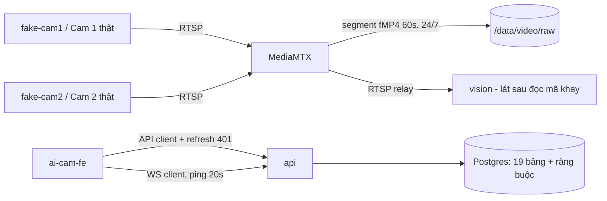

# Lát 0 — Nền móng (M0) — Giải thích nghiệp vụ

| Trường | Giá trị |
|---|---|
| Item / lát | `01-packing-mvp` · lát 0 (milestone M0 Nền móng, [03-plan §4](../../ai/items/01-packing-mvp/03-plan.md)) |
| Yêu cầu | FR-02.01 (ghi hình liên tục), FR-10.03 (audit không sửa được), BR-02 (ràng buộc ở DB), NFR-09 (chạy khi mất Internet) — [01-srs](../../ai/items/01-packing-mvp/01-srs.md) |
| Task | T-1, T-2, T-6 (BE) · T-30, T-31, T-32, T-39, T-33 (FE) |
| Code | Commit BE `9efb3b2`, FE `73c46f8`, docs `4663d1c` (nhánh `feat/01-packing-mvp`) |
| Người đọc | Dev mới vào dự án, reviewer, QA |
| Tác giả | khanhtt (agent soạn) |
| Reviewer | PO (đúng nghiệp vụ) · Tech lead (đúng code) |
| Trạng thái | Draft |
| Last update | 2026-10-05 · Dev (thêm §0 theo template mới) |

## TL;DR

- Lát này chưa có tính năng nào người dùng bấm được. Nó dựng **những thứ mà mọi quy tắc nghiệp vụ về sau dựa vào**: camera ghi hình liên tục, cơ sở dữ liệu tự chặn dữ liệu sai, đồng hồ giả để test quy tắc theo giờ, bộ UI có màu mang nghĩa nghiệp vụ, và API client biết tự đăng nhập lại.
- Ý chính: **bằng chứng video không được phụ thuộc vào phần mềm chạy đúng**. Camera ghi 24/7 thành file 60 giây; phiên đóng gói chỉ là "dấu thời gian" để sau này cắt clip.
- Nhớ nhất: dữ liệu bằng chứng (audit log, ràng buộc một phiên mỗi bàn) được khóa **ở tầng DB**, không chỉ ở code Python.

## 0. Giải thích đơn giản

Đây là phần **móng nhà**. Người đóng gói chưa thấy gì ở lát này, nhưng mọi tính năng sau đều đứng trên nó, giống như chưa xây phòng nhưng phải đổ móng, kéo điện, lắp camera an ninh trước.

**Ý tưởng chính.** Shop cần video làm bằng chứng khi khách khiếu nại "thiếu hàng", "hộp rỗng". Lát này lo ba việc theo thứ tự:
1. Cho camera ghi hình suốt ngày, không phụ thuộc phần mềm đóng gói chạy đúng hay sai.
2. Dựng kho dữ liệu tự từ chối dữ liệu sai, kể cả khi phần mềm có lỗi.
3. Dựng sẵn bộ giao diện và cách màn hình nói chuyện với máy chủ để các lát sau chỉ việc lắp ráp.

### Bước 1 — Camera ghi liên tục
- Làm gì: mỗi camera ghi 24/7, cắt thành từng đoạn 1 phút.
- Vì sao: nếu chỉ ghi khi bắt đầu đóng gói, một lần máy chủ khởi động lại đúng lúc quét là mất luôn đoạn video cần nhất.
- Sự cố thì sao: mất điện giữa chừng chỉ mất tối đa khoảng 1 giây cuối, phần trước vẫn xem được.

### Bước 2 — Dữ liệu tự bảo vệ
- Một bàn chỉ được có một kiện đang đóng. Hai lần quét cùng lúc trên một bàn thì kho dữ liệu chỉ nhận một.
- Mã vận đơn viết hoa hay viết thường vẫn là một kiện ("spxtst0000012" và "SPXTST0000012" là một).
- Nhật ký thao tác chỉ được thêm, không ai sửa hay xóa được, kể cả người có quyền vào thẳng kho dữ liệu. Nhờ vậy bằng chứng đáng tin.

### Bước 3 — Đồ nghề cho các lát sau
- Bộ màu có nghĩa: xanh lá là ổn, vàng là cần chú ý, đỏ là sai.
- Màn hình tự đăng nhập lại khi phiên làm việc hết hạn, người dùng không phải gõ lại mật khẩu.
- Phông chữ và biểu tượng có sẵn trong máy, kho mất Internet vẫn hiện đúng.
- Có camera giả và dữ liệu đơn mẫu để thử khi chưa mua camera thật và chưa được Shopee cấp quyền.

**Ví dụ một vòng đầy đủ.** 8 giờ sáng, anh Khánh bật hệ thống ở kho lần đầu. Hệ thống tạo kho dữ liệu trống. Anh gõ một lệnh để tạo tài khoản quản trị đầu tiên, vì lúc này chưa có màn hình nào để tạo. Anh nạp dữ liệu thử: 2 bàn đóng gói, 30 đơn mẫu (trong đó 1 đơn đã hủy, 1 đơn đã đóng, 1 đơn đã giao cho bên vận chuyển). Đến 8 giờ 04, hai camera giả bắt đầu ghi. Camera khay phát lần lượt phiếu của đơn số 1, rồi đơn số 2, có lúc cố tình để hai phiếu cùng nằm trên khay. Từ đây video luôn có sẵn, dù chưa ai quét mã nào.

**Lưu ý.**
- Chưa có màn hình nghiệp vụ nào. Đăng nhập, khai báo bàn và quét mã nằm ở lát 1.
- Camera và Shopee đều đang giả lập.
- Video đã ghi nhưng chưa cắt thành clip theo từng kiện. Việc đó ở lát sau.

## 1. Vì sao cần

Shop thua khiếu nại "thiếu hàng / hộp rỗng" vì không có video (P1). Nếu video chỉ được ghi khi phiên mở, thì một lỗi phần mềm lúc quét (server bận, mất mạng) sẽ làm mất đúng đoạn video cần làm bằng chứng. Nếu audit log sửa được, khách hoặc nhân viên có thể nghi ngờ tính trung thực của bằng chứng. Nền móng giải quyết hai rủi ro này trước khi viết dòng nghiệp vụ đầu tiên.

| Lát này làm (Goals) | Lát này không làm (Non-goals — ở lát nào) |
|---|---|
| Ghi hình liên tục mọi camera thành segment fMP4 60 giây (T-2) | Cắt clip theo phiên, hash SHA-256 (T-14, M2) |
| Camera giả phát phiếu có mã vạch khớp dữ liệu seed (T-2) | Đọc mã vạch trên khay bằng Cam 2 (T-12, M3) |
| Migration `0001_initial` 19 bảng + ràng buộc nghiệp vụ ở DB; CLI `create-admin` (T-6) | Đăng nhập, phân quyền, station, phiên đóng gói (M1 — xem [lát 1](lat-01-quet-dong-goi.md)) |
| Design token, UI kit, API client, MSW, WS client (T-30..T-33, T-39) | Màn hình nghiệp vụ S0–S6, D1–D13 (M1 trở đi) |

## 2. Ai dùng, ở đâu, khi nào

| Vai | Điểm vào | Lúc nào dùng |
|---|---|---|
| Người cài đặt tại kho (Admin kỹ thuật) | `aicam create-admin --username …` trên server | Lần đầu cài hệ thống — chưa có UI nào để tạo tài khoản đầu tiên |
| Dev / QA | `docker compose -f docker/compose.dev.yml up`, `aicam seed-demo`, `pnpm dev:mock` | Hằng ngày, khi chưa có camera thật và chưa có quyền Shopee |
| Camera (thiết bị) | MediaMTX kéo RTSP, ghi `/data/video/raw/…` | 24/7, không phụ thuộc có phiên hay không |

## 3. Tình huống thực tế

| # | Tình huống | Hệ thống làm gì | Vì sao |
|---|---|---|---|
| 1 | 9:05 chị Lan quét mở phiên, nhưng API đang khởi động lại 20 giây | Camera vẫn ghi qua MediaMTX; video 9:04–9:06 nằm trong 2–3 file 60 giây | Clip sau này cắt từ video thô theo giờ (FR-02.01). Video không mất chỉ vì phần mềm phiên lỗi |
| 2 | Mất điện lúc 14:27:30 giữa một file 60 giây | File fMP4 đã ghi tới mảnh 1 giây gần nhất vẫn phát được | `recordFormat: fmp4`, `recordPartDuration: 1s` — MP4 thường mất cả file nếu chưa đóng |
| 3 | Dev mới chưa có camera, cần thử Cam 2 | `fake-cam2` phát vòng 60 giây: 0–20s phiếu `SPXTST0000001`, 25–45s `…002`, 45–50s hai phiếu `…002` + `…003` | Thử được "khớp", "khay trống", "hai phiếu" mà không cần phần cứng (T-4 còn chờ mua camera) |
| 4 | Ai đó chạy `UPDATE audit_log …` để xóa dấu vết | DB từ chối bằng trigger | Audit là bằng chứng (FR-10.03); chặn ở DB vì dev/prod có thể dùng chung một user owner (DEC-40) |
| 5 | Hai request quét cùng lúc trên TST Station 01 | Partial unique index `uq_session_active_station` chặn phiên thứ hai | BR-02: một bàn chỉ có một phiên mở. Code có lỗi thì DB vẫn giữ đúng |
| 6 | Máy quét gửi `spxtst0000012` (chữ thường) | Unique index trên `upper(tracking_number)` coi là cùng mã | Một phiếu không được thành hai kiện khác nhau chỉ vì chữ hoa/thường |
| 7 | Kho mất Internet cả buổi sáng | Station vẫn hiện đúng icon và font | Font và icon đóng gói kèm app, không tải Google Fonts (NFR-09, DEC-42) |

## 4. Luồng ví dụ từ đầu đến cuối

Ngày đầu cài đặt tại kho (giả định trên stack dev):

1. 08:00 — dev chạy `compose.dev`: Postgres, Redis, MediaMTX, `fake-cam1`, `fake-cam2`, api, vision, worker, beat.
2. 08:01 — Alembic tạo 19 bảng; bảng `setting` có sẵn một dòng mặc định (retention 30/90 ngày, cảnh báo phiên 15/30 phút).
3. 08:02 — `aicam create-admin --username khanhtt`: mật khẩu đọc từ biến môi trường hoặc gõ ẩn, ≥ 8 ký tự. Chạy lại lệnh không tạo trùng.
4. 08:03 — `aicam seed-demo` (không chạy trên production) tạo 5 tài khoản TST, 2 station, 30 đơn `SPXTST0000001..30`, trong đó `…09` hủy trên sàn, `…10` đã đóng gói, `…11` đã bàn giao, `…12` có 3 sản phẩm.
5. 08:04 — MediaMTX bắt đầu ghi `raw/cam-<id>/2026/10/05/01-04-00-….mp4` (giờ trong tên file là UTC).
6. Từ đây, mọi lát sau dùng chung nền này: FE gọi API qua `ai-cam-fe/src/lib/api/client.ts`, nhận realtime qua `ai-cam-fe/src/lib/ws.ts`, hiển thị bằng UI kit.

## 5. Quy tắc nghiệp vụ và lý do

| Quy tắc | Con số / điều kiện | Vì sao | ID |
|---|---|---|---|
| Ghi hình liên tục, không theo phiên | Segment 60 giây, mảnh 1 giây | Không mất bằng chứng khi phần mềm phiên lỗi; clip cắt sau theo giờ | FR-02.01, ADR-003 |
| MediaMTX không tự xóa video | `recordDeleteAfter: 0s`; job retention xóa | Xóa theo setting Admin đổi được (30/90 ngày) và tôn trọng cờ "giữ" | FR-02.06, DEC-30 |
| Camera giả không ghi | Path `cam-fake*` `record: no` | Camera trong DB trỏ tới đây qua path `cam-<id>`; tránh ghi trùng hai lần | T-2 |
| Một phiên đang mở mỗi station | Partial unique index trên `session(station_id)` khi status ∈ OPEN/MISMATCH/WAITING_APPROVAL | Hai phiên trên một bàn → không biết video thuộc kiện nào | BR-02 |
| Một kiện không mở ở hai bàn | Partial unique index trên `session(package_id)` | Hai bàn cùng đóng một kiện → hai video, một kiện | BR-02 (mở rộng) |
| Mã vận đơn duy nhất, không phân biệt hoa/thường | Unique `upper(tracking_number)` | Máy quét / CSV có thể khác kiểu chữ | 02a §3 |
| Trạng thái kho chỉ nhận giá trị hợp lệ | CHECK enum trên `warehouse_status`, `session.status`, `cancel_reason` | Dữ liệu rác làm sai dashboard và bằng chứng | 01 §7 |
| Audit log chỉ được thêm | Trigger chặn UPDATE, DELETE, TRUNCATE | Nhật ký là bằng chứng ai làm gì | FR-10.03, DEC-40 |
| Production không chạy với secret dev | Settings từ chối khởi động | Lộ khóa ký JWT / khóa mã hóa mật khẩu camera | 02a §9 |
| Đồng hồ giả chỉ ở môi trường test | `aicam.core.clock.freeze/advance`, chỉ cho phép khi `APP_ENV=test` (`fake_clock_allowed`) | Test được "15 phút", "30 phút", "90 ngày" mà không chờ thật; không ai tua giờ trên production | BR-16, BR-09 |
| ID tăng đơn điệu | `uuid7` tăng cả trong cùng mili-giây | Sản phẩm trong đơn hiện đúng thứ tự Shopee trả về | T-9 (lỗi thật đã sửa) |
| Màu nền mang nghĩa | `success-container` = sẵn sàng, `primary-container` = đang đóng gói, `error-container` = lệch mã, `warning-container` = cảnh báo | Người đứng bàn nhìn màu từ 1–2 mét, không đọc chữ | 01 §10.4, DEC-6 |
| Font, icon đóng gói kèm app | `@fontsource/*`, `material-symbols` | Station phải chạy khi mất Internet | NFR-09, DEC-42 |
| Hết hạn đăng nhập → refresh một lần cho mọi request | Nhiều request cùng 401 chỉ gọi refresh 1 lần | Refresh token xoay vòng; gọi 2 lần thì lần sau bị coi là dùng lại token → thu hồi cả chuỗi | DEC-41 |

## 6. Điểm dễ hiểu nhầm

- **"Không có phiên thì camera có ghi không?"** Có. Ghi 24/7. Phiên chỉ quyết định đoạn nào được cắt thành clip.
- **"Sao ràng buộc BR-02 ở DB mà không chỉ ở code?"** Code có khóa tuần tự (lát 1), nhưng index là lưới an toàn cuối. Test `test_one_active_session_per_station` chứng minh DB tự chặn.
- **"Giờ trong tên file video là giờ Việt Nam?"** Không, là UTC (container không đặt TZ). Job cắt clip (T-14) đọc theo UTC.
- **"MSW có vào bản production không?"** Không. MSW chỉ bật khi `pnpm dev:mock` (`VITE_MOCK=1`); plugin Vite loại service worker và video mẫu `public/mock/` khỏi build (DEC-19, DEC-50).
- **"`seed-demo` có chạy được trên production không?"** Không, CLI trả mã 2. Tài khoản TST dùng chung một mật khẩu demo.
- **"Bảng có cột cho Shopee, CSV, clip — sao lát 0 đã tạo?"** Migration đầu tạo đủ 19 bảng theo 02a §3 để các lát sau không phải đổi khóa ngoại; bảng chưa dùng thì trống.

## 7. Bản đồ nghiệp vụ → code

| Khái niệm nghiệp vụ | Code | Test chứng minh |
|---|---|---|
| Ghi hình liên tục 60 giây | `ai-cam-be/docker/mediamtx.yml` | Kiểm tay trên stack dev (chưa có test tự động) |
| Camera giả có phiếu SPXTST | `ai-cam-be/docker/fake-cams/make_media.py`, `ai-cam-be/docker/fake-cams/publish.sh`, `ai-cam-be/docker/compose.dev.yml` | `test_probe_real_fake_camera` (`tests/integration/test_stations_api.py`, lát 1) |
| 19 bảng, ràng buộc BR-02, mã duy nhất, enum | `ai-cam-be/alembic/versions/0001_initial.py`, `ai-cam-be/src/aicam/db_models.py`, `modules/*/models.py` | `tests/integration/test_schema.py`: `test_one_active_session_per_station`, `test_finished_sessions_do_not_block_station`, `test_package_open_at_two_stations_is_rejected`, `test_tracking_number_unique_case_insensitive`, `test_warehouse_status_check`, `test_username_unique_case_insensitive`, `test_setting_row_is_seeded` |
| Audit chỉ thêm | `ai-cam-be/src/aicam/core/audit.py`, migration `0001_initial` | `test_audit_log_is_insert_only`, `test_audit_rejects_unknown_action` |
| Publish sau commit | `ai-cam-be/src/aicam/core/db.py` (`after_commit`) | `test_after_commit_runs_only_after_successful_commit` |
| Tạo Admin đầu tiên, seed demo | `ai-cam-be/src/aicam/entrypoints/cli.py` | `tests/unit/test_entrypoints_load_models.py`: `test_seed_demo_refuses_production`, `test_entrypoint_registers_all_tables` |
| Đồng hồ giả, uuid7, chặn secret dev | `ai-cam-be/src/aicam/core/clock.py`, `core/ids.py`, `core/settings.py`, `core/logging.py` | `tests/unit/test_core_primitives.py`: `test_clock_freeze_and_advance`, `test_uuid7_is_strictly_monotonic_within_same_millisecond`, `test_production_rejects_dev_secrets`, `test_staging_requires_real_secrets`, `test_log_redacts_secrets_and_url_credentials` |
| Mật khẩu argon2id, token, mã hóa | `ai-cam-be/src/aicam/core/security.py` | `tests/unit/test_core_security.py`: `test_password_hash_is_argon2id_and_verifies`, `test_refresh_token_stores_only_hash`, `test_cipher_roundtrip`, `test_verify_dummy_takes_comparable_time` |
| Định dạng lỗi chung | `ai-cam-be/src/aicam/core/errors.py`, `core/deps.py` | `tests/unit/test_core_http.py`: `test_app_error_uses_common_format`, `test_unhandled_error_is_internal_without_leaking`, `test_require_roles` |
| Màu theo vai trò, token | `ai-cam-fe/src/design/tokens.css`, `ai-cam-fe/src/design/system.css`, `ai-cam-fe/scripts/gen-m3-tokens.mjs` | `src/design/tokens.test.ts` (`describe "design tokens"`), `src/design/system.test.tsx` |
| UI kit (TrackingNumber, Alert, Dialog, Toast…) | `ai-cam-fe/src/shared/ui/` | `src/shared/ui/ui.test.tsx`: "TrackingNumber trên station không có nút copy", "Alert lỗi dùng role=alert, còn lại role=status", "Toast tự ẩn sau 4 giây" |
| API client, refresh 401, mất mạng | `ai-cam-fe/src/lib/api/client.ts`, `lib/api/errors.ts` | `src/lib/api/client.test.ts`: "nhiều request cùng 401 chỉ gọi refresh một lần", "refresh thất bại → xóa phiên và báo về màn đăng nhập", "mất mạng → NETWORK_ERROR" |
| WS client nối lại | `ai-cam-fe/src/lib/ws.ts` | `src/lib/ws.test.ts`: "mất kết nối → báo lost và nối lại theo backoff 1, 2, 4, 8, 8 giây", "ping mỗi 20 giây khi đang mở" |
| Mock theo contract | `ai-cam-fe/src/mocks/` (MSW), `ai-cam-fe/vite.config.ts` | Dùng trong mọi test FE qua `src/test/server.ts` |

## 8. Giới hạn hiện tại và giả định

- **Camera giả:** mọi thứ chạy trên `fake-cams` (video tổng hợp + OSD giờ). Chưa đo bitrate, dung lượng, tỉ lệ đọc mã với camera thật (spike T-4, T-5 chưa làm). Ước tính NFR-31 (≈ 1,1 TB video thô + 1,6 TB clip) chưa kiểm.
- **ONVIF:** camera giả không có ONVIF, nên đo lệch giờ (FR-01.06) chưa thử thật — rủi ro DEC-33.
- **Ghi hình chưa có test tự động** — chỉ kiểm tay file xuất hiện trong `/data/video/raw`.
- **Integration test dùng Postgres của compose dev** / service container CI, không dùng testcontainers (DEC-39).
- **API client FE viết type tay theo 02 §6** cho tới khi BE có OpenAPI đầy đủ (DEC-41); lệch contract sẽ được bắt ở contract test T-19.
- **Giả định chưa xác nhận:** retention 30/90 ngày (DEC-3, chờ chủ shop trả lời Q13).

## Liên kết

- SRS: [01-srs](../../ai/items/01-packing-mvp/01-srs.md) §2, §7, §8 (NFR-09)
- Spec: [02-tech-spec](../../ai/items/01-packing-mvp/02-tech-spec.md) §6, [02a](../../ai/items/01-packing-mvp/02a-be-spec.md) §2, §3, §9, [02b-station](../../ai/items/01-packing-mvp/02b-fe-spec-station.md) §12, §14
- Plan: [03-plan](../../ai/items/01-packing-mvp/03-plan.md) §4 M0
- Test cases: [04](../../ai/items/01-packing-mvp/04-test-cases.md) §1 (dữ liệu test seed TST), TC-10.10
- Lát kế: [lát 1 — Quét đóng gói](lat-01-quet-dong-goi.md)
