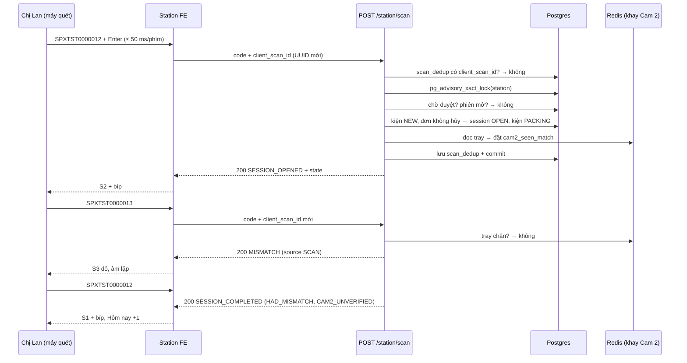

# Lát 1 — Quét đóng gói (M1) — Giải thích nghiệp vụ

| Trường | Giá trị |
|---|---|
| Item / lát | `01-packing-mvp` · lát 1 (milestone M1 Quét đóng gói, [03-plan §4](../../ai/items/01-packing-mvp/03-plan.md)) |
| Yêu cầu | FR-03.01..09, 03.11; FR-01.01..03, 01.06; FR-05.07; FR-10.01..03; BR-01..06, BR-16, BR-18; EX-P1..P7, EX-P9; AC-01, 03, 13 — [01-srs](../../ai/items/01-packing-mvp/01-srs.md) |
| Task | BE: T-7, T-8, T-9, T-10, T-20, T-11 · FE: T-34, T-35, T-36, T-50, T-57 · làm sớm phần FE của T-37, T-40 (DEC-50) |
| Code | Nhánh `feat/01-packing-mvp` trong `ai-cam-be`, `ai-cam-fe` — chưa commit (sau `9efb3b2` / `73c46f8`) |
| Người đọc | Dev mới vào dự án, reviewer, QA |
| Tác giả | khanhtt (agent soạn) |
| Reviewer | PO (đúng nghiệp vụ) · Tech lead (đúng code) |
| Trạng thái | Draft (code M1 đang sửa theo review — đối chiếu lại trước G3) |
| Last update | 2026-10-05 · Dev (thêm §0 theo template mới) |

## TL;DR

- Lát này biến bàn đóng gói thành **"quét – đóng gói – quét lại"**. Lần quét đầu mở phiên (đánh dấu giờ bắt đầu video bằng chứng). Lần quét sau phải **trùng mã** thì mới đóng phiên và kiện thành `PACKED`.
- Mọi lần quét đi qua một API (`POST /station/scan`). API luôn trả 200 kèm `outcome`; station chọn màn S1–S6 và âm thanh theo `outcome` đó.
- Quy tắc chặn dán nhầm phiếu: quét đóng bằng mã khác → **lệch mã** (S3). Cam 2 thấy phiếu khác trên khay → không đóng được phiên dù quét đúng mã (BR-06).
- Một bàn chỉ có một phiên mở; mọi lần quét của một bàn được xử lý **tuần tự** (khóa theo station). Lần quét gửi lại do mạng chập không bị xử lý hai lần.
- Cần nhớ: Cam 2 (vision), cắt clip và duyệt của quản lý **chưa có ở BE** — xem §8.

## 0. Giải thích đơn giản

Đây là phần **"quét – đóng – quét lại"** tại bàn đóng gói, giống chiếc máy chấm công cho từng kiện hàng: quét lần đầu là bấm giờ vào, quét lần hai là bấm giờ ra. Nhờ hai mốc giờ này, sau này hệ thống biết cắt đoạn video nào làm bằng chứng cho kiện nào.

**Ý tưởng chính.** Trước khi bắt đầu, quản lý đã khai báo bàn đóng gói, hai camera của bàn và một tài khoản dùng chung cho bàn đó. Người đóng gói chỉ dùng máy quét mã vạch, không cần chuột hay bàn phím. Hệ thống làm 3 việc:
1. Mở phiên khi quét mã lần đầu.
2. Chặn dán nhầm phiếu bằng cách đòi quét lại đúng mã đó.
3. Báo ngay bằng màn hình và âm thanh khi có gì bất thường.

### Bước 1 — Đăng nhập bàn một lần
- Làm gì: quản lý đăng nhập máy ở bàn một lần, máy nhớ trong 30 ngày.
- Vì sao: người đóng gói thay ca liên tục, không ai muốn gõ mật khẩu giữa giờ cao điểm.
- Sự cố thì sao: lỡ quét mã khi máy chưa đăng nhập, màn hình nhắc "Station chưa đăng nhập", không có gì bị ghi nhận sai.

### Bước 2 — Quét lần đầu: mở phiên
- Làm gì: màn hình chuyển sang "ĐANG ĐÓNG GÓI", hiện danh sách sản phẩm của đơn và kêu một tiếng bíp.
- Vì sao: người đóng gói nhìn danh sách để bỏ đủ hàng; mốc giờ mở phiên là đầu đoạn video bằng chứng.
- Sự cố thì sao: mạng chập làm máy gửi lại lần quét, hệ thống nhận ra đó là cùng một lần quét nên không mở hai phiên.

### Bước 3 — Dán phiếu, quét lại: đóng phiên
- Quét đúng mã đã mở: phiên đóng, kiện được tính là "đã đóng gói", màn hình về "SẴN SÀNG" để quét kiện tiếp theo.
- Quét mã khác: màn hình đỏ "LỆCH MÃ — KHÔNG DÁN PHIẾU NÀY" kèm âm báo lặp lại, cho tới khi gỡ phiếu sai và quét lại đúng mã.
- Vì sao: đây là chốt chặn chính. Phiếu dán trên hộp chắc chắn là phiếu của hộp đó.

### Bước 4 — Những lần quét bị từ chối
| Tình huống | Màn hình báo |
|---|---|
| Đơn khách đã hủy trên sàn | "ĐƠN ĐÃ HỦY", không mở phiên |
| Đơn đã đóng gói rồi | "ĐƠN ĐÃ ĐÓNG GÓI" kèm giờ và bàn đã đóng, có nút xin đóng gói lại |
| Đơn đã giao cho bên vận chuyển | "ĐƠN ĐÃ BÀN GIAO" |
| Kiện đang được đóng ở bàn khác | "ĐANG ĐÓNG GÓI Ở STATION KHÁC" |
| Quét nhầm mã không phải mã vận đơn (vd mã vạch sản phẩm) | "MÃ KHÔNG HỢP LỆ" |

### Bước 5 — Khi không đóng được
- Hết hàng hoặc quét nhầm: người đóng gói bấm "Hủy phiên" và chọn lý do. Chọn "Khác" thì phải ghi rõ lý do.
- Bỏ quên: sau 15 phút màn hình nhắc; sau 30 phút hệ thống tự đóng phiên là "bỏ dở" để bàn không bị kẹt. Phiên đang chờ quản lý duyệt thì không bị tự đóng.

**Ví dụ một vòng đầy đủ.** 9 giờ 05, chị Lan ở bàn số 1 quét phiếu "SPXTST0000012". Màn hình chuyển xanh, hiện 3 sản phẩm, kêu bíp. Chị bỏ hàng vào hộp trong 2 phút, camera bàn quay suốt quá trình. 9 giờ 07, chị lấy nhầm phiếu "SPXTST0000013" dán lên và quét. Màn hình đỏ, kêu liên tục: "Gỡ phiếu sai, dán đúng phiếu SPXTST0000012 rồi quét lại mã." Chị gỡ ra, dán đúng phiếu, quét lại. Màn hình về "SẴN SÀNG", dòng "Hôm nay" tăng lên 1 kiện. Kiện này được ghi chú là "từng lệch mã", để nếu khách khiếu nại thì CSKH biết xem kỹ đoạn video này. Chị quét ngay phiếu tiếp theo.

**Lưu ý.**
- Camera khay chưa tự đọc phiếu. Mọi kiện đóng xong hiện đang mang ghi chú "camera khay chưa xác nhận".
- Đơn hàng lấy từ dữ liệu Shopee giả lập.
- Chưa cắt clip theo từng kiện.
- Chưa có màn hình duyệt cho quản lý. Bấm "Gọi quản lý" hay "Yêu cầu đóng gói lại" trên hệ thống thật hiện báo lỗi.

## 1. Vì sao cần

Trước đây shop đóng gói không có video. Khi khách khiếu nại "thiếu hàng" hay "hộp rỗng", shop không có gì để chứng minh (P1). Ngoài ra, người đóng gói có thể dán phiếu của kiện A lên kiện B, gây giao sai và mất tiền (P5).

Phiên đóng gói giải quyết cả hai vấn đề:
- **Video:** giờ mở và giờ đóng phiên cho biết cần cắt đoạn video nào làm bằng chứng cho mã vận đơn nào.
- **Chống dán nhầm:** chỉ được đóng phiên khi quét lại đúng mã đã mở, nên phiếu dán lên kiện chắc chắn là phiếu của kiện đó.

Nếu không có lát này, hệ thống chỉ có video thô 24/7 và không ai biết kiện nào được đóng lúc nào.

| Lát này làm (Goals) | Lát này không làm (Non-goals — ở lát nào) |
|---|---|
| Đăng nhập station (tài khoản chung) và dashboard; phân quyền 4 vai (T-7, T-34, T-50) | Màn quản lý người dùng D9, nhật ký D10 (T-59, M4) — hiện tạo tài khoản qua API-90 hoặc `seed-demo` |
| Admin tạo station, gắn tài khoản, cấu hình Cam 1/Cam 2, kiểm tra kết nối (T-8, T-57) | Vẽ ROI Cam 2 trên UI (T-62, M3); live view D11 (T-60, M3) |
| Theo dõi camera online/offline, đo lệch giờ camera (J-08, J-09) | Cờ `VIDEO_INCOMPLETE` khi camera mất giữa phiên (T-14, M2) |
| Quét mở / đóng, lệch mã, cảnh báo đơn hủy / đã đóng / đã bàn giao / mã sai, đơn chưa xác minh (T-9, T-10) | Cắt clip, hash, xem clip thật (T-14, M2); Shopee thật (T-16, M4) |
| Hủy phiên có lý do, phiên gần đây, J-07 quá giờ (T-20) | API gửi / duyệt yêu cầu (T-13, M3) — FE S5 đã có, chạy trên mock |
| Logic khay Cam 2 khi quét (đọc Redis), BR-18 cờ khi đóng (T-10) | Tiến trình vision đọc mã trên khay (T-12, M3) |
| Realtime WS-01/WS-02 (T-11); màn S0–S6, D1, D6, D12 | Dashboard ngày D2 (T-51, M2) |

## 2. Ai dùng, ở đâu, khi nào

| Vai | Màn hình / điểm vào | Lúc nào dùng |
|---|---|---|
| Người đứng bàn (dùng tài khoản station chung) | `/station`: S0 đăng nhập, S1 sẵn sàng, S2 đang đóng gói, S3 lệch mã, S4 cảnh báo, S5 chờ duyệt, S6 mất kết nối | Cả ca, chỉ dùng máy quét, gần như không chạm chuột |
| Admin / Supervisor | S0 tại máy trạm | Một lần khi cài máy trạm; phiên đăng nhập sống 30 ngày (DEC-9) |
| Admin | `/admin/login` (D1) → `/admin/settings/stations` (D6) | Khi lắp bàn mới, đổi camera, tắt station |
| Supervisor, CSKH | D1 → chưa có màn nào (menu trống, DEC-51) | Từ M2 (D2, D3, D4) |
| Job J-07 (beat 30 giây), J-08 (vòng 2 giây trong `vision`), J-09 (10 phút) | Nền | Quá giờ phiên; camera mất tín hiệu; lệch giờ camera |

## 3. Tình huống thực tế

Dữ liệu theo seed TST ([04 §1](../../ai/items/01-packing-mvp/04-test-cases.md)): `…09` đã hủy trên sàn, `…10` đã đóng gói lúc sáng ở TST Station 02, `…11` đã bàn giao, `…12` có 3 sản phẩm.

| # | Tình huống | Hệ thống làm gì | Vì sao |
|---|---|---|---|
| 1 | 9:05 chị Lan ở TST Station 01 quét `SPXTST0000012` | `SESSION_OPENED` → S2 nền xanh dương, 3 sản phẩm, đồng hồ phiên; kiện `NEW → PACKING` | FR-03.02, 03.03: người đóng gói thấy cần bỏ gì vào hộp |
| 2 | 9:07 chị Lan dán phiếu rồi quét đóng nhầm sang phiếu `SPXTST0000013` đang nằm cạnh | `MISMATCH` → S3 nền đỏ, âm lỗi lặp, in đậm ký tự khác nhau; kiện vẫn `PACKING`; quét tiếp mã khác cũng không mở phiên mới | BR-05, FR-03.05: phiếu đã dán không phải của kiện đang đóng |
| 3 | 9:08 chị Lan gỡ phiếu sai, dán đúng, quét `…012` | `SESSION_COMPLETED`, cờ `HAD_MISMATCH`, kiện `PACKED`, về S1, "Hôm nay" +1 | Sửa được ngay tại bàn; cờ giữ dấu vết cho dashboard "từng lệch mã" (FR-09.01) |
| 4 | Chị Lan quét `…09` | S4 vàng "ĐƠN ĐÃ HỦY", 2 bíp, tự về S1 sau 5 giây; không có phiên | BR-01, EX-P1: không đóng gói đơn khách đã hủy |
| 5 | Chị Lan quét `…10` | S4 "ĐƠN ĐÃ ĐÓNG GÓI … tại TST Station 02", nút "Yêu cầu đóng gói lại" | BR-03, EX-P2: một mã chỉ có một phiên hiệu lực; đóng lại cần quản lý duyệt |
| 6 | Chị Lan quét `…11` | S4 "ĐƠN ĐÃ BÀN GIAO", không có nút đóng gói lại | BR-03: hàng đã rời kho, đóng lại là vô nghĩa |
| 7 | Anh Minh ở TST Station 02 quét `…012` lúc 9:06 khi chị Lan đang mở nó | `ALERT PACKED_ELSEWHERE_IN_PROGRESS` | Hai bàn cùng đóng một kiện → hai video, một kiện |
| 8 | Quét `SPXTST9990002` — chưa có trong hệ thống, Shopee chậm 3 giây | Sau 2 giây ngừng chờ, mở phiên cờ `UNVERIFIED`, S2 chip "Chưa xác minh với Shopee", "Chưa có danh sách sản phẩm" | BR-04, EX-P3: không để người đóng gói đứng chờ; đối soát sau |
| 9 | 11:40 chị Lan mở phiên rồi đi ăn trưa | 11:55 Alert "Phiên đã mở 15 phút…" (một lần); 12:10 phiên `ABANDONED`, kiện về `NEW`, S1 báo "đã tự đóng do quá 30 phút" | BR-16: không để bàn bị khóa vô thời hạn; kiện quay lại danh sách cần đóng |
| 10 | Khay có phiếu `…790` trong khi phiên là `…789`, chị Lan quét `…789` hai lần | Cả hai lần `MISMATCH` nguồn "Cam 2 thấy trên khay" | BR-06: phiếu sai còn trên khay nghĩa là có thể đã dán nhầm |
| 11 | Rút cáp Cam 2 của TST Station 01 | Sau ~6–8 giây: chip đỏ "Cam 2 mất tín hiệu", 2 bíp; vẫn đóng gói được | FR-01.02, 01.03, EX-P7: báo để sửa nhưng không dừng kho |
| 12 | Mạng LAN chập, request quét đầu tiên không nhận được trả lời | FE gửi lại tối đa 2 lần cùng `client_scan_id`; server trả đúng kết quả lần đầu; hết lượt → S6 | DEC-29: không mở/đóng phiên hai lần vì một lần quét |

## 4. Luồng ví dụ từ đầu đến cuối

Sáng thứ Hai 05/10, kho có TST Station 01 (chị Lan) và TST Station 02 (anh Minh).

1. **07:50** — Admin khanhtt vào D6, tạo "TST Station 01", gắn tài khoản `tst_station01`, nhập RTSP Cam 1 + Cam 2, bấm "Kiểm tra kết nối" → thấy ảnh chụp và độ lệch giờ. Lưu → MediaMTX nhận path mới; J-08 thấy byte chảy → chip camera xanh.
2. **07:55** — Admin mở `/station` trên máy trạm, đăng nhập S0 bằng `tst_station01` một lần. Máy giữ đăng nhập 30 ngày.
3. **09:05:00** — Chị Lan quét `SPXTST0000012`. Server khóa station, thấy bàn rảnh, kiện `NEW`, không hủy → tạo phiên `OPEN`, kiện `PACKING`, đọc khay Cam 2. Trả `SESSION_OPENED` trong < 1 giây. S2 hiện 3 sản phẩm và bíp.
4. **09:05–09:07** — Chị Lan bỏ hàng vào hộp. Cam 1 quay bàn, Cam 2 quay khay phiếu. WS đẩy `station.state` khi có thay đổi (camera, J-07).
5. **09:07:10** — Chị Lan quét `SPXTST0000013` (nhầm). Khay không có mã lạ → so mã → khác → `MISMATCH` (nguồn SCAN). S3 đỏ, âm lỗi lặp.
6. **09:07:40** — Chị Lan gỡ phiếu, dán đúng, quét `SPXTST0000012`. Khay không chặn, mã trùng → `COMPLETED` với cờ `HAD_MISMATCH`, và `CAM2_UNVERIFIED` (vì Cam 2 chưa từng khớp — ở M1 luôn vậy, xem §8). Kiện `PACKED`. S1, bíp. Dashboard nhận `report.updated`.
7. **09:08** — Chị Lan quét `SPXTST0000014` ngay (FR-03.11). Không cần chuột.

## 5. Quy tắc nghiệp vụ và lý do

| Quy tắc | Con số / điều kiện | Vì sao | ID |
|---|---|---|---|
| Station đăng nhập bằng tài khoản chung do Admin cấp; mọi phiên gắn station | Refresh 30 ngày (dashboard 7 ngày); access 15 phút | Bàn không có bàn phím; đăng nhập một lần. Ai đóng gói thì nhận qua video Cam 1 | FR-03.01, DEC-1, DEC-9, AS-07 |
| Station chưa đăng nhập thì quét không gửi API | S0 hiện "Station chưa đăng nhập. Đăng nhập rồi quét lại." | Không có phiên nào không gắn bàn | EX-P9, AC-13 |
| Tài khoản station không vào dashboard và ngược lại | 403 `WRONG_CLIENT`; cookie refresh tách `rt_station` / `rt_dashboard` | Tài khoản chung để lộ cũng không xem được dashboard; hai tab không đá nhau | FR-10.02, DEC-28 |
| Chống dò mật khẩu | Sai 10 lần → khóa 15 phút (423); 30 lần sai / 5 phút từ một IP → 429 | Tài khoản station nằm trên máy công cộng ở kho | DEC-45 |
| Station bị tắt / gỡ tài khoản → dừng ngay | 409 `STATION_INACTIVE`; 403 nếu station đã gắn tài khoản khác, không chờ token hết hạn | Admin thu hồi bàn phải có hiệu lực ngay | FR-01.01, review #13 |
| Phải còn ít nhất một Admin | 409 `LAST_ADMIN` | Không ai khóa được hệ thống của chính mình | FR-10.01 |
| Tên station duy nhất, không phân biệt hoa thường; một tài khoản station ↔ một station; tài khoản phải loại STATION | 409 `NAME_TAKEN`, `ACCOUNT_IN_USE`; 422 | Phiên phải truy về đúng một bàn (AS-06) | FR-01.01 |
| Mật khẩu camera mã hóa, URL hiển thị che | Fernet; `rtsp_url_masked`; để trống = giữ mật khẩu cũ | Lộ mật khẩu camera = ai cũng xem được video kho | FR-01.01, review M1 #11 |
| Thao tác nhạy cảm ghi audit | Đăng nhập, tạo/sửa user (mật khẩu che), station, camera; audit chỉ thêm | Truy được ai đổi cấu hình bàn nào, lúc nào | FR-10.03 |
| Camera offline | Vòng 2 giây; 6 giây không có byte mới → OFFLINE | Đạt ≤ 10 giây (AC-10) mà không cần ping riêng camera | FR-01.02, 01.03, DEC-31 |
| Lệch giờ camera | J-09 mỗi 10 phút, cảnh báo khi lệch > 1 giây | Giờ trên video là bằng chứng; lệch giờ cắt sai đoạn | FR-01.06, BR-15 |
| Mã hợp lệ | `^[A-Z0-9-]{8,40}$` sau khi bỏ khoảng trắng, đổi chữ hoa → sai: `INVALID_CODE` | Máy quét đọc nhầm barcode sản phẩm thì không mở phiên rác | API-11 |
| Phân biệt quét với gõ tay | ≤ 50 ms giữa hai phím, kết thúc Enter, ≥ 4 ký tự | Bàn phím chạm nhầm không thành lần quét | FR-03.11, 02b-station §10 |
| Đơn hủy không đóng gói | Đơn sàn `CANCELLED`/`IN_CANCEL`, hoặc kiện `CANCELLED`/`CANCELLED_AFTER_PACK` → `ORDER_CANCELLED` (xét trước BR-03) | Đóng gói đơn hủy = mất hàng, mất phí ship | BR-01, EX-P1, EX-P10 |
| Một bàn một phiên | Khóa `pg_advisory_xact_lock` theo station + unique index | Hai phiên trên một bàn → video không biết thuộc kiện nào | BR-02, DEC-11 |
| Đã đóng → không mở phiên mới | `PACKED` → `ALREADY_PACKED` (kèm giờ, tên bàn, `can_request_repack`); `HANDED_OVER`/`DELIVERED` → `ALREADY_HANDED_OVER` | Một mã chỉ một phiên hiệu lực; đóng lại cần quản lý duyệt | BR-03, EX-P2 |
| Mã chưa có → tra sàn có giới hạn | ≤ 2 giây, ngoài khóa station; hết giờ → kiện `verified=false`, cờ `UNVERIFIED` | Người đứng bàn không chờ quá NFR-01 (≤ 3 giây); không giữ khóa 2 giây | BR-04, EX-P3, FR-05.06 |
| Đóng phiên khi quét lại trùng mã | So mã đã chuẩn hóa với `open_code` | Phiếu dán lên kiện chắc chắn của kiện đó | BR-05, FR-03.04, EX-P4 |
| Khay có mã khác → chặn đóng | `tray.match` = `DIFFERENT`/`MULTIPLE` xét **trước** khi so mã → `MISMATCH` nguồn CAM2 | Phiếu sai còn trên khay = nguy cơ đã dán nhầm | BR-06, FR-03.07 |
| Cờ khi đóng | Cam 2 chưa từng khớp hoặc `UNAVAILABLE` → `CAM2_UNVERIFIED`; khay vẫn thấy chính mã phiên → `LABEL_ON_TRAY` (không chặn) | Cam 2 là kiểm tra bổ sung; chặn sẽ kẹt kho khi in trùng phiếu | BR-18, FR-03.06, EX-P6, DEC-26 |
| Hủy phiên | Lý do: Hết hàng / Quét nhầm / Khác (Khác bắt buộc ghi chú); chỉ khi `OPEN`/`MISMATCH` | Phiên bị hủy vẫn có video; lý do giúp tra lại | FR-03.08 |
| Hủy / bỏ dở trả kiện về trạng thái lúc mở | `package_status_before`: lần đầu → `NEW`; phiên đóng gói lại → `PACKED`, phiên cũ giữ hiệu lực | Hủy đóng gói lại không được xóa kết quả đóng gói trước | BR-03, DEC-24 |
| Quá giờ | J-07 mỗi 30 giây: ≥ 15 phút cảnh báo một lần; ≥ 30 phút `ABANDONED` (cấu hình được) | Bàn không bị khóa vô thời hạn | BR-16, FR-03.09, EX-P5 |
| Chuyển trạng thái kho chỉ qua một hàm | Bảng 8 cặp hợp lệ (01 §7); mỗi lần ghi `status_history` | Trạng thái kho là bằng chứng; mọi thay đổi có dấu vết | 01 §7, 02a §5 |
| Đơn API ghi đè đơn CSV | Đổi `source` → `API`, lưu bản CSV cũ vào audit | Dữ liệu sàn đáng tin hơn file tay | BR-17, FR-05.10 |
| Adapter sàn tách khỏi lõi | Interface `PlatformAdapter`; MockAdapter khi `PLATFORM_ADAPTER=mock` | Thêm TikTok / Lazada không đổi lõi phiên | FR-05.07 |
| Phiên gần đây | 5 phiên của station mình, trong ngày giờ Việt Nam | Ma trận quyền: station chỉ xem phiên của mình trong ngày | 01 §5.1, API-15 |
| S4 tự đóng; S6 khi mất kết nối | S4 sau 5 giây; S6 khi hết 2 lần gửi lại hoặc WS mất > 5 giây | Người đứng bàn không phải bấm gì để tiếp tục | 01 §10.4, NFR-09 |

## 6. Điểm dễ hiểu nhầm

**Vì sao quét luôn trả 200 kể cả khi bị chặn?** "Đơn đã hủy" hay "lệch mã" là kết quả nghiệp vụ bình thường, không phải lỗi. Mỗi `outcome` (`SESSION_OPENED`, `SESSION_COMPLETED`, `MISMATCH`, `ALERT`, `IGNORED`) ứng với một màn và một âm thanh. 4xx/5xx chỉ dùng cho lỗi kỹ thuật hoặc lỗi quyền. Nếu dùng 409 cho nghiệp vụ, FE phải tách "409 lệch mã" khỏi "409 station bị tắt", và dễ gửi lại nhầm một lần quét đã được xử lý (DEC-7, 02 §9).

**Vì sao khóa theo station, và `client_scan_id` để làm gì?** Máy quét có thể gửi hai mã cách nhau 100 ms (mở rồi đóng). FE cũng gửi lại khi mạng chập. Không có khóa thì hai request song song cùng thấy "bàn rảnh" và mở hai phiên. `pg_advisory_xact_lock` theo station xếp các request của **một bàn** vào hàng, còn hai bàn khác nhau vẫn chạy song song. Khóa tự nhả khi transaction kết thúc. Bản ghi `scan_dedup` (khóa chính `client_scan_id`) đảm bảo lần gửi lại trả **nguyên kết quả cũ** cùng state mới nhất, không mở hay đóng phiên lần nữa. Dedup được kiểm hai lần, trước và sau khi lấy khóa, vì lần gửi lại có thể chạy chồng với lần đầu (DEC-11, DEC-29). Phía FE cũng chỉ giữ tối đa một mã chờ trong hàng để giữ thứ tự mở → đóng.

**Vì sao station dùng một tài khoản chung?** Bàn đóng gói không có bàn phím. Chủ shop chọn đơn giản vận hành: Admin đăng nhập một lần, sau đó người đứng bàn chỉ dùng máy quét. Hai phương án bị loại là quét thẻ + PIN và tài khoản cá nhân. Đổi lại, hệ thống không biết **ai** đóng gói, chỉ biết **bàn nào**. Người đóng gói được nhận ra qua video Cam 1 (RK-09, AS-06, AS-07). Vì vậy overlay clip ghi tên station, không ghi mã nhân viên (FR-02.03). Đây cũng là lý do Supervisor duyệt trên dashboard chứ không duyệt tại bàn (DEC-5).

**Vì sao đang chờ duyệt thì mọi lần quét đều `IGNORED`?** Khi station gửi yêu cầu (lệch mã, gọi quản lý, đóng gói lại), quản lý đang xem đúng phiên đó trên D13. Nếu lần quét tiếp theo được xử lý, phiên có thể đổi trạng thái ngay lúc quản lý đang quyết định. Kiểm tra "đang chờ duyệt" được đặt **trước** kiểm tra định dạng mã (review #20): quét một mã rác cũng chỉ hiện "Đang chờ duyệt." chứ không bật S4 che mất S5. Test: `test_scan_ignored_while_waiting_approval`, `test_invalid_code_ignored_while_waiting_approval`.

**Vì sao J-07 không bỏ dở phiên đang chờ duyệt?** Bàn đang chờ là vì quản lý chưa xử lý, không phải vì người đóng gói bỏ đi. Nếu tự `ABANDONED`, kiện sẽ về `NEW` trong khi hàng vẫn nằm trên bàn, và yêu cầu trên D13 trỏ tới một phiên đã đóng. J-07 chỉ chọn phiên `OPEN`/`MISMATCH`. Test: `test_waiting_approval_is_not_abandoned`.

**Phiếu đã khớp trên khay trước khi quét thì sao?** Vision chỉ phát sự kiện khi khay **thay đổi**. Nếu chị Lan đặt phiếu lên khay rồi mới quét, sẽ không có sự kiện "khớp" nào sau khi mở phiên. Lúc đóng, phiên sẽ bị gắn sai cờ `CAM2_UNVERIFIED`. Vì vậy, khi mở phiên, server đọc khay ngay và ghi `cam2_seen_match` nếu khay đang `MATCH` (BR-18, DEC-47).

**`MISMATCH` là trạng thái của kiện à?** Không. Đó là trạng thái của **phiên**. Kiện giữ `PACKING` suốt phiên (DEC-24). Dashboard đếm "từng lệch mã" bằng cờ `HAD_MISMATCH`, kể cả khi phiên đã sửa và hoàn tất.

**Tra Shopee nằm ngoài khóa thì có bị tranh chấp không?** Có thể có: hai bàn cùng tra một mã mới. Lần ghi đơn thứ hai bị unique index chặn và được bỏ qua. Bước mở phiên (trong khóa) đọc lại từ DB. Nếu kiện đã mở ở bàn kia → `PACKED_ELSEWHERE_IN_PROGRESS`, không phải lỗi 500.

**Ngày "hôm nay" tính theo giờ nào?** Theo giờ Việt Nam (`tz_display`), không theo UTC. Phiên lúc 06:30 sáng VN (23:30 UTC hôm trước) vẫn tính vào hôm nay. Test: `test_report_updated_uses_vietnam_date`, `test_recent_excludes_yesterday`.

## 7. Bản đồ nghiệp vụ → code

Đường dẫn BE tính từ `ai-cam-be/src/aicam/`, test BE từ `ai-cam-be/tests/`. FE tính từ `ai-cam-fe/src/`.

| Khái niệm nghiệp vụ | Code | Test chứng minh |
|---|---|---|
| Đăng nhập, refresh, khóa, đúng client | `modules/users/service.py`, `modules/users/router.py`, `core/security.py` | `integration/test_auth_users_api.py`: `test_station_login_returns_station_and_sets_station_cookie`, `test_wrong_client`, `test_station_account_on_dashboard_is_wrong_client`, `test_lock_after_ten_failures_then_unlock_after_15_minutes`, `test_ip_rate_limit`, `test_refresh_reuse_revokes_whole_chain`, `test_refresh_cookie_is_per_client`, `test_inactive_station` |
| Vai trò, quyền, Admin cuối, audit | `modules/users/permissions.py`, `core/deps.py`, `core/audit.py` | `test_me_returns_permissions`, `test_users_api_is_admin_only`, `test_cannot_disable_last_admin`, `test_disable_user_revokes_sessions_and_audits`, `test_password_change_masked_in_audit`, `test_audit_logs_filter` |
| Station, camera, kiểm tra kết nối, live | `modules/stations/service.py`, `stations/router.py`, `stations/probe.py`, `stations/mediamtx.py` | `integration/test_stations_api.py`: `test_station_name_taken_case_insensitive`, `test_account_in_use_and_wrong_role`, `test_set_camera_registers_mediamtx_path_and_hides_password`, `test_set_camera_saves_even_if_mediamtx_down`, `test_update_camera_without_password_keeps_old_one`, `test_probe_unreachable_camera`, `test_live_and_snapshot_forbidden_for_cskh` |
| Camera online/offline (J-08) | `modules/stations/health.py`, `modules/vision/health_loop.py`, `modules/stations/listeners.py` | `unit/test_stations_logic.py`: `test_camera_goes_online_when_bytes_flow`, `test_camera_offline_after_six_seconds_without_new_bytes`; `test_apply_camera_health` |
| Lệch giờ camera (J-09) | `modules/stations/probe.py` (`onvif_clock_offset_ms`), `workers/tasks.py` | `test_parse_onvif_utc` |
| Trạng thái kho, chuyển hợp lệ | `modules/orders/service.py` (`transition`, `ALLOWED_TRANSITIONS`) | `unit/test_order_transitions.py`: `test_valid_transition_writes_history`, `test_invalid_transition_raises`, `test_handed_over_cannot_be_repacked` |
| Đơn sàn, hủy, BR-17, chưa xác minh | `modules/orders/service.py` (`upsert_platform_order`, `is_cancelled`, `create_unverified_package`), `modules/platforms/base.py`, `platforms/mock/adapter.py` | `integration/test_orders.py`: `test_cancelled_on_platform_before_pack`, `test_cancelled_after_pack`, `test_api_overwrites_csv_order_and_keeps_snapshot`, `test_unverified_package_and_later_verification` |
| Xử lý quét (API-11), state (API-10) | `modules/sessions/service.py` (`scan`, `_open_session_unsafe`, `_continue_session`, `complete_session`, `build_state`), `sessions/router.py` | `integration/test_station_scan_api.py`: `test_open_then_close`, `test_scan_mismatch_then_fix`, `test_mismatch_does_not_open_new_session`, `test_cancelled_order`, `test_already_packed`, `test_already_handed_over`, `test_invalid_code`, `test_unknown_code_opens_unverified`, `test_slow_platform_times_out`, `test_retry_same_client_scan_id` |
| Khay Cam 2, BR-06, BR-18 | `modules/sessions/tray.py`, `sessions/service.py` | `test_tray_different_blocks_close_even_with_correct_scan`, `test_two_labels_on_tray_is_mismatch`, `test_cam2_verified_flow_has_no_cam2_flags`, `test_label_still_on_tray_flag` |
| Khóa station, dedup | `sessions/service.py` (`_lock_station`, `_dedup`), `sessions/models.py` (`ScanDedup`, unique index) | `integration/test_scan_concurrency.py`: `test_parallel_scans_open_exactly_one_session`, `test_two_stations_same_code_one_opens_other_alerts`, `test_same_client_scan_id_in_parallel_runs_once`, `test_j07_racing_closing_scan_keeps_session_and_package_consistent` |
| Chờ duyệt → IGNORED; station bị tắt / đổi tài khoản | `sessions/service.py` (`scan`, `require_station`), `modules/approvals/queries.py` | `test_scan_ignored_while_waiting_approval`, `test_invalid_code_ignored_while_waiting_approval`, `test_station_moved_to_other_account_rejects_old_token`, `test_inactive_station_rejected`, `test_dashboard_account_cannot_scan` |
| Hủy phiên, đóng gói lại, phiên gần đây, J-07 | `sessions/service.py` (`cancel`, `end_without_packing`, `recent`, `check_timeouts`), `workers/celery_app.py`, `workers/tasks.py` | `integration/test_session_lifecycle.py`: `test_cancel_returns_package_to_new`, `test_cancel_other_requires_note`, `test_cancel_repack_keeps_old_session`, `test_complete_repack_supersedes_old`, `test_recent_sessions_today`, `test_timeouts_warn_once_then_abandon`, `test_waiting_approval_is_not_abandoned`; `test_state_shows_warn_and_abandon_times` |
| Realtime WS-01 / WS-02 | `realtime/hub.py`, `realtime/publish.py`, `realtime/bus.py` | `integration/test_ws_hub.py`: `test_station_receives_its_channel_and_pong`, `test_invalid_token_closed_4401`, `test_cskh_does_not_get_approvals`, `test_token_expiry_closes_4401` |
| QA chạy trên stack thật | — | `qa/test_m1_live.py`: `test_tc_03_03_fifty_scans_p95`, `test_tc_03_04_05_06_mismatch`, `test_tc_01_07_simulated_camera_loss`, `test_tc_p_matrix` |
| S0, EX-P9, guard theo vai | `features/station/StationLoginPage.tsx`, `features/auth/RequireRole.tsx`, `features/auth/useAuth.ts`, `app/routes.tsx` | `features/station/StationLoginPage.test.tsx`: "EX-P9: quét mã khi chưa đăng nhập → nhắc đăng nhập, không gọi API"; `app/routes.test.tsx`: "tài khoản station mở /admin bị chuyển sang /station" |
| Nhận mã từ máy quét | `shared/scan/scanBuffer.ts`, `shared/scan/useScanListener.ts` | `shared/scan/scanBuffer.test.ts`: "gõ tay 200 ms/phím → không phải quét", "mã ngắn hơn 4 ký tự bị bỏ (nhiễu)" |
| Một nguồn state, hàng đợi, retry, âm thanh | `features/station/stationStore.ts`, `features/station/sound.ts` | `features/station/stationStore.test.ts`: "quét lúc đang chờ API được xếp hàng, giữ thứ tự mở → đóng", "lỗi mạng: retry cùng client_scan_id, thành công thì không mất lần quét", "IGNORED khi chờ duyệt → toast" |
| Màn S1–S6 | `features/station/StationPage.tsx`, `StationStatePanel.tsx`, `ReadyPanel.tsx`, `PackingPanel.tsx`, `MismatchPanel.tsx`, `AlertOverlay.tsx`, `WaitingApprovalPanel.tsx`, `DisconnectedOverlay.tsx`, `CancelSessionDialog.tsx`, `StationStatusBar.tsx` | `features/station/StationPage.test.tsx`: "UC-01: quét mở → S2 có sản phẩm; quét lại → S1, phiên gần đây có nút Xem", "S3: quét đóng sai mã → lệch mã, hiện mã đang đóng gói và mã vừa quét", "S4: đơn đã hủy → cảnh báo, không mở phiên", "Hủy phiên: Khác bắt buộc ghi chú; Hết hàng → về S1", "S6: lỗi mạng sau khi retry → mất kết nối, không nhận quét" |
| WS station, S6 khi mất > 5 giây | `features/station/useStationSocket.ts`, `lib/ws.ts` | `features/station/useStationSocket.test.tsx`: "thử nối lại mỗi 1–2 giây vẫn báo mất kết nối sau 5 giây" |
| D1, drawer theo vai, D12, D6 | `features/admin/AdminLoginPage.tsx`, `features/shell/AppShell.tsx`, `features/shell/nav.ts`, `features/admin/StationsListPage.tsx`, `StationEditPage.tsx`, `CameraForm.tsx` | `features/admin/StationsAdmin.test.tsx`: "TC-01.02: tên trùng (không phân biệt hoa thường) → lỗi dưới ô tên", "TC-01.01: kiểm tra kết nối camera → ảnh chụp + lệch giờ; lưu camera"; `app/routes.test.tsx`: "CSKH vào màn chỉ dành cho ADMIN → D12 không có quyền; menu không có Cài đặt" |

## 8. Giới hạn hiện tại và giả định

**Phần còn giả lập / mock**
- **Cam 2 chưa đọc mã thật.** Tiến trình vision (T-12) chưa ghi Redis `tray:{station_id}`. Trên stack thật, khay luôn `UNAVAILABLE`, nên **mọi phiên đóng đều có cờ `CAM2_UNVERIFIED`**, và BR-06 chưa bao giờ chặn. Test BE ghi Redis trực tiếp để giả lập khay.
- **Shopee:** `PLATFORM_ADAPTER=mock`, `SHOPEE_ENABLED=false`. MockAdapter có 30 đơn `SPXTST…`. Giới hạn tra sàn 2 giây được kiểm bằng độ trễ giả của mock (`delay_s`, test `test_slow_platform_times_out`). Adapter thật và J-05 xác minh lại đơn `UNVERIFIED` chưa có (T-16, T-22, M4).
- **Camera:** chỉ có `fake-cams`. Camera giả không có ONVIF, nên J-09 trả `clock_offset_ms = null`. Tỉ lệ đọc ≥ 95% (AC-04) chưa đo (T-4).
- **FE `pnpm dev:mock`:** `mocks/stationSim.ts` mô phỏng state machine của BE (kể cả duyệt). Video xem lại là file mẫu `public/mock/clip-cam*.mp4`.

**Để lát sau**
- **Clip (T-14, M2):** chưa cắt clip. Trên BE thật, "Phiên gần đây" luôn hiện "Đang cắt clip" thay nút Xem. Phiên `ABANDONED`/`CANCELLED` "vẫn có clip" (BR-16, TC-03.18) chưa kiểm được. Cờ `VIDEO_INCOMPLETE` khi camera mất giữa phiên chưa gắn.
- **Duyệt (T-13, M3 — FR-03.10, FR-03.12):** chưa có API-13/14/20/21. Trên BE thật, nút "Yêu cầu đóng gói lại" / "Gọi quản lý" gọi `/station/approval-requests` → 404 → toast. Nhánh `IGNORED` và "J-07 bỏ qua phiên chờ duyệt" đã có, nhưng chỉ kiểm bằng dữ liệu tạo tay trong test. D13 là T-55.
- **Vision cập nhật phiên theo khay (`on_tray_changed`, T-12):** chưa có. Lệch mã do Cam 2 hiện chỉ xảy ra **lúc quét**, chưa tự bật S3 trong ≤ 2 giây.
- **D2 dashboard (T-51):** server đã đẩy `report.updated`, `camera.status` nhưng chưa có màn nào nhận. D9 người dùng, D10 nhật ký (T-59): hiện chỉ có API.
- **J-11 dọn `scan_dedup` sau 10 phút (T-18):** chưa có, nên bảng tăng dần.

**Giả định chưa xác nhận / câu hỏi mở**
- AS-06: mỗi bàn chỉ một người đứng tại một thời điểm. AS-07: video Cam 1 đủ để nhận ra người đóng gói. Nếu sai → đảo DEC-1.
- NFR-01 (p95 ≤ 1 giây) mới đo trên stack dev (`test_tc_03_03_fifty_scans_p95`), chưa đo trên phần cứng tại kho.
- Regex mã vận đơn `^[A-Z0-9-]{8,40}$` chưa đối chiếu với mã thật của mọi hãng vận chuyển Shopee (phụ thuộc Q11, spike T-3).
- Thu hồi đăng nhập station (TC-10.06): station chỉ về S0 khi access token hết hạn (≤ 15 phút). PO cần xác nhận độ trễ này chấp nhận được.

## Liên kết

- SRS: [01-srs](../../ai/items/01-packing-mvp/01-srs.md) §4.1, §5, §5.1, §7, §10.2–§10.4, AC-01, 03, 13, 16; [SRS hệ thống](../../ai/system/SRS.md) §4.1 (EX-P1..P8), §5 (FR-03.*)
- Spec: [02](../../ai/items/01-packing-mvp/02-tech-spec.md) §6 API-10/11/12/15, WS-01/02, §9 · [02a](../../ai/items/01-packing-mvp/02a-be-spec.md) §4.1, §5, §6, §7 · [02b-station](../../ai/items/01-packing-mvp/02b-fe-spec-station.md) · [02b-admin](../../ai/items/01-packing-mvp/02b-fe-spec-admin.md) D1, D6, D12
- Test cases: [04](../../ai/items/01-packing-mvp/04-test-cases.md) TC-10.01..10, TC-01.01..09, TC-03.01..33
- Lát trước: [lát 0 — Nền móng](lat-00-nen-mong.md)
