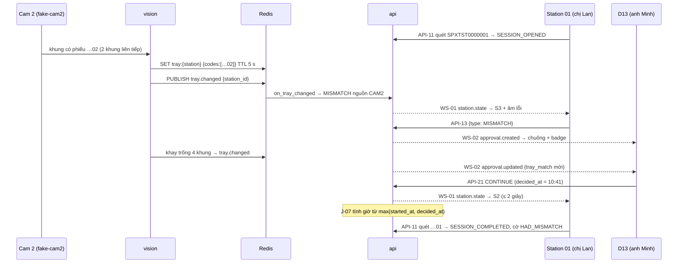

# Lát 3 — Cam 2 + duyệt (M3) — Giải thích nghiệp vụ

| Trường | Giá trị |
|---|---|
| Item / lát | `01-packing-mvp` · lát 3 (milestone M3 Cam 2 + duyệt, [03-plan §4](../../ai/items/01-packing-mvp/03-plan.md)) |
| Yêu cầu | FR-03.06, 03.07, 03.10, 03.12; FR-01.04, 01.05; BR-03, BR-06, BR-16 (v0.4, DEC-60), BR-18; AC-04, 14, 19, 21 — [01-srs](../../ai/items/01-packing-mvp/01-srs.md) |
| Task | BE: T-12, T-13 (T-4 chờ camera thật) · FE: T-55, T-62, T-60, T-38 (T-37 đã làm ở M1) |
| Code | `ai-cam-be`: `771f61d`, `9b7c26e`, `97abd2e` · `ai-cam-fe`: `aeca76e`, `5e25242`, `310de20`, `fafd6b7` (nhánh `feat/01-packing-mvp`) |
| Người đọc | Dev mới vào dự án, reviewer, QA |
| Tác giả | khanhtt (agent soạn) |
| Reviewer | PO (đúng nghiệp vụ) · Tech lead (đúng code) |
| Trạng thái | Draft |
| Last update | 2026-10-05 · Dev |

## TL;DR

- Cam 2 nhìn khay đặt phiếu, đọc mã vạch 4 lần mỗi giây trong vùng Admin vẽ sẵn. Phiếu trên khay khác mã phiên → phiên chuyển **lệch mã** ngay, quét đúng mã cũng không đóng được tới khi bỏ phiếu sai (BR-06).
- Station gửi yêu cầu duyệt (Lệch mã, Gọi quản lý, Đóng gói lại); Supervisor / Admin xử lý ở D13, mỗi quyết định ghi audit tên người duyệt.
- Thời gian chờ duyệt không tính vào quá giờ: đồng hồ 15 / 30 phút tính lại từ lúc yêu cầu kết thúc (DEC-60).
- D11 xem live Cam 1 + Cam 2 qua WebRTC; D6 có công cụ vẽ vùng đọc mã Cam 2.
- **Chưa test với camera thật (T-4):** tỉ lệ đọc ≥ 95%, độ trễ thật, CPU, ánh sáng, phiếu nhăn — xem §8.

## 0. Giải thích đơn giản

Đây là phần **"người soát phiếu thứ hai" của bàn đóng gói**. Người đóng gói có thể dán nhầm phiếu của đơn bên cạnh. Lát này đặt một camera nhìn thẳng xuống khay để phiếu, tự đọc mã trên phiếu và la lên ngay khi phiếu không khớp đơn đang đóng. Khi có chuyện người đóng gói không tự xử lý được, họ bấm một nút để gọi quản lý, và quản lý xử lý từ máy tính của mình mà không cần chạy ra bàn.

**Ý tưởng chính.** Lát trước đã có phiên đóng gói (một lần đóng gói một kiện, từ lúc quét mở tới lúc quét đóng) và đã có video. Lát này thêm 5 việc:
1. Camera khay (Cam 2) tự đọc phiếu, so với kiện đang đóng.
2. Bàn đóng gói gửi yêu cầu cho quản lý: lệch mã, cần giúp, xin đóng gói lại kiện đã đóng.
3. Quản lý xử lý yêu cầu trên trang "Yêu cầu duyệt".
4. Quản lý xem trực tiếp hình hai camera của từng bàn.
5. Admin vẽ vùng trên ảnh khay để camera chỉ đọc phiếu trong vùng đó.

### Bước 1 — Vẽ vùng đọc mã cho camera khay
- Làm gì: Admin mở trang cấu hình bàn, thấy ảnh chụp từ camera khay, kéo chuột vẽ một khung quanh chỗ đặt phiếu, bấm "Lưu vùng đọc mã".
- Vì sao: trên bàn còn hộp hàng, mã sản phẩm, giấy tờ khác. Chỉ đọc trong khung thì không bắt nhầm mã ngoài khay.
- Sự cố thì sao: khung quá nhỏ (dưới 5% ảnh chiều rộng hoặc chiều cao) thì nút Lưu bị khóa, kèm câu nhắc "Khung phải rộng và cao ít nhất 5% ảnh.". Camera không chụp được ảnh thì có nút "Chụp lại".

### Bước 2 — Camera khay tự đọc phiếu
- Làm gì: mỗi giây camera xem khay 4 lần. Chỉ nhận mã có dạng mã vận đơn, bỏ qua mã QR hay mã khác trên hộp.
- Vì sao chờ vài khung mới tin: phiếu mới phải thấy giống nhau 2 lần liên tiếp mới nhận. Khay trống phải trống 4 lần liên tiếp mới tính là trống. Tay người lướt qua che phiếu nửa giây sẽ không làm hệ thống tưởng phiếu đã mất.
- Kết quả có 4 loại: khớp đơn đang đóng; khác đơn đang đóng; có từ hai phiếu trở lên; không thấy gì. Thêm loại thứ năm là "không biết" khi camera mất hình quá 3 giây.
- Sự cố thì sao: camera khay hỏng không làm dừng kho. Bàn vẫn đóng gói được, kiện chỉ mang ghi chú "camera khay chưa xác minh".

### Bước 3 — Phiếu sai trên khay thì chặn ngay
- Làm gì: đang đóng kiện A mà khay hiện phiếu của kiện B → màn hình bàn chuyển "LỆCH MÃ" kèm âm báo lỗi lặp lại. Quét lại mã A cũng không đóng được. Bỏ phiếu B khỏi khay → tự quay về "ĐANG ĐÓNG GÓI".
- Vì sao: phiếu sai còn trên khay nghĩa là rất có thể sắp dán nhầm. Chặn lúc này rẻ hơn nhiều so với giao nhầm hàng.
- Trường hợp đặc biệt: phiếu B đã nằm trên khay **trước** khi quét mở kiện A. Hệ thống vẫn mở phiên A, nhưng báo lệch mã ngay và phát âm lỗi, không phát tiếng bíp "ok". Người đóng gói biết ngay có phiếu sai, không phải đợi tới lúc đóng.
- Lệch mã do **quét** sai (quét đóng bằng mã B) thì khác: bỏ phiếu khỏi khay không gỡ được. Phải quét đúng mã A hoặc gọi quản lý.

### Bước 4 — Gọi quản lý
- Bàn đóng gói có 3 loại yêu cầu:

| Loại | Khi nào | Quản lý chọn được |
|---|---|---|
| Lệch mã | Đang lệch mã, người đóng gói không tự gỡ được | Cho tiếp tục · Đóng phiên có ghi chú · Hủy phiên |
| Gọi quản lý | Đang đóng gói, cần hỏi (thiếu hàng, hàng lỗi…) | Như trên |
| Đóng gói lại | Quét một kiện đã đóng xong, cần mở ra đóng lại | Duyệt đóng gói lại · Từ chối |

- Gửi xong, màn bàn hiện "ĐANG CHỜ QUẢN LÝ DUYỆT". Quét thêm lúc này bị bỏ qua, màn nhắc "Đang chờ duyệt.". Người đóng gói đổi ý thì bấm "Rút yêu cầu", bàn quay về đúng màn trước đó.
- Vì sao duyệt trên máy quản lý chứ không tại bàn: mỗi bàn dùng chung một tài khoản và không có bàn phím. Duyệt trên máy quản lý thì biết chính xác ai duyệt, nhật ký ghi tên người đó.

### Bước 5 — Quản lý xử lý trên trang "Yêu cầu duyệt"
- Làm gì: yêu cầu hiện trên trang trong ≤ 2 giây, kèm chuông báo và số đếm trên menu. Mỗi thẻ ghi bàn nào, mã vận đơn, mã vừa quét, mã Cam 2 thấy, chờ bao lâu, và có nút "Xem live" để nhìn bàn đó.
- "Cho tiếp tục": bàn quay về đóng gói. Nếu Cam 2 vẫn thấy phiếu sai, bàn quay lại "LỆCH MÃ" ngay, và thẻ đã cảnh báo trước điều này.
- "Đóng phiên có ghi chú": quản lý tự đóng phiên, ghi chú bắt buộc. Bị khóa khi Cam 2 còn thấy phiếu sai, vì đóng lúc đó là chấp nhận dán nhầm. Khay đổi trong lúc chờ thì thẻ tự cập nhật, nút tự khóa / mở theo khay hiện tại.
- "Hủy phiên": cần xác nhận lần nữa; bàn hiện "Quản lý đã hủy phiên.".
- Hai quản lý bấm cùng lúc: một người thành công, người kia thấy "Yêu cầu này đã được Nguyễn B xử lý lúc 10:12.".
- Đóng gói lại: chỉ cho khi kiện đã đóng nhưng chưa bàn giao cho vận chuyển. Phiên cũ chỉ bị thay thế khi phiên mới đóng xong. Phiên mới bị hủy hay bỏ dở thì phiên cũ vẫn là bằng chứng chính thức, cả hai video đều còn.

### Bước 6 — Thời gian chờ duyệt không bị tính là "quá giờ"
- Quy tắc cũ: phiên mở quá 15 phút thì nhắc, quá 30 phút thì tự đóng là "bỏ dở".
- Vấn đề: quản lý bận, 40 phút sau mới bấm "Cho tiếp tục". Nếu vẫn tính giờ từ lúc mở phiên, phiên bị bỏ dở ngay sau khi duyệt, người đóng gói phải quét mở lại dù không có lỗi gì.
- Bây giờ: khi yêu cầu kết thúc (quản lý duyệt hoặc bàn rút yêu cầu), đồng hồ đếm lại từ đầu: 15 phút sau mới nhắc, 30 phút sau mới bỏ dở.
- Không mất bằng chứng: video của phiên vẫn tính từ lúc mở phiên.

### Bước 7 — Xem trực tiếp camera
- Làm gì: quản lý mở trang "Live view", thấy hình Cam 1 và Cam 2 của từng bàn. Bấm "Xem live" trên thẻ yêu cầu thì chỉ hiện bàn đó, to hơn.
- Vì sao: trước khi quyết "Cho tiếp tục" hay "Hủy phiên", quản lý muốn nhìn tận mắt trên khay đang có gì.
- Sự cố thì sao: mất hình thì ô đó hiện "Mất tín hiệu", tự thử lại 3 lần, mỗi lần cách 5 giây, rồi chờ người bấm "Thử lại". Ô khác vẫn chạy.

**Ví dụ một vòng đầy đủ.** 10:00, chị Lan ở bàn số 1 quét phiếu "SPXTST0000001", màn hiện "ĐANG ĐÓNG GÓI", bíp ok. Chị đặt nhầm phiếu "SPXTST0000002" của đơn bên cạnh lên khay. Chưa tới 1 giây sau, màn đỏ "LỆCH MÃ", dòng "Cam 2 thấy trên khay: SPXTST0000002", âm báo lỗi kêu liên tục. Chị không chắc phiếu nào đúng nên bấm "Gọi quản lý". Màn chuyển "ĐANG CHỜ QUẢN LÝ DUYỆT". Ở văn phòng, máy anh Minh (quản lý) kêu chuông, menu "Yêu cầu duyệt" hiện số 1. Anh mở thẻ: bàn số 1, phiên SPXTST0000001, Cam 2 thấy SPXTST0000002. Nút "Đóng phiên có ghi chú" bị khóa vì Cam 2 còn thấy phiếu sai. Anh bấm "Xem live", thấy đúng phiếu sai đang nằm trên khay. Anh gọi điện bảo chị Lan bỏ phiếu đó ra. Chị bỏ phiếu ra, thẻ trên máy anh Minh tự cập nhật, nút đóng mở lại. Anh bấm "Cho tiếp tục" lúc 10:41. Trong 2 giây, màn chị Lan về "ĐANG ĐÓNG GÓI". Vì đã chờ 41 phút, theo quy tắc cũ phiên sẽ bị bỏ dở ngay. Theo quy tắc mới, nhắc nhở sẽ hiện lúc 10:56, phiên chỉ bỏ dở lúc 11:11. Chị đặt phiếu đúng lên khay, dán, quét lại "SPXTST0000001": phiên đóng, kiện được ghi "từng lệch mã". Nhật ký ghi "Nguyễn Minh — Cho tiếp tục — 10:41".

**Lưu ý.**
- Chưa thử với camera thật. Toàn bộ chạy với camera giả phát lại một đoạn phim có sẵn phiếu in rõ nét. Tỉ lệ đọc đúng ≥ 95%, độ trễ ≤ 2 giây ngoài đời, ánh sáng kho, phiếu nhăn, phiếu in trùng đều chưa kiểm.
- Chuông báo trên trang duyệt chưa được nghe thử trên máy thật. Trình duyệt chặn âm thanh thì chỉ còn số đếm trên menu.
- Live view mới chạy trên máy dev qua đường dự phòng. Đường chính trong mạng kho chưa thử.

## 1. Vì sao cần

Vấn đề gốc là P5 (dán nhầm phiếu → giao nhầm hàng, mất tiền hai đơn) và FR-03.12 (bàn đóng gói không có cách xin quyết định quản lý). Lát 1 mới xét khay **lúc quét** và đọc khay từ Redis do test ghi tay. Trên stack thật, khay luôn "không biết", nên BR-06 chưa từng chặn được gì và mọi kiện mang cờ `CAM2_UNVERIFIED`.

| Lát này làm (Goals) | Lát này không làm (Non-goals — ở lát / phase nào) |
|---|---|
| Tiến trình vision đọc Code128 / QR trong ROI Cam 2, ghi `tray:{station_id}`, phát `tray.changed`; `on_tray_changed` OPEN ↔ MISMATCH nguồn CAM2 (T-12) | Kiểm trên camera thật: tỉ lệ đọc, độ trễ, CPU, vị trí, ánh sáng (T-4, chờ phần cứng) |
| API-13, 14, 20, 21; WS `approval.*`; audit `APPROVAL_DECISION` (T-13) | Duyệt bằng thẻ / mã PIN tại bàn (loại ở DEC-5) |
| D13 + badge + âm báo (T-55); RoiEditor ở D6 (T-62); D11 live view WHEP (T-60) | Ghi âm / ghi lại live view; xem video thô (Phase 3) |
| DEC-60: đồng hồ quá giờ tính lại sau khi chờ duyệt | Metric Prometheus `aicam_vision_*` (chưa có hạ tầng) |
| E2E station + D13 với BE thật (T-38) | Nhận diện sản phẩm bằng AI (Non-goal của 02) |

## 2. Ai dùng, ở đâu, khi nào

| Vai | Màn hình / điểm vào | Lúc nào dùng |
|---|---|---|
| Station (tài khoản bàn) | `/station`: S3 Lệch mã, S4 Cảnh báo ("Đóng gói lại"), S5 Chờ quản lý duyệt, nút "Gọi quản lý" ở S2 | Phiếu sai trên khay, cần giúp, xin đóng gói lại |
| Supervisor, Admin | `/admin/approvals` (D13), badge drawer, mục "Cần xử lý" của D2 | Khi chuông kêu / badge tăng |
| Supervisor, Admin | `/admin/live` (D11), `?station=` từ nút "Xem live" | Nhìn bàn trước khi quyết |
| Admin | `/admin/settings/stations/:id` (D6) khối "Vùng đọc mã Cam 2" | Lắp hoặc dời camera khay |
| Tiến trình `vision` | Nền | Đọc khay liên tục, theo dõi camera |
| Job J-07 (30 giây) | Nền | Nhắc 15 phút, bỏ dở 30 phút, tính từ `timer_base` |

## 3. Tình huống thực tế

| # | Tình huống | Hệ thống làm gì | Vì sao |
|---|---|---|---|
| 1 | Phiên `…01` đang mở, chị Lan đặt phiếu `…02` lên khay | ≤ 1 giây (2 khung): phiên `MISMATCH` nguồn `CAM2`, cờ `HAD_MISMATCH`; WS-01 `station.state` → S3 | BR-06, FR-03.07 |
| 2 | Bỏ phiếu `…02` ra | Khay trống 4 khung → `on_tray_changed` đưa phiên về `OPEN`, event `MISMATCH_CLEARED` | Lệch do Cam 2 tự hết khi khay hết sai |
| 3 | Quét đóng bằng `…02` (lệch do quét), rồi bỏ phiếu khỏi khay | Vẫn `MISMATCH` | Lệch do quét chỉ gỡ bằng quét đúng mã hoặc duyệt (DEC-111) |
| 4 | Phiếu `…02` nằm sẵn trên khay, chị Lan quét mở `…01` | Phiên mở rồi chuyển ngay `MISMATCH`, `outcome = MISMATCH`, âm lỗi | Vision chỉ báo khi khay đổi; không xét lúc mở thì phiên `OPEN` với phiếu sai (DEC-111, DEC-61) |
| 5 | Khay có cả `…02` và `…03` | `tray.match = MULTIPLE` → `MISMATCH` | Hai phiếu trên khay là dấu hiệu lẫn đơn |
| 6 | Cam 2 rớt khi phiên đang mở | Sau > 3 giây khay `UNAVAILABLE`; đóng vẫn được, cờ `CAM2_UNVERIFIED` | BR-18: Cam 2 là kiểm tra bổ sung, không được làm dừng kho |
| 7 | Gửi MISMATCH, rồi bỏ phiếu sai trong lúc chờ | `context.tray_match` cập nhật, WS-02 `approval.updated`; D13 mở nút "Đóng phiên có ghi chú" | Quản lý quyết theo khay hiện tại |
| 8 | Hai Supervisor bấm cùng lúc | Một 200, một 409 `ALREADY_RESOLVED` kèm `decided_by`, `decided_at` | Khóa station + `FOR UPDATE`; không quyết hai lần |
| 9 | Quét kiện `PACKED`, xin đóng gói lại, được duyệt | Mở phiên `REPACK`; phiên cũ `SUPERSEDED` chỉ khi phiên mới `COMPLETED` | BR-03, AC-14 |
| 10 | Chờ duyệt 40 phút rồi "Cho tiếp tục" | Không nhắc, không bỏ dở; `abandon_at` = lúc duyệt + 30 phút | DEC-60 |
| 11 | Supervisor "Hủy phiên" | Phiên `CANCELLED` lý do `SUPERVISOR`, kiện về `NEW`; WS-01 `alert` `SESSION_CANCELLED_BY_SUPERVISOR` | Station biết vì sao phiên biến mất |

## 4. Luồng ví dụ từ đầu đến cuối

1. **10:00:00** — Chị Lan quét `SPXTST0000001`. Khay trống nên `SESSION_OPENED`, S2, bíp ok.
2. **10:00:20** — Phiếu `…02` lên khay. `capture.py` đọc khung 0,25 giây một lần, `reader.py` giải mã trong ROI, `tray.py` nhận tập mã mới sau 2 khung. `runner.py` ghi `tray:{station_id}` và phát `tray.changed`.
3. `api` nhận kênh, `on_tray_changed` khóa station, thấy `DIFFERENT` → phiên `MISMATCH` nguồn `CAM2`, `mismatch.actual = …02`. Sau commit đẩy `station.state` + `report.updated`.
4. **10:00:30** — Chị Lan bấm "Gọi quản lý" ở S3. API-13 tạo yêu cầu MISMATCH, phiên `WAITING_APPROVAL`, lưu `status_before_approval`. D13 nhận `approval.created`, chuông 2 nốt.
5. **10:05** — Chị Lan bỏ phiếu ra. Khay trống 4 khung → `tray.changed`. Phiên đang `WAITING_APPROVAL` nên giữ nguyên, chỉ yêu cầu được cập nhật `context.tray_match` và phát `approval.updated`.
6. **10:41** — Anh Minh bấm "Cho tiếp tục". API-21 ghi `decided_at`, đưa phiên về `OPEN`, đánh giá lại khay (đang trống → giữ `OPEN`), audit `APPROVAL_DECISION`, bật lại cờ nhắc 15 phút.
7. J-07 lấy `timer_base` = 10:41 → nhắc 10:56, bỏ dở 11:11.
8. **10:43** — Chị Lan dán đúng phiếu, quét `…01` → `COMPLETED`, cờ `HAD_MISMATCH`. Cam 2 đã thấy đúng mã trong phiên nên không có `CAM2_UNVERIFIED`.

## 5. Quy tắc nghiệp vụ và lý do

| Quy tắc | Con số / điều kiện | Vì sao | ID |
|---|---|---|---|
| Đọc khay liên tục | 4 khung / giây; mã mới cần 2 khung giống nhau; khay trống cần 4 khung; chỉ nhận mã khớp `SCAN_CODE_REGEX` | Phát hiện ≤ 2 giây mà không báo nhầm khi tay che phiếu | FR-03.06, AC-04, ADR-005 |
| Mất hình Cam 2 | > 3 giây → xóa khóa `tray:` = `UNAVAILABLE` | Không dùng kết quả cũ để chặn | FR-01.03, BR-18 |
| Phiếu sai trên khay → chặn | `DIFFERENT` / `MULTIPLE` → `MISMATCH` CAM2; quét đúng mã vẫn không đóng | Phiếu sai còn trên khay = có thể đã dán nhầm | BR-06, FR-03.07 |
| Quét mở khi khay đã có phiếu khác | Mở phiên rồi `MISMATCH` ngay, `outcome = MISMATCH` | Âm lỗi ngay, không bíp ok | DEC-111, DEC-61 |
| Lệch do quét không tự hết | `MISMATCH` nguồn `SCAN` chỉ gỡ bằng quét đúng mã / duyệt | Lỗi do người, cần người xác nhận | BR-05, DEC-111 |
| Không chặn khi Cam 2 không chắc | Cam 2 chưa từng khớp / không hoạt động → cờ, không chặn | Không để camera hỏng làm dừng kho | BR-18, DEC-26 |
| Một yêu cầu đang chờ / station | Gửi thêm → `APPROVAL_ALREADY_PENDING` | Tránh rối thứ tự quyết | FR-03.12 |
| Quyết định theo loại | MISMATCH, ASSIST: Cho tiếp tục / Đóng có ghi chú / Hủy · REPACK: Duyệt / Từ chối | Mỗi loại có hậu quả khác nhau | FR-03.12, API-21 |
| Không đóng có ghi chú khi khay sai | `TRAY_STILL_DIFFERENT` | Đóng lúc đó là chấp nhận dán nhầm | BR-06 |
| Ghi tên người duyệt | Audit `APPROVAL_DECISION` | Tài khoản bàn dùng chung; trách nhiệm nằm ở quản lý | FR-03.12, AC-19, DEC-5 |
| Hiện và phản hồi nhanh | Yêu cầu lên D13 ≤ 2 giây; station về S2 ≤ 2 giây | Người đứng bàn không chờ mù | AC-19 |
| Đóng gói lại | Chỉ kiện `PACKED`; phiên cũ `SUPERSEDED` khi phiên mới `COMPLETED`; hủy / bỏ dở → kiện `PACKED`, phiên cũ còn hiệu lực | Không mất bằng chứng chính thức | BR-03, AC-14, AC-21, DEC-24 |
| Chờ duyệt không tính quá giờ | `timer_base` = max(`started_at`, `decided_at` gần nhất); rút yêu cầu cũng ghi `decided_at`; nhắc 15 phút bật lại | Người đứng bàn không chịu lỗi khi quản lý chậm | BR-16 (01 v0.4), DEC-60 |
| ROI | 0 ≤ x, y; x + w ≤ 1; y + h ≤ 1; w, h ≥ 0,05; chỉ Cam 2 | Khung quá nhỏ không đọc được phiếu | FR-01.04 |
| Live view | Chỉ ADMIN, SUPERVISOR; URL qua API-65 | Hình kho là dữ liệu nội bộ | FR-01.05 |

## 6. Điểm dễ hiểu nhầm

- **Sao quét mở thành công mà vẫn trả `MISMATCH`?** Phiên đã mở (kiện `PACKING`), nhưng khay đang có phiếu khác nên phiên chuyển lệch mã ngay trong cùng transaction. Station chọn màn theo `state`, `outcome` chỉ để chọn âm (DEC-61).
- **Khay đổi khi phiên đang chờ duyệt thì phiên có đổi không?** Không. Chỉ `context.tray_match` của yêu cầu đổi. Khi quản lý quyết, phiên mới được đánh giá lại theo khay lúc đó.
- **"Cho tiếp tục" mà khay còn sai?** Được bấm, nhưng phiên về `OPEN` rồi `MISMATCH` ngay. D13 cảnh báo trước.
- **Rút yêu cầu có `decided_by` không?** Không (null), nhưng có `decided_at`. Đây là mốc để tính lại đồng hồ quá giờ (DEC-60).
- **Vì sao không trừ đúng số phút đã chờ?** Cần thêm cột cộng dồn, mà kết quả gần như nhau. Lấy mốc muộn nhất giữa lúc mở và lúc duyệt là đủ, không đổi schema.
- **Sao `tray:{station_id}` có TTL 5 giây?** Vision ghi lại mỗi khung. Vision chết thì khóa tự hết hạn, khay về `UNAVAILABLE` mà không cần ai dọn.
- **ROI sai trả lỗi gì?** `422 VALIDATION_ERROR` với `details.fields`, như mọi lỗi kiểm dữ liệu. Mã `ROI_INVALID` trong 02 cũ đã bỏ (DEC-61), FE xử lý được cả hai.
- **Live view gọi `DELETE` vào đâu?** MediaMTX trả `Location` thiếu tiền tố `/live`, nên `whep.ts` tự ghép id phiên vào sau `whep_url` (DEC-83).

## 7. Bản đồ nghiệp vụ → code

Đường dẫn BE tính từ `ai-cam-be/src/aicam/`, test BE từ `ai-cam-be/tests/`. FE tính từ `ai-cam-fe/src/`, E2E từ `ai-cam-fe/e2e/`.

| Khái niệm nghiệp vụ | Code | Test chứng minh |
|---|---|---|
| Đọc mã trong ROI, bỏ mã không phải mã vận đơn | `modules/vision/reader.py` | `unit/test_vision.py`: `test_decode_single_label`, `test_decode_two_labels`, `test_decode_bgr_and_qr`, `test_label_outside_roi_not_read`, `test_non_tracking_codes_ignored`, `test_crop_bounds` |
| Khử nhiễu (2 khung / 4 khung), mất hình > 3 giây | `modules/vision/tray.py`, `vision/capture.py` | `test_new_code_needs_two_frames`, `test_empty_needs_four_frames_and_flicker_is_ignored`, `test_alternating_sets_do_not_flip`, `test_lose_resets_state`, `test_reader_emits_codes_then_lost_and_reopens`, `test_reader_samples_at_interval` |
| Ghi `tray:{station_id}`, phát `tray.changed`, nạp lại ROI | `modules/vision/runner.py`, `entrypoints/vision.py` | `integration/test_vision_tray.py`: `test_tracker_writes_tray_and_announces_changes`, `test_tracker_forget_clears_tray` |
| Khay đổi → OPEN ↔ MISMATCH CAM2 (BR-06, BR-18) | `modules/sessions/listeners.py`, `sessions/service.py` (`on_tray_changed`), `sessions/tray.py` | `test_wrong_label_on_tray_turns_session_mismatch`, `test_correct_scan_blocked_until_wrong_label_removed`, `test_two_labels_on_tray_is_multiple`, `test_match_marks_cam2_seen`, `test_vision_stopped_closes_with_cam2_unverified`, `test_scan_mismatch_and_waiting_approval_unchanged_by_tray`, `test_idle_station_only_pushes_tray`, `test_open_while_tray_shows_other_label_is_mismatch` |
| Gửi / rút / duyệt (API-13, 14, 20, 21), audit | `modules/approvals/service.py`, `approvals/router.py`, `approvals/views.py`, `approvals/schemas.py`, `approvals/queries.py` | `integration/test_approvals_api.py`: `test_mismatch_request_then_continue`, `test_assist_from_open_and_eligibility`, `test_close_with_note`, `test_close_with_note_blocked_while_tray_different`, `test_cancel_session_by_supervisor`, `test_withdraw_restores_previous_state`, `test_invalid_action_and_permissions`, `test_tray_change_while_waiting_updates_context`, `test_two_supervisors_decide_at_once` |
| Đóng gói lại (BR-03) | `modules/approvals/service.py` (`APPROVE_REPACK`), `sessions/service.py` | `test_repack_approve_then_complete`, `test_repack_reject_and_not_eligible`, `test_repack_approve_after_package_left_packed`, `test_repack_cancel_keeps_package_packed` |
| Đồng hồ quá giờ sau duyệt (DEC-60) | `modules/sessions/service.py` (`timer_base`, `check_timeouts`), `approvals/service.py` | `test_timer_restarts_after_approval_resolved` (TC-03.57) |
| Toàn luồng trên stack thật (fake-cam2 → vision → api → WS) | — | `qa/test_m3_live.py`: `test_tray_follows_fake_cam2`, `test_open_while_tray_shows_other_label`, `test_cam2_cycle_mismatch_then_clear_then_close`, `test_vision_stopped_marks_unavailable`, `test_mismatch_request_continue_within_2s`, `test_assist_withdraw_then_conflicts`, `test_two_approvers_at_once`, `test_repack_approve_complete_supersedes`, `test_repack_handed_over_not_eligible`, `test_close_with_note_blocked_by_cam2_then_continue` |
| D13 + badge + âm báo | FE `features/approvals/ApprovalsPage.tsx`, `ApprovalCard.tsx`, `ApprovalBadge.tsx`, `usePendingApprovals.ts`, `chime.ts`, `decision.ts`, `lib/api/approvals.ts` | `features/approvals/ApprovalsPage.test.tsx` (TC-03.40, 03.41/03.42, 03.43/03.44, 03.45, 03.47, 03.48, 03.51, 03.54, TC-P); E2E `real/admin-d13.spec.ts` ("TC-03.51…", "TC-03.40…") |
| Station S3–S5 với BE thật | FE `features/station/` | E2E `real/station.spec.ts` |
| Vẽ ROI (D6) | FE `features/admin/RoiEditor.tsx`, `features/admin/roi.ts`, `api.blob` trong `lib/api/client.ts` | `features/admin/RoiEditor.test.tsx` (TC-01.05, 01.06, 01.12, VALIDATION_ERROR), `roi.test.ts`; E2E `real/admin-roi.spec.ts` |
| Live view WHEP (D11) | FE `features/liveview/LivePage.tsx`, `CameraTile.tsx`, `useLiveStream.ts`, `shared/media/whep.ts`, `lib/api/live.ts`; proxy `/live` trong `ai-cam-fe/vite.config.ts`; ICE 8189 trong `ai-cam-be/docker/mediamtx.yml` | `shared/media/whep.test.ts` (TC-01.10, 01.14, `sessionUrl`), `features/liveview/LivePage.test.tsx`; E2E `real/admin-live.spec.ts` ("TC-01.10 (bắt tay)…", "TC-01.10 (khung hình)…") |

## 8. Giới hạn hiện tại và giả định

| Giới hạn / giả định | Ảnh hưởng | Khi nào xử lý |
|---|---|---|
| **Chưa test với camera thật (T-4).** Tỉ lệ đọc ≥ 95% (AC-04, TC-03.21), trễ thật ≤ 2 giây, CPU với camera 4MP, vị trí / ánh sáng, phiếu nhăn / in trùng | BR-06 có thể báo sót hoặc báo nhầm ngoài đời | T-4 khi có phần cứng; không đạt → change request (đổi camera, ánh sáng, vị trí) |
| Chỉ chạy với `fake-cam2` (phim vòng 60 giây, phiếu in nét) | Kết quả đọc ở test lạc quan hơn thực tế | T-4 |
| Âm báo D13 chưa nghe thử trên máy thật; trình duyệt chặn autoplay thì im lặng (badge vẫn đổi) | Quản lý có thể bỏ lỡ yêu cầu nếu không nhìn màn | Trước G4, thử trên máy văn phòng |
| Live view trong LAN kho (ICE UDP) chưa test; máy dev chạy ICE-TCP | Có thể cần mở cổng 8189/udp, `webrtcAdditionalHosts` đúng IP server | Khi lắp đặt tại kho (T-19, compose production) |
| Chưa có metric `aicam_vision_*` | Không có biểu đồ tỉ lệ đọc / độ trễ | Sau MVP |
| QA live M1 / M2 đặt ROI Cam 2 vào góc khay trống để khỏi bị BR-06 chặn | Test cũ không còn kiểm khay | — (cố ý, DEC-112) |
| AC-08 với camera 1080p H.265 thật (RB-7) vẫn chờ đo | Như lát 2 | T-4 |

## Liên kết

- SRS: [01-srs.md](../../ai/items/01-packing-mvp/01-srs.md) v0.4: FR-01.04, 01.05, FR-03.06, 03.07, 03.10, 03.12, BR-03, 06, 16, 18, AC-04, 14, 19, 21, DEC-60
- Spec: [02 §6](../../ai/items/01-packing-mvp/02-tech-spec.md) API-11, 13, 14, 20, 21, 63–65, WS-01, WS-02 (v0.4, DEC-61) · [02a](../../ai/items/01-packing-mvp/02a-be-spec.md) Vision, DEC-111, DEC-112, RB-14 · [02b-admin](../../ai/items/01-packing-mvp/02b-fe-spec-admin.md) D6, D11, D13, DEC-81..83 · [02b-station](../../ai/items/01-packing-mvp/02b-fe-spec-station.md) S3–S5
- Kiến trúc: [ADR-005](../../ai/system/decisions/ADR-005-cam2-barcode-vision.md) (vision OpenCV + zxing-cpp)
- Test cases: [04](../../ai/items/01-packing-mvp/04-test-cases.md) TC-01.05, 01.06, 01.10, 01.12, 01.14, TC-03.21..03.26, TC-03.40..03.57
- Lát trước: [lat-01-quet-dong-goi.md](lat-01-quet-dong-goi.md) (khay khi quét), [lat-02-video-bang-chung.md](lat-02-video-bang-chung.md)
