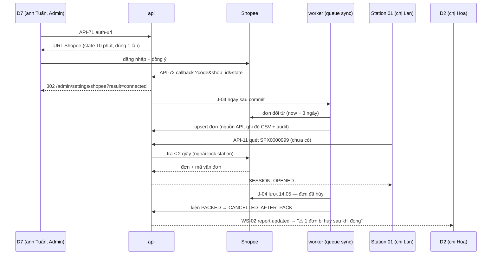

# Lát 4 — Nguồn đơn (M4) — Giải thích nghiệp vụ

| Trường | Giá trị |
|---|---|
| Item / lát | `01-packing-mvp` · lát 4 (milestone M4 Nguồn đơn, [03-plan §4](../../ai/items/01-packing-mvp/03-plan.md)) |
| Yêu cầu | FR-05.01..05.04, 05.06..05.10; FR-10.01..10.03; BR-01, BR-04, BR-17; EX-P10, EX-P11; AC-05, AC-12 — [01-srs](../../ai/items/01-packing-mvp/01-srs.md) |
| Task | BE: T-17, T-16, T-22 (T-3 chờ Shopee duyệt partner) · FE: T-56, T-58, T-59, T-61 |
| Code | `ai-cam-be`: `90a16c6`, `d5f7e05`, `2375a2e` · `ai-cam-fe`: `b09e0f3`, `83cc236`, `c1cb076`, `ac017c0`, `3533ff3`; sửa review G3: be `fd1f2b7` (F4, F5), `01c9f02` (P2-6), `05aeb7e` (P2-12), `409b65d` (N7) (nhánh `feat/01-packing-mvp`) |
| Người đọc | Dev mới vào dự án, reviewer, QA |
| Tác giả | khanhtt (agent soạn) |
| Reviewer | PO (đúng nghiệp vụ) · Tech lead (đúng code) |
| Trạng thái | Draft |
| Last update | 2026-10-05 · Dev (đối chiếu code sau G3: FR-05.07, 10.02 vào thân bài, nhập file không cướp kiện, tra sàn giới hạn, `FERNET_KEY` sai) |

## TL;DR

- Kho cần danh sách đơn trước khi quét. Lát này đưa đơn vào hệ thống bằng 2 đường: tự đồng bộ từ Shopee mỗi 5 phút, hoặc Supervisor nhập file CSV / xlsx khi chưa có quyền Shopee API.
- Quét mã chưa có trong hệ thống → hỏi Shopee tối đa 2 giây (BR-04). Không kịp → vẫn mở phiên "chưa xác minh"; J-05 xác minh lại sau.
- Đơn hủy trên Shopee chặn đóng gói (BR-01). Hủy sau khi đã đóng → `CANCELLED_AFTER_PACK`, báo ở D2 (EX-P10).
- Đơn từ Shopee không bị file ghi đè; đơn từ file bị Shopee ghi đè, bản cũ giữ trong audit (BR-17, FR-05.10). Thêm D9 người dùng, D10 nhật ký.
- **Chưa test với Shopee thật** (thiếu tài khoản partner, T-3): adapter chỉ chạy trên HTTP giả và adapter mock — xem §8.

## 0. Giải thích đơn giản

Đây là phần **"sổ đơn hàng" của kho**. Muốn biết phiếu vừa quét thuộc đơn nào, gồm mấy món, có bị khách hủy chưa, hệ thống phải có danh sách đơn từ trước. Lát này lo việc đưa đơn vào sổ và giữ sổ luôn mới: tự lấy từ Shopee, hoặc nhận file do quản lý tải lên khi chưa nối được Shopee.

**Ý tưởng chính.** Các lát trước đã có quét đóng gói, video và duyệt, nhưng đơn hàng chỉ là dữ liệu mẫu. Lát này thêm 6 việc:
1. Admin nối hệ thống với cửa hàng Shopee một lần. Sau đó đơn tự về sổ, cứ 5 phút một lần.
2. Quét một phiếu chưa có trong sổ thì hệ thống hỏi Shopee ngay, chờ tối đa 2 giây.
3. Phiếu không hỏi kịp vẫn được đóng gói, nhưng bị đánh dấu "chưa xác minh". Hệ thống tự kiểm lại sau.
4. Đơn khách hủy thì không cho đóng. Đã đóng rồi mới hủy thì báo quản lý để giữ hàng lại.
5. Khi chưa nối được Shopee, quản lý tải file danh sách đơn lên (file bảng tính, xuất từ trang người bán).
6. Admin quản lý tài khoản nhân viên và xem nhật ký ai đã làm gì.

### Bước 1 — Nối với cửa hàng Shopee
- Làm gì: Admin vào trang "Kết nối Shopee", bấm "Kết nối Shopee", đăng nhập Shopee và bấm đồng ý. Trang quay về báo "Đã kết nối" kèm tên shop.
- Vì sao: Shopee chỉ cho lấy đơn khi chủ shop đồng ý. Quyền này có hạn. Cứ 30 phút hệ thống kiểm một lần, còn dưới 1 giờ thì tự gia hạn.
- Sự cố thì sao: bấm "Từ chối" trên Shopee → trang báo "Shopee từ chối ủy quyền. Bấm Kết nối lại để thử lần nữa.". Quyền bị thu hồi hoặc không gia hạn được → thẻ shop hiện "Hết hạn", trang Tổng quan có dòng "Cần xử lý", Admin bấm "Kết nối lại".
- Muốn ngắt kết nối: chủ shop thu hồi quyền ngay trên trang người bán của Shopee. Hệ thống không có nút ngắt riêng.

### Bước 2 — Đơn tự về sổ
- Làm gì: cứ 5 phút hệ thống hỏi Shopee "có đơn nào mới hoặc vừa đổi không?", rồi chép mã đơn, mã vận đơn từng kiện, sản phẩm, phân loại, số lượng, ghi chú. Mỗi lần hỏi lùi lại thêm 10 phút so với lần trước để không sót đơn đổi đúng lúc giao ca.
- Một đơn có 2 mã vận đơn (giao 2 kiện) thì thành 2 kiện, mỗi kiện đóng gói một phiên riêng.
- Sự cố thì sao: Shopee chậm hay quá tải thì hệ thống thử lại tối đa 5 lần, mỗi lần chờ lâu hơn. Vẫn lỗi thì trang "Kết nối Shopee" và trang Tổng quan báo "Đồng bộ lỗi lúc …". Lần sau tự thử tiếp, không mất đơn. Admin bấm được "Đồng bộ ngay" nếu không muốn chờ 5 phút.

### Bước 3 — Quét phiếu chưa có trong sổ
- Làm gì: người đóng gói quét một phiếu mà sổ chưa có (đơn vừa đặt chưa tới lượt đồng bộ). Hệ thống hỏi Shopee ngay, chờ tối đa 2 giây.
- Shopee trả lời kịp → đơn vào sổ, phiên mở bình thường.
- Không kịp, hoặc Shopee không biết mã này → phiên vẫn mở, màn có chip "Chưa xác minh với Shopee".
- Vì sao không chờ lâu hơn: người đứng bàn cần phản hồi trong 1–2 giây. Kho không được đứng vì mạng chậm.
- Sau đó: cứ 10 phút hệ thống hỏi lại Shopee các kiện "chưa xác minh" của 7 ngày gần nhất. Tìm được đơn thì gắn vào kiện và bỏ chip.

### Bước 4 — Đơn hủy
- Khách hủy trước khi đóng → quét phiếu thấy màn vàng "ĐƠN ĐÃ HỦY", không mở phiên. Không ai mất công đóng một đơn không giao.
- Khách hủy sau khi đã đóng, kiện còn trong kho → kiện chuyển "hủy sau khi đóng". Trang Tổng quan báo "⚠ 1 đơn bị hủy sau khi đóng" để kho rút kiện ra trước khi giao cho bên vận chuyển.
- Mỗi 15 phút hệ thống cũng hỏi Shopee trạng thái vận chuyển (đã lấy hàng, đã giao) cho các kiện đã đóng, để dòng thời gian của kiện đủ mốc.

### Bước 5 — Nhập đơn từ file khi chưa nối Shopee
- Làm gì: quản lý mở trang "Nhập đơn", tải file mẫu, điền hoặc dán danh sách đơn, tải file lên (tối đa 5 MB, 5.000 dòng). Hệ thống cho xem trước: bao nhiêu đơn mới, bao nhiêu đơn cập nhật, bao nhiêu bỏ qua, 20 dòng đầu. Bấm "Nhập N đơn" mới thật sự ghi (N = mới + cập nhật; ví dụ file 500 đơn, 5 đơn đã có từ Shopee bị bỏ qua → "Nhập 495 đơn").
- File có dù chỉ 1 dòng lỗi (bỏ trống mã vận đơn, số lượng không phải số, một mã vận đơn cho 2 đơn…) → không nhập dòng nào. Màn ghi rõ dòng nào, cột nào, lý do gì. Vì sao: nhập một nửa thì không ai biết đơn nào đã vào, đơn nào chưa.
- Bản xem trước giữ 30 phút. Chỉ người tải file lên mới bấm nhập được, để nhật ký ghi đúng người chịu trách nhiệm.
- File gốc được lưu 90 ngày và tải lại được từ "Lịch sử nhập", để đối chiếu khi có tranh chấp.

### Bước 6 — Shopee và file cùng có một đơn: ai thắng?
- Đơn đã lấy từ Shopee → dòng trong file bị bỏ qua, ghi "Bỏ qua (đã có từ Shopee)". Vì sao: dữ liệu Shopee là bản gốc; file do người gõ có thể sai.
- Đơn nhập từ file, sau đó Shopee cũng trả về → bản Shopee ghi đè. Bản cũ từ file vẫn giữ trong nhật ký để xem lại.
- Kiện đã đóng không bị đẩy lùi trạng thái khi đơn được cập nhật. Chỉ thông tin đơn đổi.
- File không "cướp" kiện của đơn khác: mã vận đơn đã thuộc đơn khác trong hệ thống → báo lỗi dòng ngay ở bước xem trước. Nếu trong lúc chờ bấm Nhập, mã đó vừa bị gắn vào đơn khác (do đồng bộ Shopee hoặc quét), lần nhập bị hủy cả file với thông báo "Dữ liệu đơn vừa thay đổi trong lúc nhập. Bấm Nhập lại.".

### Bước 7 — Người dùng và nhật ký
- Admin tạo tài khoản, đổi vai, đặt lại mật khẩu, khóa / mở khóa. Hệ thống không cho khóa hay hạ vai Admin cuối cùng: "Phải còn ít nhất một Admin.".
- Máy trạm bị mất hay đổi máy → Admin bấm "Thu hồi phiên đăng nhập" ở tài khoản bàn đó. Trong tối đa 15 phút, bàn tự về màn đăng nhập.
- Mỗi vai chỉ thấy menu và màn của mình; mở đường dẫn không đủ quyền → trang "Không có quyền" (D12). Máy chủ cũng chặn (403), nên giấu nút không phải lớp bảo vệ duy nhất.
- Trang "Nhật ký thao tác" liệt kê ai làm gì lúc nào: đăng nhập, xem / xuất clip, duyệt, nhập file, đổi cài đặt, kết nối Shopee. Nhật ký chỉ đọc, không ai sửa hay xóa được.

**Ví dụ một vòng đầy đủ.** Thứ Hai, shop chưa được Shopee cấp quyền. 8:00, chị Hoa (quản lý) xuất danh sách 500 đơn từ trang người bán, vào trang "Nhập đơn", tải file lên. Trong 1 giây màn hiện "Mới 500 · Cập nhật 0 · Bỏ qua 0 (đã có từ Shopee) · Lỗi 0". Chị bấm "Nhập 500 đơn", màn báo "Đã nhập 500 đơn.". 8:05, chị Lan ở bàn số 1 quét phiếu "SPXCSV0000250", phiên mở bình thường. Thứ Tư, Shopee duyệt quyền. Anh Tuấn (Admin) bấm "Kết nối Shopee", đồng ý trên Shopee, thẻ shop hiện "Đã kết nối". 5 phút sau, lần đồng bộ đầu lấy đơn 3 ngày gần nhất. Đơn của phiếu "SPXCSV0000250" có trên Shopee, nên bản Shopee ghi đè bản từ file, nhật ký giữ bản cũ. 10:20, chị Lan quét "SPX0000999", một đơn khách vừa đặt 2 phút trước. Sổ chưa có, hệ thống hỏi Shopee và có kết quả sau 0,8 giây, phiên mở ngay. 14:00, khách của đơn chị Lan đóng lúc 8:05 bấm hủy. Lần đồng bộ 14:05 thấy đơn hủy. Kiện chuyển "hủy sau khi đóng", trang Tổng quan của chị Hoa hiện "⚠ 1 đơn bị hủy sau khi đóng". Chị rút kiện ra trước giờ bên vận chuyển tới lấy.

**Lưu ý.**
- **Chưa thử với Shopee thật.** Shop chưa có tài khoản đối tác của Shopee. Toàn bộ phần Shopee chạy với một "Shopee giả" trả lời theo tài liệu công khai. Đăng nhập Shopee thật, câu báo lỗi thật, tên các trạng thái vận chuyển và giới hạn số lần hỏi mỗi phút đều chưa kiểm.
- Shopee không công bố cách tìm đơn theo mã vận đơn. Tạm thời, khi quét phiếu chưa có, hệ thống dò các đơn đổi trong 60 phút gần nhất — mỗi lần quét chỉ đọc 1 trang danh sách và hỏi tối đa 10 đơn, để không tốn hạn mức. Đơn cũ hơn sẽ thành "chưa xác minh" rồi được kiểm lại sau. Cách này cần xác nhận khi có tài khoản thật.
- Khôi phục máy chủ mà dùng sai khóa mã hóa (`FERNET_KEY`) → hệ thống không đọc được token Shopee đã lưu. Quét vẫn chạy (kiện "chưa xác minh"); thẻ shop chuyển "Hết hạn", Admin bấm "Kết nối lại".
- Nhập file Excel thật trên trình duyệt chưa thử, mới thử file CSV (file bảng tính dạng chữ, mỗi dòng một sản phẩm).
- Thu hồi phiên đăng nhập bàn mới kiểm tới bước hệ thống nhận lệnh. Chưa đợi đủ 15 phút để xem bàn tự về màn đăng nhập.

## 1. Vì sao cần

Không có sổ đơn thì quét chỉ biết "một mã vận đơn", không biết đơn đã hủy (BR-01, AC-05), không biết đơn có mấy món, cũng không có dòng thời gian vận chuyển cho CSKH (P3). Quyền Shopee Open Platform chưa chắc có (Q11, RK-01), nên DEC-2 chọn hai đường: Shopee API, cộng nhập CSV dự phòng ngang hàng (FR-05.09 nâng lên M).

| Lát này làm (Goals) | Lát này không làm (Non-goals — ở lát / phase nào) |
|---|---|
| API-50..54 nhập CSV / xlsx, xem trước, BR-17, file gốc 90 ngày (T-17) | Kiểm với Shopee thật: OAuth, mã lỗi, bảng trạng thái, rate limit (T-3, chờ duyệt partner) |
| Adapter Shopee v2 (HMAC, OAuth, refresh, thử lại theo `Retry-After`), API-70..73, tra 2 giây khi quét (T-16) | Token bucket theo shop (ADR-007) — chờ hạn mức thật |
| J-04, J-05, J-06, J-12 trên queue `sync` (T-22) | API ngắt kết nối shop; `held_clips` trong API-81 (DEC-63, backlog) |
| D5, D7, D8, D9, D10 (T-56, T-58, T-59); E2E BE thật 37 bài (T-61) | Return request (FR-05.05, Phase 2); TikTok / Lazada (Phase 3) |

## 2. Ai dùng, ở đâu, khi nào

| Vai | Màn hình / điểm vào | Lúc nào dùng |
|---|---|---|
| Admin | `/admin/settings/shopee` (D7) | Kết nối lần đầu, kết nối lại khi hết hạn, "Đồng bộ ngay" |
| Admin, Supervisor | `/admin/imports` (D5) | Chưa có quyền Shopee, hoặc Shopee lỗi kéo dài |
| Admin | `/admin/settings/storage` (D8) | Đổi số ngày giữ video, ngưỡng phiên; xem sức khỏe hệ thống |
| Admin | `/admin/settings/users` (D9), `/admin/settings/audit` (D10) | Nhân viên mới / nghỉ việc, mất máy trạm, tra ai đã làm gì |
| Station | `/station` — quét phiếu chưa có trong sổ | Đơn vừa đặt, chưa tới lượt đồng bộ |
| Job J-04 / J-05 / J-06 / J-12 | Nền, queue `sync`, beat 5 / 10 / 15 / 30 phút | Chỉ chạy khi `SHOPEE_ENABLED=true` |

## 3. Tình huống thực tế

| # | Tình huống | Hệ thống làm gì | Vì sao |
|---|---|---|---|
| 1 | Quét mã chưa có, Shopee trả lời trong 0,8 giây | Upsert đơn (nguồn `API`, gắn `shop_id`), mở phiên bình thường | FR-05.06 |
| 2 | Quét mã chưa có, Shopee im lặng quá 2 giây | Mở phiên, kiện `verified = false`, chip "Chưa xác minh với Shopee"; J-05 tra lại sau | BR-04: không để kho đứng vì sàn |
| 3 | Shop chưa kết nối / `SHOPEE_ENABLED=false` | Không gọi Shopee, mở phiên "chưa xác minh" | Không tốn 2 giây chờ vô ích |
| 4 | Đơn `NEW` bị hủy trên sàn | J-04 → kiện `CANCELLED`; quét → S4 "ĐƠN ĐÃ HỦY", không có phiên | BR-01, AC-05 |
| 5 | Đơn `PACKED` bị hủy | J-04 / J-06 → `CANCELLED_AFTER_PACK`; D2 "Cần xử lý" | EX-P10 |
| 6 | File 500 dòng hợp lệ | Xem trước + nhập 1,1 giây (live) | AC-12 ≤ 30 giây |
| 7 | File có dòng 12 bỏ trống mã vận đơn | 201 xem trước kèm lỗi; commit 409 `IMPORT_HAS_ERRORS`; 0 đơn | EX-P11 |
| 8 | File có 5 đơn đã lấy từ Shopee | `counts.skipped` = 5; đơn giữ nguồn `API`, sản phẩm không đổi; D5 khóa nút Nhập nếu không còn đơn nào | BR-17 |
| 9 | Đơn nhập từ file, sau đó J-04 thấy trên Shopee | Ghi đè, `source = API`, audit `ORDER_OVERWRITTEN_BY_API` giữ bản CSV | FR-05.10 |
| 10 | Đồng bộ Shopee đang ghi đúng đơn đó lúc bấm Nhập | 409 `IMPORT_CONFLICT` "Dữ liệu đơn vừa thay đổi trong lúc nhập. Bấm Nhập lại." | Không ghi đè lẫn nhau, không 500 |
| 11 | Refresh token bị Shopee từ chối | Shop `EXPIRED`, `last_error AUTH_EXPIRED`; D7 "Hết hạn" + "Kết nối lại"; D2 dòng lỗi đồng bộ | Cần người cấp quyền lại |
| 12 | Refresh lỗi do mạng | Giữ `CONNECTED`, `last_error REFRESH_FAILED`, 30 phút sau thử lại | Không bắt Admin kết nối lại vì mạng chập chờn (DEC-124) |
| 13 | File có mã vận đơn đã thuộc đơn khác trong hệ thống | Lỗi dòng ở xem trước; commit bị chặn | Không cướp kiện của đơn khác (G3-F5) |
| 14 | Sau xem trước, J-04 / quét gắn mã vận đơn đó vào đơn khác; rồi mới bấm Nhập | Commit đọc lại kiện `FOR UPDATE`, thấy đã thuộc đơn khác → rollback cả lần nhập, 409 `IMPORT_CONFLICT`; deadlock / ghi đồng thời ở DB cũng ra 409 này | G3-F5, 02 v0.7 (DEC-67) |
| 15 | Quét mã chưa có khi Shopee có hàng trăm đơn mới trong 60 phút | Tra chỉ đọc 1 trang danh sách (100 đơn), hỏi ≤ 10 mã vận đơn, bỏ qua đơn đã biết mã; không thấy → `UNVERIFIED`, J-05 tra lại | Giữ quét ≤ 2 giây và không đốt hạn mức (G3-P2-12, DEC-158) |
| 16 | Khôi phục máy chủ với `FERNET_KEY` khác bản đã mã hóa token | Không giải mã được token → shop `EXPIRED`, `last_error CREDENTIALS_UNREADABLE`; quét mã lạ vẫn 200 `SESSION_OPENED` kiện `UNVERIFIED` | Quét không bao giờ 500 vì tra sàn; D7 "Kết nối lại" (DEC-159 02a, 02 v0.7) |
| 17 | CSKH gõ `/admin/settings/shopee` | FE hiện D12 "Không có quyền"; API-70 trả 403 | FR-10.02: phân quyền theo vai, chặn ở cả server |

## 4. Luồng ví dụ từ đầu đến cuối

1. **Thứ Hai 8:00** — Chị Hoa (`SUPERVISOR`) tải `don-05-10.csv` lên D5. API-50 đọc file (CSV `,` / `;` / tab, UTF-8 có / không BOM), phân loại từng đơn, lưu file gốc vào volume `imports`, trả 201 `PREVIEW` với `counts`, 20 dòng `sample`, `expires_at` = 8:30.
2. Chị bấm "Nhập 500 đơn". API-51 đọc lại file gốc, phân loại lại trong transaction, tạo đơn nguồn `CSV`, kiện `NEW`, `status_history` nguồn `MANUAL` "Nhập đơn từ file", audit `IMPORT_COMMIT`.
3. **Thứ Tư 9:00** — Anh Tuấn kết nối Shopee (API-71 → Shopee → API-72). Shop `CONNECTED`, token mã hóa Fernet, audit `SHOP_CONNECT`, J-04 chạy ngay với `since` = now − `SHOPEE_INITIAL_SYNC_DAYS` (3 ngày).
4. J-04 gặp đơn đã có nguồn `CSV` → `upsert_platform_order` ghi đè, audit `ORDER_OVERWRITTEN_BY_API` giữ bản CSV. Kiện đã `PACKED` giữ `warehouse_status`.
5. **10:20** — Chị Lan quét `SPX0000999`. API-11 không thấy trong DB, đọc token shop trước, rồi bấm giờ 2 giây cho lời gọi Shopee (ngoài lock station, trong savepoint). Có kết quả sau 0,8 giây → upsert đơn, mở phiên.
6. **14:05** — J-04 thấy đơn đã đóng lúc 8:05 bị hủy. Mọi kiện đã gắn đơn: `PACKED` → `CANCELLED_AFTER_PACK`. WS-02 `report.updated`, D2 hiện mục cần xử lý.
7. J-06 (15 phút) hỏi trạng thái vận chuyển theo lô 50 kiện. `LOGISTICS_PICKUP_DONE` → `HANDED_OVER`, giao xong → `DELIVERED` (kiện `PACKED` đi 2 bước theo bảng chuyển 01 §7).

## 5. Quy tắc nghiệp vụ và lý do

| Quy tắc | Con số / điều kiện | Vì sao | ID |
|---|---|---|---|
| Kết nối shop qua OAuth | `state` một lần, 10 phút, gắn người tạo URL; không `code` → `denied`; state sai → `error`; MVP một shop, kết nối shop khác → shop cũ `DISCONNECTED` | Chống CSRF; chủ shop phải đồng ý | FR-05.01, DEC-12, DEC-122 |
| Tự làm mới token | J-12 30 phút, làm mới khi còn < 1 giờ; bị từ chối → `EXPIRED`; lỗi tạm → giữ `CONNECTED` | Không mất đồng bộ âm thầm; không báo động giả | FR-05.01, DEC-124 |
| Đồng bộ đơn | J-04 5 phút; `since` = cursor − 10 phút; commit mỗi 50 đơn; lỗi cuối → `last_error SYNC_FAILED`, cursor giữ nguyên | Không sót đơn khi lệch giờ; lỗi không mất dữ liệu | FR-05.02, 05.03 |
| Adapter theo sàn | Lõi chỉ gọi interface `PlatformAdapter` (`modules/platforms/base.py`); Shopee và mock là 2 bản cài; TikTok / Lazada sau này cài cùng interface | Thêm sàn không đổi lõi nghiệp vụ | FR-05.07 (thiết kế; adapter sàn thứ 2 → Phase 3) |
| Thử lại khi gọi sàn | 5 lần, giãn cách 0,5 / 1 / 2 / 4 giây hoặc theo `Retry-After`; ghi log mọi lần gọi | Sàn giới hạn tần suất | FR-05.08 |
| Tra khi quét | ≤ 2 giây, chỉ khi có shop `CONNECTED`; ≤ 1 trang danh sách + ≤ 10 lần hỏi mã vận đơn; không kịp / token không đọc được / lỗi bất ngờ → "chưa xác minh" | Quét phản hồi ≤ 1–2 giây; không 500 vì sàn | BR-04, FR-05.06, DEC-158, DEC-159 |
| Xác minh lại | J-05 10 phút, ≤ 50 kiện chưa xác minh, chưa gắn đơn, trong 7 ngày | Gỡ chip khi sàn đã có đơn | BR-04 |
| Đơn hủy | Áp cho mọi kiện đã gắn đơn: `NEW` → `CANCELLED`, `PACKED` → `CANCELLED_AFTER_PACK` | Chặn đóng đơn hủy; kịp rút kiện đã đóng | BR-01, EX-P10, AC-05 |
| Trạng thái vận chuyển | J-06 15 phút, ≤ 1.000 kiện `PACKED` / `HANDED_OVER`, lô 50 | Dòng thời gian cho CSKH | FR-05.04 |
| Nhập file | ≤ 5 MB, ≤ 5.000 dòng, `.csv` / `.xlsx`; 1 dòng lỗi → từ chối cả file; xem trước 30 phút; chỉ người tạo commit | Không nhập một phần; rõ người chịu trách nhiệm | FR-05.09, EX-P11, AC-12 |
| Ưu tiên nguồn | Đơn `API` không bị file ghi đè; đơn `CSV` bị API ghi đè, audit giữ bản cũ | Sàn là nguồn gốc | BR-17, FR-05.10 |
| Không cướp kiện | Mã vận đơn đã thuộc đơn khác → lỗi dòng (xem trước) / 409 `IMPORT_CONFLICT` (commit) | Một kiện chỉ thuộc một đơn | BR-17, G3-F5 |
| Kiện đã có giữ trạng thái kho | Nhập file / đồng bộ chỉ đổi thông tin đơn | Không đẩy lùi kiện đã đóng | UC-09 ngoại lệ |
| File gốc | Giữ 90 ngày, J-11 xóa; sau đó 410 | Đối chiếu tranh chấp | FR-05.09 |
| Người dùng | Phải còn ≥ 1 Admin; đổi vai / khóa / đổi mật khẩu → thu hồi phiên; thu hồi station hiệu lực ≤ 15 phút | Không tự khóa ngoài hệ thống | FR-10.01, DEC-55 |
| Phân quyền theo vai | Ma trận 01 §5.1; server kiểm mọi API (403); FE drawer theo vai, route cấm → D12 | Giấu nút chưa đủ — chặn ở server | FR-10.02 |
| Nhật ký | Chỉ INSERT; D10 chỉ đọc | Bằng chứng không sửa được | FR-10.03 |

## 6. Điểm dễ hiểu nhầm

- **`counts` đếm dòng hay đơn?** `new` / `updated` / `skipped` đếm **đơn** (mã đơn khác nhau). `error` đếm **dòng** lỗi. Vì vậy "Nhập N đơn" = `new + updated` (DEC-121, DEC-91).
- **File có lỗi sao vẫn trả 201?** Để FE hiện bảng lỗi theo dòng / cột. Chặn nằm ở commit (`IMPORT_HAS_ERRORS`), không ở bước tải.
- **Commit dùng kết quả xem trước?** Không. Commit đọc lại file gốc và phân loại lại, vì trong 30 phút có thể Shopee đã tạo đơn (BR-17).
- **Bấm Nhập lần 2?** Trả 200 với kết quả cũ, không nhập trùng.
- **Supervisor tải file, Admin bấm Nhập được không?** Không, 403 `FORBIDDEN`. Chỉ người tạo bản xem trước (DEC-62).
- **Đơn hủy mà kiện không còn mã vận đơn trên sàn?** Shopee thường bỏ mã vận đơn khỏi đơn hủy, nên hủy áp theo **đơn** cho mọi kiện đã gắn, không theo mã vận đơn.
- **Tra theo mã vận đơn gọi API nào của Shopee?** Không có API công khai. Adapter dò đơn cập nhật `SHOPEE_LOOKUP_LOOKBACK_MIN` phút rồi `get_tracking_number` từng đơn (song song 5), nhớ cặp mã → đơn (DEC-123, cần xác nhận ở T-3).
- **Tắt Shopee thì sao?** `SHOPEE_ENABLED=false`: API-71 / 73 trả 503 `PLATFORM_NOT_CONFIGURED`, D7 gợi ý "Dùng Nhập đơn từ file", job sàn không làm gì, quét không tra sàn. Kể cả khi `PLATFORM_ADAPTER=mock`.
- **Sao D7 không có nút "Ngắt kết nối", D8 không có "số clip đang giữ"?** MVP không làm (DEC-63). Ngắt ở Seller Center; số clip giữ xem ở D3 bằng lọc.
- **Supervisor đọc được API-80 / 81, sao không vào D8?** Route `/admin/settings/*` chỉ ADMIN (02b-admin §2).

## 7. Bản đồ nghiệp vụ → code

Đường dẫn BE tính từ `ai-cam-be/src/aicam/`, test BE từ `ai-cam-be/tests/`. FE tính từ `ai-cam-fe/src/`, E2E từ `ai-cam-fe/e2e/`.

| Khái niệm nghiệp vụ | Code | Test chứng minh |
|---|---|---|
| Đọc file CSV / xlsx, lỗi theo dòng / cột | `modules/imports/parser.py`, `imports/template.csv` | `unit/test_imports_parser.py`: `test_reads_rows_upper_tracking_and_skips_blank_lines`, `test_cell_errors_reported_per_row_and_column`, `test_whole_file_invalid`, `test_extension` |
| Xem trước, commit, BR-17, file gốc (API-50..54) | `modules/imports/service.py`, `imports/router.py`, `imports/schemas.py`, `imports/models.py` | `integration/test_imports_api.py`: `test_ok_500_preview_commit_history`, `test_one_error_rejects_whole_file`, `test_missing_column`, `test_too_big_and_too_many_rows`, `test_overlap_api_orders_are_skipped`, `test_update_csv_order_keeps_package_status_and_links_unverified`, `test_tracking_conflicts_are_row_errors`, `test_preview_expires`, `test_original_file_and_expiry`, `test_xlsx_and_semicolon_csv`, `test_permissions_and_template` |
| Upsert đơn sàn, đơn hủy, ghi đè CSV (BR-17, EX-P10) | `modules/orders/service.py` (`upsert_platform_order`, `transition`) | `integration/test_imports_api.py::test_api_overwrites_csv_order_keeps_history`, `integration/test_platform_jobs.py::test_j04_overwrites_csv_order`, `test_j04_cancel_after_pack` |
| Interface adapter, mock (FR-05.07) | `modules/platforms/base.py`, `platforms/mock/adapter.py` | (dùng trong mọi test job) |
| Nhập file không cướp kiện (G3-F5) | `modules/orders/service.py` (`CsvWriteConflict`), `imports/service.py` | `integration/test_imports_api.py`: `test_tracking_conflicts_are_row_errors`, `test_commit_does_not_steal_package_claimed_after_classify` |
| Tra sàn giới hạn / `FERNET_KEY` sai | `platforms/shopee/adapter.py` (`LOOKUP_MAX_CANDIDATES`), `platforms/service.py` (`CREDENTIALS_UNREADABLE`), `sessions/service.py` (`_lookup_platform`) | `unit/test_shopee_adapter.py::test_find_by_tracking_bounded_per_scan`; `integration/test_station_scan_api.py`: `test_unreadable_shop_token_does_not_break_scan`, `test_unexpected_lookup_error_falls_back_to_unverified` |
| Adapter Shopee: ký, OAuth, thử lại, ánh xạ trạng thái | `modules/platforms/shopee/client.py`, `shopee/adapter.py`, `shopee/mapping.py` | `unit/test_shopee_adapter.py`: `test_auth_partner_url_signed_with_public_base`, `test_exchange_code_and_shop_call_signature`, `test_refresh_rejected_is_auth_error`, `test_retry_503_twice_then_ok`, `test_rate_limit_respects_retry_after_and_error_code`, `test_gives_up_after_max_attempts`, `test_find_by_tracking_scans_recent_then_caches`, `test_shipping_statuses`, `test_warehouse_hint_mapping` |
| Kết nối shop, đồng bộ ngay, tra 2 giây khi quét (API-70..73) | `modules/platforms/service.py`, `platforms/router.py`, `platforms/schemas.py`, `modules/sessions/service.py` (`_lookup_platform`) | `integration/test_shops_api.py`: `test_not_configured`, `test_connect_flow`, `test_callback_denied_and_bad_state`, `test_reconnect_other_shop_disconnects_old`, `test_sync_now`, `test_scan_lookup_with_shopee_adapter`, `test_scan_lookup_shopee_slow_cut_at_2s`, `test_scan_without_connected_shop_does_not_call_shopee` |
| J-04, J-05, J-06, J-12 | `modules/platforms/sync.py`, `workers/tasks.py`, lịch beat `workers/celery_app.py` | `integration/test_platform_jobs.py`: `test_j04_new_orders`, `test_j04_since_cursor_minus_10_minutes`, `test_j04_platform_error_sets_last_error`, `test_j04_shopee_503_twice_then_ok`, `test_j04_lock_and_disabled`, `test_j04_auth_error_refreshes_once_then_expired`, `test_j05_verify_unverified`, `test_j06_shipping`, `test_j06_packed_straight_to_delivered_and_cancel`, `test_j12_refresh` |
| Toàn luồng trên stack thật | — | `qa/test_m4_live.py`: `test_csv_ok_500` (AC-12, 1,1 giây), `test_csv_one_error`, `test_csv_missing_column`, `test_csv_too_big`, `test_csv_overlap_api`, `test_csv_permissions_and_template`, `test_shopee_connect_or_not_configured`, `test_shopee_sync_now_runs_on_worker` (2 bài Shopee chạy riêng với `SHOPEE_ENABLED=true` + adapter mock); fixtures `qa/fixtures/csv/` |
| D5 Nhập đơn | FE `features/imports/` (`ImportsPage.tsx`, `ImportDropzone.tsx`, `ImportPreview.tsx`, `ImportHistoryTable.tsx`, `rules.ts`, `copy.ts`), `lib/api/imports.ts`, `shared/download.ts` | `features/imports/ImportsPage.test.tsx` (TC-05.11, 05.12, 05.13, 05.15, 05.17, 05.18, 05.21, TC-P.06); E2E `real/admin-d5.spec.ts` (TC-05.11..13) |
| D7 Shopee | FE `features/platforms/ShopeePage.tsx`, `lib/api/shops.ts` | `features/platforms/ShopeePage.test.tsx` (TC-05.01..03, 05.09, 05.10 phần UI, TC-P.08) |
| D8 Lưu trữ + sức khỏe | FE `features/settings/StoragePage.tsx`, `HealthPanel.tsx`, `rules.ts`, `lib/api/settings.ts` | `features/settings/StoragePage.test.tsx`; E2E `real/admin-settings.spec.ts` |
| D9 Người dùng, D10 Nhật ký | FE `features/users/` (`UsersPage.tsx`, `UserTable.tsx`, `UserDialog.tsx`, `rules.ts`), `features/audit/AuditPage.tsx`, `lib/api/users.ts`; BE `modules/users/` | `features/users/UsersPage.test.tsx` (TC-10.06..08, TC-P.09), `features/audit/AuditPage.test.tsx`; E2E `real/admin-users.spec.ts`; BE `integration/test_auth_users_api.py` |
| Helper test FE (sửa lỗi test M4) | `test/scan.ts` (`hidScan`), `test/nodeFormData.ts` (`withNodeFormData`) | Bộ `pnpm test` 274 bài pass |

## 8. Giới hạn hiện tại và giả định

| Giới hạn / giả định | Ảnh hưởng | Khi nào xử lý |
|---|---|---|
| **Chưa test với Shopee thật (T-3).** OAuth thật, `state` trong redirect, mã lỗi thật, bảng trạng thái vận chuyển (`shopee/mapping.py`), hạn mức rate limit | Kết nối / đồng bộ có thể lỗi khi bật thật; ánh xạ trạng thái có thể sai | Khi Shopee duyệt partner: chạy TC-05.01, 05.02 thủ công, sửa adapter |
| Tra theo mã vận đơn dò đơn cập nhật 60 phút gần nhất (DEC-123) | Đơn cũ hơn 60 phút chưa đồng bộ → "chưa xác minh", J-05 xử lý sau | Xác nhận API với Shopee ở T-3 |
| Token bucket theo shop (ADR-007) chưa làm; chỉ có thử lại theo `Retry-After` | Có thể chạm giới hạn khi nhiều job + quét cùng lúc | Sau khi biết hạn mức thật |
| Không có API ngắt kết nối shop, không có `held_clips` (DEC-63) | Ngắt ở Seller Center; số clip giữ xem ở D3 | Backlog sau MVP |
| `.xlsx` thật chưa thử trên trình duyệt (mock FE trả 3 đơn cố định; BE có test xlsx) | Có thể lệch định dạng ô từ Seller Center (Q12) | Khi có file mẫu thật của shop |
| TC-10.06 mới kiểm tới API-91 204, chưa đợi 15 phút | Hành vi "tự về đăng nhập" chưa có bằng chứng E2E | QA G4 |
| `409 IMPORT_CONFLICT` chưa có test (khó dựng đụng độ ổn định) | Nhánh lỗi hiếm chưa chứng minh | Contract test T-19 nếu cần |
| Không có metric Prometheus cho đồng bộ; chỉ log `platform_sync`, `platform_token_*`, `shopee_call` | Không có biểu đồ lỗi Shopee | Sau MVP |

## Liên kết

- SRS: [01-srs.md](../../ai/items/01-packing-mvp/01-srs.md) v0.4: FR-05.01..05.04, 05.06..05.10, FR-10.01..10.03, BR-01, 04, 17, EX-P10, EX-P11, AC-05, AC-12, DEC-2, Q11, Q12
- Spec: [02 §6](../../ai/items/01-packing-mvp/02-tech-spec.md) API-50..54, 70..73, §8 Adapter sàn (v0.5, DEC-62, DEC-63) · [02a](../../ai/items/01-packing-mvp/02a-be-spec.md) §7 job, DEC-121..124 · [02b-admin](../../ai/items/01-packing-mvp/02b-fe-spec-admin.md) D5, D7–D10, DEC-91..93
- Kiến trúc: [ADR-007](../../ai/system/decisions/ADR-007-platform-adapter-polling.md) (adapter sàn, polling, rate limit)
- Test cases: [04](../../ai/items/01-packing-mvp/04-test-cases.md) TC-05.01..05.21, TC-10.06..10.10, TC-P.06, P.08, P.09 (DEC-64)
- Lát trước: [lat-01-quet-dong-goi.md](lat-01-quet-dong-goi.md) (quét, BR-01, BR-04), [lat-03-cam2-va-duyet.md](lat-03-cam2-va-duyet.md)
