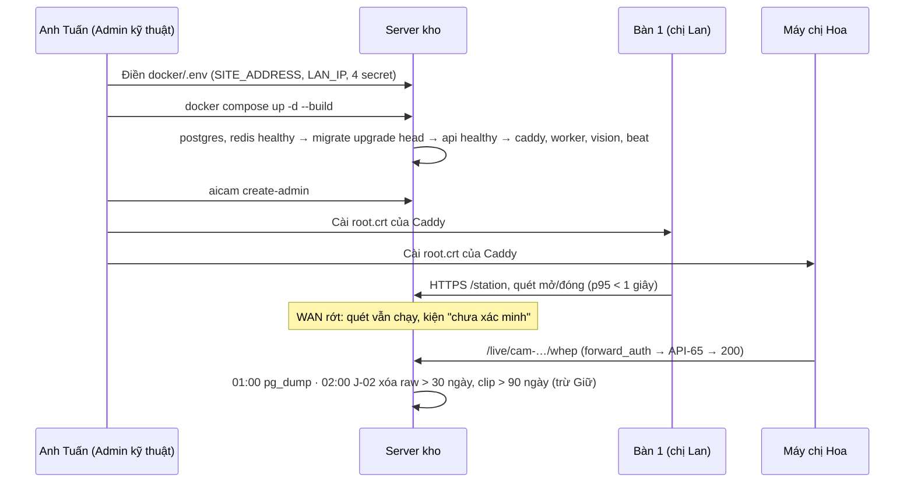

# Lát 5 — Hoàn thiện và vận hành tại kho (M5) — Giải thích nghiệp vụ

| Trường | Giá trị |
|---|---|
| Item / lát | `01-packing-mvp` · lát 5 (milestone M5 Hoàn thiện, [03-plan §4](../../ai/items/01-packing-mvp/03-plan.md)) |
| Yêu cầu | NFR-01, NFR-05, NFR-09, NFR-10, NFR-30; BR-09 (retention); AC-01, AC-09 — [01-srs](../../ai/items/01-packing-mvp/01-srs.md), NFR-10 / NFR-30 theo [SRS hệ thống](../../ai/system/SRS.md) |
| Task | BE: T-19 (contract test + test tải + compose production + Caddyfile + README vận hành) |
| Code | `ai-cam-be`: `e2a88a5`, `5d83c09`, `f1cf83a`, `cd5183a` (nhánh `feat/01-packing-mvp`) |
| Người đọc | Dev mới vào dự án, reviewer, QA, người cài đặt tại kho |
| Tác giả | khanhtt (agent soạn) |
| Reviewer | PO (đúng nghiệp vụ) · Tech lead (đúng code) |
| Trạng thái | Draft |
| Last update | 2026-10-05 · Dev |

## TL;DR

- Hệ thống là **bằng chứng đóng gói**: chỉ có giá trị nếu chạy liên tục tại kho, không mất video, không mất dữ liệu, và ai xem được gì đúng quyền. Lát này không thêm màn hình mới; nó làm cho các lát trước **dựng được, chạy bền, kiểm chứng được** tại kho.
- Một lệnh dựng toàn bộ stack production (Docker Compose), có HTTPS nội bộ, migration chạy trước API, sao lưu DB hằng ngày lúc 01:00, video thô giữ 30 ngày / clip 90 ngày (J-02).
- Contract test (119 bài) giữ BE khớp hợp đồng API mà FE dựa vào; test tải trên máy dev: quét p95 50–80 ms (yêu cầu ≤ 1 giây).
- Live view chỉ Admin / Supervisor; log không lộ token, mật khẩu, chữ ký URL.
- **Chưa test trên server kho thật**: khôi phục sao lưu, live view qua LAN, cài chứng chỉ trên máy trạm, NAS, nâng cấp / rollback trên dữ liệu thật, tải 1 giờ với camera thật — xem §8.

## 0. Giải thích đơn giản

Đây là phần **"lắp đặt và bảo hành" của hệ thống**. Các lát trước đã làm xong việc quét, quay video, duyệt, lấy đơn. Nhưng tất cả mới chạy trên máy của lập trình viên. Lát này trả lời câu hỏi: mang về kho thì cài thế nào, chạy có bền không, hỏng thì cứu thế nào, và làm sao biết nó vẫn đúng sau mỗi lần sửa.

Vì sao phần này quan trọng với một hệ thống bằng chứng: khi khách khiếu nại "thiếu hàng", shop cần mở được đúng video của kiện đó. Nếu hôm đó máy chủ sập, ổ đầy, dữ liệu mất, hoặc ai cũng xem được camera, thì bằng chứng mất giá trị.

**Ý tưởng chính.** Lát này lo 7 việc:
1. Chạy ngay tại kho, không phụ thuộc Internet cho việc đóng gói.
2. Một lệnh là dựng xong toàn bộ hệ thống.
3. Kết nối an toàn giữa máy trạm và máy chủ trong kho.
4. Tự dọn video cũ, tự sao lưu dữ liệu.
5. Nâng cấp phiên bản mới mà không phá dữ liệu cũ.
6. Bộ kiểm tra tự động giữ cho phần màn hình và phần máy chủ luôn "nói cùng một ngôn ngữ".
7. Đo chứng minh quét đủ nhanh, và giữ bí mật (mật khẩu, quyền xem camera).

### Bước 1 — Chạy tại kho, mất Internet vẫn đóng gói
- Làm gì: toàn bộ hệ thống nằm trên một máy chủ đặt trong kho, nối với camera và các bàn đóng gói qua mạng nội bộ.
- Vì sao: Internet ở kho có thể rớt. Nếu máy chủ nằm trên mạng ngoài, rớt mạng là cả kho đứng.
- Sự cố thì sao: mất Internet thì chỉ phần lấy đơn từ Shopee dừng. Quét, quay video, cắt clip vẫn chạy. Phiếu chưa có trong sổ được đóng gói ở trạng thái "chưa xác minh", có mạng lại hệ thống tự kiểm.

### Bước 2 — Một lệnh dựng toàn bộ
- Làm gì: người cài đặt điền một file cấu hình (địa chỉ máy chủ, vài mật khẩu bí mật tự sinh), rồi chạy một lệnh. Hệ thống tự dựng cơ sở dữ liệu, hàng đợi việc, bộ ghi hình camera, phần xử lý, cổng web.
- Vì sao: kho không có kỹ sư thường trực. Càng ít bước tay càng ít sai.
- Sự cố thì sao: thiếu mật khẩu bí mật, hoặc để mật khẩu mẫu dành cho máy lập trình → hệ thống từ chối khởi động và nói rõ thiếu gì. Thà không chạy còn hơn chạy với khóa ai cũng biết. Máy chủ khởi động lại, hoặc một phần bị treo → tự bật lại.

### Bước 3 — Kết nối an toàn trong kho
- Làm gì: máy trạm và máy quản lý mở hệ thống qua địa chỉ "https" (kết nối mã hóa), kể cả trong mạng nội bộ. Máy chủ tự làm "giấy chứng nhận" riêng; mỗi máy trạm cài giấy này một lần để trình duyệt tin.
- Vì sao: phiên đăng nhập được giữ bằng một "vé" mà trình duyệt chỉ gửi qua kết nối mã hóa. Không có https thì không đăng nhập được, và người cùng mạng có thể nghe lén mật khẩu.
- Chỉ một cổng web được mở ra mạng kho. Cơ sở dữ liệu và các phần bên trong không ai trong mạng chạm tới trực tiếp.

### Bước 4 — Tự dọn video, tự sao lưu
- Video thô (quay liên tục cả ngày) giữ 30 ngày. Clip từng kiện giữ 90 ngày. Clip đang "Giữ" vì có tranh chấp thì không bị xóa. Việc dọn chạy lúc 2 giờ sáng.
- Vì sao: 4 camera quay suốt ngày rất tốn ổ. Không dọn thì ổ đầy và camera ngừng ghi đúng lúc cần bằng chứng. Ổ đầy trên 80% thì trang quản lý báo trước.
- Dữ liệu (đơn, kiện, phiên, nhật ký) được sao lưu mỗi ngày lúc 1 giờ sáng, giữ 14 ngày, nên đặt sang ổ khác hoặc NAS (ổ mạng).
- Video không nằm trong bản sao lưu dữ liệu. Video phải đặt trên ổ có bảo vệ riêng (RAID, NAS có chụp nhanh). Mỗi clip có "dấu vân tay" lưu trong dữ liệu để chứng minh clip không bị sửa.

### Bước 5 — Nâng cấp không phá dữ liệu
- Làm gì: trước khi nâng cấp, sao lưu ngay một bản. Khi bật phiên bản mới, bước "sửa cấu trúc dữ liệu" luôn chạy xong rồi phần web mới được bật.
- Vì sao: nếu phần web mới chạy trên cấu trúc dữ liệu cũ, quét sẽ lỗi giữa ca.
- Sự cố thì sao: bản mới lỗi → quay về bản cũ; nặng hơn thì khôi phục dữ liệu từ bản sao lưu vừa làm. Nên nâng cấp ngoài giờ đóng gói. Phiên đang mở nằm trong dữ liệu nên không mất.

### Bước 6 — Màn hình và máy chủ luôn khớp nhau
- Làm gì: có một bộ kiểm tra tự động so từng chức năng của máy chủ với bản "hợp đồng" đã thống nhất: đúng địa chỉ, đúng tên trường, đúng mã lỗi, giờ luôn ghi theo một chuẩn.
- Vì sao: phần màn hình do người khác làm, dựa đúng vào hợp đồng đó. Máy chủ lặng lẽ đổi tên một trường là màn hình hiện trống hoặc báo sai, mà không ai biết cho tới khi kho gặp.
- Thêm chức năng mới mà chưa ghi vào hợp đồng → bộ kiểm tra báo đỏ, buộc ghi lại.

### Bước 7 — Đủ nhanh và kín đáo
- Đủ nhanh: yêu cầu là quét xong có phản hồi trong 1 giây (95% số lần). Đo thử 2 bàn với nhịp thật 120 lần quét / giờ / bàn: 50–80 phần nghìn giây. Ép 4 bàn quét liên tục (gấp khoảng 28 lần nhịp thật): vẫn dưới 0,15 giây, không lỗi lần nào. Đây là đo trên máy lập trình, chưa phải máy chủ kho.
- Kín đáo: nhật ký hệ thống tự che mật khẩu, "vé" đăng nhập và đường dẫn có chữ ký xem video. Ai đọc nhật ký để sửa lỗi cũng không lấy được quyền vào hệ thống.
- Live camera chỉ quản lý (Admin, Supervisor) xem được. Tài khoản bàn đóng gói và CSKH bị chặn, kể cả khi tự gõ đường dẫn.

**Ví dụ một vòng đầy đủ.** Thứ Bảy, anh Tuấn (Admin) cài máy chủ mới tại kho. 9:00 anh điền file cấu hình: địa chỉ "aicam.kho.lan", IP máy chủ 192.168.10.5, 4 mật khẩu bí mật sinh bằng lệnh có sẵn. 9:10 anh chạy một lệnh; 3 phút sau mọi phần báo "khỏe". Anh tạo tài khoản Admin đầu tiên, rồi chép giấy chứng nhận sang 2 máy trạm và máy của chị Hoa (quản lý). 9:40 anh tạo 2 tài khoản bàn, gắn Cam 1 và Cam 2 cho từng bàn, thử kết nối thấy ảnh. Thứ Hai 8:00 chị Lan bắt đầu ca ở bàn số 1, quét phiếu đầu tiên, màn phản hồi gần như tức thì. 10:15 Internet của kho rớt 20 phút: chị Lan vẫn quét đủ 18 kiện, 3 kiện có chip "chưa xác minh"; 10:45 có mạng lại, 10 phút sau cả 3 kiện được xác minh. 11:00 chị Hoa mở live camera bàn số 1 để xem; chị Mai (CSKH) thử mở cùng đường dẫn thì bị từ chối. Đêm đó 1:00 hệ thống tự sao lưu dữ liệu, 2:00 tự xóa video thô của 31 ngày trước. Một tháng sau anh Tuấn nâng cấp bản mới lúc 20:00: sao lưu ngay, chạy lệnh nâng cấp, bước sửa cấu trúc dữ liệu chạy xong rồi web mới bật; sáng hôm sau kho làm việc bình thường.

**Lưu ý.**
- **Mọi thứ trên mới chạy thử trên máy lập trình**, giả lập một "máy chủ kho" (không camera thật, Shopee giả). Chưa cài trên máy chủ thật của kho.
- **Khôi phục từ bản sao lưu chưa từng thử.** Mới tạo được bản sao lưu, chưa đổ ngược vào một cơ sở dữ liệu trống. Sao lưu chưa khôi phục được coi như chưa có. Phải thử trước khi đưa vào dùng.
- Live camera qua mạng kho thật, cài giấy chứng nhận trên máy Windows, đặt video lên NAS, nâng cấp rồi quay lại bản cũ trên dữ liệu thật: đều chưa thử.
- Đo tốc độ mới chạy 10 phút trên máy lập trình, chưa đủ 1 giờ, chưa có camera thật cùng quay và cắt clip.
- Rút Internet 30 phút ngay tại kho chưa thử thực tế. Mới chứng minh bằng test rằng quét không chờ Shopee quá 2 giây.
- Bộ lưu điện (UPS) và tự tắt máy an toàn là việc lắp đặt phần cứng, có hướng dẫn nhưng không nằm trong mã.

## 1. Vì sao cần

Video đóng gói là bằng chứng khi khách khiếu nại hoặc khi đối soát với sàn (BR-09 giữ clip 90 ngày). Bằng chứng chỉ có giá trị nếu: (a) hệ thống chạy suốt ca, kể cả khi mất Internet (NFR-09); (b) quét đủ nhanh để người đóng gói không bỏ qua hệ thống (NFR-01, NFR-05); (c) video và dữ liệu không mất (sao lưu, retention, ổ không đầy — NFR-30); (d) chỉ đúng người xem được camera và không ai lấy được quyền qua log. Không có lát này: hệ thống chỉ chạy trên máy dev, cài tại kho phải làm tay từng bước, lần nâng cấp đầu tiên có thể làm hỏng DB, và không có gì chứng minh FE / BE còn khớp nhau.

| Lát này làm (Goals) | Lát này không làm (Non-goals — ở lát/phase nào) |
|---|---|
| `docker/compose.yml` production: `migrate` trước `api`, `backup`, `caddy`, restart, healthcheck, giới hạn log | CI đẩy image lên registry (MVP build tại chỗ, `AICAM_IMAGE`) — sau MVP |
| Caddy `tls internal`, chỉ mở 80 / 443 / ICE 8189, header bảo mật, che query nhạy cảm trong access log | CSP, HSTS (DEC-137) — sau MVP, cần thử với FE |
| `/live` chỉ ADMIN / SUPERVISOR qua `forward_auth` | Đóng FE vào image Caddy (MVP mount `dist`) |
| Sao lưu `pg_dump` hằng ngày + file nhập; README vận hành `docs/ops.md` | Metric Prometheus đầy đủ, Loki, Sentry (architecture §13) |
| Contract test so 52 API với 02 §6, snapshot `openapi.json`; giờ `Z` thống nhất (RB-11) | Script nạp 1 triệu kiện cho NFR-04 (TC-N.05) |
| Test tải locust profile `nfr05` / `stress` | Đo trên server kho với camera thật (G4 / G5) |

## 2. Ai dùng, ở đâu, khi nào

| Vai | Màn hình / điểm vào | Lúc nào dùng |
|---|---|---|
| Người cài đặt / Admin kỹ thuật | Terminal trên server kho, `ai-cam-be/docs/ops.md`, `docker/.env` | Cài lần đầu, nâng cấp, sự cố, khôi phục |
| Admin | `/admin/settings/*` (người dùng, station, lưu trữ + sức khỏe) | Sau khi dựng stack: tạo tài khoản, gắn camera, chỉnh retention |
| Người đóng gói (STATION) | `https://<SITE_ADDRESS>/station` | Hằng ngày; cần máy đã cài chứng chỉ gốc |
| Admin / Supervisor | `/admin/live` (D11) | Xem camera trực tiếp |
| Dev / reviewer | `uv run pytest tests/contract`, locust | Mỗi lần đổi API; trước release |

## 3. Tình huống thực tế

| # | Tình huống | Hệ thống làm gì | Vì sao |
|---|---|---|---|
| 1 | Người cài quên điền `JWT_SECRET` hoặc dán giá trị `dev-only-…` | Compose dừng và báo tên biến; api từ chối khởi động khi `APP_ENV=production` | Khóa ký vé đăng nhập mà ai cũng biết = ai cũng giả được Admin |
| 2 | Mất Internet giữa ca | Quét, phiên, ghi hình vẫn chạy trên LAN; tra Shopee cắt ở 2 giây → kiện "chưa xác minh"; J-05 xác minh lại khi có mạng | NFR-09: kho không được đứng vì WAN |
| 3 | Dev đổi tên một trường response, quên báo FE | Contract test đỏ (thiếu trường so với 02 §6) hoặc snapshot `openapi.json` lệch | FE sinh client từ `openapi.json`; lệch im lặng = màn hình sai ở kho |
| 4 | CSKH tự gõ `/live/cam-…/whep` | Caddy hỏi `/api/v1/live` → 403; không token → 401 | Ma trận quyền: live view chỉ ADMIN / SUPERVISOR (DEC-136) |
| 5 | Dev mở log Caddy để tìm lỗi WS | Thấy `/ws/station?token=REDACTED`; log app che `password`, `token`, `secret`, `user:pass@` trong URL | Ai đọc log cũng không chiếm được phiên |
| 6 | Nâng cấp bản có migration | `migrate` chạy `alembic upgrade head`, Exited (0) rồi `api` mới lên | API mới không chạy trên schema cũ |

## 4. Luồng ví dụ từ đầu đến cuối

Cài đặt và một ngày vận hành (chi tiết lệnh ở `ai-cam-be/docs/ops.md`):

1. 09:00 anh Tuấn chép `.env.production.example` → `docker/.env`, `chmod 600`, sinh secret theo lệnh ghi trong file.
2. 09:10 `up -d --build`; `dc ps` cho thấy `migrate` Exited (0), các service khác healthy; `curl -k https://aicam.kho.lan/healthz` → 200.
3. `aicam create-admin`; `seed-demo` bị chặn trên production (tài khoản test mật khẩu chung).
4. Lấy `root.crt` từ volume `caddy_data`, cài vào Trusted Root trên 3 máy. Không được xóa volume này, nếu không phải cài lại ở mọi máy.
5. Tạo tài khoản STATION, station, Cam 1 / Cam 2 (lát 1, lát 3). api tự thêm path `cam-<id>` vào MediaMTX và bắt đầu ghi.
6. Ca làm việc: quét qua Caddy → api. Mất WAN 20 phút: quét vẫn chạy (lát 4, BR-04).
7. Đêm: service `backup` ghi `aicam-YYYYmmdd-HHMMSS.dump` + `imports-….tgz`, log `backup_ok`; J-02 dọn video.
8. Nâng cấp: `pg-backup.sh once` → pull 2 repo → build FE → `up -d --build` → kiểm `migrate`. Lỗi: `alembic downgrade -1` rồi về image cũ, hoặc khôi phục DB.

## 5. Quy tắc nghiệp vụ và lý do

| Quy tắc | Con số / điều kiện | Vì sao | ID |
|---|---|---|---|
| Quét phản hồi nhanh | ≤ 1 giây p95 (đơn đã có); ≤ 3 giây khi tra Shopee | Người đóng gói không chờ; chậm thì bỏ qua hệ thống | NFR-01, AC-01 |
| Quy mô | 2 station (4 camera), 120 kiện / giờ toàn kho, mở rộng 4 station | Nhịp kho thật | NFR-05 |
| Chạy khi mất Internet | 30 phút mất WAN vẫn đóng gói + ghi hình; đồng bộ lại ≤ 10 phút | Kho không phụ thuộc mạng ngoài | NFR-09, AC-09, architecture §12 |
| Mất điện | UPS ≥ 15 phút + NUT tắt máy an toàn (hướng dẫn trong ops, không phải code) | fMP4 dở vẫn đọc được; DB không hỏng | NFR-10 |
| Giữ video | Thô 30 ngày, clip 90 ngày, clip "Giữ" không xóa; J-02 02:00 | Cân bằng dung lượng và thời hạn khiếu nại | BR-09, J-02 |
| Cảnh báo ổ | ≥ 80 % → "Cần xử lý" trên Tổng quan | Ổ đầy = ngừng ghi = mất bằng chứng | NFR-30 |
| Sao lưu DB | `pg_dump -Fc` hằng ngày 01:00 giờ VN, giữ 14 ngày, `BACKUP_DIR` nên ở ổ khác | Mất DB = mất liên kết kiện ↔ clip | 02 §10, DEC-135 (9) |
| Migration trước api | `migrate` phải Exited (0) | Không chạy code mới trên schema cũ | architecture §14.2, DEC-135 (4) |
| HTTPS bắt buộc | `tls internal`; cookie refresh `Secure` | Không HTTPS thì không đăng nhập được, mật khẩu đi trần | DEC-135 (1) |
| Chỉ mở 3 cổng | 80 (→ 443), 443, ICE 8189 UDP + TCP | DB, Redis, API MediaMTX không lộ ra LAN | DEC-135 (3), DEC-53 |
| Live view theo quyền | ADMIN / SUPERVISOR; chỉ path WHEP; còn lại `/live/*` 404 | Camera quay nhân viên và hàng — dữ liệu nhạy cảm | DEC-136 |
| Log không lộ bí mật | Caddy che `sig`, `token`; app che khóa nhạy cảm và `user:pass@` | Log được nhiều người đọc | DEC-137, review M1 #16 |
| Secret thật trên production | Thiếu → compose dừng; dạng dev → api không lên | Khóa mẫu = ai cũng giả mạo được | DEC-53, 02a §9 |
| Hợp đồng API | Mọi API-xx trong 02 §6 có trong OpenAPI, không route thừa, giờ có `Z` | FE / BE làm song song dựa vào một hợp đồng | DEC-131, DEC-132 |

## 6. Điểm dễ hiểu nhầm

- **"Sao lưu hằng giờ?"** Không. Code hiện tại sao lưu **hằng ngày** lúc `BACKUP_HOUR` (mặc định 01), vòng lặp kiểm mỗi 5 phút. Muốn sao lưu ngay (trước nâng cấp) dùng `pg-backup.sh once`.
- **"Bản sao lưu có video không?"** Không. Chỉ DB + file nhập CSV. Video phải nằm trên RAID / NAS có snapshot riêng; SHA-256 của clip trong DB dùng để đối chiếu.
- **"MediaMTX tự xóa video cũ?"** Không (`recordDeleteAfter: 0s`). J-02 mới là nơi xóa, vì J-02 biết clip nào đang "Giữ".
- **"`restart: always` như architecture cũ?"** Đổi thành `unless-stopped` (DEC-135 (5)): vẫn tự lên sau crash / reboot, nhưng `docker compose stop` khi bảo trì có hiệu lực.
- **"Số tải 50–80 ms là của server kho?"** Không. Máy dev (Colima, adapter mock, locust cùng máy, 10 phút). TC-N.01, N.04 trong 04 còn ghi "chưa kết luận đạt".
- **"Contract test có thay E2E?"** Không. Nó kiểm hình dạng (path, method, status, trường, enum, khung lỗi, giờ `Z`), không kiểm nghiệp vụ. Nghiệp vụ nằm ở integration test và QA live các lát trước.
- **"Cùng một bản xem trước bấm xác nhận 2 lần cùng lúc → 409?"** Không, cả hai 200 cùng kết quả (khóa `FOR UPDATE`). 409 `IMPORT_CONFLICT` chỉ khi **hai bản xem trước khác nhau** của cùng file xác nhận đồng thời (DEC-133, TC-05.22 / 05.23).
- **"Sao `forward_auth` không gọi `/api/v1/me`?"** Vì `/me` trả 200 cho mọi vai đã đăng nhập (cả STATION, CSKH). Gọi `/api/v1/live` (API-65) mới đúng quyền của D11 (DEC-136).
- **"Không có CSP / HSTS?"** Cố ý (DEC-137): HSTS với CA nội bộ khóa trình duyệt nếu đổi chứng chỉ; CSP cần thử với WebRTC / audio / blob của FE.

## 7. Bản đồ nghiệp vụ → code

Đường dẫn tính từ `ai-cam-be/`. Test BE từ `ai-cam-be/tests/`.

| Khái niệm nghiệp vụ | Code | Test chứng minh |
|---|---|---|
| Stack production một lệnh, migrate trước api, restart, log 20 MB × 5, volume, secret bắt buộc | `docker/compose.yml`, `docker/.env.production.example`, `docker/Dockerfile` | Staging local 15 bước (02a mục "Contract test, test tải, staging local (T-19)") — thủ công, không có test tự động |
| HTTPS nội bộ, chỉ một cổng web, header, chặn `*.map`, che `sig` / `token` trong access log | `docker/Caddyfile` | Staging local bước 3, 8, 9, 15 |
| Live view chỉ ADMIN / SUPERVISOR | `docker/Caddyfile` (`@whep` + `forward_auth` → `/api/v1/live`), `docker/mediamtx.prod.yml` | `integration/test_stations_api.py`: `test_live_lists_whep_urls`, `test_live_and_snapshot_forbidden_for_cskh`; staging local bước 10 |
| MediaMTX prod: không tự xóa, ghi fMP4 60 giây, quyền chỉ mạng nội bộ | `docker/mediamtx.prod.yml` | Staging local bước 12 |
| Retention 30 / 90 ngày (J-02) | `src/aicam/workers/tasks.py` (`enforce_retention`), `src/aicam/modules/media/service.py` | `integration/test_media_retention.py`: `test_retention_keeps_held_clip_deletes_others`, `test_retention_uses_current_setting`, `test_retention_raw_video` |
| Sao lưu DB + file nhập | `docker/backup/pg-backup.sh`, service `backup` trong `docker/compose.yml` | Staging local bước 13 (`once`); chưa có test khôi phục |
| Từ chối secret dev trên production, chặn `seed-demo` | `src/aicam/core/settings.py` | `unit/test_core_primitives.py`: `test_production_rejects_dev_secrets`, `test_production_accepts_real_secrets`, `test_staging_requires_real_secrets`; `unit/test_entrypoints_load_models.py::test_seed_demo_refuses_production` |
| Log không lộ bí mật | `src/aicam/core/logging.py` (`redact`) | `unit/test_core_primitives.py::test_log_redacts_secrets_and_url_credentials` |
| Hợp đồng API (52 mục API-01..92) | `tests/contract/spec.py`, snapshot `openapi.json`, `scripts/export_openapi.py` | `contract/test_openapi_contract.py`: `test_path_method_and_status`, `test_response_fields`, `test_response_enums`, `test_request_fields`, `test_no_undocumented_api`, `test_datetime_fields_are_date_time`, `test_openapi_snapshot_up_to_date` |
| Giờ UTC có `Z`, khung lỗi thống nhất (RB-11) | `src/aicam/core/clock.py` (`iso_z`) | `contract/test_runtime_contract.py`: `test_main_flow_responses_follow_contract`, `test_error_envelope`; `contract/test_ws_contract.py`: `test_ws_message_envelope_uses_utc_z`, `test_iso_z_converts_to_utc` |
| Nhập đơn song song (DEC-133) | `src/aicam/modules/imports/service.py` | `integration/test_import_concurrency.py`: `test_two_previews_committed_at_once_one_conflicts` (TC-05.22), `test_same_preview_committed_twice_at_once_is_idempotent` (TC-05.23) |
| Quét không chờ Shopee khi mất mạng (NFR-09 phần code) | `src/aicam/modules/sessions/service.py` (`_lookup_platform`) | `integration/test_shops_api.py`: `test_scan_lookup_shopee_slow_cut_at_2s`, `test_scan_without_connected_shop_does_not_call_shopee` |
| Test tải NFR-01 / NFR-05 | `tests/load/locustfile.py` (profile `nfr05`, `stress`; user `Station`, `Cskh`) | Chạy tay bằng `uvx --from locust`; số đo ở 02a T-19 và 04 TC-N.01, N.04 |
| Hướng dẫn vận hành | `docs/ops.md` (cài đặt, chứng chỉ, sao lưu / khôi phục, nâng cấp, log, dọn đĩa, sự cố, checklist bảo mật) | — |

## 8. Giới hạn hiện tại và giả định

| Giới hạn / giả định | Ảnh hưởng | Khi nào xử lý |
|---|---|---|
| **Khôi phục sao lưu chưa thử**: mới chạy `pg-backup.sh once`, chưa `pg_restore` vào DB trống, chưa chạy lịch 01:00 qua đêm | Không chắc bản sao lưu dùng được | Trước G5: khôi phục theo `docs/ops.md` §6, đếm dòng, đăng nhập + tra 1 kiện. Chưa đạt thì không go-live (03 §5) |
| Live view WHEP qua LAN thật (ICE UDP 8189) chưa có hình; staging chỉ kiểm 401 / 403 / tới được MediaMTX | D11 có thể không lên hình tại kho | G5 trên server kho |
| Cài root cert Caddy (`tls internal`) trên máy station Windows chưa thử | Station có thể không đăng nhập được (cookie `Secure`) | G5 |
| Volume video trên NAS (`compose.override.yml`) chưa thử | Quyền ghi / hiệu năng ghi segment chưa biết | G5 |
| Nâng cấp / rollback (`alembic downgrade -1`) trên dữ liệu thật chưa thử | Rủi ro ở lần nâng cấp đầu | G5, bản kế tiếp có migration |
| Test tải chỉ 10 phút trên máy dev, adapter mock, không camera, không cắt clip / xuất cùng lúc; CPU không đo | NFR-01, NFR-05 chưa kết luận đạt trên server kho | Đo lại TC-N.01, N.04 đủ 1 giờ trên server kho với camera thật trước G4 / G5 |
| Rút WAN 30 phút tại kho (TC-N.06, AC-09) chưa chạy | NFR-09 mới có bằng chứng ở mức code | QA G4 / G5 |
| Shopee thật chưa test (T-3); NFR-01 nhánh ≤ 3 giây khi tra Shopee chưa đo | Xem lát 4 | Khi có partner key |
| Camera thật chưa test (T-4) | Ghi hình, Cam 2, AC-08 xuất ≤ 20 giây chưa có số thật | Khi có phần cứng |
| Sao lưu hằng ngày, không hằng giờ; giữ 14 ngày | Mất DB có thể mất tới ~1 ngày dữ liệu | Nếu PO cần RPO ngắn hơn → change request (WAL / sao lưu theo giờ) |
| Chưa CSP / HSTS; FE mount `dist`, image build tại chỗ, chưa CI | Bảo vệ cơ bản; cài đặt cần Node + pnpm trên server | Sau MVP (DEC-137, DEC-135 (10)) |
| TC-N.05 (1 triệu kiện) chưa có script nạp | NFR-04 chưa đo | Sau MVP / G4 |

## Liên kết

- SRS: [01-srs.md](../../ai/items/01-packing-mvp/01-srs.md) NFR-01, 05, 09, AC-01, AC-09, BR-09 · [SRS hệ thống](../../ai/system/SRS.md) NFR-10, NFR-30
- Spec: [02a](../../ai/items/01-packing-mvp/02a-be-spec.md) mục "Contract test, test tải, staging local (T-19)", DEC-131..137 · [architecture](../../ai/system/architecture.md) §12 (offline), §13 (log), §14 (triển khai)
- Kế hoạch: [03-plan §5](../../ai/items/01-packing-mvp/03-plan.md) rủi ro triển khai, sao lưu, số tải
- Test cases: [04](../../ai/items/01-packing-mvp/04-test-cases.md) TC-05.22, 05.23, TC-N.01, N.04, N.06
- Vận hành: `ai-cam-be/docs/ops.md`
- Lát trước: [lat-04-nguon-don.md](lat-04-nguon-don.md) (tra Shopee 2 giây, J-05), [lat-02-video-bang-chung.md](lat-02-video-bang-chung.md) (retention, SHA-256), [lat-03-cam2-va-duyet.md](lat-03-cam2-va-duyet.md) (live view D11)
