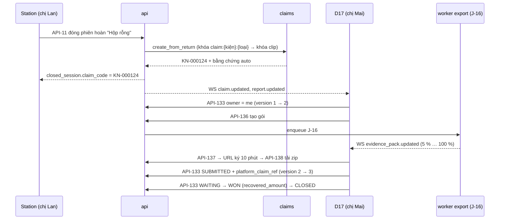

# Lát 8 — Hồ sơ khiếu nại + bảo vệ bằng chứng (M8) — Giải thích nghiệp vụ

| Trường | Giá trị |
|---|---|
| Item / lát | `02-returns-reconciliation` · lát 8 (milestone M8, [03-plan §4](../../ai/items/02-returns-reconciliation/03-plan.md)) |
| Yêu cầu | FR-08.01..06, FR-04.06, FR-04.11, FR-04.13 (gắn đơn), FR-02.06, 02.09, 02.12, FR-07.02; BR-08, BR-09, BR-27; UC-04, UC-12, UC-13; AC-06, 25, 26, 30, 37 — [01-srs](../../ai/items/02-returns-reconciliation/01-srs.md) v0.5 · [ADR-009](../../ai/system/decisions/ADR-009-claim-based-evidence-retention.md) |
| Task | BE: T-110, T-111, T-119, T-112 (+ API-113 sửa kết luận ở T-115, M9) · FE: T-154, T-155, T-157, T-158, T-159 |
| Code | `ai-cam-be`: `7d57025`, `c9f2fa4`, `215042e`, `49516ab`, `737d0c6`, `008b42b` (API-113) · `ai-cam-fe`: `3b629ff`, `6b976b8`, `cb4ab87`, `c90c24f`, `b014e76` |
| Người đọc | Dev mới vào dự án, reviewer, QA |
| Tác giả | khanhtt (agent soạn) |
| Reviewer | PO (đúng nghiệp vụ) · Tech lead (đúng code) |
| Trạng thái | Draft |
| Last update | 2026-10-06 · Dev |

## TL;DR

- Đóng phiên hoàn với kết luận ≠ "Nguyên vẹn" → **tự tạo hồ sơ khiếu nại** `KN-…` có sẵn clip đóng gói + clip mở hoàn + ảnh (BR-08, FR-08.06). Mỗi kiện tối đa một hồ sơ mở cho mỗi loại (BR-27).
- **Bằng chứng được giữ theo hồ sơ**, không theo cờ "giữ clip" (ADR-009): hồ sơ khiếu nại chưa đóng, hồ sơ hàng hoàn chưa kết thúc (+7 ngày sau khi nhận), "chỉ hoàn tiền" 30 ngày. Cờ giữ cũ được chuyển thành hồ sơ "Chuyển từ cờ giữ" khi nâng cấp; chỉ Admin còn giữ được qua API.
- Hồ sơ đi Mới → Đã gửi → Đang chờ → Thắng / Thua → Đóng; hai người sửa cùng lúc thì người sau nhận "đã có người sửa" (`VERSION_CONFLICT`).
- **Gói bằng chứng zip**: clip gốc (kiểm lại SHA-256), video ghép có chữ, ảnh, file thông tin; tải qua link 10 phút, giữ 24 giờ.
- Kiện chưa xác định → Supervisor **gắn đơn**, hồ sơ được **gộp**; kết luận sai → **sửa trong 7 ngày** có lý do.

## 0. Giải thích đơn giản

Đây là phần **"tập hồ sơ gửi sàn đòi tiền"**. Lát trước đã quay được lúc mở kiện hoàn. Nhưng video nằm rải rác thì chưa đòi được tiền: CSKH phải tự tìm clip đóng gói, clip mở hoàn, ảnh, theo dõi hạn, nhớ đã gửi sàn chưa. Lát này gom tất cả vào một "hồ sơ khiếu nại" có người phụ trách, có hạn, có trạng thái, và bảo đảm video trong hồ sơ không bị xóa khi hồ sơ còn dở.

**Ý tưởng chính.** Hệ thống làm 5 việc:
1. Tự mở hồ sơ ngay khi người kiểm kết luận kiện có vấn đề.
2. Giữ video theo hồ sơ, thay cho nút "giữ clip" mà ai cũng bật tắt được.
3. Theo dõi hồ sơ qua các bước tới khi đóng.
4. Đóng gói mọi bằng chứng thành một tệp zip để gửi sàn.
5. Sửa sai: gắn đơn cho kiện không rõ nguồn gốc, sửa kết luận nhầm.

### Bước 1 — Hồ sơ tự tạo
- Làm gì: chị Lan đóng phiên hoàn với "Hộp rỗng" → hệ thống tạo ngay hồ sơ "KN-000124", loại "Hộp rỗng". Bằng chứng tự chọn sẵn: phiên đóng gói còn hiệu lực gần nhất của kiện, phiên mở hoàn vừa đóng, ảnh lúc đóng gói, ảnh chụp lúc kiểm.
- Gửi ai: khách trả hàng / về trước khi sàn báo → gửi **sàn**. Giao thất bại (hàng hỏng trên đường về) → gửi **đơn vị vận chuyển**.
- Không có video đóng gói (đơn trước khi dùng hệ thống) → hồ sơ vẫn tạo, ghi rõ "Không có clip đóng gói".
- Kiện đã có hồ sơ cùng loại đang mở → không tạo trùng, chỉ thêm phiên mới vào hồ sơ cũ kèm ghi chú.
- Hạn khiếu nại: lấy hạn sàn trả về; sàn không có thì mặc định 7 ngày từ lúc tạo. Còn ≤ 48 giờ mà chưa gửi → trang tổng quan và danh sách hồ sơ báo "sắp hết hạn".
- CSKH cũng tạo tay được: từ chi tiết kiện, từ cảnh báo lệch, từ hồ sơ "chỉ hoàn tiền", hoặc gõ mã kiện ở danh sách hồ sơ.

### Bước 2 — Giữ bằng chứng theo hồ sơ (vì sao bỏ cờ "giữ clip")
- Trước đây: mỗi clip có nút "Giữ". Ai cũng bật được, ai cũng tắt được, không biết vì sao giữ, giữ tới bao giờ. CSKH lỡ tắt là tối đó clip bị dọn mất.
- Bây giờ: clip được giữ vì nó **thuộc một hồ sơ đang mở**. Có 3 lý do giữ:
  - Clip nằm trong hồ sơ khiếu nại chưa đóng → giữ mãi tới khi đóng.
  - Kiện đang trong một lần hoàn chưa xong (đang về, đang kiểm, quá hạn chưa về, mới nhận một phần) → giữ clip đóng gói và clip mở hoàn, thêm 7 ngày sau khi nhận xong (khớp hạn sửa kết luận).
  - Yêu cầu "chỉ hoàn tiền" → giữ clip đóng gói 30 ngày từ lúc sàn báo.
- Vì sao giữ cả khi chưa có khiếu nại: hàng hoàn có thể về sau 2 tháng. Nếu đợi mở kiện ra mới giữ thì clip đóng gói đã bị dọn rồi.
- Đóng hồ sơ: clip không bị xóa ngay, mà tính tiếp số ngày giữ từ ngày đóng.
- Trên chi tiết kiện, chỗ nút "Giữ clip" cũ nay là chip "Đang được bảo vệ bởi KN-000124". Không còn nút bỏ giữ. Chỉ Admin còn đường giữ khẩn cấp qua máy chủ, có nhật ký.
- Lúc nâng cấp: mọi clip đang được "giữ" theo kiểu cũ được chuyển thành hồ sơ "Chuyển từ cờ giữ", hạn nhắc 30 ngày. Hệ thống kiểm: clip nào trước đây được giữ thì sau nâng cấp vẫn được bảo vệ, sai một clip là hủy cả lần nâng cấp.

### Bước 3 — Theo dõi hồ sơ
- Các bước: Mới → Đã gửi (phải có mã tham chiếu bên sàn) → Đang chờ phản hồi → Thắng (phải nhập số tiền thu hồi) hoặc Thua → Đóng. Đóng sớm từ Mới / Đã gửi / Đang chờ phải ghi lý do.
- Mỗi lần đổi ghi một dòng vào dòng thời gian của hồ sơ, kèm tên người.
- Đã đóng thì chỉ xem, chỉ thêm ghi chú. Cần khiếu nại lại → tạo hồ sơ mới.
- Hai người cùng mở một hồ sơ, người A lưu trước. Người B lưu sau → "Hồ sơ vừa được người khác cập nhật", form của B giữ nguyên để B xem lại rồi lưu.
- Bỏ một bằng chứng hệ thống tự chọn phải ghi lý do, để sau này biết vì sao clip đó không còn trong hồ sơ.

### Bước 4 — Gói bằng chứng
- CSKH bấm "Xuất gói bằng chứng" → hệ thống dựng tệp zip ở nền, hiện phần trăm. Xong thì có nút tải, link hết hạn sau 10 phút, tệp giữ 24 giờ.
- Trong zip: clip gốc từng camera (hệ thống tính lại mã kiểm tra, lệch là ghi rõ), video ghép hai camera có chữ (mã vận đơn, giờ, bàn, người kiểm) cho phiên chính, ảnh, một tệp thông tin cho mỗi phiên (trạng thái phiên, cờ, độ lệch giờ từng camera lúc đóng), tệp kết luận (cả lịch sử sửa), tệp tóm tắt hồ sơ liệt kê mọi tệp kèm mã kiểm tra.
- Một clip đã bị xóa hoặc chưa cắt xong → zip vẫn tạo, tệp tóm tắt ghi rõ phần thiếu. Vì sao: sàn hỏi thiếu gì thì trả lời được, không giấu.

### Bước 5 — Gắn đơn và gộp hồ sơ
- Kiện "chưa xác định" (mã tạm TAM-…) nằm ở tab "Chưa xác định" của trang Hàng hoàn. Supervisor xem video mở hoàn, ảnh nhãn, gõ mã đơn hoặc mã vận đơn gốc, xem trước, bấm "Gắn đơn này".
- Hệ thống chuyển phiên và ảnh sang kiện thật, xóa kiện tạm, cập nhật trạng thái kiện theo kết luận đã có. Đơn đó đang có lần hoàn mở → gộp vào lần hoàn đó ("Sẽ gộp vào HH-…"). Kiện thật đã có hồ sơ khiếu nại cùng loại → gộp bằng chứng vào hồ sơ đó, hồ sơ của kiện tạm đóng với ghi chú "Gộp vào KN-…".
- Nếu sau này đơn tự đồng bộ về với đúng mã đã quét, hệ thống tự gộp, không cần ai bấm (trừ hồ sơ "kiện khác — vẫn ghi hình", chỉ gắn tay).

### Bước 6 — Sửa kết luận trong 7 ngày
- Supervisor / Admin mở chi tiết kiện, bấm "Sửa kết luận", chọn lại, ghi lý do (5–500 ký tự).
- "Nguyên vẹn" → "Hộp rỗng": tự tạo hồ sơ khiếu nại. "Hộp rỗng" → "Nguyên vẹn": hồ sơ tự tạo còn ở "Mới" bị đóng với lý do hệ thống.
- Quá 7 ngày từ lúc đóng phiên thì không sửa được. Mỗi lần sửa lưu "trước khi sửa", người, giờ, lý do; hiện "Đã sửa 1 lần".

**Ví dụ một vòng đầy đủ.** Thứ Tư 09:14, chị Lan đóng phiên hoàn kiện SPXTST0000041 với "Hộp rỗng". Hồ sơ KN-000124 tự tạo: gửi sàn, hạn 13/10 (sàn trả hạn phản hồi), bằng chứng gồm clip đóng gói ngày 02/10 và clip mở hoàn vừa rồi. 10:00 chị Mai (CSKH) mở danh sách hồ sơ, tab "Mới" có số 1. Chị bấm vào, "Nhận phụ trách", rồi "Xuất gói bằng chứng". 2 phút sau tải về "KN-000124.zip". Chị gửi lên trang người bán của sàn, nhận mã "RS-889123", quay lại chuyển "Đã gửi", nhập mã. Cùng lúc anh Tú (CSKH) cũng mở hồ sơ, gõ ghi chú rồi bấm lưu → nhận "Hồ sơ vừa được người khác cập nhật". Thứ Sáu sàn phản hồi, chị Mai chuyển "Đang chờ phản hồi", rồi "Thắng" với số tiền 189.000 ₫, rồi "Đóng". Clip của hồ sơ không bị xóa trong suốt quá trình; từ hôm đóng, clip còn giữ thêm 90 ngày (cài đặt hiện tại) rồi mới vào diện dọn.

**Lưu ý.**
- Hạn khiếu nại mặc định 7 ngày và thời gian giữ clip chỉ là đề xuất. Hạn thật của sàn **chưa được chủ shop xác nhận** — đây là điều kiện chặn đưa vào dùng thật.
- Hồ sơ không tự gửi lên sàn: CSKH vẫn gửi tay trên trang người bán.
- Thời gian dựng gói zip mới đo trên máy dev, chưa đo trên server kho.
- Hồ sơ bị bỏ quên ở trạng thái mở → clip giữ mãi, tốn ổ. Hiện chỉ có nhắc "sắp hết hạn"; chưa có cảnh báo dung lượng do hồ sơ giữ.

## 1. Vì sao cần

P4 (khiếu nại thủ công, không lịch sử) và P6 (bằng chứng mất vì bỏ giữ / hạ retention). Phase 1 thay "giữ theo hồ sơ" của SRS gốc bằng cờ `clip.held` tạm thời; L7 chỉ ra cờ này ai cũng tắt được. Sau review G2 (R-1, CRITICAL) còn thêm: clip đóng gói phải được giữ **trước** khi biết có khiếu nại, tức là theo hồ sơ hàng hoàn.

| Lát này làm (Goals) | Lát này không làm (Non-goals — ở lát / phase nào) |
|---|---|
| Module `claims`: tự tạo từ phiên hoàn, tạo tay, bằng chứng tự chọn, version, J-15, API-130..135 (T-110) | Gửi khiếu nại lên Shopee qua API (`returns.dispute`) — Phase 3 / ngoài phạm vi |
| ADR-009: `protected_sessions_sql`, J-02, API-31 `protection`, API-42 chỉ ADMIN, migration 0004 (T-111) | Link chia sẻ có hạn (FR-07.05), sao lưu cloud (FR-02.08) — Phase 3 |
| API-105 (kiện tạm, `force_new`), API-112 gắn đơn + gộp hồ sơ khiếu nại (T-119) | Báo cáo khiếu nại chi tiết FR-09.02..04 — Phase 3 |
| Gói bằng chứng J-16, API-136..138, `info.json` L5, `ket-luan.json` (T-112) | Cảnh báo dung lượng do hồ sơ giữ clip (ADR-009 "điều kiện xem lại") |
| D4 khối Hàng hoàn / chip bảo vệ / tạo hồ sơ / gắn đơn / sửa kết luận / điều chỉnh trạng thái; D16; D17; `EvidencePackDialog` (T-154, 155, 157..159) | API-113 BE (T-115, M9 — FE M8 chạy mock tới đó) |

## 2. Ai dùng, ở đâu, khi nào

| Vai | Màn hình / điểm vào | Lúc nào dùng |
|---|---|---|
| CSKH, Supervisor, Admin | `/admin/claims` (D16), `/admin/claims/:id` (D17) | Theo dõi, gửi sàn, xuất gói |
| CSKH, Supervisor, Admin | D4 chi tiết kiện: khối Hàng hoàn, chip bảo vệ, "Tạo hồ sơ khiếu nại" | Khách báo thiếu / hỏng, "chỉ hoàn tiền" |
| Supervisor, Admin | D4 / D14: "Gắn đơn", "Sửa kết luận", "Điều chỉnh trạng thái" | Kiện chưa xác định; kết luận sai |
| Admin | API-42 (không có nút UI) | Giữ clip khẩn cấp ngoài hồ sơ |
| Job J-15 (60 phút), J-16 (queue `export`), J-02 (02:00), J-10 (1 phút) | Nền | Nhắc hạn, dựng zip, dọn clip có xét bảo vệ, dọn zip quá 24 giờ |

## 3. Tình huống thực tế

| # | Tình huống | Hệ thống làm gì | Vì sao |
|---|---|---|---|
| 1 | Đóng phiên hoàn "Hộp rỗng" (khách trả) | `create_from_return`: hồ sơ `EMPTY_BOX`, `PLATFORM`, bằng chứng auto PACK hiệu lực + RETURN + ảnh; `closed_session.claim_code` | BR-08, FR-04.06, AC-06 |
| 2 | Giao thất bại, kết luận "Hư hỏng" | `counterparty = CARRIER` | BR-08: hỏng trên đường về là lỗi ĐVVC |
| 3 | Kiện đã có hồ sơ `EMPTY_BOX` mở, đóng thêm phiên "Hộp rỗng" | Thêm phiên + ảnh vào hồ sơ cũ, ghi chú hệ thống, `version + 1` | BR-27 |
| 4 | Hai CSKH cùng POST tạo hồ sơ cùng loại | Một 201, một `409 CLAIM_EXISTS` kèm id | BR-27, khóa `claim:{kiện}:{loại}` + partial unique |
| 5 | Kiện `RETURN_MISSING` về sau 62 ngày, retention 60 | Clip đóng gói còn (hồ sơ hàng hoàn chưa kết thúc) → hồ sơ khiếu nại có clip | BR-09 (b), AC-26 |
| 6 | Nhận "Nguyên vẹn", ngày 5 sửa thành "Hộp rỗng" | Clip còn (7 ngày sau nhận) → hồ sơ tự tạo có clip | BR-09 (b), DEC-268 |
| 7 | Hồ sơ mở, đồng hồ +200 ngày, chạy J-02 | Không xóa clip / ảnh của hồ sơ | AC-26 |
| 8 | Tạo hồ sơ đúng lúc J-02 đang xóa clip | Cả hai khóa clip `FOR UPDATE`; ai trước thắng; J-02 kiểm lại bảo vệ dưới khóa; clip đã xóa → `missing` | DEC-251, R-7 |
| 9 | SUPERVISOR gọi API-42 giữ clip | `403 FORBIDDEN` | FR-02.09: chỉ ADMIN |
| 10 | DB Phase 1 có 12 clip "giữ" của 5 kiện | 0004 tạo 5 hồ sơ `LEGACY_HOLD` (hạn 30 ngày), `held = false`; kiểm `held_before ⊆ protected_after` | FR-02.09, DEC-250 |
| 11 | Gói zip khi clip đóng gói đã bị xóa | Zip vẫn tạo; `ho-so.json` `missing` `CLIP_DELETED` | UC-12 |
| 12 | Bấm "Tạo gói" khi gói trước đang chạy | `409 PACK_IN_PROGRESS` + `pack_id` → FE theo dõi gói đang chạy | Một gói chạy / hồ sơ |
| 13 | Gắn đơn cho kiện tạm khi đơn có hồ sơ hàng hoàn mở | API-112 gộp vào hồ sơ đó (`merged_into`), hồ sơ khiếu nại trùng loại gộp (`merged_claims`) | UC-13, BR-27 |
| 14 | Sửa kết luận phiên đóng 8 ngày trước | `409 CORRECTION_WINDOW_EXPIRED`; D4 hiện chữ thay nút (`can_correct = false`) | FR-04.11 |

## 4. Luồng ví dụ từ đầu đến cuối

1. **09:14** — Trong transaction đóng phiên (sau bước gộp hồ sơ chờ — DEC-311 a): `create_from_return` lấy khóa advisory `claim:{kiện}:EMPTY_BOX`, khóa clip của các phiên bằng chứng `ORDER BY id FOR UPDATE`, INSERT hồ sơ + bằng chứng `auto = true` + ghi chú `SYSTEM`. Hạn = `return_case.seller_due_at` hoặc `now + claim_deadline_days`.
2. Từ đây clip của hai phiên thuộc `protected_sessions_sql` nhánh (a); trước đó đã thuộc nhánh (b) vì kiện nằm trong hồ sơ hàng hoàn chưa kết thúc.
3. **10:00** — D17: API-132 trả bằng chứng (URL ký), `other_sessions`, `missing` (tính lúc đọc: `NO_PACK_CLIP`, `PACK_CLIP_DELETED`, `RETURN_CLIP_PENDING`), `allowed_transitions`.
4. API-136 → J-16: chép clip gốc, tính lại SHA-256; `render_side_by_side_to` (dùng chung J-03) cho phiên chính; `info.json` mỗi phiên (L5: `session_status`, `flags`, `cameras[].clock_offset_ms` từ `camera_clock` lúc đóng); `ket-luan.json` (gồm `corrections[]`); `ho-so.json`; `README.txt`; zip `ZIP_STORED`. Audit `EXPORT_CLAIM_PACK` / `DOWNLOAD_CLAIM_PACK`.
5. Mỗi API-133 khóa dòng hồ sơ, so `version`, ghi `claim_note` `STATUS_CHANGE`, audit `CLAIM_UPDATE`. `CLOSED` → `closed_at`; J-02 sau đó tính hạn = max(`clip.end_at`, `closed_at`) + `retention_clip_days`.

## 5. Quy tắc nghiệp vụ và lý do

| Quy tắc | Con số / điều kiện | Vì sao | ID |
|---|---|---|---|
| Tự tạo hồ sơ | Kết luận ≠ OK khi đóng phiên / J-07 tự hoàn tất / API-113 OK→ISSUE; loại = kết luận; bên nhận: `CARRIER` khi `FAILED_DELIVERY`, còn lại `PLATFORM` | Hồ sơ có ngay khi kiểm xong (mục tiêu ≤ 5 phút) | BR-08, FR-04.06, FR-08.01 |
| Bằng chứng tự chọn | PACK `COMPLETED` hiệu lực mới nhất + phiên RETURN + ảnh `PACK_CLOSE` / `MANUAL`; phiên thay thế / hủy / bỏ dở chỉ hiện để thêm tay | Đúng phiên đã giao cho khách | FR-08.06 |
| Nội dung hồ sơ | Mã `KN-` + 6 số, đơn, kiện, loại (7), bên nhận, bằng chứng, ghi chú theo dòng thời gian (chỉ thêm), người phụ trách, hạn, mã tham chiếu sàn, kết quả, số tiền thu hồi (VND) | Một chỗ đủ để gửi sàn và đối chiếu sau | FR-08.02 |
| Không trùng | ≤ 1 hồ sơ chưa `CLOSED` / (kiện, loại), trừ `LEGACY_HOLD` | Không rối hai hồ sơ cho một sự việc | BR-27 |
| Hạn | `seller_due_at` của sàn, không có → tạo + 7 ngày (`claim_deadline_days`); nhắc khi ≤ 48 giờ (`claim_due_soon_hours`) | Không trễ hạn sàn | BR-27, FR-08.04, Q13 |
| Trạng thái | NEW→SUBMITTED/CLOSED; SUBMITTED→WAITING/WON/LOST/CLOSED; WAITING→WON/LOST/CLOSED; WON/LOST→CLOSED; SUBMITTED cần mã sàn (hoặc lý do); WON cần số tiền; đóng sớm cần lý do 5–500 | Có đủ dữ liệu cho báo cáo thu hồi | FR-08.03, DEC-312 |
| Sửa đồng thời | `version` bắt buộc; lệch → `409 VERSION_CONFLICT` + bản hiện tại | Không ghi đè im lặng | API-133, 134 |
| Đóng là chốt | `CLOSED` → `CLAIM_CLOSED` cho sửa / bằng chứng; ghi chú vẫn được | Lịch sử bất biến | 01 §7.3 |
| Bỏ bằng chứng auto | Cần `note` 5–500 | Biết vì sao clip rời hồ sơ | API-134 |
| Giữ theo hồ sơ | (a) hồ sơ khiếu nại chưa đóng; (b) hồ sơ hàng hoàn `EXPECTED / INSPECTING / PARTIALLY_RECEIVED / MISSING` hoặc nhận < 7 ngày; (c) `NO_PARCEL` < 30 ngày từ sàn báo; (d) `held` (Admin) | Có chủ, có hạn, không ai bỏ giữ lén | BR-09, FR-02.06, ADR-009 |
| Hồ sơ đóng | Hạn xóa = max(lúc tạo clip, lúc đóng) + số ngày giữ clip (≥ sàn 60) | Vẫn còn clip một thời gian sau khi đóng | BR-09, ADR-009 |
| Cờ giữ cũ | 0004: clip `held` → hồ sơ `LEGACY_HOLD` theo kiện, hạn nhắc 30 ngày; `held_before ⊆ protected_after`, sai → raise cả migration | Không mất clip đang giữ khi nâng cấp | FR-02.09, DEC-250, AC-26 |
| API-42 | Chỉ ADMIN, audit `HOLD_CLIP` | Đường khẩn cấp tới khi hồ sơ chạy ổn (gỡ ở Phase 3) | FR-02.09 |
| Gói bằng chứng | Một gói đang chạy / hồ sơ; link ký 10 phút; tệp 24 giờ; zip có phần thiếu ghi rõ; ≤ 3 phút / phiên trên máy kho | Nộp sàn đủ và kiểm được | FR-08.05, NFR-34, NFR-36, AC-25 |
| `info.json` (L5) | Thêm `session_status`, `flags`, `clock_offset_ms` từng camera (lúc đóng); áp cả bản xuất thường | Sàn hỏi "giờ trên video có chuẩn không" thì có số | FR-02.12, AC-30 |
| Gắn đơn | Chỉ hồ sơ `UNIDENTIFIED` chưa gắn, không `CANCELLED`, phiên đã kết thúc, kiện đích đã rời kho, chưa có phiên hoàn hồ sơ khác; ADMIN / SUPERVISOR | Không chuyển video sang kiện sai | FR-04.13, UC-13, DEC-314 |
| Tự gộp kiện tạm | Sau mọi upsert đơn: `open_code` ∈ mã vận đơn của đơn, không `manual_link_only`; phiên còn mở → gộp khi đóng | Ít việc tay | DEC-269, R3-2 |
| Sửa kết luận | ADMIN / SUPERVISOR; phiên RETURN `COMPLETED` ≤ 7 ngày; lý do 5–500; lưu `inspection_corrections[]`; cờ `INSPECTION_CORRECTED`; OK⇄ISSUE đổi kiện + hồ sơ khiếu nại | Sửa nhầm mà vẫn truy được | FR-04.11 |

## 6. Điểm dễ hiểu nhầm

- **Sao vẫn còn cột `clip.held`?** Đường khẩn cấp của Admin và để downgrade về Phase 1 (code cũ chỉ hiểu `held`). Không còn nút UI (DEC-343).
- **Hồ sơ `LEGACY_HOLD` có tính BR-27 không?** Không. Nó chỉ là "vỏ" giữ clip cũ, loại `OTHER`; CSKH đóng khi không cần.
- **Clip có thuộc hồ sơ không mà vẫn được giữ?** Có thể: nhánh (b) giữ theo kiện của hồ sơ hàng hoàn, chưa cần hồ sơ khiếu nại. D4 hiện lý do trong chip.
- **`missing` lưu ở đâu?** Không lưu; API-132 tính lúc đọc. Trong zip thì `ho-so.json` ghi phần thiếu tại thời điểm dựng.
- **Gói zip có nén video không?** Không (`ZIP_STORED`): video đã nén, nén lại chỉ tốn CPU.
- **Sửa kết luận ở lát này đã gọi BE thật chưa?** FE (T-155) xong ở M8 với mock; BE API-113 xong ở T-115 (M9); E2E BE thật M10 có ca "Nguyên vẹn → Thiếu hàng → Đã sửa 1 lần + hồ sơ tự tạo".
- **Hồ sơ hàng hoàn (`HH-`) khác hồ sơ khiếu nại (`KN-`)?** `HH-` = một lần hàng của đơn quay về (lát 7, 9). `KN-` = một lần đòi tiền sàn / ĐVVC. Một `HH-` có thể sinh 0..n `KN-`.

## 7. Bản đồ nghiệp vụ → code

Đường dẫn BE tính từ `ai-cam-be/src/aicam/` (migration từ `ai-cam-be/`), test BE từ `ai-cam-be/tests/`. FE tính từ `ai-cam-fe/src/`, E2E từ `ai-cam-fe/e2e/`.

| Khái niệm nghiệp vụ | Code | Test chứng minh |
|---|---|---|
| Tự tạo hồ sơ, bằng chứng auto, bên nhận | `modules/claims/service.py` (`create_from_return`, `auto_evidence`, `effective_pack_session`) | `integration/test_claims_api.py`: `test_issue_creates_claim_with_pack_and_return_evidence`, `test_ok_conclusion_no_claim`, `test_failed_delivery_goes_to_carrier`, `test_existing_claim_same_type_gets_evidence` |
| Tạo tay, trùng, từ cảnh báo | `modules/claims/service.py` (`create_manual`), `modules/claims/router.py` | `test_claims_api.py`: `test_manual_create_and_duplicate`, `test_manual_create_no_pack_clip_and_validation`, `test_manual_from_recon_alert`; `integration/test_claims_concurrency.py::test_parallel_create_same_type` |
| Trạng thái, version, bỏ bằng chứng, hạn | `modules/claims/service.py` (`patch`, `allowed_transitions`, `set_evidence`, `check_deadlines`) | `unit/test_claims.py`: `test_transition_table`, `test_due_flags`; `test_claims_api.py`: `test_full_lifecycle`, `test_patch_validation_and_transitions`, `test_version_conflict_and_closed`, `test_evidence_remove_auto_requires_note`, `test_due_soon_job_and_filters` |
| Bảo vệ bằng chứng (ADR-009), J-02 | `modules/media/protection.py` (`protected_sessions_sql`, `clip_protection`), `modules/media/service.py` (`retention_clip_candidates`) | `integration/test_retention_claims.py`: `test_open_claim_keeps_evidence_200_days`, `test_closed_claim_retention_from_close_date`, `test_return_overdue_62_days_keeps_pack_clip_then_claim`, `test_received_keeps_7_days_then_correction_claim`, `test_no_parcel_keeps_30_days`, `test_floor_and_snapshot_evidence`; `test_claims_concurrency.py`: `test_claim_locks_clip_before_retention`, `test_retention_deletes_first_then_claim_reports_missing`, `test_parallel_claim_and_retention_invariant` |
| Migration 0004 cờ giữ → hồ sơ | `alembic/versions/0004_hold_to_claims.py` | `integration/test_migration_0004.py`: `test_upgrade_converts_holds_to_legacy_claims`, `test_upgrade_without_holds_is_noop`, `test_downgrade_then_upgrade_round_trip`, `test_legacy_deadline_is_thirty_days` |
| Gói bằng chứng, `info.json` L5 | `modules/claims/pack.py` (`create_pack`, `build_evidence_pack`, `cleanup_expired`), `modules/media/exports.py` | `integration/test_evidence_pack.py`: `test_pack_zip_contents`, `test_pack_with_deleted_clip_and_closed_claim`, `test_pack_conflicts_permissions_and_cleanup`, `test_info_json_clock_from_close_time` |
| Gắn đơn, gộp hồ sơ, gộp tự động | `modules/returns/service.py` (`link_order`, `merge_unidentified`, `merge_unidentified_by_code`), `modules/claims/service.py` (`move_claims_to_package`) | `integration/test_link_order.py`: `test_link_order_to_package_without_case`, `test_link_order_merges_into_open_case`, `test_link_order_merges_duplicate_claim`, `test_link_order_errors`; `test_claims_api.py`: `test_unidentified_merge_moves_claim`, `test_unidentified_merge_into_existing_claim`; `test_returns_core.py`: `test_merge_unidentified_when_sessions_ended`, `test_merge_unidentified_pending_while_session_active` |
| Sửa kết luận (API-113) | `modules/sessions/correction.py` (`correct`), `modules/claims/service.py` (`close_auto_on_correct_ok`) | `integration/test_packages_returns.py`: `test_api113_ok_to_issue_then_back`, `test_api113_errors_and_permissions` |
| Toàn luồng trên stack thật | — | `qa/test_m8_live.py`: `test_auto_claim_has_pack_and_return_evidence`, `test_claim_status_flow`, `test_evidence_pack_zip`, `test_protection_on_package_detail`, `test_unidentified_then_link_order` |
| D4 khối Hàng hoàn, chip bảo vệ, tạo hồ sơ | FE `features/orders/PackageDetailPage.tsx`, `features/orders/ProtectedChip.tsx`, `features/orders/protection.ts`, `features/returns/ReturnCaseSection.tsx`, `features/returns/InspectionView.tsx`, `features/claims/CreateClaimDialog.tsx` | `features/orders/PackageDetailReturns.test.tsx` (TC-07.32, FR-02.11, BR-09 b, TC-02.36, TC-08.08, 08.09), `features/returns/InspectionView.test.tsx` |
| D4 hành động: gắn đơn, sửa kết luận, điều chỉnh | FE `features/returns/LinkOrderDialog.tsx`, `features/returns/CorrectInspectionDialog.tsx`, `features/reconciliation/AdjustStatusForm.tsx` | `features/orders/PackageDetailActions.test.tsx` (TC-07.33..07.35, TC-P2.08, FR-04.11, FR-06.05) |
| D16 / D17 / gói zip | FE `features/claims/ClaimsPage.tsx`, `ClaimDetailPage.tsx`, `ClaimStatusStepper.tsx`, `EvidenceList.tsx`, `ClaimNotes.tsx`, `EvidencePackDialog.tsx`, `packPoll.ts`, `useClaimMutation.ts` | `features/claims/ClaimsPage.test.tsx`, `ClaimDetailPage.test.tsx` (TC-08.01, 08.06, 08.07, 08.14, 08.15), `EvidencePackDialog.test.tsx` (TC-08.16, 08.19) |
| E2E | — | mock `mock/claims.spec.ts`; BE thật `real/m8-claims.spec.ts`, `real/m10-recon-claims.spec.ts` ("TC-08.01 + VERSION_CONFLICT hai tab…", "TC-08.08…"), `real/m10-admin-returns.spec.ts` ("TC-07.33 + gộp…", "FR-04.11 / API-113…") |

## 8. Giới hạn hiện tại và giả định

| Giới hạn / giả định | Ảnh hưởng | Khi nào xử lý |
|---|---|---|
| **Q13 chưa trả lời** — hạn khiếu nại thật của Shopee; mặc định 7 ngày, giữ clip 90 / sàn 60 có đủ không | Hồ sơ có thể quá hạn thật trước hạn trong máy; clip có thể bị dọn trước khi sàn hết cho khiếu nại | **Chặn go-live** (06-business-qa L1, ADR-009) |
| **Shopee thật chưa test (T-3)** — `seller_due_at` lấy từ `return_seller_due_date` theo tài liệu công khai | Hạn có thể luôn rơi về mặc định | T-3 |
| NFR-34 (gói ≤ 3 phút / phiên) mới đo trên máy dev; RB-24 / RB-7 encode chậm trên server kho | Có thể phải giảm độ phân giải ghép (`EXPORT_SIDE_SCALE`) | **Server kho chưa test** |
| Camera thật chưa test (T-4) — clip / ảnh trong gói đều từ camera giả | Kích thước gói, chất lượng hình ngoài đời chưa biết | T-4 |
| Hồ sơ bỏ quên giữ clip vô hạn | Tốn ổ | Xem lại khi clip do hồ sơ giữ > 10 % ổ video (ADR-009) |
| Không gửi khiếu nại lên sàn qua API | CSKH gửi tay trên Seller Center | Ngoài phạm vi Phase 2 |
| API-42 deprecated, còn cho Admin | Còn một đường giữ ngoài hồ sơ | Gỡ ở Phase 3 khi 3 tháng không dùng |

## Liên kết

- SRS: [01-srs.md](../../ai/items/02-returns-reconciliation/01-srs.md) v0.5: FR-08.*, FR-04.06, 04.11, 04.13, FR-02.06, 02.09, 02.12, BR-08, 09, 27, UC-04, UC-12, UC-13, AC-06, 25, 26, 30, 37
- Kiến trúc: [ADR-009](../../ai/system/decisions/ADR-009-claim-based-evidence-retention.md), [ADR-008](../../ai/system/decisions/ADR-008-immutable-evidence-clips.md)
- Spec: [02 §6.2](../../ai/items/02-returns-reconciliation/02-tech-spec.md) API-31, 42, 105, 112, 113, 130..138 · [02a §3, §5, §6, §7](../../ai/items/02-returns-reconciliation/02a-be-spec.md) J-02, J-15, J-16, DEC-311..315 · [02b-admin](../../ai/items/02-returns-reconciliation/02b-fe-spec-admin.md) D4, D16, D17, DEC-343..347
- Test cases: [04](../../ai/items/02-returns-reconciliation/04-test-cases.md) TC-08.*, TC-07.32..07.35, TC-02.36
- Lát trước / sau: [lat-07-nhan-hang-hoan.md](lat-07-nhan-hang-hoan.md) · [lat-09-doi-soat.md](lat-09-doi-soat.md)
