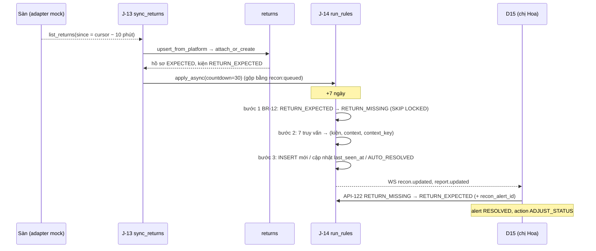

# Lát 9 — Đồng bộ hàng hoàn + đối soát (M9) — Giải thích nghiệp vụ

| Trường | Giá trị |
|---|---|
| Item / lát | `02-returns-reconciliation` · lát 9 (milestone M9, [03-plan §4](../../ai/items/02-returns-reconciliation/03-plan.md)) |
| Yêu cầu | FR-05.05, 05.11, 05.12, FR-06.01..03, 06.05, 06.06, FR-02.10, FR-07.01, FR-09.01, FR-01.01 (UI D6), FR-03.14 (D2), NFR-32, 33, 35; BR-10..14, 19, 20, 25, 26; EX-R1, R7, R10, R14; UC-05, UC-06, UC-11; AC-07, 23, 24, 27, 28 — [01-srs](../../ai/items/02-returns-reconciliation/01-srs.md) v0.5 |
| Task | BE: T-105, T-113, T-114, T-115, T-121 · FE: T-153, T-156, T-160, T-161 |
| Code | `ai-cam-be`: `a6684d6`, `38bf40c`, `6e293d6`, `008b42b`, `6a01c51` · `ai-cam-fe`: `47e9e0a`, `10ba98d`, `db3a370`, `5bf2cb7`, `890385b` |
| Người đọc | Dev mới vào dự án, reviewer, QA |
| Tác giả | khanhtt (agent soạn) |
| Reviewer | PO (đúng nghiệp vụ) · Tech lead (đúng code) |
| Trạng thái | Draft |
| Last update | 2026-10-06 · Dev |

## TL;DR

- J-13 (15 phút) kéo **yêu cầu trả hàng** từ sàn; J-06 / J-04 bắt **giao thất bại, boom COD, hủy sau khi ĐVVC lấy hàng**. Mỗi đơn tối đa một hồ sơ hàng hoàn đang mở; tín hiệu lặp lại không tạo hồ sơ mới.
- J-14 (30 phút + ngay sau đồng bộ) chạy **7 quy tắc đối soát**; mỗi (kiện, quy tắc) một cảnh báo mở, hết điều kiện thì tự đóng (BR-26).
- Kiện "đang về" quá 7 ngày → "Hoàn quá hạn" + cảnh báo Cao (BR-12, AC-07).
- Supervisor xử lý ở D15: đánh dấu đã xử lý (ghi chú) · điều chỉnh trạng thái kho · tạo hồ sơ khiếu nại thất lạc.
- D8: số ngày giữ clip ≥ sàn 60; **hạ** số ngày giữ phải xem trước số clip / giờ video sẽ bị xóa và xác nhận (BR-25, L2). Ảnh F2 lấy khung hình mới nhất `vision` giữ (≤ 2 giây).

## 0. Giải thích đơn giản

Đây là phần **"người kế toán so sổ sàn với sổ kho"**. Sàn ghi một đằng, kho thấy một nẻo: sàn báo khách trả hàng nhưng kiện mãi không về; sàn báo đã lấy hàng mà kho chưa đóng gói; sàn đã hoàn tiền cho khách mà kho chưa nhận lại hàng. Không ai so thì shop mất hàng, mất tiền mà không biết. Lát này cho máy tự so hai cuốn sổ mỗi 30 phút và đưa ra danh sách chỗ lệch cho quản lý xử lý.

**Ý tưởng chính.** Hệ thống làm 4 việc:
1. Đều đặn hỏi sàn: có ai trả hàng không, có kiện nào giao thất bại không.
2. Đều đặn so trạng thái sàn với trạng thái kho theo 7 quy tắc, sinh cảnh báo.
3. Cho quản lý xử lý từng cảnh báo, có ghi chú, có nhật ký.
4. Chặn việc hạ số ngày giữ video một cách vô tình.

### Bước 1 — Hỏi sàn mỗi 15 phút
- Khách bấm "trả hàng" trên sàn → trong ≤ 15 phút, trang "Hàng hoàn" tab "Đang về" có dòng mới, kiện chuyển "Đang về kho".
- Yêu cầu chỉ hoàn tiền (khách không gửi hàng, ví dụ báo thiếu) → tab "Chỉ hoàn tiền", trạng thái kiện **không đổi**. CSKH tự quyết có khiếu nại không.
- Sàn hủy yêu cầu trả khi kiện chưa về → hồ sơ "Đã hủy", kiện về "Đã giao".
- Giao thất bại, khách từ chối nhận hàng (boom), đơn bị hủy sau khi ĐVVC đã lấy → coi như "Giao thất bại", kiện "Đang về kho".
- Giao lại thành công sau thất bại → kiện về "Đã giao", hồ sơ hủy.
- Vì sao "mỗi đơn chỉ một hồ sơ đang mở": sàn có thể báo cùng một việc nhiều lần, hoặc báo giao thất bại trước rồi khách mở yêu cầu trả sau. Gộp vào một hồ sơ thì bàn hoàn không phải nhận hai lần cho cùng một thùng.
- Kiện đã được nhận ở bàn trước khi sàn báo → khi sàn báo, gắn vào chính hồ sơ đó, không tạo hồ sơ mới.
- Mất mạng / sàn lỗi → thử lại; vẫn lỗi thì cửa hàng hiện "đồng bộ lỗi", lần sau hỏi lại từ chỗ cũ, không mất yêu cầu.

### Bước 2 — Bảy quy tắc so sổ

| Chuyện lệch | Ví dụ | Mức |
|---|---|---|
| Sàn báo đã giao đi mà kho chưa đóng gói xong | Phiên đóng gói bị bỏ dở nhưng thật ra kiện đã đi | Cao |
| Sàn hủy đơn mà kho đã đóng gói | Kiện nằm trên kệ, cần tháo ra | Trung bình |
| Hàng hoàn quá 7 ngày chưa về | Khách gửi trả 01/10, tới 08/10 kho chưa thấy | Cao |
| Kho nhận hoàn mà 24 giờ sau sàn vẫn chưa báo | Kiện tự dưng về kho | Thấp |
| Đóng gói xong 24 giờ mà sàn chưa lấy hàng | Kiện kẹt trên kệ bàn giao | Trung bình |
| Sàn đã hoàn tiền cho khách mà kho chưa nhận hàng | Mất cả hàng lẫn tiền | Cao |
| Kiện chưa xác minh với sàn quá 24 giờ | Mã nhập tay có thể sai | Thấp |

- Mỗi kiện, mỗi quy tắc chỉ có **một** cảnh báo mở. Chạy lại 10 lần cũng không nhân bản.
- Điều kiện hết (ví dụ ĐVVC đã lấy hàng) → cảnh báo tự đóng "Tự hết".
- Quản lý đã xử lý tay mà điều kiện vẫn còn y nguyên → không báo lại. Điều kiện tái phát ở "đợt" mới (ví dụ gia hạn chờ rồi lại quá hạn) → cảnh báo mới.
- Đơn cũ từ trước khi nâng cấp không bị bắt lỗi; kiện tạm chưa xác định không bị bắt lỗi "chưa xác minh".
- Kiện quá 7 ngày được chuyển "Hoàn quá hạn". Hồ sơ đã nhận một phần thì giữ "nhận một phần", chỉ kiện quá hạn bị đánh dấu.

### Bước 3 — Quản lý xử lý
- Trang "Lệch trạng thái" có tab "Đang mở" kèm số, mức Cao xếp trên. Menu bên trái có huy hiệu số cảnh báo Cao.
- Bấm "Xử lý" → hộp thoại có trạng thái sàn, trạng thái kho, 5 dòng lịch sử gần nhất, và 3 lựa chọn:
  - "Đánh dấu đã xử lý" — ghi chú bắt buộc (1–500 ký tự).
  - "Điều chỉnh trạng thái kho" — chỉ hiện các hướng cho phép, lý do bắt buộc.
  - "Tạo hồ sơ khiếu nại" — mặc định loại "Thất lạc", gửi ĐVVC.
- Hai người cùng xử lý → người sau thấy "đã được … xử lý lúc …". Cảnh báo tự hết trong lúc đang mở hộp thoại → "Cảnh báo này đã tự hết lúc 14:30."
- Nút "Chạy đối soát ngay" khi không muốn chờ 30 phút; đang chạy thì báo "đang chạy".
- CSKH chỉ xem, không xử lý.

### Bước 4 — Trang tổng quan, tra cứu, cấu hình bàn
- Trang tổng quan ngày thêm: hàng hoàn đã nhận (ổn / có vấn đề), đang về, quá hạn chưa về, cảnh báo đang mở theo mức, hồ sơ khiếu nại mở / sắp hết hạn, và hai số "Phiếu còn trên khay", "Cam 2 không xác minh" của hôm nay. Bấm số nào mở đúng danh sách lọc sẵn.
- Tra cứu kiện tìm được theo mã vận đơn chiều về, lọc theo loại phiên (đóng gói / mở hoàn) và cờ phiên.
- Trang cấu hình bàn có ô "Loại station". Thẻ duyệt của phiên hoàn ghi người kiểm và không có nút "Đóng phiên có ghi chú".

### Bước 5 — Không hạ số ngày giữ video một cách vô tình
- Ô "Số ngày giữ clip" ghi "Tối thiểu 60 ngày (cấu hình máy chủ)". Nhập 45 → "Số ngày giữ clip không được thấp hơn 60."
- Đổi 90 → 70 → hộp thoại "312 clip sẽ bị xóa ở lần dọn 02:00 tới" (con số tính đúng như lần dọn thật, đã trừ clip đang được hồ sơ bảo vệ). Phải bấm "Giảm và lưu" mới lưu, nhật ký ghi số cũ, số mới, số bị ảnh hưởng.
- Vì sao: một lần gõ nhầm số có thể xóa hàng nghìn clip trong một đêm, đúng lúc đang cần khiếu nại.
- Thêm 6 ngưỡng chỉnh được: số ngày chờ hàng hoàn (7), số giờ chờ bàn giao (24), hạn khiếu nại mặc định (7 ngày), báo sắp hết hạn (48 giờ), nhắc / tự đóng phiên hoàn (20 / 45 phút).

### Bước 6 — Ảnh chụp nhanh hơn
- Trước: mỗi lần bấm F2, máy chủ mở kết nối mới tới camera và chờ khung hình đầy đủ, mất hơn 3 giây.
- Nay: tiến trình đọc camera giữ sẵn khung Cam 1 mới nhất mỗi giây. Bấm F2 là lấy luôn khung đó (không quá 2 giây tuổi), ảnh hiện gần như ngay. Ảnh lúc đóng gói cũng lấy cách này ngay khi đóng phiên.

**Ví dụ một vòng đầy đủ.** Thứ Hai 01/10 08:00, khách của đơn SPXTST0000049 mở yêu cầu trả trên sàn. 08:12 lần hỏi sàn kế tiếp thấy yêu cầu: trang "Hàng hoàn" tab "Đang về" có HH-000031, kiện chuyển "Đang về kho", video đóng gói của kiện bắt đầu được giữ. Một tuần trôi qua, kiện không về. Thứ Hai 08/10 08:30, lần so sổ kế tiếp chuyển kiện sang "Hoàn quá hạn" và tạo cảnh báo Cao "Hàng hoàn quá 7 ngày chưa về". Trang tổng quan "Quá hạn chưa về: 1", menu "Lệch trạng thái" có huy hiệu 1. 09:00 chị Hoa (Supervisor) mở cảnh báo, gọi ĐVVC, được báo "kiện đang trên đường, 2 ngày nữa tới". Chị chọn "Điều chỉnh trạng thái kho" → "Đang về", lý do "ĐVVC xác nhận đang trả, hẹn 10/10". Cảnh báo đóng với kết quả "Điều chỉnh trạng thái", đồng hồ 7 ngày đếm lại từ 09:00. Cùng sáng, sàn đổi yêu cầu sang "đã hoàn tiền" cho khách. Lần so sổ 09:30 tạo cảnh báo Cao mới "Sàn báo đã hoàn, kho chưa nhận". Chị Hoa bấm "Tạo hồ sơ khiếu nại" (Thất lạc, ĐVVC) để giữ quyền đòi tiền nếu kiện mất thật. 10/10 kiện về, chị Lan quét ở bàn hoàn; lần so sổ sau, cảnh báo "đã hoàn, kho chưa nhận" tự đóng "Tự hết".

**Lưu ý.**
- **Chưa nối sàn thật.** Toàn bộ chạy với sàn giả lập 4 loại yêu cầu. Tên trạng thái, "chỉ hoàn tiền", mã vận đơn chiều về, tín hiệu boom / giao thất bại của sàn thật có thể khác.
- 7 ngày và 24 giờ là đề xuất, chủ shop chưa xác nhận có hợp tuyến giao thật không (chỉnh được trong cài đặt).
- Đã đo "so sổ 100.000 kiện trong ≤ 60 giây" trên máy dev (50 giây lần đầu, 4 giây lần sau), **chưa đo trên server kho**.
- Không có thông báo Zalo / email: quản lý phải mở trang để thấy.

## 1. Vì sao cần

P3: trạng thái sàn khác thực tế kho → hàng hoàn thất lạc không ai biết, quá hạn khiếu nại. Phase 1 chỉ đồng bộ chiều đi; trạng thái hoàn của sàn chỉ hiện chữ ở D4. L2: Admin hạ `retention_clip_days` là J-02 đêm đó xóa hàng loạt, không hỏi lại.

| Lát này làm (Goals) | Lát này không làm (Non-goals — ở lát / phase nào) |
|---|---|
| J-13 `sync_returns`, J-06 / J-04 mở rộng (giao thất bại, boom COD, hủy sau lấy hàng, giao lại, `NEW → RETURN_EXPECTED`) (T-105) | Thông báo Zalo / Telegram / email (FR-06.04) — Phase 3 |
| Module `reconciliation`: 7 quy tắc set-based + `context_key`, J-14, API-120, 121, 123 (T-113) | TikTok Shop / Lazada adapter — Phase 3 |
| API-80 mở rộng (6 ngưỡng, sàn, xác nhận khi giảm), API-82 ước tính ảnh hưởng (T-114) | Shopee thật (T-3) |
| API-30 / 31 / 32 mở rộng, API-113 sửa kết luận (T-115) | Báo cáo hàng hoàn / khiếu nại chi tiết FR-09.02..04 — Phase 3 |
| Ảnh từ khung `vision` trong Redis (T-121, NFR-32) | Đo NFR-33 trên server kho (lát 10 chỉ đo máy dev) |
| FE D14, D15 + `ResolveAlertDialog`, D2 / D3 / D6 / D13 mở rộng, D8 + `RetentionConfirmDialog` (T-153, 156, 160, 161) | |

## 2. Ai dùng, ở đâu, khi nào

| Vai | Màn hình / điểm vào | Lúc nào dùng |
|---|---|---|
| Supervisor, Admin | `/admin/recon` (D15) + `ResolveAlertDialog`, nút "Chạy đối soát ngay" | Mỗi sáng / khi badge Cao |
| CSKH | D15 chỉ xem; `/admin/returns` (D14), tab "Chỉ hoàn tiền" → tạo hồ sơ | Theo dõi hàng hoàn |
| Supervisor, Admin | D14 tab "Chưa xác định" → "Gắn đơn" | Kiện chưa xác định |
| Mọi vai dashboard | D2 thẻ mới + "Cần xử lý"; D3 lọc loại phiên / cờ / mã chiều về | Hằng ngày |
| Admin | D6 "Loại station"; D8 6 ngưỡng + retention | Cấu hình |
| Job J-13 (15 phút), J-04 (5 phút), J-06 (15 phút), J-14 (30 phút + 30 giây sau đồng bộ có đổi) | Nền | Đồng bộ, so sổ |

## 3. Tình huống thực tế

| # | Tình huống | Hệ thống làm gì | Vì sao |
|---|---|---|---|
| 1 | Mock `buyer_return.json` | `upsert_from_platform` → `attach_or_create(PLATFORM_RETURN, key RETURN:{sn})` → hồ sơ `BUYER_RETURN` `EXPECTED`, kiện `DELIVERED → RETURN_EXPECTED` | FR-05.05, AC-23 |
| 2 | Mock `refund_only.json` | Hồ sơ `REFUND_ONLY` `NO_PARCEL`, kiện giữ trạng thái | FR-05.12, EX-R10 |
| 3 | Mock `cancelled.json` khi kiện chưa về | Hồ sơ `CANCELLED`, kiện `RETURN_EXPECTED → DELIVERED` | EX-R7 |
| 4 | `TO_RETURN` 3 lần đồng bộ liên tiếp | `signal_key` `FAILED:{order_sn}:{update_time}` trùng → 1 hồ sơ | DEC-267, AC-24 |
| 5 | Giao thất bại trước, khách mở yêu cầu trả sau | Cùng một hồ sơ, `kind` nâng `FAILED_DELIVERY → BUYER_RETURN` | DEC-248 |
| 6 | Kho nhận trước (`UNANNOUNCED` đã `RECEIVED_*`), sàn báo sau | Gắn thông tin sàn vào chính hồ sơ đó, BR-13 tự đóng | AC-24 |
| 7 | Đơn hủy khi kiện `HANDED_OVER` (hủy sau lấy hàng / boom) | `attach_or_create(FAILED_DELIVERY)` → `RETURN_EXPECTED` | EX-R14, DEC-258 |
| 8 | Kiện `RETURN_EXPECTED` 8 ngày | J-14 bước 1 → `RETURN_MISSING` + `RETURN_OVERDUE` Cao; hồ sơ `MISSING` chỉ khi chưa kiện nào nhận | BR-12, AC-07 |
| 9 | Supervisor gia hạn `RETURN_MISSING → RETURN_EXPECTED` | `status_changed_at` mới → đếm lại 7 ngày; quá hạn lần nữa là cảnh báo mới (key khác) | DEC-255, TC-06.15 |
| 10 | BR-11 đã "Đánh dấu đã xử lý", điều kiện còn | Không tạo lại (alert `RESOLVED` cùng `context_key`) | BR-26, DEC-226 |
| 11 | BR-14 mở, sàn lấy hàng | Tự đóng `AUTO_RESOLVED` | BR-26 |
| 12 | BR-19: sàn `REFUND_PAID`, kiện còn đang về | Cảnh báo Cao; `CLOSED` (không hoàn tiền) → không cảnh báo | DEC-262 |
| 13 | Hai Supervisor cùng đánh dấu một cảnh báo | Một 200, một `409 ALREADY_RESOLVED` kèm người / giờ | API-121 |
| 14 | Bấm "Chạy đối soát ngay" khi J-14 đang chạy | `409 RECON_IN_PROGRESS` | J-14 sở hữu khóa `recon:run` |
| 15 | D8 nhập 45 ngày | `422 RETENTION_BELOW_MINIMUM` `details.min = 60` | BR-25, AC-28 |
| 16 | D8 90 → 70, chưa xác nhận | `409 RETENTION_REDUCTION_UNCONFIRMED` + `details.impact` (như API-82) → Dialog → `confirm_reduction` → lưu + audit `RETENTION_REDUCED` | FR-02.10, L2 |

## 4. Luồng ví dụ từ đầu đến cuối

1. **01/10 08:12** — J-13 (lock `sync_returns:{shop}` 600 giây; không tự làm mới token): mỗi `PlatformReturn` → khóa `order:{sn}` → hồ sơ → kiện. Cursor tiến sau mỗi yêu cầu (commit từng yêu cầu). Có thay đổi → đẩy J-14 sau 30 giây.
2. Từ lúc hồ sơ `EXPECTED`, clip đóng gói hiệu lực của kiện thuộc nhánh (b) bảo vệ (lát 8).
3. **08/10 08:30** — J-14 lấy `recon:run` (SET NX 600 giây). Bước 1 chọn kiện `RETURN_EXPECTED` có `status_changed_at < now − return_missing_days`, khóa hồ sơ rồi kiện `FOR UPDATE SKIP LOCKED`, chuyển `RETURN_MISSING` (WAREHOUSE, "Đối soát"), `recompute`. Bước 2–3 như sơ đồ; `context_key` của BR-12 = mốc vào `RETURN_MISSING`.
4. **09:00** — D15 `ResolveAlertDialog`: API-122 với `recon_alert_id` → kiện `RETURN_EXPECTED` (MANUAL), cảnh báo `RESOLVED` `ADJUST_STATUS`, audit `WAREHOUSE_STATUS_ADJUST`.
5. **09:30** — J-13 thấy `REFUND_PAID` → `platform_status` nhóm DONE; J-14 tạo BR-19 `RETURN_DONE_NOT_RECEIVED` Cao. D15 "Tạo hồ sơ khiếu nại" (API-131 `LOST_IN_TRANSIT`, `CARRIER`, `recon_alert_id`) → cảnh báo `RESOLVED` `OPEN_CLAIM`.
6. **10/10** — Kiện về, phiên hoàn đóng; lần J-14 kế: BR-19 hết điều kiện → `AUTO_RESOLVED`.

## 5. Quy tắc nghiệp vụ và lý do

| Quy tắc | Con số / điều kiện | Vì sao | ID |
|---|---|---|---|
| Đồng bộ yêu cầu trả | 15 phút / shop `CONNECTED`; `since = cursor − 10 phút`; lần đầu `SHOPEE_INITIAL_SYNC_DAYS`; ≤ 15 phút tới D14 | Kiện "đang về" kịp thời | FR-05.05, NFR-35, AC-23 |
| Một hồ sơ mở / đơn | Partial unique `return_case(order_id)` trạng thái mở + `signal_keys` idempotent | Không nhận hai lần một thùng | DEC-248, DEC-267 |
| Giao thất bại | `TO_RETURN`, `LOGISTICS_DELIVERY_FAILED`, `LOGISTICS_COD_REJECTED`, hủy khi `HANDED_OVER` → `FAILED_DELIVERY` (chỉ khi đơn không có hồ sơ mở); `PACKED → HANDED_OVER → RETURN_EXPECTED` | Kiện gốc quay về cũng cần phiên nhận | FR-05.11, EX-R14 |
| Giao lại | Kiện của hồ sơ `FAILED_DELIVERY` có hint `HANDED_OVER` / `DELIVERED` → rời hồ sơ; hồ sơ hết kiện → `CANCELLED` | Không chờ kiện đã giao lại cho khách | DEC-316 (f) |
| Chỉ hoàn tiền | Không đổi trạng thái kho; giữ clip đóng gói 30 ngày | Không có kiện để chờ, nhưng có thể cần khiếu nại | FR-05.12, BR-09 (c) |
| Lịch J-14 | 30 phút; 30 giây sau J-04 / 06 / 13 có đổi (gộp `recon:queued`); API-123 | Phát hiện sớm mà không chạy dồn | FR-06.02, UC-11 |
| BR-10 | `NEW` / `PACKING` + sàn `SHIPPED` / `TO_CONFIRM_RECEIVE` / `COMPLETED`; đơn sau `recon_start_at`; không kiện tạm — Cao | Giao đi không có video | BR-10, DEC-254 |
| BR-11 | `PACKED` + đơn hủy, hoặc `CANCELLED_AFTER_PACK` — Trung bình | Tháo kiện trước khi giao nhầm | BR-11 |
| BR-12 | `RETURN_EXPECTED` > `return_missing_days` (7) từ lần vào gần nhất → `RETURN_MISSING` + Cao; không đè `PARTIALLY_RECEIVED` | Hàng hoàn thất lạc | BR-12, AC-07, DEC-255 |
| BR-13 | Hồ sơ `UNANNOUNCED` không mã yêu cầu, không tín hiệu giao thất bại, > 24 giờ — Thấp | Kiểm lại với sàn | BR-13, AC-24 |
| BR-14 | `PACKED` > `handover_warn_hours` (24) — Trung bình | Kiện kẹt kệ bàn giao | BR-14 |
| BR-19 | Hồ sơ nhóm DONE (`REFUND_PAID`) + kiện còn `RETURN_EXPECTED / MISSING` — Cao | Mất cả tiền lẫn hàng | BR-19, DEC-262 |
| BR-20 | `verified = false`, không kiện tạm, > 24 giờ, sau `recon_start_at` — Thấp | Mã nhập tay sai | BR-20, L9 |
| Một cảnh báo / (kiện, quy tắc) | Partial unique `WHERE status = OPEN`; `RESOLVED` cùng `context_key` chặn tạo lại; `AUTO_RESOLVED` không chặn | Không ngập cảnh báo, nhưng tái phát vẫn báo | BR-26, FR-06.06, AC-27 |
| Xử lý cảnh báo | ADMIN / SUPERVISOR; ghi chú 1–500; hoặc API-122; hoặc API-131 (`LOST_IN_TRANSIT`, `CARRIER`); CSKH 403 | Trách nhiệm rõ | FR-06.03, 06.05, UC-06 |
| Sàn retention | `retention_clip_days ≥ RETENTION_CLIP_MIN_DAYS` (60) → không thì 422 | Không xóa clip trước khi hàng hoàn kịp về | BR-25, FR-02.10 |
| Hạ retention | Giảm clip hoặc video thô → 409 + `impact` (clip, dung lượng, giờ video, `next_run_at`), tính đúng điều kiện J-02; xác nhận → audit `RETENTION_REDUCED` | Không xóa hàng loạt vì gõ nhầm | FR-02.10, AC-28, L2 |
| Ngưỡng mới | `return_missing_days` 1–60, `handover_warn_hours` 1–168, `claim_deadline_days` 1–90, `claim_due_soon_hours` 1–168, `return_warn/abandon_minutes` 1–1440, tự đóng > cảnh báo | Chỉnh theo tuyến giao thật (Q15) | 02 API-80, DEC-351 |
| Ảnh từ khung vision | `vision` nén khung Cam 1 / Cam 2 mỗi 1 giây vào Redis `frame:{camera_id}` (TTL 5 giây); API-103 dùng khung ≤ 2 giây tuổi, không có → `grab_frame` | NFR-32 ≤ 2 giây (trước 3,2 giây) | NFR-32, RB-21, DEC-320 |

## 6. Điểm dễ hiểu nhầm

- **Sao cảnh báo đã xử lý không quay lại dù điều kiện còn?** `context_key` = "đợt" vi phạm. Xử lý tay cho đợt đó là xong; chỉ đợt mới (trạng thái sàn đổi, mốc vào trạng thái đổi…) mới báo lại.
- **`AUTO_RESOLVED` khác `RESOLVED`?** `AUTO_RESOLVED` = điều kiện tự hết, không ai làm gì; tái phát thì báo lại ngay. `RESOLVED` = người xử lý, có `resolution_action` (`RESOLVE` / `ADJUST_STATUS` / `OPEN_CLAIM`).
- **Sao hồ sơ không thành `MISSING` dù có kiện quá hạn?** Hồ sơ đã nhận ít nhất một kiện → giữ `PARTIALLY_RECEIVED`; chỉ kiện quá hạn thành `RETURN_MISSING`.
- **J-13 hết token thì sao?** Bỏ lượt (`EXPIRED`), không tự làm mới token — refresh token Shopee dùng một lần, chỉ J-04 / J-12 được làm mới dưới khóa `sync:{shop}` (DEC-316 c).
- **D15 tab "Đã xử lý" có cảnh báo tự hết không?** Không; tự hết xem ở tab "Tất cả" với chữ "Tự hết {giờ}" (DEC-349).
- **API-82 có xóa gì không?** Không, chỉ đếm. Số trong Dialog = số J-02 sẽ xóa ở lần chạy 02:00 kế tiếp nếu lưu giá trị mới.

## 7. Bản đồ nghiệp vụ → code

Đường dẫn BE tính từ `ai-cam-be/src/aicam/`, test BE từ `ai-cam-be/tests/`. FE tính từ `ai-cam-fe/src/`, E2E từ `ai-cam-fe/e2e/`.

| Khái niệm nghiệp vụ | Code | Test chứng minh |
|---|---|---|
| J-13 đồng bộ yêu cầu trả | `modules/platforms/sync.py` (`sync_returns`, `sync_shop_returns`), `modules/returns/service.py` (`upsert_from_platform`, `attach_or_create`) | `integration/test_returns_sync.py`: `test_j13_buyer_return_expected`, `test_j13_refund_only_no_parcel`, `test_j13_cancelled_before_arrival`, `test_j13_new_package_and_unknown_order`, `test_j13_done_status_kept_for_br19`, `test_j13_platform_reports_after_received`, `test_j13_merges_unidentified_by_return_tracking`, `test_j13_failure_sets_last_error_and_lock`, `test_j13_shopee_503_twice_then_ok` |
| Giao thất bại, boom, hủy sau lấy hàng, giao lại | `modules/platforms/sync.py` (`sync_shipping_status`, `_failed_delivery`), `modules/returns/service.py` (`apply_redelivery`) | `test_returns_sync.py`: `test_j06_delivery_failed_creates_failed_case`, `test_j06_boom_cod_and_cancel_after_pickup`, `test_j04_cancel_after_pickup_and_to_return`, `test_to_return_then_buyer_return_one_case`, `test_buyer_return_then_to_return_one_case`, `test_to_return_repeated_after_received_no_new_case`, `test_j06_redelivery_cancels_failed_case`, `test_j04_merges_unidentified_after_order_sync`; `test_returns_core.py`: `test_same_signal_key_is_idempotent`, `test_failed_delivery_then_buyer_return_upgrades_kind`, `test_late_platform_report_attaches_to_received_unannounced` |
| 7 quy tắc + J-14 | `modules/reconciliation/rules.py`, `modules/reconciliation/service.py` (`run_rules`, `mark_missing`, `apply_hits`) | `integration/test_recon.py`: `test_br12_overdue_moves_to_missing_and_alerts`, `test_br12_keeps_partially_received`, `test_br12_extend_then_overdue_again`, `test_br10_shipped_not_packed_and_old_orders`, `test_br11_resolved_not_recreated`, `test_br13_unannounced_then_platform_reports`, `test_br14_packed_then_handed_over_auto_resolves`, `test_br19_refund_paid_not_received_and_closed`, `test_br20_unverified_not_placeholder`, `test_run_lock_and_disabled`, `test_sync_change_requests_recon_soon`; `test_return_concurrency.py::test_j14_skips_locked_package` |
| API-120 / 121 / 123 | `modules/reconciliation/service.py` (`list_alerts`, `resolve`, `request_run`), `modules/reconciliation/router.py` | `test_recon.py`: `test_api120_list_filters_sort_summary`, `test_api121_conflict_and_validation`, `test_api123_run_and_in_progress`, `test_recon_permissions` |
| Retention: sàn, xác nhận khi giảm, API-82 | `modules/settings/service.py` (`update`, `retention_impact`), `modules/media/service.py` | `integration/test_settings_retention.py`: `test_get_includes_thresholds_and_minimum`, `test_put_thresholds_optional_and_validated`, `test_below_minimum`, `test_reduction_needs_confirmation`, `test_api82_impact` |
| API-30 / 31 / 32 mở rộng | `modules/orders/packages.py`, `modules/reports/` | `integration/test_packages_returns.py`: `test_api30_return_search_filters_and_brief`, `test_api31_return_block`, `test_api32_return_counts_and_attention` |
| Ảnh từ khung vision (T-121) | `modules/media/frames.py`, `modules/media/snapshots.py` (`_cached_frame`), `modules/vision/runner.py` | `integration/test_snapshot_frames.py`: `test_store_and_latest_age`, `test_runner_reads_cam1_frames_only_and_writer_stores`, `test_snapshot_uses_cached_frame`, `test_snapshot_falls_back_when_frame_stale`, `test_pack_close_snapshot_from_cached_frame` |
| Toàn luồng trên stack thật (adapter mock) | — | `qa/test_m9_live.py`: `test_tc_05_30_31_j13_mock_creates_cases`, `test_tc_06_01_j14_overdue_after_time_travel`, `test_tc_06_08_12_resolve_and_not_recreated`, `test_tc_02_37_39_retention_floor_and_confirm`, `test_tc_06_18_run_now` |
| D14 Hàng hoàn | FE `features/returns/ReturnsPage.tsx`, `features/returns/filters.ts`, `lib/api/returns.ts` | `features/returns/ReturnsPage.test.tsx` (TC-07.37, 07.38, FR-05.12, TC-P2.06), `features/returns/filters.test.ts`; E2E `mock/admin-d14.spec.ts` |
| D15 + xử lý | FE `features/reconciliation/ReconPage.tsx`, `ResolveAlertDialog.tsx`, `AdjustStatusForm.tsx`, `resolve.ts`, `lib/api/recon.ts` | `features/reconciliation/ReconPage.test.tsx` (TC-P2.07/08, TC-06.02, 06.12, 06.13, 06.16..06.18); E2E `mock/admin-d15.spec.ts` |
| D2 / D3 / D6 / D13 mở rộng | FE `features/reports/DailyPage.tsx`, `features/reports/AttentionList.tsx`, `features/orders/PackagesPage.tsx`, `features/admin/StationEditPage.tsx`, `features/approvals/ApprovalCard.tsx` | `features/reports/DailyPage.test.tsx` ("TC-09.20 / 09.21 (UI), TC-03.74…"), `features/admin/StationsAdmin.test.tsx` ("TC-01.30 (UI)…") |
| D8 ngưỡng + retention | FE `features/settings/StoragePage.tsx`, `RetentionConfirmDialog.tsx`, `rules.ts` | `features/settings/StoragePage.test.tsx` (TC-02.37..02.39, FR-02.10); E2E `mock/admin-d8.spec.ts` |
| E2E BE thật | — | `real/m9-recon.spec.ts` (cần `E2E_SHOPEE_ENABLED` — 1 skip có chủ đích ở lượt cờ tắt), `real/m10-recon-claims.spec.ts` ("TC-06.02 / 06.13 / 06.12 (seed)…") |

## 8. Giới hạn hiện tại và giả định

| Giới hạn / giả định | Ảnh hưởng | Khi nào xử lý |
|---|---|---|
| **Shopee returns thật chưa test (T-3).** `get_return_list` / `get_return_detail`, nhóm trạng thái, `needs_logistics`, mã vận đơn chiều về, `return_seller_due_date`, ghép dòng `item_id` + `model_id` | Hồ sơ có thể sai loại / thiếu kiện / sai hạn | T-3; RK-11, RB-22 |
| Khóa đợt giao thất bại dùng `update_time` của đơn (Shopee chưa có mốc vận chuyển riêng) | Hai đợt giao thất bại sát nhau có thể gộp nhầm | T-3 (DEC-316 d) |
| Tín hiệu boom COD / hủy sau lấy hàng thật | Theo giả định DEC-258 | T-3 |
| **Q15** — N = 7 ngày, X = 24 giờ hợp tuyến giao thật? | Báo quá sớm / quá muộn | Chủ shop; chỉnh ở D8 |
| **Q16** — sàn có tách "chỉ hoàn tiền"? | FR-05.12 dựa vào `needs_logistics` | T-3 |
| NFR-33 (≤ 60 giây / 100.000 kiện) đo trên máy dev: 49,7 giây lần đầu, 4,4 giây lần sau; 300.000 kiện lần đầu 118 giây | Kho rất lớn + `recon_start_at` lùi xa có thể vượt ở lần đầu | **Server kho chưa test** |
| **Camera thật chưa test (T-4)** — khung vision 1 giây với camera 4MP, nhiều station: CPU +~1,4 điểm / camera trên máy dev | Có thể cần giảm tần suất / chất lượng JPEG | T-4 |
| Metric `aicam_returns_*`, `aicam_recon_*` chỉ là log có cấu trúc | Chưa có biểu đồ | Khi có Prometheus |
| Không có thông báo đẩy (FR-06.04) | Quản lý phải mở D15 / D2 | Phase 3 |

## Liên kết

- SRS: [01-srs.md](../../ai/items/02-returns-reconciliation/01-srs.md) v0.5: §4.2 R1, R8, §4.3, §7.1, §7.2, BR-10..14, 19, 20, 25, 26, UC-05, 06, 11, AC-07, 23, 24, 27, 28
- Spec: [02 §6.2](../../ai/items/02-returns-reconciliation/02-tech-spec.md) API-30..32, 80, 82, 110, 113, 120..123 · [02a §5, §7](../../ai/items/02-returns-reconciliation/02a-be-spec.md) J-04, J-06, J-13, J-14, DEC-316..320 · [02b-admin](../../ai/items/02-returns-reconciliation/02b-fe-spec-admin.md) D2, D3, D6, D8, D13, D14, D15, DEC-348..351
- Test cases: [04](../../ai/items/02-returns-reconciliation/04-test-cases.md) TC-05.30, 05.31, TC-06.*, TC-02.37..02.39, TC-07.37, 07.38, TC-09.20, 09.21
- Lát trước / sau: [lat-08-ho-so-khieu-nai.md](lat-08-ho-so-khieu-nai.md) · [lat-10-hoan-thien.md](lat-10-hoan-thien.md)
