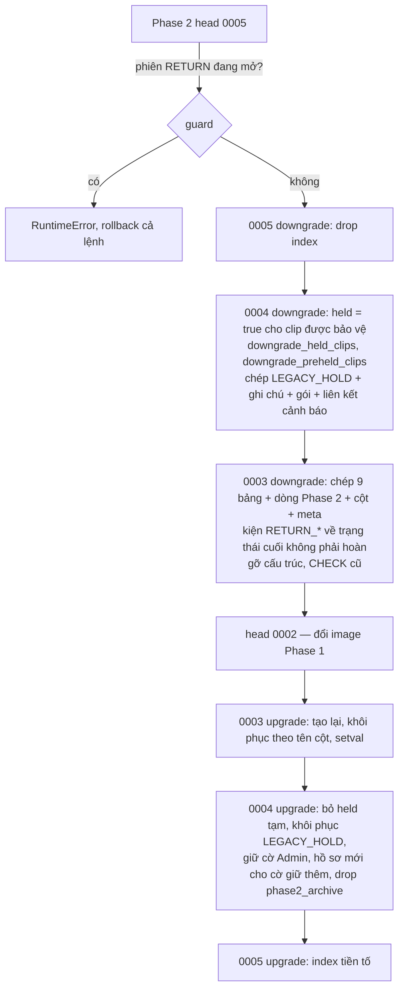

# Lát 10 — Hoàn thiện Phase 2 (M10) — Giải thích nghiệp vụ

| Trường | Giá trị |
|---|---|
| Item / lát | `02-returns-reconciliation` · lát 10 (milestone M10, [03-plan §4](../../ai/items/02-returns-reconciliation/03-plan.md)) |
| Yêu cầu | Rollback 02 §10 (DEC-252, 270); FR-02.09 (downgrade trả cờ giữ), AC-26 (phần up / down / up); NFR-01, 32, 33, 34 (đo); FR-04.07 (tìm tiền tố — hiệu năng); FR-10.02 (ma trận quyền E2E, AC-35); RB-23 — [01-srs](../../ai/items/02-returns-reconciliation/01-srs.md) v0.5 |
| Task | BE: T-120, T-116, T-118 · FE: T-162 |
| Code | `ai-cam-be`: `07d08d8` (T-120), `a039dfd` (T-116), `8aec45c` (T-118 + migration 0005) · `ai-cam-fe`: `e1b74a1` (T-162). Plan / status chưa ghi M10 xong; log E2E BE thật: `docs/ai/items/02-returns-reconciliation/m10-e2e-real.txt` (56 pass + 1 skip có chủ đích) |
| Người đọc | Dev mới vào dự án, reviewer, QA, người vận hành |
| Tác giả | khanhtt (agent soạn) |
| Reviewer | PO (đúng nghiệp vụ) · Tech lead (đúng code) |
| Trạng thái | Draft |
| Last update | 2026-10-06 · Dev |

## TL;DR

- **Lùi về Phase 1 không mất bằng chứng**: dữ liệu Phase 2 được chép sang schema `phase2_archive`, clip đang được hồ sơ bảo vệ được đặt cờ "Giữ" để code cũ không xóa; nâng cấp lại khôi phục y hệt (so từng dòng 22 bảng).
- Còn phiên nhận hoàn đang mở → **từ chối lùi**, không đổi gì. Image cũ chạy trên DB mới → bước `migrate` báo lỗi, `api` không lên.
- **Dữ liệu mẫu** `seed-demo` có đủ loại hàng hoàn (đang về, trả một phần, quá hạn + cảnh báo + hồ sơ, đóng gói chưa bàn giao, chỉ hoàn tiền, chưa xác định), tạo qua service thật, chạy lại không nhân bản.
- **Đo tải** (máy dev): phiên hoàn mở p95 150 ms, ảnh 35 ms; đối soát 100.000 kiện 49,7 giây lần đầu. Phát hiện tìm theo tiền tố quét cả bảng → **migration 0005** thêm index, nhanh 40–60 lần.
- **Nâng cấp ngoài giờ**: migration 0003 khóa bảng kiện ~34 giây / 1 triệu kiện.

## 0. Giải thích đơn giản

Đây là phần **"kiểm tra dây an toàn trước khi lên đường"**. Các lát trước đã làm xong tính năng. Lát này trả lời những câu hỏi của người vận hành: lỡ bản mới có lỗi thì quay về bản cũ có mất video khiếu nại không? Có dữ liệu mẫu để thử và để demo không? Kho lớn thì có chậm không? Nâng cấp lúc nào thì an toàn?

**Ý tưởng chính.** Lát này làm 4 việc:
1. Cho phép quay về bản Phase 1 mà không mất dữ liệu, rồi nâng cấp lại y như cũ.
2. Tạo sẵn dữ liệu mẫu đủ các tình huống hàng hoàn.
3. Đo tốc độ với dữ liệu lớn, sửa chỗ chậm.
4. Ghi rõ cho người vận hành: nâng cấp ngoài giờ, làm theo đúng thứ tự.

### Bước 1 — Quay về bản cũ mà không mất bằng chứng
- Làm gì: khi phải quay về Phase 1, hệ thống không xóa dữ liệu hàng hoàn, mà cất vào một "ngăn lưu trữ" riêng trong cơ sở dữ liệu: hồ sơ hàng hoàn, phiên mở hoàn và video của nó, ảnh, hồ sơ khiếu nại, ghi chú, gói bằng chứng, cảnh báo, kiện tạm, và cả số thứ tự mã HH- / KN- / TAM-.
- Kiện đang ở trạng thái hoàn được hiện lại trạng thái cuối trước đó ("Đã giao" nếu không có). Bản cũ không hiểu trạng thái hoàn, nên phải "đội lốt" trạng thái nó hiểu.
- Video quan trọng: bản cũ chỉ biết cờ "Giữ". Vì vậy mọi clip đang được hồ sơ bảo vệ được đặt cờ "Giữ" trước khi lùi. Đêm đó bản cũ dọn video sẽ bỏ qua chúng. Tệp video, ảnh, zip trên ổ đĩa không bị đụng tới.
- Nâng cấp lại: mọi thứ trong ngăn lưu trữ được trả về chỗ cũ, cờ "Giữ" tạm được bỏ (bảo vệ lại bằng hồ sơ), mã mới không trùng mã cũ. Clip mà Admin đã tự giữ từ trước khi lùi vẫn giữ nguyên.
- Kiện mà trong lúc chạy bản cũ đã đổi trạng thái (ví dụ được đóng gói lại) thì giữ trạng thái mới; đối soát sẽ báo lệch nếu có.
- Không cho lùi khi: còn phiên nhận hoàn đang mở ở bàn nào đó. Bản cũ không biết phiên đó là gì. Hệ thống từ chối và không đổi gì; người vận hành đóng / hủy phiên rồi làm lại.
- Lỡ chạy bản cũ trên dữ liệu mới: bản cũ dừng ngay ở bước kiểm tra cơ sở dữ liệu, không khởi động. Đây là cố ý, để bản cũ không dọn mất video.

### Bước 2 — Dữ liệu mẫu
- Một lệnh tạo sẵn: đơn khách trả trọn 2 kiện đang về; đơn trả một phần; đơn đang về 8 ngày (đã thành quá hạn, có cảnh báo Cao và một hồ sơ khiếu nại thất lạc mẫu); kiện đóng gói xong 25 giờ chưa bàn giao (có cảnh báo); đơn chỉ hoàn tiền; một kiện chưa xác định.
- Tạo bằng chính các bước nghiệp vụ thật (không chèn thẳng vào bảng), để dữ liệu mẫu luôn đúng luật hiện hành. Chạy lại lần hai không nhân đôi. Môi trường thật thì lệnh tự từ chối.

### Bước 3 — Đo tốc độ và sửa chỗ chậm
- Giả lập 10 phút: 1 bàn nhận hoàn (60 kiện / giờ), 2 bàn đóng gói, 1 CSKH. Không lỗi. Quét mở phiên hoàn phần lớn dưới 0,15 giây; chụp ảnh dưới 0,04 giây. Bàn đóng gói không chậm hơn Phase 1.
- Đối soát 100.000 kiện đang mở: lần đầu 50 giây, các lần sau 4 giây (yêu cầu ≤ 60 giây).
- Phát hiện: ô "Tìm thủ công" ở bàn hoàn với kho 1 triệu kiện mất gần nửa giây mỗi lần vì phải lật cả bảng. Thêm chỉ mục cho mã vận đơn, mã đơn, mã chiều về → còn 8–50 phần nghìn giây.

### Bước 4 — Nâng cấp ngoài giờ
- Lần nâng cấp đầu lên Phase 2 khóa bảng kiện trong suốt thời gian chạy: khoảng 34 giây với 1 triệu kiện, 9 giây với 333.000 kiện. Trong lúc đó bàn đóng gói không quét được.
- Vì vậy hướng dẫn vận hành ghi: nâng cấp ngoài giờ đóng gói; kho rất lớn thì dừng máy chủ và các tiến trình nền trước. Trước khi nâng cấp phải sao lưu cơ sở dữ liệu và chụp ổ video (video không nằm trong bản sao lưu cơ sở dữ liệu).
- Lùi về: phải lùi cơ sở dữ liệu **bằng bản mới trước**, rồi mới đổi sang bản cũ. Làm ngược thì bản cũ không lên (bước 1).

**Ví dụ một vòng đầy đủ.** Tối thứ Bảy 21:00, anh Minh (Admin) sao lưu cơ sở dữ liệu và chụp ổ video, rồi nâng cấp kho 300.000 kiện lên Phase 2: 9 giây sau xong, nhật ký ghi "0004: 12 clip giữ → 5 hồ sơ Chuyển từ cờ giữ". Thứ Hai kho chạy hàng hoàn bình thường, có 4 hồ sơ hàng hoàn và 2 hồ sơ khiếu nại. Thứ Ba phát hiện một lỗi nghiêm trọng chưa sửa kịp, chủ shop quyết quay về Phase 1. 21:00 anh Minh thử lùi: hệ thống từ chối vì Station 03 còn một phiên nhận hoàn đang mở. Anh nhờ chị Lan đóng phiên, chạy lại: vài giây sau, nhật ký ghi "đặt Giữ cho 6 clip", "chép sang ngăn lưu trữ: 4 hồ sơ hàng hoàn, 2 hồ sơ khiếu nại…". Anh đổi sang bản cũ; sáng thứ Tư kho đóng gói như Phase 1, video khiếu nại vẫn còn vì mang cờ "Giữ". Thứ Sáu lỗi đã sửa, anh nâng cấp lại: 4 hồ sơ hàng hoàn, 2 hồ sơ khiếu nại quay về đúng như cũ, hồ sơ mới tạo sau đó mang mã KN-000003, không trùng.

**Lưu ý.**
- Mọi con số đo ở trên là **máy dev** (Docker Desktop, camera giả, sàn giả lập), mẫu nhỏ (10 phút, 10 phiên hoàn). Chạy 1 giờ trên server kho với camera thật **chưa làm**.
- Lùi / nâng cấp lại mới thử trên máy dev với dữ liệu nhỏ; chưa thử trên server kho.
- Dữ liệu mẫu chỉ dùng để demo / kiểm thử, không phản ánh tỉ lệ hàng hoàn thật.

## 1. Vì sao cần

02 §10 yêu cầu rollback không mất dữ liệu; ADR-009 đổi cơ chế giữ clip nên lùi về code cũ mà không đặt lại `held` là mất bằng chứng (J-02 Phase 1 xóa). RB-23 (migration khóa bảng lớn) và NFR-01 / 33 cần số đo thật trước G3. Demo và E2E BE thật cần dữ liệu hàng hoàn ổn định sau mỗi lần `qa-reset`.

| Lát này làm (Goals) | Lát này không làm (Non-goals — ở đâu) |
|---|---|
| Downgrade 0003 / 0004 → `phase2_archive` (9 bảng, phiên RETURN + clip / sự kiện / approval / export, kiện tạm, lịch sử `RETURN_*`, cột Phase 2, sequence; `LEGACY_HOLD` + ghi chú + gói + liên kết cảnh báo); guard phiên hoàn mở; upgrade khôi phục + `setval`; giữ cờ Admin đã giữ (T-120) | Thêm kiểm tra lúc khởi động image cũ (không sửa được image cũ — dựa vào bước `migrate`) |
| `seed-demo` hàng hoàn qua service thật, idempotent, chặn production (T-116) | Dữ liệu demo cho Shopee thật |
| Contract test runtime toàn bộ API Phase 2; locust `LOAD_PROFILE=returns`; `perf_bigdata` (J-14, lock 0003, API-104); migration 0005 index `text_pattern_ops` (T-118) | Tách backfill 0003 ra job nền (đề xuất nếu server kho đo > 2 phút — DEC-334) |
| E2E BE thật M10: station hàng hoàn đủ nhánh, D14 / D3 / D4 gắn đơn + gộp, sửa kết luận, D15, D17 đủ trạng thái + `VERSION_CONFLICT`, zip SHA-256, ma trận quyền 4 vai (T-162) | Chạy tải 1 giờ trên server kho (TC-N2.01) |
| `docs/ops.md` §7.1: nâng cấp / lùi Phase 2, nâng cấp ngoài giờ | SOP vận hành kho (06-business-qa L10) |

## 2. Ai dùng, ở đâu, khi nào

| Vai | Điểm vào | Lúc nào dùng |
|---|---|---|
| Admin / ops | `dc up -d --build` (migrate trước api); `dc run --rm migrate alembic downgrade 0002` (image mới); `ai-cam-be/docs/ops.md` §7.1 | Nâng cấp, lùi, nâng cấp lại |
| Dev / QA | `aicam seed-demo`, `scripts/qa-reset.sh` | Sau mỗi lần reset DB dev / staging |
| Dev / QA | `LOAD_PROFILE=returns` locust; `tests/load/perf_bigdata.py` | Đo NFR trước G3 / go-live |
| QA | `pnpm e2e` cấu hình real, gate `E2E_M10_BE` | Hồi quy toàn luồng Phase 2 |

## 3. Tình huống thực tế

| # | Tình huống | Hệ thống làm gì | Vì sao |
|---|---|---|---|
| 1 | `downgrade 0002` khi Station 03 có phiên RETURN `OPEN` | `RuntimeError`, cả lệnh lùi (gồm 0004) rollback | Code cũ không có phiên hoàn (DEC-331 b) |
| 2 | Downgrade bình thường | 0004 đặt `held` cho clip được bảo vệ, ghi `downgrade_held_clips`, chép `LEGACY_HOLD`; 0003 chép 9 bảng + dòng Phase 2 sang `phase2_archive`, kiện `RETURN_*` → trạng thái cuối không phải hoàn | Bằng chứng còn dưới code cũ (DEC-252, 270) |
| 3 | Clip phiên hoàn `PENDING` / `FAILED` lúc lùi | Chỉ log cảnh báo; ops: bấm "Thử lại" trước khi lùi | Code cũ không giữ video thô cho chúng |
| 4 | Admin giữ clip bằng API-42 ở Phase 2, lùi rồi lên lại | `downgrade_preheld_clips` → 0004 upgrade giữ nguyên `held = true`, không sinh `LEGACY_HOLD` giả | DEC-332 |
| 5 | Phase 1 chạy lại thêm cờ giữ mới, rồi nâng cấp lại | Chỉ tạo hồ sơ `LEGACY_HOLD` mới cho clip giữ thêm | ops §7.1 |
| 6 | Image Phase 1 trỏ vào DB đã nâng cấp | `migrate`: `Can't locate revision identified by '0005'` → thoát ≠ 0 → `api` không lên | Chặn J-02 cũ xóa clip (DEC-331 f) |
| 7 | Kiện bị code cũ đổi trạng thái trong lúc lùi | Upgrade giữ trạng thái mới, log `kiện hoàn đã đổi trạng thái`; J-14 báo lệch nếu có | Không ghi đè thực tế mới |
| 8 | `seed-demo` chạy 2 lần | Số dòng không đổi | Idempotent (DEC-333) |
| 9 | API-104 tìm tiền tố 10 ký tự trên 1 triệu kiện | Trước 0005: 462 ms; sau: 11 ms | DEC-334 |
| 10 | Nâng cấp 0003 trên 1 triệu kiện | 33,9 giây; kết nối khác đọc `package` bị chặn 33,6 giây | RB-23 — ghi ops: ngoài giờ |

## 4. Luồng ví dụ từ đầu đến cuối

1. Ops sao lưu DB + snapshot volume video; hoàn tất / hủy mọi phiên hoàn; bấm "Thử lại" cho clip phiên hoàn lỗi.
2. `dc stop api vision worker worker-sync worker-export beat` — không để job ghi giữa chừng.
3. `dc run --rm migrate alembic downgrade 0002` bằng **image mới**: 0005 → 0004 → 0003 trong một transaction; lỗi ở đâu cũng lùi hết, DB vẫn Phase 2.
4. Kiểm `alembic current` = 0002 và log số dòng đã chép; rồi mới `AICAM_IMAGE=<tag Phase 1> dc up -d`.
5. Nâng cấp lại: như nâng cấp thường; log `0003: khôi phục từ phase2_archive {…}` phải bằng số dòng lúc chép; 0004 drop schema ở cuối (không drop ở 0003 vì 0004 còn đọc — R3-5).

## 5. Quy tắc nghiệp vụ và lý do

| Quy tắc | Con số / điều kiện | Vì sao | ID |
|---|---|---|---|
| Lùi không xóa | Chép trước, xóa sau, cùng transaction; file trên đĩa giữ nguyên | Không mất dữ liệu Phase 2 | DEC-252, DEC-331 a |
| Bảo vệ dưới code cũ | `held = true` cho mọi clip thuộc `protected_sessions_sql` lúc lùi | J-02 Phase 1 chỉ hiểu `held` | ADR-009, FR-02.09 |
| Từ chối lùi | Còn phiên RETURN `OPEN` / `MISMATCH` / `WAITING_APPROVAL` | Phiên mở không có nghĩa ở code cũ | DEC-331 b |
| Khôi phục khi lên lại | Theo tên cột chung; `setval` = max(lúc lùi, mã lớn nhất có); không đè kiện code cũ đã đổi | Mã không trùng; thực tế mới thắng | DEC-331 d, R3-5 |
| Giữ cờ Admin | Clip `held` trước khi lùi, cờ / người / giờ chưa đổi → giữ nguyên, không tạo hồ sơ | Không sinh `LEGACY_HOLD` giả | DEC-332 |
| Chặn image cũ | Bước `migrate` của image cũ lỗi revision lạ → `api` `depends_on: service_completed_successfully` | Không có cửa sổ J-02 cũ chạy trên DB mới | DEC-331 f |
| Thứ tự lùi | Downgrade bằng image mới **trước**, đổi image **sau** | Image cũ không có downgrade 0003+ | ops §7.1 |
| Nâng cấp ngoài giờ | 0003 khóa bảng kiện ~34 giây / 1 triệu kiện (một transaction); 0004 + 0005 < 0,4 giây + 1,3 giây | Bàn đóng gói không quét được trong lúc khóa | RB-23, DEC-302, DEC-334 |
| Sao lưu trước nâng cấp | `pg-backup.sh once` + snapshot volume video | Bằng chứng không nằm trong `pg_dump` | ops §7.1 |
| Index tiền tố | `upper(tracking_number)`, `upper(platform_order_sn)`, `upper(return_tracking_number)` `text_pattern_ops` (0005) | Collation `en_US.utf8` làm `LIKE q%` quét cả bảng | FR-04.07, DEC-334 |
| Dữ liệu mẫu | Qua service thật; idempotent; chặn production (`exit 2`); cần Redis (khóa `recon:run`) | Đúng luật hiện hành, không làm bẩn dữ liệu thật | DEC-333 |
| Hiệu năng | NFR-01 mở RETURN p95 150 ms / đóng 43 ms; NFR-32 ảnh p95 35 ms; NFR-33 49,7 giây / 103.240 kiện lần đầu | Đạt trên máy dev | DEC-334, DEC-335 |

## 6. Điểm dễ hiểu nhầm

- **`downgrade -1` được không?** Không dùng; luôn `downgrade 0002` theo ops §7.1 để ba migration lùi cùng một transaction.
- **Sao không đơn giản khôi phục bản sao lưu?** Mất mọi dữ liệu Phase 1 phát sinh sau lúc chụp (đơn mới, phiên đóng gói mới). Archive giữ được cả hai (DEC-331, phương án loại 1).
- **Sau khi lùi, xóa `phase2_archive` cho gọn được không?** Không. Đó là chỗ duy nhất còn dữ liệu Phase 2; xóa là mất khi nâng cấp lại. Cũng không bỏ "Giữ" hàng loạt khi đang chạy Phase 1.
- **J-14 lần đầu 118 giây với 1 triệu kiện có vi phạm NFR-33?** Đó là trường hợp xấu cố ý (`recon_start_at` lùi 90 ngày). Thực tế `recon_start_at` = lúc nâng cấp nên không có đợt cảnh báo dồn; lần sau 14,5 giây; vẫn dưới khóa 600 giây.
- **E2E M10 dùng dữ liệu gì?** `seed-demo` (kiện 47 / 48 / 49 / 52 / 53, `TAM-…`, `KN-000001`); phiên đã đóng thì tạo qua API station để spec admin không phụ thuộc UI station (DEC-352 b).
- **Skip 1 ca E2E là lỗi?** Không: TC-05.03 "Shopee chưa cấu hình" chỉ chạy ở lượt `SHOPEE_ENABLED=false`.

## 7. Bản đồ nghiệp vụ → code

Đường dẫn BE tính từ `ai-cam-be/` (code trong `src/aicam/`), test BE từ `ai-cam-be/tests/`. FE / E2E từ `ai-cam-fe/`.

| Khái niệm nghiệp vụ | Code | Test chứng minh |
|---|---|---|
| Downgrade → archive, guard, khôi phục, chặn image cũ | `alembic/versions/0003_returns_recon_claims.py`, `alembic/versions/0004_hold_to_claims.py`, `alembic/versions/0005_return_lookup_indexes.py`, `docker/compose.yml` (`migrate` + `depends_on`) | `integration/test_migration_rollback.py`: `test_round_trip_with_phase2_data`, `test_down_up_down_up_is_stable`, `test_downgrade_refused_with_open_return_session`, `test_old_image_refuses_new_database`; `integration/test_migration_0003.py`: `test_downgrade_archives_phase2_data`, `test_downgrade_then_upgrade_without_phase2_data`; `integration/test_migration_0004.py::test_downgrade_then_upgrade_round_trip` |
| Hướng dẫn nâng cấp / lùi / ngoài giờ | `docs/ops.md` §7, §7.1 | — (thủ tục vận hành; QA live T-120 ghi ở DEC-331) |
| Dữ liệu mẫu hàng hoàn | `src/aicam/entrypoints/seed_returns.py`, `src/aicam/entrypoints/cli.py` (`seed-demo`) | `integration/test_seed_returns.py::test_seed_returns_creates_every_kind_and_is_idempotent` |
| Contract API Phase 2 | `scripts/export_openapi.py`, `tests/contract/spec.py` | `contract/test_openapi_contract.py`, `contract/test_runtime_contract_returns.py::test_phase2_responses_follow_contract` |
| Tải bàn hoàn + đóng gói + CSKH | `tests/load/locustfile.py` (`LOAD_PROFILE=returns`) | Số đo DEC-335 (không phải test pass / fail) |
| Dữ liệu lớn: J-14, lock 0003, API-104 | `tests/load/perf_bigdata.py`; index ở `alembic/versions/0005_return_lookup_indexes.py`, `src/aicam/modules/sessions/return_lookup.py` | Số đo DEC-334 |
| E2E BE thật Phase 2 | — | FE `e2e/real/m10-station-returns.spec.ts`, `e2e/real/m10-admin-returns.spec.ts`, `e2e/real/m10-recon-claims.spec.ts`, `e2e/real/m10-permissions.spec.ts` ("TC-P2.01..P2.12 (API, P1)…", "Quyền UI Phase 2…"); log `docs/ai/items/02-returns-reconciliation/m10-e2e-real.txt` (repo gốc) |

## 8. Giới hạn hiện tại và giả định

| Giới hạn / giả định | Ảnh hưởng | Khi nào xử lý |
|---|---|---|
| **Server kho chưa test**: thời gian khóa 0003 thật, lùi / nâng cấp lại trên dữ liệu thật, khôi phục sao lưu, tải 1 giờ (TC-N2.01), NFR-33 / NFR-34 | Số đo máy dev có thể lạc quan | Trước go-live; DEC-334 đề xuất tách backfill nếu > 2 phút |
| **Camera thật chưa test (T-4)** — locust dùng `fake-cam` | NFR-32, CPU `vision` với nhiều camera thật chưa biết | T-4 |
| **Shopee thật chưa test (T-3)** — `seed-demo` và E2E dùng adapter mock / payload dựng từ fixture | Luồng đồng bộ thật chưa có bằng chứng | T-3 |
| Mẫu tải nhỏ (10 phút, 249 request, 10 phiên hoàn) | Không thấy rò rỉ / suy giảm dài hạn | Chạy 1 giờ trên server kho |
| Q13 / Q14..Q17 vẫn mở (xem lát 6–9) | Q13 **chặn go-live** | Chủ shop, T-3 |
| Plan / status chưa ghi M10 xong; G3 chưa chốt | Tài liệu này có thể phải sửa theo review G3 | Bước 9–10 pipeline |

## Liên kết

- SRS: [01-srs.md](../../ai/items/02-returns-reconciliation/01-srs.md) v0.5: §8 NFR-01, 32..35, AC-26, AC-35, §13
- Spec: [02 §10](../../ai/items/02-returns-reconciliation/02-tech-spec.md) Rollout & rollback · [02a §3](../../ai/items/02-returns-reconciliation/02a-be-spec.md) migration 0003 / 0004, RB-23, DEC-331..335 · [02b-admin](../../ai/items/02-returns-reconciliation/02b-fe-spec-admin.md) DEC-352
- Kiến trúc: [ADR-009](../../ai/system/decisions/ADR-009-claim-based-evidence-retention.md) (downgrade = archive)
- Vận hành: `ai-cam-be/docs/ops.md` §7.1
- Lát trước: [lat-09-doi-soat.md](lat-09-doi-soat.md) · Phase 1: [lat-05-van-hanh.md](../01-packing-mvp/lat-05-van-hanh.md)
