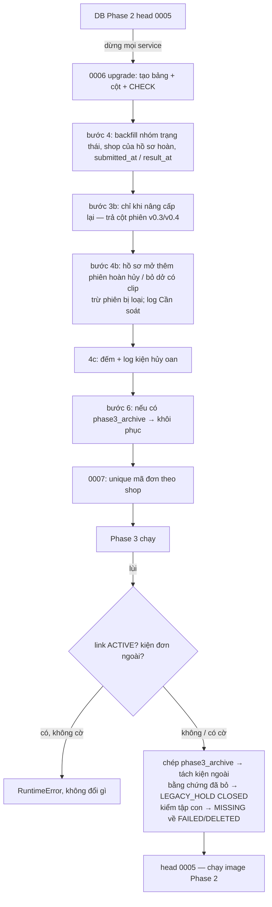

# Lát 11 — Nền schema + bằng chứng (M11) — Giải thích nghiệp vụ

| Trường | Giá trị |
|---|---|
| Item / lát | `03-expansion-tiktok` · lát 11 (milestone M11, [03-plan §4](../../ai/items/03-expansion-tiktok/03-plan.md)) |
| Yêu cầu | FR-05.07, 05.21 (nhóm trạng thái — nền), FR-08.07 (BR-39 nền: phiên mở hoàn trước, phiên chính), FR-08.09 (BR-38 bỏ mềm), FR-08.10 (BR-42 hạn đã qua), FR-04.14 (BR-37 phía server), NFR-28; BR-29 (unique theo shop), BR-30 — [01-srs](../../ai/items/03-expansion-tiktok/01-srs.md) v0.5 |
| Task | BE: T-201, T-202, T-203, T-213, T-214, T-275, T-282, T-289 · FE: T-231, T-251, T-252 |
| Code | `ai-cam-be`: `09993b3` (T-201), `ee7478e` (T-202), `88f2c0a` (T-203), `84ca7c7` (T-213), `ca667f0` (T-214), `be9697e` (T-275), `661c111` (T-282), `2096d5d` (T-289) · `ai-cam-fe`: `9324d86` (T-231), `98a9f7f` (T-251), `df1644c` (T-252) — nhánh `feat/03-expansion-tiktok` |
| Người đọc | Dev mới vào dự án, reviewer, QA, người vận hành |
| Tác giả | khanhtt (agent soạn) |
| Reviewer | PO (đúng nghiệp vụ) · Tech lead (đúng code) |
| Trạng thái | Draft |
| Last update | 2026-10-07 · Dev |

## TL;DR

- Lát nền: migration **0006** (9 bảng + cột mới cho mọi lát Phase 3) và **0007** (mã đơn chỉ duy nhất **trong một shop**). Lõi nghiệp vụ chuyển sang đọc **nhóm trạng thái chung** thay chữ trạng thái của Shopee — điều kiện để thêm TikTok mà không sửa lõi.
- Ba luật bằng chứng nền: (1) tạo hồ sơ khiếu nại thì tự kéo theo **mọi phiên mở hoàn bị hủy / bỏ dở có clip**, phiên có video sớm nhất là **phiên chính** (BR-39); (2) bỏ bằng chứng khỏi hồ sơ là **bỏ mềm** + bắt lý do, clip vẫn được giữ đủ số ngày (BR-38); (3) hạn sàn đã qua lúc tạo hồ sơ → hạn mặc định + ghi chú (BR-42).
- Nâng cấp trên DB Phase 2 tự thêm phiên trước vào hồ sơ đang mở (bước 4b); lùi về Phase 2 **không mất bằng chứng** (chép sang `phase3_archive`, bằng chứng đã bỏ được "đội lốt" hồ sơ đã đóng để code cũ không xóa); nâng cấp lại khôi phục y hệt.
- Luật hủy 60 giây phía server đã có ở lát này (giải thích đầy đủ ở [lát 12](lat-12-da-shop-hardening.md)).

## 0. Giải thích đơn giản

Đây là phần **"đổ móng và chôn ống trước khi xây nhà"**. Phase 3 có 6 việc lớn (TikTok, báo cáo, sao lưu, link, thông báo, vá lỗ hổng hàng hoàn). Trước khi làm từng việc, phải sửa cơ sở dữ liệu một lần cho đủ chỗ chứa, và sửa vài luật gốc về video bằng chứng — vì các lát sau đều đứng trên đó.

**Ý tưởng chính.** Lát này làm 4 việc:
1. Thêm chỗ chứa dữ liệu mới cho cả Phase 3 trong một lần nâng cấp, và cho quay về bản cũ an toàn.
2. Dạy hệ thống nói một "ngôn ngữ trạng thái chung" cho mọi sàn.
3. Vá chỗ hở "video mở hộp đầu tiên bị bỏ quên".
4. Vá chỗ hở "bỏ một video khỏi hồ sơ là đêm đó video bị xóa" và "hồ sơ sinh ra đã quá hạn".

### Bước 1 — Một lần nâng cấp cho cả Phase 3
- Làm gì: thêm bảng cho link chia sẻ, sao lưu, thông báo, kiện gộp nhiều đơn; thêm cột cho shop, đơn, phiên, hồ sơ.
- Mã đơn trước đây duy nhất toàn hệ thống. Nay hai shop khác nhau được trùng mã đơn (shop Shopee "Áo Đẹp" và shop TikTok "Áo Đẹp Official" đều có thể có đơn "2410ABCDEF"). Vì vậy mã đơn chỉ duy nhất **trong một shop**.
- Vì sao làm một lần, sớm nhất: mọi lát sau đều dùng các cột này. Sửa cơ sở dữ liệu nhiều lần, rải rác, dễ đụng nhau và khó lùi.
- Sự cố thì sao: còn dịch vụ đang chạy giữ bảng → nâng cấp chờ tối đa 5 giây rồi báo lỗi, không đổi gì.

### Bước 2 — Ngôn ngữ trạng thái chung
- Mỗi sàn gọi trạng thái đơn bằng chữ riêng ("READY_TO_SHIP" của Shopee, "AWAITING_SHIPMENT" của TikTok). Hệ thống giữ nguyên chữ của sàn để hiển thị, **và** quy về một nhóm chung: Chờ giao, Đã giao cho đơn vị vận chuyển, Đã giao, Đang yêu cầu hủy, Đã hủy, Đang hoàn về, Không rõ.
- Mọi luật của kho (chặn đóng gói đơn hủy, đối soát, báo cáo) chỉ đọc nhóm chung.
- Vì sao: thêm TikTok không phải sửa phần lõi. Có một bài test quét toàn bộ mã nguồn lõi: nếu ai đó viết chữ trạng thái riêng của một sàn vào lõi, test đỏ.
- Chữ lạ chưa có trong bảng → nhóm "Không rõ", kiện không đổi trạng thái (an toàn hơn đoán).

### Bước 3 — Video mở hộp đầu tiên không bị bỏ quên
- Chuyện thật: 08:51 chị Lan mở hộp kiện hoàn, rạch băng keo, thì mất điện. Phiên bị "bỏ dở". 10:15 chị quét lại, hộp rỗng, kết luận "Hộp rỗng". Phase 2 chỉ đưa phiên 10:15 vào hồ sơ khiếu nại — mà video 10:15 quay một hộp **đã bị rạch**. Video mạnh nhất là video 08:51.
- Nay: tạo hồ sơ khiếu nại (tự hoặc tay) thì hệ thống tự thêm **mọi** phiên mở hoàn trước đó bị hủy / bỏ dở có video. Phiên mở hoàn có video **sớm nhất** là "phiên chính" — đứng đầu gói bằng chứng.
- Không có phiên mở hoàn nào có video → phiên chính là phiên đóng gói.
- Lát 12 bổ sung ngoại lệ: phiên hủy vì "quét nhầm" không được vào (xem lát 12).

### Bước 4 — Bỏ video khỏi hồ sơ không còn là "xóa đêm nay"
- Phase 2: CSKH bỏ một video khỏi hồ sơ → video mất bảo vệ → nếu video đã cũ quá số ngày giữ, lần dọn 02:00 đêm đó xóa luôn.
- Nay: bỏ **bất kỳ** bằng chứng nào cũng phải ghi lý do 5–500 ký tự; hộp xác nhận nói rõ ngày video sẽ bị xóa. Dòng bằng chứng không bị xóa, chỉ đánh dấu "đã bỏ" (ai bỏ, lúc nào, vì sao).
- Video bị bỏ được giữ tiếp tới **max(lúc video kết thúc, lúc bỏ) + số ngày giữ clip** — cùng luật như khi đóng hồ sơ. Lỡ tay bỏ nhầm vẫn còn thời gian "Thêm lại".

### Bước 5 — Hồ sơ không sinh ra đã quá hạn
- Sàn cho hạn khiếu nại 05/10 17:00, mà 06/10 09:00 mới tạo hồ sơ → trước đây hạn hiện là ngày đã qua, hồ sơ "quá hạn" ngay lúc sinh.
- Nay: dùng hạn mặc định (lúc tạo + 7 ngày) và ghi chú hệ thống "Hạn sàn (05/10 17:00) đã qua khi tạo hồ sơ — dùng hạn mặc định. Kiểm hạn thật trên sàn."

### Bước 6 — Nâng cấp kho đang chạy và lùi về nếu cần
- Lúc nâng cấp, hồ sơ khiếu nại **đang mở** từ Phase 2 được bổ sung phiên mở hoàn trước (như bước 3). Phiên do quản lý hủy ở Phase 2 không có lý do → vẫn thêm nhưng gắn "Cần soát" (lát 12 giải thích).
- Kiện bị Phase 2 hủy oan vì "người mua đang xin hủy" → lúc nâng cấp chỉ **đếm và in danh sách**, không tự sửa (ops chạy lệnh riêng — lát 12).
- Lùi về Phase 2: dữ liệu Phase 3 chép sang một "ngăn lưu trữ" rồi mới gỡ. Video đã bỏ khỏi hồ sơ mà còn hạn giữ → gom vào một hồ sơ hệ thống đã đóng, để code Phase 2 (chỉ hiểu "hồ sơ đóng gần đây thì giữ video") không xóa sớm. Còn link chia sẻ đang mở hoặc kiện của đơn TikTok → **từ chối lùi** trừ khi ops bật cờ cho phép rõ ràng.

**Ví dụ một vòng đầy đủ.** Thứ Bảy 21:00, anh Minh (Admin) nâng cấp kho đang chạy Phase 2. Nhật ký nâng cấp báo: hồ sơ KN-000001 có 1 phiên "Cần soát", và 2 kiện có thể bị hủy oan — cần chạy lệnh trả lại kiện. Hồ sơ KN-000001 đang mở tự có thêm phiên 08:51 bỏ dở, phiên này thành phiên chính. Thứ Hai, chị Hoa (CSKH) bỏ phiên đóng gói khỏi một hồ sơ khác, gõ lý do "Không liên quan", hộp xác nhận báo "Clip này được giữ tới 04/01/2027 rồi tự xóa (trừ khi thuộc hồ sơ khác)". Đêm đó lần dọn 02:00 không xóa clip. Thứ Ba, hồ sơ mới cho đơn có hạn sàn đã qua hôm qua: hạn tự thành 7 ngày sau + ghi chú hệ thống.

**Lưu ý.**
- Phần giao diện D17 cho các luật này (chip, Alert, dialog bỏ có ngày giữ) làm ở lát 12; lát này chỉ có API + dữ liệu mock cho FE.
- Đo nâng cấp 1 triệu đơn trên **máy dev** ~22 giây; trên server kho / bản sao DB production **chưa test**.

## 1. Vì sao cần

Phase 2 để lại 3 lỗ hổng làm mất tiền khiếu nại (06-business-qa L11, L14, L15) và một lõi "chỉ biết Shopee, một shop" (P7). Nếu không làm lát này trước: mỗi lát sau phải tự sửa schema (đụng nhau trong cùng file migration — RB-36..38), lõi phải thêm chữ trạng thái TikTok (vi phạm NFR-28), và kho vẫn gửi sàn video hộp đã rạch.

| Lát này làm (Goals) | Lát này không làm (Non-goals — ở đâu) |
|---|---|
| 0006: 9 bảng + mọi cột / CHECK Phase 3 một lần (DEC-539); 0007 unique theo shop (BR-29); downgrade → `phase3_archive`, nâng cấp lại (DEC-540, 544..546) | Ghi đơn theo shop, tra mã nhiều shop (lát 12, 13) |
| Nhóm trạng thái chung + `registry` + test NFR-28 (T-203, DEC-541) — giữ **đúng hành vi Phase 2** (`IN_CANCEL` vẫn chặn như hủy) | Đổi "yêu cầu hủy ≠ hủy" (BR-21 làm rõ — lát 12) |
| BR-39 nền: phiên trước, phiên chính, J-16 thư mục phiên trước (T-213, DEC-542) | Loại phiên quét nhầm / "Cần soát" / gỡ lý do (T-279, 281, 290 — lát 12) |
| BR-37 server: API-12 409 + `self_cancel_until` (T-213) | Nút R2 đổi đúng giây 61, D13 chọn lý do (lát 12) |
| BR-38 bỏ mềm + `keep_until`, BR-42 hạn đã qua (T-214, DEC-543) | D17 `RemoveEvidenceDialog` (T-260 — lát 12) |
| Bước 4b (phiên trước vào hồ sơ mở), (4c) log kiện hủy oan, 3b thứ tự khôi phục (T-275, 282, 289) | Lệnh `fix-cancel-requests` (T-285 — lát 12) |
| FE nền: kiểu API station / admin, MSW Phase 3, drawer + route, `PlatformChip`, `DueCountdown`, `PlatformFilter` (T-231, 251, 252) | Màn D20–D23 (ẩn khỏi menu tới task làm màn — DEC-547) |

## 2. Ai dùng, ở đâu, khi nào

| Vai | Điểm vào | Lúc nào dùng |
|---|---|---|
| Ops / Admin | `alembic upgrade head` / `downgrade 0005` qua service `migrate` (ops §7.2) | Nâng cấp kho Phase 2 → 3, lùi khi có sự cố |
| CSKH | API-131 (tạo hồ sơ tay), API-132 (chi tiết), API-134 (thay bằng chứng) | Làm hồ sơ khiếu nại |
| Job | J-03 / tạo hồ sơ tự động khi kết luận có vấn đề | Đóng phiên mở hoàn |
| Station (bàn hoàn) | API-12 hủy phiên | Quét nhầm trong 60 giây đầu |
| Dev FE | `pnpm dev:mock` (MSW Phase 3) | Làm màn trước khi BE xong |

## 3. Tình huống thực tế

| # | Tình huống | Hệ thống làm gì | Vì sao |
|---|---|---|---|
| 1 | Phiên A 08:51 bỏ dở (có clip), phiên B 10:15 "Hộp rỗng" | Hồ sơ KN gồm đóng gói + A + B; A là phiên chính; zip có thư mục `02-mo-hoan` = A, B ở thư mục phiên khác | Video mở hộp đầu là bằng chứng mạnh nhất (DEC-416) |
| 2 | Phiên trước bị hủy nhưng clip đã bị xóa | Không thêm (cần ≥ 1 clip ≠ `DELETED`) | Không có gì để chứng minh |
| 3 | Kiện chỉ có phiên đóng gói + phiên hoàn hoàn tất | Phiên chính = phiên mở hoàn hoàn tất (có clip) | Luật "sớm nhất có clip" |
| 4 | CSKH bỏ phiên đóng gói (tự chọn) không gõ lý do | 422 "Nhập lý do bỏ bằng chứng (5–500 ký tự)." | Phase 2 chỉ bắt lý do cho bằng chứng tự chọn; L15 xảy ra ở bằng chứng thêm tay / "Chuyển từ cờ giữ" |
| 5 | Clip 01/05, giữ 90 ngày, bỏ 06/10 | Giữ tới 04/01/2027 (06/10 + 90) | Ví dụ BR-38 |
| 6 | Bỏ rồi "Thêm lại" | Gỡ `removed_*` của **dòng cũ**, không thêm dòng mới | Không mất lịch sử ai bỏ / vì sao (DEC-543) |
| 7 | Hạn sàn 05/10 17:00, tạo hồ sơ 06/10 09:00 | Hạn 13/10 09:00, `deadline_source = DEFAULT_PLATFORM_PASSED`, ghi chú hệ thống | BR-42 |
| 8 | Nâng cấp: hồ sơ mở KN-000001 có phiên Supervisor hủy ở Phase 2 | 4b thêm phiên, log `backfill_review_needed` | Phase 2 không có mã lý do — không biết là quét nhầm hay kiện thật (DEC-516) |
| 9 | Lùi khi còn link chia sẻ `ACTIVE` | `RuntimeError`, không đổi gì | Phase 2 không có job thu hồi / hết hạn → link sống mãi (DEC-475) |
| 10 | Lùi khi có bằng chứng đã bỏ còn hạn giữ | Mỗi kiện một hồ sơ `LEGACY_HOLD` `CLOSED` (`closed_at` = lúc bỏ muộn nhất), ghi chú "giữ tới dd/mm/yyyy" | Luật giữ của Phase 2 chỉ hiểu "hồ sơ đóng gần đây" (DEC-497) |
| 11 | Image Phase 2 chạy trên DB đã lên 0007 | Bước `migrate` lỗi revision lạ, `api` không lên; Phase 3 `SCHEMA_HEAD = "0007"` | Không để code cũ chạy trên dữ liệu mới (bài học DEC-331) |

## 4. Luồng ví dụ từ đầu đến cuối

Chuyện ví dụ (dữ liệu từ diễn tập T-230, `evidence/m18-upgrade-rollback.txt`):
1. Bản sao DB Phase 2: 43 kiện, 13 phiên, 23 clip, 3 hồ sơ, 5 dòng bằng chứng.
2. `alembic upgrade head` (0,8 giây): log `backfill_review_needed [KN-000001 …]`, "2 kiện có thể bị hủy oan", 4b thêm 2 dòng (phiên `ABANDONED` + phiên Supervisor hủy), **không** thêm phiên hủy quét nhầm. Hồ sơ KN-000001 `version + 1` để ai đang mở bản cũ trên D17 nhận 409 thay vì ghi đè.
3. Phase 3 chạy: thêm shop Shopee thứ 2, shop TikTok, một link, một kênh, bỏ 1 bằng chứng.
4. `alembic downgrade 0005` lần 1: từ chối vì link `ACTIVE`; thu hồi link → lần 2 từ chối vì 44 kiện của đơn ngoài; với `AICAM_DOWNGRADE_DETACH_FOREIGN_ORDERS=1` → lùi được; 1 dòng đã bỏ còn hạn → 1 hồ sơ `LEGACY_HOLD` đã đóng.
5. Chạy code Phase 2 (`main`) trên DB đã lùi: J-02 ứng viên xóa y hệt trước nâng cấp — bằng chứng đã bỏ vẫn được giữ.
6. `alembic upgrade head` lại: 38 bảng y hệt trước khi lùi (so `md5(to_jsonb)` từng bảng).

## 5. Quy tắc nghiệp vụ và lý do

| Quy tắc | Con số / điều kiện | Vì sao | ID |
|---|---|---|---|
| Mã đơn duy nhất trong shop | Unique `(shop_id, platform_order_sn)`; mã vận đơn vẫn duy nhất toàn hệ thống | Hai shop được trùng mã đơn; mã vận đơn do ĐVVC cấp nên không trùng | BR-29, 0007 |
| Lõi chỉ đọc nhóm chung | 8 nhóm `ORDER_STATUS_GROUPS`; chữ lạ → `UNKNOWN`, kiện giữ nguyên | Thêm sàn không sửa lõi | BR-30, NFR-28, FR-05.21 |
| Giữ hành vi Phase 2 tới khi có test | `CANCEL_GROUPS = (CANCEL_REQUESTED, CANCELLED)` vẫn chặn mở phiên; đổi luật hủy kiện ở lát 12 | Không đổi hành vi trước khi có test BR-21 đủ | DEC-541 |
| Phiên mở hoàn trước tự vào hồ sơ | RETURN `CANCELLED` / `ABANDONED`, ≥ 1 clip ≠ `DELETED`, của kiện / hồ sơ hàng hoàn; chỉ lúc **tạo** hồ sơ | Hộp đã rạch không quay lại được | BR-39, FR-08.07, DEC-542 |
| Phiên chính | Phiên RETURN có clip sớm nhất trong bằng chứng; không có → phiên PACK hiệu lực | Gói / link đặt video mạnh nhất lên đầu | BR-39, DEC-448 |
| Bỏ bằng chứng | Mọi loại cần lý do 5–500 ký tự; bỏ mềm (`removed_at/by/reason`) | Không xóa bất ngờ; có dấu vết | BR-38, FR-08.09 |
| Giữ sau khi bỏ | max(`end_at`, lúc bỏ) + số ngày giữ (≥ sàn 60); trừ khi còn được bảo vệ vì lý do khác | Một luật "rời bảo vệ" như đóng hồ sơ (ADR-009) | BR-38, DEC-418 |
| Hạn sàn đã qua lúc tạo | `seller_due_at < now` → `now + claim_deadline_days` (7), nguồn `DEFAULT_PLATFORM_PASSED` + ghi chú; bằng nhau vẫn dùng hạn sàn | Hồ sơ không sinh ra đã quá hạn | BR-42, FR-08.10 |
| Station tự hủy phiên hoàn | ≤ 60 giây theo giờ server **và** chưa lưu kết luận **và** chưa có ảnh tay (kể cả ảnh đã bị xóa) | Lát 12 | BR-37, DEC-542 |
| 4b khi nâng cấp | Chỉ hồ sơ chưa đóng, không `LEGACY_HOLD`; `auto = true`, `backfilled = true`; `version + 1` | Hồ sơ đang làm có đủ video ngay sau nâng cấp | DEC-498, DEC-544 |
| Lùi bị từ chối | Link `CREATING` / `ACTIVE`; kiện của đơn TikTok / shop Shopee sẽ bị ngắt (trừ cờ `AICAM_DOWNGRADE_*`) | Phase 2 không thu hồi link; J-06 Phase 2 gọi Shopee bằng mã đơn lạ | DEC-475, DEC-509 |
| Lùi giữ bằng chứng đã bỏ | Hồ sơ `LEGACY_HOLD` `CLOSED` mỗi kiện; kiểm "tập con được bảo vệ" — thiếu → `raise`, lùi cả transaction | Code Phase 2 không biết `removed_at` | DEC-497 |
| Khóa chờ | `lock_timeout` 5 giây cho cả 0006 | Quên dừng service → lỗi rõ, không treo bàn đóng gói | 02a §3 |

## 6. Điểm dễ hiểu nhầm

- **"Phiên trước" có phải mọi phiên hủy / bỏ dở?** Bằng chứng tự chọn lấy **mọi** phiên hủy / bỏ dở có clip (`interrupted_return_sessions`). Alert D17 "phiên trước" chỉ liệt kê phiên bắt đầu **trước** phiên hoàn tất mới nhất (`is_prior_return`). Hai danh sách có thể khác nhau.
- **Thêm phiên vào hồ sơ đã có có kéo theo phiên trước không?** Không. Chỉ lúc tạo hồ sơ (API-131 / tự tạo). Thêm phiên sau đó (BR-27) không kéo thêm (DEC-542 (4)).
- **"Có clip" là clip phát được?** Không — clip ≠ `DELETED` (đang cắt / lỗi vẫn tính; bằng chứng còn có thể có).
- **Bỏ bằng chứng xong, API-132 `other_sessions` có phiên đó không?** Không; phiên đã bỏ hiện ở `removed_evidence` để FE có nút "Thêm lại" (DEC-543 (3)).
- **Nâng cấp có tự sửa kiện hủy oan?** Không. Migration chỉ log (4c). Sửa cần `transition` + audit của code → lệnh `aicam fix-cancel-requests` (lát 12).
- **`claim.version` tăng sau nâng cấp có phải lỗi?** Không. Đó là khóa lạc quan: người đang mở D17 bản cũ sẽ nhận 409 thay vì ghi đè bằng chứng mới (DEC-784 (1)).
- **Nâng cấp lại có log `UNKNOWN` cho `AWAITING_SHIPMENT` / `IN_TRANSIT`** — bình thường: backfill theo bảng Shopee chạy trên cả đơn TikTok (lúc đó chưa gắn shop), rồi bước 6 trả nhóm gốc từ archive (DEC-784 (2)).

## 7. Bản đồ nghiệp vụ → code

Đường dẫn BE tính từ `ai-cam-be/` (code trong `src/aicam/`), test BE từ `ai-cam-be/tests/`. FE từ `ai-cam-fe/`.

| Khái niệm nghiệp vụ | Code | Test chứng minh |
|---|---|---|
| Schema Phase 3, backfill, 4b, 4c, khôi phục | `alembic/versions/0006_phase3_schema.py`: `upgrade` :1452, `_backfill` :725, `_restore_session_cols` (3b) :823, `_backfill_prior_sessions` (4b) :831, `_log_cancel_candidates` (4c) :896, `_restore_phase3` :953, `_restore_removed_evidence` :1027 | `integration/test_migration_0006_0007.py`: `test_0006_backfill_groups_shop_grant_and_claim_times`, `test_backfill_prior_sessions_4b`, `test_4b_supervisor_cancel_is_review_needed_and_cancel_candidates_logged`, `test_reupgrade_keeps_excluded_and_removed_sessions_out` |
| Lùi về Phase 2 | 0006 `downgrade` :1480, `_guard_active_shares` :1127, `_guard_foreign_orders` :1189, `_hold_removed_evidence` :1279, `_check_subset` :1385, `_missing_to_phase2` :1422 | `test_round_trip_phase3_data`, `test_downgrade_refused_with_active_share`, `test_downgrade_refused_with_foreign_order_packages`, `test_removed_evidence_kept_as_legacy_hold_then_restored`, `test_missing_clip_failed_in_phase2_then_back`; diễn tập `docs/ai/items/03-expansion-tiktok/evidence/m18-upgrade-rollback.txt` (repo gốc) |
| Unique theo shop | `alembic/versions/0007_order_unique_per_shop.py` (`upgrade` :52, `downgrade` từ chối khi trùng :94) | `test_0007_codes_unique_per_shop`, `test_0007_downgrade_refused_with_duplicate_codes` |
| Chặn image cũ | `src/aicam/core/schema_guard.py` (`SCHEMA_HEAD = "0007"` :24) | `unit/test_schema_guard.py`, `integration/test_schema_guard.py` |
| Đo 1 triệu đơn | — | `integration/test_perf_migration_0006.py::test_upgrade_phase3_on_one_million_orders` |
| Nhóm trạng thái chung | `modules/platforms/base.py` (`ORDER_STATUS_GROUPS` :10, `CANCEL_GROUPS` :21), `modules/platforms/registry.py` (`adapter_for` :87), `modules/platforms/shopee/mapping.py` | `unit/test_status_groups.py` (`test_migration_0006_backfill_matches_shopee_mapping`, `test_is_cancelled_reads_group_not_status`), `unit/test_no_platform_status_in_core.py` (`test_no_platform_status_strings_in_core`) |
| BR-39 nền | `modules/claims/evidence_rules.py`: `interrupted_return_sessions` :115, `prior_return_sessions` :140, `primary_session` :182; `modules/claims/service.py::auto_evidence` :263; gói J-16 `modules/claims/pack.py` | `integration/test_evidence_prior_br39.py`: `test_abandoned_prior_session_is_evidence_and_primary`, `test_prior_session_without_live_clip_is_skipped`, `test_manual_claim_includes_prior_sessions`, `test_evidence_pack_orders_primary_and_prior_folders`; `unit/test_primary_session.py` |
| BR-38 bỏ mềm + hạn giữ | `modules/claims/service.py::set_evidence` :738, `keep_days` :732; `modules/claims/evidence_rules.py::keep_until` :206; `modules/media/protection.py::_evidence_protects` :83, `sessions_protection` :244 | `integration/test_evidence_remove_br38.py`: `test_remove_is_soft_and_keeps_clip_until_deadline`, `test_readd_removed_evidence_restores_row`, `test_removing_manual_evidence_also_needs_note` |
| BR-42 hạn đã qua | `modules/claims/service.py::_deadline` :300, `_note_platform_deadline_passed` :311 | `integration/test_deadline_br42.py`: `test_auto_claim_with_passed_platform_deadline`, `test_manual_claim_deadline_sources` |
| BR-37 server | `modules/sessions/return_state.py` (`SELF_CANCEL_WINDOW` :86, `self_cancel_until` :98); `modules/sessions/service.py::_check_self_cancel` :857 | `integration/test_cancel_rule_br37.py` (xem lát 12) |
| FE nền | `src/lib/api/station.ts`, `src/lib/api/shops.ts`, `src/mocks/stationSim.ts`, `src/mocks/shopsDb.ts`, `src/features/shell/nav.ts` (`READY_SCREENS` :35), `src/shared/ui/PlatformChip.tsx` :19, `src/shared/time/DueCountdown.tsx` :23, `src/shared/filters/PlatformFilter.tsx` | `src/mocks/stationSim.phase3.test.ts`, `src/mocks/adminPhase3.test.ts` |

## 8. Giới hạn hiện tại và giả định

| Giới hạn / giả định | Ảnh hưởng | Khi nào xử lý |
|---|---|---|
| **Chưa test — thiếu tài nguyên (R16)**: nâng cấp / lùi trên **bản sao DB production Phase 2 thật**; diễn tập T-230 chạy trên Postgres tạm 43 kiện, không có tệp video trên đĩa, không qua `docker compose run migrate` của image | Thời gian khóa và hành vi trên dữ liệu thật chưa biết | Trước go-live: chạy lại ops §7.2 trên bản sao `pg_dump` production |
| Đo 0005 → 0007 trên 1 triệu đơn ~22 giây là **máy dev**; server kho chưa đo | Có thể lâu hơn → nâng cấp ngoài giờ | Go-live |
| Lùi khi đã có shop Shopee thứ 2: Phase 2 giữ shop **kết nối gần nhất**, mọi kiện của shop gốc bị tách (42 / 42 trong diễn tập) | Bất ngờ cho ops | ops ghi "ngắt shop mới trước khi lùi nếu muốn giữ shop gốc" (DEC-784 (3)) |
| 02a §11 nêu test `test_downgrade_phase2_jobs`, nhưng code không có test tên này — thay bằng diễn tập T-230 chạy J-02 / J-06 bằng code Phase 2 thật | Kiểm "job Phase 2 trên DB đã lùi" chỉ có ở diễn tập (thủ công), không chạy trong pytest | Ghi nhận; nên sửa chữ 02a §11 |
| E2E BE thật của các màn liên quan **chưa chạy** (chờ dựng lại stack) | FE M11 mới chạy MSW | T-229 / bước 11 |
| Q13 (hạn khiếu nại thật) vẫn mở — hạn mặc định 7 ngày là đề xuất | BR-42 dùng hạn chưa xác nhận | Chủ shop — chặn go-live |

## Liên kết

- SRS: [01-srs.md](../../ai/items/03-expansion-tiktok/01-srs.md) v0.5: §4.6, §7.2, BR-29, 30, 37, 38, 39, 42, AC-56, 58, 59
- Spec: [02 §5](../../ai/items/03-expansion-tiktok/02-tech-spec.md) · [02a §3](../../ai/items/03-expansion-tiktok/02a-be-spec.md) migration 0006 / 0007, §5 BR → nơi thực thi, DEC-539..546 · [02b-admin](../../ai/items/03-expansion-tiktok/02b-fe-spec-admin.md) DEC-547..549
- Kiến trúc: [ADR-009](../../ai/system/decisions/ADR-009-claim-based-evidence-retention.md) (bổ sung L15), ADR-011 (đa sàn / nhóm trạng thái)
- Test cases: `04` TC-MG3.01..20, TC-08.40..44, TC-08.59..68, TC-04.60..63
- Vận hành: `ai-cam-be/docs/ops.md` §7.2
- Lát sau: [lat-12-da-shop-hardening.md](lat-12-da-shop-hardening.md) · Phase 2: [lat-10-hoan-thien.md](../02-returns-reconciliation/lat-10-hoan-thien.md)
