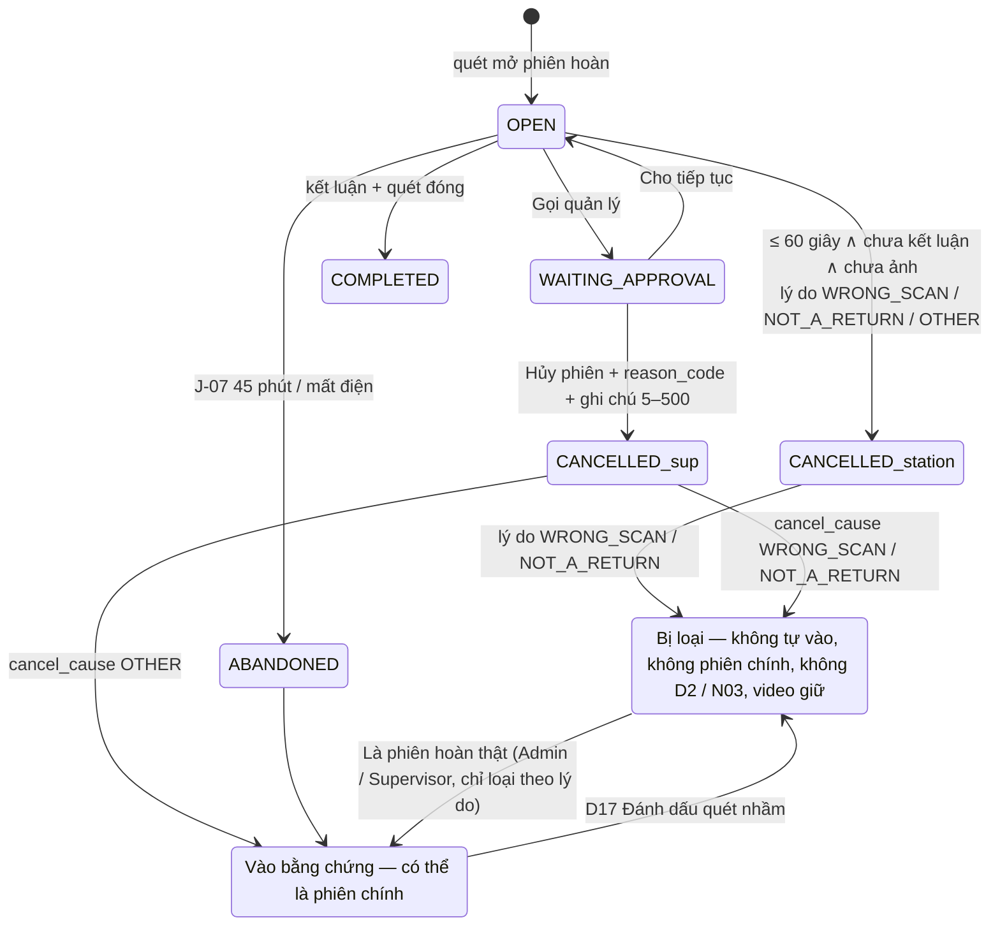

# Lát 12 — Đa shop + hardening hàng hoàn (M12) — Giải thích nghiệp vụ

| Trường | Giá trị |
|---|---|
| Item / lát | `03-expansion-tiktok` · lát 12 (milestone M12, [03-plan §4](../../ai/items/03-expansion-tiktok/03-plan.md)) |
| Yêu cầu | L11: FR-04.14, FR-08.07, FR-09.01 (BR-37, BR-39 v0.3–v0.5, EX-R17, EX-R21) · L13: FR-08.08 (BR-40) · L14: FR-08.10 (D2) · L15: FR-08.09 (D17) · đa shop: FR-05.14, 05.22 (BR-29, EX-T2) · yêu cầu hủy: FR-05.17 (BR-21 làm rõ, BR-11 làm rõ, BR-01) · FR-03.16 (người đóng gói), FR-07.01 (lọc sàn / shop) — [01-srs](../../ai/items/03-expansion-tiktok/01-srs.md) v0.5 |
| Task | BE: T-204, T-212, T-215, T-279, T-281, T-290, T-278, T-285 · FE: T-232, T-234, T-256, T-260, T-264, T-261 |
| Code | `ai-cam-be`: `1b2f5ef` (T-204), `10c9a75` (T-212), `3ce28a6` (T-215), `f466631` (T-279), `a6e02b1` (T-281), `53ab212` (T-290), `d29eed3` (T-278), `17fa419` (T-285) · `ai-cam-fe`: `3feb1af` (T-232), `b454d84` (T-234), `2dcbcc6` (T-256), `b565cf2` (T-260), `0e62dc8` (T-264), `b509315` (T-261) |
| Người đọc | Dev mới vào dự án, reviewer, QA, CSKH / quản lý kho (đọc §0) |
| Tác giả | khanhtt (agent soạn) |
| Reviewer | PO (đúng nghiệp vụ) · Tech lead (đúng code) |
| Trạng thái | Draft |
| Last update | 2026-10-07 · Dev |

## TL;DR

- **Hủy phiên mở hoàn chỉ trong 60 giây đầu** (và khi chưa kết luận / chưa chụp ảnh); sau đó chỉ "Gọi quản lý", quản lý hủy phải **chọn lý do** + ghi chú.
- **Phiên quét nhầm không bao giờ là phiên chính**: hủy vì "Quét nhầm" / "Không phải hàng hoàn", hoặc bị đánh dấu "Quét nhầm" trên D17 → không tự vào hồ sơ, thêm tay vẫn không làm phiên chính, không tính D2 / N03; video vẫn giữ. Phiên quản lý hủy trước Phase 3 → "Cần soát". Chọn nhầm lý do → Admin / Supervisor "Là phiên hoàn thật".
- **"Đang yêu cầu hủy" không hủy kiện**: chỉ chặn mở phiên mới + cảnh báo vàng khi đang đóng; chỉ khi sàn chuyển "Đã hủy" mới hủy kiện. Kiện Phase 2 bị hủy oan → trả lại bằng lệnh `fix-cancel-requests` hoặc lưới an toàn khi đồng bộ.
- "Chỉ hoàn tiền" có cột hạn phản hồi đếm ngược + D2 "Cần xử lý"; bỏ bằng chứng trên D17 có lý do + ngày giữ; đơn ghi theo shop (2 shop trùng mã đơn → 2 đơn); tùy chọn bắt buộc tên người đóng gói.

## 0. Giải thích đơn giản

Đây là phần **"vá các lỗ thủng làm mất tiền khiếu nại"**, cộng với việc cho hệ thống chạy nhiều shop cùng lúc. Phase 2 đã chạy được hàng hoàn, nhưng buổi hỏi đáp nghiệp vụ tìm ra mấy chỗ mà kho có thể thua khiếu nại dù đã quay video đầy đủ.

**Ý tưởng chính.** Lát này làm 6 việc: (1) giới hạn hủy phiên mở hoàn; (2) xử lý phiên quét nhầm cho đúng; (3) tách "người mua xin hủy" khỏi "đơn đã hủy"; (4) nhắc yêu cầu "Chỉ hoàn tiền" trước khi sàn tự hoàn tiền; (5) giao diện bỏ bằng chứng có hậu quả rõ; (6) nhiều shop, tên người đóng gói.

### Việc 1 — Chỉ được tự hủy phiên mở hoàn trong 60 giây đầu
- Phiên mở hoàn là lúc người kiểm cầm kiện hoàn, quét mã, rồi mở hộp trước camera.
- Trong 60 giây đầu, chưa lưu kết luận, chưa chụp ảnh → người đứng bàn bấm "Hủy phiên" được (thường là quét nhầm kiện bên cạnh).
- Quá 60 giây, hoặc đã kết luận, hoặc đã chụp ảnh → nút "Hủy phiên" biến mất, chỉ còn "Gọi quản lý". Quản lý hủy trên màn duyệt phải chọn lý do: "Quét nhầm kiện khác", "Không phải kiện hàng hoàn" hoặc "Lý do khác", kèm ghi chú.
- Vì sao: sau khi rạch hộp, video phiên đó là bằng chứng mạnh nhất. Để người đứng bàn tự hủy tùy ý thì video mở hộp đầu tiên dễ bị "chôn" trong một phiên bị hủy không ai nhìn lại. 60 giây đủ để nhận ra quét nhầm **trước khi** mở hộp. Không cấm hủy hẳn vì quét nhầm là chuyện thường, cấm thì bàn hoàn kẹt.
- Giờ tính theo **đồng hồ máy chủ**, không theo máy trạm (máy trạm lệch 5 phút vẫn đúng). Nút đổi đúng giây thứ 61, không cần tải lại.
- Bấm "Hủy" đúng lúc vừa hết giờ → máy chủ từ chối, màn báo "Phiên đã quá 60 giây. Bấm Gọi quản lý để hủy."

### Việc 2 — Phiên quét nhầm không bao giờ là phiên chính
- Lát 11 đưa mọi phiên mở hoàn bị hủy / bỏ dở có video vào hồ sơ khiếu nại, phiên sớm nhất là "phiên chính". Nhưng phiên hủy vì **quét nhầm** là video của kiện khác, hoặc chưa mở hộp. Nếu nó thành phiên chính, kho gửi sàn video sai kiện → thua khiếu nại.
- Vì vậy phiên hủy với lý do "Quét nhầm" / "Không phải hàng hoàn" (do station tự hủy hoặc quản lý chọn):
  - không tự vào hồ sơ; D17 hiện Alert "1 phiên mở hoàn bị hủy vì quét nhầm (06/10 09:00) — không đưa vào bằng chứng. Thêm tay nếu cần.";
  - CSKH vẫn thêm tay được (để tham khảo), nhưng **thêm tay vẫn không làm phiên chính**;
  - không tính vào thẻ D2 "Phiên hoàn hủy / bỏ dở (7 ngày)", không gửi thông báo N03;
  - video **vẫn được giữ** như mọi phiên mở hoàn (lỡ chọn sai lý do thì còn video để sửa).
- Phiên bỏ dở vì quét nhầm (không có lý do) → CSKH xem video, bấm "Đánh dấu quét nhầm" trên D17 (lý do + ghi chú). Phiên rời bằng chứng **mọi** hồ sơ chưa đóng. "Bỏ đánh dấu" được, nhưng phiên không tự vào lại — phải thêm tay.
- Phiên do quản lý hủy **trước** Phase 3 (Phase 2 không có lý do) → vào bằng chứng với nhãn "Cần soát", không làm phiên chính tới khi ai đó xác nhận "Là phiên hoàn thật" (hoặc đánh dấu quét nhầm).
- Chọn nhầm lý do (thật ra là kiện hoàn thật) → **chỉ Admin / Supervisor** bấm "Là phiên hoàn thật" (ghi chú 5–500). Vì sao không cho CSKH: lý do do quản lý ra thì người gỡ phải ngang cấp.
- Đánh dấu quét nhầm luôn thắng: phiên đã đánh dấu phải "Bỏ đánh dấu" trước rồi mới xác nhận được.

### Việc 3 — "Người mua xin hủy" không phải "đơn đã hủy"
- Phase 2 coi "Đang yêu cầu hủy" của Shopee như đã hủy → kiện đã đóng gói thành "Hủy sau đóng gói". Nhưng người bán có thể **từ chối** yêu cầu hủy. Khi đó kiện thật vẫn nằm trên kệ, mà hệ thống ghi "đã hủy" → không ai bàn giao.
- Nay:
  - quét đơn đang yêu cầu hủy → chặn mở phiên "ĐƠN ĐANG YÊU CẦU HỦY" (không đóng gói thêm);
  - đang đóng gói thì người mua xin hủy → banner vàng "Người mua đang xin hủy đơn này. Đóng gói xong để riêng, chưa bàn giao.", kiện **không** đổi trạng thái;
  - sàn từ chối / người mua rút → đóng gói, bàn giao bình thường;
  - sàn chấp nhận → "Đã hủy" → lúc đó mới hủy kiện (đã đóng → "Hủy sau đóng gói" + cảnh báo đối soát).
- Kiện bị Phase 2 hủy oan → sau nâng cấp, ops chạy lệnh trả lại (chạy thử trước, rồi áp dụng). Quên chạy lệnh thì lần đồng bộ thấy đơn rời "Đang yêu cầu hủy" cũng tự trả lại. Ngoại lệ: kiện mà quản lý đã xử lý cảnh báo "Hủy sau đóng gói" (có thể đã dỡ hàng) → không tự trả, để kiểm tay.

### Việc 4 — "Chỉ hoàn tiền" có hạn và được nhắc
- "Chỉ hoàn tiền" = người mua đòi tiền mà không gửi hàng về. Không phản đối kịp thì sàn tự hoàn tiền.
- D14 có tab "Chỉ hoàn tiền" với cột "Hạn phản hồi" đếm ngược, đỏ khi còn ≤ 48 giờ, sắp hạn gần nhất lên đầu. Sàn không cho hạn → lấy lúc sàn báo + 48 giờ (Admin chỉnh được 1–168 giờ ở D8).
- D2 "Cần xử lý" hiện số yêu cầu chưa xử lý + hạn gần nhất. Tạo hồ sơ khiếu nại cho đơn đó → dòng rời D2.

### Việc 5 — Bỏ bằng chứng trên D17 có hậu quả rõ
- Hộp thoại bỏ bằng chứng bắt lý do 5–500 ký tự và nêu ngày video bị xóa ("Clip này được giữ tới 04/01/2027 rồi tự xóa (trừ khi thuộc hồ sơ khác)."). Danh sách "Bằng chứng đã bỏ" có nút "Thêm lại".
- D2 đếm "hồ sơ quá hạn chưa gửi"; chip "Hạn sàn đã qua" ở hồ sơ có hạn mặc định (luật ở lát 11).

### Việc 6 — Nhiều shop và tên người đóng gói
- Hai shop cùng có đơn "2410ABCDEF" → hai đơn khác nhau. Mã vận đơn đã thuộc đơn của shop A mà shop B gửi về cùng mã → không ghi đè, ghi lỗi đồng bộ của shop B "Mã vận đơn … đã thuộc đơn của shop Áo Đẹp (Shopee)".
- Đơn nhập từ file (không có shop) → shop đầu tiên đồng bộ thấy cùng mã đơn "nhận" đơn đó.
- Admin bật "Bắt buộc tên người đóng gói" ở D8 → bàn đóng gói quét khi chưa có tên sẽ bị chặn "Nhập tên người đóng gói trước khi đóng gói." và hộp nhập tên mở ngay. Tên ghi vào phiên, dùng cho báo cáo năng suất (lát 14).

**Ví dụ một vòng đầy đủ.** 09:00:00 chị Lan quét kiện SPX…41 ở bàn hoàn. 09:00:25 chị nhận ra cầm nhầm kiện, bấm "Hủy phiên", chọn "Quét nhầm". 09:01 chị quét đúng kiện, rạch hộp, hộp rỗng, kết luận "Hộp rỗng". Hệ thống tự tạo hồ sơ KN: phiên đóng gói + phiên 09:01 (phiên chính). D17 hiện Alert "1 phiên mở hoàn bị hủy vì quét nhầm (06/10 09:00) — không đưa vào bằng chứng." Chị Hoa (CSKH) thêm tay phiên 09:00 cho đủ — phiên chính vẫn là 09:01. Thẻ D2 "Phiên hoàn hủy / bỏ dở" không tăng. Cùng sáng, bàn đóng gói đang đóng đơn Shopee 2410XYZ thì người mua xin hủy: banner vàng hiện, chị Mai đóng xong để riêng. 10:00 người bán từ chối hủy → kiện được bàn giao chiều đó như thường.

**Lưu ý.**
- Các màn FE của lát này chạy trên dữ liệu giả (MSW); E2E với máy chủ thật đã viết nhưng **chưa chạy** (chờ dựng lại stack).
- Shopee thật nhiều shop **chưa test** (thiếu tài nguyên — T-3).

## 1. Vì sao cần

06-business-qa Phase 2: L11 (video mở hộp đầu nằm ở phiên hủy / bỏ dở), L13 ("Chỉ hoàn tiền" không ai nhắc), L14 (hồ sơ quá hạn vô hình), L15 (bỏ bằng chứng → xóa đêm đó) là Major. Review G2 ba lượt chỉ ra thêm: phiên quét nhầm có thể thành phiên chính (G2R1, DEC-491), Supervisor hủy không lý do mở lại lỗ đó (G2R2-1 CRITICAL, DEC-514), lý do chọn nhầm không có đường sửa (DEC-529). DEC-494: Phase 2 hủy kiện khi người mua mới xin hủy → kiện thật bị bỏ sót bàn giao. FR-05.14: kết nối shop thứ hai đang ngắt shop thứ nhất.

| Lát này làm (Goals) | Lát này không làm (Non-goals — ở đâu) |
|---|---|
| BR-37 FE: R2 đổi nút đúng giây 61 theo giờ server, 409 → Toast (T-234); D13 `CancelReturnDialog` chọn lý do (T-264) | — |
| BR-39 v0.3–v0.5: `excluded` / `review_needed` một vị từ SQL + Python; API-21 `reason_code`; API-189 MARK / UNMARK / CONFIRM_RETURN; D17 chip, Alert, dialog (T-279, 281, 290, 260, 264) | `affected_shares` khi đánh dấu (T-292, `AffectedSharesDialog` T-266 — lát 16) |
| BR-21 làm rõ: helper `set_platform_status`, `apply_status_effects`, cờ `ORDER_CANCEL_REQUESTED`; BR-11 chỉ nhóm `CANCELLED`; `fix-cancel-requests` + lưới an toàn (T-278, 285) | Yêu cầu hủy của TikTok (T-209, 277 — lát 13); banner S2 (T-233 — lát 13) |
| BR-40 / D2 / D14 tab Chỉ hoàn tiền / lọc sàn – shop API-30 / 110 / 120 / 130 (T-215, 261) | Thông báo N03 / N04 / N05 (lát 17) |
| Đa shop lõi: `upsert_platform_order(…, shop)`, EX-T2, kiện gộp cùng shop, J-04 / 05 / 06 theo shop (T-204) | Fan-out một task / shop, tra song song, TikTok (lát 13) |
| Station: API-10 sàn / shop / `merged_orders`, `OPERATOR_REQUIRED` PACK, API-80 `packer_name_required` (T-212, 232) | Báo cáo năng suất theo người (lát 14) |
| `ShareLinkDialog` chạy MSW (T-256) | Link thật (lát 16) |

## 2. Ai dùng, ở đâu, khi nào

| Vai | Màn hình / điểm vào | Lúc nào dùng |
|---|---|---|
| Station bàn hoàn | R2 (nút Hủy phiên / Gọi quản lý) | Quét nhầm, muốn dừng phiên |
| Supervisor / Admin | D13 "Hủy phiên" (chọn lý do) | Station gọi quản lý để hủy phiên đã mở hộp |
| CSKH / Supervisor / Admin | D17: Đánh dấu / Bỏ đánh dấu quét nhầm, xác nhận "Cần soát", bỏ / thêm lại bằng chứng | Làm hồ sơ khiếu nại |
| Admin / Supervisor | D17 "Là phiên hoàn thật" (gỡ lý do hủy) | Xem video thấy chọn nhầm lý do |
| CSKH | D14 tab "Chỉ hoàn tiền", D2 "Cần xử lý" | Hằng ngày |
| Station bàn đóng gói | S1 (dòng người đóng gói), R5 nhập tên, S2 banner vàng | Đầu ca; khi người mua xin hủy |
| Admin | D8 "Bắt buộc tên người đóng gói", "Hạn mặc định Chỉ hoàn tiền (giờ)" | Cấu hình |
| Ops | `dc run --rm migrate aicam fix-cancel-requests [--apply]` | Ngay sau nâng cấp (ops §7.2 bước 1b) |

## 3. Tình huống thực tế

| # | Tình huống | Hệ thống làm gì | Vì sao |
|---|---|---|---|
| 1 | Mở 09:00:00, hủy 09:00:45 | API-12 200, phiên `CANCELLED` lý do station | Trong 60 giây (BR-37) |
| 2 | Hủy 09:01:10 / sau khi lưu kết luận / sau khi chụp 1 ảnh | 409 `CANCEL_REQUIRES_SUPERVISOR`, `details.reason` = `TIME_EXCEEDED` / `INSPECTION_SAVED` / `SNAPSHOT_TAKEN` | Video đã có giá trị bằng chứng |
| 3 | Supervisor hủy trên D13 không chọn lý do / ghi chú 4 ký tự | 422 cả hai `fields` một lần | DEC-514, DEC-555 |
| 4 | Supervisor chọn "Quét nhầm kiện khác" | `cancel_reason = SUPERVISOR` (ai hủy), `cancel_cause = WRONG_SCAN` (vì sao) → bị loại như station tự hủy | DEC-521 |
| 5 | Supervisor chọn "Lý do khác" | Phiên vào bằng chứng, có thể là phiên chính | Kiện hoàn thật bị dừng giữa chừng (EX-R17) |
| 6 | CSKH đánh dấu quét nhầm phiên A đang là phiên chính của KN-1, KN-2 (mở) và có trong KN-3 (đóng) | Bỏ mềm A ở KN-1, KN-2 (ghi chú + audit mỗi dòng), KN-3 không đổi; phiên chính chuyển sang phiên sau | Hồ sơ đã đóng là lịch sử, không sửa |
| 7 | Bỏ đánh dấu | Không tự thêm lại; thêm tay → có thể là phiên chính | Người dùng quyết |
| 8 | CSKH bấm "Là phiên hoàn thật" cho phiên station hủy "Quét nhầm" | 403 "Chỉ Admin / Supervisor gỡ lý do hủy của phiên." | DEC-529 |
| 9 | Admin gỡ lý do | Phiên vào bằng chứng **hồ sơ đang xem** (thêm mới hoặc thêm lại dòng đã bỏ), ghi chú hệ thống, audit `overridden_cause` | Hồ sơ khác không tự đổi |
| 10 | Đơn `IN_CANCEL`, kiện đang `PACKING` | Cờ phiên `ORDER_CANCEL_REQUESTED` (task riêng), kiện không đổi; đóng xong → `PACKED` | BR-21 làm rõ |
| 11 | Đơn rời `IN_CANCEL` sang `READY_TO_SHIP`, kiện còn `CANCELLED` do Phase 2 | Lưới an toàn: `CANCELLED → NEW`, audit `PACKAGE_CANCEL_REVERT` `trigger = SYNC` | DEC-519 |
| 12 | Kiện `CANCELLED_AFTER_PACK` đã có cảnh báo BR-11 `RESOLVED` bởi người | `fix-cancel-requests` in "BỎ QUA … — lý do" | Có thể đã dỡ hàng |
| 13 | Chỉ hoàn tiền, sàn không trả hạn, báo 06/10 09:00 | Hạn 08/10 09:00, ⓘ "mặc định 48 giờ" | BR-40, DEC-451 |
| 14 | 2 shop cùng mã đơn | 2 dòng `order`; J-04 shop B hủy đơn không đụng kiện shop A | BR-29 |
| 15 | Bật bắt buộc tên, station PACK quét khi chưa có tên | ALERT `OPERATOR_REQUIRED` `data.mode = PACK`, **không gọi sàn**; bàn hoàn không áp setting này | DEC-552 |

## 4. Luồng ví dụ từ đầu đến cuối

Chuyện ví dụ (AC-56, TC-08.50): kiện SPXTST0000041.
1. 08:51 phiên A bỏ dở (mất điện, có clip). 10:15 phiên B "Hộp rỗng" → KN-1 tự tạo: đóng gói + A (chính) + B.
2. Chị Hoa xem video A: đó là kiện của bàn bên (quét nhầm). D17 dòng A → ⋮ "Đánh dấu quét nhầm" → chọn "Quét nhầm kiện khác", ghi chú "Kiện của đơn 2410ABC" → API-189 `MARK_WRONG_SCAN` (`version` của hồ sơ).
3. Server khóa KN-1 và mọi hồ sơ chưa đóng đang dùng A (theo id tăng) → khóa phiên → bỏ mềm dòng A + ảnh của A ở từng hồ sơ, mỗi dòng audit `CLAIM_EVIDENCE_REMOVE` (có `keep_until`), mỗi hồ sơ ghi chú "Đánh dấu phiên mở hoàn quét nhầm — bỏ n bằng chứng.", `version + 1`, WS `claim.updated`.
4. API-132 trả `primary` = B; `excluded_return_sessions[]` có A (`evidence_exclusion = MARKED`).
5. J-02 đêm đó: clip A vẫn còn (được bảo vệ như phiên mở hoàn + hạn BR-38).

## 5. Quy tắc nghiệp vụ và lý do

| Quy tắc | Con số / điều kiện | Vì sao | ID |
|---|---|---|---|
| Station tự hủy phiên hoàn | `now ≤ started_at + 60 giây` (giờ server, dưới khóa station) ∧ chưa `inspection_saved_at` ∧ không có ảnh `MANUAL` (kể cả đã xóa) | Video sau khi mở hộp là bằng chứng | BR-37, FR-04.14 |
| Supervisor hủy phiên hoàn | `reason_code` ∈ {`WRONG_SCAN`, `NOT_A_RETURN`, `OTHER`} + ghi chú 5–500 | Người quyết hủy biết lý do nhất | DEC-514 |
| Phiên bị loại | RETURN ∧ ((`COALESCE(cancel_cause, cancel_reason)` ∈ {WRONG_SCAN, NOT_A_RETURN} ∧ chưa xác nhận) ∨ `wrong_scan_at` có) | Video kiện khác không chứng minh gì | BR-39 (a)(b), DEC-491 |
| Không bao giờ phiên chính | Bị loại hoặc "Cần soát" — kể cả thêm tay; luật nằm **trong** `primary_session` (người gọi không quên được) | Phiên chính sai = gửi sàn video sai | BR-39, DEC-554 |
| "Cần soát" | RETURN `CANCELLED`, `cancel_reason = SUPERVISOR`, `cancel_cause` null, chưa xác nhận / đánh dấu | Phase 2 không có lý do — không biết thật / nhầm | DEC-516 |
| Gỡ lý do hủy | Chỉ ADMIN / SUPERVISOR; phiên đã đánh dấu → 409 (bỏ đánh dấu trước) | Ngang cấp người ra lý do; đánh dấu thắng | BR-39 v0.5, DEC-529, 556 |
| Đánh dấu quét nhầm | Chỉ phiên `CANCELLED` / `ABANDONED`; bỏ mềm ở mọi hồ sơ chưa đóng; không tự thu hồi link | Hồ sơ đóng là lịch sử | EX-R21, DEC-515, 555 |
| D2 / N03 / D3 | `dropped_return_filter` = RETURN `CANCELLED` / `ABANDONED` ∧ không bị loại; cửa sổ 7 ngày theo `ended_at`, không tự hết khi có phiên sau | Một vị từ cho mọi nơi đếm | FR-09.01, DEC-553 |
| Yêu cầu hủy | Nhóm `CANCEL_REQUESTED`: chặn mở phiên (BR-01); `PACKING` → cờ vàng; kiện không đổi | Sàn có thể từ chối | BR-21 làm rõ, DEC-494 |
| Đã hủy | Nhóm `CANCELLED`: `NEW → CANCELLED`, `PACKED → CANCELLED_AFTER_PACK`, `PACKING` → cờ đỏ | Như Phase 1 | BR-21, EX-P10 |
| BR-11 | Chỉ nhóm `CANCELLED`; `PACKED` của đơn đang yêu cầu hủy không bắn BR-10 / BR-11 | Đang để riêng chờ sàn quyết | BR-11 làm rõ |
| Trả lại kiện hủy oan | Kiện hủy, đơn ∉ {CANCELLED, UNKNOWN}, lần vào hủy không do `MANUAL`, chưa có BR-11 `RESOLVED` bởi người → `CANCELLED → NEW`, `CANCELLED_AFTER_PACK → PACKED` | Kiện thật vẫn trên kệ | BR-21 v0.4, DEC-519, 558 |
| Chỉ hoàn tiền chưa xử lý | `REFUND_ONLY` ∧ chưa hủy ∧ nhóm ∈ {REQUESTED, ACCEPTED} ∧ đơn chưa có KN chưa đóng; hạn = `seller_due_at` hoặc `reported_at` + `refund_only_default_hours` (48, 1–168) | Loại ca dễ mất tiền nhất | BR-40, FR-08.08 |
| Đơn theo shop | Biết shop → tra (shop, mã); mã vận đơn của shop khác → cảnh báo đồng bộ ≤ 20 / shop, cùng (mã, mã vận đơn) chỉ giữ bản mới | Không ghi đè dữ liệu shop khác | BR-29, EX-T2, DEC-551 |
| Người đóng gói | `packer_name_required` ∧ `work_mode = PACK`; kiểm trước tra sàn và lại dưới khóa | Báo cáo theo người cần tên | FR-03.16, DEC-552 |

## 6. Điểm dễ hiểu nhầm

- **Biên 60,0 giây.** Server cho hủy đúng ở 60,0 giây (`≤`); FE ẩn nút từ 60,0 (`<`). QA kiểm server theo SRS; FE ẩn sớm một nhịp là phía an toàn (DEC-538).
- **"Đã chụp ảnh" tính ảnh đã xóa.** Có dòng ảnh `MANUAL` là đủ, kể cả ảnh bị xóa sau đó (DEC-542 (1)).
- **`cancel_reason` vs `cancel_cause`.** `cancel_reason` = **ai** hủy / lý do station (`WRONG_SCAN`, `NOT_A_RETURN`, `OTHER`, `SUPERVISOR`); `cancel_cause` = lý do Supervisor chọn. Lý do hiệu lực = `COALESCE(cancel_cause, cancel_reason)`.
- **Bỏ đánh dấu có trả phiên về hồ sơ?** Không. Chỉ xóa cờ; muốn dùng thì thêm tay (TC-08.51).
- **"Là phiên hoàn thật" có thêm phiên vào mọi hồ sơ?** Không — chỉ hồ sơ đang xem (`{id}` trong URL API-189).
- **Kiện "Đang yêu cầu hủy" có hiện ở đối soát?** Kiện `PACKED` của đơn đang yêu cầu hủy không bắn BR-10 / BR-11 (đang để riêng). Khi sàn chấp nhận → `CANCELLED_AFTER_PACK` + BR-11.
- **`fix-cancel-requests` chạy hai lần có sao không?** Không; idempotent (lần 2 "0 kiện"). Phải chạy qua service `migrate` (`dc run --rm migrate aicam …`) — `dc run api` kéo theo các service phụ thuộc (DEC-783 (3)).
- **Phiên chính trên FE có tự tính không?** Không. FE chỉ hiện chip theo cờ `primary` của server (DEC-511) — để D17, zip và link luôn khớp.

## 7. Bản đồ nghiệp vụ → code

Đường dẫn BE tính từ `ai-cam-be/src/aicam/`, test BE từ `ai-cam-be/tests/`. FE từ `ai-cam-fe/`.

| Khái niệm nghiệp vụ | Code | Test chứng minh |
|---|---|---|
| BR-37 hủy 60 giây | BE `modules/sessions/return_state.py::self_cancel_until` :98; `modules/sessions/service.py::cancel` :821, `_check_self_cancel` :857 · FE `src/features/station/returns/cancelRule.ts` (`canSelfCancel` :11, `useSelfCancel` :26), `InspectingPanel.tsx` :120 | `integration/test_cancel_rule_br37.py` (`test_self_cancel_within_60_seconds`, `test_cancel_after_60_seconds_requires_supervisor`, `test_cancel_after_snapshot_requires_supervisor`, `test_cancel_after_inspection_saved_requires_supervisor`, `test_supervisor_cancel_return_needs_note_and_summary`); FE `src/features/station/returns/CancelRule.test.tsx`, `e2e/mock/phase3-m12.spec.ts` ("R2 (T-234) …") |
| D13 lý do hủy | BE `modules/approvals/service.py::_decide_on_session` :290 (kiểm `reason_code` :309, ghi `cancel_cause` :336); `modules/sessions/models.py` `CANCEL_CAUSES` :47 · FE `src/features/approvals/CancelReturnDialog.tsx` :18 | `test_return_session_review.py::test_supervisor_cancel_with_reason_code_excluded_g2r2_1`; `e2e/mock/phase3-m12.spec.ts` ("D13 (T-264) …") |
| Vị từ bị loại / Cần soát / đếm | `modules/sessions/queries.py`: `EXCLUDED_CANCEL_REASONS` :19, `excluded_return_sql` :23, `review_needed_sql` :38, `dropped_return_filter` :49, bản Python `excluded` :67, `review_needed` :76 | `integration/test_return_session_review.py::test_sql_and_python_predicates_agree` |
| Không bao giờ phiên chính | `modules/claims/evidence_rules.py`: `never_primary` :55, `is_prior_return` :106, `excluded_return_sessions` :151, `review_sessions` :167, `primary_session` :182; `modules/claims/service.py::auto_evidence` :263 (lưới an toàn) | `integration/test_evidence_prior_br39.py` (`test_wrong_scan_session_excluded_never_primary`, `test_manually_added_wrong_scan_session_never_primary`, `test_only_excluded_return_session_falls_back_to_pack`, `test_supervisor_cancel_other_is_regular_evidence`, `test_excluded_session_clip_still_protected_and_not_counted`); `unit/test_primary_session.py::test_excluded_and_review_sessions_never_primary_even_if_earliest` |
| API-189 đánh dấu / bỏ / xác nhận | `modules/claims/router.py` :124; `modules/claims/review.py`: `review_return_session` :90, `_mark` :162, `_unmark` :232, `confirm_return` :253 · FE `src/features/claims/ReviewSessionDialog.tsx` :24, `useReviewSession.ts`, `PriorReturnAlert.tsx` :16, `evidenceChips.ts::sessionChips` :21 | `integration/test_return_session_review.py` (`test_mark_wrong_scan_soft_removes_from_open_claims_only`, `test_unmark_does_not_re_add_then_manual_add_can_be_primary`, `test_review_needed_never_primary_until_confirmed`, `test_review_errors`, `test_confirm_return_overrides_cancel_reason_admin_only`, `test_confirm_return_restores_soft_removed_row`); FE `src/features/claims/ReviewSession.test.tsx`, `ClaimEvidencePhase3.test.tsx` |
| D17 bỏ bằng chứng | FE `src/features/claims/RemoveEvidenceDialog.tsx` :16, `RemovedEvidenceList.tsx` :14 (BE ở lát 11) | `ClaimEvidencePhase3.test.tsx`; `e2e/real/phase3-m12-admin.spec.ts` ("FR-08.09 / L15 (BE thật) …" — **chưa chạy**) |
| BR-21 yêu cầu hủy | `modules/orders/service.py`: `set_platform_status` :186, `apply_status_effects` :195, `apply_platform_cancel` :249, `is_cancelled` :638; `modules/returns/service.py::set_platform_status` :329; `modules/platforms/base.py::PlatformOrder.is_cancelled` :55; task `workers/tasks.py::flag_order_cancelled` :84 → `modules/sessions/service.py::flag_order_cancelled` :1133 | `integration/test_cancel_requested_br21.py` (5 test); `unit/test_no_platform_status_in_core.py::test_platform_status_written_only_by_helpers`, `test_ast_check_catches_a_write` |
| BR-11 chỉ "Đã hủy" | `modules/reconciliation/rules.py::cancelled_after_pack` :92, `packed_not_handed_over` :198 | `integration/test_cancel_revert.py::test_br11_only_cancelled_group_and_packed_cancel_requested_quiet` |
| Trả lại kiện hủy oan | `modules/orders/cancel_revert.py`: `skip_reason` :74, `revert_candidates` :89, `revert_cancel` :120, `revert_for_order` :145, `fix_cancel_requests` :194; CLI `entrypoints/cli.py` :198 | `integration/test_cancel_revert.py` (`test_fix_command_dry_run_then_apply_idempotent`, `test_sync_safety_net_reverts_when_request_rejected`, `test_sync_does_not_revert_when_request_accepted`, `test_reverse_transitions_only_through_revert_cancel`); diễn tập `evidence/m18-upgrade-rollback.txt` bước 4 |
| BR-40 Chỉ hoàn tiền | `modules/returns/queries.py`: `refund_pending_filter` :30, `response_due_sql` :42 · FE `src/features/returns/ReturnsPage.tsx` :176–179, `src/shared/time/DueCountdown.tsx` :23 | `integration/test_phase3_filters.py` (`test_refund_pending_due_sort_claim_and_shop`, `test_refund_default_hours_setting_applies_immediately`) |
| D2 thẻ / Cần xử lý / lọc vai | `modules/reports/service.py`: `_counts` :112 (`returns_dropped_7d` :188), `_return_attention` :304, `ADMIN_ONLY_KINDS` :363, `for_role` :366 · FE `src/features/reports/AttentionList.tsx` :24–26 | `test_phase3_filters.py::test_daily_counts_attention_and_role_filter`, `test_packages_platform_shop_session_status_and_return_dropped`, `test_recon_and_claims_filter_by_platform_shop`; FE `src/features/reports/Phase3Daily.test.tsx` |
| Đa shop lõi | `modules/orders/service.py`: `add_sync_warning` :325, `upsert_platform_order` :391 | `integration/test_order_unique_shop.py` (11 test: `test_two_shops_same_order_sn_two_orders`, `test_file_order_claimed_by_first_shop_then_other_shop_creates`, `test_tracking_owned_by_other_shop_is_skipped_with_warning`, `test_merged_package_same_shop`, `test_two_shops_write_same_sn_concurrently`, …) |
| Người đóng gói, API-10 shop | `modules/sessions/service.py::operator_required` :181; `modules/settings/service.py` (`PHASE3_FIELDS` :32) · FE `src/features/station/AlertOverlay.tsx` :34, :83; `src/features/station/returns/OperatorDialog.tsx` :16 | `integration/test_station_phase3.py` (`test_operator_required_blocks_pack_scan_before_lookup`, `test_operator_not_required_when_setting_off_or_return_mode`, `test_settings_packer_name_required_put_get_and_ws`, `test_state_order_platform_shop_and_merged_items`); FE `src/features/station/PackerName.test.tsx` |

## 8. Giới hạn hiện tại và giả định

| Giới hạn / giả định | Ảnh hưởng | Khi nào xử lý |
|---|---|---|
| E2E BE thật `e2e/real/phase3-m12-admin.spec.ts` (D2, D14, D13, D17) **viết xong, chưa chạy** — chờ dựng lại stack (DEC-804) | FE M12 mới kiểm trên MSW + unit / component | T-229 QA live / bước 11 |
| QA live `tests/qa/test_m11..m18_live.py` (T-229) **chưa làm** | Chưa có bằng chứng end-to-end trên stack dev cho lát này | T-229 |
| **Chưa test — thiếu tài nguyên**: Shopee thật nhiều shop (R4, TC-X3.04) | Mock nhiều shop `MOCK_SHOPEE_SHOP_IDS` thay | T-3 Shopee |
| Rủi ro còn lại đã ghi nhận (DEC-555 (3)): hồ sơ **mới** tạo đúng giữa lúc đọc và commit của MARK có thể vẫn tự thêm phiên | Người dùng thấy phiên trong `excluded_return_sessions` `in_evidence = true`, bỏ tay | Chấp nhận |
| Q13 (hạn khiếu nại / Chỉ hoàn tiền thật) mở; 48 giờ là đề xuất | BR-40 có thể sai hạn | Chủ shop — chặn go-live |
| Chữ mới FE chưa có trong 01 §10.5 (DEC-600..606) | PO cần soát chữ | Review G3 |

## Liên kết

- SRS: [01-srs.md](../../ai/items/03-expansion-tiktok/01-srs.md) v0.5: §4.6, §7.2, §7.6 BR-01, 11, 21, 29, 37, 39, 40; EX-R17, R21; UC-22, UC-23; AC-41, 56..59, 62
- Spec: [02 §6.2](../../ai/items/03-expansion-tiktok/02-tech-spec.md) API-10, 11, 12, 21, 30, 32, 80, 110, 132, 134, 189 · [02a §5](../../ai/items/03-expansion-tiktok/02a-be-spec.md), DEC-551..558 · [02b-station](../../ai/items/03-expansion-tiktok/02b-fe-spec-station.md) DEC-600, 601 · [02b-admin](../../ai/items/03-expansion-tiktok/02b-fe-spec-admin.md) DEC-602..606
- Test cases: `04` TC-04.60..73, TC-08.42..77, TC-03.8x, TC-MG3.04, 05
- Lát trước: [lat-11-nen-schema-bang-chung.md](lat-11-nen-schema-bang-chung.md) · Lát sau: [lat-13-tiktok-nhieu-shop.md](lat-13-tiktok-nhieu-shop.md)
