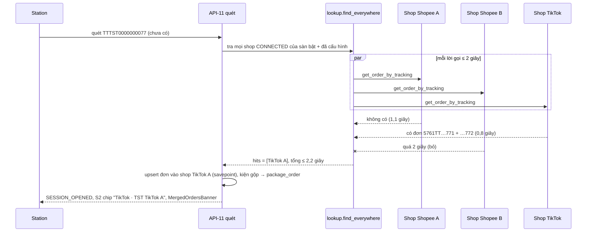

# Lát 13 — TikTok Shop + nhiều shop, mã trùng (M13) — Giải thích nghiệp vụ

| Trường | Giá trị |
|---|---|
| Item / lát | `03-expansion-tiktok` · lát 13 (milestone M13, [03-plan §4](../../ai/items/03-expansion-tiktok/03-plan.md)) |
| Yêu cầu | FR-05.07, 05.08, 05.13..05.20, 05.22, FR-03.03; BR-29, BR-30, BR-31, BR-32; EX-T1..T7, EX-P14, EX-R20; NFR-01, NFR-38, NFR-39 — [01-srs](../../ai/items/03-expansion-tiktok/01-srs.md) v0.5 |
| Task | BE: T-205, T-206, T-207, T-208, T-209, T-210, T-211, T-277, T-271, T-288 · FE: T-253, T-233, T-236, T-235 |
| Code | `ai-cam-be`: `3e46576` (T-205), `780d912` (T-206), `22976fe` (T-207), `5ba3737` (T-208), `52af26d` (T-209), `d03c5ce` (T-210), `462c337` (T-211), `1a31e1b` (T-277), `54091b5` (T-271), `8d90233` (T-288) · `ai-cam-fe`: `6ef1e51` (T-253), `71bc453` (T-233), `3d64b91` (T-236), `a91da13` (T-235) |
| Người đọc | Dev mới vào dự án, reviewer, QA, Admin |
| Tác giả | khanhtt (agent soạn) |
| Reviewer | PO (đúng nghiệp vụ) · Tech lead (đúng code) |
| Trạng thái | Draft |
| Last update | 2026-10-07 · Dev |

## TL;DR

- TikTok Shop là **adapter thứ hai** cùng giao diện với Shopee; lõi chỉ đọc nhóm trạng thái chung. Một lần ủy quyền TikTok thêm được **mọi shop** tài khoản cho phép; kết nối shop mới **không** ngắt shop cũ; ngắt từng shop, dữ liệu cũ giữ nguyên.
- Đồng bộ chạy **một task / shop**: shop lỗi / chậm không làm shop khác trễ quá một chu kỳ (NFR-39).
- Quét mã chưa có → **tra song song mọi shop**, tổng ≤ 2 giây; đúng một shop thấy → gắn shop đó; ≥ 2 shop → kiện "chưa xác minh" + cờ "Mã có ở nhiều shop".
- **Mã trùng giữa shop**: bàn hoàn quét mã đơn / mã yêu cầu trả / mã chiều về mà khớp ≥ 2 đơn → **không tự chọn**, mở "Tìm kiện hoàn" có chip sàn · shop cho người kiểm chọn.
- Mọi phần TikTok thật **chưa test — thiếu tài khoản đối tác** (Q18, Q19): chạy trên adapter TikTok thật với server giả trả fixture theo tài liệu công khai.

## 0. Giải thích đơn giản

Đây là phần **"mở thêm cửa hàng thứ hai, thứ ba cho cùng một kho"**. Trước đây hệ thống chỉ biết một shop Shopee; đơn TikTok phải nhập bằng file hoặc thành kiện "chưa rõ đơn" khi quét. Giờ kho nối được nhiều shop Shopee và nhiều shop TikTok cùng lúc.

**Ý tưởng chính.** Admin bấm "Kết nối TikTok Shop" → đồng ý trên trang TikTok → mọi shop được ủy quyền hiện ra. Mỗi 5 phút, từng shop tự kéo đơn mới; mỗi 15 phút, kéo trạng thái vận chuyển và yêu cầu trả hàng. Bàn đóng gói thấy chip "TikTok · Áo Đẹp Official" như với Shopee.

### Bước 1 — Kết nối nhiều shop
- Một tài khoản TikTok có thể quản lý nhiều shop. Một lần ủy quyền thêm hết. Shop đã có thì cập nhật quyền, không tạo trùng.
- Kết nối shop thứ hai **không** ngắt shop thứ nhất (Phase 1 thì có ngắt).
- Ngắt một shop: dừng đồng bộ shop đó, đơn / kiện / hồ sơ cũ giữ nguyên, vẫn đóng gói / nhận hoàn được; kiện mới của shop đó thành "chưa xác minh".
- Máy chủ chưa cấu hình TikTok → D7 hiện "Chưa cấu hình TikTok Shop", nút khóa; Shopee vẫn chạy.

### Bước 2 — Mỗi shop tự chạy, lỗi không lây
- Mỗi chu kỳ, hệ thống tạo một việc riêng cho từng shop. Shop A bị TikTok chặn tạm (quá nhiều lời gọi) → chỉ shop A chờ và thử lại; shop B, C vẫn đồng bộ đúng giờ.
- Vì sao: nếu đồng bộ tuần tự, một shop treo 5 phút kéo trễ cả kho; kiện mới của shop khác thành "chưa xác minh" oan.
- Shop lỗi liên tục > 30 phút hoặc hết hạn ủy quyền → D7 + D2 báo (và thông báo N06 ở lát 17).

### Bước 3 — Quét mã lạ: hỏi mọi shop cùng lúc
- Bàn đóng gói quét một mã vận đơn chưa có trong hệ thống → hệ thống hỏi **cùng lúc** mọi shop đang kết nối, mỗi shop được tối đa 2 giây.
- Đúng một shop trả lời "có" → mở phiên gắn shop đó. Không shop nào → kiện "chưa xác minh" như trước.
- Hai shop cùng nói "có" (rất hiếm — mã vận đơn do đơn vị vận chuyển cấp) → vẫn mở phiên nhưng "chưa xác minh", ghi "Mã có ở 2 shop: …" để quản lý kiểm.
- Vì sao song song: hỏi lần lượt 4 shop × 2 giây = 8 giây, người đóng gói đứng chờ. Song song giữ được "quét ≤ 3 giây".

### Bước 4 — Đơn TikTok: những chỗ khác Shopee
- **Người mua xin hủy**: TikTok để yêu cầu hủy ở danh sách riêng. Hệ thống luôn đọc lại chi tiết đơn khi thấy yêu cầu hủy đổi, rồi áp đúng luật lát 12: đang xin hủy → chặn mở phiên, không hủy kiện; sàn chấp nhận → mới hủy.
- **Kiện gộp nhiều đơn**: một mã vận đơn chứa 2 đơn → màn đóng gói hiện sản phẩm của cả hai + cảnh báo vàng "Kiện gộp 2 đơn: …01, …02 — kiểm đủ hàng của cả hai".
- **Đơn do kho TikTok giao**: kho không đóng gói → không đưa vào danh sách.
- **Yêu cầu trả**: chỉ hoàn tiền → "Chỉ hoàn tiền"; trả hàng + hoàn tiền, đổi hàng → "Khách trả hàng" (đổi hàng ghi ở lý do). Yêu cầu còn chờ người bán duyệt → đồng hồ "hoàn quá hạn" **chưa** chạy.

### Bước 5 — Mã trùng giữa shop ở bàn hoàn
- Shop Shopee "TST B" và shop TikTok "TST TikTok A" cùng có đơn "2410DUP00001". Chị Lan quét mã đó ở bàn hoàn.
- Hệ thống không đoán. Màn vàng "MÃ CÓ Ở NHIỀU ĐƠN" + 2 tiếng bíp, 1,5 giây sau mở "Tìm kiện hoàn" với mã đã điền, mỗi dòng có chip "Shopee · TST B" / "TikTok · TST TikTok A". Chị chọn dòng đúng kiện đang cầm → mở phiên.
- Vì sao không tự chọn đơn mới nhất: chọn sai shop là mở nhầm hồ sơ hàng hoàn của người khác, video gắn sai đơn.
- Cùng luật cho mã yêu cầu trả trùng và mã chiều về trùng ở 2 hồ sơ còn mở. Mã chiều về mơ hồ thì hồ sơ "chưa xác định" cũng **không** tự gộp, chờ tới khi chỉ còn một ứng viên.

**Ví dụ một vòng đầy đủ.** Thứ Hai 08:00 anh Minh (Admin) kết nối TikTok: trang về D7 "Đã kết nối 2 shop TikTok Shop. Lần đồng bộ đầu chạy trong vài phút." 08:05 hai shop TikTok kéo đơn 3 ngày gần nhất; shop Shopee cũ vẫn chạy. 09:12 chị Mai quét `TTTST…77` ở bàn đóng gói: S2 hiện chip "TikTok · TST TikTok A (mock)", banner vàng "Kiện gộp 2 đơn". 10:30 TikTok trả lỗi quá tần suất cho shop B ba lần: shop B thử lại theo thời gian TikTok yêu cầu; shop A và Shopee đồng bộ đúng 5 phút. 14:00 chị Lan quét `2410DUP00001` ở bàn hoàn → chọn dòng TikTok → phiên mở đúng hồ sơ của shop TikTok.

**Lưu ý.**
- **Chưa có tài khoản đối tác TikTok**: mọi tên hàm, chữ trạng thái, mã lỗi, hạn người bán là **giả định theo tài liệu công khai**, ghi trong docstring để đối chiếu ở T-3 TikTok.
- Địa chỉ quay về sau ủy quyền là tên miền nội bộ của kho — TikTok có nhận không **chưa biết** (RK-26).

## 1. Vì sao cần

P7: kiện TikTok "chưa xác minh", không chặn đơn hủy, không có hàng hoàn TikTok tự động; shop nhiều gian hàng không dùng được vì kết nối shop thứ hai ngắt shop đầu (DEC-12 item 01). RK-18: bỏ giới hạn một shop làm lộ lỗi ngầm (mã trùng, khóa theo shop, tra khi quét). NFR-39: một shop lỗi không được kéo shop khác.

| Lát này làm (Goals) | Lát này không làm (Non-goals — ở đâu) |
|---|---|
| Fan-out J-04 / 06 / 13 một task / shop; J-05 theo `lookup`; J-12 theo grant; ngân sách thời gian (T-205, DEC-560) | Tách queue `sync_fast` / `sync` / worker riêng (T-276 — lát 17) |
| `find_everywhere` song song + `AMBIGUOUS_SHOP` (T-206, DEC-561) | Webhook sàn (giữ polling — ADR-007) |
| API-70..73, 154..156: kết nối / ngắt nhiều sàn, `shop.updated` (T-207, DEC-562); D7 Kết nối sàn (T-253) | Lazada (ngoài phạm vi) |
| TikTok client ký HMAC, thử lại, `Retry-After`, che log; adapter đơn / kiện / vận chuyển / hủy / trả (T-208..210, 277) | Gửi khiếu nại lên sàn qua API (DEC-208) |
| Mock TikTok 2 shop + Shopee nhiều shop, `seed_phase3` (T-211) | TikTok thật (T-3 TikTok, Q18 / Q19) |
| Bảng tra theo mã §5.1 (bàn hoàn, file nhập, J-13, API-104), `RETURN_MULTIPLE_ORDERS`, mã chiều về mơ hồ (T-271, 288, 236) | L12 trả một phần đơn nhiều kiện (backlog) |
| S2 chip, kiện gộp, banner yêu cầu hủy; S4 `ORDER_CANCEL_REQUESTED` (T-233) | — |

## 2. Ai dùng, ở đâu, khi nào

| Vai | Màn hình / điểm vào | Lúc nào dùng |
|---|---|---|
| Admin | D7 "Kết nối sàn": Kết nối TikTok Shop / Shopee, Đồng bộ ngay, Ngắt kết nối, Kết nối lại | Thêm / bớt shop, shop hết hạn |
| Job | J-04 (5 phút), J-06 / J-13 (15 phút), J-05, J-12 (30 phút) | Chạy nền |
| Station đóng gói | S2 chip sàn · shop, banner kiện gộp, banner yêu cầu hủy; S4 | Đóng gói |
| Station bàn hoàn | R4 "MÃ CÓ Ở NHIỀU ĐƠN" → R3 "Tìm kiện hoàn" chip shop | Quét mã trùng |
| IT / ops | `.env`: `TIKTOK_ENABLED`, `TIKTOK_RETURNS_ENABLED`, khóa ứng dụng | Cấu hình máy chủ |

## 3. Tình huống thực tế

| # | Tình huống | Hệ thống làm gì | Vì sao |
|---|---|---|---|
| 1 | Ủy quyền TikTok có 2 shop | Lưu token mã hóa, 2 shop `CONNECTED`, audit `SHOP_CONNECT` mỗi shop, đồng bộ đầu lùi 3 ngày | FR-05.13 |
| 2 | Ủy quyền lại cùng tài khoản mà thiếu shop cũ | Shop cũ `EXPIRED`, `last_error.code = SHOP_NOT_AUTHORIZED` | Không còn quyền đọc shop đó (DEC-562) |
| 3 | Từ chối / quá 10 phút mới quay về | D7 "TikTok Shop từ chối ủy quyền…" / "Phiên kết nối đã hết hạn…" | UC-10 ngoại lệ |
| 4 | 3 shop, 1 luôn timeout, 1 chậm | Mỗi shop một task; task chạm ngân sách → `SYNC_FAILED`, cursor không tiến; shop khác đúng chu kỳ | NFR-39, DEC-560 |
| 5 | 2 shop cùng một tài khoản TikTok, token sắp hết hạn | J-12 làm mới **một lần** cho cả grant (khóa Redis), ghi token cho mọi shop `CONNECTED` của grant | Refresh token có thể dùng một lần |
| 6 | Quét mã lạ: TikTok trả 0,8 giây có đơn, Shopee A 1,1 giây không, Shopee B quá 2 giây | Mở phiên ~2 giây gắn shop TikTok | BR-32 ví dụ 01 |
| 7 | Quét mã lạ có ở 2 shop | Phiên chưa xác minh, cờ `AMBIGUOUS_SHOP`, D4 dòng thời gian "Mã có ở 2 shop: …" | EX-P14 |
| 8 | Mã vận đơn của shop A, shop B trả cùng mã | Không ghi đè, cảnh báo đồng bộ của shop B | EX-T2 |
| 9 | Đơn TikTok `AWAITING_SHIPMENT` + yêu cầu hủy `PENDING` | Nhóm `CANCEL_REQUESTED` → quét bị chặn "ĐƠN ĐANG YÊU CẦU HỦY" | BR-01, EX-T4 |
| 10 | Yêu cầu hủy `PENDING` mà đơn đã `IN_TRANSIT` | Không thành `CANCEL_REQUESTED` (chỉ đơn chưa giao) | Hàng đã đi, không chặn được |
| 11 | Đơn `fulfillment_type` kho TikTok | J-04 bỏ qua, đếm `skipped`; quét coi như không thấy | EX-T5, AS-13 |
| 12 | Yêu cầu trả chờ người bán duyệt 3 ngày | Nhóm `REQUESTED`, đồng hồ BR-12 chưa chạy → không "Hoàn quá hạn" | BR-31 |
| 13 | Bàn hoàn quét `2410DUP00001` (2 shop) | ALERT `RETURN_MULTIPLE_ORDERS` `data.orders` ≤ 10 → R3; `force_new` với mã này → 409 | EX-R20, DEC-568 |
| 14 | Mã chiều về `RTTST-DUP-1` ở 2 hồ sơ mở đơn khác | Như #13; một hồ sơ đã nhận → mở hồ sơ còn mở | DEC-569 |
| 15 | Tắt cờ TikTok | D7 "Chưa cấu hình", job TikTok không gọi adapter, quét không tra TikTok | AC-44 |

## 4. Luồng ví dụ từ đầu đến cuối

Đo AC-43 trên mock (DEC-561): 100 lần quét mã lạ, 3 shop (1 chậm 5 giây, 1 có đơn) → p95 **2,59 giây** (yêu cầu ≤ 3 giây) — **máy dev, adapter mock**.

## 5. Quy tắc nghiệp vụ và lý do

| Quy tắc | Con số / điều kiện | Vì sao | ID |
|---|---|---|---|
| Nhiều shop, nhiều sàn | Mỗi đơn / kiện / hồ sơ mang sàn + shop; kết nối không ngắt shop khác | Shop thật có nhiều gian hàng | FR-05.14, DEC-402 |
| Một task / shop | Beat gọi task phân phối → task shop; ngân sách `SYNC_TASK_BUDGET_S` 120 (J-04) / `SYNC_LONG_TASK_BUDGET_S` 300 (J-06, J-13); hết → `SYNC_FAILED`, cursor giữ | Lỗi không lây | NFR-39, DEC-560 |
| Kiểm ngắt giữa lượt | J-04 mỗi 20 đơn + trước khi ghi cursor; J-06 mỗi lô → `SKIPPED disconnected`, đơn đã ghi giữ | Ngắt có hiệu lực ngay | DEC-560 (6) |
| Tra song song | Mỗi lời gọi ≤ 2 giây, tổng ≤ timeout + 0,2 giây; 1 hit → gắn; 0 → chưa xác minh; ≥ 2 → chưa xác minh + cờ | NFR-01 ≤ 3 giây | BR-32, DEC-404, 561 |
| Mã trùng ở bàn hoàn | Không biết shop → có thể ≥ 2 đơn → người dùng chọn; nơi biết shop luôn tra (shop, mã) | Không đoán shop thay người dùng | BR-29, EX-R20, DEC-492 |
| File nhập | Chỉ so với đơn **chưa gắn shop**; lỗi dòng "Mã vận đơn đã thuộc đơn {mã} ({tên shop})" | Không để file ghi đè đơn đồng bộ | BR-29, DEC-568 |
| Nhóm TikTok | `CANCELLED` thắng; yêu cầu hủy mới nhất `PENDING` ∧ đơn chưa giao → `CANCEL_REQUESTED`; `IN_TRANSIT` + kiện giao thất bại → `RETURNING`; chữ lạ → `UNKNOWN` | Bảng §7.2 (giả định) | BR-30, FR-05.16, 05.17 |
| Luôn đọc chi tiết đơn | J-04 = `orders/search` ∪ `cancellations/search` cùng cửa sổ → `orders?ids=` (≤ 50) | Yêu cầu hủy đổi mà đơn không đổi `update_time` | DEC-564, 567 |
| Yêu cầu trả TikTok | Chỉ hoàn tiền → `REFUND_ONLY`; trả + hoàn / đổi hàng → `BUYER_RETURN` (đổi hàng: lý do `EXCHANGE`); chờ duyệt = mở chưa chấp nhận | Dùng lại máy trạng thái Phase 2 | BR-31, DEC-405, 565 |
| Thử lại TikTok | 429 / 5xx / mạng / mã tần suất → thử lại giãn cách, `Retry-After` ≤ 60 giây, dừng theo ngân sách; mã token → `PlatformAuthError` (shop `EXPIRED`); token get / refresh một lần, không thử lại | Không đánh shop hết hạn oan | FR-05.08, DEC-563 |
| Cờ sàn | `TIKTOK_ENABLED`, `TIKTOK_RETURNS_ENABLED` tách; tắt → không job, không tra | Duyệt quyền trả hàng có thể chậm (RK-17) | FR-05.20 |

## 6. Điểm dễ hiểu nhầm

- **Mock TikTok có phải code giả?** Không hẳn: mock = **adapter TikTok thật** (`TikTokAdapter` + `TikTokClient` ký, thử lại) chạy trên `httpx.MockTransport` trả fixture JSON định dạng TikTok — mọi đường mapping / client đều chạy (DEC-566). Chỉ định dạng API là giả định.
- **Shop "TST Shop (mock)" vs "TST Shop A"**: BE mock giữ tên "TST Shop (mock)" cho 990001 (QA live M4 khẳng định), FE MSW dùng "TST Shop A" (DEC-549 / DEC-566) — E2E BE thật so theo mẫu, không cứng tên.
- **`AMBIGUOUS_SHOP` ở đâu trên API-31?** Một dòng `timeline[]` riêng có `shops: [{platform, name}]` (DEC-561 (3), DEC-603).
- **J-13 với đơn file** — mã yêu cầu trả của shop B mà chỉ có đơn file cùng mã: dùng đơn file (J-04 sẽ "nhận" đơn sau), không bao giờ lấy đơn của shop khác (DEC-568 (4)).
- **Station có rút gọn chip khi chỉ một shop?** Không: station luôn "Shopee · {shop}" vì API-10 không có số shop (DEC-608 (a)); dashboard thì rút gọn theo API-156.
- **D7 với mock BE**: URL ủy quyền mock là `/api/...` → phải `window.location.assign` để trình duyệt gọi server (lỗi chỉ lộ ở E2E BE thật — DEC-803).

## 7. Bản đồ nghiệp vụ → code

Đường dẫn BE tính từ `ai-cam-be/src/aicam/`, test BE từ `ai-cam-be/tests/`. FE từ `ai-cam-fe/`.

| Khái niệm nghiệp vụ | Code | Test chứng minh |
|---|---|---|
| Fan-out một task / shop | `modules/platforms/dispatch.py`: `QUEUE_FAST` :37, `dispatch` :59, `run_shop` :85, `refresh_all` :134; `modules/platforms/budget.py::time_budget` :18 | `integration/test_fanout_isolation.py` (`test_dispatch_one_task_per_connected_shop`, `test_three_shops_one_failing_one_slow_isolated`, `test_disconnect_mid_run_stops_keeps_written_orders`, `test_shipping_per_shop_uses_own_token_only`) |
| Làm mới token theo grant | `modules/platforms/grants.py`: `REFRESH_MARGIN` :32, `ensure_fresh` :155, `refresh_grant` :172 | `test_fanout_isolation.py` (`test_grant_refresh_writes_all_connected_shops_of_grant`, `test_grant_auth_error_expires_every_live_shop_of_grant`, `test_j12_skips_disconnected_and_counts_by_grant`) |
| Tra song song | `modules/platforms/lookup.py`: `TOTAL_SLACK_S` :30, `targets` :99, `find_everywhere` :142; `modules/sessions/service.py` (cờ `AMBIGUOUS_SHOP` :408) | `integration/test_lookup_parallel.py` (`test_parallel_one_slow_one_found`, `test_ambiguous_two_shops`, `test_scan_ambiguous_opens_unverified_with_flag_and_timeline`, `test_scan_single_shop_attaches_right_shop_within_3s`, `test_perf_ac43_100_scans`) |
| Kết nối / ngắt nhiều sàn | `modules/platforms/connect.py`: `RESULT_PATH` :46, `STATE_TTL_S` :47, `auth_url` :175, `handle_callback` :215, `_store_shops` :262, `disconnect` :350 · FE `src/features/platforms/PlatformsPage.tsx` (:175 `isInAppUrl`), `ShopCard.tsx` :98, `copy.ts` :92 | `integration/test_shops_phase3.py` (`test_tiktok_callback_adds_all_shops_of_grant`, `test_tiktok_reauth_without_shop_marks_not_authorized`, `test_callback_results_denied_expired_error`, `test_state_expires_after_10_minutes`, `test_disconnect_one_shop`, `test_ws_admin_channel_only_for_admin`); FE `src/features/platforms/PlatformsPage.test.tsx`, `e2e/mock/platforms.spec.ts` |
| TikTok client | `modules/platforms/tiktok/client.py`: `AUTH_CODES` :41, `RETRY_CODES` :43, `sign` :62, `expires_at` :70, `TikTokClient` :90 | `unit/test_tiktok_client.py` (`test_sign_fixed_vector`, `test_retry_on_429_uses_retry_after_then_succeeds`, `test_auth_code_raises_auth_error_without_retry`, `test_refresh_once_no_retry_keeps_shop_fields`, `test_logs_hide_token_sign_and_app_secret`) |
| Ánh xạ đơn / hủy TikTok | `modules/platforms/tiktok/mapping.py`: `cancel_pending` :55, `order_group` :63, `fulfilled_by_platform` :95; `modules/platforms/tiktok/adapter.py::TikTokAdapter` :97 | `unit/test_tiktok_mapping.py` (8 test), `unit/test_tiktok_adapter_orders.py` (`test_list_updated_orders_union_with_cancellations_always_reads_detail`, `test_merged_package_same_batch_and_combined_tag`); `integration/test_tiktok_cancellations.py` (4 test); `integration/test_tiktok_sync.py` |
| Yêu cầu trả TikTok | `modules/platforms/tiktok/returns_mapping.py`: `status_group` :53, `normalize_reason` :57, `to_platform_return` :105 | `unit/test_tiktok_returns.py::test_types_br31`; `integration/test_tiktok_sync.py::test_j13_tiktok_returns_br31`; `integration/test_mock_multishop.py::test_ac42_six_tiktok_return_scenarios_with_fake_clock` |
| Mock 2 shop TikTok + nhiều shop Shopee | `modules/platforms/mock/tiktok.py` (`MOCK_TT_SHOPS` :32, `MockTikTokData` :55, `MockTikTokAdapter` :230), `modules/platforms/mock/adapter.py`, `modules/platforms/registry.py` | `integration/test_mock_multishop.py` (`test_ac40_four_shops_connect_and_sync`, `test_ac41_tiktok_statuses_merged_fbt`, `test_tiktok_429_retry_logged_and_failing_shop_isolated`, `test_seed_phase3_idempotent`) |
| Mã trùng ở bàn hoàn | `modules/returns/service.py`: `resolve_code` :703, `ambiguous_return_code` :975, `merge_unidentified_by_code` :1019; `modules/sessions/return_scan.py`: `platform_find` :67, `multiple_orders_alert` :359, `open_from_resolution` :388 · FE `src/features/station/stationStore.ts` :567, `src/features/station/returns/ReturnLookupDialog.tsx` | `integration/test_code_lookup_two_shops.py` (9 test, một / dòng §5.1); `integration/test_return_code_ambiguous.py` (3 test); FE `src/features/station/returns/ReturnMultipleOrders.test.tsx` |
| S2 chip, kiện gộp, yêu cầu hủy | FE `src/shared/ui/PlatformChip.tsx`, `src/features/station/MergedOrdersBanner.tsx` :12, `CancelRequestedBanner.tsx` :9 | FE `src/features/station/Phase3Packing.test.tsx`; `e2e/mock/station-phase3.spec.ts`; `e2e/real/station-phase3.spec.ts` (**chưa chạy**) |
| Lõi không chữ TikTok | — | `unit/test_no_platform_status_in_core.py` (AC-44 / NFR-28) |

## 8. Giới hạn hiện tại và giả định

| Giới hạn / giả định | Ảnh hưởng | Khi nào xử lý |
|---|---|---|
| **Chưa test — thiếu tài nguyên (R1, TC-X3.01)**: OAuth TikTok thật nhiều shop + redirect `x.local` (RK-26) | Có thể phải thêm trang chuyển hướng trên cloud (ADR mới) | T-3 TikTok, Q18 |
| **Chưa test — thiếu tài nguyên (R2, TC-X3.02)**: chữ ký, mã lỗi, giới hạn tần suất TikTok thật | Thử lại / đánh hết hạn có thể sai mã | Như trên |
| **Chưa test — thiếu tài nguyên (R3, TC-X3.03)**: chữ trạng thái đơn / hủy / trả, hạn người bán, mã chiều về, kiện gộp TikTok VN (Q19, AS-12..14) | Ánh xạ §7.2 / BR-31 là giả định; chữ lạ → `UNKNOWN` (an toàn) | T-3 TikTok — so `raw_payload` với 02 §5.3 |
| **Chưa test — thiếu tài nguyên (R4, TC-X3.04)**: Shopee thật 2 shop | Mock nhiều shop thay | T-3 Shopee |
| AC-43 p95 2,59 giây là mock trên máy dev | Mạng kho thật có thể chậm hơn | Go-live |
| E2E BE thật `e2e/real/station-phase3.spec.ts`, `phase3-m13-platforms.spec.ts` **chưa chạy** | FE M13 mới kiểm trên MSW | T-229 / bước 11 |
| Compose dev cờ TikTok mock: **chỉ sửa file**, cần dựng lại stack (DEC-566) | Stack dev đang chạy chưa có TikTok mock | Khi dựng lại stack |

## Liên kết

- SRS: [01-srs.md](../../ai/items/03-expansion-tiktok/01-srs.md) v0.5: §4.1, §7.2, BR-29..32, UC-10, EX-T1..T7, EX-P14, EX-R20, AC-40..44, Q18, Q19, RK-16..18, 26
- Spec: [02 §6.2](../../ai/items/03-expansion-tiktok/02-tech-spec.md) API-10, 11, 31, 70..73, 104, 154..156 · [02a §5.1, §7.1, §7.2](../../ai/items/03-expansion-tiktok/02a-be-spec.md), DEC-560..569 · [02b-admin](../../ai/items/03-expansion-tiktok/02b-fe-spec-admin.md) DEC-607, 803 · [02b-station](../../ai/items/03-expansion-tiktok/02b-fe-spec-station.md) DEC-608..610
- Kiến trúc: ADR-007 (polling), ADR-011 (đa sàn / shop)
- Test cases: `04` §M05 TC-05.5x..9x, TC-03.8x, TC-04.74..81, TC-X3.01..04
- Lát trước: [lat-12-da-shop-hardening.md](lat-12-da-shop-hardening.md) · Lát sau: [lat-14-bao-cao.md](lat-14-bao-cao.md)
