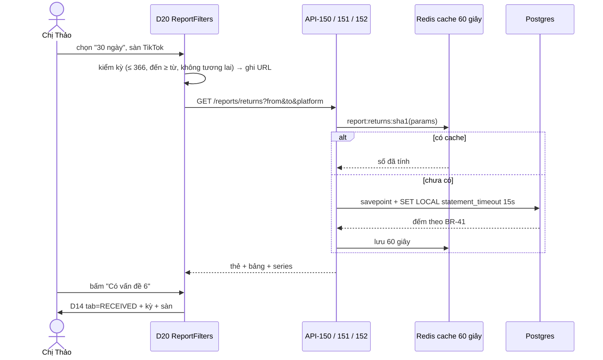

# Lát 14 — Báo cáo (M14) — Giải thích nghiệp vụ

| Trường | Giá trị |
|---|---|
| Item / lát | `03-expansion-tiktok` · lát 14 (milestone M14, [03-plan §4](../../ai/items/03-expansion-tiktok/03-plan.md)) |
| Yêu cầu | FR-09.02..09.07, FR-03.16 (tên người đóng gói trong báo cáo); BR-41; EX-B1, EX-B2; NFR-37; AC-45..48 — [01-srs](../../ai/items/03-expansion-tiktok/01-srs.md) v0.5 |
| Task | BE: T-216, T-217 · FE: T-254, T-255 |
| Code | `ai-cam-be`: `12517a6` (T-216), `e928430` (T-217) · `ai-cam-fe`: `d17c8b9` (T-254), `ac003ac` (T-255) |
| Người đọc | Dev mới vào dự án, reviewer, QA, chủ shop / quản lý (đọc §0) |
| Tác giả | khanhtt (agent soạn) |
| Reviewer | PO (đúng nghiệp vụ) · Tech lead (đúng code) |
| Trạng thái | Draft |
| Last update | 2026-10-07 · Dev |

## TL;DR

- Màn **D20 Báo cáo** 3 tab: **Hàng hoàn** (tỷ lệ hoàn, có vấn đề, theo loại / sàn / shop, lý do × kết luận, top 20 sản phẩm), **Khiếu nại** (tỷ lệ thắng, giá trị thu hồi, gửi trước hạn, quá hạn chưa gửi), **Năng suất** (theo station và theo người đứng bàn — chỉ Admin / Supervisor).
- Mọi số theo **một bộ công thức BR-41**, giờ Việt Nam, kỳ tối đa 366 ngày; mẫu số 0 → "—". Bấm số → danh sách chi tiết đã lọc; "Xuất CSV" (UTF-8 có BOM, mở bằng Excel) có audit.
- Tính thẳng trên DB, cache 60 giây; quá 15 giây thì hủy và báo lỗi. Máy dev: kỳ 92 ngày p95 ≤ 0,50 giây, 366 ngày ≤ 1,41 giây (yêu cầu 3 / 10 giây) — **máy kho chưa đo**.

## 0. Giải thích đơn giản

Đây là phần **"sổ tổng kết cuối tháng"** cho chủ shop. Trước đây muốn biết tháng này hàng hoàn bao nhiêu phần trăm, khiếu nại thắng bao nhiêu, bàn nào chậm — phải tự xuất dữ liệu ra Excel và đếm tay.

**Ý tưởng chính.** Chọn kỳ (mặc định 30 ngày gần nhất), chọn sàn / shop / station nếu muốn, đọc thẻ số và bảng. Thấy số lạ → bấm vào số → ra danh sách kiện / hồ sơ đứng sau con số đó. Cần gửi kế toán → "Xuất CSV".

### Tab Hàng hoàn
- **Tỷ lệ hoàn** = hồ sơ có kiện về (khách trả, giao thất bại, kiện về trước khi sàn báo) tạo trong kỳ ÷ số kiện đã bàn giao cho vận chuyển trong kỳ. "Chỉ hoàn tiền" hiện riêng (không có kiện về).
- **Tỷ lệ có vấn đề** = hồ sơ "Đã nhận – có vấn đề" ÷ hồ sơ đã nhận, tính theo lúc nhận.
- Bảng lý do khách × kết luận kho (khách nói "Hàng lỗi" mà kho thấy "Nguyên vẹn" bao nhiêu lần), top 20 sản phẩm bị trả.
- Vì sao chia theo **kỳ** thay vì theo lô kiện: đơn giản, kiểm được bằng dữ liệu đang có. Cách theo lô chính xác hơn nhưng tháng gần nhất luôn thấp và khó giải thích.

### Tab Khiếu nại
- **Tỷ lệ thắng** = Thắng ÷ (Thắng + Thua), tính theo lúc có kết quả. Hồ sơ đang chờ không tính.
- **Giá trị thu hồi** = tổng tiền thu hồi của hồ sơ Thắng. **Gửi trước hạn** = hồ sơ gửi trước hạn ÷ hồ sơ đã gửi. **Quá hạn chưa gửi** = hồ sơ "Mới" mà đã qua hạn.
- Vì sao cần "lúc gửi" và "lúc có kết quả": để tính đúng kỳ. Hệ thống nay ghi hai mốc này mỗi khi hồ sơ đổi trạng thái (trước đây không ghi).

### Tab Năng suất (chỉ Admin / Supervisor)
- Đóng gói: số kiện, thời gian trung bình / kiện **trừ thời gian chờ quản lý duyệt**, số lần lệch mã, bỏ dở, hủy, đóng gói lại. Bàn hoàn: số kiện kiểm, thời gian trung bình, tỷ lệ có vấn đề.
- Theo station (luôn đúng) và theo **tên người đứng bàn** (gõ tay, gộp không phân biệt hoa thường, bỏ khoảng trắng thừa; không tên → "(Không ghi tên)").
- Vì sao chỉ quản lý xem: đây là dữ liệu đánh giá nhân viên. CSKH mở đường dẫn tab này → về tab Hàng hoàn + "Bạn không có quyền xem báo cáo năng suất."
- Vì sao trừ thời gian chờ duyệt: người đóng gói không chậm khi đang chờ quản lý — trừ đi để không đổ lỗi oan.

**Ví dụ một vòng đầy đủ.** Ngày 01/11, chị Thảo (chủ shop) mở Báo cáo, chọn "Tháng trước". Tab Hàng hoàn: 1.000 kiện bàn giao, 25 khách trả + 15 giao thất bại → **tỷ lệ hoàn 4,0 %**; 6 Chỉ hoàn tiền → 0,6 %; 30 hồ sơ đã nhận, 6 có vấn đề → **20,0 %**. Chị bấm số "6" → sang Hàng hoàn tab Đã nhận của kỳ đó. Tab Khiếu nại: 12 Thắng (2.350.000 đ), 4 Thua, 5 đang chờ → **75 %**. Tab Năng suất: Station 01 ba kiện 60, 90, 150 giây (kiện 150 giây có 30 giây chờ duyệt) → **trung bình 90 giây**. Chị bấm "Xuất CSV", mở bằng Excel: tiếng Việt đúng, số khớp màn, nhật ký ghi "Xuất CSV báo cáo".

**Lưu ý.**
- Số đo tốc độ là **máy dev** với 183.000 kiện sinh tự động; máy kho chưa đo.
- Tên người đóng gói là chữ gõ tay trên tài khoản station dùng chung → báo cáo theo người chỉ đúng khi bật "Bắt buộc tên người đóng gói" (lát 12).

## 1. Vì sao cần

P8: không có số liệu tổng hợp — không biết bàn / người nào chậm, sản phẩm nào hay bị trả, khiếu nại có đáng công không. Mục tiêu 01 §2: báo cáo hàng hoàn / khiếu nại một tháng ≤ 10 giây (hiện làm tay bằng Excel).

| Lát này làm (Goals) | Lát này không làm (Non-goals — ở đâu) |
|---|---|
| API-150 hàng hoàn, 151 khiếu nại, 152 năng suất (BR-41) + cache + `statement_timeout` (T-216, DEC-570..573) | Giá trị hàng hoàn bằng tiền (hệ thống không lưu giá — DEC-415) |
| `claim.submitted_at` / `result_at` ghi khi chuyển trạng thái (DEC-570) | Báo cáo theo lô kiện (cohort) |
| API-153 CSV + `series` + `perf_reports.py` đo NFR-37 (T-217, DEC-574) | Đo trên máy kho (R13) |
| D20 khung, `ReportFilters` theo URL, 3 tab, ⓘ công thức, bấm số, CSV, biểu đồ cột (C) (T-254, 255, DEC-611..617) | Lọc "có vấn đề" ở D14, tìm SKU ở D3 (phản hồi Architect — DEC-611) |

## 2. Ai dùng, ở đâu, khi nào

| Vai | Màn hình / điểm vào | Lúc nào dùng |
|---|---|---|
| Admin, Supervisor | D20 cả 3 tab, CSV | Cuối tuần / tháng, họp vận hành |
| CSKH | D20 tab Hàng hoàn, Khiếu nại, CSV | Theo dõi khiếu nại |
| — | Drawer "Báo cáo" (`bar_chart`), thẻ D2 | Mở nhanh |
| Dev / ops | `RUN_PERF=1 uv run python tests/load/perf_reports.py` | Đo NFR-37 trước go-live |

## 3. Tình huống thực tế

| # | Tình huống | Hệ thống làm gì | Vì sao |
|---|---|---|---|
| 1 | Kỳ 400 ngày / ngày đến trước ngày từ | Không gọi API; lỗi dưới ô "Chọn tối đa 366 ngày." / "Ngày đến phải sau ngày từ."; server 422 gom 3 lỗi kỳ | EX-B1 |
| 2 | Kỳ không có kiện | Bảng "Không có dữ liệu trong kỳ này.", tỷ lệ "—" | EX-B2 — không chia cho 0 |
| 3 | Hồ sơ hàng hoàn bị hủy (yêu cầu hủy / đã gộp) | Không vào tử số tỷ lệ hoàn | Không có kiện về (DEC-571) |
| 4 | Hồ sơ "Về trước khi sàn báo" | Vào tử số tỷ lệ hoàn | BR-41 (ví dụ JSON 02 lệch — xem §8) |
| 5 | Hồ sơ đóng sau khi Thắng | Kết quả lấy từ audit `CLAIM_UPDATE` gần nhất có `WON` / `LOST` | Không mất hồ sơ đã đóng khỏi tỷ lệ thắng (DEC-572) |
| 6 | Hồ sơ không có hạn | Tính "gửi trước hạn" | Không thể trễ (DEC-572 (2)) |
| 7 | Phiên hoàn bị loại vì quét nhầm | Không tính vào số kiện kiểm của bàn hoàn | BR-39 dùng lại vị từ (DEC-573 (3)) |
| 8 | "lan", " Lan ", "LAN" | Gộp một dòng, hiện tên đầu tiên theo thời gian | BR-41 |
| 9 | CSKH gọi API-152 / API-153 `productivity` | 403 | Ma trận §5.10 |
| 10 | Truy vấn > 15 giây | 503 `REPORT_TIMEOUT`, FE không tự thử lại | Không để báo cáo chiếm DB của bàn quét (DEC-573 (6), 614) |
| 11 | Bấm "Xuất CSV" ngay sau khi xem | Số lấy cùng cache 60 giây → CSV khớp màn; audit `REPORT_EXPORT` commit trước khi trả file | AC-47 |
| 12 | Bấm số trên kỳ > 92 ngày → D3 | Link cắt 92 ngày cuối kỳ | D3 chỉ nhận ≤ 92 ngày (DEC-612) |

## 4. Luồng ví dụ từ đầu đến cuối

## 5. Quy tắc nghiệp vụ và lý do

| Quy tắc | Con số / điều kiện | Vì sao | ID |
|---|---|---|---|
| Kỳ | Mặc định 30 ngày tới hôm nay (giờ VN); tối đa 366; nhanh 7 / 30 / 90 | Đủ so tháng / quý / năm | FR-09.05, EX-B1 |
| Tỷ lệ hoàn | (Khách trả + Giao thất bại + Về trước khi báo, tạo trong kỳ, trừ `CANCELLED`) ÷ kiện chuyển `HANDED_OVER` trong kỳ | Tỷ lệ theo kỳ dễ giải thích | BR-41, DEC-415, 571 |
| Có vấn đề | `RECEIVED_ISSUE` ÷ (`RECEIVED_OK` + `RECEIVED_ISSUE`) theo `received_at` | Đo chất lượng hàng về | BR-41 |
| Tỷ lệ thắng | Thắng ÷ (Thắng + Thua) theo `result_at`; `LEGACY_HOLD` loại khỏi mọi số | Khiếu nại có đáng công | BR-41, DEC-572 |
| Gửi trước hạn | Chuyển "Đã gửi" trước hạn ÷ đã gửi | Đo kỷ luật CSKH | BR-41 |
| Thời gian TB đóng gói | max(đóng − mở − Σ chờ duyệt đã quyết, 0); làm tròn nửa lên | Không tính lúc chờ quản lý | BR-41, DEC-573 (2) |
| Người đứng bàn | Khóa `lower(trim())`; rỗng → "(Không ghi tên)" cuối bảng | Tài khoản station dùng chung | BR-41, DEC-414 |
| Mẫu số 0 | "—" | Không chia cho 0 | EX-B2 |
| Quyền | Hàng hoàn / Khiếu nại: Admin, Supervisor, CSKH; Năng suất: Admin, Supervisor | Dữ liệu đánh giá nhân viên chỉ quản lý xem | §5.10, DEC-414 |
| Chạy | Cache 60 giây / bộ lọc; `statement_timeout` 15 giây → 503; log WARNING khi kỳ ≤ 92 ngày > 3 giây | Không chiếm DB kho | NFR-37, DEC-573 |
| CSV | UTF-8 BOM, dấu phẩy, `4,0%`, CRLF, đầu file kỳ / sàn / shop, audit `REPORT_EXPORT` | Excel VN mở đúng | FR-09.06, DEC-476, 574 |
| Biểu đồ | Cột theo ngày / tuần (thứ Hai) / tháng, đủ cột (0 khi trống) | FR mức C | FR-09.07, DEC-574, 617 |

## 6. Điểm dễ hiểu nhầm

- **Tỷ lệ hoàn có thể > 100 %?** Về lý thuyết có, khi kỳ ngắn: hồ sơ tạo trong kỳ có thể thuộc kiện bàn giao kỳ trước. Đây là hệ quả có chủ đích của cách "theo kỳ" (DEC-415).
- **Top sản phẩm đếm theo `requested_items`?** Không — theo sản phẩm trong **đơn**, vì giao thất bại / về trước khi báo không có dòng yêu cầu (DEC-571 (4)).
- **Station lọc có làm đổi tab Hàng hoàn?** Không; `station_id` chỉ áp năng suất (không vào khóa cache returns / claims).
- **"Có vấn đề" bấm vào sao không lọc đúng hồ sơ có vấn đề?** D14 / API-110 chưa có lọc "có vấn đề" → FE mở tab Đã nhận + kỳ, người dùng xem cột Kết luận (DEC-611). Dòng sản phẩm **không có link** vì D3 không tìm theo SKU.
- **Danh sách Station trên D20 lấy từ đâu?** Từ API-32 (như D3), vì API-60 chỉ Admin (DEC-616 (b)).

## 7. Bản đồ nghiệp vụ → code

Đường dẫn BE tính từ `ai-cam-be/src/aicam/`, test BE từ `ai-cam-be/tests/`. FE từ `ai-cam-fe/`.

| Khái niệm nghiệp vụ | Code | Test chứng minh |
|---|---|---|
| Kỳ, tỷ lệ, làm tròn | `modules/reports/analytics.py`: `MAX_DAYS` :48, `make_filters` :96, `bounds` :122, `rate` :130, `round_seconds` :141, `net_seconds` :148 | `unit/test_report_formulas.py` (`test_br41_pack_average_minus_approval_wait`, `test_br41_rates_from_examples`, `test_zero_denominator_is_null`, `test_period_validation_messages`, `test_bounds_are_vietnam_days`) |
| Báo cáo hàng hoàn | `modules/reports/analytics.py::returns_report` :203, `_top_products` :345 | `integration/test_reports_api.py::test_returns_report_br41_example`, `test_returns_report_filters_and_empty_period` |
| Báo cáo khiếu nại + mốc gửi / kết quả | `analytics.py::_claim_outcome` :419, `claims_report` :469; `modules/claims/service.py` (ghi `submitted_at` / `result_at` :670–673) | `test_reports_api.py::test_claims_report_br41_example`, `test_claim_transitions_stamp_submitted_and_result` |
| Năng suất | `analytics.py::_waits` :662, `_operator_key` :677, `productivity_report` :687 | `test_reports_api.py::test_productivity_report_br41_example` |
| Chạy + cache + hủy 15 giây | `analytics.py`: `CACHE_TTL_S` :50, `STATEMENT_TIMEOUT` :51, `cache_key` :854, `build` :866 | `test_reports_api.py::test_report_cached_60s_per_filter`, `test_report_timeout_returns_503`; `unit/test_report_formulas.py::test_cache_key_ignores_station_except_productivity` |
| Series biểu đồ | `analytics.py::granularity` :579, `bucket_starts` :584, `series` :607 | `test_reports_api.py::test_returns_series_by_day`; `unit/test_report_formulas.py::test_series_granularity_and_buckets` |
| CSV + quyền | `modules/reports/csv_export.py` (`BOM` :18, `percent` :46, `filename` :61); `modules/reports/router.py` (API-150..153 :41–88) | `test_reports_api.py::test_export_csv_returns_with_audit`, `test_export_permissions_and_errors`, `test_report_validation_errors`; `unit/test_report_formulas.py::test_csv_percent_and_render` |
| Đo NFR-37 | `tests/load/perf_reports.py` (script, `RUN_PERF=1`) | Số đo `ai-cam-be/docs/ops.md` §8 (không phải test pass / fail) |
| D20 FE | `src/features/reports/ReportsPage.tsx`, `ReportFilters.tsx` :26, `reportParams.ts` (`MAX_REPORT_DAYS` :27, `D3_MAX_RANGE_DAYS` :29, `validatePeriod` :90), `ReturnsReportView.tsx` :15, `ClaimsReportView.tsx` :15, `ProductivityReportView.tsx` :27, `ExportCsvButton.tsx` :15, `SeriesChart.tsx` :21 | `src/features/reports/ReportsPage.test.tsx`, `ReportsTabs.test.tsx`, `reportParams.test.ts`; `e2e/mock/reports.spec.ts`; `e2e/real/phase3-m14-reports.spec.ts` (**chưa chạy**) |

## 8. Giới hạn hiện tại và giả định

| Giới hạn / giả định | Ảnh hưởng | Khi nào xử lý |
|---|---|---|
| **Chưa test — thiếu tài nguyên (R13, TC-X3.13)**: NFR-37 trên server kho. Máy dev (M4 Pro, 183.000 kiện, 20 lần / tab): 92 ngày p95 hàng hoàn 0,50 · khiếu nại 0,13 · năng suất 0,25 giây; 366 ngày 1,41 · 0,43 · 0,91 giây | Máy kho có thể chậm hơn | Go-live: chạy lại `perf_reports.py` trỏ Postgres máy kho |
| Spec ↔ code: ví dụ JSON API-150 ở 02 có `UNANNOUNCED 2` nhưng tử số 40 (chỉ Khách trả + Giao thất bại); code theo **công thức** BR-41 (gồm `UNANNOUNCED`) | Người đọc 02 có thể tưởng code sai | Sửa ví dụ ở 02 (DEC-571 (1)) |
| D20 → D14 "Có vấn đề" không lọc được kết luận; dòng sản phẩm không có link D3 (01 ghi "→ D3 tìm SKU") | Chưa đủ chữ 01 | Phản hồi Architect (DEC-611) — thêm `conclusion_issue` API-110, tìm SKU API-30 nếu cần |
| Chữ FE mới chưa có trong 01 ("Kỳ báo cáo chưa hợp lệ…", "Không tải được file CSV.") | PO cần soát | Review G3 |
| Metric `aicam_report_seconds` chỉ là log `report_built` (repo chưa có Prometheus) | Không có dashboard metric | Task metric chung (DEC-660 (4)) |
| E2E BE thật `phase3-m14-reports.spec.ts` **chưa chạy** | FE D20 mới kiểm trên MSW | T-229 / bước 11 |

## Liên kết

- SRS: [01-srs.md](../../ai/items/03-expansion-tiktok/01-srs.md) v0.5: §4.2, BR-41, UC-15, AC-45..48, NFR-37, DEC-414, 415, 423
- Spec: [02 §6.2](../../ai/items/03-expansion-tiktok/02-tech-spec.md) API-150..153 · [02a §8](../../ai/items/03-expansion-tiktok/02a-be-spec.md), DEC-570..574 · [02b-admin](../../ai/items/03-expansion-tiktok/02b-fe-spec-admin.md) D20, DEC-611..617
- Test cases: `04` §M09 TC-09.3x.., TC-X3.13
- Vận hành: `ai-cam-be/docs/ops.md` §8
- Lát trước: [lat-13-tiktok-nhieu-shop.md](lat-13-tiktok-nhieu-shop.md) · Lát sau: [lat-15-sao-luu-cloud.md](lat-15-sao-luu-cloud.md)
