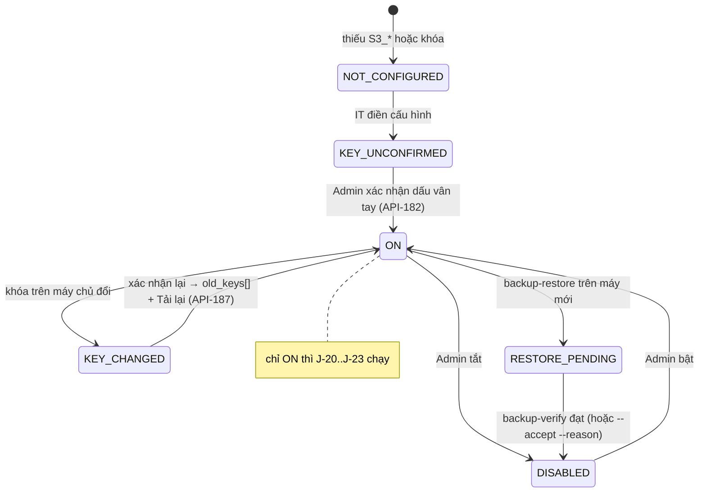
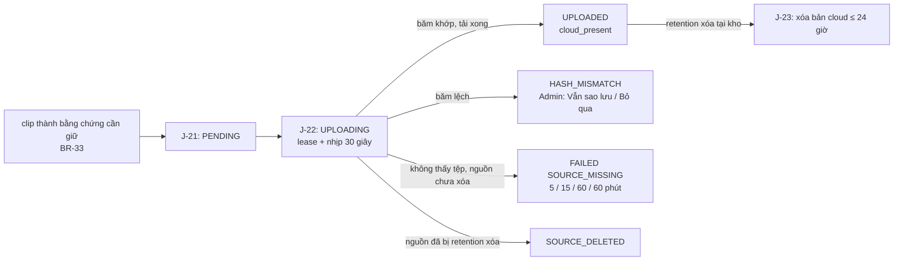

# Lát 15 — Sao lưu cloud + khôi phục (M15) — Giải thích nghiệp vụ

| Trường | Giá trị |
|---|---|
| Item / lát | `03-expansion-tiktok` · lát 15 (milestone M15, [03-plan §4](../../ai/items/03-expansion-tiktok/03-plan.md)) |
| Yêu cầu | FR-02.08, 02.13..02.18; BR-33; EX-K1..K9; NFR-40, 41, 44; AC-49..51; ADR-010 — [01-srs](../../ai/items/03-expansion-tiktok/01-srs.md) v0.5 |
| Task | BE: T-218, T-219, T-220, T-221, T-222, T-223, T-272, T-273, T-274, T-283, T-284, T-287 · FE: T-259, T-263 |
| Code | `ai-cam-be`: `3afbc37` (T-218), `7fed9de` (T-219), `b94400e` (T-220), `1a26aaf` (T-221), `37b8cf7` (T-222), `4224088` (T-223), `5a945a9` (T-272), `4e0ff2d` (T-273), `bef23ac` (T-274), `733e435` (T-283), `fee112c` (T-284), `414de6a` (T-287) · `ai-cam-fe`: `41f69ec` (T-259), `f799f5c` (T-263) |
| Người đọc | Dev mới vào dự án, reviewer, QA, Admin, IT / ops |
| Tác giả | khanhtt (agent soạn) |
| Reviewer | PO (đúng nghiệp vụ) · Tech lead (đúng code) |
| Trạng thái | Draft |
| Last update | 2026-10-07 · Dev |

## TL;DR

- Sao lưu ra kho lưu S3-compatible: **DB + file nhập đơn mỗi 6 giờ**, và **chỉ bằng chứng cần giữ** (clip / ảnh đang được bảo vệ, BR-33) trong ≤ 1 giờ. Video thô và clip thường **không** lên cloud.
- Mọi thứ được **mã hóa tại kho** (`AICAMENC1`, AES-256-GCM theo khối 4 MiB) trước khi tải; cloud chỉ có bản mã; khóa không nằm trong DB, log, bản sao.
- Sao lưu **chỉ chạy sau khi Admin xác nhận đã cất khóa** (thấy dấu vân tay, không thấy khóa). Đổi khóa → dừng tới khi xác nhận lại; D23 đếm bản còn dùng khóa cũ, cho tải lại bằng khóa mới.
- Mọi sự cố có lối ra có dấu vết: lệch mã băm (Vẫn sao lưu / Bỏ qua + lý do), không thấy tệp (thử lại giãn cách → "Thiếu tệp" sau 4 lần ở lát 16), khôi phục nhiều khóa, giải mã lỗi → "Thiếu tệp", kiểm khôi phục chấp nhận có lý do.
- Diễn tập khôi phục trên MinIO tạm + Postgres tạm **đạt**; nhà cung cấp S3 thật, máy kho, mạng kho **chưa test — thiếu tài nguyên**.

## 0. Giải thích đơn giản

Đây là phần **"két sắt thứ hai ở ngoài kho"**. Trước đây video bằng chứng và cơ sở dữ liệu chỉ nằm trên một máy ở kho. Cháy, hỏng ổ, mất máy là mất luôn video đang tranh chấp với sàn và toàn bộ hồ sơ.

**Ý tưởng chính.** Hệ thống tự gửi một bản sao **đã khóa** lên một kho lưu trên mạng. Chìa để mở là "khóa sao lưu" — chỉ máy chủ kho và chủ shop giữ. Nhà cung cấp kho lưu, kẻ trộm tài khoản kho lưu đều chỉ thấy dữ liệu đã bị khóa.

### Bước 1 — Bật sao lưu: phải xác nhận đã cất chìa khóa
- IT điền thông tin kho lưu và khóa sao lưu trên máy chủ. Admin mở màn "Sao lưu" → "Kiểm tra kết nối" (ghi / đọc / xóa một tệp nhỏ, ≤ 10 giây).
- Màn hiện **dấu vân tay** của khóa (ví dụ "54F8-6045-55E8-CCE6") — không bao giờ hiện khóa. Admin tick "Đã cất bản sao khóa giải mã" → sao lưu bật.
- Vì sao bắt xác nhận: mất khóa thì mọi bản sao **vô dụng**, không có đường cứu nào. Ép người có trách nhiệm dừng lại một lần và cất khóa ra ngoài máy trước khi tin vào sao lưu.
- Khóa trên máy chủ đổi (IT thay khóa) → dấu vân tay đổi → sao lưu tự dừng tới khi Admin xác nhận lại. Sau đó màn báo "18 tệp bằng chứng và 1 bản DB mã hóa bằng khóa 54F8… — giữ khóa cũ để khôi phục được các bản này." + nút "Tải lại bằng chứng bằng khóa mới".

### Bước 2 — Gửi gì, lúc nào
- DB + file nhập đơn gốc: 01:00, 07:00, 13:00, 19:00. Sau khi tải, tải ngược về giải mã thử để chắc bản sao đọc được.
- Bằng chứng: khi một clip / ảnh **trở thành** bằng chứng cần giữ (có hồ sơ hàng hoàn, có hồ sơ khiếu nại…) nó vào hàng chờ, lên cloud trong ≤ 1 giờ. Hồ sơ khiếu nại đang mở được ưu tiên.
- Vì sao không gửi mọi clip: 500 đơn / ngày × 2 camera ≈ 30 GB / ngày, 0,4–1 triệu đ / tháng và nghẽn đường truyền kho. Chỉ bằng chứng cần giữ ≈ 4,6 GB / ngày, 70–170 nghìn đ / tháng. (Có tùy chọn gửi mọi clip đóng gói, mặc định tắt.)
- Tốc độ tải giới hạn (mặc định 10 Mbit/s) để bàn quét và live view không chậm. Đang dựng link chia sẻ thì sao lưu nhường đường.
- Mất Internet → hàng chờ giữ nguyên, có mạng lại tự gửi. Đóng gói không bị ảnh hưởng.

### Bước 3 — Dọn trên cloud
- Clip bị dọn theo số ngày lưu tại kho → bản cloud bị xóa trong ≤ 24 giờ. Chỉ dọn theo **lưu trữ**; clip mất tệp vì sự cố không bao giờ kéo theo xóa bản cloud.
- Bản DB: giữ 30 ngày gần nhất + bản đầu mỗi tháng trong 12 tháng, và **luôn còn ít nhất 3 bản thành công mới nhất** (dù sao lưu hỏng lâu cũng không bao giờ còn 0 bản).
- Kho lưu bật "phiên bản": xóa = ẩn đi, nhà cung cấp tự xóa hẳn sau 7 ngày; khóa của ứng dụng **không** xóa được phiên bản cũ. Vì sao: máy kho bị chiếm quyền thì kẻ tấn công không xóa sạch được bản sao.

### Bước 4 — Khi có chuyện
- **Lệch mã băm**: tệp video tại kho khác với lúc quay (bị sửa / hỏng) → **không** tự tải bản lệch. Admin xem từng tệp: "Vẫn sao lưu bản hiện có" (có còn hơn không) hoặc "Bỏ qua", cả hai bắt lý do 5–500 ký tự.
- **Không thấy tệp tại kho** (ổ hỏng, ai xóa tay) với clip còn hạn giữ → không coi là "đã xóa". Thử lại sau 5, 15, 60 phút rồi mỗi giờ; báo D23 + D2 ngay lần đầu. Admin "Thử lại ngay" (sau khi IT chép lại) hoặc "Bỏ qua".
- **DB 26 giờ chưa sao lưu được, hoặc 2 lượt liền lỗi, hoặc bằng chứng chờ > 24 giờ** → D2 "Cần xử lý" (thông báo điện thoại ở lát 17).

### Bước 5 — Mất máy kho: khôi phục
- IT cài máy mới, chạy một lệnh với khóa hiện tại (+ khóa cũ nếu có): DB về trước, rồi bằng chứng — hồ sơ khiếu nại đang mở về trước.
- Khóa sai → báo rõ, **không ghi gì**. DB đích không trống → từ chối (trừ khi cố ý ghi đè).
- Đối tượng nào giải mã lỗi / thiếu khóa cũ → clip / ảnh thành "Thiếu tệp", ghi danh sách vào tệp CSV, **chạy tiếp phần còn lại**. Tìm lại khóa cũ → chạy lại riêng phần bằng chứng.
- Sau khôi phục, sao lưu tự **tắt** ("Chờ kiểm khôi phục") tới khi lệnh kiểm SHA-256 đạt. Vì sao: máy mới thiếu tệp mà vẫn chạy dọn cloud thì có thể xóa nốt bản cloud còn lại. Kiểm không đạt vì vài tệp lệch đã biết → IT chấp nhận bằng lệnh có lý do (ghi nhật ký) → đạt.

**Ví dụ một vòng đầy đủ** (diễn tập `evidence/m15-restore-drill.txt`, máy dev, 2.000 kiện). Kho có 12 clip + 6 ảnh là bằng chứng → lên cloud bằng khóa 54F8…. IT đổi khóa sang 1B5C…, Admin xác nhận; D23 báo "18 tệp … khóa 54F8…". 3 bằng chứng mới lên bằng khóa 1B5C…. Giả sử mất máy: xóa thử 1 clip trên cloud, cài máy trống, chạy khôi phục với cả 2 khóa → DB về trong 1,7 giây, 20 bằng chứng về, 4 thành "Thiếu tệp" (1 clip bị xóa trên cloud + 3 tệp vốn không thuộc bằng chứng cần giữ). Lệnh dọn cloud trên máy mới bị chặn ("Chờ kiểm khôi phục"). Lệnh kiểm: khớp 20, thiếu đã ghi nhận 4 → **đạt**, Admin bật lại sao lưu. Không đối tượng nào trên cloud bị xóa thêm.

**Lưu ý.**
- Chưa chốt nhà cung cấp kho lưu (Q20, nơi đặt dữ liệu theo NĐ 13). Mọi thử nghiệm chạy trên **MinIO** tạm.
- Thời gian khôi phục đo trên máy dev; trên máy kho với dữ liệu thật **chưa đo**.

## 1. Vì sao cần

P9: DB và bằng chứng chỉ một bản tại kho (`pg_dump` cùng máy, 14 ngày; clip không có bản thứ hai). RK-19: mất khóa → bản cloud vô dụng. RK-28: máy kho bị chiếm quyền → khóa kho lưu xóa sạch bản sao. Mục tiêu 01 §2: 100 % bằng chứng cần giữ có bản ngoài kho ≤ 1 giờ; RPO DB ≤ 6 giờ.

| Lát này làm (Goals) | Lát này không làm (Non-goals — ở đâu) |
|---|---|
| `cloud`: `ObjectStore` (S3 / Memory), giới hạn tốc độ, MinIO dev 2 bucket + policy (T-218, DEC-651..653) | Bucket link + link chia sẻ (lát 16) |
| `AICAMENC1` + `backup-keygen` (T-219, DEC-654) | Mã hóa lại bản cũ bằng khóa mới (backlog — DEC-495) |
| J-20 DB, J-21 xếp bằng chứng BR-33, J-22 tải, J-23 dọn (T-220, 221, 273, DEC-655, 656, 660) | Sao lưu video thô |
| API-180..185, 187, 188; API-81 `backup`; D2 `BACKUP_STALE`; WS `backup.updated` (T-222, 272, 283, 287) | Thông báo N08 (T-227 — lát 17) |
| `backup-restore` / `backup-verify` nhiều khóa, CSV, mã thoát, `--accept --reason`, runbook bí mật (T-223, 274, 284) | Khôi phục qua giao diện (chỉ dòng lệnh — §5.10) |
| D23 Sao lưu, D8 sức khỏe + công tắc người đóng gói / hạn Chỉ hoàn tiền (T-259, 263) | Đặt `MISSING` sau 4 lần / khi Bỏ qua (T-291 — lát 16) |

## 2. Ai dùng, ở đâu, khi nào

| Vai | Màn hình / điểm vào | Lúc nào dùng |
|---|---|---|
| IT / ops | `.env` `S3_*`, `BACKUP_ENCRYPTION_KEY`, `BACKUP_OLD_KEYS`; `aicam backup-keygen`; `backup-restore`, `backup-verify` (ops §6.2) | Cài đặt, đổi khóa, mất máy |
| Admin | D23 Sao lưu: kiểm tra kết nối, xác nhận khóa, bật / tắt, sao lưu DB ngay, lịch sử 14 ngày, tệp lỗi, tải lại khóa cũ, nâng cao (giới hạn tốc độ, sao lưu mọi clip) | Lần đầu; khi D2 báo |
| Admin, Supervisor | D8 dòng "Sao lưu cloud" (Supervisor chỉ xem) | Kiểm sức khỏe |
| Job | J-20 (01/07/13/19 giờ), J-21 / J-22 (liên tục), J-23 (sau dọn 02:00) | Chạy nền (`worker-backup`) |

## 3. Tình huống thực tế

| # | Tình huống | Hệ thống làm gì | Vì sao |
|---|---|---|---|
| 1 | Chưa cấu hình kho lưu / khóa | D23 "Chưa cấu hình kho lưu cloud", API-181..184 503, job không chạy | EX-K1 |
| 2 | Chưa xác nhận khóa | `state = KEY_UNCONFIRMED`, không tệp nào được tải; D23 banner vàng | EX-K2, AC-49 |
| 3 | Xác nhận khóa nhưng khóa vừa đổi trên máy chủ | 409 `BACKUP_KEY_MISMATCH`, FE bỏ tick, Admin đọc lại dấu vân tay | Không xác nhận khóa chưa thấy (DEC-634) |
| 4 | Kho lưu từ chối (sai khóa truy cập, hết tiền) | `CLOUD_AUTH_FAILED` / `CLOUD_ERROR`, D23 lỗi gần nhất, tự thử lại | EX-K4 |
| 5 | J-20 treo > 2 giờ | Lượt `FAILED STALE_RUNNING` trước lượt mới | Không kẹt "đang chạy" mãi (DEC-500) |
| 6 | 2 lượt DB liền lỗi (chưa quá 26 giờ) | D2 `BACKUP_STALE` lý do `DB_FAILED_TWICE` (chỉ Admin thấy) | Phát hiện sớm (DEC-500) |
| 7 | Clip tại kho lệch SHA-256 | `HASH_MISMATCH`, không tải; Admin "Vẫn sao lưu" → tải kèm `integrity = MISMATCH_ACCEPTED`; tệp đổi tiếp → lệch mới, phải xem lại | Không tải bản chưa ai xem (DEC-660) |
| 8 | Đã có bản cloud gốc, sau đó chấp nhận lệch | **Giữ bản cloud gốc**, không ghi đè | Bản gốc đã qua kiểm băm (DEC-663 (4)) |
| 9 | Clip `READY` mà tệp mất | `FAILED SOURCE_MISSING`, giãn cách 5 / 15 / 60 / 60 phút; API-185 hiện ngay; "Thử lại" mà vẫn thiếu → hiện lại | EX-K9, DEC-662 |
| 10 | Clip bị dọn theo lưu trữ khi đang chờ tải | `SOURCE_DELETED` (cuối), không tính chờ | Không phải sự cố |
| 11 | Đổi khóa | `old_keys[]` đếm theo `cloud_present` + `cloud_key_fingerprint`; API-187 xếp tải lại tệp còn ở kho; bản DB cũ không mã hóa lại (hết hạn tự nhiên) | EX-K7, DEC-659 |
| 12 | Khôi phục khóa sai | Mã 2 "Khóa giải mã không khớp (dấu vân tay …) — không ghi gì." | AC-50 |
| 13 | Khôi phục quên khóa cũ | 16 `UNKNOWN_KEY` → `MISSING` + CSV, mã 3; `--evidence-only --key-file` khóa cũ → về `READY` | EX-K8, DEC-661, 663 |
| 14 | Sửa 1 byte một đối tượng cloud | `DECRYPT_FAILED`, không để tệp dở `.part`, chạy hết phần còn lại | DEC-663 |
| 15 | Máy mới, chưa kiểm | `RESTORE_PENDING`: J-23 không chạy, API-181 bật → 409 | Không xóa nốt bản cloud (DEC-499) |

## 4. Luồng ví dụ từ đầu đến cuối

Một tệp bằng chứng (`backup_object`):

## 5. Quy tắc nghiệp vụ và lý do

| Quy tắc | Con số / điều kiện | Vì sao | ID |
|---|---|---|---|
| Bằng chứng cần giữ | Clip / ảnh đang được bảo vệ theo BR-09 (a, b, c) hoặc cờ giữ, + bằng chứng hồ sơ KN đã đóng còn hạn giữ; tải một lần, kiểm SHA-256 trước | Đúng thứ đang tranh chấp, chi phí thấp | BR-33, DEC-406 |
| Lịch DB | 01:00 / 07:00 / 13:00 / 19:00 giờ VN; kiểm đọc lại; lỗi → thử lại sau 10 phút tối đa 2 lần | RPO ≤ 6 giờ | FR-02.08, NFR-40 |
| Mã hóa | `AICAMENC1`: header 32 byte + khối 4 MiB, AES-256-GCM, AAD gồm số khối + cờ khối cuối; cắt / đảo / sửa byte → lỗi | Nhà cung cấp không đọc được | FR-02.13, NFR-41, DEC-654 |
| Khóa | Không ở DB / log / bản sao; D23 chỉ hiện dấu vân tay; `backup-keygen` chỉ in ra màn hình | Lộ DB không lộ khóa | DEC-407, 408 |
| Xác nhận khóa | Sao lưu chỉ chạy khi `state = ON` (đã xác nhận đúng dấu vân tay hiện tại, đã bật, không chờ kiểm) | Mất khóa = mất hết (EX-K5) | FR-02.17, RK-19 |
| Giữ bản DB | 30 ngày + bản sớm nhất ngày 1 mỗi tháng (giờ VN) trong 12 tháng + luôn ≥ 3 bản thành công mới nhất | Không bao giờ 0 bản | FR-02.14, DEC-505 |
| Dọn bằng chứng cloud | Chỉ nguồn bị **retention** xóa (clip `DELETED` có audit `DELETE_CLIP reason = RETENTION`); bỏ qua `UPLOADING`, `MISSING`; schema lệch → không dọn | Sự cố mất tệp không kéo theo xóa bản cloud | FR-02.14, DEC-656 |
| Phiên bản | Bucket sao lưu versioning + lifecycle 7 ngày; khóa ứng dụng không `DeleteObjectVersion` / `PutBucketVersioning` | Sống sót khi máy kho bị chiếm | DEC-501, RK-28 |
| Cảnh báo | DB > 26 giờ (chưa có lượt nào → tính từ lúc xác nhận khóa) / 2 lượt liền lỗi / bằng chứng chờ > 24 giờ / lệch băm / không thấy tệp → D2 `BACKUP_STALE` (chỉ khi `ON` / `KEY_CHANGED`) | Báo sớm | FR-02.15, DEC-657 |
| Xử lý tệp | "Vẫn sao lưu" / "Bỏ qua" / "Thử lại ngay": lý do 5–500 + audit `BACKUP_ISSUE_RESOLVE`; Bỏ qua tệp đã có lại → 409 | Mọi vấn đề có lối ra có dấu vết | EX-K6, K9 |
| Giới hạn tốc độ | Token bucket Redis, mặc định 10 Mbit/s; nhường link chia sẻ (`share:active`) | Không chậm quét / live view | NFR-44 |
| Khôi phục | Mã thoát 0 xong · 1 kiểm không đạt · 2 từ chối (không ghi gì) · 3 có đối tượng lỗi (đã làm hết phần còn lại); hồ sơ KN mở về trước; không đường nào ghi `DELETED` | Luôn biết trạng thái, không mất bản cloud | FR-02.16, EX-K8, DEC-658, 661, 663 |
| Kiểm khôi phục | Khớp / lệch đã chấp nhận / thiếu đã ghi nhận → đạt; còn lệch / thiếu → IT `--accept id --reason` (audit `BACKUP_VERIFY_ACCEPT`) | Luôn có đường ra khỏi "Chờ kiểm" | DEC-518 |

## 6. Điểm dễ hiểu nhầm

- **"Thiếu tệp" ở lát này?** Khôi phục đặt `MISSING` cho clip / ảnh không về được. Còn đặt `MISSING` khi kho mất tệp 4 lần liền / Admin "Bỏ qua" là lát 16 (T-291). Ở M15, test ghi rõ nguồn vẫn `READY` (DEC-662 (3)).
- **`configured` nghĩa là gì?** Đủ `S3_*` **và** có `BACKUP_ENCRYPTION_KEY`. Thiếu khóa thì "Kiểm tra kết nối" cũng 503 (DEC-653).
- **Trạng thái việc ≠ sự thật trên cloud.** Đếm "bản dùng khóa cũ" theo `cloud_present` + `cloud_key_fingerprint`, không theo `status = UPLOADED`: ngay sau API-187 dòng thành `PENDING` mà bản cũ vẫn còn trên cloud (DEC-659, 522).
- **Vì sao bản cloud gốc không bị thay khi "Vẫn sao lưu"?** Bản gốc đã qua kiểm băm — là bằng chứng tốt hơn bản lệch. Chỉ tải bản lệch khi chưa có bản cloud nào.
- **`size_bytes` của lượt DB** là kích thước **bản mã** trên cloud, không phải dump gốc (DEC-655 (2)).
- **SUPERVISOR có `backup.read` trên `/me` nhưng API `/backup*` 403?** Đúng: quyền đọc chỉ để FE hiện tóm tắt từ API-81 (D8); mọi API sao lưu chỉ Admin (DEC-780).
- **Dung lượng D23 bội 1024** (MB / GB), D8 ổ đĩa bội 1000 (DEC-633).

## 7. Bản đồ nghiệp vụ → code

Đường dẫn BE tính từ `ai-cam-be/src/aicam/`, test BE từ `ai-cam-be/tests/`. FE từ `ai-cam-fe/`.

| Khái niệm nghiệp vụ | Code | Test chứng minh |
|---|---|---|
| Kho lưu, phân loại lỗi, MinIO | `modules/cloud/store.py` (`ObjectStore` :58, `classify` :150, `S3Store` :179, `MemoryStore` :362), `modules/cloud/config.py` (`is_configured` :14, `backup_store` :67); `docker/minio/init.sh`, `docs/s3-policy.example.json` | `integration/test_cloud_minio.py` (`test_app_key_cannot_delete_versions_or_change_versioning`, `test_probe_and_wrong_secret`); `unit/test_cloud_store.py` |
| Giới hạn tốc độ | `modules/cloud/ratelimit.py` (`TokenBucket` :49, `share_active` :95) | `integration/test_cloud_ratelimit.py`, `integration/test_perf_backup_throttle.py::test_upload_rate_close_to_limit` |
| Mã hóa `AICAMENC1` | `modules/cloud/crypto.py` (`MAGIC` :26, `CHUNK_SIZE` :29, `fingerprint` :85, `keyring` :90, `EncryptingReader` :150, `decrypt_stream` :229, `verify_stream` :280); CLI `entrypoints/cli.py::backup_keygen` :211 | `unit/test_crypto.py` (`test_round_trip`, `test_wrong_key_detected_before_writing`, `test_picks_right_key_among_two`, `test_truncation_reorder_tamper_fail`, `test_ciphertext_hides_plaintext_and_key`, `test_backup_keygen_prints_valid_key_and_fingerprint`) |
| Trạng thái sao lưu | `modules/backup/service.py`: `configured` :56, `state` :86, `test_connection` :109, `db_late` :292, `old_keys` :353, `reupload_old_key` :402, `status` :459, `confirm_key` :595, `run_now` :630, `stale_attention` :785, `resolve_issue` :838 | `integration/test_backup_api.py` (`test_status_unconfirmed_then_confirm_key`, `test_not_configured_503`, `test_admin_only`, `test_db_failed_twice_and_db_late`, `test_ws_backup_updated_on_admin_channel`) |
| J-20 DB | `modules/backup/jobs.py`: `STALE_RUNNING` :37, `fail_stale_runs` :60, `pg_dump` :110, `run_db` :194 | `integration/test_backup_db_job.py` (`test_j20_real_pg_dump_success`, `test_j20_skips_unless_state_on`, `test_j20_single_run_and_stale_running`, `test_j20_verify_readback_failure`, `test_j20_key_never_logged`) |
| J-21 / J-22 bằng chứng | `jobs.py`: `enqueue_evidence` :358, `BACKOFF_MIN` :387, `next_attempt` :393, `expire_leases` :397, `_priority` :423, `_upload_one` :515, `upload_evidence` :640; `modules/backup/transfer.py` (`upload_encrypted` :39); `modules/media/protection.py::evidence_clip_targets` :163 | `integration/test_backup_jobs.py` (`test_j21_only_br33_evidence_and_idempotent`, `test_j22_uploads_encrypted_with_metadata`, `test_j22_hash_mismatch_not_uploaded`, `test_j22_source_deleted_vs_source_missing`, `test_j22_network_down_then_recovers`, `test_j22_lease_expired_uploading_requeued`, `test_j22_yields_to_share_job`) |
| J-23 dọn | `jobs.py`: `DB_KEEP_LATEST` :686, `retention_deleted_sql` :691, `_prune_evidence` :724, `db_runs_to_keep` :771, `prune` :855 | `test_backup_jobs.py` (`test_j23_deletes_only_retention_deleted`, `test_j23_blocked_when_restore_pending_or_schema_mismatch`, `test_db_keep_policy_always_three_latest`, `test_j23_prunes_old_db_runs_keeps_three`); `integration/test_backup_cloud_present.py` |
| Đổi khóa | `backup/service.py::old_keys` :353, `reupload_old_key` :402 | `integration/test_backup_key_rotation.py` (`test_rotation_old_keys_reupload_and_prune`, `test_reupload_disabled_and_restore_pending`) |
| Lệch băm / không thấy tệp | `backup/service.py::issues` :743, `resolve_issue` :838 | `integration/test_backup_hardening.py` (4 test), `integration/test_backup_source_missing.py` (3 test) |
| Khôi phục / kiểm | `modules/backup/restore.py`: mã thoát :34–37, `restore_db` :97, `restore` :223, `restore_evidence` :369, `verify` :680; CLI `entrypoints/cli.py::backup_restore` :226, `backup_verify` :244; `scripts/backup_drill.py` | `integration/test_backup_restore.py` (`test_restore_wrong_key_writes_nothing`, `test_restore_evidence_browse_cloud_missing_never_deleted`, `test_restore_evidence_unknown_key_then_evidence_only`, `test_decrypt_failed_csv_exit3_no_partial_file`, `test_verify_accept_requires_reason_and_clears_pending`); diễn tập `docs/ai/items/03-expansion-tiktok/evidence/m15-restore-drill.txt` (repo gốc) |
| NFR-41 | — | `integration/test_backup_security_nfr41.py::test_backup_copies_useless_without_key_and_key_never_stored`, `test_j23_schema_guard_real_revision` (lát 18) |
| D23 / D8 FE | `src/features/backup/BackupPage.tsx`, `BackupCards.tsx` :41, `ConfirmKeyDialog.tsx` :17, `OldKeysAlert.tsx` :21, `IssuesList.tsx`, `ResolveIssueDialog.tsx` :19, `BackupOptions.tsx` :109, `rules.ts::writeLockTip` :15; `src/features/settings/HealthPanel.tsx`, `backupHealth.ts` | `src/features/backup/BackupPage.test.tsx`, `BackupIssues.test.tsx`; `src/features/settings/StoragePhase3.test.tsx`; `e2e/mock/backup.spec.ts`; `e2e/real/phase3-m15-backup.spec.ts` (**chưa chạy**) |

## 8. Giới hạn hiện tại và giả định

| Giới hạn / giả định | Ảnh hưởng | Khi nào xử lý |
|---|---|---|
| **Chưa test — thiếu tài nguyên (R6 / R15, TC-X3.06)**: versioning + lifecycle + chính sách quyền, object lock, metadata / mã hóa phía server trên **nhà cung cấp thật** | Đã kiểm trên MinIO tạm; object lock không có trên MinIO | Khi chốt Q20 |
| **Chưa test — thiếu tài nguyên (R7, TC-X3.07)**: tốc độ tải thật, vùng dữ liệu (AS-17, CO-06, NĐ 13) | Token bucket đo MinIO: 50 MB @ 40 Mbit/s → 43,7 Mbit/s | Như trên |
| **Chưa test — thiếu tài nguyên (R11, TC-X3.11)**: NFR-44 quét p95 / live view khi tải 5 GB qua Internet kho | Chưa biết ảnh hưởng thật lên bàn quét | Lắp tại kho |
| **Chưa test — thiếu tài nguyên (R12, TC-X3.12)**: NFR-40 RTO ≤ 60 phút trên **máy kho**. Máy dev: DB 2.000 kiện khôi phục 1,0–1,7 giây | Dữ liệu thật lớn hơn nhiều | Diễn tập go-live |
| Bằng chứng diễn tập: `m15-restore-drill.txt` phần "Phase full mở rộng" có dòng `verify … lệch 1` cho clip `…1632-7362` (CAM2) nhưng log **không có dòng** ghi bước "sửa 1 tệp trên đĩa sau khôi phục" tạo ra lệch đó (DEC-663 (6) có mô tả) | Người đọc log khó biết lệch từ đâu ra | Nên thêm dòng log bước sửa tệp vào `scripts/backup_drill.py` |
| Metric Prometheus `aicam_backup_*` (02a §10) **chưa làm** — thay bằng log có cấu trúc (`backup_db`, `backup_object`, `backup_hash_mismatch`, …) | Chưa có dashboard metric | Task metric chung (DEC-660 (4)) |
| Compose dev `minio`, `worker-backup`: **chỉ sửa file, chưa áp dụng** stack dev đang chạy | QA live T-229 cần dựng lại stack | T-229 |
| E2E BE thật `phase3-m15-backup.spec.ts` **chưa chạy** | D23 mới kiểm trên MSW | T-229 / bước 11 |
| Q20 (nhà cung cấp, NĐ 13) mở — **chặn go-live sao lưu + link** | — | Chủ shop, IT |

## Liên kết

- SRS: [01-srs.md](../../ai/items/03-expansion-tiktok/01-srs.md) v0.5: §4.3, FR-02.08..18, BR-33, EX-K1..K9, UC-20 / 21, AC-49..51, NFR-40, 41, 44, §8.2 chi phí
- Spec: [02 §6.2](../../ai/items/03-expansion-tiktok/02-tech-spec.md) API-180..188 · [02a §7.3, §11](../../ai/items/03-expansion-tiktok/02a-be-spec.md), DEC-651..664 · [02b-admin](../../ai/items/03-expansion-tiktok/02b-fe-spec-admin.md) D23, DEC-631..640
- Kiến trúc: ADR-010 (kho lưu cloud dùng chung, 2 bucket, đổi khóa)
- Vận hành: `ai-cam-be/docs/ops.md` §6.2 (runbook khôi phục, bí mật cất ngoài máy), §11
- Test cases: `04` §M02, §KR, TC-X3.06, 07, 11, 12
- Lát trước: [lat-14-bao-cao.md](lat-14-bao-cao.md) · Lát sau: [lat-16-link-chia-se.md](lat-16-link-chia-se.md)
