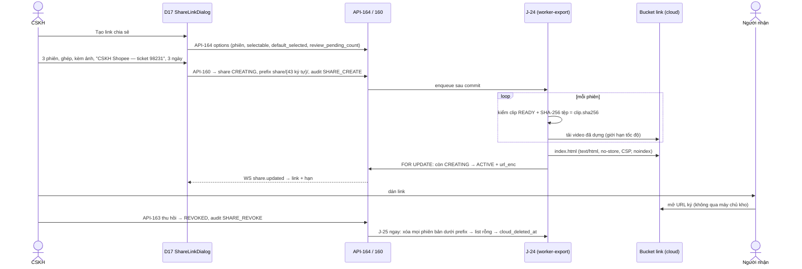

# Lát 16 — Link chia sẻ bằng chứng + "Thiếu tệp" (M16) — Giải thích nghiệp vụ

| Trường | Giá trị |
|---|---|
| Item / lát | `03-expansion-tiktok` · lát 16 (milestone M16, [03-plan §4](../../ai/items/03-expansion-tiktok/03-plan.md)) |
| Yêu cầu | FR-07.05, 07.07..07.09; BR-34, BR-35; EX-S1..S7; NFR-42, 45, 46; AC-52, 53 · "Thiếu tệp": FR-02.15, 02.16, EX-K8, EX-K9 v0.5 (DEC-520, 530) · BR-39 (16) link bị ảnh hưởng (DEC-531) — [01-srs](../../ai/items/03-expansion-tiktok/01-srs.md) v0.5 |
| Task | BE: T-224, T-225, T-286, T-291, T-292 · FE: T-257, T-265, T-266 (+ T-256 `ShareLinkDialog` làm từ lát 12) |
| Code | `ai-cam-be`: `4931955` (T-224), `f539ab1` (T-225), `bc13806` (T-286), `fb32e2e` (T-291), `cb9abe1` + `88a54b2` (T-292) · `ai-cam-fe`: `8e6ba26` (T-257), `66997c7` (T-265), `6ac2555` + `27a624f` (T-266), `2dcbcc6` (T-256) |
| Người đọc | Dev mới vào dự án, reviewer, QA, CSKH (đọc §0) |
| Tác giả | khanhtt (agent soạn) |
| Reviewer | PO (đúng nghiệp vụ) · Tech lead (đúng code) |
| Trạng thái | Draft |
| Last update | 2026-10-07 · Dev |

## TL;DR

- CSKH tạo **link có hạn 1 / 3 / 7 ngày** từ hồ sơ khiếu nại (D17) hoặc một phiên (D4): chọn ≤ 4 phiên có clip (tổng ≤ 30 phút), góc quay, kèm ảnh hay không, **"Gửi cho ai" bắt buộc**. Hệ thống dựng video có chữ + trang xem W1, tải lên **bucket link riêng** trên cloud dưới địa chỉ ngẫu nhiên 256 bit, trả link ≤ 3 phút.
- Thu hồi → xóa tệp, link chết ≤ 60 giây (khi kho có Internet); hết hạn → xóa ≤ 1 giờ. Audit tạo / thu hồi / hết hạn. **Không đếm lượt xem** — trang nằm trên cloud, máy chủ kho không thấy ai mở.
- W1 chỉ có video, ảnh đã chọn, thông tin phiên, SHA-256; không ghi chú nội bộ, người phụ trách, tiền, "gửi cho". Video dựng từ đúng tệp gốc đã kiểm băm.
- **"Thiếu tệp"**: clip / ảnh có trong DB mà máy chủ không có tệp (khôi phục không về được, mất tệp 4 lần thử liền ≈ 80 phút, hoặc Admin "Bỏ qua") → không phát, không cắt lại, không xuất, không vào link / gói; tệp có lại đúng băm → tự về bình thường.
- Đánh dấu quét nhầm một phiên đang có trong link còn hiệu lực → báo danh sách link + nút "Thu hồi link" (**không** tự thu hồi).

## 0. Giải thích đơn giản

Đây là phần **"gửi bằng chứng cho sàn bằng một đường link có hạn"**. Trước đây CSKH tải video MP4 hoặc tệp zip về máy rồi gửi qua chat — tệp nặng, gửi tùy tiện, không có hạn, không thu hồi được, không biết đã gửi gì cho ai.

**Ý tưởng chính.** Máy chủ kho chỉ có trong mạng nội bộ; người ngoài (CSKH sàn, đơn vị vận chuyển) không vào được. Vì vậy hệ thống dựng sẵn một **bản sao riêng** của video + một trang xem, đặt lên kho lưu cloud ở một địa chỉ ngẫu nhiên khó đoán, rồi đưa link có chữ ký hết hạn. Thu hồi = xóa bản sao đó.

### Bước 1 — Tạo link
- CSKH ở hồ sơ khiếu nại bấm "Tạo link chia sẻ". Mặc định chọn sẵn tới 4 phiên chính của hồ sơ (phiên quét nhầm / "Cần soát" không chọn sẵn).
- Chọn: góc quay (ghép Cam 1 + Cam 2, hoặc chỉ Cam 1), có kèm ảnh không, **gửi cho ai** (3–100 ký tự, ví dụ "CSKH Shopee — ticket 12345"), hạn 1 / 3 / 7 ngày.
- Hộp thoại cảnh báo: video có thể thấy nhãn vận đơn có tên / số điện thoại người mua. Hồ sơ còn phiên "Cần soát" chưa xử lý hoặc chưa có video mở hộp nào → cảnh báo vàng, không chặn.
- Vì sao bắt "gửi cho ai": link không đếm được lượt xem, nên trách nhiệm nằm ở người gửi — phải ghi lại đã gửi cho ai.

### Bước 2 — Hệ thống dựng và đăng
- Với từng phiên: kiểm tệp gốc còn, **SHA-256 khớp lúc quay**, rồi dựng video có chữ (như bản xuất Phase 1), tải lên; dựng trang xem; công bố link. Thường ≤ 3 phút.
- Tệp gốc bị sửa / mất trước khi dựng → link **thất bại**, không công bố. Vì sao: trang W1 hứa "SHA-256 clip gốc"; video phải dựng từ đúng tệp đó.
- Đang dựng mà bị thu hồi → không bao giờ thành "Đang hoạt động", tệp đã tải bị xóa.

### Bước 3 — Người nhận mở link
- Mở trên điện thoại / máy tính, không đăng nhập. Thấy: video + nút tải từng phiên, ảnh, mã vận đơn, mã đơn, sàn, loại phiên, thời gian, station, người kiểm và kết luận (phiên hoàn), SHA-256 clip gốc và video chia sẻ, hạn link.
- Không thấy: ghi chú nội bộ, người phụ trách, số tiền, "gửi cho", dữ liệu kiện khác.
- Trang không có mã chạy (script) — nên không phát hiện được trình duyệt không phát video; dòng gợi ý "Bấm Tải video để xem bằng ứng dụng khác" luôn hiện.

### Bước 4 — Thu hồi, hết hạn
- Người tạo, Supervisor, Admin thu hồi bất kỳ lúc nào (CSKH chỉ thu hồi link mình tạo). Tệp bị xóa, link chết ≤ 60 giây.
- Kho mất Internet lúc thu hồi → hệ thống ghi "Đã thu hồi" ngay nhưng link **vẫn mở được** trên cloud tới khi có mạng (thử xóa mỗi phút); màn hiện chip "Đang thu hồi — chờ Internet".
- Hết hạn → tệp xóa ≤ 1 giờ sau hạn. Hồ sơ khiếu nại đóng **không** tự thu hồi link (sàn có thể đang xem).
- Vì sao hạn tối đa 7 ngày: chữ ký link của kho lưu S3 chỉ cho tối đa 7 ngày.

### Bước 5 — "Thiếu tệp"
- Một clip có trong cơ sở dữ liệu nhưng máy chủ không còn tệp (ổ hỏng, khôi phục không về được, ai đó xóa tay). Phase 2 vẫn hiện clip như bình thường, bấm phát thì lỗi, link / gói bằng chứng vỡ.
- Nay clip / ảnh đó hiện **khối xám "Thiếu tệp"** ở mọi màn: không phát, không cắt lại (cắt lại tạo tệp khác băm — mất tính toàn vẹn), không xuất, không vào link / gói (gói bằng chứng ghi rõ "thiếu tệp").
- Khi nào thành "Thiếu tệp": khôi phục không về được (lát 15); sao lưu không thấy tệp **4 lần liền** (≈ 80 phút — không ngay lần đầu vì ổ chập chờn gây nhiễu); Admin bấm "Bỏ qua" tệp không thấy.
- IT chép lại tệp đúng băm → lần sao lưu sau tự đưa về bình thường.

**Ví dụ một vòng đầy đủ.** 10:00 chị Hoa (CSKH) mở KN-000141, bấm "Tạo link chia sẻ": chọn sẵn 3 phiên (đóng gói, mở hoàn 08:51, mở hoàn 10:15), ghép 2 camera, kèm 4 ảnh, gửi cho "CSKH Shopee — ticket 98231", hạn 3 ngày. 10:02 link sẵn sàng, chị dán vào form khiếu nại của Shopee. Nhân viên Shopee mở trên điện thoại, xem 3 video, đối chiếu SHA-256. 15:00 chị Hoa xem lại video 08:51, nhận ra là kiện bàn bên → "Đánh dấu quét nhầm". Màn hiện "Phiên này đang có trong 1 link còn hiệu lực: CSKH Shopee — ticket 98231 [Thu hồi link]". Chị bấm thu hồi; 15:00:40 link không mở được nữa. Chị tạo link mới chỉ với 2 phiên đúng. 3 ngày sau link mới hết hạn, tệp trên cloud bị xóa trước 11:02, nhật ký ghi "Link hết hạn".

**Lưu ý.**
- Chạy và đo trên **MinIO** tạm; nhà cung cấp cloud thật (phục vụ trang HTML mở thẳng, ký link 7 ngày) và điện thoại thật **chưa test**.
- Dựng video từ camera thật 1080p trên server kho **chưa test** (camera giả + máy dev).

## 1. Vì sao cần

P10: gửi bằng chứng bằng tệp — nặng, không hạn, không thu hồi, không biết đã gửi gì cho ai. ADR-001 / CO-05: không mở cổng vào máy chủ kho → link phải nằm trên cloud (DEC-409). DEC-520 / 530: clip mất tệp vẫn hiện như thường → phát lỗi, link / gói vỡ, cắt lại làm sai băm.

| Lát này làm (Goals) | Lát này không làm (Non-goals — ở đâu) |
|---|---|
| `shares`: API-160..164, BR-35, quyền thu hồi, audit `SHARE_*`, `shares[]` ở API-31 / 132 (T-224, DEC-665..669) | Đếm lượt xem (DEC-410 — backlog sau Q20) |
| J-24 dựng + tải (bucket link) + W1 (CSP + referrer) + URL ký; J-25 thu hồi / hết hạn / treo; WS `share.updated` (T-225, DEC-670..675) | Trang lỗi tùy biến khi link hết hạn (của nhà cung cấp — EX-S4) |
| `MISSING` ở mọi điểm đọc (02a §5.2), J-16 `CLIP_MISSING` / `SNAPSHOT_MISSING` (T-286, DEC-676, 677) | Làm mờ nhãn người mua trong video (mất giá trị chứng minh — DEC-411) |
| J-22 đặt `MISSING` sau 4 lần liền / về `READY`; API-188 `IGNORE` → `MISSING` (T-291, DEC-679) | — |
| API-189 `affected_shares[]`, API-164 `review_pending_count` (T-292, DEC-680) | Tự thu hồi link khi đánh dấu quét nhầm (DEC-531 — loại) |
| D21, `SharesBlock` D4 / D17, `MissingMediaBlock`, `AffectedSharesDialog`, "Là phiên hoàn thật" (T-257, 265, 266) | Chọn từng ảnh vào link (backlog — DEC-667) |

## 2. Ai dùng, ở đâu, khi nào

| Vai | Màn hình / điểm vào | Lúc nào dùng |
|---|---|---|
| CSKH, Supervisor, Admin | D17 / D4 "Tạo link chia sẻ" (`ShareLinkDialog`); khối "Link chia sẻ" D4 / D17; D21 danh sách (Tất cả / Của tôi), sao chép, thu hồi | Gửi bằng chứng cho sàn / ĐVVC |
| Người nhận link | W1 (trang tĩnh trên cloud, không đăng nhập) | Xem / tải video, đối chiếu mã băm |
| Job | J-24 (queue `export`, `worker-export -c 1`), J-25 (mỗi 60 giây + ngay sau thu hồi) | Chạy nền |
| Mọi vai xem video | D4, D17, station: khối "Thiếu tệp" thay player | Clip / ảnh `MISSING` |
| Admin | D23 "Bỏ qua" tệp không thấy tại kho → "Thiếu tệp" | Xử lý sự cố sao lưu |

## 3. Tình huống thực tế

| # | Tình huống | Hệ thống làm gì | Vì sao |
|---|---|---|---|
| 1 | Chưa cấu hình bucket link (`S3_SHARE_BUCKET`) | Dialog Alert "Chưa cấu hình kho lưu cloud. Admin: Cài đặt → Sao lưu." + khóa "Tạo link"; API-160 503 | EX-S1; **không** rơi về bucket sao lưu (versioning → thu hồi không xóa thật — DEC-665) |
| 2 | Chọn 5 phiên / tổng > 30 phút | Khóa nút "Chọn tối đa 4 phiên." / 422 | BR-35 |
| 3 | Phiên chưa có clip / clip lỗi / đã xóa / Thiếu tệp | Không chọn được, chú thích; API 409 `SESSION_CLIP_UNAVAILABLE` / `CLIP_MISSING` | EX-S3 |
| 4 | Kèm ảnh | Chỉ ảnh `READY` **của phiên được chọn**, ≤ 20, chốt lúc tạo | Không lộ ảnh của phiên / kiện khác (DEC-667, NFR-45) |
| 5 | Tệp gốc bị sửa sau khi tạo link | J-24 `FAILED RENDER_FAILED`, xóa phần đã tải, không công bố | Video phải khớp băm hiển thị (DEC-670) |
| 6 | Mất mạng khi tải lên | `FAILED`, không link dở dang; "Không tải được lên kho lưu cloud. Kiểm tra Internet rồi bấm Thử lại." | EX-S2 |
| 7 | Thu hồi khi đang dựng | Không bao giờ `ACTIVE`, xóa đối tượng | DEC-671 |
| 8 | Thu hồi khi kho mất mạng | `REVOKED` + `revoke_pending = true`, chip "Đang thu hồi — chờ Internet"; J-25 thử mỗi phút | EX-S7, DEC-442 |
| 9 | CSKH thu hồi link của Supervisor | 403 | FR-07.08, §5.10 |
| 10 | Thu hồi lần hai | 409 `SHARE_NOT_ACTIVE` | DEC-669 (3) |
| 11 | `ACTIVE` đã qua hạn mà J-25 chưa chạy | API trả `EXPIRED`, `url = null` | Không hiện link chết như còn dùng (DEC-669 (2)) |
| 12 | Đổi 1 ký tự token / chữ ký; liệt kê bucket | 403 / 404; từ chối liệt kê | NFR-42 |
| 13 | Retention xóa clip gốc khi link còn hạn | Link vẫn chạy tới hạn (bản dựng riêng) | EX-S6 |
| 14 | Clip `READY` mà J-22 không thấy tệp lần 2, 3 | Vẫn `READY`; lần 4 liền → `MISSING` + audit `MEDIA_*`; vẫn thử mỗi giờ; chép lại đúng băm → `READY` | DEC-530, 679 |
| 15 | Lỗi khác (mạng) xen giữa các lần "không thấy tệp" | Đếm lại từ đầu | Không tính mất mạng là mất tệp (DEC-679) |
| 16 | Đánh dấu quét nhầm phiên A có trong 2 link `ACTIVE` + 1 link đã thu hồi | `affected_shares` = 2 link (mọi nguồn), `can_revoke` theo người gọi; không tự thu hồi; audit `active_shares` | DEC-531, 680 |
| 17 | Giữ clip (API-42) đang `PENDING` / `FAILED` | Vẫn cho (chỉ từ chối `DELETED`, `MISSING`) | Giữ hành vi Phase 1–2 (DEC-676) |

## 4. Luồng ví dụ từ đầu đến cuối

## 5. Quy tắc nghiệp vụ và lý do

| Quy tắc | Con số / điều kiện | Vì sao | ID |
|---|---|---|---|
| Phạm vi link | 1–4 phiên có clip, tổng ≤ 1.800 giây, ảnh ≤ 20; nguồn `CLAIM` chỉ phiên trong bằng chứng đang dùng; nguồn `SESSION` chỉ phiên đó | Link chỉ chứa đúng thứ người tạo thấy | BR-35, DEC-667, 669 |
| Chọn sẵn | 4 phiên đầu `selectable` trừ phiên bị loại / "Cần soát", dừng khi vượt 1.800 giây; chọn tay vẫn được | BR-39 không áp lên quyết định có chủ ý của CSKH | DEC-668, 800 |
| Gửi cho | 3–100 ký tự, bắt buộc, không hiện trên W1 | Trách nhiệm ở người gửi (không đếm lượt xem) | FR-07.05, DEC-410 |
| Hạn | 1 / 3 / 7 ngày (mặc định 7); URL ký ≤ 604.800 giây | Giới hạn SigV4 của S3 | BR-34 |
| Token | `share/{token_urlsafe(32)}/` = 256 bit, 43 ký tự; không vào API / audit / log | NFR-42 ≥ 128 bit | NFR-42, DEC-669 (4) |
| Bucket link riêng | Không versioning; thu hồi xóa mọi phiên bản; lifecycle `share/` 8 ngày là lưới cuối | Thu hồi phải xóa thật | DEC-501, 665, 672 |
| Thu hồi | Người tạo / Supervisor / Admin; chết ≤ 60 giây khi có mạng; mất mạng → `revoke_pending`, thử mỗi phút | FR-07.08, EX-S7 | FR-07.08 |
| Hết hạn | J-25 mỗi 60 giây: `ACTIVE` quá hạn → `EXPIRED` + audit `SHARE_EXPIRE` + xóa ≤ 1 giờ; `CREATING` > 15 phút → `FAILED TIMEOUT` | BR-34 | BR-34, DEC-672 |
| Dựng an toàn | Cam 1 (và Cam 2 nếu ghép) `READY` + băm khớp; Cam 2 không `READY` → chỉ Cam 1; ảnh lệch / mất → bỏ ảnh | W1 hứa SHA-256 gốc | DEC-670, ADR-008 |
| W1 | Không script; CSP chỉ origin của URL ký; `referrer no-referrer`; `noindex`; whitelist trường | Không lộ dữ liệu; không chạy mã lạ | FR-07.07, NFR-45, DEC-673, 675 |
| HTTPS | Production: `S3_PUBLIC_ENDPOINT` phải `https://` | URL ký đi qua Internet | NFR-42, DEC-674 |
| Thiếu tệp | `MISSING` = DB có, máy chủ không có tệp; đặt khi khôi phục không về, 4 lần liền không thấy (`BACKUP_SOURCE_MISSING_MARK_AFTER`), hoặc `IGNORE`; về `READY` khi tệp có lại đúng băm (hoặc đúng bản lệch đã chấp nhận) | Một trạng thái rõ cho mọi màn | EX-K8, EX-K9 v0.5, DEC-530, 679 |
| Điểm đọc `MISSING` | API-40 / 41 / 42 / 43 → 409 `CLIP_NOT_READY` `details.status = MISSING`; API-46 409 `CLIP_NOT_FAILED`; J-01 / J-11 / J-02 / J-21 không đụng; J-16 `CLIP_MISSING` / `SNAPSHOT_MISSING`; ảnh `url = null` | Cắt lại = mất toàn vẹn | 02a §5.2, DEC-676, 677 |
| Link bị ảnh hưởng | `CREATING` / `ACTIVE` còn hạn, mọi nguồn chứa phiên; không tự thu hồi | Người gửi quyết | DEC-531, 680 |

## 6. Điểm dễ hiểu nhầm

- **Vì sao không đếm được lượt xem?** Người nhận mở thẳng URL ký trên cloud; máy chủ kho không nằm trên đường đi (không mở cổng vào kho — ADR-001), trang W1 không có script. Nhật ký truy cập của bucket khác nhau giữa nhà cung cấp → để sau khi chốt Q20 (DEC-410). Loại phương án đặt trang trên máy chủ kho qua tunnel: đếm được nhưng mở đường vào máy giữ toàn bộ dữ liệu.
- **Link có trỏ tới clip gốc ở kho?** Không. Mỗi link là **bản dựng riêng** trên cloud. Vì vậy clip gốc bị xóa theo lưu trữ thì link vẫn chạy tới hạn (EX-S6).
- **`shares[]` ở D17 và D4 khác nhau?** D17: link tạo **từ hồ sơ** đó; D4: link có video của kiện (tạo từ phiên hoặc từ hồ sơ có phiên của kiện); ≤ 3 mới nhất trừ `FAILED` (DEC-666).
- **"Kèm ảnh (n)"**: n = tổng ảnh của **phiên đang chọn**, không phải của cả hồ sơ (DEC-801).
- **`CLIP_MISSING` trong gói zip trước đây nghĩa "chưa có clip"** — nay đổi: chưa có clip → `CLIP_NOT_READY`; `CLIP_MISSING` chỉ còn nghĩa "Thiếu tệp" (DEC-677).
- **Clip `MISSING` vẫn có `sha256`** (DB còn) — để khi tệp có lại kiểm được đúng băm.
- **Phiên có clip `MISSING` có còn "có clip" cho BR-39?** Có — luật BR-39 đếm clip ≠ `DELETED`; phiên đó vẫn có thể là phiên chính, nhưng không đưa được vào link (409 `CLIP_MISSING`). Xem §8.

## 7. Bản đồ nghiệp vụ → code

Đường dẫn BE tính từ `ai-cam-be/src/aicam/`, test BE từ `ai-cam-be/tests/`. FE từ `ai-cam-fe/`.

| Khái niệm nghiệp vụ | Code | Test chứng minh |
|---|---|---|
| Tạo link, giới hạn, quyền | `modules/shares/service.py`: `MAX_SESSIONS` :54, `MAX_TOTAL_SECONDS` :55, `MAX_SNAPSHOTS` :56, `EXPIRES_DAYS` :57, `new_object_prefix` :65, `options` :277, `create` :358, `list_shares` :553, `revoke` :641 | `integration/test_shares_api.py` (`test_options_claim_order_flags_and_defaults`, `test_options_storage_not_configured`, `test_create_records_exact_selection`, `test_create_limits_and_unavailable`, `test_list_get_counts_and_url_only_when_active`, `test_revoke_permissions_and_state`, `test_package_and_claim_shares_blocks`, `test_roles`) |
| Trạng thái hiệu lực, thu hồi, link bị ảnh hưởng | `modules/shares/queries.py`: `LIVE` :22, `REVOKERS` :23, `effective_status` :27, `can_revoke` :42, `revoke_pending` :46, `affected_shares` :139; dùng ở `modules/claims/review.py` :142 | `integration/test_share_review_affected.py` (`test_mark_wrong_scan_reports_affected_shares`, `test_options_review_pending_count`) |
| J-24 dựng + W1 | `modules/shares/build.py`: `MAX_PRESIGN_S` :51, `_check_source` :114, `_still_creating` :127, `build` :134, `_publish_page` :330; `modules/shares/w1.py::render` :143, `templates/w1.html` | `integration/test_shares_jobs.py` (`test_build_publishes_only_selected_evidence`, `test_source_tampered_or_missing_never_published`, `test_revoked_while_building_is_never_active`, `test_upload_failure_then_cleanup_after_network_back`); `unit/test_w1_render.py` (`test_csp_referrer_no_script_and_same_origin`, `test_content_matches_whitelist`, `test_template_has_no_field_outside_whitelist`) |
| J-25 thu hồi / hết hạn / treo | `modules/shares/cleanup.py`: `STUCK_CREATING` :32, `expire_due` :46, `fail_stuck` :73, `purge` :103, `cleanup` :144 | `test_shares_jobs.py::test_revoke_and_expiry_delete_cloud_objects`, `test_stuck_creating_fails_and_versions_purged`, `test_timeout` |
| NFR-42 trên MinIO | `modules/cloud/config.py::share_configured` :30, `share_store` :74 | `integration/test_share_security_nfr42.py` (`test_token_256_bit_unique`, `test_link_open_tamper_list_revoke`) |
| "Thiếu tệp" — mọi điểm đọc | 02a §5.2; đặt / gỡ ở `modules/backup/media_state.py` (`mark_missing` :56, `recover` :86) | `integration/test_clip_missing_readers.py` (6 test: `test_api_132_and_31_serialize_missing`, `test_play_hold_export_rebuild_refuse_missing`, `test_j01_j11_j02_leave_missing_untouched`, `test_j16_pack_lists_missing`, `test_shares_refuse_missing_cam1`, `test_backup_queue_skips_missing`) |
| Đặt `MISSING` sau 4 lần / IGNORE | `modules/backup/jobs.py` (`SOURCE_MISSING` :389, `_upload_one` :515); `modules/backup/service.py::resolve_issue` :838 | `integration/test_backup_source_missing_mark.py` (`test_mark_missing_after_four_then_recover`, `test_missing_counter_restarts_after_other_error`, `test_changed_file_needs_upload_anyway`, `test_ignore_marks_missing_now`) |
| FE link | `src/features/shares/ShareLinkDialog.tsx` :44, `SharesPage.tsx`, `SharesBlock.tsx` :16, `RevokeShareDialog.tsx` :17, `ShareStatus.tsx` (`ShareStatusChip` :33), `ShareCompletionWatcher.tsx` :15; `src/features/claims/AffectedSharesDialog.tsx` :18 | `src/features/shares/ShareLinkDialog.test.tsx`, `ShareLinkLimits.test.tsx`, `SharesPage.test.tsx`; `e2e/mock/shares.spec.ts`; `e2e/real/phase3-m16-shares.spec.ts` (**chưa chạy**) |
| FE "Thiếu tệp" | `src/shared/media/MissingMediaBlock.tsx`, `src/shared/media/ClipPlayer.tsx`, `src/shared/media/SnapshotStrip.tsx`, `src/features/claims/EvidenceList.tsx` | FE test component theo DEC-710; MSW kiện `SPXTST0000062`, KN-000142 (DEC-711) |

## 8. Giới hạn hiện tại và giả định

| Giới hạn / giả định | Ảnh hưởng | Khi nào xử lý |
|---|---|---|
| **Chưa test — thiếu tài nguyên (R5, TC-X3.05)**: nhà cung cấp S3 thật — URL ký 7 ngày, `index.html` mở thẳng `text/html` inline (RK-27) | Có thể phải đổi cách phục vụ trang | Khi chốt Q20 |
| **Chưa test — thiếu tài nguyên (R10, TC-X3.10)**: NFR-46 W1 trên điện thoại thật (Chrome Android, Safari iOS, 4G) | Chưa biết video phát được trên máy thật | QA có thiết bị |
| **Chưa test — thiếu tài nguyên (R14, TC-X3.14)**: dựng link từ clip camera thật 1080p, 4 phiên × 3 phút trên server kho | Thời gian ≤ 3 phút chưa xác nhận; `test_shares_jobs` dựng giả, encode `drawtext` thật chờ QA live T-229 | T-4 camera + server kho |
| AC-52 "mở link ngoài mạng kho" chưa làm (cần MinIO công khai qua mạng thử) | — | Q20 / QA live |
| Phiên có clip `MISSING` vẫn có thể là **phiên chính** theo BR-39 (đếm clip ≠ `DELETED`), nhưng không vào link được (409) — `ShareLinkDialog` hiện hàng xám | CSKH thấy phiên chính không chọn được | Ghi nhận — chưa có DEC riêng; cân nhắc khi review G3 |
| Chữ FE mới (D21, `AffectedSharesDialog`) chưa có trong 01 (DEC-701, 721) | PO cần soát | Review G3 |
| Q24: hạn 7 ngày có đủ cho quy trình khiếu nại sàn / ĐVVC? Họ có nhận link? | Có thể phải tải file như cũ | Chủ shop, CSKH |

## Liên kết

- SRS: [01-srs.md](../../ai/items/03-expansion-tiktok/01-srs.md) v0.5: §4.4, §7.1, BR-34, 35, EX-S1..S7, EX-K8, K9, UC-16 / 17, AC-52, 53, NFR-42, 45, 46, DEC-409..411, 520, 530, 531
- Spec: [02 §6.2](../../ai/items/03-expansion-tiktok/02-tech-spec.md) API-160..164, API-31 / 132 `shares[]`, API-40..46 · [02a §5.2, §7.4](../../ai/items/03-expansion-tiktok/02a-be-spec.md), DEC-665..680 · [02b-admin](../../ai/items/03-expansion-tiktok/02b-fe-spec-admin.md) D21, ShareLinkDialog, DEC-700..722, 800, 801
- Kiến trúc: ADR-010 (bucket link riêng), ADR-001 (không mở cổng vào kho), ADR-008 (toàn vẹn clip)
- Test cases: `04` §M07, §MS, TC-X3.05, 10, 14
- Lát trước: [lat-15-sao-luu-cloud.md](lat-15-sao-luu-cloud.md) · Lát sau: [lat-17-thong-bao.md](lat-17-thong-bao.md)
