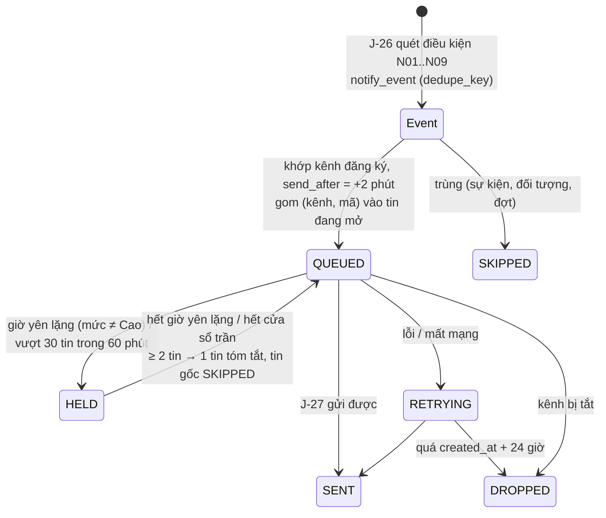

# Lát 17 — Thông báo Telegram / Zalo (M17) — Giải thích nghiệp vụ

| Trường | Giá trị |
|---|---|
| Item / lát | `03-expansion-tiktok` · lát 17 (milestone M17, [03-plan §4](../../ai/items/03-expansion-tiktok/03-plan.md)) |
| Yêu cầu | FR-06.04, 06.07..06.11; BR-36; §7.4, §7.5 N01..N10; EX-N1..N4; NFR-39, NFR-43, NFR-45; AC-54, 55 — [01-srs](../../ai/items/03-expansion-tiktok/01-srs.md) v0.5 |
| Task | BE: T-226, T-227, T-276 · FE: T-258 |
| Code | `ai-cam-be`: `1ee77f9` (T-226), `2f87688` (T-227), `5836bae` (T-276) · `ai-cam-fe`: `8802cb3` (T-258) |
| Người đọc | Dev mới vào dự án, reviewer, QA, Admin |
| Tác giả | khanhtt (agent soạn) |
| Reviewer | PO (đúng nghiệp vụ) · Tech lead (đúng code) |
| Trạng thái | Draft |
| Last update | 2026-10-07 · Dev |

## TL;DR

- Cảnh báo quan trọng (camera rớt, lệch Cao, Chỉ hoàn tiền, hồ sơ sắp hạn, shop hết hạn, ổ đầy, sao lưu lỗi, yêu cầu duyệt chờ lâu, tóm tắt 18:00) được gửi tới **kênh nhận** Telegram / Zalo OA mà Admin cấu hình trên **D22**; mỗi kênh chọn sự kiện riêng.
- Chống spam (BR-36): **bỏ trùng** theo (sự kiện, đối tượng, đợt), **gom 2 phút** thành 1 tin ≤ 10 dòng, **trần 30 tin / giờ / kênh**, **giờ yên lặng** 22:00–07:00 chỉ gửi mức Cao.
- Tin **không** chứa tên / SĐT / địa chỉ / ghi chú người mua, số tiền. Lỗi / mất mạng → thử lại giãn cách tới 24 giờ rồi "Bị bỏ". Sự kiện → tin ≤ 3 phút (NFR-43).
- Bí mật bot / OA ở **cấu hình máy chủ**, giao diện không có ô token. Hạ tầng: queue `notify` riêng, `worker-sync` / `worker-sync-long` tách đồng bộ nhanh / chậm (NFR-39).
- Bot / OA thật **chưa test — thiếu tài nguyên** (Q21): chạy trên server giả.

## 0. Giải thích đơn giản

Đây là phần **"chuông báo trong túi quần"**. Trước đây cảnh báo chỉ hiện khi có người mở dashboard: camera rớt cả buổi không ai biết, yêu cầu "Chỉ hoàn tiền" quá hạn bị sàn tự hoàn tiền, hồ sơ khiếu nại quá hạn.

**Ý tưởng chính.** Admin tạo vài "kênh" (ví dụ nhóm Telegram "Kho", người Zalo "CSKH Hoa"), mỗi kênh chọn loại sự kiện muốn nhận. Hệ thống quét mỗi 30 giây; có chuyện thì gửi tin ngắn kèm link mở đúng màn dashboard. Thông báo không thay dashboard — dashboard vẫn đầy đủ nhất.

### Bước 1 — Cấu hình kênh
- IT điền bot Telegram / ứng dụng Zalo OA trên máy chủ. Admin mở "Thông báo" → "Thêm kênh": tên "Kho", loại Telegram, Chat ID nhóm, chọn sự kiện (camera mất tín hiệu, lệch Cao, phiên hoàn hủy / bỏ dở, yêu cầu duyệt chờ lâu).
- "Gửi thử" → nhóm nhận "Tin thử từ … — kênh Kho. Bạn sẽ nhận: …" trong ≤ 10 giây. Thử lỗi thì biết ngay (ví dụ mạng kho chặn Telegram).
- Vì sao token không nhập trên giao diện: nhập trên giao diện thì token nằm trong cơ sở dữ liệu → lọt vào bản sao lưu, cần thêm mã hóa và phân quyền. Để ở cấu hình máy chủ như khóa Shopee.

### Bước 2 — 10 loại sự kiện

| Mã | Sự kiện | Mức | Kênh gợi ý |
|---|---|:---:|---|
| N01 | Camera mất tín hiệu > 60 giây (ngoài giờ yên lặng) | Cao | Kho |
| N02 | Lệch trạng thái mức Cao mới | Cao | Kho |
| N03 | Phiên mở hoàn bị hủy / bỏ dở (trừ quét nhầm); kiện hoàn chưa xác định mới | TB | Kho |
| N04 | "Chỉ hoàn tiền" mới; nhắc khi còn ≤ 12 giờ | Cao | CSKH |
| N05 | Hồ sơ khiếu nại sắp hạn (≤ 48 giờ) / quá hạn chưa gửi | Cao | CSKH |
| N06 | Shop hết hạn ủy quyền / đồng bộ lỗi > 30 phút | Cao | Quản trị |
| N07 | Ổ video ≥ 80 % (TB), ≥ 90 % (Cao) | TB / Cao | Quản trị |
| N08 | Sao lưu: DB > 26 giờ / 2 lượt liền lỗi / bằng chứng chờ > 24 giờ / lệch băm / không thấy tệp — mỗi lý do một dòng | Cao | Quản trị |
| N09 | Yêu cầu duyệt chờ > 3 phút | TB | Kho |
| N10 | Tóm tắt ngày 18:00 (số khớp D2) | Thông tin | Chủ shop |

### Bước 3 — Chống spam
- **Bỏ trùng**: một cảnh báo lệch đang mở, job quét lại 3 lần → chỉ 1 tin.
- **Gom 2 phút**: mất điện, 8 camera rớt trong 40 giây → **1 tin** "8 camera mất tín hiệu: …" (tối đa 10 dòng + "và N mục khác").
- **Trần 30 tin / giờ / kênh**: vượt → giữ lại, cuối giờ gửi 1 tin tóm tắt.
- **Giờ yên lặng** (mặc định 22:00–07:00): chỉ mức Cao gửi ngay; còn lại gom 1 tin lúc 07:00.
- Vì sao: thông báo quá nhiều thì người nhận tắt nhóm — mất luôn tin quan trọng.

### Bước 4 — Gửi và thử lại
- Lỗi / mất mạng → thử lại sau 1, 2, 4 … rồi mỗi 60 phút; quá 24 giờ → "Bị bỏ". Mất mạng 2 giờ → có mạng lại gửi bù, không mất tin.
- Camera có lại trước khi tin được gửi → vẫn gửi (đã xảy ra), dòng ghi "(đã có lại 10:03)".
- Nhật ký gửi giữ 30 ngày trên D22: thời điểm, kênh, sự kiện, số mục gom, kết quả, lỗi.
- Link trong tin mở màn dashboard tương ứng — chỉ mở được trong mạng kho / VPN.

**Ví dụ một vòng đầy đủ.** 14:00:05–14:00:40 mất điện một dãy, 8 camera rớt. 14:01:10 (đủ 60 giây) job quét thấy 8 sự kiện N01. Kênh "Kho" đăng ký N01 → 8 sự kiện gom vào một tin chờ tới 14:03:10. 14:02:30 Cam 2 Station 03 có lại. 14:03:10 nhóm Telegram "Kho" nhận **một** tin "[CAO] 8 camera mất tín hiệu: Station 01 Cam 1 (14:00), …, Station 03 Cam 2 (14:00, đã có lại 14:02) — mở: https://x.local/admin/live" (≤ 3 phút). 23:10 một phiên mở hoàn bỏ dở (N03, mức TB) → giữ tới 07:00 sáng, gửi trong tin tóm tắt. 18:00 hôm đó kênh "Chủ shop" nhận tóm tắt ngày: đã đóng gói 412, lệch mã 3, hoàn nhận 18 (2 có vấn đề), hồ sơ mở 5 / sắp hạn 1, Chỉ hoàn tiền chưa xử lý 1 — đúng số D2.

**Lưu ý.**
- Telegram có thể bị chặn ở mạng Việt Nam; Zalo OA cần OA đã xác thực, có thể tốn phí — **chưa biết** shop dùng được kênh nào (Q21). Mọi thử nghiệm chạy trên server giả.
- Danh sách kênh mặc định, giờ yên lặng, "giờ làm việc" của N01 là đề xuất, chờ chủ shop xác nhận (Q22).

## 1. Vì sao cần

P11: cảnh báo chỉ thấy khi mở dashboard → camera rớt cả buổi, hồ sơ quá hạn, "Chỉ hoàn tiền" bị sàn tự hoàn tiền. RK-21: thông báo quá nhiều → người nhận tắt nhóm. RK-22: Telegram bị chặn / Zalo tốn phí → cần hai kênh qua một lớp chung. NFR-39: đồng bộ chậm của một shop không được giữ slot của việc khác.

| Lát này làm (Goals) | Lát này không làm (Non-goals — ở đâu) |
|---|---|
| `notify`: kênh, đăng ký sự kiện, API-170..176, provider Telegram / Zalo / mock, gửi thử, token Zalo xoay vòng lưu DB mã hóa (T-226, DEC-730, 731) | Email, SMS, ZNS tính phí (DEC-412) |
| J-26 quét N01..N09, J-27 gom / trần / giờ yên lặng / thử lại, J-28 N10, dọn 30 ngày (T-227, DEC-732, 733) | Gửi theo từng người dùng hệ thống (station dùng tài khoản chung — DEC-413) |
| Queue `sync_fast` / `sync` / `notify`, `worker-sync-long`, `worker-notify`, test 6 shop (T-276, DEC-734) | Tin "đã hết" riêng (EX-N4 — chỉ ghi "(đã có lại …)") |
| D22: kênh, dialog, gửi thử, xóa, giờ yên lặng, nhật ký (T-258, DEC-760..763) | Ô token bot / OA trên giao diện (DEC-408, 760) |

## 2. Ai dùng, ở đâu, khi nào

| Vai | Màn hình / điểm vào | Lúc nào dùng |
|---|---|---|
| IT / ops | `.env`: `NOTIFY_TRANSPORT`, `TELEGRAM_BOT_TOKEN`, `ZALO_APP_ID`, `ZALO_APP_SECRET`, `ZALO_OA_REFRESH_TOKEN`, `SITE_ADDRESS` | Cài đặt |
| Admin | D22 Thông báo: thêm / sửa / xóa kênh, gửi thử, giờ yên lặng, nhật ký gửi | Cấu hình; khi kênh báo lỗi |
| Người nhận (nhóm Kho, CSKH, Quản trị, Chủ shop) | Telegram / Zalo | Trong ngày |
| Job | J-26 mỗi 30 giây, J-27 mỗi 15 giây, J-28 18:00 giờ VN (`worker-notify -c 1`) | Chạy nền |

## 3. Tình huống thực tế

| # | Tình huống | Hệ thống làm gì | Vì sao |
|---|---|---|---|
| 1 | Chưa cấu hình bot Telegram trên máy chủ | D22 Alert "Chưa cấu hình bot Telegram trên máy chủ. Liên hệ IT."; không thêm kênh loại đó; API 409 `PROVIDER_NOT_CONFIGURED` | EX-N1 |
| 2 | Gửi thử Telegram, mạng kho chặn | 504 + "Lỗi gửi …"; kênh `last_error {code, message, at, provider_code}` | Phát hiện sớm (RK-22) |
| 3 | Zalo người nhận chưa quan tâm OA / hết hạn tương tác | Nhật ký "Lỗi": "Người nhận chưa quan tâm OA của shop." / "…hết hạn tương tác." | EX-N2 |
| 4 | Token Zalo hết hạn, 2 tin gửi song song | Khóa Redis `zalo:token`, làm mới **một lần**, ghi token mới (mã hóa) bằng session riêng commit ngay | Refresh token dùng một lần |
| 5 | Cảnh báo lệch Cao mở, J-26 chạy 3 lần | 1 tin | Bỏ trùng `dedupe_key` |
| 6 | 40 sự kiện / giờ một kênh | 30 tin + 1 tin tóm tắt cuối giờ | BR-36 (3) |
| 7 | 23:10 sự kiện TB | Giữ `HELD`, 07:00 gửi tóm tắt; sự kiện Cao gửi ngay | BR-36 (4) |
| 8 | Mất mạng 2 giờ | Gửi bù khi có mạng; quá 24 giờ → `DROPPED` | NFR-43, FR-06.10 |
| 9 | Kênh bị tắt khi còn tin chờ | Tin `DROPPED` "Kênh đã tắt — tin bị bỏ." | DEC-733 (4) |
| 10 | Xóa kênh | Xóa kênh + mọi tin (CASCADE); số tin chờ bị bỏ ghi vào audit `NOTIFY_CHANNEL_DELETE.dropped_messages` | DEC-731 |
| 11 | Phiên hoàn hủy vì quét nhầm | Không N03 | BR-39 (`dropped_return_filter`) |
| 12 | N08 có 2 lý do cùng lúc | 1 tin, mỗi lý do 1 dòng | 01 §7.5 v0.4 |
| 13 | Sao lưu `DISABLED` / `NOT_CONFIGURED` | Không N08 (chỉ `ON` / `KEY_CHANGED`) | D23 đã có banner riêng (DEC-657) |
| 14 | 6 shop, 1 shop luôn timeout | J-04 các shop khác đúng chu kỳ; J-06 / J-13 chậm không giữ slot J-04 | NFR-39, DEC-734 |

## 4. Luồng ví dụ từ đầu đến cuối

## 5. Quy tắc nghiệp vụ và lý do

| Quy tắc | Con số / điều kiện | Vì sao | ID |
|---|---|---|---|
| Kênh | Tên 2–40 ký tự, loại Telegram / Zalo OA, Chat ID / user ID, danh sách sự kiện, bật / tắt; chỉ Admin | Tin đi đúng nhóm | FR-06.04, §5.10 |
| Bí mật | Bot token / khóa OA ở cấu hình máy chủ; API-171 / 172 không có trường bí mật; token Zalo đang dùng lưu DB mã hóa (`notify_provider_token`) — ngoại lệ có chủ đích | Không lọt vào bản sao / giao diện | DEC-408, 445, 760 |
| Bỏ trùng | (sự kiện, đối tượng, đợt) — ví dụ N01 `cam:{id}:{last_seen_at}`; mọi điều kiện nhìn lại ≤ 24 giờ | Một sự việc một tin | BR-36 (1), DEC-473 |
| Gom | Cùng (kênh, mã) trong 2 phút → 1 tin, ≤ 10 dòng + "và N mục khác"; mức tin = mức cao nhất | Bão sự kiện → 1 tin | BR-36 (2), EX-N3 |
| Trần | 30 tin / 60 phút / kênh; vượt → `HELD`, cuối cửa sổ gửi 1 tin tóm tắt | Không làm người nhận tắt nhóm | BR-36 (3), DEC-472 |
| Giờ yên lặng | Mặc định 22:00–07:00 (Admin đổi được); chỉ mức Cao gửi ngay | Không đánh thức vì việc chờ được | BR-36 (4) |
| N01 "giờ làm việc" | = ngoài giờ yên lặng; tắt giờ yên lặng → mọi lúc | Không cần cấu hình ca riêng | DEC-444, Q22 |
| Nội dung | Mức, tên sự kiện, mã kiện / hồ sơ, sàn + shop, thời điểm, link; **không** tên / SĐT / địa chỉ / ghi chú người mua, lý do khách viết tay, số tiền | Riêng tư (NĐ 13) | FR-06.09, NFR-45 |
| Thử lại | 1, 2, 4, … 60 phút (theo `retry_after` của Telegram nếu lớn hơn); lần cuối đúng `created_at + 24 giờ` | Không mất tin khi mất mạng ngắn | FR-06.10, NFR-43 |
| Độ trễ | Sự kiện → tin ≤ 3 phút p95 (gồm cửa sổ gom 2 phút); `occurred_at` = lúc J-26 phát hiện | NFR-43 | NFR-43, DEC-733 (1) |
| N04 | Mới: `coalesce(reported_at, created_at)` ≤ 24 giờ; nhắc 1 lần khi hạn trong (now − 24 giờ, now + 12 giờ] | Kịp phản đối trước khi sàn tự hoàn tiền | BR-40, DEC-733 |
| N05 | Sắp hạn: hạn trong [now, now + 48 giờ]; quá hạn: (now − 24 giờ, now) | BR-42 | FR-08.10 |
| N06 | `EXPIRED` (dedupe theo `last_error.at`) hoặc lỗi `error_since` > 30 phút; bỏ shop `DISCONNECTED` | Shop bị ngắt chủ động không phải sự cố | FR-05.14 |
| N10 | 18:00 giờ VN, số = D2 | Một nguồn số liệu | FR-06.11 |
| Queue | `sync_fast` (J-04, J-05, J-12 — `worker-sync -c 3`), `sync` (J-06, J-13 — `worker-sync-long -c 2`), `notify` (`worker-notify -c 1`); prefetch 1, `acks_late` | Việc dài không giữ slot việc nhanh | NFR-39, DEC-734 |
| Nhật ký | Giữ 30 ngày | FR-06.10 | DEC-473 |

## 6. Điểm dễ hiểu nhầm

- **N01 "mất tín hiệu từ lúc nào"?** J-08 nay ghi `camera.last_seen_at` ở **cả hai** chiều (lúc có lại và lúc mất) → N01 = `OFFLINE` ∧ `last_seen_at < now − 60 giây`. Hệ quả: API-81 `cameras[].last_seen_at` của camera đang mất = lúc mất (DEC-732).
- **Tin thử có vào nhật ký?** Không — nhật ký chỉ tin sự kiện; tin thử ghi audit `NOTIFY_TEST` (DEC-730 (5)).
- **`NOTIFY_TRANSPORT=mock` ở dev** → cả Telegram lẫn Zalo coi như đã cấu hình để D22 thử được; production cấm mock.
- **Link trong tin bấm ngoài kho không mở được** — đúng (AS-16): dashboard chỉ trong mạng kho / VPN; tin vẫn đủ thông tin chính.
- **`last_error` của kênh** là object `{code, message, at, provider_code}` (đã chốt ở 02 §6.2 API-170 — DEC-730, 802), không còn dạng chuỗi.
- **Compose `worker-sync` đổi queue**: message J-04 cũ còn trong queue `sync` vẫn được `worker-sync-long` chạy khi nâng cấp (DEC-734 (3)).

## 7. Bản đồ nghiệp vụ → code

Đường dẫn BE tính từ `ai-cam-be/src/aicam/`, test BE từ `ai-cam-be/tests/`. FE từ `ai-cam-fe/`.

| Khái niệm nghiệp vụ | Code | Test chứng minh |
|---|---|---|
| Danh mục N01..N10 | `modules/notify/catalog.py` (`EventCode` :10, định nghĩa :29–39, `label` :46) | `integration/test_notify_dispatch.py::test_conditions_n01_to_n09_dedupe` |
| Điều kiện từng sự kiện (J-26) | `modules/notify/conditions.py`: `CAMERA_OFFLINE_AFTER` :42, `REFUND_REMIND` :43, `CLAIM_SOON` :44, `SHOP_ERROR_AFTER` :45, `APPROVAL_WAIT` :46, `n01_cameras` :72 … `n09_approvals` :345, `collect` :381 | `test_notify_dispatch.py` (`test_conditions_n01_to_n09_dedupe`, `test_n07_disk_levels`, `test_n08_five_reasons_one_line_each`) |
| Gom / trần / giờ yên lặng / thử lại (J-27) | `modules/notify/dispatch.py`: `GROUP_WINDOW` :50, `GIVE_UP_AFTER` :52, `BACKOFF_MIN` :53, `KEEP_DAYS` :56, `record_events` :82, `scan` :98, `group_events` :163, `release_held` :209, `send_one` :305, `dispatch` :380, `purge` :407; `modules/notify/service.py::in_quiet` :95, `quiet_end_after` :106 | `test_notify_dispatch.py` (`test_open_alert_rerun_three_times_one_message`, `test_storm_8_cameras_one_message`, `test_n01_recovered_before_send`, `test_rate_limit_40_per_hour`, `test_quiet_hours_hold_until_7am_high_sent`, `test_outage_2h_resent_then_24h_dropped`, `test_disabled_channel_drops_pending`, `test_nfr43_event_to_message_under_3_minutes`, `test_purge_30_days`); `unit/test_notify_config.py` (`test_in_quiet_overnight`, `test_quiet_end_after`) |
| Mẫu tin, không PII | `modules/notify/render.py` (`MAX_LINES` :19, `item_line` :77, `_n08_lines` :117, `render` :161) | `unit/test_notify_render.py` (`test_max_10_lines_and_more`, `test_whitelist_drops_buyer_data_and_no_site_no_link`); `test_notify_dispatch.py::test_routing_template_no_pii` |
| Tóm tắt 18:00 (J-28) | `modules/notify/summary.py` (`draft` :29, `daily_summary` :38); lịch `workers/celery_app.py` (`crontab(hour=11)` UTC = 18:00 VN) | `test_notify_dispatch.py::test_daily_summary_matches_d2` |
| Kênh, gửi thử, giờ yên lặng (API-170..176) | `modules/notify/service.py` (`list_channels` :227, `create_channel` :247, `update_channel` :274, `delete_channel` :310, `test_send` :337, `list_messages` :381, `update_quiet_hours` :442) | `integration/test_notify_api.py` (`test_crud_and_list`, `test_admin_only`, `test_provider_not_configured`, `test_test_send_mock_ok_and_fail`, `test_test_send_telegram_fake_server`, `test_quiet_hours`, `test_messages_log_and_delete`) |
| Provider Telegram / Zalo / mock | `modules/notify/providers/telegram.py::TelegramProvider` :28, `modules/notify/providers/zalo.py` (`LOCK_KEY` :38, mã lỗi :43–45), `providers/mock.py`, `providers/__init__.py::get_provider` :33 | `integration/test_notify_providers.py` (`test_telegram_rate_limit_and_token_errors`, `test_zalo_first_send_refreshes_and_stores_encrypted`, `test_zalo_errors`, `test_zalo_concurrent_refresh_uses_refresh_token_once`); `unit/test_notify_config.py::test_production_rejects_mock_transport` |
| Queue / worker (NFR-39) | `workers/celery_app.py` (`task_routes`, `notify.*` → `notify`), `modules/platforms/dispatch.py` (`QUEUE_FAST` :37, `QUEUE_LONG` :38); `docker/compose.dev.yml`, `docker/compose.yml` | `integration/test_queue_nfr39.py` (`test_routes_have_workers`, `test_six_shops_one_always_timeout_real_tasks`, `test_one_hour_fake_clock_six_shops_one_timeout`) |
| D22 FE | `src/features/notify/NotificationsPage.tsx`, `ChannelTable.tsx` :119, `ChannelDialog.tsx` :27, `DeleteChannelDialog.tsx` :14, `QuietHours.tsx` (`QuietHoursCard` :92), `MessageLog.tsx` :52 | `src/features/notify/NotificationsPage.test.tsx`; `e2e/mock/notify.spec.ts`; `e2e/real/phase3-m17-notify.spec.ts` (**chưa chạy**) |

## 8. Giới hạn hiện tại và giả định

| Giới hạn / giả định | Ảnh hưởng | Khi nào xử lý |
|---|---|---|
| **Chưa test — thiếu tài nguyên (R8, TC-X3.08)**: bot Telegram thật từ mạng kho (RK-22) | Có thể bị chặn — cần Zalo | Q21 |
| **Chưa test — thiếu tài nguyên (R9, TC-X3.09)**: Zalo OA thật — gửi, token xoay vòng, người chưa quan tâm OA; mã lỗi `-216` / `-213` / `-230` là giả định | Chữ lỗi có thể sai | Q21 |
| Q21: shop dùng Telegram hay Zalo, có OA xác thực / chấp nhận phí không — **chặn go-live thông báo** (≥ 1 kênh chạy được) | — | Chủ shop, IT |
| Q22: kênh mặc định, giờ yên lặng, "giờ làm việc" N01 | Cấu hình được | Chủ shop |
| Compose `worker-sync-long`, `worker-notify`: **chỉ sửa file**, stack dev đang chạy chưa áp dụng (DEC-734) | QA live cần dựng lại stack | T-229 |
| NFR-39 kiểm bằng mô phỏng (đồng hồ giả, task thật 6 shop), chưa đo 1 giờ trên server kho | — | Go-live |
| E2E BE thật `phase3-m17-notify.spec.ts` **chưa chạy** | D22 mới kiểm trên MSW | T-229 / bước 11 |
| Chữ D22 mới chưa có trong 01 (DEC-761) | PO cần soát | Review G3 |

## Liên kết

- SRS: [01-srs.md](../../ai/items/03-expansion-tiktok/01-srs.md) v0.5: §4.5, §7.4, §7.5, BR-36, UC-18 / 19, EX-N1..N4, AC-54, 55, NFR-43, Q21, Q22, DEC-412, 413
- Spec: [02 §6.2](../../ai/items/03-expansion-tiktok/02-tech-spec.md) API-170..176 · [02a §7.5](../../ai/items/03-expansion-tiktok/02a-be-spec.md), DEC-472, 473, 730..734 · [02b-admin](../../ai/items/03-expansion-tiktok/02b-fe-spec-admin.md) D22, DEC-760..763
- Test cases: `04` §M06, TC-X3.08, 09
- Lát trước: [lat-16-link-chia-se.md](lat-16-link-chia-se.md) · Lát sau: [lat-18-hoan-thien.md](lat-18-hoan-thien.md)
