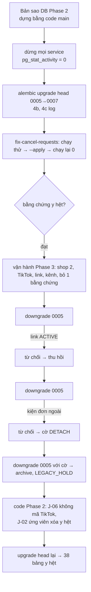

# Lát 18 — Hoàn thiện: quyền, che log, nâng cấp / lùi (M18) — Giải thích nghiệp vụ

| Trường | Giá trị |
|---|---|
| Item / lát | `03-expansion-tiktok` · lát 18 (milestone M18, [03-plan §4](../../ai/items/03-expansion-tiktok/03-plan.md)) |
| Yêu cầu | FR-10.02 (ma trận §5.10), FR-10.03 (audit); NFR-41, NFR-42; 02 §10 rollout / rollback; AC-60, AC-61 — [01-srs](../../ai/items/03-expansion-tiktok/01-srs.md) v0.5 |
| Task | BE: T-228, T-280, T-230 (✅) · T-229 QA live (⬜ **chưa làm**) · FE: T-262 |
| Code | `ai-cam-be`: `8f4608c` (T-228), `d29fb52` (T-280), `edc575c` (T-230) · `ai-cam-fe`: `723d387`, `f3efd90`, `e2f5739`, `b85d19d` (T-262) · Bằng chứng: `docs/ai/items/03-expansion-tiktok/evidence/m18-upgrade-rollback.txt` |
| Người đọc | Dev mới vào dự án, reviewer, QA, IT / ops |
| Tác giả | khanhtt (agent soạn) |
| Reviewer | PO (đúng nghiệp vụ) · Tech lead (đúng code) |
| Trạng thái | Draft |
| Last update | 2026-10-07 · Dev |

## TL;DR

- **Quyền 4 vai** cho 29 API Phase 3 được test tự động (403 đúng vai, 401 khi không đăng nhập); thêm 5 quyền còn thiếu (`reports.*`, `backup.*`). Mỗi hành động Phase 3 có đúng một mã audit, D10 lọc được bằng nhãn tiếng Việt.
- **Che log theo giá trị**: mọi bí mật đang đặt (khóa sao lưu cũ / mới, bot token, khóa TikTok / Zalo / S3, JWT, Fernet) bị thay bằng "[secret đã che]" ở **mọi** dòng log, kể cả traceback và thông báo lỗi khởi động; token link `share/…` bị che. Phát hiện và vá: worker Celery trước đây **không** qua bộ che; lỗi cấu hình in cả bot token.
- **NFR-41 / NFR-42** kiểm trên MinIO tạm: tải thẳng 5 đối tượng sao lưu → không mở / phát được, khóa không có ở bất kỳ đâu; link đổi 1 ký tự → không mở, không liệt kê được, thu hồi < 60 giây.
- **Diễn tập nâng cấp / lùi** Phase 2 ⇄ 3 trên bản sao DB Phase 2 bằng **code Phase 2 thật**: ĐẠT, bằng chứng không mất / không đổi ở mọi bước. Phát hiện compose production thiếu biến Phase 3 (sao lưu / link / TikTok sẽ luôn "chưa cấu hình" ở kho) → đã thêm.
- **Chưa xong**: QA live M11..M18 (T-229) và E2E BE thật Phase 3 (15 ca viết xong, **chưa chạy**); 16 hạng mục **chưa test — thiếu tài nguyên** (R1..R16, §8).

## 0. Giải thích đơn giản

Đây là phần **"kiểm tra khóa cửa, camera an ninh và lối thoát hiểm trước khi khai trương"**. Các lát trước làm tính năng; lát này trả lời: ai được làm gì, nhật ký có làm lộ chìa khóa không, bản sao trên cloud có thật sự vô dụng với người lạ không, và nâng cấp kho đang chạy — lỡ có sự cố thì quay về bản cũ có mất video không.

### Việc 1 — Đúng người, đúng việc
- Bảng quyền: CSKH xem được báo cáo hàng hoàn / khiếu nại nhưng **không** xem năng suất; CSKH tạo / thu hồi link của mình nhưng không thu hồi link của người khác; chỉ Admin cấu hình thông báo, sao lưu, kết nối sàn; chỉ Admin / Supervisor gỡ lý do hủy phiên.
- Một bài test thử **4 vai × 29 API mới**: đúng vai → được, sai vai → 403, chưa đăng nhập → 401. Giao diện ẩn nút theo đúng quyền máy chủ trả về.
- Mỗi hành động quan trọng (kết nối / ngắt shop, tạo / thu hồi link, gửi thử thông báo, xác nhận khóa sao lưu, xuất CSV, bỏ bằng chứng, quyết định hủy phiên hoàn…) ghi một dòng nhật ký có người, đối tượng, dữ liệu.

### Việc 2 — Nhật ký không làm lộ bí mật
- Phase 3 thêm nhiều bí mật: khóa sao lưu, khóa TikTok, khóa kho lưu, bot Telegram, Zalo.
- Cách che cũ: che theo **tên trường** ("token", "secret"). Lỗ hổng: bí mật nằm trong một câu thông báo lỗi, trong đường dẫn URL, trong traceback thì lọt.
- Cách mới: lúc khởi động, hệ thống ghi nhớ **giá trị** của mọi bí mật đang đặt; bất kỳ dòng log nào chứa giá trị đó đều bị thay bằng "[secret đã che]".
- Khi rà, phát hiện: các tiến trình nền (worker) chưa từng đi qua bộ che; và khi cấu hình sai, thông báo lỗi khởi động in **nguyên văn** bot token. Đã vá cả hai.

### Việc 3 — Bản sao trên cloud thật sự vô dụng với người lạ
- Tải thẳng 5 tệp bất kỳ từ kho lưu (bản DB, file nhập, 2 clip, 1 ảnh): không mở / phát được khi không có khóa; có khóa thì đọc được (đối chứng).
- Tìm khóa (dạng base64, hex, byte thô) trong: tệp trên cloud, siêu dữ liệu, bản DB đã giải mã, mọi bảng DB, log, phản hồi API → không thấy.
- Khóa của ứng dụng không xóa được phiên bản cũ, không tắt được "phiên bản", không xóa được quy tắc tự xóa.
- Link chia sẻ: đổi 1 ký tự → không mở; không liệt kê được thư mục; thu hồi → mất trong < 60 giây.

### Việc 4 — Nâng cấp kho đang chạy, và lùi về nếu cần
- Hướng dẫn vận hành có đủ thứ tự: sao lưu → dừng mọi tiến trình (kiểm còn 0 kết nối vào DB) → nâng cấp → chạy lệnh trả lại kiện hủy oan (chạy thử, áp dụng, chạy lại) → bật dần từng tính năng.
- Lùi về: **dùng bản mới để hạ cơ sở dữ liệu trước**, rồi mới đổi sang bản cũ. Còn link đang mở hoặc kiện của đơn TikTok → hệ thống **từ chối** lùi và nói lý do; ops quyết có bật cờ cho phép hay không.
- Diễn tập dùng chính code Phase 2 (không giả lập): dựng dữ liệu Phase 2 thật, chép bản sao, nâng cấp, vận hành Phase 3, lùi, chạy job dọn video và đồng bộ của Phase 2 trên dữ liệu đã lùi, rồi nâng cấp lại — 38 bảng y hệt.

**Ví dụ một vòng đầy đủ** (biên bản `m18-upgrade-rollback.txt`, 27 giây trên máy dev). Bản sao DB Phase 2 có 43 kiện, 23 clip, 3 hồ sơ; 3 kiện bị Phase 2 hủy (2 kiện vì "người mua đang xin hủy", 1 kiện hủy thật). Nâng cấp 0,8 giây; log báo 2 kiện có thể hủy oan và 1 phiên "Cần soát". Chạy thử lệnh trả lại: in đúng 2 kiện, không ghi gì; áp dụng: SPXTST0000019 về "Mới", SPXTST0000020 về "Đã đóng gói", kiện hủy thật giữ nguyên; chạy lại: 0 kiện. Clip, ảnh, phiên y hệt trước nâng cấp; hồ sơ KN-000001 chỉ tăng số phiên bản. Thêm shop Shopee thứ hai, shop TikTok, 1 link, 1 kênh, bỏ 1 bằng chứng. Lùi lần 1: từ chối vì còn link → thu hồi; lần 2: từ chối vì 44 kiện của đơn ngoài → bật cờ tách kiện → lùi được. Code Phase 2 chạy đồng bộ: không gửi mã đơn TikTok lên Shopee; chạy dọn video: danh sách xóa y hệt trước nâng cấp. Nâng cấp lại: 38 bảng y hệt trước khi lùi.

**Lưu ý.**
- Kiểm tra end-to-end trên stack dev (QA live) và các E2E với máy chủ thật **chưa chạy**.
- Diễn tập trên Postgres tạm 43 kiện, **không** có tệp video, **không** qua image `docker compose run migrate`; bản sao DB production thật **chưa có**.

## 1. Vì sao cần

Phase 3 thêm 29 API, nhiều vai mới quyền khác nhau (§5.10), nhiều bí mật mới (DEC-408), và một lần nâng cấp chạm 0006 / 0007 phức tạp (RB-36..38). Thiếu lát này: quyền FE ≠ quyền server (`/me` thiếu 5 quyền — đã gặp), bí mật lộ qua log worker / lỗi khởi động (đã gặp), compose production không truyền biến Phase 3 → ở kho sao lưu / link / TikTok luôn "chưa cấu hình" dù `.env` đã điền (đã gặp).

| Lát này làm (Goals) | Lát này không làm (Non-goals — ở đâu) |
|---|---|
| Quyền API-04 `/me`, action API-92 + nhãn D10, che log Phase 3, contract + snapshot OpenAPI mọi API Phase 3 (T-228, DEC-780, 781) | Metric Prometheus (repo chưa có — DEC-660 (4)) |
| `test_backup_security_nfr41`, NFR-42 trên MinIO, schema guard J-23 trên `alembic_version` thật; bảng R1..R16 cho `04` (T-280, DEC-782) | Nhà cung cấp S3 thật / object lock (Q20) |
| Diễn tập nâng cấp / lùi bằng code Phase 2 thật + `fix-cancel-requests`; ops §7.2 / §8 / §10 / §11; `.env.production.example`; compose production thêm biến (T-230, DEC-783, 784) | Bản sao DB production thật (R16) |
| Test component / integration admin + E2E mock 5 bộ + E2E BE thật Phase 3 theo milestone (T-262, DEC-800..804) | Chạy E2E BE thật (chờ dựng lại stack) |
| — | QA live M11..M18 + `seed-demo` Phase 3 (T-229 ⬜) |

## 2. Ai dùng, ở đâu, khi nào

| Vai | Điểm vào | Lúc nào dùng |
|---|---|---|
| Mọi vai | `/me` (API-04) → FE ẩn / hiện màn, nút | Mỗi lần đăng nhập |
| Admin | D10 Nhật ký thao tác (nhãn tiếng Việt cho action Phase 3) | Tra ai làm gì |
| IT / ops | `ai-cam-be/docs/ops.md` §7.2 (nâng cấp / lùi), §8 (log Phase 3), §10 (sự cố Phase 3), §11 (checklist bí mật); `docker/.env.production.example` | Nâng cấp, sự cố |
| Dev / QA | `uv run pytest` (authz, redaction, contract, NFR-41 / 42 cần MinIO tạm); `scripts/upgrade_drill.py`; `pnpm e2e` cờ `E2E_M1x_BE` | Trước G3 / G4 |

## 3. Tình huống thực tế

| # | Tình huống | Hệ thống làm gì | Vì sao |
|---|---|---|---|
| 1 | CSKH gọi API-152 năng suất / API-170 thông báo / API-180 sao lưu | 403 | §5.10 |
| 2 | SUPERVISOR có `backup.read` trên `/me` | Chỉ để FE hiện tóm tắt API-81 (D8); mọi `/backup*` vẫn chỉ Admin | 02 §8 vs §6.1 — giữ cả hai (DEC-780) |
| 3 | Lỗi validator `Settings` khi khởi động có bot token sai định dạng | Thông báo lỗi không kèm dữ liệu đầu vào (`hide_input_in_errors`), trường secret `repr=False` | DEC-781 (2) |
| 4 | Traceback chứa khóa sao lưu | Bị che (format traceback trước khi che) | DEC-781 (5) |
| 5 | Log có `share/AbCd…43 ký tự/index.html` | `share/[token đã che]` | NFR-42 |
| 6 | Compose production thiếu `S3_*`, `BACKUP_*`, `TIKTOK_*` | Đã thêm vào `x-app`; test `test_compose_phase3_env` giữ không quên | DEC-783 (1) |
| 7 | Cờ `AICAM_DOWNGRADE_*` để trong `.env` | Không — chỉ qua `dc run -e` | Tránh lần lùi sau vô tình tách kiện (DEC-783 (1)) |
| 8 | `fix-cancel-requests` bằng `dc run api` | Dùng `dc run --rm migrate aicam …` | `dc run api` kéo theo service phụ thuộc khi đang dừng (DEC-783 (3)) |
| 9 | Lùi khi đã thêm shop Shopee thứ 2 | Phase 2 giữ shop kết nối **gần nhất**; mọi kiện của shop gốc bị tách (42 / 42) | Đúng thiết kế DEC-509 nhưng dễ bất ngờ → ops: ngắt shop mới trước khi lùi (DEC-784 (3)) |
| 10 | Nâng cấp lại log `UNKNOWN` cho `AWAITING_SHIPMENT`, `IN_TRANSIT` | Bình thường — nhóm gốc khôi phục từ archive ngay sau | DEC-784 (2) |
| 11 | Image Phase 2 chạy trên DB 0007 | `Can't locate revision '0007'`, `api` không lên | Thứ tự lùi bắt buộc |

## 4. Luồng ví dụ từ đầu đến cuối

## 5. Quy tắc nghiệp vụ và lý do

| Quy tắc | Con số / điều kiện | Vì sao | ID |
|---|---|---|---|
| Quyền mới | `reports.returns`, `reports.claims` (Admin / Supervisor / CSKH), `reports.productivity` (Admin / Supervisor), `backup.manage` (Admin), `backup.read` (Admin / Supervisor) | Quyền FE = quyền server | FR-10.02, DEC-780 |
| Ma trận | 4 vai × 29 API Phase 3: đúng vai 2xx / sai 403 / không token 401 | AC-60 | FR-10.02 |
| Audit | 25 action Phase 3 đăng ký ở API-92; quét AST mọi `audit.record` dùng hằng hợp lệ; mỗi action có chỗ ghi | AC-61 — không action "mồ côi" | FR-10.03 |
| Che log | Theo tên khóa (`pass`, `secret`, `token`, `authorization`, `cookie`, `key`), theo query (`app_secret`, `auth_code`…), đường dẫn bot Telegram, `share/{token}`, JSON `access_token`…, **và theo giá trị** mọi secret đang đặt; áp cho api, worker, beat, stdlib | NFR-41 — khóa không có trong log | DEC-781 |
| NFR-41 | 5 đối tượng tải thẳng → `AICAMENC1`, `ffprobe` / `pg_restore --list` lỗi; khóa 5 dạng không có trong byte / metadata / dump SQL giải mã / mọi bảng / log / API-180, 182 | Mất bucket không lộ dữ liệu | NFR-41, DEC-782 |
| NFR-42 | Token 256 bit, 1.000 token không trùng; đổi 1 ký tự → 403 / 404; không liệt kê; thu hồi `NoSuchKey` < 60 giây | Link không đoán / lộ | NFR-42 |
| Nâng cấp | Dừng mọi service; `pg_stat_activity` = 0; một transaction, `lock_timeout` 5 giây; ~22 giây / 1 triệu đơn (máy dev) → ngoài giờ | Không để image cũ ghi theo luật cũ lên schema mới | 02 §10, ops §7.2 |
| Lùi | Image Phase 3 downgrade **trước**, đổi image **sau**; từ chối khi: mã trùng giữa shop (không lùi được — sửa tiến), link sống, kiện đơn ngoài, kiểm tập con bằng chứng thiếu | Không mất bằng chứng; Phase 2 không chạy J-20..J-28 | DEC-475, 509, ops §7.2 |
| Bật dần | Hardening + báo cáo chạy ngay; shop 2, TikTok, sao lưu + link, thông báo bật theo biến `.env` | Một thay đổi một lần, dễ khoanh lỗi | 02 §10 bước 5 |

## 6. Điểm dễ hiểu nhầm

- **"Đã có test quyền" có nghĩa giao diện đúng quyền?** Test BE chứng minh server chặn đúng. FE ẩn nút theo `/me`; phần UI theo vai kiểm ở test component và E2E (E2E BE thật **chưa chạy**).
- **Che log theo giá trị có chậm không?** Chỉ thay chuỗi trong dòng log; danh sách giá trị đăng ký lúc khởi động (`register_secrets`).
- **Không thêm `DeleteObject` thường vào danh sách cấm của khóa ứng dụng?** Đúng — J-23 / J-25 cần xóa (versioning giữ bản cũ 7 ngày). Chỉ cấm xóa **phiên bản**, tắt versioning, xóa lifecycle (DEC-782 (4)).
- **Diễn tập "ĐẠT" có nghĩa sẵn sàng go-live?** Không. Diễn tập trên dữ liệu nhỏ, không tệp video, không qua image; phải chạy lại ops §7.2 trên bản sao `pg_dump` production thật trước go-live (R16).
- **Biên bản m18 ghi "J-02 Phase 2 (giữ 5 ngày)"** — đó là tham số **của script diễn tập** (gọi thẳng `retention_clip_candidates` với 5 ngày) để thấy cơ chế "hồ sơ hệ thống đã đóng → giữ tới closed_at + số ngày" chạy; còn ghi chú hồ sơ hệ thống "giữ tới 05/01/2027" tính theo số ngày giữ thật lúc lùi (setting, sàn 60). Hai con số khác nhau là do script, không phải lỗi dữ liệu.

## 7. Bản đồ nghiệp vụ → code

Đường dẫn BE tính từ `ai-cam-be/`, FE từ `ai-cam-fe/`.

| Khái niệm nghiệp vụ | Code | Test chứng minh |
|---|---|---|
| Quyền theo vai | `src/aicam/modules/users/permissions.py` (`_SHARES` :7, `_REPORTS` :9, `backup.manage` / `backup.read` của ADMIN :35–36, khối SUPERVISOR :38, khối CSKH :59) | `tests/integration/test_phase3_authz.py` (`test_phase3_role_matrix`, `test_me_phase3_permissions_four_roles`); `tests/unit/test_audit_permissions_phase3.py` (`test_phase3_permissions_per_role`, `test_phase3_actions_registered`, `test_every_audit_call_uses_known_action`) |
| Che log | `src/aicam/core/logging.py` (`_SENSITIVE_KEYS` :11, `SENSITIVE_QUERY` :16, `_TELEGRAM_BOT_PATH` :22, `_SHARE_TOKEN_PATH` :25, `SECRET_MASK` :34, `register_secrets` :40, `redact` :107, `configure_structlog` :127); `src/aicam/core/settings.py` (`SECRET_FIELDS` :16, `hide_input_in_errors` :34, `secret_values` :190); `src/aicam/workers/celery_app.py` (`after_setup_logger` :87) | `tests/unit/test_log_redaction.py` (`test_celery_logger_signal_installs_redaction`, `test_redact_phase3_patterns`, `test_registered_secret_values_redacted_everywhere`, `test_structlog_exception_traceback_redacted`, `test_settings_hide_secrets_in_repr_and_errors`) |
| Contract mọi API Phase 3 | `tests/contract/spec.py`, `scripts/export_openapi.py` | `tests/contract/test_openapi_contract.py` (`test_phase3_apis_covered`, `test_openapi_snapshot_up_to_date`, `test_no_undocumented_api`), `tests/contract/test_runtime_contract.py` |
| NFR-41 / schema guard J-23 | `src/aicam/modules/cloud/crypto.py`, `src/aicam/modules/backup/jobs.py::prune` :855, `docs/s3-policy.example.json` | `tests/integration/test_backup_security_nfr41.py` (`test_backup_copies_useless_without_key_and_key_never_stored`, `test_j23_schema_guard_real_revision`) |
| NFR-42 | `src/aicam/modules/shares/service.py::new_object_prefix` :65 | `tests/integration/test_share_security_nfr42.py` (`test_token_256_bit_unique`, `test_link_open_tamper_list_revoke`) |
| Nâng cấp / lùi, runbook | `alembic/versions/0006_phase3_schema.py`, `0007_order_unique_per_shop.py`; `docs/ops.md` §7.2, §8, §10, §11; `docker/compose.yml`, `docker/.env.production.example`; `scripts/upgrade_drill.py`, `scripts/drill_phase2.py` | `tests/unit/test_compose_phase3_env.py` (`test_production_compose_passes_phase3_env`, `test_env_example_documents_phase3_env`, `test_production_secrets_have_no_insecure_defaults`, `test_phase3_services_in_production_compose`); `tests/integration/test_migration_0006_0007.py` (lát 11); biên bản `docs/ai/items/03-expansion-tiktok/evidence/m18-upgrade-rollback.txt` (repo gốc) |
| FE test admin + E2E | `src/mocks/` (MSW Phase 3), `e2e/mock/*.spec.ts` (44 ca), `e2e/real/phase3-m12-admin.spec.ts` … `phase3-m17-notify.spec.ts` (cờ `E2E_M12_BE` … `E2E_M17_BE`) | FE unit 769 test / 83 tệp; E2E mock 44; E2E BE thật 15 ca **chưa chạy** (DEC-804) |

## 8. Giới hạn hiện tại và giả định

**Chưa xong trong M18:**

| Hạng mục | Trạng thái | Khi nào |
|---|---|---|
| T-229 QA live M11..M18 trên stack dev (MinIO 2 bucket, mock TikTok, notify mock) + `seed-demo` Phase 3; `tests/qa/test_m11..m18_live.py` **chưa có** | ⬜ | Sau khi dựng lại stack dev (compose đã sửa file ở T-211, 218, 220, 276 nhưng chưa áp dụng) |
| E2E BE thật `e2e/real/station-phase3.spec.ts`, `phase3-m12..m17*.spec.ts` | Viết xong, **chưa chạy** | Cùng lúc T-229 |
| 02a §11 nhắc test `test_downgrade_phase2_jobs` — **không có trong code**; thay bằng diễn tập T-230 (chạy J-02 / J-06 code Phase 2) | Lệch spec ↔ code | Sửa chữ 02a §11 hoặc thêm test |

**Chưa test — thiếu tài nguyên** (02a §11, DEC-782; QA ghi ⛔ đúng TC X3, không ghi cho phần đã có test thay):

| # | Hạng mục | Thiếu gì | Đã kiểm thay | TC `04` |
|---|---|---|---|---|
| R1 | TikTok OAuth nhiều shop + redirect `x.local` | Tài khoản đối tác (Q18) | Mock 2 shop + respx | TC-X3.01 |
| R2 | TikTok chữ ký, mã lỗi, tần suất | Như R1 | Vector ký cố định, thử lại / `Retry-After` | TC-X3.02 |
| R3 | TikTok chữ trạng thái, hạn người bán, mã chiều về (Q19) | Như R1 | Fixture tài liệu công khai qua `mapping.py` thật | TC-X3.03 |
| R4 | Shopee thật nhiều shop; lùi về Phase 2 với mã đơn lạ | T-3 Shopee | Mock nhiều shop; diễn tập T-230 | TC-X3.04 |
| R5 | Kho lưu thật: URL ký 7 ngày, `text/html` inline | Nhà cung cấp (Q20) | MinIO tạm NFR-42 | TC-X3.05 |
| R6 | Versioning / lifecycle / policy / object lock | Như R5 | MinIO tạm `AccessDenied`; object lock không có | TC-X3.06 |
| R7 | Tốc độ tải thật, vùng dữ liệu (NĐ 13) | Như R5 | Token bucket MinIO | TC-X3.07 |
| R8 | Bot Telegram từ mạng kho | Bot thật (Q21) | Server giả respx | TC-X3.08 |
| R9 | Zalo OA thật | OA xác thực (Q21) | Server giả respx | TC-X3.09 |
| R10 | W1 trên điện thoại thật (NFR-46) | Thiết bị | `test_w1_render` | TC-X3.10 |
| R11 | NFR-44 quét p95 khi tải 5 GB qua Internet kho | Server + mạng kho | MinIO local + token bucket | TC-X3.11 |
| R12 | NFR-40 RTO trên máy kho | Máy kho | Diễn tập máy dev `m15-restore-drill.txt` | TC-X3.12 |
| R13 | NFR-37 báo cáo trên server kho | Server kho | `perf_reports.py` máy dev | TC-X3.13 |
| R14 | Dựng link từ camera thật 1080p trên server kho | Camera (T-4) + server | Camera giả + máy dev | TC-X3.14 |
| R15 | NFR-41 trên nhà cung cấp thật | Như R5 | `test_backup_security_nfr41` MinIO | (thuộc TC-X3.06) |
| R16 | Nâng cấp / lùi trên bản sao DB production thật | DB production | Diễn tập T-230 + `test_perf_migration_0006` | (ops §7.2) |

**Chặn go-live** (01 §13): Q13 + L14 (hạn khiếu nại thật), Q18 / Q19 (TikTok), Q20 (kho lưu + NĐ 13), Q21 (≥ 1 kênh thông báo chạy được), diễn tập khôi phục AC-50 trên máy kho, T-3 Shopee, T-4 camera.

## Liên kết

- SRS: [01-srs.md](../../ai/items/03-expansion-tiktok/01-srs.md) v0.5: §5.9, §5.10, §12, §13, AC-60, 61, NFR-41, 42
- Spec: [02 §8, §10](../../ai/items/03-expansion-tiktok/02-tech-spec.md) · [02a §11](../../ai/items/03-expansion-tiktok/02a-be-spec.md) bảng R1..R16, DEC-780..784 · [02b-admin](../../ai/items/03-expansion-tiktok/02b-fe-spec-admin.md) DEC-800..804
- Vận hành: `ai-cam-be/docs/ops.md` §6.2, §7.2, §8, §10, §11
- Test cases: `04` §3 Phân quyền, §4 Phi chức năng, §MG3, §X3
- Lát trước: [lat-17-thong-bao.md](lat-17-thong-bao.md) · Lát đầu Phase 3: [lat-11-nen-schema-bang-chung.md](lat-11-nen-schema-bang-chung.md)
